# 4

# Spring Cloud

在现代系统中，您可能会发现几个微服务相互交互。Spring Cloud 提供了易于部署的组件，这些组件简化了分布式系统的交互和协调，以应对大规模应用程序的挑战，如可扩展性、可用性、可观察性和弹性。

在本章中，您将学习如何使用 Spring Cloud 组件开发一个可扩展且具有弹性的分布式系统。您将基于前几章的学习内容，并在本 Spring Cloud 配置中配置安全和可观察性。这将帮助您有效地监控和排查您的分布式架构。到本章结束时，您将了解如何设计和开发云原生应用程序。

最后，您将学习如何部署 Spring Boot Admin，这是一个在 Spring 生态系统中被广泛使用的开源项目。该项目提供了一个用户友好的 Web 界面，使您能够集中监控和管理多个 Spring Boot 应用程序。此外，它可以轻松地与其他 Spring Cloud 组件集成。

在本章中，我们将介绍以下主要菜谱：

+   设置 Eureka Server

+   在 Eureka Server 中集成应用程序

+   扩展 RESTful API

+   设置 Spring Cloud Gateway

+   测试 Spring Cloud Gateway

+   设置 Spring Cloud Config

+   保护 Spring Cloud Gateway

+   将分布式跟踪与 Spring Cloud 集成

+   部署 Spring Boot Admin

# 技术要求

本章需要一些服务在您的计算机上运行，例如 OpenZipkin。像往常一样，在您的计算机上运行它们的最简单方法是使用 Docker。您可以从 Docker 产品页面 https://www.docker.com/products/docker-desktop/获取 Docker。我将在相应的菜谱中解释如何部署每个工具。

*设置 Spring Cloud Config*菜谱需要 Git 仓库。您可以通过免费创建 GitHub 账户来创建一个([`github.com/join`](https://github.com/join))。

您可以在此处找到本章所有菜谱的代码：[`github.com/PacktPublishing/Spring-Boot-3.0-Cookbook/tree/main/chapter4`](https://github.com/PacktPublishing/Spring-Boot-3.0-Cookbook/tree/main/chapter4).

# 设置 Eureka Server

Eureka Server 是一个服务注册中心，在微服务架构中用于注册其他应用程序可以发现的实例。这是一个非常有价值的服务，它允许服务动态地定位和相互通信。此服务注册中心对已注册服务的实例执行健康检查，自动移除不健康或不响应的实例。当服务需要与其他服务通信时，Eureka Server 提供可用的实例，允许负载均衡。

在此菜谱中，您将学习如何创建一个实现 Eureka Server 的应用程序。

## 准备工作

此菜谱没有其他额外要求。

## 如何操作...

在这个菜谱中，我们将创建一个新的 Eureka 服务器，我们将在其余的菜谱中重用它。让我们开始吧：

1.  首先，我们将为 Eureka 服务器创建一个新的应用程序。为此，打开 [`start.spring.io`](https://start.spring.io) 并使用与 *第一章* 中 “创建 RESTful API” 菜谱中相同的参数，除了更改以下选项：

    +   对于 `registry`

    +   对于 **依赖项**，选择 **Eureka Server**

1.  然后，在生成的项目中，在 `resources` 文件夹中，创建一个名为 `application.yml` 的文件，并设置以下配置：

    ```java
    server:
        port: 8761
    eureka:
        client:
            registerWithEureka: false
            fetchRegistry: false
    ```

1.  接下来，打开 `RegistryApplication` 类，并使用 `@EnableEurekaServer` 注解：

    ```java
    @EnableEurekaServer
    @SpringBootApplication
    public class RegistryApplication
    ```

1.  现在，您可以启动应用程序。

1.  让我们验证 Eureka 服务器是否正在运行。在您的浏览器中打开 `http://locahost:8761`：

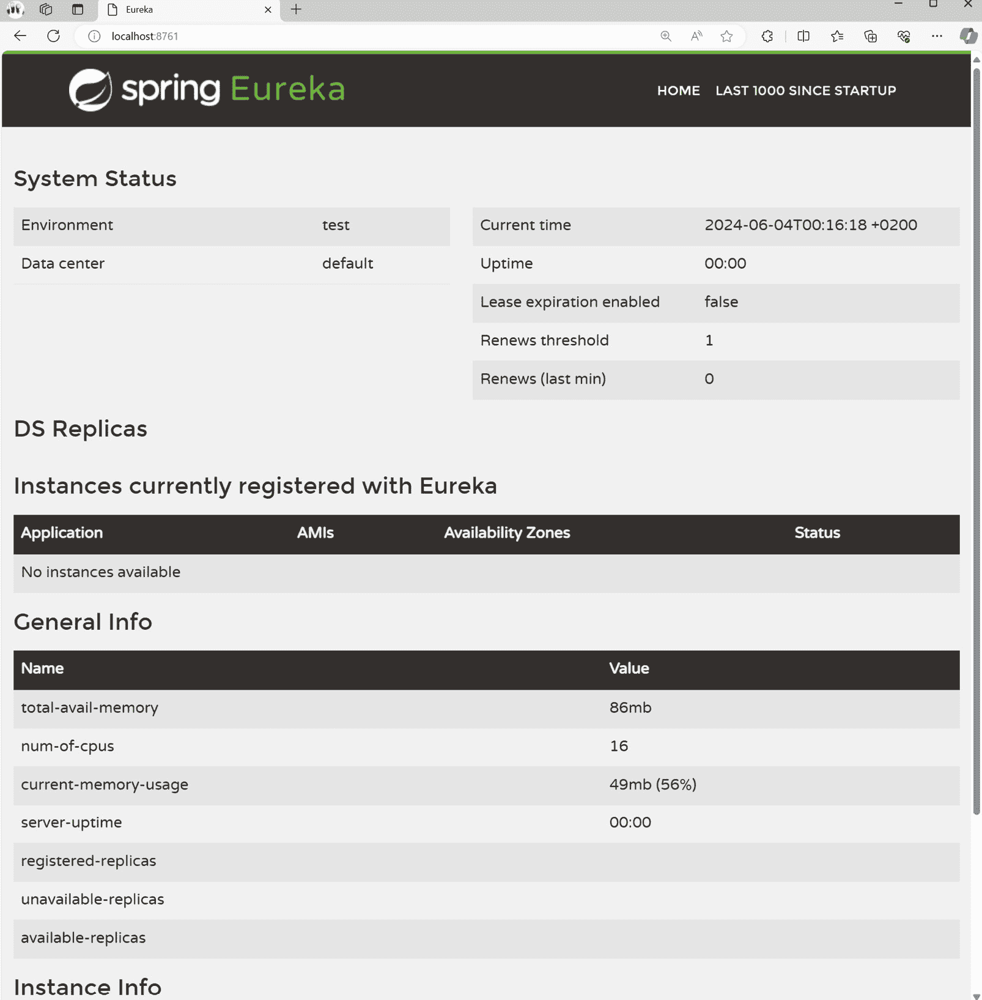

图 4.1：Eureka 服务器

在 Eureka 服务器页面上，您可以查看有关服务器的一般信息，最重要的是，注册在服务器上的应用程序。现在，我们还没有任何应用程序注册。一旦我们将以下菜谱中的应用程序连接起来，我们将在 **当前注册的实例** 下看到它们。

## 它是如何工作的...

Spring Boot 应用程序中的 Eureka 服务器依赖项允许您设置和运行服务注册。当您使用 `@EnableEurekaServer` 注解时，Eureka 服务器自动配置被激活。Eureka 服务器应用程序必须进行配置，以便它可以停止自己作为服务注册，这就是为什么 `eureka.client.registerWithEureka` 和 `eureka.client.fetchRegistry` 设置都设置为 `false` 的原因。其他必需的 Eureka 服务器配置是端口号。我们已将 Eureka 服务器配置为监听端口 `8761`。

# 在 Eureka 服务器中集成应用程序

在这个菜谱中，我们将把两个应用程序集成到之前菜谱中部署的 Eureka 服务器中。一个应用程序提供足球数据，另一个应用程序消费这些数据。我们将使用 Eureka 服务器来注册这两个应用程序，此时消费者将使用 Eureka 服务器来发现提供者应用程序。

## 准备工作

除了之前菜谱中部署的 Eureka 服务器外，我们还将重用我们在 *第一章* 中的 “定义 API 暴露的响应和数据模型” 和 “从另一个 Spring Boot 应用程序消费 RESTful API” 菜谱中创建的应用程序。

作为起点，您可以使用我在本书的存储库中准备的应用程序：[`github.com/PacktPublishing/Spring-Boot-3.0-Cookbook`](https://github.com/PacktPublishing/Spring-Boot-3.0-Cookbook)。您可以在 `chapter4/recipe4-2/start` 文件夹中找到代码。

## 如何操作...

我们将把来自 *第一章* 的 *从另一个 Spring 应用程序使用 RestClient 消费 RESTful API* 菜单中的 `football` 和 `albums` 应用程序集成到 Eureka 服务器中，该服务器我们在之前的菜谱中部署。让我们进行必要的调整：

1.  首先，我们将修改应用程序，使它们连接到 Eureka 服务器实例。我们将从 `football` 应用程序开始。进行以下更改：

    +   将以下依赖项添加到 `pom.xml` 文件中：

        ```java
        <dependency>
             <groupId>org.springframework.cloud</groupId>
             <artifactId>spring-cloud-starter-openfeign</artifactId>
        </dependency>
        <dependency>
             <groupId>org.springframework.cloud</groupId>
             <artifactId>spring-cloud-starter-netflix-eureka- client</artifactId>
        </dependency>
        ```

    +   确保在 `pom.xml` 文件中配置了 Spring Cloud 的依赖管理：

        ```java
        <dependencyManagement>
             <dependencies>
                  <dependency>
                       <groupId>org.springframework.cloud</groupId>
                       <artifactId>spring-cloud-dependencies</artifactId>
                       <version>${spring-cloud.version}</version>
                       <type>pom</type>
                       <scope>import</scope>
                  </dependency>
             </dependencies>
        </dependencyManagement>
        ```

    +   确保在 `pom.xml` 文件中定义了 `spring-cloud.version` 属性：

        ```java
        <properties>
            <java.version>21</java.version>
            <spring-cloud.version>2022.0.4</spring-cloud.version>
        </properties>
        ```

    +   在 `resources` 文件夹中，添加一个名为 `application.yml` 的文件，内容如下：

        ```java
        server:
          port: 0
        spring:
          application:
            name: FootballServer
        eureka:
          client:
            serviceUrl:
              defaultZone: http://localhost:8761/eureka/
        ```

1.  启动 `football` 应用程序。

1.  在这一点上，您将能够看到注册在 Eureka 服务器上的应用：

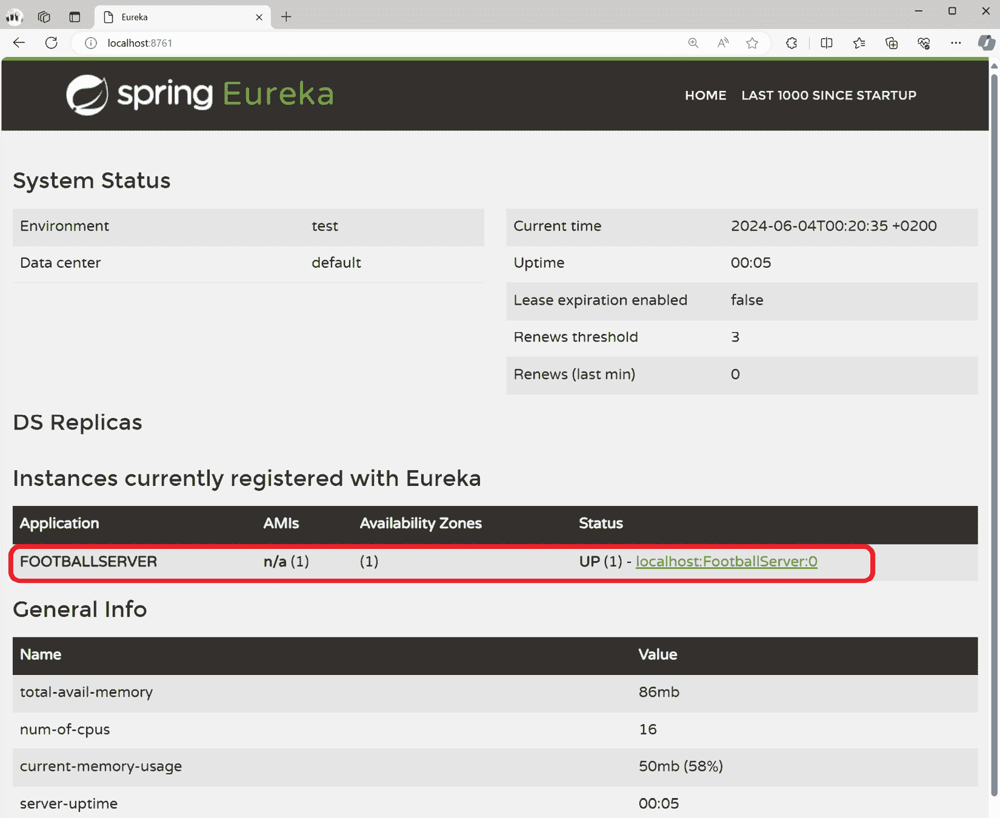

图 4.2：注册在 Eureka 服务器上的 RESTful 应用

1.  接下来，通过以下更改修改 RESTful API `albums` 消费者应用程序：

    +   将 `org.springframework.cloud:spring-cloud-starter-netflix-eureka-client` 和 `org.springframework.cloud:spring-cloud-starter-openfeign` 依赖项添加到 `pom.xml` 文件中：

        ```java
        <dependency>
             <groupId>org.springframework.cloud</groupId>
             <artifactId>spring-cloud-starter-netflix-eureka-client</artifactId>
        </dependency>
        <dependency>
             <groupId>org.springframework.cloud</groupId>
             <artifactId>spring-cloud-starter-openfeign</artifactId>
        </dependency>
        ```

    +   在 `AlbumsApplication.` 类中添加 `@EnableDiscoveryClient` 注解：

        ```java
        @EnableDiscoveryClient
        @EnableFeignClients
        @SpringBootApplication
        public class AlbumsApplication {
        ```

    +   在 `resources` 文件夹中添加一个 `application.yml` 文件，配置如下：

        ```java
        spring:
          application:
            name: AlbumsServer
        eureka:
          client:
            serviceUrl:
        FootballClient class, changing @FeignClient by setting just the target application name:

        ```

        @FeignClient("FootballServer")

        public interface FootballClient {

        @RequestMapping(method = RequestMethod.GET, value = "/players")

        List<Player> getPlayers();

        }

        ```java

        ```

    注意，我们不再使用远程 RESTful API 服务器地址，只需使用应用程序名称。

1.  现在，您可以运行 `albums` 应用程序。

1.  最后，您可以测试整个部署。为此，执行以下 `curl` 请求：

    ```java
    curl http://localhost:8080/albums/players
    ```

    消费者应用程序将通过询问 Eureka 服务器来发现服务器应用程序的可用实例，之后它将调用服务器应用程序并返回结果。

## 它是如何工作的...

要设置客户端连接到 Eureka 服务器，需要添加 `org.springframework.cloud:spring-cloud-starter-openfeign` 和 `org.springframework.cloud:spring-cloud-starter-netflix-eureka-client` 依赖项，并配置连接到 Eureka 服务器。客户端的配置包括以下内容：

+   `eureka.client.serviceUrl.defaultZone`: 这是 Eureka 服务器地址。在我们的例子中，这是 `http://localhost:8761/eureka`。

+   `spring.appication.name`: 这是用于发现服务的名称。

OpenFeign 和 Eureka 客户端使用 Eureka 服务器来发现服务的实例。记住，在 `@OpenFeignClient` 配置中，我们使用服务器应用程序名称而不是服务器地址。OpenFeign 客户端连接到 Eureka 服务器，请求已注册为该服务的实例，并返回一个。

对于客户端来说，这更为直接，因为事先知道服务器实例的地址是不必要的。

发现机制对于服务器应用程序也非常方便，因为它们不需要托管在预定义的服务器和端口上。你可能已经注意到，RESTful API 服务器被配置为 `server.port=0`，这意味着它将在一个随机端口启动。服务器地址和端口在注册到 Eureka 服务器时被存储。当消费者应用程序请求 Eureka 服务器时，它返回有关注册实例的信息——即服务器地址和端口。这个特性很有帮助，因为我们本地运行应用程序，我们不需要关心每个实例运行在哪个端口上。在之前的菜谱中，我们启动了一个在端口 `8080` 上的应用程序，另一个在 `8081` 上。在 *扩展 RESTful API 服务* 菜谱中，我们将看到可以有一个给定服务的多个实例。

## 还有更多...

Eureka 服务器的一个关键特性是检测不健康或无响应的应用程序实例，并将它们从注册表中移除。这个特性要求注册的服务使用**Actuator**。Spring Actuator 提供了生产就绪的功能，帮助你监控和管理你的 Spring 应用程序。它特别适用于微服务和其他分布式系统，在这些系统中，操作可见性和管理至关重要。你可以通过以下代码将 Actuator 依赖项包含到你的项目中：

```java
<dependency>
     <groupId>org.springframework.boot</groupId>
     <artifactId>spring-boot-starter-actuator</artifactId>
</dependency>
```

你可以在项目页面找到有关 Actuator 的更多信息：[`docs.spring.io/spring-boot/docs/current/reference/html/actuator.html`](https://docs.spring.io/spring-boot/docs/current/reference/html/actuator.html)。

# 扩展 RESTful API

扩展是一种通过为给定服务添加多个实例来提高系统可用性和容量的技术。

在现代应用程序平台中，例如 Kubernetes 这样的容器编排器或 Azure App Services 或 AWS Elastic Beanstalk 这样的云服务提供商托管平台，系统可能会自动扩展和缩减。例如，在 Kubernetes 中，你可以配置一个自动扩展规则，当过去 5 分钟的平均 CPU 使用率超过 70% 时，增加你的服务实例数量。你也可以以另一种方式配置它——当你的应用程序使用率低时，你可以缩减应用程序。这意味着你可以减少应用程序实例的数量。

扩展应用程序不一定需要自动化；你可以手动扩展它，就像我们在本菜谱中所做的那样。

扩展涉及将传入请求分配到多个服务实例。在这个菜谱中，我们将学习如何使用 Eureka 服务器的能力来注册和发现实例，以便将请求分配到可用的服务实例。

## 准备工作

在这个菜谱中，我们将使用在之前菜谱中使用的服务：

+   `**Eureka Server**`：此服务将作为服务注册表并提供服务发现

+   `**RESTful API**`：这将提供一个由客户端应用程序消费的服务

+   `**Client application**`：这将消费 RESTful API

如果你还没有完成前面的食谱，你可以在本书的 GitHub 存储库中找到完成的练习，网址为 https://github.com/PacktPublishing/Spring-Boot-3.0-Cookbook。

你可以在`chapter4/recipe4-3/start`文件夹中找到启动此食谱的代码。

## 如何做到...

我们将修改 RESTful API，使其返回服务实例的信息。这样，我们可以验证请求是否在可用的实例之间均衡。然后，我们将执行多个 RESTful API 实例。让我们开始吧：

1.  在`RESTful API`项目中的`resources`文件夹中，修改`application.yml`文件，在文件开头添加以下属性：

    ```java
      instance:
        instance-id: ${spring.application.name}:${random.int}
    ```

    文件应该看起来像这样：

    ```java
    football:
      instanceId: ${random.uuid}
    server:
      port: 0
    spring:
      application:
        name: FootballServer
    eureka:
      client:
        serviceUrl:
          defaultZone: http://localhost:8761/eureka/
      instance:
        ServiceInformationController and write the following code:

    ```

    `@RequestMapping("/serviceinfo")`

    `@RestController`

    `public class ServiceInformationController {`

    `@Value("${football.instanceId}")`

    `private String instanceId;`

    `@GetMapping`

    `public String getInstanceId() {`

    `return instanceId;`

    `}`

    `}`

    ```java

    ```

1.  执行三个 RESTful API 实例。我们不会使用`mvnw spring-boot:run`，而是构建 JAR 文件并使用 Java 运行时执行它。为此，请按照以下步骤操作：

    1.  在项目的根目录下，使用以下命令构建应用程序：

    ```java
    ./mvnw package
    ```

    1.  然后，打开三个终端，在所有终端中执行以下命令：

    ```java
    java -jar ./target/football-0.0.1-SNAPSHOT.jar
    ```

    1.  在`localhost:8761`打开 Eureka 服务器。你会看到三个 RESTful API 服务的实例：

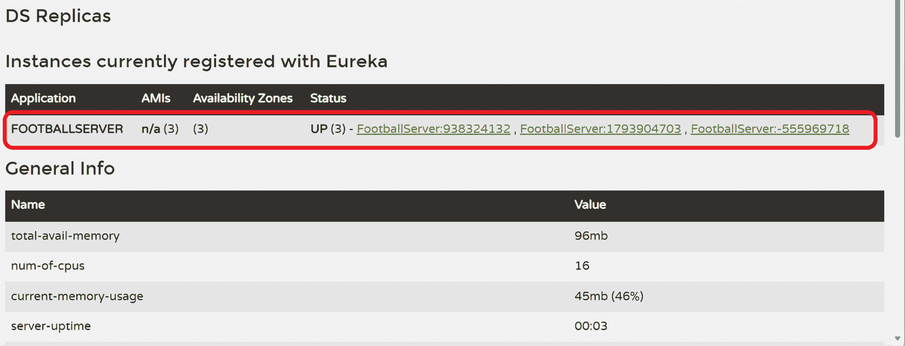

图 4.3：运行着三个 FootballServer 实例的 Eureka 服务器

1.  在客户端应用程序项目中，进行以下更改：

    +   在`FootballClient`类中，添加以下方法：

        ```java
        @RequestMapping(method = RequestMethod.GET, value="/serviceinfo")
        String getServiceInfo();
        ```

    +   在`AlbumsController`控制器中，添加以下方法：

        ```java
        @GetMapping("/serviceinfo")
        public String getServiceInfo(){
            return footballClient.getServiceInfo();
        }
        ```

1.  现在，启动客户端应用程序并多次测试应用程序。你可以通过多次执行以下`curl`请求来实现：

    ```java
    curl http://localhost:8080/albums/serviceinfo
    ```

    当你多次执行前面的命令时，你会看到结果发生变化：

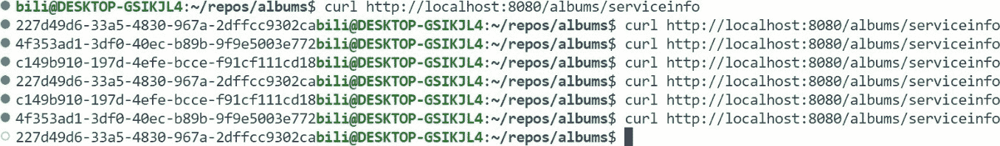

图 4.4：从客户端应用程序执行 RESTful API 的结果

客户端应用程序将请求分配到 Eureka 服务器注册的服务实例中，导致不同的结果。

## 它是如何工作的...

当 Eureka 客户端启动时，它会在 Eureka 服务器中注册自己。注册详情包括服务名称和网络位置。在注册过程之后，客户端发送心跳来通知服务器它仍然存活。在这个练习中，我们使用相同的服务名称启动了三个 RESTful API 服务器的实例；每个实例都有一个单独的网络位置。

消费者应用程序中的 Feign 客户端使用 Eureka 服务器来发现 RESTful API 服务器应用程序的可用实例。这样，它可以在服务实例之间平衡请求。

仅用于演示目的，我们添加了一个配置设置，`football.InstanceId`，具有唯一的随机值以区分服务实例。为了检索该配置，我们使用了`@Value`注解。Spring Boot 在应用程序启动时注入了该值。

# 设置 Spring Cloud Gateway

当创建具有不同服务的复杂应用程序时，我们不希望将所有这些服务暴露给消费者应用程序，以避免不必要的复杂性暴露。为了应对这种情况，我们可以使用**Spring Cloud Gateway**。Spring Cloud Gateway 可以部署成这样，它是消费者应用程序唯一可访问的组件，而其余的服务将通过内部访问或仅从 Spring Cloud Gateway 访问。这如图*图 4.5*所示：

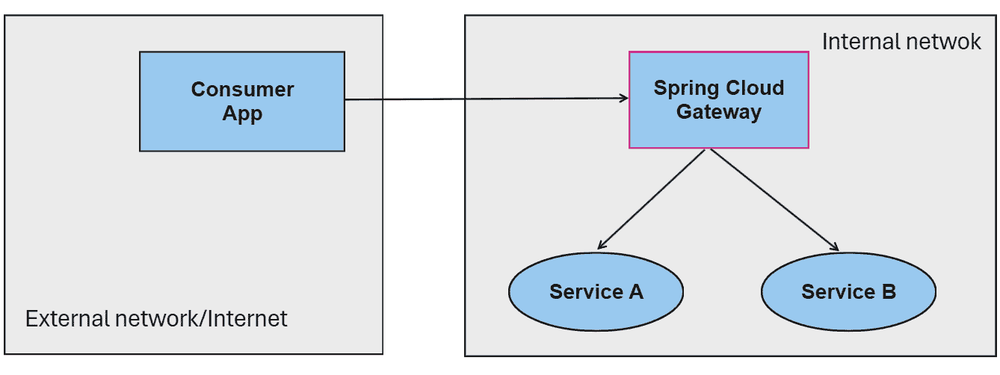

图 4.5：典型的 Spring Cloud Gateway 部署

关于部署的注意事项

根据解决方案的复杂性和要求，我建议使用额外的网络保护措施，例如第 7 层负载均衡器、**Web 应用防火墙（WAF**）或其他保护机制。为了学习目的，我将在本书中不描述它们，而是专注于 Spring 和 Spring Cloud 机制。

除了作为提供独特入口点的 API 网关的角色外，Spring Cloud Gateway 还有有趣的优点：

+   **负载均衡**: 它可以在可用的服务实例之间平衡请求。

+   **动态路由**: Spring Cloud Gateway 可以与服务注册中心，如 Eureka 服务器，集成，并动态路由请求。

+   **安全**: 它可以使用认证和授权提供者，例如 Spring Security 和 OAuth2，并将它们传播到下游服务。如果您需要为您的消费者应用程序配置 CORS，可以在一个地方完成这项操作。

+   **SSL 终止**: 您可以配置 Spring Cloud Gateway 以终止 SSL/TLS 连接并将未加密的流量传递到服务。使用此功能，您可以将 SSL/TLS 解密从服务中卸载。

+   **速率限制**: 您可以实现速率限制以防止您的服务被滥用。

+   **请求/响应转换**: 您可以使用 Spring Cloud Gateway 来转换请求和响应 – 例如，通过添加请求或响应头。您还可以将有效载荷格式，如 XML，转换为 JSON。这些转换可以在网关级别应用；因此，没有必要修改您的下游服务。

+   **断路器**：你可以使用 Spring Cloud Gateway 来实现断路器，以优雅地处理故障。例如，你可以防止请求发送到不健康的服务。

一些额外的优点包括*请求过滤*、*全局异常处理*、*日志和监控*以及*路径重写*。

我建议访问 https://spring.io/projects/spring-cloud-gateway 的项目页面以获取更多详细信息。

在这个食谱中，我们将部署 Spring Cloud Gateway 的一个实例，并将其与我们在前面的食谱中部署的 Eureka 服务器集成，以将请求路由到已注册的服务。

## 准备工作

在这个食谱中，我们将使用我们在前面的食谱中实现的项目：

+   **Eureka 服务器**：此服务将作为服务注册表并提供服务发现。

+   `football`应用。

+   `album`应用。

如果你还没有完成前面的食谱，你可以在本书的 GitHub 仓库中找到完成的练习，网址为 https://github.com/PacktPublishing/Spring-Boot-3.0-Cookbook。启动此食谱的代码可以在`chapter4/recipe4-4/start`文件夹中找到。

## 如何操作...

让我们部署一个 Spring Cloud Gateway。我们将配置网关，使其公开 RESTful API 的一些功能：

1.  访问[`start.spring.io`](https://start.spring.io)，使用与你在*创建 RESTful API*食谱中相同的参数，除了更改以下选项：

    +   对于`gateway`

    +   对于**依赖项**，选择**Gateway**和**Eureka** **发现客户端**

1.  在你下载的项目中，在`resources`文件夹中创建一个名为`application.yml`的文件，内容如下：

    ```java
    spring:
      application:
        name: GatewayServer
      cloud:
        gateway:
          routes:
            - id: players
              uri: lb://footballserver
              predicates:
                - Path=/api/players/**
              filters:
                - StripPrefix=1
    eureka:
      client:
        serviceUrl:
          defaultZone: http://localhost:8761/eureka/
    ```

1.  现在，你可以运行网关应用。需要注意的是，其他应用也应该在运行。

1.  通过执行以下请求来测试网关：

    ```java
    curl http://localhost:8080/api/players
    ```

    你应该能看到 RESTful API 的结果。

1.  现在，让我们在`Albums`中的其他 RESTful API 应用中添加一个新的方法，然后将其作为新的路由添加到 Spring Cloud Gateway 中。因此，打开`AlbumsController`控制器并添加以下方法：

    ```java
    @GetMapping
    public List<String> getAlbums(){
         return List.of("Album 1", "Album 2", "Album 3");
    }
    ```

1.  在同一个项目中，打开`application.yml`文件并添加以下属性：

    ```java
    server:
      port: 0
    ```

    现在，在 Spring Cloud Gateway 配置中添加一个新的路由。为此，打开 Spring Cloud Gateway 项目的`application.yml`文件并添加以下突出显示的文本。为了清晰起见，我添加了整个配置文件：

    ```java
    spring:
      application:
        name: GatewayServer
      cloud:
        gateway:
          routes:
            - id: players
              uri: lb://footballserver
              predicates:
                - Path=/api/players/**
              filters:
                - StripPrefix=1
            - id: albums
              uri: lb://albumsserver
              predicates:
                - Path=/api/albums/**
              filters:
                - StripPrefix=1
    eureka:
      client:
        serviceUrl:
          defaultZone: http://localhost:8761/eureka/
    ```

1.  重新启动 Spring Cloud Gateway，并通过执行以下`curl`请求来测试新的路由：

    ```java
    curl http://localhost:8080/api/albums
    ```

    现在，你应该能看到第二个 RESTful API 的响应。

## 它是如何工作的...

在这个食谱中，我们连接了 Spring Cloud Gateway 到 Eureka 服务器。为此，我们只需要包含 Eureka 发现客户端及其配置——即在`application.yml`文件中的`eureka.client.serviceUrl.defaultZone`属性。

一旦连接到 Eureka 服务器，我们配置了一些路由。路由定义指定了当请求匹配标准时要采取的准则和动作的组合。

我们通过使用谓词来建立路由定义的标准。具体来说，我们配置了两个路由：一个使用`/api/players/**`路径模式，另一个使用`/api/albums/**`。此配置规定第一个路由将匹配以`/api/player`开头的请求，而第二个路由将匹配以`/api/albums`开头的请求。例如，一个如`http://localhost:8080/api/player`的请求将匹配第一个路由。除了请求路径之外，您还可以利用其他请求属性，例如头部、查询参数或请求主机。

由于目标服务在一种情况下期望请求为`/players`，在另一种情况下为`/albums`，且两种情况都不包含`/api`，因此删除路径的这一部分是必要的。我们使用`StripPrefix=1`过滤器来配置这一点，该过滤器删除了路径的第一部分。

最后，那些路由需要击中目标服务，因此我们使用`uri`属性来配置这一点。我们本可以使用 DNS 主机和端口，例如`http://server:8081`，但相反，我们使用了`lb://servicename`。使用这种方法，我们配置 Spring Cloud Gateway 使用 Eureka 发现目标服务并利用客户端负载均衡。我们本地部署了所有服务，区分每个实例的唯一方法是通过动态为每个服务分配端口。

注意

要动态分配端口，我们设置`server.port=0`属性。

如果托管环境提供了替代的负载均衡方法，则可以使用它。例如，在 Kubernetes 环境中，您可以为您的服务创建一个具有多个运行实例的部署。通过这样做，您的服务可以通过 Kubernetes DNS 进行发现，底层基础设施将进行请求均衡。

## 参见

我建议阅读 Spring Cloud Gateway 文档，您可以在以下链接找到：[`spring.io/projects/spring-cloud-gateway`](https://spring.io/projects/spring-cloud-gateway)。熟悉路由功能，并了解如何使用请求中所有可用的属性来配置您的路由。

断路器（Circuit Breaker）也是一个有趣的设计模式，它可以非常有助于优雅地处理故障。如果您不熟悉这个模式，我建议查看这篇*Azure Cloud Design Patterns*文章：[`learn.microsoft.com/azure/architecture/patterns/circuit-breaker`](https://learn.microsoft.com/azure/architecture/patterns/circuit-breaker)。好消息是这个模式相对容易使用 Spring Cloud Gateway 实现——有关更多详细信息，请参阅[`spring.io/guides/gs/gateway/`](https://spring.io/guides/gs/gateway/)。

# 测试 Spring Cloud Gateway

由于 Spring Cloud Gateway 规则是在运行时处理的，因此有时很难进行测试。除了规则本身外，目标应用程序也必须处于运行状态。

在这个菜谱中，我们将学习如何使用*Spring Cloud Contract Stub Runner*启动器测试 Spring Cloud Gateway，该启动器使用 Wiremock 库模拟目标服务。

## 准备工作

在这个菜谱中，我们将为之前菜谱中设置的 Spring Cloud Gateway 项目创建测试。我准备了一个 Spring Cloud Gateway 的工作版本，以防你还没有设置它。你可以在本书的 GitHub 仓库中找到它：[`github.com/PacktPublishing/Spring-Boot-3.0-Cookbook`](https://github.com/PacktPublishing/Spring-Boot-3.0-Cookbook)。启动此菜谱的代码可以在`chapter4/recipe4-5/start`文件夹中找到。我已经添加了之前菜谱中使用的所有项目——即`football`、`albums`和`gateway`项目——但我们在这里只会使用`gateway`。

## 如何做到这一点...

在这个菜谱中，我们将调整网关项目以允许测试执行。让我们开始吧：

1.  首先，我们将添加*Spring Cloud Contract Stub Runner*启动器。为此，在`gateway`项目的`pom.xml`文件中添加以下依赖项：

    ```java
    <dependency>
        <groupId>org.springframework.cloud</groupId>
        <artifactId>spring-cloud-starter-contract-stub-runner</artifactId>
        <scope>test</scope>
    </dependency>
    ```

    注意，这个依赖项仅用于测试目的。

1.  接下来，修改`application.yml`配置以参数化目标 URI。替换`spring.cloud.gateway.routes.uri`中的地址，使其使用配置参数：

    ```java
    spring:
      application:
        name: GatewayServer
      cloud:
        gateway:
          routes:
            - id: players
              uri: ${PLAYERS_URI:lb://footballserver}
              predicates:
                - Path=/api/players/**
              filters:
                - StripPrefix=1
            - id: albums
              uri: ${ALBUMS_URI:lb://albumsserver}
              predicates:
                - Path=/api/albums/**
              filters:
                - StripPrefix=1
    eureka:
      client:
        serviceUrl:
          defaultZone: http://localhost:8761/eureka/
    ```

1.  在创建我们的第一个测试之前，我们需要设置测试类。让我们在`test`文件夹中创建一个名为`RoutesTests`的新类。为了设置它，你必须执行以下操作：

    +   使用`@AutoConfigureWireMock(port =)` `0`注解类

    +   使用`properties`字段用`@SpringBootTest`注解类，以传递目标 URI

    +   添加`WebTestClient`字段，Spring Boot 测试上下文将注入此字段

    这个类的骨架应该看起来像这样：

    ```java
    @AutoConfigureWireMock(port = 0)
    @SpringBootTest(webEnvironment = SpringBootTest.WebEnvironment.RANDOM_PORT, properties = {
            "PLAYERS_URI=http://localhost:${wiremock.server.port}",
            "ALBUMS_URI=http://localhost:${wiremock.server.port}",
    })
    public class RoutesTester {
        @Autowired
        private WebTestClient webClient;
    }
    ```

1.  现在，我们可以创建我们的第一个测试。我们将添加一个带有`@Test`注解的新方法来检查`players`路由：

    1.  将方法命名为`playersRouteTest`：

    ```java
    @Test
    public void playersRouteTest() throws Exception
    ```

    1.  首先，安排目标服务器在调用`/players`路径时的响应。我们将使用 Wiremock 库：

    ```java
    stubFor(get(urlEqualTo("/players"))
            .willReturn(aResponse()
                    .withHeader("Content-Type", "application/json")
                    .withBody("""
                            [
                                {
                                    "id": "325636",
                                    "jerseyNumber": 11,
                                    "name": "Alexia PUTELLAS",
                                    "position": "Midfielder",
                                    "dateOfBirth": "1994-02-04"
                                },
                                {
                                     "id": "396930",
                                     "jerseyNumber": 2,
                                     "name": "Ona BATLLE",
                                     "position": "Defender",
                                     "dateOfBirth": "1999-06-10"
                                 }
                              ]""")));
    ```

    1.  现在，我们可以通过使用`WebTestClient`并断言它按预期工作来调用 Spring Cloud Gateway：

    ```java
    webClient.get().uri("/api/players").exchange()
            .expectStatus().isOk()
            .expectBody()
            .jsonPath("$[0].name").isEqualTo("Alexia PUTELLAS")
            .jsonPath("$[1].name").isEqualTo("Ona BATLLE");
    ```

1.  现在，你可以使用相同的方法测试`albums`路由。这本书的 GitHub 仓库包含更多关于 Spring Cloud Gateway 的测试：[`github.com/PacktPublishing/Spring-Boot-3.0-Cookbook`](https://github.com/PacktPublishing/Spring-Boot-3.0-Cookbook)。

## 它是如何工作的...

当配置 Spring Cloud Gateway 项目时，需要考虑两个依赖项：Eureka Server 和目标 RESTful API。然而，主要目的是在测试期间验证网关路由。为了实现这一点，我们移除了对 Eureka Server 的依赖，并允许配置目标 RESTful API URI。通过在 *步骤 2* 中使用 `${key:default}` 语法，我们创建了一个回退机制，该机制使用配置的负载均衡器地址。如果没有提供值，则默认为原始 URI。此语法指定如果提供了密钥，则使用该密钥；否则，使用冒号符号之后指定的默认值。

使用之前描述的配置机制和由 *Spring Cloud Contract Stub Runner* 启动器提供的 Wiremock，我们配置了远程 RESTful API 的地址，考虑到 Wiremock 服务器正在本地主机上运行，端口由 Wiremock 服务器提供。在 `@AutoConfigureWireMock` 注解中，我们使用了端口 `0` 以确保端口被随机分配。然后，使用 `${wiremock.server.port}`，我们检索了分配的端口。

测试的其余部分遵循我们在 *第一章* 中解释的 *Mocking a RESTful API* 菜单中相同的模拟机制。请注意，模拟的 RESTful API 对 `/players` 进行响应，而测试请求 `/api/players`。在这个测试中，我们想要验证 Spring Cloud Gateway 的配置是否正确，因此当向 `/api/players` 发起请求时，它将调用重定向到 `/players` 路径上的目标 API。只要测试实现正确且 Spring Cloud Gateway 配置得当，测试应该没有问题通过。

# 设置 Spring Cloud Config

Spring Cloud Config 允许对应用程序进行集中式配置管理，允许您将配置属性存储在中央存储库中，并将它们分发到连接的服务。

它提供了以下功能，以及其他功能：

+   它允许版本控制配置 - 例如，使用 git 作为后端来存储配置。使用此功能，您可以跟踪更改并审计配置，并在需要时方便执行回滚到先前版本。

+   它允许无需重新启动服务即可进行动态配置更新。

+   它将配置外部化；因此，可以在不修改或重新部署服务的情况下进行配置更改。

在本菜谱中，我们将部署配置服务器并将我们的现有 RESTful API 连接到配置服务。

## 准备工作

对于本菜谱，您需要一个 Git 仓库。我建议使用 GitHub，因为这个菜谱已经与该服务进行了测试和验证，但我预计如果您使用其他 git 提供商也不会有任何问题。如果您想使用 GitHub 而且还没有账户，请访问 [`github.com`](https://github.com)。您还需要一个 git 客户端。

我将重用我们在之前的菜谱中配置的 RESTful API。这些是我们必须配置的服务：

+   `football`（RESTful API）

+   `albums`（RESTful API）

+   `gateway`

如果你还没有完成之前的菜谱，你可以使用本书 GitHub 仓库中的完成菜谱：https://github.com/PacktPublishing/Spring-Boot-3.0-Cookbook。

启动此菜谱的代码可以在`chapter4/recipe4-6/start`文件夹中找到。

## 如何做到这一点...

在这个菜谱中，我们将使用 Spring Initializr 创建一个新的服务来托管 Spring Cloud Config。接下来，我们将配置该服务以使用 GitHub 仓库作为后端。最后，我们将连接现有服务到配置服务器。让我们开始吧：

1.  打开[`start.spring.io`](https://start.spring.io)，使用与你在*第一章*中创建 RESTful API 菜谱时相同的参数，除了以下选项：

    +   对于`config`

    +   对于**依赖项**，选择**Config Server**

1.  在你的 GitHub 账户中创建一个 GitHub 仓库。由于我们不会管理任何机密内容，该仓库可以是公开的。将其命名为`spring3-recipes-config`。

1.  在你的计算机上克隆存储库。为此，打开一个 Terminal 并执行以下命令，将`felipmiguel`替换为你的 GitHub 账户名称：

    ```java
    git clone https://github.com/felipmiguel/spring3-recipes-config
    ```

    这将创建`spring3-recipes-config`作为该存储库的根文件夹。

    在以下步骤中，我们将创建文件夹中的文件，稍后会将这些文件推送到 GitHub 的中央仓库。

1.  在配置存储库的根目录中，创建以下文件：

    +   `application.yml`，内容如下：

        ```java
        server:
            port: 0
        eureka:
          client:
            serviceUrl:
              defaultZone: http://localhost:8761/eureka/
          instance:
            instance-id: ${spring.application.name}:${random.int}
        ```

    +   `gatewayserver.yml`，内容如下：

        ```java
        server:
          port: 8080
        spring:
          cloud:
            gateway:
              routes:
                - id: players
                  uri: ${PLAYERS_URI:lb://footballserver}
                  predicates:
                    - Path=/api/players/**
                  filters:
                    - StripPrefix=1
                - id: albums
                  uri: ${ALBUMS_URI:lb://albumsserver}
                  predicates:
                    - Path=/api/albums/**
                  filters:
                    - StripPrefix=1
        ```

1.  接下来，将文件推送到`github.com`。为此，在存储库根目录的 Terminal 中执行以下命令：

    ```java
    git commit -m "Initial configuration" .
    git push
    ```

1.  将你的存储库配置为配置服务的后端。为此，转到配置服务项目，在`resources`文件夹中添加一个名为`application.yml`的文件，内容如下（确保将`[your account]`替换为你的 GitHub 账户名称）：

    ```java
    server.port: 8888
    spring:
      cloud:
        config:
          server:
            git:
              ConfigApplication class and add the @EnableConfigServer annotation. It should look like this:

    ```

    @EnableConfigServer

    @SpringBootApplication

    public class ConfigApplication

    ```java

    ```

1.  现在，你可以启动配置服务器。

1.  接下来，修改项目以便可以连接到配置服务器。为此，遵循以下步骤：

    +   将依赖项添加到所有我们想要连接到配置服务器的应用程序的`pom.xml`文件中。这些应用程序是`football`、`album`、`registry`和`gateway`：

        ```java
        <dependency>
             <groupId>org.springframework.cloud</groupId>
             <artifactId>spring-cloud-starter-config</artifactId>
        </dependency>
        ```

    +   配置所有我们想要连接到配置服务器的应用程序的`application.yml`文件。所有这些都将包含配置服务器配置和相应应用程序的名称。例如，`album`服务将如下所示：

        ```java
        spring:
          config:
            import: optional:configserver:http://localhost:8888
          application:
            name: AlbumsServer
        ```

    +   对于`football`服务（RESTful API 服务），设置以下内容：

        ```java
        football:
          instanceId: ${random.uuid}
        spring:
          config:
            import: optional:configserver:http://localhost:8888
          application:
            name: FootballServer
        ```

    +   对于`gateway`服务，设置以下内容：

        ```java
        spring:
          config:
            import: optional:configserver:http://localhost:8888
          application:
            name: gatewayserver
        ```

1.  现在，是时候验证一切是否正常工作了。让我们启动所有服务。

1.  通过向 Spring Cloud Gateway 执行请求来测试服务：

    ```java
    curl http://localhost:8080/api/players
    ```

1.  验证它返回一个包含玩家列表的 JSON 文件。

## 它是如何工作的...

Spring Boot 提供了一种可扩展的机制，通过使用 `spring.config.import` 设置从外部源加载配置。添加 `org.springframework.cloud:spring-cloud-starter-config` 依赖项将注册一个扩展，可以从配置服务器检索配置。

要设置配置服务器，唯一的要求是添加 `org.springframework.cloud:spring-cloud-config-server` 依赖项，并使用 `@EnableConfigServer` 注解启用配置服务器。启用配置服务器会公开一个端点，允许消费者应用程序查询其配置。配置端点公开以下路径：

```java
/{application}/{profile}[/{label}]
/{application}-{profile}.yml
/{label}/{application}-{profile}.yml
/{application}-{profile}.properties
/{label}/{application}-{profile}.properties
```

让我们看看每个路径片段：

+   `application` 是由 `spring.application.name` 属性配置的应用程序名称。

+   `profile` 是当前活动的配置文件。默认情况下，配置文件的名字是 `default`。

+   `label` 指代一个 Git 分支；如果没有指定，则应用于默认分支。

我们的应用程序为配置服务器提供了以下查询：

+   `football`：因为它包含 `spring.application.name=FootballServer` 属性，所以它请求 `http://localhost:8888/FootballServer-default.yml`

+   `albums`：其应用名称为 `AlbumsServer`，因此它请求 `http://localhost:8888/AlbumsServer-default.yml`

+   `gateway`：其应用名称为 `GatewayServer`，因此它请求 `http://localhost:8888/GatewayServer-default.yml`

您可以通过执行请求来查看结果。例如，对于 `GatewayServer`，您可以运行以下命令：

```java
curl http://localhost:8888/GatewayServer-default.yml
```

结果应该看起来像这样：

```java
server:
  port: 8080
eureka:
  client:
    serviceUrl:
      defaultZone: http://localhost:8761/eureka/
spring:
  cloud:
    gateway:
      routes:
      - id: players
        uri: ${PLAYERS_URI:lb://footballserver}
        predicates:
        - Path=/api/players/**
        filters:
        - StripPrefix=1
      - id: albums
        uri: ${ALBUMS_URI:lb://albumsserver}
        predicates:
        - Path=/api/albums/**
        filters:
        - StripPrefix=1
```

让我们分析一下配置服务器做了什么。配置服务器通过合并它在 Git 仓库中找到的配置来解析配置：

+   基本配置从 `application.yml` 文件开始。

+   它将基本配置与请求应用程序的更具体配置合并。更具体的配置使用 `[应用名称].yml` 文件定义，其中 `[应用名称]` 在 `spring.application.name` 属性中定义。在我们的场景中，我们没有为 `football` 和 `albums` 应用程序定义特定的配置文件，但我们为 `gateway` 服务定义了 `gatewayserver.yml` 文件。通过这样做，`gateway` 将合并 `application.yml` 和 `gatewayserver.yml` 的内容。

+   如果在多个文件中定义了设置，则使用最具体的设置。在这种情况下，由 `gatewayserver.yml` 定义的设置将优先于在 `application.yml` 中定义的设置。您可以通过 `server.port` 设置看到这种行为，它在两个文件中都指定了，并采用最具体的设置。

## 还有更多...

在生产环境中，你可能想要保护你的应用程序配置。因此，你必须使用私有 git 仓库，你的配置服务将需要身份验证，你的秘密，如连接字符串，将被加密。你可以使用 Spring Cloud Config 来完成所有这些。我建议访问[`spring.io/projects/spring-cloud-gateway`](https://spring.io/projects/spring-cloud-gateway)项目页面以获取有关配置的详细信息。

与配置相关的另一个令人兴奋的功能是能够动态刷新配置而不需要重新启动应用程序。你可以通过使用 Spring Actuator 来实现这一点。我们将在后面的章节中重新讨论这个话题。

我们在这个配方中只使用了非敏感信息，但应用程序通常管理我们不希望公开的配置，例如数据库连接字符串或访问其他系统的凭证。

我们应该采取的第一项措施是移除对配置仓库的公开访问。我们可以使用私有仓库，并在 Config 服务器中配置 git 凭证，如下所示：

```java
spring:
  cloud:
    config:
      server:
        git:
          uri: https://github.com/PacktPublishing/Spring-Boot-3.0- Cookbook-Config
          username: theuser
          password: strongpassword
```

为了避免在 git 仓库中存储敏感信息，Spring Cloud Config 有一个扩展，可以与 Vault 服务集成，例如 Hashicorp Vault 和 Azure Key Vault。存储在 git 仓库中的配置文件包含对存储在 Vault 服务中的秘密的引用。应用程序解析配置，从 Vault 服务检索引用的秘密。

## 参见

有关更高级的场景，请参阅 Spring Cloud Config 快速入门指南[`docs.spring.io/spring-cloud-config/docs/current/reference/html/`](https://docs.spring.io/spring-cloud-config/docs/current/reference/html/)。

# 将分布式跟踪与 Spring Cloud 集成

随着组成`football`应用程序套件的服务数量的增加，你部署了以下 Spring Cloud 组件：Spring Cloud Gateway、Eureka Server（注册和发现服务）和 Spring Cloud Configuration。你想要配置分布式跟踪来监控跨微服务的交易。

在这个配方中，你将集成分布式跟踪与 Actuator 和 OpenZipkin 到一个由不同的应用程序微服务和 Spring Cloud 组件组成的系统中。

## 准备工作

你将使用 OpenZipkin 监控分布式事务。正如在*第三章*中“实现分布式跟踪”配方中解释的那样，你可以在计算机上使用 Docker 部署一个 OpenZipkin 服务器。为此，你可以在你的终端中运行以下命令：

```java
docker run -d -p 9411:9411 openzipkin/zipkin
```

你将重用 *设置 Spring Cloud Config* 脚本的输出结果。我已准备了一个工作版本，以防你尚未完成该脚本。你可以在本书的 GitHub 仓库中找到它，位于 [`github.com/PacktPublishing/Spring-Boot-3.0-Cookbook/`](https://github.com/PacktPublishing/Spring-Boot-3.0-Cookbook/) 的 `chapter4/recipe4-7/start` 文件夹中。它包括以下项目：

+   `config`：Spring Cloud Config 服务。

+   `registry`：Spring Cloud 注册和发现服务。

+   `gateway`：Spring Cloud Gateway。它暴露了 `football` 和 `albums` 服务。

+   `football`：提供关于球队和球员信息的 `football` 服务。

+   `albums`：管理贴纸相册的 `albums` 服务。它使用 `football` 服务。

## 如何操作...

让我们配置我们的 Spring Cloud 解决方案，以便我们可以将分布式跟踪与 OpenZipkin 集成。

1.  你必须在所有项目中添加对 Actuator、Micrometer 与 OpenTelemetry 的桥梁以及 OpenTelemetry 到 OpenZipkin 的导出器的依赖。为此，将以下依赖项添加到所有 `pom.xml` 项目文件中，即 `config`、`registry`、`gateway`、`football` 和 `albums` 项目：

    ```java
    <dependency>
        <groupId>org.springframework.boot</groupId>
        <artifactId>spring-boot-starter-actuator</artifactId>
    </dependency>
    <dependency>
        <groupId>io.micrometer</groupId>
        <artifactId>micrometer-tracing-bridge-otel</artifactId>
    </dependency>
    <dependency>
        <groupId>io.opentelemetry</groupId>
        <artifactId>opentelemetry-exporter-zipkin</artifactId>
    </dependency>
    ```

1.  `albums` 项目还使用 `OpenFeign` 客户端对 `football` 项目进行了一些调用。因此，你还需要将以下依赖项添加到该项目中：

    ```java
    <dependency>
        <groupId>io.micrometer</groupId>
        <artifactId>micrometer-tracing</artifactId>
    </dependency>
    <dependency>
        <groupId>io.github.openfeign</groupId>
        <artifactId>feign-micrometer</artifactId>
    </dependency>
    ```

1.  现在，让我们更改配置以启用 100% 的采样。由于我们使用的是中央配置服务器，我们可以更改包含所有应用程序配置的仓库中的配置。在我的例子中，该仓库托管在 [`github.com/felipmiguel/spring3-recipes-config`](https://github.com/felipmiguel/spring3-recipes-config)。正如 *设置 Spring Cloud Config* 脚本所述，你应该将 `felipmiguel` 替换为你的 GitHub 账户。在我的仓库中，我在 `application.yml` 文件中添加了以下配置：

    ```java
    management:
        tracing:
            sampling:
                probability: 1.0
    ```

    你可以在配置仓库中为这个特性创建一个分支。一旦完成，你将需要通过在客户端的 `application.yml` 文件中添加以下设置来修改客户端的配置：

    ```java
    spring
      cloud:
        config:
          label: <your branch name>
    ```

    然后，你应该将 `<your branch name>` 替换为你创建在 GitHub 中的分支名称。

1.  现在，你可以运行应用程序了。你应该首先启动 `config` 服务，然后是 `registry`，此时你可以按任意顺序启动其余服务。

1.  让我们测试一下解决方案。你可以运行以下请求进行测试：

    ```java
    curl http://localhost:8080/api/players
    curl http://localhost:8080/api/albums
    curl http://localhost:8080/api/albums/players
    ```

    在这种情况下，请求最初由 `gateway` 处理，并由 `albums` 服务提供，该服务同时调用 `football` 服务。

1.  最后，你可以在 OpenZipkin 中看到跟踪信息。为此，在浏览器中打开 `http://localhost:9411`。转到 **查找跟踪** 来查看跟踪。你会看到一些在 `gateway` 中启动的跟踪。这些是在 *步骤 5* 中执行的那些：

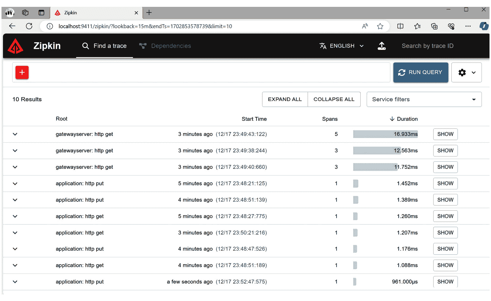

图 4.6：Spring Cloud 的分布式跟踪

其他跟踪来自与 Eureka 服务器同步的应用程序。

如果你打开 `gatewayserver` 的跟踪，其中包含五个跨度（即对应于 `/api/albums/players` 的那个），你会看到 `gateway` 服务器调用了 `albums` 服务器，该服务器又调用了 `football` 服务器：

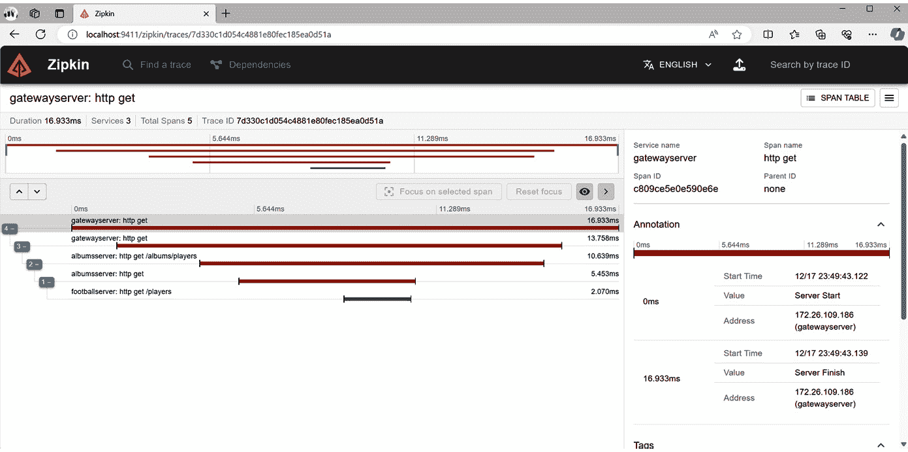

图 4.7：从网关服务器开始的分布式跟踪，该服务器调用专辑服务，而该服务反过来又调用足球服务

如果你打开 **依赖关系** 部分，你会看到微服务之间的依赖关系：

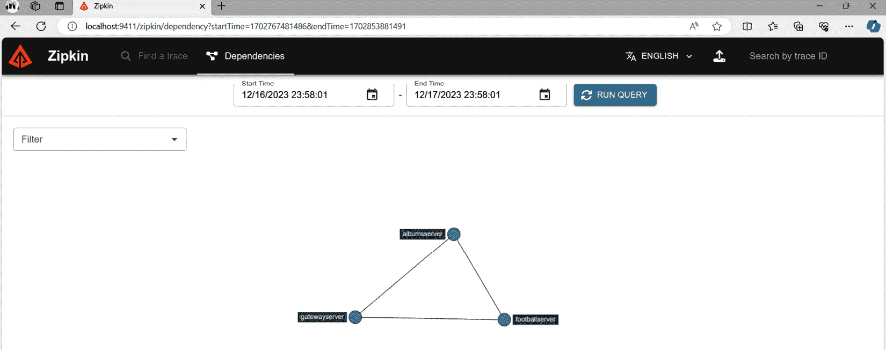

图 4.8：Spring Cloud 微服务之间的依赖关系

在复杂场景中，当需要了解不同微服务之间的相互关系时，此视图很有趣。

## 它是如何工作的...

如在 *第三章* 中解释的 *实现分布式跟踪* 菜单所示，只需添加 Actuator 和 Micrometer 依赖项，应用程序就会使用默认配置将跟踪发送到 OpenZipkin 服务器。默认配置是 OpenZipkin 服务器的 `http://localhost:9411` 和 10% 的采样率。采样意味着只有一部分跟踪被处理，因此默认情况下只处理 10%。为了演示目的，我们希望发送 100% 的跟踪；因此，我们利用集中式配置的优势，只更改了配置存储库中的 `application.yml` 文件。

`albums` 应用程序使用 `OpenFeign` 客户端，默认情况下，它不会像 `WebClient.Builder` 和 `RestTemplateBuilder` 那样传播分布式跟踪。因此，我们需要向 `io.micrometer:micrometer-tracing` 和 `io.github.openfeign:feign-micrometer` 添加两个额外的依赖项。另一方面，Spring Cloud Gateway 使用 `WebClient.Builder` 向下游服务发送请求。因此，Spring Cloud Gateway 可以正确地创建和传播跟踪，无需额外的配置。

# 部署 Spring Boot Admin

在部署了几个微服务之后，你会欣赏有一个单独的控制台来监控和管理所有这些服务。Spring Boot Admin 是一个开源社区项目，它提供了一个可以管理和监控 Spring Boot 应用程序的 Web 界面。

## 准备中

你将重用*将分布式跟踪与 Spring Cloud 集成*食谱中的应用程序。如果你还没有完成那个食谱，我已经准备了一个工作版本。你可以在本书的 GitHub 仓库中找到它，在`chapter4/recipe4-8/start`文件夹中。

## 如何做到...

我们需要部署一个 Spring Boot Admin 服务器，并确保它连接到发现服务以监控和管理所有应用程序。按照以下步骤操作：

1.  首先，使用*Spring Initializr*工具为 Spring Boot Admin 创建一个新的应用程序。打开[`start.spring.io`](https://start.spring.io)，使用与*第一章*中*创建 RESTful API*食谱相同的参数，除了以下选项：

    +   对于`fooballadmin`

    +   对于**依赖项**，选择**Spring Web**、**Codecentric 的 Spring Boot Admin (Server)**、**Config Client**和**Eureka** **Discovery Client**

1.  接下来，你必须配置 Spring Boot Admin。为此，在`resources`文件夹中添加一个`application.yml`文件，内容如下：

    ```java
    spring:
      application:
        name: admin-server
      config:
        import: optional:configserver:http://localhost:8888
      cloud:
        config:
          label: distributed-tracing
    ```

    我在这个配置中使用了`spring.cloud.config.label`。由于我不想将不同食谱的配置混合在一起，我为本章的食谱创建了一个新的分支，其名称为`distributed-tracing`。然而，如果你在同一个 GitHub 仓库和同一个分支中创建了所有配置，这个设置就不再必要了。

1.  需要额外的配置，但这次应该在中央仓库中完成，因为我们正在使用 Spring Cloud Config 服务。在我的情况下，配置保存在[`github.com/felipmiguel/spring3-recipes-config`](https://github.com/felipmiguel/spring3-recipes-config)；你应该用你的 GitHub 账户替换`felipmiguel`，如*设置 Spring Cloud Config*食谱中所述。如前一步所述，我在`distributed-tracing`分支中准备了更改：

    1.  首先，通过 Spring Cloud Gateway 暴露 Spring Boot Admin。为此，在`gatewayserver.yml`文件中创建一个新的路由，如下所示：

    ```java
    spring:
      cloud:
        gateway:
          routes:
            - id: players
              uri: lb://footballserver
              predicates:
                - Path=/api/players/**
              filters:
                - StripPrefix=1
            - id: albums
              uri: lb://albumsserver
              predicates:
                - Path=/api/albums/**
              filters:
                - StripPrefix=1
            - id: admin
              uri: lb://admin-server
              predicates:
                - Path=/admin/**
              filters:
    admin-server.yml in your GitHub repository with the following content:
    ```

```java
spring:
  boot:
    admin:
      ui:
        application.yml file in your GitHub repository:

```

management:

endpoints:

web:

exposure:

include: health,env,metrics,beans,loggers,prometheus

tracing:

sampling:

`probability: 1.0`

```java

				The last step before we run the application is configuring the Spring Boot Admin application to enable Admin Server and the Spring Cloud Discovery client. For that, open the `FootballAdminApplication` class and add the following annotations:

```

`@SpringBootApplication`

`@EnableAdminServer`

`@EnableDiscoveryClient`

`public class FootballadminApplication`

```java

				Now, you can run the Spring Boot Admin application. Remember that you will need to run the rest of the applications that were reused from the *Integrating distributed tracing with Spring Cloud* recipe and that the `config` and `registry` services should start before the other services. As the Spring Boot Admin service is exposed through Spring Cloud Gateway, you can open `http://locahost:8080/admin` to access Spring Boot Admin:

			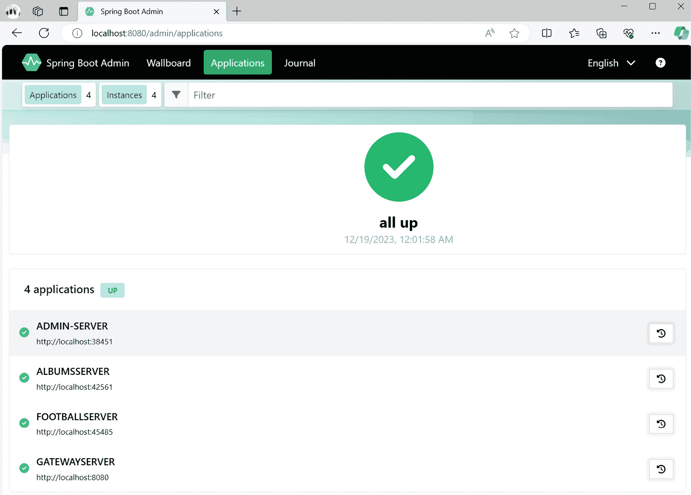

			Figure 4.9: The initial Spring Boot Admin page. It defaults to the Applications view
			When you access Spring Boot Admin, it redirects you to the **Applications** view. It retrieves the list from Eureka Server. On the application, if you click on the green check on the left-hand side, you will be redirected to the application details page:
			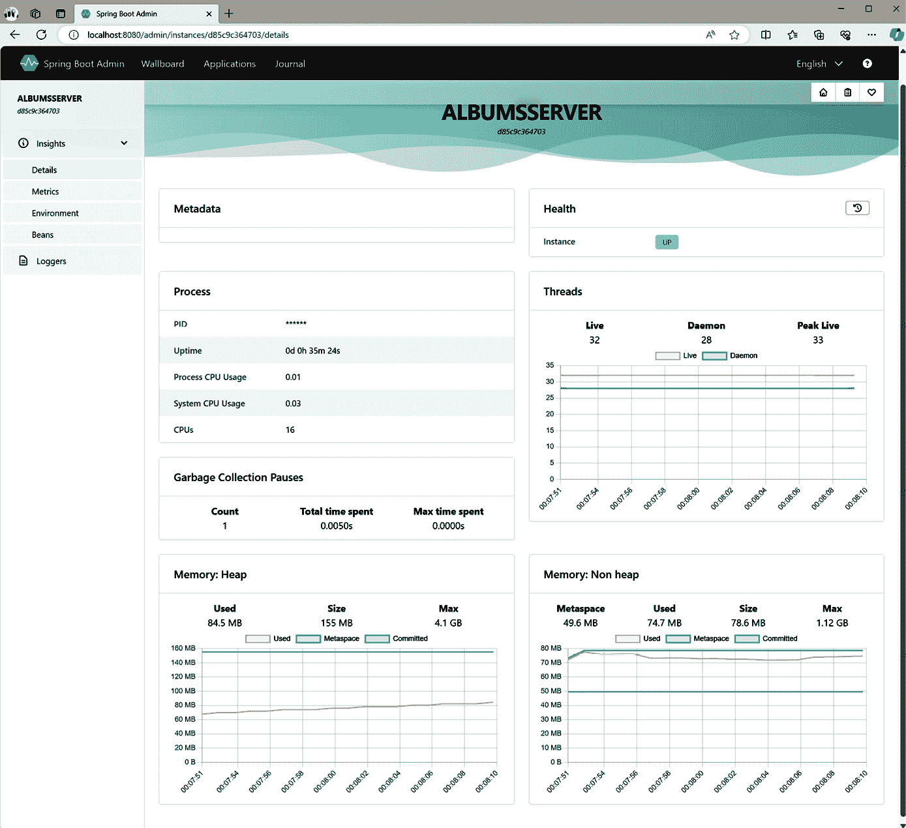

			Figure 4.10: Application details in Spring Boot Admin
			Depending on how many Actuator endpoints are enabled in that application, you will see either more or fewer options in the left pane. As you activate the `health`, `env`, `metrics`, `beans`, and `loggers` endpoints, you will see **Details**, **Metrics**, **Environment**, **Beans**, and **Loggers**. If you open **Loggers**, you will see all loggers defined by the application. As you did in the *Changing settings in a running application* recipe in *Chapter 3*, you can change the log level, but this time from a nice UI:
			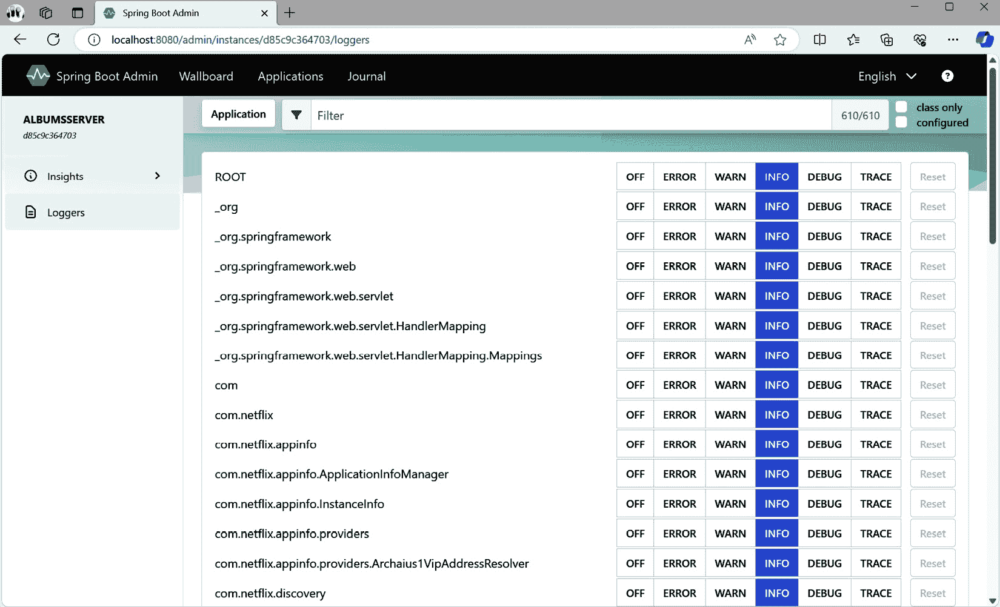

			Figure 4.11: Loggers in Spring Boot Admin
			There are two more views on the top bar:

				*   **Wallboard**: This shows the applications running in the wallboard view
				*   **Journal**: This shows the events that are happening in the Discovery service

			How it works...
			Spring Boot Admin may work without Eureka Server, but you would need to configure each application as a client of Spring Boot Admin. Instead, we configured Spring Boot Admin to discover the applications using Eureka Server. Connecting to Eureka Server requires Eureka Client. The Config service centralizes the configuration, which is why we used the Config Client.
			Spring Boot Admin gets the list of applications and their instances from Eureka Server. Then, using the Actuator endpoint of each instance, it can get all the details of the application. The more Actuator endpoints are enabled, the more details can be shown. We used the central configuration to allow the desired endpoints in one single place.
			Spring Boot Admin can run out of Spring Cloud Gateway; however, it makes sense to centralize the access through Spring Cloud Gateway in this example. Keep in mind that some Actuator endpoints may expose sensitive information. With this design, you only need to expose Spring Cloud Gateway while you keep the rest of the services with no public exposure. Then, you can set up OAuth2, as explained in the *Protecting Spring Cloud Gateway* recipe. When configuring Spring Boot Admin behind a reverse proxy, setting the `spring.boot.admin.ui.public-url` property is necessary.
			Protecting Spring Cloud Gateway
			When implementing Spring Cloud Gateway, it can serve as a system’s single entry point. For this reason, protecting Spring Cloud Gateway with OAuth2 is a good idea. This allows for centralizing authentication and authorization in Spring Cloud Gateway, eliminating the need for your client to reauthenticate with each service behind it.
			You want to place your `football` RESTful API, which is protected with OAuth2, behind Spring Cloud Gateway. So, you’ll also need to protect Spring Cloud Gateway with OAuth2.
			In this recipe, you’ll learn how to configure Spring Cloud Gateway as a resource server and pass the token that you receive to the downstream service.
			Getting ready
			In this exercise, you will need the following:

				*   An authorization server. You can reuse Spring Authorization Server, which you created in the *Setting up Spring Authorization Server* recipe in *Chapter 2*, for this purpose.
				*   A resource server. The RESTful API you created in the *Protecting a RESTful API using OAuth2* recipe in *Chapter 2*, can be reused here.
				*   A Spring Cloud Gateway server. You can reuse the Spring Cloud Gateway server you created in the *Setting up Spring Cloud Gateway* recipe. You can always reuse the latest version of the Spring Cloud Gateway server in later recipes. I’m using the initial setup for simplicity.
				*   Eureka Server. You can reuse the Eureka Server application you created in the *Setting up Eureka* *Server* recipe.

			If you haven’t completed the previous recipes yet, I’ve prepared a working version for all of them in this book’s GitHub repository at [`github.com/PacktPublishing/Spring-Boot-3.0-Cookbook`](https://github.com/PacktPublishing/Spring-Boot-3.0-Cookbook), in the `chapter4/recipe4-9/start` folder.
			How to do it...
			In this recipe, we’ll set our RESTful API behind Spring Cloud Gateway and then protect Spring Cloud Gateway with OAuth2\. Let’s begin:

				1.  First, configure the RESTful API so that it’s registered in Eureka Server. For that, add the Eureka Client dependency to the RESTful API’s `pom.xml` file:

    ```

    `<dependency>`

    `<groupId>org.springframework.cloud</groupId>`

    `<artifactId>spring-cloud-starter-netflix-eureka-client</artifactId>`

    </dependency>

    ```java

    As it is part of Spring Cloud, you should also include the corresponding dependency management in the `pom.xml` file, as follows:

    ```

    `<dependencyManagement>`

    `<dependencies>`

    `<dependency>`

    `<groupId>org.springframework.cloud</groupId>`

    `<artifactId>spring-cloud-dependencies</artifactId>`

    `<version>${spring-cloud.version}</version>`

    `<type>pom</type>`

    `<scope>import</scope>`

    </dependency>

    </dependencies>

    </dependencyManagement>

    ```java

    Add a project-level property to configure the Spring Cloud version:

    ```

    `<properties>`

    `<spring-cloud.version>2022.0.4</spring-cloud.version>`

    </properties>

    ```java

    Now, you can add the Eureka Server configuration to the `application.yml` file:

    ```

    eureka:

    client:

    `serviceUrl:`

    默认区域: http://localhost:8761/eureka/

    ```java

    Though not required, I recommend configuring the application port randomly and assigning a name to the Spring Boot application. With this configuration, you won’t need to care about port conflicts, and you’ll make the application discoverable by name. For that, in the `application.yml` file, add the following lines:

    ```

    spring:

    application:

    名称: football-api

    server:

    端口: 0

    ```java

    I’ve added the `spring` label for clarity, but the `application.yml` file should have it defined.

    				2.  Next, configure Spring Cloud Gateway as a resource server. For that, you will need to add the Spring OAuth2 Resource Server dependency to your `pom.xml` file:

    ```

    <dependency>

    <groupId>org.springframework.boot</groupId>

    <artifactId>spring-boot-starter-oauth2-resource-server</artifactId>

    </dependency>

    ```java

    Then, configure `application.yml` with the application registration settings. We’ll use the same configuration that we did for the RESTful API:

    ```

    spring

    security:

    oauth2:

    resourceserver:

    jwt:

    audiences:

    - football

    - football-ui

    issuer-uri: http://localhost:9000

    ```java

    				3.  Now, configure Spring Cloud Gateway with the route to the RESTful API:

    ```

    spring:

    cloud:

    gateway:

    routes:

    - id: teams

    uri: lb://football-api

    predicates:

    - 路径=/football/**

    cloud label.

    ```java

    				4.  Now that the application is behind Spring Cloud Gateway, which is protected using OAuth2, you can test the application. Remember to run the Eureka and Authorization projects before running the Spring Cloud Gateway and RESTful API projects.

    First, you’ll need to obtain an access token from the authorization server to test the application. For that, execute the following command in your Terminal:

    ```

    curl --location 'http://localhost:9000/oauth2/token' \

    --header 'Content-Type: application/x-www-form-urlencoded' \

    --data-urlencode 'grant_type=client_credentials' --data-urlencode 'client_id=football' \

    --data-urlencode 'client_secret=SuperSecret' --data-urlencode 'scope=football:read'

    curl --location http://localhost:8080/football/teams -H "Authorization: Bearer <access token> with the access token you obtained from the authorization server.

    ```java

    You will see the result that’s returned by the RESTful API:

			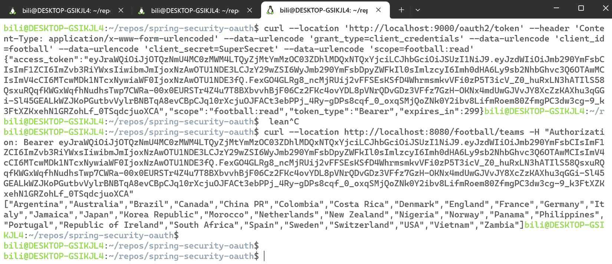

			Figure 4.12: Using the RESTful API through Spring Cloud Gateway, which is protected with OAuth2
			The result contains a list of teams.
			How it works...
			Spring Cloud Gateway acts as a resource server. This means it will require a valid access token to be issued by our authorization server.
			Spring Cloud Gateway will relay the access token to the downstream RESTful API. Both will validate the access token. You can configure Spring Cloud Gateway with the first level of OAuth2 validation. For example, you can validate the token issuer and the token scopes. Then, if you need more fine-grained validation, you can do so on the RESTful API.

```

# 第二部分：数据库技术

几乎所有应用程序都需要高效地持久化和访问数据，为此，Spring Boot 提供了许多选择，从关系型数据库和 NoSQL 数据库到仓库、模板、**Java 持久化查询语言**（**JPQL**）和原生 SQL。

本部分包含以下章节：

+   *第五章*, *使用 Spring Data 与数据持久化和关系型数据库集成*

+   *第六章*, *使用 Spring Data 与数据持久化和 NoSQL 数据库集成*
