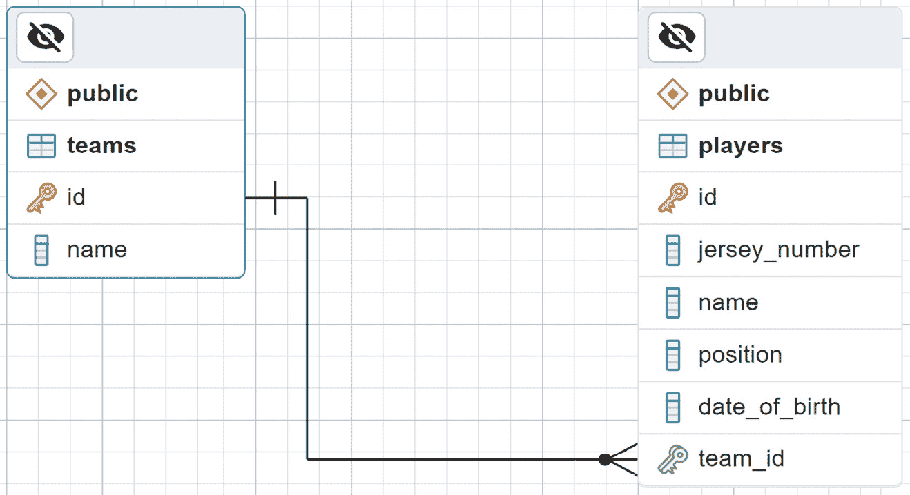
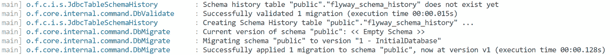
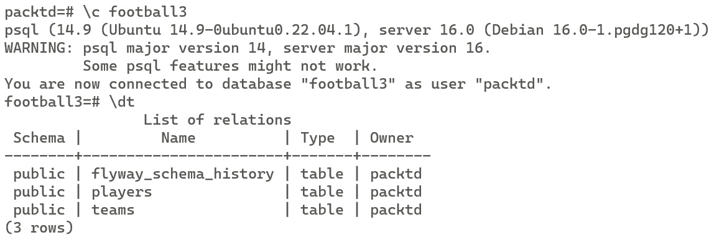
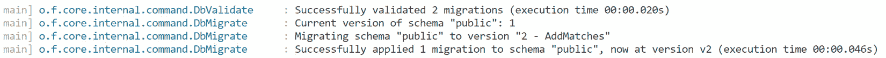
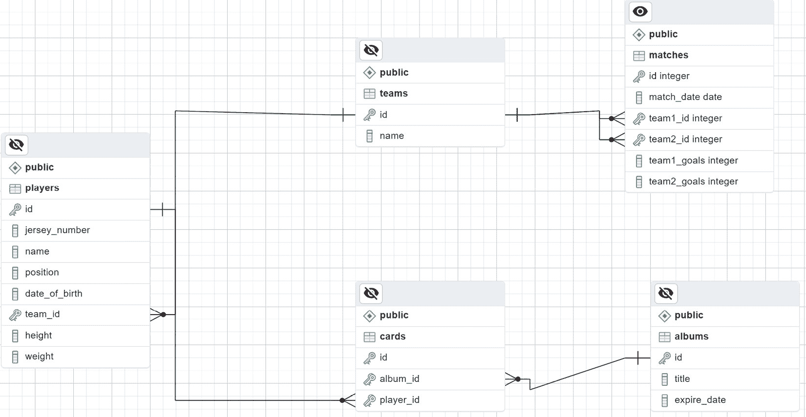

# 5

# 使用 Spring Data 与关系型数据库进行数据持久化和集成

大多数应用程序以某种方式处理他们的数据，这需要使用数据库引擎。本章讨论了关系型数据库，这是最广泛使用的数据库技术。关系型数据库仍然是各种应用程序场景中灵活和可靠的选项。它们的组织化、表格化数据存储格式和定义良好的模式适合许多用途。此外，关系型数据库提供了诸如强制数据完整性、支持复杂查询和遵循 **ACID** 原则（**原子性、一致性、隔离性、持久性**）等基本好处。它们被证明是适用于从简单到关键任务应用的各种应用程序的合适选择。

Spring Data 是 Spring 框架的一个组件，旨在简化 Java 应用程序中的数据访问。它提供了一个一致的编程模型和与各种数据存储（包括关系型数据库和其他类型的数据库）交互的抽象层。

Spring Data 为关系型数据库提供了两个模块：Spring Data JPA 和 Spring Data JDBC。

+   Spring Data JPA。此模块提供了与 **Java 持久化 API**（**JPA**）的集成，允许开发人员使用 **对象关系映射**（**ORM**）原则与关系型数据库一起工作。其中一个好处是大多数代码是数据库无关的，不是为了创建一个完全独立于数据库的应用程序，而是为了无论底层数据库如何都能重用所学知识。在复杂的应用程序中，利用特定供应商的功能对于项目的成功可能是决定性的，因此我建议使用数据库引擎提供的所有功能。试图创建一个可以在任何数据库中部署的应用程序会导致你的应用程序只使用所有数据库中可用的最小公共集合。

+   Spring Data JDBC。此模块提供了更直接的数据访问方法，侧重于使用纯 SQL 查询以及 Java 对象和数据库表之间的直接数据映射。

我们将使用 Spring Data JPA 处理最常见的数据访问场景。从基本数据操作，如创建、读取、更新、删除（CRUD）到更高级的任务，如复杂查询、事务以及数据库模式初始化和模式升级。

我们将使用 PostgreSQL 作为数据库引擎，因为它开源、广泛采用、多平台，并且围绕它有一个充满活力的社区。但如上所述，我们可以使用相同的原理来创建一个使用其他关系型数据库引擎的应用程序，例如 MySQL、SQL Server 或 Oracle。

在本章中，我们将涵盖以下主要主题：

+   将您的应用程序连接到 Postgresql

+   创建和更新数据库模式

+   创建 CRUD 存储库。

+   使用 JPQL。

+   使用原生查询。

+   更新操作

+   动态查询

+   使用事务

+   使用 Spring Data JDBC。

# 技术要求

对于本章，您需要一个 PostgreSQL 服务器。在本地环境中部署它的最简单方法是使用 Docker。您可以从产品页面获取 Docker：[`www.docker.com/products/docker-desktop/`](https://www.docker.com/products/docker-desktop/)

如果您想在您的计算机上安装 PostgreSQL，您可以从项目页面下载它：[`www.postgresql.org/download/`](https://www.postgresql.org/download/)

我还推荐安装 PgAdmin 来访问数据库。您可以使用它来观察应用程序在数据库中执行的变化。您可以从项目页面下载它：[`www.pgadmin.org/download/`](https://www.pgadmin.org/download/)

您可以使用其他工具，例如 Visual Studio Code 或 IntelliJ 的插件。

如前一章所述，您需要一个代码编辑器和 OpenJDK。

本章中将要展示的所有菜谱都可以在以下位置找到：[`github.com/PacktPublishing/Spring-Boot-3.0-Cookbook/tree/main/chapter5`](https://github.com/PacktPublishing/Spring-Boot-3.0-Cookbook/tree/main/chapter5).

# 将您的应用程序连接到 PostgreSQL

您想要创建一个 RESTful API 来为您的最终用户提供足球数据。为了管理这些数据，我们决定使用关系型数据库，因为我们感兴趣的是提供数据一致性和高级查询功能。

在这个菜谱中，我们将连接一个应用程序，一个 RESTful API，到一个 PostgreSQL 数据库。为此，我们首先要做的是在 Docker 中部署一个 PostgreSQL 数据库。

在这个菜谱中，您将学习如何创建一个基本的应用程序，该应用程序连接到 PostgreSQL 数据库，并使用 JdbcTemplate 执行基本的 SQL 查询。

## 准备工作

对于这个菜谱，您需要一个 PostgreSQL 数据库。如果您已经有一个可用的服务器，您可以使用它。否则，您可以使用 Docker 在您的计算机上部署一个 PostgreSQL。为此，您可以在终端中执行以下命令来下载和执行一个 PostgreSQL 实例：

```java
docker run -itd -e POSTGRES_USER=packt -e POSTGRES_PASSWORD=packt -p 5432:5432 --name postgresql postgres
```

您将有一个 PostgreSQL 服务器可供使用，监听端口 5432，用户名和密码为*packt*。如果您想更改这些参数，您可以修改上面的命令。

您需要一款工具来对 PostgreSQL 执行一些操作。我将使用命令行工具 psql。在 Ubuntu 上，您可以使用默认的包管理器*apt*来安装它：

```java
sudo apt install postgresql-client
```

作为 psql 的替代方案，您可以使用 PgAdmin 通过一个友好的 UI 连接到数据库。我将仅使用 psql 的命令行示例进行说明，但如果您想的话，您也可以使用 PgAdmin 来执行数据库脚本。请按照官方页面[`www.pgadmin.org/download/`](https://www.pgadmin.org/download/)上的说明在您的计算机上安装它。

您可以在本书的 GitHub 仓库中找到 sql 脚本，网址为[`github.com/PacktPublishing/Spring-Boot-3.0-Cookbook/`](https://github.com/PacktPublishing/Spring-Boot-3.0-Cookbook/).

如往常一样，我们将使用 Spring Initializr 工具创建我们的项目，或者如果你更喜欢，可以使用你最喜欢的 IDE 或编辑器中的集成工具。

## 如何操作...

一旦我们准备好了如*准备就绪*中所述的 PostgreSQL 服务器，我们将创建一个数据库。之后，我们将创建一个 Spring Boot 应用程序，该应用程序将连接到数据库以执行一个简单的查询。

1.  首先，下载 GitHub 仓库中可用的 postgresql 脚本。它们位于`chapter5/recipe5-1/start/sql`目录下。有两个脚本文件：

    +   `db-creation.sql`。此脚本创建一个名为`football`的数据库，包含两个表：`teams`和`players`。

    +   `insert-data.sql`。此脚本在`teams`和`players`表中插入示例数据。

1.  接下来，我们将执行数据库中的脚本。为此，打开一个终端并执行以下命令以使用*psql*工具在 PostgreSQL 中执行脚本。

    ```java
    psql -h localhost -U packt -f db-creation.sql
    psql -h localhost -U packt -f insert-data.sql
    ```

    它将请求密码。输入*packt*，如*准备就绪*部分中配置的那样。如果你在*准备就绪*部分使用了不同的参数，请相应地使用。

    或者，你也可以使用*PgAdmin*工具代替*psql*工具。

1.  我们刚刚创建的数据库模式看起来如下：



图 5.1：数据库模式。使用 PgAdmin 工具导出。

1.  让我们使用*Spring Initializr*工具创建一个新的 Spring Boot 应用程序，该应用程序连接到数据库。我们将使用与*第一章*中*创建 RESTful API*配方相同的参数，除了更改以下选项：

    +   `footballpg`

    +   **依赖项**：**Spring Web**，**Spring Data JPA**，**PostgreSQL Driver**

1.  接下来，我们将配置应用程序以连接到 PostgreSQL 数据库。为此，在`resources`文件夹中创建一个`application.yml`文件，并设置以下内容：

    ```java
    spring:
        datasource:
            url: jdbc:postgresql://localhost:5432/football
            username: packt
            password: packt
    ```

1.  现在，创建一个名为`TeamsService`的新服务类。此类将使用 JdbcTemplate 对数据库执行查询。为此，需要注入一个 JdbcTemplate。

    ```java
    @Service
    public class TeamsService {
        private JdbcTemplate jdbcTemplate;
        public TeamsService(JdbcTemplate jdbcTemplate) {
            this.jdbcTemplate = jdbcTemplate;
        }
    }
    ```

1.  我们将在*TeamsService*中创建一个方法来获取团队总数。你可以将此方法命名为`getTeamCount`：

    ```java
    public int getTeamCount() {
        return jdbcTemplate.queryForObject("SELECT COUNT(*) FROM teams", Integer.class);
    }
    ```

    我们使用了 jdbcTemplate 的 queryForObject 方法来执行一个 SQL 查询以获取单个值。

1.  你现在可以使用此服务创建一个 RestController。我创建了一个使用`TeamsService`的示例控制器。你可以在本书的仓库中找到它，网址为[`github.com/PacktPublishing/Spring-Boot-3.0-Cookbook/`](https://github.com/PacktPublishing/Spring-Boot-3.0-Cookbook/)。

## 它是如何工作的...

在我们的配置文件 `application.yml` 中，我们定义了一个数据源。在数据源内部，我们使用了 URL、用户名和密码。然而，也可以定义其他属性。或者，我们也可以只使用 URL。URL 包含重要信息，例如数据库的类型（在我们的情况下，是 PostgreSQL）、主机、端口和数据库名。尽管可以在 URL 中传递用户名和密码，但我们使用了特定的字段来提高清晰度。

由于我们指定了 PostgreSQL 作为数据库，因此确保类路径中注册了驱动程序至关重要。我们通过添加 PostgreSQL 驱动程序的依赖项来实现这一点。

通过在配置文件中定义数据源，数据源对象被注册到依赖容器中。Spring Data JPA 使用该数据源在需要时创建 JdbcTemplate，例如，它创建一个 JdbcTemplate 实例并将其注入到 `TeamsService` 类中。

JdbcTemplate 处理资源的创建和释放，并将 `SQLExceptions` 转换为 Spring 的 `DataAccessExceptions`。在此示例中，我们使用了一个非常简单的查询，它不需要任何参数并返回一个 Integer。尽管如此，JdbcTemplate 允许向你的查询传递参数并将结果映射到复杂类。我们不会在本书中过多扩展这些功能；相反，我们将深入研究 JPA 和 Hibernate 功能，以将复杂实体和关系映射到类。从 *使用 Hibernate* 食谱开始，我们将看到这一点。

## 还有更多...

JdbcTemplate 可以用来检索不仅限于标量值的查询结果。例如，假设我们有一个 `Team` 类，我们可以定义以下方法，使用 `query` 方法检索所有团队：

```java
public List<Team> getTeams() {
  return jdbcTemplate.query("SELECT * FROM teams", (rs, rowNum) -> {
    Team team = new Team();
    team.setId(rs.getInt("id"));
    team.setName(rs.getString("name"));
    return team;
 });
}
```

在此示例中，我们使用一个匿名 `RowMapper`，它将每一行转换为一个 `Team` 对象。

你也可以向你的查询传递参数。例如，让我们检索一个特定的团队：

```java
public Team getTeam(int id) {
    return jdbcTemplate.queryForObject(
       "SELECT * FROM teams WHERE id = ?",
       new BeanPropertyRowMapper<>(Team.class),
       id);
}
```

这次，我们使用 `BeanPropertyRowMapper` 将结果行映射到 Team。这个类推断目标属性以映射结果行的列。

# 使用 JdbcClient 访问数据库

在上一个食谱中，我们使用 JdbcTemplate 访问数据库。JdbcClient 是一个增强的 JDBC 客户端，它提供了一种流畅的交互模式。JdbcClient 自 Spring Framework 6.1 以来被引入，并且自 Spring Boot 3.2 起可用。

在本食谱中，我们将通过执行一些简单的数据库查询来学习如何使用 JdbcClient。

## 准备工作

在这个菜谱中，我们需要一个 PostgreSQL 数据库。你可以重用之前在*连接你的应用程序到 PostgreSQL*菜谱中创建的相同数据库。你也可以重用同一个菜谱中的项目，因为依赖项是相同的。我已经准备了一个你可以用作此菜谱起点的工作版本。你可以在本书的 GitHub 仓库中找到它，在`chapter5/recipe5-2/start`文件夹中。

## 如何做到这一点...

让我们使用 JdbcClient 而不是 JdbcTemplate 来准备一些查询。

1.  让我们从创建一个名为`PlayersService`的新服务类并在这个构造函数中注入一个 JdbcClient 开始：

    ```java
    @Service
    public class PlayersService {
        private JdbcClient jdbcClient;
        public PlayersService(JdbcClient jdbcClient) {
            this.jdbcClient = jdbcClient;
        }
    }
    ```

1.  创建一个名为`Player`的类。这个类应该有与在*连接你的应用程序到 PostgreSQL*菜谱中创建的`players`表相同的字段。你可以在本书的仓库中找到这个类的实现，网址为[`github.com/PacktPublishing/Spring-Boot-3.0-Cookbook`](https://github.com/PacktPublishing/Spring-Boot-3.0-Cookbook)。

1.  现在，我们可以在`PlayersService`中创建方法来与数据库交互：

    +   让我们创建一个名为`getPlayers`的方法来检索所有球员：

        ```java
        public List<Player> getPlayers() {
            return jdbcClient.sql("SELECT * FROM players")
                    .query(Player.class)
                    .list();
        }
        ```

    +   我们可以创建一个名为`getPlayer`的方法来检索单个`Player`。我们可以在 SQL 查询中使用一个参数。

        ```java
        Public Player getPlayer(int id) {
            return jdbcClient.sql("SELECT * FROM players WHERE id = :id")
                    .param("id", id)
                    .query(Player.class)
                    .single();
        }
        ```

    +   让我们创建一个名为`createPlayer`的方法来创建一个新的`Player`：

        ```java
        public Player createPlayer(Player player) {
            GeneratedKeyHolder keyHolder = new GeneratedKeyHolder();
           jdbcClient.sql("""
             INSERT INTO players (jersey_number, name, position, date_of_birth, team_id)
             VALUES (:jersey_number, :name, :position, :date_of_birth, :team_id)
                          """)
                   .param("name", player.getName())
                   .param("jersey_number", player.getJerseyNumber())
                   .param("position", player.getPosition())
                   .param("date_of_birth", player.getDateOfBirth())
                   .param("team_id", player.getTeamId())
                   .update(keyHolder, "id");
            player.setId(keyHolder.getKey().intValue());
            return player;
        }
        ```

1.  你可以创建一个使用`PlayerService`的控制器。我已经准备了一个可以在本书的 GitHub 仓库中找到的工作版本：[`github.com/PacktPublishing/Spring-Boot-3.0-Cookbook`](https://github.com/PacktPublishing/Spring-Boot-3.0-Cookbook)。

## 它是如何工作的...

JdbcClient 用来创建数据库连接的机制类似于 JdbcTemplate。Spring Data JPA 使用在应用程序中配置的数据源，并将其注入到 JdbcClient 中。

JdbcClient 提供了一个流畅的方式来与数据库交互，使开发更加直观，并减少了样板代码。它允许非常容易地使用命名参数，就像我们在`getPlayer`和`createPlayer`方法中看到的那样。它还提供了自动映射，无需定义`RowMapper`来处理每一行。

# 使用 ORM 访问数据库

通过执行 SQL 请求访问数据库可以是高效的，并且适用于简单的应用程序。然而，当应用程序变得更加复杂且数据库模式增长时，使用一个**对象关系映射**（**ORM**）框架通过**面向对象编程**（**OOP**）层访问数据库可能是有趣的。在 Java 中，最流行的 ORM 框架可能是**Hibernate**，而 Spring Data JPA 使用 Hibernate 作为其默认的**Java 持久化 API**（**JPA**）实现。

在这个菜谱中，我们将创建可以映射到数据库模式的实体类，并且我们将与数据库交互而不需要写一行 SQL。

## 准备工作

您需要为这个菜谱创建一个 PostgreSQL 数据库。您可以使用 *连接您的应用程序到 PostgreSQL* 菜谱中创建的数据库。如果您还没有完成那个菜谱，您可以完成那个菜谱的前两步来创建数据库。

## 如何做到这一点...

一旦我们准备好了 PostgreSQL 服务器，如 *准备就绪* 中所述，我们将创建一个数据库，并填充一些数据。之后，我们将创建一个 RESTful 项目以连接到数据库并检索数据。

1.  让我们创建一个连接到这个数据库的项目。我们将在浏览器中打开 https://start.spring.io 来使用 Spring Initializr 工具。

    我们将使用与 *第一章* 中的相同参数，以下是一些特定参数：

    +   `footballpg`

    +   **依赖项**：**Spring Web**，**Spring Data JPA**，**PostgreSQL 驱动程序**

1.  在这个项目中，创建实体类以映射数据库表。

    +   创建一个名为 `TeamEntity.java` 的文件，包含一个与表 `teams` 映射的类：

        ```java
        @Table(name = "teams")
        @Entity
        public class TeamEntity {
            @Id
            private Integer id;
            private String name;
            @OneToMany(cascade = CascadeType.ALL, mappedBy = "team")
            private List<PlayerEntity> players;
        }
        ```

    +   创建一个名为 `PlayerEntity.java` 的文件，包含与表 `players` 映射的类。

        ```java
        @Table(name = "players")
        @Entity
        public class PlayerEntity {
            @Id
            private Integer id;
            private Integer jerseyNumber;
            private String name;
            private String position;
            private LocalDate dateOfBirth;
            @ManyToOne(fetch = FetchType.LAZY)
            @JoinColumn(name = "team_id")
            private TeamEntity team;
        }
        ```

1.  创建两个仓库接口以使用我们在上一步创建的实体访问数据库。

    +   创建一个名为 `TeamRepository.java` 的文件，包含以下接口：

        ```java
        public interface TeamRepository extends CrudRepository<TeamEntity, Integer>{
        }
        ```

    +   创建一个名为 `PlayerRepository.java` 的文件，包含以下接口：

        ```java
        public interface PlayerRepository extends JpaRepository<PlayerEntity, Integer>{
            List<PlayerEntity> findByDateOfBirth(LocalDate dateOfBirth);
            List<PlayerEntity> findByNameContaining(String name);
        }
        ```

1.  使用两个仓库创建一个名为 `FootballService` 的服务类：

    ```java
    @Service
    public class FootballService {
        private PlayerRepository playerRepository;
        private TeamRepository teamRepository;
        public FootballService(PlayerRepository playerRepository, TeamRepository teamRepository) {
            this.playerRepository = playerRepository;
            this.teamRepository = teamRepository;
        }
    }
    ```

1.  创建两个表示公开数据的类：

    +   `Team`：

        ```java
        public record Team(Integer id, String name, List<Player> players) {
        }
        ```

    +   `Player`：

        ```java
        public record Player(String name, Integer jerseyNumber, String position, LocalDate dateOfBirth) {
        }
        ```

1.  添加一些方法来根据不同的标准查找球员：

    +   搜索包含给定字符串在名称中的球员：

        ```java
        public List<Player> searchPlayers(String name) {
                return playerRepository.findByNameContaining(name)
                        .stream()
                        .map(player -> new Player(player.getName(), player.getJerseyNumber(), player.getPosition(), player.getDateOfBirth()))
                        .toList();
            }
        ```

    +   通过出生日期搜索球员：

        ```java
        public List<Player> searchPlayersByBirthDate(LocalDate date) {
                return playerRepository.findByDateOfBirth(date)
                        .stream()
                        .map(player -> new Player(player.getName(), player.getJerseyNumber(), player.getPosition(), player.getDateOfBirth()))
                        .toList();
            }
        ```

1.  添加一个方法来返回一个包含其球员的 `Team`：

    ```java
    @Transactional(readOnly=true)
    public Team getTeam(Integer id) {
        TeamEntity team = teamRepository.findById(id).orElse(null);
       if (team == null) {
           return null;
       } else {
           return new Team(team.getId(),
                   team.getName(),
                   team.getPlayers()
                   .stream()
                   .map(player -> new Player(player.getName(), player.getJerseyNumber(), player.getPosition(),
                                        player.getDateOfBirth()))
                   .toList());
       }
    }
    ```

1.  创建一个新的团队：

    ```java
    public Team createTeam(String name) {
       Random random = new Random();
       TeamEntity team = new TeamEntity();
       Integer randomId = random.nextInt();
       if (randomId < 0) {
             randomId = random.nextInt();
       }
       team.setId(randomId);
       team.setName(name);
       team = teamRepository.save(team);
       return new Team(team.getId(), team.getName(), List.of());
    }
    ```

1.  更新玩家的位置：

    ```java
    public Player updatePlayerPosition(Integer id, String position) {
        PlayerEntity player = playerRepository.findById(id).orElse(null);
       if (player == null) {
           return null;
       } else {
           player.setPosition(position);
           player = playerRepository.save(player);
           return new Player(player.getName(), player.getJerseyNumber(), player.getPosition(),
                        player.getDateOfBirth());
       }
    }
    ```

1.  现在，您可以使用服务创建一个控制器来公开应用程序的逻辑。您可以在书籍的 GitHub 存储库中找到一个完整的示例，网址为 [`github.com/PacktPublishing/Spring-Boot-3.0-Cookbook`](https://github.com/PacktPublishing/Spring-Boot-3.0-Cookbook)。

1.  现在配置应用程序以连接到 PostgreSQL 数据库。在 `resources` 文件夹下，创建一个名为 `application.yml` 的文件。设置以下配置：

    ```java
    spring:
        jpa:
            database-platform: org.hibernate.dialect.PostgreSQLDialect
            open-in-view: false
        datasource:
            url: jdbc:postgresql://localhost:5432/football
            username: packtd
            password: packtd
    ```

1.  现在您可以执行并测试应用程序。您可以使用 *第一章* 中的说明使用 curl 测试应用程序。我还提供了一个脚本，您可以在存储库中找到该脚本，其中包含此应用程序的 curl 请求。它位于 `chapter2/recipe2-1/end/scripts/requests.sh`。

## 它是如何工作的...

Hibernate 是一个**对象关系映射（ORM**）框架。它的主要目标是弥合 Java 编程语言和关系数据库之间的差距。使用如@Entity、@Table、@Id、@OneToMany、@ManyToOne 等注解，Hibernate 将类映射到数据库表。这些映射的类被称为*实体*。Hibernate 还提供其他功能，如事务管理、查询能力、缓存和延迟加载。

Hibernate 是 Spring Data JPA 的默认 JPA 提供者。Spring Data JPA 允许你定义仓库接口来与你的数据模型交互。只需通过扩展`CrudRepository`接口，它就会自动生成必要的 JPA 操作，为你的实体提供创建、读取、更新和删除操作。当使用`JpaRepository`时，Spring Data JPA 会根据方法名称生成必要的 JPA 查询。

例如，我们使用了`findByDateOfBirth`来创建一个方法，该方法通过出生日期返回所有球员，以及`findByNameContaining`来返回所有名字包含给定字符串的球员。所有这些都不需要写一行 SQL 代码！

如果你对命名约定不熟悉，我强烈建议检查项目文档。请参阅[`docs.spring.io/spring-data/jpa/reference/#repository-query-keywords`](https://docs.spring.io/spring-data/jpa/reference/#repository-query-keywords)。

除了读取数据的操作外，`CrudRepository`和`JpaRepository`还有一个名为`save`的方法。这个方法允许你更新现有实体或创建新的实体（如果它们还不存在的话）。它们还有一些删除实体的方法，例如`delete`、`deleteById`和其他方法。

即使有了 Spring Data JPA 提供的抽象，理解 Spring Data 的一些内部工作原理也是至关重要的。在这个菜谱中，我在控制器和仓库之间使用了一个名为`FootballService`的中层组件。你也可以直接从控制器调用仓库，然而这种方法有一些注意事项。为了更好地理解它，让我们深入探讨返回一个团队及其球员的操作。

Hibernate 有两种方式加载与实体相关的实体：`TeamEntity`有一个用@OneToMany 注解的成员来管理其球员实体。当你的应用程序使用`TeamEntity`类的`getPlayers`方法时，Hibernate 会尝试通过向数据库发送请求来加载球员。默认情况下，@OneToMany 关系以懒加载模式加载，而@ManyToOne 以急加载模式加载。总的来说，懒加载意味着，如果你不使用这个关系，就不会向数据库发送请求。如果你在控制器中通过仓库检索团队并尝试返回`TeamEntity`，它将序列化实体到一个 Json 对象中，遍历所有属性，包括球员。在请求执行的这一阶段，没有打开会话来访问数据库，你将收到一个异常。有几种方法可以解决这个问题：

+   通过使用急加载模式同时检索团队和球员。在某些场景中可能是有效的，但它可能导致不必要的数据库请求。

+   通过允许在视图中打开连接。这可以通过使用`spring.jpa.open-in-view=true`来实现。这是一个反模式，我强烈建议不要使用它。

    我在处理一个项目时遇到了与这个反模式相关的一个糟糕的经历。我遇到了一个与性能和可用性相关的问题，但系统有资源，任何组件似乎都处于压力之下。最后，我意识到由于这个`open-in-view`选项，应用程序中存在连接泄漏。找到根本原因并解决这个 bug 是我遇到的最具挑战性的任务之一，因为找出根本原因并不明显。

    顺便说一句，`spring.jpa.open-in-view=true`是 Spring Boot 的默认值，所以请记住这一点，除非你有我无法想象的好理由，否则请将其配置为 false。

+   在检索数据时创建一个会话或事务，包括懒关系。这是本菜谱中采用的方法。当我们从`TeamEntity`映射到`Team`时，我们使用了`getPlayers`方法，因此从数据库中检索了数据。由于`FootballService`中的`getTeam`方法被标记为`@Transactional`，所有请求都在同一个事务/会话中发生。由于这是一个读操作，你可以设置`@Transactional(readOnly = true)`，为你的事务提供一个成本更低的隔离模式。

+   通过执行一个`Join`查询来在一次数据库请求中检索团队及其球员。这是实现此场景的最有效方式。我们将在本章的另一道菜谱中看到如何实现它。

这就是创建`Service`类而不是直接在 RESTful API 中返回实体的原因。

## 还有更多...

在这个练习中，我们使用了一个现有的数据库，并手动创建了实体和仓库来与数据库交互。还有另一种方法，我们将在本章的后续菜谱中解决，它首先定义实体然后自动生成数据库。对于这两种场景，都有工具可以帮助你完成这项任务，可以非常机械。例如，你可以使用 IntelliJ 的 JPA Buddy 插件，[`plugins.jetbrains.com/plugin/15075-jpa-buddy`](https://plugins.jetbrains.com/plugin/15075-jpa-buddy)。它有一个基本的免费版本，对于简单场景已经足够，还有一个付费版本，具有高级功能。

在这个菜谱中，我们创建了一些代码来将实体转换为其他对象，也称为**数据传输对象**（**DTO**）。这可能会在你的项目中添加很多样板代码。有一些库可以自动化 Java Bean 之间的映射，非常适合这种场景。例如 Mapstruct（https://mapstruct.org/）。Spring Data JPA 支持使用 Mapstruct 将实体转换为 DTO 以及相反。出于学习目的，我在菜谱中没有使用它。

## 参见

如果你想了解更多关于**视图中的打开会话**（**OSIV**）反模式的细节，我建议你阅读这篇文章 [`vladmihalcea.com/the-open-session-in-view-anti-pattern/`](https://vladmihalcea.com/the-open-session-in-view-anti-pattern/)。

# 从我们的代码创建数据库模式

在我们的应用程序中创建数据库模式及其相应的实体，如前一个菜谱所示，需要大量的重复工作。相反，我们可以创建我们的实体，并可以自动生成数据库模式。在这个菜谱中，我们将使用 Spring Data JPA 根据应用程序的实体模型生成数据库模式。

## 准备工作

对于这个菜谱，你需要与上一个菜谱相同的工具，即一个可以在 Docker 容器或你的电脑上运行的 PostgreSQL 服务器。

我们将使用前一个菜谱中生成的相同代码。如果你没有完成它，你可以在书的 GitHub 仓库 https://github.com/PacktPublishing/Spring-Boot-3.0-Cookbook/ 中找到一个完成的菜谱。

## 如何做到这一点...

我们将使用之前关于足球队和球员的例子。然而，在这个菜谱中，我们不会使用现有的数据库和创建映射实体，而是相反的方向。我们将使用和调整已经创建的实体来生成数据库模式。让我们开始：

1.  创建一个名为 `football2` 的新数据库。

    +   在你的终端中打开 psql。

        ```java
        psql -h localhost -U packtd
        ```

    +   执行以下 SQL 命令以创建数据库：

        ```java
        CREATE DATABASE football2;
        ```

1.  我们不会手动生成实体的标识符，而是依赖数据库的自动标识符生成器。为此，我们将修改我们实体的 `@Id` 注解。

    +   修改 `TeamEntity` 中的成员 ID，如下所示：

        ```java
        @Id
        @GeneratedValue(strategy = GenerationType.IDENTITY)
        private Integer id;
        ```

    +   用 `PlayerEntity` 做同样的事情。

1.  打开 `application.yml` 文件，并添加 `spring.jpa.generate-ddl=true` 和 `spring.sql.init.mode=always` 属性。文件应该看起来像这样：

    ```java
    spring:
        jpa:
            database-platform: org.hibernate.dialect.PostgreSQLDialect
            open-in-view: false
            generate-ddl: true
        sql:
            init:
                mode: always
        datasource:
            url: jdbc:postgresql://localhost:5432/football2
            username: packtd
            password: packtd
    ```

    如果你运行应用程序，数据库模式将自动创建。

1.  修改 `FootballService` 类中的 `createTeam` 方法：

    ```java
    public Team createTeam(String name) {
        TeamEntity team = new TeamEntity();
        team.setName(name);
        team = teamRepository.save(team);
        return new Team(team.getId(), team.getName(), List.of());
    }
    ```

    在这里，我们移除了团队标识符的生成，而是让它自动生成。

1.  将位于 GitHub 存储库中的文件 `chapter5/recipe5-4/start/data.sql` 复制到资源文件夹。这个文件夹位于 `src/main/resources`。

1.  执行应用程序。

1.  按照第 *1 章* 中所述，通过向应用程序执行请求来测试应用程序。我还提供了一个脚本，你可以在存储库中找到这个脚本，其中包含对该应用程序的 curl 请求。它位于 `chapter5/recipe5-4/end/scripts/requests.sh`。

    你将看到数据库模式已初始化，并且已经有数据。

## 它是如何工作的...

通过配置应用程序为 `*spring.jpa.generate-ddl=true`，Spring Data 将自动从项目中定义的实体生成数据模式。它将使用注解根据目标数据库生成模式。例如，我们在 `PlayerEntity` 和 `TableEntity` 中的 id 字段都使用了 `@GeneratedValue`。它被转换成 PostgreSQL 序列。以 `TeamEntity` 为例，这是在 PostgreSQL 中的结果：

```java
CREATE TABLE IF NOT EXISTS public.teams
(
    id integer NOT NULL DEFAULT nextval('teams_id_seq'::regclass),
    name character varying(255) COLLATE pg_catalog."default",
    CONSTRAINT teams_pkey PRIMARY KEY (id)
)
CREATE SEQUENCE IF NOT EXISTS public.teams_id_seq
    INCREMENT 1
    START 1
    MINVALUE 1
    MAXVALUE 2147483647
    CACHE 1
    OWNED BY teams.id;
```

Spring Boot 能够创建模式和初始化数据。它从 `optional:classpath*:schema.sql` 加载模式脚本，从 `optional:classpath*:data.sql` 加载数据脚本。我们只明确提供了数据脚本，并且我们确实让 Spring Boot 通过 `generate-ddl` 设置来生成模式。除了数据脚本之外，你也可以提供模式脚本，而不是让 Spring Boot 为你生成它们。对于复杂的应用程序，你可能需要特定的数据库设置。

如前所述，在这个菜谱中，我们让 Spring Boot 执行数据库初始化。默认情况下，Spring Boot 只有在它认为数据库是一个内存嵌入数据库（如 H2）时才会执行初始化。为了强制对 PostgreSQL 进行初始化，我们使用了参数 `spring.sql.init.mode=always`。

这个菜谱中遵循的方法旨在用于开发环境。在生产环境中，我们可能有相同应用的多实例，并且多个实例尝试初始化数据库可能会引起问题。即使有机制确保只有一个应用实例更新数据库，这个过程也可能需要时间并减慢应用初始化速度。重要的是要注意，其中一些脚本应该只执行一次。例如，在这个菜谱中，我们使用了`data.sql`，它使用显式的 id 值在两个表中插入记录。如果您尝试执行两次，将产生唯一约束验证错误。对于初始化，您最可能希望在所有应用实例启动之前执行此过程。例如，在 Kubernetes 中，您可以通过使用 Init Containers 来实现这一点，请参阅 https://kubernetes.io/docs/concepts/workloads/pods/init-containers/。

对于生产环境，存在其他工具，如 Flyway 和 Liquibase，它们由 Spring Boot 支持。这些工具提供了对数据库创建的更多控制，提供了版本控制和迁移。在下一个菜谱中，我们将使用 Flyway 来创建和迁移数据库的模式。

## 还有更多...

在这个菜谱中，我们只使用了所有可能性中的一些选项来定制我们的实体，但几乎可以控制数据库模式定义的任何方面。仅举几个例子：

+   `@Entity`: 使用`@Entity`注解一个类表示它是一个 JPA 实体，应该映射到数据库表。每个实体类对应数据库中的一个表，类中的每个字段对应表中的一个列。

+   `@Table`: 它用于指定实体应映射到的数据库表的详细信息。您可以使用它来设置表名、模式和其他属性。

+   `@Column`: 它允许您配置实体字段到数据库列的映射。您可以指定诸如列名、长度、可空性和唯一约束等属性。

+   `@JoinColumn`: 它用于指定表示关系外键的列。它通常与`@ManyToOne`或`@OneToOne`一起使用，以指定连接列的名称和其他属性。

+   `@Transient`: 被标记为`@Transient`的字段不会映射到数据库列。这个注解用于那些应该从数据库持久化中排除的字段。

+   `@Embedded`和`@Embeddable`: 这些注解用于在实体中创建嵌入对象。`@Embeddable`应用于一个类，而`@Embedded`用于实体，表示嵌入类的实例应作为实体的一部分进行持久化。

+   `@Version`: 它用于指定乐观锁的版本属性。它通常应用于数字或时间戳字段，用于防止对同一记录的并发更新。

## 参见

[`docs.spring.io/spring-boot/docs/current/reference/html/howto.html#howto.data-initialization`](https://docs.spring.io/spring-boot/docs/current/reference/html/howto.html#howto.data-initialization)

# 使用 Testcontainers 的 PostgreSQL 集成测试

在开发组件的测试时，最大的挑战之一是管理数据库等依赖服务。虽然创建模拟或使用像 H2 这样的内存数据库可能是一种解决方案，但这些方法可能会隐藏我们应用程序中潜在的问题。**Testcontainers** 是一个开源框架，它提供了在 Docker 容器上运行的流行数据库和其他服务的临时实例。这为测试应用程序提供了一种更可靠的方法。

在这个菜谱中，您将学习如何使用 Testcontainers 创建依赖于 PostgreSQL 的集成测试。

## 准备工作

在这个菜谱中，我们将为上一个菜谱中创建的应用程序创建一些测试，即 *从我们的代码创建数据库模式*。如果您还没有完成上一个菜谱，我准备了一个工作版本作为这个菜谱的起点。您可以在本书的 GitHub 仓库中找到它：[`github.com/PacktPublishing/Spring-Boot-3.0-Cookbook`](https://github.com/PacktPublishing/Spring-Boot-3.0-Cookbook)。

Testcontainers 需要在您的计算机上安装 Docker。

## 如何做到这一点...

让我们通过创建利用真实 PostgreSQL 数据库的测试来提高我们应用程序的可靠性。

1.  首先，我们需要包含 Testcontainers 启动器和 PostgreSQL Testcontainer 依赖项。您可以通过在项目的 `pom.xml` 文件中添加以下依赖项来实现：

    ```java
    <dependency>
        <groupId>org.testcontainers</groupId>
        <artifactId>junit-jupiter</artifactId>
        <scope>test</scope>
    </dependency>
    <dependency>
        <groupId>org.testcontainers</groupId>
        <artifactId>postgresql</artifactId>
        <scope>test</scope>
    </dependency>
    ```

1.  接下来，创建一个测试类，您可以将其命名为 `FootballServiceTest`。让我们为 TestContainers 设置这个类。为此，我们需要：

    +   使用 `@SpringBootTest` 注解该类。

    +   使用 `@TestContainers` 注解该类。

    +   配置一个上下文初始化器，使用我们在测试期间创建的 PostgreSQL 容器配置应用程序上下文。为了设置初始化器，我们可以使用 `@ContextConfiguration` 注解该类。

    类定义看起来是这样的：

    ```java
    @SpringBootTest
    @Testcontainers
    @ContextConfiguration(initializers = FootballServiceTest.Initializer.class)
    public class FootballServiceTest
    ```

    正如您所看到的，有一个对 `FootballServiceTest.Initializer` 类的引用，我们还没有描述。它将在以下步骤中解释。

1.  现在，我们将定义一个静态字段，使用 PostgreSQL 容器：

    ```java
    static PostgreSQLContainer<?> postgreSQLContainer = new PostgreSQLContainer<>("postgres:latest")
            .withDatabaseName("football")
            .withUsername("football")
            .withPassword("football");
    ```

1.  让我们使用刚刚创建的容器来配置应用程序。现在是我们创建 `FootballServiceTest.Initializer` 类的时候了。在 FootballServiceTest 中创建一个名为 Initializer 的类：

    ```java
    static class Initializer
                implements ApplicationContextInitializer<ConfigurableApplicationContext> {
        public void initialize(ConfigurableApplicationContext configurableApplicationContext) {
            TestPropertyValues.of(
                        "spring.datasource.url=" + postgreSQLContainer.getJdbcUrl(),
                        "spring.datasource.username=" + postgreSQLContainer.getUsername(),
                        "spring.datasource.password=" + postgreSQLContainer.getPassword())
        .applyTo(configurableApplicationContext.getEnvironment());
         }
    }
    ```

    初始化器使用 PostgreSQLContainer 设置覆盖数据源配置。

1.  配置 Testcontainers 的最后一步是启动容器，这可以通过使用 `@BeforeAll` 注解在所有测试开始之前完成。让我们创建一个启动容器的函数：

    ```java
    @BeforeAll
    public static void startContainer() {
        postgreSQLContainer.start();
    }
    ```

1.  现在，我们可以正常创建测试。例如，让我们创建一个创建团队的测试：

    ```java
    @Autowired
    FootballService footballService;
    @Test
    public void createTeamTest() {
        Team team = footballService.createTeam("Jamaica");
        assertThat(team, notNullValue());
        Team team2 = footballService.getTeam(team.id());
        assertThat(team2, notNullValue());
        assertThat(team2, is(team));
    }
    ```

## 它是如何工作的...

`@Testcontainers`注解会搜索所有带有@Container 标记的字段，并触发它们的容器生命周期方法。声明为静态字段的容器，如本菜谱中所示，在测试方法之间是共享的。这意味着容器仅在执行任何测试方法之前启动一次，并在最后一个测试方法执行后停止。如果容器被声明为实例字段，它将为每个测试方法启动和停止。

PostgreSQLContainer 是一个专门的 Testcontainer 模块，它将数据库的属性暴露出来，以方便我们在测试中进行连接。我们使用了 JdbcUrl、用户名和密码来覆盖配置。

正如您所看到的，我们不需要模拟任何存储库来为 FootballService 类创建测试。另一个巨大的优点是，数据库在每次测试执行周期中都会被重新创建，因此测试是可重复和可预测的。

# 数据库模式版本控制和升级

随着我们的应用程序的发展，我们需要保持数据库与我们的 Java 实体同步。这可能是一个复杂且容易出错的任务。为了应对这种情况，有一些工具可以管理数据库模式和数据库迁移。此类工具的几个示例是 Flyway 和 Liquibase，它们都受 Spring Boot 支持。

除了数据库迁移功能本身之外，Flyway 还提供了以下功能：

+   版本控制以跟踪应用到数据库的迁移和待处理的迁移。

+   它可以集成到开发环境和构建自动化工具中，例如 Maven 或 Gradle。

+   可重复迁移。每次 Flyway 运行时，都会执行可重复迁移，确保数据库保持所需状态。

+   回滚和撤销操作。Flyway 可以自动生成 SQL 脚本以撤销特定的迁移，以便在出现问题时进行回滚。

+   它可以在您的项目初始化期间执行迁移。

+   它提供了一些独立工具，可以在 Java 项目之外使用。

当在您的项目中使用时，它需要不同的配置来执行迁移，例如注册特定的 bean。Spring Boot 简化了这种集成，将必要的配置最小化到仅一些应用程序设置，除非您需要更高级的操作。

## 准备工作

您可以将上一道菜谱中完成的练习作为这道菜谱的起点。如果您还没有完成，您可以在书的 GitHub 仓库中找到一个完整版本，网址为 https://github.com/PacktPublishing/Spring-Boot-3.0-Cookbook/。您将需要相同的工具，PostgreSQL 和 Docker。

Flyway 是由 Redgate 维护的解决方案，为个人和非商业项目提供免费版，并为付费支持版。对于这道菜谱，我们可以使用库，但请记住，在生产环境中使用 Flyway 可能需要 Redgate 许可证。有关详细信息，请参阅 https://documentation.red-gate.com/fd/licensing-164167730.html。

## 如何操作...

在这个菜谱中，我们将使用 Flyway 创建数据库的初始版本，然后应用更改。我们将学习如何轻松地与 Spring Boot 一起使用它。

1.  创建一个名为`football3`的新数据库。

    +   在您的终端中打开 psql。

        ```java
        psql -h localhost -U packtd
        ```

    +   执行以下 SQL 命令以创建数据库：

        ```java
        CREATE DATABASE football3;
        ```

1.  添加 Flyway 依赖项。在您的`pom.xml`文件中添加依赖项`org.flywaydb:flywaycore`。

    ```java
    <dependency>
        <groupId>org.flywaydb</groupId>
        <artifactId>flyway-core</artifactId>
    </dependency>
    ```

1.  创建数据库创建脚本。Flyway 脚本的默认位置在`src/main/resources/db`下。将文件命名为`V1_InitialDatabase.sql`并添加以下内容以创建`teams`和`players`表：

    ```java
    CREATE TABLE teams (
        id SERIAL PRIMARY KEY,
        name VARCHAR(255)
    );
    CREATE TABLE players (
        id SERIAL PRIMARY KEY,
        jersey_number INT,
        name VARCHAR(255),
        position VARCHAR(255),
        date_of_birth DATE,
        team_id INT REFERENCES teams(id)
    );
    ```

    您也可以使用此脚本向数据库中填充数据，例如添加`teams`和`players`。

    ```java
    INSERT INTO teams(id, name) VALUES (1884881, 'Argentina');
    INSERT INTO players(id, jersey_number, name, "position", date_of_birth, team_id)
    VALUES
    (357669, 2, 'Adriana SACHS', 'Defender', '1993-12-25', 1884881)
    ```

    在本书的 GitHub 仓库中，您可以找到更多与此脚本相关的数据，如果您愿意，可以将其复制并粘贴到您的项目中。

迁移文件命名约定

迁移文件应遵循命名约定：`V<版本>__<名称>.sql`，版本可以是`<主版本>_<次版本>`，但这是可选的。请注意，在`<版本>`和`<名称>`之间有两个下划线符号。

1.  启动应用程序。

    如果您查看输出日志，您将看到类似以下的消息：



图 5.2：显示迁移执行的应用程序日志。

Flyway 创建了一个名为`flyway_schema_history`的新表来管理架构历史，并执行了我们上面创建的脚本。您可以使用命令`*\dt*`在 PostgreSQL 中获取表列表。



图 5.3：显示 Flyway 最近创建的数据库中表列表。

现在数据库已经有了管理我们应用程序所需的表。

1.  让我们为我们的应用程序创建一个迁移。我们需要在我们的应用程序中管理足球比赛，并且我们需要知道球员的身高和体重。

    +   比赛将由一个名为`MatchEntity`的新实体来管理。它将有两个字段引用比赛的球队、比赛日期以及每队进球数。它应该看起来像这样：

        ```java
        @Entity
        @Table(name = "matches")
        public class MatchEntity {
            @Id
            @GeneratedValue(strategy = GenerationType.IDENTITY)
            private Integer id;
            private LocalDate matchDate;
            @ManyToOne
            @JoinColumn(name = "team1_id", nullable = false)
            private TeamEntity team1;
            @ManyToOne
            @JoinColumn(name = "team2_id", nullable = false)
            private TeamEntity team2;
            @Column(name = "team1_goals", columnDefinition = "integer default 0")
            private Integer team1Goals;
            @Column(name = "team2_goals", columnDefinition = "integer default 0")
            private Integer team2Goals;
        }
        ```

    +   现有的实体`PlayerEntity`应该有两个新属性来管理球员的身高和体重。

        ```java
        private Integer height;
        private Integer weight;
        ```

    +   现在我们需要为数据库创建 SQL 脚本。在`src/main/resources/db`中创建一个名为`V2__AddMatches.sql`的新 sql 文件。在数据库中添加必要的更改以支持应用程序。

    +   创建`matches`表

        ```java
        CREATE TABLE matches(
            id SERIAL PRIMARY KEY,
            match_date DATE,
            team1_id INT NOT NULL REFERENCES teams(id),
            team2_id INT NOT NULL REFERENCES teams(id),
            team1_goals INT default 0,
            team2_goals INT default 0
        );
        ```

    +   修改`players`表以添加身高和体重两列。

        ```java
        ALTER TABLE players ADD COLUMN height INT;
        ALTER TABLE players ADD COLUMN weight INT;
        ```

    +   我们还可以为现有球员设置值，为了简单起见，我们可以为所有球员设置相同的值：

        ```java
        UPDATE players SET height = 175, weight = 70;
        ```

1.  执行应用程序。

    如果您检查日志，您将看到 Flyway 应用的结构迁移。



图 5.4：显示新架构迁移的应用程序日志。

1.  在应用程序启动期间，数据库被初始化。为了确保迁移按预期工作，你可以使用 Testcontainers 来验证它。你可以使用这种方法检查数据库中是否存在某些数据。书中 GitHub 存储库中提供了一些测试，假设数据库中存在某些值。

## 它是如何工作的...

在将 Flyway 依赖项添加到你的项目中时，它将在应用程序启动时检查迁移脚本。如果有迁移脚本，它将连接到数据库，并查看通过查看`flyway_schema_history`表已应用的迁移。如果该表尚不存在，它将创建它。然后，它将按顺序执行所有尚未应用的迁移。例如，在我们的示例中，如果你指向一个空数据库启动应用程序，它将首先应用`V1__InitialDatabase.sql`，然后是`V2__AddMatches.sql`。

Flyway 还使用`flyway_schema_history`表来在应用迁移时控制并发。如果你有多个应用程序实例，它们都将尝试执行相同的程序：

1.  第一个应用程序实例将检查预期的版本是否与通过查看`flyway_schema_history`表部署的版本相同。

1.  如果部署的版本是预期的，它们将正常继续应用程序。

1.  如果版本不同，它将锁定`flyway_schema_history`表，并应用迁移。

1.  其余的应用程序实例将等待直到`flyway_schema_history`表被释放。

1.  迁移完成后，第一个应用程序实例将更新`flyway_schema_history`表中的版本，并将其释放。

1.  然后，其余的应用程序实例将按照步骤 1 检查版本。由于它们已经部署，它们将正常继续，而无需再次应用迁移。

Flyway 还执行另一种验证，即检查迁移文件是否已被修改。它是通过生成内容的校验和并将其保存到`flyway_schema_history`中来实现这一点的。校验和是从内容中生成的一种签名，可用于验证内容是否未被修改。这种验证的目的是确保过程的一致性和可重复性。

重要

一旦应用了迁移，不要修改脚本文件。如果你需要修复迁移，请创建一个新的迁移来执行修复。

请记住，大型迁移，例如需要数据转换的迁移，可能会在数据库上产生锁，并可能导致你的应用程序出现潜在的停机时间，因为应用程序将不会在迁移完成之前完成初始化。

## 还有更多...

Flyway 提供了一个强大的机制来执行一致的迁移，并保持你的代码与数据库模式同步。它提供了强大的版本控制和回滚/撤销操作以及可重复迁移的机制。

如果您的应用与其他组件有关且不仅仅是您的应用有复杂需求，Flyway 提供了一个名为*回调*的机制来调用与迁移相关的额外操作，例如重新编译存储过程、重新计算物化视图或刷新缓存等。如果您有这种需求，我建议您查看以下文档：[`documentation.red-gate.com/flyway/flyway-cli-and-api/concepts/callback-concept`](https://documentation.red-gate.com/flyway/flyway-cli-and-api/concepts/callback-concept)。

使用 Flyway 的一个缺点是，即使没有迁移要应用，它也可能减慢应用启动过程。因此，Flyway 还提供了独立工具来管理迁移，例如桌面 UI 和命令行工具。这些工具有助于在不添加任何依赖项到您的项目的情况下，独立执行迁移过程和相关操作。

## 参见

在这个练习中，我专注于将 Flyway 作为一个管理数据库版本的工具，但 Spring Boot 也提供了对 Liquibase 的支持。正如 Flyway 一样，Liquibase 可以在应用启动时执行迁移，并使用独立的工具，如 CLI。它有免费和付费版本。我建议您评估这两个工具，并使用更适合您需求的那个。

# 使用 JPQL

**JPQL**代表**Java 持久化查询语言**。它是一个平台无关的查询语言，用于使用**Java 持久化** **API**（**JPA**）查询和操作存储在关系数据库中的数据。

JPQL 的语法与 SQL 相似，但它操作在对象级别，允许开发者以 Java 对象及其关系为术语编写查询，而不是以数据库表和列为术语。这使得 JPQL 成为与基于 Java 的应用和对象关系映射框架（如 Hibernate）一起工作的开发者的更自然选择。

JPQL 的一些关键特性和概念包括：

+   **实体类**：JPQL 查询是针对 Java 实体类编写的，这些实体类是代表数据库表的 Java 对象。

+   **面向对象的查询**：JPQL 允许您以面向对象的方式查询和操作数据，使用 Java 类及其属性的名称。

+   **关系**：JPQL 支持基于实体之间关系的数据查询，例如一对一、一对多和多对多关联。

+   **可移植性**：JPQL 查询是以一种与底层数据库系统无关的方式编写的，这使得在不更改查询的情况下切换数据库成为可能。

+   **类型安全**：JPQL 查询在编译时进行类型检查，减少了运行时错误的风险。

JPQL 是处理基于 Java 的应用数据的有力工具。它允许开发者以与 Java 编程的面向对象特性更一致的方式表达数据库查询。

## 准备工作

对于这个菜谱，我们不需要与之前菜谱相比额外的工具。作为这个练习的起点，我们将使用之前菜谱的完成版本。如果你没有完成它，你可以在书籍仓库[`github.com/PacktPublishing/Spring-Boot-3.0-Cookbook/`](https://github.com/PacktPublishing/Spring-Boot-3.0-Cookbook/)中找到它。

## 如何做到这一点...

在这个菜谱中，我们将使用 JPQL 添加一些高级查询来增强之前菜谱中创建的仓库。我们将添加两个额外的实体，`AlbumEntity`和`CardEntity`来模拟卡片交易游戏。数据模型将如下所示：



图 5.5：PostgreSQL 数据模型

让我们开始：

1.  添加新的实体和新的仓库。我们需要创建一个新的迁移。

    +   AlbumEntity:

        ```java
        @Table(name = "albums")
        @Entity
        public class AlbumEntity {
            @Id
            @GeneratedValue(strategy = GenerationType.IDENTITY)
            private Integer id;
            private String title;
            private LocalDate expireDate;
            @OneToMany
            private List<CardEntity> cards;
        }
        ```

    +   CardsEntity:

        ```java
        @Table(name = "cards")
        @Entity
        public class CardEntity {
            @Id
            @GeneratedValue(strategy = GenerationType.IDENTITY)
            private Integer id;
            @ManyToOne
            @JoinColumn(name = "album_id")
            private AlbumEntity album;
            @ManyToOne
            @JoinColumn(name = "player_id")
            private PlayerEntity player;
        }
        ```

    +   AlbumRepository:

        ```java
        public interface AlbumRepository extends JpaRepository<AlbumEntity, Integer> {
        }
        ```

    现在创建一个新的 Flyway 迁移来创建表。为此，创建一个名为`V3__AddAlbums.sql`的文件并创建表。

    ```java
    CREATE TABLE albums (
        id SERIAL PRIMARY KEY,
        title VARCHAR(255),
        expire_date DATE
    );
    CREATE TABLE cards (
        id SERIAL PRIMARY KEY,
        album_id INTEGER REFERENCES albums(id),
        player_id INTEGER REFERENCES players(id)
    );
    ```

    此脚本可在书籍仓库中找到，包括一些示例数据。

1.  在我们的交易卡片游戏中，`CardEntitity`实体代表用户拥有的卡片。我们将创建一个方法来获取我们拥有的一定队伍的球员。要做到这一点，在`AlbumRepository`中添加以下方法：

    ```java
    @Query("SELECT p FROM PlayerEntity p JOIN p.cards c WHERE c.album.id = :id AND p.team.id = :teamId")
    public List<PlayerEntity> findByIdAndTeam(Integer id, Integer teamId);
    ```

1.  我们想知道我们还没有哪些球员。为了找出答案，在 AlbumsRepository 中添加以下方法：

    ```java
    @Query("SELECT p FROM PlayerEntity p WHERE p NOT IN (SELECT c.player FROM CardEntity c WHERE c.album.id=:id)")
    public List<PlayerEntity> findByIdMissingPlayers(Integer id);
    ```

1.  让我们找出特定比赛的双方球员。在`MatchRepository`中添加以下方法：

    ```java
    @Query("SELECT p1 FROM MatchEntity m JOIN m.team1 t1 JOIN t1.players p1 WHERE m.id = ?1 UNION SELECT p2 FROM MatchEntity m JOIN m.team2 t2 JOIN t2.players p2 WHERE m.id = ?1")
    public List<PlayerEntity> findPlayersByMatchId(Integer matchId);
    ```

1.  获取一个队伍及其球员。要做到这一点，在`TeamRepository`中添加以下方法：

    ```java
    @Query("SELECT t FROM TeamEntity t JOIN FETCH t.players WHERE t.id = ?1")
    public Optional<TeamEntity> findByIdWithPlayers(Integer id);
    ```

    现在可以在`FootballService`中使用此方法来获取队伍。如果你还记得从菜谱“将你的应用程序连接到 Postgresql”，我们通过在`getTeam`方法中添加`@Transactional`注解来实现了一个避免 Open Session In View 反模式的机制。有了这个新的`TeamRepository`方法，它将在同一个会话中检索队伍及其球员，因此不再需要`@Transactional`。

    ```java
    public Team getTeam(Integer id) {
        TeamEntity team = teamRepository.findByIdWithPlayers(id).orElse(null);
        if (team == null) {
            return null;
        } else {
        return new Team(team.getId(),
                        team.getName(),
                        team.getPlayers()
                                .stream()
                                .map(player -> new Player(player.getName(), player.getJerseyNumber(), player.getPosition(),
                                        player.getDateOfBirth()))
                                .toList());
        }
     }
    ```

1.  查找球员列表。通过在`PlayerRepository`中添加以下方法来修改：

    ```java
    @Query("SELECT p FROM PlayerEntity p WHERE p.id IN (?1)")
    List<PlayerEntity> findListOfPlayers(List<Integer> players);
    ```

    此方法也可以仅通过使用命名约定来实现，无需`@Query`注解。

    ```java
    List<PlayerEntity> findByIdInList(List<Integer> players);
    ```

1.  查找包含特定字符串的球员列表。通过在`PlayerRepository`中添加以下方法来修改：

    ```java
    List<PlayerEntity> findByNameLike(String name);
    ```

1.  查找以特定字符串开头的球员列表。通过在`PlayerRepository`中添加以下方法来修改：

    ```java
    List<PlayerEntity> findByNameStartingWith(String name);
    ```

1.  按升序排序一个队伍的球员。修改`PlayerRepository`并添加以下仓库。

    ```java
    List<PlayerEntity> findByTeamId(Integer teamId, Sort sort);
    playerRepository.findByTeamId(id, Sort.by("name").ascending())
    ```

    你可以决定如何排序结果。

1.  我们有分页结果的选择。这意味着如果结果集很大，我们可以将其分成页面并检索。`JpaRepository`已经提供了方法重载来分页结果。例如，`findAll`方法可以接收一个可分页的参数来控制结果应该如何分页。

    ```java
    Page<PlayerEntity> page = playerRepository.findAll(Pageable.ofSize(size).withPage(pageNumber));
    ```

    您可以将此参数添加到任何使用自定义查询的方法中。例如，我们可以在`AlbumsRepository`中创建以下方法：

    ```java
    @Query("SELECT p FROM PlayerEntity p JOIN p.cards c WHERE c.album.id = :id")
    public List<PlayerEntity> findByIdPlayers(Integer id, Pageable page);
    ```

1.  我们还可以使用 JPQL 来返回聚合结果。例如，让我们创建一个查询来获取给定位置上每个团队的球员数量。

    ```java
    @Query("SELECT p.team.name as name, count(p.id) as playersCount FROM PlayerEntity p WHERE p.position = ?1 GROUP BY p.team ORDER BY playersCount DESC")
    public List<TeamPlayers> getNumberOfPlayersByPosition(String position);
    ```

    如您所见，结果不是一个实体，而是该位置上的团队名称和球员数量的名称。为了返回这个结果，我们使用了一个自定义的结果，它被实现为一个接口。

    ```java
    public interface TeamPlayers {
        String getName();
        Integer getPlayersCount();
    }
    ```

    接口应该有匹配投影查询结果的 getter 方法。

1.  创建一个 RESTful 控制器和一个服务来使用生成的这些方法。在本书的 GitHub 仓库中有一个使用在此菜谱中创建的仓库的 RESTful API。

    在仓库中，您还可以找到调用在此菜谱中创建的 RESTful API 方法的脚本。

## 它是如何工作的...

当使用 Spring Data JPA 的应用程序启动时，它执行几个重要的操作来使其工作。

+   Spring 应用程序上下文初始化。它设置管理 Spring 组件的环境，包括仓库。

+   Spring Boot 扫描组件并检测仓库。它检查带有`@Repository`注解的类和扩展`JpaRepository`的接口。

+   对于每个仓库接口，Spring Data JPA 在运行时生成一个具体的实现。在我们的场景中，这意味着它将每个在仓库中定义的方法取出来，并生成特定的查询。在这一步，它通过使用命名约定或使用`@Query`注解来验证是否可以生成实现。在这一步，它还验证查询，所以如果我们编写了一个无效的查询或者它不能从命名约定中生成实现，它将失败。

+   在生成实现后，它将它们注册为应用程序上下文中的 bean，现在它们对应用程序的其余部分都是可用的。

JPA 和 JPQL 的一个重要优点是查询引用了我们代码中定义的实体，因此它可以早期检测查询/实体映射不匹配。当使用原生查询时，这是无法实现的。

另一个优点是它抽象了底层数据库。作为一个开发者，这是一个有趣的功能，因为它使得迁移到新的数据库更快。

## 还有更多...

您可以通过使用`spring.jpa.show-sql`配置变量来激活 SQL 日志记录。检查和调试生成的原生查询很有趣。请记住，这可能会减慢您的应用程序并生成大量的日志。我建议只在开发中使用此设置。

# 使用原生查询

JPQL 是一个非常强大的机制，可以以底层数据库的抽象方式访问关系数据库。原生查询指的是直接对数据库执行 SQL 语句。根据您的需求，您可能需要考虑使用原生查询，例如：

+   执行复杂 SQL 操作，这些操作在 JPQL 中不易表达，例如涉及子查询或特定数据库函数的查询。

+   当你需要微调查询的性能时，利用特定数据库的优化、索引和提示来提高查询执行时间。

+   特定数据库的功能，例如可以管理 JSON 结构的数据库，可能有不同的实现方式。

+   批量操作：原生查询在执行大量记录的批量插入、更新或删除操作时通常更有效，因为它们绕过了 JPQL 带来的实体管理和缓存开销。

请记住，与 JPQL 相比，使用原生查询有一些权衡。

+   **类型安全**：正如我们在上一个菜谱中看到的，JPQL 提供了类型安全，这意味着查询结果以强类型对象返回，并且在应用程序启动时验证查询。使用原生查询时，你通常与无类型的结果集一起工作，如果不正确处理，可能会引入运行时错误，而且这种情况通常会在使用原生查询时出现。

    原生查询可能更难维护和重构，因为它们涉及嵌入在 Java 代码中的 SQL 字符串。JPQL 查询更自包含且易于管理。

+   **可移植性**：原生查询在不同数据库系统之间不可移植。如果你的应用程序需要支持多个数据库，你可能需要为每个数据库编写特定的查询，并且你需要学习每个数据库 SQL 方言的具体差异。

在这个菜谱中，我们将向我们的足球应用程序引入一个新功能，即比赛时间线。时间线是足球比赛中发生的所有事件；由于我们不希望将可以管理为事件的内容进行约束，我们将部分信息保存为 JSON。PostgreSQL 对 JSON 有出色的支持，但在大多数场景中，编写原生查询是必要的。

## 准备工作

对于这个菜谱，我们不需要与之前菜谱相比额外的工具。作为这个练习的起点，我们将使用之前菜谱的完成版本。如果你没有完成它，你可以在本书的仓库中找到它，网址为 https://github.com/PacktPublishing/Spring-Boot-3.0-Cookbook/。我还准备了一些脚本，用于为数据库创建一些示例数据。它将在菜谱步骤中解释。

## 如何操作...

在这个菜谱中，我们将创建一个新的表格来管理比赛事件。这个表格将包含一个包含 JSON 文档的列。

1.  要创建新表格，我们将创建一个新的 Flyway 迁移。在`src/main/resources/db/migration`文件夹中创建一个名为`V4__AddMatchEvents.sql`的文件，内容如下。

    ```java
    CREATE TABLE match_events (
        id BIGSERIAL PRIMARY KEY,
        match_id INTEGER NOT NULL,
        event_time TIMESTAMP NOT NULL,
        details JSONB,
        FOREIGN KEY (match_id) REFERENCES matches (id)
    );
    CREATE PROCEDURE FIND_PLAYERS_WITH_MORE_THAN_N_MATCHES(IN num_matches INT, OUT count_out INT)
    LANGUAGE plpgsql
    AS $$
    BEGIN
        WITH PLAYERS_WITH_MATCHES AS
            (SELECT p.id, count(m.id) AS match_count FROM players p, matches m WHERE p.team_id = m.team1_id OR p.team_id = m.team2_id
            GROUP BY p.id HAVING count(m.id) > num_matches)
        SELECT COUNT(1) INTO count_out FROM PLAYERS_WITH_MATCHES;
    END;
    $$;
    ```

    此外，我还准备了一个名为`V4_1__CreateSampleEvents.sql`的迁移，您可以在 https://github.com/PacktPublishing/Spring-Boot-3.0-Cookbook/找到它。这个迁移在`match_events`表中插入事件，这样您就可以尝试操作它。这里您可以看到一个比赛事件详情的示例：

    ```java
    {
       "type": 24,
       "description": "Throw In",
       "players": [
         467653,
         338971
       ],
       "mediaFiles": [
         "/media/93050144.mp4",
         "/media/6013333.mp4",
         "/media/56559214.mp4"
        ]
    }
    ```

1.  创建一个新的实体来管理这个表。创建一个名为`MatchEventEntity`的类：

    ```java
    @Table(name = "match_events")
    @Entity
    public class MatchEventEntity {
        @Id
        @GeneratedValue(strategy = GenerationType.IDENTITY)
        private Long id;
        @Column(name = "event_time")
        private LocalDateTime time;
        @JdbcTypeCode(SqlTypes.JSON)
        private MatchEventDetails details;
        @ManyToOne(fetch = FetchType.LAZY)
        @JoinColumn(name = "match_id", nullable = false)
        private MatchEntity match;
    }
    ```

1.  我们将在另一个名为`MatchEventDetails`的类中映射 JSON 内容。您可以使用其他更灵活的数据结构，如 Map。

    ```java
    public class MatchEventDetails {
        private Integer type;
        private String description;
        private List<Integer> players;
        private List<String> mediaFiles;
    }
    ```

1.  创建一个新的`JpaRepository`并命名为`MatchEventRepository`：

    ```java
    public interface MatchEventRepository extends JpaRepository<MatchEventEntity, Long> {
    }
    ```

1.  我们将在仓库中创建一个新的方法来检索给定类型比赛中所有的事件。事件类型只是 JSON 内容的属性。为了执行此查询，我们需要使用 PostgreSQL 特定的语法来查询 JSON 内容。要使用原生查询，我们只需在`@Query`注解中指定属性`nativeQuery =` `true`。

    ```java
    @Query(nativeQuery = true, value = "SELECT me.* FROM match_events me  WHERE me.match_id = ?1 AND CAST(me.details -> 'type' as INT) = ?2")
    public List<MatchEventEntity> findByIdIncludeEventsOfType(Integer matchId, Integer eventType);
    ```

1.  我们将实现一个仓库方法来检索与特定足球比赛相关的、指定球员参与的事件。

    ```java
    @Query(nativeQuery = true,
      value = "SELECT me.id, me.match_id, me.event_time, " + me.details FROM match_events me CROSS JOIN LATERAL " + jsonb_array_elements(me.details->'players') AS player_id " +
    "WHERE me.match_id = ?1 AND CAST(player_id as INT) = ?2")
    List<MatchEventEntity> findByMatchIdAndPlayer(Integer matchId, Integer playerId);
    ```

1.  在`PlayerRepository`中，我们将创建一个新的方法来映射存储过程。

    ```java
    @Procedure("FIND_PLAYERS_WITH_MORE_THAN_N_MATCHES")
    int getTotalPlayersWithMoreThanNMatches(int num_matches);
    ```

    现在您可以使用这些仓库创建一个服务和控制器。在 GitHub 仓库中，我扩展了现有的控制器以调用新的仓库方法。您还可以找到一个调用新控制器方法的脚本。

## 它是如何工作的...

在这个例子中，我们使用了 JSON，因为它非常适合存储灵活、可扩展的数据，而且不需要像表格那样有已知列和类型。PostgreSQL 对 JSON 有很好的支持，然而 JPQL 对这种场景的支持更为有限。这就是为什么您需要使用原生查询。

注意

即使 PostgreSQL 对 JSON 的支持非常好，但它并不像对常规列那样优化。如果文档中有经常使用的信息，最好将其移动到常规列。PostgreSQL 支持对 JSON 属性的索引，您需要评估在您的特定场景中哪种方法最好。

我们使用的`MatchEventDetail`只是一个类，不是一个实体。无论如何，这也需要提前了解 JSON 数据的模式以避免序列化错误。如果您需要一个更灵活的方法，可以使用一个简单的 Map 或 String 来映射该列。

JSON 支持只是在这个 PostgreSQL 案例中一个原生功能的示例，但还有其他场景可能需要使用原生查询。例如，复杂查询难以或无法使用 JPQL 表达，如子查询和批量操作。

当执行原生查询时，Spring Data JPA 和 Hibernate 不会检查 SQL 命令本身，然而执行结果应该映射到结果实体。在编写 SQL 语句时请记住这一点。例如，如果在这个菜谱中我们这样写：

```java
SELECT me.id, me.match_id, me.event_time, me.details FROM match_events me CROSS JOIN LATERAL  jsonb_array_elements(me.details->'players') AS player_id
WHERE me.match_id = ?1 AND CAST(player_id as INT) = ?2)
```

这应该匹配一个 `List<MatchEventEntity>`。根据我们对 `MatchEventEntity` 的定义，它期望查询结果包含列 *id*、*event_time*、*details* 和 *match_id*。所以在使用查询别名时请注意这一点。例如，看以下查询，它将在运行时产生错误：

```java
SELECT me.id @Procedure annotation, Spring Data JPA and Hibernate can invoke the stored procedure. As it happens with Native Queries, you are responsible to make sure that the incoming parameters and results match with the method invocation. If you change any of them, it can cause errors in runtime.
			There’s more...
			An important difference seen in Native queries compared to JPQL queries is that the queries cannot be validated against your entities, hence you need to be careful as it can fail at runtime. I recommend checking all queries first in tools such as `PgAdmin` for PostgreSQL, or a similar tool for the database you choose. I also recommend preparing a good set of tests using the native queries. In the book’s GitHub repository I created some tests to validate the queries used in this recipe.
			See also
			If your solution is more dependent on JSON documents, with schema flexibility, rather than well-defined schemas with complex relationships and transactional integrity needs that PostgreSQL and other relational databases can offer, then you may want to consider other database technologies, such as Document databases. There are many solutions in the market, like MongoDB, Azure CosmosDB, AWS DocumentDb. We will cover MongoDB in the following chapter.
			Updating Operations
			In previous recipes, we just performed queries against the database. In this recipe, we will use Spring Data JPA to modify the data of our database.
			We will continue with our football sample. In this recipe, we will create operations to manage the trading card albums. A user may have albums, an album has cards, and the card references a player. To complete an album, the user needs to have cards with all players. So, they need to know what cards are missing. Users can buy albums and cards, but they cannot choose the cards. They can have repeated players. Users can trade cards. So, they can exchange all unused cards with another user.
			Getting ready
			For this recipe, we don’t need additional tools compared to previous recipes. As a starting point of this exercise, we will use the completed version of the previous recipe. If you didn’t complete it, you can find it in the book’s repository at [`github.com/PacktPublishing/Spring-Boot-3.0-Cookbook/`](https://github.com/PacktPublishing/Spring-Boot-3.0-Cookbook/).
			How to do it...
			To complete this recipe, we will add a new Entity to manage the users. We will modify Albums and Cards as they have an owner now. Later we will create some operations that involve data modification to manage the cards and trading operations.

				1.  We will first create a new database migration using Flyway. To do that, create a file named `V5__AddUsers.sql` `in src/main/resources/db/migration`.

    Then, we will create a table for users, and we’ll update the cards and albums to reference the user.

    ```

    CREATE TABLE users (

    id SERIAL PRIMARY KEY,

    username VARCHAR(255)

    );

    ALTER TABLE albums ADD COLUMN owner_id INTEGER REFERENCES users(id);

    ALTER TABLE cards ADD COLUMN owner_id INTEGER REFERENCES users(id);

    ALTER TABLE cards ADD CONSTRAINT cards_album_player_key UNIQUE (album_id, player_id);

    ```java

    Note the constraint in the table cards to avoid repeating players in the same album.

    				2.  Add a new entity named `UserEntity` to map with the new table:

    ```

    @Table(name = "users")

    @Entity

    public class 用户实体 {

    @Id

    @GeneratedValue(strategy = GenerationType.IDENTITY)

    private Integer id;

    private String username;

    @OneToMany(mappedBy = "所有者")

    private List<卡片实体> 拥有卡片;

    @OneToMany(mappedBy = "所有者")

    private Set<专辑实体> 拥有专辑;

    }

    ```java

    				3.  Modify `CardEntity` and `AlbumEntity` to reference an owner user.

    ```

    @ManyToOne

    @JoinColumn(name = "所有者 _id")

    private 用户实体 所有者;

    ```java

    				4.  `CardEntity` can be modified to reflect the unique constraint that a player can be only once in an album:

    ```

    @Table(name = "cards", uniqueConstraints = { @UniqueConstraint(columnNames = { "album_id", "player_id" }) })

    @Entity

    public class 卡片实体 {

    }

    ```java

    				5.  Let’s start managing the data. We will start with just using the methods already provided by `JpaRepository`.

    Let’s create a `UserRepository`:

    ```

    public interface 用户存储库 extends JpaRepository<用户实体, Integer> {

    }

    ```java

    `JpaRepository` provides a method named `save`. This method creates or updates the entity provided. We can use it in this way:

    ```

    private 用户存储库 用户存储库;

    public 用户 创建用户(String name) {

    用户实体 用户 = new 用户实体();

    用户.setUsername(name);

    用户 = 用户存储库.findById(userId).orElseThrow();

    return new 用户(user.getId(), user.getUsername());

    }

    ```java

    In the same way, we can create an album that references a user:

    ```

    public 专辑 购买专辑(Integer userId, String title) {

    专辑实体 专辑 = new 专辑实体();

    专辑.setTitle(title);

    专辑.setExpireDate(LocalDate.now().plusYears(1));

    专辑.setOwner(用户存储库.findById(userId).orElseThrow());

    专辑 = 专辑存储库.save(专辑);

    return new 专辑(专辑.getId(), 专辑.getTitle(), 专辑的所有者().getId());

    }

    ```java

    We can also save multiple entities at the same time by calling the method `saveAll`. As an example, let’s define a method to buy cards:

    ```

    public List<Card> 购买卡片(Integer userId, Integer count) {

    Random rnd = new Random();

    List<球员实体> 球员 = 获取可用球员();

    用户实体 所有者 = 用户存储库.findById(userId).orElseThrow();

    List<CardEntity> 卡片 = Stream.generate(() -> {

    CardEntity card = new CardEntity();

    card.setOwner(owner);

    card.setPlayer(players.get(rnd.nextInt(players.size())));

    return 卡片;

    }).limit(count).toList();

    return 卡片存储库.saveAll(卡片)

    .stream()

    .map(card -> new Card(card.getId(), card.getOwner().getId(), Optional.empty(),

    new 球员(card.getPlayer().getName(), card.getPlayer().getJerseyNumber(),

    card.getPlayer().getPosition(), card.getPlayer().getDateOfBirth())))

    .collect(Collectors.toList());

    }

    ```java

    Our users will buy batches of cards. We need to generate the cards; we will generate the cards selecting a random player for each card, then we’ll save them in a single `saveAll` operation.

    				6.  Once we have the cards, we want to use them in our albums. Using them constitutes assigning them to an album. If we want to use just the method provided by JpaRepository, we should perform the following steps:
    1.  Get all the available cards, that is the ones that have not been assigned to an album.
    2.  Get all missing players. That is all players that are not in the cards assigned to an album.
    3.  Take all available cards that are in the missing players. These are the cards to be assigned to albums.
    4.  Verify that you only use a player in an album once.
    5.  Save the cards.

    All these steps involve requests to the database.

    Or we can obtain the same result with just one request to the database by using an `UPDATE` `SQL` command:

    ```

    UPDATE 卡片

    SET 专辑 _id = r.album_id

    FROM

    (SELECT available.album_id, (SELECT c2.id from cards c2 where c2.owner_id=?1 AND c2.player_id = available.player_id AND c2.album_id IS NULL LIMIT 1) as card_id

    FROM

    (SELECT DISTINCT a.id as album_id, c.player_id FROM albums a CROSS JOIN cards c WHERE a.owner_id=?1 AND c.owner_id=?1 AND c.album_id IS NULL AND c.player_id NOT IN (SELECT uc.player_id from cards uc WHERE uc.album_id = a.id)) as r

    WHERE 卡片.id = r.card_id

    ```java

    We can use this command in our `CardRepository`:

    ```

    @Modifying

    @Query(nativeQuery = true, value = "UPDATE cards " +

    "SET album_id = r.album_id  " + //

    "FROM " + //

    "(SELECT available.album_id, (SELECT c2.id from cards c2 where c2.owner_id=?1 AND c2.player_id = available.player_id AND c2.album_id IS NULL LIMIT 1) as card_id " + //

    "FROM " + //

    "(SELECT DISTINCT a.id as album_id, c.player_id FROM albums a CROSS JOIN cards c WHERE a.owner_id=?1 AND c.owner_id=?1 AND c.album_id IS NULL AND c.player_id NOT IN (SELECT uc.player_id from cards uc WHERE uc.album_id = a.id)) available) as r " +

    "WHERE cards.id = r.card_id " +

    "RETURNING cards.*")

    List<CardEntity> assignCardsToUserAlbums(Integer userId);

    ```java

    Remember to include `@Modifying` annotation. As this is a PostgreSQL command, it requires `nativeQuery=true` in the `@``Query` annotation.

    				7.  We can transfer a card to another user. If the card was used in an album, it should be unlinked. This can be done in different ways, we will implement the same using a JPQL Query:

    ```

    @Modifying

    @Query(value = "UPDATE CardEntity " +

    " SET album = null, " +

    " owner= (SELECT u FROM UserEntity u WHERE u.id=?2) " +

    "WHERE id = ?1 ")

    Integer transferCard(Integer cardId, Integer userId);

    ```java

    In this case, we need to ensure that this method is executed in the context of a transaction. We can do it decorating the calling method with a `@``Transactional` annotation:

    ```

    @Transactional

    public Optional<Card> transferCard(Integer cardId, Integer userId) {

    Integer count = cardsRepository.transferCard(cardId, userId);

    if (count == 0) {

    return Optional.empty();

    } else {

    …

    }

    }

    ```java

    				8.  Next, we’ll learn how to exchange cards from user to another. Again, we can do it in our business logic using the methods provided by `JpaRepository` by performing the following actions:
    1.  Get the available cards from one user, these are the ones not assigned to an album usually because they are repeated players.
    2.  Get the missing players on the albums of the other user.
    3.  Change the owner of the cards of the first user that are in the list of the missing players of the other user.

    Or we can do it in a single `SQL` `UPDATE` statement:

    ```

    @Modifying

    @Query(nativeQuery = true, value = "UPDATE cards " +

    "SET owner_id=?2 " +

    " FROM (select c1.id from cards c1 where c1.owner_id=?1 and c1.album_id IS NULL AND c1.player_id IN (select p2.id from players p2 where p2.id NOT IN (SELECT c2.player_id FROM cards c2 WHERE c2.owner_id=?2)) LIMIT ?3) cards_from_user1_for_user2 " +

    "WHERE cards.id = cards_from_user1_for_user2.id " +

    "RETURNING cards.*")

    List<CardEntity> tradeCardsBetweenUsers(Integer userId1, Integer userId2, Integer count);

    ```java

			I created a service class and a dedicated RESTful controller to perform all the operations above. The code, including a script to call the RESTful controller, is in the GitHub repository.
			How it works...
			In JPA, there is the concept of *Persistence* *Context* or just *Persistence Context*. The Context is mostly managed by *EntityManager*, which is responsible for managing the lifecycle of the JPA entities. It covers the following aspects:

				*   **Entity Management**: The persistence context is responsible for managing the entities. When you retrieve data from the database using Spring Data JPA, the resulting entities are managed by the persistence context. This means that changes to these entities are tracked, and you can use the persistence context to synchronize these changes with the database.
				*   **Identity Management**: The persistence context ensures that there is a single in-memory representation of an entity for a given database row. If you load the same entity multiple times, you will get the same Java object instance, ensuring consistency and avoiding duplicate data.
				*   `flush` method of `JpaRepository`, or implicitly, for instance at the end of a transaction.
				*   **Caching**: The persistence context provides a first-level cache. It stores managed entities in memory, which can improve application performance by reducing the number of database queries required for entity retrieval during a transaction.
				*   **Lazy Loading**: The persistence context can enable lazy loading of related entities. When you access a property representing a related entity, Spring Data JPA can automatically fetch that related entity from the database, if it’s not already in the persistence context.
				*   **Transaction Synchronization**: The persistence context is typically bound to the scope of a transaction. This ensures that changes to entities are persisted to the database when the transaction is committed. If the transaction is rolled back, the changes are discarded.

			In Spring Data JPA, the `EntityManager` is the central component for managing the persistence context. It provides methods for persisting, retrieving, and managing entities.
			In addition to the methods already provided by the `JpaRepository` like `save` and `saveAll`, you can use `@Modifying` annotation. In Spring Data JPA, the `@Modifying` annotation is used to indicate that a method in a Spring Data JPA repository interface is a modifying query method. Modifying query methods are used to perform data modification operations like INSERT, UPDATE, or DELETE in the database.
			When you mark a method in a Spring Data JPA repository with the `@Modifying` annotation, it changes the behavior of that method in the following ways:

				*   `@Modifying` annotation indicates that the method is intended to execute a non-select query, such as an `UPDATE` or `DELETE` statement.
				*   `@Modifying` annotation, the return type is not inferred automatically. Instead, you should explicitly specify the return type. Typically, the return type is `int` or `void`. For example, in the example above, `transferCard` returns an Integer. That number represents the number of rows affected. With Native Queries it is possible to return data, as shown in method `tradeCardsBetweenUsers`. PostgreSQL can return the rows impacted using the keyword `RETURNING` in the `UPDATE` command. This behavior can change depending on the Database engine.
				*   `@Modifying`, it will trigger a flush of the persistence context to synchronize the changes with the database.
				*   **Transaction Requirement**: Modifying query methods should be executed within a transaction context. If the method is called without an active transaction, it will typically result in an exception when using JPQL queries. For Native Queries, this behavior does not apply. We will cover in more detail transaction management in another recipe of this chapter.

			In this recipe, we used JPQL queries and native queries. As mentioned in previous recipes, JPQL has the primary advantage of using your Entities, being able to make a type-safety check, and abstracting the complexities of accessing the underlying database.
			Native Queries can be necessary when you need to fine tune your queries and optimize the access to the database. Taking the example of `assignCardsToUserAlbums`, the same operation using just JPQL and business logic in your Java application will require several calls to the database, transferring data from the database and to the database. This communication overhead is not a negligible cost for large-scale applications. In the implementation of `assignCardsToUserAlbums`, it is just one single call to PostgreSQL that performs all the updates and returns just the cards updated to be returned to the caller component.
			See also
			Check the *Using Dynamic Queries* and *Using Transactions* recipes to deeper dive into `EntityManager` and transactions management in Spring Data JPA.
			Using Dynamic Queries
			In Spring Data JPA, a dynamic query refers to a type of query that is constructed at runtime based on various conditions or parameters. Dynamic queries are particularly useful when you need to build and execute queries that can vary based on user input or changing criteria. Instead of writing a static query with fixed criteria, you create a query that adapts to different scenarios.
			Dynamic queries can be constructed using the Criteria API, or by creating the query statement dynamically using JPQL or Native SQL. The Criteria API provides a programmatic and type-safe way to define queries to the database.
			In previous recipes, we used the naming convention of the `JpaRepositories` when creating the repository methods. Spring Data JPA generates the queries dynamically using the same mechanism we will explain in this recipe.
			In this recipe, we will implement the following functionalities:

				*   Search players using different criteria, for instance by name, height, or weight.
				*   Search match events in a time range.
				*   Delete match events in a time range.
				*   Search the missing players that a user of the card trading game does not have yet.

			Getting ready
			For this recipe, we don’t need additional tools compared to previous recipes. As the starting point of this exercise, we will use the completed version of *Updating Operations* recipe. If you didn’t complete it, you can find it in the book repository at https://github.com/PacktPublishing/Spring-Boot-3.0-Cookbook/.
			How to do it...
			For this recipe, we will create a new service component to perform all dynamic queries.

				1.  To do that, first create a new `Service` named `DynamicQueriesService`. The service requires an `EntityManager`. For that reason, we need to declare a parameter in the constructor to ensure that the IoC container injects it.

    ```

    @Service

    public class DynamicQueriesService {

    }

    ```java

    				2.  In this service, we can create a method to search players using different criteria. Each criteria are optional, so we need to construct the query dynamically depending on the parameters provided. We will use the `CriteriaBuilder` class for that purpose.

    ```

    Public List<PlayerEntity> searchTeamPlayers(Integer teamId, Optional<String> name, Optional<Integer> minHeight,

    Optional<Integer> maxHeight,

    Optional<Integer> minWeight, Optional<Integer> maxWeight) {

    CriteriaBuilder cb = em.getCriteriaBuilder();

    CriteriaQuery<PlayerEntity> cq = cb.createQuery(PlayerEntity.class);

    Root<PlayerEntity> player = cq.from(PlayerEntity.class);

    List<Predicate> predicates = new ArrayList<>();

    predicates.add(cb.equal(player.get("team").get("id"), teamId));

    if (name.isPresent()) {

    predicates.add(cb.like(player.get("name"), name.get()));

    }

    if (minHeight.isPresent()) {

    predicates.add(cb.ge(player.get("height"), minHeight.get()));

    }

    if (maxHeight.isPresent()) {

    predicates.add(cb.le(player.get("height"), maxHeight.get()));

    }

    if (minWeight.isPresent()) {

    predicates.add(cb.ge(player.get("weight"), minWeight.get()));

    }

    if (maxWeight.isPresent()) {

    predicates.add(cb.le(player.get("weight"), maxWeight.get()));

    }

    cq.where(predicates.toArray(new Predicate[0]));

    TypedQuery<PlayerEntity> query = em.createQuery(cq);

    return query.getResultList();

    }

    ```java

    In this example, we used the criteria query as a parameter for the `EntityManager` method `createQuery`, then we used the query to retrieve the results.

    				3.  Let’s implement another example, this time using JPQL statements. We will search events of a match in a time range:

    ```

    public List<MatchEventEntity> searchMatchEventsRange(Integer matchId, Optional<LocalDateTime> minTime, Optional<LocalDateTime> maxTime) {

    String command = "SELECT e FROM MatchEventEntity e WHERE e.match.id=:matchId ";

    if (minTime.isPresent() && maxTime.isPresent()) {

    command += " AND e.time BETWEEN :minTime AND :maxTime";

    } else if (minTime.isPresent()) {

    command += " AND e.time >= :minTime";

    } else if (maxTime.isPresent()) {

    command += " AND e.time <= :maxTime";

    }

    TypedQuery<MatchEventEntity> query = em.createQuery(command, MatchEventEntity.class);

    query.setParameter("matchId", matchId);

    if (minTime.isPresent()) {

    query.setParameter("minTime", minTime.get());

    }

    if (maxTime.isPresent()) {

    query.setParameter("maxTime", maxTime.get());

    }

    return query.getResultList();

    }

    ```java

    Now the query is created using a String that is passed again to the `createQuery` method of the `EntityManager`.

    As you can see, the command contains named parameters that must be passed to the query.

    				4.  We can use Native SQL commands as well. Let’s search for the players that a user doesn’t have yet for his or her album.

    ```

    public List<PlayerEntity> searchUserMissingPlayers(Integer userId) {

    Query query = em.createNativeQuery(

    "SELECT p1.* FROM players p1 WHERE p1.id NOT IN (SELECT c1.player_id FROM cards c1 WHERE c1.owner_id=?1)",

    PlayerEntity.class);

    query.setParameter(1, userId);

    return query.getResultList();

    }

    ```java

    To execute the native query, we now pass the String containing the native SQL command to the `createNativeQuery` method.

    				5.  Now we will create a method to perform a delete operation. We will delete the events of a match in a certain time range. We will use JPQL to perform this functionality.

    ```

    public void deleteEventRange(Integer matchId, LocalDateTime start, LocalDateTime end) {

    em.getTransaction().begin();

    Query query = em.createQuery("DELETE FROM MatchEventEntity e WHERE e.match.id=:matchId AND e.time BETWEEN :start AND :end");

    query.setParameter("matchId", matchId);

    query.setParameter("start", start);

    query.setParameter("end", end);

    query.executeUpdate();

    em.getTransaction().commit();

    }

    ```java

    To perform an update, we need to call the `executeUpdate` method. Note that this type of modifying operation requires an active transaction.

			How it works...
			As explained in the previous recipe, in Spring Data JPA, the `EntityManager` is the central component for managing the persistence context. It provides methods for persisting, retrieving, and managing entities.
			When using JPQL, the `EntityManager` compiles the query, not only to validate the syntax but also to check the consistency with the Entities of our project, then translates the query to native SQL and binds the parameters. After executing the query, `EntityManager` maps the results into the managed entities. The resulting entities are tracked by the `EntityManager` for any change or further persistence operation.
			If you have a query that will be executed multiple times, you can use a Named Query, as it is precompiled and cached for better performance. For that, you can call the `createNamedQuery` method.
			For Native queries, it is a bit simpler as it doesn’t compile nor validates the consistency, and it directly executes the query, mapping the results to the Entity specified. As discussed in previous recipes, it has advantages and trade-offs that you will need to evaluate depending on the needs of your application.
			In the examples, we used Criteria Query and just a String containing the command. In general, I prefer Criteria Query because using it helps you avoid typos while building your query. In addition, Criteria Query is protected against SQL Injection attacks. If you build your query just concatenating Strings, be sure that you don’t use parameters provided by the user directly as it will make your query vulnerable to SQL Injection attacks. When using parameters provided by the user, be sure that they are always passed as query parameters and never directly concatenated to the command string. See for example the method `searchMatchEventsRange`. In it, the parameters influence the SQL command generated, but they are always passed as query parameters.
			There’s more...
			I created a controller to use the methods created in this recipe. You can find it in the book’s GitHub repository. In that project I enabled swagger UI, so you can use it to test the methods.
			See also
			There is a lot of literature about SQL Injection. If you are not familiar with it, you can check the Wikipedia page: [`en.wikipedia.org/wiki/SQL_injection`](https://en.wikipedia.org/wiki/SQL_injection).
			Using Transactions
			Transactions play a crucial role when working with databases to ensure data consistency and integrity. In Spring Data JPA, you can manage transactions using the Spring Framework’s transaction management capabilities.
			In previous recipes, we implicitly used transactions, as some features require its usage; for instance, using `@Modifiying` annotation creates a transaction behind the scenes. In this recipe, we will learn more about transactions and how to use them in Spring Boot applications.
			As an example of using transactions in Spring Boot applications, we will use them to manage the trading card operations between users. In a high-concurrency scenario, we want to ensure that users can exchange their cards with consistency and integrity.
			Getting ready
			For this recipe, we don’t need additional tools compared to previous recipes. As a starting point of this exercise, you can use a project that I prepared with the previous recipes in this chapter. You can find it in the book’s repository at https://github.com/PacktPublishing/Spring-Boot-3.0-Cookbook/.
			How to do it...
			To implement the card trading scenario, we will enhance the `AlbumsService` to manage the card exchange between users consistently.

				1.  Open the service `AlbumsService` and find the method `tradeAllCards`. The functionality we want to achieve with this method is the following:
    *   Users can have repeated cards.
    *   They can exchange cards between them.
    *   They want to exchange the cards necessary to complete the albums.
    *   A trading operation involves the same number of cards from each user. If Sara gives three cards to Paul, Paul should give three cards to Sara in return.

    To implement this functionality, first we need to know how many cards two users can exchange:

    ```

    Integer potentialUser1ToUser2 = cardsRepository.countMatchBetweenUsers(userId1, userId2);

    Integer potentialUser2ToUser1 = cardsRepository.countMatchBetweenUsers(userId2, userId1);

    Integer count = Math.min(potentialUser1ToUser2, potentialUser2ToUser1);

    ```java

    If both users have cards that can be exchanged, then they exchange a number of cards from one user to another, and then the same in the other direction. To avoid the same cards being exchanged in both directions, once a user receives the cards, they are used. Therefore these cards are not available for exchange.

    ```

    ArrayList<CardEntity> result = new ArrayList<>(

    cardsRepository.tradeCardsBetweenUsers(userId1, userId2, count));

    useAllCardAvailable(userId2);

    result.addAll(cardsRepository.tradeCardsBetweenUsers(userId2, userId1, count));

    useAllCardAvailable(userId1);

    ```java

    				2.  We want to perform all actions described in step 1consistently, and in case of an error, we want users to have the same cards they had before starting the trading operation. For this, we only need to annotate the method with `@Transactional`. The full method should look like this:

    ```

    @Transactional

    public List<Card> tradeAllCards(Integer userId1, Integer userId2) {

    Integer potentialUser1ToUser2 = cardsRepository.countMatchBetweenUsers(userId1, userId2);

    Integer potentialUser2ToUser1 = cardsRepository.countMatchBetweenUsers(userId2, userId1);

    Integer count = Math.min(potentialUser1ToUser2, potentialUser2ToUser1);

    if (count > 0) {

    ArrayList<CardEntity> result = new ArrayList<>(

    cardsRepository.tradeCardsBetweenUsers(userId1, userId2, count));

    useAllCardAvailable(userId2);

    result.addAll(cardsRepository.tradeCardsBetweenUsers(userId2, userId1, count));

    useAllCardAvailable(userId1);

    }

    ```java

    There is some boilerplate code used to return data to be consumed by the RESTful API. It has been omitted for brevity, but you can find the full method in the GitHub repository.

    If there is an exception during the execution of this method, the transaction will be automatically rolled-back, keeping the state as it was before starting the transaction. Let’s modify this method to add some validations.

    We will check that the number of cards traded are the same. For that, change the invocation to `tradeCardsBetweenUsers` as follows:

    ```

    ArrayList<CardEntity> result1 = new ArrayList<>(

    cardsRepository.tradeCardsBetweenUsers(userId1, userId2, count));

    useAllCardAvailable(userId2);

    ArrayList<CardEntity> result2 = new ArrayList<>(

    cardsRepository.tradeCardsBetweenUsers(userId2, userId1, count));

    useAllCardAvailable(userId1);

    if (result1.size() != result2.size()) {

    throw new RuntimeException("Users have different number of cards");

    }

    ```java

    				3.  We can achieve a similar functionality by controlling the isolation of the transaction. You can do it by changing `@Transactional` annotation properties. If you set the transaction isolation level to `Serializable`, you ensure that the data used in your transaction is not read by any other transaction.

    ```

    @Transactional(isolation = Isolation.SERIALIZABLE)

    public List<Card> tradeAllCards(Integer userId1, Integer userId2) {

    Integer potentialUser1ToUser2 = cardsRepository.countMatchBetweenUsers(userId1, userId2);

    Integer potentialUser2ToUser1 = cardsRepository.countMatchBetweenUsers(userId2, userId1);

    Integer count = Math.min(potentialUser1ToUser2, potentialUser2ToUser1);

    if (count > 0) {

    ArrayList<CardEntity> result1 = new ArrayList<>(

    cardsRepository.tradeCardsBetweenUsers(userId1, userId2, count));

    useAllCardAvailable(userId2);

    ArrayList<CardEntity> result2 = new ArrayList<>(

    cardsRepository.tradeCardsBetweenUsers(userId2, userId1, count));

    useAllCardAvailable(userId1);

    …

    }

    }

    ```java

    This solution may seem more convenient as it simplifies the code and ensures consistency. However, in most scenarios, it can be an overkill. This kind of isolation is very costly for the database engine and can cause database locks and contention, degrading the performance of our application. It is a powerful mechanism but should be used wisely. We will explain in more detail in *How it* *works* section.

			How it works...
			When we use the `@Transactional` annotation in a method, Spring Data JPA creates a transaction when the method is invoked. If the method completes without errors, it commits the transaction and changes are confirmed. If an exception is thrown, Spring Data JPA rollbacks the transaction, setting the data to its previous state.
			The `@Transactional` annotation can be applied at the class level. Then, Spring Data JPA applies the same behavior to all methods in that class.
			An important concept to understand is transaction isolation. Why do we need to care about it? The key concept is concurrency. In concurrent systems, such as web applications, there are multiple operations simultaneously. Taking our card trading example, let’s figure something out. During special events, there can be thousands or millions of users exchanging their cards. What happens if, for example, while trading between Sara and Paul, it turns out that Paul has already exchanged his cards with Joanna? If we don’t control this scenario, it can happen that Sara gives her cards to Paul and Paul gives nothing to Sara. As we saw in the exercise, we can use some business logic to control this situation, or we can use higher isolation levels in the transaction. I recommend using higher isolation levels only when strictly required, as it hurts performance in high concurrent transactions.
			In the example above we used `Serializable` isolation, which is the highest level of isolation. There are more in Spring Data JPA:

				*   `Isolation.DEFAULT`: The default isolation level is determined by the underlying database.
				*   `Isolation.READ_UNCOMMITTED`: Allows dirty reads, non-repeatable reads, and phantom reads.
				*   `Isolation.READ_COMMITTED`: Prevents dirty reads but allows non-repeatable reads and phantom reads.
				*   `Isolation.REPEATABLE_READ`: Prevents dirty reads and non-repeatable reads but allows phantom reads.
				*   `Isolation.SERIALIZABLE`: Provides the highest level of isolation, preventing dirty reads, non-repeatable reads, and phantom reads.

			Keep in mind that the implementation of the isolation level relies on the underlying database engine, and there are some levels that may not be supported.
			To define the Isolation levels, I used some terms that is worth explaining in detail:

				*   **Dirty Reads**: A dirty read occurs when one transaction reads data that has been modified by another transaction but not yet committed. In our example, it could be cards that were available for one user, that are no longer available once they have been exchanged.
				*   **Non-Repeatable Reads** (Uncommitted Data): Non-repeatable reads (or uncommitted data) occur when a transaction reads the same data multiple times during its execution, but the data changes between reads due to updates by other transactions.
				*   **Phantom Reads**: Phantom reads occur when a transaction reads a set of records that satisfy a certain condition, and then, in a subsequent read of the same records, additional records match the condition due to inserts by other transactions.

			There is another concept that we haven’t used in the example but is a core part of the Spring Data JPA. It is transaction propagation. What happens if a method annotated as `@Transactional` calls another `@Transactional` method? Are they executed in the same transaction or different ones? This behavior can be configured using the propagation attribute of `@Transactional` annotation. For instance:

```

@Transactional(propagation = Propagation.REQUIRES_NEW)

```java

			These are propagation possible values:

				*   REQUIRED (Default): If an existing transaction doesn’t exist, a new transaction is started. If an existing transaction does exist, the method participates in that transaction.
				*   REQUIRES_NEW: A new transaction is always started, suspending any existing transactions. The method always runs in a new transaction, even if there was an ongoing transaction before.
				*   NESTED: Creates a “nested” transaction within the existing transaction, allowing for savepoints. If the nested transaction fails, it can roll back to the savepoint without affecting the outer transaction.
				*   NOT_SUPPORTED: The method runs without a transaction context. If an existing transaction exists, it’s suspended while the method runs.
				*   MANDATORY: Requires an existing transaction to be present. If no transaction exists, an exception is thrown.
				*   NEVER: The method must not be run within a transaction context. If a transaction exists, an exception is thrown.

			With propagation options, you can decide if you want to commit or rollback all changes, or you want to allow that some parts of the changes can be committed or rolled-back independently.
			As you can see there many options related to transactions. I tend to use the default behavior and keep everything as simple as possible and use the available options when they are necessary.
			There’s more...
			Here, we have used a declarative approach to implement transactions, but you can execute transactions with `EntityManager`, for instance when using Dynamic Queries.

```

em.getTransaction().begin();

// do your changes

em.getTransaction().commit();

```java

			Keep in mind that this way is more manual, so you need to properly manage the exceptions to rollback the transaction when needed. Usually, you will begin and commit your transaction inside a `try` block and you will rollback the transaction when an exception happens. That will look like this:

```

try {

em.getTransaction().begin();

…

em.getTransaction().commit();

} catch (Exception e) {

em.getTransaction().rollback();

}

```java

			It is important to close the transactions as soon as possible, as depending on the level of isolation, they can lock data in the database and cause unwanted contention.
			See also
			It is possible to create distributed transactions involving more than one microservice, but doing so can be complex and comes with challenges. Distributed transactions that span multiple microservices require careful design and consideration of the distributed nature of microservices architectures. Traditional **two-phase commit** (**2PC**) is one way to achieve distributed transactions, but it’s often avoided due to its complexity and potential for blocking and performance issues. Instead, many microservices architectures favor patterns like the Saga pattern or compensation-based transactions.
			Here are some approaches for handling distributed transactions across multiple microservices:

				*   **Saga Pattern**: It is a way to maintain data consistency in a microservices architecture without relying on distributed transactions. In a saga, each microservice performs its part of the transaction and publishes events to inform other services about their actions. If an error occurs, compensating transactions are executed to revert previous actions. This pattern allows for eventual consistency and is often preferred in microservices.
				*   **Asynchronous Messaging**: Instead of tightly coupling microservices in a distributed transaction, you can use asynchronous messaging (e.g., with message queues) to communicate between services. Microservices can publish events when they complete their part of the work, and other services can consume these events and act accordingly.
				*   **Compensating Transactions**: In cases where something goes wrong, compensating transactions can be used to undo the changes made by a microservice. This is part of the Saga pattern and can help maintain data consistency.
				*   **API Gateway**: An API gateway can be used to orchestrate requests to multiple microservices as part of a single transaction. It can provide an API endpoint that aggregates multiple requests and enforces transactional semantics.
				*   **Distributed Transaction Coordinator** (**DTC**): While not commonly used in microservices architectures, you can implement a DTC that spans multiple microservices. However, this approach can introduce complexity and potential performance bottlenecks.

```
