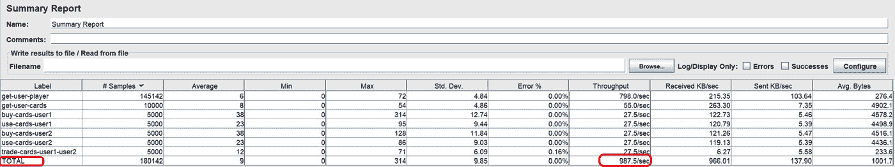

# 第七章：寻找瓶颈并优化你的应用程序

如果你不遵循系统化的方法，找到使你的应用程序表现低于预期的原因可能会很困难。在优化应用程序时，重要的是将你的努力集中在事实而不是猜测上。因此，在本章中，我们将利用第*3 章*中的工具和经验，通过分析应用变更的足迹来解决一些常见挑战。

在本章中，你将学习如何使用可观察性工具来找到你应用程序的瓶颈，并应用一些常见的应用程序优化技术，如缓存和运行时调整。你还将学习如何通过使用自 Spring Boot 3 发布以来一直支持的本地应用程序来提高你的应用程序的启动时间和资源消耗。

我们将运行一些负载测试，以对我们的应用程序施加压力，并学习如何分析结果。

在本章中，我们将介绍以下食谱：

+   调整数据库连接池

+   缓存依赖项

+   使用共享缓存

+   使用 Testcontainers 与 Redis 缓存一起使用

+   使用 Spring Boot 创建原生镜像

+   使用 GraalVM 跟踪代理配置本地应用程序

+   使用 Spring Boot 创建原生可执行文件

+   从 JAR 文件创建原生可执行文件

# 技术要求

我创建了一个应用程序，我们将在本章中对其进行优化。这个应用程序提供了一些 RESTful API 来管理足球数据。该应用程序使用 PostgreSQL 作为数据存储库。你可以在 https://github.com/PacktPublishing/Spring-Boot-3.0-Cookbook/上找到它，在`chapter7/football`文件夹中。这个应用程序已经配置了可观察性，通过 Actuator 暴露了 Prometheus 端点。要监控应用程序，你可以使用 Prometheus 和 Grafana。

Prometheus 配置

你需要配置 Prometheus，如*3 章*中“将你的应用程序与 Prometheus 和 Grafana 集成”食谱中所述。我已经准备好了`prometheus.yml`文件。你需要获取你计算机的 IP 地址并将其设置在`prometheus.yml`文件中。

我创建了一个 Grafana 仪表板来监控应用程序的性能。为了制作它，我使用了以下仪表板作为起点，并对其进行了调整以适应我们的目的：[`grafana.com/grafana/dashboards/12900-springboot-apm-dashboard/`](https://grafana.com/grafana/dashboards/12900-springboot-apm-dashboard/)。

除了 PostgreSQL、Prometheus 和 Grafana 之外，我们还将使用 Redis 来处理一些食谱。像往常一样，在计算机上运行所有这些服务的最简单方法是使用 Docker。你可以在产品页面：[`www.docker.com/products/docker-desktop/`](https://www.docker.com/products/docker-desktop/)上获取 Docker。我将在相应的食谱中解释如何部署每个工具。

您可能需要一个工具来在 PostgreSQL 中执行 SQL 脚本。您可以使用`psql`命令行工具或更用户友好的*PgAdmin*工具。您可以在*第五章*中查看*将应用程序连接到 PostgreSQL*的菜谱以获取更多详细信息。

我准备了一些 JMeter 测试来在应用程序上生成一些负载。您可以从项目网站[`jmeter.apache.org`](https://jmeter.apache.org)下载 JMeter。

对于一些与原生应用程序相关的菜谱，您将需要**GraalVM** JDK。您可以根据官方网站[`www.graalvm.org/downloads/`](https://www.graalvm.org/downloads/)上的说明进行安装。

本章将要演示的所有菜谱都可以在以下位置找到：[`github.com/PacktPublishing/Spring-Boot-3.0-Cookbook/tree/main/chapter7`](https://github.com/PacktPublishing/Spring-Boot-3.0-Cookbook/tree/main/chapter7)

# 调整数据库连接池

数据库连接是一种昂贵的资源，当它们第一次创建时可能需要一些时间。因此，Spring Boot 使用一种称为连接池的技术。当使用连接池时，应用程序不会直接与数据库建立连接；相反，它向连接池请求一个可用的连接。当应用程序不需要连接时，它会将其返回到池中。连接池通常在应用程序启动时创建一些连接。当连接返回到池中时，它们不会被关闭，而是由应用程序的其他部分重用。

在操作应用程序时，一个常见的挑战是确定连接池的大小。如果大小太小，在一定的负载下，一些请求会因为等待连接池中的连接变得可用而花费更长的时间。如果连接池太大，它将在数据库服务器上浪费资源，因为打开的连接是昂贵的。

在这个菜谱中，我们将学习如何使用标准指标和监控工具在 Spring Boot 应用程序中监控数据库连接池。我们将使用在*第三章*中学到的技术和工具。

## 准备工作

在这个菜谱中，您将优化我已经为此目的准备的应用程序。您可以在书籍的 GitHub 仓库[`github.com/PacktPublishing/Spring-Boot-3.0-Cookbook/`](https://github.com/PacktPublishing/Spring-Boot-3.0-Cookbook/)中找到该应用程序，在`chapter7/football`文件夹中。我建议将文件夹的内容复制到您的当前工作目录，因为我们将对每个菜谱在基础项目上应用不同的优化。

应用程序使用 PostgreSQL 作为数据库引擎，并配置了使用 Zipkin、Prometheus 和 Grafana 进行监控。你可以在 Docker 中运行所有这些依赖服务；为此，我在`chapter7/docker`文件夹中准备了一个`docker-compose-base.yml`文件。你可以通过在包含文件的目录中打开终端并执行以下命令来运行此`docker-compose-base.yml`文件：

```java
docker-compose -f docker-compose-base.yml up
```

Prometheus 服务有一个名为`prometheus.yml`的配置文件，其中包含应用程序抓取配置。它指向我的电脑 IP，但你需要将其更改为你的 IP 配置。你应该配置 Prometheus 数据源和*SpringBoot APM 仪表板*。有关更多详细信息，请参阅*第三章*中的*将应用程序与 Prometheus 和 Grafana 集成*配方。

我已经准备了一个 JMeter 测试来在应用程序上生成工作负载。你可以在`chapter7/jmeter/Football.jmx`中找到它。此测试模拟了示例足球交易应用程序的常见用例。测试执行以下步骤：

1.  一个用户购买了一些卡片。

1.  另一位用户购买了一些卡片。

1.  两位用户都试图在他们自己的专辑中使用这些卡片。

1.  然后，第一位用户从第二位用户那里获得了所有可用的卡片，反之亦然，第二位用户从第一位用户那里获得了所有可用的卡片。

1.  两位用户检查来自另一位用户的卡片上的球员。

1.  他们之间交换他们可用的卡片。

测试有 10 个线程同时运行，请求之间没有思考时间。

## 如何做到这一点...

我们将启动应用程序，并确保我们在 Grafana 中看到应用程序指标。准备好寻找应用程序瓶颈并优化它了吗？让我们行动起来吧！

1.  首先，我们将启动应用程序，并检查我们是否在 Grafana 中看到应用程序指标。我将假设你已经按照*准备就绪*部分中解释的那样启动了所有依赖服务：

    +   在`http://localhost:3000`打开 Grafana，然后打开 SpringBoot APM 仪表板。

    +   确保你可以在**基本静态**和**HikariCP 静态**部分看到数据。

1.  启动 JMeter 应用程序并打开`football.jmx`文件，该文件位于`chapter7/jmeter`文件夹中。

1.  执行 JMeter 测试，等待其完成。测试执行可能需要几分钟才能完成：

    +   在测试执行过程中，检查 Grafana 中**HikariCP 统计**部分的连接指标。

    +   你会看到存在挂起的连接：


图 7.1：Hikari 连接指标

你还可以看到**连接获取时间**值始终超过 4 毫秒。


图 7.2：连接获取时间

+   你可以通过打开**摘要** **报告**项来查看结果摘要。


图 7.3：摘要报告

您也可以在测试运行时查看它们，但基线将在完成后确定。



图 7.4：总结报告结果 – 基线结果

在我的环境中，总吞吐量为 987.5 **每秒请求**（**RPS**），最常用的请求是 **get-user-player**，总共有 145,142 个请求，吞吐量为 798 RPS。请注意，**get-user-player** 操作的平均时间为 6 毫秒。请将您电脑上执行此测试的结果保存下来，因为我们在优化后将会比较它们。

1.  现在，我们将通过增加数据库连接的最大数量来更改 HikariCP 设置。为此，打开 `resources` 文件夹中的 `application.yml` 文件，并将 `spring.datasource.hikari.maximum-pool-size` 设置增加至 `10`。

1.  让我们重复相同的性能测试并看看差异。但在那之前，让我们清理数据以在相同的条件下执行测试：  

    1.  我准备了一个名为 `cleanup.sql` 的脚本，您可以通过运行它来清理数据库。您可以在 `chapter7/dbscripts` 文件夹中找到它。

    1.  在 JMeter 中，使用 **清除所有** 按钮重置结果。

1.  测试完成后，将结果与基线进行比较。我的电脑上的结果如下：

    +   总吞吐量为 1,315 RPS。这比基线 987.5 RPS 大约提高了 33% 的性能。

    +   **get-user-player** 请求的吞吐量为 1,085.3 RPS。这比基线 798 RPS 大约提高了 36% 的性能。

    +   **get-user-player** 操作的平均响应时间为 2 毫秒。在基线中，它是 6 毫秒。这快了三倍。

    如果您在 Grafana 中查看 **HikariCP 统计信息**，您将看到没有挂起的连接，并且连接获取时间已经减少。我的电脑上的连接获取时间指标始终低于 10 微秒。

## 它是如何工作的...

Spring Boot 使用 HikariCP 作为 JDBC 数据源连接池。如果您没有指定任何池大小，默认值为 10。为了学习目的，我在初始示例中将最大连接数配置为四个。在初始负载测试期间，我们在 Grafana 中观察到挂起的连接数在整个测试期间始终保持在零以上。这意味着始终有一个请求正在等待可用的数据库连接。

正如我们在连接获取时间指标中看到的那样，平均来说，获取连接所需的时间为 4 毫秒。这意味着对于每个请求，我们需要为每个涉及的数据库操作添加 4 毫秒。对于像 **get-user-player** 这样的快速操作，在没有连接可用时，所需时间是两倍。一旦我们增加了连接池的大小，这个操作就提高了其性能，并且在这个场景中是最常用的操作。

其余的操作也受益于这种新的配置，但由于可用连接的请求时间较长，相对性能提升并不高。

在这个配方中，我们专注于数据库连接的数量。但同样的方法可以应用于其他类型的应用程序指标，例如 Tomcat 并发线程的数量。您可以使用应用程序暴露的可观察性数据，并相应地调整您的设置以适应您的负载。

## 还有更多...

在这个配方中，我们通过增加在某一时刻同时使用的最大连接数来固定连接可用性，即 10 个连接。正如所述，数据库连接是一种昂贵的资源，应该明智地使用。让我们考虑一个具有多个服务实例的场景。为您的应用程序提供的每个额外连接都应该乘以实例的数量。比如说，您有 10 个应用程序实例；那么，任何额外的连接都应该乘以 10。

在基准测试执行期间，我们检测到最多有六个挂起的连接，因此我们将这六个连接添加到最初的四个连接中。如果最大挂起连接数仅在少数几个峰值期间发生，我们可以将最大连接数调整为比检测到的最大值少 1 或 2 个连接。例如，在我们的场景中，我们可以将最大连接数调整为 9，重复负载测试，并观察其影响。

另一个潜在的调整是配置最小和最大连接数。然后，如果有峰值且没有可用连接，HikariCP 将创建一个数据库连接。记住创建数据库连接所需的时间和这个连接将空闲的时间。当定义了最小和最大连接数时，HikariCP 可以在空闲时关闭物理连接。如果峰值太短，您可能会创建一个连接，其创建时间将比等待可用连接更长，然后您将有一个空闲连接在数据库服务器上消耗资源。

# 缓存依赖

我们想要优化的足球交易应用中最常见的流程如下：有时，用户购买一些卡片，并在他们的专辑中使用后，试图与其他用户交换他们已经拥有的冗余卡片。在开始交换过程之前，用户会查看其他用户可用的球员。可能会有数千甚至数百万张卡片，但足球运动员的总数大约为 700，他们不断从足球交易应用中检索。

现在，您想要优化应用程序的性能。因此，您正在考虑使用缓存机制来避免从数据库检索频繁访问但很少更改的数据。

在这个配方中，您将学习如何识别数据库瓶颈以及如何应用 Spring Boot 提供的缓存机制。您将学习如何使用您在*第三章*中了解到的可观察性工具来衡量改进。

## 准备工作

在这个配方中，您将继续优化我为这个目的准备的应用程序。您可以使用来自*调整数据库连接池*配方版本的版本。您可以在本书的 GitHub 存储库中找到该应用程序，在[`github.com/PacktPublishing/Spring-Boot-3.0-Cookbook/`](https://github.com/PacktPublishing/Spring-Boot-3.0-Cookbook/)的`chapter7/recipe7-2/start`文件夹中。

如我们在前面的配方中解释的那样，您可以通过运行位于`chapter7/docker`文件夹中的`docker-compose-base.yml` Docker Compose 文件来在 Docker 中运行所有依赖服务。为此，打开一个终端并执行以下命令：

```java
docker-compose -f docker-compose-base.yml up
```

我们将使用之前配方中使用的相同的 JMeter 测试。您可以在`chapter7/jmeter/football.jmx`中找到它。

## 如何操作…

让我们从执行 JMeter 负载测试以确定性能基线开始。然后，我们将对应用程序的不同部分应用缓存，并测量改进：

1.  我们可以使用来自*调整数据库连接池*配方测试的 JMeter 执行结果。


图 7.5：JMeter 总结报告 – 基线请求吞吐量详情

在我的环境中，总吞吐量为 1,340.3 RPS，最常用的请求是**get-user-player**，总共有 145,683 个请求，吞吐量为 1,085.3 RPS。请将执行此测试的结果保存在您的计算机上，因为我们在优化后将会比较它们。

1.  现在我们有了应用程序基线，我们将启用缓存：

    1.  首先，将*Spring Cache Abstraction*启动器添加到`pom.xml`文件中：

    ```java
    <dependency>
        <groupId>org.springframework.boot</groupId>
        <artifactId>spring-boot-starter-cache</artifactId>
    </dependency>
    ```

    1.  接下来，在`FootballApplication`类中，添加`@EnableCaching`注解：

    ```java
    @EnableCaching
    @SpringBootApplication
    public class FootballApplication {
    ```

1.  接下来，我们将修改`FootballService`类的`getPlayer`方法以缓存响应。这是在`@Cacheable`中调用的方法如下：

    ```java
    @Cacheable(value = "players")
    public Player getPlayer(Integer id) {
        return playerRepository.findById(id).map(p -> playerMapper.map(p)).orElse(null);
    }
    ```

1.  让我们再次执行 JMeter 测试。但在那之前，让我们清理数据以在相同条件下执行测试：

    1.  我准备了一个名为`cleanup.sql`的脚本，您可以通过运行它来清理数据库。您可以在`chapter7/dbscripts`文件夹中找到它。

    1.  在 JMeter 中，使用**清除所有**按钮重置结果。

1.  一旦测试完成，检查结果并与基线进行比较。我的计算机上的结果如下：


图 7.6：在 FootballService 上应用缓存后的总结报告

+   总吞吐量从 1,340.3 RPS 跃升至 1,806.7 RPS，大约提高了 34%的性能。

+   **get-user-player** 请求为 1,458.5 RPS，基线为 1,085.3 RPS，这意味着性能也提高了大约 34%。

+   其余的请求也增加了大约 34% 的整体吞吐量。例如，**get-user-cards** 从 74.5 RPS 上升到 100.1 RPS，其他请求从 37.2 RPS 上升到 50.1 RPS。

1.  让我们在应用程序的不同位置使用缓存。不是在 `FootballService` 中应用 `@Cacheable` 注解，而是在 `PlayersController` 类的 `getPlayer` 方法中应用注解：

    ```java
    @Cacheable(value = "players")
    @GetMapping("/{id}")
    public Player getPlayer(@PathVariable Integer id) {
        return footballService.getPlayer(id);
    }
    ```

## 它是如何工作的...

通过添加 *Spring Cache Abstraction* 启动器并使用 `@EnableCaching` 注解，Spring Boot 会检查 Beans 中公共方法上是否存在缓存注解，并创建一个代理来拦截方法调用并相应地处理缓存行为；在我们的例子中，是带有 `@Cacheable` 注解的方法。Spring Boot 注册了一个 `CacheManager` Bean 来处理缓存项，因为我们没有指定任何特定的 `CacheManager`。Spring Boot 使用默认实现，一个 `ConcurrentHashMap` 对象，并在处理过程中进行管理。这种方法适用于不经常变化且数据集较小的元素。否则，你可能想使用外部共享缓存。在下一个菜谱中，我们将处理这种情况。

在这个菜谱中，我们只优化了 `get-user-player`。它是这个菜谱中所有操作的最佳候选者。原因是修改数据频率较高的操作不适合缓存，所以 `buy-cards`、`use-cards` 和 `trade-cards` 不能被缓存，因为它们修改数据并且经常被使用。唯一只读取数据的操作是 `get-user-cards` 和 `get-user-player`。`get-user-cards` 不是一个好的候选者，因为用户拥有的卡片每次购买、交换或用于专辑时都会改变，这意味着缓存将频繁更新。此外，用户数量很高，大约有 100,000，所以将这些元素添加到应用程序内存中可能是适得其反的。另一方面，`get-user-player` 只检索球员信息。这些信息变化非常不频繁，而且只有几百名球员。因此，`get-user-player` 是缓存的最佳候选者。

通过在 `FootballService` 类中添加缓存，该操作的吞吐量显著提高，但它也使其他操作受益。原因是尽管这是一个快速的数据库请求，但它是最频繁的操作。可用的数据库连接数由 `hikaricp` 连接池定义；我们配置了 10 个连接。所有操作都应该从 `hikaricp` 获取连接。由于最频繁的操作减少了，其他操作获取连接的速度更快。

## 还有更多...

我建议你在运行测试时检查应用在 Grafana 中暴露的指标。在这个场景中，有两个主要区域需要观察：

+   **基本统计**：在这里，我们可以找到每个应用的经典指标：

    +   **CPU 使用率**：这通常是要求高的计算应用的限制因素。在我的电脑上的测试中，它始终低于 70%。

    +   **堆内存使用**：这是我们的应用使用的堆内存。它可能会限制我们应用的性能。

    +   **非堆内存使用**：这是我们的应用使用的所有其他内存。它通常占应用总内存使用的不到 30%，并且其使用比堆内存更稳定。

+   **HikariCP 统计**：正如我们在前面的菜谱中所见，HikariCP 是 Spring Boot 中的默认数据库连接池。创建到 PostgreSQL 或任何其他数据库引擎的连接都是昂贵的。你可以检查以下与 HikariCP 相关的指标：

    +   **活跃**：这是池外用于在数据库中执行操作的连接数量。

    +   **闲置**：这是池中可供使用以备不时之需的可用连接数量。

    +   **挂起**：这是等待可用连接以访问数据库的操作数量。理想情况下，这个指标应该是 0。

    +   **连接创建时间**：这是创建到数据库的物理连接所花费的时间。

    +   **连接使用时间**：这是连接被返回到池中之前的使用时长。

    +   **连接获取时间**：这是获取连接所需的时间。当有闲置连接时，所需时间会非常低。当有挂起的连接时，所需时间会更高。


图 7.7：Grafana 中的 HikariCP 指标

你可能想要缓存操作，就像我们在本菜谱中所做的那样，以减少对数据库的连接次数。

在下一个菜谱中，我们将学习如何使用 Redis 作为外部缓存以及如何更新它。

# 使用共享缓存

样本足球交易应用需要覆盖一个新的场景。一些足球运动员可以胜任不同的位置，有时是后卫，有时是中场。球员不会频繁更换位置，但这种情况可能发生。正如我们在前面的菜谱中学到的，缓存球员可以显著提高应用性能。我们假设同时运行多个应用实例是可能的，也是推荐的。当一个球员被更新时，所有应用实例都应该返回球员的最新版本。

在这个菜谱中，我们将学习如何使用所有应用实例共享的外部缓存，以及当底层数据被修改时如何更新缓存。

## 准备工作

在这个菜谱中，我们将重用前一个菜谱生成的应用程序，因为它已经配置好了缓存。我在 GitHub 仓库中准备了一个工作版本，网址为[`github.com/PacktPublishing/Spring-Boot-3.0-Cookbook/`](https://github.com/PacktPublishing/Spring-Boot-3.0-Cookbook/)。它位于`chapter7/recipe7-3/start`文件夹中。

应用程序使用 PostgreSQL 作为数据库引擎，配置了 Zipkin、Prometheus 和 Grafana 以进行可观察性。

由于我们将添加对 Redis 的缓存支持，我们需要一个 Redis 服务器。在您的计算机上运行 Redis 的最简单方法是使用 Docker。

我准备了一个名为`docker-compose-redis.yml`的 Docker Compose 文件，其中包含所有依赖服务，即 PostgreSQL、Zipkin、Prometheus、Grafana 和 Redis。你可以在`chapter7/docker`文件夹中找到该文件。要运行所有依赖服务，请在`chapter7/docker`文件夹中打开一个终端并运行以下命令：

```java
docker-compose -f docker-compose-redis.yml up
```

我为这个菜谱准备了一个 JMeter 测试来生成负载。你可以在`chapter7/jmeter/Football-updates.jmx`中找到它。除了前一个菜谱中实现的流程外，它还会不时更新足球运动员的位置。

## 如何操作...

我们将首先准备应用程序以使用 Redis，然后确保当球员被修改时缓存会更新：

1.  首先，我们将添加`Spring Data Redis`启动器依赖项。为此，只需在`pom.xml`文件中添加以下依赖项：

    ```java
    <dependency>
        <groupId>org.springframework.boot</groupId>
        <artifactId>spring-boot-starter-data-redis</artifactId>
    </dependency>
    ```

1.  你需要添加以下依赖来管理`LocalDate`字段：

    ```java
    <dependency>
        <groupId>com.fasterxml.jackson.datatype</groupId>
        <artifactId>jackson-datatype-jsr310</artifactId>
        <version>2.16.1</version>
    </dependency>
    ```

1.  接下来，我们需要配置 Redis。为此，我们将注册一个`RedisCacheConfiguration` Bean。让我们创建一个新的配置类；你可以命名为`RedisConfig`：

    ```java
    @Configuration
    public class RedisConfig {
        @Bean
        public RedisCacheConfiguration cacheConfiguration() {
            ObjectMapper mapper = new ObjectMapper();
            mapper.registerModule(new JavaTimeModule());
            Jackson2JsonRedisSerializer<Player> serializer = new Jackson2JsonRedisSerializer<>(mapper, Player.class);
            return RedisCacheConfiguration.defaultCacheConfig()
                    .entryTtl(Duration.ofMinutes(10))
                    .disableCachingNullValues()
                    .serializeValuesWith(SerializationPair.fromSerializer(serializer));
        }
    }
    ```

1.  最后，你必须确保当底层数据更新时，缓存也会更新。让我们通过在`FootballService`类中添加`@CacheEvict`注解来修改`updatePlayerPosition`方法：

    ```java
    @CacheEvict(value = "players", key = "#id")
    public Player updatePlayerPosition(Integer id,
                                       String position)
    ```

1.  现在，你可以运行 JMeter 测试来验证应用程序并测量性能影响。为此，我准备了一个名为`Football-updates.jmx`的测试。你可以在`chapter7/jmeter`文件夹中找到它。这个测试会随机但非常不频繁地更新球员的位置，然后检索球员以验证其位置是否已更新。


图 7.8：JMeter 测试，显示球员更新的详细信息

在我的计算机上，总吞吐量为 1,497.5 RPS，`get-user-players`为 1,210.6 RPS。Redis 缓存的性能略低于进程内缓存。然而，将缓存外部化使得可以通过添加更多实例来实现水平扩展。

## 它是如何工作的...

当添加外部缓存实现时，应用程序需要将需要缓存的对象序列化以通过网络发送并将它们保存到 Redis 中。默认的 Redis 配置可以管理基本类型，如`String`或`int`，无需额外配置。然而，在这个示例应用程序中，我们需要缓存`Player`对象。为了使用默认配置，`Player`类应该实现`Serializable`接口。

为了避免修改我们的领域类，我们配置了一个`Jackson2JsonRedisSerializer`序列化器。这个序列化器将对象表示为 JSON 字符串。玩家有一个关于`birthDate`字段的限制，因为它属于`LocalDate`类型，无法使用默认实现来管理。这就是我们添加`com.fasterxml.jackson.datatype:jackson-datatype-jsr310`依赖并在`ObjectMapper`中注册`JavaTimeModule`以用于`RedisCacheConfiguration`的原因。

考虑使用外部缓存存储库的影响很重要：

+   正如我们刚刚学习的，我们必须确保缓存的对象可以被序列化。

+   你还需要考虑网络延迟。我在我的电脑上本地执行了所有负载测试，所以没有网络延迟。在实际环境中，它也可能影响应用程序的性能。

+   缓存服务器可能成为新的瓶颈。Redis 非常高效，但它可能意味着需要向你的解决方案添加新资源，例如新服务器。

在我的负载测试结果中，我没有注意到显著的性能差异，因为所有操作都在同一台电脑上运行；然而，你可能在具有跨不同服务器分布的服务器的生产环境中期望有轻微的差异。

如果你将 Redis 运行在不同的服务器上，你必须配置服务器地址。默认情况下，*Spring Data Redis*启动器假定 Redis 运行在`localhost`并监听端口`6379`。

在这个菜谱中，我们使用了`@CacheEvict`注解来更新缓存。这个注解通过键来删除条目。默认情况下，这个注解使用所有方法参数作为缓存条目的键。然而，`updatePlayerPosition`方法有两个参数：玩家的`id`和新的`position`。因为键只是玩家的`id`，所以我们指定了`@CacheEvict`注解的`position`字段中。其他选项，如清除所有条目，不适用于我们的场景。

# 使用带有 Redis 缓存的 Testcontainers

如果你在前一个菜谱中执行了示例项目中可用的自动化测试，你可能已经注意到使用需要 Redis 的方法的测试失败。原因是测试执行期间 Redis 不可用。

在这个菜谱中，我们将学习如何使用 Testcontainers 设置作为 Docker 容器托管的 Redis 服务器。

## 准备工作

在这个菜谱中，我们将为在*使用共享缓存*菜谱中创建的项目创建测试。如果你还没有完成，请使用我为这个菜谱准备的版本作为起点。你可以在书的 GitHub 仓库[`github.com/PacktPublishing/Spring-Boot-3.0-Cookbook`](https://github.com/PacktPublishing/Spring-Boot-3.0-Cookbook)中的`chapter7/recipe7-4/start`文件夹中找到它。

随着我们使用 Testcontainers，你需要在电脑上安装 Docker。

## 如何做…

我们喜欢可靠的应用程序。让我们让我们的测试工作起来！

1.  我们将在`FootballServiceTest`类中做出所有更改。所以，打开它并添加一个新的静态字段，类型为`GenericContainer`。我们将暴露默认的 Redis 端口`6379`，并使用最新的`redis`镜像：

    ```java
    static GenericContainer<?> redisContainer = new GenericContainer<>("FootballServiceTest.Initializer class, by adding the properties to configure the connection to Redis:

    ```

    static class Initializer

    implements ApplicationContextInitializer<ConfigurableApplicationContext> {

    public void initialize(ConfigurableApplicationContext configurableApplicationContext) {

    TestPropertyValues.of(

    "spring.datasource.url=" + postgreSQLContainer.getJdbcUrl(),

    "spring.datasource.username=" + postgreSQLContainer.getUsername(),

    "spring.datasource.password=" + postgreSQLContainer.getPassword(),

    "spring.data.redis.host=" + redisContainer.getHost(),

    "spring.data.redis.port=" + redisContainer.getMappedPort(6379))

    .applyTo(configurableApplicationContext.getEnvironment());

    }

    }

    ```java

    ```

1.  最后，在执行测试之前启动容器：

    ```java
    @BeforeAll
    public static void startContainer() {
        postgreSQLContainer.start();
        redisContainer.start();
    }
    ```

1.  你现在可以运行测试了。它们应该能正常工作！

## 它是如何工作的…

为了将 Redis 集成到我们的测试中，我们只需要一个可用的 Redis 服务器。Testcontainers 中有一个专门的 Redis 模块。你可以在[`testcontainers.com/modules/redis/`](https://testcontainers.com/modules/redis/)找到它。由于集成相当简单，我们可以使用`GenericContainer`而不是专门的`RedisContainer`。

如我们在之前的菜谱中学习到的，通过在我们的测试类中添加`@Testcontainers`注解，它将自动扫描所有容器字段并将它们集成到测试中。`FootballServiceTest`已经通过集成 PostgreSQL 而注解了`@Testcontainers`。我们只需要添加一个新的容器，在这种情况下就是`GenericContainer`，并执行基本的配置来设置它。具体如下：

+   使用最少的配置：镜像和暴露的端口来配置容器。

+   在应用程序上下文中设置 Redis 配置连接数据。我们在`FootballServiceTest.Initializer`类中做了这件事。Redis 启动器期望在`spring.data.redis`下配置。我们添加了主机和端口，但只需要端口。默认情况下，它期望主机在`localhost`。

+   在测试执行之前启动容器。我们在带有`@BeforeAll`注解的方法中做了这件事。

# 使用 Spring Boot 创建原生镜像

通常，当我们使用面向微服务的方法设计解决方案时，我们想象我们可以通过添加和删除我们应用程序的新实例来轻松扩展我们的应用程序，我们也想象这个过程是立即发生的。然而，启动我们应用程序的新实例可能需要比我们最初预期的更长的时间。Spring Boot 在应用程序启动期间协调 Bean 初始化、依赖注入和事件处理，并且这些步骤中的大多数都是动态发生的。这对小型应用程序来说不是一个大问题，但对于复杂的应用程序，这个过程可能需要几分钟才能完成。

在设计应用程序时，另一个重要因素是高效使用计算资源。我们希望应用程序尽可能少地消耗内存并高效处理工作负载。

对于这种场景，我们可以考虑创建原生应用程序，即作为特定处理器家族和操作系统的最终二进制文件构建的应用程序。一个普通的 Java 应用程序生成中间代码，该代码在应用程序运行时由 **Java 虚拟机** (**JVM**) 处理并转换为二进制代码。在原生应用程序中，这个过程发生在构建时。

在这个菜谱中，我们将学习如何创建一个新的 Spring Boot 原生应用程序。

## 准备工作

对于这个菜谱，我们需要 Docker。你可以查看本章的 *技术要求* 部分以获取更多信息。

## 如何做到这一点…

让我们使用 Spring Boot 创建一个原生应用程序！

1.  打开 *Spring Boot Initializr* 工具，访问 [`start.spring.io`](https://start.spring.io)，并使用与你在 *第一章* 中 *创建一个 RESTful API* 菜单中使用的相同选项，并使用相同的参数，除了以下选项：

    +   对于 `footballnative`

    +   对于 **依赖项**，选择 **Spring Web** 和 **GraalVM** **原生支持**

1.  接下来，创建一个示例 RESTful 控制器；例如，创建一个 `TeamController` 控制器和一个返回团队列表的方法：

    ```java
    @RequestMapping("/teams")
    @RestController
    public class TeamController {
        @GetMapping
        public List<String> getTeams() {
            return List.of("Spain", "Zambia", "Brazil");
        }
    }
    ```

1.  你可以像往常一样在 JVM 上运行应用程序，但我们现在要创建一个原生 Docker 镜像。为此，打开你的终端并执行以下 Maven 命令：

    ```java
    mvnw -Pnative spring-boot:build-image
    ```

    请耐心等待，因为这个步骤可能需要几分钟才能完成，具体取决于你电脑的资源。

1.  构建完成后，你可以在终端中执行以下命令来运行我们的原生应用程序的 Docker 镜像：

    ```java
    docker run --rm -p 8080:8080 footballnative:0.0.1-SNAPSHOT
    ```

1.  现在，你可以像通常一样对 RESTful 应用程序进行请求；例如，你可以使用以下 `curl` 命令：

    ```java
    curl http://localhost:8080/teams
    ```

## 它是如何工作的…

GraalVM 本地支持依赖添加了一个新的 `native` 配置文件，可以与标准的 Spring Boot `build-image` 目标一起使用，以生成针对 **GraalVM** 的镜像。GraalVM 是一个 Java 运行时环境，可以将您的应用程序 **即时编译**（**AOT**）成原生可执行文件，具有低资源消耗、快速启动和增强的安全性。为了创建原生镜像，Maven 插件在 Docker 容器中使用 **Paketo Buildpacks** 构建本地的 GraalVM 可执行文件。Paketo Buildpacks 是一套由社区驱动的工具，简化了将应用程序作为容器镜像构建和部署的过程。这就是为什么您不需要在您的计算机上下载 GraalVM 工具的原因。

结果是一个包含我们的应用程序作为原生可执行文件的 Docker 镜像。仅作为性能改进的参考，该应用程序在我的运行 JVM 的计算机上启动需要大约 1.5 秒，而原生镜像完成同样的操作只需要 0.07 秒。这大约是 21 倍的快。然而，当运行 10,000 个请求时，两个版本的总体吞吐量相当接近，JVM 版本的性能略好。这可能是因为原生版本运行在 Docker 上，而 JVM 直接运行在我的计算机上。我准备了一个 JMeter 测试，您可以使用它来比较您计算机上的结果。您可以在书籍的 GitHub 仓库 [`github.com/PacktPublishing/Spring-Boot-3.0-Cookbook`](https://github.com/PacktPublishing/Spring-Boot-3.0-Cookbook) 中的 `chapter7/jmeter` 文件夹找到一个名为 `teams-native.jmx` 的测试。

原生应用程序并不是适用于所有场景的万能药。您需要考虑，某些功能在运行时需要动态处理，并且它们难以用原生应用程序处理。如果您的应用程序没有快速启动时间的要求，原生应用程序不会带来很多好处，并且可能会有很多不便。从性能的角度来看，JVM 应用程序在长期内与原生应用程序表现相当。也就是说，在预热后，它的工作效果与原生应用程序一样；在内存管理方面可能会有一些改进，但在性能方面它们相当相似。

# 使用 GraalVM 跟踪代理配置原生应用程序

在上一个菜谱中创建的小型本地应用程序看起来非常有前景，因此我们决定构建一个更大的足球应用程序作为原生应用程序。

在 *使用 Spring Boot 创建本地镜像* 菜谱中创建的应用程序不需要任何特殊配置。但是，本地应用程序是 AOT 构建的。这意味着编译器需要静态分析所有代码并检测运行时到达的代码。有一些 Java 技术，如 **Java 本地接口**（**JNI**）、**反射**、**动态代理**对象和类路径资源，仅通过静态代码分析很难检测到。本地编译器可以使用配置文件将所需的组件包含在最终的二进制文件中。正如你可能已经想到的，困难的部分是通过检测要包含在最终二进制文件中的组件来配置这些文件。为此，GraalVM 提供了一个代理，在常规 JVM 应用程序上执行应用程序时追踪对这些类型技术的所有使用。

在这个菜谱中，我们将构建本章提供的示例应用程序的本地图像。如果你尝试直接以本地图像构建应用程序，你将在运行时遇到一些错误。在这个菜谱中，我们将学习如何使用 GraalVM 追踪代理来查找所有必需的组件，并为现有应用程序构建本地图像。然后，你将能够在 Docker 中运行你的应用程序。

## 准备工作

在这个菜谱中，我们将适应你在 *使用 Testcontainers 与 Redis 缓存一起使用* 菜谱中创建的应用程序。如果你还没有完成，你可以使用我提供的功能项目作为这个菜谱的起点。你可以在本书的 GitHub 仓库中找到它：[`github.com/PacktPublishing/Spring-Boot-3.0-Cookbook`](https://github.com/PacktPublishing/Spring-Boot-3.0-Cookbook) 中的 `chapter7/recipe7-6/start` 文件夹。

你需要在你的计算机上安装 GraalVM JDK。你可以按照官方网站上的说明进行安装：[`www.graalvm.org/downloads/`](https://www.graalvm.org/downloads/)。

应用程序依赖于 PostgreSQL、Redis 和其他服务。正如我们将在 *如何操作...* 部分中看到的，我们将以 Docker 容器的形式运行应用程序。为了方便在开发计算机上执行，我准备了一个名为 `docker-compose-all.yml` 的 Docker Compose 文件，其中包含应用程序和所有依赖服务。

## 如何操作...

让我们构建一个本地的可执行镜像文件，用于我们的 Spring Boot 应用程序。我们将看到它现在运行得多快！记住，我们最初创建这个应用程序时是一个常规的 JVM 应用程序：

1.  首先，我们将向我们的 `pom.xml` 应用程序添加 *GraalVM 本地支持* 插件。你应该在 `build/plugins` 元素中包含以下配置：

    ```java
    <plugin>
        <groupId>org.graalvm.buildtools</groupId>
        <artifactId>native-maven-plugin</artifactId>
    </plugin>
    ```

1.  接下来，我们还需要添加 Hibernate Enhance 插件。你应该在 `build/plugins` 元素中包含以下配置：

    ```java
    <plugin>
        <groupId>org.hibernate.orm.tooling</groupId>
        <artifactId>hibernate-enhance-maven-plugin</artifactId>
        <version>${hibernate.version}</version>
        <executions>
            <execution>
                <id>enhance</id>
                <goals>
                    <goal>enhance</goal>
                </goals>
                 <configuration>
                     <enableLazyInitialization>true</enableLazyInitialization>
                     <enableDirtyTracking>true</enableDirtyTracking>
                     <enableAssociationManagement>true</enableAssociationManagement>
                 </configuration>
             </execution>
         </executions>
    </plugin>
    ```

1.  在此步骤中，我们将使用 GraalVM JVM 并带有特殊设置来运行应用程序，以跟踪应用程序在运行时使用的组件。原生编译器将使用这些跟踪将那些组件包含在最终的二进制可执行文件中：

    +   此步骤需要你使用 GraalVM JVM。根据你使用的安装方法不同，切换 Java 版本的方式可能不同。我使用了 *SDKMAN!* 工具，它只需在你的终端中执行以下命令：

        ```java
        sdk use java 21-graalce
        ```

    +   为了确保你使用正确的 JVM 版本，请在你的终端中执行以下命令：

        ```java
        java -version
        ```

    +   确认响应中包含 GraalVM。作为一个参考，这是我在我的电脑上执行此命令时的输出：


图 7.9：GraalVM JVM 的示例 java -version 输出

+   正常构建应用程序，即通过在 Maven 中执行 `package` 目标。在应用程序根目录的终端中执行此命令：

    ```java
    ./mvnw package
    ```

+   此命令为你的应用程序创建 JAR 文件。默认情况下，文件名将是 `football-0.0.1-SNAPSHOT.jar`，它将在 `target` 目录中创建。

+   现在，运行 GraalVM 跟踪工具。这是通过执行指定 JVM 代理的应用程序来实现的，即指定 `-agentlib:native-image-agent` 参数并传递保存配置输出的文件夹。我们将设置原生编译器期望的特殊配置文件夹，即 `src/main/resources/META-INF/native-image`。这是如何执行指定 GraalVM 跟踪工具的应用程序的方法：

    ```java
    java -Dspring.aot.enabled=true -agentlib:native-image-agent=config-output-dir=src/main/resources/META-INF/native-image -jar target/football-0.0.1-SNAPSHOT.jar
    ```

1.  现在我们应用程序已经启动并运行，让我们确保我们覆盖了所有基础。执行应用程序的每个路径非常重要，这样我们就可以跟踪所有动态组件，并确保一切准备就绪以构建原生应用程序。你会发现 `src/main/resources/META-INF/native-image` 文件夹包含几个 JSON 文件。

    当你完成所有应用程序路径的执行后，你可以停止应用程序。

1.  是时候构建原生应用程序了！你可以通过执行以下 Maven 命令来完成：

    ```java
    mvn localhost, you will need to specify some settings as environment variables. To make it easier for you, I’ve prepared a Docker Compose file. I named it docker-compose-all.yml, and you can find it in the book’s GitHub repository.On my computer, the native version takes just 1.29 seconds to be ready to accept requests, compared to 6.62 seconds for the JVM version.
    ```

## 它是如何工作的…

如 *使用 Spring Boot 创建原生映像* 菜单中所述，将 *GraalVM Native Support* 添加到我们的应用程序将创建一个新的 Spring Boot 配置文件，我们可以使用它来构建具有我们应用程序原生版本的新 Docker 映像。

一些 Hibernate 操作在运行时生成 Hibernate 代理实例。如果我们不包括 Hibernate Enhance 插件，原生编译器在构建时没有所需的引用。因此，我们需要在我们的应用程序中包含此插件。

在像在*使用共享缓存*菜谱中创建的简单应用程序中，我们可以跳过*步骤 3*和*步骤 4*，直接构建本地应用程序。然而，我们会意识到许多操作不起作用。这是因为静态构建分析没有检测到一些动态加载的组件，这些组件大多与 Hibernate 相关。为了解决这个问题，GraalVM 提供了跟踪代理工具。这个工具跟踪 JNI、Java 反射、动态代理对象（`java.lang.reflect.Proxy`）或类路径资源的所有使用情况，并将它们保存在指定的文件夹中。生成的文件如下：

+   `jni-config.json`: 这包含 JNI 相关信息

+   `reflect-config.json`: 这包含反射相关细节

+   `proxy-config.json`: 这包含动态代理对象详情

+   `resource-config.json`: 这包含类路径资源信息

+   `predefined-classes-config.json`: 这包含预定义类的元数据

+   `serialization-config.json`: 这包含序列化相关数据

然后，本地编译器可以使用此配置将引用的组件包含在最终的本地可执行文件中。采用这种方法，我们可能会找到大多数在运行时使用的组件，但某些组件可能无法检测到。在这种情况下，我们需要手动包含它们。

由于我们将应用程序作为容器运行，它是在 Docker 的上下文中执行的。这意味着为了定位依赖的服务，例如 PostgreSQL，需要指定内部 Docker DNS 名称。在先前的菜谱中，所有依赖服务都可以使用`localhost`访问。因此，需要指定所有依赖组件的地址，例如，通过设置环境变量，而设置这些环境变量的最简单方法是通过创建 Docker Compose 文件。

## 还有更多...

我执行了我们在*使用共享缓存*菜谱中使用的相同的 JMeter 测试，以比较在 JVM 上运行和作为本地应用程序运行的同一种应用程序的结果。在下面的图中，你可以看到作为本地应用程序运行的结果：


图 7.10：在 Docker 上运行的本地图像的 JMeter 吞吐量

结果可能看起来令人惊讶，因为作为本地应用程序运行的应用程序的性能明显低于 JVM 版本。

有两个因素需要考虑：

+   应用程序现在运行在 Docker 上，而运行在 JVM 上的应用程序是直接在我的计算机上执行的

+   一旦在 JVM 上运行的应用程序完成了**即时编译**（**JIT**），与运行相比，性能没有显著提升。

在下一个菜谱中，我们将以本地方式构建应用程序，而不是在容器上运行。然后，我们将能够比较在类似条件下运行的应用程序。

# 使用 Spring Boot 创建本地可执行文件

在之前的菜谱中，我们构建了原生应用程序以作为容器运行。尽管这对于大多数现代云原生场景来说是一个方便的解决方案，但我们可能需要构建一个原生可执行文件，以便在没有容器引擎的情况下直接执行。

在这个菜谱中，我们将学习如何配置我们的计算机以使用 GraalVM JDK 构建原生应用程序。

## 准备就绪

在这个菜谱中，我们将重用 *使用 GraalVM 追踪代理配置原生应用程序* 菜谱的结果。我准备了一个应用程序版本，您可以用作此菜谱的起点。您可以在本书的 GitHub 仓库中找到它，网址为 [`github.com/PacktPublishing/Spring-Boot-3.0-Cookbook/`](https://github.com/PacktPublishing/Spring-Boot-3.0-Cookbook/)，在 `chapter7/recipe7-6/start` 文件夹中。

您需要在您的计算机上安装 GraalVM JDK 版本 21。您可以通过访问官方网站上的说明进行操作，网址为 [`www.graalvm.org/downloads/`](https://www.graalvm.org/downloads/).

应用程序依赖于一些服务，如 PostgreSQL 和 Redis。为了方便在您的计算机上执行这些服务，您可以使用在 *使用共享* *缓存* 菜谱中准备的 `docker-compose-redis.yml` 文件。

## 如何操作……

现在，我们将构建我们的应用程序作为一个原生镜像，可以直接在我们的计算机上执行：

1.  确保您在此过程中使用 GraalVM JVM。为此，执行以下命令：

    ```java
    java -version
    ```

    确认消息中包含 GraalVM，如图 *图 7**.5* 所示。

1.  接下来，我们将构建原生可执行文件。为此，打开一个终端，将目录更改为根应用程序文件夹，并执行以下命令：

    ```java
    mvn -Pnative native:compile
    ```

    原生构建所需的时间比常规 JVM 构建长，甚至可能长达几分钟。

1.  现在，我们的二进制可执行文件位于 `target` 文件夹中。它的名称与项目相同，这次没有版本后缀。如果您使用 Windows，它将是 `football.exe`；在类 Unix 系统中，它将只是 `football`。现在是运行应用程序的时候了。由于我使用的是 Linux，我将在我的终端中执行以下命令：

    ```java
    cd target
    ./football
    ```

    确保依赖的服务，如 PostgreSQL 和 Redis，正在运行。正如在 *准备就绪* 部分中解释的那样，您可以使用 `docker-compose-redis.yml` Docker Compose 文件来运行所有依赖的服务。

## 如何工作……

正如我们在 *使用 GraalVM 追踪代理配置原生应用程序* 菜谱中所做的那样，我们必须为原生构建准备我们的应用程序。在这个菜谱中，我们重用了应用程序，并且我们已经有了 GraalVM 需要生成原生应用程序的动态组件的提示。然而，如果您从头开始，您将需要像在 *使用 GraalVM 追踪代理配置原生* *应用程序* 菜谱中所做的那样准备配置。

Spring Boot *GraalVM Native Support* 启动器包括原生配置文件和`native:compile`目标。这个启动器已经包含在我们在这个菜谱中重用的应用程序中。这次，编译过程是在您的计算机上运行，而不是在容器中执行。

## 还有更多...

我们可以使用 JMeter 执行负载测试。这个场景与*使用 Testcontainers 与 Redis 缓存*菜谱中测试的场景相似，因为两个应用程序都是直接在计算机上运行的，而依赖的服务运行在 Docker 上。以下是我计算机上执行相同 JMeter 测试的结果：


图 7.11：原生应用程序的 JMeter 摘要

对于`get-user-player`的吞吐量是 622.1 RPS，与使用 JVM 版本实现的 566.3 RPS 相比，这大约提高了 9.86%。对于总请求量，它是 773.5 RPS，与 699.2 RPS 相比，大约提高了 10.6%。

您必须考虑使用原生镜像的利弊。主要好处是快速启动时间和更好的内存管理和性能。主要的权衡是准备构建镜像的复杂性，需要所有必要的提示以避免由于动态组件导致的运行时错误。这种配置可能非常痛苦且难以检测。您还需要考虑构建应用程序所需的时间，这可能会比 JVM 对应版本长得多。

# 从 JAR 创建原生可执行文件

正如我们在完成前一个菜谱的过程中所意识到的，构建原生镜像所需的时间远比构建常规 JVM 应用程序所需的时间多。在特定环境中，另一个重要的考虑因素是 GraalVM 目前不支持跨平台构建。这意味着如果我们需要为 Linux 构建应用程序，因为它是服务器环境中最受欢迎的平台，但我们的开发计算机是 Windows 或 macOS 计算机，我们无法直接构建该应用程序。出于这些原因，继续使用常规 JVM 开发流程并在**持续集成**（**CI**）平台上创建原生可执行文件可能是一个不错的选择。例如，您可以创建一个用于创建原生可执行文件的 GitHub 操作。这样，我们可以在开发过程中保持生产力，我们不需要更改我们的开发平台，并且我们可以针对我们的应用程序的平台。

在这个菜谱中，我们将使用 GraalVM JDK 中的*native-image*工具为我们足球应用程序生成原生可执行文件。

## 准备中

对于这个配方，我们将使用来自*使用 Spring Boot 创建原生可执行文件*配方的结果。使用`native-image`工具创建原生可执行文件需要一个 AOT 处理的 JAR。如果您计划将另一个应用程序转换为原生可执行文件，请按照上一个配方中的说明生成 AOT 处理的 JAR 文件。如果您还没有完成上一个配方，我准备了一个可用的版本，您可以用它作为本配方的起点。您可以在本书的 GitHub 仓库中找到它，网址为[`github.com/PacktPublishing/Spring-Boot-3.0-Cookbook/`](https://github.com/PacktPublishing/Spring-Boot-3.0-Cookbook/)，在`chapter7/recipe7-8/start`文件夹中。

您需要`native-image`工具。此工具是 GraalVM JDK 的一部分。

## 如何做到这一点…

您可以使用 JVM 正常工作，并将原生构建用于 CI。让我们看看那时您需要做什么！

1.  第一步是确保您生成一个经过 AOT 处理的 JAR。为此，在项目的根目录中打开您的终端，并使用 Maven 的`native`配置文件打包 JAR 文件。为此，请执行以下命令：

    ```java
    ./mvnw -Pnative package
    ```

1.  接下来，我们将为我们的原生可执行文件创建一个新的目录。让我们称它为`native`。我们将在`target`目录内创建此目录：

    ```java
    mkdir target/native
    ```

    将您的当前目录更改为新创建的目录：

    ```java
    cd target/native
    ```

1.  现在，我们将从在*步骤 1*中创建的 JAR 文件中提取类。我们将使用 JDK 的一部分，即 JAR 工具：

    ```java
    jar -xvf ../football-0.0.1-SNAPSHOT.jar
    ```

1.  我们可以构建原生应用程序。为此，我们将使用`native-image`工具。我们需要设置以下参数：

    +   `-H:name=football`: 这是指定的可执行文件名；在我们的例子中，它将是`football`。

    +   `@META-INF/native-image/argfile`: `@`符号表示该参数是从文件中读取的。指定的文件（`argfile`）可能包含用于原生图像生成过程的附加配置选项或参数。

    +   `-cp`: 此参数设置原生图像的类路径。我们必须传递当前目录、`BOOT-INF/classes`目录以及`BOOT-INF/lib`中包含的所有文件。此参数将如下所示：``-cp .:BOOT-INF/classes:`find BOOT-INF/lib | tr '\```java` n' ':'` ``.

    Then, to execute the `native-image` tool, you should execute the following command:

    ```

    native-image -H:Name=football @META-INF/native-image/argfile \

    -cp .:BOOT-INF/classes:`find BOOT-INF/lib | tr '\n' ':'`

    ```java

5.  Now, you have our application built as a native executable. You can execute it just by executing the following command in your terminal:

    ```

    ./football

    ```

## 它是如何工作的…

由于我们重用了上一个配方中的应用程序，我们已定义了提示。有关更多详细信息，请参阅*使用 GraalVM 跟踪代理配置原生应用程序*配方。为了使它们可用于原生构建，我们必须使用`native`配置文件打包我们的应用程序。

一个 JAR 文件包含我们应用程序的类和资源在一个 ZIP 文件中。我们可以使用标准的 ZIP 工具，但 JAR 工具对我们的目的来说更加方便。我们使用 `-xvf` 参数与要处理的 JAR 文件一起传递。`x` 参数指示工具提取内容。`f` 表示它将从作为参数传递的文件中获取内容。最后，`v` 只是用来生成详细输出；我们可以去掉这个参数。

对于 `native-image` 工具，我们需要传递 `BOOT-INF/lib` 目录中包含的所有文件。不幸的是，`cp` 参数不承认通配符。在类 Unix 系统中，你可以使用 `find` 和 `tr` 工具。`find` 列出目录中的文件，而 `tr` 移除 `\n` 和 `:` 字符。`\n` 是换行符。
