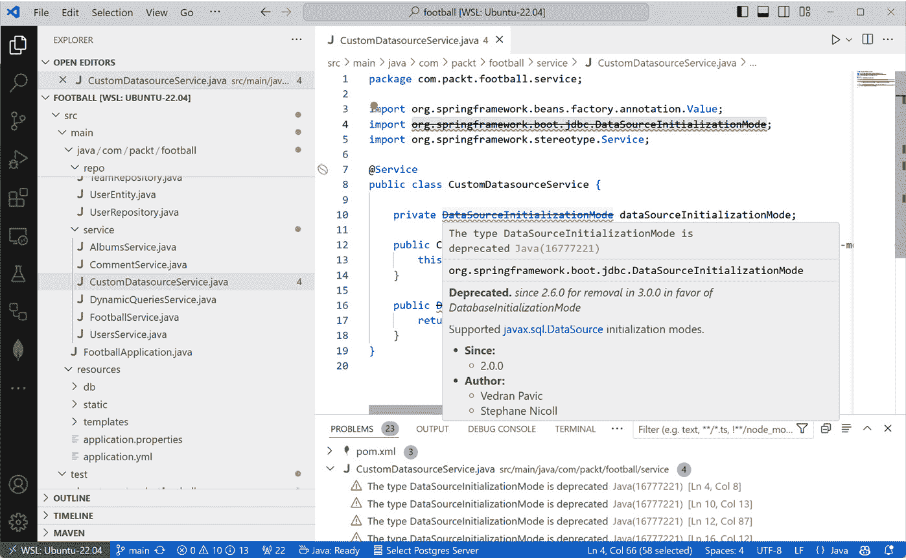
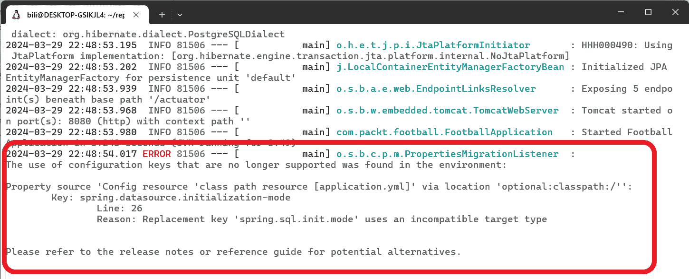
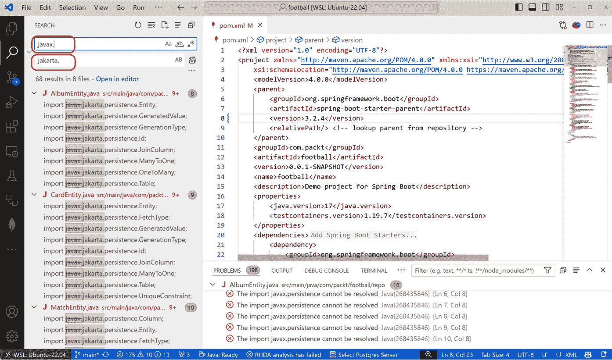
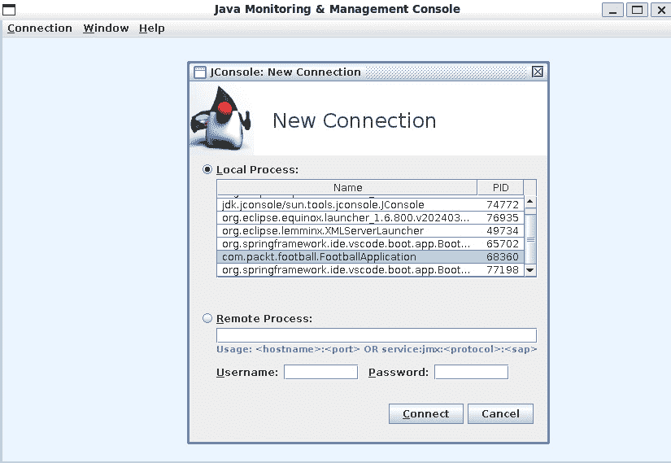
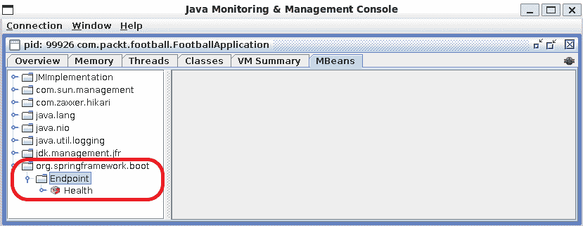
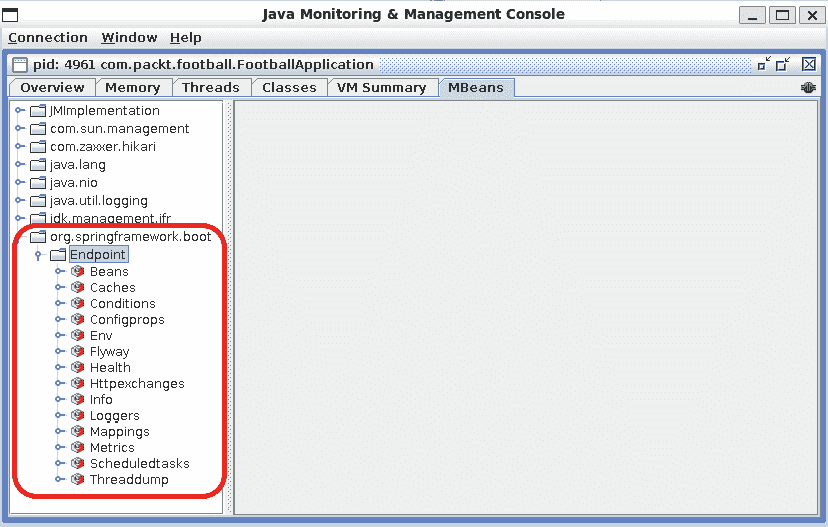

# 第九章：从 Spring Boot 2.x 升级到 Spring Boot 3.0

在应用程序的生命周期中，大部分投入的时间都与维护相关。一个成功的应用程序可能持续数年或数十年。在这段时间里，它可能需要升级以适应其发展。你可能有一个想要利用 Spring Boot 3 特性进行演化的应用程序。在本章中，我们将使用一个我使用 Spring Boot 2.6 创建的示例应用程序，并在每个菜谱中进行逐步升级。本章中的菜谱应按顺序完成，因为我们将使用一个菜谱的结果作为下一个菜谱的起点。一些菜谱可能不会产生一个可工作的版本，因为在后续的菜谱中可能存在需要修复的编译错误。最后一个菜谱，*使用 OpenRewrite 进行迁移自动化*，可以在不完成任何先前菜谱的情况下进行。然而，它需要一些在先前菜谱中解释的手动操作。

在本章中，我们将介绍以下菜谱：

+   准备应用程序

+   准备 Spring Security

+   检测属性变更

+   将项目升级到 Spring Boot 3

+   升级 Spring Data

+   管理 Actuator 变更

+   管理网络应用程序变更

+   使用 OpenRewrite 进行迁移自动化

# 技术要求

在本章中，我们除了 JDK 和 IDE 之外不需要任何额外的工具，就像前几章一样。

请记住，Spring Boot 3.0 需要 Java 17 或更高版本。要将现有项目迁移到 Spring Boot 3.0 并使用 Java 11，您必须升级到 Java 17。

在迁移到 Spring Boot 3.0 之前，我建议你升级到最新的 Spring Boot 2 版本，2.7.x。

在本章中，我们将使用一个 Spring Boot 2 示例，并对其进行修改，直到最终迁移到 Spring Boot 3 的最新版本。该应用程序访问 PostgreSQL 数据库和 Cassandra 数据库。我们将使用 Docker 运行这两个服务器。在您的计算机上运行 Docker 的官方页面是 [`docs.docker.com/engine/install/`](https://docs.docker.com/engine/install/)。该应用程序有一些基于 Testcontainers 的测试，因此您需要在您的计算机上安装 Docker。

要在 Docker 上运行 PostgreSQL，你可以在你的终端中运行以下命令：

```java
docker run -itd -e POSTGRES_USER=packt -e POSTGRES_PASSWORD=packt \
-p 5432:5432 --name postgresql postgres
```

您需要创建一个名为 `football` 的数据库。您可以通过运行以下 PSQL 命令来完成此操作：

```java
CREATE DATABASE football;
```

要在 Docker 上运行 Cassandra，你可以在你的终端中运行以下命令：

```java
docker run -p 9042:9042 --name cassandra -d cassandra:latest
```

本章中将展示的所有菜谱都可以在以下位置找到：[`github.com/PacktPublishing/Spring-Boot-3.0-Cookbook/tree/main/chapter9`](https://github.com/PacktPublishing/Spring-Boot-3.0-Cookbook/tree/main/chapter9)。

接下来，我们将学习如何准备应用程序。

# 准备应用程序

在 Spring Boot 的每个版本中，一些组件被标记为弃用，并且通常会有一个更改建议以避免弃用组件。由于从 Spring Boot 2 升级到 Spring Boot 3 是一个重大变更，强烈建议升级到最新的 Spring Boot 2 版本。

在将应用程序迁移到 Spring Boot 3 之前，以下准备工作是推荐的：

+   将 Spring Boot 版本升级到最新的 2.7.x 版本。在撰写本书时，它是 2.7.18。这将有助于升级到 Spring Boot 3。

+   将 Java 版本更新到 Java 17，这是 Spring Boot 3 的最小支持版本。

+   解决所有弃用组件。

在这个菜谱中，我们将准备一个使用 Spring 2.6 和 Java 11 的示例应用程序。到菜谱结束时，应用程序将使用 Spring 2.7.18，Java 17，并且所有弃用组件和 API 都将得到解决。

## 准备工作

在这个菜谱中，你将使用 Spring 2.6 和 Java 11 准备一个应用程序。示例应用程序位于本书的 GitHub 仓库[`github.com/PacktPublishing/Spring-Boot-3.0-Cookbook`](https://github.com/PacktPublishing/Spring-Boot-3.0-Cookbook)的`chapter9/football`文件夹中。

根据你的操作系统，你可能需要使用不同的工具来管理当前的 JDK 版本。例如，你可以在 Linux 和 Mac 上使用 SDKMAN!工具。你可以通过遵循项目页面[`sdkman.io/`](https://sdkman.io/)上的说明来安装它。

要运行应用程序，你需要在你的计算机上运行一个 PostgreSQL 服务器。要获取它，请遵循*技术* *要求*部分中的说明。

## 如何操作...

让我们把应用程序放在起跑线上。准备， steady， go！

1.  首先，我们将解决所有弃用警告。例如，如果你通过执行`mvn compile`来编译足球项目，你将看到一个关于`DataSourceInitializationMode`类的弃用警告。如果你打开该类的文档[`docs.spring.io/spring-boot/docs/2.6.15/api/org/springframework/boot/jdbc/DataSourceInitializationMode.html`](https://docs.spring.io/spring-boot/docs/2.6.15/api/org/springframework/boot/jdbc/DataSourceInitializationMode.html)，你将看到以下信息：

    **弃用。**

    **自 2.6.0 起弃用，在 3.0.0 中移除，以** **DatabaseInitializationMode** **取而代之**

    如果你使用 IDE，如 IntelliJ 或 Visual Studio Code，你可以在编辑器中直接看到此信息。例如，在 Visual Studio Code 中，你会看到以下内容：



图 9.1：Visual Studio Code 中的弃用消息

1.  现在，让我们将`DataSourceInitializationMode`替换为`DatabaseInitializationMode`。这个更改非常直接，只需要简单的替换即可。其他弃用更改可能需要一些代码重构。通常，弃用类的文档会指导更改的实现。

1.  下一步将是将 Spring Boot 版本更新到 2.7.18。为此，打开 `pom.xml` 文件并找到以下代码片段：

    ```java
    <parent>
        <groupId>org.springframework.boot</groupId>
        <artifactId>spring-boot-starter-parent</artifactId>
        <version>2.6.15</version>
        <relativePath/> <!-- lookup parent from repository -->
    </parent>
    ```

    这指的是正在使用的 Spring Boot 版本。在突出显示的代码中，你可以看到实际版本是 2.6.15。让我们将其更新到可用的最新版本 2。在撰写本书时，它是 2.7.18。

    如果你重新编译应用程序，你将在 `SecurityConfiguration.java` 文件中看到一些与 Spring Security 相关的弃用警告。我们将在 *升级 Spring* *Security* 的配方中修复这些警告。

1.  现在，将 Java 版本更新到 Java 17。你应该确保你正在使用 JDK 17：

    +   如果你使用的是 Linux 或 Mac，你可以使用 SDKMan！

    +   在 Windows 上，你可能需要更新 Java Home 环境变量。

    +   不论操作系统如何，你都可以使用 IDE 来管理 Java 版本：

        +   例如，在 Visual Studio Code 中，你可以遵循 [`code.visualstudio.com/docs/java/java-project#_configure-runtime-for-projects`](https://code.visualstudio.com/docs/java/java-project#_configure-runtime-for-projects) 中的说明来配置项目的 Java 运行时。

        +   在 IntelliJ 中，你可以遵循 https://www.jetbrains.com/help/idea/sdk.html#manage_sdks 中的说明来完成此操作。

    你还应该在项目中更改 Java 版本。为此，打开 `pom.xml` 文件并查找属性 `java.version`：

    ```java
    <properties>
        <java.version>11</java.version>
        <testcontainers.version>1.19.7</testcontainers.version>
    </properties>
    ```

    将 `java.version` 属性替换为 `17`。

1.  再次构建应用程序并验证，只有与 `SecurityConfiguration.java` 文件相关的弃用警告。再次，如果有其他弃用警告，请尝试使用弃用警告消息中提出的替代解决方案。

## 它是如何工作的...

每次有新版本发布时，都可能有一些组件被标记为弃用，并且正如我们在本配方中看到的，通常也已知它们将在哪个版本中被移除。逐步安装升级并跳过中间版本是很方便的。正如我们在本例中看到的，迁移所有修订版本，如 2.7.1、2.7.2 等，是不必要的。然而，你不应该跳过小版本，如 2.7.x，因为可能会有新的组件被标记为弃用，并在版本 3 中被移除。跳过 2.7 升级将不会让你看到警告和替代方案。突然间，你会发现你使用的类找不到。

## 参见

Spring Boot 3.0 使用 Spring Framework 6.0。如果你的项目对先前版本有明确的依赖，你也需要升级它们。你可以在 [`github.com/spring-projects/spring-framework/wiki/Upgrading-to-Spring-Framework-6.x`](https://github.com/spring-projects/spring-framework/wiki/Upgrading-to-Spring-Framework-6.x) 找到 Spring Framework 的迁移指南。

# 准备 Spring Security

Spring Boot 3 中关于安全的主要变化是从 Spring Security 5 升级到 Spring Security 6。与这次升级相关的有很多变化，但在本食谱中，我们将关注最常见的一个，即它的配置方式。

在 Spring Security 5 中，大多数设置都是通过扩展`WebSecurityConfigurerAdapter`类来配置的，而在 Spring Security 6 中，这些更改通过在我们的应用程序中配置特定的 bean 来应用。

在这个食谱中，我们将`WebSecurityConfigurerAdapter`类转换为一个配置类，该类公开了应用等效配置的 bean。

## 准备工作

本食谱的起点是*准备应用程序*食谱的结果。我准备了一个工作版本，以防你还没有完成。你可以在本书的 GitHub 仓库[`github.com/PacktPublishing/Spring-Boot-3.0-Cookbook`](https://github.com/PacktPublishing/Spring-Boot-3.0-Cookbook)的`chapter9/recipe9-2/start`文件夹中找到它。

## 如何做到这一点...

让我们通过适配与 Spring Security 相关的已弃用组件来完成我们应用程序的准备：

1.  如果你现在以这种方式编译项目，你会看到`SecurityConfig`类包含一些弃用警告。让我们来处理它们：

    +   `WebSecurityConfigurerAdapter`类已弃用。现在，应用程序将不再扩展任何类。

    +   `withDefaultPasswordEncoder`方法已弃用，不推荐在生产环境中使用。然而，如文档所述，它对于演示和入门是可接受的。我们不会更改它。

1.  `SecurityConfig`类被注解为`@EnableWebSecurity`。此外，它应该被注解为`@Configuration`。它应该看起来像这样：

    ```java
    @Configuration
    @EnableWebSecurity
    public class SecurityConfig
    ```

1.  接下来，我们将更改接收`AuthenticationManagerBuilder`作为参数的`configure`方法，以创建一个配置`InMemoryUserDetailsManager` bean 的方法：

    ```java
    @Bean
    InMemoryUserDetailsManager userDetailsManager() {
        UserDetails userAdmin = User.withDefaultPasswordEncoder()
                .username("packt")
                .password("packt")
                .roles("ADMIN")
                .build();
        UserDetails simpleUser = User.withDefaultPasswordEncoder()
                .username("user1")
                .password("user1")
                .roles("USER")
                .build();
        return new InMemoryUserDetailsManager(userAdmin, simpleUser);
    }
    ```

1.  现在，我们将用返回`WebSecurityCustomizer` bean 的方法替换接收`WebSecurity`的`configure`方法。它应该看起来像这样：

    ```java
    @Bean
    WebSecurityCustomizer webSecurityCustomizer() {
        return (web) -> web.ignoring()
                .antMatchers("/security/public/**");
    }
    ```

1.  为了完成`SecurityConfig`类，我们必须用创建`SecurityFilterChain` bean 的方法替换接收`HttpSecurity`参数的`configure`方法：

    ```java
    @Bean
    SecurityFilterChain filterChain(HttpSecurity http)
                                                 throws Exception {
        return http
                .authorizeRequests(authorizeRequests -> {
                    try {
                        authorizeRequests
                                .antMatchers("/").permitAll()
                                .antMatchers("/security/private/**")
                                    .hasRole("ADMIN")
                                .and()
                                .httpBasic();
                    } catch (Exception e) {
                        e.printStackTrace();
                    }
                }).build();
    }
    ```

1.  现在，如果我们执行测试，我们会发现使用`@WebMvcTest`注解的控制器相关的测试不再按预期工作。我们将在`FootballControllerTest`和`SecurityControllerTest`类中包含`@Import`注解来修复它。

    +   `FootballControllerTest`：

        ```java
        @WebMvcTest(FootballController.class)
        @Import(SecurityConfig.class)
        class FootballControllerTest
        ```

    +   `SecurityControllerTest`：

        ```java
        @WebMvcTest(SecurityController.class)
        @Import(SecurityConfig.class)
        class SecurityControllerTest
        ```

1.  最后，执行测试并验证所有测试都通过。

## 它是如何工作的...

主要变化是`WebSecurityConfigurerAdapter`类的弃用。这个类在 Spring Security 6 中被移除，因此从 Spring Boot 3 开始也被移除。在这个食谱中，我们为将项目升级到 Spring Boot 3 做好了平滑的安全迁移准备。新方法是为我们想要配置的每个安全方面创建 bean。

Spring Security 6 引入了新的方法来替换 `antMatcher` 方法；例如，`requestMatcher` 方法。为了避免在这个阶段有更多更改，我们还没有替换 `antMatcher` 方法。但是，一旦我们升级到 Spring Boot 3，我们就会这样做，因为这将不再被支持。

在本食谱中，我们继续使用 `withDefaultPasswordEncoder`。尽管它已被弃用且不建议在生产环境中使用，但在开发环境中使用它是可接受的。Spring Boot 2 中存在弃用警告，并且该方法不会很快被移除。弃用是为了警告生产环境中的使用。

由于安全设置现在是使用 `@Configuration` 注解的配置类定义的，因此将它们导入我们的 `@WebMvcTest` 测试中是必要的。`@WebMvcTest` 注解仅加载 MVC 相关组件，并且默认情况下不会加载 `SecurityConfig`。因此，将它们导入我们的 `@WebMvcTest` 测试中是必要的。

## 参见

从 Spring Security 5 升级到 Spring Security 6 包含的更改比本食谱中处理的变化要多。您可以在官方网站上找到完整的迁移指南，网址为 [`docs.spring.io/spring-security/reference/6.0/migration/index.html`](https://docs.spring.io/spring-security/reference/6.0/migration/index.html)。

# 检测属性更改

正如我们在本书中学到的，开发 Spring Boot 应用程序时的主要任务之一是配置其组件。需要注意的是，每次发布新的组件版本时，属性可能会有所变化。这尤其是在升级到主要版本时，例如从 2.x 版本升级到 3.0 版本。通常，这些变化是渐进的。例如，一个属性可能在某个版本中被标记为 *已弃用*，这意味着它将在未来的版本中被移除。因此，建议在升级时不要跳过任何版本。例如，如果您计划从版本 2.6 升级到版本 3.2，最好首先升级到版本 2.7，然后是 3.0，然后是 3.1，最后是 3.2。

为了解决版本之间的属性更改，Spring Boot 提供了一个名为 Spring Boot Properties Migrator 的工具。这是一个依赖项，它会在应用程序启动时分析应用程序环境并打印诊断信息。

在本食谱中，我们将使用 Spring Boot Properties Migrator 在我们的项目中检测配置文件中的弃用属性并修复它们。

## 准备工作

我们将使用 *Preparing Spring Security* 食谱的结果开始本食谱。如果您还没有完成它，可以使用我准备的项目作为起点。您可以在本书的 GitHub 仓库中找到它，网址为 [`github.com/PacktPublishing/Spring-Boot-3.0-Cookbook`](https://github.com/PacktPublishing/Spring-Boot-3.0-Cookbook)，在 `chapter9/recipe9-3/start` 文件夹中。

您需要在计算机上运行 PostgreSQL 服务器和 Cassandra 才能运行应用程序。有关说明，请参阅本章中的 *技术要求* 部分。

## 如何操作...

我们的应用程序使用了过时的属性；让我们使用 Spring Boot Properties Migrator 来修复它们！

1.  首先，我们将 Spring Boot Properties Migrator 依赖项添加到我们的项目中。为此，打开 `pom.xml` 文件，并添加以下依赖项：

    ```java
    <dependency>
        <groupId>org.springframework.boot</groupId>
        <artifactId>spring-boot-properties-migrator</artifactId>
        <scope>runtime</scope>
    </dependency>
    ```

1.  接下来，您可以运行应用程序，并看到属性文件中应该迁移的属性的错误。例如，我在终端中执行了 `mvn spring-boot:run`，并收到了以下消息：



图 9.2 – 使用 Spring Boot 属性迁移执行应用程序时出错

如您所见，我们需要迁移 `spring.datasource.initialization-mode` 属性，并使用 `spring.sql.init.mode` 代替。

1.  然后，我们将 `spring.datasource.initialization-mode` 属性替换为 `spring.sql.init.mode`。为此，打开 `application.yml` 文件，找到 `initialization-mode` 属性，并将其删除。然后，添加 `spring.sql.init.mode` 属性。`spring` 配置应如下所示：

    ```java
    spring:
        application:
            name: football
        jpa:
            database-platform: org.hibernate.dialect.PostgreSQLDialect
            open-in-view: false
        datasource:
            url: jdbc:postgresql://localhost:5432/football
            username: packt
            password: packt
            hikari:
                maximum-pool-size: 4
      sql:
        init:
    application.yml file. The complete file can be found in the book’s GitHub repository.
    ```

1.  `CustomDatasourceService` 类的 `dataSourceInicitalizationMode` 参数引用了 `spring.datasource.initialization-mode` 配置属性。我们必须指向新的属性，`spring.sql.init.mode`。为此，将构造函数中的 `@Value` 注解替换为新属性。它应该看起来像这样：

    ```java
    public CustomDatasourceService(@Value("${spring.sql.init.mode}") DatabaseInitializationMode dataSourceInitializationMode) {
        this.dataSourceInitializationMode = dataSourceInitializationMode;
    }
    ```

1.  现在更改已应用，让我们再次执行应用程序。您可以通过在终端中运行 `spring-boot:run` 命令来完成此操作。

    您将看到应用程序正常运行。

1.  现在属性已迁移，最后一步是删除 Spring Boot Properties Migration 依赖项。为此，打开 `pom.xml` 文件，并删除您在 *步骤 1* 中添加的依赖项。

## 它是如何工作的...

Spring Boot Properties Migration 依赖项首先尝试将过时的属性映射到新的属性，如果可能的话，然后打印警告。如果没有直接映射到新属性，它将抛出错误并打印问题。在本菜谱中，我们使用了 Spring Boot Properties Migration 无法自动映射的依赖项。因此出现了错误。一旦修复，Spring Boot 迁移不会显示任何额外的错误。

由于 Spring Boot Properties Migration 在应用程序启动时执行额外的检查，它可能会减慢应用程序的运行速度。一旦修复了过时的属性，从应用程序中删除 Spring Boot Properties Migration 是一个好习惯。

# 将项目升级到 Spring Boot 3

在这个菜谱中，我们将通过更新我们项目中的引用来迈出 Spring Boot 3 的第一步。当我们升级到 Spring Boot 3 时，我们会看到一些需要解决的编译错误；在这个菜谱中，我们将迈出修复这些错误的第一步。

Spring Boot 3 依赖于 Jakarta EE 9 或更高版本，而 Spring Boot 则依赖于 Jakarta 7 和 8。在 Jakarta 9 中，所有命名空间从 `javax.*` 更改为 `jakarta.*`。这可能是升级到 Spring Boot 3 时可以看到的最大影响，因为它需要更改我们项目中许多引用。

在这个菜谱中，我们将最终将我们的项目升级到 Spring Boot 3，这将需要将所有 `javax` 命名空间引用更新为 `jakarta`。我们还将执行 Spring Security 的最新更新。在本菜谱结束时，应用程序仍将无法工作；你必须完成两个菜谱，*Upgrading Spring Data* 和 *Managing Actuator changes*，才能使其工作。

## 准备工作

我们将使用 *Detecting property changes* 菜谱的结果作为本菜谱的起点。如果你还没有完成它，可以使用我准备的版本。你可以在本书的 GitHub 仓库中找到它，网址为 [`github.com/PacktPublishing/Spring-Boot-3.0-Cookbook`](https://github.com/PacktPublishing/Spring-Boot-3.0-Cookbook)，在 `chapter9/recipe9-4/start` 文件夹中。

## 如何操作...

我们将升级应用程序到 Spring Boot 3，并会看到与 Jakarta EE 相关的错误。让我们修复它们并开始使用 Spring Boot 3！

1.  首先，我们将升级项目以使用 Spring Boot 3。为此，打开 `pom.xml` 文件并找到以下代码片段：

    ```java
    <parent>
        <groupId>org.springframework.boot</groupId>
        <artifactId>spring-boot-starter-parent</artifactId>
        <version>2.7.18</version>
        <relativePath/> <!-- lookup parent from repository -->
    </parent>
    ```

    你应该将版本属性替换为最新的 Spring Boot 版本，在撰写本书时，该版本是 3.2.4。

1.  你会看到项目无法编译，因为所有对 `javax.*` 命名空间的引用都不再有效。要修复它，请将所有文件中的 `javax` 替换为 `jakarta`。需要做出大量的更改，所以我建议使用你喜欢的编辑器的替换功能。例如，你可以在 Visual Studio Code 中使用 **Search: Replace in files** 命令：



图 9.3：在 Visual Studio Code 中的文件中将 javax 替换为 jakarta

1.  如果你尝试编译项目，你会看到仍有三个文件存在编译错误：

    +   `MatchEventEntity.java`：存在与数据库中映射为 JSON 的字段相关的错误。这个问题将在 *Upgrading Spring* *Data* 菜谱中解决。

    +   `FootballConfig.java`：存在与 `HttpTrace` 相关的错误。这个问题将在 *Managing Actuator* *更改* 菜谱中修复。

    +   `SecurityConfig.java`：存在与 Spring Security 变更相关的新错误，我们将在以下步骤中修复。

1.  要修复 `SecurityConfig` 类的问题，我们需要做以下几步：

    +   在 `webSecurityCustomizer` 方法中将 `antMatchers` 调用替换为 `requestMatchers` 调用。它应该看起来像这样：

        ```java
        @Bean
        WebSecurityCustomizer webSecurityCustomizer() {
            return (web) -> web.ignoring()
                    .requestMatchers("/security/public/**");
        }
        ```

    +   在 `filterChain` 方法中，我们需要进行几个更改：

        +   将 `authorizeRequests` 替换为 `authorizeHttpRequests`。

        +   将 `requestMatchers("/")` 替换为 `anyRequest()`。

        +   将 `antMatchers` 调用替换为 `requestsMatchers`。

        +   我们需要切换前两个调用中的调用顺序。

        +   删除 `and` 调用，只需将 `authorizeHttpRequests` 与 `httpBasic` 调用链式即可。

        ```java
        @Bean
        SecurityFilterChain filterChain(HttpSecurity http)
                                                     throws Exception {
            return http
                    .authorizeHttpRequests(authorizeRequests -> {
                        authorizeRequests
                                .requestMatchers("/security/private/**")
                                      .hasRole("ADMIN")
                                .anyRequest().permitAll();
                    })
                    .httpBasic(withDefaults())
                    .build();
        }
        ```

## 它是如何工作的...

Jakarta EE 以前是 `javax`，现在是 `jakarta`，这使得 Jakarta EE 能够独立于 Oracle 发展，因为它保留了某些 Java 商标。这些更改仅意味着命名空间的变化，没有行为变化。因此，只需替换命名空间，应用程序就可以正常工作。

在本食谱中，我们直接从 Spring Boot 2.7.18 迁移到 Spring Boot 3.2.4。如果我们首先迁移到中间版本，我们会看到与 Spring Security 相关的错误作为弃用警告。鉴于我们了解逐步弃用和升级的机制，我决定为了简洁性跳过中间版本。我建议您在项目中逐步迁移。弃用警告消息可以指导大多数更改。然而，有一个变化不是很明显。在 Spring Boot 6 中，`permitAll` 方法对于 `requestMatcher` 已被弃用，应替换为 `anyRequest`，并且该方法应在链的末尾调用；如果您在之后链式调用更多匹配器，则在运行时将抛出异常。

# 升级 Spring Data

Spring Boot 3 默认使用 Hibernate 6.1，而 Spring Boot 2 使用 Hibernate 5。因此，我们需要准备应用程序以匹配 Hibernate 6.1。

Hibernate 使用 Jakarta EE，这需要将 `javax.*` 命名空间升级到 `jakarta.*`，但我们已经在 *Spring 3.0 的第一步* 食谱中完成了这一步。

Hibernate 6.1 中的一些更改是内部的，但一些 API 发生了变化，应在应用程序中进行升级。

与 Spring Data 配置相关的某些更改是针对 Cassandra 的特定更改。

在本食谱中，我们将对示例应用程序进行必要的更改，以使其与 Hibernate 6.1 和 Cassandra 保持一致。

## 准备工作

我们将使用 *Spring 3.0 的第一步* 食谱的结果作为本食谱的起点。如果您尚未完成，可以使用我创建的版本。您可以在书籍的 GitHub 仓库中找到它，位于 [`github.com/PacktPublishing/Spring-Boot-3.0-Cookbook`](https://github.com/PacktPublishing/Spring-Boot-3.0-Cookbook) 的 `chapter9/recipe9-5/start` 文件夹中。

如前文所述，示例应用程序使用 PostgreSQL 服务器数据库和 Cassandra，测试使用 Testcontainers。因此，您需要在您的计算机上运行 Docker。

## 如何操作...

让我们在应用程序中进行必要的 Spring Data 调整：

1.  我们将首先修复应用程序的配置：

    +   我们将用`PostgreSQLDialect`替换`PostgreSQL82Dialect`。为此，我们将打开`application.yml`文件，定位`spring.jpa.database-platform`属性，然后设置以下值：

        ```java
        spring:
          jpa:
            database-platform: spring.data.cassandra.* settings now should be spring.cassandra.*. In the same application.yml file, ensure that the cassandra settings are defined as follows:

        ```

        spring:

        cassandra:

        keyspace-name: footballKeyspace

        schema-action: CREATE_IF_NOT_EXISTS

        contact-points: localhost

        local-datacenter: datacenter1

        session-name: cassandraSession

        port: 9042

        ```java

        ```

    注意，现在`cassandra`位于`spring`下。之前，`cassandra`位于`spring.data`下。

1.  基于 Testcontainers 的测试创建了一个 Cassandra 容器，然后设置了应用程序上下文的设置。这些测试应该与新设置结构中的`spring.cassandra`而不是`spring.data.cassandra`保持一致。你可以通过在你的编辑器中使用字符串替换功能来应用这个更改。例如，你可以在 Visual Studio Code 中使用**搜索：替换文件**功能：


图 9.4：在 Visual Studio Code 中替换 spring.data.cassandra 引用

1.  接下来，我们将使用 Hibernate 6 的新功能来定义我们实体的 JSON 字段。为此，打开`MatchEventEntity`类并修改`details`字段的注解如下：

    ```java
    @JdbcTypeCode(SqlTypes.JSON)
    private MatchEventDetails details;
    ```

    我们将*hypersistence utils*类型替换为定义 JSON 字段。

1.  由于我们不再需要特定的类型来定义 JSON 字段，你可以从`pom.xml`文件中删除以下依赖项：

    ```java
    <dependency>
        <groupId>io.hypersistence</groupId>
        <artifactId>hypersistence-utils-hibernate-55</artifactId>
        <version>3.7.3</version>
    </dependency>
    ```

1.  在这一点上，我们希望利用项目的测试。然而，有一些与`httptrace`端点相关的编译错误。现在我们将注释掉`FootballConfig`类中的所有代码以避免编译错误，并且我们将在这个*管理 Actuator 更改*菜谱中处理这个组件。

1.  接下来，我们将运行测试以验证应用程序仍然可以工作。你可以从 IDE 中运行测试，或者只需在你的终端中运行以下 Maven 命令：

    ```java
    mvn test
    ```

    你会看到与服务相关的测试都成功了，但有两个测试，`findPlayerById`和`countPlayers`失败了。还有其他与控制器相关的测试也失败了，但我们将它们包含在*管理 Web 应用程序更改*菜谱中。这些测试失败是由于 Hibernate 6 中的一些行为变化。让我们修复它们：

    +   `DynamicQueriesService`类中的`findPlayerById`方法使用序数参数绑定。Hibernate 6 中序数参数的行为发生了变化。为了修复这个问题，按照以下方式修改`DynamicQueriesService`类中的`findPlayerById`：

        ```java
        public Player findPlayerById(Integer id) {
            Query query = em.createQuery(
                            "SELECT p FROM PlayerEntity p WHERE p.id=?1",
                            PlayerEntity.class);
            query.setParameter(1, id);
            return playerMapper.map((PlayerEntity)
                                          query.getSingleResult());
        }
        ```

    +   这个更改很微妙。在查询字符串中，将`?0`替换为`?1`；`setParameter`方法中的参数是`1`而不是`0`。

    +   `countPlayers`测试验证了`DynamicQueriesService`类中同名的方法。要修复这个测试，请执行以下操作：

        1.  首先，将`DynamicQueriesService`类中`countPlayers`方法的`return`类型从`BigInteger`更改为`Long`。它应该看起来像这样：

        ```java
        public Player findPlayerById(Integer id) {
            Query query = em.createQuery(
                    "SELECT p FROM PlayerEntity p WHERE p.id=?1",
                    PlayerEntity.class);
            query.setParameter(1, id);
            return playerMapper
                    .map((PlayerEntity) query.getSingleResult());
        }
        ```

    1.  然后，更新测试以匹配`Long`类型的返回类型：

    ```java
    @Test
    void countPlayers() {
        Long count = dynamicQueriesService.countPlayers();
        assertThat(count, not(0));
     }
    ```

    你可以重新运行与服务相关的测试，现在它们应该会成功。

## 它是如何工作的...

Spring Data 依赖于 Hibernate 来实现其大部分功能。在 Spring Boot 3 中，它默认使用 Hibernate 6.1。因此，大多数与 Spring Data 升级相关的任务都与 Hibernate 升级相关。

与 Hibernate 升级相关的一个变化是将引用从`javax.*`更改为`jakarta.*`。我们在这个菜谱中没有解释这一点，因为它已经在*Spring 3.0 的第一步*菜谱中讨论过了；在升级到 Spring Boot 3 或 Hibernate 6 时，你应该记住这一点。

在 Hibernate 6 中，属性`spring.jpa.database-platform`不再使用特定的版本值。因此，`PostgreSQL82Dialect`已被弃用，应该用不带版本号的数据库方言替换。由于我们使用 PostgreSQL 作为关系型数据库，我们将`PostgreSQL82Dialect`替换为`PostgreSQLDialect`。如果你使用其他数据库引擎，如 MySQL，你应该使用不带版本特定方言的`MySQLDialect`。

在 Hibernate 6 中，返回`BIGINT`的查询现在映射到`Long`类型。在之前的版本中，它们被错误地映射到`BigInteger`。计数子句的结果是`BIGINT`，因此我们需要在`countPlayers`方法中更改它。尽管我们应用程序中的玩家数量可以用整数表示，但如果我们的表更大，它可能会在运行时引起类型转换错误。

Hibernate 6 改变了绑定序数参数的方式，现在使用基于 1 的排序而不是基于 0 的排序。

Hibernate 6 引入了在数据库支持的情况下将实体字段映射为 JSON 参数的可能性。在 Hibernate 6 之前，必须使用第三方库，例如 Hypersistence。由 Vlad Mihalcea 开发的这个出色的库在之前的版本中对于 JSON 字段管理很有用，但在 Hibernate 6 中不再需要。我们可以保留这个依赖项并将其升级到与 Hibernate 6 匹配的版本。更多信息可以在[`github.com/vladmihalcea/hypersistence-utils`](https://github.com/vladmihalcea/hypersistence-utils)找到。

与 Spring Data 相关的其他变化与 Hibernate 无关。例如，`spring.data`属性前缀现在被保留用于 Spring Data；因此，`spring.data.cassandra`已移动到`spring.cassandra`。

在这个菜谱中，我们只涵盖了与本书中使用的 Spring Data 相关的变化。我建议你查看[`github.com/spring-projects/spring-boot/wiki/Spring-Boot-3.0-Migration-Guide#data-access-changes`](https://github.com/spring-projects/spring-boot/wiki/Spring-Boot-3.0-Migration-Guide#data-access-changes)中的迁移指南。

## 还有更多...

Spring Boot 3 引入了一些功能，这些功能有助于我们在应用程序中使用标准数据库技术。在 Spring Boot 3 之前，我们可以使用替代解决方案，并且没有必要迁移它们；然而，了解它们的存在是值得的。在本节中，我们将演示其中两个：存储过程和 JQL 中的联合子句。

你可以使用`@Procedure`注解代替`@Query`注解。`@Query`注解必须是原生的，并使用`call`子句。例如，你可以按照以下方式修改`PlayerRepository`接口中的`getTotalPlayersWithMoreThanNMatches`方法：

```java
@Procedure("FIND_PLAYERS_WITH_MORE_THAN_N_MATCHES")
Integer getTotalPlayersWithMoreThanNMatches(int num_matches);
```

Hibernate 6 JQL 现在支持`Union`子句。例如，我们可以在`MatchRepository`接口中这样写`findPlayersByMatchId`：

```java
@Query("SELECT p1 FROM MatchEntity m JOIN m.team1 t1 JOIN t1.players p1 WHERE m.id = ?1 UNION SELECT p2 FROM MatchEntity m JOIN m.team2 t2 JOIN t2.players p2 WHERE m.id = ?1")
public List<PlayerEntity> findPlayersByMatchId(Integer matchId);
```

## 参见

在这个菜谱中，我们涵盖了 Hibernate 5 到 6 迁移的一些场景，但还有很多。如果你在项目迁移过程中发现与 Hibernate 相关的问题，请查看 Hibernate 迁移指南：

+   Hibernate 6.0 迁移指南：[`docs.jboss.org/hibernate/orm/6.0/migration-guide/migration-guide.html`](https://docs.jboss.org/hibernate/orm/6.0/migration-guide/migration-guide.html)

+   Hibernate 6.1 迁移指南：[`docs.jboss.org/hibernate/orm/6.1/migration-guide/migration-guide.html`](https://docs.jboss.org/hibernate/orm/6.1/migration-guide/migration-guide.html)

# 管理执行器更改

大多数执行器更改都与暴露端点的默认行为相关。例如，JMX 端点行为与 Web 端点行为保持一致；因此，它默认只暴露**Health**端点，而之前所有 JMX 端点都默认暴露。如果你的项目依赖于该功能，你必须显式地暴露它。

除了执行器的默认行为外，我们的项目还使用`httptrace`端点，这改变了行为和所需的实现。在这个菜谱中，我们将修复`httptrace`端点，并做出必要的配置更改以保持与执行器相同的操作。

## 准备工作

要开始这个菜谱，你需要上一个菜谱的结果，即*升级 Spring Data*。如果你还没有完成，我在书的 GitHub 仓库中准备了一个版本，你可以在`chapter9/recipe9-6/start`文件夹中找到它：[`github.com/PacktPublishing/Spring-Boot-3.0-Cookbook`](https://github.com/PacktPublishing/Spring-Boot-3.0-Cookbook)

除了我们之前菜谱的要求外，我们还需要一个 JMX 客户端来探索执行器 JMX 端点的行为。我们可以使用 JConsole，它是 JDK 的一部分。

## 如何操作...

我们首先将修复`httptrace`端点，然后我们将调整执行器以使其在 Spring Boot 2 中的行为一致：

1.  要修复`httptrace`配置，打开`application.yml`文件，并替换以下内容：

    +   将 Web 端点`httptrace`替换为`httpexchanges`。

    +   将`management.trace.http.enabled`替换为`management.httpexchanges.recording.enabled`。

    +   它应该看起来像这样：

        ```java
        management:
          endpoints:
            web:
              exposure:
                include: health,env,metrics,beans,loggers,httpexchanges
          httpexchanges:
            recording:
              application.yml file.
        ```

    +   接下来，对于`FootballConfig`类，将`HttpTraceRepository`接口替换为`HttpExchangeRepository`，将`InMemoryHttpTraceRepository`替换为`InMemoryHttpExchangeRepository`。请记住，我们在上一个菜谱中注释了这个类的内容，以便能够编译解决方案；现在，我们将处理这个组件。`FootballConfig`类应该看起来如下：

        ```java
        @Configuration
        public class FootballConfig {
            @Bean
            public HttpExchangeRepository httpTraceRepository() {
                return new InMemoryHttpExchangeRepository();
            }
        }
        ```

    +   现在，我们可以运行应用程序并验证新的`httpexchanges`存储库。要验证它，在您的浏览器中打开它或使用地址`http://localhost:8080/actuator/httpexchanges`执行 curl 命令。它应该返回对我们应用程序的最新请求。

    +   接下来，我们将验证应用程序是否暴露了与 Spring Boot 2 相同的 JMX 端点。当应用程序正在运行时，运行 JConsole 工具。为此，打开您的终端并运行`jconsole`。您会看到它显示了在您的计算机上运行的 Java 应用程序列表：



图 9.5：JConsole 进程选择

选择应用程序并点击**连接**。可能会出现一个表示安全连接失败的消息，建议您使用非安全连接。使用非安全连接。

如果您打开`org.springframework.boot`命名空间，只会出现**Health**端点：



图 9.6：Spring Boot 3 默认暴露的 JMX 端点

在 Spring Boot 3 之前，所有端点默认启用。为了达到相同的行为，打开`application.yml`文件并设置`management.endpoints.jmx.exposure.include=*`属性。它应该看起来如下：

```java
management:
    endpoints:
        jmx:
            exposure:
                include: '*'
```

如果您重新启动应用程序并使用 JConsole 连接到应用程序，您会看到它现在暴露了所有 MBean 端点，就像 Spring Boot 的早期版本一样：



图 9.7：使用 Spring Boot 3 暴露的所有 JMX 端点

您可以在*图 9.7*中看到暴露的端点。

## 它是如何工作的...

Spring Boot 团队将`httptrace`的名称更改为避免与`Micrometer Tracing`混淆。因此，它已被重命名为`http exchanges`。此更改还影响了支持实现跟踪的存储库。在这个例子中，我们使用了一个内存存储库，我们只将其用于演示目的。在生产环境中，您可能会使用持久存储库。

在 Spring Boot 3 中，JMX 端点仅暴露 **Health** 端点以与其网络对应端点保持一致。在 Spring Boot 3 和之前的版本中，仅在网络端点暴露 **Health** 端点。某些端点可能会泄露敏感信息或提供不希望访问。除了 **Health** 端点之外的所有端点都没有启用，以减少攻击面。在这个配方中，我们暴露了所有 JMX 端点。然而，建议你只暴露真正必要的那些端点。

## 参见

在这个配方中，我们涵盖了与 Actuator 相关的一些场景。然而，我建议你回顾 Spring Boot 3 迁移指南，并验证你是否使用了 Spring Boot 早期版本中需要关注的 Actuator 功能。你可以在这个指南中找到：[`github.com/spring-projects/spring-boot/wiki/Spring-Boot-3.0-Migration-Guide#actuator-changes`](https://github.com/spring-projects/spring-boot/wiki/Spring-Boot-3.0-Migration-Guide#actuator-changes)。

# 管理网络应用程序的更改

网络应用程序，以及我们在这本书中主要使用的 RESTful 应用程序，在 Spring Boot 2 和 3 之间有一些行为上的变化。其中一些可能会影响你的应用程序。一些变化与内部组件相关，除非你的应用程序依赖于这些内部组件，否则你不会受到影响。Spring Boot 2 和 3 之间的变化如下：

+   `server.max-http-header-size` 属性是一个设置，表示应用程序管理的请求头可能的最大大小。这个属性根据所使用的内嵌网络服务器而有所不同。它已经被 `server.max-http-request-header-size` 取代，并且由所有可能的内嵌网络服务器一致管理。

+   优雅关闭的阶段已经改变。当一个应用程序关闭时，Spring Boot 会发送不同阶段的事件，应用程序可以订阅这些事件以执行自定义关闭操作。

+   如果你使用 Jetty 内嵌网络服务器而不是默认的 Tomcat，你需要将 Servlet API 设置为 5.0。Jetty 目前还不支持 Spring Boot 3 默认使用的 Servlet API 6.0。

+   Spring Boot 3 使用的 Spring Framework 6 移除了对 Apache HttpClient 的支持。如果你在 Spring Boot 早期版本的应用程序中使用了 Apache HttpClient，你可能会注意到行为上的变化。

如前所述，除非你的应用程序明确依赖于这些功能之一，否则你不会注意到这些变化。然而，有一个可能会影响你的应用程序的行为变化。在 Spring Boot 3 之前的版本中，以 `/` 结尾的 URL 会与不带该尾随斜杠的控制器匹配。例如，`GET /teams` 和 `GET /teams/` 在我们的应用程序中会匹配相同的控制器。在 Spring Boot 3 中，除非我们为它准备应用程序，否则 `GET /teams/` 将会失败。

在这个菜谱中，我们将准备我们的应用程序来管理请求的尾部斜杠，就像在之前的版本中一样，以确保依赖于我们的应用程序的客户端不会受到 Spring Boot 升级的影响。

## 准备工作

我们将使用 *Managing Actuator changes* 菜谱的输出结果来制作这个菜谱。我准备了一个完成的版本，以防你还没有这样做。你可以在书的 GitHub 仓库中找到它：[`github.com/PacktPublishing/Spring-Boot-3.0-Cookbook`](https://github.com/PacktPublishing/Spring-Boot-3.0-Cookbook) 中的 `chapter9/recipe9-7/start` 文件夹。

## 如何做到这一点...

让我们确保我们的应用程序消费者不会因为我们的 Spring Boot 3 升级而受到干扰！

1.  让我们添加一个自定义的 Web 配置。为此，创建一个名为 `WebConfiguration` 的文件，该文件实现了 `WebMvcConfigurer` 接口：

    ```java
    @Configuration
    public class WebConfiguration implements configurePathMatch method as follows:

    ```

    @Override

    public void configurePathMatch(PathMatchConfigurer configurer) {

    configurer.setUseTrailingSlashMatch(true);

    }

    ```java

    ```

1.  现在，你可以通过在浏览器中打开 `http://localhost:8080/teams/` 来验证应用程序的行为。你可以检查它是否带或不带尾部斜杠都能正常工作。

1.  如果你运行应用程序测试，你会意识到现在所有测试都成功了，因为只有与控制器中尾部斜杠相关的测试仍然失败。

## 它是如何工作的...

而不是依赖于可能改变的自定义行为，尾部斜杠已被弃用，以强制显式匹配，以使应用程序在出现新版本时更加稳定和可预测。

Spring Boot 提供了机制来保持与之前版本相同的行怍。然而，你可能已经意识到 `setUseTrailingSlashMatch` 方法已被弃用。这是为了警告开发者关于这种不推荐的行为，并强制进行显式匹配的迁移。

## 更多...

同样的方法也可以用于 WebFlux。你不会实现 `WebMvcConfigurer`，而是实现 `WebFluxConfigurer`。它看起来像这样：

```java
@Configuration
public class WebConfiguration implements WebFluxConfigurer {
    @Override
    public void configurePathMatching(PathMatchConfigurer configurer){
      configurer.setUseTrailingSlashMatch(true);
    }
}
```

## 参见

我建议你查看 Spring Boot 3 迁移的官方指南：[`github.com/spring-projects/spring-boot/wiki/Spring-Boot-3.0-Migration-Guide#web-application-changes`](https://github.com/spring-projects/spring-boot/wiki/Spring-Boot-3.0-Migration-Guide#web-application-changes)。正如在介绍这个菜谱时提到的，如果你的应用程序依赖于受迁移影响的某些内部组件，你可以找到更多关于修复你的问题的详细信息。

# 使用 OpenRewrite 进行迁移自动化

在本章中，我们手动进行了所有迁移升级。然而，在大型的代码库中，这种方法可能太慢且容易出错。一些工具试图自动化这个过程，其中最受欢迎的是 OpenRewrite。OpenRewrite 是一个平台工具，旨在重构任何源代码。根据其文档，它旨在消除开发者仓库的技术债务。它提供了一种运行源代码重构菜谱的机制。一个流行的开源菜谱解决了本章的主题：Spring Boot 迁移。

## 准备工作

在这个菜谱中，我们将使用针对 Spring Boot 2.6.15 的原始示例。你可以在书的 GitHub 仓库的 `chapter9/football` 文件夹中找到它：[`github.com/PacktPublishing/Spring-Boot-3.0-Cookbook`](https://github.com/PacktPublishing/Spring-Boot-3.0-Cookbook)。

## 如何操作...

我们将从 Spring 2.6 升级到 Spring 3.2.4，自动化大部分过程。七个菜谱合为一！

1.  让我们先向我们的项目中添加 OpenRewrite 插件。为此，将以下片段添加到 `pom.xml` 文件的插件部分：

    ```java
    <plugin>
        <groupId>org.openrewrite.maven</groupId>
        <artifactId>rewrite-maven-plugin</artifactId>
        <version>5.27.0</version>
        <configuration>
            <activeRecipes>
                <recipe>org.openrewrite.java.spring.boot2.UpgradeSpringBoot_2_7</recipe>
            </activeRecipes>
         </configuration>
         <dependencies>
             <dependency>
                 <groupId>org.openrewrite.recipe</groupId>
                 <artifactId>rewrite-spring</artifactId>
                 <version>5.7.0</version>
             </dependency>
         </dependencies>
    </plugin>
    ```

    在编写这本书时，OpenRewrite 插件的最新版本是 5.7.0。当你尝试时，请使用最新版本。

    我们使用 OpenRewrite 菜谱升级到 Spring 2.7，因为我们将会逐步进行升级。在接下来的步骤中，我们将升级到 Spring Boot 3.0，然后是 3.1，最后是 3.2。

1.  接下来，我们将执行 OpenRewrite 插件。为此，打开项目根目录中的终端并执行以下 Maven 命令：

    ```java
    ./mvnw rewrite:run
    ```

    你会看到它做出了一些更改：

    +   它将 Spring Boot 版本升级到 `2.7.18`。

    +   它向 `org.junit.jupiterter:junit-jupiter` 添加了一个测试依赖。

    +   它仅在 `application.yml` 文件中将属性 `spring.datasource.initialization-mode` 替换为 `spring.sql.init.mode`。请注意这个更改，因为在下一步中我们需要用到它。

    +   它修改了测试类中对 `org.junit` 的引用，将其替换为 `org.junit.jupiter` 的等效项。

1.  让我们检查升级到 Spring Boot 2.7 是否可行。

    +   如果你运行测试，你会看到依赖于 Testcontainers 的测试无法通过。这是因为 OpenRewrite 排除了 Testcontainers 所需的一些依赖项。要修复它，打开 `pom.xml` 并移除 Testcontainers 依赖项上的 `exclusion` `junit`：

        ```java
        <dependency>
            <groupId>org.testcontainers</groupId>
            <artifactId>junit-jupiter</artifactId>
            <version>${testcontainers.version}</version>
            <scope>test</scope>
            <!-- <exclusions>
                     <exclusion>
                     <groupId>junit</groupId>
                     <artifactId>junit</artifactId>
                     </exclusion>
              </exclusions> -->
        </dependency>
        ```

    在这个例子中，我只是为了清晰起见注释了 `exclusions` 部分。在你的代码中，你可以移除它。

    +   一旦排除问题得到解决，你就会发现它无法加载应用程序上下文，因为它无法解析 `spring.datasource.initialization-mode` 配置。要修复它，打开 `CustomDatasourceService` 类并修改构造函数中使用的 `@Value` 注解。你应该将 `spring.datasource.initialization-mode` 设置替换为 `spring.sql.init.mode` 设置。

    +   重新运行测试，你会看到所有测试都成功了。

1.  是时候开始使用 Spring Boot 3.0 了。为了进行这次升级，打开 `pom.xml` 文件，并将 `activeRecipes/recipe` 修改为 `org.openrewrite.java.spring.boot3.UpgradeSpringBoot_3_0`。OpenRewrite 插件配置应如下所示：

    ```java
    <configuration>
        <activeRecipes>
            <recipe>org.openrewrite.java.spring.boot3.UpgradeSpringBoot_3_0</recipe>
        </activeRecipes>
    </configuration>
    ```

1.  然后，再次执行插件。这次升级所做的更改如下：

    +   它将所有 `javax` 引用替换为 `jakarta`。

    +   它迁移了 Spring Security 的更改。它正确地迁移了 `UserDetailsManager` 和 `WebSecurityCustomizer`。然而，正如我们在 *步骤 7* 中将看到的，`SecurityFilterChain` bean 需要一些调整。

    +   它迁移了 `application.yml` 文件中定义的设置：

        +   它将 `management.trace.http.enabled` 替换为 `management.httpexchanges.recording.enabled`。

        +   它将 `spring.data.cassandra` 设置迁移到 `spring.cassandra`。

1.  在 Spring Boot 3.0 升级中，应用程序无法编译。让我们修复编译错误：

    +   `DataSourceInitializationMode` 类已在 Spring Boot 3 中被移除，但 OpenRewrite 没有迁移它。正如我们在 *准备应用程序* 菜单中研究的那样，这个更改可以通过将 `DataSourceInitializationMode` 替换为 `DatabaseInitializationMode` 来轻松修复。

    +   一些 Actuator 的更改已正确应用，但其他更改没有。`application.yml` 已正确修改，将 `management.trace.http.enabled` 替换为 `management.httpexchanges.recording.enabled`。然而，`HttpTraceRepository` 和 `InMemoryHttpTraceRepository` 没有迁移。您可以将它们替换为 `HttpExchangeRepository` 和 `InMemoryHttpExchangeRepository`。有关更多详细信息，请参阅 *管理 Actuator 变更* 菜单。

    +   在 `MatchEventEntity` 类的 `details` 字段中，将注解 `@Type(JsonType.class)` 替换为 `@JdbcTypeCode(SqlTypes.JSON)`。

1.  接下来，让我们修复测试：

    +   如 *步骤 3* 中所述，您应从 Testcontainers 依赖中移除 `exclusion` `junit`。

    +   由于我们不再使用 Hypersistence 库，我们可以将其从我们的项目中删除。有关更多详细信息，请参阅 *升级 Spring Data* 菜单。

    +   OpenRewrite 已正确地将 `application.yml` 文件中的 `spring.data.cassandra.*` 设置迁移到 `spring.cassandra.*`。然而，它没有修改测试中的引用。为了修复这个问题，只需将所有对 `spring.data.cassandra` 的引用替换为 `spring.cassandra`。有关更多详细信息，请参阅 *升级 Spring Data* 菜单。

    +   MVC 测试无法工作。为了修复它们，我们需要在 `FootballControllerTest` 和 `SecurityControllerTest` 类中包含 `@Import(SecurityConfig.class)` 注解。如前所述，`SecurityFilterChain` bean 已迁移，但需要一些调整。如 *升级项目到 Spring Boot 3* 菜单中所述，我们需要切换一些调用的顺序。方法应如下所示：

        ```java
        @Bean
        SecurityFilterChain filterChain(HttpSecurity http)
                                                      throws Exception {
          http.authorizeHttpRequests(requests -> requests
              .requestMatchers("/security/private/**").hasRole("ADMIN")
              .requestMatchers("/**").permitAll())
              .httpBasic(withDefaults());
          return http.build();
        }
        ```

    +   OpenRewrite 没有将`BigInteger`迁移到`Long`，也没有迁移我们在*升级 Spring Data*配方中研究的参数顺序绑定。要修复它，请应用*升级 Spring* *Data*配方中解释的两种更改。

    +   检查尾部斜杠的测试失败了。如果我们想保持相同的行为，我们需要添加一个`WebMvcConfigurer`，如*管理 Web 应用程序更改*配方中所述。

    应用这些修复后，测试和应用程序都应正常工作。

1.  接下来，让我们升级到 Spring Boot 3.1。为此，将`pom.xml`文件中的配方更改为`org.openrewrite.java.spring.boot3.UpgradeSpringBoot_3_1`。

    在编写这本书时，我发现当运行此配方时与 Testcontainers 版本相关的问题。消息类似于以下内容：

    ```java
    [ERROR] Failed to execute goal org.openrewrite.maven:rewrite-maven-plugin:5.27.0:run (default-cli) on project football: Execution default-cli of goal org.openrewrite.maven:rewrite-maven-plugin:5.27.0:run failed: Error while visiting chapter9/recipe9-8/end/football/pom.xml: java.lang.IllegalStateException: Illegal state while comparing versions : [1.19.7] and [${testcontainers.version}.0.0.0.0.0.0]. Metadata = [null]
    ```

    为了避免运行时错误，将`pom.xml`文件中的`testcontainers.version`项目变量替换为 Testcontainers 依赖项中的实际版本。例如，请参阅以下依赖项：

    ```java
    <dependency>
       <groupId>org.testcontainers</groupId>
       <artifactId>junit-jupiter</artifactId>
       <version>${testcontainers.version}</version>
       <scope>test</scope>
    </dependency>
    ```

    用以下内容替换：

    ```java
    <dependency>
       <groupId>org.testcontainers</groupId>
       <artifactId>junit-jupiter</artifactId>
       <version>1.19.7</version>
       <scope>test</scope>
    </dependency>
    ```

    执行 OpenRewrite 插件后，您将看到只有少量更改应用于`pom.xml`文件。您需要再次从 Testcontainers 依赖项中移除`exclusion` `junit`。

1.  在 Spring Boot 3.1 升级中，没有编译错误。然而，一些测试失败了。只需将`spring.jpa.database-platform`更改为`org.hibernate.dialect.PostgreSQLDialect`，如*升级 Spring Data*配方中所述即可修复。应用此修复后重新运行测试；所有测试都应成功。

1.  最后，升级到 Spring Boot 3.2。为此，将 OpenRewrite 配方更改为`org.openrewrite.java.spring.boot3.UpgradeSpringBoot_3_2`。同样，您需要再次移除`exclusion` `junit`，但这次不需要其他操作。如果您运行测试，它们应该成功，并且应用程序将平稳运行。

## 它是如何工作的...

OpenRewrite 加载了您的代码表示，称为**无损语义树**（**LSTs**），然后通过使用**访问者**对该表示进行修改。一旦应用了访问者，OpenRewrite 将 LSTs 转换回代码。一个 OpenRewrite 配方是一组访问者。例如，一个访问者将 LST 中的 javax 引用更改为 jakarta 引用，另一个访问者更改 Spring Data 配置设置，等等，将 LSTs 转换为最终的升级版本。最后，转换后的 LSTs 被转换为代码。

通常，一个 OpenRewrite 配方定义会将一个 Spring Boot 版本迁移到下一个版本，例如从 2.6 迁移到 2.7。OpenRewrite Maven 插件会检测从当前应用程序版本到目标版本应应用的所有配方，然后按顺序应用这些配方以使升级逐步进行。有关更多信息，请参阅*更多*部分。

如你所意识到，在这个食谱中，许多场景没有被现有的食谱覆盖。OpenRewrite 食谱是开源的，并由社区维护。它们处理最常见的迁移场景。对于本章，我尝试准备了一个包含一些不太常见但也不太罕见的场景的样本，例如使用 `BigInteger` 类的 Hibernate 场景。无论如何，了解每个升级所做的更改是很重要的，这样如果出现错误，我们就可以手动修复它。

拥有一个好的测试集总是有帮助的，因为它们可能有助于检测版本之间的行为变化。在本章中，我们使用了广泛的测试，特别是 Testcontainers。它们在访问 PostgreSQL 和 Cassandra 时帮助检测了不兼容性。

## 还有更多...

在这个食谱中，我们进行了逐步升级，但你可以通过应用 OpenRewrite 的 `org.openrewrite.java.spring.boot3.UpgradeSpringBoot_3_2` 食谱直接运行迁移。你必须应用在逐步迁移期间执行的相同附加修复：

+   在执行 `OpenRewrite` 插件之前，使用一个常量版本替换 Testcontainers 版本。

+   在 Testcontainers 依赖中移除 `exclusion` `junit`。

+   将 `DataSourceInitializationMode` 替换为 `DatabaseInitializationMode`。

+   将 `HttpTraceRepository` 和 `InMemoryHttpTraceRepository` 替换为 `HttpExchangeRepository` 和 `InMemoryHttpExchangeRepository`。

+   将注解 `@Type(JsonType.class)` 替换为 `@JdbcTypeCode(SqlTypes.JSON)`。

+   将所有对 `spring.data.cassandra` 的引用替换为 `spring.cassandra`。

+   在 `FootballControllerTest` 和 `SecurityControllerTest` 类中添加 `@Import(SecurityConfig.class)` 注解。

+   修复 `SecurityConfig` 类中的 `SecurityFilterChain` bean。

+   将 `BigInteger` 类替换为 `Long` 并在 `DynamicQueriesService` 类中替换类的参数顺序绑定。

+   如果你想要保留尾部斜杠行为，添加一个 `WebMvcConfigurer`。

+   将 `org.hibernate.dialect.PostgreSQL82Dialect` 替换为 `org.hibernate.dialect.PostgreSQLDialect`。

## 参见

我推荐访问 OpenRewrite 网站 [`docs.openrewrite.org`](https://docs.openrewrite.org)。这里有许多可以用来维护我们代码的食谱，不仅限于 Spring Boot 迁移。

其他工具旨在尽可能自动化迁移过程。例如，Spring 团队开发了一个名为 Spring Boot Migrator 的实验性项目。更多信息请见 [`github.com/spring-projects-experimental/spring-boot-migrator`](https://github.com/spring-projects-experimental/spring-boot-migrator)。
