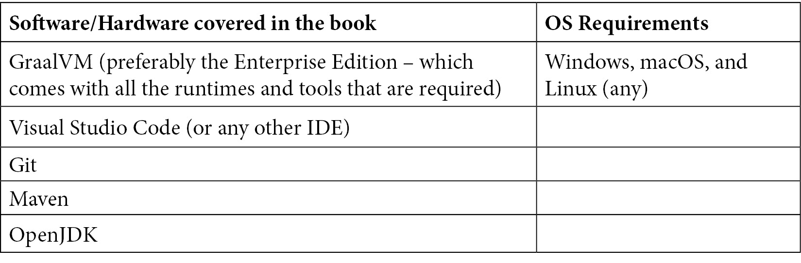

# 前言

GraalVM 是一种通用的虚拟机，允许程序员将用 JVM 语言（如 Java、Kotlin 和 Groovy）编写的应用程序嵌入、编译、互操作和运行；非 JVM 语言（如 JavaScript、Python、WebAssembly、Ruby 和 R）；以及 LLVM 语言（如 C 和 C++）。

GraalVM 提供了 Graal **即时**（**JIT**）编译器，这是 Java 虚拟机编译器接口（**JVMCI**）的一个实现，它完全基于 Java，并使用 Java JIT 编译器（C2 编译器）优化技术作为基础，并在此基础上构建。Graal JIT 编译器比 Java C2 JIT 编译器更复杂。GraalVM 是 JDK 的直接替代品，这意味着所有目前在 JDK 上运行的应用程序都应该在 GraalVM 上运行，而无需更改任何应用程序代码。

GraalVM 还提供了**即时编译**（**AOT**）功能，以静态链接构建原生镜像。GraalVM AOT 编译有助于构建具有非常小体积、快速启动和执行速度的原生镜像，这对于现代微服务架构来说非常理想。

虽然 GraalVM 是基于 Java 构建的，但它不仅支持 Java，还使 JavaScript、Python、R、Ruby、C 和 C++ 等多种语言能够进行多语言开发。它提供了一个可扩展的框架 Truffle，允许任何语言在平台上构建和运行。

GraalVM 正在成为运行云原生 Java 微服务的默认运行时。很快，所有 Java 开发者都将使用 GraalVM 来运行他们的云原生 Java 微服务。市场上已经出现了许多基于 GraalVM 的微服务框架，例如 Quarkus、Micronaut、Spring Native 等。

与 Java 一起工作的开发者将能够通过这本关于 GraalVM 和云原生微服务 Java 框架的实用指南来运用他们的知识。本书提供了实施和相关方法的动手实践方法，让您迅速上手并高效工作。本书还通过简单易懂的示例逐步解释了基本概念。

本书是针对希望优化其应用程序性能并寻求解决方案的开发者的实用指南。我们将从简要介绍 GraalVM 架构和底层工作原理开始。开发者将迅速进入探索在 GraalVM 上运行 Java 应用程序所能获得性能优势的阶段。我们将学习如何创建原生镜像，并了解 AOT 如何显著提高应用程序性能。然后，我们将探索构建多语言应用程序的示例，并探讨在同一虚拟机上运行的语言之间的互操作性。我们将探索 Truffle 框架，以实现我们自己的语言在 GraalVM 上最优运行。最后，我们还将了解 GraalVM 在云原生和微服务开发中的具体益处。

# 本书面向对象

本书的主要受众是希望优化其应用程序性能的 JVM 开发者。对于探索使用 Python/R/Ruby/Node.js 生态系统中的工具开发多语言应用程序的 JVM 开发者来说，本书也非常有用。由于本书面向经验丰富的开发者/程序员，读者必须熟悉软件开发概念，并且应该对使用编程语言有良好的了解。

# 本书涵盖内容

*第一章*, *Java 虚拟机的发展历程*，回顾了 JVM 的发展历程以及它是如何优化解释器和编译器的。它将介绍 C1 和 C2 编译器，以及 JVM 为了使 Java 程序运行更快而执行的代码优化类型。

*第二章*, *JIT、HotSpot 和 GraalJIT*，深入探讨了 JIT 编译器和 Java HotSpot 的工作原理以及 JVM 如何在运行时优化代码。

*第三章*, *GraalVM 架构*，提供了 Graal 和各个架构组件的架构概述。章节深入探讨了 GraalVM 的工作原理以及它是如何为多种语言实现提供单个虚拟机的。本章还涵盖了 GraalVM 在标准 JVM 之上带来的优化。

*第四章*, *Graal 即时编译器*，讨论了 GraalVM 的 JIT 编译选项。详细介绍了 Graal JIT 编译器执行的各项优化。随后是一个实战教程，讲解如何使用各种编译器选项来优化执行。

*第五章*, *Graal 预编译器及原生图像*，是一个实战教程，讲解如何构建原生图像，并使用配置文件引导优化技术对这些图像进行优化和运行。

*第六章*, *松露 - 概述*，介绍了 Truffle 的多语言互操作性功能和高级框架组件。它还涵盖了如何在运行在 GraalVM 上的不同语言编写的应用程序之间传输数据。

*第七章*, *GraalVM 多语言 - JavaScript 和 Node.js*，介绍了 JavaScript 和 NodeJs。随后是一个教程，讲解如何使用多语言 API 实现互操作性，以便在示例 JavaScript 和 NodeJS 应用程序与 Python 应用程序之间进行交互。

*第八章*, *GraalVM 多语言 - Truffle 上的 Java、Python 和 R*，介绍了 Python、R 和 Truffle（Espresso）上的 Java。随后是一个教程，讲解如何使用多语言 API 实现各种语言之间的互操作性。

*第九章*，*GraalVM 多语言 – LLVM、Ruby 和 WASM*，介绍了 JavaScript 和 Node.js。随后是一个教程，说明如何使用 Polyglot API 在示例 JavaScript/Node.js 应用程序之间进行互操作。

*第十章*，*使用 GraalVM 的微服务架构*，涵盖了现代微服务架构以及新框架如 Quarkus 和 Micronaut 如何实现 Graal 以达到最优化微服务架构。

# 要充分利用本书

本书是一本实践指南，提供了如何使用 GraalVM 的逐步说明。在整个书中，作者使用了非常简单、易于理解的代码示例，这些示例将帮助您理解 GraalVM 的核心概念。所有代码示例都提供在 Git 仓库中。您应具备良好的 Java 编程语言知识。本书还涉及 Python、JavaScript、Node.js、Ruby 和 R，但示例故意保持简单，以便理解，同时专注于展示多语言互操作性概念。



**如果您使用的是本书的数字版，我们建议您亲自输入代码或通过 GitHub 仓库（下一节中提供链接）访问代码。这样做将帮助您避免与代码复制和粘贴相关的任何潜在错误。**

# 下载示例代码文件

您可以从 GitHub 下载本书的示例代码文件：[`github.com/PacktPublishing/Supercharge-Your-Applications-with-GraalVM`](https://github.com/PacktPublishing/Supercharge-Your-Applications-with-GraalVM)。如果代码有更新，它将在现有的 GitHub 仓库中更新。

我们还有其他来自我们丰富的书籍和视频目录的代码包，可在 [`github.com/PacktPublishing/`](https://github.com/PacktPublishing/) 上找到。查看它们吧！

# 代码在行动

代码在行动视频可以在 [`bit.ly/3eM5ewO`](https://bit.ly/3eM5ewO) 上查看。

# 下载彩色图像

我们还提供了一份包含本书中使用的截图/图表彩色图像的 PDF 文件。您可以从这里下载：[`static.packt-cdn.com/downloads/9781800564909_ColorImages.pdf`](https://static.packt-cdn.com/downloads/9781800564909_ColorImages.pdf)。

# 使用的约定

本书使用了多种文本约定。

`文本中的代码`：表示文本中的代码单词、数据库表名、文件夹名、文件名、文件扩展名、路径名、虚拟 URL、用户输入和 Twitter 账号。以下是一个示例：“在 Truffle 中，它是一个从 `com.oracle.truffle.api.nodes.Node` 派生的 Java 类。”

代码块设置如下：

```java
@Fallback protected void typeError (Object left, Object right) {
    throw new TypeException("type error: args must be two         integers or floats or two", this);
}
```

任何命令行输入或输出都应如下编写：

```java
✗/Library/Java/JavaVirtualMachines/graalvm-ee-java11-21.0.0.2/Contents/Home/bin/npm --version
6.14.10
```

**粗体**：表示新术语、重要单词或您在屏幕上看到的单词。例如，菜单或对话框中的单词在文本中显示如下。以下是一个示例：“从**管理**面板中选择**系统信息**。”

小贴士或重要注意事项

看起来像这样。

# 联系我们

读者反馈始终受欢迎。

`customercare@packtpub.com`。

**勘误表**：尽管我们已经尽一切努力确保内容的准确性，但错误仍然可能发生。如果您在这本书中发现了错误，如果您能向我们报告这一点，我们将不胜感激。请访问 [www.packtpub.com/support/errata](http://www.packtpub.com/support/errata)，选择您的书籍，点击勘误表提交表单链接，并输入详细信息。

`copyright@packt.com` 与材料链接。

**如果您有兴趣成为作者**：如果您在某个领域有专业知识，并且您有兴趣撰写或为书籍做出贡献，请访问 [authors.packtpub.com](http://authors.packtpub.com)。

# 评论

请留下评论。一旦您阅读并使用了这本书，为何不在您购买它的网站上留下评论呢？潜在读者可以查看并使用您的客观意见来做出购买决定，我们 Packt 可以了解您对我们产品的看法，我们的作者也可以看到他们对书籍的反馈。谢谢！

想了解更多关于 Packt 的信息，请访问 [packt.com](http://packt.com)。
