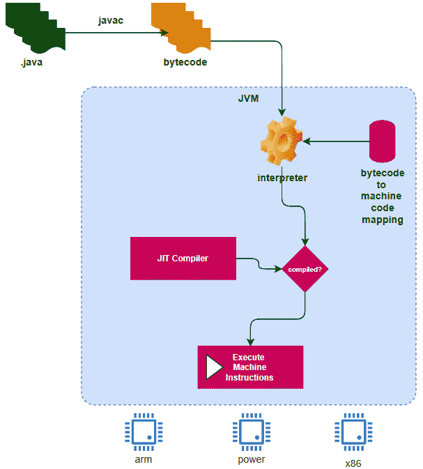
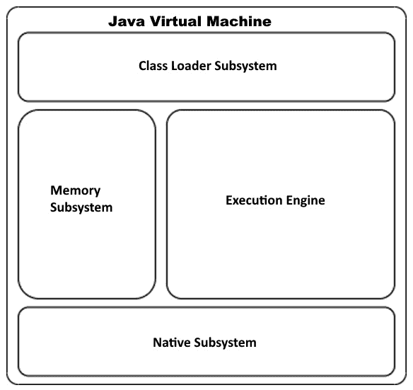
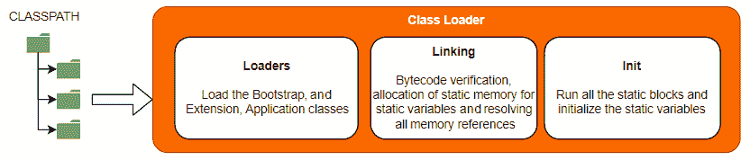
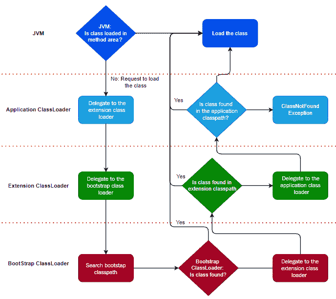
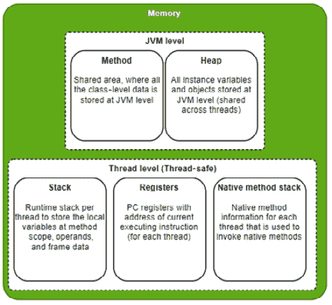
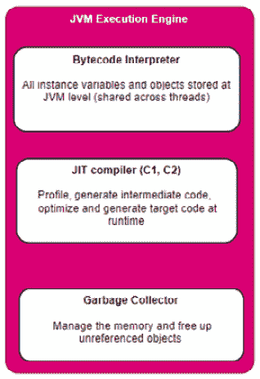
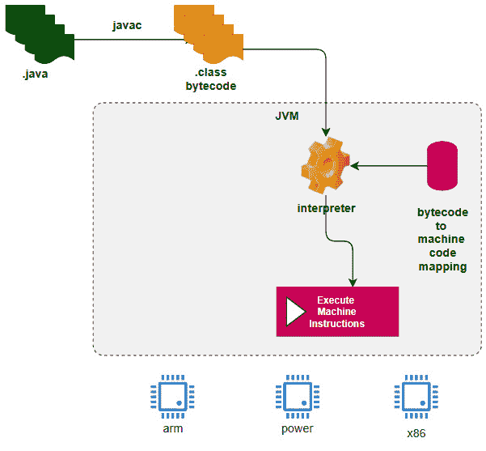
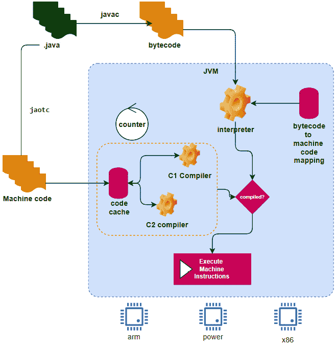
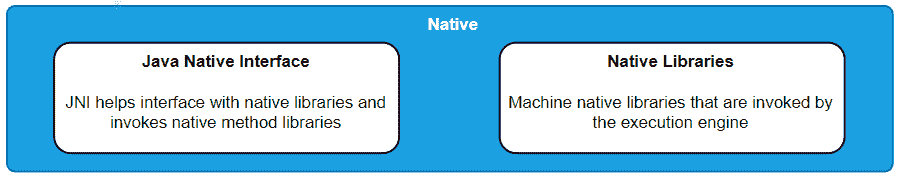

# 第二章：Java 虚拟机演变

本章将向您介绍 **Java 虚拟机**（**JVM**）的演变过程以及它是如何优化解释器和编译器的。我们将了解 C1 和 C2 编译器以及 JVM 执行的多种代码优化类型，以使 Java 程序运行得更快。

本章将涵盖以下主题：

+   GraalVM 简介

+   学习 JVM 的工作原理

+   理解 JVM 架构

+   理解 JVM 使用 **即时编译器**（**JIT**）执行的优化类型

+   学习 JVM 方法的优缺点

到本章结束时，您将对 JVM 架构有一个清晰的理解。这对于理解 GraalVM 架构以及 GraalVM 如何进一步优化并建立在 JVM 最佳实践之上至关重要。

# 技术要求

本章不需要任何特定的软件/硬件。

# GraalVM 简介

GraalVM 是一个高性能虚拟机，为现代云原生应用程序提供运行时。云原生应用程序是基于服务架构构建的。微服务架构改变了构建微应用程序的范式，这挑战了构建和运行应用程序的基本方式。微服务运行时需要一套不同的要求。

这里是一些基于微服务架构构建的云原生应用程序的关键要求：

+   **更小的内存占用**：云原生应用程序运行在“按使用付费”的模式上。这意味着云原生运行时需要具有更小的内存占用，并且应该以最佳 CPU 循环运行。这将有助于使用更少的云资源运行更多的工作负载。

+   **快速启动**：可扩展性是容器化微服务架构最重要的方面之一。应用程序启动越快，它就能更快地扩展集群。这对于无服务器架构来说尤为重要，在无服务器架构中，代码在请求初始化和运行后关闭。

+   **多语言和互操作性**：多语言是现实；每种语言都有其优势，并将继续如此。云原生微服务正在用不同的语言构建。拥有一个能够接纳多语言需求并提供跨语言互操作性的架构非常重要。随着我们转向现代架构，尽可能重用代码和逻辑至关重要，这些代码和逻辑是经过时间考验的，对业务至关重要。

GraalVM 为所有这些需求提供了解决方案，并为嵌入和运行多语言云原生应用程序提供了一个通用平台。它是基于 JVM 构建的，并带来了进一步的优化。在了解 GraalVM 的工作原理之前，了解 JVM 的内部工作原理非常重要。

传统的 JVM（在 GraalVM 之前）已经发展成为最成熟的运行时实现。虽然它具有之前列出的某些要求，但它并不是为云原生应用程序设计的，并且带有单体设计原则的包袱。它不是云原生应用程序的理想运行时。

本章将详细介绍 JVM 的工作原理以及 JVM 架构的关键组件。

# 学习 JVM 的工作原理

Java 是最成功和最广泛使用的语言之一。Java 之所以非常成功，是因为其“一次编写，到处运行”的设计原则。JVM 通过位于应用程序代码和机器码之间，将应用程序代码解释为机器码来实现这一设计原则。

传统上，运行应用程序代码有两种方式：

+   **编译器**：应用程序代码直接编译为机器码（C、C++等）。编译器通过构建过程将应用程序代码转换为机器码。编译器为特定的目标架构生成最优化代码。应用程序代码必须编译为目标架构。一般来说，编译的代码总是比解释的代码运行得快，并且可以在编译时而不是运行时识别代码语义问题。

+   **解释器**：应用程序代码逐行解释为机器码（JavaScript 等）。由于解释器逐行运行，代码可能没有针对目标架构进行优化，并且运行速度较慢，与编译的代码相比。解释器具有“一次编写，到处运行”的灵活性。一个很好的例子是主要用于 Web 应用程序的 JavaScript 代码。它在不同的目标浏览器上几乎不需要或只需要很少的更改即可运行。解释器通常运行较慢，适用于运行小型应用程序。

JVM 结合了解释器和编译器的优点。以下图表说明了 JVM 如何使用解释器和编译器方法运行 Java 代码：

图 1.1 – Java 编译器和解释器

让我们看看它是如何工作的：

+   Java 编译器（**javac**）将 Java 应用程序源代码编译为**字节码**（中间格式）。

+   JVM 在运行时逐行将字节码解释为机器码。这有助于将优化的字节码转换为目标机器码，从而帮助在不同的目标机器上运行相同的应用程序代码，而无需重新编程或重新编译。

+   JVM 还有一个即时编译器（**JIT**），通过分析代码在运行时进一步优化代码。

在本节中，我们探讨了 Java 编译器和 JIT 如何协同工作，在 JVM 上以更高的层次运行 Java 代码。在下一节中，我们将学习 JVM 的架构。

# 理解 JVM 架构

经过多年的发展，JVM 已经发展成为最成熟的 VM 运行时。它具有非常结构化和复杂的运行时实现。这也是 GraalVM 被构建出来以利用 JVM 的所有最佳特性，并为云原生世界提供进一步优化所需的功能的原因之一。为了更好地欣赏 GraalVM 架构及其在 JVM 之上带来的优化，了解 JVM 架构是非常重要的。

本节将详细向您介绍 JVM 架构。以下图显示了 JVM 中各个子系统的整体架构：

图 1.2 – JVM 的整体架构

本节的其余部分将详细介绍这些子系统。

## 类加载器子系统

类加载器子系统负责分配所有相关的`.class`文件并将这些类加载到内存中。类加载器子系统还负责在类初始化和加载到内存之前链接和验证`.class`文件的规范。类加载器子系统具有以下三个关键功能：

+   加载

+   链接

+   初始化

以下图显示了类加载器子系统的各个组件：

图 1.3 – 类加载器子系统的组件

让我们现在看看每个组件的作用。

### 加载

在传统的基于编译器的语言（如 C/C++）中，源代码被编译成目标代码，然后所有依赖的目标代码在构建最终可执行文件之前通过链接器链接。所有这些都属于构建过程的一部分。一旦构建了最终的可执行文件，它就会被加载器加载到内存中。Java 的工作方式不同。

Java 源代码（`.java`）由 Java 编译器（`javac`）编译成字节码（`.class`）文件。类加载器是 JVM 的关键子系统之一，负责加载运行应用程序所需的所有依赖类。这包括应用程序开发者编写的类、库以及**Java 软件开发工具包**（**SDK**）类。

该系统包括三种类型的类加载器：

+   `rt.jar`，其中包含所有 Java 标准版 JDK 类，如`java.lang`、`java.net`、`java.util`和`java.io`。引导加载器负责加载运行任何 Java 应用程序所需的所有类。这是 JVM 的核心部分，用本地语言实现。

+   `jre`/`lib`/`ext`目录。扩展类加载器类通常是 Java 中实现的引导扩展类。扩展类加载器用 Java 实现（`sun.misc.Launcher$ExtClassLoader.class`）。

+   `CLASSPATH`环境变量）。这也用 Java 实现（`sun.misc.Launcher$AppClassLoader.class`）。

引导、扩展和应用程序类加载器负责加载运行应用程序所需的所有类。在类加载器找不到所需类的情况下，将抛出`ClassNotFoundException`。

类加载器实现了委托层次算法。以下图表显示了类加载器如何实现委托层次算法来加载所有必需的类：

](img/B16878_Figure_1.4.jpg)

图 1.4 – 类加载器委托层次算法实现流程图

让我们了解这个算法是如何工作的：

1.  JVM 将在方法区中查找类（将在本节稍后详细讨论）。如果没有找到类，它将要求应用程序类加载器将类加载到内存中。

1.  应用程序类加载器将调用委托给扩展类加载器，扩展类加载器再委托给引导类加载器。

1.  引导类加载器将在引导`CLASSPATH`中查找类。如果找到类，它将加载到内存中。如果没有找到类，控制权将委托给扩展类加载器。

1.  扩展类加载器将尝试在扩展`CLASSPATH`中查找类。如果找到类，它将加载到内存中。如果没有找到类，控制权将委托给应用程序类加载器。

1.  应用程序类加载器将尝试在`CLASSPATH`中查找类。如果找不到，它将抛出`ClassNotFoundException`，否则，该类将被加载到方法区，JVM 将开始使用它。

### 链接

一旦类被加载到内存中（到方法区，在*内存子系统*部分将进一步讨论），类加载器子系统将执行链接。链接过程包括以下步骤：

+   `java.lang.Object`。验证阶段验证并确保方法运行时没有任何问题。

+   **准备**：一旦所有类都加载并验证，JVM 将为类变量（静态变量）分配内存。这也包括调用静态初始化（静态块）。

+   **解析**：JVM 通过定位符号表中引用的类、接口、字段和方法来进行解析。JVM 可能在初始验证（静态解析）期间解析符号，也可能在类正在验证时解析（懒解析）。

类加载器子系统会抛出各种异常，包括以下内容：

+   `ClassNotFoundException`

+   `NoClassDefFoundError`

+   `ClassCastException`

+   `UnsatisfiedLinkError`

+   `ClassCircularityError`

+   `ClassFormatError`

+   `ExceptionInInitializerError`

您可以参考 Java 规范以获取更多详细信息：[`docs.oracle.com/en/java/javase`](https://docs.oracle.com/en/java/javase)。

### 初始化

一旦所有类都被加载并且符号被解析，初始化阶段就开始了。在这个阶段，类被初始化（new）。这包括初始化静态变量、执行静态块和调用反射方法（`java.lang.reflect`）。这也可能导致加载那些类。

类加载器在应用程序运行之前将所有类加载到内存中。大多数情况下，类加载器必须加载完整的类层次结构和依赖类（尽管存在延迟解析），以验证方案。这既耗时又占用大量内存。如果应用程序使用反射并且需要加载反射类，那么这个过程会更慢。

在了解类加载器子系统之后，现在让我们来理解内存子系统是如何工作的。

## 内存子系统

内存子系统是 JVM 中最关键的子系统之一。正如其名称所暗示的，内存子系统负责管理方法变量、堆栈、栈和寄存器分配的内存。以下图表显示了内存子系统的架构：

图 1.5 – 内存子系统架构

内存子系统有两个区域：JVM 级别和线程级别。让我们详细讨论每个区域。

### JVM 级别

JVM 级别的内存，正如其名称所暗示的，是对象在 JVM 级别存储的地方。这不是线程安全的，因为多个线程可能会访问这些对象。这也解释了为什么当程序员在这个区域更新对象时，建议他们编写线程安全的（同步）代码。JVM 级别的内存有两个区域：

+   **方法**：方法区是存储所有类级别数据的地方。这包括类名、层次结构、方法、变量和静态变量。

+   **堆**：堆是存储所有对象和实例变量的地方。

### 线程级别

线程级别的内存是存储所有线程局部对象的地方。这对相应的线程是可访问/可见的，因此它是线程安全的。线程级别的内存有三个区域：

+   **栈**：对于每个方法调用，都会创建一个栈帧，用于存储所有方法级别的数据。栈帧包括在方法作用域内创建的所有变量/对象、操作数栈（用于执行中间操作）、帧数据（存储与方法对应的所有符号）以及异常捕获块信息。

+   **寄存器**：PC 寄存器跟踪指令执行并指向正在执行的当前指令。这为每个正在执行的线程维护。

+   **本地方法栈**：本地方法栈是一种特殊的栈，用于存储本地方法信息，这在调用和执行本地方法时非常有用。

现在类已经被加载到内存中，让我们看看 JVM 执行引擎是如何工作的。

## JVM 执行引擎子系统

JVM 执行引擎是 JVM 的核心，所有执行都在这里发生。这是字节码被解释和执行的地方。JVM 执行引擎使用内存子系统来存储和检索对象。JVM 执行引擎有三个关键组件，如下所示：

图 1.6 – JVM 执行引擎架构

我们将在接下来的章节中详细讨论每个组件。

### 字节码解释器

如本章前面所述，字节码（`.class`）是 JVM 的输入。JVM 字节码解释器从 `.class` 文件中选取每条指令，将其转换为机器码并执行。解释器的明显缺点是它们没有被优化。指令按顺序执行，即使同一个方法被多次调用，它也会逐条指令执行，解释后再执行。

### JIT 编译器

JIT 编译器通过分析由解释器执行的代码，识别出代码可以优化的区域，并将它们编译为目标机器码，以便它们可以更快地执行。字节码和编译代码片段的组合提供了执行类文件的最佳方式。

下面的图示详细说明了 JVM 的工作原理，以及 JVM 使用的各种类型的 JIT 编译器来优化代码：

图 1.7 – JVM 与 JIT 编译器的详细工作原理

让我们理解前面图示中显示的工作原理：

1.  JVM 解释器逐个字节码执行，并使用机器码对其进行解释，利用字节码到机器码的映射。

1.  JVM 使用计数器持续分析代码，以统计代码执行的次数，如果计数器达到阈值，它将使用 JIT 编译器编译该代码以进行优化，并将其存储在代码缓存中。

1.  JVM 然后检查该编译单元（块）是否已经编译。如果 JVM 在代码缓存中找到已编译的代码，它将使用这些已编译的代码以实现更快的执行。

1.  JVM 使用两种类型的编译器，C1 编译器和 C2 编译器，来编译代码。

如 *图 1.7* 所示，JIT 编译器通过分析正在运行的代码进行优化，并在一段时间内识别出可以编译的代码。JVM 运行编译后的代码片段，而不是解释代码。这是一种运行解释代码和编译代码的混合方法。

JVM 引入了两种类型的编译器，C1（客户端）和 C2（服务器），而 JVM 的最新版本则结合了两者在运行时优化和编译代码的最佳性能。让我们更好地理解这些类型：

+   **C1 编译器**：引入了一个性能计数器，用于计算特定方法/代码片段执行的次数。一旦方法/代码片段被使用特定次数（阈值），则该代码片段将由 C1 编译器编译、优化和缓存。下次调用该代码片段时，它将直接从缓存中执行编译后的机器指令，而不是通过解释器。这引入了第一级优化。

+   **C2 编译器**：在代码执行过程中，JVM 将执行运行时代码分析，确定代码路径和热点。然后运行 C2 编译器以进一步优化热点代码路径。这也被称为热点。

C1 编译器更快，适合短运行时应用，而 C2 编译器较慢且重量级，但非常适合长时间运行的过程，如守护进程和服务器，因此代码在长时间运行中表现更佳。

在 Java 6 中，有一个命令行选项可以用来选择使用 C1 或 C2 方法（使用命令行参数 `-client`（用于 C1）和 `-server`（用于 C2））。在 Java 7 中，有一个命令行选项可以同时使用两者。自 Java 8 以来，C1 和 C2 编译器都用于优化，作为默认行为。

编译有五个层级/级别。可以通过生成编译日志来了解哪个 Java 方法使用了哪个编译器层级/级别。以下为五个编译层级/级别：

+   解释代码（级别 0）

+   简单的 C1 编译代码（级别 1）

+   有限的 C1 编译代码（级别 2）

+   完整的 C1 编译代码（级别 3）

+   C2 编译代码（级别 4）

现在我们来看看 JVM 在编译过程中应用的各类代码优化。

### 代码优化

JIT 编译器生成正在编译的代码的内部表示，以理解其语义和语法。这些内部表示是树形数据结构，JIT 将在这些结构上运行代码优化（作为多个线程，可以通过命令行的 `XcompilationThreads` 选项进行控制）。

以下是一些 JIT 编译器对代码执行的优化：

+   `-XX:MaxFreqInlineSize` 标志（默认值为 325 字节）。

+   **逃逸分析**：JVM 对变量进行配置以分析变量的使用范围。如果变量没有超出局部作用域，它将执行局部优化。锁消除就是这样一种优化，其中 JVM 决定是否真的需要为变量使用同步锁。同步锁对处理器来说非常昂贵。JVM 还决定将对象从堆移动到栈上。这有助于提高内存使用率和垃圾收集效率，因为对象在方法执行完毕后就会被销毁。

+   **取消优化**：取消优化是另一种关键的优化技术。JVM 在优化后对代码进行分析，并可能决定取消优化代码。取消优化将对性能产生短暂的影响。JIT 编译器在两种情况下决定取消优化：

    a. **非进入代码**：这在继承类或接口实现中非常明显。JIT 可能已经针对层次结构中的特定类进行了优化，但随着时间的推移，当它了解到不同的情况时，它将取消优化并针对更具体的类实现进行进一步优化。

    b. **僵尸代码**：在非进入代码分析期间，一些对象被垃圾收集，导致可能永远不会被调用的代码。这种代码被标记为僵尸代码。此代码将从代码缓存中删除。

除了这个之外，JIT 编译器还执行其他优化，例如控制流优化，这包括重新排列代码路径以提高效率，并将本地代码生成到目标机器代码以实现更快的执行。

JIT 编译器的优化是在一段时间内进行的，这对于长时间运行的过程很有好处。我们将在*第二章**，JIT、Hotspot 和 GraalVM*中详细解释 JIT 编译。

#### Java 预编译

预编译选项是在 Java 9 中通过 `jaotc` 引入的，它可以将 Java 应用程序代码直接编译成最终机器代码。代码被编译为目标架构，因此它不是可移植的。

Java 支持在 x86 架构上同时运行 Java 字节码和 AOT 编译的代码。以下图表说明了它是如何工作的。这是 Java 可以生成的最优化代码：

![图 1.8 – JVM JIT 时间编译器和预编译器的详细工作原理]

图 1.8 – JVM JIT 时间编译器和预编译器的详细工作原理

字节码将通过之前解释的方法（C1、C2）。`jaotc` 预先编译最常用的 Java 代码（如库）成机器代码，并将其直接加载到代码缓存中。这将减少 JVM 的负载。Java 字节码将通过常规解释器，并使用代码缓存中的代码（如果可用）。这将大大减少 JVM 在运行时编译代码的负载。通常，最常用的库可以预先编译以实现更快的响应。

### 垃圾收集器

Java 的一个复杂之处在于其内置的内存管理。在 C/C++ 等语言中，程序员需要负责分配和释放内存。在 Java 中，JVM 负责清理未引用的对象并回收内存。垃圾收集器是一个守护线程，它自动执行清理工作，也可以由程序员调用（`System.gc()` 和 `Runtime.getRuntime().gc()`）。

## 本地子系统

Java 允许程序员访问原生库。原生库通常是那些为特定目标架构构建（使用如 C/C++ 等语言）并使用的库。**Java 原生接口**（**JNI**）提供了一个抽象层和接口规范，用于实现访问原生库的桥梁。每个 JVM 都为特定的目标系统实现了 JNI。程序员还可以使用 JNI 来调用原生方法。以下图表说明了原生子系统的组件：

图 1.9 – 原生子系统架构

原生子系统提供了访问和管理原生库的实现。

JVM 已经发展并拥有语言 VM 运行时最复杂的实现之一。

# 摘要

在本章中，我们首先学习了 GraalVM 是什么，然后了解了 JVM 的工作原理及其架构，包括其各种子系统和组件。稍后，我们还学习了 JVM 如何结合解释器和编译器的最佳方法在多种目标架构上运行 Java 代码，以及代码是如何通过 C1 和 C2 编译器即时编译的。最后，我们学习了 JVM 执行的各种类型的代码优化。

本章为我们提供了对 JVM 架构的良好理解，这将帮助我们了解 GraalVM 架构的工作原理以及它是如何建立在 JVM 之上的。

下一章将涵盖 JIT 编译器的工作原理的细节，并帮助您了解 Graal JIT 是如何建立在 JVM JIT 之上的。

# 问题

1.  为什么 Java 代码会被解释成字节码，并在运行时编译？

1.  JVM 如何加载适当的类文件并将它们链接起来？

1.  JVM 中有哪些不同类型的内存区域？

1.  C1 编译器和 C2 编译器之间的区别是什么？

1.  JVM 中的代码缓存是什么？

1.  立即执行时执行的各种代码优化类型有哪些？

# 进一步阅读

+   《JVM 语言入门》，作者 Vincent van der Leun，Packt 出版公司 ([`www.packtpub.com/product/introduction-to-jvm-languages/9781787127944`](https://www.packtpub.com/product/introduction-to-jvm-languages/9781787127944))

+   《Java 文档和规范》，作者 Oracle ([`docs.oracle.com/en/java/`](https://docs.oracle.com/en/java/))
