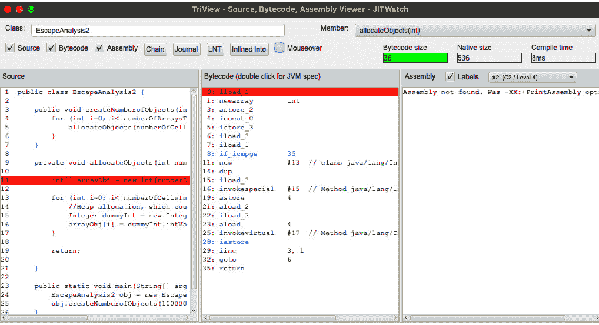

# *第二章*：JIT、HotSpot 和 GraalJIT

在上一章中，我们学习了 C1 和 C2 编译器以及 C2 编译器在运行时执行的代码优化和去优化类型。

在本章中，我们将深入探讨 C2 即时编译，并介绍 Graal 的即时编译。**即时**（**JIT**）编译是 Java 能够与传统**编译时**（**AOT**）编译器竞争的关键创新之一。正如我们在上一章所学，JIT 编译随着 JVM 中的 C2 编译器而发展。C2 JIT 编译器持续分析代码执行情况，并在运行时应用各种优化和去优化，以编译/重新编译代码。

本章将是一个实战环节，我们将分析一个示例代码，了解 C2 JIT 编译器的工作原理，并介绍 Graal JIT。

在本章中，我们将涵盖以下主题：

+   了解 JIT 编译器的工作原理

+   通过识别热点区域来了解 JIT 如何优化代码

+   使用分析工具演示 JIT 编译器的工作原理

+   了解 GraalVM JIT 在 JVM JIT 之上是如何工作的

到本章结束时，你将清楚地了解 JIT 编译器的内部工作原理以及 GraalVM 如何进一步扩展它。我们将使用示例 Java 代码和 JITWatch 等分析工具来深入了解 JIT 的工作方式。

# 技术要求

要遵循本章中给出的说明，你需要以下工具：

+   本章中提到的所有源代码都可以从[`github.com/PacktPublishing/Supercharge-Your-Applications-with-GraalVM/tree/main/Chapter02`](https://github.com/PacktPublishing/Supercharge-Your-Applications-with-GraalVM/tree/main/Chapter02)下载。

+   Git ([`github.com/git-guides/install-git`](https://github.com/git-guides/install-git))

+   Maven ([`maven.apache.org/install.html`](https://maven.apache.org/install.html))

+   OpenSDK ([`openjdk.java.net/`](https://openjdk.java.net/)) 和 JavaFX ([`openjfx.io/`](https://openjfx.io/))

+   JITWatch ([`www.jrebel.com/blog/understanding-java-jit-with-jitwatch#:~:text=JITWatch%20is%20a%20log%20analyser,to%20the%20Adopt%20OpenJDK%20initiative`](https://www.jrebel.com/blog/understanding-java-jit-with-jitwatch#:~:text=JITWatch%20is%20a%20log%20analyser,to%20the%20Adopt%20OpenJDK%20initiative))

+   本章的“代码实战”视频可以在[`bit.ly/3w7uWlu`](https://bit.ly/3w7uWlu)找到。

# 设置环境

在本节中，我们将设置所有必需的先决工具和环境，以便继续学习本章的其余部分。

## 安装 OpenJDK Java

你可以从[`openjdk.java.net/install/`](https://openjdk.java.net/install/)安装 OpenJDK。此 URL 提供了安装 OpenJDK 的详细说明。我们还需要 JavaFX。请参阅[`openjfx.io/`](https://openjfx.io/)以获取有关安装 JavaFX 的更多详细信息。

## 安装 JITWatch

JITWatch 是用于理解 JIT 编译器行为的最广泛使用的日志分析和可视化工具之一。它也广泛应用于代码分析和识别性能调优的机会。

JITWatch 是一个活跃的开源项目，托管在[`github.com/AdoptOpenJDK/jitwatch`](https://github.com/AdoptOpenJDK/jitwatch)。

安装 JITWatch 的典型命令如下：

```java
git clone git@github.com:AdoptOpenJDK/jitwatch.git
cd jitwatch
mvn clean install -DskipTests=true
./launchUI.sh
```

# 深入探讨 HotSpot 和 C2 JIT 编译器

在上一章中，我们回顾了 JVM 的演变过程以及 C2 JIT 编译器的进化。在本节中，我们将更深入地探讨 JVM C2 JIT 编译器。通过示例代码，我们将了解 JIT 编译器在运行时执行的优化。为了更好地理解 Graal JIT 编译器，了解 C2 JIT 编译器的工作原理非常重要。

基于配置文件指导的优化是 JIT 编译器的关键原则。虽然 AOT 编译器可以优化静态代码，但大多数情况下，这还不够好。了解应用程序的运行时特性以识别优化机会非常重要。JVM 内置了一个分析器，可以动态地对应用程序进行配置，以分析一些关键参数并识别优化机会。一旦识别出这些机会，它将编译这些代码为本地语言，并从运行解释代码切换到更快编译的代码。这些优化基于分析以及 JVM 做出的有根据的假设。如果这些假设中的任何一个是不正确的，JVM 将取消优化并切换回运行解释代码。这被称为**混合模式执行**。

下图展示了 JVM 如何执行基于配置文件指导的优化以及在执行模式之间切换的流程：

![图 2.1 – JIT 编译

![图片 B16878_Figure_2.01.jpg]

图 2.1 – JIT 编译

Java 源代码（`.java`）被编译成字节码（`.class`），这是代码的中间表示形式。JVM 使用内置的解释器开始运行字节码。解释器使用字节码到机器码的映射，逐条将字节码指令转换为机器码，然后执行它。

当 JVM 执行这些指令时，它还会跟踪一个方法被调用的次数。当某个特定方法的调用次数超过编译器的阈值时，它会启动一个编译器，在单独的编译线程上编译该方法。JVM 使用两种类型的编译器来编译代码：C1（客户端）和 C2（服务器）JIT 编译器。编译后的代码存储在代码缓存中，以便下次调用该方法时，JVM 将直接从代码缓存中执行代码，而不是进行解释。JIT 编译器对代码执行各种优化，因此随着时间的推移，应用程序的性能会得到提升。本节剩余部分将详细介绍这些组件。

## 代码缓存

代码缓存是 JVM 中存储编译后的本地方法（也称为 `nmethod`）的区域。代码缓存被设置为静态大小，经过一段时间后可能会满。一旦代码缓存满，JVM 就无法编译或存储更多代码。对代码缓存进行优化调整对于最佳性能至关重要。四个关键参数帮助我们微调 JVM 性能，以获得最佳代码缓存：

+   `-XX:InitialCodeCacheSize`：代码缓存的初始大小。默认大小为 160 KB（根据 JVM 版本的不同而有所变化）。

+   `-XX:ReservedCodeCacheSize`：代码缓存可以增长到的最大大小。默认大小为 32/48 MB。当代码缓存达到这个限制时，JVM 将抛出一个警告：“代码缓存已满。编译器已被禁用。” JVM 提供了 `UseCodeCacheFlushing` 选项，当代码缓存满时可以刷新代码缓存。当编译的代码不够热（计数器小于编译器阈值）时，代码缓存也会被刷新。

+   `-XX:CodeCacheExpansionSize`：这是扩展现有的值。其默认值是 32/64 KB。

+   `-XX:+PrintCodeCache`：此选项可用于监控代码缓存的利用率。

自 Java 9 以来，JVM 将代码缓存分为三个部分：

+   `-XX:NonNMethodCodeHeapSize` 标志。

+   `-XX:ProfiledCodeHeapSize` 标志。

+   `-XX:NonProfiledCodeHeapSize` 标志。

## 编译器阈值

编译阈值是帮助 JVM 决定何时执行 JIT 编译的一个因素。当 JVM 检测到某个方法的执行达到编译阈值时，JVM 将启动适当的编译器进行编译（关于这一点，在本节的后面部分将详细介绍，我们将遍历各种类型的 JIT 编译器和分层编译）。

决定编译阈值基于两个关键变量。每个 JVM 都为这两个变量提供了默认值，但也可以使用适当的命令行参数进行更改。这两个变量对于调整 JVM 性能至关重要，应谨慎使用。这两个变量如下：

+   **方法调用计数器**：这统计了特定方法被调用的次数。

+   **循环计数器**：这指的是特定循环完成执行（即分支回退）的次数。有时，这也被称为回边阈值或回边计数器。

JVM 在运行时对这些两个变量进行配置，并据此决定是否需要编译该方法/循环。当达到编译阈值时，JVM 将启动一个编译线程来编译该特定方法/循环。

使用 `-XX:CompilationThreshold=N` 标志作为执行代码时的参数，可以更改编译阈值。对于客户端编译器，`N` 的默认值是 `1500`，而对于服务器编译器，默认值是 `10000`。

## 栈上替换

达到编译阈值的那些方法由 JIT 编译器编译，下次调用该方法时，将调用编译后的机器代码。这随着时间的推移提高了性能。然而，在长时间运行的循环达到循环计数器阈值（Backedge Threshold）的情况下，编译线程会启动代码编译。一旦循环中的代码被编译，执行将停止，并使用编译后的代码帧恢复。这个过程称为**栈上替换（OSR）**。让我们看看以下示例。

以下代码片段仅讨论 OSR 的工作原理。为了简化，代码仅显示一个长时间运行的循环，其中我们只是计算循环运行的总次数。在这种情况下，`main()`方法从未进入，因此即使达到编译阈值并且代码被编译，编译后的代码也无法使用，除非代码被替换。这就是 OSR 在优化此类代码中发挥作用的地方：

```java
public class OSRTest {
    public static void main(String[] args) {
        int total = 0;
        //long running loop
        for(int i=0; i < 10000000; i++) {

            //Perform some function
            total++;
        }
        System.out.println("Total number of times is "+ total);
    }
}
```

以下流程图显示了在这种情况下 OSR 是如何工作的：


图 2.2 – OSR 流程图

让我们看看它是如何工作的：

1.  解释器开始执行代码。

1.  当达到编译器阈值时，JVM 会启动一个编译线程来编译方法。在此期间，解释器继续执行语句。

1.  一旦编译线程返回编译后的代码（编译帧），JVM 会检查解释器是否仍在执行代码。如果解释器仍在执行代码，它将暂停并执行 OSR，然后从编译后的代码开始执行。

当我们开启`-XX:PrintCompilation`标志运行此代码时，这是显示 JVM 执行了 OSR 的输出（%属性表示它执行了 OSR）：


图 2.3 – OSR 日志截图

请参阅下一节以详细了解日志格式。

### XX:+PrintCompilation

`XX:+PrintCompilation`是一个非常强大的参数，可以传递给 JIT 编译器以了解它们是如何启动和优化代码的。在我们用这个参数运行代码之前，让我们首先了解输出格式。

`XX:+PrintCompilation`生成以下格式的参数列表，参数之间用空格分隔：

```java
<Timestamp> <CompilationID> <Flag> <Tier> <ClassName::MethodName> <MethodSize> <DeOptimization Performed if any>
```

这里是一个输出示例快照：


图 2.4 – 打印编译日志格式

让我们看看这些参数的含义：

+   `Timestamp`：这是 JVM 启动以来的毫秒时间。

+   `CompilationID`：这是 JVM 在编译队列中使用的内部识别号。这不一定是有序的，因为可能有后台编译线程预留了一些 ID。

+   `Flags`：编译器标志是非常重要的参数，会被记录下来。这表明编译器应用了哪些属性。JVM 打印出五个可能的字符的逗号分隔字符串，以指示应用给编译器的五个不同属性。如果没有应用任何属性，则显示为空字符串。这五个属性如下：

    a. `%` 字符。OSR 在本节前面已解释。此属性表明，当方法在大循环中循环时，会触发 OSR 编译。

    b. `!` 字符。这表示该方法有一个异常处理器。

    c. `s` 字符。这表示该方法被同步。

    d. `b` 字符。这表示编译是在阻塞模式下进行的。这意味着编译没有在后台进行。

    e. `n` 字符。这表示代码被编译为本地方法。

+   `Tier`：这表示执行了哪个编译层。有关更多详细信息，请参阅*分层编译*部分。

+   `MethodName`：此列列出正在编译的方法。

+   `MethodSize`：这是方法的大小。

+   `Deoptimization performed`：这显示了可能执行的任何去优化。我们将在下一节中详细讨论。

## 分层编译

在上一章中，我们简要介绍了编译层/级别。在本节中，我们将更详细地介绍。当达到编译器阈值时，客户端编译器会提前启动。服务器编译器基于分析启动。JVM 的最新版本使用两种编译器的组合来实现最佳性能。然而，用户可以使用 `-client`、`-server` 或 `-d64` 参数专门使用其中一个编译器。JVM 的默认行为是使用分层编译，这是最优化 JIT 编译。在分层编译中，代码首先由客户端编译器编译，然后根据分析，如果代码变得更热（因此得名 HotSpot），服务器编译器启动并重新编译代码。这个过程在上一节中通过流程图进行了说明。

分层编译随着代码的复杂化和运行时间的增加而引入了更多的优化。有些情况下，即时编译（JIT）比静态编译（AOT）运行得更优化且更快。虽然 AOT 编译引入了优化，但在构建阶段，它没有根据运行时分析来自动优化/去优化的智能。运行时分析、优化和去优化是 JIT 编译的关键优势。

有三种 JIT 编译器的版本：

+   `-client` 参数：

    ```java
    -XX:PrintCompilation logs the compilation process to the console. This helps in understanding how the compiler is working.
    ```

+   `long` 或 `double` 变量。这种编译器版本可以使用 `-server` 参数显式调用。

+   `-d64` 参数。

服务器编译器在编译速度上比客户端编译器慢 4 倍。然而，它们确实生成了运行速度更快的应用程序（高达 2 倍）。

如下列出的有五个编译层级/级别。可以通过编译日志使用编译打印来查找哪些方法被编译到哪个级别。

+   **Level 0 – 解释代码**：这是标准的解释器模式，其中 JIT 尚未激活。JIT 的激活基于编译阈值。

+   **Level 1 – 简单 C1 编译代码**：这是代码的基本无配置编译。编译后的代码将没有任何配置。

+   **Level 2 – 有限 C1 编译代码**：在这个级别，基本的计数器被配置了。这个计数器将帮助 JVM 决定是否移动到下一个级别，即 L2。有时，当 C2 编译器忙碌时，JVM 会使用这个级别作为提升到 Level 3 的中间步骤。

+   **Level 3 – 完整 C1 编译代码**：在这个级别，代码被完全配置和配置。这种详细的配置将有助于决定 L4 的进一步优化。这个级别给编译器增加了 25-30%的开销，并影响了性能。

+   **Level 4 – C2 编译代码**：这是代码的最优化编译，其中应用了所有优化。然而，在配置时，如果 JVM 发现优化上下文已更改，它将取消优化，并用 L0 或 L1（对于简单方法）替换代码。

现在我们来看 Java HotSpot 编译器如何执行分层编译。以下图表显示了编译的各种层级和流程模式：

![Figure 2.5 – 分层编译模式

![img/B16878_Figure_2.05.jpg]

图 2.5 – 分层编译模式

让我们了解每个流程表示的含义：

+   **A**：这是 JVM 的正常工作模式。所有代码都从 L0 开始，当达到编译阈值时升级到 L3。在 L3，代码会进行完整的详细配置的配置。然后，当代码达到阈值时，在运行时进行配置，然后使用 C2 编译器（L4）重新编译代码，进行最大优化。C2 编译器需要有关控制流的大量数据，以便做出优化决策。在本节的后面部分，我们将详细介绍 C2 编译器（JIT）执行的优化。然而，由于流程或优化上下文的变化，优化可能是无效的。在这种情况下，JVM 将取消优化，并将其返回到 L0。

+   **B: C2 忙碌**：C2 编译是在单独的编译线程上执行的，编译活动被排队。当所有编译线程都忙碌时，JVM 不会遵循正常流程，因为这可能会影响应用程序的整体性能。相反，JVM 将升级到 L2，至少计数器被配置了，稍后，当代码达到更高的阈值时，它将升级到 L3 和 L4。在任何时候，JVM 都可以取消优化或使编译代码无效。

+   **C: 简单代码**：有时，JVM 会将代码编译到 L3，并意识到代码不需要任何优化，因为它非常直接/简单，基于分析。在这种情况下，它会将其降低到 L1。这样，代码的执行速度会更快。我们越是对代码进行仪器化，对执行就越多的开销。通常观察到 L3 会给执行增加 20-30% 的开销，这是由于仪器化代码造成的。

我们可以使用 `-XX:+PrintCompilation` 选项来查看 JVM 的行为。以下是一个正常流程的示例：

```java
public class Sample {
    public static void main(String[] args) {
        Sample samp = new Sample();
        while (true) {
        for(int i=0; i<1000000; i++) {
            samp.performOperation();
        }
    }
}
    public void performOperation() {
        int sum = 0;
        int x = 100;
        performAnotherOperation();
    }
    public void performAnotherOperation() {
        int a = 100;
        int b = 200;
        for(int i=0; i<1000000; i++) {
            int x = a + b;
            int y = (24*25) + x;
            int z = (24*25) + x;
        }
    }
}
```

对于此代码，当我们使用 `-XX:+PrintCompilation` 执行 `java` 时，控制台会生成以下日志。日志可以通过使用 `+LogCompilation` 标志重定向到日志文件：


图 2.6 – 显示分层编译的日志

在这个屏幕截图中，你可以看到 `main()` 方法是如何从 L0->L3->L4 移动的，这是正常流程（A）。当 JVM 进行优化和去优化，在这些不同的编译级别之间跳跃时，它会达到最优化、最稳定的状态。这是 JIT 编译器相对于 AOT 编译器的最大优势之一。JIT 编译器使用运行时行为来优化代码执行（不仅仅是语义/静态代码优化）。如果你使用 JITWatch 运行它，我们可以看到更清晰的表示。以下屏幕截图显示了当我们通过 `Sample.java` 碎片运行 JITWatch 工具时的编译链：


图 2.7 – JITWatch 分层编译

上一张屏幕截图显示 `Sample::main()` 是用 C1-L3 编译器编译的。`Sample::Sample()`（默认构造函数）被内联，`Sample::performOperation()` 也被内联到 `Sample::main()` 中。`Sample::performAnotherOperation()` 也被编译。这是第一个优化级别：

```java
JITWatch Tiered Compiliation for Sample::main() method
```

以下屏幕截图显示了各种编译器是如何在每个方法上运行的：


图 2.8 – JITWatch 对 main() 的分层编译

这张屏幕截图显示了 `main()` 方法的优化。由于 `main()` 方法有一个长循环，发生了两次 OSR：一次是在 C1 编译代码被替换时，第二次是在 C2 编译代码被替换时。在每种情况下，它都进行了内联。你可以在以下屏幕截图中看到 C1 和 C2 编译器执行了哪些优化：


图 2.9 – JITWatch 对 main() 的分层编译 – OSR-L3

在前一张截图中，我们可以看到 `Sample::performAnotherOperation()` 被编译，而 `Sample::performOperation()` 被内联到 `Sample::main()` 中。下一张截图显示了将 `Sample:performAnotherOperation()` 内联到 `Sample::performOperation()` 中所执行的进一步优化。

![Figure 2.10 – JITWatch 分层编译 main() – OSR-L4

![img/B16878_Figure_2.10.jpg]

图 2.10 – JITWatch 分层编译 main() – OSR-L4

现在让我们看看 JIT 编译器是如何优化 `Sample::performAnotherOperation()` 方法的：

![Figure 2.11 – JITWatch 分层编译 performAnotherOperation()

![img/B16878_Figure_2.11.jpg]

图 2.11 – JITWatch 分层编译 performAnotherOperation()

如前一张截图所示，`Sample::performAnotherOperation()` 由于运行了长时间的循环，已经经历了各种优化和 OSR。当它达到编译器阈值时，代码被内联到 `Sample::performOperation()` 中。以下截图揭示了 `Sample::performAnotherOperation()` 的编译和内联过程。

现在让我们看看 JIT 编译器是如何编译 `Sample::performOperation()` 方法的：

![Figure 2.12 – JITWatch 分层编译 performOperation()

![img/B16878_Figure_2.12.jpg]

图 2.12 – JITWatch 分层编译 performOperation()

以下截图显示了 `performOperation()` 方法的 C1 编译链视图：

![Figure 2.13 – JITWatch 分层编译 performOperation() – C1 编译链视图

![img/B16878_Figure_2.13.jpg]

图 2.13 – JITWatch 分层编译 performOperation() – C1 编译链视图

上一张截图显示，当 `Sample::performAnotherOperation()` 达到编译器阈值时，它被编译，下一张截图显示编译后的代码被内联到 `Sample::performOperation()` 中：

![Figure 2.14 – JITWatch 分层编译 performOperation() – C2 编译链视图

![img/B16878_Figure_2.14.jpg]

图 2.14 – JITWatch 分层编译 performOperation() – C2 编译链视图

JITWatch 可以用来深入了解 C1 和 C2 编译器的行为以及优化是如何进行的。这有助于反思应用程序代码，并主动更新源代码以获得更好的运行时性能。为了更好地理解 C2 编译器如何优化代码，现在让我们看看 JVM 在编译过程中应用的各类代码优化。

# 理解 JIT 执行的优化

本节将介绍 JIT 编译器在编译的各个级别上采用的各类优化技术。

## 内联

对于 JVM 来说，调用方法是一个昂贵的操作。当程序调用方法时，JVM 必须为该方法创建一个新的栈帧，将所有值复制到栈帧中，并执行代码。一旦方法完成，栈帧必须在执行后进行管理。面向对象编程中的一项最佳实践是通过访问方法（获取器和设置器）访问对象成员。

内联是 JVM 执行的最有效的优化之一。JVM 将方法调用替换为代码的实际内容。

如果我们使用以下命令运行之前的代码，我们可以看到 JVM 的代码内联表现：

```java
java -XX:+PrintCompilation -XX:+UnlockDiagnosticVMOptions -XX:+PrintInlining Sample
```

在这种情况下，对`performOperation()`方法的调用被替换为内联`main()`方法的内容。内联有效后，`main()`方法将看起来像这样：

```java
public static void main(String[] args) {
        Sample samp = new Sample();
        while (true) {
        for(int i=0; i<1000000; i++) {
            samp.performOperation();
        }
    }
```

可以使用`-XX:-Inline`标志禁用内联。

JVM 根据方法调用的次数和大小、方法是否频繁调用（热点）以及方法大小是否小于 325 字节来决定是否内联代码。默认情况下，小于 35 字节的方程序会内联。这些数字可以通过命令行的`-XX:+MaxFreqInlineSize`和`-XX:+MaxInlineSize`标志进行更改。

## 单形、双形和多形分派

多态是面向对象编程中的一个关键概念，它提供了一种根据上下文动态加载类的方式，并且行为是动态决定的。接口和继承是多态最广泛使用的实现方式。然而，这伴随着性能开销，因为 JVM 动态加载类/接口实现。内联实现成为一个挑战。

JVM 分析的一个方面是特定实现被调用的次数以及给定基类或接口的实际派生类/接口实现数量。如果分析器只识别出一个实现，那么它被称为单形。如果找到两个，则称为双形，多形意味着存在多个实现。

根据分析，即时编译器会识别出使用了哪个特定的派生类对象（或接口实现），并决定是否内联该特定实现，以克服多态带来的性能开销。单形和多形容易内联。JIT 分析器跟踪执行路径，并识别在哪个上下文中使用了哪个实现，然后执行内联。多形实现复杂，难以内联。以下代码片段展示了多态。我们将使用此代码来理解性能开销：

```java
public interface Shape {
    String whichShapeAreYou();
}
public class Circle implements Shape {
    public String whichShapeAreYou() { return "I am Circle";} 
}
public class Square implements Shape {
    public String whichShapeAreYou() { return "I am Square";} 
}
public class Triangle implements Shape {
    public String whichShapeAreYou() { return "I am Triangle";} 
}
public static void main(String[] args) {
    //Some code and logic here
    switch (circleType) {
        case 0:
            shape = new Circle();
            break;
        case 1:
            shape = new Square();
            break;
        case 2:
            shape = new Triangle();
            break;
        default:
            System.out.println("Invalid shape");
            break;
    }
}
```

在之前的代码中，我们定义了一个名为`Shape`的接口，并且有三个接口实现，分别是`Circle`、`Square`和`Triangle`。我们使用 switch 语句来初始化正确的类。这里有两种优化场景：

+   如果 JIT 知道使用了特定的实现，它将优化代码并可能进行内联。这被称为单态分发。

+   如果，比如说，决策是基于某个特定的变量或配置，JIT 将进行配置文件分析，这是它可能做出的最乐观的假设，并且只对那些类进行配置文件分析，并内联它们，还可能使用不常见陷阱。如果使用的实现类与假设的不同，JIT 将进行降级优化。

## 死代码消除

JIT 编译器在配置文件分析过程中识别出从未执行或不需要执行的代码。这被称为死代码，JIT 编译器将其从执行中消除。现代 IDE 识别死代码；这完全是基于静态代码分析。JIT 编译器不仅消除这种琐碎的代码，还根据运行时的控制流消除代码。死代码消除是提高性能的最有效方法之一。

让我们以下面的代码为例：

```java
/**
 * DeadCodeElimination
 */
public class DeadCodeElimination {
    public void calculateSomething() {
        int[] arrayOfValues = new int[1000000];

        int finalTotalValue = 0;

        for (int i=0; i< arrayOfValues.length; i++) {
            finalTotalValue = calculateValue(arrayOfValues[i]);
        }
  //"Do some more activity here, but never use final Total            count");
    }

    public int calculateValue(int value) {
        //use some formula to calucalte the value
        return value * value;
    }
    public static void main(String[] args) {
        DeadCodeElimination obj = new DeadCodeElimination();
        for (int i=0; i< 10000; i++) {
            obj.calculateSomething();
        }
    }

}
```

在此代码中，`calculateSomething()`方法有一些逻辑。让我们看看之前的代码片段。`finalTotalValue`变量被初始化，后来通过在循环中调用`calculateValue()`方法来计算总数，但假设`finalTotalValue`在计算后从未被使用。初始化代码、数组堆分配代码以及调用`calculateValue()`方法的循环都是死代码。JIT 在运行时理解这一点，并将其完全删除。

JIT 根据配置文件和代码是否可达来做出这些决策。它可能会移除不必要的`if`语句（特别是空检查；如果对象从未被看到为 null——这种技术有时被称为空检查消除）。它将用所谓的“不常见陷阱”代码来替换这些语句。如果执行过程达到这个陷阱代码，它将进行降级优化。

在通过消除代码放置“不常见陷阱”代码的另一个案例中，是通过预测分支来实现的。基于配置文件分析，JIT 假设并预测了可能永远不会执行的分支代码（`if`、`switch`等），并消除了这些代码。

常见子表达式消除是 JIT 用来消除代码的另一种有效技术。在这个技术中，通过移除中间子表达式来减少指令的数量。

在后续的*逃逸分析*部分，我们还将看到一些基于 JIT 执行的逃逸分析所采用的代码消除技术。

## 循环优化——循环展开

循环展开是另一种有效的优化技术。这在较小的循环体和大量迭代次数的情况下更为有效。该技术涉及通过替换代码来减少循环的迭代次数。以下是一个非常简单的例子：

```java
for (int i=0; i< arrayOfValues.size; i++) {
    somefunction(arrayOfValues[i]);
}
```

这可以归纳为以下内容：

```java
for (int i=0; i< arrayOfValues.size; i+=4) {
    somefunction (arrayOfValues[i]);
    somefunction (arrayOfValues[i+1]);
    somefunction (arrayOfValues[i+2]);
    somefunction (arrayOfValues[i+3]);
}
```

在这个例子中，即时编译器决定将迭代次数减少 1/4，通过四次调用`somefunction()`而不是一次。这显著提高了性能，因为跳转语句的数量减少了 1/4。当然，选择四次是基于数组的大小，以确保数组引用不会超出范围。

## 逃逸分析

逃逸分析是即时编译器执行的最先进的优化之一。这可以通过命令行的`-XX:+DoEscapeAnalysis`标志来控制。默认情况下是启用的。

在上一章中，我们在*内存子系统*部分介绍了各种内存区域。堆和栈是两个最重要的内存区域。堆内存区域在 JVM 中的各个线程之间是可访问的。堆不是线程安全的。当多个线程访问存储在堆中的数据时，建议通过获取同步锁来编写线程安全的代码。这将阻止其他线程访问相同的数据。这会影响性能。

栈内存是线程安全的，因为它是为特定的方法调用分配的。只有方法线程可以访问这个区域，因此没有必要担心获取同步锁或阻塞线程的问题。

即时编译器对代码进行详细分析，以识别我们在堆中分配变量，但只在特定的方法线程中使用这些变量的代码，并决定将这些变量分配到“栈区域”而不是“堆区域”。这是即时编译器执行的最复杂的优化之一，对性能有巨大影响。即时编译器可能会决定将变量存储在 PC 寄存器中，以便更快地访问。

即时编译器还会寻找` synchronized`和跟踪的使用。如果它被单个线程调用，即时编译器会决定忽略` synchronized`。这对性能有重大影响。`StringBuffer`是线程安全且具有许多同步方法的对象之一。如果`StringBuffer`的实例不在单个方法之外使用，即时编译器会决定忽略` synchronized`。这种技术有时被称为“锁省略”。

在无法忽略同步锁的情况下，即时编译器会尝试合并`synchronized`块。这种技术被称为锁粗化。这种技术会寻找后续的`synchronized`块。以下是一个例子：

```java
public class LockCoarsening {
    public static void main(String[] args) {
        synchronized (Class1.class) {
            ....
        }
        synchronized (Class1.class) {
            ....
        }
        synchronized (Class2.class) {
            ....
        }
    }
}
```

在这个例子中，两个连续的同步块试图获取同一类的锁。即时编译器会将这两个块合并为一个。

JIT 对在循环中创建且在循环外未使用的变量执行类似的分析。有一个非常复杂的技巧称为“标量替换”，其中 JIT 对创建的对象进行分析，但只使用对象中的一些成员变量。JIT 将决定停止创建对象，并用成员变量直接替换它们。以下是一个非常简单的例子：

```java
 class StateStoring {
    final int state_variable_1;
    final int state_variable_2;
    public StateStoring(int val1, int val2) {
        this.state_variable_1 = val1;
        this.state_variable_2 = val2;
    }
 }
```

`StateStoring` 类是一个简单的类，其中我们使用两个成员 – `state_variable_1` 和 `state_variable_2` 来存储对象的状态。JIT 对各种迭代进行分析，并检查该对象是否被创建且从未在作用域外使用。它可能会决定甚至不创建对象，而是用实际的标量（局部变量）替换对象获取器和设置器。这样，就可以避免整个对象创建和销毁（这是一个非常昂贵的进程）。

这里有一个更高级的例子，这次让我们看看 JITWatch 如何显示逃逸分析：

```java
public class EscapeAnalysis2 {
    public void createNumberofObjects     (int numberOfArraysToCreate, int numberOfCellsInArray) {
        for (int i=0; i< numberOfArraysToCreate; i++) {
            allocateObjects(numberOfCellsInArray);
        }
    }
    private void allocateObjects(int numberOfCellsInArray) {

        int[] arrayObj = new int[numberOfCellsInArray];
        for (int i=0; i< numberOfCellsInArray; i++) {
        //Heap allocation, which could have been easily a local               stack allocation
            Integer dummyInt = new Integer(i);
            arrayObj[i] = dummyInt.intValue();
        }
        return;
    }
    public static void main(String[] args) {
        EscapeAnalysis2 obj = new EscapeAnalysis2();
        obj.createNumberofObjects(100000, 10);
    }

}
```

在此代码片段中，`allocateObjects()` 方法正在创建一个数组（在堆上）并将该值添加到数组中。`dummyInt` 变量的作用域仅限于 `allocateObjects()` 方法中的 `for` 循环。没有必要将这些对象创建在堆上。在执行逃逸分析后，JIT 确定这些变量可以放在栈帧中。

下面的 JITWatch 截图展示了这一点：



图 2.15 – JITWatch 逃逸分析 – 1

在此屏幕截图中，分配 `dummyInt` 的字节码被划掉，以表示该变量的堆分配不是必需的：


图 2.16 – JITWatch 逃逸分析 – 2

之前的屏幕截图显示了 C2/Level 4 执行的优化，其中它移除了变量的分配。

# 取消优化

在上一节中，我们探讨了 JIT 编译器执行的多种优化技术。JIT 编译器根据分析结果对代码进行优化，并做出一些假设。有时，这些假设在不同的上下文中可能是不正确的。当 JIT 遇到这些场景时，它会取消优化代码，并回退到使用解释器来运行代码。这被称为取消优化，并会影响性能。

有两种情况会发生取消优化：

+   当代码是“不可进入”的

+   当代码是“僵尸”的

让我们通过示例来理解这些场景。

## 非进入性代码

有两种情况，代码会变成非进入性的：

+   `-XX:+PrintCompilation` 标志。

+   `Sample.java`:


图 2.17 – 分层编译升级

在前面的屏幕截图中，我们可以看到分层编译的实际操作（第三列显示层级编号）以及所进行的优化。

## 僵尸代码

在大多数情况下，一些对象被创建在标记为非进入的代码的堆中。一旦 GC 收回所有这些对象，JVM 将将这些类的方法定义为僵尸代码。然后 JVM 从代码缓存中删除这些编译的僵尸代码。正如我们在 *深入探讨 hotspot 和 C2 JIT* 部分中讨论的那样，保持代码缓存最优非常重要，因为它对性能有重大影响。

正如我们在分层编译中看到的那样，当 Java JIT 在运行时被控制流挑战的任何假设受到挑战时，就会执行去优化。在下一节中，我们将简要介绍 Graal JIT 编译器以及它是如何连接到 JVM 的。

# Graal JIT 和 JVM 编译器接口 (JVMCI)

在前面的章节中，当我们遍历 JIT 编译器所经历的各个特性和进步时，很明显 C2 非常复杂。然而，C2 编译器实现有其缺点。C2 是用 C/C++ 语言实现的。虽然 C/C++ 很快，但它不是类型安全的，并且没有垃圾回收。因此，代码变得非常复杂。C2 实现非常复杂，因为它变得越来越难以为新增强和错误修复更改代码。

同时，Java 在许多情况下已经成熟到可以与 C/C++ 一样快速运行。Java 具有类型安全性和垃圾回收。Java 比 C/C++ 更简单，更容易管理。Java 的关键优势是其异常处理能力、内存管理、更好的 IDE/分析工具以及工具支持。JIT 编译器不过是一个接收字节码 `byte[]`，优化它，编译它，并返回机器代码数组 `byte[]` 的程序。这可以很容易地在 Java 中实现。我们需要的是一个 JVM 接口，它可以提供实现自定义编译器逻辑的协议。这将有助于为新的 JIT 编译器实现打开 JVM。

JDK 增强提案 JEP243 ([`openjdk.java.net/jeps/243`](https://openjdk.java.net/jeps/243)) 是一个提案，旨在提供一个编译器接口，这将使编写 Java 编译器并动态扩展 JVM 以使用它成为可能。

JEP243 在 Java 9 中被添加。这是 JVM 最重大的增强之一。JVMCI 是 JEP243 的一个实现。JVMCI 提供了编写我们自己的 JIT 编译器的所需可扩展性。JVMCI 提供了实现自定义编译器和配置 JVM 以调用这些自定义编译器实现的 API。JVMCI API 提供以下功能：

+   访问 VM 数据结构，这是优化代码所需的

+   管理优化和去优化后的编译代码

+   从 JVM 到执行运行时编译的回调

可以使用以下命令行标志执行 JVMCI：

```java
-XX:+UnlockExperimentalVMOptions 
-XX:+EnableJVMCI 
-XX:+UseJVMCICompiler 
-Djvmci.Compiler=<name of compiler>
```

Graal 是 JVMCI 的一个实现，它带来了现代 Java 运行时所需的所有关键特性和优化。Graal 完全用 Java 实现。Graal 远不止是一个 JIT 编译器。以下是 Graal JIT 和 JVM JIT (C2) 之间的快速比较：


下一章将更详细地介绍 Graal 架构，以及*第四章*，*Graal 即时编译器*，将更深入地探讨 Graal JIT 的工作原理，以及它是如何建立在 Java JIT 之上并引入更多高级优化和多语言支持的。

# 摘要

在本章中，我们详细介绍了 JIT 编译器的工作原理，并讨论了 JVM 用来优化代码的分层编译模式。我们还通过一些示例代码展示了各种优化技术。这为我们理解 JVM 的内部工作原理提供了良好的理解。

JVMCI 提供了在 JVM 上构建自定义 JIT 编译器的可扩展性。Graal JIT 是 JVMCI 的一个实现。

本章提供了理解 JVM 的工作原理以及 JIT 编译在运行时优化代码的基础。这是理解 Graal JIT 编译器工作原理的关键。

在下一章中，我们将了解 Graal VM 架构是如何建立在 JVM 架构之上，以及它是如何扩展以支持多语言的。

# 问题

1.  什么是代码缓存？

1.  可以用来优化代码缓存的各个标志有哪些？

1.  什么是编译器阈值？

1.  什么是栈上替换？

1.  什么是分层编译？分层编译有哪些不同的模式？

1.  什么是内联？

1.  什么是单态分发？

1.  什么是循环展开？

1.  什么是逃逸分析？

1.  什么是去优化？

1.  什么是 JVMCI？

# 进一步阅读

+   *JVM 语言入门*([`www.packtpub.com/product/introduction-to-jvm-languages/9781787127944`](https://www.packtpub.com/product/introduction-to-jvm-languages/9781787127944))

+   Java SDK 文档([`docs.oracle.com`](https://docs.oracle.com))

+   GraalVM 文档([`docs.oracle.com/en/graalvm/enterprise/19/guide/overview/compiler.html`](https://docs.oracle.com/en/graalvm/enterprise/19/guide/overview/compiler.html))

+   JITWatch 文档([`github.com/AdoptOpenJDK/jitwatch`](https://github.com/AdoptOpenJDK/jitwatch))
