# 第五章：*第三章*：GraalVM 架构

在 *第一章* *Java 虚拟机的发展* 中，我们详细探讨了 JVM 架构。在 *第二章* *JIT、HotSpot 和 GraalJIT* 中，我们更详细地介绍了 JVM JIT 编译器的工作原理。我们还探讨了 JVM 如何发展成为最优的 HotSpot VM，拥有 C1 和 C2 JIT 编译器。

虽然 C2 编译器非常复杂，但它已经成为一段非常复杂的代码。GraalVM 提供了一个 Graal 编译器，它基于 C2 编译器的所有最佳实践，但它是完全从零开始用 Java 编写的。因此，Graal JIT 更具有面向对象的特点，拥有现代且易于管理的代码，并支持所有现代集成开发环境、工具和实用程序来监控、调整和管理代码。GraalVM 远不止是 Graal JIT 编译器。GraalVM 引入了一个更大的工具、运行时和 API 生态系统，以支持多种语言（多语言）在 VM 上运行，利用 Graal 提供的最成熟和最坚固的 JIT 编译。

本章，我们将重点关注 GraalVM 架构及其各种组件，以实现最先进、最快的多语言云运行时。我们还将探讨云原生架构模式，以及 GraalVM 是云的最佳平台。

在我们深入了解 GraalVM 架构的细节之前，我们将首先学习现代技术架构的需求。在章节的后面，当我们逐一介绍 GraalVM 架构组件时，我们将解决这些需求。

本章将涵盖以下主题：

+   审查现代架构需求

+   学习 GraalVM 架构是什么

+   审查 GraalVM 版本

+   理解 GraalVM 架构

+   GraalVM 微服务架构概述

+   概述各种可以为 GraalVM 构建代码的微服务框架

+   理解 GraalVM 如何解决各种非功能性方面

到本章结束时，你将对 GraalVM 架构以及各种组件如何协同工作以提供针对多语言应用的全面 VM 运行时有一个非常清晰的理解。

# 审查现代架构需求

在我们深入探讨 GraalVM 架构之前，让我们首先了解 JVM 的不足之处以及为什么我们需要新的架构和方法。JVM 的旧版本是为传统架构优化的，这些架构是为在数据中心运行的长运行应用程序而构建的，提供高吞吐量和稳定性（例如，单体 Web 应用程序服务器和大型客户端应用程序）。一些微服务是长运行的，Graal JIT 也将提供最佳解决方案。随着我们转向云原生，整个架构范式已经转变为组件化、模块化、分布式和异步架构，以高效运行并满足高可扩展性和可用性要求。

让我们将这些内容分解为现代云原生架构的更具体要求。

## 更小的占用空间

应用程序由细粒度的模块化组件（微服务）组成，以实现高可扩展性。因此，构建具有较小占用空间的应用程序非常重要，这样它们就不会消耗过多的 RAM 和 CPU。随着我们转向云原生部署，这甚至更为重要，因为我们在云上实现的是*按使用付费*。占用空间越小，我们可以在云上使用更少的资源运行得越多。这对**总拥有成本**（**TCO**），作为关键业务 KPI 之一，有直接影响。

更小的占用空间也有助于我们快速连续地做出更改并部署它们。这在敏捷世界中非常重要，因为系统是构建来拥抱变化的。随着商业的快速变化，应用程序也需要快速拥抱变化以支持商业决策。在传统的单体架构中，即使是微小的更改也需要整体构建、测试和部署。在现代架构中，我们需要灵活性，以便以模块化的方式推出功能更改，而不会使生产系统崩溃。

我们有新的工程实践，例如 A/B 测试，在这种测试中，我们与旧版本并行测试这些功能模块（微服务），以决定新版本是否足够好，可以发布。我们执行金丝雀部署（滚动更新），其中应用程序组件得到更新，而不会停止生产系统。我们将在本章后面的*DevOps – 持续集成和交付*部分更详细地介绍这些架构要求。

## 更快的启动

可扩展性是最重要的要求之一。现代应用程序是构建来根据负载快速扩展和缩减的。负载呈指数增长，现代应用程序需要优雅地处理任何负载。随着更小的占用空间，也期望这些应用程序组件（微服务）能够快速启动以开始处理负载。随着我们向更多无服务器架构迈进，应用程序组件预计将根据请求处理启动和关闭。这需要一个非常快速的启动策略。

更快的引导和更小的占用空间也带来了挑战，即使用可嵌入的虚拟机构建应用程序组件。基于容器的方案要求这些应用程序组件是不可变的。

## 多语言和互操作性

多语言是现实：每种语言都有其自身的优势，并将继续存在，因此我们需要接受这一事实。如果你看看解释器/编译器的核心逻辑，它们都是相同的。它们都试图达到类似的优化水平，并生成具有最小占用空间的运行最快的机器代码。我们需要的是一个最佳平台，可以运行用不同语言编写的各种应用程序，并允许它们之间进行互操作性。

在考虑了这些架构要求列表之后，现在让我们了解 GraalVM 的工作原理以及它是如何满足这些要求的。

# 学习 GraalVM 架构是什么

GraalVM 提供了一个 Graal JIT 编译器，这是 JVMCI 的实现（我们在上一章中已经介绍过），它完全基于 Java，并以 C2 编译器优化技术为基础，在此基础上构建。Graal JIT 比一个 C2 编译器要复杂得多。GraalVM 是 JDK 的替代品，这意味着所有目前在 JDK 上运行的应用程序都应该在 GraalVM 上运行，而无需对应用程序代码进行任何更改。

虽然 GraalVM 是基于 Java 构建的，但它不仅支持 Java，还支持使用 JavaScript、Python、R、Ruby、C 和 C++ 进行多语言开发。它提供了一个可扩展的框架，称为 **Truffle**，允许任何语言在平台上构建和运行。

GraalVM 还提供了 AOT 编译功能，以静态链接的方式构建原生镜像。GraalVM 包含以下运行时、库和工具/实用程序列表（这是针对 GraalVM 20.3.0 版本的。最新组件列表可以在 [`www.graalvm.org/docs/introduction/`](https://www.graalvm.org/docs/introduction/) 找到。）

首先，让我们看一下以下表格中的核心组件：

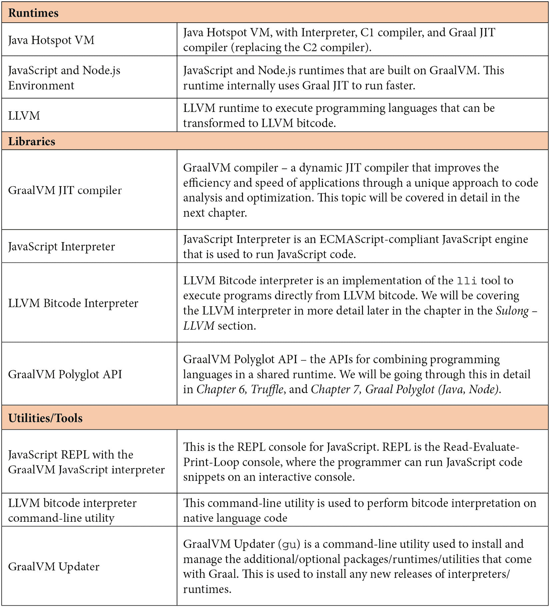

接下来，让我们看一下以下表格中列出的额外工具和实用程序：

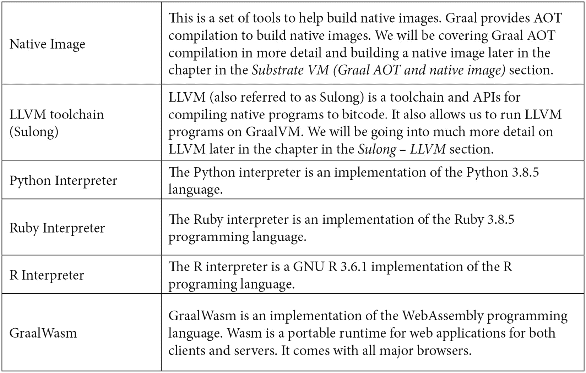

既然我们已经了解了 GraalVM 的组件，我们将探讨 GraalVM 可用的各种版本，以及这些版本之间的差异。

# 检查 GraalVM 版本（社区和企业）

GraalVM 可作为社区版和企业版提供：

+   **社区版**：GraalVM **社区版**（**CE**）是一个开源版本，作为 OpenJDK 发行版构建。GraalVM 的大多数组件是 GPL 2，带有类路径例外许可。有关许可的更多详细信息，请参阅[`github.com/oracle/graal#license`](https://github.com/oracle/graal#license)。GraalVM CE 基于 OpenJDK 1.8.272 和 OpenJDK 11.0.9。GraalVM CE 由社区支持。它可以部署在生产环境中。然而，它不包含 Oracle 提供的要求支持服务。Oracle 还提供可下载的 Docker 镜像，用于测试和评估（有关更多详细信息，请参阅[`www.graalvm.org/docs/getting-started/container-images/`](https://www.graalvm.org/docs/getting-started/container-images/)）。

+   **企业版**：GraalVM **企业版**（**EE**）是在 GraalVM OTN 许可协议下的授权版本。此版本可用于评估和构建非生产应用程序。GraalVM EE 提供了额外的性能（比 CE 快约 20%），更小的占用空间（比 CE 小约 2 倍），安全性（原生代码内存保护），以及运行生产级企业应用程序的可伸缩性。EE 版包含额外的调试工具，如 Ideal Graph Visualizer，它不仅有助于调试性能问题，还有助于在 GraalVM 上优化应用程序以获得最佳性能。GraalVM EE 还提供支持服务。对于 Oracle 云客户，GraalVM EE 支持作为订阅的一部分提供。GraalVM EE 还有一个托管模式，它更好地管理堆，避免页面错误和崩溃。GraalVM EE 适用于已订阅 Java SE 的客户。

现在我们已经了解了 GraalVM 的各种可用版本以及它所包含的运行时、工具和框架，让我们深入了解 GraalVM 的架构。

# 理解 GraalVM 架构

在本节中，我们将探讨 GraalVM 的各种架构组件。我们将了解各种运行时、工具和框架是如何结合在一起以提供最先进的虚拟机和运行时的。以下图表显示了 GraalVM 的高级架构：

![图 3.1 – Graal VM 架构]

![img/B16878_Figure_3.1.jpg]

图 3.1 – Graal VM 架构

让我们详细地逐一介绍这些组件。

## JVM（HotSpot）

JVM HotSpot 是常规的 Java HotSpot VM。HotSpot VM 中的 C2 编译器被 Graal JIT 编译器实现所取代。Graal JIT 编译器是 Java 虚拟机编译器接口（**JVMCI**）的一个实现，并插入到 Java VM 中。我们在前面的章节中介绍了 JVM HotSpot 的架构。请参考它们以深入了解 JVM HotSpot 的工作原理以及 JVM 的各种架构组件。

## Java 虚拟机编译器接口（JVMCI）

JVMCI 在 Java 9 中引入。这允许编写作为插件使用的编译器，JVM 可以调用以进行动态编译。它提供了一个 API 和协议，用于构建具有自定义实现和优化的编译器。

在这个上下文中，“编译器”一词指的是即时编译器。我们在前几章中详细介绍了 JIT 编译器。GraalVM 使用 JVMCI 来访问 JVM 对象，与 JVM 交互，并将机器代码安装到代码缓存中。

Graal JIT 实现有两种模式：

+   `libgraal`：`libgraal` 是一个 AOT 编译的二进制文件，由 HotSpot VM 作为本地二进制文件加载。这是默认模式，也是推荐使用 HotSpot VM 运行 GraalVM 的方式。在此模式下，`libgraal` 使用自己的内存空间，不使用 HotSpot 堆。这种模式的 Graal JIT 具有快速的启动时间和改进的性能。

+   `jargraal`：在这种模式下，Graal JIT 被像任何其他 Java 类一样加载，因此它将经历一个预热阶段，并使用解释器运行，直到识别出热方法并进行优化。可以通过从命令行传递 `--XX:-UseJVMCINativeLibrary` 标志来调用此模式。

在 OpenJDK 9+、10+ 和 11+ 中，我们使用 `-XX:+UnlockExperimentalVMOptions`、`-XX:+UseJVMCICompiler` 和 `XX:+EnableJVMCI` 标志来运行 Graal 编译器，而不是 C2 编译器。默认情况下，GraalVM 使用 Graal JIT 编译器。始终建议使用 GraalVM 发行版，因为这些版本包含最新的更改。OpenJDK 以较慢的速度合并更改。

在下一章中，我们将通过示例代码详细说明 Graal JIT 如何比 C2 JIT 更好，我们将使用 Graal 伴随的调试工具和实用程序来演示 Graal JIT 在运行时执行的优化。

## Graal 编译器和工具

Graal 编译器基于 JVMCI 构建，提供了一个更好的 JIT 编译器（C2，我们在前几章中讨论过）实现，并进行了进一步优化。Graal 编译器还提供了一个 AOT（Graal AOT）编译选项，可以构建可以独立运行并嵌入虚拟机的原生镜像。

### Graal JIT 编译器

我们在*第一章*，“Java 虚拟机的发展”中探讨了 JVM 架构。为了参考，以下是 JVM 的高级架构概述：

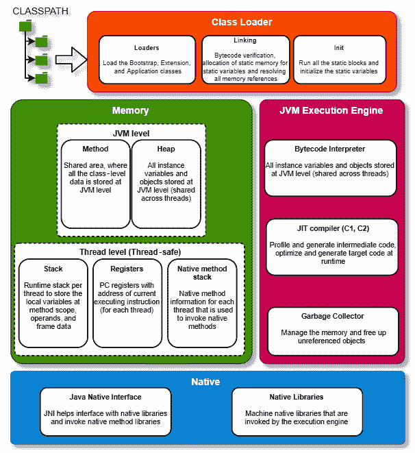

图 3.2 – 带有 C2 编译器的 JVM 架构

如您所见，C1 和 C2 编译器将 JIT 编译作为 JVM 执行引擎的一部分实现。我们详细介绍了 C1 和 C2 如何根据编译阈值优化/去优化代码。

GraalVM 替换了 JVM 中的 JIT 编译器，并进一步优化。以下图表显示了 GraalVM 的高级架构：

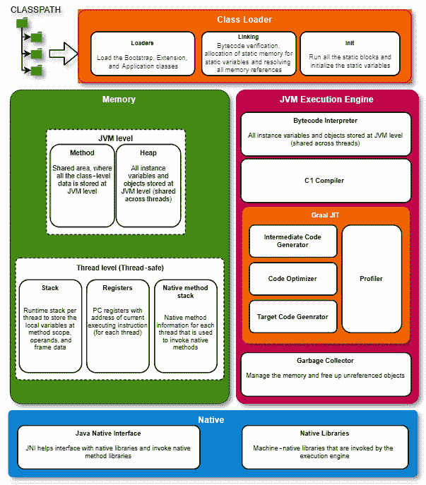

图 3.3 – 带有 Graal 编译器的 VM 架构

JVM JIT 编译器和 Graal JIT 之间的一个区别是，Graal JIT 是构建来优化中间代码表示（**抽象语法树**（**AST**）和 Graal 图，或 Graal 中间表示）。Java 在编译时将代码表示为 AST 和中间表示。

任何语言的表达式和指令都可以被转换并表示为抽象语法树（AST）；这有助于从优化代码的逻辑中抽象出特定语言的语法和语义。这种方法使得 GraalVM 能够优化和运行任何语言的代码，只要代码可以被转换为 AST。我们将在*第四章*“Graal Just-In-Time 编译器”中深入探讨 Graal 图和 AST。

Graal JIT 编译器的四个关键组件如下：

+   **分析器**：正如其名所示，它分析运行中的代码，并生成代码优化器用于做出决策或对优化做出假设的信息。

+   **中间代码生成器**：这个生成中间代码表示，它是代码优化器的输入。

+   **代码优化器**：这个使用由配置文件收集的数据来优化中间代码。

+   **目标代码生成器**：然后，优化后的代码被转换为目标机器代码。

以下图表展示了 Graal JIT 在非常高级的层面上是如何工作的：

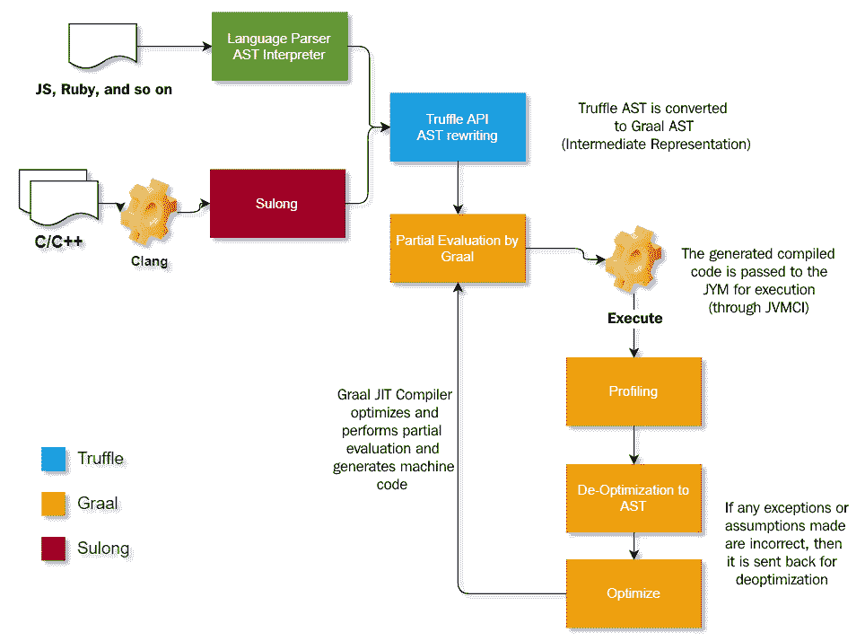

图 3.4 – Graal JIT 编译 – 高级流程图

让我们更好地理解这个流程图：

+   JVM 语言（Java、Kotlin、Groovy 等）的代码在 Graal JIT 上以原生方式运行，并且 Graal JIT 优化代码。

+   非 JVM 语言（如 JavaScript 和 Ruby）使用 Truffle API 实现语言解析器和解释器。语言解释器将代码转换为 AST 表示形式。Graal 在中间表示形式上运行 JIT 编译。这有助于利用 Graal 实现的所有高级优化技术来优化非 JVM 语言。

+   原生基于 LLVM 的语言（如 C/C++、Swift 和 Objective C）遵循一条略微不同的路径来转换为中间表示。Graal Sulong 用于创建 Graal 所使用的中间表示。我们将在本章后面讨论 Truffle 和 Sulong。

#### Graal JIT 优化策略

Graal JIT 优化策略是从头开始构建的，基于 C2 JIT 编译器优化策略的最佳实践。Graal JIT 在 C2 优化策略之上构建，并提供了更高级的优化策略。以下是 Graal JIT 编译器执行的一些优化策略：

+   部分逃逸分析

+   改进的内联（[`aleksandar-prokopec.com/resources/docs/prio-inliner-final.pdf`](http://aleksandar-prokopec.com/resources/docs/prio-inliner-final.pdf)）

+   守护优化 ([`lafo.ssw.uni-linz.ac.at/papers/2013_VMIL_GraalIR.pdf`](http://lafo.ssw.uni-linz.ac.at/papers/2013_VMIL_GraalIR.pdf))

+   连接式 lambda

+   交叉过程优化

我们将在下一章中，通过示例代码和示例，详细介绍这些优化策略。

## Truffle

Truffle 框架是一个用于构建解释器和工具/实用程序（如集成开发环境、调试器和性能分析器）的开源库。Truffle API 用于构建可以在 GraalVM 上运行的、利用 GraalVM 提供的优化功能的语言解释器。

Graal 和 Truffle 框架由以下 API 组成，这些 API 使多语言（Polyglot）成为可能：

+   **语言实现框架**：此框架由语言实现者使用。它还附带了一个名为 **SimpleLanguage** 的语言参考实现。我们将在 *第九章*，*Graal Polyglot – LLVM, Ruby, and WASM* 中详细介绍。

+   **Polyglot API**：这组 API 帮助不同语言（客语言）编写的代码与 Java（宿主语言）之间进行交互。例如，一个 Java（宿主）程序可以嵌入 R（客）语言代码以执行一些机器学习/AI 逻辑。Polyglot API 提供了框架，将帮助语言程序员管理客语言和宿主语言之间的对象。

+   **仪器化**：Truffle 仪器化 API 为工具/工具构建者提供了构建集成开发/调试环境、工具和实用程序的框架。使用 Truffle 仪器化 API 构建的工具和实用程序可以与任何使用 Truffle 实现的语言一起工作。这为各种语言提供了一致的开发者体验，并利用了 JVM 的复杂调试/诊断功能。

*图 3.5* 展示了 Truffle 作为 GraalVM 和其他语言解释器之间中间层的高级架构。各个语言解释器使用 Truffle API 实现。Truffle 还提供了一个互操作性 API，用于在跨各种语言实现的方法之间调用方法和传递数据：


图 3.5 – Truffle 架构

如前图所示，Java 应用程序直接在 GraalVM 上运行，由 Graal 编译器取代 C2 JIT 编译器。其他语言程序在 Truffle 语言实现框架之上运行。相应的语言解释器使用 Truffle 实现解释器。Truffle 将代码与解释器结合，使用部分评估生成机器代码。

AST 是中间表示形式。AST 提供了表示语言语法结构的最佳方式，其中通常，父节点是操作符，子节点表示操作数或操作符（基于基数）。以下图表展示了 AST 的粗略表示：

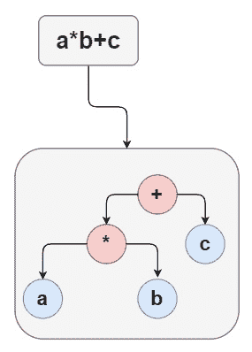

图 3.6 – 简单表达式的 AST

在此图表中，**a**、**b**和**c**可以是任何变量（对于弱类型语言）。解释器开始基于各种执行的配置文件假设“泛型”。然后它开始假设具体细节，并使用部分评估来优化代码。

Truffle（使用 Truffle 编写的语言解释器）作为解释器运行，而 Graal JIT 开始识别代码中的优化。

优化基于推测，最终，如果在运行时证明推测是错误的，JIT 将重新优化和重新编译（如前图所示）。重新优化和重新编译是一项昂贵的任务。

部分评估从代码和数据中创建语言的中间表示形式，随着它学习并识别新的数据类型，它将去优化到 AST 解释器，应用优化，并进行节点重写和重新编译。在某个点上，它将具有最优表示。以下图表解释了 Truffle 和 Graal 如何优化中间表示形式：

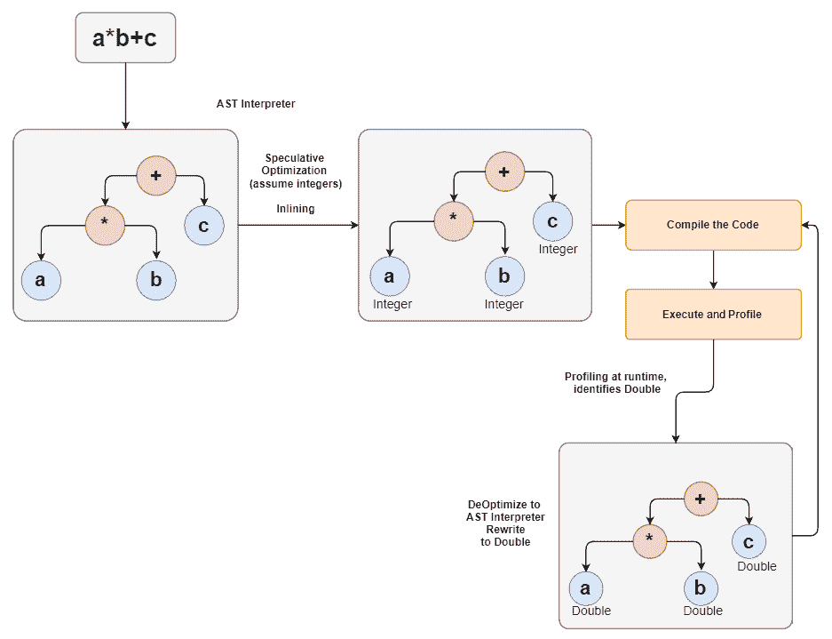

图 3.7 – Graal JIT 的 AST 优化

让我们更好地理解这个图表：

+   表达式被简化为 AST。在 AST 节点中，叶节点是操作数。在此示例中，我们选取了一个非常简单的表达式来理解部分评估是如何工作的。在 JavaScript 等非强类型语言中，a、b 和 c 可以是任何数据类型（有时被称为泛型）。在表达式中评估泛型是一个昂贵的操作。

+   根据配置文件，Graal JIT 推测并假设一个特定的数据类型（在此示例中，为整数），优化代码以评估整数表达式，并编译代码。

+   在此示例中，它使用内联优化策略。Graal JIT 编译器根据用例应用了各种其他优化策略。

+   当在运行时，编译器识别到一个控制流，其中一个操作数实际上不是整数时，它将去优化，并使用新的数据类型重新编写 AST，并优化代码。

+   经过几次运行此优化/去优化迭代后，编译器最终将生成最优化代码。

这里的关键区别是 Graal 正在处理 AST 并生成优化代码，只要代码表示为 AST，它就不关心源代码是用什么语言编写的。

下面的图示展示了不同语言在 GraalVM 上运行的高级流程，其中 Truffle 作为中间层，以在 GraalVM 上执行任何编程语言代码：

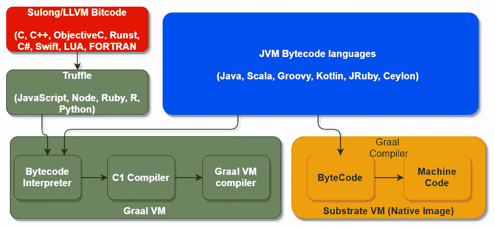

图 3.8 – Truffle 和 Graal 编译流程图

此图展示了 Truffle 作为非 JVM 语言和 GraalVM 之间层的简化表示。代码也可以直接与 Substrate VM 构建为原生镜像。

Truffle API 与自定义注解处理器一起使用，以生成解释器源代码，然后进行编译。Java 代码不需要中间表示形式。它可以直接编译在 GraalVM 上运行。我们将在*第九章*，“Graal 多语言 – LLVM、Ruby 和 WASM”中讨论 Truffle 解释器和如何编写自定义解释器。我们将在*第六章*，“Truffle – 概述”中介绍 Truffle 多语言 API。

Truffle 还提供了一个名为**Truffle Instrument API**的框架，用于构建工具。仪器提供细粒度的虚拟机级运行时事件，可用于构建分析、跟踪、分析和调试工具。最好的部分是，使用 Truffle 构建的语言解释器可以使用 Truffle 仪器的生态系统（例如，VisualVM、Chrome 调试器和 GraalVM Visual Studio Code 扩展）。

Truffle 提供了**多语言互操作性协议**。此协议定义了每种语言需要实现的协议，并支持在多语言应用程序之间传递数据。

## Sulong – LLVM

LLVM 是一个开源项目，它是一组模块化、可重用的编译器和工具链。有很多语言（C、C++、Fortran、Rust、Swift 等）编译器是基于 LLVM 构建的，其中 LLVM 提供中间表示形式（也称为 LLVM-IR）。

Sulong 管道与其他在 Truffle 上运行的编程语言编译器所看到的有所不同。以下图示展示了 C/C++代码的编译过程：

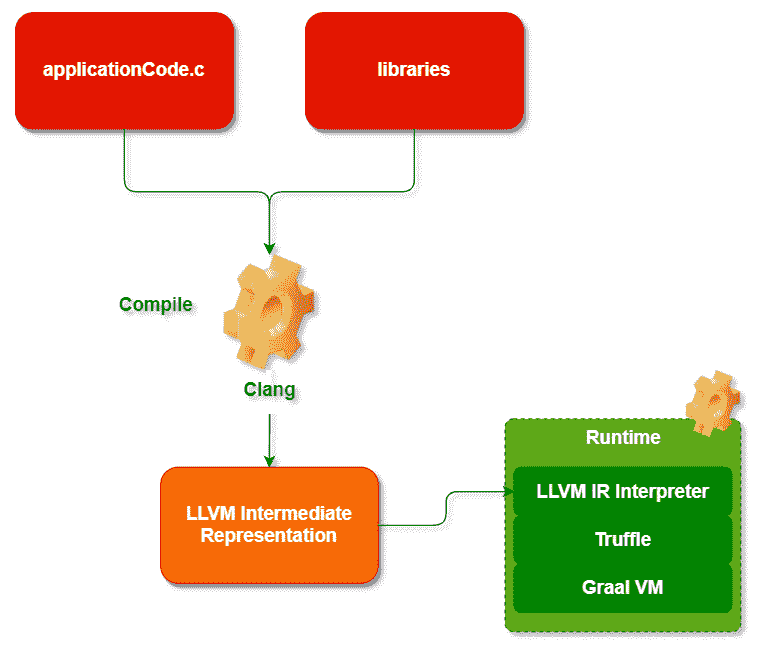

图 3.9 – LLVM 编译流程图

此图展示了用 C 编写的应用程序代码如何在 GraalVM 上编译和运行。在 C/C++等本地语言中编写的应用程序代码在 Clang 中编译成中间表示形式。此 LLVM 中间表示形式在基于 Truffle API 构建的 LLVM 中间表示形式解释器上运行。Graal JIT 将在运行时进一步优化代码。

## SubstrateVM（Graal AOT 和原生镜像）

Graal 上的应用可以在 GraalVM 或 SubstrateVM 上部署。SubstrateVM 是一种可嵌入的虚拟机代码，在 AOT 编译过程中被打包成原生镜像。

Graal AOT 编译是创建特定目标操作系统/架构的原生二进制文件的一种非常强大的方式。对于云原生工作负载和无服务器架构，这是一个非常强大的选项，可以实现更小的体积、更快的启动速度，更重要的是，可嵌入的运行时（提供不可变性）。

快速组件化模块化部署（容器）也带来了管理和版本控制挑战。这通常被称为**配置漂移**，这是我们面对高可用性环境中大量容器时遇到的主要问题之一。通常，容器基础设施由一个团队构建，随着时间的推移，它由不同的团队管理。总有这样的情况，我们被迫在某个环境中更改 VM/容器/OS 的配置，而我们可能永远无法追踪。这导致了生产环境和 DR/HA 环境之间的差距。

不可变基础设施（镜像）帮助我们更好地进行基础设施版本控制。它还增加了我们在测试中的信心，因为我们应用程序容器运行的基础设施是不可变的，我们对测试结果有信心。要构建不可变组件，我们需要一个具有小体积的嵌入式虚拟机（VM）。SubstrateVM 提供了这个嵌入式 VM。

在 AOT 编译中，代码直接编译成机器代码并执行。没有运行时分析或优化/去优化。Graal AOT 编译器（也称为“原生镜像”编译器）对代码执行静态分析和静态初始化，并生成嵌入 VM 的可执行代码。AOT 执行的优化基于代码的可达性。以下图显示了编译过程：

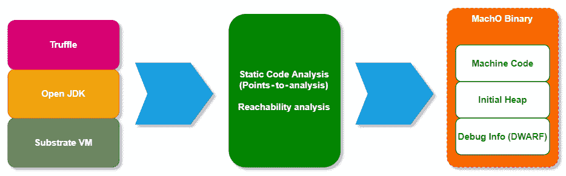

图 3.10 – Graal AOT 编译

此图展示了 Graal AOT 如何编译原生镜像并将 SubstrateVM 作为原生镜像的一部分嵌入。AOT 编译的一个缺点是 VM 不能像 JIT 那样根据运行时分析优化代码。为了解决这个问题，我们使用基于配置引导的优化策略来捕获应用程序的运行时指标，并使用这些配置数据通过重新编译来优化原生镜像。

### 配置引导优化（PGO）

GraalVM 使用**配置引导优化**（**PGO**）根据运行时分析数据优化原生镜像。这是仅在企业版中可用的功能之一。以下图显示了 PGO 管道的工作方式：

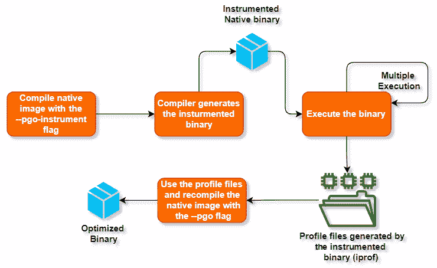

图 3.11 – 使用 PGO 的 Graal AOT 编译

让我们更好地理解这个工作流程：

+   当使用`native-image`编译代码时，我们使用`--pgo-instrumented`标志。这将告诉编译器向编译后的代码中注入检测代码。

+   当我们开始运行这个经过仪表化的原生镜像时，分析器开始收集运行时数据，然后开始创建配置文件（`.ipof`）。

+   一旦我们用各种工作负载（所有可能的工作负载 – 以捕获尽可能多的仪表数据）运行了原生镜像，我们就可以使用 `--pgo` 标志（`native-image --pgo=profile.iprof`）重新编译原生镜像，提供配置文件作为输入。Graal 原生镜像编译器创建最佳原生镜像。

我们将在下一章通过真实示例构建带有配置文件引导优化的原生镜像，并了解原生镜像中的内存管理是如何工作的。

GraalVM 是现代微服务架构的优秀运行时。在下一节中，我们将介绍 GraalVM 的各种功能，这些功能有助于构建微服务应用程序。

# GraalVM 微服务架构概述

GraalVM 是微服务架构的理想选择。对于某些微服务架构来说，最重要的要求之一是更小的占用空间和更快的启动速度。GraalVM 是在云中运行多语言工作负载的理想运行时。市场上已经有一些原生框架，可以构建在 GraalVM 上运行最佳的应用程序，例如 Quarkus、Micronut、Helidon 和 Spring。这些框架在作为原生镜像运行时被发现几乎快了 50 倍。我们将在 *第十章* “使用 GraalVM 的微服务架构”中详细介绍 GraalVM 是微服务的正确运行时和平台。

# 理解 GraalVM 如何解决各种非功能性方面

在本节中，我们将介绍微服务云原生架构的典型非功能性要求，以及 GraalVM 如何解决这些要求。

## 性能和可伸缩性

性能和可伸缩性是微服务云原生架构中更重要的非功能性要求之一。微服务由 Kubernetes 等编排器自动扩展和缩减。这要求微服务建立在启动速度快且运行快速的运行时上，消耗最少的云资源。GraalVM AOT 编译有助于构建与 C/C++ 等原生语言相当性能的原生镜像。

要了解 AOT 编译的代码（原生镜像）为什么比 JIT 编译的代码更快，让我们看看 JIT 和 AOT 在运行时遵循的步骤：

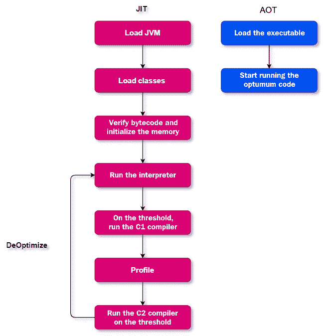


图 3.12 – Graal JIT 与 AOT 流程图

此图展示了 JIT 和 AOT 的高级步骤。JIT 通过在运行时分析代码来优化代码一段时间。由于 JVM 在运行时执行了额外的分析、优化和去优化操作，因此存在性能开销。

根据 Apache Bench 基准测试，观察到虽然 GraalVM JIT 的吞吐量和性能在开始时低于 AOT，但随着请求数量的增加，大约在每秒 14,000 个请求后，Graal JIT 进行了优化，并比 Graal AOT 表现更好。

观察到 Graal AOT 的性能比 Graal JIT 快 50 倍，并且内存占用比 Graal JIT 小 5 倍。

Graal AOT 与 PGO 的吞吐量一致，有时甚至优于 Graal JIT。然而，对于长时间运行的任务，Graal JIT 可能具有更好的吞吐量。因此，为了获得最佳吞吐量和一致的性能，使用带有 PGO 的 Graal AOT 是最佳选择。

请参阅在[`www.infoq.com/presentations/graalvm-performance/`](https://www.infoq.com/presentations/graalvm-performance/)和[`www.graalvm.org/why-graalvm/`](https://www.graalvm.org/why-graalvm/)发布的基准研究。

与学术合作伙伴一起发布了更多的基准研究，请参阅[`renaissance.dev`](https://renaissance.dev)。

我们可以得出以下结论：

+   GraalVM 本地图像（AOT）对于快速启动和需要更小内存占用的应用最佳，例如无服务器应用和容器微服务。

+   GraalVM JIT 在峰值吞吐量方面表现最佳。吞吐量对于长时间运行的过程来说非常重要，在这些过程中，可扩展性是关键。这可能是高流量的 Web 应用服务器，例如电子商务服务器和股市应用。

+   通过结合垃圾收集配置和 JIT，可以帮助降低延迟。延迟对于应用的响应性非常重要。当我们运行高吞吐量时，有时垃圾收集会减慢响应速度。

使用它并没有一条固定的规则。这取决于我们需要在 JIT 和 AOT 之间做出的各种组合决策，以及可能的各种其他配置。我们将在下一章探讨各种编译器和本地图像配置。

## 安全性

GraalVM 的安全性建立在 JVM 安全性的基础上，后者基于沙盒模型。让我们快速回顾一下沙盒模型是如何工作的：

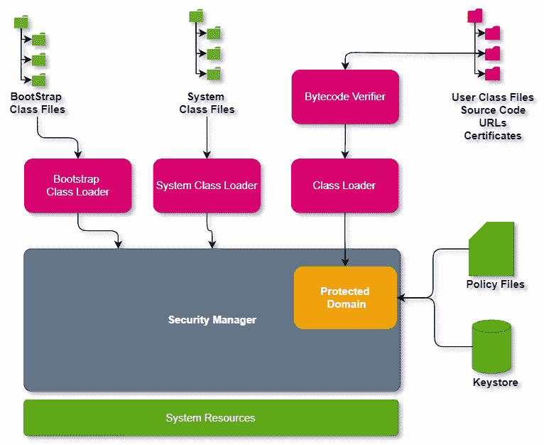


图 3.13 – JVM 安全模型

在 Java 2 安全架构中，所有类文件都由字节码验证器验证（请参阅前几章以获取有关类加载器的更多详细信息）。字节码验证器检查类文件是否有效，并寻找任何溢出、下溢、数据类型转换、方法调用、对类的引用等问题。

一旦字节码被验证，依赖的类将由类加载器加载。请参阅*第一章*，*Java 虚拟机的发展*，以了解类加载器子系统的工作原理。类加载器与安全管理者及访问控制一起工作，强制执行在策略文件中定义的安全规则。通过网络下载的 Java 代码将检查签名（表示为`java.security.CodeSource`，包括公钥）。

安全管理者（`java.lang.SecurityManager`）是处理授权最重要的组件。安全管理者有各种检查以确保授权完成。访问控制器（`java.security.AccessController`）类是另一个关键类，它有助于控制对系统资源的访问。

密钥库是一个密码保护的存储库，其中包含所有私钥和证书。存储库中的每个条目也可以是密码保护的。

Java 安全是可扩展的，有自定义安全实现称为**安全提供者**。

GraalVM 建立在 Java 安全模型之上，并将其抽象化以在中间表示级别强制执行安全。GraalVM 不建议在安全管理者上运行不受信任的代码。

GraalVM 安全模型使用 Truffle 语言实现框架 API 为 JVM 主机应用程序创建执行上下文，并将其传递给访客应用程序（用不同语言编写的应用程序代码）。以下图显示了 GraalVM 如何允许访客和主机应用程序交互操作以及如何控制访问的高级架构：

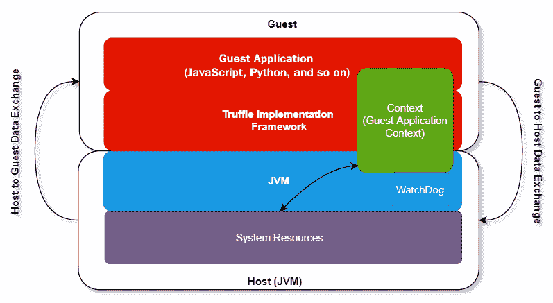

图 3.14 – Graal 安全模型

执行上下文（`org.graalvm.polyglot.Context`）定义了访客应用程序的访问控制。基于在执行上下文中定义的访问控制，访客应用程序可以访问系统的资源。GraalVM 提供了一个 Polyglot API 来创建这些访问控制，通过执行上下文来设置访问各种函数的权限，例如文件 I/O、线程和原生访问。根据主机设置的权限，访客将拥有相应的访问权限。使用看门狗线程来限制上下文的时间。看门狗将在指定的时间内关闭上下文，以释放资源，并基于时间限制访问。

以下代码演示了如何设置执行上下文：

```java
Context context = Context.newBuilder().allowIO(true).build();
Context context = Context.newBuilder()                  .fileSystem(FileSystem fs).build();
Context context = Context.newBuilder()                  .allowCreateThread(true).build()
Context context = Context.newBuilder()                  .allowNativeAccess(true).build()
```

GraalVM 还提供了一个 API，用于在主机和访客应用程序之间交换对象：

+   `@HostAccess.Export` 注解，例如）。

+   **主机到访客数据交换**：从主机传递给访客的对象需要由访客语言处理。数据通过上下文传递，例如：

    ```java
    Value a = Context.create().eval("js", "21 + 21");
    ```

主机应用程序可以将值`a`返回给 JavaScript 访客应用程序，其值为`42`（在评估后）。

我们将在*第六章*“Truffle – 概述”中详细讲解，通过一个真实示例来帮助理解。

GraalVM EE 还为 LLVM 中间表示代码提供了一种管理执行模式，以处理任何内存违规和故障。请参阅[`docs.oracle.com/en/graalvm/enterprise/19/guide/security/security-guide.html`](https://docs.oracle.com/en/graalvm/enterprise/19/guide/security/security-guide.html)获取更多详细信息。

## DevOps – 持续集成和交付

DevOps 自动化是任何现代云原生架构的核心要求之一。GraalVM 与 DevOps 管道集成得非常好。以下图表展示了典型的 GitOps 管道及其代表性软件（GraalVM 集成到 DevOps 软件栈的任何堆栈中）：

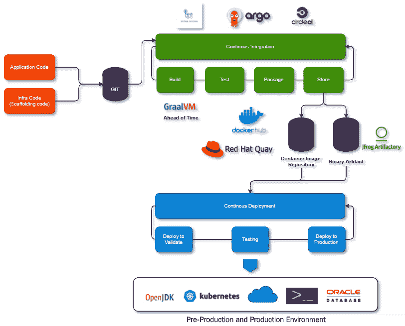

图 3.15 – 使用 GraalVM 的 GitOps

让我们更好地理解这个图表。

**持续集成**（**CI**）管道由 Git 仓库中应用程序代码和基础设施代码更改的典型拉取请求触发。可以使用 GitHub actions、Argo CD 或 CicleCI 等 CI 工具来编排 CI 管道。典型的 CI 管道包括以下步骤：

+   **构建**：在构建阶段，从 Git 仓库的适当分支拉取标记为发布的代码。代码经过验证（任何静态代码分析）并构建。对于云原生，通常使用 Graal AOT 编译器将代码构建为原生镜像。

+   **测试**：使用单元测试脚本来测试代码，并进一步验证是否存在任何安全漏洞。

+   **打包**：一旦代码通过所有测试，通常将代码打包到云原生目标运行时（使用 Docker 镜像、VM 或任何其他二进制格式）。目标可以是无服务器容器、Docker 容器或 VM。

+   **存储**：最终二进制存储在二进制存储或仓库中，如 Docker Hub 或 Red Hat Quay（如果是 Docker 镜像）。

持续部署管道可以基于发布计划触发，或者可以手动触发（取决于发布计划和策略）。持续部署通常具有以下阶段：

+   **部署验证**：将最终二进制 ID 部署到可以现在进行端到端测试的环境。可以遵循以下各种策略：

    a. **传统上**：我们有集成测试环境和用户验收测试环境（或预生产环境）用于不同级别的验证和测试。

    b. **蓝/绿部署**：存在两个并行环境（称为蓝和绿）。其中一个将在生产环境中运行，让我们假设是蓝环境。绿环境可以用来测试和验证我们的代码。一旦我们确认新版本运行良好，我们使用路由器切换到绿环境，并使用蓝环境来测试未来的版本。这提供了一种高可用性的应用部署方式。

    c. **金丝雀部署和滚动更新**：金丝雀部署是一种更近期的使用相同环境进行生产和验证的方法。这是一个测试我们的代码并与当前版本（A/B 测试）比较的出色功能。金丝雀部署提供了一个 API 管理层，可以根据各种参数（例如测试用户或来自特定部门的用户可以访问新版本，而最终用户仍在使用旧版本）将流量重定向到特定的端点。应用可以部署在特定数量的服务器/节点上（通过百分比或数量）。随着我们对新版本越来越有信心，我们可以通过增加运行新版本的节点数量来进行滚动更新，并向更广泛的用户群体开放。这也提供了按阶段推出新版本（按地区或用户人口统计或任何参数）的灵活性。

+   **测试**：执行了各种级别的测试，包括功能性和非功能性测试。大部分测试都是通过自动化完成的，而且这也是由持续交付管道编排的。

+   **生产部署**：一旦所有测试都完成，最终应用将被部署到生产环境。再次强调，这种部署可能使用传统的、蓝/绿或金丝雀策略之一。

GraalVM 提供了一种非常灵活的方式来部署应用，无论是作为独立应用、容器、云、虚拟机还是 Oracle 数据库。存在非常复杂的微服务框架，如 Quarkus、Micronaut 和 Fn 项目，它们为 GraalVM 提供原生支持，并与现代 GitOps 工具很好地集成。

# 摘要

在本章中，我们探讨了 GraalVM 架构。Graal JIT 是 JIT 编译器的新实现，它取代了 C2 编译器，并带来了更多的优化。Graal JIT 完全用 Java 实现。Truffle 提供了解释器实现框架和多语言框架，以便将其他非 JVM 语言引入 GraalVM。

本章提供了对 GraalVM 随附的各种运行时、框架、工具、Graal 更新器和实用工具的良好理解。我们还探讨了 GraalVM 的两个可用版本以及这两个版本之间的关键区别。我们详细介绍了 GraalVM 架构的所有各种组件。我们还探索了架构的一些非功能性方面，包括安全模型、性能和 DevOps。如果你想要了解如何使用 GraalVM 来构建跨各种语言的云原生微服务和高性能应用程序，这一点非常重要。

在下一章中，我们将深入探讨 Graal JIT 的工作原理，如何使用 Graal 提供的各种工具来理解 Graal JIT 的内部工作方式，以及如何使用这些工具来调试和微调我们的代码。

# 问题

1.  GraalVM 有哪些版本？

1.  什么是 JVMCI？

1.  什么是 Graal JIT？

1.  什么是 Graal AOT？PGO 如何帮助 AOT 编译？

1.  什么是 Truffle？它是如何帮助在 GraalVM 上运行多种语言代码的？

1.  什么是 SubstrateVM？

1.  什么是 Guest Access Context？

1.  为什么 GraalVM 是云原生微服务的理想运行时？

# 进一步阅读

+   轻量级云原生 Java 应用程序 ([`medium.com/graalvm/lightweight-cloud-native-java-applications-35d56bc45673`](https://medium.com/graalvm/lightweight-cloud-native-java-applications-35d56bc45673))

+   Java on Truffle — 实现完全元循环 ([`medium.com/graalvm/java-on-truffle-going-fully-metacircular-215531e3f840`](https://medium.com/graalvm/java-on-truffle-going-fully-metacircular-215531e3f840))

+   GraalVM ([`www.graalvm.org/`](https://www.graalvm.org/))

+   GraalVM 企业版 ([`docs.oracle.com/en/graalvm/enterprise/20/index.html`](https://docs.oracle.com/en/graalvm/enterprise/20/index.html))

+   GraalVM Git ([`github.com/oracle/graal`](https://github.com/oracle/graal))
