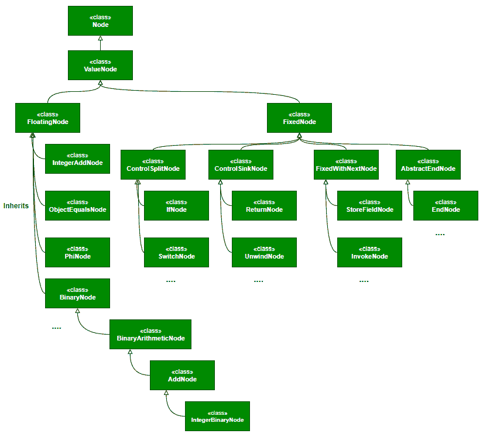
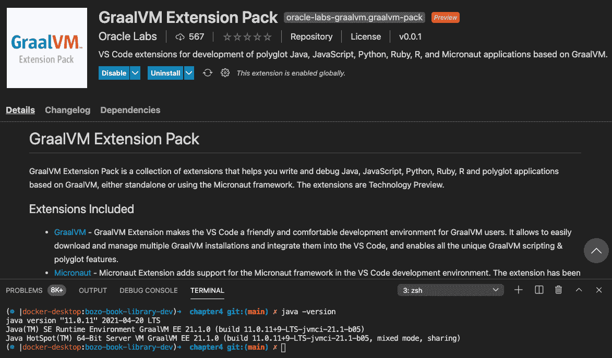

# *第四章*: Graal 即时编译器

在*第三章*“GraalVM 架构”中，我们探讨了 GraalVM 架构及其构成的各种组件。我们详细介绍了带有 Truffle 的 GraalVM 多语言架构，并简要提到了 Graal 的**即时**（**JIT**）编译器。我们探讨了 Graal JIT 如何通过实现 Java 虚拟机编译器接口插入 Java 虚拟机。在本章中，我们将通过运行示例代码并使用理想图可视化器工具可视化 Graal JIT 执行的 Graal 图和优化来探索 Graal JIT 编译器的工作原理。

在本章中，我们将涵盖以下主题：

+   设置环境

+   理解 Graal JIT 编译器

+   理解 Graal 编译器优化

+   调试和监控应用程序

到本章结束时，你将对 Graal JIT 编译器的工作原理有一个非常清晰的理解，了解各种优化技术，知道如何使用理想图可视化器诊断和调试性能问题，并且能够微调 Graal JIT 编译器配置以获得最佳性能。

# 技术要求

在本章中，我们将使用一些示例代码并使用工具进行分析。以下是一些遵循本章所需的工具/运行时：

+   OpenJDK ([`openjdk.java.net/`](https://openjdk.java.net/))

+   GraalVM ([`www.graalvm.org/`](https://www.graalvm.org/))

+   VisualVM ([`visualvm.github.io/index.html`](https://visualvm.github.io/index.html))

+   理想图可视化器

+   以下是一些示例代码片段，这些代码片段可在我们的 Git 仓库中找到。代码可以从[`github.com/PacktPublishing/Supercharge-Your-Applications-with-GraalVM/tree/main/Chapter04`](https://github.com/PacktPublishing/Supercharge-Your-Applications-with-GraalVM/tree/main/Chapter04)下载。

+   本章的“代码在行动”视频可在[`bit.ly/3fmPsaP.`](https://bit.ly/3fmPsaP.)找到。

# 设置环境

在本章中，我们将使用 VisualVM 和理想图可视化器来理解 Graal JIT 的工作原理。这种理解将有助于我们在后续章节中用 Graal 构建最佳代码。

## 设置 Graal

在*第三章*“GraalVM 架构”中，我们讨论了 Graal 的两个版本——社区版和企业版（**EE**）。社区版可以从*技术要求*部分提到的 Git 仓库中下载，而 EE 则需要你注册 Oracle 以下载。EE 可用于免费评估和非生产应用。

### 安装社区版

要安装 GraalVM 社区版，请访问 [`github.com/graalvm/graalvm-ce-builds/releases`](https://github.com/graalvm/graalvm-ce-builds/releases)，并下载针对目标操作系统（macOS、Linux 和 Windows）的最新版本。在撰写本书时，最新版本是 21.0.0.2，基于 Java 8 或 Java 11 版本。社区版基于 OpenJDK 构建。

请按照下一部分提供的针对目标操作系统的说明进行操作。最新说明可以在 https://www.graalvm.org/docs/getting-started/#install-graalvm 找到。

### 在 macOS 上安装 GraalVM

对于 macOS，下载 GraalVM 归档文件后，解压归档并将解压文件夹的内容复制到 `/Library/Java/JavaVirtualMachines/<graalvm>/Contents/Home`。

一旦我们复制了文件，我们必须导出路径以访问 GraalVM 二进制文件。让我们在终端上运行以下 `export` 命令：

```java
export PATH=/Library/Java/JavaVirtualMachines/<graalvm>/Contents/Home/bin:$PATH
export JAVA_HOME=/Library/Java/JavaVirtualMachines/<graalvm>/Contents/Home
```

对于 macOS Catalina 及更高版本，需要移除 `quarantine` 属性。可以使用以下命令完成：

```java
sudo xattr -r -d com.apple.quarantine <graalvm-path>
```

如果没有这样做，你会看到以下错误信息：

![图 4.1 – 在 MacOS 上运行 Graal 时出现的错误信息

![img/Figure_4.1_B16878.jpg]

图 4.1 – 在 MacOS 上运行 Graal 时出现的错误信息

SDKMAN 提供了一种自动安装 GraalVM 的方法。有关更多详细信息，请参阅 [`sdkman.io/`](https://sdkman.io/)。

### 在 Linux 上安装 GraalVM

要在 Linux 上安装 GraalVM，请解压下载的 zip 文件，将其复制到任何目标文件夹，并将 `PATH` 和 `JAVA_HOME` 路径设置为指向提取文件的文件夹。为此，请在命令行上执行以下命令：

```java
export PATH=<graalvm>/bin:$PATH
export JAVA_HOME=<graalvm>
```

### 在 Windows 上安装 GraalVM

要在 Windows 上安装 GraalVM，请解压 `.zip` 文件，将其复制到任何目标文件夹，并将 `PATH` 和 `JAVA_HOME` 路径设置为指向提取文件的文件夹。要设置 `PATH` 环境变量，请在终端上执行以下命令：

```java
setx /M PATH "C:\Progra~1\Java\<graalvm>\bin;%PATH%"
setx /M JAVA_HOME "C:\Progra~1\Java\<graalvm>"
```

要检查安装和设置是否完成，请在终端上运行 `java -version` 命令。

执行命令后，你应该会看到以下类似输出（我在使用 GraalVM EE 21.0.0 和 Java 11。你应该看到你安装的版本）：

```java
java version "11.0.10" 2021-01-19 LTS
Java(TM) SE Runtime Environment GraalVM EE 21.0.0 (build 11.0.10+8-LTS-jvmci-21.0-b06)
Java HotSpot(TM) 64-Bit Server VM GraalVM EE 21.0.0 (build 11.0.10+8-LTS-jvmci-21.0-b06, mixed mode, sharing)
```

现在我们来探索 GraalVM 安装的文件夹结构。在 GraalVM 安装文件夹中，你可以找到以下表格中解释的文件夹结构：


在上一章中，我们详细介绍了 Graal 伴随的各种运行时、工具和实用程序。Graal 更新器是用于安装可选运行时的非常重要的工具之一。要检查可用的运行时，请执行 `gu list`。以下截图显示了典型的输出：

![图 4.2 – Graal 更新器列表

![img/Figure_4.2_B16878.jpg]

图 4.2 – Graal 更新器列表

我们可以运行 `gu install <runtime>` 来安装其他运行时。

### 安装 EE

GraalVM EE 可免费用于试用和非生产用途。可以从 [`www.graalvm.org/downloads/`](https://www.graalvm.org/downloads/) 下载。

选择所需的 GraalVM Enterprise 版本。网站将重定向您到 Oracle 的注册页面。如果您已经注册，您应该能够登录，然后将被重定向到一个可以下载 GraalVM 和支持工具的页面。在撰写本书时，屏幕看起来大致如下截图：


图 4.3 – GraalVM EE 下载页面

您可以选择要下载的 EE 版本以及基础 JDK 版本。在撰写本书时，Java 8 和 Java 11 是两个可行的版本。当您滚动此页面时，您将找到以下下载链接：

+   **Oracle GraalVM Enterprise Edition 核心**：这是 GraalVM 的代码。

+   **Oracle GraalVM Enterprise Edition 本地图像工具**：这是一个本地图像工具。它也可以稍后使用 Graal 更新器下载。

+   **理想图可视化器**：这是一个非常强大的 Graal 图分析工具。您需要为此章节下载它。请参阅“安装理想图可视化器”部分的说明。

+   **GraalVM LLVM 工具链**：如果您想在 GraalVM 上编译和运行 C/C++ 应用程序，则需要此 LLVM 工具链。

+   **Oracle GraalVM Enterprise Edition Ruby 语言插件**：这是一个 Ruby 语言编译器和运行时。它也可以稍后使用 Graal 更新器下载。

+   **Oracle GraalVM Enterprise Edition Python 语言插件**：这是一个 Python 语言编译器和运行时。它也可以稍后使用 Graal 更新器下载。

+   **Oracle GraalVM Enterprise Edition WebAssembly 语言插件**：这是一个 WebAssembly 语言编译器和运行时。它也可以稍后使用 Graal 更新器下载。

+   **Oracle GraalVM Enterprise Edition 在 Truffle 上的 Java**：这是在 Truffle 解释器上的 JVM 实现。

### 在版本之间切换

我们可以在同一台机器上安装多个版本的 GraalVM，并且可以在这些不同的发行版之间切换。在本章中，我们将切换到不同的发行版以比较它们的性能。在发行版之间切换的最佳方式是使用 Visual Studio Code。Visual Studio Code 提供了一个 GraalVM 插件，帮助我们添加各种发行版，并且只需单击一下按钮，就可以在各个发行版之间切换。请参阅 [`www.graalvm.org/tools/vscode/`](https://www.graalvm.org/tools/vscode/) 和 [`marketplace.visualstudio.com/items?itemName=oracle-labs-graalvm.graalvm`](https://marketplace.visualstudio.com/items?itemName=oracle-labs-graalvm.graalvm ) 获取更多详细信息。请参阅本章后面的 *调试和监控应用程序* 部分，以获取有关如何安装 Visual Studio Code 并用于调试应用程序的更多详细信息。

我们还可以创建 shell 脚本来在各个发行版之间切换，通过设置 PATH 和 JAVA_HOME 环境变量指向适当的发行版。

### 安装 Graal VisualVM

Java VisualVM 是分析应用程序堆、线程和 CPU 利用率的最强大工具之一。VisualVM 广泛用于分析核心转储、堆转储和离线的应用程序。它是一个非常复杂的工具，可以识别瓶颈并优化 Java 代码。

自 JDK 9 以来，VisualVM 已迁移并升级为 Graal VisualVM。Graal VisualVM 扩展了功能，包括对 Graal 进程的分析，并目前支持 JavaScript、Python、Ruby 和 R。Graal VisualVM 还为原生图像进程提供了一些有限的监控和分析功能。Graal VisualVM 与 Graal Community Edition 和 EE 一起捆绑提供。Graal VisualVM 可在 `.bin/jvisualvm`（Windows 的 `.exe`）中找到。

让我们快速浏览一下 Graal VisualVM 的关键特性。Graal VisualVM 具有一个非常直观的界面。主窗口的左侧面板（见 *图 4.3*）显示了所有 **本地** 和 **远程** 进程。使用这个功能，我们可以轻松连接到这些进程以开始我们的分析：


图 4.4 – VisualVM，左侧面板

一旦我们连接到进程，在右侧面板中，我们将看到以下五个选项卡：

+   **概述**：在此选项卡中，我们可以看到进程配置、JVM 参数和系统属性。以下截图显示了我们所运行的 **FibonacciCalculator** 进程的典型屏幕：


图 4.5 – VisualVM – 应用概述

+   **监控**：在此选项卡上，我们可以看到 CPU 使用率、堆分配、加载的类数量、正在运行的线程数量等。我们还可以强制进行垃圾收集以查看进程的行为。我们可以执行堆转储以对堆分配进行更深入的分析。以下是窗口的截图：


图 4.6 – VisualVM – 应用程序监控

+   **线程**：此选项卡提供了有关正在运行进程的各种线程的详细信息。我们还可以捕获线程转储以进行进一步分析。此选项卡不仅显示了活动线程，我们还可以分析已完成的线程。以下是一个典型的**线程**选项卡截图：


图 4.7 – VisualVM – 应用程序线程

这里是一个典型的线程转储截图，可以用来确定是否存在任何死锁或线程等待：


图 4.8 – VisualVM – 线程转储

+   **采样器**：此选项卡可以用来对运行中的进程进行快照，并对 CPU、内存等进行分析。以下是点击**快照**按钮所获取的快照的内存使用截图：


图 4.9 – VisualVM – 使用快照的内存使用

+   **分析器**：这就像采样器，但它一直运行。除了 CPU 和内存之外，我们还可以查看 JDBC 调用和获取响应所需的时间。下一张截图显示了 CPU 分析：


图 4.10 – VisualVM – 应用程序分析器

除了这个之外，Graal VisualVM 还可以用来分析核心转储，以确定任何 Java 进程崩溃的根本原因。在撰写本书时，Graal VisualVM 支持 JavaScript 和 Ruby（仅限于堆、对象视图和线程视图），Python 和 R（仅限于堆和对象视图）。

**JDK 飞行记录器**（**JFR**）分析是 VisualVM 的另一个强大功能。它帮助我们分析通过 JFR 连接的数据，而不会对运行中的进程产生开销。JFR 提供了更高级的分析，包括捕获和分析文件 I/O、套接字 I/O 和线程锁，除了 CPU 和线程之外。

Graal VisualVM 还提供了扩展 API，因此我们可以编写自定义插件。可以使用各种插件来扩展 Graal VisualVM。以下是一些最广泛使用的插件：

+   **可视 GC 插件**：此插件提供了一个强大的界面来监控垃圾收集、类加载器和 JIT 编译器的性能。这是一个非常强大的插件，可以识别代码中的优化以改进性能。

+   **跟踪器**：跟踪器提供了一个更好的用户界面，用于详细监控和分析应用程序。

+   **启动分析器**：正如其名所示，它提供了用于分析启动过程并识别可以执行的优化以改进启动的仪器。

你可以在[`visualvm.github.io/pluginscenters.html`](https://visualvm.github.io/pluginscenters.html)找到可用的插件完整列表。

### 安装理想图可视化器

Ideal Graph Visualizer is a very powerful tool for analyzing how Graal JIT is performing various optimizations. This requires an advanced understanding of Graal Graphs, which is an intermediate representation. Later in this chapter, we will cover Graal Graph and how to use the Ideal Graph Visualizer so that we can see how Graal performs various optimizations. This is critical, as it helps us write better code and optimize the code at development time, and reduces the load on the compiler to perform it just in time.

The Ideal Graph Visualizer is available with GraalVM EE. It can be downloaded from the Oracle website. The Ideal Graph Visualizer can be launched with the following command, after setting the `PATH` to the location where it has been unzipped/installed:

```java
idealgraphvisualizer
```

The `--jdkhome` flag can be used to point to the right version of GraalVM. Once it has been launched, you will see the following screen:

![Figure 4.11 – 理想图可视化器 – 主窗口

![img/Figure_4.11_B16878.jpg]

图 4.11 – 理想图可视化器 – 主窗口

The Ideal Graph Visualizer requires Graal dumps to render and analyze Graal Graphs. Graal dumps can be created using the following command:

```java
java -Dgraal.Dump=:n <java class file>
```

在前面的命令中，`n`可以是`1`、`2`或`3`，每个数字代表一个详细程度级别。这将生成一个名为`graal_dumps`的文件夹，其中包含`bgv`文件（二进制图文件）。有时你会因为无效化和重新编译（去优化或栈上替换）而找到各种`bgv`文件（请参阅*第二章*，*JIT、HotSpot 和 GraalJIT*，并查找*栈上替换*部分以获取更多信息）。这些`bgv`文件可以在理想图可视化器中打开以进行分析。一旦`bgv`文件被加载，你将看到如下屏幕：

![Figure 4.12 – 理想图可视化器 – 主窗口–Graal 转储

![img/Figure_4.12_B16878.jpg]

图 4.12 – 理想图可视化器 – 主窗口–Graal 转储

The left pane can be used to navigate through the various phases of compilation and optimization, the main window shows the graph, and the right pane can be used to configure how to render these graphs. We can view the Graal Graphs, Call Graph, AST, and Truffle Call Tree.

The Ideal Graph Visualizer can also be connected from the Java runtime (using the `Dgraal.PrintGraph=Network` flag) to view the graphs in real time, while the application code is executing.

In the next section, we will explore how these Graal Graphs can be read to understand how the Graal compiler works.

# 理解 Graal JIT 编译器

在上一章中，我们简要介绍了 Graal 编译器和其生态系统。在本节中，我们将深入了解各种编译器选项，并了解 Graal 如何即时优化代码。在下一节中，我们将探讨即时编译，以及如何创建原生镜像。在我们深入了解 Graal 编译器的工作原理之前，让我们快速浏览一些可以传递给虚拟机的 Graal 编译器配置。

## Graal 编译器配置

Graal 编译器可以通过传递给 `java` 命令（在 GraalVM 版本的 `java` 中）的各种参数进行配置。在本节中，我们将介绍一些最有用的命令行配置。

我们将在一个示例应用程序上尝试这些不同的标志，以查看它如何影响 Graal 编译器。

让我们编写一个简单的 Java 类，称为 `FibonacciCalculator`。以下是类的源代码：

```java
class FibonacciCalculator{
    public int[] findFibonacci(int count) {
        int fib1 = 0;
        int fib2 = 1;
        int currentFib, index;
        int [] fibNumbersArray = new int[count];
        for(index=2; index < count; ++index ) {    
            currentFib = fib1 + fib2;    
            fib1 = fib2;    
            fib2 = currentFib;    
            fibNumbersArray[index - 1] = currentFib;
        }
        return fibNumbersArray;
    }
    public static void main(String args[])  
    {
        FibonacciCalculator fibCal =             new FibonacciCalculator();
        long startTime = System.currentTimeMillis();
        long now = 0;
        long last = startTime;
        for (int i = 1000000000; i < 1000000010; i++) {
            int[] fibs = fibCal.findFibonacci(i);
            long total = 0;
            for (int j=0; j<fibs.length; j++) {
                total += fibs[j];
            }
            now = System.currentTimeMillis();
            System.out.printf("%d (%d ms)%n", i , now – last);
            last = now;
        }
        long endTime = System.currentTimeMillis();
        System.out.printf ("total: (%d ms)%n",            System.currentTimeMillis() - startTime);
    }
}
```

如您所见，我们正在生成 `1000000000` 到 `1000000010` 个斐波那契数，然后稍后计算生成的所有斐波那契数的总和。代码被编写成循环以触发编译阈值。

JIT 有很多优化机会。让我们首先使用 Java HotSpot 运行此程序：


图 4.13 – FibonacciCalculator – Java HotSpot 输出

如您所见，初始迭代花费了最多时间，并且经过迭代优化到大约 1,300 毫秒。现在让我们使用从 Graal EE 分发中获得的 `javac` 编译代码，并使用 Graal JIT 运行相同的程序。以下截图显示了使用 GraalVM（Java 11 上的 GraalVM EE 21.0.0.2）运行相同应用程序的输出：


图 4.14 – FibonacciCalculator – GraalVM 输出

我们可以看到性能有显著提升。Graal 的起始速度与 Java HotSpot 相似，但在迭代过程中优化到 852 毫秒，而使用 HotSpot 运行则需要 1,300 毫秒。以下选项用于禁用 GraalJIT 并在 GraalVM 上使用 HotSpot：

```java
-XX:-UseJVMCICompiler
```

这通常用于比较 Graal 的性能。让我们使用 GraalVM EE 21.0.0.2 编译器运行此选项，并使用前面的源代码：

```java
java -XX:-UseJVMCICompiler FibonacciCalculator/
```

以下是在运行前面命令后的输出截图：


图 4.15 – FibonacciCalculator – GraalVM (21/Java 11) 输出

如您所见，尽管我们使用的是 Graal 编译器，但性能与 Java HotSpot 相似，实际上比 Java HotSpot 15 慢。请注意，我们的 Graal 是在 Java 11 上运行的。

`CompilerConfiguration` 标志用于指定要使用哪个 JIT 编译器。以下是我们可以传递给设置编译器配置的参数：

```java
-Dgraal.CompilerConfiguration
```

我们有三个选项；让我们也用我们的示例代码运行这些选项，看看它的性能如何：

+   `-Dgraal.CompilerConfiguration=enterprise`：这使用企业 JIT，并生成最优代码。然而，由于编译，会有初始的减速：


图 4.16 – Fibonacci 计算器 – 企业编译器配置

+   `-Dgraal.CompilerConfiguration=community`：这会产生社区版本的 JIT，它优化到相当的程度。因此，编译速度更快。


图 4.17 – Fibonacci 计算器 – 社区编译器配置

+   `-Dgraal.CompilerConfiguration=economy`：这编译得很快，优化较少：


图 4.18 – Fibonacci 计算器 – 经济型编译器配置

我们可以看到在使用企业、社区和经济配置时性能的显著差异。以下是三种选项性能的比较：


图 4.19 – Fibonacci 计算器 – 企业、社区和经济配置对比

除了这个之外，还有很多其他性能调整选项可以用来提高编译器的性能，例如这个：

```java
-Dgraal.UsePriorityInlining (true/false)
```

前面的标志可用于启用/禁用高级内联算法。禁用此选项可以提高编译时间并帮助提高吞吐量。

此标志可用于禁用自动向量化优化：

```java
-Dgraal.Vectorization (true/false)
```

此标志可用于禁用路径重复优化，例如基于支配的重复模拟。当禁用时，它会对吞吐量产生影响：

```java
-Dgraal.OptDuplication (true/false)
This next flag can be set to values between -1 and 1\. When the value is below 0, the JIT reduces the effort spent on inlining. This will improve the startup and provides throughput. When the value is greater than 0, the JIT spends more effort in inlining, increasing the performance:
-Dgraal.TuneInlinerExploration (-1 to +1)
```

这是一个非常有用的标志，可以启用以跟踪 JIT 编译器在内联优化上的决策：

```java
-Dgraal.TraceInlining (true/false)
```

当我们为示例代码启用此标志时，我们得到以下结果：

```java
compilation of FibonacciCalculator.main(String[]): 
  at FibonacciCalculator.main(FibonacciCalculator.java:20) [bci: 4]: <GraphBuilderPhase> FibonacciCalculator.<init>(): yes, inline method
  at FibonacciCalculator.main(FibonacciCalculator.java:25) [bci: 32]: <GraphBuilderPhase> FibonacciCalculator.findFibonacci(int): no, bytecode parser did not replace invoke
compilation of FibonacciCalculator.main(String[]): 
  at FibonacciCalculator.main(FibonacciCalculator.java:20) [bci: 4]: <GraphBuilderPhase> FibonacciCalculator.<init>(): yes, inline method
  at FibonacciCalculator.main(FibonacciCalculator.java:25) [bci: 32]: 
  ├──<GraphBuilderPhase> FibonacciCalculator.findFibonacci(int): no, bytecode parser did not replace invoke
  └──<PriorityInliningPhase> FibonacciCalculator.findFibonacci(int): yes, worth inlining according to the cost-benefit analysis.
compilation of java.lang.String.hashCode(): 
  at java.lang.String.hashCode(String.java:1504) [bci: 19]: 
  ├──<GraphBuilderPhase> java.lang.String.isLatin1(): no, bytecode parser did not replace invoke
  └──<PriorityInliningPhase> java.lang.String.isLatin1(): yes, budget was large enough to inline this callsite.
  at java.lang.String.hashCode(String.java:1504) [bci: 29]: 
  ├──<GraphBuilderPhase> java.lang.StringLatin1.hashCode(byte[]): no, bytecode parser did not replace invoke
  └──<PriorityInliningPhase> java.lang.StringLatin1.hashCode(byte[]): yes, budget was large enough to inline this callsite.
```

我们可以看到 JIT 编译器是如何在内联上做出决策的。

这些优化标志甚至可以设置在其他 GraalVM 启动器上，例如 `js`（用于 JavaScript）、`node` 和 `lli`。

## Graal JIT 编译器管道和分层优化

在上一章中，在 *Graal JIT 编译器* 部分，我们探讨了 Graal JIT 如何通过 JVMCI 与虚拟机集成。在本节中，让我们更深入地了解 Graal JIT 如何与虚拟机交互。

Graal 在三个级别上优化代码。分层方法有助于 Graal 从更平台无关的表示（高级中间表示）开始执行优化，到更平台相关的表示（低级中间表示）。以下图表显示了 Graal JIT 如何与虚拟机接口并执行这三个级别的优化：


图 4.20 – Graal JIT 编译器 – 编译层级

让我们尝试更好地理解这张图：

+   当虚拟机达到编译阈值时，它将字节码和元数据传递给 Graal JIT（参考 *第二章*，*JIT、HotSpot 和 GraalJIT*，了解更多关于编译阈值的信息）。

+   Graal 解析字节码并生成 **高级中间表示**（**HIR**）。

+   然后，它对 **HIR** 执行各种优化。这些是一些标准 Java 优化技术，以及 Graal 中引入的一些新技术，例如部分逃逸分析和高级内联技术。

+   一旦执行了这些高级优化，Graal 开始将高级操作转换为低级操作。这个阶段称为降低。在这个阶段，它执行两个层级的优化，并最终为目标处理器架构生成 **低级中间表示**（**LIR**）。

+   一旦对 LIR 执行所有优化，就会生成最终的优化机器代码，并将其存储在代码缓存中，同时还包括垃圾收集器将使用的引用映射和用于反优化的元数据。

在本节中，我们探讨了 Graal JIT 编译器内部的工作原理，并研究了各种会影响编译器性能的编译器配置。现在让我们更好地理解 Graal 中间表示。

## Graal 中间表示

`AddNode`、`IfNode` 和 `SwitchNode`，它们都继承自基类 `Node`。边（操作数）表示为类的字段。以下图显示了各种类型节点的层次结构：



图 4.21 – Graal 图节点 – 类层次结构

在 SSA 中表示代码可以创建每个值的单个变量版本。这有助于执行更好的数据流分析和优化。使用 phi 函数（Φ）将基于决策的控制路径（如 `if` 和 `switch`）转换为单一代码。Phi 函数是两个值的函数，值的选择基于控制流。有关 SSA 的更多详细信息，请参阅以下论文：https://gcc.gnu.org/onlinedocs/gccint/SSA.html 和 [`en.wikipedia.org/wiki/Static_single_assignment_form`](https://en.wikipedia.org/wiki/Static_single_assignment_form)。关键点是，整个程序被转换为 SSA 以执行优化。

Graal IRs 作为 Graal 图构建，其中每个节点都有指向创建操作数的节点的输入边，以及显示控制流的后续边。后续边指向在控制流方面继当前节点之后的节点。

为了演示我们迄今为止讨论的所有内容，让我们使用理想图可视化器分析一些简单的 Java 代码。这段代码中的逻辑可能不会生成一个简单的图——代码故意保持简单。循环是为了达到阈值，当 JVM 达到阈值时，它将执行 Graal JIT 编译，如下所示：

```java
public class DemonstrateGraalGraph {
    public long calculateResult() {
        long result = 0;
        for (int i=0; i<2000; i++) {
            result = result + i;
        }
        return result;
    }
    public static void main(String[] args) {
        DemonstrateGraalGraph obj =            new DemonstrateGraalGraph();
        while (true) { 
    //This loop is just to reach the compiler threshold
            long result = obj.calculateResult();
            System.out.println("Total: " + result);
        }
    }
}
```

现在我们使用 `javac DemonstrateGraalGraph.java` 命令来编译前面的代码。为了保持图简单，我们将只编译 `calculateResult()` 方法，使用 `-XX:CompileOnly=DemonstrateGraalGraph:calculateResult` 标志。我们还将使用以下标志禁用一些优化：

`-Dgraal.FullUnroll=false`, `-Dgraal.PartialUnroll=false`, `-Dgraal.LoopPeeling=false`, `-Dgraal.LoopUnswitch=false`, `-Dgraal.OptScheduleOutOfLoops=false`, 和 `-Dgraal.VectorizeLoops=false`

因此，我们得到以下内容：

```java
java -XX:CompileOnly=DemonstrateGraalGraph::calculateResult \
 -XX:-UseOnStackReplacement \
 -Dgraal.Dump=:1 \
 -XX:+PrintCompilation \    
  -Dgraal.FullUnroll=false \
  -Dgraal.PartialUnroll=false \
  -Dgraal.LoopPeeling=false \
  -Dgraal.LoopUnswitch=false \
  -Dgraal.OptScheduleOutOfLoops=false \
  -Dgraal.VectorizeLoops=false  \
DemonstrateGraalGraph
```

这将创建一个名为 `graal_dumps` 的文件夹，其中包含所有 Graal JIT 活动的转储。一旦你加载由 Graal 生成的 `bgv` 文件，你将在左侧面板中找到列出的各种优化层，如下面的截图所示：


图 4.22 – 理想图可视化器 – DemonstrateGraalGraph – 左侧面板

当你点击 `calculateResult()` 方法时，正如我们要求 JVM 只编译 `calculateResult()` 方法一样。让我们更好地理解这个图：


图 4.23 – 理想图可视化器 – DemonstrateGraalGraph – 解析后的 Graal 图

程序从 **0 Start** 开始，循环从 **7 LoopBegin** 节点开始。为了使图更容易理解，一些部分被标签 **A** 和 **B** 突出显示。让我们探索这些图的部分是什么。

**部分 A**

+   部分 A 突出了 `for` 循环。它被转换成了 `18 if` 语句。`if` 语句的输入是 I 的当前值，它是 Phi 节点 `9 Phi(4,22,i32)` 和常数 2000 节点 `11 C(2000) i32` 的输出。

+   Phi 节点连接在控制流合并的地方。在这种情况下，*9 Phi (4,22, i32)* 合并了 `4 C(0) i32`（`for` 循环中的 `i=0`）和 `22 +` 节点的输出（即 `i++`）。这个节点将简单地输出 `i` 在增加 **21 C(1) i32 节点** 值后的当前值。

+   然后，这个表达式流入 **12 <** 节点，并与 **11 C(2000) i32**（循环的最大值）进行比较，这个表达式由控制流节点 **18 if** 进行评估。

**部分 B**

+   部分 B 突出了计算结果的部分。

+   结果的初始值表示为 `i64`，因为我们将其声明为 `long`。

+   `result = result + i` 表达式。`i` 的值从 `I` 流出，`I` 从 **9 Phi(4,22, i32)** 流出。

+   当循环在 **18 if** 处结束时，最终输出流向 **24 Return**。

现在我们可以通过在左侧面板中选择优化阶段来遍历每个优化阶段，以查看代码是如何被优化的。让我们快速看一下这个图是如何通过各个阶段进行转换的。当我们选择左侧面板的 **大纲** 窗口中的 **Before Phase Lowering** 时，我们将看到以下图：


图 4.24 – 理想图可视化器 – 展示 Graal 图 – Graal 图在降低之前

在这个阶段，我们可以看到以下优化：

+   **19 Sign Extend** 节点被替换为 **27 Zero Extend**，因为编译器发现它是一个无符号整数。与有符号整数相比，无符号整数的操作成本更低。

+   **12 <** 节点被替换为 **26 |<|**，这是一个无符号小于操作，速度更快。编译器基于各种迭代和性能分析得出这个结论。由于操作数被认为是无符号的，因此操作也认为是无符号的。

+   该图还说明了应用规范化技术，用 < 替换 <=，以加快 `if`（最初是 `for` 循环）语句。

后续阶段 – 高级、中级和低级 – 可能不会显示显著的优化，因为代码相对简单，并且我们已经禁用了一些优化以保持图的可读性和易于理解：


图 4.25 – 理想图可视化器 – 展示 Graal 图 – Graal 图，其他层级

*图 4.26* 是所有优化都启用时的图示。您将看到循环展开被非常突出地使用来加速循环：


图 4.26 – 理想图可视化器 – 展示 Graal 图 – 最终优化的图

Graal 作为分层编译的一部分执行各种优化。我们将在下一节中详细介绍这一点，并了解我们如何利用这些知识来改进我们的代码编写方式。

# 理解 Graal 编译器优化

Graal 编译器在即时对代码执行一些最先进的优化。以下小节将讨论其中最关键的。

在进入本节之前，请参考*第二章*中“理解 JIT 执行的优化”部分，*JIT、HotSpot 和 GraalJIT*。

## 投机优化

JIT 编译依赖于代码的运行时分析。正如我们所见，图是基于热点进行优化的。热点，如我们在*第二章*中“JIT、HotSpot 和 GraalJIT”所讨论的，是程序最频繁经过的控制流。试图优化整个代码是没有意义的；相反，JIT 编译器试图优化热点控制路径/流。这是基于投机和假设。当执行过程中假设被证明是错误的时候，编译器会迅速去优化，并等待基于新的热点进行优化的另一个机会。我们在*第二章*中“JIT、HotSpot 和 GraalJIT”的“编译器阈值”部分讨论了编译器的阈值和热点。Graal JIT 也使用类似的技术来识别热点。Graal 执行我们在*第二章*中“JIT、Hotspot 和 GraalJIT”的“理解 JIT 执行的优化”部分所讨论的所有优化，但还使用了一些高级技术。让我们来看看 Graal JIT 应用于代码的一些最重要的优化技术。

## 部分逃逸分析

在*第二章*中“理解 JIT 执行的优化”部分，我们探讨了逃逸分析。逃逸分析是最强大的技术之一。它确定了对象的作用域以及对象从局部作用域逃逸到全局作用域。如果它识别出不会逃逸的对象，就有机会进行优化，编译器将优化代码以使用栈分配而不是堆分配来处理局部作用域内的对象。这可以在堆内存的分配和释放上节省大量时间。

部分逃逸分析进一步扩展了这一概念，不仅限于识别逃逸方法级别作用域的控制分支。当发现对象仅在特定控制流中逃逸时，这有助于优化代码。其他对象未逃逸的控制流可以被优化为使用局部值或标量替换。

部分逃逸分析寻找可能通过方法调用、返回值、抛出语句等方式发生的逃逸。让我们用一个简单的代码示例来理解它是如何工作的：

```java
public void method(boolean flag) {
    Class1 object1 = new Class1();
    Class2 object2 = new Class2();
    //some processing
    object1.parameter = value;
    //some more logic
    if(flag) {
        return object1;
    }
    return object2;
}
```

上述代码是一些示例代码，仅用于说明部分逃逸分析。在这段代码中，我们创建 `object1` 作为 `Class1` 的实例，`object2` 作为 `Class2` 的实例。正在进行一些处理，并使用计算出的某些值更新 `object1` 的字段。根据标志，`object1` 或 `object2` 将逃逸。假设大多数时间标志是 `false`，只有 `object1` 逃逸，因此每次方法调用时创建 `object1` 没有意义。这段代码被优化为以下类似的内容（这只是一个说明部分逃逸分析如何工作的示例；Graal JIT 可能不会进行这种精确的重构）：

```java
public void method(boolean flag) {

    Class2 object2 = new Class2();

    tempValue = value;
    if(flag) {
        Class1 object1 = new Class1();
        object1.parameter = tempValue;
        return object1;
    }
    return object2;
}
```

`object1` 仅在需要时创建，并使用临时变量存储中间值，如果 `object1` 需要初始化，则使用它逃逸之前的临时值。这优化了堆分配时间和堆大小。

## 跨过程分析和内联

Graal 在 AST/Graph 层级进行优化。这有助于 Graal 进行跨过程分析和识别任何可能永远不会为空的选项，并跳过编译代码的这一部分，因为它可能永远不会被调用。它为该代码块添加了一个守卫，以防万一。如果控制流通过该块，JIT 可以降级代码。

要理解跨过程分析和内联，一个常用的例子是 JDK 类 `OptionalDouble`。以下是 `OptionalDouble` 类的一个片段：

```java
public class OptionalDouble {
    public double getAsDouble() {
        if (!isPresent) {
            throw new                 NoSuchElementException("No valuepresent");
        }
        return value;
    }
}
```

假设我们调用这个 `getAsDouble()` 方法，并且方法有一个 `throw` 块，但那个 `throw` 块可能永远不会被调用。Graal 编译器将编译所有代码，除了 `if` 块，并将放置一个 `guard` 语句，以便如果它被调用，它可以降级代码。除此之外，Graal 还执行更高级的内联来优化代码。我们可以通过传递 `-Dgraal.Dump=:2` 来查看 Graal 执行的完整优化集。在 Graal 溢出级别 2 时，我们得到每个阶段的更详细的图列表。在下一张屏幕截图中，你可以看到 Graal JIT 在编译的各个层级上对代码执行的整个优化列表：


图 4.27 – 理想图可视化器 – 展示 GraalGraph – 编译层级

通过查看图在每一步的优化情况，我们可以看到代码在开发时间可以优化的每个区域。这将减少 Graal JIT 的负载，代码将表现得更好。其中一些优化技术已在 *第二章* 的 *理解 JIT 执行的优化* 部分中介绍，*JIT、HotSpot 和 GraalJIT*。

# 调试和监控应用程序

GraalVM 随带了一套丰富的工具，用于调试和监控应用程序。我们已经探讨了 VisualVM 和理想图可视化器。正如你在前面的章节中看到的，这两个工具非常适合详细分析。这种分析还提供了关于我们如何在开发时间改进代码以减少 Graal JIT 的负载，并编写高性能和低内存占用 Java 代码的见解。除了这两个工具之外，以下是一些 Graal 随带的其他工具。

## Visual Studio Code 扩展

Visual Studio Code 扩展是 Graal 最强大的集成开发环境之一。以下截图显示了 Visual Studio Code 的 GraalVM 扩展：


图 4.28 – Visual Studio Code 上的 GraalVM 环境

在上一张截图的左侧面板中，你可以看到所有已配置的 GraalVM 安装。在各个版本的 GraalVM 之间切换非常容易，终端和整个环境都将使用所选的 GraalVM。

此扩展还使得安装可选组件变得容易。我们不必手动运行 `gu` 命令。此扩展提供了一种简单的方式来构建、调试和运行用 Java、Python、R、Ruby 和 Polyglot（混合语言代码）编写的代码。

此扩展可以直接从 Visual Studio Code 扩展选项卡中通过搜索 Graal 进行安装。以下截图显示了扩展安装页面：


图 4.29 – 安装 Visual Studio Code 的 GraalVM 扩展

还有一个包含额外功能的 GraalVM 扩展包，例如 Micronaut 框架集成和 NetBeans 语言服务器，它们提供 Java 代码补全、重构、Javadoc 集成以及许多其他高级功能。下一张截图显示了 GraalVM 扩展包的安装页面：



图 4.30 – Visual Studio Code 的 GraalVM 扩展包插件

你可以在 GraalVM 网站上了解更多关于此扩展的信息，网址为 [`www.graalvm.org/tools/vscode/graalvm-extension/`](https://www.graalvm.org/tools/vscode/graalvm-extension/)。

## GraalVM 仪表板

GraalVM 仪表板是一个基于 Web 的工具，我们可以用它来执行静态和动态编译的详细分析。这对于原生图像分析非常有用。该工具提供了关于编译、可达性、可用性、性能数据、动态编译参数、去优化等方面的详细仪表板报告。

我们将在下一章中运行此工具，当我们创建示例代码的原生图像并执行原生图像代码的更详细分析时。

## 命令行工具

在 Polyglot 的上下文中，有两个命令行工具可以用来识别进一步优化代码的机遇。我们将在*第六章*“Truffle – 概述”中，用于 Polyglot 优化时使用这些工具。以下是与 GraalVM 一起提供的两个命令行工具：

+   **性能分析 CLI**：这个工具有助于识别优化 CPU 和内存使用的机遇。请参阅[`www.graalvm.org/tools/profiling/`](https://www.graalvm.org/tools/profiling/)获取更多详细信息。

+   **代码覆盖率 CLI**：这个工具记录并分析每次执行的代码覆盖率。这对于运行测试用例和确保良好的代码覆盖率非常有用。此工具还可以识别可以消除的可能死代码，或在开发时间可以优化的热点代码。请参阅[`www.graalvm.org/tools/code-coverage/`](https://www.graalvm.org/tools/code-coverage/)获取更多详细信息。

## Chrome 调试器

Chrome 调试器提供了 Chrome 开发者工具扩展，用于调试客户端语言应用程序。当使用`--inspect`选项运行应用程序时，可以使用 Chrome 调试器。可以从[`developers.google.com/web/tools/chrome-devtools/`](https://developers.google.com/web/tools/chrome-devtools/)安装此扩展。我们将在*第六章*“Truffle – 概述”中讨论 JavaScript 和 Node.js 在 Graal 上的使用时介绍此工具。

# 摘要

在本章中，我们详细介绍了 Graal JIT 和即时编译器。我们通过一个示例代码，查看 Graal JIT 如何使用理想图可视化器执行各种优化。我们还详细介绍了 Graal 图。这是非常关键的知识，将帮助你分析并识别在开发过程中可以应用以加快运行时 Graal JIT 编译的优化。

在本章中，你已经详细了解了 Graal JIT 编译的内部工作原理以及如何微调 Graal JIT。你还对如何使用一些高级分析和诊断工具来调试 Graal JIT 编译以及识别优化代码的机会有了很好的理解。

在下一章中，我们将更详细地探讨 Graal 的即时编译。

# 问题

1.  Graal JIT 编译的各个层级是什么？

1.  什么是中间表示？

1.  SSA 是什么？

1.  什么是投机优化？

1.  逃逸分析与部分逃逸分析有什么区别？

# 进一步阅读

+   Java 的局部逃逸分析和标量替换([`ssw.jku.at/Research/Papers/Stadler14/Stadler2014-CGO-PEA.pdf`](https://ssw.jku.at/Research/Papers/Stadler14/Stadler2014-CGO-PEA.pdf))

+   理解基本 Graal 图 ([`chrisseaton.com/truffleruby/basic-graal-graphs/`](https://chrisseaton.com/truffleruby/basic-graal-graphs/))

+   GraalVM 优化策略 ([`www.beyondjava.net/graalvm-plugin-replacement-to-jvm`](https://www.beyondjava.net/graalvm-plugin-replacement-to-jvm))

+   GraalVM 企业版 (EE) ([`docs.oracle.com/en/graalvm/enterprise/19/index.html`](https://docs.oracle.com/en/graalvm/enterprise/19/index.html))

+   GraalVM 文档 ([`www.graalvm.org/docs/introduction/`](https://www.graalvm.org/docs/introduction/))

+   静态单赋值 ([`gcc.gnu.org/onlinedocs/gccint/SSA.html`](https://gcc.gnu.org/onlinedocs/gccint/SSA.html))
