# *第五章*：Graal 提前编译器和原生图像

Graal 的提前编译有助于构建启动速度更快、占用空间更小的原生图像，比传统的 Java 应用程序更小。原生图像对于现代云原生部署至关重要。GraalVM 附带了一个名为`native-image`的工具，用于提前编译并生成原生图像。

`native-image`将代码编译成一个可以在没有虚拟机的情况下独立运行的可执行文件。该可执行文件包括所有类、依赖项、库，以及更重要的是，所有虚拟机功能，如内存管理、线程管理等。虚拟机功能被打包成一个名为 Substrate VM 的运行时。我们在*第三章*的*Substrate VM（Graal AOT 和原生图像）*部分简要介绍了 Substrate VM。在本章中，我们将更深入地了解原生图像。我们将通过一个示例学习如何构建、运行和优化原生图像。

原生图像只能执行静态代码优化，并且没有即时编译器所具有的运行时优化的优势。我们将通过使用运行时分析数据来探索基于配置的优化，这是一种可以用来优化原生图像的技术。

在本章中，我们将涵盖以下主题：

+   理解如何构建和运行原生图像

+   理解原生图像的架构以及编译过程是如何工作的

+   探索各种工具、编译器和运行时配置，以分析和优化原生图像的构建和执行方式

+   理解如何使用**配置指导优化**（**PGO**）来优化原生图像

+   理解原生图像的限制以及如何克服这些限制

+   理解原生图像如何管理内存

到本章结束时，你将清楚地理解 Graal 的提前编译，并在构建和优化原生图像方面获得实践经验。

# 技术要求

我们将使用以下工具和示例代码来探索和理解 Graal 的提前编译：

+   `native-image`工具。

+   **GraalVM 仪表板**：在本章中，我们将使用 GraalVM 仪表板来分析我们创建的原生图像。

+   **访问 GitHub**：有一些示例代码片段，可以在 Git 仓库中找到。代码可以从[`github.com/PacktPublishing/Supercharge-Your-Applications-with-GraalVM/tree/main/Chapter05`](https://github.com/PacktPublishing/Supercharge-Your-Applications-with-GraalVM/tree/main/Chapter05)下载。

+   本章的“代码在行动”视频可以在[`bit.ly/3ftfzNr.`](https://bit.ly/3ftfzNr.)找到。

# 构建原生图像

在本节中，我们将使用 Graal Native Image 构建器(`native-image`)构建一个原生图像。让我们先安装 Native Image 构建器。

可以使用以下命令通过 GraalVM 更新器安装`native-image`：

```java
gu install native-image
```

工具直接安装在`GRAALVM_HOME`的`/bin`文件夹中。

现在让我们创建`FibonacciCalculator`的本地镜像，从*第四章*的*Graal 即时编译器配置*部分。

要创建本地镜像，编译 Java 文件并运行`native-image FibonacciCalculator –no-fallback -noserver`。以下截图显示了运行命令后的输出：

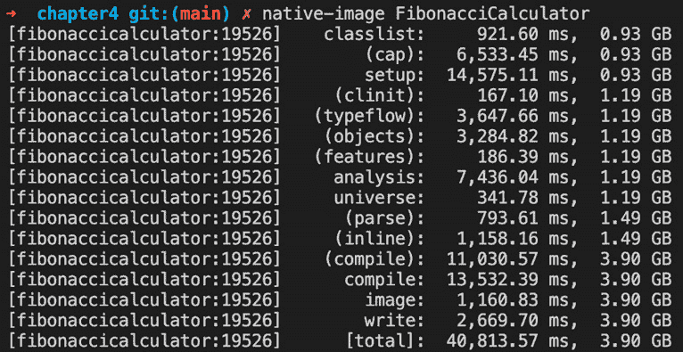

图 5.1 – FibonacciCalculator – 生成本地镜像控制台输出

本地镜像编译需要时间，因为它必须执行大量的静态代码分析以优化生成的镜像。以下图表显示了本地镜像构建器执行的预编译器编译流程：

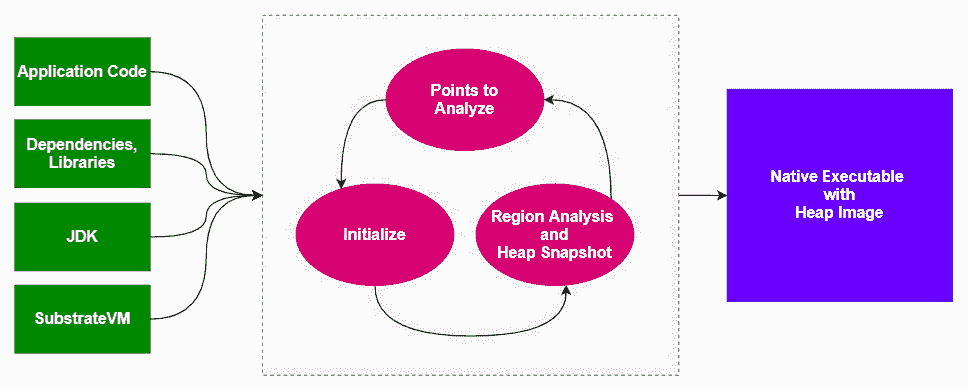

图 5.2 – 本地镜像管道流程

让我们努力更好地理解这张图片：

+   预编译器加载所有应用程序代码、依赖库和类，并将它们与 Java 开发工具包类和基底虚拟机类一起打包。

+   基底虚拟机具有运行应用程序所需的所有虚拟机功能。这包括内存管理、垃圾回收、线程管理、调度等。

+   然后编译器在构建本地镜像之前对代码执行以下优化：

    a. `META-INF/native-image/reflect-config.json`) 它还可能配置其他动态功能，如 JNI、代理等。配置文件需要放在`CLASSPATH`中，然后编译器会负责将这些功能包含在最终的本地镜像中。

    b. `static`和`static final`字段、`enum`常量、`java.lang.Class`对象等。

+   最终的本地镜像包含代码部分，其中放置了最终优化的二进制代码，以及在可执行文件的数据部分，写入堆镜像。这将有助于快速加载本地镜像。

这里是构建时和运行时点到分析和区域分析的高级流程：

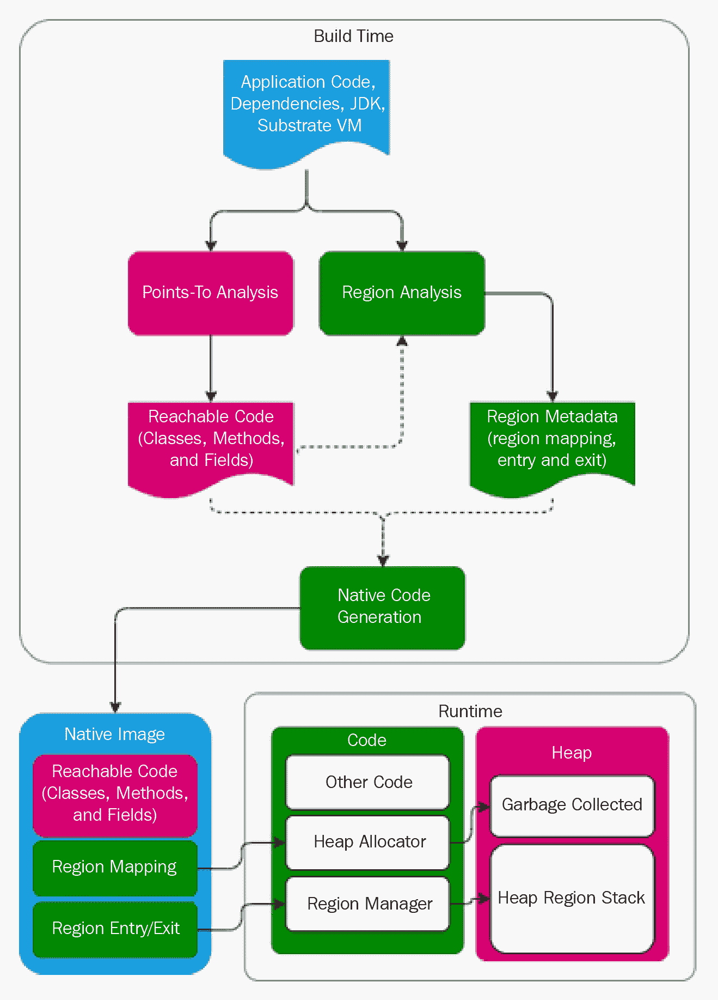

图 5.3 – 本地镜像管道 – 点到分析和区域分析

让我们详细理解这张图片：

+   在构建时，点到分析扫描应用程序代码、依赖项和 JDK 以查找可到达的代码。

+   区域分析捕获堆区域元数据，包括区域映射和区域进入/退出。区域分析还使用可到达的代码来识别哪些静态元素需要初始化。

+   代码是根据可到达的代码和区域元数据生成的。

+   在运行时，堆分配器使用区域映射预先分配内存，而区域管理器处理进入和退出。

现在，让我们通过命令行运行原生图像，执行 `./fibonaccicalculator`。以下是一个执行原生图像的截图：

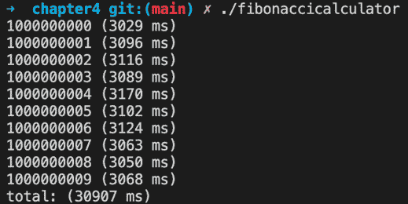

图 5.4 – FibonacciCalculator – 运行 FibonacciCalculator 原生图像控制台输出

预编译编译的一个最大的缺点是编译器永远不会对运行时进行配置以优化代码，而即时编译（JIT）则可以很好地完成这项工作。为了将两者的优点结合起来，我们可以使用 PGO 技术。我们在 *第三章* 的 *GraalVM 架构* 中简要介绍了 PGO。让我们看看它的实际应用，并更深入地理解它。

# 使用 GraalVM 仪表板分析原生图像

要深入了解点分析（points-to analysis）和区域分析（region analysis）的工作原理，我们可以使用 GraalVM 仪表板。在本节中，我们将构建原生图像时创建转储，并使用 GraalVM 可视化原生图像构建器执行点分析和区域分析。

在 *第四章* 的 *调试和监控应用程序* 部分（[B16878_04_Final_SK_ePub.xhtml#_idTextAnchor077]），*Graal 即时编译器* 中，我们简要介绍了 GraalVM 仪表板。GraalVM 仪表板是一个专门针对原生图像的非常强大的工具。在本节中，我们将生成 `FibonnacciCalculator` 示例的仪表板转储，并探讨如何使用 GraalVM 仪表板深入了解原生图像。

要生成仪表板转储，我们必须使用 `-H:DashboardDump=<文件名>` 标志。对于我们的 `FibonacciCalculator`，我们使用以下命令：

```java
native-image -H:DashboardDump=dashboard -H:DashboardAll FibonacciCalculator
```

以下截图显示了此命令生成的输出。该命令创建了一个 `dashboard.bgv` 文件：

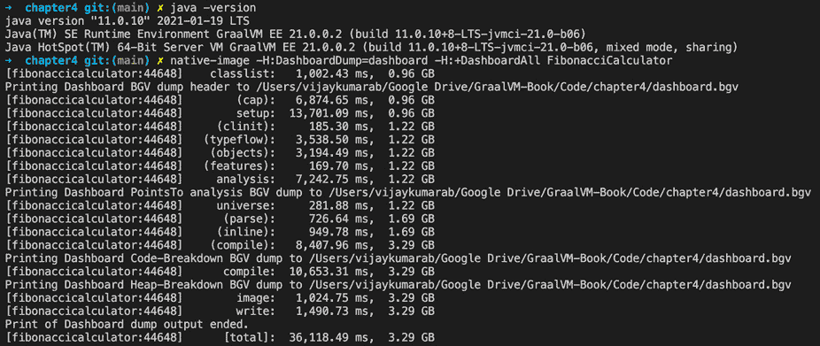

图 5.5 – FibonacciCalculator – 生成仪表板转储控制台输出

我们还使用了 `-H:DashboardAll` 标志来转储所有参数。以下是可以使用的替代标志：

+   `-H:+DashboardHeap`: 此标志仅转储图像堆。

+   `-H:+DashboardCode`: 此标志生成代码大小，按方法细分。

+   `-H:+DashboardPointsTo`: 此标志创建原生图像构建器执行的点分析转储。

现在，让我们加载这个 `dashboard.bgv` 文件，并分析结果。我们需要将 `dashboard.bgv` 文件上传到 GraalVM 仪表板。打开浏览器并访问 [`www.graalvm.org/docs/tools/dashboard/`](https://www.graalvm.org/docs/tools/dashboard/)。

我们应该看到以下屏幕：

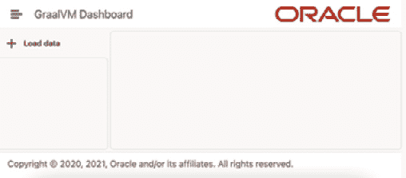

图 5.6 – GraalVM 仪表板主页

点击左上角的 **+ 加载数据** 按钮。您将得到一个如图所示的对话框：

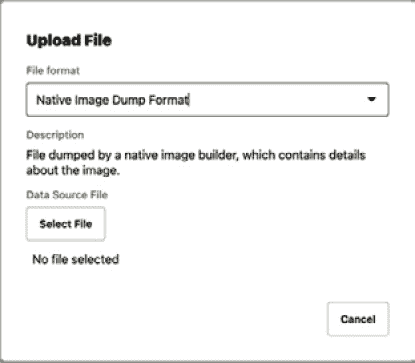

图 5.7 – 上传仪表板转储文件窗口

点击我们生成的 `dashboard.bgv` 文件。您将立即看到仪表板，如图 5.8 所示。您将在左侧找到两个生成的报告 – **代码大小拆分** 和 **堆大小拆分**。

## 理解代码大小拆分报告

代码大小拆分报告提供了各种类别的代码大小，这些代码被分类到块中。块的大小代表代码的大小。以下图显示了当我们选择上一节中生成的 `dashboard.bgv` 时初始仪表板屏幕。通过悬停在块上，我们可以通过方法获得更清晰的尺寸拆分。我们可以双击这些块来深入了解：

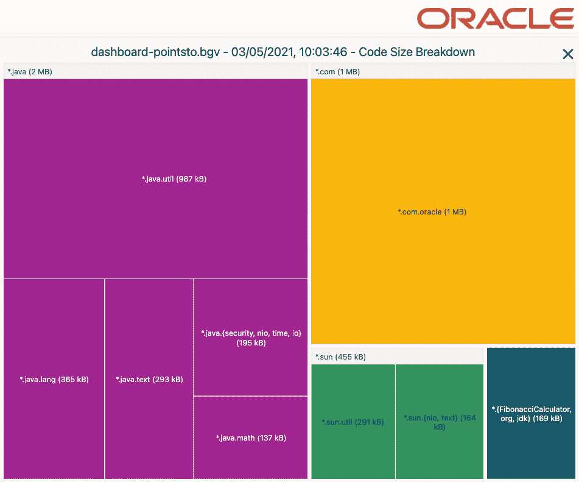

图 5.8 – 代码大小拆分仪表板

以下截图显示了当我们双击 FibonacciCalculator 块时看到的报告。再次，我们可以双击调用图：

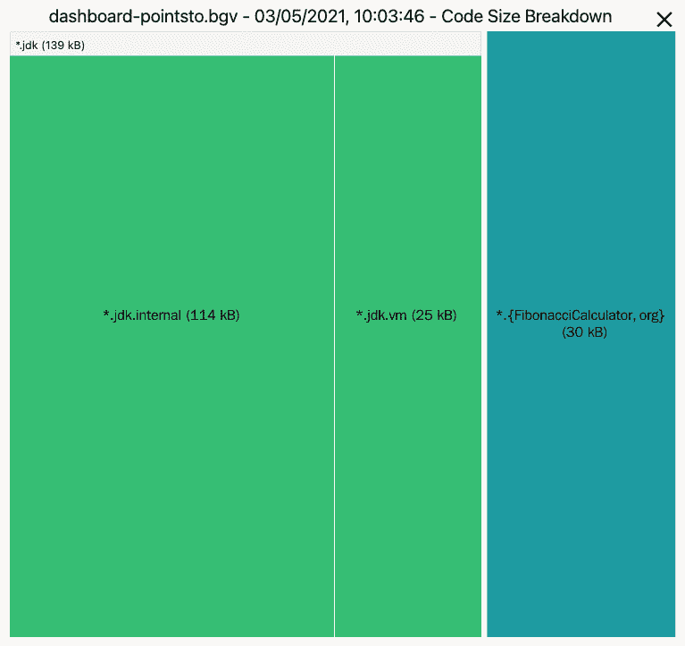

图 5.9 – 代码大小拆分 – 详细报告

以下截图显示了调用图。这有助于我们了解原生图像构建器所执行的点分析。如果识别出任何未使用的类或方法的依赖关系，我们可以利用这些信息来识别优化源代码的机会：

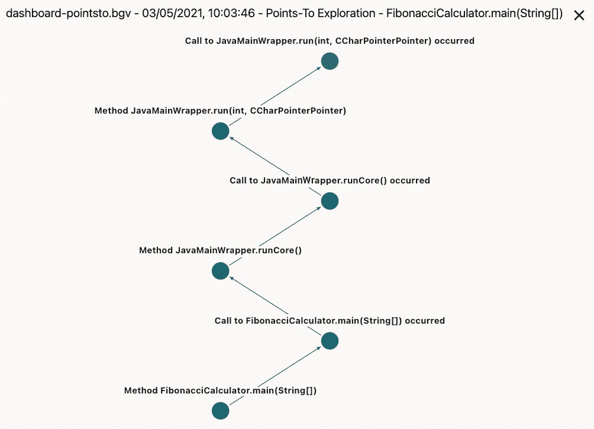

图 5.10 – 代码点分析依赖关系报告

现在，让我们看看堆大小拆分。

## 堆大小拆分

堆大小拆分提供了对堆分配的详细洞察，同时也深入探讨了堆。我们可以双击这些块来了解这些堆分配。以下截图显示了 `FibonacciCalculator` 的堆大小拆分报告：

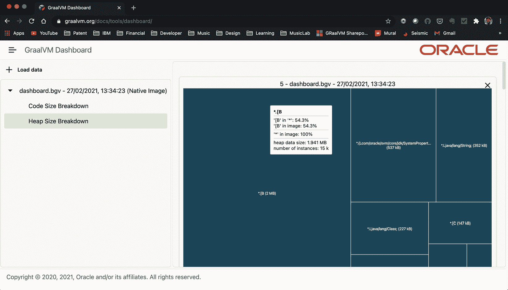

图 5.11 – 堆大小拆分仪表板

在本节中，我们探讨了如何使用 GraalVM 仪表板分析原生图像。现在，让我们看看如何使用 PGO 优化我们的原生图像。

# 理解 PGO

使用 PGO，我们可以运行原生图像，并选择生成运行时配置文件。JVM 创建一个配置文件，`.iprof`，它可以用来重新编译原生图像，以进一步优化它。以下图表（回想一下在 *第三章* 的 *配置文件引导优化 (PGO)* 部分，*GraalVM 架构*) 展示了 PGO 的工作原理：

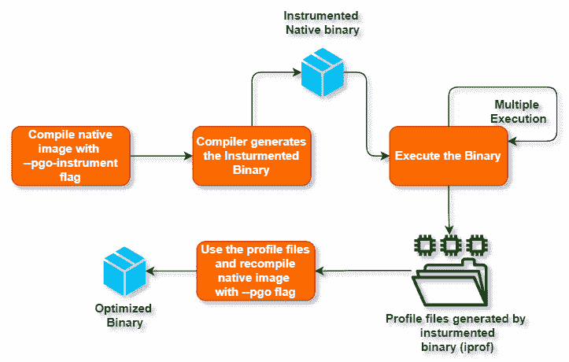

图 5.12 – 原生图像 – 配置文件引导优化流程

前面的图表显示了使用 PGO 的本地图像编译管道流程。让我们更好地理解这个流程：

+   初始本地图像通过传递 `–pgo-instrument` 标志参数，在打包本地图像时进行测量，以创建配置文件。这将生成一个带有测量代码的本地图像。

+   当我们用多个输入运行本地图像时，本地图像会创建一个配置文件。这个配置文件是与 `.iprof` 扩展名相同的文件，位于同一目录下。

+   一旦我们运行了所有用例，为了确保创建的配置文件覆盖了所有路径，我们可以通过传递 `.iprof` 文件作为参数以及 `--pgo` 参数来重新构建本地图像。

+   这将生成优化后的本地图像。

现在，让我们构建 `FibonacciCalculator` 类的优化本地图像。让我们首先通过运行以下命令来创建一个经过测量的本地图像：

```java
java -Dgraal.PGOInstrument=fibonaccicalculator.iprof -Djvmci.CompilerIdleDelay-0 FibonacciCalculator
```

此命令将使用配置信息构建本地图像。以下截图显示了构建本地图像的输出：

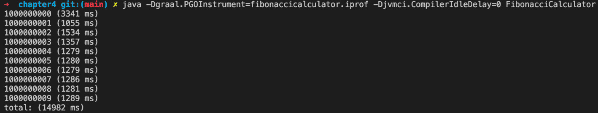

图 5.13 – FibonacciCalculator – 生成 PGO 配置文件控制台输出

这将在当前目录下生成 `fibonaccicalculator.iprof` 文件。现在，让我们使用以下命令使用此配置文件重新构建我们的本地图像：

```java
native-image –pgo=fibonaccicalculator.iprof FibonacciCalculator
```

这将使用配置文件重新构建本地图像，生成最优的可执行文件。以下截图显示了使用配置文件构建本地图像时的输出：

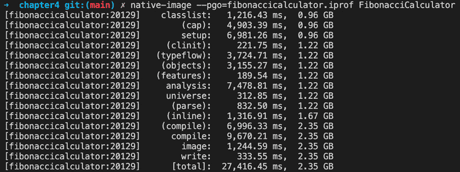

图 5.14 – FibonacciCalculator – 生成基于配置文件优化的本地图像控制台输出

现在，让我们执行优化后的文件。以下截图显示了运行优化后的本地图像时的输出结果：

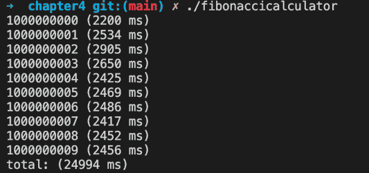

图 5.15 – FibonacciCalculator – 运行 PGO 图像控制台输出

如您所见，它比原始本地图像快得多。现在，让我们比较一下值。以下图表显示了压缩率：

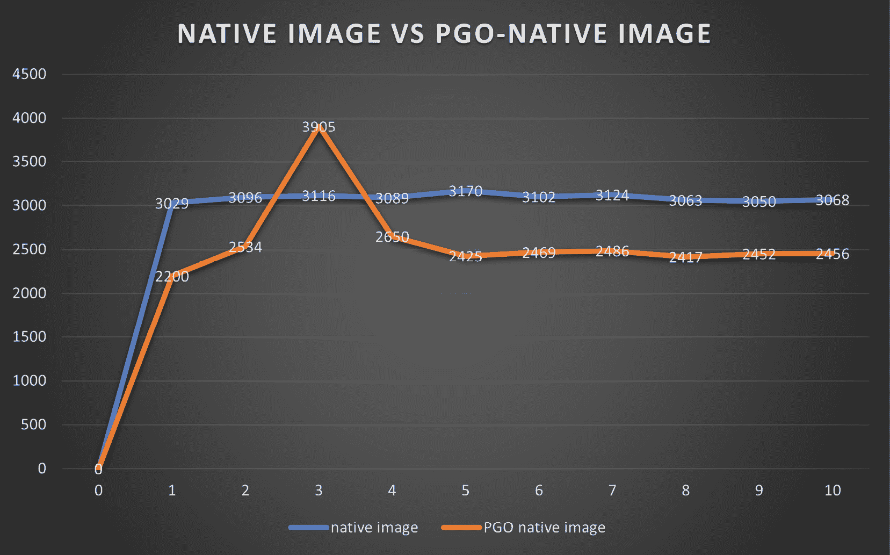

图 5.16 – FibonacciCalculator – 本地图像与 PGO 本地图像比较

如您所见，PGO 的性能更快、更好。

虽然这一切都很好，但如果与 JIT 进行比较，我们会发现本地图像的表现并不那么出色。让我们将其与 JIT（Graal 和 Java HotSpot）进行比较。以下图表显示了比较结果：

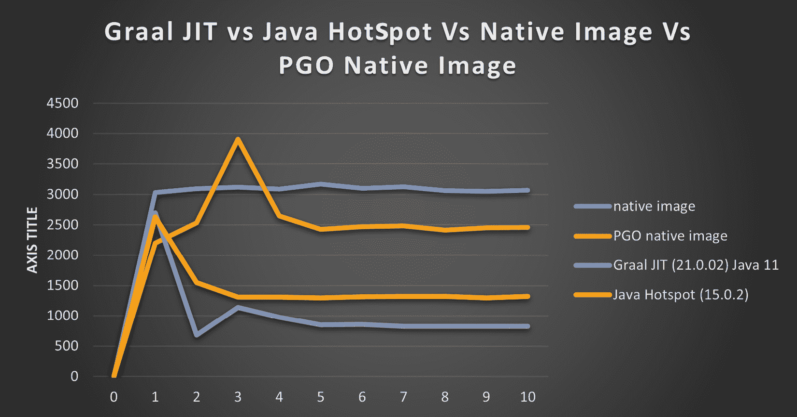

图 5.17 – FibonacciCalculator – Graal JIT 与 Java HotSpot 与本地图像与 PGO 本地图像比较

这突出了关键点之一，即原生图像并不总是最优的。在这种情况下，这肯定不是，因为我们使用大型数组进行堆分配。这直接影响了性能。这是作为开发者，优化代码的重要领域之一。原生图像使用 Serial GC，因此不建议为大型堆使用原生图像。

让我们优化代码并看看原生图像是否比 JIT 运行得更快。以下是优化后的代码，它执行了完全相同的逻辑，但使用了更少的堆：

```java
public class FibonacciCalculator2{    
         public long findFibonacci(int count) {
                  int fib1 = 0;
                  int fib2 = 1;
                  int currentFib, index;
                  long total = 0;
                  for(index=2; index < count; ++index ) {         
                           currentFib = fib1 + fib2;         
                           fib1 = fib2;         
                           fib2 = currentFib;         
                           total += currentFib;
                  }
                  return total;
         }
         public static void main(String args[]) {         
                  FibonacciCalculator2 fibCal =                     new FibonacciCalculator2();
                  long startTime =                     System.currentTimeMillis();
                  long now = 0;
                  long last = startTime;
                  for (int i = 1000000000; i < 1000000010; i++)                   {
                           fibCal.findFibonacci(i);
                           now = System.currentTimeMillis();
                           System.out.printf("%d (%d                                ms)%n", i , now - last);
                           last = now;
                  }
                  long endTime =                      System.currentTimeMillis();
                  System.out.printf(" total: (%d ms)%n",                           System.currentTimeMillis() –                                    startTime);
         }
}
```

下面是使用 Graal JIT 和原生图像运行此代码的最终结果。正如您将在下面的屏幕截图中所看到的，原生图像在启动时不需要任何时间，并且比 JIT 运行得快得多。让我们用 Graal JIT 运行优化后的代码。以下是运行优化代码后的输出：

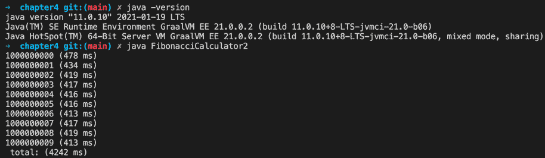

图 5.18 – FibonacciCalculator2 – 使用 Graal 运行优化后的代码

现在，让我们运行优化代码的原生图像。下一个屏幕截图显示了运行原生图像后的输出：

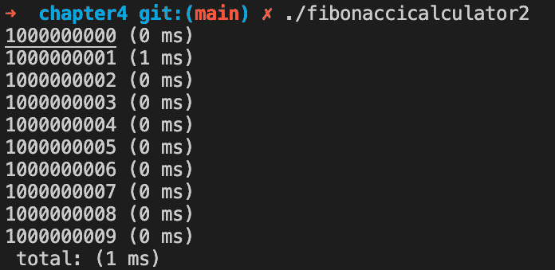

图 5.19 – FibonacciCalculator2 – 作为原生图像运行优化后的代码

如果绘制性能图表，您可以看到显著的改进：

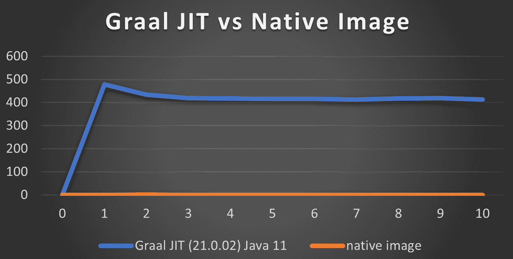

图 5.20 – FibonacciCalculator2 – Graal JIT 与原生图像对比

理解 AOT 编译的限制并采用正确的方法是很重要的。让我们快速浏览一下构建原生图像的一些编译器配置。

# 原生图像配置

原生图像构建是高度可配置的，并且始终建议在`native-image.properties`文件中提供所有构建配置。由于`native-image`工具以 JAR 文件作为输入，建议将`native-image.properties`打包在 JAR 文件中的`META-INF/native-image/<unique-application-identifier>`内。使用唯一的应用程序标识符以避免任何资源冲突。这些路径必须是唯一的，因为它们将在`CLASSPATH`上配置。`native-image`工具在构建时使用`CLASSPATH`来加载这些资源。除了`native-image.properties`之外，还有各种其他配置文件可以打包。在本节中，我们将介绍一些重要的配置。

以下是`native-image.properties`文件的典型格式，以及对该属性文件中每个部分的解释：

```java
Requires = <space separated list of languages that are required> 
JavaArgs = <Javaargs that we want to pass to the JVM>
Args = <native-image arguments that we want to pass>
```

+   `Requires`：`Requires`属性用于列出所有语言示例，例如`language:llvm` `language:python`。

+   `JavaArgs`：我们可以使用此属性传递常规 Java 参数。

+   `ImageName`：此参数可用于为生成的原生图像提供自定义名称。默认情况下，原生图像的名称与 JAR 文件或 Mainclass 文件（全部为小写字母）相同。例如，我们的 `FibonnaciCalculator.class` 生成 `fibonaccicalculator`。

+   `Args`：这是最常用的属性。它可以用来提供原生图像的参数。参数也可以从命令行传递，但从配置管理的角度来看，将它们列在 `native-image.properties` 文件中会更好，这样就可以将其放入 Git（或任何源代码仓库）并跟踪任何更改。以下表格解释了一些通常使用的参数：

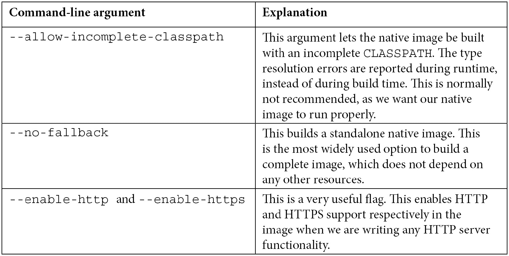

请参阅 [`www.graalvm.org/reference-manual/native-image/Options/`](https://www.graalvm.org/reference-manual/native-image/Options/) 以获取选项的完整列表。

## 主机选项和资源配置

我们可以使用各种参数来配置各种资源。这些资源声明通常配置在外部 JSON 文件中，并且可以使用各种 `-H:` 标志将其指向这些资源文件。语法是 `-H<Resource Flag>=${.}/jsonfile.json`。以下表格列出了使用的一些重要参数：

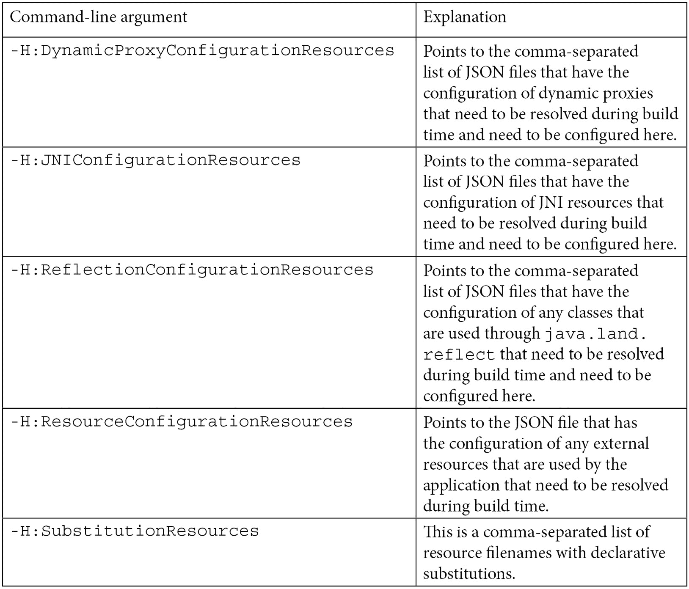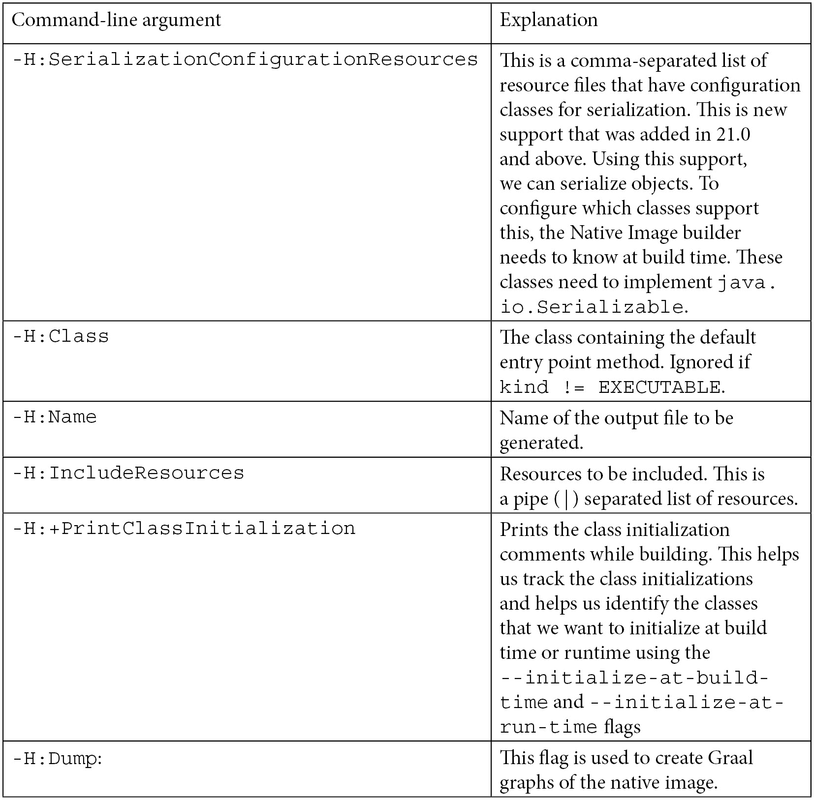

`native-images.properties` 捕获所有配置参数，并且通过 `native-image.properties` 文件传递配置是一个好习惯，因为它在源代码配置管理工具中易于管理。

GraalVM 随附一个代理，该代理在运行时跟踪 Java 程序的动态特性。这有助于识别和配置具有动态特性的原生图像构建。要使用原生图像代理运行 Java 应用程序，我们需要传递 `-agentlib:native-image-agent=config-output-dir=<path to config dir>`。代理跟踪执行并拦截查找类、方法、资源和代理的调用。然后代理在作为参数传递的配置目录中生成 `jni-config.json`、`reflect-config.json`、`proxy-config.json` 和 `resource-config.json`。运行应用程序多次，使用不同的测试用例，以确保完整代码被覆盖，并且代理能够捕获大多数动态调用是一个好习惯。当我们运行迭代时，使用 `-agentlib:native-image-agent=config-merge-dir=<path to config dir>` 非常重要，这样配置文件就不会被覆盖，而是合并。

我们可以使用原生图像生成 Graal 图，以分析原生图像的运行情况。在下一节中，我们将探讨如何生成这些 Graal 图。

# 为原生图像生成 Graal 图

即使是原生图像也可以生成 Graal 图。Graal 图可以在构建时或运行时生成。让我们在本节中使用我们的 `FibonnaciCalculator` 应用程序来探索这个功能。

让我们使用此命令生成`FibonacciCalculator`的转储：

```java
native-image -H:Dump=1 FibonacciCalculator
```

以下为输出：

```java
 native-image -H:Dump=1 FibonacciCalculator
[fibonaccicalculator:54143]  classlist:  811.75 ms,    0.96 GB
[fibonaccicalculator:54143]      (cap):  4,939.64 ms,  0.96 GB
[fibonaccicalculator:54143]      setup:  6,923.28 ms,  0.96 GB
[fibonaccicalculator:54143]   (clinit):  155.70 ms,    2.29 GB
[fibonaccicalculator:54143]  typeflow):  3,841.07 ms,  2.29 GB
[fibonaccicalculator:54143]  (objects):  3,235.92 ms,  2.29 GB
[fibonaccicalculator:54143] (features):  169.55 ms,    2.29 GB
[fibonaccicalculator:54143]   analysis:  7,550.64 ms,  2.29 GB
[fibonaccicalculator:54143]   universe:  295.75 ms,    2.29 GB
[fibonaccicalculator:54143]    (parse):  829.58 ms,    3.18 GB
[fibonaccicalculator:54143]   (inline):  1,357.72 ms,  3.18 GB
[Use -Dgraal.LogFile=<path> to redirect Graal log output to a file.]
Dumping IGV graphs in /graal_dumps/2021.02.28.20.32.24.880
Dumping IGV graphs in /graal_dumps/2021.02.28.20.32.24.880
[fibonaccicalculator:54143]  (compile):  13,244.17 ms, 4.74 GB
[fibonaccicalculator:54143]    compile:  16,249.17 ms, 4.74 GB
[fibonaccicalculator:54143]      image:  1,816.98 ms,  4.74 GB
[fibonaccicalculator:54143]      write:  430.54 ms,    4.74 GB
[fibonaccicalculator:54143]    [total]:  34,247.73 ms, 4.74 GB
```

此命令为每个初始化的类生成大量图表。我们可以使用`-H:MethodFilter`标志指定我们想要为其生成图表的类和方法。命令看起来可能像这样：

```java
native-image -H:Dump=1 -H:MethodFilter=FibonacciCalculator.main FibonacciCalculator
```

请参阅第四章的*Graal 中间表示*部分，了解如何阅读这些图表并理解优化代码的机会。对于原生图像，优化源代码至关重要，因为我们没有像即时编译器那样的运行时优化。

# 理解原生图像如何管理内存

原生图像与 Substrate VM 捆绑在一起，该 VM 具有管理内存的功能，包括垃圾收集。正如我们在*构建原生图像*部分所看到的，堆分配是图像创建的一部分，以加快启动速度。这些是在构建时初始化的类。请参阅*图 5.3*以了解原生图像构建器在执行静态区域分析后如何初始化堆区域。在运行时，垃圾收集器管理内存。原生图像构建器支持两种垃圾收集配置。以下小节将介绍这两种垃圾收集配置。

## 序列垃圾收集器

序列垃圾收集器（GC）是默认集成到原生图像中的。这在社区版和企业版中都是可用的。此垃圾收集器针对低内存占用和小堆大小进行了优化。我们可以使用`--gc=serial`标志显式使用序列垃圾收集器。序列垃圾收集器是 GC 的简单实现。

序列垃圾收集器将堆分为两个区域，即年轻代和老年代。以下图示显示了序列垃圾收集器的工作原理：

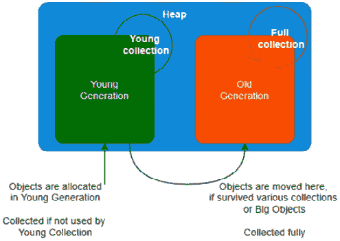

图 5.21 – 序列垃圾收集器堆架构

年轻代用于新对象。当年轻代块满且所有未使用的对象被回收时，会触发。当老年代块满时，会触发完全收集。年轻代收集运行得更快，而在运行时完全收集更耗时。可以使用`-XX:PercentTimeInIncrementalCollection`参数来调整此行为。

默认情况下，此百分比是 50%。这可以增加到减少完全收集的次数，从而提高性能，但会对内存大小产生负面影响。根据内存分析，在测试应用程序时，我们可以优化此参数以获得更好的性能和内存占用。以下是如何在运行时传递此参数的示例：

```java
./fibonaccicalculator -XX:PercentTimeInIncrementalCollection=40
```

此参数也可以在构建时传递：

```java
native-image --gc=serial -R:PercentTimeInIncrementalCollection=70 FibonacciCalculator
```

可以使用其他参数来进行微调，例如`-XX:MaximumYoungGenerationSizePercent`。这个参数可以用来调整年轻代块应该占整体堆的最大百分比。

序列 GC 是单线程的，对于小堆来说效果很好。以下图示展示了序列 GC 的工作方式。应用程序线程被暂停以回收内存。这被称为*停止世界*事件。在这段时间内，**垃圾收集线程**运行并回收内存。如果堆大小很大且有很多线程运行，这将对应用程序的性能产生影响。序列 GC 非常适合小进程和小堆大小。

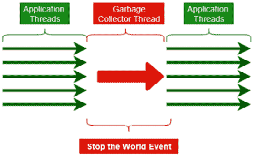

图 5.22 – 序列 GC 堆流程

默认情况下，序列 GC 假设在启动 GC 线程之前堆大小为 80%，这可以通过`-XX:MaximumHeapSizePercent`标志来更改。还有其他标志可以用来微调序列 GC 的性能。

## G1 垃圾收集器

G1 垃圾收集器是更近期的、更高级的垃圾收集器实现。这仅在企业版中可用。可以使用`--gc=G1`标志启用 G1 垃圾收集器。G1 提供了吞吐量和延迟之间的正确平衡。吞吐量是运行代码的平均时间与 GC 的时间之比。更高的吞吐量意味着我们有更多的 CPU 周期用于代码，而不是 GC 线程。延迟是*停止世界*事件所需的时间或暂停代码执行的时间。延迟越少，对我们来说越好。G1 的目标是高吞吐量和低延迟。以下是它的工作方式。

G1 将整个堆划分为小区域。G1 运行并发线程以查找所有活动对象，Java 应用程序永远不会暂停，并跟踪区域间的所有指针，并尝试收集区域以使程序中的暂停时间更短。G1 也可能移动活动对象并将它们合并到区域中，并尝试使区域为空。

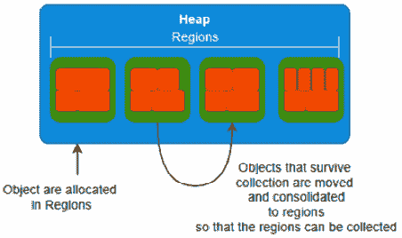

图 5.23 – G1 GC 堆流程

之前的图示展示了 G1 GC 如何通过划分区域来工作。对象分配到区域是基于尝试在空区域分配内存，并通过将对象合并到区域中（如分区和去分区）来尝试清空区域。其理念是优化管理和收集区域。

G1 垃圾收集器的占用空间比序列 GC 大，适用于运行时间更长、堆大小更大的情况。可以使用各种参数来微调 G1 GC 的性能。以下列出了一些参数（`-H`是在构建镜像时传递的参数，`-XX`是在运行镜像时传递的）：

+   `-H:G1HeapRegionSize`：这是每个区域的大小。

+   `-XX:MaxRAMPercentage`：用作堆大小的物理内存大小的百分比。

+   `-XX:ConcGCThreads`：并发 GC 线程的数量。这需要优化以获得最佳性能。

+   `-XX:G1HeapWastePercent`：垃圾收集器达到此百分比时停止声明。这将允许更低的延迟和更高的吞吐量，但是，设置一个最佳值是至关重要的，因为如果它太高，那么对象将永远不会被收集，应用程序的内存占用将始终很高。

选择合适的垃圾回收器和配置对于应用程序的性能和内存占用至关重要。

## 管理堆大小和生成堆转储

可以使用以下在运行原生图像时传递的运行时参数手动设置堆大小。`-Xmx`设置最大堆大小，`-Xms`设置最小堆大小，`-Xmn`设置年轻代区域的大小，以字节为单位。以下是如何在运行时使用这些参数的示例：

```java
./fibonaccicalculator -Xms2m -Xmx10m -Xmn1m
```

在构建时，我们可以传递参数来配置堆大小。这是一个关键的配置，必须非常小心地进行，因为这将直接影响原生图像的内存占用和性能。以下命令是一个配置最小堆大小、最大堆大小和堆的最大新大小的示例：

```java
native-image -R:MinHeapSize=2m -R:MaxHeapSize=10m -R:MaxNewSize=1m FibonacciCalculator
```

堆转储对于调试任何内存泄漏和内存管理问题至关重要。我们通常使用 VisualVM 等工具进行此类堆转储分析。原生图像不是使用`-H:+AllowVMInspection`标志构建的。这将创建一个原生图像，当发送 USR1 信号（`sudo kill -USR1`或`-SIGUSR1`或`QUIT/BREAK`键）时可以生成堆栈转储，当发送 USR2 信号（`sudo kill -USR2`或`-SIGUSR2` – 您可以使用`kill -l`命令检查确切的信号）时可以生成运行时编译信息转储。此功能仅适用于企业版。

我们还可以通过在需要时调用`org.graalvm.nativeimage.VMRuntime#dumpHeap`来程序化地创建堆转储。

# 构建静态原生图像和原生共享库

静态原生图像是静态链接的二进制文件，在运行时不需要任何额外的依赖库。当我们将微服务应用程序构建为原生图像时，这些图像非常有用，因为它们可以轻松地打包到 Docker 中，无需担心依赖关系。静态图像最适合构建基于容器的微服务。

在撰写本书时，此功能仅适用于 Java 11 的 Linux AMD64。请参阅[`www.graalvm.org/reference-manual/native-image/StaticImages/`](https://www.graalvm.org/reference-manual/native-image/StaticImages/)以获取最新更新和构建静态原生图像的过程。

原生图像构建器还会构建共享库。有时您可能希望将代码作为共享库创建，该库被某些其他应用程序使用。为此，您必须传递 `–shared` 标志来构建共享库，而不是可执行库。

# 调试原生图像

调试原生图像需要构建包含调试信息的图像。我们可以使用 `-H:GenerateDebugInfo=1`。以下是一个为 `FibonnacciCalculator` 使用此参数的示例：

```java
native-image -H:GenerateDebugInfo=1 FibonacciCalculator
```

生成的图像以 **GNU 调试器** (**GDB**) 的形式包含调试信息。这可以用于在运行时调试代码。以下显示了运行前述命令的输出：

```java
native-image -H:GenerateDebugInfo=1 FibonacciCalculator
[fibonaccicalculator:57833]  classlist:  817.01 ms,    0.96 GB
[fibonaccicalculator:57833]      (cap):  6,301.03 ms,  0.96 GB
[fibonaccicalculator:57833]      setup:  9,946.35 ms,  0.96 GB
[fibonaccicalculator:57833]   (clinit):  147.54 ms,    1.22 GB
[fibonaccicalculator:57833] (typeflow):  3,642.34 ms,  1.22 GB
[fibonaccicalculator:57833]  (objects):  3,164.39 ms,  1.22 GB
[fibonaccicalculator:57833] (features):  181.00 ms,    1.22 GB
[fibonaccicalculator:57833]   analysis:  7,282.44 ms,  1.22 GB
[fibonaccicalculator:57833]   universe:  304.43 ms,    1.22 GB
[fibonaccicalculator:57833]    (parse):  624.60 ms,    1.22 GB
[fibonaccicalculator:57833]   (inline):  989.65 ms,    1.67 GB
[fibonaccicalculator:57833]  (compile):  8,486.97 ms,  3.15 GB
[fibonaccicalculator:57833]    compile:  10,625.01 ms, 3.15 GB
[fibonaccicalculator:57833]      image:  869.81 ms,    3.15 GB
[fibonaccicalculator:57833]  debuginfo:  1,078.95 ms,  3.15 GB
[fibonaccicalculator:57833]      write:  2,224.22 ms,  3.15 GB
[fibonaccicalculator:57833]    [total]:  33,325.95 ms, 3.15 GB
```

这将生成一个 `sources` 目录，其中包含由原生图像构建器生成的缓存。此缓存将 JDSK、GraalVM 和应用程序类引入以帮助调试。以下是列出 `sources` 目录内容的输出：

```java
$ ls -la                         
total 8
drwxr-xr-x     9 vijaykumarab    staff      288 17 Apr 09:01 .
drwxr-xr-x    10 vijaykumarab    staff      320 17 Apr 09:01 ..
-rw-r--r--     1 vijaykumarab    staff     1240 17 Apr 09:01 FibonacciCalculator.java
drwxr-xr-x     3 vijaykumarab    staff       96 17 Apr 09:01 com
drwxr-xr-x     5 vijaykumarab    staff      160 17 Apr 09:01 java.base
drwxr-xr-x     3 vijaykumarab    staff       96 17 Apr 09:01 jdk.internal.vm.compiler
drwxr-xr-x     3 vijaykumarab    staff       96 17 Apr 09:01 jdk.localedata
drwxr-xr-x     3 vijaykumarab    staff       96 17 Apr 09:01 jdk.unsupported
drwxr-xr-x     3 vijaykumarab    staff       96 17 Apr 09:01 org.graalvm.sdk
```

要调试原生图像，我们需要 `gdb` 工具。有关如何在您的目标机器上安装 `gdb` 的信息，请参阅[`www.gnu.org/software/gdb/`](https://www.gnu.org/software/gdb/)。一旦正确安装，我们应该能够通过执行 `gdb` 命令进入 `gdb` 壳。以下显示了典型的输出：

```java
$ gdb                   
GNU gdb (GDB) 10.1
Copyright (C) 2020 Free Software Foundation, Inc.
License GPLv3+: GNU GPL version 3 or later <http://gnu.org/licenses/gpl.html>
This is free software: you are free to change and redistribute it.
There is NO WARRANTY, to the extent permitted by law.
Type "show copying" and "show warranty" for details.
This GDB was configured as "x86_64-apple-darwin20.2.0".
Type "show configuration" for configuration details.
For bug reporting instructions, please see:<https://www.gnu.org/software/gdb/bugs/>.
Find the GDB manual and other documentation resources online at:
         <http://www.gnu.org/software/gdb/documentation/>.
For help, type "help".
Type "apropos word" to search for commands related to "word".(gdb)
```

我们需要指向我们在上一步中生成源文件的目录。我们可以通过执行以下命令来完成：

```java
set directories /<sources directory>/jdk:/ <sources directory>/graal:/ <sources directory>/src
```

一旦环境设置完成，我们就可以使用 `gdb` 来设置断点和调试。有关如何使用 `gdb` 调试可执行文件的详细文档，请参阅[`www.gnu.org/software/gdb/documentation/`](https://www.gnu.org/software/gdb/documentation/)。

在撰写本书时，调试信息可用于执行断点、单步执行、堆栈回溯、打印原始值、对象的转换和打印、路径表达式以及通过方法名和静态数据引用。有关更多详细信息，请参阅[`www.graalvm.org/reference-manual/native-image/DebugInfo/`](https://www.graalvm.org/reference-manual/native-image/DebugInfo/)。

# Graal AOT (Native Image) 的局限性

在本节中，我们将探讨 Graal AOT 和原生图像的一些局限性。

Graal 的时间前编译假设了一个封闭世界的静态分析。它假设在运行时可达的所有类在构建时都是可用的。这对编写任何需要动态加载的代码（如反射、JNI、代理等）有直接影响。然而，Graal AOT 编译器（`native-image`）提供了一种以 JSON 清单文件的形式提供此元数据的方法。这些文件可以与 JAR 文件一起打包，作为编译器的输入：

+   动态加载类：在运行时加载的类，在构建时对 AOT 编译器不可见，需要在配置文件中指定。这些配置文件通常保存在`META-INF/native-image/`下，应在`CLASSPATH`中。如果在编译配置文件时找不到类，它将抛出`ClassNotFoundException`。

+   反射：任何调用`java.lang.reflect` API 来列出方法和字段或使用反射 API 调用它们的调用都必须在`META-INF/native-image/`下的`reflect-config.json`文件中进行配置。编译器试图通过静态分析来识别这些反射元素。

+   动态代理：生成的动态代理类是`java.lang.reflect.Proxy`的实例，需要在构建时定义。代理配置需要在`proxy-config.json`中配置接口。

+   `jni-config.json.`

+   序列化：Java 序列化也会动态访问大量的类元数据。即使是这些访问也需要提前配置。

你可以在此处找到有关其他限制的更多详细信息：[`www.graalvm.org/reference-manual/native-image/Limitations/`](https://www.graalvm.org/reference-manual/native-image/Limitations/)。

# GraalVM 容器

GraalVM 还打包为 Docker 容器。可以直接从 Docker Registry ([ghcr.io](http://ghcr.io))拉取，也可以用作构建自定义镜像的基础镜像。以下是一些使用 GraalVM 容器的关键命令：

+   拉取 Docker 镜像：`docker pull ghcr.io/graalvm/graalvm-ce:latest`

+   运行容器：`docker run -it ghcr.io/graalvm/graalvm-ce:latest bash`

+   在 Dockerfile 中作为基础镜像使用：`FROM ghcr.io/graalvm/graalvm-ce:latest`

当我们谈到在 GraalVM 上构建微服务时，我们将在*第九章* *GraalVM Polyglot – LLVM, Ruby, and WASM*中进一步探讨关于 GraalVM 容器的更多内容。

# 摘要

在本章中，我们详细介绍了 Graal 的即时编译器和提前编译器。我们取了示例代码并查看 Graal JIT 如何执行各种优化。我们还详细介绍了如何理解 Graal 图。这是在开发期间分析和识别我们可以做的优化，以加快运行时 Graal JIT 编译速度的关键知识。

本章提供了关于如何构建原生图像以及如何使用配置文件引导优化来优化原生图像的详细说明。我们取了示例代码并编译了原生图像，还发现了原生图像的内部工作原理。我们识别了可能导致原生图像运行速度比即时编译器慢的代码问题。我们还涵盖了原生图像的限制以及何时使用原生图像。我们探索了各种构建时间和运行时配置以优化构建和运行原生图像。

在下一章中，我们将深入了解 Truffle 语言实现框架以及如何构建多语言应用。

# 问题

1.  原生镜像是如何创建的？

1.  什么是指针分析？

1.  什么是区域分析？

1.  什么是串行 GC 和 G1 GC？

1.  如何优化原生镜像？什么是 PGO？

1.  原生镜像有哪些限制？

# 进一步阅读

+   GraalVM Enterprise 版本 ([`docs.oracle.com/en/graalvm/enterprise/19/index.html`](https://docs.oracle.com/en/graalvm/enterprise/19/index.html))

+   Graal VM Native Image 文档 ([`www.graalvm.org/reference-manual/native-image/`](https://www.graalvm.org/reference-manual/native-image/))
