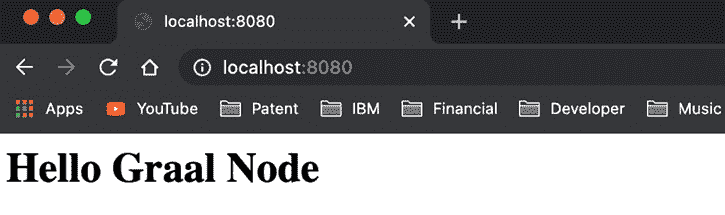
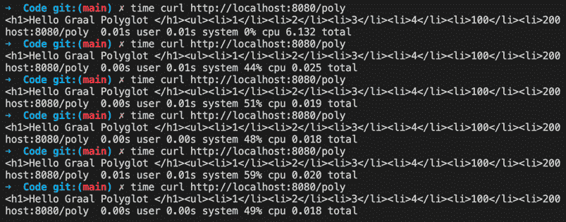
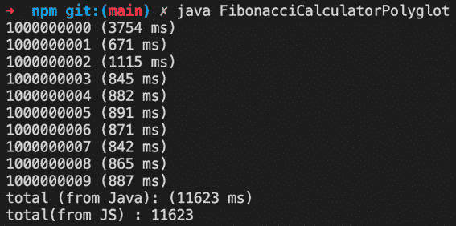
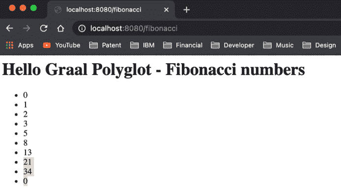
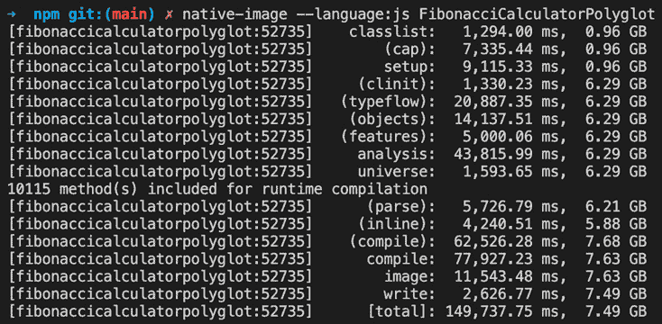
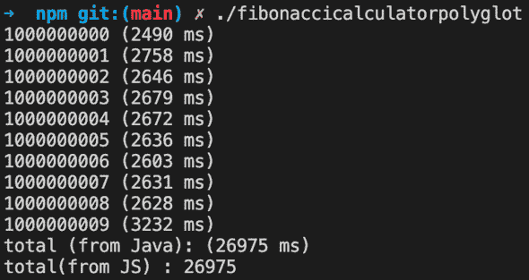
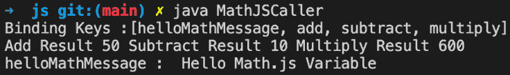

# 第九章：GraalVM 多语言 – JavaScript 和 Node.js

在上一章中，我们探讨了 Truffle 如何提供一层来集成其他语言程序以便在 GraalVM 上运行。在本章中，我们将重点关注 JavaScript 和 Node.js 解释器，在下一章中，我们将介绍其他运行时，例如 Java/Truffle、Python、R 和 WebAssembly。我们将探讨 Truffle 的多语言互操作性功能，并探索 JavaScript 解释器。我们将通过编写代码来亲身体验这些功能。

在本章中，我们将涵盖以下主题：

+   理解如何在 Graal 上运行非 JVM 语言应用程序，特别是 JavaScript 和 Node

+   学习如何在用不同语言编写的应用程序之间传递对象/值

+   理解如何使用优化技术来微调代码

到本章结束时，您将非常清楚地了解如何在 GraalVM 上构建多语言应用程序。

# 技术要求

在本章中，我们将进行大量的动手编码，以探索 GraalVM 支持的各种客语言。要尝试代码，您需要以下内容：

+   各种语言的 Graal 运行时：我们将在本章中介绍如何安装和运行这些运行时。

+   访问 GitHub：有一些示例代码片段，这些代码片段存储在 Git 仓库中。您可以从以下链接下载代码：[`github.com/PacktPublishing/Supercharge-Your-Applications-with-GraalVM/tree/main/Chapter07/js`](https://github.com/PacktPublishing/Supercharge-Your-Applications-with-GraalVM/tree/main/Chapter07/js)。您将在`chapter7`目录下找到特定章节的代码。

+   本章的“代码实战”视频可以在[`bit.ly/3yqu4ui`](https://bit.ly/3yqu4ui)找到。

# 理解 JavaScript（包括 Node.js）Truffle 解释器

GraalVM 的 JavaScript 版本是一个符合 ECMAScript 标准的运行时，适用于 JavaScript (`js`) 和 Node.js (`node`)。它支持截至本书编写时的 ECMAScript 2021 的所有功能。它还与 Nashorn 和 Rhino 兼容，并提供对 Node.js 的完全支持。

GraalVM Node.js 使用原始的 Node.js 源代码，并用 GraalVM JavaScript 引擎替换了 V8 JavaScript 引擎。这种替换是无缝的，应用程序开发者不需要修改大量代码或配置，就可以使用 GraalVM Node.js 运行现有的 Node.js 应用程序。GraalVM Node.js 为嵌入来自其他语言的代码、访问数据和代码以及与其他语言代码的互操作提供了更多功能。`npm`。

在本节中，除了将 JavaScript 和 Node 作为运行应用程序的替代运行时之外，我们还将探索它们的互操作性功能。我们将通过大量的 JavaScript 和 Node.js 示例代码来探索 GraalVM JavaScript 运行时的多语言能力。

## 验证 JavaScript、Node 和 npm 的安装和版本

JavaScript 和 Node.js 随 GraalVM 安装一起提供；你可以在 `<GraalHome>/bin` 目录中找到它们。我们可以通过检查版本号来验证 JavaScript 运行时是否配置正确。

要检查版本，请执行 `js --version` 命令。在撰写本书时，GraalVM JavaScript 21.0.0.2 是最新的。以下是输出（注意，这是 GraalVM JavaScript）：

```java
GraalVM JavaScript (GraalVM EE Native 21.0.0.2)
```

我们还可以通过执行 `node --version` 命令来确保我们正在运行正确的 Node.js 版本。在以下命令中，我们明确调用正确的版本。请注意，对于您来说，GraalVM 主目录可能不同：

```java
/Library/Java/JavaVirtualMachines/graalvm-ee-java11-21.0.0.2/Contents/Home/bin/node --version
v12.20.1
```

让我们也通过执行 `npm --version` 命令来确保 NPM 正在运行。以下是命令和输出：

```java
/Library/Java/JavaVirtualMachines/graalvm-ee-java11-21.0.0.2/Contents/Home/bin/npm --version
6.14.10
```

既然我们已经验证了 JavaScript、Node.js 和 npm 的安装，让我们创建一个简单的 Node.js 应用程序。

进入应用程序文件夹，并执行 `npm init`。这将设置 Node.js 应用程序的样板配置。我们将应用程序命名为 `graal-node-app`。以下显示的是控制台输出：

```java
/Library/Java/JavaVirtualMachines/graalvm-ee-java11-21.0.0.2/Contents/Home/bin/npm init     
package name: (npm) graal-node-app
version: (1.0.0) 1.0.0
description: 
entry point: (index.js) 
test command: 
git repository: 
keywords: 
author: 
license: (ISC) 
About to write to /chapter7/js/npm/package.json:
{
  "name": "graal-node-app",
  "version": "1.0.0",
  "description": "",
  "main": "index.js",
  "scripts": {
    "test": "echo \"Error: no test specified\" andand exit 1"
  },
  "author": "",
  "license": "ISC"
}
Is this OK? (yes)
```

这将创建一个基于我们选择的选项的 Node.js 应用程序和 `package.json` 文件，其中包含样板配置。让我们通过执行 `npm install --save express` 来安装 `express` 包。这将把 `express` 包安装到应用程序文件夹中，并更新 `package.json` 文件（因为使用了 `--save` 参数）。以下是输出：

```java
/Library/Java/JavaVirtualMachines/graalvm-ee-java11-21.0.0.2/Contents/Home/bin/npm install --save express
npm notice created a lockfile as package-lock.json. You should commit this file.
npm WARN graal-node-app@1.0.0 No description
npm WARN graal-node-app@1.0.0 No repository field.
+ express@4.17.1
added 50 packages from 37 contributors and audited 50 packages in 6.277s
found 0 vulnerabilities
```

你将找到包含运行我们的应用程序所需的所有包的 `node_modules` 目录。让我们创建一个 `index.js` 文件，并使用以下代码：

```java
var express = require('express');
var app = express();
app.get('/', function(request, response) {
    var responseString = "<h1>Hello Graal Node </h1>";
    response.send(responseString);
});
app.listen(8080, function() {
    console.log('Started the server at 8080')
});
```

如您所见，这是一个非常简单的应用程序，当在根目录下调用时，会以 HTML `Hello Graal Node` 作为标题 1 响应。应用程序将在端口号 `8080` 上监听。

使用以下命令运行此应用程序：

```java
/Library/Java/JavaVirtualMachines/graalvm-ee-java11-21.0.0.2/Contents/Home/bin/node index.js 
Started the server at 8080
```

既然我们可以看到输出，我们知道应用程序正在监听 `8080`。让我们尝试从 Web 浏览器在 http://localhost:8080/ 上调用它。以下是应用程序在 Web 浏览器上响应的截图：



图 7.1 – Hello Graal Node 截图

既然我们知道 GraalVM 上的 Node.js 运行正常，让我们了解多语言互操作性。

## JavaScript 互操作性

在 *第六章*，“Truffle – 概述”中，我们详细介绍了 Truffle 如何启用多语言支持，并提供多语言互操作性和嵌入的基础设施。在本节中，我们将通过示例代码探索这些功能。

让我们取用上一节中创建的 Node.js 应用程序，并在我们的`index.js`文件中添加一个端点`/poly`。让我们创建一个简单的 Python 数组对象，并在对象中存储一些数字。然后我们将遍历这个 Python 对象在 Node.js 中，列出这些数字。这展示了我们如何在 JavaScript 中嵌入 Python 代码片段。

以下源代码显示了这个新的端点`/poly`：

```java
var express = require('express');
var app = express();
app.get('/', function(request, response) {
    var responseString = "<h1>Hello Graal Node </h1>";
    response.send(responseString);
});
app.get('/poly', function(request, response) {
    var responseString = "<h1>Hello Graal Polyglot </h1>";
    var array = Polyglot.eval("python", "[1,2,3,4, 100,                              200, 300, 400]")
    responseString = responseString + "<ul>";
    for (let index = 0; index < array.length; index++) {
        responseString = responseString + "<li>";
        responseString = responseString + array[index];
        responseString = responseString + "</li>";
    }
    responseString = responseString + "</ul>";
    response.send(responseString);
});
```

现在，让我们编写代码来监听`8080`端口，并在收到请求时调用前面的函数：

```java
app.listen(8080, function() {
    console.log('Started the server at 8080')
});
```

如您在代码中所见，我们正在使用`Polyglot.eval()`方法来运行 Python 代码。为了让 polyglot 对象知道它是 Python 代码，我们传递了`python`作为参数，并传递了数组的 Python 表示。现在让我们用`node`运行此代码：

```java
/Library/Java/JavaVirtualMachines/graalvm-ee-java11-21.0.0.2/Contents/Home/bin/node --jvm --polyglot index.js
Started the server at 8080
```

注意，我们必须向 node 传递`--jvm`和`--polyglot`参数。传递这些参数非常重要。`--jvm`告诉 node 在`--polyglot`上运行，正如其名称所暗示的，告诉 node 支持`polyglot`。由于 Truffle 和 Graal 在 JVM 上运行，因此使用`jvm`参数很重要，即使我们可能没有在我们的代码中直接使用 Java。

现在，让我们从浏览器中访问这个新的端点。以下截图显示了预期的输出：

）。以下是一系列 curl 命令的截图：



图 7.3 – 随后调用后 Node.js 的性能

我们可以看到 CPU 的初始负载，但随后的调用快速进行，没有额外的 CPU 负载。

现在，让我们探索 polyglot 互操作性的更多高级功能。JavaScript 和 Java 互操作性非常复杂。让我们通过比列表更复杂的实现来探索这些概念。

### Java 中的 JavaScript 嵌入代码

让我们回顾一下在前面章节中使用的`FibonaaciCalculator.java`文件。让我们将`FibonacciCalculator.java`修改为使用 JavaScript 片段并在 Java 中执行该 JavaScript 片段。

这里是带有嵌入 JavaScript 片段的修改后的`FibonacciCalculator`版本。Java 文件名为`FibonacciCalculatorPolyglot.java`。您可以在 Git 仓库中找到完整的代码：

```java
import org.graalvm.polyglot.*;
import org.graalvm.polyglot.proxy.*;
```

我们必须导入`polyglot`类。这实现了 Truffle 互操作性：

```java
public class FibonacciCalculatorPolyglot{
    static String JS_SNIPPET =     "(function logTotalTime(param){console.log('total(from         JS) : '+param);})";
    public int[] findFibonacci(int count) {
        int fib1 = 0;
        int fib2 = 1;
        int currentFib, index;
        int [] fibNumbersArray = new int[count];
        for(index=2; index < count; ++index ) {    
            currentFib = fib1 + fib2;    
            fib1 = fib2;    
            fib2 = currentFib;    
            fibNumbersArray[index - 1] = currentFib;
        }
        return fibNumbersArray;
    }
```

现在，让我们定义`main()`函数，它将多次调用`findFibonacci()`以达到编译器阈值：

```java
    public static void main(String args[]){    
        FibonacciCalculatorPolyglot fibCal             = new FibonacciCalculatorPolyglot();
        long startTime = System.currentTimeMillis();
        long now = 0;
        long last = startTime;
        for (int i = 1000000000; i < 1000000010; i++) {
            int[] fibs = fibCal.findFibonacci(i);

            long total = 0;
            for (int j=0; j<fibs.length; j++) {
                total += fibs[j];
            }
            now = System.currentTimeMillis();
            System.out.printf("%d (%d ms)%n", i , now – last);
            last = now;
        }
        long endTime = System.currentTimeMillis();
        long totalTime =             System.currentTimeMillis() - startTime;
        System.out.printf("total (from Java): (%d ms)%n",                          totalTime);  
        try (Context context = Context.create()) {
            Value value = context.eval("js", JS_SNIPPET);
            value.execute(totalTime);
        }
    }
}
```

让我们探索这段代码。我们定义了一个静态`String`变量，它包含下一个显示的 JavaScript 代码片段：

```java
static String JS_SNIPPET = "(function logTotalTime(param){console.log('total(from JS) : '+param);})";
```

我们定义了一个静态`String`，其中包含一个简单的 JavaScript 函数，该函数打印传递给它的任何参数。要在 Java 中调用此 JavaScript 代码，我们需要首先通过导入以下包来导入`Polyglot`库：

```java
import org.graalvm.polyglot.Context;
import org.graalvm.polyglot.Value;
```

要调用 JavaScript 代码，我们首先需要创建`org.graalvm.polyglot.Context`类的实例。`Context`对象提供了多语言上下文，允许客语言代码在宿主语言中运行。多语言上下文表示所有已安装和允许的语言的全局运行时状态。

使用`Context`对象的最简单方法是创建`Context`对象，并在`Context`对象中使用`eval()`函数执行其他语言代码。以下是一个代码片段，其中我们在 Java 中执行 JavaScript 代码片段。在这种情况下，客语言是 JavaScript，它作为参数`"js"`传递到宿主语言 Java 的`eval`方法中：

```java
try (Context context = Context.create()) {
    Value value = context.eval("js", JS_SNIPPET);
    value.execute(totalTime);
}
```

现在让我们执行此代码。以下是执行后的输出截图：



图 7.4 – FibonacciCalculatorPolyglot 的输出，显示 Java 和 JavaScript 的输出

如您在输出中看到的，我们打印了两个总数，一个是用 Java 代码打印的，另一个是从 JavaScript 代码打印的。

这打开了许多可能性——想象一下在 Node.js 网络应用程序中运行用 Python 或 R 编写的机器学习代码。我们正在将单个语言的最佳特性结合在一个虚拟机中。

`Context`对象有`ContextBuilder`，可以用来设置特定的环境属性。以下是可以设置的属性之一，以及相关的`Context`创建代码。这可以用来控制客语言对宿主的访问。控制访问的代码是`Context.newBuilder().allowXXX().build()`。以下是可以用于更精细访问控制的`allowXXX`方法的各个版本：

+   `allowAllAccess(boolean)`: 这是默认设置。它为客语言提供所有访问权限。

+   `allowCreateProcess(boolean)`: 为客语言创建新进程提供控制访问。

+   `allowCreateThread(boolean)`: 为客语言创建新线程提供控制访问。

+   `allowEnvironmentAccess(EnvironmentAccess)`: 允许使用提供的策略控制访问环境。

+   `allowHostClassLoading(boolean)`: 这允许客语言通过 JAR 文件或类文件加载新的宿主类。

+   `allowIO(boolean)`: 控制执行 I/O 操作的访问。如果为 true，客语言可以在宿主系统上执行不受限制的 I/O 操作。

+   `allowNativeAccess(boolean)`: 控制客语言访问本地接口。

+   `allowPolyglotAccess(PolyglotAccess)`: 使用提供的策略控制多语言访问。`PolyglotAccess` 可以用来定义自定义的多语言访问策略，以更细粒度地控制数据、绑定和代码执行。这是一个自定义实现，访客语言可以使用 `PolyglotAccess` 构建器来构建。

请参阅 Javadoc ([`www.graalvm.org/truffle/javadoc/org/graalvm/polyglot/Context.html`](https://www.graalvm.org/truffle/javadoc/org/graalvm/polyglot/Context.html)) 以获取有关其他方法的更多详细信息。给访客语言所有访问权限是有风险的；根据需求提供精细和具体的访问总是更好的。

以下是如何使用特定访问构建 `Context` 对象的示例：

```java
Context context = Context.newBuilder().allowIO(true).build();
```

我们还可以使用以下代码片段加载外部文件，这是嵌入代码的推荐方式。将其他语言的代码作为字符串复制粘贴到宿主语言中并不是一个好的做法。保持代码更新且无错误是一项配置管理噩梦，因为其他语言的代码可能由不同的开发者开发。

以下是一个代码片段，展示了如何将源代码作为文件加载，而不是将访客语言代码嵌入到宿主源代码中：

```java
Context ctx =    Context.newBuilder().allowAllAccess(true).build();
    File path = new File("/path/to/scriptfile");
    Source pythonScript =         Source.newBuilder("python", new File(path,            "pythonScript.py")).build();
    ctx.eval(pythonScript)
```

在本节中，我们看到了如何从 Java 中调用 JavaScript 代码。现在让我们尝试从 JavaScript 中调用一个 Java 类。

### 从 JavaScript/Node.js 调用 Java 类

现在我们已经看到了 Java 代码如何运行 JavaScript 代码，让我们尝试从 JavaScript 中调用 Java 代码。以下是一个非常简单的 Java 应用程序，它在控制台上打印传递给它的参数。Java 文件的名称是 `HelloGraalPolyglot.java`：

```java
public class HelloGraalPolyglot {
    public static void main(String[] args) {
        System.out.println(args[0]);
    }
}
```

让我们使用 `javac HelloGraalPolyglot.java` 编译此应用程序。

现在让我们尝试从 JavaScript 中调用此应用程序。以下是在 JavaScript 中的代码 `hellograalpolyglot.js`：

```java
var hello = Java.type('HelloGraalPolyglot');
hello.main(["Hello from JavaScript"]);
```

这是非常简单的 JavaScript 代码。我们使用 JavaScript 中的 `Java.type()` 方法加载 Java 类，并使用 `String` 参数调用 `main()` 方法，并传递字符串 `"Hello from JavaScript"`。

要执行此 JavaScript，我们必须传递 `--jvm` 参数和 `--vm.cp` 来设置类路径。以下是命令：

```java
js --jvm --vm.cp=. hellograalpolyglot.js
```

以下显示了执行此命令的输出：

```java
js --jvm --vm.cp=. hellograalpolyglot.js
Hello from JavaScript
```

这是一个非常简单的例子。为了理解参数是如何传递的，以及方法返回的数据是如何在 JavaScript 中捕获和使用，让我们尝试从 Node.js 应用程序中调用定义在 `FibonacciCalculator.java` 代码中的 `findFibonacci()` 方法。我们将传递一个参数，并从方法中获取一个数组，我们将将其渲染为网页。

让我们修改 `index.js` 并添加另一个端点 `/fibonacci`。以下是完整的源代码：

```java
app.get('/fibonacci', function(request, response) {
    var fibonacciCalculatorClass =        Java.type("FibonacciCalculatorPolyglot");
    var fibonacciCalculatorObject = new         fibonacciCalculatorClass();
    //fibonacciCalculatorClass.class.static.main([""]);
    var array =        fibonacciCalculatorObject.findFibonacci(10);
    var responseString =         "<h1>Hello Graal Polyglot - Fibonacci numbers </h1>";
    responseString = responseString + "<ul>";
    for (let index = 0; index < array.length; index++) {
        responseString = responseString + "<li>";
        responseString = responseString + array[index];
        responseString = responseString + "</li>";
    }
    responseString = responseString + "</ul>";
    response.send(responseString);
});
```

在这个`node.js`代码中，我们首先使用`Java.Type()`方法加载 Java 类`FibonacciCalculatorPolyglot`。然后我们创建这个类的实例并直接调用方法。我们知道输出是一个数组。我们正在遍历数组并将结果打印为 HTML 列表。

让我们使用以下命令运行此代码：

```java
/Library/Java/JavaVirtualMachines/graalvm-ee-java11-21.0.0.2/Contents/Home/bin/node --jvm --polyglot index.js
Started the server at 8080
```

现在，让我们转到 http://localhost:8080/fibonacci。以下是输出截图：



图 7.5 – 调用 FibonacciCalculator 方法的 Node.js 应用程序输出截图

上述截图显示了 Node.js/Fibonacci 端点正在工作，其中它以 HTML 列表的形式列出前 10 个斐波那契数。

在本节中，我们探讨了如何在 Java 中运行 JavaScript 代码片段，从 JavaScript 调用 Java，调用 Java 方法，传递参数，以及从 Node.js 应用程序中获取 Java 方法的返回结果。让我们快速总结一下各种 JavaScript 互操作性功能：

+   当我们想从 JavaScript 调用 Java 代码时，我们需要传递`--jvm`参数，并使用`--vm.cp`设置`CLASSPATH`来加载正确的类。

+   我们在 Java 中使用多语言`Context`对象来运行其他语言代码。有一个特殊的`ScriptEngine`对象用于在 Java 中运行 JavaScript。`Context`对象封装了这个对象，并且是推荐的运行方式。

+   我们使用`Java.type()`从 JavaScript/Node.js 加载 Java 类。

+   我们可以使用`new`关键字来创建类的实例。

+   类型转换由 GraalVM 在 Java 和 JavaScript 之间处理。在可能丢失数据的情况下（例如，从`long`转换为`int`），会抛出`TypeError`。

+   在调用`Java.type()`时，可以通过提供完整的包路径来完成 Java 包的解析。

+   异常处理可以通过在 Java 和 JavaScript 中使用`try{}catch`块来实现。GraalVM 负责转换异常。

+   在前面的例子中，我们探讨了 Java 数组如何被 JavaScript 迭代。同样，`Hashmap`也可以使用`put()`和`get()`方法原生地使用。

+   JavaScript 对象可以通过 Java 代码作为`com.oracle.truffle.api.interop.java.TruffleMap`类的实例来访问。

在本节中，我们探讨了如何在 Java 和 JavaScript 之间进行互操作。现在，让我们探索如何构建多语言原生镜像。

## 多语言原生镜像

Graal 还支持创建多语言应用程序的原生镜像。要创建这个 Java 类原生镜像，我们必须使用`--language`参数来构建原生镜像。以下是可以传递给`native-image`（原生镜像构建器）的各种语言标志。在*第五章*中，*Graal 即时编译器和原生镜像*，我们详细介绍了原生镜像构建器：

```java
--language:nfi
--language:python
--language:regex
--language:wasm
--language:java
--language:llvm
--language:js
--language:ruby
```

在我们的例子中，我们必须传递 `--language:js` 以让 Native Image 构建器知道我们在 Java 代码中使用 JavaScript。因此，我们需要执行以下命令：

```java
native-image --language:js FibonacciCalculatorPolyglot
```

以下是执行命令后的输出截图：



图 7.6 – 多语言原生图像构建输出截图

Native Image 构建器执行静态代码分析并构建我们多语言应用程序的最佳图像。我们应该能够在目录中找到可执行的 `fibonaccicalculatorpolyglot` 文件。让我们使用以下命令执行原生图像：

```java
./fibonaccicalculatorpolyglot
```

以下图显示了运行原生图像时的输出截图：



图 7.7 – 多语言原生图像执行结果截图

（在这个例子中，你可能会发现代码在 JIT 模式下运行得更慢。请参阅 *第四章*，*Graal 即时编译器*，了解更多关于为什么会出现这种情况的详细信息。）

## 绑定

绑定对象在 Java 和 JavaScript 之间充当中间层，以访问两种语言之间的方法、变量和对象。为了了解绑定是如何工作的，让我们编写一个非常简单的 JavaScript 文件，该文件有三个方法 – `add()`、`subtract()` 和 `multiply()`。所有三个方法都访问两个数字并返回一个数字。我们还有一个包含简单字符串的变量。以下是 JavaScript 代码，`Math.js`：

```java
var helloMathMessage = " Hello Math.js Variable";
function add(a, b) {
    return a+b;
}
function subtract(a, b) {
    return a-b;
}
function multiply(a, b) {
    return a*b;
}
```

这段 JavaScript 代码非常简单且直接。

现在我们编写一个简单的 Java 类，该类加载此 JavaScript 文件，通过传递整数参数调用方法，并打印 JavaScript 方法返回的结果。此类还可以访问变量 `helloMathMessage` 并打印它。

让我们分析代码以了解其工作原理。以下是代码，`MathJSCaller.java`：

```java
import java.io.File;
import org.graalvm.polyglot.Context;
import org.graalvm.polyglot.Source;
import org.graalvm.polyglot.Value;
```

我们正在导入所有实现 Truffle 互操作性的多语言类：

```java
public void runMathJS() {
  Context ctx = Context.create("js");
  try {
    File mathJSFile = new File("./math.js");
    ctx.eval(Source.newBuilder("js", mathJSFile).build());
```

在前面的代码中，我们创建 `Context` 对象，加载 JavaScript 文件并构建它。一旦 JavaScript 被加载，为了从 JavaScript 文件中访问方法成员和变量成员，我们使用 `Context.getBindings()`。绑定提供了一层，允许多语言访问数据和成员方法：

```java
    Value addFunction =        ctx.getBindings("js").getMember("add");
    Value subtractFunction =        ctx.getBindings("js").getMember("subtract");
    Value multiplyFunction =         ctx.getBindings("js").getMember("multiply");
    Value helloMathMessage =        ctx.getBindings("js").getMember("helloMathMessage");
    System.out.println("Binding Keys :" +        ctx.getBindings("js").getMemberKeys());
```

我们只是打印绑定键以查看所有公开的成员。现在，让我们通过调用方法和访问变量来访问成员：

```java
    Integer addResult = addFunction.execute(30, 20).asInt();
    Integer subtractResult = subtractFunction.execute(30,            20).asInt();
    Integer multiplyResult = multiplyFunction.execute(30,            20).asInt();
    System.out.println(("Add Result "+ addResult+ "        Subtract Result "+ subtractResult+ " Multiply         Result "+ multiplyResult));
    System.out.println("helloMathMessage : " +        helloMathMessage.toString());
}
```

最后，我们打印出所有结果。完整的源代码可在 *技术要求* 部分的 Git 仓库链接中找到。

现在，让我们运行这个应用程序。以下截图显示了输出：



图 7.8 MathJSCaller 执行结果

我们可以看到我们的程序正在运行。它可以加载 JavaScript 的`math.js`文件并调用所有方法。我们还看到了绑定键的列表，这是通过调用`System.out.println("Binding Keys :" + ctx.getBindings("js").getMemberKeys());`打印出来的。我们可以看到列表有四个键，它们与`math.js`文件中的内容相匹配。

在这个例子中，我们看到了绑定对象如何作为接口从 Java 访问 JavaScript 成员。

## 多线程

GraalVM 上的 JavaScript 支持多线程。在本节中，我们将探讨在多语言环境中 Java 和 JavaScript 之间支持的多种模式。

在线程中创建的 JavaScript 对象只能在该线程中使用，不能从另一个线程访问。例如，在我们的例子中，`Value`对象如`addFunction`、`subtractFunction`等只能与该线程一起使用。

让我们修改`MathJSCaller`类的`runMathJS()`方法，使其无限期地运行，以模拟并发访问情况。让我们修改前面的代码，并在单独的线程中调用成员函数。以下是代码片段：

```java
    Thread thread = new Thread(new Runnable() {
        @Override
        public void run() {
            while (true) {
                Integer addResult =                     addFunction.execute(30, 20).asInt();
                Integer subtractResult =                    subtractFunction.execute(30, 20).asInt();
                Integer multiplyResult =                    multiplyFunction.execute(30, 20).asInt();
            }
        }
    });
    thread.start();
```

我们在单独的线程中复制了成员方法的访问。现在让我们在循环中调用它，以模拟并发访问，使用线程内部的相同`Context`对象和线程外部的对象。以下代码片段显示了使用相同`Context`对象在线程外部的调用：

```java
    while (true) {
        Integer addResult =             addFunction.execute(30, 20).asInt();
        Integer subtractResult =            subtractFunction.execute(30, 20).asInt();
        Integer multiplyResult =            multiplyFunction.execute(30, 20).asInt();
        }
        }  catch (Exception e) {
            System.out.println("Exception : " );
            e.printStackTrace();
        }
    }
```

当我们运行此代码时，在某个时刻，当两个线程同时访问对象时，我们应该得到以下异常：

```java
$ java MathJSCallerThreaded (docker-desktop/bozo-book-library-dev)
Binding Keys :[helloMathMessage, add, subtract, multiply]
java.lang.IllegalStateException: Multi threaded access requested by thread Thread[Thread-3,5,main] but is not allowed for language(s) js.
…..
```

为了克服这个问题，建议使用隔离的运行时。我们可以为每个线程创建单独的`Context`对象，并创建这些对象的新实例，并在该线程中使用它们。以下是修复后的代码：

```java
    public void runMathJS() {
        Context ctx = Context.create("js");
        try {
            File mathJSFile = new File("./math.js");
            ctx.eval(Source.newBuilder                ("js", mathJSFile).build());
            Value addFunction =               ctx.getBindings("js").getMember("add");
            Value subtractFunction =               ctx.getBindings("js").getMember("subtract");
            Value multiplyFunction =               ctx.getBindings("js").getMember("multiply");
            Value helloMathMessage =               ctx.getBindings("js")               .getMember("helloMathMessage");
            System.out.println("Binding Keys :" + ctx.            getBindings("js").getMemberKeys());
            while (true) {
                Integer addResult =                     addFunction.execute(30, 20).asInt();
                Integer subtractResult =                    subtractFunction.execute(30, 20).asInt();
                Integer multiplyResult =                    multiplyFunction.execute(30, 20).asInt();
}
```

现在，在线程内部，我们创建了一个单独的`Context`对象。以下代码片段显示了更新的代码：

```java
Thread thread = new Thread(new Runnable() {
    @Override
    public void run() {
        try {
            Context ctx = Context.create("js");
            ctx.eval(Source.newBuilder("js",                mathJSFile).build());
            Value addFunction =               ctx.getBindings("js").getMember("add");
            Value subtractFunction =               ctx.getBindings("js").getMember("subtract");
            Value multiplyFunction =               ctx.getBindings("js").getMember("multiply");
            Value helloMathMessage =               ctx.getBindings("js")               .getMember("helloMathMessage");
            while (true) {
                Integer addResult =                addFunction.execute(30, 20).asInt();
                Integer subtractResult =                  subtractFunction.execute(30, 20).asInt();
                Integer multiplyResult =                  multiplyFunction.execute(30, 20).asInt();
            }
        } catch (Exception e) {
            e.printStackTrace();
        }
    }
});
thread.start();
```

如我们所见，在这段代码中，我们在线程内部创建了一个单独的`context`对象，它是线程本地的。这不会创建异常。

解决这个问题的另一个方法是，在适当的`synchronized`块或方法中访问`context`对象，这样就不会同时访问运行时。以下是带有`synchronized`块的更新代码：

```java
Thread thread = new Thread(new Runnable() {
    @Override
    public void run() {
        try {
            // Solution 2
            while (true) {
                synchronized(ctx) {
                Integer addResult =                     addFunction.execute(30, 20).asInt();
                Integer subtractResult =                    subtractFunction.execute(30, 20).asInt();
                Integer multiplyResult =                    multiplyFunction.execute(30, 20).asInt();
                }
            }
        } catch (Exception e) {
            e.printStackTrace();
        }
    }
});
thread.start();
```

我们也可以将整个块作为一个`synchronized`块包含在内，仍然使用相同的`Context`对象：

```java
while (true) {
    synchronized(ctx) {
        Integer addResult =             addFunction.execute(30, 20).asInt();
        Integer subtractResult =            subtractFunction.execute(30, 20).asInt();
        Integer multiplyResult =            multiplyFunction.execute(30, 20).asInt();
    }
}
```

这也将正常运行，但可能比之前的解决方案慢，因为可能会有很多锁在`Context`对象上。

Java 对象是线程安全的，因此 Java 对象可以在运行在不同线程的 JavaScript 运行时之间访问。

## 异步编程 - Promise 和 await

异步编程在现代分布式应用中非常突出。JavaScript 使用`Promise`。`Promise`对象表示异步活动的完成，以及最终值。`Promise`对象有三个状态：

+   **待定**：此状态是初始状态。

+   **履行**：此状态表示操作成功执行。

+   **拒绝**：此状态表示操作失败。

有时，我们可能需要 JavaScript 创建一个承诺，逻辑可能运行在 Java 代码中，当 Java 代码完成时，可能需要履行或拒绝这个承诺。为了处理这种情况，Graal 提供了一个`PromiseExecuter`接口。一个 Java 类必须实现这个接口方法，`void onPromiseCreation(Value onResolve, Value onReject);`。实现这个接口的 Java 类可以被 JavaScript 用来创建一个`Promise`对象。JavaScript 可以在实现 void then `(Value onResolve`, `Value onReject);`的 Java 对象上调用`await`，以实现 JavaScript 和 Java 之间的异步编程。

# 摘要

在本章中，我们详细介绍了 GraalVM/Truffle 为 JavaScript 和 Node.js 提供的各种多语言互操作和嵌入功能。我们通过一些实际的代码示例探讨了所有关键概念，以获得对 JavaScript 和 Node.js 如何调用、传递数据以及与其他语言代码互操作的清晰理解。这是 GraalVM 的一个显著特性。

本章给出的示例将帮助您构建和运行使用 Java 和 JavaScript 语言在同一运行时编写的多语言应用。

在下一章中，我们将继续探索 R、Python 和最新的 Java 在 Truffle 上的应用。

# 问题

1.  用于运行其他语言代码的 JavaScript 对象和方法是什么？

1.  Java 中的`Context`对象是什么？

1.  如何控制客户端语言对宿主机的访问？

1.  如何构建多语言应用的原生镜像？

1.  绑定是什么？

# 进一步阅读

+   GraalVM 企业版([`docs.oracle.com/en/graalvm/enterprise/19/index.html`](https://docs.oracle.com/en/graalvm/enterprise/19/index.html))

+   JavaScript 和 Node.js 参考([`www.graalvm.org/reference-manual/js/`](https://www.graalvm.org/reference-manual/js/))

+   *Truffle：一个自优化的运行时系统* ([`lafo.ssw.uni-linz.ac.at/pub/papers/2012_SPLASH_Truffle.pdf`](https://lafo.ssw.uni-linz.ac.at/pub/papers/2012_SPLASH_Truffle.pdf))

+   *Truffle 语言实现框架的对象存储模型* ([`chrisseaton.com/rubytruffle/pppj14-om/pppj14-om.pdf`](https://chrisseaton.com/rubytruffle/pppj14-om/pppj14-om.pdf))
