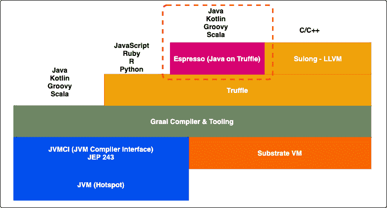
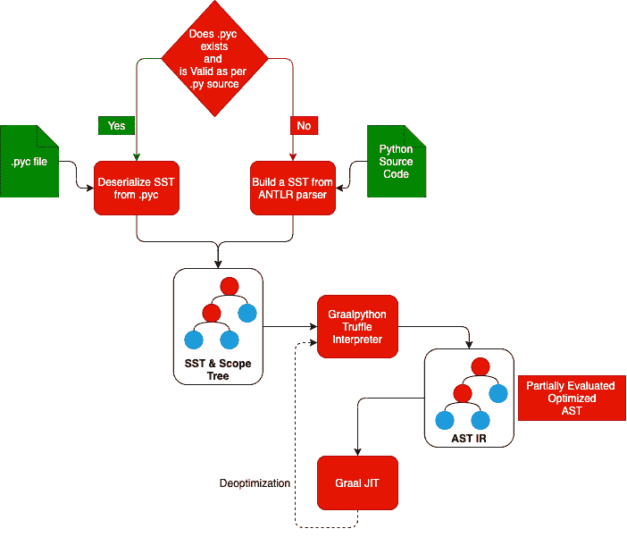
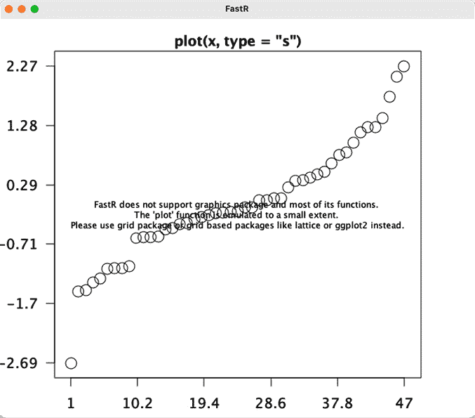

# 第十章: GraalVM 多语言支持 – 在 Truffle、Python 和 R 上运行的 Java

在上一章中，我们介绍了 JavaScript 和 Node.js 解释器以及语言间的互操作性。在本章中，我们将介绍其他语言实现，例如以下内容：

+   Java on Truffle（也称为 Espresso）：在 Truffle 上运行的 Java 实现

+   GraalPython：Python 语言解释器实现

+   FastR：R 语言解释器实现

所有这些语言实现目前都处于*实验性*阶段，因此在撰写本书时并未发布用于生产的版本。然而，我们将探讨其功能和构建一些代码来理解各种概念。

在本章中，我们将涵盖以下主题：

+   理解 Python、R 和 Java/Truffle 解释器

+   了解和探索语言互操作性

+   理解这些各种语言解释器的兼容性和限制

到本章结束时，你将获得使用 Python、R 和 Java/Truffle 解释器构建多语言应用程序的实践经验。

# 技术要求

本章需要以下内容才能跟随各种编码/实践部分：

+   GraalVM 的最新版本。

+   各种语言的 Graal 运行时。我们将在本章中介绍如何安装和运行这些运行时。

+   访问 GitHub：有一些示例代码片段，可在 Git 仓库中找到。代码可以从以下链接下载：[`github.com/PacktPublishing/Supercharge-Your-Applications-with-GraalVM/tree/main/Chapter08`](https://github.com/PacktPublishing/Supercharge-Your-Applications-with-GraalVM/tree/main/Chapter08)。

+   本章的“代码实战”视频可以在[`bit.ly/3fj2iIr`](https://bit.ly/3fj2iIr)找到。

# 理解 Espresso（Java on Truffle）

GraalVM 21.0 是一个重大版本，引入了一个名为 Java on Truffle 的新客机语言运行时。在此之前，我们有选择使用 HotSpot（我们在*第二章*，*JIT、HotSpot 和 GraalJIT*）运行 Java，在 Graal JIT（我们在*第四章*，*Graal 即时编译器*）上运行，或者使用 Graal AOT（我们在*第五章*，*Graal 预编译器及原生图像*）作为原生图像运行 Java。在 GraalVM 21.0 中，Java on Truffle 是新的运行时，可以运行 Java。它的代号为 Espresso。这仍然处于*实验性*阶段，在撰写本书时并未准备好用于生产。在本节中，我们将了解如何使用这个新的运行时运行 Java 应用程序，以及这如何有助于多语言编程。

Espresso 是 JVM 的简化版本，但实现了 JVM 的所有核心组件，如字节码解释器、字节码验证器、Java 本地接口、Java 调试协议等。Espresso 重新使用了 GraalVM 中的所有类和本地库。Espresso 实现了 `libjvm.so` API。以下图显示了 Espresso 栈架构：




图 8.1 – Espresso 栈架构

该图显示了 Espresso 在 Truffle 之上的实现方式。

## 为什么我们需要在 Java 上使用 Java？

在 Truffle（Espresso）上运行 Java 是反直觉的，你可能会想知道在 Graal 上添加额外层运行 Java 的优势。以下是一些运行 Espresso 的优势：

+   **热插拔方法、lambda 表达式和运行时/调试时的访问修饰符**：Espresso 提供了一种在调试期间运行时热插拔方法、lambda 表达式和访问修饰符的方式。这对于开发者来说是一个非常好的特性，因为它允许他们在调试过程中完全更改代码，而无需停止运行时和重新编译，更改将在运行时生效。这加快了开发者的工作流程并提高了生产力。同时，它还帮助开发者在进行代码提交前进行实验和尝试。

+   **运行不受信任的 Java 代码的沙盒**：Espresso 在 Truffle 上运行，类似于沙盒，可以运行时具有访问限制。这是一种通过提供特定访问权限来运行不受信任的 Java 代码的绝佳方式。请参阅*第七章*中的*“Java 中嵌入 JavaScript 代码”*部分，*GraalVM 多语言 - JavaScript 和 Node.js*，以了解更多关于如何配置访问限制的信息。

+   **使用相同的内存空间在 JVM 和非 JVM 之间实现互操作性**：在 Espresso 之前，Java 应用程序和非 JVM 动态客户端语言之间的数据传递不是在相同的内存空间中完成的。这可能是由于性能影响。使用 Espresso，我们可以在相同的内存空间中在 Java 和非 JVM 客户端语言之间传递数据。这提高了应用程序的性能。

+   **利用 Truffle 工具和仪器**：在 Truffle 上运行 Java 将有助于使用所有使用 Truffle 仪器开发的分析、诊断和调试工具。（请参阅*第六章*中的*“理解 Truffle 仪器”*部分，*Truffle – 概述*。）

+   `native-image`。

+   **运行混合版本的 Java**：Espresso 提供了所需的隔离层，以便运行用 Java 8 编写的代码，使其能够在 Java 11 上运行。Java 8 代码可以在 Espresso 上运行，而 Espresso 可能正在运行 GraalVM Java 11。这有助于在不更改代码的情况下运行旧代码，并且可能是谨慎地现代化代码的步骤，而不是我们在从旧版本的 Java 迁移到新版本的 Java 时采用的爆炸式现代化方法。

现在我们来安装和运行简单的 Java 代码在 Espresso 上。

## 安装和运行 Espresso

Espresso 是一个可选的运行时环境；它必须通过 Graal Updater 工具单独下载和安装。以下是安装 Espresso 的命令：

```java
gu install espresso
```

为了测试 Espresso 是否已安装，让我们执行一个简单的 `HelloEspresso.java` 应用程序。这是一个非常简单的 `Hello World` 程序，它打印一条消息。查看以下 `HelloEspresso.java` 的代码：

```java
public class HelloEspresso {
    public static void main(String[] args) {
        System.out.println("Hello Welcome to Espresso!!!");
    }
}
```

让我们使用 `javac` 编译这个应用程序，并使用以下命令运行它：

```java
javac HelloEspresso.java
```

要在 Truffle 上运行 Java，我们只需将 `-truffle` 作为命令行参数传递给 `java`。运行此命令后，我们应该看到以下输出：

```java
java -truffle HelloEspresso
Hello Welcome to Espresso!!!
```

这验证了安装。我们还可以使用 `-jar` 参数与 `-truffle` 一起运行 JAR 文件。现在让我们探索 Espresso 的多语言功能。

## 探索 Espresso 与其他 Truffle 语言的互操作性

Espresso 是基于 Truffle 构建的，并实现了 Truffle 多语言和互操作性 API。在本节中，我们将探索这些功能。

在我们开始使用 polyglot 功能之前，我们必须安装 Espresso polyglot 功能。要安装 Espresso polyglot 功能，我们可能需要下载 Espresso JAR 文件。您可以在 [`www.oracle.com/downloads/graalvm-downloads.html`](https://www.oracle.com/downloads/graalvm-downloads.html) 找到最新版本。

以下截图显示了在撰写本书时我们需要下载的 JAR 文件：

![图 8.2 – Java 在 Truffe JAR 文件下载

![img/Figure_8.2_B16878.jpg]

图 8.2 – Java 在 Truffe JAR 文件下载

下载此文件后，我们可以通过运行以下命令来安装它：

```java
sudo gu install -L espresso-installable-svm-svmee-java11-darwin-amd64-21.0.0.2.jar
```

安装成功后，我们必须重新构建 `libpolyglot` 本地镜像，以包含 Espresso 库。这个库是运行 polyglot 支持所必需的：

```java
sudo gu rebuild-images libpolyglot -cp ${GRAALVM_HOME}/lib/graalvm/lib-espresso.jar
```

这将重新构建 `libpolyglot` 本地镜像。我们现在可以使用 Espresso 的多语言功能了。让我们在下一节中探索这些功能。

## 探索 Espresso 与其他 Truffle 语言的互操作性

如你所知，Espresso 实现了 Truffle 实现框架，而 `com.oracle.truffle.espresso.polyglot.Polyglot` 类实现了 Espresso 中的多语言支持。像任何其他客户端语言一样，我们在命令行参数中使用 `-polyglot` 来让 Truffle 知道如何创建多语言上下文。Espresso 将一个 `Polyglot` 对象注入到代码中，可以用来与其他语言进行交互。让我们通过运行以下代码来探索使用 Espresso 的多语言编程：

```java
import com.oracle.truffle.espresso.polyglot.Polyglot;
public class EspressoPolyglot {
    public static void main(String[] args) {
        try {
            Object hello = Polyglot.eval("js",                "print('Hello from JS on Espresso');");
        } catch (Exception e) {
            e.printStackTrace();
        }
    }
}
```

让我们理解前面的代码。`Polyglot` 对象为运行动态语言提供上下文。`Polyglot.eval()` 方法运行外语言代码。第一个参数表明它是 JavaScript 代码，第二个参数是我们想要执行的实际的 JavaScript 代码。让我们使用以下命令来编译此代码：

```java
javac -cp ${GRAALVM_HOME}/languages/java/lib/polyglot.jar  EspressoPolyglot.java
```

在此命令中，我们明确地将 `polyglot.jar` 文件传递到 `-cp` 参数（`CLASSPATH`）中。`polyglot.jar` 包含了 Espresso 的所有多语言实现，包括 `com.oracle.truffle.espresso.polyglot.Polyglot` 的导入。

现在我们将在 Espresso 上运行 Java 应用程序。如果我们想在 Espresso 上运行它，应该传递 `-truffle` 参数，如果不这样做，它将在主机 JVM 上运行。我们可以看到以下输出：

```java
java -truffle --polyglot EspressoPolyglot
[To redirect Truffle log output to a file use one of the following options:
* '--log.file=<path>' if the option is passed using a guest language launcher.
* '-Dpolyglot.log.file=<path>' if the option is passed using the host Java launcher.
* Configure logging using the polyglot embedding API.]
Hello from JS on Espresso
```

同样，我们可以调用其他语言代码。Java 是一种强类型语言，与 Truffle 上的其他动态类型语言不同。当我们交换 Espresso（Truffle 上的 Java）和其他动态类型语言（如 JavaScript、Python 等）之间的数据时，我们需要一种方法来转换数据类型。`polyglot` 对象提供了使用 `Polyglot.cast()` 方法转换数据的方式。让我们通过以下代码使用一个简单的应用程序来理解如何转换数据：

```java
import com.oracle.truffle.espresso.polyglot.Polyglot;
import com.oracle.truffle.espresso.polyglot.Interop;
```

导入 `Polyglot` 和 `Interop` 类。`Polyglot` 类帮助我们运行客户端语言，而 `Interop` 类实现了 Truffle 互操作性 API，它抽象了客户端语言之间的数据类型。Truffle 定义了一个互操作性协议，它对 Truffle 语言、工具和嵌入器之间如何进行数据和消息（方法调用）交换提供了明确的规范：

```java
public class EspressoPolyglotCast {
    public static void main(String[] args) {
        try {
            Object stringObject = Polyglot.eval("js",                "'This is a JavaScript String'");
            Object integerObject = Polyglot.eval("js",                "1000");
            Object doubleObject = Polyglot.eval("js",                "10.12345");
            Object arrayObject = Polyglot.eval("js",                "[1234, 10.2233, 'String element',400,500,                    'Another Sttring element']");
            Object booleanObject = Polyglot.eval("js",                 "10 > 5");
```

在前面的代码片段中，我们正在评估各种返回字符串、整数、双精度浮点数、整数数组和一个布尔值的 JavaScript 代码片段。这些值被分配给一个通用的 `Object`，然后稍后使用 `Polyglot.cast()` 方法转换为相应的 Java 类型 `String`、`Integer`、`Double`、`Integer[]` 和 `Boolean` 对象，如以下代码片段所示：

```java
            String localStringObject =                Polyglot.cast(String.class, stringObject);
            Integer localIntegerObject =                Polyglot.cast(Integer.class, integerObject);
            Double localDoubleObject =                Polyglot.cast(Double.class, doubleObject);
            Boolean localBooleanObject =                Polyglot.cast(Boolean.class, booleanObject);
            System.out.println("\nString Object : "                + localStringObject                     + ", \nInteger : " + localIntegerObject                     + ", \nDouble : " + localDoubleObject                     + ", \nBoolean : " + localBooleanObject); 
```

接下来，我们将打印这些值。为了处理数组，让我们使用 `Interop` 类来获取数组对象的信息，例如使用 `Interop.getArraySize()` 获取数组的大小，并使用 `Interop.readArrayElement()` 遍历数组。`Interop` 还提供了一种检查对象类型并提取特定数据类型值的方法。在我们的例子中，我们评估了一个包含整数、双精度浮点数和字符串对象的 JavaScript 数组。我们将使用 `Interop.fitsInInt()`、`Interop.fitsInDouble()` 和 `Interop.isString()` 方法来检查类型，并相应地使用 `Interop.asInt()`、`Interop.asDouble()` 和 `Interop.asString()` 方法提取值。以下是一个代码片段：

```java
            long sizeOfArray =                Interop.getArraySize(arrayObject);
            System.out.println(            "\n Array of objects with Size : " + sizeOfArray );
            for (int i=0; i<sizeOfArray; i++) {
                Object currentElement =                    Interop.readArrayElement
                    (arrayObject, i);
                if (Interop.fitsInInt(currentElement)) {
                    System.out.println("Integer Element: "                       +Interop.asInt(currentElement));
                }
                if (Interop.fitsInDouble(currentElement)) {
                    System.out.println("Double Element: "                        + Interop.asDouble(currentElement));
                }
                if (Interop.isString(currentElement)) {
                    System.out.println("String Element: "                        + Interop.asString(currentElement));
                }
            }
        } catch (Exception e) {
            e.printStackTrace();
        }
    }
}
```

这些值随后被打印出来。让我们编译并运行这个应用程序。以下是其输出：

```java
javac -cp ${GRAALVM_HOME}/languages/java/lib/polyglot.jar  EspressoPolyglotCast.java 
espresso git:(main) java -truffle --polyglot EspressoPolyglotCast                                        
String Object : This is a JavaScript String, 
Integer : 1000, 
Double : 10.12345, 
Boolean : true
Array of objects with Size : 6
Integer Element: 1234
Double Element: 1234.0
Double Element: 10.2233
String Element: String element
Integer Element: 400
Double Element: 400.0
Integer Element: 500
Double Element: 500.0
String Element: Another String element
```

在输出中，我们可以看到如何将动态类型语言（JavaScript）捕获在通用的 `Object` 中，然后将其转换为特定类型。我们还可以使用 `Polyglot.isForeignObject(<object>)` 来检查传递的对象是本地对象还是外部对象。

我们看到了如何从 Espresso 中调用其他 Truffle 语言，就像使用 `Context polyglot = Context.newBuilder().allowAllAccess(true).build()` 调用其他语言一样，并使用绑定（参考 *第七章*，*GraalVM Polyglot - JavaScript 和 Node.js*) 交换数据和调用方法。

Java on Truffle Espresso 目前处于非常早期的版本，并且在撰写本书时处于实验阶段。目前存在许多限制，例如不支持 JVM 工具接口和 Java 管理扩展。在此阶段甚至存在许多性能问题。请参阅 [`www.graalvm.org/reference-manual/java-on-truffle/`](https://www.graalvm.org/reference-manual/java-on-truffle/) 获取最新更新。

现在让我们看看机器学习中最重要的两种语言 – Python 和 R。

# 理解 GraalPython – Python Truffle 解释器

GraalVM 提供了一个 Python 运行时环境。Python 运行时环境符合 3.8 版本，并且在撰写本书时仍处于 *实验* 阶段。在本节中，我们将安装并理解 Python 在 Truffle 和 Graal 上的运行方式。我们还将构建一些示例代码，以了解 Graal Python 的互操作性功能。

## 安装 Graal Python

Graal Python 是一个可选的运行时环境，并且默认情况下不会与 GraalVM 一起安装。要下载它，您必须使用 Graal Updater 工具。以下命令下载并安装 Graal Python：

```java
gu install python
```

为了验证安装，让我们运行简单的 Python 代码。以下是 `HelloGraalPython.py` 的源代码：

```java
print("Hello Graal Python")
```

这是一个非常简单的 Hello World 应用程序，其中我们正在打印消息。让我们使用 `graalpython` 运行这个应用程序：

```java
graalpython HelloGraalPython.py
```

当我们执行前面的命令时，我们应该看到下面的输出：

```java
graalpython HelloGraalPython.py 
Hello Graal Python
```

上述输出显示应用程序正在运行，`graalpython`正在工作。

`graalpython`也支持虚拟环境。以下命令将创建一个虚拟环境：

```java
graalpython -m venv <name-of-virtual-env>
```

此命令将创建一个虚拟环境目录，这将是一个隔离的环境。GraalPython 还附带`ginstall`工具，用于安装支持的库。以下命令将为`graalpython`安装`numpy`。也可以使用`pip`安装库：

```java
graalpython -m ginstall install numpy
```

现在让我们了解 GraalPython 的编译和解释器管道是如何工作的。

## 理解 graalpython 编译和解释器管道

Graalpython 的编译/解释器管道略有不同。为了提高解析性能，解析后，Graalpython 使用一个名为`.pyc`文件的中间表示形式，这样做是为了加快解析速度。下次我们运行 Python 程序时，`Graalpython`会查找`.pyc`文件并验证文件是否存在，以及它是否与 Python 源代码匹配；如果是，它将反序列化该文件以构建 SST 和 ST。否则，它将使用 ANTLR 进行完整解析。以下图显示了完整流程。该图并未捕捉所有细节。请参阅*第六章*中“探索 Truffle 解释器/编译器管道”部分*第六章*，*Truffle – 概述*，以获取关于 Truffle 解释器和 Graal JIT 如何执行代码的更详细解释：



图 8.3 – Graalpython 编译/解释器管道

一旦创建了 SST 和 ST，它们随后将被转换为 AST 中间表示形式并进行优化。在部分评估之后，最终的专用 AST 将被提交给 GraalJIT 进行进一步执行，然后继续常规流程，如*第六章*中“探索 Truffle 解释器/编译器管道”部分所述*第六章*，*Truffle – 概述*。

到目前为止，我们已经学习了如何使用 GraalPython 运行 Python 程序以及 GraalPython 如何使用 Truffle 和 GraalJIT 优化解析和代码优化。现在让我们探索 GraalPython 的多语言互操作性功能。

## 探索 Java 和 Python 之间的互操作性

在本节中，我们将通过示例 Java 代码探索 Java 和 Python 之间的互操作性。以下代码计算斐波那契数的和。此类有一个`findFibonacci()`方法，它接受我们需要计算的斐波那契数的数量，并返回这些斐波那契数的数组：

```java
public class FibonacciCalculator{
    public int[] findFibonacci(int count) {
        int fib1 = 0;
        int fib2 = 1;
        int currentFib, index;
        int [] fibNumbersArray = new int[count];
        for(index=2; index < count; ++index ) {
            currentFib = fib1 + fib2;
            fib1 = fib2;
            fib2 = currentFib;
            fibNumbersArray[index - 1] = currentFib;
        }
        return fibNumbersArray;
    }
    public static void main(String args[]) {    
        FibonacciCalculator fibCal =             new FibonacciCalculator();
        int[] fibs = fibCal.findFibonacci(10);
    }
}
```

现在让我们从 Python 代码中调用`findFibonacci()`方法。以下是从 Java 类返回的数组中调用该方法并迭代的 Python 代码：

```java
import java
import time
fib = java.type("FibonacciCalculator")()
result = fib.findFibonacci(10)
print("Fibonacci number ")
for num in result:
    print(num)
```

在前面的代码中，我们使用 `java.type()` 加载 Java 类，并直接使用返回的值作为 Python 对象来调用 `findFibonacci()` 方法，通过传递一个参数。然后我们能够解析方法返回的结果。让我们编译 Java 代码并运行 Python 代码。以下显示了终端输出：

```java
javac FibonacciCalculator.java
graalpython --jvm --vm.cp=. FibCal.py
Fibonacci number 
0
1
2
3
5
8
13
21
34
```

我们可以看到，我们能够调用 Java 方法并获取一个整数数组，然后遍历它，而不需要任何额外的转换代码。

现在，让我们创建一个简单的 Python 函数，该函数使用 NumPy 对数据集进行快速分析。NumPy 是一个用于数组/矩阵操作的高性能 Python 库，在机器学习中得到广泛应用。为了欣赏 Graal 多语言的价值，想象一个用例，其中我们有一个包含各种心脏病病例信息的数据集，按年龄、性别、胆固醇水平、胸痛程度等组织，我们想了解在胸痛程度达到 3 级（高）后心脏病发作的人的平均年龄。这就是本节我们将要构建的内容，以了解 Java 和 Python 之间的多语言互操作性，以及我们如何使用 NumPy Python 库。

我们将使用 Kaggle 上提供的用于心脏病分析的数据集（[`www.kaggle.com/rashikrahmanpritom/heart-attack-analysis-prediction-dataset`](https://www.kaggle.com/rashikrahmanpritom/heart-attack-analysis-prediction-dataset)）。这个数据集包含了各种心脏病病例的信息，包括年龄、胆固醇水平、性别、胸痛程度等。以下是执行分析的 Python 代码：

```java
import site
import numpy as np
import polyglot as poly
def heartAnalysis():
    heartData = np.genfromtxt('heart.csv', delimiter=',')
    dataOfPeopleWith3ChestPain =         heartData[np.where(heartData[:,2]>2)]
    averageAgeofPeopleWith3ChestPain =        np.average(dataOfPeopleWith3ChestPain[:,0])
    # Average age of people who are getting level 3 and     greater chest pain
    return averageAgeofPeopleWith3ChestPain
poly.export_value("hearAnalysis", heartAnalysis)
```

在前面的代码中，我们将 CSV 文件加载到一个矩阵中。在这里，我们特别关注第三列（索引为 `2`）。我们正在加载所有第三列值大于 2 的行，并将其存储在另一个变量中。然后我们计算这个矩阵的平均值并返回它。如果我们不得不在 Java 中做同样的事情，这将需要大量的代码。现在，让我们从 Java 中调用这段代码。

在下面的 Java 代码中，我们将通过 `Binding` 对象使用键导入函数定义。以下是完整的 Java 代码：

```java
public class NumPyJavaExample {
    public void callPythonMethods() {
        Context ctx =
        Context.newBuilder().allowAllAccess(true).build();
        try {
            File fibCal = new File("./numpy-example.py");
            ctx.eval(Source.newBuilder("python",                fibCal).build());
            Value hearAnalysisFn =                ctx.getBindings("python")                    .getMember("heartAnalysis");
            Value heartAnalysisReport =                hearAnalysisFn.execute();
            System.out.println(                "Average age of people who are getting level 3                     and greater chest pain :" +                        heartAnalysisReport.toString());
        }   catch (Exception e) {
            System.out.println("Exception : " );
            e.printStackTrace();
        }
    }
    public static void main(String[] args) {
        NumPyJavaExample obj = new NumPyJavaExample();
        obj.callPythonMethods();
    }
}
```

在前面的 Java 代码中，我们创建了一个 `Context` 对象，并在 `numpy-example.py` 中评估 Python 代码。然后我们通过绑定访问函数定义，调用 Python 函数并能够获取值。我们打印返回的值。以下是运行此 Java 代码的输出：

```java
$ java NumPyJavaExample
Average age of people who are getting level 3 and greater chest pain :55.869565217391305
```

在前面的输出中，我们可以看到第一次调用花费了时间，然而，随后的调用几乎不需要时间就能执行。这不仅展示了我们如何从 Java 代码中与 Python 代码进行互操作，还展示了 Truffle 和 Graal 如何优化执行。

在本节中，我们探讨了 Java 和 Python 的互操作性。在下一节中，我们将探讨 Python 与动态语言之间的互操作性。

## 探索 Python 与其他动态语言之间的互操作性

要探索 Python 与其他动态语言之间的互操作性，让我们使用上一节中使用的相同 `numpy-example.py` 文件。让我们从 JavaScript 中调用此方法。

以下是在 JavaScript 中调用 Python 代码的示例：

```java
function callNumPyExmple() {
    Polyglot.evalFile('python', './numpy-example.py');
    heartAnalysis = Polyglot.import('heartAnalysis');
    result = heartAnalysis();
    return result;
}
result = callNumPyExmple();
print ('Average age of people who are getting level 3 and     greater chest pain : '+  String(result));
```

在前面的代码中，我们可以看到我们是如何使用 `Polyglot.import()` 函数在 JavaScript 中导入 Python 的 `heartAnalysis()` 函数的。这返回了我们打印的平均值。让我们运行此代码，我们可以看到以下结果：

```java
$ js --polyglot numpy-caller.js
Average age of people who are getting level 3 and greater chest pain : 55.869565217391305
```

现在我们来创建 JavaScript 代码，它将包含计算平方的函数。为了演示如何从 Python 调用 JavaScript 代码，以下是 JavaScript 代码：

```java
var helloMathMessage = " Hello Math.js";
function square(a) {
    return a*a;
}
Polyglot.export('square', square);
Polyglot.export('message', helloMathMessage)
```

这是一个非常简单的 JavaScript 函数，它返回传入值的平方。我们还导出了 `square()` 函数和一个变量 `message`，它携带 `helloMathMessage` 变量的值。

现在，让我们从 Python 代码中调用此方法。以下是将导入和调用前面 JavaScript 方法的 Python 代码：

```java
import polyglot
polyglot.eval(path="./math.js", language="js")
message = polyglot.import_value('message')
square = polyglot.import_value('square')
print ("Square numbers by calling JS->Python: " +     str(square(10, 20)))
print ("Hello message from JS: " + message)
```

在此代码中，我们使用 Python 的 `polyglot` 对象来评估 JavaScript 文件。然后我们通过调用 `polyglot.import_value()` 函数导入所有导出的函数/变量，使用 JavaScript 导出函数或变量时使用的相同键。然后我们能够调用这些函数并访问 `message` 变量并打印值。以下是在运行前面的代码后得到的输出：

```java
$ graalpython --jvm --polyglot mathUser.py
Square numbers by calling JS->Python: 100
Hello messagr from JS:  Hello Math.js  
```

我们可以看到 Python 代码是如何导入和调用 JavaScript 代码的。这证明了双向互操作性。代码与其他语言，如 R 和 Ruby，非常相似。

在本节中，我们探讨了 Python 解释器如何与 Truffle 一起在 GraalVM 上运行以实现最佳性能。现在让我们探索并理解 GraalVM 上的 R 语言解释器。

# 理解 FastR – R Truffle 解释器

GraalVM 为兼容 GNU 的 R 运行时提供了一个 R Truffle 解释器。此运行时支持 R 程序和 **REPL**（**读取-评估-打印循环**）模式，在此模式下，我们可以在编写代码的同时快速测试代码。FastR 是开发此 R 运行时的项目。

## 安装和运行 R

就像 Graal Python 一样，R 运行时默认不包含在 GraalVM 中。我们必须使用 Graal Updater 下载和安装它。使用以下命令下载和安装 R 和 Rscript：

```java
gu install r
```

要运行 R，我们需要 OpenMP 运行时库。在 Ubuntu 上可以使用`apt-get install libcomp1`安装，在 Oracle Linux 上使用`yum install libcomp`安装。在 macOS 上默认已安装该库。除此之外，如果 R 代码中有 C/C++/Fortran 代码，您还需要 C/C++/Fortran。在撰写本书时，R 还处于实验阶段，因此并非所有功能都得到支持。请参阅 GraalVM 文档（[`docs.oracle.com/en/graalvm/enterprise/20/docs/reference-manual/r/`](https://docs.oracle.com/en/graalvm/enterprise/20/docs/reference-manual/r/)）以获取最新信息。

现在我们来测试 R。为了探索 R 解释器，让我们以交互式模式运行它。以下终端输出显示了测试 R 安装的交互式模式：

```java
R
R version 3.6.1 (FastR)
Copyright (c) 2013-19, Oracle and/or its affiliates
Copyright (c) 1995-2018, The R Core Team
Copyright (c) 2018 The R Foundation for Statistical Computing
Copyright (c) 2012-4 Purdue University
Copyright (c) 1997-2002, Makoto Matsumoto and Takuji Nishimura
All rights reserved.
FastR is free software and comes with ABSOLUTELY NO WARRANTY.
You are welcome to redistribute it under certain conditions.
Type 'license()' or 'licence()' for distribution details.
R is a collaborative project with many contributors.
Type 'contributors()' for more information.
Type 'q()' to quit R.
[Previously saved workspace restored]
```

我们看到我们正在使用先前的输出中列出的 FastR GraalVM 版本。现在让我们通过运行一些 Python 命令来测试我们的 FastR 解释器是否正常工作，如下所示：

```java
> 1+1
[1] 2
> abs(-200)
[1] 200
```

我们可以看到它正在交互式地提供结果。现在让我们绘制一个简单的示例。最好的方法是调用`example()`，这将显示图表，如下所示：

```java
> example (plot)
plot> require(stats) # for lowess, rpois, rnorm
plot> plot(cars)
plot> lines(lowess(cars))
NULL
plot> plot(sin, -pi, 2*pi) # see ?plot.function
NULL
plot> ## Discrete Distribution Plot:
plot> plot(table(rpois(100, 5)), type = "h", col = "red", lwd = 10,
plot+      main = "rpois(100, lambda = 5)")
NULL
plot> ## Simple quantiles/ECDF, see ecdf() {library(stats)} for a better one:
plot> plot(x <- sort(rnorm(47)), type = "s", main = "plot(x, type = \"s\")")
plot> points(x, cex = .5, col = "dark red")
```

这将弹出一个包含绘制图表的窗口。以下图显示了弹出的图表截图：



图 8.4 – R 绘图输出截图

在撰写本书时，运行先前的`plot`命令时出现了一些警告。这些警告列出了 FastR 的一些限制。然而，这可能在未来的版本中发生变化。以下为出现的警告：

```java
NULL
Warning messages:
1: In lines.default(lowess(cars)) :
  lines.default not supported. Note: FastR does not support graphics package and most of its functions. Please use grid package or grid based packages like lattice instead.
2: In plot.function(sin, -pi, 2 * pi) :
  plot.function not supported. Note: FastR does not support graphics package and most of its functions. Please use grid package or grid based packages like lattice instead.
3: In axis(...) :
  axis not supported. Note: FastR does not support graphics package and most of its functions. Please use grid package or grid based packages like lattice instead.
4: In points.default(x, cex = 0.5, col = "dark red") :
  points.default not supported. Note: FastR does not support graphics package and most of its functions. Please use grid package or grid based packages like lattice instead.
>
```

现在我们可以看到 R 运行正常，现在让我们探索 FastR 的互操作性功能。

## 探索 R 的互操作性

在本节中，为了探索多语言与 R 的互操作性，我们将运行一些内联 JavaScript，并加载示例 JavaScript 代码以及导入导出的函数和变量。我们将使用 R 交互式模式来完成此操作，以便更容易理解。要在多语言模式下运行 R，我们必须传递`--polyglot`参数。以下为命令：

```java
R --polyglot
```

这将启动 R 的交互式运行时，并输出以下内容：

```java
R version 3.6.1 (FastR)
Copyright (c) 2013-19, Oracle and/or its affiliates
Copyright (c) 1995-2018, The R Core Team
Copyright (c) 2018 The R Foundation for Statistical Computing
Copyright (c) 2012-4 Purdue University
Copyright (c) 1997-2002, Makoto Matsumoto and Takuji Nishimura
All rights reserved.
FastR is free software and comes with ABSOLUTELY NO WARRANTY.
You are welcome to redistribute it under certain conditions.
Type 'license()' or 'licence()' for distribution details.
R is a collaborative project with many contributors.
Type 'contributors()' for more information.
Type 'q()' to quit R.
[Previously saved workspace restored]
> 
```

现在，让我们从简单的内联 JavaScript 开始：

```java
> x <- eval.polyglot('js','[100,200,300,400]')
> print(x)
[polyglot value]
[1] 100 200 300 400
> print(x[3])
[1] 300
```

在先前的交互会话中，我们正在调用`eval.polyglot()`函数，其中包含语言 ID 和表达式。在这种情况下，我们将其指定为 JavaScript，语言 ID 为`js`，然后传递一个元素数组。然后我们打印数组及其第三个元素。`eval.polyglot()`函数提供多语言上下文并运行其他语言代码。现在让我们加载一个简单的 JavaScript 代码文件。以下为`math.js`的代码：

```java
var helloMathMessage = " Hello Math.js";
function add(a, b) {
    print("message from js: add() called");
    return a+b;
}
function subtract(a, b) {
    print("message from js: subtract() called");
    return a-b;
}
function multiply(a, b) {
    print("message from js: multiply() called");
    return a*b;
}
Polyglot.export('add', add);
Polyglot.export('subtract', subtract);
Polyglot.export('multiply', multiply);
Polyglot.export('message', helloMathMessage)
```

前面的代码非常直接。我们定义了`add()`、`subtract()`和`multiply()`函数以及一个简单的变量`message`，它有一个字符串值`Hello Math.js`。然后我们使用`Polyglot.export()`将其导出，以便其他语言可以访问这些函数和变量。

现在让我们加载这个 JavaScript 文件并执行导出的代码；我们将在交互模式下运行指令。你将在这里找到交互会话，其中解释了我们正在做什么：

```java
> mathjs <- eval.polyglot('js', path='/chapter8/r/math.js')
```

此指令加载 JavaScript 文件。确保路径已更新为包含 JavaScript 文件的精确路径。现在让我们将导出的函数和变量导入 R：

```java
> message <- import('message')
> add <- import('add')
> subtract <- import('subtract')
> multiply <- import('multiply')
```

在前面的说明中，我们正在使用`import()`函数导入导出的函数和变量。使用与 JavaScript 文件中导出时相同的字符串非常重要。这些导入被分配给一个变量。现在让我们调用这些函数并打印变量：

```java
> add(10,20)
message from js: add() called
[1] 30
> subtract(30,20)
message from js: subtract() called
[1] 10
> multiply(10,40)
message from js: multiply() called
[1] 400
> print(message)
[1] " Hello Math.js"
>
```

如你所见，我们可以调用 JavaScript 函数并打印变量。这展示了我们可以如何使用 JavaScript，但我们同样可以使用所有其他 Truffle 语言。现在让我们探索如何从 R 访问 Java 类。以下是`HelloRPolyglot`类的代码，我们将从 R 调用它：

```java
import org.graalvm.polyglot.Context;
import org.graalvm.polyglot.Value;
public class HelloRPolyglot {
    public String hello(String name) {
        System.out.println("Hello Welcome from hello");
        return "Hello Welcome from hello " + name;
    }
    public static void helloStatic() {
        System.out.println("Hello from Static hello()");
        try {
            Context polyglot = Context.create();
            Value array = polyglot.eval("js",                 "print('Hello from JS inline in HelloRPolyglot                     class')");
        } catch (Exception e) {
            e.printStackTrace();
        }
    }
    public static void main(String[] args) {
        HelloRPolyglot.helloStatic();
    }
}
```

让我们理解前面的代码。我们有一个静态方法`helloStatic()`，它调用内联 JavaScript，打印一条消息，我们还有一个另一个方法`hello()`，它接受一个参数并打印一条`hello`消息。

让我们编译并运行 Java 类以测试它是否运行正常。以下显示了控制台输出：

```java
javac HelloRPolyglot.java
java HelloRPolyglot
Hello Welcome to R Polyglot!!!
Hello from JS inline in HelloRPolyglot class
```

现在类运行正常，让我们开始 R 交互模式。这次，我们必须传递`--jvm`参数，让 R 运行时知道我们将使用 Java，并且还需要传递`--vm`参数，将`CLASSPATH`设置为包含 Java 类文件的当前目录：

```java
R --jvm --vm.cp=.        
R version 3.6.1 (FastR)
Copyright (c) 2013-19, Oracle and/or its affiliates
Copyright (c) 1995-2018, The R Core Team
Copyright (c) 2018 The R Foundation for Statistical Computing
Copyright (c) 2012-4 Purdue University
Copyright (c) 1997-2002, Makoto Matsumoto and Takuji Nishimura
All rights reserved.
FastR is free software and comes with ABSOLUTELY NO WARRANTY.
You are welcome to redistribute it under certain conditions.
Type 'license()' or 'licence()' for distribution details.
R is a collaborative project with many contributors.
Type 'contributors()' for more information.
Type 'q()' to quit R.
[Previously saved workspace restored]
>
```

现在 R 已加载，让我们运行调用 Java 类中`hello()`方法的指令。我们使用`java.type()`函数来加载类。以下是在线会话：

```java
> class <- java.type('HelloRPolyglot')
> print(class)
[polyglot value]
$main
[polyglot value]
$helloStatic
[polyglot value]
$class
[polyglot value]
```

在前面的交互会话中，我们可以看到类已成功加载，当我们打印类时，我们看到它列出了其中的各种方法。现在让我们创建这个类的实例。我们使用`new()`函数来做这件事。以下是在使用`new()`函数的交互会话的输出：

```java
> object <- new(class)
> print(object)
[polyglot value]
$main
[polyglot value]
$helloStatic
[polyglot value]
$class
[polyglot value]
$hello
[polyglot value]
```

在前面的代码中，我们可以看到对象已成功创建，因为它打印了类中的所有方法。现在让我们调用这些方法。我们将使用类来调用静态方法，并通过传递参数来调用`hello()`方法。以下是在线会话的输出：

```java
> class$helloStatic()
Hello from Static heloo()
Hello from JS inline in HelloRPolyglot class
NULL
> object$hello('FastR')
Hello Welcome from hello
[1] "Hello Welcome from hello FastR"
>
```

在前面的会话中，我们可以看到调用两个方法的输出。

让我们用一个现实生活中的例子来说明我们如何使用 R 绘制图表的强大功能，并在 Node.js 生成的网页中使用绘制的图表。在本书的早期章节中，我们使用了一个从 Kaggle 获取的数据集，其中包含心脏病数据。让我们使用这个数据集在由 Node.js 生成的网页上绘制一个比较人们年龄和胆固醇水平的图表。

让我们使用 npm init 初始化一个 Node.js 项目。以下是在控制台输出的输出，其中我们提供了项目的名称和其他项目参数：

```java
$ npm init
This utility will walk you through creating a package.json file.
It only covers the most common items, and tries to guess sensible defaults.
See `npm help init` for definitive documentation on these fields and exactly what they do.
Use `npm install <pkg>` afterwards to install a package and save it as a dependency in the package.json file.
Press ^C at any time to quit.
package name: (plotwithr-node)
version: (1.0.0)
description:
entry point: (plotWithR.js)
test command:
git repository:
keywords:
author:
license: (ISC)
About to write to /Users/vijaykumarab/AB-Home/Developer/GraalVM-book/Code/chapter8/r/plotWithR-node/package.json:
{
  "name": "plotwithr-node",
  "version": "1.0.0",
  "description": "",
  "main": "plotWithR.js",
  "scripts": {
    "test": "echo \"Error: no test specified\" && exit 1"
  },
  "author": "",
  "license": "ISC"
}
Is this OK? (yes)
```

这应该会生成一个 Node.js 模板。我们需要 Express.js 库来公开 REST 端点。现在让我们安装 express 库并使用 `--save` 来更新 `package.json` 文件，添加依赖项。以下是输出：

```java
$ npm install express --save
added 50 packages, and audited 51 packages in 2s
found 0 vulnerabilities
```

现在我们来编写 Node.js 代码来加载数据集（`heart.csv`）并将条形图渲染为 `scalar vector graph`（SVG）。为了绘图，我们将使用 Lattice 包（你可以在 [`www.statmethods.net/advgraphs/trellis.html`](https://www.statmethods.net/advgraphs/trellis.html) 找到更多关于这个库的详细信息）。

所以，以下是 Node.js 代码：

```java
const express = require('express')
const app = express()
app.get('/plot', function (req, res) {
  var text = ""
  text += Polyglot.eval('R',
    `svg();
     require(lattice);
     data <- read.csv("heart.csv", header = TRUE)
     print(barchart(data$age~data$chol,           main="Age vs Cholestral levels"))
     grDevices:::svg.off()
    `);
  res.send(text)
})
app.listen(3000, function () {
  console.log('Plot with R -  listening on port 3000!')
})
```

让我们分析代码来理解它。我们正在加载 `Express.js` 并定义一个 `'/plot'` 端点。我们使用 `Polyglot.eval()` 来运行我们的 R 代码。我们初始化 SVG 并加载 Lattice 包。然后我们加载 `heart.csv` 文件并将图表渲染为条形图，然后将生成的 SVG 响应添加到 HTML 响应中，作为 `/plot` 端点的响应。

现在我们来运行这段代码。以下是运行代码后的输出：

```java
node --jvm --polyglot plotWithR.js
Plot with R - listening on port 3000!
Loading required package: lattice
```

访问 http://locahost:3000/plot 来调用端点，在浏览器中。以下是一个输出截图：

![图 8.5 – 调用 /plot 的输出]

](img/Figure_8.5_B16878.jpg)

图 8.5 – 调用 /plot 的输出

R 是一种非常强大的用于统计计算和机器学习的语言。这为我们提供了在多种其他语言中嵌入 R 代码或调用 R 代码的机会。如果我们不得不在 Java 中执行相同的逻辑，可能需要付出很多努力。

# 摘要

在本章中，我们详细介绍了 Python、R 和 Java 在 Truffle 解释器中的实现方式。我们还探讨了这些语言提供的多语言互操作性功能，并附上了编码示例。我们了解了每种语言解释方式的不同。本章提供了一个实际操作指南，说明了如何在各种语言中运行代码和编写多语言应用程序。我们使用了非常简单的代码，以便你能够轻松理解概念和 API 以实现多语言应用程序。

你应该能够使用这些知识在 GraalVM 上编写多语言应用程序。尽管在撰写本书时，这些语言中的大多数仍然处于实验阶段，但它们提供了构建高性能多语言应用程序的绝佳机会。

在下一章中，你将获得丰富的实践经验和对多语言工作原理的理解，了解如何在 GraalVM 上构建 Python 和 R 应用程序，以及如何在这些程序之间进行交互。你还将对 GraalVM 的新运行时，Truffle 上的 Java 有一个良好的了解。

# 问题

1.  什么是 Truffle 上的 Java？

1.  Truffle 上的 Java 有什么优势？

1.  `Polyglot.cast()`方法有什么用途？

1.  SST 和 ST 是什么？

1.  `.pyc`文件是什么？

1.  GraalPython 中用于交换数据和函数定义的多语言绑定方法是什么？

1.  你如何在 R 中导入其他语言定义？

1.  你如何在 R 中加载 Java 类？

# 进一步阅读

+   GraalVM 企业版：[`docs.oracle.com/en/graalvm/enterprise/19/index.html`](https://docs.oracle.com/en/graalvm/enterprise/19/index.html)

+   GraalVM 语言参考：[`www.graalvm.org/reference-manual/languages/`](https://www.graalvm.org/reference-manual/languages/).
