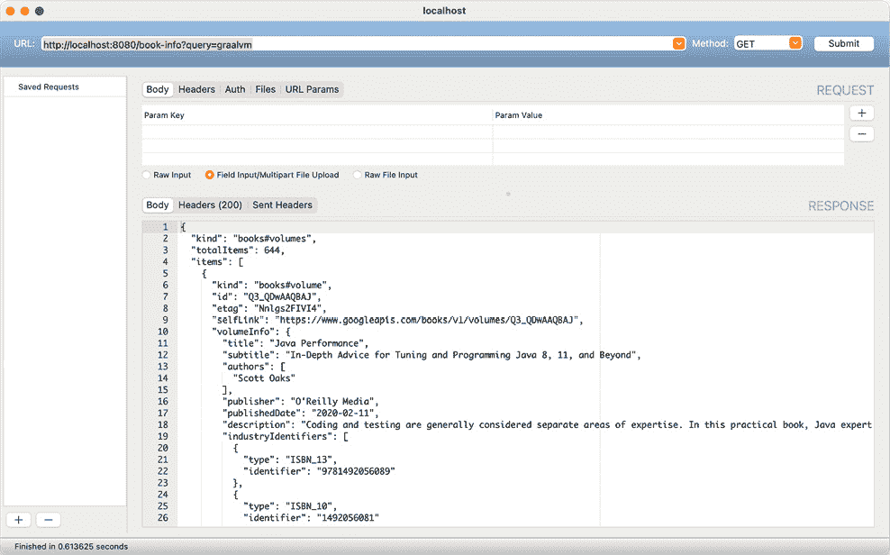

# 第十三章：*第十章*：使用 GraalVM 的微服务架构

在前面的章节中，我们探讨了 GraalVM 是如何建立在 Java 虚拟机之上，并提供高性能的多语言运行时。在本章中，我们将探讨 GraalVM 如何成为运行微服务的核心运行时。许多微服务框架已经在 GraalVM 上运行。我们将探讨一些流行的框架，并使用它们构建一个示例应用程序。我们还将探讨一个无服务器框架。我们将进行案例研究，看看我们如何设计解决方案。

在本章结束时，您将深入了解如何将应用程序打包为容器，运行 GraalVM，以及如何使用 Micronaut、Quarkus 和 Spring Boot 构建微服务应用程序。本章假设您对 Java 编程语言有良好的理解，并对构建 Java 微服务有一些了解。

本章将涵盖以下主题：

+   GraalVM 微服务架构概述

+   了解 GraalVM 如何帮助构建微服务架构

+   构建微服务应用程序

+   一个案例研究，帮助理解如何解决基于 GraalVM 构建的微服务应用程序

+   使用 Spring Boot、Micronaut、Quarkus 和 Fn Project 无服务器框架实现微服务

# 技术要求

本章提供了构建 Java 微服务的实战指南。这需要安装和设置一些软件。以下是一个先决条件列表：

+   **源代码**: 本章中提到的所有源代码都可以从 Git 仓库[`github.com/PacktPublishing/Supercharge-Your-Applications-with-GraalVM/tree/main/Chapter10`](https://github.com/PacktPublishing/Supercharge-Your-Applications-with-GraalVM/tree/main/Chapter10)下载。

+   **GraalVM**: 需要安装 GraalVM。有关安装和设置 GraalVM 的详细说明，请参阅[`www.graalvm.org/docs/getting-started/#install-graalvm`](https://www.graalvm.org/docs/getting-started/#install-graalvm)。

+   **Spring Boot**: 请参阅[`spring.io/guides/gs/spring-boot/`](https://spring.io/guides/gs/spring-boot/)获取有关如何设置和使用 Spring Boot 的更多详细信息。

+   **Micronaut**: 我们将使用 Micronaut 框架来构建代码。请参阅[`micronaut.io/download/`](https://micronaut.io/download/)获取有关如何下载和设置 Micronaut 的更多详细信息。

+   **Quarkus**: 我们将使用 Quarkus 框架来构建微服务。请参阅[`quarkus.io/`](https://quarkus.io/)获取有关如何设置和使用 Quarkus 的更多详细信息。

+   **fn project**: 我们将使用 fn project 构建无服务器应用程序/函数。请参阅[`fnproject.io/`](https://fnproject.io/)获取有关如何下载、安装和设置 fn project 的更多详细信息。

+   本章的“代码实战”视频可以在[`bit.ly/3f7iT1T`](https://bit.ly/3f7iT1T)找到。

那么，让我们开始吧！

# 微服务架构概述

微服务是最受欢迎的架构模式之一，并且已被证明是云原生应用程序开发的最佳架构模式。微服务模式有助于将应用程序分解和结构化为更小、更易于管理和自包含的组件，这些组件通过标准服务接口公开功能。以下是一些微服务架构模式的优点：

+   **松耦合**：由于应用程序被分解为提供标准接口的服务，因此应用程序组件可以独立管理、升级和修复，而不会影响其他依赖组件。这有助于根据不断增长的业务需求和变化轻松更改应用程序逻辑。

+   **可管理性**：由于组件是自包含的，因此管理这些应用程序非常容易。组件可以由较小的团队负责开发，并且可以独立部署，而无需部署整个应用程序。这有助于使用 DevOps 进行快速开发和部署。

+   **可扩展性**：可扩展性是云原生应用程序的关键要求之一。在单体应用中，可扩展性是一个问题，因为即使我们只需要扩展功能的一部分，我们也必须扩展整个应用程序。例如，在需求高峰期间，我们可能希望比零售门户的其他任何功能更多地扩展订单、购物车和目录服务。在单体应用中这是不可能的，但如果将这些组件分解为独立的微服务，则可以轻松地单独扩展它们并设置自动扩展参数，以便根据需求进行扩展。这有助于更有效地利用云资源，同时降低成本。

让我们现在探讨 GraalVM 如何帮助构建高性能的微服务架构。

# 使用 GraalVM 构建微服务架构

GraalVM 非常适合微服务架构，因为它有助于构建具有较小内存占用和更快启动速度的高性能 Java 应用程序。微服务架构最重要的要求之一是较小的内存占用和更快的启动速度。GraalVM 是云中运行多语言工作负载的理想运行时。市场上已经有一些云原生框架，可以构建在 GraalVM 上运行优化的应用程序，包括 Quarkus、Micronaut、Helidon 和 Spring。

## 理解 GraalVM 容器

传统上，应用程序部署在预先配置和设置好的基础设施上，以便应用程序运行。该基础设施包括硬件和运行应用程序的软件平台。例如，如果我们需要运行一个 Web 应用程序，我们首先需要设置操作系统（例如 Linux 或 Windows）。Web 应用程序服务器（如 Tomcat、WebSphere）和数据库（如 MySQL、Oracle 或 DB2）设置在预定义的硬件基础设施上，然后应用程序部署在这些 Web 应用程序服务器之上。这需要花费很多时间，而且每次我们需要设置应用程序时，可能都要重复这种方法。

为了减少设置时间和使配置更容易管理，我们转向通过预包装应用程序、各种平台组件（如应用程序服务器、数据库等）和操作系统，将基础设施虚拟化，形成自包含的**虚拟机**（**VMs**）。（这些虚拟机不要与**Java 虚拟机**（**JVM**）混淆。JVM 更像是运行 Java 应用程序的平台。在此上下文中，虚拟机远不止是一个应用程序平台。）

虚拟化帮助解决了许多配置和部署问题。它还允许我们通过在同一台机器上运行多个虚拟机并更好地利用资源来优化硬件资源的利用率。虚拟机体积庞大，因为它们自带操作系统，难以快速部署、更新和管理。

容器化通过引入另一层虚拟化解决了这个问题。大多数现代架构都是基于容器的。容器是软件单元，它打包代码以及所有依赖和环境配置。容器是轻量级的独立可执行包，可以在容器运行时上部署。以下图表显示了虚拟机和容器之间的区别：


图 10.1 – 虚拟机与容器

GraalVM 是一个完美的应用程序平台（尤其是当它编译为原生代码时），可以与应用程序一起打包到同一个容器中。GraalVM 提供了最小的占用空间和更快的启动和执行速度，以便快速部署和扩展应用程序组件。

前面的图表显示了如何使用 GraalVM 对应用程序进行容器化。在先前的模型中，每个容器都有自己的虚拟机，该虚拟机具有内存管理、分析、优化（**JIT**）等逻辑。GraalVM 提供的是与容器运行时一起的通用运行时，仅将应用程序逻辑容器化。由于 GraalVM 还支持多种语言以及这些语言之间的互操作性，因此容器可以运行用多种语言编写的应用程序代码。

以下图表显示了容器与 GraalVM 一起部署的各种场景：

![Figure 10.2 – GraalVM container patterns]

![img/Figure_10.2_B16878.jpg]

图 10.2 – GraalVM 容器模式

在前面的图中，我们可以看到各种配置/场景。让我们详细了解：

+   **容器 1**：在这个容器中，我们可以看到一个原生镜像正在运行。这是迄今为止最优化配置，具有最小的占用空间和更快的加载速度。

+   **容器 2**：在这个容器中，我们有一个 Java 应用和一个在 Truffle 上运行的 JavaScript 应用，它们具有互操作性。

+   **容器 3**：与容器 2 类似，我们也可以看到一个 C/C++应用。

容器 1 是运行云原生应用的最优配置，除非我们编写了需要互操作的不同编程语言的应用代码。另一种方法是编译原生镜像并将它们拆分为单独的容器，然后使用标准协议如 REST 进行交互。

这些容器可以使用各种编排器在云中部署，例如 Docker Swarm、Kubernetes（包括 Azure Kubernetes Service、AWS Elastic Kubernetes Service 和 Google Kubernetes Engine）、AWS Fargate 以及 Red Hat OpenShift。

让我们通过案例研究来探讨如何使用 GraalVM 作为微服务架构中的通用运行时。

# 案例研究 – 在线图书库

要了解如何使用各种现代微服务框架在 GraalVM 上实现微服务，让我们通过一个非常简单的案例研究来探讨。在本章的后面部分，我们将从这个架构中选择一个服务并使用不同的框架来构建它。

本案例研究涉及构建一个简单的网站，展示图书目录。目录列出了所有图书。您可以通过特定的关键词搜索和浏览图书，并且应该能够选择并获取与图书相关的更多详细信息。用户可以选择并保存它作为图书馆中的愿望清单。在未来，这可以扩展为订购此书。但为了保持简单，让我们假设我们是在**MVP（最小可行产品**）范围内进行搜索、浏览和创建个人图书馆。我们还在目录中添加了一个部分，用户可以查看基于其图书馆内容的图书预测。这也有助于我们使用一些机器学习代码进行多语言处理。

## 功能架构

让我们通过构建此应用程序的思维过程。我们首先将开始分解功能。为此，我们需要以下服务：

+   **目录 UI 服务**：这是用户成功登录后到达的首页（在 MVP 中，我们不会实现登录、认证和授权）。这个网页提供了一个搜索和查看图书的方式。这将作为一个微前端实现（有关微前端的更多详细信息，请参阅[`micro-frontends.org/`](https://micro-frontends.org/)）。我们将有三个 UI 组件如下：

    i. **书籍列表 UI 组件**：此组件显示所有书籍的列表。

    ii. **书籍详情 UI 组件**：此组件显示与所选书籍相关的所有详细信息。

    iii. **预测书籍 UI 组件**：此组件显示基于图书馆中的书籍预测的书籍。

+   **图书馆 UI 服务**：此服务列出您个人图书馆中的书籍，并允许用户添加或删除此图书馆中的书籍。

现在，为了支持这些 UI 服务，我们需要存储、检索和搜索书籍的微服务。以下是我们需要的以下服务：

+   **目录服务**：这些服务提供 RESTful API 以浏览、搜索和查看书籍详情。

+   **预测服务**：为了展示 GraalVM 的多语言特性，让我们假设我们已经有使用 Python 开发的机器学习代码，并且可以根据图书馆中可用的书籍预测书籍。我们将在此 Java 微服务中嵌入此 Python 代码，以展示 GraalVM 如何帮助我们构建优化的多语言嵌入应用程序。

+   **图书馆服务**：此服务将提供所有用于访问图书馆书籍以及添加和删除书籍的 RESTful API。

+   **书籍信息服务**：让我们决定使用 Google Books API ([`developers.google.com/books`](https://developers.google.com/books))来获取所有关于书籍的详细信息。我们需要一个代理 Google Books API 的服务。这将帮助我们管理来自 Google Books API 的数据。这还提供了一个代理层，这样我们就可以随时切换到不同的书籍 API 服务，而无需更改整个应用程序。

现在，我们需要存储来存储已添加到个人图书馆的书籍信息以及缓存书籍数据，以便更快地获取（而不是每次都调用 Google Books API）。为此，我们需要以下数据服务：

+   **用户资料数据**：此部分存储用户资料。

+   **用户图书馆数据**：此部分存储特定用户为其图书馆选择的书籍。

+   **书籍缓存数据**：我们需要缓存书籍信息，这样我们就不必为已经获取的信息调用 Google Books API。这不仅会提高性能；还会降低成本，因为 Google Books API 可能会根据调用次数向您收费。

以下图表说明了这些组件是如何协同工作的：

![图 10.3 – 书籍图书馆应用程序 – 功能架构

![img/Figure_10.3_B16878.jpg]

图 10.3 – 书籍图书馆应用程序 – 功能架构

在构建最终架构时，我们做出了各种架构决策。让我们快速回顾一下：

+   **微前端**: 我们决定将 UI 组件做成微前端，这样我们更容易管理和复用 UI 代码。正如我们所见，目录 UI 和图书馆 UI 都复用了相同的组件来渲染书籍列表并显示书籍详情。我们选择 ReactJS 作为微前端实现，因为它提供了一个非常稳定的框架。

+   **嵌入 Python**: 我们决定复用已经为预测构建的 Python 代码。我们决定将其嵌入到我们的目录服务中，以提供一个提供预测书籍列表的端点。这也有助于我们展示多语言的能力。我们将使用纯 Java 实现的微服务，因为大多数现代微服务框架都不支持多语言。

+   **无服务器**: 我们决定将书籍信息服务以*无服务器*的形式渲染，因为它不需要保持状态；它只需调用 Google Books API 并传递信息。

+   **书籍信息缓存**: 我们决定使用 Redis 来存储书籍信息缓存，这样我们就不必每次都回到 Google Books API，从而提高性能并减少调用 Google API 的成本。

现在我们来看看在 Kubernetes 上的部署架构将是什么样子。有关 Kubernetes 如何编排容器以及提供可扩展和高度可用解决方案的更多详细信息，请参阅[`kubernetes.io/`](https://kubernetes.io/)。以下部分假设您对 Kubernetes 有很好的理解。

## 部署架构

容器部署在 Kubernetes 集群上。以下图表显示了这些容器在 Kubernetes 中的部署架构。这可以与任何云相似：


图 10.4 – 书库应用在 Kubernetes 上的部署架构

让我们更详细地了解前面图表中使用的术语：

+   `8080`，目标端口指向目录 UI 页面的集群 IP，即主页。

+   `reactjs` 实现的主页和图书馆页，它们内部使用相同的`reactjs`组件集。这调用图书馆服务以获取有关个人图书馆中存储的书籍的信息。此服务还调用目录服务，该服务具有所有 REST 端点以搜索和浏览书籍详情。

+   **图书馆服务部署**: 图书馆服务是用 Quarkus 作为原生图像实现的，并提供访问个人图书馆信息的端点。这使用图书馆数据服务。

+   **图书馆数据服务部署**: 图书馆数据服务是一个 PostgreSQL 容器，存储所有用户资料和个人图书馆信息。它还使用持久卷，以便在节点故障时存储信息。

+   在 Quarkus 原生模式下，`CatalogueInfoService`。该服务提供了搜索、浏览和获取与书籍相关的各种详细信息的端点。`BookInfoService` 用于获取有关书籍的所有信息。`CatalogueInfoService` 还使用 `BookInfoCache` 服务来获取已缓存的现有数据。

+   **BookInfoService 部署**：这个部署有一个无服务器实现服务，从 Google Books API 获取各种书籍信息。这将使用在 GraalVM 上运行的 fn 项目无服务器框架来实现。

+   **BookInfoCacheService 部署**：这个部署是一个 Redis 缓存，用于缓存所有书籍信息，以避免对 Google Books API 的重复调用。

最终的源代码可以在 Git 仓库中找到。我们不会讨论源代码，但为了更好地理解如何构建这些微服务，我们将在下一节中选取 `BookInfoService` 并使用各种微服务框架实现它。

# 探索现代微服务框架

有一些现代框架是围绕快速创建微服务而构建的。这些框架基于 **容器优先** 和 **云优先** 的设计原则。它们从头开始构建，具有快速的启动时间和低内存占用。Helidon、Micronaut 和 Quarkus 是最广泛使用的三个现代 Java 框架。所有这三个框架都在 GraalVM 上原生运行。每个框架都承诺更快的启动时间和低内存占用，并且它们通过不同的方法实现这一点。在本节中，我们将探讨这些框架。

为了理解这些框架，现在让我们动手构建一个简单的书籍信息服务。这是一个简单的服务，它接受一个关键字，使用 Google Books API 获取书籍信息，并返回与关键字匹配的所有书籍的详细信息。响应以 **JSON**（**JavaScript 对象表示法**）返回（有关更多详细信息，请参阅 [`www.json.org/json-en.html`](https://www.json.org/json-en.html)）。

让我们先从使用 Spring Boot 构建，但不使用 GraalVM 的传统微服务开始。

## 使用 Spring 构建 BookInfoService 而不使用 GraalVM

Spring 是最广泛使用的 Java 微服务框架之一。它提供了许多出色的功能，并且是构建云原生应用程序时使用的流行框架之一。在本节中，我们将以传统方式构建，不使用 GraalVM，以便理解传统方法的不足之处。

### 创建 Spring 模板代码

要创建 Spring 模板代码，请访问浏览器中的 [`start.spring.io/`](https://start.spring.io/)。该网站帮助我们指定一些配置并生成模板代码。让我们为我们的 `BookInfoService` 生成模板代码。以下截图显示了 Spring 初始化器：

![图 10.5 – 生成模板代码的 Spring Initializr 截图]


图 10.5 – 生成模板代码的 Spring Initializr 截图

上述截图显示了用于生成模板代码的配置。为了保持简单和专注，我们选择使用`HttpClient`调用 Google API，以便简化操作，而不是推荐使用 jsonb 等方法。

我们需要提取生成的 ZIP 文件，然后实现服务。以下是一个核心逻辑代码片段。完整代码可在 Git 仓库[`github.com/PacktPublishing/Optimizing-Application-Performance-with-GraalVM`](https://github.com/PacktPublishing/Optimizing-Application-Performance-with-GraalVM)中找到：

```java
@RestController
public class BookInfoServiceController {
    @RequestMapping("/book-info")
    public String bookInfo(@RequestParam String query) {
```

在前面的代码中，我们将路径设置为`/book-info`以调用`BookInfoService`。在以下代码中，我们将调用 Google API 以获取图书信息：

```java
        String responseJson ="{}";
        try {
            String url = "https://www.googleapis.com/                books/v1/volumes?q="+query+"&key=<your google                     api key>";
            HttpClient client = HttpClient.newHttpClient();
            HttpRequest request = HttpRequest.newBuilder()                .uri(URI.create(url)).build();
            HttpResponse<String> response;
            response =                 client.send(request, BodyHandlers.ofString());
            responseJson = response.body();
        } catch (Exception e) {
            responseJson = "{'error','"+e.getMessage()+"'}";
            e.printStackTrace();
        } 
        return responseJson;
    }
}
```

在前面的代码中，我们使用我们的 Google API 密钥调用 Google 图书 API。您必须获取自己的密钥并将其包含在 URL 中。有关如何获取自己的 Google API 的更多详细信息，请参阅[`cloud.google.com/apis/docs/overview`](https://cloud.google.com/apis/docs/overview)。我们使用`HttpClient`调用 Google 图书 API 并将响应传递给请求者。

现在让我们构建这段代码并运行它。我们将使用 Maven 来构建。以下命令将构建代码：

```java
./mvnw package
```

这将下载所有依赖项，构建应用程序，并生成一个 JAR 文件。您将在 target 文件夹下找到 JAR 文件。我们可以使用以下命令运行 JAR 文件：

```java
java -jar target/book-info-service-0.0.1-SNAPSHOT.jar
```

这将启动 Spring Boot 应用程序。以下截图显示了应用程序运行的输出：

![图 10.6 – Spring BookInfoService 应用程序的输出截图]


图 10.6 – Spring BookInfoService 应用程序的输出截图

现在，让我们使用 REST 客户端访问这个应用程序。在这种情况下，我们使用`CocoaRestClient`([`mmattozzi.github.io/cocoa-rest-client/`](https://mmattozzi.github.io/cocoa-rest-client/))。您可以使用任何 REST 客户端，甚至可以使用浏览器来调用服务。让我们调用 http://localhost:8080/book-info?query=graalvm。以下截图显示了输出：

![图 10.7 – 调用 BookInformationService Spring 应用程序的输出]



图 10.7 – 调用 BookInformationService Spring 应用程序的输出

既然我们知道应用程序正在运行，让我们将这个应用程序打包成一个 Docker 容器并构建镜像。以下是为构建镜像的 Dockerfile 代码：

```java
FROM adoptopenjdk/openjdk11:ubi
ARG JAR_FILE=target/*.jar
COPY ${JAR_FILE} bookinfo.jar
ENTRYPOINT ["java","-jar","/bookinfo.jar"]
```

这是一个非常简单的 Dockerfile。我们使用`openjdk11`作为基础来构建镜像。然后，我们复制生成的 jar 文件并指定在启动容器时运行 jar 文件的入口点。现在，让我们使用以下命令构建 Docker 镜像：

```java
docker build -t abvijaykumar/bookinfo-traditional .
```

请随意使用您的名字标签构建 Docker 镜像。这些 Docker 镜像也可在作者的 Docker Hub 上找到，网址为[`hub.docker.com/u/abvijaykumar`](https://hub.docker.com/u/abvijaykumar)。这将构建一个镜像。我们应该能够使用以下命令查看镜像是否已创建：

```java
docker images
```

让我们使用以下命令运行此镜像：

```java
docker run -p 8080:8080 abvijaykumar/bookinfo-traditional
```

以下截图显示了运行上一条命令的输出：


图 10.8 – 运行 BookInformationService Spring 应用程序的控制台输出

我们可以看到它启动用了 2.107 秒。我们应该能够调用该服务。以下截图显示了调用`http://localhost:8080/book-info?query=graalvm`后的输出：


图 10.9 – 在容器中调用 BookInformationService Spring 应用程序的结果

现在让我们使用现代框架构建相同的服务，以了解和比较这些现代框架如何与 GraalVM 表现更好。

## 使用 Micronaut 构建 BookInfoService

Micronaut 是由 Grails 框架的开发者引入的全栈微服务框架。它与所有生态系统和工具集成，并依赖于编译时集成，而不是运行时集成。这使得最终应用程序运行更快，因为它们在构建时编译了所有依赖项。它通过在构建时使用注解和面向切面的编程概念来实现这一点。这于 2018 年引入。有关 Micronaut 的更多详细信息，请参阅[`micronaut.io/`](https://micronaut.io/)。

让我们使用 Micronaut 构建`BookInfoService`。要开始，我们需要安装 Micronaut 命令行。有关安装 Micronaut CLI 的详细说明，请参阅[`micronaut.io/download/`](https://micronaut.io/download/)。安装后，我们应该能够调用`mn`命令。现在，让我们使用`mn`创建我们的`BookInfoService` Micronaut 样板代码。以下命令创建样板代码。我们传递`-b=maven`标志来创建 Maven 构建：

```java
  mn create-app com.abvijay.f.mn.bookinfoservice -b=maven
| Application created at /Users/vijaykumarab/Google Drive/GraalVM-Book/Code/chapter9/mn/bookinfoservice
```

我们应该看到一个名为`bookinfoservice`的目录被创建，其中包含所有生成的样板代码。现在，让我们设置环境以指向 GraalVM。为了验证我们是否使用了正确的 GraalVM 版本，我们可以通过运行`java-version`来检查。以下输出显示了 GraalVM 的版本：

```java
java -version
java version "11.0.10" 2021-01-19 LTS
Java(TM) SE Runtime Environment GraalVM EE 21.0.0.2 (build 11.0.10+8-LTS-jvmci-21.0-b06)
Java HotSpot(TM) 64-Bit Server VM GraalVM EE 21.0.0.2 (build 11.0.10+8-LTS-jvmci-21.0-b06, mixed mode, sharing)
```

现在让我们更新 Micronaut 代码以实现我们的逻辑。以下代码片段显示了`Controller`的代码，它暴露了 REST 端点：

```java
@Controller("/bookinfo")
public class BookInfoController {
    @Get("get-info") 
    public String getBookInfo(String query) {
        BookInfoService svc = new BookInfoService();
        String ret = svc.fetch(query);
        return ret;
    }
}
```

`BookInfoService`类与我们在前面的 Spring Boot 代码中实现的确切相同。现在，让我们通过执行以下命令来编译 Micronaut 项目：

```java
./mvnw package
```

然后，我们可以通过执行以下命令来运行 Micronaut 应用：

```java
./mvnw mn:run
```

以下截图显示了运行 Micronaut 应用的输出：


图 10.10 – 运行 Micronaut BookInformationService Spring 应用的控制台输出

我们可以看到，与*使用 Spring 构建 BookInfoService 而不使用 GraalVM*部分相比，它只用了 500 毫秒来加载 Micronaut 应用，而后者大约需要 2 秒。考虑到我们的应用既简单又小，这已经非常快了。现在让我们构建这个应用的 Docker 镜像。Micronaut 通过传递`-Dpackaging=docker`参数提供了一种直接使用 Maven 构建 Docker 镜像的方法。以下命令将直接生成 Docker 镜像：

```java
mvn package -Dpackaging=docker
```

Micronaut 还可以生成 Dockerfile，以便我们可以自定义并单独执行。当我们将`-mn:dockerfile`参数传递给命令时，Dockerfiles 会在目标目录下创建。以下是我们创建的 Dockerfile：

```java
FROM openjdk:15-alpine
WORKDIR /home/app
COPY classes /home/app/classes
COPY dependency/* /home/app/libs/
EXPOSE 8080
ENTRYPOINT ["java", "-cp", "/home/app/libs/*:/home/app/classes/", "com.abvijay.chapter9.mn.Application"]
```

我们可以看到，这个 Docker 镜像是基于`openjdk`构建的。我们仍然没有使用 GraalVM 原生镜像功能。让我们通过调用以下命令来构建这个镜像：

```java
docker build -t abvijaykumar/bookinfo-micronaut .
docker images
```

现在让我们通过调用以下命令来运行这个 Docker 镜像:=

```java
docker run -p 8080:8080 abvijaykumar/bookinfo-micronaut  
```

以下显示了运行前面命令的输出：

```java
 __  __ _                                  _   
|  \/  (_) ___ _ __ ___  _ __   __ _ _   _| |_ 
| |\/| | |/ __| '__/ _ \| '_ \ / _` | | | | __|
| |  | | | (__| | | (_) | | | | (_| | |_| | |_ 
|_|  |_|_|\___|_|  \___/|_| |_|\__,_|\__,_|\__|
  Micronaut (v2.4.1)
01:24:35.391 [main] INFO  io.micronaut.runtime.Micronaut - Startup completed in 1566ms. Server Running: http://7df31221ee43:8080
```

我们可以看到，应用在 1.5 秒内启动，这仍然比 Spring 镜像快。我们仍然没有使用 GraalVM 原生镜像功能。现在让我们将相同的应用作为 GraalVM 原生镜像来构建。要构建原生镜像，Micronaut 支持一个 Maven 配置文件，可以通过将`-Dpackaging=native-image`参数传递给命令来调用。以下命令创建原生镜像：

```java
./mvnw package -Dpackaging=native-image
docker images
```

现在让我们生成 Dockerfile 来了解这个镜像是如何创建的。要生成 Dockerfile，我们需要执行以下命令：

```java
mvn mn:dockerfile -Dpackaging=docker-native
```

这将在目标目录下生成 Dockerfile。以下代码显示了 Dockerfile：

```java
FROM ghcr.io/graalvm/graalvm-ce:java11-21.0.0.2 AS builder
RUN gu install native-image
WORKDIR /home/app
COPY classes /home/app/classes
COPY dependency/* /home/app/libs/
RUN native-image -H:Class=com.abvijay.chapter9.mn.Application -H:Name=application --no-fallback -cp "/home/app/libs/*:/home/app/classes/"
FROM frolvlad/alpine-glibc:alpine-3.12
RUN apk update andand apk add libstdc++
COPY --from=builder /home/app/application /app/application
EXPOSE 8080
ENTRYPOINT ["/app/application"]
```

我们可以看到这是一个多阶段的 Dockerfile。在第一阶段，我们正在安装原生镜像，将所有必需的应用程序文件复制到镜像中，并最终运行`native-image`命令来创建原生镜像。在第二阶段，我们正在复制原生镜像并提供一个入口点。

让我们运行这个镜像并看看它加载有多快。让我们执行以下命令：

```java
 docker run -p 8080:8080 bookinfoservice
```

以下输出显示，加载镜像仅用了 551 毫秒，这几乎是非 GraalVM Micronaut 应用程序所需时间的一半：

```java
/app/application: /usr/lib/libstdc++.so.6: no version information available (required by /app/application)
 __  __ _                                  _
|  \/  (_) ___ _ __ ___  _ __   __ _ _   _| |_
| |\/| | |/ __| '__/ _ \| '_ \ / _` | | | | __|
| |  | | | (__| | | (_) | | | | (_| | |_| | |_
|_|  |_|_|\___|_|  \___/|_| |_|\__,_|\__,_|\__|
  Micronaut (v2.4.1)
09:16:19.604 [main] INFO  io.micronaut.runtime.Micronaut - Startup completed in 551ms. Server Running: http://da2bf01c90e4:8080
```

我们可以看到创建微服务有多容易，以及它如何无缝地与 GraalVM 工具链集成，以生成具有非常小体积和快速加载的 Docker 镜像。

Quarkus 是另一个非常流行的微服务框架。现在让我们来探索 Quarkus 并使用它构建相同的服务。

## 使用 Quarkus 构建 BookInfoService

Quarkus 由 Red Hat 开发，提供了与 Java 生态系统框架最复杂的集成列表。它是建立在 MicroProfile、Vert.x、Netty 和 Hibernate 标准之上的。它被构建为一个完全 Kubernetes 原生的框架。这于 2019 年推出。

现在让我们使用 Quarkus 构建 `BookInfoService`。Quarkus 在 [`code.quarkus.io`](http://code.quarkus.io) 提供了一个启动代码生成器。让我们访问该网站并生成我们的代码。以下截图显示了用于生成我们的 `BookInfoService` 样板代码的配置。我们还包括 RESTEasy JAX-RS 来创建我们的端点：


图 10.11 – code.quarkus.io 网站的截图，用于生成样板代码

这将在 zip 文件中生成代码（我们也可以提供一个 Git 仓库，Quarkus 将自动推送代码）。现在让我们下载 zip 文件，然后使用以下命令提取和编译它：

```java
./mvnw compile quarkus:dev. 
```

Quarkus 最好的部分是，当我们执行此命令时，它为我们提供了一个编辑代码和测试代码而不需要重新启动服务器的方法。这有助于快速构建应用程序。现在，让我们更新 Quarkus 代码到我们的 `BookInfoService` 端点。

以下代码展示了端点的实现：

```java
@Path("/bookinfo")
public class BookInfoService {
    @GET
    @Produces(MediaType.TEXT_PLAIN)
    @Path("/getBookInfo/{query}")
    public String getBookInfo(@PathParam String query) {
        String responseJson = "{}";
        try {
            String url = "https://www.googleapis.com/books/                v1/volumes?q=" + query                     + "andkey=<your google api key>";
            HttpClient client = HttpClient.newHttpClient();
            HttpRequest request =                HttpRequest.newBuilder()                    .uri(URI.create(url)).build();
            HttpResponse<String> response;
            response = client.send(request,                BodyHandlers.ofString());
            responseJson = response.body();
        } catch (Exception e) {
            responseJson =                 "{'error', '" + e.getMessage() + "'}";
            e.printStackTrace();
        }
        return responseJson;
    }
}
```

当我们更新代码并保存时，Quarkus 会自动更新运行时。我们不需要重新启动服务器。以下截图显示了运行在 Quarkus 上的 `bookservice` 的输出：


BookInformationService 应用程序

](img/Figure_10.11_B16878.jpg)

图 10.12 – 调用 Quarkus 实现的 BookInformationService 应用程序的结果

现在让我们使用 Quarkus 构建 GraalVM 原生镜像。为此，我们需要编辑 `pom.xml` 文件并确保我们有以下配置文件：

```java
<profiles>
    <profile>
        <id>native</id>
        <properties>
            <quarkus.package.type>native</quarkus.package.type>
        </properties>
    </profile>
</profiles>
```

Quarkus 使用 Mandrel，它是 GraalVM 的下游发行版。您可以在 [`developers.redhat.com/blog/2020/06/05/mandrel-a-community-distribution-of-graalvm-for-the-red-hat-build-of-quarkus/`](https://developers.redhat.com/blog/2020/06/05/mandrel-a-community-distribution-of-graalvm-for-the-red-hat-build-of-quarkus/) 上了解更多关于 Mandrel 的信息。

现在我们来构建原生镜像。Quarkus 提供了一个直接的 Maven 配置文件来构建原生镜像。我们可以通过执行以下命令来创建一个原生镜像：

```java
mvn package -Pnative
```

这将在目标文件夹下创建原生构建。让我们直接运行原生构建。以下是在运行原生镜像后的输出：

```java
./bookinfoservice-1.0.0-SNAPSHOT-runner 
__  ____  __  _____   ___  __ ____  ______ 
 --/ __ \/ / / / _ | / _ \/ //_/ / / / __/ 
 -/ /_/ / /_/ / __ |/ , _/ ,< / /_/ /\ \   
--\___\_\____/_/ |_/_/|_/_/|_|\____/___/   
2021-03-31 11:26:31,564 INFO  [io.quarkus] (main) bookinfoservice 1.0.0-SNAPSHOT native (powered by Quarkus 1.13.0.Final) started in 0.015s. Listening on: http://0.0.0.0:8080
2021-03-31 11:26:31,843 INFO  [io.quarkus] (main) Profile prod activated. 
2021-03-31 11:26:31,843 INFO  [io.quarkus] (main) Installed features: [cdi, rest-client, rest-client-jsonb, resteasy]
```

我们可以看到，启动应用程序仅用了`0.015s`。这比传统的实现快得多，后者启动需要大约 2 秒钟。

Quarkus 还创建了各种 Dockerfile 版本，我们可以在 Docker 文件夹下找到这些版本。以下截图显示了 Quarkus 自动创建的 Dockerfile 列表：


图 10.13 – Quarkus 创建的各种版本 Dockerfile 的截图

让我们快速探索这些各种类型的 Dockerfile：

+   **Dockerfile.legacy-jar** 和 **Dockerfile.jvm**：这个 Dockerfile 包含了构建带有正常 Quarkus 应用程序、JAR 和 OpenJDK 无头服务的 Docker 镜像的命令。

+   **Dockerfile.native**：这个 Dockerfile 构建原生镜像。

+   **Dockerfile.native-distroless**：这个 Dockerfile 也生成一个带有原生镜像的镜像，但使用 Google 引入的新技术来构建只包含应用程序、语言运行时而没有操作系统分发的镜像。这有助于创建一个小的镜像，并且具有更少的安全漏洞。有关 distroless 容器的更多详细信息，请参阅[`github.com/GoogleContainerTools/distroless`](https://github.com/GoogleContainerTools/distroless)。

我们可以通过执行以下命令来创建这些各种 Docker 版本的 Docker 镜像：

```java
docker build -f ./src/main/docker/Dockerfile.jvm -t abvijaykumar/bookinfo-quarkus-jvm .
docker build -f ./src/main/docker/Dockerfile.jvm-legacy -t abvijaykumar/bookinfo-quarkus-jvm-legacy .
docker build -f ./src/main/docker/Dockerfile.native -t abvijaykumar/bookinfo-quarkus-native .
docker build -f ./src/main/docker/Dockerfile.native-distroless -t abvijaykumar/bookinfo-quarkus-native-distroless .
```

要比较这些镜像的大小，让我们运行以下命令：

```java
 docker images
```

以下图表比较了这些镜像的大小：


图 10.14 – 比较 Docker 镜像大小的图表

在撰写本书时，使用 Quarkus 原生 distroless 镜像构建的最小足迹和执行速度最快的 GraalVM 微服务镜像。Spring 也推出了 Spring Native ([`spring.io/blog/2021/03/11/announcing-spring-native-beta`](https://spring.io/blog/2021/03/11/announcing-spring-native-beta))，Oracle 有 Helidon ([`helidon.io/#/`](https://helidon.io/#/))，它们提供了在 GraalVM 上运行的类似框架。

## 使用 fn 项目构建无服务器 BookInfoService

函数即服务（Function-as-a-Service，简称 FaaS），或无服务器，是另一种按需运行代码的架构模式，并利用云资源。无服务器方法在接收到请求时运行代码。代码启动、执行、处理请求，然后关闭，从而最优地利用云资源。这提供了一个高度可用、可扩展且成本最优的架构。然而，无服务器架构要求更快的启动、更快的执行和关闭。

GraalVM 原生镜像（预编译）是 FaaS 的最佳选择，因为原生镜像启动和运行速度比传统的 Java 应用程序快。GraalVM 原生镜像具有非常小的体积，它们启动速度快，并内置了虚拟机（Substrate VM）。

fn project 也是构建无服务器应用的优秀环境。Fn 支持 Go、Java、JavaScript、Python、Ruby 和 C# 的无服务器应用构建。它是一个非常简单且快速的应用开发环境，包含 fn 守护进程和 CLI，提供了构建无服务器应用的大部分脚手架。

在本节中，让我们专注于使用 fn project 构建函数 `BookInfoService`。请参考[`fnproject.io/`](https://fnproject.io/)获取安装 `fn` 命令行界面的详细说明。我们首先必须使用 `fn start` 启动 fn 守护进程服务器。fn 服务器在 Docker 中运行，你可以通过运行 `docker ps` 来检查。Fn 守护进程服务器运行在端口 `8080`。

`fn` 命令行还提供了一种生成样板代码的方法。现在让我们通过执行以下命令来生成项目：

```java
fn init --runtime java book-info-service-function
Creating function at: ./book-info-service-function
Function boilerplate generated.
func.yaml created.
```

这将创建一个包含所有样板代码的 `book-info-service-function` 目录。让我们检查该目录中有什么。我们将找到 `func.yaml`、`pom.xml` 和 `src` 目录。

`func.yml` 是主要的 `yaml` 清单文件，其中包含实现函数的类和入口点的关键信息。让我们检查配置文件：

```java
schema_version: 20180708
name: book-info-service-function
version: 0.0.1
runtime: java
build_image: fnproject/fn-java-fdk-build:jdk11-1.0.124
run_image: fnproject/fn-java-fdk:jre11-1.0.124
cmd: com.example.fn.HelloFunction::handleRequest
```

现在我们来理解前面的配置文件：

+   `name`：函数的名称。我们可以看到我们在 `fn init` 命令行中指定的函数名称。

+   `version`：此函数的版本。

+   `runtime`：作为运行时的 JVM。

+   `build_image`：用于构建 Java 代码的 Docker 镜像；在这种情况下，我们看到它是 JDK 11。

+   `run_image`：用作运行时的 Docker 镜像；在这种情况下，它是 JRE11。

+   `cmd`：这是入口点，形式为 `ClassName:MethodName`。我们将更改 `cmd` 以指向我们的类和方法：`cmd: com.abvijay.chapter9.fn.BookInfoService::getBookInfo`。

在 `src` 文件夹中，我们将创建 `com.abvijay.chapter9.fn.BookInfoService` 并包含 `getBookInfo()` 方法。`getBookInfo()` 的实现与我们在本节中之前执行的其他实现相同。

以下代码展示了调用 Google API 获取书籍的函数实现：

```java
    public String getBookInfo(String query) {
        String responseJson = "{}";
        try {
            String url = "https://www.googleapis.com/                books/v1/volumes?q=" + query                     + "&key=<your_google_api_key>";
            HttpClient client = HttpClient.newHttpClient();
            HttpRequest request = HttpRequest.newBuilder()                .uri(URI.create(url)).build();
            HttpResponse<String> response;
            response = client.send(request,                BodyHandlers.ofString());
            responseJson = response.body();
        } catch (Exception e) {
            responseJson =                 "{'error', '" + e.getMessage() + "'}";
            e.printStackTrace();
        }
        return responseJson;    
    }
```

现在让我们构建和部署这个无服务器容器到本地 Docker。函数被分组为应用程序。一个应用程序可以有多个函数。这有助于对它们进行分组和管理。因此，我们需要使用 `fn create app` 命令创建一个图书信息服务应用程序。以下是在执行命令后的输出：

```java
fn create app book-info-service-app
Successfully created app:  book-info-service-app
```

一旦创建了应用程序，我们就可以使用 `fn deploy` 命令来部署它。这个命令必须在创建的函数应用程序的根目录下执行。以下是在执行命令后的输出：

```java
fn deploy --app book-info-service-app --local
Deploying book-info-service-function to app: book-info-service-app
Bumped to version 0.0.2
Building image book-info-service-function:0.0.2 .............................................................................................................
Updating function book-info-service-function using image book-info-service-function:0.0.2...
Successfully created function: book-info-service-function with book-info-service-function:0.0.2
```

`fn deploy` 命令将使用 Maven 构建代码，将其打包为 Docker 镜像，并将其部署到本地 Docker 运行时。fn 还可以直接用于部署到云或 k8s 集群。

现在让我们使用 `docker images` 命令来检查我们的镜像是否已构建：

```java
 docker images
```

我们还可以使用 `fn inspect` 来获取有关函数的所有详细信息。这有助于发现服务。以下是在执行命令后的输出：

```java
 fn inspect function book-info-service-app book-info-service-function
{
    "annotations": {
        "fnproject.io/fn/invokeEndpoint":
        "http://localhost:8080/invoke/        01F29E8SXKNG8G00GZJ0000002"
    },
    "app_id": "01F29E183WNG8G00GZJ0000001",
    "created_at": "2021-04-02T14:02:25.587Z",
    "id": "01F29E8SXKNG8G00GZJ0000002",
    "idle_timeout": 30,
    "image": "book-info-service-function:0.0.2",
    "memory": 128,
    "name": "book-info-service-function",
    "timeout": 30,
    "updated_at": "2021-04-02T14:02:25.587Z"
}
```

现在让我们调用这个服务。由于我们的函数期望一个数字类型的输入参数，我们可以使用 echo 命令传递它，并将输出通过管道传递给 `fn invoke` 来调用我们的函数：

```java
echo -n 'java' | fn invoke book-info-service-app book-info-service-function
{
  "kind": "books#volumes",
  "totalItems": 1941,
  "items": 
    {
        "kind": "books#volume",
        "id": "Q3_QDwAAQBAJ",
        "etag": "0Hl3HzInpzY",
        "selfLink": "https://www.googleapis.com/            books/v1/volumes/Q3_QDwAAQBAJ",
                "volumeInfo": {
        "title": "Java Performance",
…
```

我们可以看到函数的执行过程和 Google API 的输出（前面的输出是部分内容，以节省空间）。现在让我们在 GraalVM 上运行相同的逻辑。

GraalVM 的基础镜像不同。我们使用 `fnproject/fn-java-native-init` 作为基础，并使用它初始化我们的 fn 项目。以下是生成基于 Graal 本地图像的 fn 项目的输出：

```java
fn init --init-image fnproject/fn-java-native-init book-info-service-function-graal
Creating function at: ./book-info-service-function-graal
Running init-image: fnproject/fn-java-native-init
Executing docker command: run --rm -e FN_FUNCTION_NAME=book-info-service-function-graal fnproject/fn-java-native-init
func.yaml created.
```

这将生成一个 Dockerfile。接下来是 Dockerfile 代码，您可以在项目目录（`book-info-service-function-graal`）下找到它。这个 `fn` 配置工作方式不同。它也生成一个 Dockerfile，包含所有必要的 Docker 构建命令。这是一个多阶段 Docker 构建文件。让我们检查这个 Dockerfile：

![Figure 10.15 – Dockerfile generated by fn

![img/Figure_10.15_B16878.jpg

图 10.15 – 由 fn 生成的 Dockerfile

让我们理解这个 Dockerfile：

+   `fnproject/fn-java-fdk-build`。

+   `/function`。

+   **第 19–23 行**：然后，配置 Maven 环境。

+   使用 `fnproject/fn-java-native` 作为基础镜像，配置 GraalVM 并编译 fn 运行时。这是一个非常重要的步骤，因为这使我们的无服务器运行时更快，并且占用更小的空间。

+   以 `busybox:glibc`（这是 Linux+glibc 的最小版本）为基础镜像。

+   `func.yml`，在这种构建无服务器镜像的方式中，没有任何信息。fn 将使用 Dockerfile 来执行构建（以及 Maven）并将镜像部署到仓库。

我们需要将第 `48` 行更改为指向我们的类。让我们用以下内容替换它：

```java
CMD ["com.abvijay.chapter9.fn.BookInfoService::BookInfoService"]
```

我们还需要更改另一个重要的配置文件，即位于`src/main/conf`下的`reflection.json`。此 JSON 文件包含有关类名和方法的信息的清单。它被原生镜像构建器用于解决我们通过动态调用我们的函数所进行的反射。请参阅*第五章*中的[*构建原生镜像*]部分，*Graal Ahead-of-Time Compiler 和 Native Image*。

现在，让我们创建一个 fn 应用，并使用`fn create app`命令部署此应用。以下是执行命令后的输出：

```java
fn create app book-info-service-app-graal
Successfully created app:  book-info-service-app-graal
```

我们可以使用`fn deploy –app book-info-service-app-graal`命令构建原生镜像并部署它，并且我们可以通过调用`echo -n 'java' | fn invoke book-info-service-app-graal book-info-service-function`来执行方法。检查 Docker 镜像，我们会看到 Java 镜像的大小为 238 MB，而 GraalVM 镜像的大小仅为 41 MB。这比传统的 Java 应用程序小 10 倍。我们可以计时函数调用，并且我们可以看到原生镜像运行得更快（高达 30%）。

```java
docker images
```

无服务器是最佳解决方案，因为它适用于快速且无状态的服务，它不占用任何资源，我们也不需要一直保持其运行。

在本节中，我们探讨了各种框架实现和优化图像的方法。

# 摘要

恭喜您达到这一阶段！在本章中，我们探讨了微服务架构的构建方式。为了理解架构思考过程，我们选择了一个简单的案例研究，并探讨了它如何作为微服务集合部署在 Kubernetes 上。然后，我们探讨了各种微服务框架，并在每个框架上构建了一个服务，以欣赏 GraalVM 为云原生架构带来的好处。

在阅读本章后，您应该已经对如何使用 GraalVM 作为运行时构建基于微服务的云原生应用程序有了很好的理解。本章为 Java 开发者快速开始在微服务框架（Quarkus、Spring、Micronaut）之一上构建应用程序提供了一个良好的起点。本章提供的源代码（在 Git 中）也将提供微服务在 GraalVM 上的良好参考实现。

# 问题

1.  什么是微服务？

1.  微服务架构的优势是什么？

1.  为什么 GraalVM 是微服务的理想应用程序运行时？

# 进一步阅读

+   微服务架构 ([`microservices.io/`](https://microservices.io/))

+   Micronaut ([`microprofile.io/`](http://microprofile.io/))

+   Quarkus ([`quarkus.io/`](https://quarkus.io/))

+   Spring Boot ([`spring.io/`](https://spring.io/))

+   Spring Native ([`docs.spring.io/spring-native/docs/current/reference/htmlsingle/`](https://docs.spring.io/spring-native/docs/current/reference/htmlsingle/))
