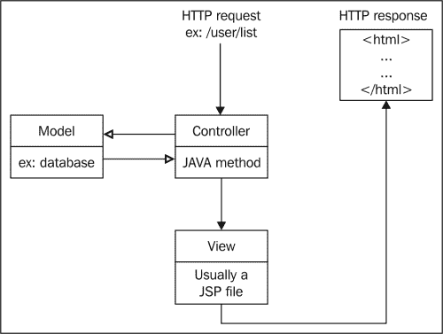
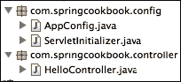
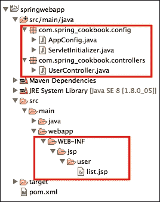
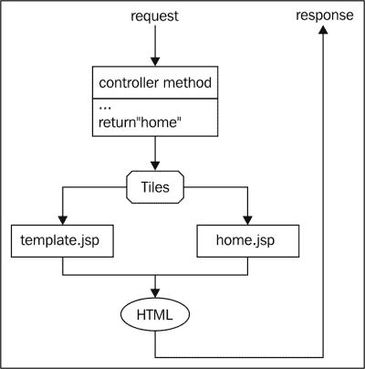
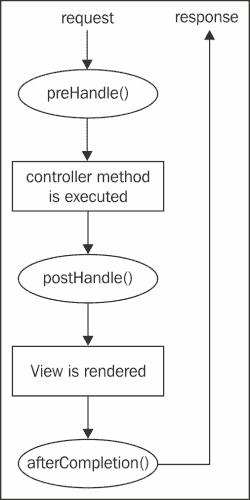

# 第三章。使用控制器和视图

在本章中，我们将介绍以下食谱：

+   将路由关联到控制器方法

+   使用 JSP 视图

+   从控制器传递属性到 JSP 视图

+   在控制器方法中使用动态路由参数

+   使用控制器路由的公共前缀

+   使用 Tiles 页面模板

+   使用拦截器在控制器前后执行一些代码

+   构建多语言页面

# 简介

一个 Spring Web 应用程序使用**MVC**（**模型-视图-控制器**）架构来处理 HTTP 请求，如下面的图像所示：



一个 HTTP 请求，由一个路由（例如，`/user/list`）标识，执行一个控制器方法。之后渲染一个视图，通常是一个 JSP 文件，并将生成的 HTML 作为响应发送回去。

在本章中，我们将从创建控制器和视图开始。然后，你将学习如何从控制器方法中检索 URL 参数。我们将介绍两种使用页面模板和 URL 前缀来减少代码重复的标准方法。最后，我们将探讨与控制器和视图相关的高级主题：拦截器和国际化。

本章中的食谱将与第一章中“创建 Spring Web 应用程序”食谱类似的项目一起工作，第一章“创建 Spring 应用程序”，其中包含一个用`@EnableWebMvc`注解的 Spring 配置类，并扫描一个专门用于控制器类的 Java 包：

```java
@Configuration
@EnableWebMvc
@ComponentScan(basePackages = {"com.springcookbook.controller"})
public class AppConfig {  
}
```

这是项目结构：



# 将路由关联到控制器方法

在这个食谱中，你将学习如何定义一个控制器方法，用于执行给定路由。

## 如何做...

创建给定路由的控制器方法的步骤如下：

1.  在你的控制器包（例如，`com.springcookbook.controller`）中创建一个控制器类。这是一个用`@Controller`注解的正常 Java 类：

    ```java
    @Controller
    public class UserController {
    ...
    }
    ```

1.  添加一个控制器方法。这是一个标准的 Java 方法，用`@RequestMapping`注解，它将路由作为参数：

    ```java
    @RequestMapping("/user/list")
    public void userList() {
    ...
    }
    ```

## 工作原理…

一个具有`/user/list`路由的请求将执行`userList()`方法。

# 使用 JSP 视图

在这个食谱中，你将学习如何在控制器方法执行后渲染并返回一个 JSP 视图。

## 如何做...

创建 JSP 视图的步骤如下：

1.  在`pom.xml`中添加 JSTL 的 Maven 依赖项：

    ```java
    <dependency>
      <groupId>javax.servlet</groupId>
      <artifactId>jstl</artifactId>
      <version>1.2</version>
    </dependency>
    ```

1.  将 JSP 视图解析器添加到 Spring 配置类中：

    ```java
    @Bean
    public ViewResolver jspViewResolver(){
        InternalResourceViewResolver resolver = new InternalResourceViewResolver();
        resolver.setViewClass(JstlView.class);
        resolver.setPrefix("/WEB-INF/jsp/");
        resolver.setSuffix(".jsp");
        return resolver;
    }
    ```

1.  创建一个控制器方法：

    ```java
    @RequestMapping("/user/list")
    public void userList() {
      ...
    }
    ```

1.  创建`/WEB-INF/jsp/user/list.jsp` JSP：

    ```java
    <html>
    <body>
      There are many users.
    </body>
    </html>
    ```

## 工作原理…

控制器方法路径是`/user/list`。使用 JSP 视图解析器，Spring 将找到并渲染相应的`/WEB-INF/jsp/user/list.jsp` JSP。

如果路径是`/user_list`，相应的 JSP 将是`/WEB-INF/jsp/user_list.jsp`。

这是当前的项目结构：



## 还有更多...

从控制器方法显式返回一个`String`对象是可能的，Spring 将使用它来查找 JSP。在这个例子中，将使用`/WEB-INF/jsp/my_friends.jsp`：

```java
@RequestMapping("/user/list")
public String userList() {
  return "my_friends";
}
```

有关在 JSP 文件中可以做什么的更多信息，请参阅[`www.tutorialspoint.com/jsp/jsp_standard_tag_library.htm`](http://www.tutorialspoint.com/jsp/jsp_standard_tag_library.htm)。

Thymeleaf、FreeMarker 和 Velocity 是流行的视图框架，它们提供了对 JSP 的替代方案。FreeMarker 和 Velocity 默认由 Spring 支持。Thymeleaf 提供自己的视图解析器。

# 从控制器传递属性到 JSP 视图

在这个菜谱中，你将学习如何在控制器方法中设置属性并在 JSP 视图中使用它们。

## 如何做到这一点...

从控制器传递数据到视图的步骤如下：

1.  将`Model`参数添加到控制器方法中：

    ```java
      @RequestMapping("/user/list")
      public void userList(Model model) {
      ...
    ```

1.  在控制器方法中，向`Model`对象添加属性：

    ```java
    model.addAttribute("nbUsers", 13);
    ```

1.  在 JSP 文件中使用属性：

    ```java
    <p>There are ${nbUsers} users</p>
    ```

## 它是如何工作的...

在控制器中，`nbUsers`变量被设置为`13`。在 JSP 文件中，`${nbUsers}` **EL**（**表达式语言**）元素将被渲染为`13`，因此将返回以下 HTML：

```java
<p>There are 13 users</p>
```

# 在控制器方法中使用动态路由参数

现在我们将定义路由的动态段并在相关的控制器方法中使用它们。例如，我们希望`/user/5/name`和`/user/6/email`路由执行相同的控制器方法，但使用不同的参数：`showUserField(5, "name")`和`showUserField(6, "email")`。

## 如何做到这一点...

使用`{}`括起来包含动态路由段，并使用`@PathVariable`注解相应的控制器方法参数：

```java
@RequestMapping("/user/{id}/{field}")
public void showUserField(@PathVariable("id") Long userId, @PathVariable("field") String field) {
...
}
```

## 它是如何工作的...

对于`/user/5/email`路由的请求将执行`showUserField(5,"email")`方法。`@PathVariable("id") Long userId`将路由参数`id`转换为`userId`方法参数。同样，`field`路由参数作为`String`传递给`showUserField()`。

一个不正确的路由，如`/user/test/email`（这是不正确的，因为`test`子串不能转换为`Long`对象），将触发一个带有消息**客户端发送的请求在语法上不正确**的 400 服务器错误。

# 使用控制器路由的公共前缀

在这个菜谱中，我们将定义一个控制器所有路由共享的路由前缀。我们将以`/user`开始`UserController`控制器的路由。

## 如何做到这一点...

设置路由前缀的步骤如下：

1.  将带有公共路由前缀的`@RequestMapping`添加到控制器类中：

    ```java
    @Controller
    @RequestMapping("/user")
    public class UserController {
    ...
    }
    ```

1.  将带有剩余路由的`@RequestMapping`添加到控制器方法中：

    ```java
    @RequestMapping("/list")
    public void userList() {
      ...
    }

    @RequestMapping("/add")
    public void addUser() {
      ...
    }
    ```

## 它是如何工作的...

对于`/user/add`路由的请求将执行`addUser()`方法。对于`/user/list`路由的请求将执行`userList()`方法。

# 使用 Tiles 页面模板

使用页面模板，避免在每一个 JSP 中重复页面的公共元素（HTML 头部、页眉、页脚、导航等）。

## 如何做到这一点...

这里是使用 Tiles 的步骤：

1.  在`pom.xml`中添加 Tiles Maven 依赖项：

    ```java
    <dependency>
      <groupId>org.apache.tiles</groupId>
      <artifactId>tiles-servlet</artifactId>
      <version>3.0.5</version>
    </dependency>

    <dependency>
      <groupId>org.apache.tiles</groupId>
      <artifactId>tiles-jsp</artifactId>
      <version>3.0.5</version>
    </dependency> 
    ```

1.  在 Spring 配置类中，删除 JSP 视图解析器（如果存在）。

1.  在 Spring 配置类中声明 Tiles：

    ```java
    // declare Tiles configuration file
    @Bean
    public TilesConfigurer tilesConfigurer() {
      TilesConfigurer tilesConfigurer = new TilesConfigurer();
      final String[] definitions = { "/WEB-INF/tiles.xml" };
        tilesConfigurer.setDefinitions(definitions);
      return tilesConfigurer;
    }

    // declare Tiles as a view resolver
    @Bean
    public ViewResolver tilesViewResolver() {
      TilesViewResolver resolver = new TilesViewResolver();
      return resolver;
    }
    ```

1.  创建`/WEB-INF/tiles.xml` Tiles 配置文件：

    ```java
    <tiles-definitions>  

        <definition name="template" template="/WEB-INF/jsp/templates/template.jsp" />

        <definition name="*" extends="template">
            <put-attribute name="body" value="/WEB-INF/jsp/{1}.jsp" />
        </definition>

    </tiles-definitions>
    ```

1.  创建`/WEB-INF/jsp/templates/template.jsp`页面模板：

    ```java
    <!DOCTYPE HTML>
    <%@ taglib prefix="tiles" uri="http://tiles.apache.org/tags-tiles" %>

    <html>
    <head>
        <meta charset="utf-8">
    </head>
    <body>
        <h1>Spring Cookbook</h1>

        <tiles:insertAttribute name="body" />    
    </body>
    </html>
    ```

1.  在控制器方法中，返回标准 JSP 文件的基本名称。例如，对于`/jsp/home.jsp`：

    ```java
    ...
    return "home";
    ```

## 如何工作…

当 Spring 配置被加载时，使用声明的`tiles.xml`配置文件初始化 Tiles。



当请求到达时，控制器方法被执行并返回`"home"`字符串，该字符串与`tiles.xml`中定义的名为`"*"`相匹配。此定义将使用`template`定义，并将`body`变量传递给它，值为`/WEB-INF/jsp/home.jsp`。在`template.jsp`中，`tiles:insertAttribute`标签将被`home.jsp`的内容替换。

总结来说，`home.jsp`文件与`template.jsp`集成，生成的 HTML 作为响应发送。

在`template.php`中，确保包含以下内容以便能够使用 Tiles 标签，如`<tiles:insertAttribute>`：

```java
<%@ taglib prefix="tiles" uri="http://tiles.apache.org/tags-tiles" %>
```

## 还有更多…

Tiles 可以在 JSP 文件位于子文件夹并支持多个页面模板时使用。还可以在一个地方定义重复的文本。

### 使用子文件夹组织 JSP

随着 JSP 文件数量的增加，您可以通过根据章节分组并使用子文件夹来维护它们：

```java
/jsp
 |- /user
 |   |- list.jsp
 |   |- add.jsp
 |- /article
 |   |- list.jsp
 |   |- add.jsp
 |- home.jsp
```

在控制器方法中，返回带有`jsp`基本名称的文件夹，例如，`user/list`。

在`tiles.xml`文件中添加以下定义：

```java
<definition name="*/*" extends="template">
    <put-attribute name="body" value="/WEB-INF/jsp/{1}/{2}.jsp" />
</definition>    
```

### 使用多个页面模板

要处理多个模板，在`tiles.xml`中为每个模板定义一个前缀。例如，我们以下定义了一个带有`main_`前缀的主模板，使用`template1.jsp` JSP，以及一个带有`secondary_`前缀的辅助模板，使用`template2.jsp` JSP：

```java
    <definition name="template1" template="/WEB-INF/templates/template1.jsp" />
    <definition name="template2" template="/WEB-INF/templates/template2.jsp" />

    <definition name="main_*" extends="template1">
        <put-attribute name="body" value="/WEB-INF/jsp/{1}.jsp" />
    </definition>

    <definition name="secondary_*" extends="template2">
        <put-attribute name="body" value="/WEB-INF/jsp/{1}.jsp" />
    </definition>
```

在控制器方法中，对于`home.jsp`，返回`"main_home"`以使用`template1`或返回`"secondary_home"`以使用`template2`。

### 使用文本属性仅定义一次页面标题

标题通常需要在 HTML 页面中显示两次：一次在页面`<head>`部分的`<title>`标签中，一次在页面`<body>`部分的`<h1>`标签中。使用 Tiles，您可以在外部`.properties`文件中只定义一次：

1.  在`tiles.xml`中，为模板定义添加一个 title 属性：

    ```java
    <definition name="*" extends="template">
      <put-attribute name="title" value="{1}.title" />
    ...
    ```

1.  在`template.jsp`中，获取标题并使用它：

    ```java
    <!DOCTYPE HTML>
    <%@ taglib prefix="spring" uri="http://www.springframework.org/tags" %>
    <%@ taglib prefix="tiles" uri="http://tiles.apache.org/tags-tiles" %>

    <c:set var="titleKey">        
      <tiles:getAsString name="title" />
    </c:set>

    <html>
    <head>
       <title><spring:message code="${titleKey}" />/title>
    </head>
    <body>
      <h1><spring:message code="${titleKey}" /></h1>
      ... 
    ```

1.  创建`src/main/resources/messages.properties`文件：

    ```java
    home.title=Home
    ```

要了解更多关于 Tiles 的信息，请访问[`tiles.apache.org/framework/tutorial/`](https://tiles.apache.org/framework/tutorial/)。

# 使用拦截器在控制器前后执行一些代码

在本菜谱中，您将学习如何使用拦截器，在请求工作流程的不同时刻通过`preHandle()`、`postHandle()`和`afterCompletion()`钩子执行一些代码：



拦截器用于身份验证、日志记录和性能分析（等等）。

## 如何做到这一点…

这里是创建和注册拦截器的步骤：

1.  创建一个扩展`HandlerInterceptorAdapter`的类：

    ```java
    public class PerformanceInterceptor extends HandlerInterceptorAdapter {
    ```

1.  覆盖你想要使用的方法：

    ```java
    @Override
    public boolean preHandle(HttpServletRequest request,
        HttpServletResponse response, Object handler) throws Exception {
        …
      return true;
    }

    @Override
    public void postHandle(HttpServletRequest request,
        HttpServletResponse response, Object handler,
        ModelAndView modelAndView) throws Exception {
      ...
    }

    @Override
    public void afterCompletion(HttpServletRequest request,
        HttpServletResponse response, Object handler, Exception ex)
        throws Exception {
      ...
    }
    ```

    ### 注意

    注意，如果`preHandle()`返回`false`，则请求工作流程将停止，并且不会调用控制器方法。

1.  使 Spring 配置类扩展`WebMvcConfigurerAdapter`并使用`@EnableWebMvc`注解：

    ```java
    @Configuration
    @EnableWebMvc
    public class AppConfig extends WebMvcConfigurerAdapter{
    ...
    ```

1.  在 Spring 配置类中，将拦截器声明为一个 bean，并使用`addInterceptors()`方法注册它：

    ```java
    @Bean
    public HandlerInterceptor performanceInterceptor() {
      PerformanceInterceptor interceptor;
      interceptor = new PerformanceInterceptor();
      return interceptor;
    }

    @Override
    public void addInterceptors(InterceptorRegistry registry) {
      registry.addInterceptor(performanceInterceptor());
    }
    ```

## 它是如何工作的…

拦截器方法在请求工作流程的相应时刻执行。

## 更多…

要将拦截器限制为特定的 URL，请向拦截器注册中添加路径模式：

```java
@Override
public void addInterceptors(InterceptorRegistry registry) {
  registry.addInterceptor(performanceInterceptor())
.addPathPatterns("/home", "/user/*");
}
```

在此示例中，拦截器方法将为`/home`、`/user/list`和`/user/add`执行，但不会为`/contact`执行。

# 构建多语言页面

接下来，我们将学习如何使用单个 JSP 创建多语言页面（英语和法语），默认显示英语，并提供一个链接切换到法语。然后，我们将文本存储在 JSP 之外，在两种语言中，分别存储在单独的`.properties`文件中。

## 如何做到这一点…

这里是构建双语文本 JSP 视图的步骤：

1.  创建 JSP：

    ```java
    <%@ taglib prefix="spring" uri="http://www.springframework.org/tags" %>

    <html>
    <body>
      <h1><spring:message code="home.title" /></h1>
      <p><spring:message code="home.intro" /></p>

      <p>
        <a href="?lang=en">English</a> |
        <a href="?lang=fr">French</a>
      </p>
    </body>
    </html>
    ```

1.  创建英文`.properties`文件`src/main/resources/messages.properties`：

    ```java
    home.title=Home
    home.intro=This is a magnificent home page, isn't it?
    ```

1.  创建法语`.properties`文件`src/main/resources/messages_fr.properties`：

    ```java
    home.title=Accueil
    home.intro=Splendide page d'accueil, non ?
    ```

1.  在 Spring 配置中，声明`.properties`文件：

    ```java
    @Bean
    public MessageSource messageSource() {
      ReloadableResourceBundleMessageSource messageSource = new ReloadableResourceBundleMessageSource();
      messageSource.setBasename("classpath:/messages");
      messageSource.setUseCodeAsDefaultMessage(true);
      return messageSource;
    }
    ```

1.  确保 Spring 配置类扩展`WebMvcConfigurerAdapter`并使用`@EnableWebMvc`注解：

    ```java
    @Configuration
    @EnableWebMvc
    public class AppConfig extends WebMvcConfigurerAdapter{
    ... 
    ```

1.  定义一个允许使用`lang` URL 参数更改当前语言的`LocaleChangeInterceptor`拦截器。注册拦截器：

    ```java
    @Bean
    public HandlerInterceptor localeChangeInterceptor() {
      LocaleChangeInterceptor interceptor = new LocaleChangeInterceptor();
      interceptor.setParamName("lang");
      return interceptor;
    }

    @Override
    public void addInterceptors(InterceptorRegistry registry) {
      registry.addInterceptor(localeChangeInterceptor());
}
    ```

1.  在 cookie 中存储用户语言选择并声明默认语言：

    ```java
    @Bean
    public LocaleResolver localeResolver() {
      CookieLocaleResolver localeResolver = new CookieLocaleResolver();
      localeResolver.setDefaultLocale(new Locale("en"));
      return localeResolver;
    }
    ```

## 它是如何工作的…

以下步骤描述了前面代码的工作原理：

1.  当请求到来时，Spring 首先检查它是否有一个包含语言值的 cookie。如果答案是肯定的，它就使用它作为当前语言；否则，它使用默认语言。这种行为来自将`CookieLocaleResolver`声明为区域解析器的声明。

1.  然后`LocaleChangeInterceptor`检查 URL 中是否存在`lang`参数。如果答案是肯定的，它就使用它作为当前语言（而不是默认或 cookie 语言）。

1.  当`home.jsp`被渲染时，其文本是从对应当前语言的`.properties`文件中获取的。如果找不到给定消息键的文本，则显示键本身。这种行为来自`messageSource.setUseCodeAsDefaultMessage(true)`。

## 更多…

你可能需要从控制器方法中检索当前语言名称。你也可能需要在 URL 中而不是在 cookie 中设置页面语言。

### 获取当前语言

要从控制器或拦截器中检索当前语言，请使用以下代码：

```java
Locale locale = LocaleContextHolder.getLocale();
String lang = locale.getLanguage(); // fr
String language = locale.getDisplayLanguage(); // French
String language2 = locale.getDisplayLanguage(locale); // français
```

### 在 URL 中使用语言

Spring 没有提供方便的方式来处理 URL 中的语言（例如，`/en/user/list`）。相反，必须手动完成：

1.  使用拦截器从 URL 中检索语言并覆盖当前语言。

1.  将控制器方法映射前缀为支持的语言（以便 Spring 可以从带有语言的路由中检索它）：

    ```java
    @Controller
    @RequestMapping("{en|fr}/user/*")
    public class UserController {
      @RequestMapping("list")
      public String userList(Model model) {
        ...
      }
    }.
    ```

1.  当生成内部链接时，假设`$lang`包含当前语言，请在其前加上当前语言：

    ```java
    <spring:url value="/${lang}/home" var="home" />
    <a href="${home}">Home</a>
    ```
