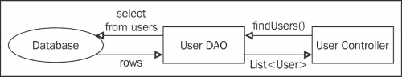
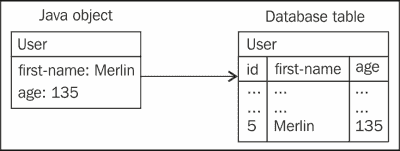

# 第四章 查询数据库

在本章中，我们将介绍以下食谱：

+   连接到数据库

+   创建 DAO 类

+   从控制器类中调用 DAO 方法

+   保存一个对象

+   检索一个对象

+   检索对象列表

+   检索具有依赖关系的对象列表

+   更新一个对象

+   删除一个对象

+   查找 SQL 查询的结果数量

+   一次性保存对象列表

+   使用事务回滚不完整的数据库修改

+   使用 Hibernate 进行强大的对象持久化和查询

# 简介

**JDBC**（**Java 数据库连接**）和 **Hibernate** 是从 Spring 应用程序查询数据库最常用的两种技术。

对于小型项目和简单的数据模型，JDBC 很简单；你自己编写 SQL 查询，Spring 提供了将查询结果转换为对象的辅助工具。

对于复杂的数据模型，类之间有多个关系时，Hibernate 更容易使用；你处理的是一个标准的 Java 框架（仍然在幕后使用 JDBC），它会为你生成 SQL 查询。

本章重点介绍 JDBC，因为 Spring 并没有改变使用 Hibernate 的常规方式。然而，Hibernate 与 Spring 的集成在 *使用 Hibernate 进行强大的对象持久化和查询* 食谱中有所涉及。

# 连接到数据库

在这个食谱中，我们将从 Spring 应用程序连接到 MySQL 或 PostgreSQL 数据库。要连接到其他数据库系统，请访问 [`www.oxygenxml.com/database_drivers.html`](http://www.oxygenxml.com/database_drivers.html) 以找到相关的依赖项、驱动类和 URL 类型。

## 准备工作

你需要一个正在运行的 MySQL 或 PostgreSQL 数据库。

## 如何做到这一点…

这里是从 Spring 应用程序连接到现有数据库的步骤：

1.  在 `pom.xml` 中添加 Spring JDBC 的 Maven 依赖项：

    ```java
    <dependency>
      <groupId>org.springframework</groupId>
      <artifactId>spring-jdbc</artifactId>
      <version>4.1.6.RELEASE</version>
    </dependency>
    ```

1.  如果你使用 MySQL，请在 `pom.xml` 中添加其 Maven 依赖项：

    ```java
    <dependency>
      <groupId>mysql</groupId>
      <artifactId>mysql-connector-java</artifactId>
      <version>5.1.35</version>
    </dependency>
    ```

1.  如果你使用 PostgreSQL，请在 `pom.xml` 中添加其 Maven 依赖项：

    ```java
    <dependency>
      <groupId>postgresql</groupId>
      <artifactId>postgresql</artifactId>
      <version>9.1-901-1.jdbc4</version>
    </dependency>
    ```

在 Spring 配置中，添加一个包含数据库连接详情的 `DataSource` bean。

1.  如果你使用 MySQL：

    ```java
    @Bean
    public DataSource dataSource() {
            DriverManagerDataSource dataSource = new DriverManagerDataSource();

            dataSource.setDriverClassName("com.mysql.jdbc.Driver");
            dataSource.setUrl("jdbc:mysql://localhost:3306/db1");
            dataSource.setUsername("user1");
            dataSource.setPassword("pass1");

            return dataSource;
    }
    ```

1.  如果你使用 PostgreSQL：

    ```java
    @Bean
    public DataSource dataSource() {
        DriverManagerDataSource dataSource = new DriverManagerDataSource();

        dataSource.setDriverClassName("org.postgresql.Driver");
        dataSource.setUrl("jdbc:postgresql://localhost:5432/db1");
        dataSource.setUsername("user1");
        dataSource.setPassword("pass1");

        return dataSource;
    }
    ```

1.  在 Spring 配置中，添加一个 `JdbcTemplate` bean，将 `DataSource` 作为参数：

    ```java
    @Bean
    public JdbcTemplate jdbcTemplate(DataSource dataSource) {
      return new JdbcTemplate(dataSource);
    }
    ```

## 它是如何工作的…

创建了一个连接（`Datasource` 对象），连接到名为 `db1` 的数据库，端口为 `3306`（MySQL）或 `5432`（PostgreSQL），使用用户 `user1`。

`JdbcTemplate` bean 是一个 Spring 对象，它提供了使用 JDBC 查询数据库的便捷方法。它使用之前定义的 `DataSource` bean。我们将从我们的 DAO 类中使用 `JdbcTemplate` bean。

# 创建 DAO 类

在这个食谱中，我们将创建一个 **DAO**（**数据访问对象**）类。DAO 类提供了保存和从数据库检索对象的方法。它可以从控制器中使用，例如：



控制器从`UserDAO`调用`findUsers()`方法，它负责从数据库获取结果（使用在先前的配方中定义的`JdbcTemplate`bean）。

## 如何操作…

这里是创建 DAO 类的步骤：

1.  创建一个带有`@Repository`注解的类：

    ```java
    @Repository
    public class UserDAO {
    ```

1.  向其中添加一个自动注入的`JdbcTemplate`字段：

    ```java
    @Autowired
    private JdbcTemplate jdbcTemplate;
    ```

## 它是如何工作的…

`@Repository`允许`UserDAO`类自动被发现和实例化为一个 bean。

`JdbcTemplate`字段将通过 Spring 通过依赖注入自动初始化，使用先前的配方中定义的`JdbcTemplate`bean。

# 从控制器类中调用 DAO 方法

在这个配方中，我们将看到如何从控制器类中调用 DAO 方法。

## 准备工作

我们将使用先前的配方中定义的 DAO 类，并假设它有一个`add(User)`方法。在接下来的配方中，我们将编写实际的 DAO 方法。

## 如何操作…

这里是使用控制器类中的 DAO 方法步骤：

1.  在您的控制器类中，添加 DAO 作为`@Autowired`字段：

    ```java
    @Controller
    public class UserController {
      @Autowired
     private UserDAO userDAO;

    ```

1.  在任何控制器方法中使用 DAO：

    ```java
    userDAO.add(user);
    ```

## 它是如何工作的…

由于`@Autowired`，`userDAO`字段将通过 Spring 使用依赖注入自动初始化。

# 保存对象

在这个配方中，我们将创建一个 DAO 方法来将对象保存到数据库中；将在相应的数据库表中添加一行，例如：



## 准备工作

您需要一个模型类，例如：

```java
public class User {
  private Long id;
  private String firstName;
  private Integer age;
```

您需要有一个匹配的数据库表，例如：

```java
CREATE TABLE `user` (
  `id` int(11) AUTO_INCREMENT,
  `first_name` text,
  `age` int(11),
  PRIMARY KEY (`id`)
)
```

您需要一个具有`JdbcTemplate`属性的 DAO 类（参考*创建 DAO 类*配方）

## 如何操作…

定义一个带有问号作为实际行值占位符的 SQL 插入查询。使用`update()`方法执行查询，使用对象中的实际值：

```java
public void add(User user) {
  String sql = "insert into user (first_name, age) values (?, ?)";
  jdbcTemplate.update(sql, user.getFirstName(), user.getAge());
}
```

## 它是如何工作的…

`jdbcTemplate`对象负责处理 JDBC 样板代码；打开和关闭数据库连接以及处理异常。`update()`方法接受 SQL 查询和将替换 SQL 查询中问号的实际值。

# 获取对象

在这个配方中，我们创建一个 DAO 方法来检索数据库行，我们将使用它来创建一个对象。

## 如何操作…

使用 SQL 选择查询并使用`RowMapper`从结果创建一个对象：

1.  在 DAO 类中，添加一个实现`RowMapper`的内联类。这个类定义了如何从数据库行生成一个`User`对象：

    ```java
    private class UserMapper implements RowMapper<User> {
      public User mapRow(ResultSet row, int rowNum) throws SQLException {
        User user = new User();

        user.setId(row.getLong("id"));
        user.setFirstName(row.getString("first_name"));
        user.setAge(row.getInt("age"));

        return user;
      }
    }
    ```

1.  添加一个 DAO 方法，它将执行一个 SQL `select`查询并使用一个`UserMapper`对象来生成一个`User`对象：

    ```java
    public User findById(Long id) {
      String sql = "select * from user where id=?";
      User user = jdbcTemplate.queryForObject(sql, new Object[]{id}, new UserMapper());
      return user;
    }
    ```

## 它是如何工作的…

`queryForObject()`方法使用`the` `UserMapper`对象从结果数据库行生成一个`User`对象。

在这个例子中，我们通过其 ID 检索用户，这是`queryForObject()`的第二个参数，作为一个数组元素。

## 更多内容…

如果数据库列名与对象属性名匹配，则无需定义自定义的 `RowMapper` 接口，只需使用 `ParameterizedBeanPropertyRowMapper` 类：

```java
public User findById(Long id) {
  String sql = "select * from user where id=?";
  User user = jdbcTemplate.queryForObject(sql, new Object[]{id}, ParameterizedBeanPropertyRowMapper.newInstance(User.class));
  return user;
}
```

# 获取对象列表

在这个菜谱中，我们将添加一个 DAO 方法来从数据库行中检索并创建一个对象列表。

## 如何做到这一点...

执行一个 SQL `select` 查询并使用 `RowMapper` 从结果中生成一个对象列表：

```java
public List<User> findAll() {
  String sql = "select * from user";
  List<User> userList = jdbcTemplate.query(sql, ParameterizedBeanPropertyRowMapper.newInstance(User.class));
  return userList;
}
```

## 它是如何工作的...

`query()` 方法使用 `RowMapper` 从返回的数据库行生成对象。

我们假设数据库表列与对象属性匹配，使用了 `ParameterizedBeanPropertyRowMapper` 类；然而，正如前一个菜谱中所述，可以使用自定义的 `RowMapper` 接口。

# 获取带有其依赖关系的对象列表

在这个菜谱中，我们将添加一个 DAO 方法，从一个连接多个表的 SQL 查询中生成一个带有其依赖关系的对象列表。我们将检索一个包含 `User` 对象及其 `Post` 对象（这些用户撰写的博客文章）的对象列表。

## 准备工作

您需要具有相互关联的模型类。在这个例子中，一个用户有许多帖子：

```java
public class User {
  private Long id;
  private String firstName;
  private Integer age;
  private LinkedList<Post> posts = new LinkedList<Post>();

public class Post {
  private long id;
  private String title;
  private Date date;
  private User user;
```

您需要具有相应的数据库表，例如：

```java
CREATE TABLE `user` (
  `id` int(11) AUTO_INCREMENT,
  `first_name` text,
  `age` int(11),
  PRIMARY KEY (`id`)
)

CREATE TABLE `post` (
  `id` int(11) AUTO_INCREMENT,
  `title` text,
  `date` datetime,
  `user_id` int(11),
  PRIMARY KEY (`id`),
  CONSTRAINT `user_id` FOREIGN KEY (`id`) REFERENCES `user` (`id`)
)
```

## 如何做到这一点...

使用 SQL `select` 查询并使用实现 `ResultSetExtractor` 的类从结果中生成一个对象列表，该类在返回对象列表之前遍历整个行列表：

1.  添加一个 DAO 方法，执行一个带有 `left join` 的 SQL `select` 语句并使用 `ResultSetExtractor` 生成一个对象列表：

    ```java
    public List<User> findAll() {
      String sql = "select u.id, u.first_name, u.age, p.id as p_id, p.title as p_title, p.date as p_date from user u left join post p on p.user_id = u.id order by u.id asc, p.date desc";
      return jdbcTemplate.query(sql, new UserWithPosts());
    }
    ```

1.  添加一个实现 `ResultSetExtractor` 的内联类：

    ```java
    private class UserWithPosts implements ResultSetExtractor<List<User>> {

      public List<User> extractData(ResultSet rs) throws SQLException,
          DataAccessException {

        Map<Long, User> userMap = new ConcurrentHashMap<Long, User>();
        User u = null;
        while (rs.next()) {
          // user already in map?
          Long id = rs.getLong("id");
          u = userMap.get(id);

          // if not, add it
          if(u == null) {
            u = new User();
            u.setId(id);
            u.setFirstName(rs.getString("first_name"));
            u.setAge(rs.getInt("age"));
            userMap.put(id, u);
          }

          // create post if there's one
          Long postId = rs.getLong("p_id");
          if (postId > 0) {
            System.out.println("add post id=" + postId);
            Post p = new Post();
            p.setId(postId);
            p.setTitle(rs.getString("p_title"));
            p.setDate(rs.getDate("p_date"));
            p.setUser(u);
            u.getPosts().add(p);
          }
        }

        return new LinkedList<User>(userMap.values());
      }
    }
    ```

## 它是如何工作的...

由于 `left join`，我们有时从数据库中获得具有相同用户的行列表，但代表不同的帖子。每一行不能独立处理，否则我们最终会创建多个相同的用户。因此，我们使用 `ResultSetExtractor`，它允许我们遍历行列表。

我们使用一个 `User` 对象的映射来跟踪当前行的 `User` 是否已经被创建。

在 SQL 查询中，我们明确列出了列名，以确保它们在结果行中将具有不同的名称。否则，例如，“帖子 id”可能会与“用户 id”混淆。

# 更新一个对象

在这个菜谱中，我们将添加一个 DAO 方法来使用对象的字段更新数据库中的一个现有行。

## 如何做到这一点...

使用 SQL `update` 查询并使用 `update()` 方法执行它：

```java
public void update(User user) {
  String sql = "update user set first_name=?, age=? where id=?";
  jdbcTemplate.update(sql, user.getFirstName(), user.getAge(), user.getId());
}
```

## 更多...

同时拥有一个 `save()` 方法也很方便，如果数据库行不存在，它将创建该行：

```java
public void save(User user) {
  if (user.getId() == null) {
    add(user);
  }
  else {
    update(user);
  }
}
```

# 删除一个对象

在这个菜谱中，我们将添加一个 DAO 方法来从数据库中删除一个现有的行。

## 如何做到这一点...

使用 SQL `delete` 查询并使用 `update()` 方法执行它：

```java
public void delete(User user) {
  String sql = "delete from user where id=?";
  getJdbcTemplate().update(sql, user.getId());
}
```

# 查找 SQL 查询的结果数量

在这个菜谱中，我们将添加一个 DAO 方法，快速获取 SQL 查询的结果数量，而不实际将行加载到内存中。

## 如何做到这一点...

使用 SQL `count(*)`函数，并通过`queryForObject()`方法获取值，第二个参数指定返回类型为`Long`：

```java
public long countMinorUsers() {
  String sql = "select count(*) from age < 18";
  return jdbcTemplate.queryForObject(sql, Long.class);
}
```

# 一次性保存对象列表

在这个菜谱中，我们将添加一个 DAO 方法，以高效地将对象列表保存到数据库中。

## 如何操作...

使用接受 SQL `insert`查询和值列表作为参数的`batchUpdate()`方法：

```java
public void add(List<User> userList) {
  String sql = "insert into user (first_name, age) values (?, ?)";

  List<Object[]> userRows = new ArrayList<Object[]>();
  for (User user : userList) {
        userRows.add(new Object[] {user.getFirstName(), user.getAge()});
  }

   jdbcTemplate.batchUpdate(sql, userRows);
}
```

## 工作原理...

将从 SQL `insert`查询字符串和值列表生成一系列 SQL `insert`查询。它们将被发送到数据库并一次性提交。

# 使用事务回滚不完整的数据库修改

一些数据库修改涉及多个 SQL 查询，例如，插入具有跨多个表属性的对象。如果其中一个查询失败，我们希望撤销之前成功的任何修改。

## 如何操作...

这里是使 DAO 方法事务化的步骤：

1.  在 Spring 配置类中添加`@EnableTransactionManagement`：

    ```java
    @Configuration
    @EnableWebMvc
    @EnableTransactionManagement
    @ComponentScan(basePackages = {"com.spring_cookbook.controllers", "com.spring_cookbook.dao"})
    public class AppConfig {
    …
    ```

1.  在 Spring 配置中添加一个`DataSourceTransactionManager`豆：

    ```java
    @Bean
    public DataSourceTransactionManager transactionManager() {
        DataSourceTransactionManager transactionManager = new DataSourceTransactionManager();
      transactionManager.setDataSource(dataSource());
      return transactionManager;
    }
    ```

1.  使用`@Transactional`注解 DAO 类：

    ```java
    @Repository
    @Transactional
    public class UserDAO {
    …
    ```

## 工作原理...

`@Transactional`将每个 DAO 方法包围在一个`BEGIN…COMMIT` SQL 块中。所以如果有错误（运行时异常），DAO 方法对数据库所做的任何修改都将回滚。

# 使用 Hibernate 进行强大的对象持久化和查询

在这个菜谱中，你将学习如何使用 Hibernate 与 Spring 结合。我们将使用 MySQL 数据库。

## 准备工作

在这个菜谱中，我们将使用带有`user`表的 MySQL 数据库：

```java
CREATE TABLE user (
  id int NOT NULL AUTO_INCREMENT,
  first_name text,
  age int DEFAULT NULL,
  PRIMARY KEY (id)
);
```

我们将使用这个相应的 JPA 注解的领域类：

```java
@Entity
@Table(name = "user")
public class User {

  @Id
  @GeneratedValue
  private Long id;

  @Column(name = "first_name")
  private String firstName;

  private Integer age;

  // getters and setters.. 
```

更多关于**Java 持久化 API**（**JPA**）的信息，请访问：[`docs.oracle.com/javaee/6/tutorial/doc/bnbpz.html`](http://docs.oracle.com/javaee/6/tutorial/doc/bnbpz.html)。

## 如何操作...

这里是集成 Hibernate 与 Spring 的步骤：

1.  在`pom.xml`中添加 Spring ORM、Hibernate 和 MySQL JDBC 驱动的 Maven 依赖项：

    ```java
    <dependency>
      <groupId>org.springframework</groupId>
      <artifactId>spring-orm</artifactId>
      <version>4.1.6.RELEASE</version>
    </dependency>

    <dependency>
      <groupId>mysql</groupId>
      <artifactId>mysql-connector-java</artifactId>
      <version>5.1.35</version>
    </dependency>  

    <dependency>
      <groupId>org.hibernate</groupId>
      <artifactId>hibernate-core</artifactId>
      <version>4.3.8.Final</version>
    </dependency>
    ```

1.  在 Spring 配置类中添加`@EnableTransactionManagement`：

    ```java
    @Configuration
    @EnableWebMvc
    @EnableTransactionManagement
    @ComponentScan(basePackages = {"com.spring_cookbook.controllers", "com.spring_cookbook.dao"})
    public class AppConfig {
    …
    ```

1.  在 Spring 配置中，添加一个包含数据库连接详情的`dataSource`豆：

    ```java
    @Bean
    public DataSource dataSource() {
            DriverManagerDataSource dataSource = new DriverManagerDataSource();

            dataSource.setDriverClassName("com.mysql.jdbc.Driver");
            dataSource.setUrl("jdbc:mysql://localhost:3306/db1");
            dataSource.setUsername("user1");
            dataSource.setPassword("pass1");

            return dataSource;
    }
    ```

1.  在 Spring 配置类中，添加一个接受`Datasource`对象作为参数的`sessionFactory`豆方法。在这个豆方法中，我们告诉 Hibernate 生成针对 MySQL 的特定 SQL 代码，并声明我们的`User`类：

    ```java
    @Bean
    public SessionFactory sessionFactory(DataSource dataSource) {
      LocalSessionFactoryBuilder sessionBuilder = new LocalSessionFactoryBuilder(dataSource);
      Properties props = new Properties();
      props.put("hibernate.dialect", "org.hibernate.dialect.MySQLDialect");
      props.put("hibernate.show_sql", "true");
      sessionBuilder.addProperties(props);

      sessionBuilder.addAnnotatedClass(User.class);

      return sessionBuilder.buildSessionFactory();
    }
    ```

1.  在 Spring 配置类中，添加一个`HibernateTransactionManager`豆：

    ```java
    @Bean
    public HibernateTransactionManager transactionManager(SessionFactory sessionFactory) {
      return new HibernateTransactionManager(sessionFactory);
    }
    ```

1.  使用依赖注入将`SessionFactory`豆添加到你的 DAO 类中：

    ```java
    @Autowired
    SessionFactory sessionFactory;
    ```

1.  使用这个`SessionFactory`豆来像往常一样控制 Hibernate，例如，这是一个将`User`对象添加到数据库的 DAO 方法：

    ```java
    @Transactional
    public void add(User user) {
      sessionFactory.getCurrentSession().saveOrUpdate(user);
    }
    ```
