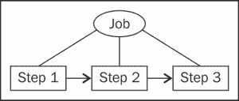
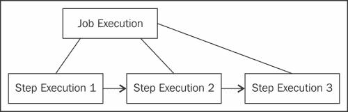

# 第八章。运行批处理作业

在本章中，我们将涵盖以下菜谱：

+   安装和配置 Spring Batch

+   创建作业

+   从命令行执行作业

+   从控制器方法中执行作业

+   使用作业参数

+   执行系统命令

+   调度作业

+   创建读取/处理/写入步骤

+   读取 XML 文件

+   生成 CSV 文件

+   从数据库读取

+   单元测试批处理作业

# 简介

**批处理作业**是在正常 Web 应用工作流程之外执行的任务（接收 HTTP 请求并返回 HTTP 响应）。它可以由 Web 服务器作为单独的进程执行。也可以直接从命令行启动。

通常，批处理作业要么：

+   在预定时间导入或导出数据。例如，每晚在数据库中导入 CSV 文件。

+   异步执行一些代码以避免长时间页面加载。例如，处理用户上传的视频或生成用户将要下载的大文件。

Spring Batch 提供了一个结构来定义、运行和监控批处理作业。一个**作业**被定义为一系列步骤：



**作业实例**是**作业**和某些**参数**的组合。例如，日期和要处理的文件名。为作业实例创建一个**作业执行**。如果作业执行失败，可以为同一个作业实例创建另一个作业执行。


**作业执行**为作业的每个步骤生成一个**步骤执行**。如果步骤执行失败，可以为同一个步骤创建另一个步骤执行：



# 安装和配置 Spring Batch

Spring 会自动将有关作业及其步骤的元数据（开始时间、结束时间和状态）保存到一个作业仓库中，该仓库由几个数据库表组成。在这个菜谱中，我们将创建这些表。我们还将创建一个专门用于批处理作业的 Spring 配置类。

## 如何做到这一点...

这里是安装和配置 Spring Batch 的步骤：

1.  在`pom.xml`中添加 Spring Batch 的 Maven 依赖项：

    ```java
    <dependency>
        <groupId>org.springframework.batch</groupId>
        <artifactId>spring-batch-core</artifactId>
        <version>3.0.2.RELEASE</version>
    </dependency>

    <dependency>
        <groupId>org.springframework.batch</groupId>
        <artifactId>spring-batch-infrastructure</artifactId>
        <version>3.0.2.RELEASE</version>
    </dependency>
    ```

1.  在`pom.xml`中添加 Spring JDBC 和 Spring Transaction 的 Maven 依赖项：

    ```java
    <dependency>
      <groupId>org.springframework</groupId>
      <artifactId>spring-jdbc</artifactId>
      <version>4.1.2.RELEASE</version>
    </dependency>

    <dependency>
        <groupId>org.springframework</groupId>
        <artifactId>spring-tx</artifactId>
        <version>4.1.2.RELEASE</version>
    </dependency>
    ```

1.  在`pom.xml`中添加你的数据库的 Maven 依赖项：

    ```java
    <dependency>
      <groupId>mysql</groupId>
      <artifactId>mysql-connector-java</artifactId>
      <version>5.1.34</version>
    </dependency>
    ```

1.  在数据库中，创建 Spring Batch 作业仓库的表。SQL 代码可以在`org.springframework.batch.core`包中的 spring-batch-core 依赖项内部找到。它也可以在[`github.com/spring-projects/spring-batch/tree/master/spring-batch-core/src/main/resources/org/springframework/batch/core`](https://github.com/spring-projects/spring-batch/tree/master/spring-batch-core/src/main/resources/org/springframework/batch/core)在线找到。

1.  为你的 Spring Batch 类创建一个 Java 包。例如，`com.spring_cookbook.batch`。

1.  使用`@EnableBatchProcessing`注解为 Spring Batch 创建一个 Spring 配置类：

    ```java
    @Configuration
    @EnableBatchProcessing
    public class BatchConfig {
    ...
    }
    ```

1.  将包含数据库连接详情的`DataSource` bean 添加到配置类中：

    ```java
    @Bean
    public DataSource dataSource() {
            DriverManagerDataSource dataSource = new DriverManagerDataSource();

    dataSource.setDriverClassName("com.mysql.jdbc.Driver");
    dataSource.setUrl("jdbc:mysql://localhost:3306/db1");
            dataSource.setUsername("root");
            dataSource.setPassword("123");

            return dataSource;
    }
    ```

## 工作原理…

在配置类中，`@EnableBatchProcessing`注解启用 Spring Batch 并为批处理作业提供合理的默认值，如果需要可以覆盖（默认的`JobLauncher`对象、默认的`TransactionManager`对象等）。

# 创建作业

我们将创建一个仅包含一个步骤的作业。该步骤将是一个`Tasklet`对象（与稍后将要介绍的读取-处理-写入步骤相对，它是一个单独的任务）。我们将在接下来的两个菜谱中以两种不同的方式执行此作业。

## 如何操作…

创建一个`Tasklet`类，您将使用它来定义步骤和作业：

1.  创建实现`Tasklet`的`Task1`类：

    ```java
    public class Task1 implements Tasklet {    

    }
    ```

1.  在`Task1`类中，添加一个包含作业要执行的代码的`execute()`方法：

    ```java
    public RepeatStatus execute(StepContribution contribution, ChunkContext chunkContext)
            throws Exception {
        System.out.println("Starting job..");

        // ... your code

        System.out.println("Job done..");
        return RepeatStatus.FINISHED;
    }
    ```

1.  在配置类中，添加一个自动装配的`JobBuilderFactory`属性和一个自动装配的`StepBuilderFactory`属性：

    ```java
    @Autowired
    private JobBuilderFactory jobs;

    @Autowired
    private StepBuilderFactory steps;
    ```

1.  定义将执行我们的代码的`step1` bean，来自`Task1`类：

    ```java
    @Bean
    public Step step1(){
        return steps.get("step1")
                .tasklet(new Task1())
                .build();
    }   
    ```

1.  定义将执行`step1`的`job1` bean：

    ```java
    @Bean
    public Job job1(){
        return jobs.get("job1")
                .start(step1())
                .build();
    }
    ```

## 工作原理…

我们定义了一个名为`job1`的作业，它将执行`step1`步骤，这将调用`Task1`类中的`execute()`方法。

## 更多内容…

要执行多个步骤，请在作业定义中使用`next()`方法：

```java
@Bean
public Job job1(){
    return jobs.get("job1")
            .start(step1())
 .next(step2())
            .build();
}
```

# 从命令行执行作业

使用命令行界面执行作业是一种简单且健壮的方法。这允许您使用标准的`cron`作业（在 Windows 上使用`AT`命令）来安排它，这样即使 Web 应用程序关闭，作业也会被执行。它也方便用于测试和调试作业。

## 准备工作

我们将使用在*创建作业*菜谱中定义的作业。

## 如何操作…

按以下步骤从命令行执行作业：

1.  在`pom.xml`（在`build/plugins`下）中声明`maven-assembly-plugin`：

    ```java
        <plugin>
            <artifactId>maven-assembly-plugin</artifactId>
            <configuration>
                <archive>
                    <manifest>
                        <mainClass>
                            org.springframework.batch.core.launch.support. CommandLineJobRunner
                        </mainClass>
                    </manifest>
                </archive>
                <descriptorRefs>
                    <descriptorRef> jar-with-dependencies</descriptorRef>
                </descriptorRefs>
            </configuration>
        </plugin>
    ```

1.  生成 JAR 文件：

    ```java
    mvn clean compile assembly:single
    ```

1.  通过运行在`target`文件夹中生成的 JAR 文件来执行作业，其中包含定义作业的类（`BatchConfig`）和作业名称（`job1`）作为参数：

    ```java
    java -jar target/springwebapp-jar-with-dependencies.jar com.spring_cookbook.batch.BatchConfig job1
    ```

1.  控制台输出应如下所示：

    ```java
    ...
    INFO: Job: [SimpleJob: [name=job1]] launched with the following parameters: [{}]
    ...
    INFO: Executing step: [step1]
    Starting job..
    Job done..
    ...
    INFO: Job: [SimpleJob: [name=job1]] completed with the following parameters: [{}] and the following status: [COMPLETED]
    ...
    ```

## 更多内容…

对于给定的参数集，作业只能执行一次。要再次执行作业，只需使用`parameterName=parameterValue`语法添加一个参数：

```java
java -jar target/springwebapp-jar-with-dependencies.jar com.spring_cookbook.batch.BatchConfig job1 p=1
java -jar target/springwebapp-jar-with-dependencies.jar com.spring_cookbook.batch.BatchConfig job1 p=2
java -jar target/springwebapp-jar-with-dependencies.jar com.spring_cookbook.batch.BatchConfig job1 p=3
```

在这种情况下，控制台输出将如下所示：

```java
...
INFO: Job: [SimpleJob: [name=job1]] launched with the following parameters: [{p=3}]
...
```

在测试和调试作业时，您可以使用 Unix 时间戳自动获取每次不同的参数值：

```java
java -jar target/springwebapp-jar-with-dependencies.jar com.spring_cookbook.batch.BatchConfig job1 p=`date +'%s'`
```

作业也可以直接执行，而无需首先生成 JAR 文件：

```java
mvn compile exec:java - Dexec.mainClass=org.springframework.batch.core.launch.support. CommandLineJobRunner - Dexec.args="com.spring_cookbook.batch.BatchConfig job1 p=4"
```

# 从控制器方法中执行作业

当作业由用户操作触发时，从控制器方法启动作业很方便。例如，启动一个处理用户刚刚上传的视频的作业。

## 准备工作

我们将使用在*创建作业*菜谱中定义的作业。

## 如何操作…

按以下步骤从控制器方法中执行作业：

1.  将 Spring Batch 配置类添加到扩展 `AbstractAnnotationConfigDispatcherServletInitializer` 的类中的 `getServletConfigClasses()` 方法：

    ```java
    public class ServletInitializer extends AbstractAnnotationConfigDispatcherServletInitializer {

    @Override
    protected Class<?>[] getServletConfigClasses() {
        return new Class<?>[]{AppConfig.class, BatchConfig.class};
    }
    ```

1.  在您的控制器类中，添加一个自动装配的 `JobLauncher` 属性和 `Job` 属性：

    ```java
    @Autowired
    JobLauncher jobLauncher;

    @Autowired
    Job job;
    ```

1.  在控制器方法中，定义作业参数并启动作业：

    ```java
    try {
      JobParametersBuilder jobParametersBuilder = new JobParametersBuilder();
      jobParametersBuilder.addDate("d", new Date());

      jobLauncher.run(job, jobParametersBuilder.toJobParameters());
    } catch (Exception e) {
      ...
    }
    ```

## 它是如何工作的…

我们在 `ServletInitializer` 类中声明了 `BatchConfig`，以便将我们的 Spring Batch 配置提供给控制器方法。

在控制器方法中，作业参数与命令行中的参数相同。

# 使用作业参数

在这个菜谱中，你将学习如何在 `Tasklet` 中检索和使用作业参数值。

## 准备工作

我们将使用在 *创建作业* 菜谱中定义的作业。

## 如何操作…

按照以下步骤使用作业参数：

1.  在 `Task1` 类中，将 `@StepScope` 添加到 `execute()` 方法：

    ```java
    @StepScope
    public RepeatStatus execute(StepContribution contribution, ChunkContext chunkContext)
            throws Exception {
    ...
    ```

1.  在 `execute()` 方法中，通过使用作业参数名称来检索作业参数值：

    ```java
    String test = (String)chunkContext.getStepContext().getJobParameters(). get("test")
    ```

1.  使用名为 `test` 的参数运行作业：

    ```java
    mvn compile exec:java - Dexec.mainClass=org.springframework.batch.core.launch. support.CommandLineJobRunner - Dexec.args="com.spring_cookbook.batch.BatchConfig job1 test=hello"
    ```

## 它是如何工作的…

`String` 测试将包含通过命令行传递的 `hello` 参数值。如果作业是从控制器方法启动的，这个菜谱也将工作。

# 执行系统命令

一个步骤可以仅由一个系统命令的执行组成。Spring Batch 提供了一个方便的类来完成这个任务，`SystemCommandTasklet`。

## 准备工作

我们将使用在 *创建作业* 菜谱中定义的作业。

## 如何操作…

在 Spring Batch 的配置文件中，添加一个 `SystemCommandTasklet` 实例。声明要执行的系统命令（在这里，我们使用了 touch Unix 命令来创建一个空文件），执行它的目录以及允许其执行的最大时间：

```java
@Bean
public SystemCommandTasklet task1() {
  SystemCommandTasklet tasklet = new SystemCommandTasklet();

  tasklet.setCommand("touch test.txt");
  tasklet.setWorkingDirectory("/home/merlin");
  tasklet.setTimeout(5000);

  return tasklet;
}
```

## 它是如何工作的…

`SystemCommandTasklet` 类将在工作目录中执行一个命令，如果它超过了超时值，则会终止进程。

## 更多内容…

为了更高级地使用系统命令（例如，获取系统命令的输出），扩展 `SystemCommandTasklet` 并重写其 `execute()` 方法。

# 安排作业

一些作业需要定期执行——每晚、每小时等。Spring 通过 `@Scheduled` 注解使这变得简单。

## 准备工作

我们将使用在 *创建作业* 菜谱中定义的作业。

## 如何操作…

按照以下步骤安排作业：

1.  如果尚未完成，请将 Spring Batch 配置类添加到扩展 `AbstractAnnotationConfigDispatcherServletInitializer` 的类中的 `getServletConfigClasses()` 方法：

    ```java
    public class ServletInitializer extends AbstractAnnotationConfigDispatcherServletInitializer {

    @Override
    protected Class<?>[] getServletConfigClasses() {
        return new Class<?>[]{AppConfig.class, BatchConfig.class};
    }
    ```

1.  将 `@EnableScheduling` 注解添加到 Spring Batch 配置类：

    ```java
    @Configuration
    @EnableBatchProcessing
    @EnableScheduling
    public class BatchConfig {
    ...
    ```

1.  添加一个自动装配的 `JobLauncher` 字段：

    ```java
    @Autowired
    JobLauncher jobLauncher;
    ```

1.  添加一个带有 `fixedDelay` 属性（以毫秒为单位）的 `@Scheduled` 注解的方法：

    ```java
    @Scheduled(fixedDelay=10000)
    public void runJob1() throws Exception {
    ...
    }
    ```

1.  在那个方法中，运行作业：

    ```java
    JobParametersBuilder jobParametersBuilder = new JobParametersBuilder();
    jobParametersBuilder.addDate("d", new Date());      
    jobLauncher.run(job1(), jobParametersBuilder.toJobParameters());
    ```

## 它是如何工作的…

一旦部署了 Web 应用程序，作业将立即以 10 秒（10000 毫秒）的间隔重复执行。使用带有 `new Date()` 值的 `job` 参数为每次启动设置不同的参数值。

## 更多内容…

`fixedDelay`属性在作业执行完成后设置了一个 10 秒的延迟，然后启动下一个作业。要实际每 10 秒运行一个作业，请使用`fixedRate`：

```java
@Scheduled(fixedRate=10000)
public void runJob1() throws Exception {
...
}
```

也可以使用一个常规的`cron`表达式：

```java
@Scheduled(cron="*/5 * * * *")
public void runJob1() throws Exception {
...
}
```

# 创建一个读取/处理/写入步骤

读取/处理/写入步骤是一种常见的步骤类型，其中某些数据在某处读取，以某种方式处理，最后保存在某处。在这个菜谱中，我们将读取用户的 CSV 文件，增加他们的年龄，并将修改后的用户保存到数据库中，如下面的图像所示：


## 准备工作

这是我们的用户 CSV 文件，`input_data.txt`：

```java
Merlin, 333
Arthur, 37
Lancelot, 35
Tristan, 20
Iseult, 22
Mark, 56
```

对于 CSV 文件的每一行，我们将创建一个`User`对象。所以，请确保`User`类存在：

```java
public class User {
  private String firstName;
  private int age;
…
}
```

每个`User`对象都将保存在数据库中。请确保`user`表存在：

```java
CREATE TABLE user  (
    id BIGINT NOT NULL PRIMARY KEY AUTO_INCREMENT,
  first_name TEXT,
  age INT
);
```

## 如何做到这一点…

按照以下步骤处理 CSV 文件：

1.  在 Spring Batch 配置类中，添加一个返回`LineMapper`对象的方法，该对象从 CSV 文件中的一行生成`User`对象：

    ```java
    private LineMapper<User> lineMapper() {
      DefaultLineMapper<User> lineMapper = new DefaultLineMapper<User>();

      DelimitedLineTokenizer lineTokenizer = new DelimitedLineTokenizer();
        lineTokenizer.setNames(new String[]{"firstName","age"});
        lineTokenizer.setIncludedFields(new int[]{0,1});
        lineMapper.setLineTokenizer(lineTokenizer);

        BeanWrapperFieldSetMapper<User> fieldSetMapper = new BeanWrapperFieldSetMapper<User>();
        fieldSetMapper.setTargetType(User.class);
        lineMapper.setFieldSetMapper(fieldSetMapper);

        return lineMapper;
    }
    ```

1.  添加一个返回`FlatFileItemReader`对象的`reader()`方法，该对象将读取 CSV 文件（其路径是 CSV 文件的文件路径），并使用之前定义的`LineMapper`对象生成用户：

    ```java
    @Bean
    @StepScope
    public FlatFileItemReader<User> reader(@Value("#{jobParameters[file]}") String csvFilePath) {
        FlatFileItemReader<User> reader = new FlatFileItemReader<User>();
        reader.setLineMapper(lineMapper());
        reader.setResource(new PathResource(csvFilePath));

        reader.setLinesToSkip(1);
        reader.setEncoding("utf-8");

        return reader;
    }
    ```

1.  定义一个实现`ItemProcessor`的类，其中包含一个`process()`方法，该方法接收一个`User`对象，增加其`age`，并返回修改后的`User`对象：

    ```java
    public class UserProcessorIncrementAge implements ItemProcessor<User, User> {

        public User process(User user) throws Exception {
            int age = user.getAge();
            age++;
            user.setAge(age);
            return user;
        }

    }
    ```

1.  在 Batch 配置类中，定义一个`UserProcessorIncrementAge`豆：

    ```java
    @Bean
    private ItemProcessor<User,User> processor() {
        return new UserProcessorIncrementAge();
    }
    ```

1.  定义一个包含数据库连接详细信息的`Datasource`豆：

    ```java
    @Bean
    public DataSource dataSource() {
      DriverManagerDataSource dataSource = new DriverManagerDataSource();

      dataSource.setDriverClassName("com.mysql.jdbc.Driver");
      dataSource.setUrl("jdbc:mysql://localhost:3306/db1");
      dataSource.setUsername("root");
      dataSource.setPassword("123");

      return dataSource;
    }
    ```

1.  添加一个`writer()`豆，它将接收一个`User`对象并将其保存到数据库中：

    ```java
    @Bean
    public JdbcBatchItemWriter<User> writer(){
        JdbcBatchItemWriter<User> writer = new JdbcBatchItemWriter<User>();
        writer.setDataSource(dataSource());
        writer.setSql("INSERT INTO user (first_name, age) " +
            "VALUES ( :firstName, :age)");
        ItemSqlParameterSourceProvider<User> paramProvider = new BeanPropertyItemSqlParameterSourceProvider<User>();
        writer.setItemSqlParameterSourceProvider(paramProvider);
        return writer;
    }
    ```

1.  添加一个`JobBuilderFactory`字段和一个`StepBuilderFactory`字段，都是自动注入的：

    ```java
    @Autowired
    private JobBuilderFactory jobs;

    @Autowired
    private StepBuilderFactory steps;
    ```

1.  定义一个调用我们的`reader()`、`processor()`和`writer()`方法的步骤：

    ```java
    @Bean
    public Step step1(){
        return steps.get("step")
                .<User,User>chunk(1)
                .reader(reader(null))
                .processor(processor())
                .writer(writer())
                .build();
    }
    ```

1.  定义一个具有先前定义步骤的作业：

    ```java
    @Bean
    public Job job1(){
        return jobs.get("job1")
                .start(step1())
                .build();
    }
    ```

1.  使用 CSV 文件的路径作为参数执行作业：

    ```java
    mvn compile exec:java - Dexec.mainClass=org.springframework.batch.core.launch. support.CommandLineJobRunner - Dexec.args="com.spring_cookbook.batch.BatchConfig job1 file=input_data.txt"
    ```

## 它是如何工作的…

在`reader()`方法中，我们使用了`FlatFileItemReader`，这是 Spring Batch 提供的一个用于读取 CSV 文件的类。每一行都通过`LineMapper`进行处理，它接收一行并返回一个对象。在这个菜谱中，我们使用了`DefaultLineMapper`，它将一行转换为`Fieldset`（使用`DelimitedLineTokenizer`），然后将每个字段保存到对象中（所有这些都是在`BeanWrapperFieldSetMapper`的幕后完成的）。

在`writer()`方法中，我们提供了 SQL 查询，该查询将在数据库中创建用户。值自动来自`User`对象，归功于`BeanPropertyItemSqlParameterSourceProvider`类。例如，`:firstName`将从`User`对象的`firstName`字段获取其值。

在`step1()`方法中，我们声明了 reader、processor 和 writer 方法。`chunk()`方法允许数据以组（块）的形式进行处理和保存。这对于大量数据集来说更有效。

`@StepScope` 注解对于 `reader()` 和 `writer()` 方法是必要的，以便它们可以访问作业参数。否则，它们会在作业初始化过程中太早执行。

## 更多内容...

读取器-处理器-写入器分离使得替换一个组件为另一个组件变得容易。例如，如果有一天我们的 CSV 文件变成了 XML 文件，我们只需更新 `reader()` 方法。在接下来的菜谱中，我们将介绍其他类型的读取器和写入器。

在读取/处理/写入作业中不需要处理器，所以如果你不需要它，就跳过它。它也不需要从同一类返回对象。例如，它可以接受一个 `UserCSV` 对象，这将直接映射 CSV 文件的一行，并返回实际的 `User` 对象。这将允许你保持 CSV 读取器简单，并将将数据转换为实际 `User` 对象的代码与你的真实领域对象分离，使该代码更容易理解和维护。

我们的读取器和写入器代码足够短，所以我们将直接将其放在 Spring Batch 配置中。然而，它也可以移动到单独的类中。

# 读取 XML 文件

在这个菜谱中，你将学习如何将读取 XML 文件作为读取/处理/写入步骤的一部分。

## 准备工作

我们将读取此 XML 文件：

```java
<?xml version="1.0" encoding="UTF-8"?>
<records>
    <person>
        <firstName>Shania</firstName>
    <age>49</age>
    </person>
    <person>
        <firstName>Nelly</firstName>
    <age>36</age>
    </person>
</records>
```

对于 XML 文件中每个人的记录，将创建一个 `User` 对象。确保 `User` 类存在：

```java
public class User {
  private String firstName;
  private int age;
```

## 如何做...

要解析 XML 文件，请使用 Spring Batch 提供的 `StaxEventItemReader`。要生成 `User` 对象，请使用来自 Spring 对象/XML 映射项目的 `XStreamMarshaller` 类。按照以下步骤操作：

1.  在 `pom.xml` 中添加 Spring 对象/XML 映射的 Maven 依赖项：

    ```java
    <dependency>
      <groupId>org.springframework</groupId>
      <artifactId>spring-oxm</artifactId>
      <version>${spring.version}</version>
    </dependency>
    ```

1.  添加一个返回 `StaxEventItemReader` 对象的 `reader()` 方法，以读取 XML 文件并从其内容生成 `User` 对象：

    ```java
    @Bean
    @StepScope
    public StaxEventItemReader<User> reader(@Value("#{jobParameters[file]}") String xmlFilePath) {        
        StaxEventItemReader<User> reader = new StaxEventItemReader<User>();
        reader.setResource(new PathResource(xmlFilePath));
        reader.setFragmentRootElementName("person");

      XStreamMarshaller marshaller = new XStreamMarshaller();
      marshaller.setAliases(Collections.singletonMap("person", User.class)); 
      reader.setUnmarshaller(marshaller);

      return reader;
    }
    ```

1.  使用 XML 文件的路径作为参数执行作业。例如：

    ```java
    mvn compile exec:java - Dexec.mainClass=org.springframework.batch.core.launch. support.CommandLineJobRunner - Dexec.args="com.spring_cookbook.batch.BatchConfig job1 file=input_data.xml

    ```

## 它是如何工作的...

`XStreamMarshaller` 为每个人的记录自动生成一个 `User`。这是通过以下行配置的：

```java
marshaller.setAliases(Collections.singletonMap("person", User.class)); 
```

注意，`User` 字段必须与 XML 字段（`firstName` 和 `age`）匹配。

# 生成 CSV 文件

将 CSV 文件作为读取/处理/写入步骤的一部分写入。

## 准备工作

我们将从 `User` 对象生成 CSV 文件。确保 `User` 类存在：

```java
public class User {
  private String firstName;
  private int age;
```

## 如何做...

使用 Spring Batch 提供的 `FlatFileItemWriter`：

1.  添加一个 `writer()` 方法，该方法将获取 `User` 对象的字段，使用它们构建一个以逗号分隔的行，并将该行写入 CSV 文件：

    ```java
    @Bean
    @StepScope
    public FlatFileItemWriter<User> writer(@Value("#{jobParameters[fileOut]}") String csvFilePath) {
        BeanWrapperFieldExtractor<User> fieldExtractor = new BeanWrapperFieldExtractor<User>();
        fieldExtractor.setNames(new String[]{"firstName","age"});

        DelimitedLineAggregator<User> lineAggregator = new DelimitedLineAggregator<User>();
        lineAggregator.setDelimiter(",");
        lineAggregator.setFieldExtractor(fieldExtractor);

        FlatFileItemWriter<User> writer = new FlatFileItemWriter<User>();
        writer.setLineAggregator(lineAggregator); 
        writer.setResource(new PathResource(csvFilePath));

        return writer;
    }
    ```

1.  使用输出 CSV 文件的路径作为参数执行作业：

    ```java
    mvn compile exec:java - Dexec.mainClass=org.springframework.batch.core.launch. support.CommandLineJobRunner - Dexec.args="com.spring_cookbook.batch.BatchConfig job1 file=input_data.txt fileOut=output_data.txt 
    ```

1.  生成的 CSV 文件将看起来像这样：

    ```java
    Merlin,334
    Arthur,38
    Lancelot,36
    Tristan,21
    Iseult,23
    Mark,57
    ```

## 它是如何工作的...

`BeanWrapperFieldExtractor` 从 `User` 对象中提取声明的字段（`firstName` 和 `age`）。`DelimitedLineAggregator` 使用它们构建一个以逗号分隔的行。`FlatFileItemWriter` 将该行写入文件。

# 从数据库读取

本菜谱展示了如何将读取数据库作为读取/处理/写入步骤的一部分。

## 准备工作

每个用户都将从数据库中读取。确保 `user` 数据库表存在并且包含一些数据：

```java
CREATE TABLE user  (
    id BIGINT NOT NULL PRIMARY KEY AUTO_INCREMENT,
  first_name TEXT,
  age INT
);
```

对于数据库中的每一行用户，我们将创建一个 `User` 对象。确保 `User` 类存在：

```java
public class User {
  private String firstName;
  private int age;
```

确保使用数据库连接信息定义了 `Datasource` bean。

## 如何操作...

添加一个返回 `JdbcCursorItemReader` 的 `reader()` 方法——这是一个由 Spring Batch 提供的类：

```java
@Bean
@StepScope
public JdbcCursorItemReader<User> reader() {
  JdbcCursorItemReader<User> reader = new JdbcCursorItemReader<User>();
  reader.setDataSource(dataSource());

  reader.setSql("SELECT first_name, age FROM user");

  reader.setRowMapper(new BeanPropertyRowMapper<User>(User.class));

  return reader;
}
```

## 它是如何工作的...

执行一个 SQL 查询从数据库中获取用户。`BeanPropertyRowMapper` 从结果生成 `User` 对象。注意，SQL 结果的列（`first_name`，`age`）必须与 `User` 字段（`firstName` 和 `age`）匹配。如果数据库表有不同的列名，请使用 SQL 别名来确保：

```java
SELECT name1 as first_name, the_age as age FROM user

```

# 批处理作业的单元测试

Spring Batch 提供了不同的方式来测试批处理作业；可以测试整个作业、仅一个步骤，或者只是一个 `Tasklet` 类。

## 如何操作...

按照以下步骤对批处理作业进行单元测试：

1.  在 `pom.xml` 中添加 `spring-batch-test` 的 Maven 依赖项：

    ```java
    <dependency>
      <groupId>org.springframework.batch</groupId>
      <artifactId>spring-batch-test</artifactId>
      <version>3.0.2.RELEASE</version>
    </dependency>
    ```

1.  在单元测试类中，如果使用 JUnit，按照以下方式加载 Spring Batch 配置类：

    ```java
    @RunWith(SpringJUnit4ClassRunner.class)
    @ContextConfiguration(classes = {BatchConfig.class})
    public class BatchJob1Test {
    ...
    ```

1.  如果使用 TestNG，按照以下方式加载 Spring Batch 配置类：

    ```java
    @ContextConfiguration(classes = {BatchConfig.class})
    public class BatchJob1Test extends AbstractTestNGSpringContextTests {
    ...
    ```

1.  添加一个自动装配的 `JobLauncherTestUtils` 字段：

    ```java
    @Autowired
    private JobLauncherTestUtils jobLauncherTestUtils;
    ```

1.  这就是如何测试整个作业，检查其退出状态以及已执行的步骤数量：

    ```java
    @Test
    public void testJob() throws Exception {
        JobExecution jobExecution = jobLauncherTestUtils.launchJob();
        Assert.assertEquals(ExitStatus.COMPLETED, jobExecution.getExitStatus());
        Assert.assertEquals(1, jobExecution.getStepExecutions().size());
    }
    ```

1.  这就是如何测试特定步骤的方法：

    ```java
    @Test
    public void testStep() throws Exception {
        JobExecution jobExecution = jobLauncherTestUtils.launchStep("step1");
        Assert.assertEquals(ExitStatus.COMPLETED, jobExecution.getExitStatus());
    }
    ```

1.  这就是如何测试 Tasklet：

    ```java
    @Test
    public void testTasklet() throws Exception {
        Task1 task1 = new Task1();
        Assert.assertEquals(RepeatStatus.FINISHED, task1.execute(null, null));  
    }
    ```

## 它是如何工作的...

Spring Batch 配置类必须被加载，这样测试方法才能访问作业及其步骤。`JobLauncherTestUtils` 是一个辅助类，用于轻松执行作业或其步骤之一。
