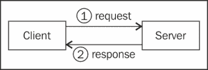

# 第十一章 使用 Java RMI、HTTP Invoker、Hessian 和 REST

在本章中，我们将介绍以下菜谱：

+   创建 Java RMI 服务

+   查询现有的 Java RMI 服务

+   创建 HTTP Invoker 服务

+   查询现有的 HTTP Invoker 服务

+   创建 Hessian 服务

+   查询现有的 Hessian 服务

+   创建 REST 服务

+   查询现有的 REST 服务

# 简介

本章是关于让 Spring 通过网络与另一件软件交互。可以使用不同的协议来完成此操作，但每个协议都使用客户端/服务器架构。Spring 可以是客户端或服务器。



Java RMI 和 HTTP Invoker 是远程方法调用技术；Java 客户端执行位于 Java 服务器上的方法，就像执行正常方法一样。请求包含方法的参数，响应包含方法的返回值。

Hessian、REST 和 SOAP 是 Web 服务；请求是发送到 Web 服务器的 HTTP 请求，它返回一个 HTTP 响应。Web 服务是平台无关的；例如，客户端可以是 Spring 应用程序（Java），而服务器可以是 PHP 应用程序。

REST 是目前最受欢迎的选项；它简单、灵活且跨平台。

作为一项经验法则，使用：

+   使用 HTTP Invoker 与另一个 Spring 应用程序交互

+   使用 Java RMI 与不使用 Spring 的另一个 Java 应用程序交互

+   当需要穿越代理和防火墙与不使用 Spring 的另一个 Java 应用程序交互时使用 Hessian

+   如果必须使用 SOAP；本章不会涉及

+   对于所有其他情况使用 REST

# 创建 Java RMI 服务

Java RMI 是一种 Java 远程方法调用技术；客户端执行位于服务器上的方法，即 Java RMI 服务。

在这个菜谱中，我们将设置一个 Java RMI 服务，该服务将公开一个普通 Java 类的方法。该服务将是现有 Spring Web 应用程序的一部分，但将使用自己的端口。

## 准备工作

服务器将公开`UserService`接口的方法：

```java
Public interface UserService {
  public abstract List<User> findAll();
  public abstract void addUser(User user);
}
```

`UserService`接口由`UserServiceImpl`实现：

```java
public class UserServiceImpl implements UserService {
  private List<User> userList = new LinkedList<User>();

  public UserServiceImpl() {
    User user1 = new User("Merlin", 777);
    userList.add(user1);

    User user2 = new User("Arthur", 123);
    userList.add(user2);
  }

  public List<User> findAll() {
    return userList;
  }

  public void addUser(User user) {
    userList.add(user);
  }  
}
```

`UserService`方法将接收和发送`User`对象：

```java
public class User implements Serializable {    
  private String name;
  private int age;

  public User(String name, int age) {
    this.name = name;
    this.age = age;
  }

  // ... getters and setters
}
```

### 注意

注意，`User`类实现了`Serializable`接口；这是必要的，因为`User`对象在通过网络传输之前需要被序列化。

## 如何做到这一点...

创建 Java RMI 服务的步骤如下：

1.  在 Spring 配置中，添加一个返回`UserServiceImpl`实例的`UserService`豆：

    ```java
    @Bean
    public UserService userService() {
      return new UserServiceImpl();
    }
    ```

1.  添加一个`RmiServiceExporter`豆。定义 Java RMI 服务名称、服务公开的接口以及实现它的对象：

    ```java
    @Bean
    public RmiServiceExporter rmiServiceExporter() {
      RmiServiceExporter rmiServiceExporter = new RmiServiceExporter();
      rmiServiceExporter.setServiceName("userService");
      rmiServiceExporter.setServiceInterface(UserService.class);
      rmiServiceExporter.setService(userService());
      return rmiServiceExporter;
    }
    ```

1.  Java RMI 服务现在可在`rmi://localhost:1099/userService`上访问。

## 它是如何工作的...

`RmiServiceExporter`是 Spring 类，它从 Java 接口（`UserService`）生成 RMI 服务。对于`UserService`中定义的每个方法，`UserServiceImpl`中的`userService()`对应的相应方法将被执行。RMI 服务默认在`1099`端口上提供。

# 查询现有 Java RMI 服务

在这个菜谱中，我们将配置一个 Spring web 应用，使其能够执行现有 RMI 服务的方法。

## 准备工作

我们将查询之前*创建 Java RMI 服务*菜谱中的 Java RMI 服务。

我们需要`UserService`接口，以便我们的应用程序知道 RMI 服务上的可用方法：

```java
public interface UserService {
  public abstract List<User> findAll();
  public abstract void addUser(User user);
}
```

`User`对象将通过网络交换，因此我们还需要之前菜谱中的`User`类：

```java
public class User implements Serializable {    
  private String name;
  private int age;

  public User(String name, int age) {
    this.name = name;
    this.age = age;
  }

  // ... getters and setters
}
```

在实际应用中，这些类可以作为 JAR 文件提供给 RMI 客户端。

## 如何实现…

这里是查询 Java RMI 服务的步骤：

1.  在 Spring 配置中，添加一个名为`userService`的`RmiProxyFactoryBean`豆。定义 Java RMI 服务 URL 和`UserService`接口：

    ```java
    @Bean(name="userService")
    public RmiProxyFactoryBean rmiProxyFactoryBean() {
      RmiProxyFactoryBean rmiProxyFactoryBean = new RmiProxyFactoryBean();
      rmiProxyFactoryBean.setServiceUrl("rmi://localhost:1099/userService");
      rmiProxyFactoryBean.setServiceInterface(UserService.class);
      return rmiProxyFactoryBean;
    }
    ```

1.  在控制器类中，添加一个自动装配的`UserService`字段：

    ```java
    @Controller
    public class UserController {
      @Autowired
      private UserService userService;
    ```

1.  在控制器方法中，执行`UserService`对象的`findAll()`方法：

    ```java
    @RequestMapping("user_list")
    @ResponseBody
    public void userList() {
      List<User> userList = userService.findAll();
    }
    ```

## 它是如何工作的…

自动装配的`UserService`对象由 Spring 在幕后创建。它实际上是一个`RmiProxyFactoryBean`对象，它将`findAll()`方法的执行委托给位于`rmi://localhost:1099/userService`的 Java RMI 服务。

# 创建 HTTP Invoker 服务

HTTP Invoker，就像 Java RMI 一样，是一种 Java 远程方法调用技术；在这里，客户端执行位于服务器上的方法——HTTP invoker 服务。使用 HTTP 而不是自定义端口，因此它可以穿越代理和防火墙。然而，它是一种 Spring 技术，因此客户端和服务器都必须使用 Java 和 Spring。

在这个菜谱中，我们将设置一个 HTTP Invoker 服务，该服务将公开一个普通 Java 类的功能。该服务将成为现有 Spring web 应用的一部分。

## 准备工作

服务器将公开`UserService`接口的方法：

```java
public interface UserService {
  public abstract List<User> findAll();
  public abstract void addUser(User user);
}
```

`UserService`接口由`UserServiceImpl`实现：

```java
public class UserServiceImpl implements UserService {
  private List<User> userList = new LinkedList<User>();

  public UserServiceImpl() {
    User user1 = new User("Merlin", 777);
    userList.add(user1);

    User user2 = new User("Arthur", 123);
    userList.add(user2);
  }

  public List<User> findAll() {
    return userList;
  }

  public void addUser(User user) {
    userList.add(user);
  }  
}
```

`UserService`方法将接收和发送`User`对象：

```java
public class User implements Serializable {    
  private String name;
  private int age;

  public User(String name, int age) {
    this.name = name;
    this.age = age;
  }

  // ... getters and setters
}
```

### 注意

注意，`User`类实现了`Serializable`接口；这是必要的，因为`User`对象在通过网络传输之前需要被序列化。

## 如何实现…

这里是创建 HTTP Invoker 服务的步骤：

1.  在 Spring 配置中，添加一个返回`UserServiceImpl`实例的`UserService`豆：

    ```java
    @Bean
    public UserService userService() {
      return new UserServiceImpl();
    }
    ```

1.  添加一个名为`/userService`的`HttpInvokerServiceExporter`豆。定义服务暴露的接口及其实现对象：

    ```java
    @Bean(name = "/userService")
    public HttpInvokerServiceExporter httpInvokerServiceExporter() {
      HttpInvokerServiceExporter exporter = new HttpInvokerServiceExporter();
      exporter.setService(userService());
      exporter.setServiceInterface(UserService.class);
      return exporter;
    }
    ```

1.  HTTP Invoker 服务现在可在 Spring web 应用的`/userService` URL 上使用。

## 它是如何工作的…

`HttpInvokerServiceExporter`是一个 Spring 类，它从 Java 接口（`UserService`）生成 HTTP Invoker 服务。对于`UserService`中定义的每个方法，`UserServiceImpl`中的`userService()`对应的相应方法将被执行。

# 查询现有的 HTTP Invoker 服务

在本配方中，我们将配置一个 Spring Web 应用程序，该应用程序将能够执行现有 HTTP Invoker 服务上的方法。

## 准备工作

我们将查询之前*创建 HTTP Invoker 服务*配方中的 HTTP Invoker 服务。

我们需要`UserService`接口，以便我们的应用程序知道 HTTP Invoker 服务上可用的方法：

```java
public interface UserService {
  public abstract List<User> findAll();
  public abstract void addUser(User user);
}
```

`User`对象将在网络上交换，因此我们还需要之前配方中的`User`类：

```java
public class User implements Serializable {    
  private String name;
  private int age;

  public User(String name, int age) {
    this.name = name;
    this.age = age;
  }

  // ... getters and setters
}
```

## 如何操作...

使用 HTTP Invoker 服务的步骤如下：

1.  在 Spring 配置中，添加一个名为`userService`的`HttpInvokerProxyFactoryBean`豆。定义 HTTP Invoker 服务 URL 和`UserService`接口：

    ```java
    @Bean(name="userService")
    public HttpInvokerProxyFactoryBean userService() {
      HttpInvokerProxyFactoryBean factory = new HttpInvokerProxyFactoryBean();
      factory.setServiceUrl("http://localhost:8080/http_invoker_server/userService");
      factory.setServiceInterface(UserService.class);
      return factory;
    }
    ```

1.  在控制器类中，添加一个`UserService`字段作为标准自动装配的服务豆：

    ```java
    @Controller
    public class UserController {
      @Autowired
      private UserService userService;
    ```

1.  在控制器方法中，执行`UserService`对象的`findAll()`方法并记录结果：

    ```java
    @RequestMapping("user_list")
    @ResponseBody
    public void userList() {
      List<User> userList = userService.findAll();
      for (User user : userList) {
        System.out.println("User " + user.getAge() + " is " + user.getAge() + " years old");
      }
    }
    ```

## 它是如何工作的...

在`UserController`类中，Spring 在幕后实例化了自动装配的`UserService`对象。它实际上是一个`HttpInvokerProxyFactoryBean`，它将`findAll()`方法的执行委托给位于`http://localhost:8080/http_invoker_server/userService`的 HTTP Invoker 服务。

# 创建 Hessian 服务

Hessian 是一种远程方法调用技术；在这里，客户端执行位于服务器上的方法——Hessian 服务。它使用 HTTP，因此可以通过代理和防火墙。它还在多种语言中实现了（PHP、Python、Ruby 等等）。因此，例如，客户端可以使用 Java，而服务器可以使用 PHP。

在本配方中，我们将向现有的 Spring Web 应用程序添加一个 Hessian 服务。它将公开 Java 类的功能。

## 准备工作

服务器将公开`UserService`接口的方法：

```java
public interface UserService {
  public abstract List<User> findAll();
  public abstract void addUser(User user);
}
```

`UserService`接口由`UserServiceImpl`实现：

```java
public class UserServiceImpl implements UserService {
  private List<User> userList = new LinkedList<User>();

  public UserServiceImpl() {
    User user1 = new User("Merlin", 777);
    userList.add(user1);

    User user2 = new User("Arthur", 123);
    userList.add(user2);
  }

  public List<User> findAll() {
    return userList;
  }

  public void addUser(User user) {
    userList.add(user);
  }  
}
```

`UserService`方法将接收和发送`User`对象：

```java
public class User {    
  private String name;
  private int age;

  public User(String name, int age) {
    this.name = name;
    this.age = age;
  }

  // ... getters and setters
}
```

### 注意

注意，`User`类不需要实现`Serializable`。Hessian 使用它自己的对象序列化机制。

## 如何操作...

创建 Hessian 服务的步骤如下：

1.  在 Spring 配置中，添加一个返回`UserServiceImpl`实例的`UserService`豆：

    ```java
    @Bean
    public UserService userService() {
      return new UserServiceImpl();
    }
    ```

1.  添加一个名为`/userService`的`HessianServiceExporter`豆。定义服务公开的接口及其实现对象：

    ```java
    @Bean(name = "/userService")
    public HessianServiceExporter hessianServiceExporter () {
      HessianServiceExporterexporter = new HessianServiceExporter ();
      exporter.setService(userService());
      exporter.setServiceInterface(UserService.class);
      return exporter;
    }
    ```

1.  Hessian 服务现在可在 Spring Web 应用程序的`/userService` URL 上使用。

## 它是如何工作的...

`HessianServiceExporter`是一个 Spring 类，它从 Java 接口（`UserService`）生成 Hessian 服务。对于`UserService`中定义的每个方法，`UserServiceImpl`中的`userService()`对应的相应方法将被执行。

# 查询现有的 Hessian 服务

在这个菜谱中，我们将配置一个 Spring Web 应用程序，使其能够执行现有 Hessian 服务的某个方法。

## 准备工作

我们将查询之前 *创建 Hessian 服务* 菜谱中的 Hessian 服务。

我们需要 `UserService` 接口，以便我们的应用程序知道 Hessian 服务的可用方法：

```java
public interface UserService {
  public abstract List<User> findAll();
  public abstract void addUser(User user);
}
```

`User` 对象将通过网络交换，因此我们需要之前菜谱中的 `User` 类：

```java
public class User implements Serializable {    
  private String name;
  private int age;

  public User(String name, int age) {
    this.name = name;
    this.age = age;
  }

  // ... getters and setters
}
```

## 如何实现...

使用 Hessian 服务的步骤如下：

1.  在 Spring 配置中，添加一个名为 `userService` 的 `HessianProxyFactoryBean` Bean。定义 Hessian 服务 URL 和 `UserService` 接口：

    ```java
    @Bean(name="userService")
    public HessianProxyFactoryBean userService() {
      HessianProxyFactoryBean factory = new HessianProxyFactoryBean();
      factory.setServiceUrl("http://localhost:8080/hessian_server/userService");
      factory.setServiceInterface(UserService.class);
      return factory;
    }
    ```

1.  在控制器类中，添加一个 `UserService` 字段作为标准自动装配的服务 Bean：

    ```java
    @Controller
    public class UserController {
      @Autowired
      private UserService userService;
    ```

1.  在控制器方法中，执行 `UserService` 对象的 `findAll()` 方法并记录结果：

    ```java
    @RequestMapping("user_list")
    @ResponseBody
    public void userList() {
      List<User> userList = userService.findAll();
      for (User user : userList) {
        System.out.println("User " + user.getAge() + " is " + user.getAge() + " years old");
      }
    }
    ```

## 它是如何工作的...

在 `UserController` 类中，自动装配的 `UserService` 对象由 Spring 在幕后实例化。它实际上是一个 `HessianProxyFactoryBean`，它将 `findAll()` 方法的执行委托给位于 `http://localhost:8080/hessian/userService` 的 Hessian 服务。

# 创建 REST 服务

REST 使用 Web 服务架构；在这里，客户端向服务器发送 HTTP 请求，服务器返回 HTTP 响应。大多数情况下使用 JSON 进行数据传输。服务器支持的 URL 列表称为 REST API。这些 URL 使用不同的 HTTP 方法保持简单。例如，使用 GET 方法的 `/users/3` 请求将返回 ID 为 3 的用户。使用 DELETE 方法的 `/users/3` 请求将删除该用户。

在这个菜谱中，我们将创建一个简单的 REST 服务，允许 REST 客户端查询和修改服务器上 `User` 对象的列表。

## 准备工作

我们将使用 `User` 类：

```java
public class User {

  private Long id;
  private String name;
  private int age;

  public User() {
  }

  public User(Long id, String name, int age) {
    this.id = id;
    this.name = name;
    this.age = age;
  }

  // ... getters and setters
}
```

我们将使用具有预设用户列表的 `UserService` 类：

```java
public class UserService {

  List<User> userList = new LinkedList<User>();

  public UserService() {
    User user1 = new User(1L, "Merlin", 777);
    userList.add(user1);

    User user2 = new User(2L, "Arthur", 123);
    userList.add(user2);
  }

  public List<User> findAll() {
    return userList;
  }

  public User findUser(Long id) {
    for (User user : userList) {
      if(user.getId().equals(id)) {
        return user;
      }
    }
    return null;
  }
}
```

## 如何实现...

创建 REST 服务的步骤如下：

1.  在 `pom.xml` 中添加 `jackson` 的 Maven 依赖项：

    ```java
    <dependency>
      <groupId>com.fasterxml.jackson.core</groupId>
      <artifactId>jackson-core</artifactId>
      <version>2.4.2</version>
    </dependency>

    <dependency>
      <groupId>com.fasterxml.jackson.core</groupId>
      <artifactId>jackson-databind</artifactId>
      <version>2.4.2</version>
    </dependency>
    ```

1.  在 Spring 配置中，添加一个 `UserService` Bean：

    ```java
    @Bean
    public UserService userService() {
      return new UserService();
    }
    ```

1.  创建一个控制器类，其 URL 前缀使用 `@RestController` 注解：

    ```java
    @RestController
    @RequestMapping("users*")
    public class UserController {
    }
    ```

1.  添加一个自动装配的 `UserService` 字段：

    ```java
    @Autowired
    private UserService userService;
    ```

1.  添加一个控制器方法，返回所有用户的列表：

    ```java
    @RequestMapping
    public List<User> userList() {
      List<User> userList = userService.findAll();
      return userList;
    }
    ```

1.  添加一个控制器方法，返回与给定 ID 对应的用户：

    ```java
    @RequestMapping("/{id}")
    public User findUser(@PathVariable("id") Long userId) {
      User user = userService.findUser(userId);
      return user;
    }
    ```

1.  Spring Web 应用程序现在是一个 REST 服务。它将对 `/users` 和 `/users/1` URL 请求返回序列化为 JSON 的 User 对象。

## 它是如何工作的...

`UserController` 是一个标准的 Spring 控制器，除了 `@RestController` 注解外，它将自动将控制器方法返回的对象转换为 JSON，使用 Jackson 库。

## 还有更多...

要使用特定的 HTTP 方法，在 `@RequestMapping` 注解中添加 `method` 参数：

```java
@RequestMapping(value = "/{id}", method = RequestMethod.POST)
```

为了保护 REST 服务：

+   使用 HTTPS 以确保客户端和服务器之间的数据传输被加密。请参考第六章中关于*使用 HTTPS 与 Tomcat*的配方，*管理安全*。

+   如果只想允许授权客户端查询，可以使用 HTTP 基本认证。请参考第六章中关于*使用默认登录页面认证用户*的配方，*管理安全*，特别是`httpBasic()`方法。另一种可能性是使用 OAuth 工作流程。这更复杂，但避免了客户端在每次请求时都需要发送用户名和密码。例如，Facebook 和 Twitter 就是选择这种方法来处理它们的 REST API。

# 查询现有 REST 服务

在这个配方中，我们将从一个 Spring 控制器方法中检索现有 REST 服务的数据。

## 准备工作

我们将查询之前*创建 REST 服务*配方中的 REST 服务。

我们将把从 REST 服务接收到的 JSON 数据转换为`User`对象。我们将使用这个`User`类：

```java
public class User implements {    
  private String name;
  private int age;

  // ... getters and setters
}
```

## 如何操作...

使用 REST 服务的步骤如下：

1.  在`pom.xml`中添加 Jackson 的 Maven 依赖项：

    ```java
    <dependency>
      <groupId>com.fasterxml.jackson.core</groupId>
      <artifactId>jackson-core</artifactId>
      <version>2.4.2</version>
    </dependency>

    <dependency>
      <groupId>com.fasterxml.jackson.core</groupId>
      <artifactId>jackson-databind</artifactId>
      <version>2.4.2</version>
    </dependency>
    ```

1.  在控制器方法中，定义要查询的 REST 服务的 URL：

    ```java
    String url = "http://localhost:8080/rest_server/users/2";
    ```

1.  使用`RestTemplate`类及其`getForObject()`方法查询 REST 服务并从 JSON 响应中生成`User`对象：

    ```java
    RestTemplate restTemplate = new RestTemplate();
    User user = restTemplate.getForObject(url, User.class);
    ```

## 工作原理...

`RestTemplate`是 Spring 提供的一个类，它提供了查询 REST 服务并从接收到的 JSON 响应中生成 Java 对象的方法。

## 更多内容...

如果响应是对象列表，将数组类作为第二个参数传递以生成对象数组：

```java
User[] userList = restTemplate.getForObject(url, User[].class);
```
