# 第一章：使用 Spring Boot 构建 Microservices

正如我们在上一课中讨论的，我们正在向具有更小、独立可部署的微服务的架构迈进。这意味着将会有大量的较小微服务被开发。

一个重要的后果是，我们需要能够快速启动并运行新的组件。

Spring Boot 旨在解决快速启动新组件的问题。在本课中，我们将从了解 Spring Boot 带来的功能开始。我们将回答以下问题：

+   为什么选择 Spring Boot？

+   Spring Boot 提供了哪些功能？

+   什么是自动配置？

+   Spring Boot 不是什么？

+   当你使用 Spring Boot 时，后台会发生什么？

+   你如何使用 Spring Initializr 创建新的 Spring Boot 项目？

+   你如何使用 Spring Boot 创建基本的 RESTful 服务？

# 什么是 Spring Boot？

首先，让我们先澄清一些关于 Spring Boot 的误解：

+   Spring Boot 不是一个代码生成框架。它不会生成任何代码。

+   Spring Boot 既不是应用服务器，也不是网络服务器。它与不同范围的应用程序和网络服务器提供了良好的集成。

+   Spring Boot 不实现任何特定的框架或规范。

这些问题仍然存在：

+   什么是 Spring Boot？

+   为什么它在过去几年变得如此流行？

为了回答这些问题，让我们构建一个快速示例。让我们考虑一个你想要快速原型化的示例应用程序。

## 为微服务构建快速原型

假设我们想要使用 Spring MVC 和 JPA（以 Hibernate 作为实现）来连接数据库，构建一个微服务。

让我们考虑设置此类应用程序的步骤：

1.  决定要使用哪些版本的 Spring MVC、JPA 和 Hibernate。

1.  设置 Spring 上下文以将所有不同的层连接在一起。

1.  使用 Spring MVC（包括 Spring MVC 配置）设置一个网络层：

    +   为 DispatcherServlet、处理器、解析器、视图解析器等配置 Bean

1.  在数据层设置 Hibernate：

    +   为 SessionFactory、数据源等配置 Bean

1.  决定并实现如何存储你的应用程序配置，这些配置在不同环境中会有所不同。

1.  决定你将如何进行单元测试。

1.  决定并实现你的事务管理策略。

1.  决定并实现如何实现安全性。

1.  设置你的日志框架。

1.  决定并实现你希望在生产中监控应用程序的方式。

1.  决定并实现一个指标管理系统，以提供有关应用程序的统计数据。

1.  决定并实现如何将你的应用程序部署到网络或应用服务器。

至少有一些提到的步骤必须在我们可以开始构建我们的业务逻辑之前完成。这至少需要几周的时间。

当我们构建微服务时，我们希望快速开始。所有前面的步骤都不会使开发微服务变得容易。这正是 Spring Boot 旨在解决的问题。

以下引用摘自 Spring Boot 网站([`docs.spring.io/spring-boot/docs/current-SNAPSHOT/reference/htmlsingle/#boot-documentation`](http://docs.spring.io/spring-boot/docs/current-SNAPSHOT/reference/htmlsingle/#boot-documentation))：

> Spring Boot 使得创建独立、生产级别的基于 Spring 的应用程序变得容易，你可以“直接运行”。我们对 Spring 平台和第三方库持有一个有见地的观点，这样你可以以最小的麻烦开始。大多数 Spring Boot 应用程序需要非常少的 Spring 配置
> 
> Spring Boot 使开发者能够专注于微服务背后的业务逻辑。它旨在处理开发微服务所涉及的所有繁琐的技术细节。

## 主要目标

Spring Boot 的主要目标如下：

+   使基于 Spring 的项目能够快速启动。

+   有见地。基于常见用法做出默认假设。提供配置选项以处理与默认值的偏差。

+   提供一系列开箱即用的非功能性特性。

+   不使用代码生成，并避免使用大量的 XML 配置。

## 非功能性特性

Spring Boot 提供的部分非功能性特性如下：

+   默认处理各种框架、服务器和规范的版本和配置

+   应用程序安全性的默认选项

+   默认应用度量并提供扩展的可能性

+   使用健康检查进行基本的应用程序监控

+   多种外部化配置选项

# Spring Boot Hello World

我们将在本课中开始构建我们的第一个 Spring Boot 应用程序。我们将使用 Maven 来管理依赖。

启动 Spring Boot 应用程序涉及以下步骤：

1.  在你的`pom.xml`文件中配置`spring-boot-starter-parent`。

1.  配置`pom.xml`文件以包含所需的启动项目。

1.  配置`spring-boot-maven-plugin`以能够运行应用程序。

1.  创建你的第一个 Spring Boot 启动类。

让我们从第一步，配置启动项目开始。

## 配置 spring-boot-starter-parent

让我们从包含`spring-boot-starter-parent`的简单`pom.xml`文件开始：

```java
    <project 

     xsi:schemaLocation="http://maven.apache.org/POM/4.0.0
     http://maven.apache.org/xsd/maven-4.0.0.xsd">
    <modelVersion>4.0.0</modelVersion>
    <groupId>com.mastering.spring</groupId> 
    <artifactId>springboot-example</artifactId> 
    <version>0.0.1-SNAPSHOT</version> 
    <name>First Spring Boot Example</name> 
    <packaging>war</packaging>
    <parent> 
      <groupId>org.springframework.boot</groupId> 
      <artifactId>spring-boot-starter-parent</artifactId>  
      <version>2.0.0.M1</version>
    </parent>
    <properties> 
      <java.version>1.8</java.version> 
    </properties>

   <repositories>
    <repository>
      <id>spring-milestones</id>
      <name>Spring Milestones</name>
      <url>https://repo.spring.io/milestone</url>
      <snapshots>
        <enabled>false</enabled>
      </snapshots>
    </repository>
   </repositories>

   <pluginRepositories>
    <pluginRepository>
      <id>spring-milestones</id>
      <name>Spring Milestones</name>
      <url>https://repo.spring.io/milestone</url>
        <snapshots>
          <enabled>false</enabled>
        </snapshots>
     </pluginRepository>
    </pluginRepositories>

</project>
```

第一个问题是这样的：为什么我们需要`spring-boot-starter-parent`？

`spring-boot-starter-parent`依赖包含要使用的 Java 默认版本、Spring Boot 使用的依赖默认版本以及 Maven 插件的默认配置。

### 注意

`spring-boot-starter-parent`依赖是提供基于 Spring Boot 应用程序的依赖和插件管理的父 POM。

让我们看看`spring-boot-starter-parent`内部的代码，以更深入地了解`spring-boot-starter-parent`。

## spring-boot-starter-parent

`spring-boot-starter-parent` 依赖项继承自 `spring-boot-dependencies`，它在 POM 的顶部定义。以下代码片段展示了 `spring-boot-starter-parent` 的一个摘录：

```java
    <parent>
      <groupId>org.springframework.boot</groupId>
      <artifactId>spring-boot-dependencies</artifactId>
      <version>2.0.0.M1</version>
      <relativePath>../../spring-boot-dependencies</relativePath>
   </parent>
```

`spring-boot-dependencies` 为 Spring Boot 使用的所有依赖项提供默认的依赖管理。以下代码展示了在 `spring-boot-dependencies` 中配置的各种依赖项的不同版本：

```java
<activemq.version>5.13.4</activemq.version>
<aspectj.version>1.8.9</aspectj.version>
<ehcache.version>2.10.2.2.21</ehcache.version>
<elasticsearch.version>2.3.4</elasticsearch.version>
<gson.version>2.7</gson.version>
<h2.version>1.4.192</h2.version>
<hazelcast.version>3.6.4</hazelcast.version>
<hibernate.version>5.0.9.Final</hibernate.version>
<hibernate-validator.version>5.2.4.Final</hibernate
  validator.version>
<hsqldb.version>2.3.3</hsqldb.version>
<htmlunit.version>2.21</htmlunit.version>
<jackson.version>2.8.1</jackson.version>
<jersey.version>2.23.1</jersey.version>
<jetty.version>9.3.11.v20160721</jetty.version>
<junit.version>4.12</junit.version>
<mockito.version>1.10.19</mockito.version>
<selenium.version>2.53.1</selenium.version>
<servlet-api.version>3.1.0</servlet-api.version>
<spring.version>4.3.2.RELEASE</spring.version>
<spring-amqp.version>1.6.1.RELEASE</spring-amqp.version>
<spring-batch.version>3.0.7.RELEASE</spring-batch.version>
<spring-data-releasetrain.version>Hopper-SR2</spring-
  data-releasetrain.version>
<spring-hateoas.version>0.20.0.RELEASE</spring-hateoas.version>
<spring-restdocs.version>1.1.1.RELEASE</spring-restdocs.version>
<spring-security.version>4.1.1.RELEASE</spring-security.version>
<spring-session.version>1.2.1.RELEASE</spring-session.version>
<spring-ws.version>2.3.0.RELEASE</spring-ws.version>
<thymeleaf.version>2.1.5.RELEASE</thymeleaf.version>
<tomcat.version>8.5.4</tomcat.version>
<xml-apis.version>1.4.01</xml-apis.version>
```

如果我们想覆盖特定版本的依赖项，我们可以在应用程序的 `pom.xml` 文件中提供一个具有正确名称的属性来实现。以下代码片段展示了如何配置我们的应用程序使用 Mockito 的 1.10.20 版本：

```java
    <properties>
     <mockito.version>1.10.20</mockito.version>
    </properties>
```

以下是在 `spring-boot-starter-parent` 中定义的一些其他内容：

+   默认的 Java 版本 `<java.version>1.8</java.version>`

+   Maven 插件的默认配置：

    +   `maven-failsafe-plugin`

    +   `maven-surefire-plugin`

    +   `git-commit-id-plugin`

不同框架版本之间的兼容性是开发者面临的主要问题之一。我如何找到与特定版本 Spring 兼容的最新 Spring Session 版本？通常的答案会是阅读文档。然而，如果我们使用 Spring Boot，这通过 `spring-boot-starter-parent` 变得简单。如果我们想升级到较新的 Spring 版本，我们只需要找到那个 Spring 版本的 `spring-boot-starter-parent` 依赖项。一旦我们将应用程序升级到使用那个特定的 `spring-boot-starter-parent` 版本，我们就会拥有所有其他依赖项升级到与新 Spring 版本兼容的版本。这减少了开发者需要处理的问题。总是让我感到高兴。

## 使用必需的入门项目配置 pom.xml

每当我们想在 Spring Boot 中构建应用程序时，我们都需要开始寻找入门项目。让我们专注于理解入门项目是什么。

### 理解入门项目

入门项目是针对不同目的简化的依赖描述符。例如，`spring-boot-starter-web` 是用于构建 Web 应用程序（包括 RESTful）的入门项目，使用 Spring MVC。它使用 Tomcat 作为默认的嵌入式容器。如果我想使用 Spring MVC 开发 Web 应用程序，我们只需要在我们的依赖项中包含 `spring-boot-starter-web`，我们就会自动获得以下预配置：

+   Spring MVC

+   `jackson-databind`（用于绑定）和 hibernate-validator（用于表单验证）的兼容版本

+   `spring-boot-starter-tomcat`（Tomcat 的入门项目）

以下代码片段展示了在 `spring-boot-starter-web` 中配置的一些依赖项：

```java
    <dependencies>
        <dependency>
          <groupId>org.springframework.boot</groupId>
          <artifactId>spring-boot-starter</artifactId>
        </dependency>
        <dependency>
          <groupId>org.springframework.boot</groupId>
          <artifactId>spring-boot-starter-tomcat</artifactId>
        </dependency>
        <dependency>
          <groupId>org.hibernate</groupId>
          <artifactId>hibernate-validator</artifactId>
        </dependency>
        <dependency>
          <groupId>com.fasterxml.jackson.core</groupId>
          <artifactId>jackson-databind</artifactId>
        </dependency>
        <dependency>
          <groupId>org.springframework</groupId>
          <artifactId>spring-web</artifactId>
        </dependency>
        <dependency>
          <groupId>org.springframework</groupId>
          <artifactId>spring-webmvc</artifactId>
       </dependency>
    </dependencies>
```

正如前一个摘录中所示，当我们使用 `spring-boot-starter-web` 时，我们会自动配置许多框架。

对于我们想要构建的 Web 应用程序，我们还想做一些良好的单元测试，并在 Tomcat 上部署它。以下片段显示了我们需要的不同启动依赖项。我们需要将其添加到我们的 `pom.xml` 文件中：

```java
    <dependencies>
      <dependency>
        <groupId>org.springframework.boot</groupId>
        <artifactId>spring-boot-starter-web</artifactId>
     </dependency>
     <dependency>
       <groupId>org.springframework.boot</groupId>
       <artifactId>spring-boot-starter-test</artifactId>
       <scope>test</scope>
     </dependency>
     <dependency>
       <groupId>org.springframework.boot</groupId>
       <artifactId>spring-boot-starter-tomcat</artifactId>
       <scope>provided</scope>
     </dependency>
    </dependencies>
```

我们添加了三个启动项目：

+   我们已经讨论了 `spring-boot-starter-web`。它为我们提供了构建带有 Spring MVC 的 Web 应用程序所需的框架。

+   `spring-boot-starter-test` 依赖项提供了以下单元测试所需的测试框架：

    +   **JUnit**：基本的单元测试框架

    +   **Mockito**：用于模拟

    +   **Hamcrest**、**AssertJ**：用于可读断言

    +   **Spring Test**：基于 spring-context 的应用程序的单元测试框架

+   `spring-boot-starter-tomcat` 依赖项是运行 Web 应用程序时的默认选项。我们包括它以增加清晰度。`spring-boot-starter-tomcat` 是使用 Tomcat 作为嵌入式 Servlet 容器的启动器。

我们现在已经配置了 `pom.xml` 文件，包括启动父项目和所需的启动项目。现在让我们添加 `spring-boot-maven-plugin`，这将使我们能够运行 Spring Boot 应用程序。

## 配置 spring-boot-maven-plugin

当我们使用 Spring Boot 构建应用程序时，可能存在几种情况：

+   我们希望在不构建 JAR 或 WAR 文件的情况下运行应用程序

+   我们希望构建 JAR 和 WAR 文件以供后续部署

`spring-boot-maven-plugin` 依赖项为上述两种情况都提供了功能。以下片段显示了如何在应用程序中配置 `spring-boot-maven-plugin`：

```java
    <build>
     <plugins>
      <plugin>
        <groupId>org.springframework.boot</groupId>
        <artifactId>spring-boot-maven-plugin</artifactId>
      </plugin>
     </plugins>
    </build>
```

`spring-boot-maven-plugin` 依赖项为 Spring Boot 应用程序提供了几个目标。最受欢迎的目标是运行（这可以在项目根目录的命令提示符下作为 `mvn spring-boot:run` 执行）。

## 创建您的第一个 Spring Boot 启动类

以下类解释了如何创建一个简单的 Spring Boot 启动类。它使用 `SpringApplication` 类中的静态 `run` 方法，如下面的代码片段所示：

```java
    package com.mastering.spring.springboot;
    import org.springframework.boot.SpringApplication;
    import org.springframework.boot
    autoconfigure.SpringBootApplication;
    import org.springframework.context.ApplicationContext;
    @SpringBootApplication public class Application {
       public static void main(String[] args)
        { 
         ApplicationContext ctx = SpringApplication.run
         (Application.class,args);
        }
     }
```

上一段代码是一个简单的 Java `main` 方法，在 `SpringApplication` 类上执行静态 `run` 方法。

### SpringApplication 类

`SpringApplication` 类可用于从 Java `main` 方法中引导和启动 Spring 应用程序。

以下是在 Spring Boot 应用程序启动时通常执行的步骤：

1.  创建 Spring 的 `ApplicationContext` 实例。

1.  启用接受命令行参数并将其作为 Spring 属性公开的功能。

1.  根据配置加载所有 Spring Bean。

### `@SpringBootApplication` 注解

`@SpringBootApplication` 注解是三个注解的快捷方式：

+   `@Configuration`：表示这是一个 Spring 应用程序上下文配置文件。

+   `@EnableAutoConfiguration`：启用自动配置，这是 Spring Boot 的重要功能。我们将在单独的部分中稍后讨论自动配置。

+   `@ComponentScan`：启用在此类及其所有子包中扫描 Spring bean。

## 运行我们的 Hello World 应用程序

我们可以用多种方式运行 Hello World 应用程序。让我们从最简单的方式开始运行它--以 Java 应用程序的方式运行。在你的 IDE 中，右键单击应用程序**类**，然后以**Java 应用程序**的方式运行它。以下截图显示了运行我们的`Hello World`应用程序的一些日志：

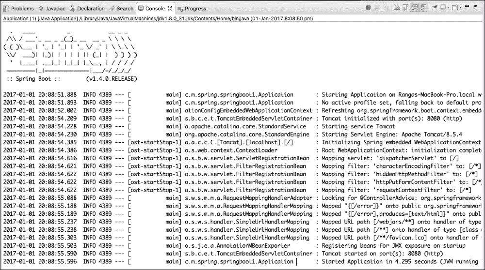

以下是需要注意的关键事项：

+   Tomcat 服务器在端口`8080`上启动--`Tomcat 在端口(s): 8080 (http)上启动`。

+   `DispatcherServlet`已配置。这意味着 Spring MVC 框架已准备好接受请求--`将 servlet: 'dispatcherServlet'映射到[/]`。

+   默认启用了四个过滤器--`characterEncodingFilter`、`hiddenHttpMethodFilter`、`httpPutFormContentFilter`和`requestContextFilter`

+   默认错误页面已配置--`将"{[/error]}"映射到公共 org.springframework.http.ResponseEntity<java.util.Map<java.lang.String, java.lang.Object>> org.springframework.boot.autoconfigure.web.BasicErrorController.error(javax.servlet.http.HttpServletRequest)`

+   WebJars 已自动配置。WebJars 使静态依赖项（如 Bootstrap 和查询）的依赖项管理成为可能--`将 URL 路径[/webjars/**]映射到类型为[class org.springframework.web.servlet.resource.ResourceHttpRequestHandler]`的处理程序`

以下截图显示了当前的应用程序布局。我们只有两个文件，`pom.xml`和`Application.java`：

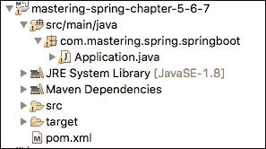

仅使用一个简单的`pom.xml`文件和一个 Java 类，我们就能够启动 Spring MVC 应用程序，并具有前面描述的所有功能。关于 Spring Boot 最重要的东西是理解后台发生了什么。理解前面的启动日志是第一步。让我们看看 Maven 依赖项以获得更清晰的了解。

以下截图显示了我们在创建的`pom.xml`文件中的基本配置中配置的一些依赖项：

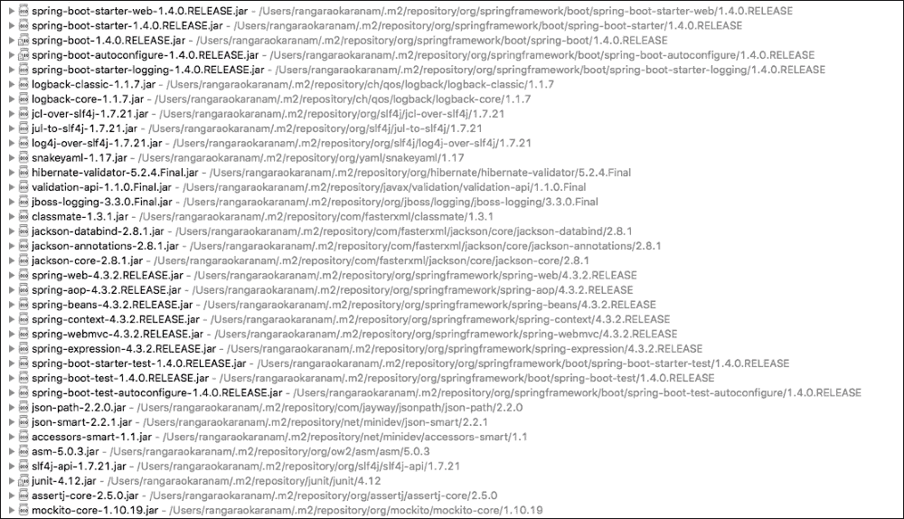

Spring Boot 做了很多魔法。一旦你的应用程序配置并运行，我建议你玩一玩它，以获得更深入的理解，这将有助于你在调试问题时。

正如蜘蛛侠所说，能力越大，责任越大。这在 Spring Boot 的情况下绝对正确。在未来的时间里，最好的 Spring Boot 开发者将是那些理解后台发生什么的人--依赖项和自动配置。

## 自动配置

为了让我们进一步理解自动配置，让我们扩展我们的应用程序类以包含更多代码行：

```java
    ApplicationContext ctx = SpringApplication.run(Application.class,
     args);
    String[] beanNames = ctx.getBeanDefinitionNames();
    Arrays.sort(beanNames);

   for (String beanName : beanNames) {
     System.out.println(beanName);
    }
```

我们获取在 Spring 应用程序上下文中定义的所有 bean 并打印它们的名称。当`Application.java`作为 Java 程序运行时，它将打印 bean 列表，如下面的输出所示：

```java
application
basicErrorController
beanNameHandlerMapping
beanNameViewResolver
characterEncodingFilter
conventionErrorViewResolver
defaultServletHandlerMapping
defaultViewResolver
dispatcherServlet
dispatcherServletRegistration
duplicateServerPropertiesDetector
embeddedServletContainerCustomizerBeanPostProcessor
error
errorAttributes
errorPageCustomizer
errorPageRegistrarBeanPostProcessor
faviconHandlerMapping
faviconRequestHandler
handlerExceptionResolver
hiddenHttpMethodFilter
httpPutFormContentFilter
httpRequestHandlerAdapter
jacksonObjectMapper
jacksonObjectMapperBuilder
jsonComponentModule
localeCharsetMappingsCustomizer
mappingJackson2HttpMessageConverter
mbeanExporter
mbeanServer
messageConverters
multipartConfigElement
multipartResolver
mvcContentNegotiationManager
mvcConversionService
mvcPathMatcher
mvcResourceUrlProvider
mvcUriComponentsContributor
mvcUrlPathHelper
mvcValidator
mvcViewResolver
objectNamingStrategy
autoconfigure.AutoConfigurationPackages
autoconfigure.PropertyPlaceholderAutoConfiguration
autoconfigure.condition.BeanTypeRegistry
autoconfigure.context.ConfigurationPropertiesAutoConfiguration
autoconfigure.info.ProjectInfoAutoConfiguration
autoconfigure.internalCachingMetadataReaderFactory
autoconfigure.jackson.JacksonAutoConfiguration
autoconfigure.jackson.JacksonAutoConfiguration$Jackson2ObjectMapperBuilderCustomizerConfiguration
autoconfigure.jackson.JacksonAutoConfiguration$JacksonObjectMapperBuilderConfiguration
autoconfigure.jackson.JacksonAutoConfiguration$JacksonObjectMapperConfiguration
autoconfigure.jmx.JmxAutoConfiguration
autoconfigure.web.DispatcherServletAutoConfiguration
autoconfigure.web.DispatcherServletAutoConfiguration$DispatcherServletConfiguration
autoconfigure.web.DispatcherServletAutoConfiguration$DispatcherServletRegistrationConfiguration
autoconfigure.web.EmbeddedServletContainerAutoConfiguration
autoconfigure.web.EmbeddedServletContainerAutoConfiguration$EmbeddedTomcat
autoconfigure.web.ErrorMvcAutoConfiguration
autoconfigure.web.ErrorMvcAutoConfiguration$WhitelabelErrorViewConfiguration
autoconfigure.web.HttpEncodingAutoConfiguration
autoconfigure.web.HttpMessageConvertersAutoConfiguration
autoconfigure.web.HttpMessageConvertersAutoConfiguration$StringHttpMessageConverterConfiguration
autoconfigure.web.JacksonHttpMessageConvertersConfiguration
autoconfigure.web.JacksonHttpMessageConvertersConfiguration$MappingJackson2HttpMessageConverterConfiguration
autoconfigure.web.MultipartAutoConfiguration
autoconfigure.web.ServerPropertiesAutoConfiguration
autoconfigure.web.WebClientAutoConfiguration
autoconfigure.web.WebClientAutoConfiguration$RestTemplateConfiguration
autoconfigure.web.WebMvcAutoConfiguration
autoconfigure.web.WebMvcAutoConfiguration$EnableWebMvcConfiguration
autoconfigure.web.WebMvcAutoConfiguration$WebMvcAutoConfigurationAdapter
autoconfigure.web.WebMvcAutoConfiguration$WebMvcAutoConfigurationAdapter$FaviconConfiguration
autoconfigure.websocket.WebSocketAutoConfiguration
autoconfigure.websocket.WebSocketAutoConfiguration$TomcatWebSocketConfiguration
context.properties.ConfigurationPropertiesBindingPostProcessor
context.properties.ConfigurationPropertiesBindingPostProcessor.store
annotation.ConfigurationClassPostProcessor.enhancedConfigurationProcessor
annotation.ConfigurationClassPostProcessor.importAwareProcessor
annotation.internalAutowiredAnnotationProcessor
annotation.internalCommonAnnotationProcessor
annotation.internalConfigurationAnnotationProcessor
annotation.internalRequiredAnnotationProcessor
event.internalEventListenerFactory
event.internalEventListenerProcessor
preserveErrorControllerTargetClassPostProcessor
propertySourcesPlaceholderConfigurer
requestContextFilter
requestMappingHandlerAdapter
requestMappingHandlerMapping
resourceHandlerMapping
restTemplateBuilder
serverProperties
simpleControllerHandlerAdapter
spring.http.encoding-autoconfigure.web.HttpEncodingProperties
spring.http.multipart-autoconfigure.web.MultipartProperties
spring.info-autoconfigure.info.ProjectInfoProperties
spring.jackson-autoconfigure.jackson.JacksonProperties
spring.mvc-autoconfigure.web.WebMvcProperties
spring.resources-autoconfigure.web.ResourceProperties
standardJacksonObjectMapperBuilderCustomizer
stringHttpMessageConverter
tomcatEmbeddedServletContainerFactory
viewControllerHandlerMapping
viewResolver
websocketContainerCustomizer
```

需要考虑的重要事项如下：

+   这些 bean 在哪里定义？

+   这些 bean 是如何创建的？

这就是 Spring 自动配置的魔力。

每当我们向 Spring Boot 项目添加一个新的依赖项时，Spring Boot 自动配置会自动尝试根据依赖项配置 bean。

例如，当我们向`spring-boot-starter-web`添加依赖项时，以下 bean 将被自动配置：

+   `basicErrorController`、`handlerExceptionResolver`：它是基本的异常处理。当发生异常时，它显示默认的错误页面。

+   `beanNameHandlerMapping`：它用于解析到处理器（控制器）的路径。

+   `characterEncodingFilter`：它提供默认字符编码 UTF-8。

+   `dispatcherServlet`：它是 Spring MVC 应用程序的前端控制器。

+   `jacksonObjectMapper`：它在 REST 服务中将对象转换为 JSON，并将 JSON 转换为对象。

+   `messageConverters`：它是默认的消息转换器，用于将对象转换为 XML 或 JSON，反之亦然。

+   `multipartResolver`：它为 Web 应用程序提供上传文件的支持。

+   `mvcValidator`：它支持 HTTP 请求的验证。

+   `viewResolver`：它将逻辑视图名称解析为物理视图。

+   `propertySourcesPlaceholderConfigurer`：它支持应用程序配置的外部化。

+   `requestContextFilter`：它默认为请求设置过滤器。

+   `restTemplateBuilder`：它用于调用 REST 服务。

+   `tomcatEmbeddedServletContainerFactory`：Tomcat 是 Spring Boot 基于 Web 应用程序的默认嵌入式 servlet 容器。

在下一节中，让我们看看一些入门项目和它们提供的自动配置。

## 入门项目

下表显示了 Spring Boot 提供的一些重要入门项目：

| 入门项目 | 描述 |
| --- | --- |
| `spring-boot-starter-webservices` | 这是一个用于开发基于 XML 的 Web 服务的入门项目。 |
| `spring-boot-starter-web` | 这是一个用于构建基于 Spring MVC 的 Web 应用程序或 RESTful 应用程序的入门项目。它使用 Tomcat 作为默认的嵌入式 servlet 容器。 |
| `spring-boot-starter-activemq` | 这支持在 ActiveMQ 上使用 JMS 进行基于消息的通信。 |
| `spring-boot-starterintegration` | 这支持提供企业集成模式实现的 Spring Integration 框架。 |
| `spring-boot-starter-test` | 这提供了对各种单元测试框架的支持，例如 JUnit、Mockito 和 Hamcrest 匹配器。 |
| `spring-boot-starter-jdbc` | 这提供了使用 Spring JDBC 的支持。它默认配置了一个 Tomcat JDBC 连接池。 |
| `spring-boot-startervalidation` | 这提供了对 Java Bean Validation API 的支持。它的默认实现是 hibernate-validator。 |
| `spring-boot-starter-hateoas` | HATEOAS 代表超媒体作为应用程序状态引擎。使用 HATEOAS 的 RESTful 服务除了数据外，还返回与当前上下文相关的附加资源的链接。 |
| `spring-boot-starter-jersey` | JAX-RS 是 Java EE 标准用于开发 REST API。Jersey 是默认实现。此启动项目提供了基于 JAX-RS 的 REST API 的支持。 |
| `spring-boot-starter-websocket` | HTTP 是无状态的。WebSockets 允许你保持服务器和浏览器之间的连接。此启动项目提供了对 Spring WebSockets 的支持。 |
| `spring-boot-starter-aop` | 这提供了对面向方面编程的支持。它还提供了对 AspectJ 的支持，用于高级面向方面编程。 |
| `spring-boot-starter-amqp` | 以 RabbitMQ 为默认，此启动项目提供了基于 AMQP 的消息传递。 |
| `spring-boot-starter-security` | 此启动项目使 Spring Security 的自动配置成为可能。 |
| `spring-boot-starter-data-jpa` | 这提供了对 Spring Data JPA 的支持。其默认实现是 Hibernate。 |
| `spring-boot-starter` | 这是 Spring Boot 应用程序的基础启动项目。它提供了自动配置和日志记录的支持。 |
| `spring-boot-starter-batch` | 这提供了使用 Spring Batch 开发批处理应用程序的支持。 |
| `spring-boot-starter-cache` | 这是使用 Spring 框架进行缓存的基本支持。 |
| `spring-boot-starter-data-rest` | 这是使用 Spring Data REST 暴露 REST 服务的支持。 |

到目前为止，我们已经设置了一个基本的 Web 应用程序，并理解了与 Spring Boot 相关的一些重要概念：

+   自动配置

+   启动项目

+   `spring-boot-maven-plugin`

+   `spring-boot-starter-parent`

+   注解 `@SpringBootApplication`

现在，让我们将重点转向理解 REST 是什么以及如何构建 REST 服务。 

# 什么是 REST？

**表征状态转移** (**REST**) 基本上是一种网络架构风格。REST 规定了一系列约束。这些约束确保客户端（服务消费者和浏览器）可以以灵活的方式与服务器交互。

让我们先了解一些常见的术语：

+   **服务器**：服务提供者。提供客户端可以消费的服务。

+   **客户端**：服务消费者。可能是浏览器或另一个系统。

+   **资源**：任何信息都可以是资源：一个人、一张图片、一个视频或你想要出售的产品。

+   **表示**：资源可以表示的特定方式。例如，产品资源可以使用 JSON、XML 或 HTML 来表示。不同的客户端可能会请求资源的不同表示形式。

以下是一些重要的 REST 约束：

+   **客户端-服务器**：应该有一个服务器（服务提供者）和一个客户端（服务消费者）。这使服务器和客户端能够随着新技术的出现而松散耦合和独立演进。

+   **无状态**：每个服务应该是无状态的。后续请求不应依赖于之前请求中临时存储的一些数据。消息应该是自我描述的。

+   **统一接口**：每个资源都有一个资源标识符。在 Web 服务的情况下，我们使用这个 URI 示例：`/users/Jack/todos/1`。在这里，URI 中的 Jack 是用户的名称，`1` 是我们想要检索的待办事项的 ID。

+   **可缓存**：服务响应应该是可缓存的。每个响应都应该指示它是否可缓存。

+   **分层系统**：服务的消费者不应假设与服务提供者有直接连接。由于请求可以被缓存，客户端可能会从中间层获取缓存的响应。

+   **通过表示修改资源**：资源可以有多个表示。应该可以通过带有这些表示之一的消息来修改资源。

+   **超媒体作为应用程序状态引擎**（**HATEOAS**）：RESTful 应用程序的消费者应该只知道一个固定的服务 URL。所有后续资源都应该可以从资源表示中包含的链接中找到。

这里显示了带有 HATEOAS 链接的示例响应。这是请求检索所有待办事项的响应：

```java
    {  
"_embedded":{ 
"todos":[ 
{ 
"user":"Jill",
"desc":"Learn Hibernate",
"done":false,
"_links":{ 
"self":{ 
"href":"http://localhost:8080/todos/1"
                  },
"todo":{ 
"href":"http://localhost:8080/todos/1"
}
}
}
]
},
"_links":{ 
"self":{ 
"href":"http://localhost:8080/todos"
},
"profile":{ 
"href":"http://localhost:8080/profile/todos"
},
"search":{ 
"href":"http://localhost:8080/todos/search"
}
}
    }
```

前面的响应包括以下链接：

+   特定的待办事项（`http://localhost:8080/todos/1`）

+   搜索 `resource`（`http://localhost:8080/todos/search`）

如果服务消费者想要进行搜索，它可以选择从响应中获取搜索 URL 并向其发送搜索请求。这将减少服务提供者与服务消费者之间的耦合。

我们最初开发的服务将不会遵守所有这些约束。随着我们进入下一课，我们将向您介绍这些约束的细节并将它们添加到服务中，使它们更加 RESTful。

# 第一个 REST 服务

让我们从创建一个简单的 REST 服务开始，该服务返回一个欢迎消息。我们将创建一个简单的 POJO `WelcomeBean` 类，其中有一个名为 message 的成员字段和一个参数构造函数，如下面的代码片段所示：

```java
    package com.mastering.spring.springboot.bean;

    public class WelcomeBean {
      private String message;

       public WelcomeBean(String message) {
         super();
         this.message = message;
       }

      public String getMessage() {
        return message;
      }
    }
```

## 简单返回字符串的方法

让我们从创建一个简单的 REST 控制器方法返回一个字符串开始：

```java
    @RestController
    public class BasicController {
      @GetMapping("/welcome")
      public String welcome() {
        return "Hello World";
      }
    }
```

以下是一些需要注意的重要事项：

+   `@RestController`：`@RestController` 注解提供了 `@ResponseBody` 和 `@Controller` 注解的组合。这通常用于创建 REST 控制器。

+   `@GetMapping("welcome")`：`@GetMapping` 是 `@RequestMapping(method = RequestMethod.GET)` 的快捷方式。这个注解是一个可读的替代方案。带有此注解的方法将处理对 `welcome` URI 的 GET 请求。

如果我们将 `Application.java` 作为 Java 应用程序运行，它将启动嵌入的 Tomcat 容器。我们可以在浏览器中打开这个 URL，如下面的截图所示：

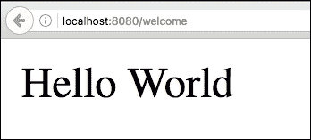

### 单元测试

让我们快速编写一个单元测试来测试前面的`controller`方法：

```java
    @RunWith(SpringRunner.class)
    @WebMvcTest(BasicController.class)
    public class BasicControllerTest {

      @Autowired
      private MockMvc mvc;

      @Test
      public void welcome() throws Exception {
        mvc.perform(
        MockMvcRequestBuilders.get("/welcome")
       .accept(MediaType.APPLICATION_JSON))
       .andExpect(status().isOk())
       .andExpect(content().string(
       equalTo("Hello World")));
      }
    }
```

在前面的单元测试中，我们将使用`BasicController`启动一个 Mock MVC 实例。以下是一些需要注意的快速事项：

+   `@RunWith(SpringRunner.class)`: SpringRunner 是`SpringJUnit4ClassRunner`注解的快捷方式。这将为单元测试启动一个简单的 Spring 上下文。

+   `@WebMvcTest(BasicController.class)`: 这个注解可以与 SpringRunner 一起使用来编写简单的 Spring MVC 控制器测试。这将只加载带有 Spring-MVC 相关注解的 bean。在这个例子中，我们使用 BasicController 作为测试类启动一个 Web MVC 测试上下文。

+   `@Autowired private MockMvc mvc`: 自动装配可以用来发送请求的 MockMvc bean。

+   `mvc.perform(MockMvcRequestBuilders.get("/welcome").accept(MediaType.APPLICATION_JSON))`: 执行一个带有`Accept`头值为`application/json`的请求到`/welcome`。

+   `andExpect(status().isOk())`: 期望响应的状态是 200（成功）。

+   `andExpect(content().string(equalTo("Hello World")))`: 期望响应的内容等于`"Hello World"`。

### 集成测试

当我们进行集成测试时，我们希望启动带有所有配置的控制器和 bean 的嵌入式服务器。以下代码片段显示了如何创建一个简单的集成测试：

```java
    @RunWith(SpringRunner.class)
    @SpringBootTest(classes = Application.class, 
    webEnvironment = SpringBootTest.WebEnvironment.RANDOM_PORT)
    public class BasicControllerIT {

      private static final String LOCAL_HOST = 
      "http://localhost:";

      @LocalServerPort
      private int port;

      private TestRestTemplate template = new TestRestTemplate();

      @Test
      public void welcome() throws Exception {
        ResponseEntity<String> response = template
       .getForEntity(createURL("/welcome"), String.class);
        assertThat(response.getBody(), equalTo("Hello World"));
       }

      private String createURL(String uri) {
        return LOCAL_HOST + port + uri;
      }
    }
```

以下是一些需要注意的重要事项：

+   `@SpringBootTest(classes = Application.class, webEnvironment = SpringBootTest.WebEnvironment.RANDOM_PORT)`: 它在 Spring `TestContext`之上提供了额外的功能。提供了配置完全运行容器和`TestRestTemplate`（执行请求）端口的支撑。

+   `@LocalServerPort private int port`: `SpringBootTest`将确保容器运行的端口自动装配到`port`变量中。

+   `private String createURL(String uri)`: 该方法将本地主机 URL 和端口附加到 URI 以创建一个完整的 URL。

+   `private TestRestTemplate template = new TestRestTemplate()`: `TestRestTemplate`通常用于集成测试。它提供了在`RestTemplate`之上的额外功能，这在集成测试上下文中特别有用。它不会跟随重定向，这样我们就可以断言响应位置。

+   `template.getForEntity(createURL("/welcome"), String.class)`: 它执行了对给定 URI 的 GET 请求。

+   `assertThat(response.getBody(), equalTo("Hello World"))`: 它断言响应体内容为`"Hello World"`。

## 简单的 REST 方法返回一个对象

在前面的方法中，我们返回了一个字符串。让我们创建一个返回适当 JSON 响应的方法。看看以下方法：

```java
    @GetMapping("/welcome-with-object")
    public WelcomeBean welcomeWithObject() {
      return new WelcomeBean("Hello World");
    }
```

前面的方法返回了一个初始化为消息`"Hello World"`的简单`WelcomeBean`。

### 执行请求

让我们发送一个测试请求并查看我们得到的响应。以下截图显示了输出：

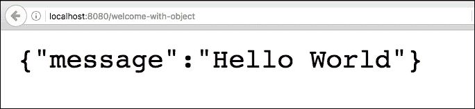

对于 `http://localhost:8080/welcome-with-object` URL 的响应如下：

```java
    {"message":"Hello World"}
```

需要回答的问题是：我们返回的 `WelcomeBean` 对象是如何被转换为 JSON 的？

再次强调，这是 Spring Boot 自动配置的魔力。如果一个应用中存在 Jackson，Spring Boot 会自动配置默认的对象到 JSON（反之亦然）转换器实例。

### 单元测试

让我们快速编写一个检查 JSON 响应的单元测试。让我们将测试添加到 `BasicControllerTest`：

```java
    @Test
    public void welcomeWithObject() throws Exception {
      mvc.perform(
       MockMvcRequestBuilders.get("/welcome-with-object")
      .accept(MediaType.APPLICATION_JSON))
      .andExpect(status().isOk())
      .andExpect(content().string(containsString("Hello World")));
    }
```

此测试与早期的单元测试非常相似，只是我们使用 `containsString` 来检查内容是否包含子字符串 `"Hello World"`。我们将在稍后学习如何编写正确的 JSON 测试。

### 集成测试

让我们把重点转向编写集成测试。让我们在 `BasicControllerIT` 中添加一个方法，如下面的代码片段所示：

```java
    @Test
    public void welcomeWithObject() throws Exception {
      ResponseEntity<String> response = 
      template.getForEntity(createURL("/welcome-with-object"), 
      String.class);
      assertThat(response.getBody(), 
      containsString("Hello World"));
    }
```

此方法与早期的集成测试类似，只是我们使用 `String` 方法断言子字符串。

## 带有路径变量的 Get 方法

让我们把注意力转向路径变量。路径变量用于将 URI 中的值绑定到控制器方法上的变量。在以下示例中，我们想参数化名字，以便我们可以使用名字自定义欢迎消息：

```java
    private static final String helloWorldTemplate = "Hello World, 
    %s!";

   @GetMapping("/welcome-with-parameter/name/{name}")
   public WelcomeBean welcomeWithParameter(@PathVariable String name) 
    {
       return new WelcomeBean(String.format(helloWorldTemplate, name));
    }
```

需要注意的几个重要事项如下：

+   `@GetMapping("/welcome-with-parameter/name/{name}")`: `{name}` 表示这个值将是变量。一个 URI 中可以有多个变量模板。

+   `welcomeWithParameter(@PathVariable String name)`: `@PathVariable` 确保从 URI 绑定变量值到变量 name。

+   `String.format(helloWorldTemplate, name)`: 一个简单的字符串格式，用名字替换模板中的 `%s`。

### 执行请求

让我们发送一个测试请求并查看我们得到的响应。以下截图显示了响应：

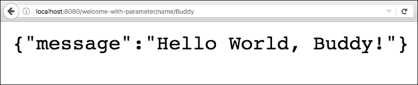

对于 `http://localhost:8080/welcome-with-parameter/name/Buddy` URL 的响应如下：

```java
    {"message":"Hello World, Buddy!"}
```

如预期的那样，URI 中的名字被用来形成响应中的消息。

### 单元测试

让我们快速编写一个针对前面方法的单元测试。我们希望将名字作为 URI 的一部分传递，并检查响应是否包含该名字。以下代码显示了如何做到这一点：

```java
    @Test
    public void welcomeWithParameter() throws Exception {
      mvc.perform(
      MockMvcRequestBuilders.get("/welcome-with-parameter/name/Buddy")
     .accept(MediaType.APPLICATION_JSON))
     .andExpect(status().isOk())
     .andExpect(
     content().string(containsString("Hello World, Buddy")));
    }
```

需要注意的几个重要事项如下：

+   `MockMvcRequestBuilders.get("/welcome-with-parameter/name/Buddy")`: 这与 URI 中的变量模板匹配。我们传递名字 `Buddy`。

+   `.andExpect(content().string(containsString("Hello World, Buddy")))`: 我们期望响应中包含带有名字的消息。

### 集成测试

前面方法的集成测试非常简单。看看下面的 `test` 方法：

```java
    @Test
    public void welcomeWithParameter() throws Exception {
      ResponseEntity<String> response = 
      template.getForEntity(
      createURL("/welcome-with-parameter/name/Buddy"), String.class);
      assertThat(response.getBody(), 
      containsString("Hello World, Buddy"));
    }
```

需要注意的几个重要事项如下：

+   `createURL("/welcome-with-parameter/name/Buddy")`：这与 URI 中的变量模板相匹配。我们传递了名称，Buddy。

+   `assertThat(response.getBody(), containsString("Hello World, Buddy"))`：我们期望响应包含带有名称的消息。

在本节中，我们探讨了使用 Spring Boot 创建简单 REST 服务的基础知识。我们还确保了拥有良好的单元测试和集成测试。虽然这些非常基础，但它们为我们在下一节中构建的更复杂的 REST 服务奠定了基础。

我们实现的单元测试和集成测试可以使用 JSON 比较而不是简单的子字符串比较来有更好的断言。我们将在下一节中为我们将创建的 REST 服务编写的测试中关注这一点。

# 创建待办事项资源

我们将专注于创建基本的待办事项管理系统中的 REST 服务。我们将为以下内容创建服务：

+   检索特定用户的待办事项列表

+   检索特定待办事项的详细信息

+   为用户创建待办事项

## 请求方法、操作和 URI

REST 服务的最佳实践之一是根据我们执行的操作使用适当的 HTTP 请求方法。在我们至今公开的服务中，我们使用了 `GET` 方法，因为我们专注于读取数据的服务。

下表显示了根据我们执行的操作适当的 HTTP 请求方法：

| HTTP 请求方法 | 操作 |
| --- | --- |
| `GET` | 读取--检索资源的详细信息 |
| `POST` | 创建--创建一个新的条目或资源 |
| `PUT` | 更新/替换 |
| `PATCH` | 更新/修改资源的一部分 |
| `DELETE` | 删除 |

让我们快速将我们想要创建的服务映射到适当的请求方法：

+   **检索特定用户的待办事项列表**：这是读取操作。我们将使用 GET 方法。我们将使用 URI：`/users/{name}/todos`。另一个好的做法是在 URI 中使用复数形式表示静态事物：users、todo 等等。这会产生更易读的 URI。

+   **检索特定待办事项的详细信息**：同样，我们将使用 `GET` 方法。我们将使用 URI `/users/{name}/todos/{id}`。你可以看到这与我们之前决定的待办事项列表的 URI 一致。

+   **为用户创建待办事项**：对于创建操作，建议的 HTTP 请求方法是 `POST`。要创建一个新的待办事项，我们将向 `URI /users/{name}/todos` 发送 POST 请求。

## Bean 和服务

为了能够检索和存储待办事项的详细信息，我们需要一个待办事项 Bean 和一个用于检索和存储详细信息的服务。

让我们创建一个待办事项 Bean：

```java
    public class Todo {
      private int id;
      private String user;

      private String desc;

      private Date targetDate;
      private boolean isDone;

      public Todo() {}

      public Todo(int id, String user, String desc, 
      Date targetDate, boolean isDone) { 
        super();
        this.id = id;
        this.user = user;
        this.desc = desc;
        this.targetDate = targetDate;
        this.isDone = isDone;
      }

       //ALL Getters
    }
```

我们创建了一个简单的待办事项 Bean，包含 ID、用户名称、待办事项描述、待办事项目标日期和完成状态指示器。我们为所有字段添加了构造函数和获取器。

现在让我们添加 `TodoService`：

```java
   @Service
   public class TodoService {
     private static List<Todo> todos = new ArrayList<Todo>();
     private static int todoCount = 3;

     static {
       todos.add(new Todo(1, "Jack", "Learn Spring MVC", 
       new Date(), false));
       todos.add(new Todo(2, "Jack", "Learn Struts", new Date(), 
       false));
       todos.add(new Todo(3, "Jill", "Learn Hibernate", new Date(), 
       false));
      }

     public List<Todo> retrieveTodos(String user) {
       List<Todo> filteredTodos = new ArrayList<Todo>();
       for (Todo todo : todos) {
         if (todo.getUser().equals(user))
         filteredTodos.add(todo);
        }
      return filteredTodos;
     }

    public Todo addTodo(String name, String desc, 
    Date targetDate, boolean isDone) {
      Todo todo = new Todo(++todoCount, name, desc, targetDate, 
      isDone);
      todos.add(todo);
      return todo;
    }

    public Todo retrieveTodo(int id) {
      for (Todo todo : todos) {
      if (todo.getId() == id)
        return todo;
      }
      return null;
     }
   }
```

需要注意的快速事项如下：

+   为了保持简单，此服务不与数据库通信。它维护一个内存中的待办事项数组列表。此列表使用静态初始化器初始化。

+   我们公开了一些简单的检索方法和一个添加待办事项的方法。

既然我们已经准备好了服务和 bean，我们可以创建我们的第一个服务来检索用户的待办事项列表。

## 检索待办事项列表

我们将创建一个新的`RestController`注解，称为`TodoController`。检索待办事项方法的代码如下所示：

```java
    @RestController
    public class TodoController {
     @Autowired
     private TodoService todoService;

     @GetMapping("/users/{name}/todos")
     public List<Todo> retrieveTodos(@PathVariable String name) {
       return todoService.retrieveTodos(name);
     }
    }
```

以下是一些需要注意的事项：

+   我们使用`@Autowired`注解自动装配待办事项服务

+   我们使用`@GetMapping`注解将`"/users/{name}/todos"` URI 的 GET 请求映射到`retrieveTodos`方法

### 执行服务

让我们发送一个测试请求并查看我们得到什么响应。以下截图显示了输出：

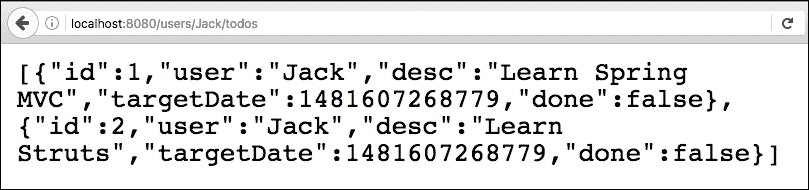

`http://localhost:8080/users/Jack/todos` URL 的响应如下：

```java
   [
    {"id":1,"user":"Jack","desc":"Learn Spring    
     MVC","targetDate":1481607268779,"done":false},  
    {"id":2,"user":"Jack","desc":"Learn 
    Struts","targetDate":1481607268779, "done":false}
   ]
```

### 单元测试

测试`TodoController`类的代码截图如下：

```java
   @RunWith(SpringRunner.class)
   @WebMvcTest(TodoController.class)
   public class TodoControllerTest {

    @Autowired
    private MockMvc mvc;

    @MockBean
    private TodoService service;

    @Test
    public void retrieveTodos() throws Exception {
     List<Todo> mockList = Arrays.asList(new Todo(1, "Jack",
     "Learn Spring MVC", new Date(), false), new Todo(2, "Jack",
     "Learn Struts", new Date(), false));

     when(service.retrieveTodos(anyString())).thenReturn(mockList);

     MvcResult result = mvc
    .perform(MockMvcRequestBuilders.get("/users
    /Jack/todos").accept(MediaType.APPLICATION_JSON))
    .andExpect(status().isOk()).andReturn();

    String expected = "["
     + "{id:1,user:Jack,desc:\"Learn Spring MVC\",done:false}" +","
     + "{id:2,user:Jack,desc:\"Learn Struts\",done:false}" + "]";

     JSONAssert.assertEquals(expected, result.getResponse()
      .getContentAsString(), false);
     }
    }
```

一些需要注意的重要事项如下：

+   我们正在编写一个单元测试。因此，我们只想测试`TodoController`类中存在的逻辑。所以，我们使用`@WebMvcTest(TodoController.class)`初始化一个只包含`TodoController`类的 Mock MVC 框架。

+   `@MockBean private TodoService service`：我们使用`@MockBean`注解模拟`TodoService`。在运行`SpringRunner`的测试类中，使用`@MockBean`定义的 bean 将被 Mockito 框架创建的模拟所替换。

+   `when(service.retrieveTodos(anyString())).thenReturn(mockList)`：我们正在模拟`retrieveTodos`服务方法以返回模拟列表。

+   `MvcResult result = ..`：我们将请求的结果接受到 MvcResult 变量中，以便我们可以在响应上执行断言。

+   `JSONAssert.assertEquals(expected, result.getResponse().getContentAsString(), false)`：JSONAssert 是一个非常有用的框架，用于对 JSON 执行断言。它将响应文本与预期值进行比较。`JSONAssert`足够智能，可以忽略未指定的值。另一个优点是在断言失败时有一个清晰的失败消息。最后一个参数 false 表示使用非严格模式。如果将其更改为 true，则预期值应与结果完全匹配。

### 集成测试

在以下代码片段中显示了在`TodoController`类上执行集成测试的代码。它启动了包含所有控制器和 bean 的整个 Spring 上下文：

```java
   @RunWith(SpringJUnit4ClassRunner.class)
   @SpringBootTest(classes = Application.class, webEnvironment =     
   SpringBootTest.WebEnvironment.RANDOM_PORT)
   public class TodoControllerIT {

    @LocalServerPort
    private int port;

    private TestRestTemplate template = new TestRestTemplate();

    @Test
    public void retrieveTodos() throws Exception {
     String expected = "["
     + "{id:1,user:Jack,desc:\"Learn Spring MVC\",done:false}" + ","
     + "{id:2,user:Jack,desc:\"Learn Struts\",done:false}" + "]";

     String uri = "/users/Jack/todos";

     ResponseEntity<String> response =
     template.getForEntity(createUrl(uri), String.class);

     JSONAssert.assertEquals(expected, response.getBody(), false);
    }

     private String createUrl(String uri) {
     return "http://localhost:" + port + uri;
    }
  }
```

这个测试与`BasicController`的集成测试非常相似，除了我们使用`JSONAssert`来断言响应。

## 检索特定待办事项的详细信息

我们现在将添加一个用于检索特定待办事项详细信息的函数：

```java
    @GetMapping(path = "/users/{name}/todos/{id}")
    public Todo retrieveTodo(@PathVariable String name, @PathVariable 
    int id) {
      return todoService.retrieveTodo(id);
    }
```

以下是一些需要注意的事项：

+   映射的 URI 是`/users/{name}/todos/{id}`

+   我们为 `name` 和 `id` 定义了两个路径变量

### 执行服务

让我们发送一个测试请求，看看我们会得到什么响应，如下面的截图所示：

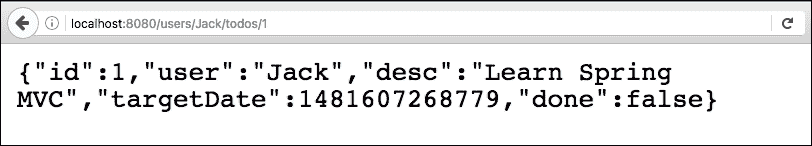

对于 `http://localhost:8080/users/Jack/todos/1` URL 的响应如下所示：

```java
    {"id":1,"user":"Jack","desc":"Learn Spring MVC", 
    "targetDate":1481607268779,"done":false}
```

### 单元测试

单元测试 `retrieveTodo` 的代码如下：

```java
     @Test
     public void retrieveTodo() throws Exception {
       Todo mockTodo = new Todo(1, "Jack", "Learn Spring MVC", 
       new Date(), false);

       when(service.retrieveTodo(anyInt())).thenReturn(mockTodo);

       MvcResult result = mvc.perform(
       MockMvcRequestBuilders.get("/users/Jack/todos/1")
       .accept(MediaType.APPLICATION_JSON))
       .andExpect(status().isOk()).andReturn();

       String expected = "{id:1,user:Jack,desc:\"Learn Spring
       MVC\",done:false}";

      JSONAssert.assertEquals(expected, 
       result.getResponse().getContentAsString(), false);

     }
```

需要注意的几个重要事项如下：

+   `when(service.retrieveTodo(anyInt())).thenReturn(mockTodo)`: 我们正在模拟 `retrieveTodo` 服务方法以返回模拟的 Todo。

+   `MvcResult result = ..`: 我们将请求的结果接受到 MvcResult 变量中，以便我们可以在响应上执行断言。

+   `JSONAssert.assertEquals(expected, result.getResponse().getContentAsString(), false)`: 断言结果是否符合预期。

### 集成测试

在 `TodoController` 中对 `retrieveTodos` 进行集成测试的代码如下。这将添加到 `TodoControllerIT` 类中：

```java
     @Test
     public void retrieveTodo() throws Exception {
       String expected = "{id:1,user:Jack,desc:\"Learn Spring   
       MVC\",done:false}";
       ResponseEntity<String> response = template.getForEntity(
       createUrl("/users/Jack/todos/1"), String.class);
       JSONAssert.assertEquals(expected, response.getBody(), false);
     }
```

## 添加 Todo

我们现在将添加创建新 Todo 的方法。用于创建的 HTTP 方法是 `POST`。我们将向 `"/users/{name}/todos"` URI 发送 POST 请求：

```java
    @PostMapping("/users/{name}/todos")
    ResponseEntity<?> add(@PathVariable String name,
    @RequestBody Todo todo) { 
      Todo createdTodo = todoService.addTodo(name, todo.getDesc(),
      todo.getTargetDate(), todo.isDone());
      if (createdTodo == null) {
         return ResponseEntity.noContent().build();
      }

     URI location = ServletUriComponentsBuilder.fromCurrentRequest()

    .path("/{id}").buildAndExpand(createdTodo.getId()).toUri();
    return ResponseEntity.created(location).build();
   }
```

需要注意的几个事项如下：

+   `@PostMapping("/users/{name}/todos")`: `@PostMapping` 注解将 `add()` 方法映射到使用 `POST` 方法的 HTTP 请求。

+   `ResponseEntity<?> add(@PathVariable String name, @RequestBody Todo todo)`: 一个 HTTP POST 请求理想情况下应返回创建资源的 URI。我们使用 `ResourceEntity` 来做这件事。`@RequestBody` 将请求体直接绑定到 Bean。

+   `ResponseEntity.noContent().build()`: 用于返回资源创建失败。

+   `ServletUriComponentsBuilder.fromCurrentRequest().path("/{id}").buildAndExpand(createdTodo.getId()).toUri()`: 形成可以返回在响应中的创建资源的 URI。

+   `ResponseEntity.created(location).build()`: 返回状态为 `201(CREATED)` 并带有创建的资源链接。

### Postman

如果你使用的是 Mac，你可能还想尝试 Paw 应用程序。

让我们发送一个测试请求并查看我们得到的响应。以下截图显示了响应：

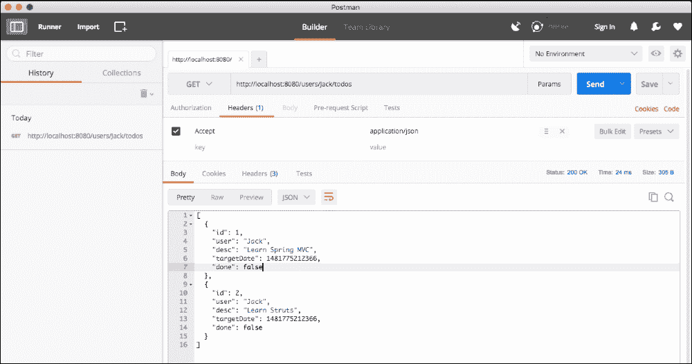

我们将使用 Postman 应用程序与 REST 服务进行交互。您可以从网站安装它，[`www.getpostman.com/`](https://www.getpostman.com/)。它在 Windows 和 Mac 上可用。还有一个 Google Chrome 插件。

### 执行 POST 服务

要使用 `POST` 方法创建一个新的 Todo，我们需要在请求体中包含 Todo 的 JSON。以下截图显示了我们可以如何使用 Postman 应用程序创建请求和执行请求后的响应：

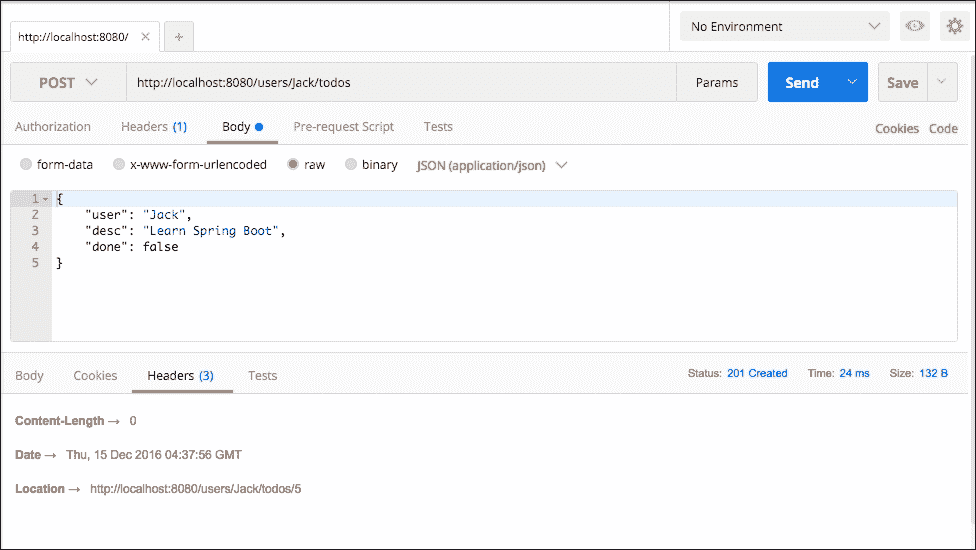

需要注意的几个重要事项如下：

+   我们正在发送一个 POST 请求。因此，我们从左上角的下拉菜单中选择 `POST`。

+   要将 Todo JSON 作为请求体的一部分发送，我们在`Body`选项卡中选择`raw`选项（用蓝色圆点突出显示）。我们选择内容类型为 JSON (`application/json`)。

+   请求成功执行后，您可以在屏幕中间的栏中看到请求的状态：“状态：201 已创建”。

+   位置是 `http://localhost:8080/users/Jack/todos/5`。这是响应中接收到的新的 todo 的 URI。

请求 `http://localhost:8080/users/Jack/todos` 的完整细节如下所示：

```java
    Header
    Content-Type:application/json

   Body
    {
      "user": "Jack",
      "desc": "Learn Spring Boot",
       "done": false
     }
```

### 单元测试

单元测试创建的 Todo 的代码如下所示：

```java
    @Test
    public void createTodo() throws Exception {
     Todo mockTodo = new Todo(CREATED_TODO_ID, "Jack", 
     "Learn Spring MVC", new Date(), false);
     String todo = "{"user":"Jack","desc":"Learn Spring MVC",     
     "done":false}";

    when(service.addTodo(anyString(), anyString(),   
    isNull(),anyBoolean()))
    .thenReturn(mockTodo);

   mvc
    .perform(MockMvcRequestBuilders.post("/users/Jack/todos")
    .content(todo)
    .contentType(MediaType.APPLICATION_JSON)
    )
    .andExpect(status().isCreated())
    .andExpect(
      header().string("location",containsString("/users/Jack/todos/"
     + CREATED_TODO_ID)));
   }
```

以下是一些需要注意的重要事项：

+   `String todo = "{"user":"Jack","desc":"Learn Spring MVC","done":false}"`：要发送到创建 todo 服务的 Todo 内容。

+   `when(service.addTodo(anyString(), anyString(), isNull(), anyBoolean())).thenReturn(mockTodo)`：模拟服务以返回一个虚拟的 todo。

+   `MockMvcRequestBuilders.post("/users/Jack/todos").content(todo).contentType(MediaType.APPLICATION_JSON))`：创建一个具有给定内容类型的 POST 请求到指定的 URI。

+   `andExpect(status().isCreated())`：期望状态为已创建。

+   `andExpect(header().string("location",containsString("/users/Jack/todos/" + CREATED_TODO_ID)))`：期望头部包含带有创建资源的 URI 的 `location`。

### 集成测试

在 `TodoController` 中对创建的 todo 进行集成测试的代码如下所示。这将添加到 `TodoControllerIT` 类中，如下所示：

```java
    @Test
    public void addTodo() throws Exception {
      Todo todo = new Todo(-1, "Jill", "Learn Hibernate", new Date(),  
      false);
      URI location = template
     .postForLocation(createUrl("/users/Jill/todos"),todo);
      assertThat(location.getPath(), 
      containsString("/users/Jill/todos/4"));
    }
```

以下是一些需要注意的重要事项：

+   `URI location = template.postForLocation(createUrl("/users/Jill/todos"), todo)`：`postForLocation` 是一个特别有用的实用方法，尤其是在测试中创建新资源时。我们正在将 todo 发送到给定的 URI，并从头部获取位置。

+   `assertThat(location.getPath(), containsString("/users/Jill/todos/4"))`：断言位置包含指向新创建资源的路径。

# Spring Initializr

您想要自动生成 Spring Boot 项目吗？您想要快速开始开发您的应用程序吗？Spring Initializr 就是答案。

Spring Initializr 域名是 [`start.spring.io`](http://start.spring.io)。以下截图显示了网站的外观：

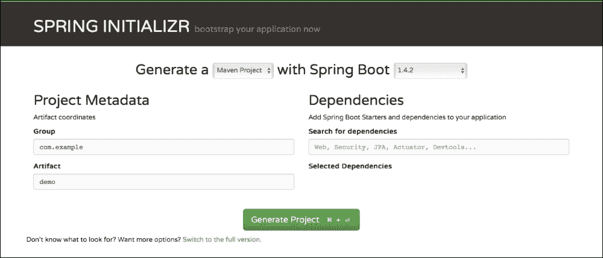

Spring Initializr 在创建项目方面提供了很多灵活性。您有以下选项：

+   选择您的构建工具：Maven 或 Gradle。

+   选择您想要使用的 Spring Boot 版本。

+   为您的组件配置 `Group ID` 和 `Artifact ID`。

+   选择您项目所需的启动器（依赖项）。您可以通过点击屏幕底部的链接，`切换到完整版本`，查看您可以选择的所有启动器项目。

+   选择如何打包您的组件：JAR 或 WAR。

+   选择您想要使用的 Java 版本。

+   选择您想要使用的 JVM 语言。

以下截图显示了当您展开（点击链接）到完整版本时，Spring Initializr 提供的部分选项：

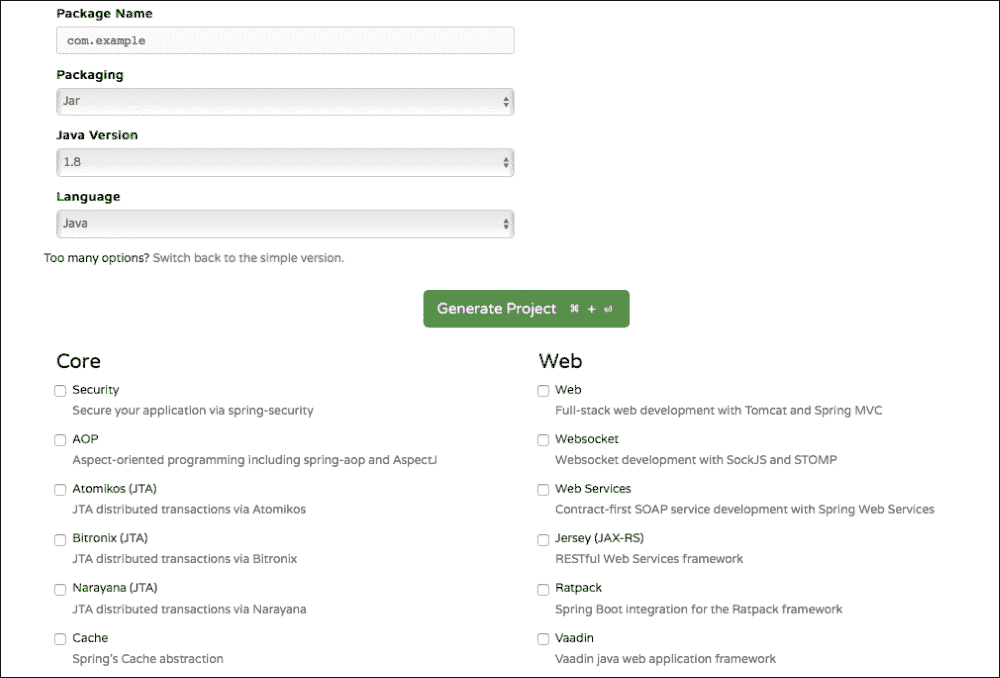

## 创建您的第一个 Spring Initializr 项目

我们将使用完整版本并输入以下值：

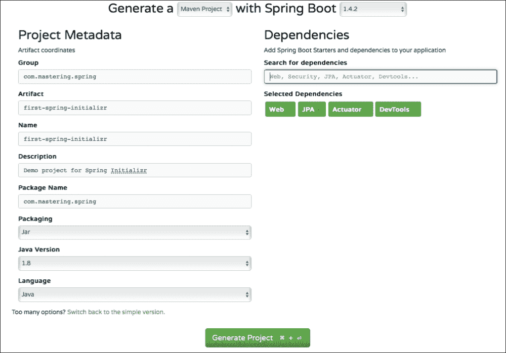

需要注意的事项如下：

+   `构建工具`: `Maven`

+   `Spring Boot 版本`: 选择最新可用的

+   `组`: `com.mastering.spring`

+   `工件`: `first-spring-initializr`

+   `选定的依赖项`: 选择 `Web, JPA, Actuator 和 Dev Tools`。在文本框中输入每个这些，然后按 *Enter* 键选择它们。我们将在下一节中了解更多关于 Actuator 和 Dev Tools 的信息。

+   `Java 版本`: `1.8`

点击**生成项目**按钮。这将创建一个 `.zip` 文件，您可以将其下载到您的计算机上。

以下截图显示了创建的项目结构：

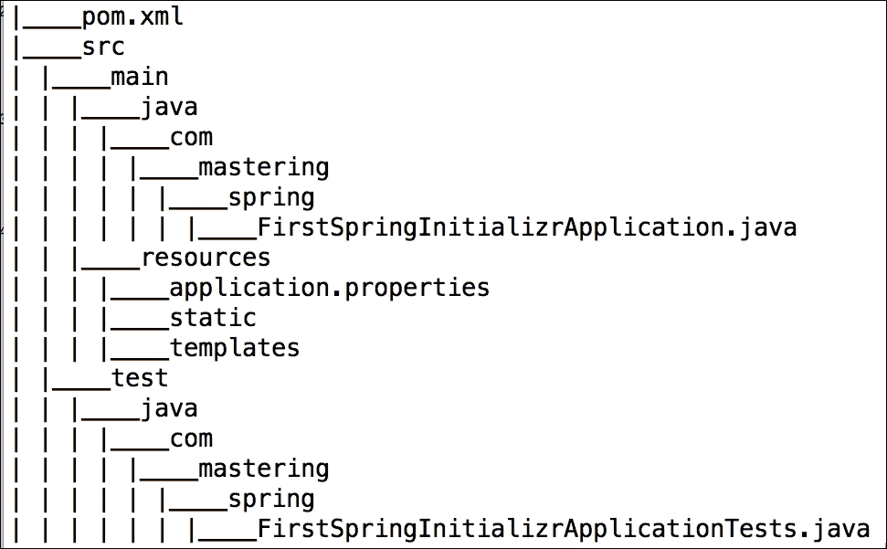

现在，我们将把这个项目导入到您的 IDE 中。在 Eclipse 中，您可以执行以下步骤：

1.  启动 Eclipse。

1.  导航到**文件** | **导入**。

1.  选择现有的 Maven 项目。

1.  浏览并选择 Maven 项目的根目录（包含 `pom.xml` 文件的目录）。

1.  使用默认设置并点击**完成**。`

这将把项目导入到 Eclipse 中。以下截图显示了 Eclipse 中项目的结构：

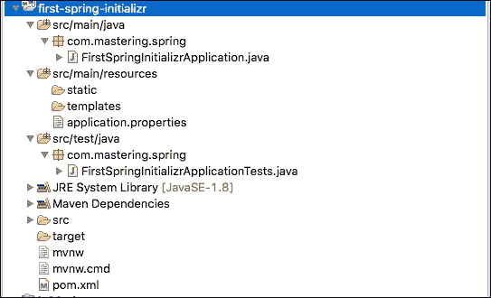

让我们看看生成项目中的一些重要文件。

### pom.xml

以下代码片段显示了声明的依赖项：

```java
<dependencies> <dependency> <groupId>org.springframework.boot</groupId> <artifactId>spring-boot-starter-web</artifactId> </dependency> <dependency> <groupId>org.springframework.boot</groupId> <artifactId>spring-boot-starter-data-jpa</artifactId> </dependency> <dependency> <groupId>org.springframework.boot</groupId> <artifactId>spring-boot-starter-actuator</artifactId> </dependency> <dependency> <groupId>org.springframework.boot</groupId> <artifactId>spring-boot-devtools</artifactId> <scope>runtime</scope> </dependency> <dependency> <groupId>org.springframework.boot</groupId> <artifactId>spring-boot-starter-test</artifactId> <scope>test</scope> </dependency> </dependencies>
```

一些其他重要的观察如下：

+   此组件的打包格式为 `.jar`

+   `org.springframework.boot:spring-boot-starter-parent` 被声明为父 POM

+   `<java.version>1.8</java.version>`: Java 版本是 1.8

+   Spring Boot Maven 插件 (`org.springframework.boot:spring-boot-maven-plugin`) 被配置为插件

### FirstSpringInitializrApplication.java 类

`FirstSpringInitializrApplication.java` 是 Spring Boot 的启动器：

```java
    package com.mastering.spring;
    import org.springframework.boot.SpringApplication;
    import org.springframework.boot.autoconfigure
    .SpringBootApplication;

    @SpringBootApplication
    public class FirstSpringInitializrApplication {
       public static void main(String[] args) {
        SpringApplication.run(FirstSpringInitializrApplication.class,   
        args);
      }
    }
```

### FirstSpringInitializrApplicationTests 类

`FirstSpringInitializrApplicationTests` 包含可以用来开始编写测试的基本上下文，随着我们开始开发应用程序：

```java
    package com.mastering.spring;
    import org.junit.Test;
    import org.junit.runner.RunWith;
    import org.springframework.boot.test.context.SpringBootTest;
    import org.springframework.test.context.junit4.SpringRunner;

    @RunWith(SpringRunner.class)
    @SpringBootTest
    public class FirstSpringInitializrApplicationTests {

      @Test
      public void contextLoads() {
      }
   }
```

# 快速了解自动配置

自动配置是 Spring Boot 最重要的功能之一。在本节中，我们将快速了解幕后，以了解 Spring Boot 自动配置是如何工作的。

大部分 Spring Boot 自动配置的魔法都来自 `spring-boot-autoconfigure-{version}.jar`。当我们启动任何 Spring Boot 应用程序时，许多 bean 都会自动配置。这是如何发生的？

以下截图显示了从 `spring-boot-autoconfigure-{version}.jar` 的 `spring.factories` 的一个摘录。我们出于空间考虑过滤掉了一些配置：

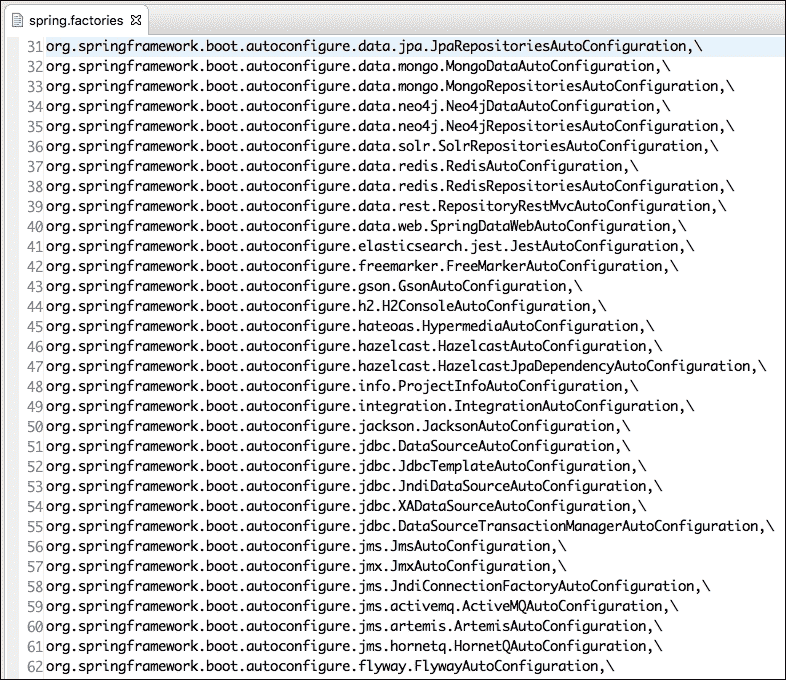

每次启动 Spring Boot 应用程序时，都会运行前面列出的自动配置类列表。让我们快速查看其中之一：

`org.springframework.boot.autoconfigure.web.WebMvcAutoConfiguration`。

这里有一个小的代码片段：

```java
@Configuration
@ConditionalOnWebApplication
@ConditionalOnClass({ Servlet.class, DispatcherServlet.class,
WebMvcConfigurerAdapter.class })
@ConditionalOnMissingBean(WebMvcConfigurationSupport.class)
@AutoConfigureOrder(Ordered.HIGHEST_PRECEDENCE + 10)
@AutoConfigureAfter(DispatcherServletAutoConfiguration.class)
public class WebMvcAutoConfiguration {
```

需要注意的一些重要点如下：

+   `@ConditionalOnClass({ Servlet.class, DispatcherServlet.class, WebMvcConfigurerAdapter.class })`：如果类路径中包含上述提到的任何类，则启用此自动配置。当我们添加一个 Web 启动项目时，我们会引入包含所有这些类的依赖项。因此，此自动配置将被启用。

+   `@ConditionalOnMissingBean(WebMvcConfigurationSupport.class)`：只有当应用程序没有显式声明`WebMvcConfigurationSupport.class`类的 bean 时，此自动配置才会启用。

+   `@AutoConfigureOrder(Ordered.HIGHEST_PRECEDENCE + 10)`：这指定了此特定自动配置的优先级。

让我们看看另一个小的代码片段，展示同一类中的一个方法：

```java
    @Bean
    @ConditionalOnBean(ViewResolver.class)
    @ConditionalOnMissingBean(name = "viewResolver", 
    value = ContentNegotiatingViewResolver.class)
    public ContentNegotiatingViewResolver 
    viewResolver(BeanFactory beanFactory) {
      ContentNegotiatingViewResolver resolver = new 
      ContentNegotiatingViewResolver();
      resolver.setContentNegotiationManager
      (beanFactory.getBean(ContentNegotiationManager.class));
      resolver.setOrder(Ordered.HIGHEST_PRECEDENCE);
      return resolver;
     }
```

视图解析器是`WebMvcAutoConfiguration`类配置的 bean 之一。前面的代码片段确保如果应用程序没有提供视图解析器，那么 Spring Boot 将自动配置一个默认的视图解析器。以下是一些需要注意的重要点：

+   `@ConditionalOnBean(ViewResolver.class)`：如果`ViewResolver.class`在类路径上，则创建此 bean。

+   `@ConditionalOnMissingBean(name = "viewResolver", value = ContentNegotiatingViewResolver.class)`：如果没有显式声明名为`viewResolver`且类型为`ContentNegotiatingViewResolver.class`的 bean，则创建此 bean。

+   方法的其他部分在视图解析器中进行配置

总结来说，所有自动配置逻辑都在 Spring Boot 应用程序启动时执行。如果类路径上有特定依赖项或启动项目中的特定类，则执行自动配置类。这些自动配置类查看已经配置的 bean。根据现有的 bean，它们启用默认 bean 的创建。

# 摘要

Spring Boot 使得基于 Spring 的应用程序开发变得简单。它使我们能够从项目的第一天开始就创建生产就绪的应用程序。

在本课中，我们介绍了 Spring Boot 和 REST 服务的基础知识。我们讨论了 Spring Boot 的不同特性，并创建了一些具有良好测试的 REST 服务。我们通过深入了解自动配置，了解了后台发生了什么。

在下一课中，我们将把注意力转向向 REST 服务添加更多功能。

# 评估

1.  可以使用 _______ 类从 Java 主方法启动和运行 Spring 应用程序。

1.  以下哪个方法用于将本地主机 URL 和端口附加到 URI 以创建完整的 URL？

    1.  私有 URL（String uri）

    1.  private String create(String uri)

    1.  private String CreateURL(String uri)

    1.  private String createURL(String uri)

1.  判断对错：Tomcat 服务器在端口 8080 上启动--Tomcat 在端口(s)：8080 (http) 上启动。

1.  以下哪个启动模板提供了对各种单元测试框架（如 JUnit、Mockito 和 Hamcrest）的支持？这些框架在 Spring Boot 中负责协调锁竞争。

    1.  spring-boot-starter-test

    1.  spring-boot-starter-testframe

    1.  spring-boot-starter-unittest

    1.  spring-boot-starter-testorchestration

1.  判断对错：multipartResolver 不提供在 Web 应用程序中上传文件的支持。
