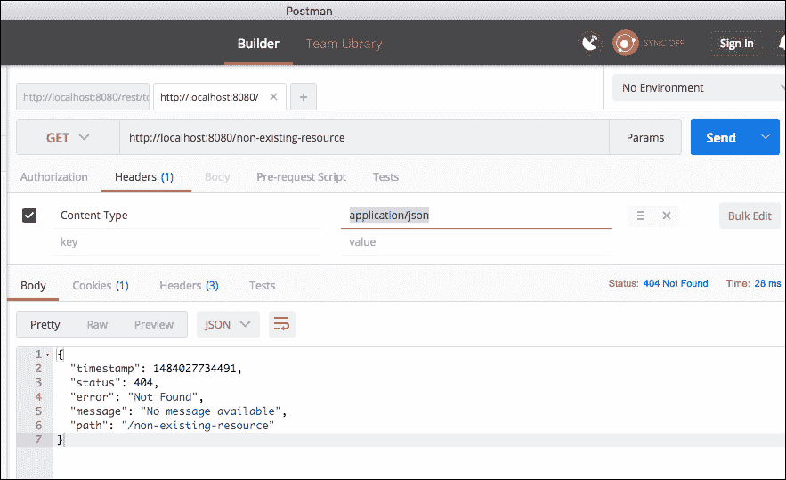
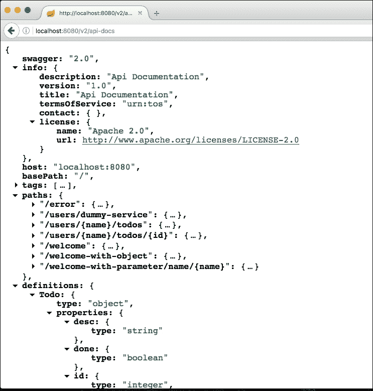
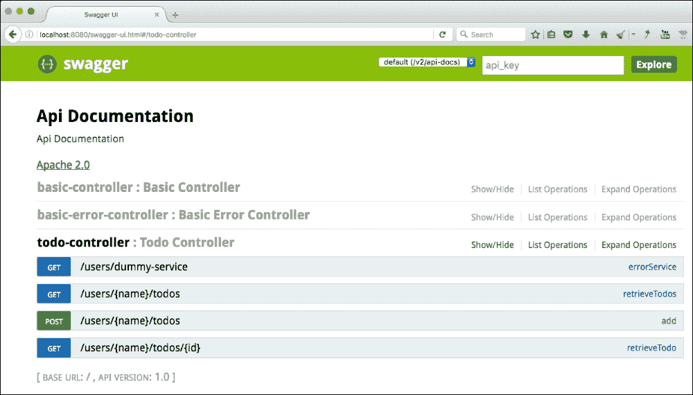
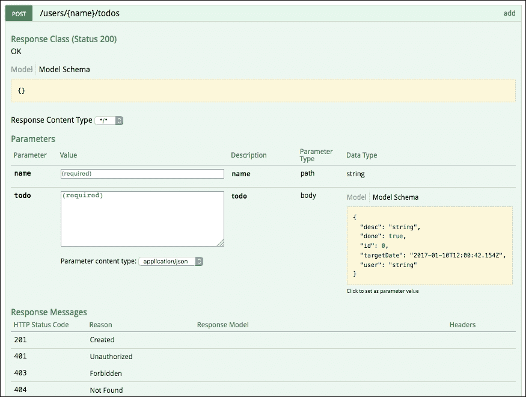
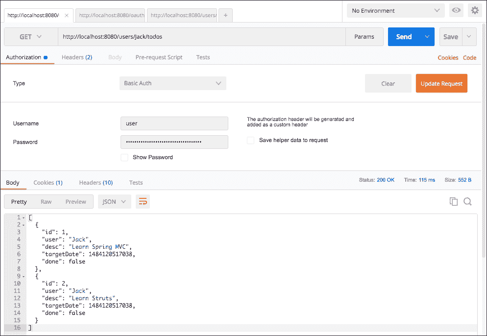
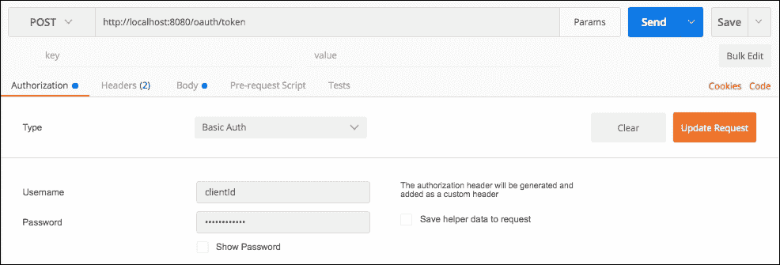
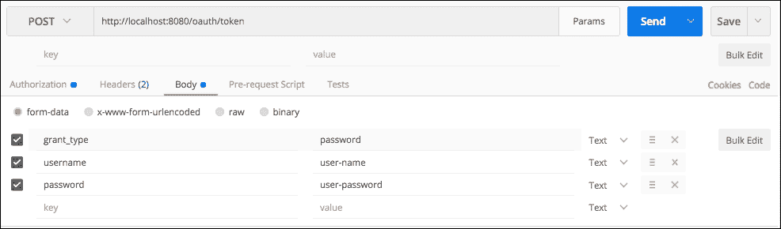
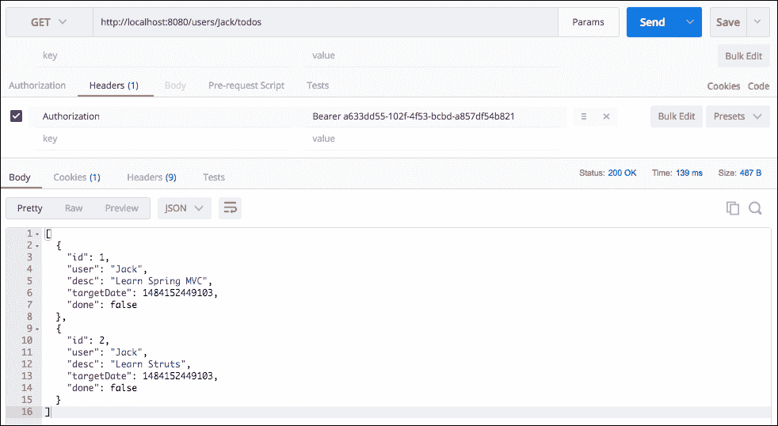
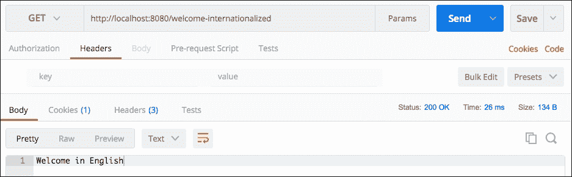
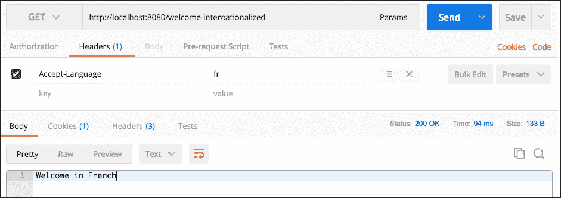

# 第二章 扩展微服务

在第 1 课“使用 Spring Boot 构建微服务”中，我们构建了一个提供一些服务的基本组件。在本课中，我们将专注于添加更多功能，使我们的微服务准备好生产。

我们将讨论如何将这些功能添加到我们的微服务中：

+   异常处理

+   HATEOAS

+   缓存

+   国际化

我们还将讨论如何使用 Swagger 记录我们的微服务。我们将查看使用 Spring Security 保护微服务的基础知识。

# 异常处理

异常处理是开发网络服务的重要部分之一。当出现问题时，我们希望向服务消费者返回一个良好的错误描述。我们不希望服务崩溃而不向服务消费者提供任何有用的信息。

Spring Boot 提供了良好的默认异常处理。在继续自定义它们之前，我们将首先查看 Spring Boot 提供的默认异常处理功能。

## Spring Boot 默认异常处理

为了了解 Spring Boot 提供的默认异常处理，让我们从一个不存在的 URL 开始发起请求。

### 不存在的资源

让我们使用带有头信息（`Content-Type:application/json`）的`GET`请求向`http://localhost:8080/non-existing-resource`发送请求。

以下截图显示了执行请求时的响应：



响应如下所示：

```java
    {
      "timestamp": 1484027734491,
      "status": 404,
      "error": "Not Found",
      "message": "No message available",
      "path": "/non-existing-resource"
    }
```

以下是一些需要注意的重要事项：

+   响应头中的 HTTP 状态为`404 - 资源未找到`

+   Spring Boot 返回一个有效的 JSON 消息作为响应，消息表明资源未找到

### 抛出异常的资源

让我们创建一个会抛出异常的资源，并对其发送一个`GET`请求，以便了解应用程序如何响应运行时异常。

让我们创建一个会抛出异常的虚拟服务。以下代码片段显示了一个简单的服务：

```java
    @GetMapping(path = "/users/dummy-service")
    public Todo errorService() {
      throw new RuntimeException("Some Exception Occured");
    }
```

以下是一些需要注意的重要事项：

我们正在创建一个 URI 为`/users/dummy-service`的`GET`服务。

服务抛出一个`RuntimeException`。我们选择`RuntimeException`以便能够轻松创建异常。如果需要，我们可以轻松地将其替换为自定义异常。

让我们使用 Postman 向`http://localhost:8080/users/dummy-service`服务发起一个`GET`请求。响应如下所示：

```java
    {
      "timestamp": 1484028119553,
      "status": 500,
      "error": "Internal Server Error",
      "exception": "java.lang.RuntimeException",
      "message": "Some Exception Occured",
      "path": "/users/dummy-service"
   }
```

以下是一些需要注意的重要事项：

+   响应头中的 HTTP 状态为`500`；`内部服务器错误`

+   Spring Boot 还返回抛出异常的消息

如前两个示例所示，Spring Boot 提供了良好的默认异常处理。在下一节中，我们将专注于了解应用程序如何响应自定义异常。

### 抛出自定义异常

让我们创建一个自定义异常，并从服务中抛出它。看看下面的代码：

```java
    public class TodoNotFoundException extends RuntimeException {
      public TodoNotFoundException(String msg) {
        super(msg);
      }
    }
```

这是一段非常简单的代码，它定义了 `TodoNotFoundException`。

现在，让我们增强我们的 `TodoController` 类，以便在找不到具有给定 ID 的 `todo` 时抛出 `TodoNotFoundException`：

```java
    @GetMapping(path = "/users/{name}/todos/{id}")
    public Todo retrieveTodo(@PathVariable String name, 
    @PathVariable int id) {
      Todo todo = todoService.retrieveTodo(id);
      if (todo == null) {
        throw new TodoNotFoundException("Todo Not Found");
       }

     return todo;
    }
```

如果 `todoService` 返回一个 null 的 `todo`，我们将抛出 `TodoNotFoundException`。

当我们使用 `GET` 请求对一个不存在的 `todo`（`http://localhost:8080/users/Jack/todos/222`）执行服务时，我们会得到以下代码片段中显示的响应：

```java
    {
      "timestamp": 1484029048788,
      "status": 500,
      "error": "Internal Server Error",
      "exception":    
      "com.mastering.spring.springboot.bean.TodoNotFoundException",
      "message": "Todo Not Found",
      "path": "/users/Jack/todos/222"
    }
```

如我们所见，一个清晰的异常响应被发送回服务消费者。然而，还有一件事可以进一步改进——响应状态。当资源未找到时，建议您返回一个 `404 - 资源未找到` 状态。我们将在下一个示例中查看如何自定义响应状态。

### 自定义异常消息

让我们看看如何自定义前面的异常，并返回带有自定义消息的正确响应状态。

让我们创建一个实体来定义我们自定义异常消息的结构：

```java
    public class ExceptionResponse {
      private Date timestamp = new Date();
      private String message;
      private String details;

      public ExceptionResponse(String message, String details) {
        super();
        this.message = message;
        this.details = details;
       }

      public Date getTimestamp() {
        return timestamp;
      }

      public String getMessage() {
        return message;
      }

      public String getDetails() {
        return details;
      }
     }
```

我们创建了一个简单的异常响应实体，它具有自动填充的时间戳和一些额外的属性，即消息和详细信息。

当 `TodoNotFoundException` 被抛出时，我们希望使用 `ExceptionResponse` 实体返回一个响应。以下代码展示了我们如何为 `TodoNotFoundException.class` 创建全局异常处理：

```java
    @ControllerAdvice
    @RestController
    public class RestResponseEntityExceptionHandler 
      extends  ResponseEntityExceptionHandler 
      {
        @ExceptionHandler(TodoNotFoundException.class)
        public final ResponseEntity<ExceptionResponse> 
        todoNotFound(TodoNotFoundException ex) {
           ExceptionResponse exceptionResponse = 
           new ExceptionResponse(  ex.getMessage(), 
           "Any details you would want to add");
           return new ResponseEntity<ExceptionResponse>
           (exceptionResponse, new HttpHeaders(), 
           HttpStatus.NOT_FOUND);
         }
     }
```

以下是一些需要注意的重要事项：

`RestResponseEntityExceptionHandler extends ResponseEntityExceptionHandler`: 我们正在扩展 `ResponseEntityExceptionHandler`，这是由 Spring MVC 为集中式异常处理 `ControllerAdvice` 类提供的基类。

`@ExceptionHandler(TodoNotFoundException.class)`: 这定义了接下来的方法将处理特定的异常 `TodoNotFoundException.class`。对于没有定义自定义异常处理的任何其他异常，将遵循 Spring Boot 提供的默认异常处理。

`ExceptionResponse exceptionResponse = new ExceptionResponse(ex.getMessage(), "Any details you would want to add")`: 这将创建一个自定义的异常响应。

`new ResponseEntity<ExceptionResponse>(exceptionResponse,new HttpHeaders(), HttpStatus.NOT_FOUND)`: 这是返回一个 `404 资源未找到` 响应并使用之前定义的自定义异常的定义。

当我们使用 `GET` 请求对一个不存在的 `todo`（`http://localhost:8080/users/Jack/todos/222`）执行服务时，我们会得到以下响应：

```java
    {
      "timestamp": 1484030343311,
      "message": "Todo Not Found",
      "details": "Any details you would want to add"
    }
```

如果您想为所有异常创建一个通用的异常消息，我们可以在 `RestResponseEntityExceptionHandler` 中添加一个带有 `@ExceptionHandler(Exception.class)` 注解的方法。

以下代码片段展示了我们如何做到这一点：

```java
    @ExceptionHandler(Exception.class)
    public final ResponseEntity<ExceptionResponse> todoNotFound(
    Exception ex) {
       //Customize and return the response
    }
```

对于没有定义自定义异常处理器的任何异常，将由前面的方法处理。

### 响应状态

在 REST 服务中，我们需要关注的一个重要问题是错误响应的状态码。以下表格显示了场景和应使用的错误响应状态码：

| 情况 | 响应状态 |
| --- | --- |
| 请求体不符合 API 规范。它不包含足够的细节或包含验证错误。 | 400 BAD REQUEST |
| 认证或授权失败。 | 401 UNAUTHORIZED |
| 由于各种因素，如超出限制，用户无法执行操作。 | 403 FORBIDDEN |
| 资源不存在。 | 404 NOT FOUND |
| 不支持的操作，例如，在只允许 GET 的资源上尝试 POST。 | 405 METHOD NOT ALLOWED |
| 服务器错误。理想情况下，这种情况不应该发生。消费者无法修复这个问题。 | 500 INTERNAL SERVER ERROR |

在本节中，我们探讨了 Spring Boot 提供的默认异常处理以及如何进一步自定义以满足我们的需求。

# HATEOAS

**HATEOAS**（**超媒体作为应用状态引擎**）是 REST 应用架构的约束之一。

让我们考虑一个服务消费者从服务提供商消费众多服务的情况。开发这种系统的最简单方法是将服务消费者需要从服务提供商获取的每个资源的单个资源 URI 存储起来。然而，这将在服务提供者和服务消费者之间创建紧密耦合。每当服务提供商上的任何资源 URI 发生变化时，服务消费者都需要进行更新。

考虑一个典型的 Web 应用。假设我导航到我的银行账户详情页面。几乎所有的银行网站都会在屏幕上显示我银行账户上所有可能的交易链接，以便我可以通过链接轻松导航。

如果我们能够将一个类似的概念引入 RESTful 服务中，使得服务不仅返回请求资源的有关数据，还提供其他相关资源的详细信息呢？

HATEOAS 将这种为给定资源显示相关链接的概念引入 RESTful 服务。当我们返回特定资源的详细信息时，我们也会返回可以对该资源执行的操作的链接，以及相关资源的链接。如果服务消费者可以使用响应中的链接执行交易，那么它就不需要硬编码所有链接。

Roy Fielding（[`roy.gbiv.com/untangled/2008/rest-apis-must-be-hypertext-driven`](http://roy.gbiv.com/untangled/2008/rest-apis-must-be-hypertext-driven)）提出的与 HATEOAS 相关的约束摘录如下：

*REST API 不得定义固定的资源名称或层次结构（客户端和服务器之间的明显耦合）。服务器必须拥有控制其自身命名空间的自由。相反，允许服务器指导客户端如何构造适当的 URI，例如在 HTML 表单和 URI 模板中执行，通过在媒体类型和链接关系中定义这些说明。*

*REST API 应该在没有超出初始 URI（书签）和适用于目标受众的标准化媒体类型（即预期任何可能使用 API 的客户端都能理解）的先验知识的情况下进入。从那时起，所有应用程序状态转换都必须由客户端选择服务器提供的、在接收到的表示中存在或由用户对那些表示的操作暗示的选择来驱动。转换可能由客户端对媒体类型和资源通信机制的了解（两者都可以即时改进，例如按需代码）来确定（或限制）。*

这里展示了包含 HATEOAS 链接的示例响应。这是对`/todos`请求的响应，以检索所有待办事项：

```java
    {
      "_embedded" : {
        "todos" : [ {
          "user" : "Jill",
          "desc" : "Learn Hibernate",
          "done" : false,
         "_links" : {
          "self" : {
                 "href" : "http://localhost:8080/todos/1"
                 },
          "todo" : {
                 "href" : "http://localhost:8080/todos/1"
                  }
            }
     } ]
    },
     "_links" : {
     "self" : {
              "href" : "http://localhost:8080/todos"
              },
     "profile" : {
              "href" : "http://localhost:8080/profile/todos"
              },
     "search" : {
              "href" : "http://localhost:8080/todos/search"
              }
       },
     }
```

前面的响应包括以下链接：

+   特定的`todos`（`http://localhost:8080/todos/1`）

+   搜索资源（`http://localhost:8080/todos/search`）

如果服务消费者想要进行搜索，它可以选择从响应中获取搜索 URL，并将搜索请求发送给它。这将减少服务提供者与服务消费者之间的耦合。

## 在响应中发送 HATEOAS 链接

现在我们已经了解了 HATEOAS 是什么，让我们看看我们如何在响应中发送与资源相关的链接。

### Spring Boot Starter HATEOAS

Spring Boot 有一个特定的 HATEOAS 启动器，称为`spring-boot-starter-hateoas`。我们需要将其添加到`pom.xml`文件中。

以下代码片段显示了依赖块：

```java
    <dependency>
      <groupId>org.springframework.boot</groupId>
      <artifactId>spring-boot-starter-hateoas</artifactId>
    </dependency>
```

`spring-boot-starter-hateoas`的重要依赖之一是`spring-hateoas`，它提供了 HATEOAS 功能：

```java
    <dependency>
      <groupId>org.springframework.hateoas</groupId>
      <artifactId>spring-hateoas</artifactId>
    </dependency>
```

让我们增强`retrieveTodo`资源（`/users/{name}/todos/{id}`），使其在响应中返回一个获取所有`todos`（`/users/{name}/todos`）的链接：

```java
    @GetMapping(path = "/users/{name}/todos/{id}")
    public Resource<Todo> retrieveTodo(
    @PathVariable String name, @PathVariable int id) {
    Todo todo = todoService.retrieveTodo(id);
      if (todo == null) {
           throw new TodoNotFoundException("Todo Not Found");
        }

     Resource<Todo> todoResource = new Resource<Todo>(todo);
     ControllerLinkBuilder linkTo = 
     linkTo(methodOn(this.getClass()).retrieveTodos(name));
     todoResource.add(linkTo.withRel("parent"));

     return todoResource;
    }
```

需要注意的一些重要点是：

+   `ControllerLinkBuilder linkTo = linkTo(methodOn(this.getClass()).retrieveTodos(name))`：我们想要获取当前类中`retrieveTodos`方法的链接

+   `linkTo.withRel("parent")`：与当前资源的关系是父级

以下片段显示了向`http://localhost:8080/users/Jack/todos/1`发送`GET`请求时的响应：

```java
   {
     "id": 1,
     "user": "Jack",
     "desc": "Learn Spring MVC",
     "targetDate": 1484038262110,
     "done": false,
     "_links": {
               "parent": {
               "href": "http://localhost:8080/users/Jack/todos"
               }
        }
   }
```

`_links`部分将包含所有链接。目前，我们有一个带有关系 parent 和`href`为`http://localhost:8080/users/Jack/todos`的链接：

### 注意

如果你在执行前面的请求时遇到问题，请尝试使用 Accept 头--`application/json`来执行。

HATEOAS 不是今天大多数资源中常用的东西。然而，它有潜力在减少服务提供者和消费者之间的耦合方面真正有用。

# 验证

一个好的服务总是在处理数据之前验证数据。在本节中，我们将查看 Bean 验证 API 并使用其参考实现来在我们的服务中实现验证。

Bean 验证 API 提供了一些注解，可以用来验证 Bean。**JSR 349**规范定义了 Bean 验证 API 1.1。Hibernate-validator 是参考实现；两者都已定义为`spring-boot-web-starter`项目中的依赖项：

+   `hibernate-validator-5.2.4.Final.jar`

+   `validation-api-1.1.0.Final.jar`

我们将为`createTodo`服务方法创建一个简单的验证。

创建验证涉及两个步骤：

1.  在控制器方法上启用验证。

1.  在 Bean 上添加验证

## 在控制器方法上启用验证

在控制器方法上启用验证非常简单。以下代码片段展示了示例：

```java
    @RequestMapping(method = RequestMethod.POST, 
    path = "/users/{name}/todos")
    ResponseEntity<?> add(@PathVariable String name
    @Valid @RequestBody Todo todo) {
```

使用`@Valid(package javax.validation)`注解来标记一个参数进行验证。在`add`方法执行之前，会执行在`Todo` Bean 中定义的任何验证。

## 在 Bean 上定义验证

让我们为`Todo` Bean 定义一些验证：

```java
   public class Todo {
     private int id; 

     @NotNull
     private String user;

     @Size(min = 9, message = "Enter atleast 10 Characters.")
     private String desc;
```

以下是一些需要注意的重要点：

+   `@NotNull`：验证用户字段不为空

+   `@Size(min = 9, message = "Enter atleast 10 Characters.")`：检查`desc`字段是否至少有九个字符

+   有许多其他注解可以用来验证 Bean。以下是一些 Bean 验证注解：

+   `@AssertFalse`，`@AssertTrue`：对于布尔元素。检查被注解的元素。

+   `@AssertFalse`：检查是否为 false。`@Assert`检查是否为 true。

+   `@Future`：被注解的元素必须是一个未来的日期。

+   `@Past`：被注解的元素必须是一个过去的日期。

+   `@Max`：被注解的元素必须是一个数值，其值必须小于或等于指定的最大值。

+   `@Min`：被注解的元素必须是一个数值，其值必须大于或等于指定的最小值。

+   `@NotNull`：被注解的元素不能为 null。

+   `@Pattern`：被注解的`{@code CharSequence}`元素必须匹配指定的正则表达式。正则表达式遵循 Java 正则表达式约定。

+   `@Size`：被注解的元素大小必须在指定的范围内。

## 单元测试验证

以下示例展示了我们如何对添加的验证进行单元测试：

```java
     @Test
     public void createTodo_withValidationError() throws Exception {
       Todo mockTodo = new Todo(CREATED_TODO_ID, "Jack", 
       "Learn Spring MVC", new Date(), false);

       String todo = "{"user":"Jack","desc":"Learn","done":false}";

       when( service.addTodo(
         anyString(), anyString(), isNull(), anyBoolean()))
        .thenReturn(mockTodo);

         MvcResult result = mvc.perform(
         MockMvcRequestBuilders.post("/users/Jack/todos")
        .content(todo)
        .contentType(MediaType.APPLICATION_JSON))
        .andExpect(
           status().is4xxClientError()).andReturn();
     }
```

以下是一些需要注意的重要点：

+   `"desc":"Learn"`：我们使用长度为`5`的`desc`值。这将导致`@Size(min = 9, message = "Enter atleast 10 Characters.")`检查的验证失败。

+   `.andExpect(status().is4xxClientError())`：检查验证错误状态。

# 记录 REST 服务

在服务提供者能够消费服务之前，他们需要一个服务契约。服务契约定义了关于服务的一切细节：

+   我该如何调用服务？服务的 URI 是什么？

+   请求格式应该是什么？

+   我应该期待什么样的响应？

定义 RESTful 服务的服务契约有多种选择。在过去几年中，最受欢迎的是**Swagger**。Swagger 在过去几年中获得了很大的支持，得到了主要供应商的支持。在本节中，我们将为我们的服务生成 Swagger 文档。

以下是从 Swagger 网站（[`swagger.io`](http://swagger.io)）摘录的引言，定义了 Swagger 规范的目的：

Swagger 规范为您的 API 创建 RESTful 契约，详细说明了所有资源及其操作，以人类和机器可读的格式，便于开发、发现和集成。

## 生成 Swagger 规范

在过去几年中，RESTful 服务开发中一个有趣的发展趋势是生成服务文档（规范）的工具的演变。这确保了代码和文档始终保持同步。

**Springfox Swagger**可以用于从 RESTful 服务代码中生成 Swagger 文档。更有甚者，还有一个叫做**Swagger UI**的出色工具，当集成到应用程序中时，提供了人类可读的文档。

以下代码片段展示了如何将这两个工具添加到`pom.xml`文件中：

```java
    <dependency>
     <groupId>io.springfox</groupId>
     <artifactId>springfox-swagger2</artifactId>
     <version>2.4.0</version>
    </dependency>

    <dependency>
     <groupId>io.springfox</groupId>
     <artifactId>springfox-swagger-ui</artifactId>
     <version>2.4.0</version>
    </dependency>
```

下一步是添加配置类以启用和生成 Swagger 文档。以下片段展示了如何操作：

```java
    @Configuration
    @EnableSwagger2
    public class SwaggerConfig {
      @Bean
      public Docket api() {
        return new Docket(DocumentationType.SWAGGER_2)
        .select()
        .apis(RequestHandlerSelectors.any())
        .paths(PathSelectors.any()).build();
      }
    }
```

以下是一些需要注意的重要点：

+   `@Configuration`: 定义一个 Spring 配置文件

+   `@EnableSwagger2`: 启用 Swagger 支持的注解

+   `Docket`: 一个简单的构建类，用于使用 Swagger Spring MVC 框架配置 Swagger 文档的生成

+   `new Docket(DocumentationType.SWAGGER_2)`: 配置 Swagger 2 作为要使用的 Swagger 版本

+   `.apis(RequestHandlerSelectors.any()).paths(PathSelectors.any())`: 在文档中包含所有 API 和路径

当我们启动服务器时，我们可以启动 API 文档 URL（`http://localhost:8080/v2/api-docs`）。以下截图显示了部分生成的文档：



让我们看看一些生成的文档。以下是检索`todos`服务的文档：

```java
    "/users/{name}/todos": {
      "get": {
      "tags": [
             "todo-controller"
             ],
      "summary": "retrieveTodos",
      "operationId": "retrieveTodosUsingGET",
      "consumes": [
               "application/json"
               ],
      "produces": [
               "*/*"
               ],
      "parameters": [
              {
                "name": "name",
                "in": "path",
                "description": "name",
                "required": true,
                "type": "string"
              }
             ],
       "responses": {
       "200": {
              "description": "OK",
              "schema": {
                      "type": "array",
                      items": {
                          "$ref": "#/definitions/Todo"
                        }
                       }
               },
       "401": {
                "description": "Unauthorized"
               },
       "403": {
                "description": "Forbidden"
              },
       "404": {
                "description": "Not Found"
              } 
        }
     }
```

服务定义明确定义了服务的请求和响应。还定义了服务在不同情况下可以返回的不同响应状态。

以下代码片段展示了`Todo`实体的定义：

```java
    "Resource«Todo»": {
      "type": "object",
      "properties": {
      "desc": {
               "type": "string"
             },
     "done": {
               "type": "boolean"
             },
     "id": {
              "type": "integer",
              "format": "int32"
           },
     "links": {
              "type": "array",
              "items": {
                         "$ref": "#/definitions/Link"
                       }
              },
     "targetDate": {
                    "type": "string",
                    "format": "date-time"
                },
     "user": {
              "type": "string"
            }
        }
      }
```

它定义了`Todo`实体中的所有元素，以及它们的格式。

### Swagger UI

Swagger UI (`http://localhost:8080/swagger-ui.html`) 也可以用来查看文档。Swagger UI 通过在之前的步骤中添加的依赖项 (`io.springfox:springfox-swagger-ui`) 启用。

Swagger UI ([`petstore.swagger.io`](http://petstore.swagger.io)) 也可在网上使用。我们可以使用 Swagger UI 可视化任何 Swagger 文档（swagger JSON）。

以下截图显示了暴露控制器的服务列表。当我们点击任何控制器时，它会展开以显示每个控制器支持的请求方法和 URI：



以下截图显示了在 Swagger UI 中创建用户 `todo` 的 POST 服务的详细信息：



以下是一些需要注意的重要事项：

+   `Parameters` 显示了所有重要的参数，包括请求体

+   `Parameter Type` 主体（对于 `todo` 参数）显示了请求主体的预期结构

+   `Response Messages` 部分显示了服务返回的不同 HTTP 状态码

+   Swagger UI 提供了一种无需额外努力即可公开 API 服务定义的出色方式。

### 使用注解自定义 Swagger 文档

Swagger UI 还提供了注解来进一步自定义你的文档。

这里列出了检索 `todos` 服务的部分文档：

```java
    "/users/{name}/todos": {
      "get": {
      "tags": [
             "todo-controller"
             ],
      "summary": "retrieveTodos",
      "operationId": "retrieveTodosUsingGET",
      "consumes": [
               "application/json"
               ],
      "produces": [
                "*/*"
               ],
```

正如你所见，生成的文档非常原始。我们可以在文档中改进许多地方来更好地描述服务。以下是一些示例：

+   提供更好的摘要

+   将 application/JSON 添加到 produces

Swagger 提供了我们可以添加到我们的 RESTful 服务中以自定义文档的注解。让我们添加一些注解到控制器中，以改进文档：

```java
    @ApiOperation(
      value = "Retrieve all todos for a user by passing in his name", 
      notes = "A list of matching todos is returned. Current pagination   
      is not supported.",
      response = Todo.class, 
      responseContainer = "List", 
      produces = "application/json")
      @GetMapping("/users/{name}/todos")
      public List<Todo> retrieveTodos(@PathVariable String name) {
        return todoService.retrieveTodos(name);
     }
```

以下是一些需要注意的重要点：

+   `@ApiOperation(value = "通过传递用户的名字检索所有待办事项")`: 在文档中作为服务的摘要生成

+   `notes = "返回匹配的待办事项列表。当前不支持分页。"`: 在文档中作为服务的描述生成

+   `produces = "application/json"`: 自定义服务文档的 `produces` 部分

更新后的文档摘录如下：

```java
    get": {
         "tags": [
                   "todo-controller"
                 ],
         "summary": "Retrieve all todos for a user by passing in his 
          name",
         "description": "A list of matching todos is returned. Current 
          pagination is not supported.",
         "operationId": "retrieveTodosUsingGET",
         "consumes": [
                     "application/json"
                   ],
         "produces": [
                     "application/json",
                     "*/*"
                   ],
```

Swagger 提供了许多其他注解来自定义文档。以下是一些重要的注解：

+   `@Api`: 将类标记为 Swagger 资源

+   `@ApiModel`: 为 Swagger 模型提供更多信息

+   `@ApiModelProperty`: 添加并操作模型属性的数据

+   `@ApiOperation`: 描述对特定路径的操作或 HTTP 方法

+   `@ApiParam`: 为操作参数添加额外的元数据

+   `@ApiResponse`: 描述操作的示例响应

+   `@ApiResponses`: 一个包装器，允许列出多个 `ApiResponse` 对象。

+   `@Authorization`: 声明在资源或操作上使用的授权方案

+   `@AuthorizationScope`: 描述 OAuth 2 授权范围

+   `@ResponseHeader`: 表示可以作为响应的一部分提供的头

Swagger 提供了一些 Swagger 定义注解，可以用来自定义一组服务的高级信息--联系人、许可和其他一般信息。以下列出了一些重要的注解：

+   `@SwaggerDefinition`: 要添加到生成的 Swagger 定义中的定义级属性

+   `@Info`: Swagger 定义的一般元数据

+   `@Contact`: 用于描述 Swagger 定义中要联系的人的属性

+   `@License`: 用于描述 Swagger 定义许可的属性

# 使用 Spring Security 保护 REST 服务

我们到目前为止创建的所有服务都是未受保护的。消费者不需要提供任何凭证来访问这些服务。然而，现实世界中的所有服务通常都是受保护的。

在本节中，我们将讨论两种认证 REST 服务的方法：

+   基本认证

+   OAuth 2.0 认证

我们将使用 Spring Security 实现这两种类型的认证。

Spring Boot 使用 `spring-boot-starter-security` 提供了 Spring Security 的启动器。我们将从将 Spring Security 启动器添加到我们的 `pom.xml` 文件开始。

## 添加 Spring Security Starter

将以下依赖项添加到您的 `pom.xml` 文件中：

```java
    <dependency>
      <groupId>org.springframework.boot</groupId>
      <artifactId>spring-boot-starter-security</artifactId>
    </dependency>
```

`Spring-boot-starter-security` 依赖项引入了三个重要的 Spring Security 依赖项：

+   `spring-security-config`

+   `spring-security-core`

+   `spring-security-web`

## 基本认证

`Spring-boot-starter-security` 依赖项默认情况下也会自动为所有服务配置基本认证。

如果我们现在尝试访问任何服务，我们会得到 `"访问被拒绝"`。

在以下代码片段中，以示例的形式展示了向 `http://localhost:8080/users/Jack/todos` 发送请求时的响应：

```java
    {
      "timestamp": 1484120815039,
      "status": 401,
      "error": "Unauthorized",
      "message": "Full authentication is required to access this 
       resource",
       "path": "/users/Jack/todos"
    }
```

响应状态是 `401 - 未授权`。

当使用基本认证保护资源时，我们需要发送用户 ID 和密码来认证我们的请求。由于我们没有配置用户 ID 和密码，Spring Boot 会自动配置默认的用户 ID 和密码。默认用户 ID 是 `user`。默认密码通常会在日志中打印出来。

以下代码片段展示了示例：

```java
2017-01-11 13:11:58.696 INFO 3888 --- [restartedMain] b.a.s.AuthenticationManagerConfiguration :

Using default security password: 3fb5564a-ce53-4138-9911-8ade17b2f478

2017-01-11 13:11:58.771 INFO 3888 --- [restartedMain] o.s.s.web.DefaultSecurityFilterChain : Creating filter chain: Ant [pattern='/css/**'], []
```

在前面的代码片段中，下划线表示日志中打印的默认安全密码。

我们可以使用 Postman 发送带有基本认证的请求。以下截图显示了如何将基本认证详情与请求一起发送：



如您所见，认证成功，我们得到了适当的响应。

我们可以在 `application.properties` 中配置我们选择的用户 ID 和密码，如下所示：

```java
   security.user.name=user-name
   security.user.password=user-password
```

Spring Security 还提供了使用 LDAP、JDBC 或任何其他数据源和用户凭证进行认证的选项。

### 集成测试

我们之前为服务编写的集成测试将因凭证无效而开始失败。我们现在将更新集成测试以提供基本认证凭证：

```java
    private TestRestTemplate template = new TestRestTemplate();
    HttpHeaders headers = createHeaders("user-name", "user-password");

    HttpHeaders createHeaders(String username, String password) {
      return new HttpHeaders() {
       {
         String auth = username + ":" + password;
         byte[] encodedAuth = Base64.getEncoder().encode
         (auth.getBytes(Charset.forName("US-ASCII")));
         String authHeader = "Basic " + new String(encodedAuth);
         set("Authorization", authHeader);
        }
      };
     }

    @Test
    public void retrieveTodos() throws Exception {
      String expected = "["
      + "{id:1,user:Jack,desc:\"Learn Spring MVC\",done:false}" + ","
      + "{id:2,user:Jack,desc:\"Learn Struts\",done:false}" + "]";
      ResponseEntity<String> response = template.exchange(
      createUrl("/users/Jack/todos"), HttpMethod.GET,
      new HttpEntity<String>(null, headers),
      String.class);
      JSONAssert.assertEquals(expected, response.getBody(), false);
    }
```

以下是一些需要注意的重要事项：

`createHeaders("user-name", "user-password")`: 此方法创建`Base64\. getEncoder().encode`基本认证头

`ResponseEntity<String> response = template.exchange(createUrl("/users/Jack/todos"), HttpMethod.GET, new HttpEntity<String>(null, headers), String.class)`: 关键变化是使用`HttpEntity`将我们之前创建的头部信息提供给 REST 模板

### 单元测试

我们不希望在我们的单元测试中使用安全设置。以下代码片段展示了我们如何禁用单元测试中的安全设置：

```java
   @RunWith(SpringRunner.class)
   @WebMvcTest(value = TodoController.class, secure = false)
   public class TodoControllerTest {
```

关键部分是`WebMvcTest`注解上的`secure = false`参数。这将禁用单元测试中的 Spring Security。

## OAuth 2 认证

OAuth 是一种协议，它提供了一系列流程，以便在一系列启用 Web 的应用程序和服务之间交换授权和认证信息。它允许第三方应用程序从服务（例如 Facebook、Twitter 或 GitHub）获取对用户信息的受限访问。

在我们深入细节之前，回顾一下通常与 OAuth 2 认证相关的术语会有所帮助。

让我们考虑一个例子。假设我们想将`Todo` API 暴露给互联网上的第三方应用程序。

以下是在典型的 OAuth 2 交换中的重要参与者：

+   **资源所有者**：这是想要使用我们的 Todo API 的第三方应用程序的用户。它决定可以提供给第三方应用程序的我们 API 中可用信息量。

+   **资源服务器**：这是托管 Todo API，我们想要保护的资源。

+   **客户端**：这是想要消费我们 API 的第三方应用程序。

+   **授权服务器**：这是提供 OAuth 服务的服务器。

### 高级流程

以下步骤展示了典型 OAuth 认证的高级别流程：

1.  应用请求用户授权访问 API 资源。

1.  当用户提供访问权限时，应用程序会收到一个授权许可。

1.  应用程序向授权服务器提供用户授权许可和其自身的客户端凭证。

1.  如果认证成功，授权服务器会响应一个访问令牌。

1.  应用程序调用提供访问令牌进行认证的 API（资源服务器）。

1.  如果访问令牌有效，资源服务器将返回资源的详细信息。

### 为我们的服务实现 OAuth 2 认证

OAuth 2 for Spring Security (`spring-security-oauth2`)是提供 OAuth 2 支持给 Spring Security 的模块。我们将将其作为依赖项添加到我们的`pom.xml`文件中：

```java
    <dependency>
      <groupId>org.springframework.security.oauth</groupId>
      <artifactId>spring-security-oauth2</artifactId>
    </dependency>
```

### 设置授权和资源服务器：

### 注意

`spring-security-oauth2` 还未更新以包含 Spring Framework 5.x 和 Spring Boot 2.x 的更改（截至 2017 年 6 月）。我们将使用 Spring Boot 1.5.x 作为 OAuth 2 认证相关示例。代码示例在 GitHub 仓库中：[`github.com/PacktPublishing/Mastering-Spring-5.0`](https://github.com/PacktPublishing/Mastering-Spring-5.0)。

通常，授权服务器将与应用程序中公开 API 的服务器不同。为了简化问题，我们将使我们的当前 API 服务器同时作为资源服务器和授权服务器。

以下代码片段显示了如何使我们的应用程序能够作为资源和授权服务器：

```java
   @EnableResourceServer
   @EnableAuthorizationServer
   @SpringBootApplication
   public class Application {
```

这里有一些需要注意的重要事项：

`@EnableResourceServer`：一个便利的注解，用于 OAuth 2 资源服务器，启用一个 Spring Security 过滤器，通过传入的 OAuth 2 令牌进行请求认证

`@EnableAuthorizationServer`：一个便利的注解，用于在当前应用程序上下文中启用一个授权服务器，包括；`AuthorizationEndpoint` 和；`TokenEndpoint`，该上下文必须是一个 `DispatcherServlet` 上下文

现在，我们可以在 `application.properties` 中配置访问详情，如下面的代码片段所示：

```java
    security.user.name=user-name
    security.user.password=user-password
    security.oauth2.client.clientId: clientId
    security.oauth2.client.clientSecret: clientSecret
    security.oauth2.client.authorized-grant-types:     
    authorization_code,refresh_token,password
    security.oauth2.client.scope: openid
```

以下是一些重要的细节：

`security.user.name` 和 `security.user.password` 是资源所有者的认证详情，该资源所有者是第三方应用程序的最终用户

`security.oauth2.client.clientId` 和 `security.oauth2.client.clientSecret` 是客户端的认证详情，该客户端是第三方应用程序（服务消费者）

## 执行 OAuth 请求

我们需要两步过程来访问 API：

1.  获取访问令牌。

1.  使用访问令牌执行请求。

### 获取访问令牌

要获取访问令牌，我们调用授权服务器（`http://localhost:8080/oauth/token`），在基本认证模式下提供客户端认证详情，并将用户凭证作为表单数据的一部分。以下截图显示了如何配置基本认证中的客户端认证详情：



以下截图显示了如何将用户认证详情作为 `POST` 参数的一部分进行配置：



我们使用 `grant_type` 作为密码，表示我们正在发送用户认证详情以获取访问令牌。当我们执行请求时，我们得到一个类似于以下代码片段的响应：

```java
    {
      "access_token": "a633dd55-102f-4f53-bcbd-a857df54b821",
      "token_type": "bearer",
      "refresh_token": "d68d89ec-0a13-4224-a29b-e9056768c7f0",
      "expires_in": 43199,
      "scope": "openid"
    }
```

这里有一些重要的细节：

+   `access_token`：客户端应用程序可以使用访问令牌来验证进一步的 API 调用。然而，访问令牌将过期，通常在非常短的时间段内。

+   `refresh_token`：客户端应用程序可以使用 `refresh_token` 向认证服务器提交新的请求，以获取新的 `access_token`。

### 使用访问令牌执行请求

一旦我们有了`access_token`，我们可以使用`access_token`来执行请求，如下面的截图所示：



如您在前面的截图中所见，我们在名为`Authorization`的请求头中提供了访问令牌。我们使用格式`"Bearer {access_token}"`的值。认证成功，我们得到了预期的资源详情。

### 集成测试

现在我们将更新我们的集成测试以提供 OAuth 2 凭证。以下测试突出了重要细节：

```java
    @Test
    public void retrieveTodos() throws Exception {
      String expected = "["
      + "{id:1,user:Jack,desc:\"Learn Spring MVC\",done:false}" + ","
      +"{id:2,user:Jack,desc:\"Learn Struts\",done:false}" + "]";
      String uri = "/users/Jack/todos";
      ResourceOwnerPasswordResourceDetails resource = 
      new ResourceOwnerPasswordResourceDetails();
      resource.setUsername("user-name");
      resource.setPassword("user-password");
      resource.setAccessTokenUri(createUrl("/oauth/token"));
      resource.setClientId("clientId");
      resource.setClientSecret("clientSecret");
      resource.setGrantType("password");
      OAuth2RestTemplate oauthTemplate = new 
      OAuth2RestTemplate(resource,new 
      DefaultOAuth2ClientContext());
      ResponseEntity<String> response = 
      oauthTemplate.getForEntity(createUrl(uri), String.class);
     JSONAssert.assertEquals(expected, response.getBody(), false);
    }
```

以下是一些需要注意的重要事项：

+   `ResourceOwnerPasswordResourceDetails resource = new ResourceOwnerPasswordResourceDetails()`：我们使用用户凭证和客户端凭证设置`ResourceOwnerPasswordResourceDetails`

+   `resource.setAccessTokenUri(createUrl("/oauth/token"))`：配置认证服务器的 URL

+   `OAuth2RestTemplate oauthTemplate = new OAuth2RestTemplate(resource,new DefaultOAuth2ClientContext())`：`OAuth2RestTemplate`是`RestTemplate`的扩展，支持 OAuth 2 协议

在本节中，我们探讨了如何在我们的资源中启用 OAuth 2 认证。

# 国际化

**国际化**（**i18n**）是开发应用程序和服务的过程，以便它们可以针对世界各地的不同语言和文化进行定制。它也被称为**本地化**。国际化或本地化的目标是构建可以提供多种语言和格式的应用程序。

Spring Boot 内置了对国际化的支持。

让我们构建一个简单的服务，以了解我们如何在我们的 API 中构建国际化。

我们需要在我们的 Spring Boot 应用程序中添加一个`LocaleResolver`和一个消息源。以下代码片段应包含在`Application.java`中：

```java
    @Bean
    public LocaleResolver localeResolver() {
      SessionLocaleResolver sessionLocaleResolver = 
      new SessionLocaleResolver();
      sessionLocaleResolver.setDefaultLocale(Locale.US);
      return sessionLocaleResolver;
    }

   @Bean
   public ResourceBundleMessageSource messageSource() {
     ResourceBundleMessageSource messageSource = 
     new ResourceBundleMessageSource();
     messageSource.setBasenames("messages");
     messageSource.setUseCodeAsDefaultMessage(true);
    return messageSource;
   }
```

以下是一些需要注意的重要事项：

+   `sessionLocaleResolver.setDefaultLocale(Locale.US)`：我们正在设置默认区域为`Locale.US`。

+   `messageSource.setBasenames("messages")`：我们将消息源的基本名称设置为`messages`。如果我们处于 fr 区域（法国），我们将使用`message_fr.properties`中的消息。如果`message_fr.properties`中没有找到消息，它将在默认的`message.properties`中搜索。

+   `messageSource.setUseCodeAsDefaultMessage(true)`：如果找不到消息，则返回代码作为默认消息。

让我们在各自的文件中配置消息。让我们从`messages`属性开始。这个文件中的消息将作为默认值：

```java
    welcome.message=Welcome in English
```

让我们也配置`messages_fr.properties`。这个文件中的消息将用于区域。如果这里没有消息，则将使用`messages.properties`中的默认值：

```java
   welcome.message=Welcome in French
```

让我们创建一个服务，该服务使用`"Accept-Language"`头中指定的区域返回特定的消息：

```java
    @GetMapping("/welcome-internationalized")
    public String msg(@RequestHeader(value = "Accept-Language", 
    required = false) Locale locale) {
      return messageSource.getMessage("welcome.message", null, 
      locale);
    }
```

这里有一些需要注意的事项：

`@RequestHeader(value = "Accept-Language", required = false) Locale locale`: 区域设置是从请求头 `Accept-Language` 中获取的。这不是必需的。如果没有指定区域设置，则使用默认区域设置。

`messageSource.getMessage("welcome.message", null, locale)`: `messageSource` 自动注入到控制器中。我们根据给定的区域设置获取欢迎消息。

以下截图显示了在未指定默认 `Accept-Language` 时调用先前服务时的响应：



从 `messages.properties` 返回默认消息。

以下截图显示了在调用先前服务时带有 `Accept-Language fr` 的响应：



从 `messages_fr.properties` 返回的本地化消息。

在前面的示例中，我们定制了服务以根据请求中的区域设置返回本地化消息。类似的方法可以用来国际化组件中的所有服务。

# 缓存

从服务中缓存数据在提高应用程序的性能和可伸缩性方面起着至关重要的作用。在本节中，我们将探讨 Spring Boot 提供的实现选项。

Spring 提供了一个基于注解的缓存抽象。我们将从使用 Spring 缓存注解开始。稍后，我们将介绍 **JSR-107** 缓存注解，并将它们与 Spring 抽象进行比较。

## Spring-boot-starter-cache

Spring Boot 为缓存提供了一个启动项目 `spring-boot-starter-cache`。将此添加到应用程序中会引入所有依赖项以启用 **JSR-107** 和 Spring 缓存注解。以下代码片段展示了 `spring-boot-starter-cache` 的依赖项细节。让我们将其添加到我们的 `pom.xml` 文件中：

```java
    <dependency>
      <groupId>org.springframework.boot</groupId>
      <artifactId>spring-boot-starter-cache</artifactId>
    </dependency>
```

## 启用缓存

在我们开始使用缓存之前，我们需要在应用程序上启用缓存。以下代码片段展示了我们如何启用缓存：

```java
    @EnableCaching
    @SpringBootApplication
    public class Application {
```

`@EnableCaching` 将在 Spring Boot 应用程序中启用缓存。

Spring Boot 自动配置了一个合适的 CacheManager 框架，作为相关缓存的提供者。我们稍后会看看 Spring Boot 如何决定 CacheManager 的细节。

## 缓存数据

现在我们已经启用了缓存，我们可以在想要缓存数据的方法上添加 `@Cacheable` 注解。以下代码片段展示了如何在 `retrieveTodos` 上启用缓存：

```java
    @Cacheable("todos")
    public List<Todo> retrieveTodos(String user) {
```

在前面的示例中，特定用户的 `todos` 被缓存。在第一次调用特定用户的方法时，`todos` 将从服务中检索。在随后的对同一用户的调用中，数据将从缓存中返回。

Spring 还提供了条件缓存。在以下代码片段中，只有当指定的条件满足时才启用缓存：

```java
    @Cacheable(cacheNames="todos", condition="#user.length < 10")
    public List<Todo> retrieveTodos(String user) {
```

Spring 还提供了额外的注解来从缓存中驱逐数据并添加一些自定义数据到缓存。以下列出了一些重要的注解：

+   `@CachePut`：用于显式地将数据添加到缓存中

+   `@CacheEvict`：用于从缓存中删除过时数据

+   `@Caching`：允许在同一个方法上使用多个嵌套的 `@Cacheable`、`@CachePut` 和 `@CacheEvict` 注解

## JSR-107 缓存注解

**JSR-107** 旨在标准化缓存注解。以下列出了一些重要的 **JSR-107** 注解：

+   `@CacheResult`：类似于 `@Cacheable`

+   `@CacheRemove`：类似于 `@CacheEvict`，如果发生异常，`@CacheRemove` 支持条件删除

+   `@CacheRemoveAll`：类似于 `@CacheEvict(allEntries=true)`；用于从缓存中删除所有条目

**JSR-107** 和 Spring 的缓存注解在提供的功能方面相当相似。两者都是不错的选择。我们稍微倾向于 **JSR-107**，因为它是一个标准。然而，请确保你不在同一个项目中使用两者。

### 自动检测顺序

当启用缓存时，Spring Boot 自动配置开始寻找缓存提供者。以下列表显示了 Spring Boot 搜索缓存提供者的顺序。列表按偏好递减的顺序排列：

+   JCache （**JSR-107**）（EhCache 3、Hazelcast、Infinispan 等）

+   EhCache 2.x

+   Hazelcast

+   Infinispan
Couchbase

+   Redis

+   Caffeine

+   Guava

+   简单

# 摘要

Spring Boot 使基于 Spring 的应用程序的开发变得简单。它使我们能够非常快速地创建生产就绪的应用程序。

在本课中，我们介绍了如何将异常处理、缓存和国际化的功能添加到我们的应用程序中。我们讨论了使用 Swagger 记录 REST 服务的最佳实践。我们探讨了如何使用 Spring Security 保护我们的微服务的基础知识。

在下一课中，我们将把注意力转向 Spring Boot 的高级功能。我们将探讨如何在我们的 REST 服务上提供监控，学习如何将微服务部署到云端，以及了解如何在使用 Spring Boot 开发应用程序时提高生产力。

# 评估

1.  _________ 提供了一组可用于验证 Bean 的注解。

1.  以下哪个是必须位于指定边界内的注解元素大小？

    1.  `@SizeOf`

    1.  `@SizeBoundary`

    1.  `@SizeTo`

    1.  `@Size`

1.  判断对错：HATEOAS 是 REST 应用架构的关键特性之一。

1.  以下哪个是一个简单的构建器类，用于使用 Swagger Spring MVC 框架配置生成 Swagger 文档？

    1.  Docket

    1.  Swagger

    1.  REST

    1.  QAuth

1.  以下哪个是 OAuth 2 资源服务器的一个方便的注解，它启用了一个通过传入的 OAuth 2 令牌进行请求认证的 Spring Security 过滤器？

    1.  `@enableResourceServer`

    1.  `@enablesResourcesServer`

    1.  `@EnableResourceServer`

    1.  `@EnableResourceServers`
