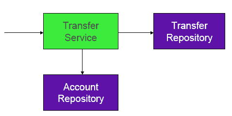
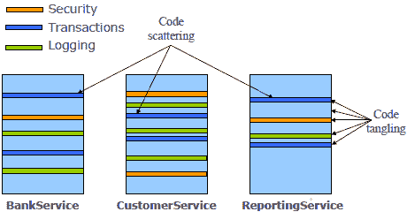
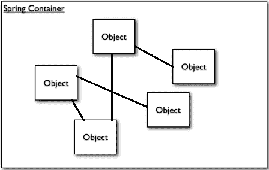
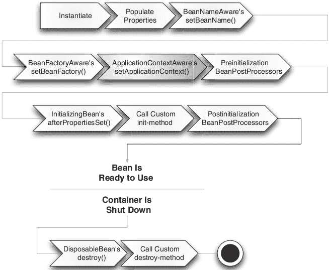
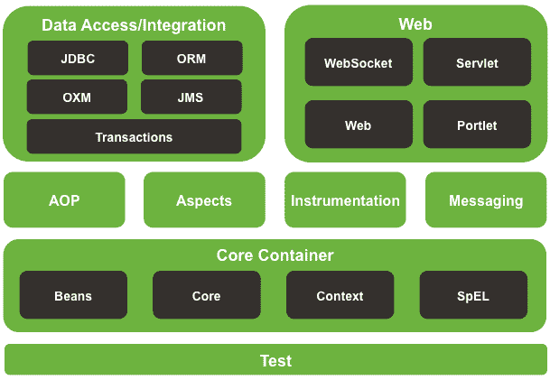

# 第一章：开始使用 Spring Framework 5.0 和设计模式

本章将帮助你通过模块更好地理解 Spring Framework，并使用负责 Spring 成功的设计模式。本章将涵盖 Spring Framework 的每一个主要模块。我们将从 Spring Framework 的介绍开始。我们将查看 Spring 5 中引入的新特性和增强功能。我们还将了解 Spring Framework 主要模块中使用的设计模式。

在本章结束时，你将了解 Spring 的工作原理，以及 Spring 如何通过使用设计模式解决企业应用设计层面的常见问题。你将知道如何通过使用 Spring 和设计模式来提高应用程序组件之间的松散耦合，以及如何通过使用 Spring 和其模式简化应用程序开发。

本章将涵盖以下主题：

+   Spring Framework 简介

+   使用 Spring 和其模式简化应用程序开发

    +   利用 POJO 模式的力量

    +   注入依赖

    +   将方面应用于解决横切关注点

    +   使用模板模式消除样板代码

+   使用工厂模式创建用于包含 bean 的 Spring 容器

    +   使用应用程序上下文创建容器

    +   容器中 bean 的生命周期

+   Spring 模块

+   Spring Framework 5.0 中的新特性

# 介绍 Spring Framework

在 Java 的早期阶段，有许多为大型企业应用提供企业解决方案的重型企业 Java 技术。然而，由于与框架紧密耦合，维护这些应用并不容易。几年前，除了 Spring 之外，所有 Java 技术都很重，就像 EJB 一样。当时，Spring 被引入作为一种替代技术，特别是为 EJB 设计的，因为与现有的其他 Java 技术相比，Spring 提供了一个非常简单、更精简、更轻量级的编程模型。Spring 通过使用许多可用的设计模式来实现这一点，但它专注于**普通旧 Java 对象**（**POJO**）编程模型。这种模型为 Spring Framework 提供了简单性。它还通过使用代理模式和装饰者模式，通过**依赖注入**（**DI**）模式和**面向切面编程**（**AOP**）模式赋予了这些想法力量。

Spring 框架是一个开源的应用程序框架，也是一个基于 Java 的平台，它为开发企业级 Java 应用程序提供了全面的基础设施支持。因此，开发者不需要关心应用程序的基础设施；他们应该专注于应用程序的业务逻辑，而不是处理应用程序的配置。所有基础设施、配置和元配置文件，无论是基于 Java 的配置还是基于 XML 的配置，都由 Spring 框架处理。因此，这个框架使你在使用 POJOs 编程模型而不是非侵入式编程模型构建应用程序时更加灵活。

Spring 的**控制反转**（**IoC**）容器是整个框架的核心。它有助于将应用程序的不同部分粘合在一起，从而形成一个连贯的架构。Spring MVC 组件可以用来构建一个非常灵活的 Web 层。IoC 容器简化了使用 POJOs 的业务层开发。

Spring 简化了应用程序开发，减少了对外部 API 的依赖。让我们看看作为应用程序开发者，你如何从 Spring 平台中受益的一些例子：

+   所有应用程序类都是简单的 POJO 类--Spring 不是侵入式的。它不需要你在大多数用例中扩展框架类或实现框架接口。

+   Spring 应用程序不需要 Java EE 应用服务器，但它们可以部署在服务器上。

+   你可以使用 Spring 框架中的事务管理来执行数据库中的方法，而不需要任何第三方事务 API。

+   使用 Spring，你可以将 Java 方法用作请求处理器方法或远程方法，就像 servlet API 中的`service()`方法一样，但无需处理 servlet 容器的 servlet API。

+   Spring 允许你在应用程序中不使用**Java 消息服务**（**JMS**）API 的情况下，将本地`java`方法用作消息处理器方法。

+   Spring 还允许你在应用程序中不使用**Java 管理扩展**（**JMX**）API 的情况下，将本地`java`方法用作管理操作。

+   Spring 作为你的应用程序对象的容器。你的对象不必担心找到和*建立*彼此之间的连接。

+   Spring 实例化 bean 并将你的对象的依赖注入到应用程序中--它作为 bean 的生命周期管理器。

# 使用 Spring 及其模式简化应用程序开发

使用传统的 Java 平台开发企业应用程序时，在组织基本构建块作为独立组件以供应用程序重用时存在许多限制。为基本和通用功能创建可重用组件是最佳设计实践，因此你不能忽视它。为了解决应用程序中的可重用性问题，你可以使用各种设计模式，例如工厂模式、抽象工厂模式、建造者模式、装饰者模式和服务定位器模式，将这些基本构建块组合成一个连贯的整体，例如类和对象实例，以促进组件的可重用性。这些模式解决了常见的递归应用问题。Spring 框架简单地内部实现这些模式，为你提供了一个以正式化方式使用的框架。

企业应用程序开发中存在许多复杂性，但 Spring 的创建是为了解决这些问题，并使开发人员能够简化开发过程。Spring 不仅限于服务器端开发，它还帮助简化了项目构建、可测试性和松耦合等方面。Spring 遵循 POJO 模式，即 Spring 组件可以是任何类型的 POJO。组件是一段自包含的代码，理想情况下可以在多个应用程序中重用。

由于本书专注于 Spring 框架采用的简化 Java 开发的全部**设计模式**，我们需要讨论或至少提供一些基本的设计模式和最佳实践，以设计企业应用程序开发的基础设施。Spring 使用以下策略使 Java 开发变得简单且可测试：

+   Spring 利用*POJO 模式*的力量，以轻量级和最小侵入式开发企业应用程序

+   它利用**依赖注入模式（DI 模式**）的力量，以松耦合的方式使系统接口面向对象

+   它利用*装饰者和代理设计模式*的力量，通过方面和常见约定进行声明式编程

+   它利用*模板设计模式*的力量，通过方面和模板消除样板代码

在本章中，我将解释这些想法中的每一个，并展示 Spring 如何简化 Java 开发的具体示例。让我们从探索 Spring 如何通过使用 POJO 模式鼓励面向 POJO 的开发来保持最小侵入性开始。

# 利用 POJO 模式的力量

对于 Java 开发，有许多其他框架通过强制你扩展或实现它们现有的类或接口来锁定你；Struts、Tapestry 和 EJB 的早期版本都采用了这种方法。这些框架的编程模型基于侵入式模型。这使得你的代码在系统中查找错误变得更加困难，有时甚至会使你的代码变得难以理解。然而，如果你正在使用 Spring 框架，你不需要实现或扩展其现有的类和接口，因此这只是一个基于 POJO 的实现，遵循非侵入式编程模型。这使得你的代码更容易在系统中查找错误，并保持代码的可理解性。

Spring 允许你使用非常简单的非 Spring 类进行编程，这意味着不需要实现特定的 Spring 类或接口，所以基于 Spring 的应用程序中的所有类都是简单的 POJO（Plain Old Java Objects）。这意味着你可以编译并运行这些文件，而无需依赖 Spring 库；甚至无法识别这些类正在被 Spring 框架使用。在基于 Java 的配置中，你会使用 Spring 注解，这是基于 Spring 的应用程序的最坏情况。

让我们通过以下示例来探讨这个问题：

```java
    package com.packt.chapter1.spring; 
    public class HelloWorld { 
      public String hello() { 
        return "Hello World"; 
      } 
    } 
```

上述类是一个简单的 POJO 类，没有任何特殊指示或实现与框架相关，使其成为 Spring 组件。因此，这个类在 Spring 应用程序中可以像在非 Spring 应用程序中一样正常工作。这是 Spring 非侵入式编程模型的美妙之处。Spring 使 POJO 更加强大的另一种方式是通过使用依赖注入模式与其他 POJO 协作。让我们看看依赖注入是如何帮助解耦组件的。

# 在 POJO 之间注入依赖关系

术语“依赖注入”（*dependency injection*）并不新鲜——它被 PicoContainer 所使用。依赖注入是一种设计模式，它促进了 Spring 组件之间的松散耦合——也就是说，在不同的协作 POJO 之间。因此，通过将依赖注入应用于复杂的编程，你的代码将变得更加简单、易于理解，并且易于测试。

在你的应用程序中，许多对象根据你的要求协同工作以实现特定的功能。这些对象之间的协作实际上被称为依赖注入。在工作组件之间注入依赖关系可以帮助你在没有紧密耦合的情况下对应用程序中的每个组件进行单元测试。

在一个运行中的应用程序中，最终用户想要看到的是输出。为了创建输出，应用程序中的几个对象协同工作，有时会相互耦合。因此，当你编写这些复杂的应用程序类时，请考虑这些类的可重用性，并尽可能使这些类保持独立。这是编码的最佳实践之一，将有助于你独立地对这些类进行单元测试。

# 依赖注入的工作原理以及它如何使开发和测试变得容易

让我们来看看您应用程序中 DI 模式的实现。它使事情变得易于理解，松散耦合，并在整个应用程序中进行测试。假设我们有一个简单的应用程序（比你在大学课程中可能制作的*Hello World*示例更复杂）。每个类都在共同努力执行某些业务任务，并帮助构建业务需求和期望。这意味着应用程序中的每个类都有其业务任务的责任度量，以及其他协作对象（其依赖项）。让我们看看以下图像。这种对象之间的依赖关系可能会在依赖对象之间创建复杂性和紧密耦合：



`TransferService`组件传统上依赖于另外两个组件：`TransferRepository`和`AccountRepository`

典型的应用程序系统由几个部分组成，它们共同执行一个用例。例如，考虑下面的`TransferService`类。

使用直接实例化的`TransferService`：

```java
    package com.packt.chapter1.bankapp.transfer; 
    public class TransferService { 
      private AccountRepository accountRepository; 
      public TransferService () { 
        this.accountRepository = new AccountRepository(); 
      } 
      public void transferMoney(Account a, Account b) { 
        accountRepository.transfer(a, b); 
      } 
    } 
```

`TransferService`对象需要一个`AccountRepository`对象来从账户`a`向账户`b`进行转账。因此，它直接创建了一个`AccountRepository`对象的实例并使用它。但是，直接实例化增加了耦合度，并将对象创建代码分散到应用程序中，这使得维护变得困难，并且难以为`TransferService`编写单元测试，因为在这种情况下，每当您想通过使用`assert`进行单元测试来测试`TransferService`类的`transferMoney()`方法时，`AccountRepository`类的`transfer()`方法也可能被意外调用。但是，开发者并不了解`AccountRepository`对`TransferService`类的依赖；至少，开发者无法使用单元测试来测试`TransferService`类的`transferMoney()`方法。

在企业应用程序中，耦合是非常危险的，它把你推向一个无法在未来对应用程序进行任何增强的情况，任何此类应用程序的进一步更改都可能产生大量错误，而修复这些错误可能会产生新的错误。紧密耦合的组件是这些应用程序中主要问题的原因之一。不必要的紧密耦合代码使你的应用程序难以维护，随着时间的推移，其代码将不会被重用，因为其他开发者无法理解它。但有时，企业应用程序需要一定程度的耦合，因为在现实世界的案例中，完全解耦的组件是不可能的。应用程序中的每个组件都对某个角色和业务需求承担一些责任，以至于应用程序中的所有组件都必须了解其他组件的责任。这意味着有时需要耦合，但我们必须非常小心地管理所需组件之间的耦合。

# 使用工厂辅助模式处理依赖组件

让我们尝试使用工厂模式来处理依赖对象的方法。这个设计模式基于 GOF（GoF，即设计模式之父）的工厂设计模式，通过工厂方法创建对象实例。因此，这种方法实际上集中了新操作符的使用。它根据客户端代码提供的信息创建对象实例。这种模式在依赖注入策略中得到了广泛的应用。

使用工厂辅助的`TransferService`：

```java
    package com.packt.chapter1.bankapp.transfer; 
    public class TransferService { 
      private AccountRepository accountRepository; 
      public TransferService() { 
        this.accountRepository = 
          AccountRepositoryFactory.getInstance("jdbc"); 
      } 
      public void transferMoney(Account a, Account b) { 
        accountRepository.transfer(a, b); 
      } 
    } 
```

在前面的代码中，我们使用工厂模式创建了一个`AccountRepository`对象。在软件工程中，应用程序设计和开发的最佳实践之一是**面向接口编程**（**P2I**）。根据这一实践，具体的类必须实现一个接口，该接口在客户端代码中被调用者使用，而不是使用具体的类。通过使用 P2I，你可以改进前面的代码。因此，我们可以轻松地用接口的不同实现来替换它，而对客户端代码的影响很小。所以面向接口编程为我们提供了一种涉及低耦合的方法。换句话说，没有直接依赖于具体实现，导致低耦合。让我们看看下面的代码。在这里，`AccountRepository`是一个接口，而不是一个类：

```java
    public interface AccountRepository{ 
      void transfer(); 
      //other methods 
    } 
```

因此，我们可以根据我们的需求来实现它，并且它依赖于客户端的基础设施。假设我们在开发阶段需要一个`AccountRepository`，使用 JDBC API。我们可以提供`JdbcAccountRepositry`接口的具体实现，如下所示：

```java
    public class JdbcAccountRepositry implements AccountRepositry{ 
      //...implementation of methods defined in AccountRepositry 
      // ...implementation of other methods 
    } 
```

在这种模式中，对象由工厂类创建，以便于维护，并避免将对象创建的代码散布到其他业务组件中。使用工厂助手，还可以使对象创建可配置。这种技术为紧密耦合提供了解决方案，但我们仍然在业务组件中添加工厂类以获取协作组件。所以让我们在下一节看看依赖注入模式，并看看如何解决这个问题。

# 使用依赖注入模式对依赖组件进行操作

根据依赖注入模式，依赖对象在由某个工厂或第三方在对象创建时提供其依赖项。这个工厂以这种方式协调系统中的每个对象，即每个依赖对象不需要创建它们的依赖项。这意味着我们必须专注于定义依赖项，而不是解决企业应用程序中协作对象的依赖项。让我们看看下面的图像。你会了解到依赖项被注入到需要它们的对象中：


应用程序中不同协作组件之间的依赖注入

为了说明这一点，让我们在下一节看看`TransferService`--一个`TransferService`与`AccountRepository`和`TransferRepository`有关联。在这里，`TransferService`能够通过`TransferRepository`的任何实现方式来转账，也就是说，我们可以使用`JdbcTransferRepository`或`JpaTransferRepository`，具体取决于部署环境。

`TransferServiceImpl`足够灵活，可以接受任何它被提供的`TransferRepository`：

```java
    package com.packt.chapter1.bankapp; 
    public class TransferServiceImpl implements TransferService { 
      private TransferRepository transferRepository; 
      private AccountRepository  accountRepository; 
      public TransferServiceImpl(TransferRepository transferRepository,
       AccountRepository  accountRepository) { 
         this.transferRepository =
          transferRepository;//TransferRepository is injected 
         this.accountRepository  = accountRepository; 
         //AccountRepository is injected 
       } 
       public void transferMoney(Long a, Long b, Amount amount) { 
         Account accountA = accountRepository.findByAccountId(a); 
         Account accountB = accountRepository.findByAccountId(b); 
         transferRepository.transfer(accountA, accountB, amount); 
       } 
    } 
```

在这里，你可以看到`TransferServiceImpl`没有创建它自己的存储库实现。相反，我们在构造时作为构造函数参数提供了存储库的实现。这是一种称为*构造函数注入*的依赖注入类型。在这里，我们将存储库接口类型作为构造函数的参数传递。现在`TransferServiceImpl`可以使用任何存储库的实现，无论是 JDBC、JPA 还是模拟对象。重点是`TransferServiceImpl`没有耦合到任何特定的存储库实现。使用什么类型的存储库从一个账户转账到另一个账户无关紧要，只要它实现了存储库接口。如果你使用 Spring 框架的依赖注入模式，松耦合是其关键好处之一。依赖注入模式始终促进 P2I，因此每个对象通过其关联的接口而不是关联的实现来了解其依赖项，因此依赖项可以轻松地用该接口的另一个实现替换，而不是更改其依赖类实现。

Spring 提供了从其部分组装此类应用程序系统的支持：

+   部件无需担心找到彼此

+   任何部分都可以轻松替换

通过在应用程序部分或组件之间创建关联来组装应用程序系统的方法被称为**连接**。在 Spring 中，有多种方法可以将协作组件连接起来，以形成一个应用程序系统。例如，我们可以使用 XML 配置文件或 Java 配置文件。

现在让我们看看如何使用 Spring 将`TransferRepository`和`AccountRepository`的依赖注入到`TransferService`中：

```java
    <?xml version="1.0" encoding="UTF-8"?> 
    <beans  

    xsi:schemaLocation="http://www.springframework.org/schema/beans 
    http://www.springframework.org/schema/beans/spring-beans.xsd"> 
    <bean id="transferService"  
     class="com.packt.chapter1.bankapp.service.TransferServiceImpl"> 
         <constructor-arg ref="accountRepository"/> 
         <constructor-arg ref="transferRepository"/> 
    </bean> 
    <bean id="accountRepository" class="com.
     packt.chapter1.bankapp.repository.JdbcAccountRepository"/> 
    <bean id="transferRepository" class="com.  
     packt.chapter1.bankapp.repository.JdbcTransferRepository"/>     

    </beans> 
```

在这里，`TransferServiceImpl`、`JdbcAccountRepository`和`JdbcTransferRepository`被声明为 Spring 中的 bean。对于`TransferServiceImpl` bean，它通过构造函数参数传递对`AccountRepository`和`TransferRepository` bean 的引用来构建。你可能想知道 Spring 还允许你使用 Java 表达式来表示相同的配置。

Spring 提供了基于 Java 的配置作为 XML 的替代方案：

```java
    package com.packt.chapter1.bankapp.config; 

    import org.springframework.context.annotation.Bean; 
    import org.springframework.context.annotation.Configuration; 

    import com.packt.chapter1.bankapp.repository.AccountRepository; 
    import com.packt.chapter1.bankapp.repository.TransferRepository; 
    import 
     com.packt.chapter1.bankapp.repository.jdbc.JdbcAccountRepository; 
    import 
     com.packt.chapter1.bankapp.repository.jdbc.JdbcTransferRepository; 
    import com.packt.chapter1.bankapp.service.TransferService; 
    import com.packt.chapter1.bankapp.service.TransferServiceImpl; 

    @Configuration 
    public class AppConfig { 

     @Bean 
     public TransferService transferService(){ 
       return new TransferServiceImpl(accountRepository(),
       transferRepository()); 
     } 
     @Bean 
     public AccountRepository accountRepository() { 
       return new JdbcAccountRepository(); 
     } 
     @Bean 
     public TransferRepository transferRepository() { 
       return new JdbcTransferRepository(); 
     } 
    } 
```

不论是使用基于 XML 的还是基于 Java 的配置，依赖注入模式的优点都是相同的：

+   依赖注入促进了松耦合。你可以使用最佳实践 P2I*移除硬编码的依赖项，并且你可以通过使用工厂模式和其内置的可交换和可插拔实现来从应用程序外部提供依赖项。

+   依赖注入模式促进面向对象编程的复合设计，而不是继承编程

虽然`TransferService`依赖于`AccountRepository`和`TransferRepository`，但它并不关心在应用程序中使用的是哪种类型的实现（JDBC 或 JPA）。只有 Spring，通过其配置（XML 或 Java），知道所有组件是如何结合在一起，以及如何使用 DI 模式实例化并带有所需依赖项的。DI 使得在不更改依赖类的情况下更改这些依赖项成为可能--也就是说，我们可以使用 JDBC 实现或 JPA 实现，而无需更改`AccountService`的实现。

在 Spring 应用程序中，应用程序上下文的一个实现（Spring 为基于 Java 的提供了`AnnotationConfigApplicationContext`，为基于 XML 的提供了`ClassPathXmlApplicationContext`）加载 bean 定义并将它们连接到 Spring 容器中。Spring 应用程序上下文在启动时创建和连接 Spring beans。查看基于 Java 配置的 Spring 应用程序上下文实现--它加载位于应用程序类路径中的 Spring 配置文件（Java 的`AppConfig.java`和 XML 的`Spring.xml`）。在下面的代码中，`TransferMain`类的`main()`方法使用`AnnotationConfigApplicationContext`类来加载配置类`AppConfig.java`并获取`AccountService`类的对象。

Spring 提供了基于 Java 的配置作为 XML 的替代方案：

```java
    package com.packt.chapter1.bankapp; 

    import org.springframework.context.ConfigurableApplicationContext; 
    import 
     org.springframework.context.annotation
     .AnnotationConfigApplicationContext; 

    import com.packt.chapter1.bankapp.config.AppConfig; 
    import com.packt.chapter1.bankapp.model.Amount; 
    import com.packt.chapter1.bankapp.service.TransferService; 

    public class TransferMain { 

      public static void main(String[] args) { 
        //Load Spring context 
        ConfigurableApplicationContext applicationContext = 
          new AnnotationConfigApplicationContext(AppConfig.class); 
         //Get TransferService bean 
         TransferService transferService = 
          applicationContext.getBean(TransferService.class); 
           //Use transfer method 
         transferService.transferAmmount(100l, 200l,
          new Amount(2000.0)); 
         applicationContext.close(); 
      } 

    }    
```

在这里，我们对依赖注入（DI）模式进行了简要介绍。您将在本书的后续章节中了解更多关于 DI 模式的内容。现在，让我们看看另一种使用 Spring 的声明性编程模型通过方面和代理模式简化 Java 开发的方法。

# 应用横切关注点的方面

在 Spring 应用程序中，依赖注入（DI）模式为我们提供了协作软件组件之间的松耦合，但 Spring 中的面向切面编程（Spring AOP）使您能够捕获在整个应用程序中重复出现的常见功能。因此，我们可以这样说，Spring AOP 促进了松耦合，并允许以下列出的横切关注点以最优雅的方式分离。它允许通过声明方式透明地应用这些服务。使用 Spring AOP，您可以编写自定义方面并声明性地配置它们。

您的应用程序中许多地方都需要通用的功能：

+   记录和跟踪

+   事务管理

+   安全

+   缓存

+   错误处理

+   性能监控

+   自定义业务规则

列出的组件不是您核心应用程序的一部分，但这些组件有一些额外的职责，通常被称为横切关注点，因为它们往往跨越多个组件的系统，而不仅仅是它们的内核职责。如果您将这些组件与您的核心功能放在一起，从而在不进行模块化的情况下实现横切关注点，这将有两个主要问题：

+   **代码纠缠**：关注点的耦合意味着横切关注点代码，如安全关注点、事务关注点和记录关注点，与您的应用程序中业务对象的代码耦合在一起。

+   **代码分散**：代码分散指的是相同关注点在模块中分散。这意味着您的安全、事务和记录的关注点代码分散在系统的所有模块中。换句话说，您可以说系统中有相同关注点代码的重复。

下面的图示说明了这种复杂性。业务对象与横切关注点过于紧密地结合在一起。不仅每个对象都知道它正在被记录、被保护并参与事务上下文，而且每个对象还负责执行仅分配给它的那些服务：



横切关注点，如记录、安全和事务，通常散布在那些任务不是其主要关注点的模块中

Spring AOP 使横切关注点的模块化成为可能，以避免纠缠和分散。你可以通过声明性方式将这些模块化关注点应用于应用程序的核心业务组件，而不会影响上述组件。方面确保 POJO 保持简单。Spring AOP 通过使用代理设计模式来实现这一魔法。我们将在本书的后续章节中进一步讨论代理设计模式。

# Spring AOP 是如何工作的

以下要点描述了 Spring AOP 的工作：

+   **实现你的主线应用程序逻辑**：专注于核心问题意味着，当你编写应用程序业务逻辑时，你不需要担心在业务代码之间添加额外的功能，如日志记录、安全和事务——Spring AOP 会处理这些。

+   **编写方面以实现你的横切关注点**：Spring 提供了许多开箱即用的方面，这意味着你可以在 Spring AOP 中以独立单元的形式编写额外的功能作为方面。这些方面作为横切关注点具有额外的责任，超出了应用程序逻辑代码。

+   **将方面织入你的应用程序**：将横切行为添加到正确的位置，即在编写方面以添加额外责任之后，你可以通过声明性方式将这些方面注入到应用程序逻辑代码的正确位置。

让我们看看 Spring 中 AOP 的一个示例：


基于 AOP 的系统演进——这使应用程序组件能够专注于它们特定的业务功能

在前面的图中，Spring AOP 将横切关注点（例如，安全、事务和日志记录）从业务模块（即`BankService`、`CustomerService`和`ReportingService`）中分离出来。这些横切关注点在应用程序运行时应用于业务模块的预定义点（前面图中的条纹）。

假设你想使用`LoggingAspect`的服务在调用`TransferService`的`transferAmmount()`方法之前和之后记录消息。以下列表显示了你可能使用的`LoggingAspect`类。

`LoggingAspect`调用用于为`TransferService`记录系统：

```java
    package com.packt.chapter1.bankapp.aspect; 

    import org.aspectj.lang.annotation.After; 
    import org.aspectj.lang.annotation.Aspect; 
    import org.aspectj.lang.annotation.Before; 

    @Aspect 
    public class LoggingAspect { 

     @Before("execution(* *.transferAmount(..))") 
     public void logBeforeTransfer(){ 
       System.out.println("####LoggingAspect.logBeforeTransfer() 
       method called before transfer amount####"); 
     } 

     @After("execution(* *.transferAmount(..))") 
     public void logAfterTransfer(){ 
       System.out.println("####LoggingAspect.logAfterTransfer() method
       called after transfer amount####"); 
     } 
    } 
```

将`LoggingAspect`转换为方面 bean，你只需要在 Spring 配置文件中将其声明为一种即可。此外，为了使其成为一个方面，你必须向这个类添加`@Aspect`注解。以下是更新后的`AppConfig.java`文件，已修改为声明`LoggingAspect`为方面。

声明`LoggingAspect`为方面并启用 Spring AOP 的`Apsect`代理功能：

```java
    package com.packt.chapter1.bankapp.config; 

    import org.springframework.context.annotation.Bean; 
    import org.springframework.context.annotation.Configuration; 
    import
     org.springframework.context.annotation.EnableAspectJAutoProxy; 

    import com.packt.chapter1.bankapp.aspect.LoggingAspect; 
    import com.packt.chapter1.bankapp.repository.AccountRepository; 
    import com.packt.chapter1.bankapp.repository.TransferRepository; 
    import
     com.packt.chapter1.bankapp.repository.jdbc.JdbcAccountRepository; 
    import
     com.packt.chapter1.bankapp.repository.jdbc.JdbcTransferRepository; 
    import com.packt.chapter1.bankapp.service.TransferService; 
    import com.packt.chapter1.bankapp.service.TransferServiceImpl; 

    @Configuration 
    @EnableAspectJAutoProxy 
    public class AppConfig { 

      @Bean 
      public TransferService transferService(){ 
        return new TransferServiceImpl(accountRepository(),
        transferRepository()); 
      } 
      @Bean 
      public AccountRepository accountRepository() { 
        return new JdbcAccountRepository(); 
      } 
      @Bean 
      public TransferRepository transferRepository() { 
        return new JdbcTransferRepository(); 
      } 
      @Bean 
      public LoggingAspect loggingAspect() { 
        return new LoggingAspect(); 
      } 
    } 
```

在这里，我们使用基于 Java 的 Spring AOP 配置来声明`LoggingAspect` bean 作为方面。首先，我们声明`LoggingAspect`为一个 bean。然后，我们使用`@Aspect`注解标注这个 bean。

我们使用`@Before`注解注释`LoggingAspect`的`logBeforeTransfer()`方法，以便在执行`transferAmount()`之前调用此方法。这被称为**前置通知**。然后，我们使用`@After`注解注释`LoggingAspect`的另一个方法，声明应在`transferAmount()`执行之后调用`logAfterTransfer()`方法。这被称为**后置通知**。

使用`@EnableAspectJAutoProxy`来启用应用中的 Spring AOP 功能。这个注解实际上强制你将对在 spring 配置文件中定义的一些组件应用代理。我们将在第六章中更详细地讨论 Spring AOP，*使用代理和装饰器模式的 Spring 面向切面编程*。现在，只需知道你已经要求 Spring 在`TransferService`类的`transferAmount()`方法之前和之后调用`LoggingAspect`的`logBeforeTransfer()`和`logAfterTransfer()`方法。现在，从这个例子中我们可以提取出两个重要的点：

+   `LoggingAspect`仍然是一个 POJO（如果你忽略`@Aspect`注解或使用基于 XML 的配置）--它没有任何表明它应该用作方面的信息。

+   重要的是要记住，`LoggingAspect`可以应用于`TransferService`，而无需`TransferService`显式调用它。实际上，`TransferService`对`LoggingAspect`的存在一无所知。

让我们转向另一种 Spring 简化 Java 开发的方式。

# 应用模板模式以消除样板代码

在企业应用的一个阶段，我们看到了一些看起来像我们在同一应用中之前已经编写过的代码。这实际上是样板代码。这是我们在同一应用中反复编写以实现不同部分应用中常见需求的代码。不幸的是，Java API 中有许多地方涉及大量的样板代码。当使用 JDBC 从数据库查询数据时，可以看到一个常见的样板代码示例。如果你曾经使用过 JDBC，你可能已经编写了一些处理以下内容的代码：

+   从连接池中检索连接

+   创建`PreparedStatement`对象

+   绑定 SQL 参数

+   执行`PreparedStatement`对象

+   从`ResultSet`对象中检索数据并填充数据容器对象

+   释放所有数据库资源

让我们看看以下代码，它包含 Java JDBC API 的样板代码：

```java
    public Account getAccountById(long id) { 
      Connection conn = null; 
      PreparedStatement stmt = null; 
      ResultSet rs = null; 
      try { 
        conn = dataSource.getConnection(); 
        stmt = conn.prepareStatement( 
          "select id, name, amount from " + 
          "account where id=?"); 
        stmt.setLong(1, id); 
        rs = stmt.executeQuery(); 
        Account account = null; 
        if (rs.next()) { 
          account = new Account(); 
          account.setId(rs.getLong("id")); 
          account.setName(rs.getString("name")); 
          account.setAmount(rs.getString("amount")); 
        } 
        return account; 
      } catch (SQLException e) { 
      } finally { 
          if(rs != null) { 
            try { 
              rs.close(); 
            } catch(SQLException e) {} 
          } 
          if(stmt != null) { 
            try { 
              stmt.close(); 
            } catch(SQLException e) {} 
          } 
          if(conn != null) { 
            try { 
              conn.close(); 
            } catch(SQLException e) {} 
          } 
        } 
      return null; 
    } 
```

在前述代码中，我们可以看到 JDBC 代码查询数据库以获取账户名称和金额。对于这个简单的任务，我们必须创建一个连接，然后创建一个语句，最后查询结果。我们还需要捕获`SQLException`，这是一个检查型异常，尽管如果它被抛出，你实际上能做的事情并不多。最后，我们必须清理混乱，关闭连接、语句和结果集。这也可能迫使它处理 JDBC 的异常，所以你在这里也必须捕获`SQLException`。这种样板代码严重影响了可重用性。

Spring JDBC 通过使用模板设计模式解决了样板代码的问题，通过从模板中移除常见代码，使得生活变得非常简单。这使得数据访问代码非常干净，并防止了诸如连接泄漏等令人烦恼的问题，因为 Spring 框架确保所有数据库资源都得到适当的释放。

# Spring 中的模板设计模式

让我们看看如何在 Spring 中使用模板设计模式：

+   定义算法的轮廓或骨架

1.  将具体实现的细节留到以后再说。

1.  隐藏大量的样板代码。

+   Spring 提供了许多模板类：

+   `JdbcTemplate`

+   `JmsTemplate`

+   `RestTemplate`

+   `WebServiceTemplate`

+   大多数隐藏了低级资源管理

让我们看看之前使用 Spring 的`JdbcTemplate`的相同代码，以及它是如何移除样板代码的。

使用`JdbcTemplates`让你的代码专注于任务：

```java
    public Account getAccountById(long id) { 
      return jdbcTemplate.queryForObject( 
        "select id, name, amoount" + 
        "from account where id=?", 
         new RowMapper<Account>() { 
           public Account mapRow(ResultSet rs, 
            int rowNum) throws SQLException { 
              account = new Account(); 
              account.setId(rs.getLong("id")); 
              account.setName(rs.getString("name")); 
              account.setAmount(rs.getString("amount")); 
              return account; 
            } 
         }, 
      id); 
    } 
```

如前述代码所示，与样板代码相比，这个新的`getAccountById()`版本要简单得多，这里的方法专注于从数据库中选择账户，而不是创建数据库连接、创建语句、执行查询、处理 SQL 异常，最后还要关闭连接。使用模板，你需要在模板的`queryForObject()`方法中提供 SQL 查询和一个`RowMapper`，用于将结果集数据映射到模板的域对象。模板负责完成这个操作的所有事情，比如数据库连接等等。它还在框架后面隐藏了大量的样板代码。

在本节中，我们看到了 Spring 如何利用面向 POJO 的开发和 DI 模式、使用代理模式的 Aspect 模式以及模板方法设计模式等模式的力量来攻击 Java 开发的复杂性。

在下一节中，我们将探讨如何使用 Spring 容器来创建和管理应用程序中的 Spring beans。

# 使用工厂模式通过 Spring 容器管理 beans

Spring 为我们提供了一个容器，我们的应用程序对象就生活在这个 Spring 容器中。如图所示，这个容器负责创建和管理对象：



在 Spring 应用程序中，我们的应用程序对象就生活在这个 Spring 容器中

**Spring 容器**还根据其配置将许多**对象**连接在一起。它配置了一些初始化参数，并管理它们的完整生命周期，从开始到结束。

基本上，Spring 容器有两种不同的类型：

+   Bean 工厂

+   应用程序上下文

# Bean 工厂

在 Spring 框架中，`org.springframework.beans.factory.BeanFactory`接口提供了 bean 工厂，这是 Spring 的 IoC 容器。`XmlBeanFactory`是这个接口的实现类。这个容器从 XML 文件读取配置元数据。它基于 GOF 工厂方法设计模式--以复杂的方式创建、管理、缓存和连接应用程序对象。bean 工厂只是一个对象池，其中对象由配置创建和管理。对于小型应用程序来说，这已经足够了，但企业应用程序需要更多功能，因此 Spring 提供了具有更多功能的 spring 容器版本。

在下一节中，我们将了解应用程序上下文以及 Spring 如何在应用程序中创建它。

# 应用程序上下文

在 Spring 框架中，`org.springframework.context.ApplicationContext`接口还提供了 Spring 的 IoC 容器。它只是一个 bean 工厂的包装，提供了额外的应用程序上下文服务，例如支持 AOP，因此支持声明式事务、安全性和支持国际化所需的消息资源，以及将应用程序事件发布给感兴趣的事件监听器的能力。

# 创建具有应用程序上下文的容器

Spring 提供了多种应用程序上下文的版本作为 bean 容器。`ApplicationContext`接口有多个核心实现，如下所示：

+   `FileSystemXmlApplicationContext`: 这个类是`ApplicationContext`的一个实现，它从文件系统中位于配置文件（XML）加载应用程序上下文 bean 定义。

+   `ClassPathXmlApplicationContext`: 这个类是`ApplicationContext`的一个实现，它从应用程序类路径中位于配置文件（XML）加载应用程序上下文 bean 定义。

+   `AnnotationConfigApplicationContext`: 这个类是`ApplicationContext`的一个实现，它从应用程序的类路径中的配置类（基于 Java）加载应用程序上下文 bean 定义。

Spring 为你提供了一个具有网络意识的`ApplicationContext`接口实现，如下所示：

+   `XmlWebApplicationContext`: 这个类是一个具有网络意识的`ApplicationContext`实现，它从包含在 Web 应用程序中的配置文件（XML）加载应用程序上下文 bean 定义。

+   `AnnotationConfigWebApplicationContext`: 这个类是一个具有网络意识的`ApplicationContext`实现，它从基于一个或多个 Java 配置类加载 Spring Web 应用程序上下文 bean 定义。

我们可以使用这些实现中的任何一个来将 bean 加载到 bean 工厂中。这取决于我们的应用程序配置文件的位置。例如，如果你想从文件系统中的特定位置加载你的配置文件`spring.xml`，Spring 为你提供了一个`FileSystemXmlApplicationContext`类，该类在文件系统中的特定位置查找配置文件`spring.xml`：

```java
    ApplicationContext context = new
     FileSystemXmlApplicationContext("d:/spring.xml"); 
```

同样，你也可以通过使用 Spring 提供的`ClassPathXmlApplicationContext`类从你的应用程序的类路径中加载你的应用程序配置文件`spring.xml`。它会在类路径的任何位置（包括 JAR 文件）查找配置文件`spring.xml`：

```java
    ApplicationContext context = new 
     ClassPathXmlApplicationContext("spring.xml"); 
```

如果你使用的是 Java 配置而不是 XML 配置，你可以使用`AnnotationConfigApplicationContext`：

```java
    ApplicationContext context = new 
     AnnotationConfigApplicationContext(AppConfig.class); 
```

在加载配置文件并获取应用程序上下文后，我们可以通过调用应用程序上下文的`getBean()`方法从 Spring 容器中获取 bean：

```java
    TransferService transferService = 
     context.getBean(TransferService.class); 
```

在下一节中，我们将了解 Spring bean 的生命周期以及 Spring 容器如何对 Spring bean 进行响应以创建和管理它。

# 容器中 bean 的生命

Spring 应用程序上下文使用工厂方法设计模式，根据给定的配置以正确的顺序在容器中创建 Spring bean。因此，Spring 容器有责任管理 bean 的生命周期，从创建到销毁。在正常的 Java 应用程序中，Java 的`new`关键字用于实例化 bean，并且它就绪可以使用。一旦 bean 不再使用，它就有资格进行垃圾回收。但在 Spring 容器中，bean 的生命周期更为复杂。以下图像显示了典型 Spring bean 的生命周期：



Spring 容器中 Spring bean 的生命周期如下：

1.  加载所有 bean 定义，创建一个有序图。

1.  实例化和运行`BeanFactoryPostProcessors`（你可以在这里更新 bean 定义）。

1.  实例化每个 bean。

1.  Spring 将值和 bean 引用注入到 bean 的属性中。

1.  如果任何 bean 实现了它，Spring 会将 bean 的 ID 传递给`BeanNameAware`接口的`setBeanName()`方法。

1.  如果任何 bean 实现了它，Spring 会将 bean 工厂本身的引用传递给`BeanFactoryAware`的`setBeanFactory()`方法。

1.  如果任何 bean 实现了它，Spring 会将应用程序上下文本身的引用传递给`ApplicationContextAware`的`setApplicationContext()`方法。

1.  `BeanPostProcessor`是一个接口，Spring 允许你使用你的 bean 实现它，并在 Spring bean 容器中初始化器调用之前通过调用其`postProcessBeforeInitialization()`方法修改 bean 的实例。

1.  如果您的 bean 实现了`InitializingBean`接口，Spring 将调用其`afterPropertiesSet()`方法来初始化应用程序的任何过程或加载资源。这取决于您指定的初始化方法。还有其他方法可以实现这一步骤，例如，您可以使用`<bean>`标签的`init-method`，`@Bean`注解的`initMethod`属性，以及 JSR 250 的`@PostConstruct`注解。

1.  `BeanPostProcessor`是一个接口，Spring 允许您使用自己的 bean 来实现它。它通过调用其`postProcessAfterInitialization()`方法，在 Spring bean 容器中初始化器被调用后修改 bean 的实例。

1.  现在您的 bean 已经准备好在步骤中使用，并且您的应用程序可以通过使用应用程序上下文的`getBean()`方法来访问这个 bean。您的 bean 在应用程序上下文中保持活跃，直到通过调用应用程序上下文的`close()`方法来关闭它。

1.  如果您的 bean 实现了`DisposibleBean`接口，Spring 将调用其`destroy()`方法来销毁应用程序的任何过程或清理资源。还有其他方法可以实现这一步骤--例如，您可以使用`<bean>`标签的`destroy-method`，`@Bean`注解的`destroyMethod`属性，以及 JSR 250 的`@PreDestroy`注解。

1.  这些步骤展示了 Spring 容器中 Spring bean 的生命周期。

1.  下一个部分将描述 Spring 框架提供的模块。

# Spring 模块

Spring 框架为特定的一组功能提供了几个不同的模块，并且它们在某种程度上相互独立。这个系统非常灵活，因此开发者可以选择仅用于企业应用程序的模块。例如，开发者可以使用 Spring DI 模块，并用非 Spring 组件构建应用程序的其余部分。因此，Spring 提供了与其他框架和 API 一起工作的集成点--例如，您只能使用 Spring Core DI 模式与 Struts 应用程序一起使用。如果开发团队更擅长使用 Struts，那么在应用程序的其他部分使用 Spring 组件和功能（如 JDBC 和事务）的同时，可以使用 Struts MVC 而不是 Spring MVC。因此，虽然开发人员需要与 Struts 应用程序一起部署所需的依赖项，但无需添加整个 Spring 框架。

下面是整个模块结构的概述：



Spring 框架的各个模块

让我们看看 Spring 的每个模块，并看看它们如何融入更大的图景。

# 核心 Spring 容器

Spring 框架的这个模块使用了大量的设计模式，例如工厂方法设计模式、DI 模式、抽象工厂设计模式、单例设计模式、原型设计模式等。所有其他 Spring 模块都依赖于此模块。当您配置应用程序时，您会隐式地使用这些类。它也被称为 IoC 容器，是 Spring 对依赖注入支持的核心，它管理着 Spring 应用程序中 bean 的创建、配置和管理。您可以通过使用 `BeanFactory` 的实现或 `ApplicationContext` 的实现来创建 Spring 容器。此模块包含 Spring bean 工厂，这是 Spring 提供 DI 的部分。 

# Spring 的 AOP 模块

Spring AOP 是一个基于 Java 的 AOP 框架，集成了 AspectJ。它使用动态代理进行方面织入，并专注于使用 AOP 解决企业级问题。本模块基于代理和装饰器设计模式。此模块使跨切面关注点的模块化成为可能，以避免纠缠和消除散布。类似于 DI，它支持核心业务服务和跨切面之间的松耦合。您可以在应用程序中声明式地实现自定义方面并配置它们，而不会影响业务对象的代码。它在代码中提供了很大的灵活性；您可以在不触及业务对象代码的情况下删除或更改方面逻辑。这是 Spring 框架中非常重要的一个模块，因此我将在本书的第六章，“使用代理和装饰器模式的 Spring 面向切面编程”中详细讨论。

# Spring DAO - 数据访问和集成

Spring DAO 和 Spring JDBC 通过使用模板来移除通用代码，使得生活变得非常简单。这些模板实现了 GOF 模板方法设计模式，并提供了合适的扩展点以插入自定义代码。如果您正在使用传统的 JDBC 应用程序，您必须编写大量的样板代码，例如创建数据库连接、创建语句、查找结果集、处理 SQLException，最后关闭连接。如果您正在使用具有 DAO 层的 Spring JDBC 框架，那么您不需要编写样板代码，这与传统的 JDBC 应用程序不同。这意味着 Spring 允许您保持应用程序代码的清洁和简单。

# Spring 的 ORM

Spring 还为 ORM 解决方案提供支持，并为 ORM 工具提供集成，以便在关系数据库中轻松持久化 POJO 对象。此模块实际上为 Spring DAO 模块提供了一个扩展。类似于基于 JDBC 的模板，Spring 为与领先的 ORM 产品（如 Hibernate、JPA、OpenJPA、TopLink、iBATIS 等）一起工作提供了 ORM 模板。

# Spring web MVC

Spring 为企业级 Web 应用程序提供了一个 Web 和远程模块。此模块有助于构建高度灵活的 Web 应用程序，充分利用 Spring IOC 容器的全部优势。此 Spring 模块使用 MVC 架构模式、前端控制器模式和 DispatcherServlet 模式等模式，并且与 servlet API 无缝集成。Spring Web 模块非常可插拔和灵活。我们可以添加任何视图技术，如 JSP、FreeMarker、Velocity 等。我们还可以通过 spring IOC 和 DI 与其他框架（如 Struts、Webwork 和 JSF）集成。

# Spring Framework 5.0 的新特性

Spring 5.0 是 Spring 可用的新鲜版本。Spring 5.0 中有很多令人兴奋的新特性，包括以下内容：

+   支持 JDK 8 + 9 和 Java EE 7 基线：

Spring 5 支持最低 Java 8 要求，因为整个框架代码库都是基于 Java 8 的。

Spring 框架要求至少 Java EE 7 才能运行 Spring Framework 5.0 应用程序。这意味着它需要 Servlet 3.1、JMS 2.0、JPA 2.1。

+   弃用和移除的包、类和方法：

在 Spring 5.0 中，一些包已被移除或弃用。spring-aspects 模块中有一个名为 `mock.static` 的包已被移除，因此不再支持 `AnnotationDrivenStaticEntityMockingControl`。

`web.view.tiles2` 和 `orm.hibernate3/hibernate4` 等包也已在 Spring 5.0 中被移除。现在，在最新的 Spring 框架中，使用 Tiles 3 和 Hibernate 5。

Spring 5.0 框架不再支持 Portlet、Velocity、JasperReports、XMLBeans、JDO、Guava（等等）。

Spring 5.0 已经移除了 Spring 早期版本中的一些弃用类和方法。

+   添加新的反应式编程模型：

这种编程模型已经在 Spring 5.0 框架中引入。让我们看看以下关于反应式编程模型的列表。

Spring 5 引入了 Spring-core 模块的 `DataBuffer` 和具有非阻塞语义的编码器/解码器抽象到反应式编程模型中。

使用反应式模型，Spring 5.0 为 HTTP 消息编解码器实现提供了 Spring-web 模块，支持 **JSON**（**Jackson**）和 **XML**（**JAXB**）。

Spring 反应式编程模型添加了一个新的 `spring-web-reactive` 模块，为 `@Controller` 编程模型提供了反应式支持，将反应式流适配到 Servlet 3.1 容器，以及非 Servlet 运行时，如 Netty 和 Undertow。

Spring 5.0 还引入了一个新的 `WebClient`，在客户端提供反应式支持以访问服务。

如此列出，您可以看到 Spring 框架 5.0 中有很多令人兴奋的新特性和增强。因此，在这本书中，我们将通过示例和它们采用的设计模式来探讨这些新特性。

# 摘要

在阅读完本章之后，你现在应该对 Spring 框架及其最常用的设计模式有一个良好的概述。我指出了 J2EE 传统应用中存在的问题，以及 Spring 如何通过使用大量设计模式和良好实践来解决问题并简化 Java 开发，创建一个应用。Spring 的目标是使企业级 Java 开发更加容易，并促进松耦合代码。我们还讨论了 Spring AOP 用于解决横切关注点，以及 DI 模式用于与松耦合和可插拔的 Spring 组件一起使用，这样对象就不需要知道它们的依赖从何而来或如何实现。Spring 框架是最佳实践和有效对象设计的推动者。Spring 框架有两个重要特性——首先，它有一个 Spring 容器来创建和管理 Bean 的生命周期；其次，它为几个模块和集成提供支持，以帮助简化 Java 开发。
