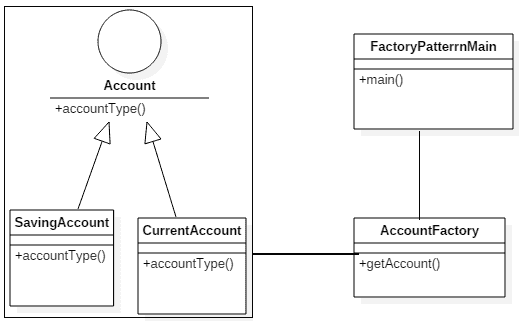
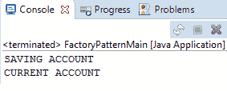
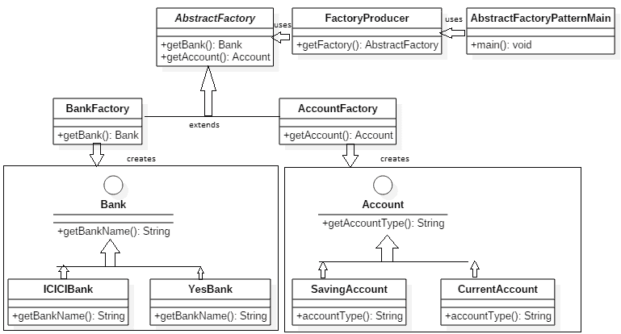
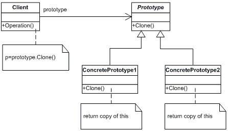
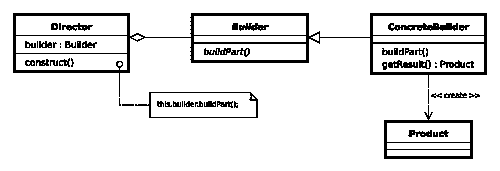
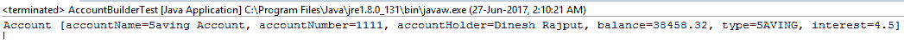

# GOF 设计模式概述 - 核心设计模式

在本章中，您将获得 GOF 设计模式的概述，包括一些制作应用程序设计的最佳实践。您还将了解使用设计模式进行常见问题解决的方法。

我将解释 Spring 框架常用的设计模式，以实现更好的设计和架构。我们都在一个全球化的世界中，这意味着如果我们有市场上的服务，它们可以在全球范围内访问。简单来说，现在是分布式计算系统的时代。所以首先，什么是分布式系统？它是一个被分成更小部分的应用程序，这些部分在不同的计算机上同时运行，并且这些小部分通过网络进行通信，通常使用协议。这些小部分被称为**层**。所以如果我们想创建一个分布式应用程序，*n*-层架构是那种类型应用程序的更好选择。但是开发*n*-层分布式应用程序是一项复杂且具有挑战性的工作。将处理分配到单独的层可以导致更好的资源利用。它还支持将任务分配给最适合在该层工作和开发的专业人士。在开发分布式应用程序中存在许多挑战，其中一些在此详细说明：

+   层之间的集成

+   事务管理

+   企业数据并发处理

+   应用程序的安全性等

因此，我在这本书中的重点是通过对 Spring 框架应用模式和最佳实践来简化 Java EE 应用程序的设计和开发。在这本书中，我将涵盖一些常见的 GOF 设计模式，以及 Spring 如何采用这些模式为上述企业应用程序问题提供最佳解决方案，因为分布式对象的设计对于经验丰富的专业人士来说也是一个极其复杂的工作。在制定最终解决方案之前，您需要考虑关键问题，如可伸缩性、性能、事务等。该解决方案被描述为一种模式。

本章结束时，您将了解设计模式如何提供最佳解决方案来解决任何与设计相关和开发相关的问题，以及如何以最佳实践开始开发。在这里，您将获得更多关于 GOF 设计模式的想法，以及实际生活中的例子。您将了解 Spring 框架如何内部实现这些设计模式以提供最佳的企业解决方案。

本章将涵盖以下要点：

+   介绍设计模式的力量

+   常见 GOF 设计模式概述

    +   核心设计模式

        +   创建型设计模式

        +   结构化设计模式

        +   行为设计模式

    +   J2EE 设计模式

        +   展示层的设计模式

        +   业务层的设计模式

        +   集成层的设计模式

+   Spring 应用程序开发的最佳实践

# 介绍设计模式的力量

那么什么是设计模式呢？实际上，设计模式这个短语与任何编程语言都没有关联，它也不提供针对特定语言的解决方案。设计模式与重复性问题的解决方案相关。例如，如果任何问题频繁发生，那么针对该问题的解决方案已经被有效地使用过。任何不可重用的解决方案都不能被视为模式，但问题必须频繁发生，才能有可重用的解决方案，才能被视为模式。因此，设计模式是描述软件设计中常见问题重复解决方案的软件工程概念。设计模式还代表了经验丰富的面向对象软件开发者所使用的最佳实践。

当你为应用程序进行设计时，你应该考虑所有常见问题的解决方案，这些解决方案被称为**设计模式**。设计模式的理解必须在开发团队中良好，以便员工能够有效地进行沟通。实际上，你可能熟悉一些设计模式；然而，你可能没有使用众所周知的名称来描述它们。这本书将带你通过逐步的方法，并在学习设计模式概念的同时，展示使用 Java 的示例。

设计模式有三个主要特征：

+   设计模式是**特定于特定场景**的，而不是特定于某个平台。因此，其上下文是问题存在的周围条件。上下文必须在模式中予以记录。

+   设计模式已经发展成提供针对软件开发过程中遇到的一些问题的**最佳解决方案**。因此，这应该限制在考虑的上下文中。

+   设计模式是**针对考虑中的问题的解决方案**。

例如，如果一个开发者正在引用 GOF 单例设计模式并表明使用单个对象，那么所有涉及的开发者都应该理解你需要设计一个在应用程序中只会有一个实例的对象。因此，单例设计模式将由一个对象组成，开发者可以相互告知程序正在遵循单例模式。

# 常见 GoF 设计模式概述

作者 Erich Gamma、Richard Helm、Ralph Johnson 和 John Vlissides 通常被称为 GoF，或四人帮。他们出版了一本名为《设计模式：可复用面向对象软件元素》的书，这标志着软件开发中设计模式概念的诞生。

在本章中，你将学习什么是 GOF 模式以及它们如何帮助解决面向对象设计中遇到的常见问题。

**四人帮**（**GoF**）模式是 23 个经典的软件设计模式，为软件设计中的常见问题提供重复的解决方案。这些模式在书籍《设计模式：可复用面向对象软件元素》中定义。这些模式分为两大类：

+   核心设计模式

+   J2EE 设计模式

此外，**核心设计模式**也被细分为三个主要的设计模式类别，如下所示：

+   **创建型设计模式**：这个类别下的模式提供了一种在构造函数无法满足需求时构建对象的方法。对象的创建逻辑是隐藏的。基于这些模式的程序在根据您的需求和应用程序的使用案例决定对象创建方面更加灵活。

+   **结构型设计模式**：这个类别下的模式处理类或对象的组合。在企业应用中，有两种常用的技术在面向对象系统中重用功能：一种是类继承，另一种是继承的对象组合概念。继承的对象组合概念用于组合接口，并定义组合对象以获得新功能的方法。

+   **行为设计模式**：这个类别下的模式描述了类或对象之间交互和分配责任的方式。这些设计模式特别关注对象之间的通信。行为设计模式用于控制并简化企业应用中的复杂应用流程。

现在，让我们看看另一个类别，即**JEE 设计模式**。这是设计模式的另一个主要类别。通过应用 Java EE 设计模式，可以极大地简化应用设计。Java EE 设计模式已在 Sun 的 Java Blueprints 中进行了记录。这些 Java EE 设计模式提供了经过时间考验的解决方案指南和最佳实践，用于 Java EE 应用程序不同层中的对象交互。这些设计模式特别关注以下列出的层：

+   呈现层的设计模式

+   业务层的设计模式

+   集成层的设计模式

让我们在下一节中探索创建型设计模式。

# 创建型设计模式

让我们看看这个类别背后的设计模式，以及 Spring 框架如何采用它们来提供组件之间的松耦合，并创建和管理 Spring 组件的生命周期。创建型设计模式与对象创建的方法相关联。对象的创建逻辑对调用者来说是隐藏的。

我们都知道如何在 Java 中使用`new`关键字创建对象，如下所示：

```java
     Account account = new Account(); 
```

但这种方法在某些情况下并不适用，因为它是一种硬编码创建对象的方式。根据程序的性质，创建对象也不是最佳实践。在这里，创建型设计模式提供了根据程序性质创建对象的灵活性。

现在，让我们看看这个类别下的不同设计模式。

# 工厂设计模式

*定义一个用于创建对象的接口，但让子类决定要实例化的类。工厂方法允许一个类将实例化推迟到子类。*

- GOF 设计模式

工厂设计模式是一种创建型设计模式。工厂设计模式也被称为工厂方法设计模式。根据这种设计模式，你得到一个类的对象，而不向客户端暴露底层逻辑。它通过使用公共接口或抽象类为新调用者分配一个新对象。这意味着设计模式隐藏了对象实现的实际逻辑，如何创建它，以及在哪里实例化它。因此，客户端不需要担心创建、管理和销毁对象——工厂模式负责这些任务。工厂模式是 Java 中最常用的设计模式之一。

让我们看看工厂模式的优点：

+   工厂模式通过使用接口而不是将特定于应用程序的类绑定到应用程序代码中，促进了协作组件或类之间的松耦合。

+   使用这种模式，你可以在运行时获取实现接口的类的对象。

+   对象的生命周期由该模式实现的工厂管理。

现在，让我们讨论一些应该应用工厂设计模式的常见问题：

+   这种模式减轻了开发者创建和管理对象的负担。

+   这种模式消除了协作组件之间的紧密耦合，因为一个组件不知道它将需要创建哪些子类。

+   避免硬编码创建类的对象。

# 在 Spring 框架中实现工厂设计模式

Spring 框架透明地使用这种工厂设计模式，通过 `BeanFactory` 和 `ApplicationContext` 接口来实现 Spring 容器。Spring 的容器基于工厂模式创建 Spring 应用程序中的 Spring bean，并管理每个 Spring bean 的生命周期。`BeanFactory` 和 `ApplicationContext` 是工厂接口，Spring 有很多实现类。`getBean()` 方法是工厂方法，它根据需要提供 Spring bean。

让我们看看工厂设计模式的示例实现。

# 工厂设计模式的示例实现

有两个类 `SavingAccount` 和 `CurrentAccount` 实现了一个 `Account` 接口。因此，您可以创建一个 `Factory` 类，该类有一个方法，该方法接受一个或多个参数，其返回类型是 `Account`。这个方法被称为工厂方法，因为它创建了 `CurrentAccount` 或 `SavingAccount` 的实例。`Account` 接口用于松耦合。因此，根据工厂方法中传递的参数，它选择实例化哪个子类。这个工厂方法将具有其超类作为其返回类型：



工厂设计模式的 UML 图

让我们通过以下示例来查看这个设计模式。在这里，我将创建一个 `Account` 接口和一些实现 `Account` 接口的具体类：

```java
    package com.packt.patterninspring.chapter2.factory;
    public interface Account { 
      void accountType(); 
   } 
```

现在让我们创建 `SavingAccount.java`，它将实现 `Account` 接口：

```java
    package com.packt.patterninspring.chapter2.factory; 
    public class SavingAccount implements Account{ 
      @Override 
      public void accountType() { 
         System.out.println("SAVING ACCOUNT"); 
      } 
    } 
```

与 `CurrentAccount.java` 相同，它也将实现 `Account` 接口：

```java
    package com.packt.patterninspring.chapter2.factory; 
    public class CurrentAccount implements Account { 
      @Override 
      public void accountType() { 
         System.out.println("CURRENT ACCOUNT"); 
      } 
    } 
```

现在将定义一个 `AccountFactory` 工厂类。`AccountFactory` 根据作为工厂方法参数给出的账户类型生成具体类的对象，无论是 `SavingAccount` 还是 `CurrentAccount`：

`AccountFactory.java` 是一个用于生产 `Account` 类型对象的工厂：

```java
    package com.packt.patterninspring.chapter2.factory.pattern; 
    import com.packt.patterninspring.chapter2.factory.Account; 
    import com.packt.patterninspring.chapter2.factory.CurrentAccount; 
    import com.packt.patterninspring.chapter2.factory.SavingAccount; 
    public class AccountFactory { 
      final String CURRENT_ACCOUNT = "CURRENT"; 
      final String SAVING_ACCOUNT  = "SAVING"; 
      //use getAccount method to get object of type Account    
      //It is factory method for object of type Account 
      public Account getAccount(String accountType){   
         if(CURRENT_ACCOUNT.equals(accountType)) {   
               return new CurrentAccount();   
         }
         else if(SAVING_ACCOUNT.equals(accountType)){   
               return new SavingAccount();   
         }    
         return null;   
      }   
    } 
```

`FactoryPatternMain` 是 `AccountFactory` 的主调用类，用于获取 `Account` 对象。它将传递一个参数给工厂方法，该参数包含账户类型的信息，例如 `SAVING` 和 `CURRENT`。`AccountFactory` 返回您传递给工厂方法的类型对象。

让我们创建一个演示类 `FactoryPatterMain.java` 来测试工厂方法设计模式：

```java
    package com.packt.patterninspring.chapter2.factory.pattern; 
    import com.packt.patterninspring.chapter2.factory.Account; 
    public class FactoryPatterMain { 
      public static void main(String[] args) { 
         AccountFactory accountFactory = new AccountFactory(); 
         //get an object of SavingAccount and call its accountType()
         method. 
         Account savingAccount = accountFactory.getAccount("SAVING"); 
         //call accountType method of SavingAccount 
         savingAccount.accountType(); 
         //get an object of CurrentAccount and call its accountType() 
         method. 
         Account currentAccount = accountFactory.getAccount("CURRENT"); 
         //call accountType method of CurrentAccount 
         currentAccount.accountType(); 
      } 
    } 
```

您可以测试此文件，并在控制台上查看输出，它应该看起来像这样：



现在我们已经看到了工厂设计模式，让我们转向它的一个不同变体——抽象工厂设计模式。

# 抽象工厂设计模式

*提供一个接口，用于创建相关或依赖对象家族，而不指定它们的具体类* - GOF 设计模式

抽象工厂模式属于创建型设计模式。与工厂方法设计模式相比，这是一个高级设计模式。根据这个设计模式，您只需定义一个接口或抽象类来创建一个相关依赖对象，而不指定其具体子类。因此，在这里，抽象工厂返回一个类工厂。让我为您简化一下。您有一组工厂方法设计模式，您只需将这些工厂通过工厂设计模式放在一个工厂下，这意味着它只是一个工厂的工厂。而且没有必要将所有工厂的知识带入工厂中——您可以使用顶级工厂来编写程序。

在抽象工厂模式中，一个接口负责创建相关对象的工厂，而不明确指定它们的类。每个生成的工厂都可以按照工厂模式提供对象。

抽象工厂模式的优点如下：

+   抽象工厂设计模式提供了组件家族之间的松耦合。它还隔离了客户端代码与具体类。

+   这种设计模式比工厂模式（Factory pattern）更高级。

+   这种模式在对象构建时间上提供了更好的跨应用程序一致性。

+   这种模式可以轻松地交换组件家族。

# 应该应用抽象工厂设计模式的常见问题

当你在应用程序中设计用于对象创建的工厂模式时，有时你希望一组相关的对象以特定的约束条件被创建，并在应用程序中跨相关对象应用所需的逻辑。你可以通过在工厂内部为相关对象集创建另一个工厂来实现这种设计，并应用所需的约束。你也可以将逻辑编程到一组相关对象中。

当你想定制相关对象的实例化逻辑时，可以使用这种设计模式。

# 在 Spring 框架中实现抽象工厂设计模式

在 Spring 框架中，`FactoryBean`接口基于抽象工厂设计模式。Spring 提供了大量的该接口实现，例如`ProxyFactoryBean`、`JndiFactoryBean`、`LocalSessionFactoryBean`、`LocalContainerEntityManagerFactoryBean`等。`FactoryBean`也有助于 Spring 构建它自己难以构建的对象。通常这用于构建具有许多依赖关系的复杂对象。当构建逻辑本身高度动态且依赖于配置时，也可能被使用。

例如，在 Spring 框架中，`FactoryBean`的一个实现是`LocalSessionFactoryBean`，它用于获取与 hibernate 配置关联的 bean 的引用。这是一个关于数据源的具体配置。在获取`SessionFactory`对象之前应该应用它。你可以使用`LocalSessionFactoryBean`以一致的方式应用特定的数据源配置。你还可以将 FactoryBean 的`getObject()`方法的结果注入到任何其他属性中。

让我们创建一个抽象工厂设计模式的示例实现。

# 抽象工厂设计模式的示例实现

我将创建一个`Bank`和`Account`接口以及实现这些接口的一些具体类。在这里，我还创建了一个抽象工厂类`AbstractFactory`。我有一些工厂类，`BankFactory`和`AccountFactory`；这些类扩展了`AbstractFactory`类。我还会创建一个`FactoryProducer`类来创建工厂。

让我们通过以下图像看看这个设计模式：



抽象工厂设计模式的 UML 图

创建一个演示类 `AbstractFactoryPatternMain`；它使用 `FactoryProducer` 来获取 `AbstractFactory` 对象。在这里，我传递了 `ICICI`、`YES` 等信息给 `AbstractFactory` 以获取 `Bank` 对象，我还传递了 `SAVING`、`CURRENT` 等信息给 `AbstractFactory` 以获取 `Account` 类型。

这里是 `Bank.java` 的代码，它是一个接口：

```java
    package com.packt.patterninspring.chapter2.model; 
    public interface Bank { 
      void bankName(); 
    } 
```

现在让我们创建 `ICICIBank.java`，它实现了 `Bank` 接口：

```java
    package com.packt.patterninspring.chapter2.model; 
    public class ICICIBank implements Bank { 
      @Override 
      public void bankName() { 
        System.out.println("ICICI Bank Ltd."); 
      } 
    } 
```

让我们再创建一个 `YesBank.java`，一个实现 `Bank` 接口的类：

```java
    package com.packt.patterninspring.chapter2.model; 
    public class YesBank implements Bank{ 
      @Override 
      public void bankName() { 
         System.out.println("Yes Bank Pvt. Ltd."); 
      } 
   } 
```

在这个例子中，我使用了与本书中工厂模式示例相同的 `Account` 接口和实现类。

`AbstractFactory.java` 是一个抽象类，用于获取 `Bank` 和 `Account` 对象的工厂：

```java
    package com.packt.patterninspring.chapter2.abstractfactory.pattern; 
    import com.packt.patterninspring.chapter2.model.Account; 
    import com.packt.patterninspring.chapter2.model.Bank; 
    public abstract class AbstractFactory { 
      abstract Bank getBank(String bankName); 
      abstract Account getAccount(String accountType); 
    } 
```

`BankFactory.java` 是一个工厂类，它扩展了 `AbstractFactory`，根据给定信息生成具体类的对象：

```java
    package com.packt.patterninspring.chapter2.abstractfactory.pattern; 
    import com.packt.patterninspring.chapter2.model.Account; 
    import com.packt.patterninspring.chapter2.model.Bank; 
    import com.packt.patterninspring.chapter2.model.ICICIBank; 
    import com.packt.patterninspring.chapter2.model.YesBank; 
    public class BankFactory extends AbstractFactory { 
      final String ICICI_BANK = "ICICI"; 
      final String YES_BANK   = "YES"; 
      //use getBank method to get object of name bank    
      //It is factory method for object of name bank 
      @Override 
      Bank getBank(String bankName) { 
         if(ICICI_BANK.equalsIgnoreCase(bankName)){   
               return new ICICIBank();   
         } 
         else if(YES_BANK.equalsIgnoreCase(bankName)){   
               return new YesBank();   
         }   
         return null; 
      } 
      @Override 
      Account getAccount(String accountType) { 
         return null; 
      } 
    } 
```

`AccountFactory.java` 是一个工厂类，它扩展了 `AbstractFactory.java`，根据给定信息生成具体类的对象：

```java
     package com.packt.patterninspring.chapter2.abstractfactory.pattern; 
     import com.packt.patterninspring.chapter2.model.Account; 
     import com.packt.patterninspring.chapter2.model.Bank; 
     import com.packt.patterninspring.chapter2.model.CurrentAccount; 
     import com.packt.patterninspring.chapter2.model.SavingAccount; 
     public class AccountFactory extends AbstractFactory { 
       final String CURRENT_ACCOUNT = "CURRENT"; 
       final String SAVING_ACCOUNT  = "SAVING"; 
       @Override 
       Bank getBank(String bankName) { 
          return null; 
      } 
      //use getAccount method to get object of type Account    
      //It is factory method for object of type Account 
      @Override 
      public Account getAccount(String accountType){   
        if(CURRENT_ACCOUNT.equals(accountType)) {   
               return new CurrentAccount();   
        }
        else if(SAVING_ACCOUNT.equals(accountType)){   
               return new SavingAccount();   
        }    
        return null;   
      } 
    } 
```

`FactoryProducer.java` 是一个类，它创建一个工厂生成器类，通过传递一些信息（如 `Bank` 或 `Account`）来获取工厂：

```java
    package com.packt.patterninspring.chapter2.abstractfactory.pattern; 
    public class FactoryProducer { 
      final static String BANK    = "BANK"; 
      final static String ACCOUNT = "ACCOUNT"; 
      public static AbstractFactory getFactory(String factory){ 
         if(BANK.equalsIgnoreCase(factory)){ 
               return new BankFactory(); 
         }
         else if(ACCOUNT.equalsIgnoreCase(factory)){ 
               return new AccountFactory(); 
         } 
         return null; 
       } 
    } 
```

`FactoryPatterMain.java` 是抽象工厂设计模式的一个演示类。`FactoryProducer` 是一个类，用于获取 `AbstractFactory`，以便通过传递一些信息（如类型）来获取具体类的工厂：

```java
    package com.packt.patterninspring.chapter2.factory.pattern; 
    import com.packt.patterninspring.chapter2.model.Account; 
    public class FactoryPatterMain { 
      public static void main(String[] args) { 
         AccountFactory accountFactory = new AccountFactory(); 
         //get an object of SavingAccount and call its accountType() 
         method. 
         Account savingAccount = accountFactory.getAccount("SAVING"); 
         //call accountType method of SavingAccount 
         savingAccount.accountType(); 
         //get an object of CurrentAccount and call its accountType() 
         method. 
         Account currentAccount = accountFactory.getAccount("CURRENT"); 
         //call accountType method of CurrentAccount 
         currentAccount.accountType(); 
      } 
    } 
```

你可以通过测试这个文件并在控制台上查看输出来测试这个文件：


现在我们已经看到了抽象工厂设计模式，让我们转向它的一个不同变体--单例设计模式。

# 单例设计模式

*确保一个类只有一个实例，并提供一个全局访问点 - GOF 设计模式*

单例模式是一个创建型设计模式，它是 Java 中最简单的模式之一。根据单例设计模式，类为每个调用提供相同的单个对象--也就是说，它限制了一个类的实例化只能有一个对象，并为该类提供了一个全局访问点。因此，该类负责创建对象，并确保对于每个客户端对该对象的调用，只创建一个对象。这个类不允许直接实例化这个类的对象。它允许你只能通过一个公开的静态方法来获取对象实例。

当系统需要精确地一个对象来协调操作时，这很有用。你可以使用两种形式创建一个单例模式，如下所示：

+   **早期实例化**：在加载时创建实例

+   **延迟实例化**：在需要时创建实例

**单例模式的优点：**

+   它提供了对关键（通常是重量级对象）类的控制器访问，例如数据库的连接类和 Hibernate 中的 `SessionFactory` 类

+   它节省了大量内存

+   它是多线程环境中的一个非常高效的设计

+   它更加灵活，因为类控制了实例化过程，并且类有改变实例化过程的灵活性

+   它具有低延迟

# 应该应用单例模式的常见问题

单例模式只解决一个问题——如果你有一个只能有一个实例的资源，并且你需要管理这个单例，那么你需要一个单例。通常，如果你想在分布式和多线程环境中使用给定配置创建数据库连接，如果不遵循单例设计，那么每个线程可能会创建一个具有不同配置对象的新的数据库连接。使用单例模式，系统中的每个线程都将获得具有相同配置对象的相同数据库连接对象。它主要用于多线程和数据库应用程序。它用于日志记录、缓存、线程池、配置设置等。

# Spring 框架中的单例设计模式实现

Spring 框架提供了一个单例作用域的 bean 作为单例模式。它与单例模式类似，但并不完全等同于 Java 中的单例模式。根据单例模式，Spring 框架中的作用域 bean 表示每个容器和每个 bean 的单个 bean 实例。如果你在单个 Spring 容器中为特定类定义了一个 bean，那么 Spring 容器将创建一个由该 bean 定义指定的类的单个实例。

让我们创建一个单例设计模式的示例应用程序。

# 单例设计模式的示例实现

在下面的代码示例中，我将创建一个带有创建该类实例（如果不存在）的方法的类。如果实例已经存在，它将简单地返回该对象的引用。我还考虑了线程安全性，因此在创建该类的对象之前，我使用了同步块。

让我们看看单例设计模式的 UML 图：

```java
    package com.packt.patterninspring.chapter2.singleton.pattern; 
    public class SingletonClass { 
      private static SingletonClass instance = null; 
      private SingletonClass() { 
      } 
      public static SingletonClass getInstance() { 
        if (instance == null) { 
          synchronized(SingletonClass.class){   
               if (instance == null) { 
                  instance = new SingletonClass(); 
               } 
          } 
        } 
       return instance; 
      } 
    } 
  } 
```

在前面的代码中需要注意的一点是，我编写了一个 `SingletonClass` 类的私有构造函数，以确保无法创建该类的对象。这个例子基于懒加载初始化，这意味着程序在第一次需要时才创建实例。因此，你也可以通过立即实例化对象来提高应用程序的运行时性能。让我们看看具有立即初始化的相同 `SingletonClass`：

```java
    package com.packt.patterninspring.chapter2.singleton.pattern; 
    public class SingletonClass { 
      private static final SingletonClass INSTANCE = 
         new SingletonClass(); 
      private SingletonClass() {} 
      public static SingletonClass getInstance() { 
        return INSTANCE; 
      } 
    } 
```

现在我们已经了解了单例设计模式，让我们转向它的一个不同变体——原型设计模式。

# 原型设计模式

*使用原型实例指定要创建的对象类型，并通过复制此原型来创建新对象* - GOF 设计模式

原型模式属于 GOF 模式在软件开发中的创建型设计模式家族。此模式通过使用对象的克隆方法来创建对象。它由一个原型实例确定。在企业应用程序中，对象的创建在创建和初始化对象的初始属性方面代价高昂。如果这种类型的对象已经在你的手中，那么你可以选择原型模式；你只需复制一个现有的类似对象，而不是创建它，这样可以节省时间。

此模式涉及实现一个原型接口，它创建当前对象的克隆。当直接创建对象代价高昂时，使用此模式。例如，假设对象是在代价高昂的数据库操作之后创建的。我们可以缓存对象，在下一个请求时返回其克隆，并在需要时更新数据库，从而减少数据库调用。

# 原型设计模式的优点

以下列表显示了使用原型模式的好处：

+   使用原型模式可以减少创建耗时对象的时间

+   此模式减少了子类的数量

+   此模式在运行时添加和删除对象

+   此模式动态配置应用程序的类

让我们看看原型设计模式的 UML 类结构。

# UML 类结构

以下 UML 图展示了原型设计模式的所有组件：



原型设计模式的 UML 图

让我们按照以下要点列出这些组件：

+   **原型**：原型是一个接口。它使用克隆方法来创建此接口类型的实例。

+   **具体原型**：这是实现克隆自身操作的 Prototype 接口的具体类。

+   **客户端**：这是一个 `调用者` 类，通过调用原型接口的 `clone` 方法来创建一个原型接口的新对象。

让我们看看原型设计模式的示例实现。

# 原型设计模式的示例实现

我将创建一个抽象的 `Account` 类和扩展 `Account` 类的具体类。定义 `AccountCache` 类作为下一步，它将账户对象存储在 `HashMap` 中，并在请求时返回它们的克隆。创建一个实现 `Clonable` 接口的抽象类。

```java
    package com.packt.patterninspring.chapter2.prototype.pattern;
    public abstract class Account implements Cloneable{
      abstract public void accountType();
      public Object clone() {
        Object clone = null;
        try {
          clone = super.clone();
        }
        catch (CloneNotSupportedException e) {
          e.printStackTrace();
        }
        return clone;
      }
    }
```

现在，让我们创建扩展前面类的具体类：

这是 `CurrentAccount.java` 文件：

```java
    package com.packt.patterninspring.chapter2.prototype.pattern;
    public class CurrentAccount extends Account {
      @Override
      public void accountType() {
        System.out.println("CURRENT ACCOUNT");
      }
    }
```

这是 `SavingAccount.java` 应该看起来像的：

```java
    package com.packt.patterninspring.chapter2.prototype.pattern;
    public class SavingAccount extends Account{
      @Override
      public void accountType() {
        System.out.println("SAVING ACCOUNT");
      }
    }
```

让我们在 `AccountCache.java` 文件中创建一个类来获取具体类：

```java
    package com.packt.patterninspring.chapter2.prototype.pattern;
    import java.util.HashMap;
    import java.util.Map;
    public class AccountCache {
       public static Map<String, Account> accountCacheMap =
           new HashMap<>();
       static{
         Account currentAccount = new CurrentAccount();
         Account savingAccount = new SavingAccount();
         accountCacheMap.put("SAVING", savingAccount);
         accountCacheMap.put("CURRENT", currentAccount);
       }
     }
```

`PrototypePatternMain.java` 是一个演示类，我们将使用它来测试设计模式 `AccountCache`，通过传递一些信息，如类型，来获取 `Account` 对象，然后调用 `clone()` 方法：

```java
    package com.packt.patterninspring.chapter2.prototype
         .pattern;
    public class PrototypePatternMain {
      public static void main(String[] args) {
        Account currentAccount = (Account) 
          AccountCache.accountCacheMap.get("CURRENT").clone();
       currentAccount.accountType();
       Account savingAccount = (Account) 
         AccountCache.accountCacheMap.get("SAVING") .clone();
       savingAccount.accountType();
     }
   }
```

我们已经讨论到这里，做得很好。现在让我们看看下一个设计模式。

# Builder 设计模式

*将复杂对象的构建与其表示分离，以便相同的构建过程可以创建不同的表示。- GOF 设计模式*

Builder 设计模式用于逐步构建一个复杂对象，最终返回完整的对象。对象的创建逻辑和过程应该是通用的，这样你就可以用它来创建同一对象类型的不同具体实现。这个模式简化了复杂对象的构建，并隐藏了对象构建的细节，从而保护客户端调用代码。当你使用这个模式时，请记住你必须一步一步地构建它，这意味着你必须将对象构建过程分解成多个阶段，与像抽象工厂和工厂方法模式这样的其他模式不同，这些模式可以在一个步骤中完成对象的构建。

# Builder 模式的优点：

+   这个模式为你提供了构建和表示对象之间的完全隔离

+   这个模式允许你在多个阶段构建对象，因此你对构建过程有更大的控制权

+   这个模式提供了改变对象内部表示的灵活性

# UML 类结构

以下 UML 图显示了 Builder 设计模式的所有组件：



Builder 设计模式的 UML 图：

+   **构建器（Builder）**（AccountBuilder）：这是一个用于创建 Account 对象细节的抽象类或接口。

+   **具体构建器（ConcreteBuilder）**：这是一个实现，通过实现 Builder 接口来构建和组装账户的细节。

+   **导演（Director）**：这是使用 Builder 接口构建对象。

+   **产品（Account）**：这代表正在构建的复杂对象。`AccountBuilder` 构建账户的内部表示，并定义了组装的过程。

# 在 Spring 框架中实现 Builder 模式

Spring 框架在一些功能中透明地实现了 Builder 设计模式。以下类基于 Spring 框架中的 Builder 设计模式：

+   `嵌入式数据库构建器（EmbeddedDatabaseBuilder）`

+   `AuthenticationManagerBuilder`

+   `UriComponentsBuilder`

+   `BeanDefinitionBuilder`

+   `MockMvcWebClientBuilder`

# 应该应用 Builder 模式的常见问题

在企业应用程序中，你可以应用 Builder 模式，其中对象创建是通过多个步骤完成的。在每一步中，你完成一部分过程。在这个过程中，你设置一些必需的参数和一些可选的参数，在最终步骤之后，你将得到一个复杂对象。

建造者模式是一种对象创建的软件设计模式。其目的是抽象构建步骤，以便不同的步骤实现可以构建不同表示的对象。通常，建造者模式用于根据组合模式构建产品。

# Builder 设计模式的示例实现

在下面的代码示例中，我将创建一个包含 `AccountBuilder` 作为内部类的 `Account` 类。`AccountBuilder` 类有一个创建此类实例的方法：

```java
    package com.packt.patterninspring.chapter2.builder.pattern; 
    public class Account { 
      private String accountName; 
      private Long accountNumber; 
      private String accountHolder; 
      private double balance; 
      private String type; 
      private double interest; 
      private Account(AccountBuilder accountBuilder) { 
         super(); 
         this.accountName = accountBuilder.accountName; 
         this.accountNumber = accountBuilder.accountNumber; 
         this.accountHolder = accountBuilder.accountHolder; 
         this.balance = accountBuilder.balance; 
         this.type = accountBuilder.type; 
         this.interest = accountBuilder.interest; 
      } 
      //setters and getters 
       public static class AccountBuilder { 
         private final String accountName; 
         private final Long accountNumber; 
         private final String accountHolder; 
         private double balance; 
         private String type; 
         private double interest; 
         public AccountBuilder(String accountName, 
            String accountHolder, Long accountNumber) { 
            this.accountName = accountName; 
            this.accountHolder = accountHolder; 
            this.accountNumber = accountNumber; 
         } 
         public AccountBuilder balance(double balance) { 
            this.balance = balance; 
            return this; 
         } 
         public AccountBuilder type(String type) { 
            this.type = type; 
            return this; 
         } 
         public AccountBuilder interest(double interest) { 
            this.interest = interest; 
            return this; 
         } 
         public Account build() { 
            Account user =  new Account(this); 
            return user; 
         } 
       } 
       public String toString() { 
       return "Account [accountName=" + accountName + ", 
          accountNumber=" + accountNumber + ", accountHolder=" 
          + accountHolder + ", balance=" + balance + ", type="
          + type + ", interest=" + interest + "]"; 
       } 
    } 
```

`AccountBuilderTest.java` 是一个演示类，我们将用它来测试设计模式。让我们看看如何通过向对象传递初始信息来构建一个 `Account` 对象：

```java
     package com.packt.patterninspring.chapter2.builder.pattern; 
     public class AccountBuilderTest { 
       public static void main(String[] args) { 
         Account account = new Account.AccountBuilder("Saving
            Account", "Dinesh Rajput", 1111l) 
              .balance(38458.32) 
              .interest(4.5) 
              .type("SAVING") 
              .build(); 
         System.out.println(account); 
       } 
     } 
```

你可以测试这个文件，并在控制台上查看输出：



现在，我们已经看到了 Builder 设计模式。在即将到来的 第三章，*考虑结构和行为模式*，我将探索 GOF 设计模式家族的另一个部分。

# 摘要

在阅读本章之后，读者现在应该对 GOF 创建型设计模式的概述及其最佳实践有一个很好的了解。我强调了不使用设计模式在企业级应用开发中产生的问题，以及 Spring 如何通过使用创建型设计模式和应用程序中的良好实践来解决这些问题。在本章中，我只提到了 GOF 设计模式的三个主要类别之一——创建型设计模式类别。创建型设计模式用于创建对象实例，并在企业应用中通过工厂、抽象工厂、建造者、原型和单例模式以特定方式在创建时间施加约束。在下一章中，我们将探讨 GOF 设计模式的另外两个类别——结构型设计模式和行为型设计模式。结构型设计模式通过处理类或对象的组合来设计企业应用的结构，从而降低应用复杂性，提高应用的复用性和性能。适配器模式、桥接模式、组合模式、装饰器模式、外观模式和享元模式都属于这个模式类别。行为型设计模式描述了类或对象之间交互和分配责任的方式。属于这个类别的模式特别关注对象之间的通信。让我们在下一章中继续完成剩余的 GOF 模式。
