# 结构和行为模式的考虑

您已经在第二章中看到了 GOF 模式家族的创建型设计模式的实现和示例，*GOF 设计模式概述 - 核心设计模式*。现在，在本章中，您将获得 GOF 设计模式其他部分的概述，它们是结构和行为设计模式，包括一些应用设计的最佳实践。您还将了解如何使用这些设计模式解决常见的问题。

在本章结束时，您将了解这些设计模式如何提供最佳解决方案来解决对象组合以及应用中工作对象之间责任委派的设计和开发相关的问题。您将了解 Spring 框架如何内部实现结构和行为设计模式以提供最佳企业解决方案。

本章将涵盖以下要点：

+   实现结构设计模式

+   实现行为设计模式

+   J2EE 设计模式

# 检查核心设计模式

让我们继续我们的核心设计模式之旅：

+   **结构设计模式**：这个类别下的模式处理类或对象的组合。在企业应用中，有两种常见的技巧用于在面向对象系统中重用功能，如下所示：

    +   **继承**：它用于从其他类继承常用的状态和行为。

    +   **组合**：它用于将其他对象作为类的实例变量来组合。它定义了如何组合对象以获得新的功能。

+   **行为设计模式**：这个类别下的模式描述了类或对象如何相互交互和分配责任。这些模式定义了企业应用中对象之间的通信方法。因此，在这里，您将学习如何使用行为模式来简化复杂的流程控制。此外，您还将使用行为模式来封装算法并在运行时动态选择它们。

# 结构设计模式

在上一节中，我们讨论了创建型设计模式以及它们如何根据业务需求提供最佳的对象创建解决方案。创建型设计模式只为在应用中创建对象提供了解决方案，但对于这些对象如何在应用中合并以实现特定的业务目标，结构型设计模式就派上用场了。在本章中，我们将探讨结构型模式，以及这些模式如何通过继承或组合来定义应用中对象之间的关系。结构型模式可以帮助你解决许多与对象结构相关的问题。它们展示了如何以灵活和可扩展的方式将系统的不同部分粘合在一起。结构型模式帮助你确保当某个部分发生变化时，整个结构不需要改变；例如，在汽车中，你可以更换不同供应商的轮胎，而不会影响汽车的其他部分。它们还展示了如何将系统中的某些部分（虽然不兼容但需要使用）重新塑造成兼容的部分。

# 适配器设计模式

将一个类的接口转换为客户端期望的另一个接口。适配器使得原本因为接口不兼容而无法协作的类能够一起工作。

-GoF 设计模式：可重用面向对象软件的元素

根据这个设计模式，适配器设计模式属于结构型设计模式。根据这个设计模式，两个不兼容的类因为接口不兼容而无法协作，这个模式充当了两个不兼容接口之间的桥梁。当应用中的两个功能在功能上不兼容，但根据业务需求需要集成时，就会使用这个模式。

在现实生活中，有许多我们可以使用适配器模式的例子。假设你有不同类型的电源插头，如圆柱形和矩形插头，如下图所示。如果你需要将矩形插头插入圆柱形插座，并且满足电压要求，可以使用适配器：

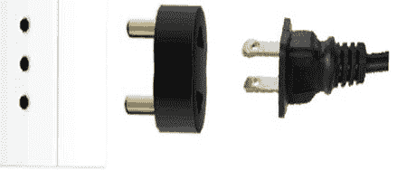

# 适配器模式的好处

让我们来看看在应用中使用适配器设计模式的好处。

+   适配器模式允许你与两个或更多不兼容的对象进行通信和交互

+   这个模式促进了你应用中现有功能的可重用性

# 适配器模式的一般要求

以下是这个设计模式解决设计问题的常见要求：

+   如果你打算在你的应用中使用这个模式，就需要使用一个具有不兼容接口的现有类。

+   在你的应用中，这个模式还有另一个用途，那就是当你想要创建一个与具有不兼容接口的类协作的可重用类时。

+   有几个现有的子类可供使用，但通过为每个子类创建子类来适配它们的接口是不切实际的。一个对象适配器可以适配其父类的接口。

让我们看看 Spring 是如何在内部实现适配器设计模式的。

# Spring 框架中适配器设计模式的实现

Spring 框架使用适配器设计模式在框架中透明地实现了很多功能。以下是根据 Spring 框架中的适配器设计模式列出的一些类：

+   `JpaVendorAdapter`

+   `HibernateJpaVendorAdapter`

+   `HandlerInterceptorAdapter`

+   `MessageListenerAdapter`

+   `SpringContextResourceAdapter`

+   `ClassPreProcessorAgentAdapter`

+   `RequestMappingHandlerAdapter`

+   `AnnotationMethodHandlerAdapter`

+   `WebMvcConfigurerAdapter`

**适配器模式的 UML 图**

让我们理解前面的 UML 图，该图说明了适配器设计模式的组件：

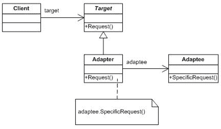

+   **目标接口**：这是将被客户端使用的期望接口类

+   **适配器类**：这个类是一个包装类，它实现了期望的目标接口，并修改了从适配者类可用的特定请求

+   **适配者类**：这是适配器类用来重用现有功能并对其进行修改以适应所需用途的类

+   **客户端**：这个类将与适配器类交互

让我们看看以下适配器设计模式的示例实现。

# 适配器设计模式的示例实现

我将创建一个示例来展示适配器设计模式的实际演示，所以让我们讨论这个示例，我创建这个示例是基于通过支付网关进行支付。假设我有一个旧的支付网关和最新的高级支付网关，这两个网关之间没有关系，所以我的需求是，我想在更改现有源代码的同时，从旧的支付网关迁移到高级支付网关。我创建了一个适配器类来解决这个问题。这个适配器类作为两个不同支付网关之间的桥梁，让我们看看以下代码：

现在让我们为旧的支付网关创建一个接口：

```java
    package com.packt.patterninspring.chapter3.adapter.pattern; 
    import com.packt.patterninspring.chapter3.model.Account; 
    public interface PaymentGateway { 
      void doPayment(Account account1, Account account2); 
    } 
```

现在让我们为旧的支付网关`PaymentGateway.java`创建一个实现类：

```java
    package com.packt.patterninspring.chapter3.adapter.pattern; 
    import com.packt.patterninspring.chapter3.model.Account; 
    public class PaymentGatewayImpl implements PaymentGateway{ 
      @Override 
      public void doPayment(Account account1, Account account2){ 
         System.out.println("Do payment using Payment Gateway"); 
      } 
    } 
```

以下接口及其实现为支付网关提供了新的和高级的功能：

```java
    package com.packt.patterninspring.chapter3.adapter.pattern; 
    public interface AdvancedPayGateway { 
      void makePayment(String mobile1, String mobile2); 
    } 
```

现在让我们为高级支付网关接口创建一个实现类：

```java
    package com.packt.patterninspring.chapter3.adapter.pattern; 
    import com.packt.patterninspring.chapter3.model.Account; 
    public class AdvancedPaymentGatewayAdapter implements 
       AdvancedPayGateway{ 
      private PaymentGateway paymentGateway; 
      public AdvancedPaymentGatewayAdapter(PaymentGateway
         paymentGateway) { 
        this.paymentGateway = paymentGateway; 
      } 
      public void makePayment(String mobile1, String mobile2) { 
         Account account1 = null;//get account number by 
             mobile number mobile  
         Account account2 = null;//get account number by 
            mobile number mobile  
         paymentGateway.doPayment(account1, account2); 
      } 
    } 
```

让我们看看以下这个模式的演示类：

```java
    package com.packt.patterninspring.chapter3.adapter.pattern; 
    public class AdapterPatternMain { 
      public static void main(String[] args) { 
        PaymentGateway paymentGateway = new PaymentGatewayImpl(); 
        AdvancedPayGateway advancedPayGateway = new 
           AdvancedPaymentGatewayAdapter(paymentGateway); 
        String mobile1 = null; 
        String mobile2 = null; 
        advancedPayGateway.makePayment(mobile1, mobile2); 
      } 
    } 
```

在前面的类中，我们有旧的支付网关对象作为`PaymentGateway`接口，但我们通过使用`AdvancedPaymentGatewayAdapter`适配器类将这个旧的支付网关实现转换为高级支付网关形式。让我们运行这个演示类并查看以下输出：

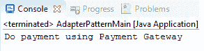

既然我们已经看到了适配器设计模式，让我们转向它的一个不同变体——桥接设计模式。

# 桥接设计模式

将抽象与其实现解耦，以便它们可以独立变化

- GoF 设计模式：可重用面向对象软件的元素

在软件工程中，最受欢迎的观念之一是首选组合而非继承。桥接设计模式促进了这一流行观念。类似于适配器模式，这个模式也属于 GoF 设计模式中的结构设计模式家族。桥接模式的方法是将客户端代码使用的抽象与其实现解耦；这意味着它将抽象和其实现分离成独立的类层次。此外，桥接模式偏好组合而非继承，因为继承并不总是灵活的，它会破坏封装，所以对实现者所做的任何更改都会影响客户端代码使用的抽象。

桥接为软件开发中两个不同独立组件之间的通信提供了一种方式，桥接结构为你提供了解耦抽象类和实现类（即接口）的方式。所以对实现类或实现者（即接口）所做的任何更改都不会影响抽象类或其精炼的抽象类。它是通过在接口和抽象之间使用组合来实现的。桥接模式使用接口作为抽象类和实现类之间的桥梁。你可以在两种类型的类中做出更改，而不会对客户端代码产生影响。

# 桥接模式的优点

以下为桥接设计模式的优点：

+   桥接设计模式允许你分离实现和抽象

+   此设计模式提供了在客户端代码中无副作用地更改两种类型类的灵活性

+   此设计模式允许通过它们之间的抽象来隐藏实际的实现细节

# 桥接设计模式解决的问题

以下是由桥接设计模式解决的常见问题：

+   移除了功能抽象与其实现之间的永久绑定

+   你可以在不影响抽象和客户端代码的情况下修改实现类

+   你可以使用子类扩展抽象及其实现

# 在 Spring 框架中实现桥接设计模式

以下 Spring 模块基于桥接设计模式：

+   `ViewRendererServlet`：它是一个桥接 Servlet，主要用于 Portlet MVC 支持

+   **桥接设计模式**：桥接设计模式用于 Spring 的日志处理过程

让我们看看桥接设计模式的示例实现。

# 桥接设计模式的示例实现

让我们看看以下示例，我们将演示桥接设计模式的使用。假设你希望在银行系统中开设两种类型的账户，一种是储蓄账户，另一种是活期账户。

**不使用桥接设计模式的系统**

让我们看看一个不使用桥接设计模式的例子。在以下图中，你可以看到银行和账户接口之间的关系：

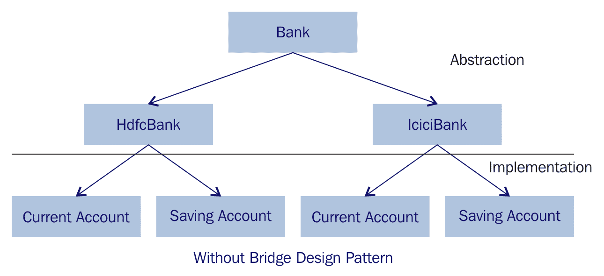

不使用桥接设计模式的系统

让我们创建一个不使用桥接设计模式的设计。首先创建一个接口或一个抽象类，**Bank**。然后创建它的派生类：**IciciBank** 和 **HdfcBank**。要在银行开户，首先决定账户类的类型--**储蓄账户**和**活期账户**，这些类扩展了特定的银行类（**HdfcBank** 和 **IciciBank**）。在这个应用程序中存在一个简单的深度继承层次结构。那么与前面的图相比，这个设计有什么问题呢？你会注意到，在这个设计中，有两部分，一部分是抽象部分，另一部分是实现部分。客户端代码与抽象部分交互。只有当更新抽象部分时，客户端代码才能访问实现部分的新更改或新功能，这意味着抽象、实现和部分之间是紧密耦合的。

现在我们来看看如何使用桥接设计模式来改进这个例子：

**使用桥接设计模式的系统**

在以下图中，我们使用桥接设计模式在`Bank`和`Account`接口之间建立关系：

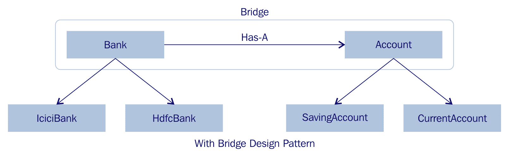

使用桥接设计模式的系统

**桥接设计模式的 UML 结构**

让我们看看以下图，桥接设计模式是如何解决这些设计问题的，正如我们在没有使用桥接设计模式的例子中所看到的。桥接模式将抽象和实现分离成两个类层次结构：

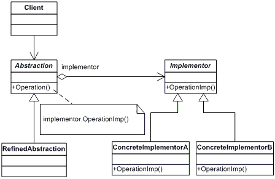

桥接设计模式的 UML 图

我们有一个`Account`接口，它充当桥接实现者，具体的类`SavingAccount`和`CurrentAccount`实现了`Account`接口。`Bank`是一个抽象类，它将使用`Account`对象。

让我们创建一个桥接实现者接口。

以下是`Account.java`文件：

```java
    package com.packt.patterninspring.chapter3.bridge.pattern; 
    public interface Account { 
      Account openAccount(); 
      void accountType(); 
    } 
```

创建具体的桥接实现类以实现`implementer`接口。让我们创建一个`SavingAccount`类作为`Account`的实现。

以下是`SavingAccount.java`文件：

```java
    package com.packt.patterninspring.chapter3.bridge.pattern; 
    public class SavingAccount implements Account { 
      @Override 
      public Account openAccount() { 
         System.out.println("OPENED: SAVING ACCOUNT "); 
         return new SavingAccount(); 
      } 
      @Override 
      public void accountType() { 
        System.out.println("##It is a SAVING Account##"); 
      } 
    } 
```

创建一个实现`Account`接口的`CurrentAccount`类。

以下是`CurrentAccount.java`文件：

```java
    package com.packt.patterninspring.chapter3.bridge.pattern; 
    public class CurrentAccount implements Account { 
      @Override 
      public Account openAccount() { 
        System.out.println("OPENED: CURRENT ACCOUNT "); 
        return new CurrentAccount(); 
      } 
      @Override 
      public void accountType() { 
        System.out.println("##It is a CURRENT Account##"); 
      } 
    } 
```

在桥接设计模式中创建抽象，但首先创建接口**Bank**。

以下是`Bank.java`文件：

```java
    package com.packt.patterninspring.chapter3.bridge.pattern; 
    public abstract class Bank { 
      //Composition with implementor 
      protected Account account; 
      public Bank(Account account){ 
         this.account = account; 
      } 
      abstract Account openAccount(); 
    } 
```

让我们实现`Bank`接口的第一个抽象，并查看以下`Bank`接口的实现类。

以下为`IciciBank.java`文件：

```java
    package com.packt.patterninspring.chapter3.bridge.pattern; 
    public class IciciBank extends Bank { 
      public IciciBank(Account account) { 
        super(account); 
      } 
      @Override 
      Account openAccount() { 
        System.out.print("Open your account with ICICI Bank"); 
        return account; 
      } 
    } 
```

让我们实现`Bank`接口的第二个抽象，并查看以下`Bank`接口的实现类。

以下为`HdfcBank.java`文件：

```java
    package com.packt.patterninspring.chapter3.bridge.pattern; 
      public class HdfcBank extends Bank { 
        public HdfcBank(Account account) { 
          super(account); 
        } 
        @Override 
        Account openAccount() { 
          System.out.print("Open your account with HDFC Bank"); 
          return account; 
        } 
      } 
```

创建一个桥接设计模式的演示类。

以下为`BridgePatternMain.java`文件：

```java
    package com.packt.patterninspring.chapter3.bridge.pattern; 
    public class BridgePatternMain { 
      public static void main(String[] args) { 
         Bank icici = new IciciBank(new CurrentAccount()); 
         Account current = icici.openAccount(); 
         current.accountType(); 
         Bank hdfc = new HdfcBank(new SavingAccount()); 
         Account saving = hdfc.openAccount(); 
         saving.accountType(); 
      } 
    } 
```

让我们运行这个演示类，并在控制台看到以下输出：

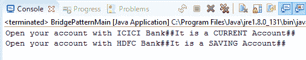

既然我们已经看到了桥接设计模式，让我们转向它的一个不同变体——组合设计模式。

# 组合设计模式

将对象组合成树结构以表示部分-整体层次结构。组合允许客户端以统一的方式处理单个对象和对象的组合。

-GoF 设计模式

在软件工程中，组合模式属于结构设计模式。根据这个模式，客户端将同一类型的对象组作为一个单一对象处理。组合设计模式背后的思想是将一组对象组合成树结构，以表示更大结构应用的一个模块。并且对于客户端来说，这个结构是一个单一的单元或实例。

组合设计模式背后的动机是系统中的对象被分组到树结构中，而树结构是节点-叶子和分支的组合。在树结构中，节点有许多叶子和其他节点。叶子没有任何东西，这意味着在树中没有叶子的子节点。叶子被视为树结构数据的终点。

让我们看一下以下图示，它以节点和叶子的形式表示树结构中的数据：

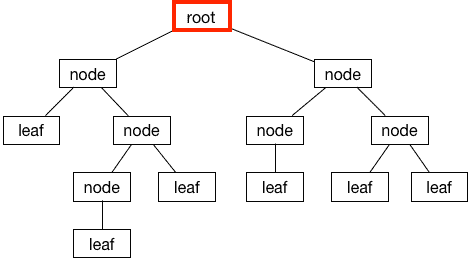

使用节点和叶子表示的树结构数据

# 组合模式解决的问题

作为一名开发者，设计一个应用程序以便客户端可以跨应用程序统一访问你的对象，即使这个对象是由对象组合而成的或是一个单独的对象，这会更加困难。这个设计模式解决了困难，并允许你以这样的方式设计对象，你可以将这个对象用作对象的组合以及单个个体对象。

这个模式解决了在创建层次树结构时面临的挑战，为客户端提供了一个统一的方式来访问和操作树中的对象。组合模式是一个好的选择；在这种情况下，将原始数据和组合数据视为同质化的是更简单的。

# 组合设计模式的 UML 结构

组合设计模式基于将相似类型的对象组合成树结构，正如你所知，每个树有三个主要部分：分支、节点和叶子。因此，让我们看看以下在这个设计模式中使用的术语。

**组件**：它基本上是树的分支，分支上有其他分支、节点和叶子。组件为所有组件提供抽象，包括组合对象。在组合模式中，组件**是**基本声明为对象的接口。

**叶子**：它是实现所有组件方法的对象。

**组合**：它在树结构中表示为一个节点，它包含其他节点和叶子，它代表一个组合组件。它有添加子节点的方法，即它代表同一类型对象的集合。它还有为子节点提供其他组件方法。

让我们看看以下这个设计模式的 UML 图：

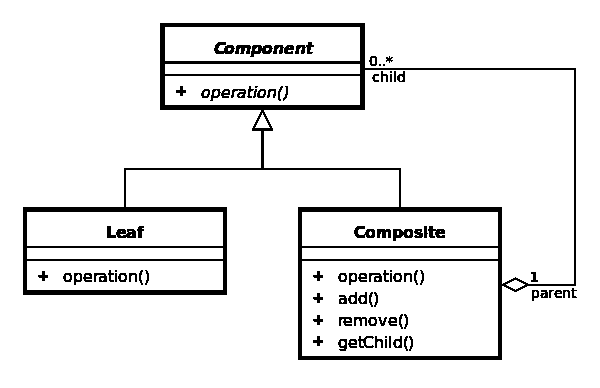

组合设计模式的 UML 图

**组合设计模式的优点**

+   此模式提供了在现有组件更改的情况下动态添加新组件的灵活性。

+   此模式允许您创建一个包含单个和组合对象的类层次结构

# 组合设计模式的示例实现

在以下示例中，我正在实现一个`Account`接口，它可以是一个`SavingAccount`或`CurrentAccount`，或者是由几个账户组成的组合。我有一个`CompositeBankAccount`类，它充当组合模式的行为类。让我们看看以下代码示例。

创建一个`Account`接口，它将被视为组件：

```java
    public interface Account { 
      void accountType(); 
    } 
```

创建一个`SavingAccount`类和一个`CurrentAccount`类，作为组件的实现，并将它们也视为叶子：

以下是`SavingAccount.java`文件：

```java
    public class SavingAccount implements Account{ 
      @Override 
      public void accountType() { 
        System.out.println("SAVING ACCOUNT"); 
      } 
    } 
```

以下是`CurrentAccount.java`文件：

```java
    public class CurrentAccount implements Account { 
      @Override 
      public void accountType() { 
         System.out.println("CURRENT ACCOUNT"); 
      } 
    } 
```

创建一个`CompositeBankAccount`类，它将被视为组合类并实现`Account`接口：

以下是`CompositeBankAccount.java`文件：

```java
     package com.packt.patterninspring.chapter3.composite.pattern; 
     import java.util.ArrayList; 
     import java.util.List; 
     import com.packt.patterninspring.chapter3.model.Account; 
     public class CompositeBankAccount implements Account { 
       //Collection of child accounts. 
       private List<Account> childAccounts = new ArrayList<Account>(); 
       @Override 
       public void accountType() { 
         for (Account account : childAccounts) { 
               account.accountType(); 
         } 
       } 
       //Adds the account to the composition. 
          public void add(Account account) { 
            childAccounts.add(account); 
          } 
          //Removes the account from the composition. 
          public void remove(Account account) { 
            childAccounts.remove(account); 
         } 
       } 
```

创建一个`CompositePatternMain`类，它也将被视为客户端：

以下是`CompositePatternMain.java`文件：

```java
    package com.packt.patterninspring.chapter3.composite.pattern; 
    import com.packt.patterninspring.chapter3.model.CurrentAccount; 
    import com.packt.patterninspring.chapter3.model.SavingAccount; 
    public class CompositePatternMain { 
      public static void main(String[] args) { 
         //Saving Accounts 
         SavingAccount savingAccount1 = new SavingAccount(); 
         SavingAccount savingAccount2 = new SavingAccount(); 
         //Current Account 
         CurrentAccount currentAccount1 = new CurrentAccount(); 
         CurrentAccount currentAccount2 = new CurrentAccount(); 
         //Composite Bank Account 
         CompositeBankAccount compositeBankAccount1 = new
         CompositeBankAccount(); 
         CompositeBankAccount compositeBankAccount2 = new
         CompositeBankAccount(); 
         CompositeBankAccount compositeBankAccount = new
         CompositeBankAccount(); 
         //Composing the bank accounts 
         compositeBankAccount1.add(savingAccount1); 
         compositeBankAccount1.add(currentAccount1); 
         compositeBankAccount2.add(currentAccount2); 
         compositeBankAccount2.add(savingAccount2); 
         compositeBankAccount.add(compositeBankAccount2); 
         compositeBankAccount.add(compositeBankAccount1); 
         compositeBankAccount.accountType(); 
      } 
    } 
```

让我们运行这个演示类，并在控制台看到以下输出：

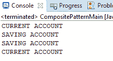

现在我们已经讨论了组合设计模式，让我们转向装饰器设计模式。

# 装饰器设计模式

动态地为对象附加额外的职责。装饰器为扩展功能提供了灵活的替代子类化方法。

- GOF 设计模式

在软件工程中，所有 GOF 结构模式的共同意图是在灵活的企业应用程序中简化对象和类之间的复杂关系。装饰者模式是这些模式中的一种特殊类型的设计模式，它属于结构设计模式，允许你在运行时动态或静态地为单个对象添加和移除行为，而不会改变同一类中其他相关对象的现有行为。这种设计模式在不违反单一职责原则或面向对象编程的 SOLID 原则的情况下完成这一点。

此设计模式使用组合而不是继承来处理对象关联；它允许你将功能划分为具有独特关注区域的不同的具体类。

**装饰者设计模式的好处**

+   此模式允许你动态和静态地扩展功能，而不改变现有对象的结构

+   通过使用此模式，你可以动态地为对象添加新的责任

+   此模式也被称为****包装者****

+   此模式使用组合来维护对象关系以保持 SOLID 原则

+   此模式通过为每个新的特定功能编写新类来简化编码，而不是更改应用程序的现有代码

# 装饰者模式解决的问题

在企业应用程序中，可能存在业务需求或未来计划通过添加新功能来扩展产品的行为。为了实现这一点，你可以使用继承来扩展对象的行为。但是，继承应该在编译时完成，并且该方法也适用于该类的其他实例。由于代码修改，违反了开闭原则。为了避免违反 SOLID 原则，你可以动态地为对象附加新的责任。这就是装饰者设计模式出现并以非常灵活的方式解决这个问题的情形。让我们看看以下如何将这种设计模式应用到实际案例研究中的例子。

考虑到一家银行向客户提供多种具有不同优惠的账户。它将客户分为三个类别——老年人、特权客户和年轻人。银行为老年人推出储蓄账户计划——如果他们在该银行开设储蓄账户，他们将获得最高 1000 美元的医疗保险。同样，银行也为特权客户提供意外保险，最高可达 1600 美元，透支额度为 84 美元。年轻人没有这样的计划。

为了解决新的需求，我们可以为`SavingAccount`添加新的子类；每个子类代表一个具有额外优惠的储蓄账户装饰，这就是我们现在的设计看起来像这样：

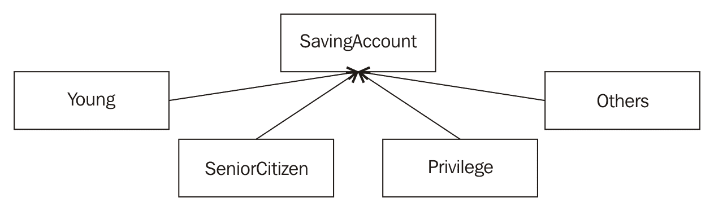

不使用装饰器设计模式进行继承的应用程序设计

由于我将为**SavingAccount**添加更多福利方案，因此此设计将非常复杂，但银行推出相同的方案时会发生什么情况针对**CurrentAccount**？显然，这种设计是有缺陷的，但这是装饰器模式的理想用例。此模式允许您添加运行时动态行为。在这种情况下，我将创建一个抽象的**AccountDecorator**类来实现**Account**。此外，我将创建**SeniorCitizen**类和**Privilege**类，它们扩展了**AccountDecorator**，因为年轻人没有额外的福利，所以 SavingAccount 类没有扩展**AccountDecorator**。这就是设计将如何进行：

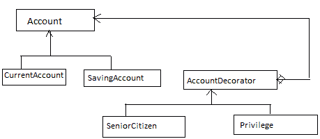

使用装饰器设计模式进行应用程序设计

前面的图示通过创建**AccountDecorator**作为模式中的**装饰器**，关注观察**Account**和**AccountDecorator**之间的关系。这种关系如下：

+   `AccountDecorator`和`Account`之间存在**is-a**关系，即正确的类型继承

+   `AccountDecorator`和`Account`之间存在**has-a**关系，即为了在不更改现有代码的情况下添加新行为而进行的组合

让我们看看 UML 结构**：**

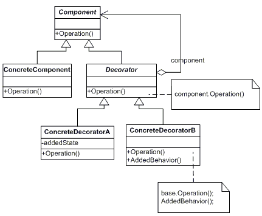

装饰器设计模式的 UML 图

参与该模式的类和对象包括：

+   **组件**（**Account**）：它是为可以动态添加责任的对象提供的接口

+   **具体组件**（**SavingAccount**）：它是组件接口的具体类，并定义了一个可以附加额外责任的对象

+   **装饰器**（**AccountDecorator**）：它有一个指向**Component**对象的引用，并定义了一个符合组件接口的接口

+   **具体装饰器**（**SeniorCitizen 和 Privilege**）：它是装饰器的具体实现，并为组件添加了责任

# 实现装饰器模式

让我们看看以下代码来演示装饰器设计模式。

创建一个组件类：

以下为`Account.java`文件：

```java
    package com.packt.patterninspring.chapter3.decorator.pattern; 
    public interface Account { 
       String getTotalBenefits(); 
    } 
```

创建具体的组件类：

以下为`SavingAccount.java`文件：

```java
    package com.packt.patterninspring.chapter3.decorator.pattern; 
    public class SavingAccount implements Account { 
      @Override 
      public String getTotalBenefits() { 
         return "This account has 4% interest rate with per day
           $5000 withdrawal limit"; 
      } 
    } 
```

让我们为 Account 组件创建另一个具体类：

以下为`CurrentAccount.java`文件：

```java
    package com.packt.patterninspring.chapter3.decorator.pattern; 
    public class CurrentAccount implements Account { 
      @Override 
      public String getTotalBenefits() { 
         return "There is no withdrawal limit for current account"; 
      } 
    } 
```

让我们为 Account 组件创建一个`Decorator`类。这个装饰器类将其他运行时行为应用到 Account 组件类中。

以下为`AccountDecorator.java`文件：

```java
    package com.packt.patterninspring.chapter3.decorator.pattern; 
    public abstract class AccountDecorator implements Account { 
      abstract String applyOtherBenefits(); 
    } 
```

让我们创建一个`ConcreteDecorator`类来实现 AccountDecorator 类。以下类`SeniorCitizen`扩展了`AccountDecorator`类，以访问其他运行时行为，如`applyOtherBenefits()`。

以下为`SeniorCitizen.java`文件：

```java
    package com.packt.patterninspring.chapter3.decorator.pattern; 
    public class SeniorCitizen extends AccountDecorator { 
      Account account; 
      public SeniorCitizen(Account account) { 
         super(); 
         this.account = account; 
      } 
      public String getTotalBenefits() { 
         return account.getTotalBenefits() + " other benefits are 
             "+applyOtherBenefits(); 
      } 
      String applyOtherBenefits() { 
         return " an medical insurance of up to $1,000 for Senior 
         Citizen"; 
      } 
    } 
```

让我们创建另一个`ConcreteDecorator`类来实现`AccountDecorator`类。以下类`Privilege`扩展了`AccountDecorator`类，以便访问其他运行时行为，如`applyOtherBenefits(`)。

以下为`Privilege.java`文件：

```java
    package com.packt.patterninspring.chapter3.decorator.pattern; 
    public class Privilege extends AccountDecorator { 
      Account account; 
      public Privilege(Account account) { 
         this.account = account; 
      } 
      public String getTotalBenefits() { 
         return account.getTotalBenefits() + " other benefits are    
            "+applyOtherBenefits(); 
      } 
      String applyOtherBenefits() { 
        return " an accident insurance of up to $1,600 and
           an overdraft facility of $84"; 
        } 
      } 
```

现在我们编写一些测试代码，看看装饰器模式在运行时是如何工作的：

以下为`DecoratorPatternMain.java`文件：

```java
    package com.packt.patterninspring.chapter3.decorator.pattern; 
    public class DecoratorPatternMain { 
      public static void main(String[] args) { 
         /*Saving account with no decoration*/ 
         Account basicSavingAccount = new SavingAccount(); 
         System.out.println(basicSavingAccount.getTotalBenefits()); 
         /*Saving account with senior citizen benefits decoration*/ 
         Account seniorCitizenSavingAccount = new SavingAccount(); 
         seniorCitizenSavingAccount = new 
            SeniorCitizen(seniorCitizenSavingAccount); 
         System.out.println
        (seniorCitizenSavingAccount.getTotalBenefits()); 
         /*Saving account with privilege decoration*/ 
         Account privilegeCitizenSavingAccount = new SavingAccount(); 
         privilegeCitizenSavingAccount = new
            Privilege(privilegeCitizenSavingAccount); 
         System.out.println
        (privilegeCitizenSavingAccount.getTotalBenefits()); 
      } 
    } 
```

让我们运行这个演示类，并在控制台看到以下输出：

**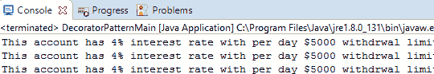**

# Spring 框架中的装饰器设计模式

Spring 框架使用装饰器设计模式构建重要的功能，如事务、缓存同步和安全相关任务。让我们看看 Spring 如何透明地实现此模式的一些功能：

+   将建议编织到 Spring 应用程序中。它通过 CGLib 代理使用装饰器模式。它通过在运行时生成目标类的子类来工作。

+   `BeanDefinitionDecorator`：它用于通过应用自定义属性来装饰 bean 定义。

+   `WebSocketHandlerDecorator`：它用于使用附加行为装饰 WebSocketHandler。

现在我们转向另一个 GOF 设计模式——外观设计模式。

# 外观设计模式

为子系统中的一组接口提供一个统一的接口。外观定义了一个更高层次的接口，使得子系统更容易使用。

- GOF 设计模式

外观设计模式不过是接口的接口，用于简化客户端代码与子系统类之间的交互。这种设计属于 GOF 结构设计模式。

外观模式的优点：

+   此模式简化了客户端与子系统交互的复杂性

+   此模式将所有业务服务合并为单个接口，以便使其更易于理解

+   此模式减少了客户端代码对系统内部工作的依赖

# 了解何时使用外观模式

假设你正在设计一个系统，这个系统拥有大量独立的类，并且还有一组要实现的服务。这个系统将会非常复杂，因此外观模式应运而生，简化了更大系统的复杂性，并简化了客户端代码与大型复杂系统的一个子系统中的类之间的交互。

假设你想开发一个具有大量服务的银行企业应用程序以执行任务，例如，`AccountService`用于通过`accountId`获取`Account`，`PaymentService`用于支付网关服务，以及`TransferService`用于从一个账户向另一个账户转账。应用程序的客户端代码与所有这些服务交互，以将资金从一个账户转账到另一个账户。这就是不同的客户端如何与银行系统的转账过程交互。如下面的图所示，这里你可以看到直接与子系统类交互的客户端代码，客户端还应该了解子系统类的内部工作原理，因此这简单地违反了 SOLID 设计原则，因为客户端代码与银行应用程序的子系统类紧密耦合：

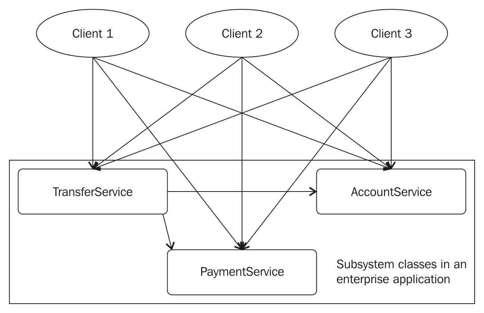

没有外观设计模式的银行应用程序子系统

而不是客户端代码直接与子系统的类交互，你可以引入另一个接口，这使得子系统更容易使用，如下面的图所示。这个接口被称为“外观”接口，它基于外观模式，并且是与子系统交互的简单方式：

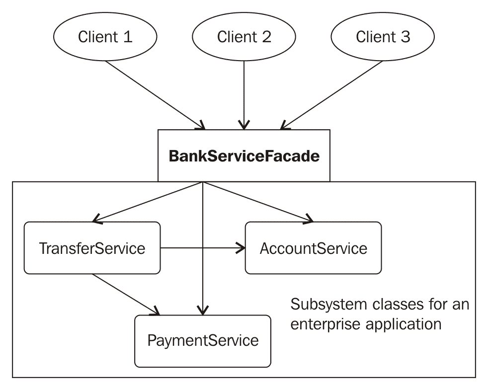

带有外观设计模式的银行应用程序子系统

# 实现外观设计模式

让我们查看以下列表以演示外观设计模式。

为你的银行应用程序创建子系统服务类：让我们看看以下子系统的`PaymentService`类。

以下为`PaymentService.java`文件：

```java
    package com.packt.patterninspring.chapter3.facade.pattern; 
    public class PaymentService { 
      public static boolean doPayment(){ 
         return true; 
      } 
    } 
```

让我们为子系统创建另一个服务类`AccountService`。

以下为`AccountService.java`文件：

```java
   package com.packt.patterninspring.chapter3.facade.pattern; 
   import com.packt.patterninspring.chapter3.model.Account; 
   import com.packt.patterninspring.chapter3.model.SavingAccount; 
   public class AccountService { 
     public static Account getAccount(String accountId) { 
        return new SavingAccount(); 
     } 
   } 
```

让我们为子系统创建另一个服务类`TransferService`。

以下为`TransferService.java`文件：

```java
    package com.packt.patterninspring.chapter3.facade.pattern; 
    import com.packt.patterninspring.chapter3.model.Account; 
    public class TransferService { 
      public static void transfer(int amount, Account fromAccount,
            Account toAccount) { 
        System.out.println("Transfering Money"); 
      } 
    } 
```

创建一个外观服务类以与子系统交互：让我们看看以下子系统的外观接口，然后将其实现为应用程序中的全局银行服务。

以下为`BankingServiceFacade.java`文件：

```java
    package com.packt.patterninspring.chapter3.facade.pattern; 
    public interface BankingServiceFacade { 
       void moneyTransfer(); 
    } 
```

以下为`BankingServiceFacadeImpl.java`文件：

```java
    package com.packt.patterninspring.chapter3.facade.pattern; 
    import com.packt.patterninspring.chapter3.model.Account; 
    public class BankingServiceFacadeImpl implements 
        BankingServiceFacade{ 
      @Override 
      public void moneyTransfer() { 
         if(PaymentService.doPayment()){ 
               Account fromAccount = AccountService.getAccount("1"); 
               Account toAccount   = AccountService.getAccount("2"); 
               TransferService.transfer(1000, fromAccount, toAccount); 
         } 
      } 
    } 
```

创建外观的客户端：

以下为`FacadePatternClient.java`文件：

```java
    package com.packt.patterninspring.chapter3.facade.pattern; 
    public class FacadePatternClient { 
      public static void main(String[] args) { 
        BankingServiceFacade serviceFacade = new 
          BankingServiceFacadeImpl(); 
        serviceFacade.moneyTransfer(); 
      } 
    } 
```

# 外观设计模式的结构化建模语言（UML）结构

参与该模式的类和对象是：

+   外观（`BankingServiceFacade`）

这是一个了解哪些子系统类负责请求的外观接口。该接口负责将客户端请求委派给适当的子系统对象。

+   子系统类（`AccountService`、`TransferService`、`PaymentService`）

这些接口实际上是银行流程系统应用的功能子系统。它们负责处理门面对象分配的过程。这个类别的接口没有对门面对象的引用；它们没有门面实现的细节。它们与门面对象完全独立。

让我们看看以下关于此模式的 UML 图：

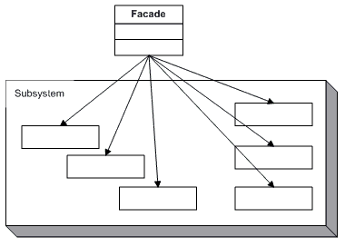

门面设计模式的 UML 图

# Spring 框架中的门面模式

在企业应用中，如果你在 Spring 应用中工作，门面模式通常用于应用的业务服务层来整合所有服务。你还可以在持久层的 DAO 上应用此模式。

既然我们已经了解了门面设计模式，让我们转向它的一个不同变体——代理设计模式。

# 代理设计模式

为另一个对象提供一个代理或占位符，以控制对其的访问。

- GOF 设计模式

代理设计模式提供了一个具有另一个类功能的对象，同时拥有它。此模式属于 GOF 设计模式的结构设计模式。此设计模式的目的是向外界提供一个替代类，以及其功能。

# 代理模式的用途

让我们看看以下要点：

+   此模式隐藏了实际对象对外界。

+   此模式可以提高性能，因为它是在需要时创建对象。

# 代理设计模式的 UML 结构

让我们看看以下关于此模式的 UML 图：

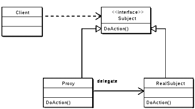

代理设计模式的 UML 图

现在，让我们看看这个 UML 图的不同组件：

+   **Subject**：代理和真实主题需要实现的实际接口。

+   **RealSubject**：**Subject**的真实实现。它是由代理表示的真实对象。

+   **代理**：它是一个代理对象，也是真实对象**Subject**的实现。它维护对真实对象的引用。

# 实现代理设计模式

让我们看看以下代码来演示代理模式。

创建一个 Subject。

以下为`Account.java`文件：

```java
    public interface Account { 
      void accountType(); 
    } 
```

创建一个实现 Subject 的 RealSubject 类，让我们看看以下类作为代理设计模式的 RealSubject 类。

以下为`SavingAccount.java`文件：

```java
    public class SavingAccount implements Account{ 
       public void accountType() { 
          System.out.println("SAVING ACCOUNT"); 
       } 
    } 
```

创建一个实现 Subject 并具有真实主题的代理类

以下为`ProxySavingAccount.java`文件：

```java
    package com.packt.patterninspring.chapter2.proxy.pattern; 
    import com.packt.patterninspring.chapter2.model.Account; 
    import com.packt.patterninspring.chapter2.model.SavingAccount; 
    public class ProxySavingAccount implements Account{ 
      private Account savingAccount; 
      public void accountType() { 
         if(savingAccount == null){ 
               savingAccount = new SavingAccount(); 
         } 
         savingAccount.accountType(); 
      }  
    } 
```

# Spring 框架中的代理模式

Spring 框架在 Spring AOP 模块中透明地使用了代理设计模式。正如我在第一章，“Spring Framework 5.0 入门与设计模式”中讨论的那样。在 Spring AOP 中，你创建对象的代理以在 Spring 应用程序中的切入点处应用横切关注点。在 Spring 中，其他模块也实现了代理模式，例如 RMI、Spring 的 HTTP Invoker、Hessian 和 Burlap。

让我们看看下一节关于行为设计模式及其底层模式和示例。

# 行为设计模式

行为设计模式的目的是一组对象之间的交互和协作，以执行单个对象无法独立完成的任务。对象之间的交互应该是松耦合的。此类别下的模式描述了类或对象之间交互和分配责任的方式。让我们在下一节中看看行为设计模式的不同变体。

# 责任链设计模式

通过给多个对象一个处理请求的机会，避免将请求的发送者与其接收者耦合。将接收对象链式连接，并将请求沿着链传递，直到某个对象处理它。

- GOF 设计模式

责任链设计模式属于 GOF 模式家族中的行为设计模式。根据此模式，请求的发送者和接收者是解耦的。发送者将请求发送到接收者链，链中的任何接收者都可以处理请求。在此模式中，接收者对象具有另一个接收者对象的引用，以便如果它不处理请求，则将相同的请求传递给其他接收者对象。

例如，在银行系统中，你可以在任何地方使用任何自动柜员机提取现金，因此它是责任链设计模式的一个活生生的例子。

此模式有以下优点：

+   此模式减少了系统中发送者和接收者对象之间的耦合，以处理请求。

+   此模式更灵活地分配责任给另一个引用对象。

+   此模式通过组合使用对象链，这些对象作为一个单一单元工作。

让我们看看以下 UML 图，它显示了责任链设计模式的所有组件：

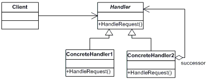

责任链设计模式的 UML 图

+   **处理者**：这是系统中处理请求的抽象类或接口。

+   **具体处理者**：这些是具体类，它们实现**处理者**以处理请求，或者将相同的请求传递给处理链中的下一个后续处理者。

+   **客户端**：这是主应用程序类，用于向链上的处理对象发起请求。

# Spring 框架中的责任链模式

Spring Security 项目在 Spring 框架中实现了责任链模式。Spring Security 允许你通过使用安全过滤器链在你的应用程序中实现身份验证和授权功能。这是一个高度可配置的框架。你可以通过这个过滤器链添加你的自定义过滤器来自定义功能，因为责任链设计模式。

现在我们已经看到了责任链设计模式，让我们转向它的一个不同变体--命令设计模式。

# 命令设计模式

将请求封装为一个对象，从而让你用不同的请求参数化客户端，排队或记录请求，并支持可撤销操作

-GOF 设计模式

命令设计模式属于 GOF 模式中的行为模式家族，这是一个非常简单的数据驱动模式，它允许你将请求数据封装到对象中，并将该对象作为命令传递给调用者方法，然后作为另一个对象返回给调用者。

以下列出了使用命令模式的优点：

+   这种模式使你能够在系统组件发送者和接收者之间传输数据。

+   这种模式允许你通过执行操作来参数化对象。

+   你可以轻松地在系统中添加新命令，而无需更改现有类。

让我们看看以下 UML 图，展示了命令设计模式的所有组件：

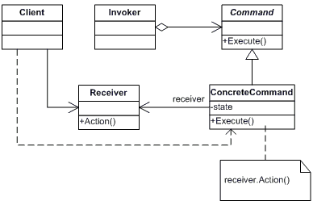

命令设计模式的 UML 图

+   **命令**: 它是一个接口或抽象类，在系统中执行一个操作。

+   **具体命令**: 它是 `Command` 接口的具体实现，并定义了一个将要执行的操作。

+   **客户端**: 这是一个主类，它创建一个 `ConcreteCommand` 对象并设置其接收者。

+   **调用者**: 它是一个调用者，用于调用请求以携带命令对象。

+   **接收者**: 它是一个简单的处理方法，通过 `ConcreteCommand` 执行实际操作。

# Spring 框架中的命令设计模式

Spring MVC 在 Spring 框架中实现了命令设计模式。在你的企业应用程序中使用 Spring 框架时，你经常看到通过使用命令对象应用命令模式的理念。

现在我们已经看到了命令设计模式，让我们转向它的一个不同变体--解释器设计模式。

# 解释器设计模式

给定一种语言，定义其语法的表示，以及一个使用该表示来解释该语言句子的解释器。

-GOF 设计模式

解释器设计模式允许你在编程中解释表达式语言，为它的语法定义一个表示。这种模式属于 GOF 模式中的行为设计模式家族。

以下列出了使用解释器模式的优点：

+   这个模式允许你轻松地更改和扩展语法。

+   使用表达式语言非常简单

让我们看看以下 UML 图展示了解释器设计模式的所有组件：

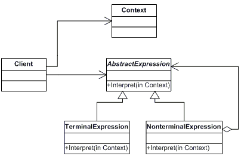

解释器设计模式的 UML 图

+   **抽象表达式:** 它是一个接口，通过使用`interpret()`操作执行任务。

+   **终结表达式:** 它是上述接口的一个实现，并为终结表达式实现了`interpret()`操作。

+   **非终结表达式:** 它也是上述接口的一个实现，并为非终结表达式实现了`interpret()`操作。

+   **上下文:** 它是一个`String`表达式，包含对解释器全局的信息。

+   **客户端:** 它是调用解释器操作的主要类。

# Spring 框架中的解释器设计模式

在 Spring 框架中，解释器模式与**Spring 表达式语言**（**SpEL**）一起使用。Spring 从 3.0 版本开始添加了这个新特性，你可以在使用 Spring 框架的企业应用程序中使用它。

现在我们已经看到了解释器设计模式，让我们转向它的另一个变体--迭代器设计模式。

# 迭代器设计模式

提供了一种按顺序访问聚合对象元素的方法，而不暴露其底层表示。

-GOF 设计模式

在编程语言中，这是一个非常常用的设计模式，就像在 Java 中一样。这个模式来自 GOF 模式的行为设计模式家族。这个模式允许你在不知道其内部表示的情况下，按顺序访问集合对象中的项。

迭代器模式有以下优点：

+   容易访问集合中的项。

+   你可以使用多个来访问集合中的项，因为它支持大量的遍历变体。

+   它提供了一个统一的接口来遍历集合中的不同结构。

让我们看看以下 UML 图展示了迭代器设计模式的所有组件：

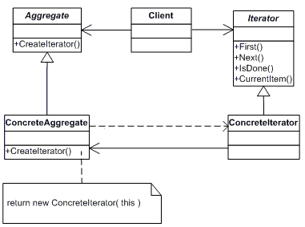

迭代器设计模式的 UML 图

+   **迭代器:** 它是一个用于访问和遍历集合中项的接口或抽象类。

+   **具体迭代器:** 它是**迭代器**接口的一个实现。

+   **聚合:** 它是一个用于创建迭代器对象的接口。

+   **具体聚合:** 它是**聚合**接口的实现，它实现了**迭代器**创建接口，以返回适当的**具体迭代器**的实例。

# Spring 框架中的迭代器设计模式

Spring 框架还通过**CompositeIterator**类扩展了迭代器模式。主要这个模式用于 Java 集合框架中按顺序迭代元素。

现在我们已经看到了迭代器设计模式，让我们转向它的一个不同变体--观察者设计模式。

**观察者** **设计模式**

定义对象之间的一对多依赖关系，以便当一个对象改变状态时，所有依赖对象都会被通知并自动更新

- GOF 设计模式

观察者模式是非常常见的设计模式之一，这种模式是 GOF 模式中行为设计模式家族的一部分，它处理应用程序中对象的责任以及它们在运行时如何相互通信。根据这种模式，有时对象会在应用程序中的对象之间建立一对多的关系，即如果一个对象被修改，它将自动通知其他依赖对象。

例如，Facebook 的帖子评论是观察者设计模式的一个例子。如果你评论了你朋友的帖子，那么每次有人再次评论同一帖子时，你都会收到这个帖子的通知。

观察者模式提供了解耦对象之间的通信。它使对象之间的关系主要是一对多的关系。在这个模式中，有一个被称为主题的对象。每当这个主题的状态发生变化时，它将相应地通知其依赖对象列表。这个依赖对象列表被称为观察者。以下图示说明了观察者模式：

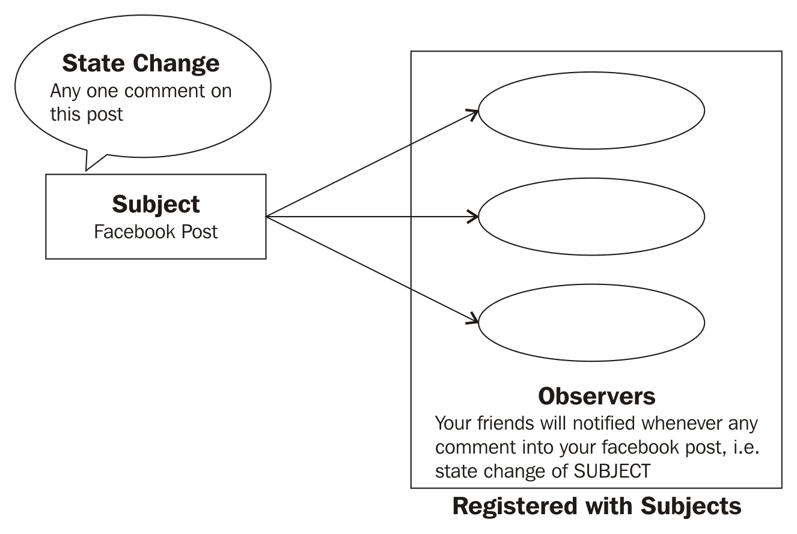

观察者设计模式的使用场景

使用观察者模式的以下列表列出了其优点：

+   这种模式为主体和观察者之间提供了解耦的关系

+   它提供了广播支持

让我们看看以下 UML 图展示了观察者设计模式的所有组件：

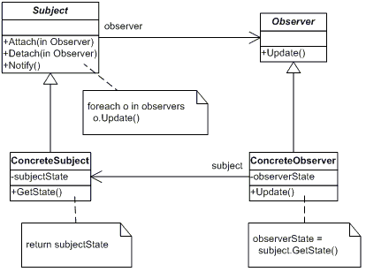

观察者设计模式的 UML 图

+   **主题（Subject）**：它是一个接口。它知道其观察者的信息。

+   **具体主题（ConcreteSubject）**：它是主题的具体实现，它在其状态变化时知道所有需要通知的观察者。

+   **观察者（Observer）**：它是一个接口，用于通知主题的变化。

+   **具体观察者（ConcreteObserver）**：它是观察者的具体实现，它保持其状态与主题状态的一致性。

# Spring 框架中的观察者模式

在 Spring 框架中，观察者设计模式用于实现 `ApplicationContext` 的事件处理功能。Spring 提供了 `ApplicationEvent` 类和 `ApplicationListener` 接口，以在 Spring `ApplicationContext` 中启用事件处理。任何实现 `ApplicationListener` 接口的 Spring 应用程序中的 bean，每当事件发布者发布 `ApplicationEvent` 时，它都会收到一个 `ApplicationEvent`。在这里，事件发布者是主题，实现 ApplicationListener 的 bean 是观察者。

现在我们已经了解了观察者设计模式，让我们转向它的一个不同变体——模板设计模式。

# 模板设计模式

在操作中定义算法的骨架，将一些步骤推迟到子类。模板方法允许子类重新定义算法的某些步骤，而不改变算法的结构。

60; -GOF 设计模式

在模板设计模式中，一个抽象类封装了一些定义到其方法中。该方法允许你在不重写它的前提下覆盖方法的部分。你可以使用其具体类将类似类型的行为应用于你的应用程序。这个设计模式属于 GOF 模式的行为设计模式家族。

以下列出了使用模板模式的益处：

+   通过重用代码，它减少了应用程序中的样板代码。

+   此模式创建了一个模板或方式，用于重用多个类似算法以执行某些业务需求。

让我们看看以下 UML 图展示了模板设计模式的组件：

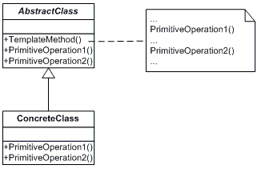

模板设计模式的 UML 图

+   **抽象类（AbstractClass）**：这是一个包含定义算法骨架的模板方法的抽象类。

+   **具体类（ConcreteClass）**：这是一个具体子类，实现了执行算法特定基本步骤的操作。

让我们看看下一节关于企业分布式应用中的 J2EE 设计模式。

# JEE 设计模式

它是设计模式的主要类别之一。通过应用 Java EE 设计模式，应用设计可以极大地简化。Java EE 设计模式已在 Sun 的 Java Blueprints 中进行了记录。这些 Java EE 设计模式提供了经过时间考验的解决方案指南和最佳实践，用于指导 Java EE 应用程序不同层中的对象交互。这些设计模式特别关注以下列出的层：

+   展示层的设计模式

+   业务层的设计模式

+   集成层的设计模式

这些设计模式特别关注以下列出的层。

+   **展示层的设计模式**：

    +   **视图助手（View Helper）**：它将视图与企业 J2EE 应用程序的业务逻辑分离。

    +   **前端控制器（Front Controller）**：它提供了一个处理所有传入 J2EE Web 应用程序请求的单一点，它将请求转发到特定的应用程序控制器以访问表示层资源。

    +   **应用程序控制器（Application Controller）**：请求实际上由应用程序控制器处理，它充当前端控制器助手。它负责与业务模型和视图组件的协调。

    +   **分发视图（Dispatcher View）**：它与视图相关，它执行时没有业务逻辑，为下一个视图准备响应。

    +   **拦截过滤器（Intercepting filters）** -在 J2EE Web 应用程序中，你可以配置多个拦截器来预处理和后处理用户的请求，例如跟踪和审计用户的请求。

+   业务层的设计模式：

    +   **业务代表**-它作为应用程序控制器和业务逻辑之间的桥梁。

    +   **应用服务**-它提供业务逻辑，以实现模型作为简单的 Java 对象，用于表示层

+   **集成层的设计模式**:

    +   **数据访问对象**-它是为了访问业务数据而实现的，它将企业应用程序中的数据访问逻辑与业务逻辑分开。

    +   **Web 服务断路器**-它封装了访问外部应用程序资源的逻辑，并且作为 Web 服务公开。

# 摘要

在阅读本章之后，读者现在应该对 GOF 设计模式和它们的最佳实践有一个很好的了解。我强调了如果你在企业的应用程序中没有实现设计模式会出现的各种问题，以及 Spring 如何通过使用许多设计模式和良好的实践来创建应用程序来解决这些问题。在前一章中，我也提到了 GOF 设计模式的三个主要类别，如创建型设计模式；它对于创建对象实例很有用，并且可以通过工厂、抽象工厂、建造者、原型和单例模式以特定方式在企业的应用程序创建时间应用一些约束。第二个主要类别是结构型设计模式，它通过处理类或对象的组合来设计企业的应用程序结构，从而减少应用程序的复杂性，并提高应用程序的可重用性和性能。适配器模式、桥接模式、组合模式、装饰器模式和外观模式都属于这个模式类别。最后，还有一个主要的设计模式类别是行为型设计模式，它描述了类或对象之间交互和分配责任的方式。属于这个类别的模式特别关注对象之间的通信。
