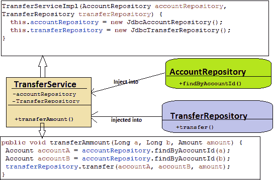
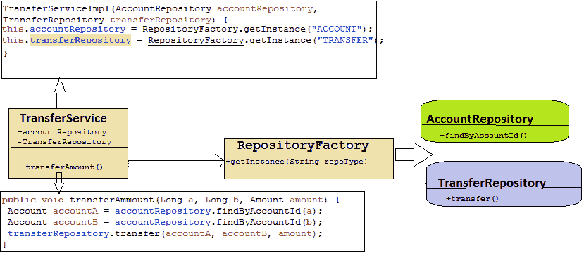
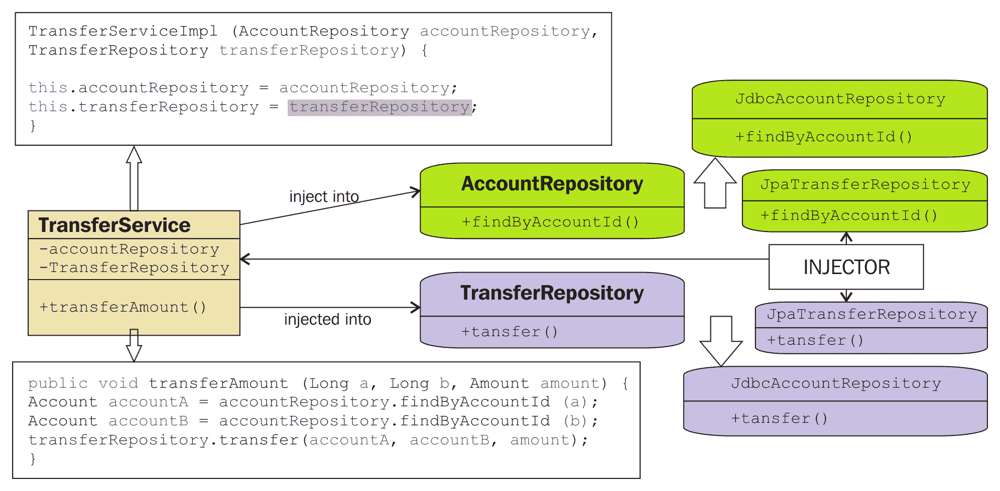
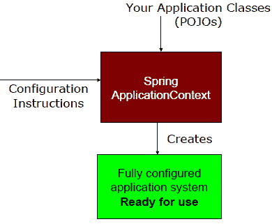
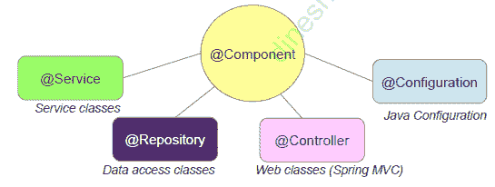
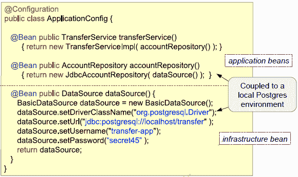

# 使用依赖注入模式连接 Wiring Beans

在上一章中，你通过示例和使用案例学习了**四人帮**（**GOF**）设计模式。现在，我们将更详细地探讨在 Spring 应用程序中注入 Bean 和配置依赖项，你将看到配置 Spring 应用程序依赖项的各种方法。这包括使用 XML、注解、Java 和混合配置。

每个人都喜欢看电影，对吧？嗯，如果不喜欢电影，那戏剧、剧集或者剧院呢？有没有想过如果团队成员之间不交流会发生什么？我说的是团队，不仅仅是演员，还有布景团队、化妆人员、视听人员、音响系统人员等等。不用说，每个成员都对最终产品有重要的贡献，并且这些团队之间需要大量的协调。

一部大片是数百人共同努力实现共同目标的产品。同样，优秀的软件是几个对象共同工作以满足某些商业目标的应用程序。作为一个团队，每个对象都必须意识到其他对象，并相互沟通以完成他们的工作。

在银行系统中，转账服务必须了解账户服务，账户服务必须了解账户存储库，等等。所有这些组件共同工作，使银行系统可行。在第一章，*使用框架 5.0 和设计模式入门*中，你看到了使用传统方法创建的相同银行示例，即使用构造和直接对象初始化创建对象。这种传统方法导致代码复杂，难以重用和单元测试，并且与其他代码高度耦合。

但在 Spring 中，对象有责任在没有必要寻找和创建他们工作中所需的依赖对象的情况下完成他们的工作。Spring 容器负责寻找或创建其他依赖对象，并与它们的依赖项协作。在之前的银行系统示例中，转账服务依赖于账户服务，但它不必创建账户服务，因此依赖项由容器创建，并传递给应用程序中的依赖对象。

在本章中，我们将讨论基于 Spring 的应用程序背后的故事，参考**依赖注入**（**DI**）模式，以及它是如何工作的。在本章结束时，你将了解你的基于 Spring 的应用程序中的对象是如何相互建立关联的，以及 Spring 是如何为完成任务连接这些对象的。你还将学习许多在 Spring 中连接 Bean 的方法。

本章将涵盖以下主题：

+   依赖注入模式

+   依赖注入模式的类型

+   使用抽象工厂模式解决依赖关系

+   查找方法注入模式

+   使用工厂模式配置 Bean

+   配置依赖

+   在应用程序中配置依赖的常见最佳实践

# 依赖注入模式

在任何企业应用程序中，为了实现业务目标，工作对象之间的协调非常重要。应用程序中对象之间的关系代表了对象的依赖性，因此每个对象都会通过应用程序中依赖对象的协调来完成工作。这种对象之间所需的依赖关系往往很复杂，并且与应用程序中的紧密耦合编程相关。Spring 通过使用依赖注入模式提供了解决应用程序紧密耦合代码的方案。依赖注入是一种设计模式，它促进了应用程序中松耦合的类。这意味着系统中的类依赖于其他类的行为，而不是依赖于类的对象实例化。依赖注入模式还促进了面向接口编程而不是面向实现编程。对象依赖应该基于接口，而不是具体类，因为松耦合的结构为你提供了更大的可重用性、可维护性和可测试性。

# 使用依赖注入模式解决问题

在任何企业应用程序中，一个常见的问题是如何配置和连接不同的元素以实现业务目标——例如，如何将不同成员编写的 Web 层控制器与服务和仓库接口绑定在一起，而不了解 Web 层的控制器。因此，有一些框架通过使用轻量级容器组装来自不同层的组件来解决这个问题。这类框架的例子有 PicoContainer 和 Spring 框架。

PicoContainer 和 Spring 容器使用多种设计模式来解决不同层不同组件的组装问题。在这里，我将讨论其中之一——依赖注入模式。依赖注入为我们提供了一个解耦和松耦合的系统。它确保了依赖对象的构建。在下面的例子中，我们将演示依赖注入模式如何解决与不同层组件协作相关的常见问题。

# 没有依赖注入

在下面的 Java 示例中，首先让我们看看两个类之间的依赖关系是什么？请看以下类图：



TransferService 方法 transferAmount()与 AccountRepository 和 TransferRepository 有依赖关系，这些依赖关系是通过直接实例化仓库类实现的。

如前图所示，`TransferService`类包含两个成员变量，**AccountRepository**和**TransferRepository**。这些变量由`TransferService`构造函数初始化。**TransferService**控制使用哪个仓库实现。它还控制它们的构建。在这种情况下，**TransferService**被认为在以下示例中有一个硬编码的依赖：

下面是`TransferServiceImpl.java`文件：

```java
    public class TransferServiceImpl implements TransferService { 
      AccountRepository accountRepository; 
      TransferRepository transferRepository; 
      public TransferServiceImpl(AccountRepository accountRepository, 
      TransferRepository transferRepository) { 
        super(); 
        // Specify a specific implementation in the constructor 
        instead of using dependency injection
        this.accountRepository = new JdbcAccountRepository(); 
        this.transferRepository = new JdbcTransferRepository(); 
      } 
      // Method within this service that uses the accountRepository and 
      transferRepository
      @Override 
      public void transferAmmount(Long a, Long b, Amount amount) { 
        Account accountA = accountRepository.findByAccountId(a); 
        Account accountB = accountRepository.findByAccountId(b); 
        transferRepository.transfer(accountA, accountB, amount); 
      } 
    }   
```

在前面的例子中，`TransferServiceImpl`类依赖于两个类，即`AccountRepository`和`TransferRepository`。`TransferServiceImpl`类有两个依赖类的成员变量，并通过其构造函数使用 JDBC 实现的仓库，如`JdbcAccountRepository`和`JdbcTransferRepository`来初始化它们。`TransferServiceImpl`类与仓库的 JDBC 实现紧密耦合；如果将 JDBC 实现更改为 JPA 实现，您还必须更改您的`TransferServiceImpl`类。

根据 SOLID 原则（单一职责原则、开闭原则、里氏替换原则、接口隔离原则、依赖倒置原则），一个类在应用中应该只有一个职责，但在前面的例子中，`TransferServiceImpl`类还负责构建`JdbcAccountRepository`和`JdbcTransferRepository`类的对象。我们无法在类中使用直接实例化对象。

在我们第一次尝试避免在`TransferServiceImpl`类中直接实例化逻辑时，我们可以使用一个创建`TransferServiceImpl`实例的`Factory`类。根据这个想法，`TransferServiceImpl`最小化了`AccountRepository`和`TransferRepository`的依赖——之前我们有一个紧密耦合的仓库实现，但现在它只引用接口，如以下图所示：



TransferService 类在`transferAmount()`方法中依赖于`AccountRepository`和`TransferRepository`，使用的是仓库类的`Factory`。

但是，`TransferServiceImpl`类再次与`RepositoryFactory`类的实现紧密耦合。此外，这个过程不适合我们拥有更多依赖项的情况，这会增加`Factory`类或`Factory`类的复杂性。仓库类也可能有其他依赖。

以下代码使用`Factory`类来获取`AccountRepository`和`TransferRepository`类：

下面是`TransferServiceImpl.java`文件：

```java
    package com.packt.patterninspring.chapter4.bankapp.service;
    public class TransferServiceImpl implements TransferService { 
      AccountRepository accountRepository; 
      TransferRepository transferRepository; 
      public TransferServiceImpl(AccountRepository accountRepository,
      TransferRepository transferRepository) { 
        this.accountRepository = RepositoryFactory.getInstance(); 
        this.transferRepository = RepositoryFactory.getInstance(); 
      }
    @Override
    public void transferAmount(Long a, Long b, Amount amount) { 
      Account accountA = accountRepository.findByAccountId(a); 
      Account accountB = accountRepository.findByAccountId(b); 
      transferRepository.transfer(accountA, accountB, amount); 
    } 
   } 
```

在前面的代码示例中，我们已经最小化了紧密耦合，并从`TransferServiceImpl`类中移除了直接对象实例化，但这不是最佳解决方案。

# 使用依赖注入模式

工厂模式避免了直接实例化一个类的对象，我们还需要创建另一个模块来负责连接类之间的依赖。这个模块被称为 **依赖注入器**，它基于 **控制反转**（**IoC**）模式。根据 IoC 框架，容器负责对象的实例化，以及解决应用程序中类之间的依赖。这个模块为其作用域下定义的对象具有自己的构建和销毁生命周期。

在以下图中，我们使用了依赖注入模式来解决 `TransferServiceImpl` 类的依赖：



使用依赖注入设计模式来解决 TransferService 的依赖。

在以下示例中，我们使用了一个接口来解决依赖：

以下为 `TransferServiceImpl.java` 文件：

```java
    package com.packt.patterninspring.chapter4.bankapp.service; 
    public class TransferServiceImpl implements TransferService { 
      AccountRepository accountRepository; 
      TransferRepository transferRepository; 
      public TransferServiceImpl(AccountRepository accountRepository, 
      TransferRepository transferRepository) { 
        this.accountRepository = accountRepository; 
        this.transferRepository = transferRepository; 
     } 
     @Override 
     public void transferAmmount(Long a, Long b, Amount amount) { 
       Account accountA = accountRepository.findByAccountId(a); 
       Account accountB = accountRepository.findByAccountId(b); 
       transferRepository.transfer(accountA, accountB, amount); 
     } 
    } 
```

在 `TransferServiceImpl` 类中，我们将 `AccountRepository` 和 `TransferRepository` 接口的引用传递给了构造函数。现在 `TransferServiceImpl` 类与实现仓库类的实现（使用任何风味，无论是 JDBC 还是 JPA 仓库接口的实现）松散耦合，框架负责将依赖项与相关的依赖类连接起来。松耦合为我们提供了更高的可重用性、可维护性和可测试性。

Spring 框架实现了依赖注入模式来解决 Spring 应用程序中类之间的依赖。Spring DI 基于 IoC 概念，即 Spring 框架有一个容器，它创建、管理和销毁对象；它被称为 Spring IoC 容器。位于 Spring 容器内的对象被称为 **Spring beans**。在 Spring 应用程序中连接 beans 的方式有很多。让我们看看配置 Spring 容器的三种最常见方法。

在以下部分，我们将探讨依赖注入模式的类型；你可以使用其中任何一个来配置依赖。

# 依赖注入模式的类型

以下是可以注入到你的应用程序中的依赖注入类型：

+   基于构造函数的依赖注入

+   基于设置器的依赖注入

# 基于构造函数的依赖注入模式

依赖注入是一种设计模式，用于解决依赖类之间的依赖关系，而依赖关系不过是对象属性。注入器必须通过使用构造函数注入或设置器注入中的一种方式来为依赖对象构造。构造函数注入是在创建对象时满足这些对象属性的一种方式，以实例化对象。一个对象有一个公共构造函数，它接受依赖类作为构造函数参数以注入依赖。你可以在依赖类中声明多个构造函数。以前，仅使用 PicoContainer 框架进行基于构造函数的依赖注入来解决问题。目前，Spring 框架也支持构造函数注入来解决依赖关系。

**构造函数注入模式的优点**

如果你在 Spring 应用程序中使用构造函数注入，以下是一些优点：

+   基于构造函数的依赖注入更适合强制依赖，并且它创建了一个强依赖合同

+   基于构造函数的依赖注入比其他方式提供了更紧凑的代码结构

+   它支持通过将作为构造函数参数传递给依赖类的依赖项进行测试

+   它倾向于使用不可变对象，并且不会破坏信息隐藏原则

**构造函数注入模式的缺点**

以下是基于构造函数的这种注入模式的唯一缺点：

+   它可能会导致循环依赖。（循环依赖意味着依赖类和依赖类之间也是相互依赖的，例如，类 A 依赖于类 B，而类 B 也依赖于类 A）

**基于构造函数的依赖注入模式示例**

让我们看看以下基于构造函数的依赖注入的示例。在以下代码中，我们有一个 `TransferServiceImpl` 类，它的构造函数接受两个参数：

```java
    public class TransferServiceImpl implements TransferService { 
      AccountRepository accountRepository; 
      TransferRepository transferRepository; 
      public TransferServiceImpl(AccountRepository accountRepository,    
      TransferRepository transferRepository) { 
        this.accountRepository = accountRepository; 
        this.transferRepository = transferRepository; 
      } 
      // ... 
    }
```

仓库也将由 Spring 容器管理，因此容器将按照以下方式将用于数据库配置的 `datasource` 对象注入到它们中：

以下是 `JdbcAccountRepository.java` 文件：

```java
    public class JdbcAccountRepository implements AccountRepository{ 
      JdbcTemplate jdbcTemplate; 
      public JdbcAccountRepository(DataSource dataSource) { 
        this.jdbcTemplate = new JdbcTemplate(dataSource); 
      } 
      // ... 
    }
```

以下是 `JdbcTransferRepository.java` 文件：

```java
    public class JdbcTransferRepository implements TransferRepository{ 
      JdbcTemplate jdbcTemplate; 
      public JdbcTransferRepository(DataSource dataSource) { 
        this.jdbcTemplate = new JdbcTemplate(dataSource); 
      } 
       // ... 
    }
```

你可以在前面的代码中看到，作为 `AccountRepository` 和 `TransferRepository` 的仓库的 JDBC 实现。这些类也具有一个参数的构造函数，用于通过 `DataSource` 类注入依赖。

让我们看看在企业应用程序中实现依赖注入的另一种方式，即设置器注入。

# 基于设置器的依赖注入

容器注入器有另一种方式来连接依赖对象。在 setter 注入中，满足这些依赖关系的一种方式是在依赖类中提供一个 setter 方法。对象有公开的 setter 方法，该方法接受依赖类作为方法参数以注入依赖项。对于基于 setter 的依赖注入，依赖类的构造器不是必需的。如果你更改依赖类的依赖项，不需要进行任何更改。Spring 框架和 PicoContainer 框架支持 setter 注入以解决依赖关系。

**setter 注入的优势**

如果你在 Spring 应用程序中使用 setter 注入模式，以下是其优势：

+   Setter 注入比构造器注入更易读

+   Setter 注入解决了应用程序中的循环依赖问题

+   Setter 注入允许在尽可能晚的时候创建昂贵的资源或服务，并且仅在需要时

+   Setter 注入不需要更改构造器，但依赖项通过公开的属性传递，这些属性是公开的

**setter 注入的缺点**

以下为 setter 注入模式的缺点：

+   在 setter 注入模式中，安全性较低，因为它可以被覆盖

+   基于 setter 的依赖注入不提供与构造器注入一样紧凑的代码结构

+   在使用 setter 注入时，务必小心，因为它不是必需的依赖项

**基于 setter 的依赖注入示例**

让我们看看以下基于 setter 的依赖注入的示例。以下`TransferServiceImpl`类，具有一个参数的 setter 方法，该参数为存储库类型：

以下为`TransferServiceImpl.java`文件：

```java
    public class TransferServiceImpl implements TransferService { 
      AccountRepository accountRepository; 
      TransferRepository transferRepository; 

      public void setAccountRepository(AccountRepository 
      accountRepository) { 
        this.accountRepository = accountRepository; 
      } 
      public void setTransferRepository(TransferRepository  
      transferRepository) { 
        this.transferRepository = transferRepository; 
      } 
      // ... 
    } 
```

同样，让我们定义以下存储库实现的 setter，如下所示：

以下为`JdbcAccountRepository.java`文件：

```java
    public class JdbcAccountRepository implements AccountRepository{ 
      JdbcTemplate jdbcTemplate; 
      public setDataSource(DataSource dataSource) { 
        this.jdbcTemplate = new JdbcTemplate(dataSource); 
    } 
     // ... 
   } 
```

以下为`JdbcTransferRepository.java`文件：

```java
    public class JdbcTransferRepository implements TransferRepository{ 
      JdbcTemplate jdbcTemplate; 
      public setDataSource(DataSource dataSource) { 
        this.jdbcTemplate = new JdbcTemplate(dataSource); 
   } 
    // ... 
  } 
```

你可以在前面的代码中看到作为`AccountRepository`和`TransferRepository`的存储库的 JDBC 实现。这些类有一个 setter 方法，接受一个参数以注入`DataSource`类的依赖项。

**构造器注入与 setter 注入及最佳实践**

Spring 框架为这两种依赖注入模式提供支持。构造器和 setter 注入模式都在系统中组装元素。setter 注入和构造器注入之间的选择取决于你的应用程序需求和处理的问题。让我们看看以下表格，其中列出了构造器和 setter 注入之间的一些差异，以及一些选择适合你应用程序的最佳实践。

| **构造器注入** | **setter 注入** |
| --- | --- |
| 具有构造函数参数的类；有时它非常紧凑，并且清楚地表明它创建的内容。 | 这里，对象被构建了，但并不清楚其属性是否已初始化。 |
| 当依赖项是必需的时候，这是一个更好的选择。 | 当依赖项不是必需的时候，这更适合。 |
| 它允许你隐藏不可变的对象属性，因为它没有为这些对象属性提供 setter。为了确保对象的不可变性，请使用构造函数注入模式而不是 setter 注入。 | 它不能确保对象的不可变性。 |
| 它会在你的应用程序中创建循环依赖。 | 它解决了应用程序中循环依赖的问题。在这种情况下，setter 注入比构造函数更好。 |
| 在应用中，这不适用于标量值依赖。 | 如果你有字符串和整数等简单的参数作为依赖项，则使用 setter 注入更好，因为每个 setter 名称都表明了该值应该做什么。 |

在下一节中，你将学习如何配置注入器以查找 bean 并将它们连接起来，以及注入器如何管理 bean。在这里，我将使用 Spring 配置来实现依赖注入模式。

# 使用 Spring 配置依赖注入模式

在本节中，我将解释在应用程序中配置依赖关系所需的过程。主流的注入器有 Google Guice、Spring 和 Weld。在本章中，我使用 Spring 框架，因此，我们将在这里看到 Spring 配置。以下图表是 Spring 工作的高级视图：



使用依赖注入模式如何工作

在前面的图表中，**配置指令**是应用程序的元配置。在这里，我们在**你的应用程序类（POJOs）**中定义依赖关系，初始化 Spring 容器，通过结合 POJOs 和**配置指令**来解析依赖关系，最终，你将有一个完全配置和可执行的系统或应用程序。

正如你在前面的图表中所看到的，Spring 容器创建你的应用程序中的 bean，并通过 DI 模式组装它们之间的关系。Spring 容器根据我们提供给框架的配置来创建 bean，因此，告诉 Spring 创建哪些 bean 以及如何将它们连接在一起是你的责任。

Spring 在配置 Spring bean 的依赖关系方面非常灵活。以下是你应用程序元数据配置的三个方法：

1.  **基于 Java 配置的依赖注入模式**——这是一个在 Java 中显式配置。

1.  **基于注解配置的依赖注入模式**——这是一个隐式 bean 发现和自动连接。

1.  **基于 XML 的依赖注入模式**——它是在 XML 中的显式配置。

Spring 提供了三种在 Spring 中连接豆的选择。你必须选择其中之一，但没有一个选择是任何应用程序的最佳匹配。这取决于你的应用程序，你也可以将这些选择混合匹配到一个单一的应用程序中。现在让我们详细讨论基于 Java 配置的依赖注入模式。

# 基于 Java 配置的依赖注入模式

从 Spring 3.0 开始，它提供了一个基于 Java 的 Spring 配置来连接 Spring 豆类。看看以下基于 Java 的配置类 (`AppConfig.java`)，以定义 Spring 豆类及其依赖关系。基于 Java 的配置对于依赖注入是一个更好的选择，因为它更强大且类型安全。

# 创建一个 Java 配置类 - AppConfig.java

让我们为我们的示例创建一个 `AppConfig.java` 配置类：

```java
    package com.packt.patterninspring.chapter4.bankapp.config; 
    import org.springframework.context.annotation.Configuration; 
    @Configuration 
    public class AppConfig { 
         //.. 
    } 
```

前面的 `AppConfig` 类被 `@Configuration` 注解标记，这表示它是一个包含豆定义详细信息的应用程序配置类。该文件将由 Spring 应用程序上下文加载以创建应用程序的豆。

现在我们来看看如何在 `AppConfig` 中声明 `TransferService`、`AccountRepository` 和 `TransferRepository` 这三个豆类。

# 在配置类中声明 Spring 豆

在基于 Java 的配置中声明豆时，你必须编写一个在配置类中创建所需类型对象的方 法，并使用 `@Bean` 注解该方法。让我们看看在 `AppConfig` 类中做出的以下更改来声明豆类：

```java
    package com.packt.patterninspring.chapter4.bankapp.config; 
    import org.springframework.context.annotation.Bean; 
    import org.springframework.context.annotation.Configuration; 
    @Configuration 
    public class AppConfig { 
      @Bean 
      public TransferService transferService(){ 
        return new TransferServiceImpl(); 
      } 
     @Bean 
     public AccountRepository accountRepository() { 
       return new JdbcAccountRepository(); 
     } 
     @Bean 
     public TransferRepository transferRepository() { 
       return new JdbcTransferRepository(); 
     } 
   } 
```

在前面的配置文件中，我声明了三个方法来创建 `TransferService`、`AccountRepository` 和 `TransferRepository` 的实例。这些方法被 `@Bean` 注解标记，表示它们负责实例化、配置和初始化一个将被 Spring IoC 容器管理的新对象。容器中的每个豆都有一个唯一的豆 ID；默认情况下，豆的 ID 与 `@Bean` 注解的方法名相同。在前面的例子中，豆将被命名为 `transferService`、`accountRepository` 和 `transferRepository`。你也可以通过使用 `@Bean` 注解的 name 属性来覆盖默认行为，如下所示：

```java
    @Bean(name="service") 
    public TransferService transferService(){ 
     return new TransferServiceImpl(); 
    } 
```

现在 `"service"` 是该豆 `TransferService` 的豆名。

让我们看看如何在 `AppConfig` 中为 `TransferService`、`AccountRepository` 和 `TransferRepository` 豆类注入依赖关系。

# 注入 Spring 豆类

在前面的代码中，我声明了 `TransferService`、`AccountRepository` 和 `TransferRepository` 这三个豆类；这些豆类没有依赖关系。但实际上，`TransferService` 豆类依赖于 `AccountRepository` 和 `TransferRepository`。让我们看看在 `AppConfig` 类中做出的以下更改来声明这些豆类：

```java
    package com.packt.patterninspring.chapter4.bankapp.config; 
    import org.springframework.context.annotation.Bean; 
    import org.springframework.context.annotation.Configuration; 
    @Configuration 
    public class AppConfig { 
      @Bean 
      public TransferService transferService(){ 
        return new TransferServiceImpl(accountRepository(), 
        transferRepository()); 
     } 
     @Bean 
     public AccountRepository accountRepository() { 
       return new JdbcAccountRepository(); 
     } 
     @Bean 
     public TransferRepository transferRepository() { 
       return new JdbcTransferRepository(); 
     } 
    } 
```

在前面的示例中，在基于 Java 的配置中连接豆子的最简单方法是通过引用所引用的 bean 的方法。`transferService()`方法通过调用接受`AccountRepository`和`TransferRepository`作为参数的构造函数来构建`TransferServiceImpl`类的实例。在这里，似乎`TransferServiceImpl`类的构造函数通过调用`accountRepository()`和`transferRepository()`方法来分别创建`AccountRepository`和`TransferRepository`的实例，但这并不是实际创建实例的调用。Spring 容器创建了`AccountRepository`和`TransferRepository`的实例，因为`accountRepository()`和`transferRepository()`方法被注解了`@Bean`。任何其他 bean 方法对 bean 方法的调用都将被 Spring 拦截，以确保通过该方法返回 Spring beans 的默认单例作用域（这将在第五章，*理解 Bean 生命周期和使用的模式*）而不是允许它再次被调用。

# 使用 Java 配置依赖注入模式的最佳方法

在前面的配置示例中，我声明了`transferService()`bean 方法通过使用其参数构造函数来构建`TransferServiceImpl`类的实例。bean 方法`accountRepository()`和`transferRepository()`作为构造函数的参数传递。但在企业应用中，许多配置文件依赖于应用程序架构的层。假设服务层和基础设施层有自己的配置文件。这意味着`accountRepository()`和`transferRepository()`方法可能位于不同的配置文件中，而`transferService()`bean 方法可能位于另一个配置文件中。将 bean 方法传递给构造函数不是使用 Java 进行依赖注入模式配置的好做法。让我们看看配置依赖注入的最佳不同方法：

```java
    package com.packt.patterninspring.chapter4.bankapp.config; 
    import org.springframework.context.annotation.Bean; 
    import org.springframework.context.annotation.Configuration; 
    @Configuration 
    public class AppConfig { 
      @Bean 
      public TransferService transferService(AccountRepository 
      accountRepository, TransferRepository transferRepository){ 
        return new TransferServiceImpl(accountRepository, 
        transferRepository); 
     } 
     @Bean 
     public AccountRepository accountRepository() { 
       return new JdbcAccountRepository(); 
     } 
     @Bean 
     public TransferRepository transferRepository() { 
       return new JdbcTransferRepository(); 
     } 
    } 
```

在前面的代码中，`transferService()`方法请求`AccountRepository`和`TransferRepository`作为参数。当 Spring 调用`transferService()`来创建`TransferService`bean 时，它会自动将`AccountRepository`和`TransferRepository`注入到配置方法中。使用这种方法，`transferService()`方法仍然可以将`AccountRepository`和`TransferRepository`注入到`TransferServiceImpl`的构造函数中，而不需要明确引用`accountrepository()`和`transferrepository()``@Bean`方法。

现在我们来看看基于 XML 的配置的依赖注入模式。

# 基于 XML 的配置的依赖注入模式

Spring 从一开始就提供了基于 XML 的配置依赖注入。这是配置 Spring 应用程序的主要方式。据我所知，每个开发者都应该了解如何使用 XML 与 Spring 应用程序一起使用。在本节中，我将参考基于 XML 的配置，解释与前面基于 Java 配置的章节中讨论的相同示例。

# 创建 XML 配置文件

在基于 Java 配置的章节中，我们创建了一个带有 `@Configuration` 注解的 `AppConfig` 类。同样，对于基于 XML 的配置，我们现在将创建一个以 `<beans>` 元素为根的 `applicationContext.xml` 文件。以下最简单的示例显示了基于 XML 的配置元数据的基本结构：

下面的 `applicationContext.xml` 文件：

```java
    <?xml version="1.0" encoding="UTF-8"?> 
    <beans  

     xsi:schemaLocation="http://www.springframework.org/schema/beans   
     http://www.springframework.org/schema/beans/spring-beans.xsd"> 

     <!-- Configuration for bean definitions go here --> 

    </beans> 
```

前面的 XML 文件是应用程序的配置文件，其中包含有关 Bean 定义的具体信息。此文件也由 `ApplicationContext` 的 XML 风格实现加载，以为您应用程序创建 Bean。让我们看看如何在前面提到的 XML 文件中声明 `TransferService`、`AccountRepository` 和 `TransferRepository` Bean。

# 在 XML 文件中声明 Spring Bean

与 Java 一样，我们必须通过使用 Spring 的基于 XML 的配置中的 Spring-beans 架构元素作为 `<bean>` 元素来将一个类声明为 Spring Bean。`<bean>` 元素是 JavaConfig 的 `@Bean` 注解的 XML 类似物。我们向基于 XML 的配置文件添加以下配置：

```java
    <bean id="transferService"    
     class="com.packt.patterninspring.chapter4.
     bankapp.service.TransferServiceImpl"/> 
    <bean id="accountRepository"   
     class="com.packt.patterninspring.chapter4.
     bankapp.repository.jdbc.JdbcAccountRepository"/> 
    <bean id="transferService"   
     class="com.packt.patterninspring.chapter4.
     bankapp.repository.jdbc.JdbcTransferRepository"/> 
```

在前面的代码中，我创建了一个非常简单的 Bean 定义。在这个配置中，`<bean>` 元素有一个 `id` 属性来标识单个 Bean 定义。`class` 属性表示为完全限定的类名，以创建此 Bean。`id` 属性的值指的是协作对象。因此，让我们看看如何配置协作 Bean 以解决应用程序中的依赖关系。

# 注入 Spring Bean

Spring 提供了这两种方式来定义 DI 模式，以在应用程序中将依赖项注入到依赖 Bean 中：

+   使用构造函数注入

+   使用设置器注入

# 使用构造函数注入

对于构造函数注入的 DI 模式，Spring 提供了两个基本选项，即 `<constructor-arg>` 元素和 Spring 3.0 中引入的 c-namespace。c-namespace 在应用程序中具有更少的冗余，这是它们之间的唯一区别--你可以选择任何一个。以下是如何使用构造函数注入注入协作 Bean 的示例：

```java
    <bean id="transferService"   
     class="com.packt.patterninspring.chapter4.
     bankapp.service.TransferServiceImpl"> 
     <constructor-arg ref="accountRepository"/> 
     <constructor-arg ref="transferRepository"/> 
    </bean> 
    <bean id="accountRepository"    
     class="com.packt.patterninspring.chapter4.
     bankapp.repository.jdbc.JdbcAccountRepository"/> 
    <bean id="transferRepository"       
     class="com.packt.patterninspring.chapter4.
     bankapp.repository.jdbc.JdbcTransferRepository"/> 
```

在前面的配置中，`TransferService` 的 `<bean>` 元素有两个 `<constructor-arg>`。这表示它需要将 ID 为 `accountRepository` 和 `transferRepository` 的 Bean 的引用传递给 `TransferServiceImpl` 的构造函数。

截至 Spring 3.0，c-namespace 类似地，在 XML 中表达构造函数参数有更简洁的方式。为了使用此命名空间，我们必须在 XML 文件中添加其模式，如下所示：

```java
    <?xml version="1.0" encoding="UTF-8"?> 
    <beans  

     xsi:schemaLocation="http://www.springframework.org/schema/beans
     http://www.springframework.org/schema/beans/spring-beans.xsd"> 

    <bean id="transferService"    
     class="com.packt.patterninspring.chapter4.
     bankapp.service.TransferServiceImpl"  
     c:accountRepository-ref="accountRepository" c:transferRepository-
     ref="transferRepository"/> 
    <bean id="accountRepository"    
     class="com.packt.patterninspring.chapter4.
     bankapp.repository.jdbc.JdbcAccountRepository"/> 
    <bean id="transferRepository"    
     class="com.packt.patterninspring.chapter4.
     bankapp.repository.jdbc.JdbcTransferRepository"/> 

     <!-- more bean definitions go here --> 

    </beans> 
```

让我们看看如何使用设置注入来设置这些依赖项。

# 使用设置注入

使用注入，Spring 还提供了两种基本选项，即 `<property>` 元素和 Spring 3.0 中引入的 p-namespace。p-namespace 还减少了应用程序中的代码冗余，这是它们之间的唯一区别，您可以选择任何一个。让我们按照以下方式使用设置注入注入协作 bean：

```java
    <bean id="transferService"       
     class="com.packt.patterninspring.chapter4.
     bankapp.service.TransferServiceImpl"> 
     <property name="accountRepository"  ref="accountRepository"/> 
     <property name="transferRepository" ref="transferRepository"/> 
    </bean> 
    <bean id="accountRepository"      
     class="com.packt.patterninspring.chapter4.
     bankapp.repository.jdbc.JdbcAccountRepository"/> 
    <bean id="transferRepository"   
     class="com.packt.patterninspring.chapter4.
     bankapp.repository.jdbc.JdbcTransferRepository"/> 
```

在前面的配置中，`TransferService` 的 `<bean>` 元素有两个 `<property>` 元素，它告诉它将 `accountRepository` 和 `transferRepository` 这两个 ID 的 bean 的引用传递给 `TransferServiceImpl` 的设置方法，如下所示：

```java
    package com.packt.patterninspring.chapter4.bankapp.service; 

    import com.packt.patterninspring.chapter4.bankapp.model.Account; 
    import com.packt.patterninspring.chapter4.bankapp.model.Amount; 
    import com.packt.patterninspring.chapter4.bankapp.
     repository.AccountRepository; 
    import com.packt.patterninspring.chapter4.bankapp.
     repository.TransferRepository; 

    public class TransferServiceImpl implements TransferService { 
      AccountRepository accountRepository; 
      TransferRepository transferRepository; 

      public void setAccountRepository(AccountRepository   
      accountRepository) { 
        this.accountRepository = accountRepository; 
      } 
      public void setTransferRepository(TransferRepository 
      transferRepository) { 
         this.transferRepository = transferRepository; 
      } 
      @Override 
      public void transferAmmount(Long a, Long b, Amount amount) { 
        Account accountA = accountRepository.findByAccountId(a); 
        Account accountB = accountRepository.findByAccountId(b); 
        transferRepository.transfer(accountA, accountB, amount); 
      } 
    } 
```

在前面的文件中，如果您使用此 Spring bean 而没有设置方法，则 `accountRepository` 和 `transferRepository` 属性将被初始化为 null，而没有注入依赖项。

截至 Spring 3.0，p-namespace 类似地，在 XML 中表达属性有更简洁的方式。为了使用此命名空间，我们必须在 XML 文件中添加其模式，如下所示：

```java
    <?xml version="1.0" encoding="UTF-8"?> 
    <beans  

      xsi:schemaLocation="http://www.springframework.org/schema/beans 
      http://www.springframework.org/schema/beans/spring-beans.xsd"> 

    <bean id="transferService"    
     class="com.packt.patterninspring.chapter4.bankapp.
     service.TransferServiceImpl"  
     p:accountRepository-ref="accountRepository" p:transferRepository-
     ref="transferRepository"/> 
    <bean id="accountRepository"   
     class="com.packt.patterninspring.chapter4.
     bankapp.repository.jdbc.JdbcAccountRepository"/> 
    <bean id="transferRepository"   
     class="com.packt.patterninspring.chapter4.
     bankapp.repository.jdbc.JdbcTransferRepository"/> 

    <!-- more bean definitions go here --> 

    </beans> 
```

现在我们来看看基于注解配置的依赖注入模式。

# 基于注解的配置的依赖注入模式

如前两个部分所讨论的，我们定义了基于 Java 和 XML 配置的 DI 模式，这两个选项明确定义了依赖关系。它通过在 `AppConfig` Java 文件中使用 `@Bean` 注解的方法或 XML 配置文件中的 `<bean>` 元素标签来创建 Spring bean。通过这些方法，您还可以为那些位于应用程序之外的类创建 bean，即存在于第三方库中的类。现在让我们讨论另一种创建 Spring bean 的方法，通过使用类型注解的隐式配置来定义它们之间的依赖关系。

# 什么是类型注解？

Spring 框架为您提供了一些特殊的注解。这些注解用于在应用程序上下文中自动创建 Spring bean。主要的类型注解是 `@Component`。通过使用此注解，Spring 提供了更多类型元注解，如 `@Service`，用于在服务层创建 Spring bean，`@Repository`，用于在 DAO 层创建用于存储库的 Spring bean，以及 `@Controller`，用于在控制层创建 Spring bean。这在上面的图中有所展示：



通过使用这些注解，Spring 以以下两种方式创建自动连接：

+   **组件扫描**：在这种情况下，Spring 会自动搜索 Spring IoC 容器中要创建的 bean

+   **自动装配**：在这个中，Spring 会自动在 Spring IoC 容器中搜索 bean 依赖项

隐式地，DI 模式配置减少了应用的冗余，并最小化了显式配置。让我们通过之前讨论的相同示例来演示组件扫描和自动装配。在这里，Spring 将通过发现它们来创建 `TransferService`、`TransferRepository` 和 `AccountRepository` 的 bean，并按照定义的依赖关系自动将它们注入到对方。

# 使用 Stereotype 注解创建可自动搜索的 bean

让我们看看下面的 `TransferService` 接口。它的实现使用了 `@Component` 注解。请参考以下代码：

```java
    package com.packt.patterninspring.chapter4.bankapp.service; 
    public interface TransferService { 
      void transferAmmount(Long a, Long b, Amount amount); 
    } 
```

前面的接口对于这种配置方法并不重要--我只是为了在应用中实现松耦合而取的。让我们看看它的实现，如下所示：

```java
    package com.packt.patterninspring.chapter1.bankapp.service; 
    import org.springframework.stereotype.Component; 
    @Component 
    public class TransferServiceImpl implements TransferService { 
      @Override 
      public void transferAmmount(Long a, Long b, Amount amount) { 
         //business code here 
      } 
   } 
```

你可以在前面的代码中看到 `TransferServiceImpl` 使用了 `@Component` 注解。这个注解用于标识这个类为一个组件类，这意味着，它有资格被扫描并创建这个类的 bean。现在没有必要通过使用 XML 或 Java 配置来显式配置这个类作为一个 bean 了--Spring 现在负责创建 `TransferServiceImpl` 类的 bean，因为它使用了 `@Component` 注解。

如前所述，Spring 为 `@Component` 注解提供了元注解，如 `@Service`、`@Repository` 和 `@Controller`。这些注解基于应用不同层的特定责任。在这里，`TransferService` 是服务层类；*作为 Spring 配置的最佳实践*，我们必须使用特定的注解 `@Service` 来标注这个类，而不是使用通用的注解 `@Component` 来创建这个类的 bean。以下是这个类使用 `@Service` 注解的代码：

```java
    package com.packt.patterninspring.chapter1.bankapp.service; 
    import org.springframework.stereotype.Service; 
    @Service 
    public class TransferServiceImpl implements TransferService { 
      @Override 
      public void transferAmmount(Long a, Long b, Amount amount) { 
         //business code here 
      } 
    } 
```

让我们看看应用中的其他类--这些是 `AccountRepository` 的实现类--以及 `TransferRepository` 接口是应用 DAO 层工作的仓库。*作为最佳实践**，这些类应该使用 `@Repository` 注解而不是像下面展示的那样使用 `@Component` 注解。

`JdbcAccountRepository.java` 实现了 `AccountRepository` 接口：

```java
    package com.packt.patterninspring.chapter4.bankapp.repository.jdbc; 
    import org.springframework.stereotype.Repository; 
    import com.packt.patterninspring.chapter4.bankapp.model.Account; 
    import com.packt.patterninspring.chapter4.bankapp.model.Amount; 
    import com.packt.patterninspring.chapter4.bankapp.repository.
      AccountRepository; 
    @Repository 
    public class JdbcAccountRepository implements AccountRepository { 
      @Override 
      public Account findByAccountId(Long accountId) { 
        return new Account(accountId, "Arnav Rajput", new   
        Amount(3000.0)); 
      } 
    } 
```

并且 `JdbcTransferRepository.java` 实现了 `TransferRepository` 接口：

```java
    package com.packt.patterninspring.chapter4.bankapp.repository.jdbc; 
    import org.springframework.stereotype.Repository; 
    import com.packt.patterninspring.chapter4.bankapp.model.Account; 
    import com.packt.patterninspring.chapter4.bankapp.model.Amount; 
    import com.packt.patterninspring.chapter4.bankapp.
      repository.TransferRepository; 
    @Repository 
    public class JdbcTransferRepository implements TransferRepository { 
      @Override 
      public void transfer(Account accountA, Account accountB, Amount 
      amount) { 
        System.out.println("Transfering amount from account A to B via 
        JDBC implementation"); 
      } 
    } 
```

在 Spring 中，你必须在你的应用中启用组件扫描，因为它默认是禁用的。你必须创建一个配置 Java 文件，并使用 `@Configuration` 和 `@ComponentScan` 注解它。这个类用于搜索带有 `@Component` 注解的类，并从它们中创建 bean。

让我们看看 Spring 如何扫描带有任何 stereotypes 注解的类。

# 使用组件扫描搜索 bean

使用组件扫描在 Spring 应用程序中搜索豆类所需的最小配置如下：

```java
    package com.packt.patterninspring.chapter4.bankapp.config; 

    import org.springframework.context.annotation.ComponentScan; 
    import org.springframework.context.annotation.Configuration; 

    @Configuration 
    @ComponentScan 
    public class AppConfig { 

    } 
```

`AppConfig` 类定义了一个与上一节中基于 Java 的 Spring 配置相同的 Spring 连接配置类。这里有一点需要注意--`AppConfig` 文件有一个额外的 `@ComponentScan`，因为之前它只有 `@Configuration` 注解。配置文件 `AppConfig` 被注解为 `@ComponentScan` 以启用 Spring 中的组件扫描。`@ComponentScan` 注解默认扫描与配置类同一包下被 `@Component` 注解的类。由于 `AppConfig` 类位于 `com.packt.patterninspring.chapter4.bankapp.config` 包中，Spring 将仅扫描此包及其子包。但我们的组件应用程序类位于 `com.packt.patterninspring.chapter1.bankapp.service` 和 `com.packt.patterninspring.chapter4.bankapp.repository.jdbc` 包中，而这些不是 `com.packt.patterninspring.chapter4.bankapp.config` 的子包。在这种情况下，Spring 允许通过设置组件扫描的基础包来覆盖 `@ComponentScan` 注解的默认包扫描。让我们指定一个不同的基础包。你只需要在 `@ComponentScan` 的 `value` 属性中指定包，如下所示：

```java
    @Configuration 
    @ComponentScan("com.packt.patterninspring.chapter4.bankapp") 
    public class AppConfig { 

    } 
```

或者，你可以使用 `basePackages` 属性定义基础包，如下所示：

```java
    @Configuration 
    @ComponentScan(basePackages="com.packt.patterninspring.
    chapter4.bankapp") 
    public class AppConfig { 

    } 
```

在 `@ComponentScan` 注解中，`basePackages` 属性可以接受一个字符串数组，这意味着我们可以定义多个基础包以扫描应用程序中的组件类。在之前的配置文件中，Spring 将扫描 `com.packt.patterninspring.chapter4.bankapp` 包下的所有类，以及此包下的所有子包。*作为最佳实践，* 总是定义组件类存在的基础包。例如，在以下代码中，我定义了服务和存储库组件的基础包：

```java
    package com.packt.patterninspring.chapter4.bankapp.config; 
    import org.springframework.context.annotation.ComponentScan; 
    import org.springframework.context.annotation.Configuration; 
    @Configuration 
    @ComponentScan(basePackages=       
    {"com.packt.patterninspring.chapter4.
    bankapp.repository.jdbc","com.packt.patterninspring.
    chapter4.bankapp.service"}) 
    public class AppConfig { 

    } 
```

现在 Spring 只扫描 `com.packt.patterninspring.chapter4.bankapp.repository.jdbc` 和 `com.packt.patterninspring.chapter4.bankapp.service` 包，以及如果存在的话，它们的子包。而不是像早期示例中那样进行广泛的扫描。

与将 `@ComponentScan` 的 `basePackages` 属性指定为简单的字符串值相比，Spring 允许你通过以下方式指定它们：

```java
    package com.packt.patterninspring.chapter4.bankapp.config; 
    import org.springframework.context.annotation.ComponentScan; 
    import org.springframework.context.annotation.Configuration; 
    import com.packt.patterninspring.chapter4.bankapp.
     repository.AccountRepository; 
    import com.packt.patterninspring.chapter4.
     bankapp.service.TransferService; 
    @Configuration 
    @ComponentScan(basePackageClasses=   
    {TransferService.class,AccountRepository.class}) 
    public class AppConfig { 

    } 
```

如前述代码所示，`basePackages` 属性已被替换为 `basePackageClasses`。现在 Spring 将识别那些将使用 `basePackageClasses` 作为组件扫描基础包的包中的组件类。

它应该找到`TransferServiceImpl`、`JdbcAccountRepository`和`JdbcTransferRepository`类，并在 Spring 容器中自动创建这些类的 bean。明确地说，没有必要为这些类定义创建 Spring bean 的方法。让我们通过 XML 配置打开组件扫描，然后你可以使用 Spring 的 context 命名空间中的`<context:component-scan>`元素。以下是一个启用组件扫描的最小 XML 配置：

```java
    <?xml version="1.0" encoding="UTF-8"?> 
    <beans  

    xsi:schemaLocation="http://www.springframework.org/schema/beans 
    http://www.springframework.org/schema/beans/spring-beans.xsd 
    http://www.springframework.org/schema/context 
    http://www.springframework.org/schema/context/spring-context.xsd"> 
    <context:component-scan base-    
    package="com.packt.patterninspring.chapter4.bankapp" /> 
    </beans> 
```

在前面的 XML 文件中，`<context:component-scan>`元素与基于 Java 的配置中的`@ComponentScan`注解相同。

# 为自动连接注解 bean

Spring 提供了自动 bean 连接的支持。这意味着 Spring 会通过在应用上下文中查找其他协作 bean 来自动解决依赖 bean 所需的依赖。Bean 自动连接是 DI 模式配置的另一种方式。它减少了应用程序的冗余，但配置分散在整个应用程序中。Spring 的`@Autowired`注解用于自动 bean 连接。这个`@Autowired`注解表示应该为这个 bean 执行自动连接。

在我们的例子中，我们有一个`TransferService`，它依赖于`AccountRepository`和`TransferRepository`。它的构造函数被`@Autowired`注解，表示当 Spring 创建`TransferService`bean 时，它应该通过使用注解的构造函数来实例化这个 bean，并传入两个其他 bean，即`AccountRepository`和`TransferRepository`，它们是`TransferService`bean 的依赖。让我们看看以下代码：

```java
    package com.packt.patterninspring.chapter4.bankapp.service; 
    import org.springframework.beans.factory.annotation.Autowired; 
    import org.springframework.stereotype.Service; 
    import com.packt.patterninspring.chapter4.bankapp.model.Account; 
    import com.packt.patterninspring.chapter4.bankapp.model.Amount; 
    import com.packt.patterninspring.chapter4.bankapp.
     repository.AccountRepository; 
    importcom.packt.patterninspring.chapter4.
     bankapp.repository.TransferRepository; 
    @Service 
    public class TransferServiceImpl implements TransferService { 
      AccountRepository accountRepository; 
      TransferRepository transferRepository; 
    @Autowired 
    public TransferServiceImpl(AccountRepository accountRepository, 
    TransferRepository transferRepository) { 
      super(); 
      this.accountRepository = accountRepository; 
      this.transferRepository = transferRepository; 
    } 
    @Override 
    public void transferAmmount(Long a, Long b, Amount amount) { 
      Account accountA = accountRepository.findByAccountId(a); 
      Account accountB = accountRepository.findByAccountId(b); 
      transferRepository.transfer(accountA, accountB, amount); 
    } 
   } 
```

注意--截至 Spring 4.3 版本，如果你在那个类中只定义了一个带有参数的构造函数，那么就不再需要`@Autowired`注解。如果一个类有多个参数构造函数，那么你必须在这其中的任何一个上使用`@Autowired`注解。

`@Autowired`注解不仅限于构造函数；它可以与 setter 方法一起使用，也可以直接在字段中使用，即一个`autowired`类属性直接。让我们看看以下代码行，用于 setter 和字段注入。

# 使用 setter 方法`@Autowired`

在这里，你可以使用`@Autowired`注解来注释 setter 方法`setAccountRepository`和`setTransferRepository`。这个注解可以用于任何方法。没有特别的原因只能用它来注释 setter 方法。请参考以下代码：

```java
    public class TransferServiceImpl implements TransferService { 
      //... 
      @Autowired 
      public void setAccountRepository(AccountRepository  
      accountRepository) { 
        this.accountRepository = accountRepository; 
      } 
      @Autowired 
      public void setTransferRepository(TransferRepository 
      transferRepository) { 
        this.transferRepository = transferRepository; 
      } 
      //... 
    } 
```

# 使用`@Autowired`注解字段

你可以注释那些对于实现业务目标所必需的类属性。让我们看看以下代码：

```java
    public class TransferServiceImpl implements TransferService { 
      @Autowired 
      AccountRepository accountRepository; 
      @Autowired 
      TransferRepository transferRepository; 
      //... 
    } 
```

在前面的代码中，`@Autowired` 注解通过 `type` 解析依赖关系，如果属性名称与 Spring 容器中 bean 的名称相同，则通过 `name` 解析。默认情况下，`@Autowired` 依赖关系是一个必需的依赖关系——如果依赖关系未解析，则会抛出异常，无论我们是否使用构造函数或设置方法。您可以通过使用此注解的 `required` 属性来覆盖 `@Autowired` 注解的必需行为。您可以通过将此属性设置为布尔值 `false` 来设置此属性，如下所示：

```java
    @Autowired(required = false) 
    public void setAccountRepository(AccountRepository
    accountRepository) { 
      this.accountRepository = accountRepository; 
    }  
```

在前面的代码中，我们已经将 `required` 属性设置为布尔值 `false`。在这种情况下，Spring 将尝试执行自动装配，但如果没有匹配的 bean，它将保留 bean 未连接。但作为代码的最佳实践，您应该避免将其值设置为 `false`，除非绝对必要。 

# 自动装配依赖注入模式及消除歧义

`@Autowiring` 注解减少了代码的冗余，但当容器中存在两个相同类型的 bean 时，可能会产生一些问题。让我们看看在这种情况下会发生什么，以下是一个示例：

```java
    @Service 
    public class TransferServiceImpl implements TransferService { 
    @Autowired 
    public TransferServiceImpl(AccountRepository accountRepository) { 
    ... } 
    } 
```

上述代码片段显示，`TransferServiceImpl` 类依赖于一个类型为 `AccountRepository` 的 bean，但 Spring 容器中包含两个相同类型的 bean，即以下内容：

```java
    @Repository 
    public class JdbcAccountRepository implements AccountRepository 
    {..} 
   @Repository 
   public class JpaAccountRepository implements AccountRepository {..} 
```

如前所述的代码所示，存在 `AccountRepository` 接口的两个实现——一个是 `JdbcAccountRepository`，另一个是 `JpaAccountRepository`。在这种情况下，Spring 容器将在应用程序启动时抛出以下异常：

```java
    At startup: NoSuchBeanDefinitionException, no unique bean of type 
    [AccountRepository] is defined: expected single bean but found 2... 
```

# 自动装配依赖注入模式中的消除歧义

Spring 提供了一个额外的注解 `@Qualifier`，以克服自动装配依赖注入中的歧义问题。让我们看看以下带有 `@Qualifier` 注解的代码片段：

```java
    @Service 
    public class TransferServiceImpl implements TransferService { 
    @Autowired 
    public TransferServiceImpl( @Qualifier("jdbcAccountRepository")
    AccountRepository accountRepository) { ... } 
```

现在我已经通过使用 `@Qualifier` 注解按名称而不是按类型连接了依赖关系。因此，Spring 将为 `TransferServiceImpl` 类搜索名为 `"jdbcAccountRepository"` 的 bean 依赖关系。我已经给出了以下 bean 名称：

```java
    @Repository("jdbcAccountRepository") 
    public class JdbcAccountRepository implements AccountRepository 
    {..} 
    @Repository("jpaAccountRepository") 
    public class JpaAccountRepository implements AccountRepository {..} 
```

`@Qualifier`，也适用于方法注入和字段注入的组件名称，除非存在相同接口的两个实现，否则不应显示实现细节。

让我们现在讨论一些最佳实践，以选择适合您的 Spring 应用程序的 DI 模式配置。

**使用抽象工厂模式解决依赖关系**

如果你想为 Bean 添加`if...else`条件配置，你可以这样做，如果你使用 Java 配置，还可以添加一些自定义逻辑。但在 XML 配置的情况下，无法添加`if...then...else`条件。Spring 通过使用抽象工厂模式为 XML 配置中的条件提供了解决方案。使用工厂创建你想要的 Bean，并在工厂的内部逻辑中使用任何复杂的 Java 代码。

# 在 Spring 中实现抽象工厂模式（FactoryBean 接口）

Spring 框架提供了`FactoryBean`接口作为抽象工厂模式的实现。`FactoryBean`是一种封装有趣对象构建逻辑的模式的类。`FactoryBean`接口提供了一种定制 Spring IoC 容器实例化逻辑的方式。你可以为自身是工厂的对象实现此接口。实现`FactoryBean`接口的 Bean 会被自动检测。

此接口的定义如下：

```java
    public interface FactoryBean<T> { 
     T getObject() throws Exception; 
     Class<T> getObjectType(); 
     boolean isSingleton(); 
   } 
```

根据此接口的前面定义，使用 FactoryBean 进行依赖注入会导致`getObject()`方法透明地被调用。`isSingleton()`方法对于单例返回`true`，否则返回`false`。`getObjectType()`方法返回`getObject()`方法返回的对象类型。

# Spring 中 FactoryBean 接口的实现

`FactoryBean`在 Spring 中被广泛使用，如下所示：

+   `EmbeddedDatabaseFactoryBean`

+   `JndiObjectFactoryBean`

+   `LocalContainerEntityManagerFactoryBean`

+   `DateTimeFormatterFactoryBean`

+   `ProxyFactoryBean`

+   `TransactionProxyFactoryBean`

+   `MethodInvokingFactoryBean`

# FactoryBean 接口的示例实现

假设你有一个`TransferService`类，其定义如下：

```java
    package com.packt.patterninspring.chapter4.bankapp.service; 
    import com.packt.patterninspring.chapter4.
     bankapp.repository.IAccountRepository; 
    public class TransferService { 
      IAccountRepository accountRepository; 
      public TransferService(IAccountRepository accountRepository){ 
        this.accountRepository = accountRepository; 
      } 
      public void transfer(String accountA, String accountB, Double 
      amount){ 
        System.out.println("Amount has been tranferred"); 
      } 
    } 
```

你有一个定义如下`FactoryBean`：

```java
    package com.packt.patterninspring.chapter4.bankapp.repository; 
    import org.springframework.beans.factory.FactoryBean; 
    public class AccountRepositoryFactoryBean implements 
    FactoryBean<IAccountRepository> { 
      @Override 
      public IAccountRepository getObject() throws Exception { 
        return new AccountRepository(); 
      } 
      @Override 
      public Class<?> getObjectType() { 
        return IAccountRepository.class; 
      } 
      @Override 
      public boolean isSingleton() { 
        return false; 
      } 
    }  
```

你可以使用假设的`AccountRepositoryFactoryBean`像这样连接`AccountRepository`实例：

```java
    <?xml version="1.0" encoding="UTF-8"?> 
    <beans  

    xsi:schemaLocation="http://www.springframework.org/schema/beans 
    http://www.springframework.org/schema/beans/spring-beans.xsd"> 

    <bean id="transferService" class="com.packt.patterninspring.
     chapter4.bankapp.service.TransferService"> 
     <constructor-arg ref="accountRepository"/> 
    </bean> 
    <bean id="accountRepository"    
     class="com.packt.patterninspring.chapter4.
      bankapp.repository.AccountRepositoryFactoryBean"/> 
    </beans> 
```

在前面的例子中，`TransferService`类依赖于`AccountRepository` Bean，但在 XML 文件中，我们已将`AccountRepositoryFactoryBean`定义为`accountRepository` Bean。`AccountRepositoryFactoryBean`类实现了 Spring 的`FactoryBean`接口。`FactoryBean`的`getObject`方法的结果将被传递，而不是实际的`FactoryBean`本身。Spring 通过注入`FactoryBean`的`getObjectType()`方法返回的对象，以及`FactoryBean`的`getObjectType()`方法返回的对象类型；此 Bean 的作用域由`FactoryBean`的`isSingleton()`方法决定。

以下是在 Java 配置中`FactoryBean`接口的相同配置：

```java
    package com.packt.patterninspring.chapter4.bankapp.config; 
    import org.springframework.context.annotation.Bean; 
    import org.springframework.context.annotation.Configuration; 
    import com.packt.patterninspring.chapter4.bankapp.
     repository.AccountRepositoryFactoryBean; 
    import com.packt.patterninspring.chapter4.
     bankapp.service.TransferService; 
    @Configuration 
    public class AppConfig { 
      public TransferService transferService() throws Exception{ 
        return new TransferService(accountRepository().getObject()); 
      } 
    @Bean 
    public AccountRepositoryFactoryBean accountRepository(){ 
      return new AccountRepositoryFactoryBean(); 
    } 
    } 
```

作为 Spring 容器中的其他正常 Bean，Spring 的`FactoryBean`也具有任何其他 Spring Bean 的所有其他特性，包括所有 Spring 容器中的 Bean 都享有的生命周期钩子和服务。

# 配置 DI 模式的最佳实践

以下是为配置 DI 模式的最佳实践：

+   配置文件应按类别分开。应用 bean 应与基础设施 bean 分开。目前，这有点难以遵循。



+   总是指定组件名称；永远不要依赖容器生成的名称。

+   给出模式的功能描述、应用位置和解决的问题的名称是一个最佳实践。

+   组件扫描的最佳实践如下：

    +   组件在启动时扫描，并且它还扫描 JAR 依赖项。

    +   **不良实践：**它扫描了`com`和`org`的所有包。这增加了应用程序的启动时间。避免此类组件扫描：

```java
                @ComponenttScan (( {{ "org", "com" }} ))
```

+   +   **优化：**它只扫描我们定义的特定包。

```java
                 @ComponentScan ( {  
                  "com.packt.patterninspring.chapter4.
                  bankapp.repository", 
                 "com.packt.patterninspring.chapter4.bankapp.service"} 
                  ) 
```

+   选择隐式配置的最佳实践：

    +   为经常更改的 bean 选择基于注解的配置

    +   它允许非常快速的开发

    +   这是一个编辑配置的单一点

+   通过 Java 配置选择显式的最佳实践：

    +   它集中在一个地方

    +   编译器强制执行的强类型检查

    +   可以用于所有类

+   Spring XML 最佳实践：XML 已经存在很长时间了，XML 配置中有很多快捷方式和有用的技术，它们如下列出：

    +   工厂方法（factory-method）和工厂 bean（factory-bean）属性

    +   Bean 定义继承

    +   内部 Bean

    +   p 和 c 命名空间

    +   将集合用作 Spring Bean

# 摘要

在阅读本章之后，你现在应该对 DI 设计模式以及应用这些模式的最佳实践有一个很好的了解。Spring 处理管道部分，因此，你可以通过使用依赖注入模式来专注于解决领域问题。DI 模式释放了对象解决其依赖关系的负担。你的对象得到了它工作所需的一切。DI 模式简化了你的代码，提高了代码的可重用性和可测试性。它促进了面向接口的编程，并隐藏了依赖项的实现细节。DI 模式允许集中控制对象的生命周期。你可以通过两种方式配置 DI——显式配置和隐式配置。显式配置可以通过 XML 或基于 Java 的配置进行配置；它提供集中式配置。但隐式配置基于注解。Spring 为基于注解的配置提供了类型化注解。这种配置减少了应用程序中代码的冗长性，但它分散在应用程序文件中。

在即将到来的第五章《理解 Bean 生命周期和使用的模式》中，我们将探讨 Spring 容器中 Spring bean 的生命周期。
