# 理解 Bean 生命周期和使用的模式

在上一章中，你看到了 Spring 如何在容器中创建 bean。你还学习了如何使用 XML、Java 和注解来配置依赖注入模式。在本章中，我们将更深入地探讨，不仅限于在 Spring 应用程序中注入 bean 和配置依赖项。在这里，你将探索容器中 bean 的生命周期和范围，并了解 Spring 容器如何使用 XML、注解和 Java 在定义的 Spring bean 配置上工作。Spring 不仅允许我们控制从特定 bean 定义创建的对象的 DI 模式的各种配置和要注入的依赖值，还控制从特定 bean 定义创建的 bean 的生命周期和范围。

当我写这一章时，我两岁半的儿子 Arnav 走过来，开始在我的手机上玩电子游戏。他穿着一件印有有趣引语的 T 恤，这些线条描述了他的一天。这些线条是这样的—

*我的完美一天：醒来，玩电子游戏，吃饭，玩电子游戏，吃饭，玩电子游戏，然后睡觉*。

实际上，这些线条完美地反映了他每天的生活周期，因为他醒来，玩耍，吃饭，然后再玩耍，最后睡觉。通过这个例子，我只是想证明万物都有生命周期。我们可以讨论蝴蝶、星星、青蛙或植物的生命周期。但让我们谈谈更有趣的事情——bean 的生命周期！

Spring 容器中的每个 bean 都有其生命周期和作用域。Spring 容器管理 Spring 应用程序中 bean 的生命。我们可以通过使用 Spring 感知接口在某些阶段自定义它。本章将讨论容器中 bean 的生命，以及它是如何在其生命周期的各个阶段使用设计模式进行管理的。到本章结束时，你将对容器中 bean 生命周期及其各个阶段有一个相当的了解。你还将了解 Spring 中许多类型的 bean 作用域。本章将涵盖以下要点：

+   Spring bean 的生命周期及其阶段，如下所示：

    +   初始化阶段

    +   使用阶段

    +   销毁阶段

+   Spring 回调

+   理解 bean 作用域

    +   单例模式

    +   原型模式

    +   自定义作用域

    +   其他 bean 作用域

现在，让我们花一点时间看看 Spring 如何在 Spring 应用程序中管理 bean 从创建到销毁的生命周期

# Spring bean 生命周期及其阶段

在 Spring 应用程序中，生命周期这一术语适用于任何应用程序类——独立 Java、Spring Boot 应用程序或集成/系统测试。生命周期也适用于所有三种依赖注入样式——XML、注解和 Java 配置。你根据业务目标定义 Bean 的配置。但是 Spring 创建这些 Bean 并管理 Spring Bean 的生命周期。Spring 通过 `ApplicationContext` 加载 Bean 配置；一旦创建应用程序上下文，初始化阶段就完成了。让我们看看 Spring 是如何加载 Java 或 XML 配置文件的。

+   初始化阶段

+   使用阶段

+   销毁阶段

请参考以下图表：

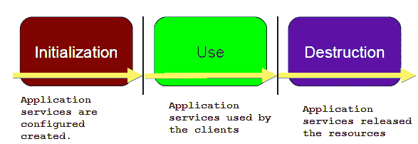

如前图所示，每个 Spring 容器在完整生命周期中都会经历这三个阶段。每个阶段都有一些针对每个 Spring 容器（根据配置）要执行的操作。Spring 介入以管理你的应用程序生命周期。它在所有三个阶段中都发挥着重要作用。

现在，让我们花一点时间看看 Spring 在第一个、初始化阶段是如何工作的。

# 使用阶段

在这个阶段，首先 Spring 加载任何样式（XML、注解和 Java 配置）的所有配置文件。这个阶段为 Bean 的使用做准备。应用程序在这个阶段完成之前是不可用的。实际上，这个阶段创建了应用程序服务以供使用，并为 Bean 分配系统资源。Spring 提供 `ApplicationContext` 来加载 Bean 配置；一旦创建应用程序上下文，初始化阶段就完成了。让我们看看 Spring 是如何加载 Java 或 XML 配置文件的。

# 从配置创建应用程序上下文

Spring 提供了多个 `ApplicationContext` 的实现来加载各种配置文件样式。这些将在下面列出：

+   对于 Java 配置，使用以下内容：

```java
        ApplicationContext context = new    
        AnnotationConfigApplicationContext(AppConfig.class); 
```

+   对于 XML 配置，实现如下：

```java
        ApplicationContext context = new  
        ClassPathXmlApplicationContext("applicationContext.xml"); 
```

在前面的代码中，Spring 通过 `AnnotationConfigApplicationContext` 类加载 Java 配置文件，通过 `ClassPathXmlApplicationContext` 类加载 XML 配置文件以用于 Spring 容器。对于所有类型的配置，Spring 的行为都是相同的。你可以在应用程序中使用任何配置样式。以下图表显示了这一阶段的确切情况：

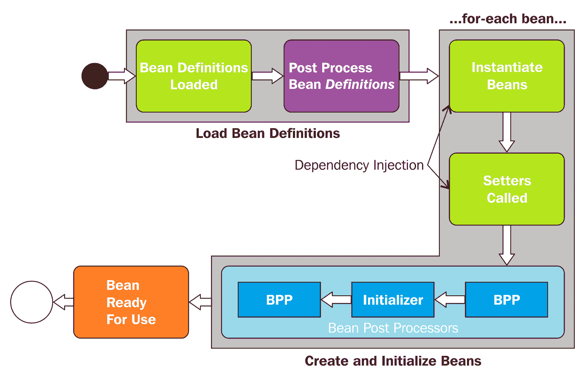

如前图所示，初始化阶段分为以下两个步骤：

+   加载 Bean 定义

+   初始化 Bean 实例

# 加载 Bean 定义

在这一步中，所有配置文件--`@Configuration` 类或 XML 文件--都被处理。对于基于注解的配置，所有带有 `@Components` 注解的类都会被扫描以加载 bean 定义。所有 XML 文件都会被解析，bean 定义会被添加到 `BeanFactory` 中。每个 bean 都会按其 `id` 进行索引。Spring 提供了多个 `BeanFactoryPostProcessor` bean，因此，它会调用以解决运行时依赖，例如从外部属性文件中读取值。在 Spring 应用程序中，`BeanFactoryPostProcessor` 可以修改任何 bean 的定义。以下图表描述了这一步：

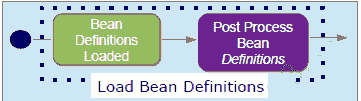

如前图所示，Spring 首先加载 bean 定义，然后调用 `BeanFactoryProcessor` 对某些 bean 进行相应的定义修改。让我们通过一个例子来看一下。我们有两个配置文件--`AppConfig.java` 和 `InfraConfig.java`，它们被定义为如下：

+   以下是对 `AppConfig.java` 文件的描述：

```java
        @Configuration 
        public class AppConfig { 
          @Bean 
          public TransferService transferService(){ ... } 
          @Bean 
          public AccountRepository accountRepository(DataSource 
          dataSource){ ... } 
        } 
```

+   以下是对 `InfraConfig.java` 文件的描述：

```java
        @Configuration 
        public class InfraConfig { 
          @Bean 
          public DataSource dataSource () { ... } 
        } 
```

这些 Java 配置文件被 **ApplicationContext** 载入容器，并按其 `id` 进行索引，如下所示：

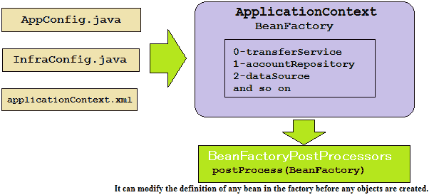

在最后一个图中，Spring beans 按其 ID 索引到 Spring 的 `BeanFactory` 中，然后，该 `BeanFactory` 对象被传递给 `BeanFactoryPostProcessor` 的 `postProcess()` 方法。`BeanFactoryPostProcessor` 可以修改某些 bean 的定义；这取决于开发者提供的 bean 配置。让我们看看 `BeanFactoryPostProcessor` 的工作原理以及如何在我们的应用程序中覆盖它：

1.  `BeanFactoryPostProcessor` 在 bean 实际创建之前，对 bean 定义或配置元数据进行操作。

1.  Spring 提供了几个有用的 `BeanFactoryPostProcessor` 实现，例如读取属性和注册自定义作用域。

1.  您可以编写自己的 `BeanFactoryPostProcessor` 接口实现。

1.  如果在一个容器中定义了 `BeanFactoryPostProcessor`，它将只应用于该容器中的 bean 定义。

以下是对 `BeanFactoryPostProcessor` 的代码片段：

```java
    public interface BeanFactoryPostProcessor { 
      public void postProcessBeanFactory
        (ConfigurableListableBeanFactory 
        beanFactory); 
    } 
```

现在我们来看一下 `BeanFactoryPostProcessor` 扩展点的以下示例：

**读取外部属性文件（**`database.properties`**）**

在这里，我们将使用 `DataSource` bean 来配置数据库值，如 `username`、`password`、`db url` 和 `driver`，如下所示：

```java
    jdbc.driver=org.hsqldb.jdbcDriver 
    jdbc.url=jdbc:hsqldb:hsql://production:9002 
    jdbc.username=doj 
    jdbc.password=doj@123 
```

以下是在配置文件中的 `DataSource` bean 定义：

```java
    @Configuration 
    @PropertySource ( "classpath:/config/database.properties" ) 
    public class InfraConfig { 
     @Bean 
     public DataSource dataSource( 
     @Value("${jdbc.driver}") String driver, 
     @Value("${jdbc.url}") String url, 
     @Value("${jdbc.user}") String user, 
     @Value("${jdbc.password}") String pwd) { 
       DataSource ds = new BasicDataSource(); 
       ds.setDriverClassName( driver); 
       ds.setUrl( url); 
       ds.setUser( user); 
       ds.setPassword( pwd )); 
       return ds; 
    } 
   } 
```

那么，在前面的代码中，我们是如何解析 `@Value` 和 `${..}` 变量的呢？我们需要一个 `PropertySourcesPlaceholderConfigurer` 来评估它们。这是一个 `BeanFactoryPostProcessor`。如果您使用 XML 配置，`<context:property-placeholder/>` 命名空间会为您创建一个 `PropertySourcesPlaceholderConfigurer`。

在加载配置文件时，加载 Bean 定义是一个一次性过程，但 Bean 实例的初始化阶段会在容器中的每个 Bean 上执行。让我们看看应用中 Bean 实例的初始化过程。

# 初始化 Bean 实例

在将 Bean 定义加载到`BeanFactory`之后，Spring IoC 容器为应用实例化 Bean；以下图显示了流程：

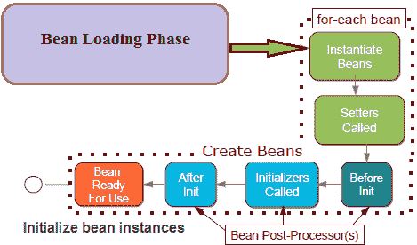

如前图所示，容器中的每个 Bean 都会执行 Bean 初始化步骤。我们可以将 Bean 创建过程总结如下：

+   默认情况下，每个 Bean 都会被急切地实例化。除非标记为懒加载，否则它会按照正确的顺序创建，并注入其依赖项。

+   Spring 提供了多个`BeanPostProcessor`，因此，每个 Bean 都会经历一个后处理阶段，例如`BeanFactoryPostProcessor`，它可以修改 Bean 定义。然而，`BeanPostProcessor`可以改变 Bean 的实例。

+   在这个阶段执行完成后，Bean 就完全初始化并准备好使用。它通过其`id`被跟踪，直到上下文被销毁，除了原型 Bean。

在下一节中，我们将讨论如何通过使用`BeanPostProcessor`来自定义 Spring 容器的行为。

# 使用 BeanPostProcessor 自定义 Bean

`BeanPostProcessor`是 Spring 中的一个重要扩展点。它可以以任何方式修改 Bean 实例。它用于启用如 AOP 代理等强大功能。你可以在你的应用中编写自己的`BeanPostProcessor`来创建自定义的`post-processor`--该类必须实现`BeanPostProcessor`接口。Spring 提供了`BeanPostProcessor`的几个实现。在 Spring 中，`BeanPostProcessor`接口有两个回调方法，如下：

```java
    public interface BeanPostProcessor { 
      Object postProcessBeforeInitialization(Object bean, String 
      beanName) throws BeansException; 
      Object postProcessAfterInitialization(Object bean, String 
      beanName) throws BeansException; 
    } 
```

你可以通过实现`BeanPostProcessor`接口的这两种方法来提供自己的自定义逻辑，用于 Bean 实例化、依赖解析等。你可以配置多个`BeanPostProcessor`实现来向 Spring 容器添加自定义逻辑。你还可以通过设置 order 属性来管理这些`BeanPostProcessor`的执行顺序。`BeanPostProcessor`在 Spring 容器实例化 Bean 之后工作。`BeanPostProcessor`的作用域在 Spring 容器内，这意味着在一个容器中定义的 Bean 不会被另一个容器中定义的`BeanPostProcessor`后处理。

Spring 应用程序中的任何类都被注册为容器的`后处理器`；它由 Spring 容器为每个 bean 实例创建。Spring 容器在容器初始化方法（初始化 Bean 的`afterPropertiesSet()`和 bean 的`init`方法）之前调用`postProcessBeforeInitialization()`方法。它还在任何 bean 初始化回调之后调用`postProcessAfterInitialization()`方法。Spring AOP 使用`后处理器`提供代理包装逻辑（代理设计模式），尽管我们可以通过使用`后处理器`执行任何操作。

Spring 的`ApplicationContext`自动检测实现`BeanPostProcessor`接口的 bean，并将这些 bean 注册为`后处理器`。这些 bean 在创建任何其他 bean 时被调用。让我们探索以下`BeanPostProcessor`的示例。

让我们按照以下方式创建一个自定义的`后处理器`：

```java
    package com.packt.patterninspring.chapter5.bankapp.bpp; 
    import org.springframework.beans.BeansException; 
    import org.springframework.beans.factory.config.BeanPostProcessor; 
    import org.springframework.stereotype.Component; 
    @Component 
    public class MyBeanPostProcessor implements 
    BeanPostProcessor { 
      @Override 
      public Object postProcessBeforeInitialization
      (Object bean, String beanName) throws BeansException { 
        System.out.println("In After bean Initialization 
        method. Bean name is "+beanName); 
        return bean; 
      } 
      public Object postProcessAfterInitialization(Object bean, String  
      beanName) throws BeansException { 
        System.out.println("In Before bean Initialization method. Bean 
        name is "+beanName); 
        return bean; 
        } 
   }  
```

此示例说明了基本用法，这里此示例显示一个`后处理器`将字符串打印到系统控制台，对于容器中注册的每个 bean。此`MyBeanPostProcessor`类使用`@Component`注解，这意味着此类与应用程序上下文中的其他 bean 类相同，现在运行以下演示类。请参考以下代码：

```java
    public class BeanLifeCycleDemo { 
      public static void main(String[] args) { 
        ConfigurableApplicationContext applicationContext = new 
        AnnotationConfigApplicationContext(AppConfig.class); 
        applicationContext.close(); 
      } 
    }
```

这是我们将在控制台上获得的输出：

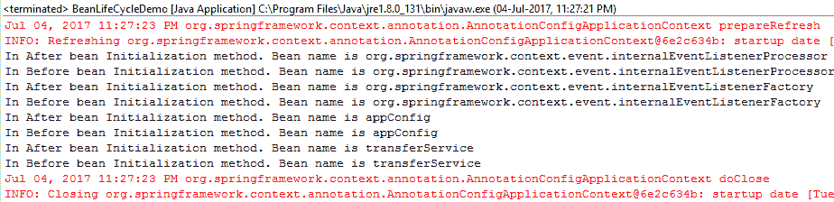

如前所述的输出所示，Spring 容器中每个 bean 的方法都会打印出回调方法的字符串。Spring 为一些特定功能提供了许多预实现的`BeanPostProcessor`，如下所示：

+   `RequiredAnnotationBeanPostProcessor`

+   `AutowiredAnnotationBeanPostProcessor`

+   `CommonAnnotationBeanPostProcessor`

+   `PersistenceAnnotationBeanPostProcessor`

XML 配置中的`<context:annotation-config/>`命名空间启用了在同一应用程序上下文中定义的多个`后处理器`。

现在，让我们继续下一节，看看我们如何通过使用`BeanPostProcessor`来启用初始化器扩展点。

# 初始化器扩展点

这个特殊的“后处理器”情况会导致调用`init`（`@PostConstruct`）方法。内部，Spring 使用多个**BeanPostProcessors**（**BPPs**）`CommonAnnotationBeanPostProcessor`来启用初始化。以下图表展示了初始化器和 BPPs 之间的关系。

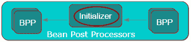

现在，让我们看看以下 XML 中初始化器扩展点的示例：

`<context:annotation-config/>`命名空间明确启用了许多`后处理器`，让我们看看以下 XML 配置文件：

```java
    <?xml version="1.0" encoding="UTF-8"?> 
    <beans  

     xsi:schemaLocation="http://www.springframework.org/schema/beans  
     http://www.springframework.org/schema/beans/spring-beans.xsd 
     http://www.springframework.org/schema/context   
     http://www.springframework.org/schema/context/
     spring-context-4.3.xsd"> 
     <context:annotation-config/> 
     <bean id="transferService"    
     class="com.packt.patterninspring.chapter5.
     bankapp.service.TransferService"/> 
     <bean id="accountRepository"   
     class="com.packt.patterninspring.chapter5.
     bankapp.repository.JdbcAccountRepository" 
     init-method="populateCache"/> 
    </beans> 
```

在前面的配置代码中，你可以看到我定义了一些豆类，其中之一是`accountRepository`仓库，它具有`init`方法属性；这个属性有一个值，`populateCache`。这实际上就是`accountRepository`豆的`initializer`方法。如果通过`<context:annotation-config/>`命名空间显式启用了`post-processor`，容器会在豆初始化时调用这个方法。让我们看看下面的`JdbcAccountRepository`类，如下所示：

```java
    package com.packt.patterninspring.chapter5.bankapp.repository; 
    import com.packt.patterninspring.chapter5.bankapp.model.Account; 
    import com.packt.patterninspring.chapter5.bankapp.model.Amount; 
    import com.packt.patterninspring.chapter5.
    bankapp.repository.AccountRepository; 
    public class JdbcAccountRepository implements AccountRepository { 
      @Override 
      public Account findByAccountId(Long accountId) { 
        return new Account(accountId, "Arnav Rajput", new  
        Amount(3000.0)); 
    } 
    void populateCache(){ 
      System.out.println("Called populateCache() method"); 
    } 
   }
```

在 Java 配置中，我们可以使用`@Bean`注解的`initMethod`属性如下：

```java
    @Bean(initMethod = "populateCache") 
    public AccountRepository accountRepository(){ 
      return new JdbcAccountRepository(); 
    }
```

在基于注解的配置中，我们可以使用*JSR-250*注解`@PostConstruct`如下：

```java
    @PostConstruct 
    void populateCache(){ 
      System.out.println("Called populateCache() method"); 
    } 
```

我们已经看到了豆生命周期中的第一个阶段，Spring 通过使用 XML、Java 和注解配置来加载豆定义，然后，Spring 容器以正确的顺序在 Spring 应用程序中初始化每个豆。下面的图给出了配置生命周期第一个阶段的概述：

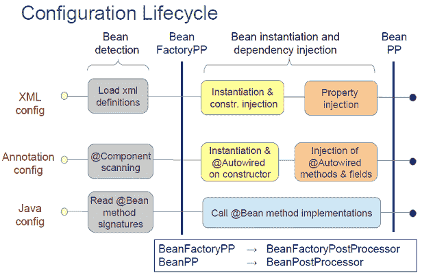

最后一个图显示了由`ApplicationContext`的相应实现加载的任何风格的 Spring 豆元数据——XML、注解或 Java。所有 XML 文件都被解析并加载了豆定义。在注解配置中，Spring 扫描所有组件，并加载豆定义。在 Java 配置中，Spring 读取所有的`@Bean`方法来加载豆定义。从所有配置风格加载豆定义之后，`BeanFactoryPostProcessor`出现来修改一些豆的定义，然后容器实例化豆。最后，`BeanPostProcessor`在豆上工作，它可以修改和改变豆对象。这是初始化阶段。现在让我们看看豆在其生命周期中的下一个使用阶段。

# 豆的使用阶段

在 Spring 应用程序中，所有 Spring 豆有 99.99%的时间都处于这个阶段。如果初始化阶段成功完成，那么 Spring 豆就会进入这个阶段。在这里，豆被客户端作为应用服务使用。这些豆处理客户端请求，并执行应用行为。在使用阶段，让我们看看如何在应用中使用时调用从上下文中获得的豆。请参考以下代码：

```java
    //Get or create application context from somewhere 
    ApplicationContext applicationContext = new    
    AnnotationConfigApplicationContext(AppConfig.class); 

    // Lookup the entry point into the application 
    TransferService transferService =    
    context.getBean(TransferService.class); 
    // and use it 
    transferService.transfer("A", "B", 3000.1); 
```

假设`return`服务返回一个原始对象，那么它可以直接调用；这里没有特别之处。但如果你的豆被包装在代理中，那么事情就更有趣了。让我们通过以下图来更清楚地理解这一点：

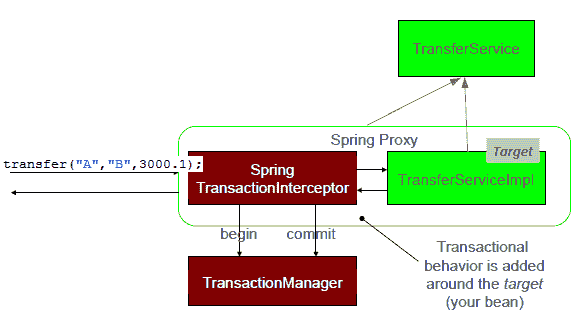

在前面的图中，你可以看到通过`Proxy`类调用的`service`方法；它是在`init`阶段由专门的`BeanPostProcessor`创建的。它将你的 Bean 包装在动态代理中，从而为你的 Bean 添加行为，这是透明的。它是装饰器设计模式和代理设计模式的一个实现。

让我们看看 Spring 如何在 Spring 应用程序中为你的 Bean 创建代理。

# 使用代理在 Spring 中实现装饰器和代理模式

Spring 在 Spring 应用程序中使用两种类型的代理。以下是由 Spring 使用的代理类型：

+   **JDK 代理**：这也被称为动态代理。它的 API 内置在 JDK 中。对于这个代理，需要`Java`接口。

+   **CGLib 代理**：这并不是 JDK 内置的。然而，它包含在 Spring JARS 中，并在接口不可用时使用。它不能应用于 final 类或方法。

让我们看看以下图中两个代理的特性：

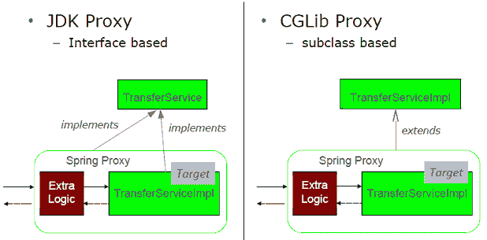

这就是关于 Spring Bean 生命周期中的使用阶段的所有内容。现在让我们转到生命周期的下一个阶段，即销毁阶段。

# Bean 的销毁阶段

在这个阶段，Spring 会释放应用程序服务获取的任何系统资源。这些资源有资格进行垃圾回收。当你关闭应用程序上下文时，销毁阶段完成。让我们看看这个阶段的以下代码行：

```java
    //Any implementation of application context 

    ConfigurableApplicationContext applicationContext = new   
    AnnotationConfigApplicationContext(AppConfig.class); 

    // Destroy the application by closing application context. 
    applicationContext.close(); 
```

在前面的代码中，当你在这个阶段调用`applicationContext.close()`方法时，你认为会发生什么？发生的进程如下所示：

+   任何实现`org.springframework.beans.factory.DisposableBean`接口的 Bean 在销毁时都会从容器中收到一个回调。`DisposableBean`接口指定了一个单一的方法：

```java
        void destroy() throws Exception; 
```

+   如果指示调用它们的`destroy`方法，`bean`实例将被销毁。Bean 必须定义一个`destroy`方法，即一个无参数返回`void`的方法。

+   然后，上下文会自我销毁，并且这个上下文将不再可用。

+   只有 GC（垃圾回收器）实际上销毁对象，并且记住，它仅在`ApplicationContext`/JVM 正常退出时被调用。它不会为原型 Bean 调用。

让我们看看如何使用 XML 配置来实现它：

```java
    <?xml version="1.0" encoding="UTF-8"?> 
    <beans  

      xsi:schemaLocation="http://www.springframework.org/schema/beans
      http://www.springframework.org/schema/beans/spring-beans.xsd 
      http://www.springframework.org/schema/context 
      http://www.springframework.org/schema/context/spring-context-
      4.3.xsd"> 
      <context:annotation-config/> 
      <bean id="transferService" 
      class="com.packt.patterninspring.chapter5.
      bankapp.service.TransferService"/> 
      <bean id="accountRepository"   
      class="com.packt.patterninspring.chapter5.
      bankapp.repository.JdbcAccountRepository" 
      destroy-method="clearCache"/> 
   </beans> 
```

在配置中，`accountRepository`Bean 有一个名为`clearCache`的`destroy`方法：

```java
    package com.packt.patterninspring.chapter5.bankapp.repository; 
    import com.packt.patterninspring.chapter5.bankapp.model.Account; 
    import com.packt.patterninspring.chapter5.bankapp.model.Amount; 
    import com.packt.patterninspring.chapter5.bankapp.
      repository.AccountRepository; 
    public class JdbcAccountRepository implements AccountRepository { 
     @Override 
    public Account findByAccountId(Long accountId) { 
      return new Account(accountId, "Arnav Rajput", new
      Amount(3000.0)); 
    } 
    void clearCache(){ 
      System.out.println("Called clearCache() method"); 
    } 
   } 
```

让我们用 Java 看看同样的配置。在 Java 配置中，我们可以使用`@Bean`注解的`destroyMethod`属性，如下所示：

```java
    @Bean (destroyMethod="clearCache") 
    public AccountRepository accountRepository() { 
      return new JdbcAccountRepository(); 
    } 
```

我们可以使用注解做同样的事情。注解需要通过使用`<context:component-scan ... />`激活`annotation-config`或组件扫描器，如下所示：

```java
    public class JdbcAccountRepository { 
      @PreDestroy 
      void clearCache() { 
        // close files, connections... 
        // remove external resources... 
      } 
    } 
```

你现在已经看到了 Spring bean 生命周期的所有阶段。在初始化阶段，有初始化和代理的 Bean 后处理器。在使用阶段，Spring beans 使用了代理的魔法。最后，在销毁阶段，它允许应用程序干净地终止。

现在你已经了解了 bean 的生命周期，让我们来学习 bean 的作用域，以及如何在 Spring 容器中创建自定义 bean 作用域。

# 理解 bean 作用域

在 Spring 中，每个 bean 在容器中都有一个作用域。你可以控制不仅 bean 元数据和其生命周期，还可以控制该 bean 的作用域。你可以创建一个自定义的 bean 作用域，并将其注册到容器中。你可以通过配置基于 XML、注解或 Java 的 bean 定义来决定 bean 的作用域。

Spring 应用程序上下文通过使用单例作用域来创建所有 bean。这意味着每次都是同一个 bean；无论它被注入到另一个 bean 中多少次或被其他服务调用多少次，都不会改变。正因为这种单例行为，作用域减少了实例化的成本。它适用于应用中的无状态对象。

在 Spring 应用程序中，有时需要保存某些对象的状态，这些对象不适合重用。对于这种需求，将 bean 作用域声明为单例是不安全的，因为它可能在稍后重用时引起意外问题。Spring 为这种需求提供了另一个作用域，这被称为 Spring bean 的原型作用域。

Spring 定义了多个作用域，bean 可以在这些作用域下创建，如下所示：

# 单例 bean 作用域

在 Spring 中，任何具有单例作用域的 bean，在应用程序上下文中只创建一个 bean 实例，它在整个应用程序中定义。这是 Spring 容器的默认行为。但它与**Gang of Four**（**GoF**）模式书籍中定义的单例模式不同。在 Java 中，单例意味着在 JVM 中每个特定类的每个对象。但在 Spring 中，它意味着每个 Spring IoC 容器中每个 bean 定义的每个 bean 实例。这将在以下图中解释：

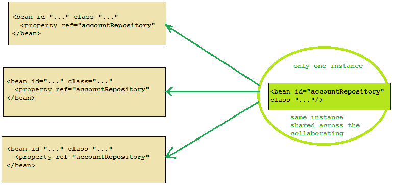

正如前图所示，相同的对象实例由 bean 定义`accountRepository`注入到同一 IoC 容器中的其他协作 bean。Spring 将所有单例 bean 实例存储在缓存中，所有协作 bean 都会从缓存中获取该对象依赖项。

# 原型 bean 作用域

在春季，任何定义为原型范围的 bean，每次被注入到其他协作 bean 时，都会为其创建一个 bean 实例。以下图示说明了 Spring 的原型范围：

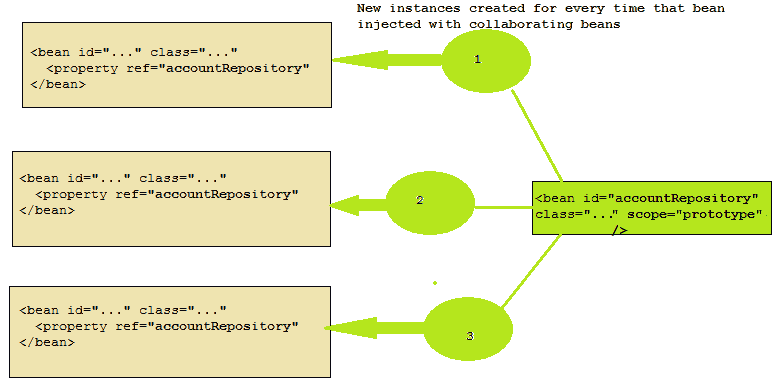

如前图所示，`accountRepository`类被配置为一个原型 bean，每次该 bean 被注入到其他 bean 时，容器都会为其创建一个新的实例。

# 会话 bean 范围

在 Web 环境中，为每个用户会话只创建一个新实例。

考虑以下 XML 配置的 bean 定义：

```java
    <bean id="..." class="..." scope="session"/> 
```

# 请求 bean 范围

在 Web 环境中，为每个请求只创建一个新实例。

考虑以下 XML 配置的 bean 定义：

```java
    <bean id="..." class="..." scope="request"/>
```

# Spring 中的其他范围

Spring 还有其他更专业的范围，如下所示：

+   WebSocket 范围

+   刷新范围

+   线程范围（已定义，但默认未注册）

Spring 还支持为 bean 创建自己的自定义范围。我们将在下一节中讨论这个问题。

# 自定义范围

我们可以为任何 bean 创建一个自定义范围，并将此范围注册到应用程序上下文中。让我们通过以下示例看看如何创建一个自定义 bean 范围。

# 创建自定义范围

在 Spring IoC 容器中创建您的客户范围时，Spring 提供了`org.springframework.beans.factory.config.Scope`接口。您必须实现此接口以创建自己的自定义范围。请看以下`MyThreadScope`类，作为 Spring IoC 容器中的自定义范围：

```java
    package com.packt.patterninspring.chapter5.bankapp.scope; 
    import java.util.HashMap; 
    import java.util.Map; 
    import org.springframework.beans.factory.ObjectFactory; 
    import org.springframework.beans.factory.config.Scope; 

    public class MyThreadScope implements Scope { 
      private final ThreadLocal<Object> myThreadScope = new
      ThreadLocal<Object>() { 
        protected Map<String, Object> initialValue() { 
          System.out.println("initialize ThreadLocal"); 
          return new HashMap<String, Object>(); 
         } 
       }; 
    @Override 
    public Object get(String name, ObjectFactory<?> objectFactory) { 
      Map<String, Object> scope = (Map<String, Object>)
      myThreadScope.get(); 
      System.out.println("getting object from scope."); 
      Object object = scope.get(name); 
      if(object == null) { 
        object = objectFactory.getObject(); 
        scope.put(name, object); 
      } 
      return object; 
    } 
    @Override 
    public String getConversationId() { 
      return null; 
    } 
    @Override 
    public void registerDestructionCallback(String name, Runnable
    callback) { 

    } 
    @Override 
    public Object remove(String name) { 
      System.out.println("removing object from scope."); 
      @SuppressWarnings("unchecked") 
      Map<String, Object> scope = (Map<String, Object>)
      myThreadScope.get(); 
      return scope.remove(name); 
     } 
     @Override 
     public Object resolveContextualObject(String name) { 
       return null; 
     } 
    } 
```

在前面的代码中，我们已经按照如下方式覆盖了`Scope`接口的多个方法：

+   **Object get(String name, ObjectFactory objectFactory)**: 此方法从底层范围返回对象

+   **Object remove(String name)**: 此方法从底层范围中移除对象

+   **void registerDestructionCallback(String name, Runnable destructionCallback)**: 此方法注册销毁回调，并在具有此自定义范围的指定对象销毁时执行

现在让我们看看如何将这个自定义范围注册到 Spring IoC 容器中，以及如何在 Spring 应用程序中使用它。

您可以使用`CustomScopeConfigurer`类声明性地将此自定义 bean 范围注册到 Spring IoC 容器中，如下所示：

```java
    <?xml version="1.0" encoding="UTF-8"?> 
    <beans  

      xsi:schemaLocation="http://www.springframework.org/schema/beans  
      http://www.springframework.org/schema/beans/spring-beans.xsd"> 
      <bean   class="org.springframework.beans.factory.
      config.CustomScopeConfigurer"> 
      <property name="scopes"> 
        <map> 
          <entry key="myThreadScope"> 
            <bean class="com.packt.patterninspring.chapter5.
            bankapp.scope.MyThreadScope"/> 
          </entry> 
        </map> 
      </property> 
     </bean> 
     <bean id="myBean" class="com.packt.patterninspring.chapter5.
      bankapp.bean.MyBean" scope="myThreadScope">  
      <property name="name" value="Dinesh"></property> 
    </bean> 
    </beans> 
```

如前配置文件所示，我已使用`CustomScopeConfigurer`类将名为`myThreadScope`的自定义 bean 范围注册到应用程序上下文中。我正在使用的这个自定义范围与 XML 配置中 bean 标签的 scope 属性类似，类似于单例或原型范围。

# 摘要

在阅读本章之后，您现在应该对容器中 Spring bean 的生命周期以及容器中的几种 bean 范围有一个很好的了解。您现在知道在容器中 Spring bean 的生命周期有三个阶段。第一个是初始化阶段。在这个阶段，Spring 从 XML、Java 或注解配置中加载 bean 定义。加载这些 bean 后，容器构建每个 bean，并对此 bean 应用后处理逻辑。

下一个阶段是使用阶段，在这个阶段中，Spring 的 bean 已经准备好被使用，Spring 展示了代理模式的魔法。

最后，最后一个阶段是销毁阶段。在这个阶段，当应用程序调用 Spring 的`ApplicationContext`的`close()`方法时，容器会调用每个 bean 的清理方法来释放资源。

在 Spring 中，你可以控制不仅 bean 的生命周期，还可以在容器中控制 bean 的作用域。Spring IoC 容器中 bean 的默认作用域是单例（Singleton），但你可以通过在 XML 中定义 bean 标签的 scope 属性或在 Java 中使用`@Scope`注解来覆盖默认作用域，以定义其他作用域原型。你还可以创建自己的自定义作用域，并将其注册到容器中。

现在我们将转向这本书的魔法章节，即 Spring **面向切面编程**（**AOP**）。正如依赖注入有助于将组件与其协作的其他组件解耦一样，AOP 有助于将你的应用程序组件与应用程序中跨越多个组件的任务解耦。让我们继续到下一章，介绍使用代理和装饰器设计模式的 Spring 面向切面编程。
