# Spring 面向切面编程（AOP）与代理和装饰者模式

在你开始阅读本章之前，我想与你分享一些事情；当我撰写本章时，我的妻子 Anamika 正在拍自拍并上传到几个社交媒体网站，如 Facebook 和 WhatsApp。她跟踪着*点赞*的数量，然而上传更多的照片会消耗更多的移动数据，而移动数据是需要付费的。我很少使用社交媒体，因为我更喜欢避免向互联网公司支付更多费用。每个月，互联网公司都知道他们应该向我们收取多少费用。现在考虑一下，如果互联网使用、总通话时长和账单计算都由我们精心计划和管理的会怎样？可能一些沉迷于互联网的用户会管理它，而我对此真的毫无头绪。

计算互联网使用和通话的账单是一个重要的功能，但对于大多数互联网用户来说，它仍然不是主要的。对于像我妻子这样的人，拍自拍、上传照片到社交媒体、在 YouTube 上观看视频，这些都是大多数互联网用户积极参与的事情。管理和计算他们的互联网账单对互联网用户来说是一种被动行为。

同样，一些企业应用模块就像我们互联网使用的互联网账单计算器。在应用中，有一些模块具有重要的功能，需要在应用的多个位置放置。但是，在每一个点显式调用这些功能是不太可能的。例如，日志记录、安全和事务管理对于你的应用来说很重要，但你的业务对象并没有积极参与其中，因为你的业务对象需要专注于它们被设计用于解决的业务领域问题，并将某些方面留给其他人处理。

在软件开发中，在应用中的特定点需要执行特定的任务。这些任务或函数被称为**跨切面关注点**。在一个应用中，所有的跨切面关注点都与该应用的业务逻辑分离。Spring 提供了一个模块**面向切面编程**（**AOP**）来将这些跨切面关注点从业务逻辑中分离出来。

如同第四章中所述的*使用依赖注入模式连接豆芽*，你学习了如何使用依赖注入来配置和解决应用中协作对象之间的依赖关系。而依赖注入（DI）推崇面向接口编程和将应用对象解耦，Spring AOP 则推崇将应用的业务逻辑与跨切面关注点解耦。

在我们的 bankapp 示例中，从一个账户向另一个账户转账是业务逻辑，但在我们的 bankapp 应用程序中记录此活动和确保交易安全是横切关注点。这意味着记录、安全和事务是方面应用的常见示例。

在本章中，您将探索 Spring 对方面的支持。它将涵盖以下要点：

+   Spring 中的代理模式

+   适配器设计模式用于处理运行时编织

+   装饰器设计模式

+   面向切面编程

+   AOP 解决的问题

+   核心 AOP 概念

+   定义切入点

+   实现建议

+   创建方面

+   理解 AOP 代理

在我们进一步讨论 Spring AOP 之前，让我们首先了解 Spring AOP 框架下实现的模式，并看看这些模式是如何应用的。

# Spring 中的代理模式

代理设计模式提供了一个具有另一个类功能的对象。此模式属于 GOF 设计模式的结构设计模式。根据 GOF 模式，*为另一个对象提供一个代理或占位符以控制对其的访问*。此设计模式的目的是为外部世界提供一个具有其功能的不同类。

# 在 Spring 中使用装饰器模式代理类

如您在第三章中看到的，“考虑结构和行为模式”，根据 GOF 书籍，*动态地为对象附加额外责任。装饰器为扩展功能提供了一种灵活的替代子类化的方法。* 此模式允许您在运行时或静态地动态地向单个对象添加和删除行为，而不会改变同一类中其他相关对象的现有行为。

在 Spring AOP 中，CGLIB 用于在应用程序中创建代理。CGLIB 代理通过在运行时生成目标类的子类来工作。Spring 配置此生成的子类将方法调用委托给原始目标--子类用于实现装饰器模式，编织建议。

Spring 提供了两种在应用程序中创建代理的方法。

+   CGLIB 代理

+   JDK 代理或动态代理

让我们看看以下表格：

| **JDK 代理** | **CGLIB 代理** |
| --- | --- |
| 也称为**动态代理** | NOT built into JDK |
| API 内置在 JDK 中 | 包含在 Spring JARs 中 |
| 要求：Java 接口（s） | 当接口不可用时使用 |
| 所有的代理接口 | 不能应用于 final 类或方法 |

让我们看看以下图：

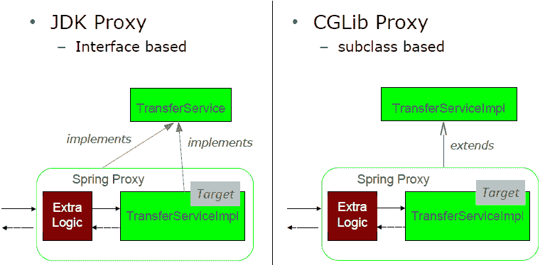

注意--CGLIB 代理有一个需要考虑的问题，那就是 final 方法不能被建议，因为它们不能被重写。

在下一节中，我们将学习更多关于横切关注点的内容。

# 什么是横切关注点？

在任何应用程序中，都存在一些在许多地方都需要使用的通用功能。但这个功能与应用程序的业务逻辑无关。假设你在应用程序的每个业务方法之前执行基于角色的安全检查。这里的安全性是一个横切关注点。它对于任何应用程序都是必需的，但从业务角度来看，它是一个简单的通用功能，我们必须在应用程序的许多地方实现。以下是企业应用程序的横切关注点的例子。

+   日志和跟踪

+   事务管理

+   安全性

+   缓存

+   错误处理

+   性能监控

+   定制业务规则

让我们看看我们如何通过使用 Spring AOP 的方面来实现这些横切关注点。

# 什么是面向切面编程？

如前所述，**面向切面编程**（**AOP**）使得横切关注点的模块化成为可能。它补充了**面向对象编程**（**OOP**），这是另一种编程范式。OOP 以类和对象作为关键元素，而 AOP 以方面作为关键元素。方面允许你在应用程序的多个位置对某些功能进行模块化。这种类型的功能被称为**横切关注点**。例如，安全性是应用程序中的一个横切关注点，因为我们必须在多个方法中应用它以实现安全性。同样，事务和日志记录也是应用程序的横切关注点，还有更多。让我们在下面的图中看看这些关注点是如何应用到业务模块中的：

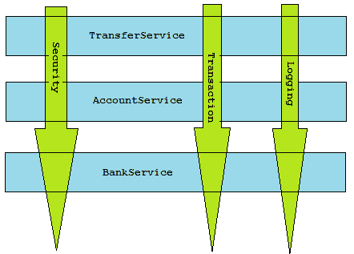

如前图所示，有三个主要业务模块，分别是**TransferService**、**AccountService**和**BankService**。所有业务模块都需要一些共同的功能，例如**安全性**、**事务**管理和**日志**。

让我们看看如果我们不使用 Spring AOP，在应用程序中我们会面临哪些问题。

# AOP 解决的问题

如前所述，方面使得横切关注点的模块化成为可能。所以如果你没有使用方面，那么某些横切功能的模块化是不可能的。这往往会导致横切功能与业务模块混合。如果你使用面向对象的一个共同原则来重用共同的功能，如安全性、日志和事务管理，*你需要使用*继承或组合。但是在这里使用继承可能会违反 SOLID 原则中的单一职责原则，并增加对象层次。此外，组合在应用程序中可能难以处理。这意味着，未能模块化横切关注点会导致以下两个主要问题：

+   代码纠缠

+   代码分散

# 代码纠缠

它是在应用中关注点的耦合。当横切关注点与应用的业务逻辑混合时，就会发生代码纠缠。它促进了横切模块和业务模块之间的紧密耦合。让我们看看以下代码，以了解代码纠缠的更多内容：

```java
    public class TransferServiceImpl implements TransferService { 
      public void transfer(Account a, Account b, Double amount) { 
        //Security concern start here 
        if (!hasPermission(SecurityContext.getPrincipal()) { 
          throw new AccessDeniedException(); 
        } 
        //Security concern end here 

        //Business logic start here 
        Account aAct = accountRepository.findByAccountId(a); 
        Account bAct = accountRepository.findByAccountId(b); 
        accountRepository.transferAmount(aAct, bAct, amount); 
        ... 
      } 
    } 
```

如前述代码所示，安全关注点代码（高亮显示）与应用的业务逻辑代码混合。这种情况是代码纠缠的一个例子。在这里，我们只包括了安全关注点，但在企业应用中，你必须实现多个横切关注点，如日志记录、事务管理等。在这种情况下，管理代码和修改代码将变得更加复杂，如图中所示可能会引起代码中的关键错误：

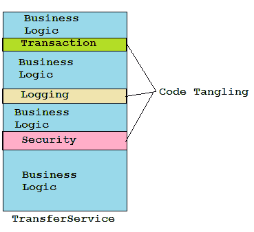

在前述图中，你可以看到有三个横切关注点分布在`TransferService`业务类和与`AccountService`业务逻辑混合的横切关注点逻辑中。这种关注点与应用逻辑之间的耦合称为**代码纠缠**。让我们看看如果我们使用方面处理横切关注点时，另一个主要问题是什么。

# 代码分散

这意味着相同的关注点分散在应用的不同模块中。代码分散促进了关注点代码在应用模块中的重复。让我们看看以下代码，以了解代码分散的更多内容：

```java
    public class TransferServiceImpl implements TransferService { 
      public void transfer(Account a, Account b, Double amount) { 
        //Security concern start here 
        if (!hasPermission(SecurityContext.getPrincipal()) { 
          throw new AccessDeniedException(); 
        } 
        //Security concern end here 

        //Business logic start here 
        ... 
      } 
    } 

    public class AccountServiceImpl implements AccountService { 
      public void withdrawl(Account a, Double amount) { 
        //Security concern start here 
        if (!hasPermission(SecurityContext.getPrincipal()) { 
          throw new AccessDeniedException(); 
        } 
        //Security concern end here 

        //Business logic start here 
        ... 
      } 
    } 
```

如前述代码所示，应用有两个模块，`TransferService`和`AccountService`。这两个模块都有相同的横切关注点代码用于安全。在两个业务模块中加粗高亮的代码是相同的，这意味着这里存在代码重复。以下图示说明了代码分散：

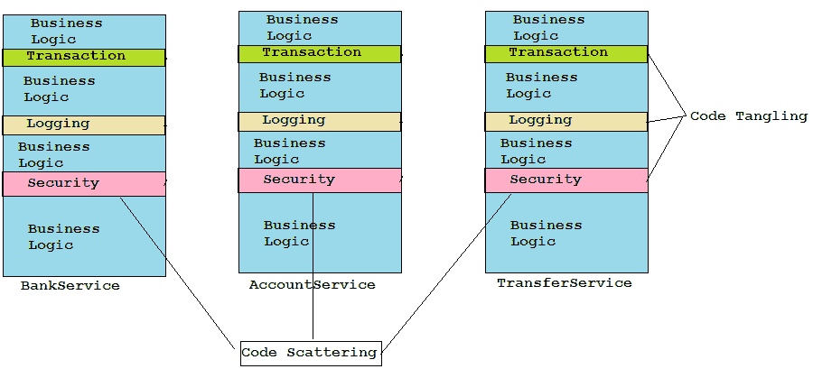

在前述图中，有三个业务模块**TransferService**、**AccountService**和**BankService**。每个业务模块都包含横切关注点，如**安全**、**日志**和**事务**管理。所有模块在应用中都有相同的关注点代码。实际上，这是在应用中关注点代码的重复。

Spring AOP 为 Spring 应用中的这两个问题提供了解决方案，即代码纠缠和代码分散。方面（Aspects）允许将横切关注点模块化，以避免纠缠并消除分散。让我们在下一节中看看 AOP 是如何解决这些问题的。

# AOP 如何解决问题

Spring AOP 允许您将横切关注点逻辑与主线应用逻辑分开。这意味着，您可以实现主线应用逻辑，并且只关注应用的核心问题。您还可以编写方面来实现您的横切关注点。Spring 提供了许多开箱即用的方面。在创建方面之后，您可以将这些方面（即横切行为）添加到应用程序的正确位置。让我们看看以下图示，它说明了 AOP 的功能：

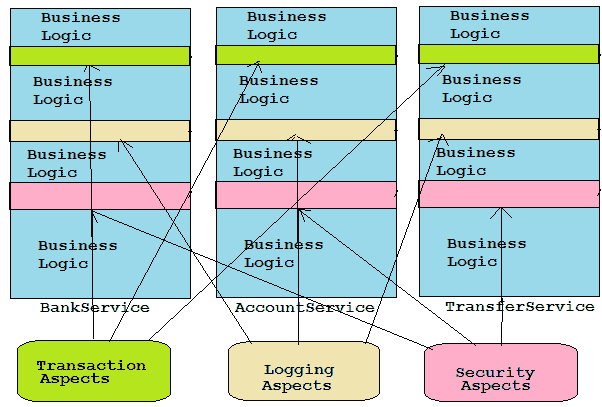

如前图所示，所有方面如安全、日志和事务方面都在应用程序中单独实现。我们已经将这些方面添加到应用程序的正确位置。现在，我们的应用逻辑与关注点分离了。让我们看看以下部分，它定义了核心 AOP 概念，并在您的应用程序中使用 AOP 的术语。

# 核心 AOP 术语和概念

与其他技术一样，AOP 有其自己的词汇。让我们开始学习一些核心 AOP 概念和术语。Spring 在 Spring AOP 模块中使用了 AOP 范式。但不幸的是，Spring AOP 框架中使用的术语是 Spring 特定的。这些术语用于描述 AOP 模块和功能，但它们并不直观。尽管如此，这些术语被用来理解 AOP。如果没有理解 AOP 习语，您将无法理解 AOP 功能。基本上，AOP 是用通知、切入点（pointcut）和连接点（join point）来定义的。让我们看看以下图示，它说明了核心 AOP 概念以及它们如何在框架中相互关联：

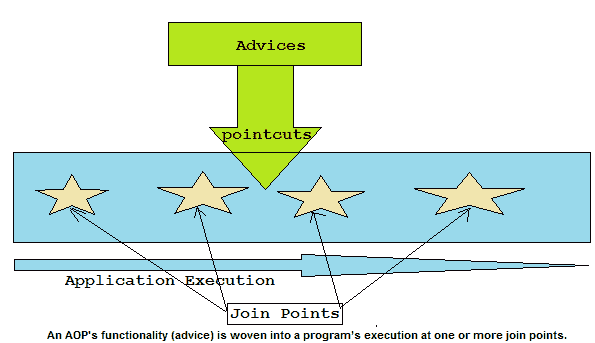

在前图中，您可以看到一个 AOP 功能，它被称为**通知**，并且它在多个点实现。这些点被称为**连接点**，它们是通过表达式定义的。这些表达式被称为**切入点**。让我们通过一个例子详细理解这些术语（还记得我妻子的互联网账单故事吗？）。

# 通知（Advice）

互联网公司根据互联网公司使用的数据使用量（以 MB 或 GB 为单位）来计算账单。互联网公司有一份客户名单，并且他们还为公司计算互联网账单。因此，计算账单并发送给客户是互联网公司的核心工作，而不是客户的工作。同样，每个方面都有自己的主要工作和完成这项工作的目的。在 AOP 中，方面的这项工作被称为通知。

如你所知，建议是一项工作，方面将执行这项工作，因此当思考何时执行这项工作以及这项工作将包含什么内容时，会涌现一些问题。这项工作是在调用业务方法之前执行吗？或者是在调用业务方法之后执行？或者是在方法调用前后都执行？或者是在业务方法抛出异常时执行。有时，这个业务方法也被称为**建议方法**。让我们看看 Spring 方面使用的以下五种建议类型：

+   **之前：** 建议的工作在调用建议方法之前执行。

如果建议抛出异常，目标将不会被调用——这是有效使用之前建议的情况。

+   **之后：** 建议的工作在建议方法完成之后执行，无论目标是否抛出异常。

+   **返回后：** 建议的工作在建议方法成功完成后执行。例如，如果业务方法返回而没有抛出异常。

+   **抛出后：** 如果建议方法通过抛出异常退出，建议的工作将执行。

+   **环绕：** 这是 Spring AOP 中最强大的建议之一，这个建议围绕建议方法，在建议方法被调用之前和之后提供一些建议的工作。

简而言之，建议的工作代码将在每个选定的点上执行，即连接点，让我们来看看 AOP 的另一个术语。

# 连接点

互联网公司为许多客户提供互联网服务。每个客户都有一个互联网套餐，这个套餐需要用于他们的账单计算。借助每个互联网套餐，公司可以潜在地为所有客户计算互联网账单。同样，你的应用程序可能有多个地方可以应用建议。这些应用程序中的地方被称为**连接点**。连接点是在程序执行中的一个点，例如方法调用或异常抛出。在这些点上，Spring 方面会在你的应用程序中插入关注的功能。让我们看看 AOP 如何知道连接点，并讨论 AOP 概念的另一个术语。

# 切入点

互联网公司根据互联网数据的使用情况（例如，我妻子需要更多的数据）制定了许多互联网套餐，因为任何互联网公司都无法为所有客户提供相同的套餐或为每个客户提供一个独特的套餐。相反，每个套餐都分配给客户的一个子集。同样，建议也不必应用到应用程序中的所有连接点上。你可以定义一个表达式来选择应用程序中的一个或多个连接点。这个表达式被称为**切入点**。它有助于缩小方面建议的连接点。让我们看看 AOP 的另一个术语，即方面。

# 方面

一家互联网公司知道哪个客户有什么互联网套餐。基于这些信息，互联网公司计算互联网账单并发送给客户。在这个例子中，互联网公司是一个方面，互联网套餐是切入点，客户是连接点，公司计算互联网账单是一个通知。同样，在你的应用中，方面是一个封装了切入点和通知的模块。方面知道它做什么；在哪里以及何时在应用中执行。让我们看看 AOP 是如何将方面应用于业务方法的。

# 线程编织

**编织**是一种将方面与业务代码结合的技术。这是一个通过创建新的代理对象将方面应用于目标对象的过程。编织可以在编译时、类加载时或在运行时进行。Spring AOP 通过使用代理模式使用运行时编织。

你在 AOP 中看到了很多术语。无论你学习任何 AOP 框架，无论是 AspectJ 还是 Spring AOP，你都必须了解这些术语。Spring 使用了 AspectJ 框架来实现 Spring AOP 框架。Spring AOP 支持 AspectJ 的有限功能。Spring AOP 提供基于代理的 AOP 解决方案。Spring 只支持方法连接点。现在你对 Spring AOP 及其工作原理有了基本了解，让我们继续探讨如何在 Spring 的声明式 AOP 模型中定义切入点。

# 定义切入点

如前所述，切入点用于定义应用通知的点。因此，切入点是应用中方面最重要的元素之一。让我们了解如何定义切入点。在 Spring AOP 中，我们可以使用表达式语言来定义切入点。Spring AOP 使用 AspectJ 的点切表达式语言来选择应用通知的位置。Spring AOP 支持 AspectJ 中可用的切入点设计器的一个子集，因为正如你所知，Spring AOP 是基于代理的，某些设计器不支持基于代理的 AOP。让我们看看以下表格中 Spring AOP 支持的设计器。

| **Spring 支持的 AspectJ 设计器** | **描述** |
| --- | --- |
| execution | 它通过方法执行匹配连接点，是 Spring AOP 支持的初级切入点设计器。 |
| within | 它通过限制在特定类型内匹配连接点。 |
| this | 它限制匹配到 bean 引用是给定类型实例的连接点。 |
| target | 它限制匹配到目标对象是给定类型的连接点。 |
| args | 它限制匹配到参数是给定类型实例的连接点。 |
| `@target` | 它限制匹配到目标对象具有给定类型注解的连接点。 |
| `@args` | 它限制匹配到运行时实际参数的类型具有给定类型注解的连接点。 |
| `@within` | 它限制匹配到目标对象声明的类型具有给定类型注解的连接点。 |
| `@annotation` | 它将匹配限制在具有给定注解的连接点的主语上。 |

如前所述，Spring 支持切入点设计器，其中 `execution` 是主要切入点设计器。因此，在这里我将向您展示如何使用 `execution` 设计器定义切入点。让我们看看如何在应用程序中编写切入点表达式。

# 编写切入点

我们可以使用 `execution` 设计器编写切入点如下：

+   **execution(<方法模式>)**: 该方法必须匹配以下定义的模式

+   **可以使用以下运算符连接起来创建组合切入点**: `&& (与)`, `|| (或)`, `! (非)`

+   **方法模式**：以下为方法模式：

    +   `[Modifiers] ReturnType [ClassType]`

    +   `MethodName ([Arguments]) [throws ExceptionType]`

在前面的方法模式中，方括号 `[ ]` 内的值，即修饰符、`ClassType`、参数和异常都是可选值。在使用 `execution` 设计器定义每个切入点时，没有必要定义它。没有方括号的值，如 `ReturnType` 和 `MethodName` 是必须定义的。

让我们定义一个 `TransferService` 接口：

```java
    package com.packt.patterninspring.chapter6.bankapp.service; 
    public interface TransferService { 
      void transfer(String accountA, String accountB, Long amount); 
    } 
```

`TransferService` 是用于从一个账户转移到另一个账户的金额的服务。假设您想编写一个触发 `TransferService` 的 `transfer()` 方法的日志方面。以下图示了一个可以用于在 `transfer()` 方法执行时应用建议的切入点表达式：

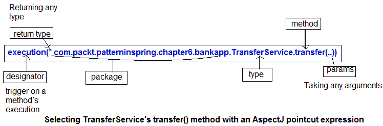

如前图所示，您可以看到，我使用了 `execution()` 设计器来选择 `TransferService` 的 `transfer()` 方法。在前图的先前表达式中，我在表达式的开头使用了星号。这意味着该方法可以返回任何类型。在星号之后，我指定了完全限定的类名和 `transfer()` 方法名。作为方法参数，我使用了双点 (..)，这意味着切入点可以选择名为 `transfer()` 的方法，没有参数或任何数量的参数。

让我们看看以下一些更多的切入点表达式来选择连接点：

+   任何类或包：

    +   **execution(void transfer*(String))**: 任何以 `transfer` 开头，接受单个 `String` 参数且返回类型为 `void` 的方法

    +   **execution(* transfer(*))**: 任何名为 `transfer()` 的方法，接受单个参数

    +   **execution(* transfer(int, ..))**: 任何名为 `transfer` 的方法，其第一个参数为整数（`".."` 表示可能跟有零个或多个参数）

+   限制为类：

    +   `execution(void com.packt.patterninspring.chapter6.bankapp.service.TransferServiceImpl.*(..))`: `TransferServiceImpl` 类中的任何无返回值的方法，包括任何子类，但如果使用了不同的实现，则会被忽略。

+   限制为接口：

    +   `execution(void com.packt.patterninspring.chapter6.bankapp.service.TransferService.transfer(*))`: 任何接受一个参数的 void `transfer()` 方法，在实现 `TransferService` 的任何对象中，这是一个更灵活的选择——如果实现发生变化，它仍然可以工作。

+   使用注解

    +   `execution(@javax.annotation.security.RolesAllowed void transfer*(..))`: 任何以 `transfer` 开头并带有 `@RolesAllowed` 注解的 void 方法。

+   与包一起工作

    +   `execution(* com..bankapp.*.*(..))`: `com` 和 `bankapp` 之间有一个目录

    +   `execution(* com.*.bankapp.*.*(..))`: `bankapp` 和 `com` 之间可能有多个目录

    +   `execution(* *..bankapp.*.*(..))`: 任何名为 `bankapp` 的子包

现在你已经看到了编写切入点的基础，让我们看看如何编写通知并声明使用这些切入点的方面

# 创建方面

如我之前所说，*方面* 是 AOP 中最重要的术语之一。方面将应用中的切入点和建议合并。让我们看看如何在应用中定义方面。

你已经将 `TransferService` 接口定义为你的方面切入点的主题。现在让我们使用 AspectJ 注解来创建一个方面。

# 使用注解定义方面

假设在你的银行应用中，你想要为审计和跟踪生成一个资金转账服务的日志，以了解客户的行为。一个业务如果不了解其客户就不会成功。无论你从商业的角度考虑什么，审计都是必要的，但它并不是业务本身的中心功能；它是一个单独的关注点。因此，将审计定义为应用于转账服务的方面是有意义的。让我们看看以下代码，它展示了定义这个关注点的 `Auditing` 类：

```java
    package com.packt.patterninspring.chapter6.bankapp.aspect; 

    import org.aspectj.lang.annotation.AfterReturning; 
    import org.aspectj.lang.annotation.AfterThrowing; 
    import org.aspectj.lang.annotation.Aspect; 
    import org.aspectj.lang.annotation.Before; 

    @Aspect 
    public class Auditing { 

      //Before transfer service 
      @Before("execution(* com.packt.patterninspring.chapter6.bankapp.
      service.TransferService.transfer(..))")  
      public void validate(){ 
        System.out.println("bank validate your credentials before 
        amount transferring"); 
      } 

      //Before transfer service 
      @Before("execution(* com.packt.patterninspring.chapter6.bankapp.
      service.TransferService.transfer(..))")  
      public void transferInstantiate(){ 
        System.out.println("bank instantiate your amount 
        transferring"); 
      } 

      //After transfer service 
      @AfterReturning("execution(* com.packt.patterninspring.chapter6.
      bankapp.service.TransferService.transfer(..))") 
      public void success(){ 
        System.out.println("bank successfully transferred amount"); 
      } 

      //After failed transfer service 
      @AfterThrowing("execution(* com.packt.patterninspring.chapter6.
      bankapp.service.TransferService.transfer(..))") 
      public void rollback() { 
        System.out.println("bank rolled back your transferred amount"); 
      } 
    } 
```

正如你所见，`Auditing` 类被 `@Aspect` 注解所标注。这意味着这个类不仅仅是一个 Spring Bean，它还是应用的一个方面。`Auditing` 类有一些方法，这些方法就是通知，并在这些方法中定义了一些逻辑。正如我们所知，在开始从一个账户向另一个账户转账之前，银行会验证（`validate()`）使用凭证，然后实例化（`transferInstantiate()`）这个服务。验证成功（`success()`）后，金额被转账，银行会审计它。但如果金额转账在任何情况下失败，那么银行应该回滚（`rollback()`）这笔金额。

正如你所见，`Auditing` 方面的所有方法都被注解了通知注解，以指示这些方法应该在何时被调用。Spring AOP 提供了五种类型的通知注解来定义通知。让我们在以下表中查看：

| **注解** | **通知** |
| --- | --- |
| `@Before` | 它用于前置通知，`advice` 的方法在建议方法被调用之前执行。 |
| `@After` | 它用于后建议，建议的方法在受建议方法正常或异常执行后执行。 |
| `@AfterReturning` | 它用于返回后建议，建议的方法在受建议方法成功完成后执行。 |
| `@AfterThrowing` | 它用于抛出后建议，建议的方法在方法通过抛出异常异常终止后执行。 |
| `@Around` | 它用于环绕建议，建议的方法在调用受建议方法之前和之后执行。 |

让我们看看建议的实现以及它们如何在应用程序中工作。

# 建议实现

如您所知，Spring 提供了五种类型的建议，让我们逐一看看它们的工作流程。

# 建议类型 - 在前

让我们看看以下关于前建议的图示。此建议在目标方法之前执行：

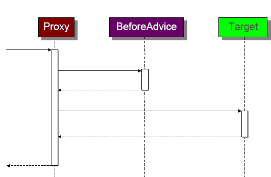

如您在图中看到的，前建议首先执行，然后调用**目标**方法。正如我们所知，Spring AOP 是基于代理的。因此，创建了一个目标类的**代理**对象。它是基于代理设计模式和装饰器设计模式。

# 在前建议示例

让我们看看`@Before`注解的使用：

```java
    //Before transfer service 
    @Before("execution(* com.packt.patterninspring.chapter6.
    bankapp.service.TransferService.transfer(..))")  
    public void validate(){ 
      System.out.println("bank validate your credentials before amount 
      transferring"); 
    } 

    //Before transfer service 
    @Before("execution(* com.packt.patterninspring.chapter6.
    bankapp.service.TransferService.transfer(..))")  
    public void transferInstantiate(){ 
      System.out.println("bank instantiate your amount transferring"); 
    } 
```

注意 - 如果建议抛出异常，则目标方法不会被调用 - 这是有效使用前建议的情况。

现在您已经看到了前建议，让我们看看另一种类型的建议。

# 建议类型：返回后

让我们看看以下关于返回后建议的图示。此建议在**目标**方法成功执行后执行：

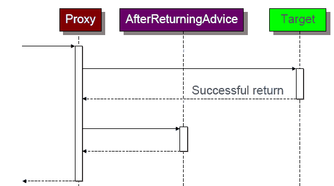

如您在图中看到的，返回后建议在目标成功返回后执行。如果目标在应用程序中抛出任何异常，则此建议将不会执行。

# 返回后建议示例

让我们看看`@AfterReturning`注解的使用：

```java
    //After transfer service 
    @AfterReturning("execution(* com.packt.patterninspring.chapter6.
    bankapp.service.TransferService.transfer(..))") 
    public void success(){ 
      System.out.println("bank successfully transferred amount"); 
    } 
```

现在您已经看到了返回后建议，让我们转向 Spring AOP 中的另一种类型建议。

# 建议类型：抛出后

让我们看看以下关于抛出后建议的图示。此建议在目标方法异常终止后执行。这意味着`target`方法抛出任何异常，然后此建议将被执行。请参考以下图表：

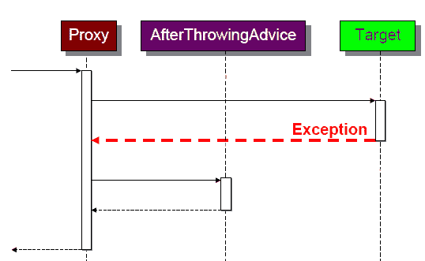

如您在图中看到的，抛出后建议在目标抛出异常后执行。如果目标在应用程序中没有抛出任何异常，则此建议将不会执行。

# 抛出后建议示例

让我们看看`@AfterThrowing`注解的使用：

```java
    //After failed transfer service 
    @AfterThrowing("execution(* com.packt.patterninspring.chapter6.
    bankapp.service.TransferService.transfer(..))") 
    public void rollback() { 
      System.out.println("bank rolled back your transferred amount"); 
    } 
```

您还可以使用带有抛出属性的`@AfterThrowing`注解，它仅在抛出正确的异常类型时调用建议：

```java
    //After failed transfer service 
    @AfterThrowing(value = "execution(*       
    com.packt.patterninspring.chapter6.
    bankapp.service.TransferService.transfer(..))", throwing="e")) 
    public void rollback(DataAccessException e) { 
      System.out.println("bank rolled back your transferred amount"); 
    } 
```

每当`TransferService`类抛出`DataAccessException`类型的异常时，都会执行。

`@AfterThrowing` 建议不会阻止异常的传播。然而，它可以抛出不同类型的异常。

# 建议类型：在后

让我们看看下面的图来了解 **AfterAdvice**。这个建议在 **Target** 方法正常或异常终止后执行。无论 **Target** 方法是否抛出异常或无异常执行，都没有关系：

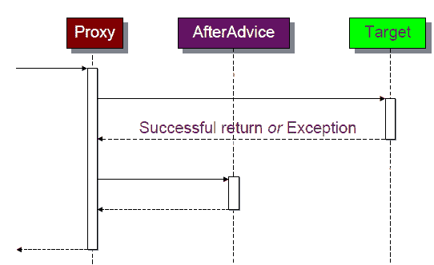

如图中所示，在 `target` 方法通过抛出任何异常或正常终止后，将执行后建议。

# After 建议 示例

让我们看看 `@After` 注解的使用：

```java
    //After transfer service 
    @After ("execution(* com.packt.patterninspring.chapter6.
    bankapp.service.TransferService.transfer(..))") 
    public void trackTransactionAttempt(){ 
      System.out.println("bank has attempted a transaction"); 
    } 
```

使用 `@After` 注解，无论目标是否抛出异常，都会被调用。

# 建议类型 - Around

让我们看看下面的图来了解 **AroundAdvice**。这个建议在调用 **Target** 方法之前和之后都执行。这是 Spring AOP 中非常强大的建议。Spring 框架的许多功能都是通过使用这个建议实现的。这是 Spring 中唯一一个具有停止或继续目标方法执行能力的建议。请参考以下图表：

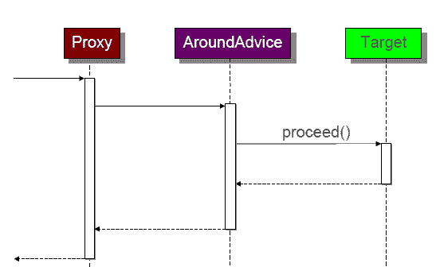

如前图所示，**AroundAdvice** 执行了两次，第一次是在被建议的方法执行之前，第二次是在被建议的方法被调用之后。此外，这个建议还调用了 `proceed()` 方法来在应用程序中执行被建议的方法。让我们看看下面的例子：

# Around 建议示例

让我们看看 `@Around` 注解的使用：

```java
    @Around(execution(*    com.packt.patterninspring.chapter6.
    bankapp.service.TransferService.createCache(..))) 
    public Object cache(ProceedingJoinPoint point){ 
    Object value = cacheStore.get(CacheUtils.toKey(point)); 
    if (value == null) { 
      value = point.proceed(); 
      cacheStore.put(CacheUtils.toKey(point), value); 
    } 
    return value; 
   } 
```

在这里，我使用了 `@Around` 注解和一个 `ProceedingJoinPoint`，它继承自 Join Point 并添加了 `proceed()` 方法。正如您在这个例子中所看到的，这个建议只有在值尚未在缓存中时才会继续执行目标。

您已经看到了如何在应用程序中使用注解实现建议，如何创建方面以及如何通过注解定义切入点。在这个例子中，我们使用 Auditing 作为方面类，并且它被 `@Aspect` 注解所标记，但如果您没有启用 Spring 的 AOP 代理行为，这个注解将不起作用。

让我们看看下面的 Java 配置文件，`AppConfig.java`，您可以通过在类级别应用 `@EnableAspectJAutoProxy` 注解来开启自动代理：

```java
    package com.packt.patterninspring.chapter6.bankapp.config; 

    import org.springframework.context.annotation.Bean; 
    import org.springframework.context.annotation.ComponentScan; 
    import org.springframework.context.annotation.Configuration; 
    import org.springframework.context.annotation.
      EnableAspectJAutoProxy; 

    import com.packt.patterninspring.chapter6.bankapp.aspect.Auditing; 

    @Configuration 
    @EnableAspectJAutoProxy 
    @ComponentScan 
    public class AppConfig { 
      @Bean 
      public Auditing auditing() { 
         return new Auditing(); 
      } 
   } 
```

如果您正在使用 XML 配置，让我们看看如何在 Spring 中连接您的豆子以及如何通过使用 Spring AOP 命名空间中的 `<aop:aspectj-autoproxy>` 元素来启用 Spring AOP 功能：

```java
    <?xml version="1.0" encoding="UTF-8"?> 
    <beans  

      xsi:schemaLocation="http://www.springframework.org/schema/aop 
      http://www.springframework.org/schema/aop/spring-aop.xsd 
      http://www.springframework.org/schema/beans 
      http://www.springframework.org/schema/beans/spring-beans.xsd 
      http://www.springframework.org/schema/context 
      http://www.springframework.org/schema/context/spring-
      context.xsd"> 
      <context:component-scan base- 
      package="com.packt.patterninspring.chapter6.bankapp" /> 
      <aop:aspectj-autoproxy /> 
      <bean class="com.packt.patterninspring.chapter6.
      bankapp.aspect.Auditing" /> 
    </beans> 
```

让我们看看如何在 Spring XML 配置文件中声明方面。

# 使用 XML 配置定义方面

如我们所知，我们可以在基于 XML 的配置中配置豆子，同样您也可以在 XML 配置中声明方面。Spring 提供了另一个 AOP 命名空间，它提供了许多用于在 XML 中声明方面的元素，让我们在以下表中看看：

| **注解** | **并行 XML 元素** | **XML 元素的目的** |
| --- | --- | --- |
| `@Before` | `<aop:before>` | 它定义了前建议。 |
| `@After` | `<aop:after>` | 它定义了后建议。 |
| `@AfterReturning` | `<aop:after-returning>` | 它定义了返回后通知。 |
| `@AfterThrowing` | `<aop:after-throwing>` | 它定义了抛出后通知。 |
| `@Around` | `<aop:around>` | 它定义了环绕通知。 |
| `@Aspect` | `<aop:aspect>` | 它定义了一个方面。 |
| `@EnableAspectJAutoProxy` | `<aop:aspectj-autoproxy>` | 它通过 `@AspectJ` 启用注解驱动的方面。 |
| `@Pointcut` | `<aop:pointcut>` | 它定义了一个切入点。 |
| -- | `<aop:advisor>` | 它定义了 AOP 顾问 |
| -- | `<aop:config>` | 它是顶级 AOP 元素 |

正如你在前面的表中所见，许多 AOP 命名空间元素与基于 Java 的配置中可用的相应注解并行。让我们看看以下基于 XML 的配置中的相同示例，首先看看方面类 `Auditing`。让我们移除以下代码中显示的所有 AspectJ 注解：

```java
    package com.packt.patterninspring.chapter6.bankapp.aspect; 

    public class Auditing { 
      public void validate(){ 
        System.out.println("bank validate your credentials before 
        amount transferring"); 
      } 
      public void transferInstantiate(){ 
        System.out.println("bank instantiate your amount 
        transferring"); 
      } 
      public void success(){ 
        System.out.println("bank successfully transferred amount"); 
      } 
      public void rollback() { 
        System.out.println("bank rolled back your transferred amount"); 
      } 
    } 
```

正如你在前面的代码中所见，现在我们的方面类没有表明它是一个方面类。它是一个基本的 Java POJO 类，包含一些方法。让我们在下一节中看看如何在 XML 配置中声明通知：

```java
    <aop:config> 
      <aop:aspect ref="auditing"> 
        <aop:before pointcut="execution(*    
        com.packt.patterninspring.chapter6.bankapp.
        service.TransferService.transfer(..))"  
        method="validate"/> 
        <aop:before pointcut="execution(*  
        com.packt.patterninspring.chapter6.bankapp.
        service.TransferService.transfer(..))"  
        method="transferInstantiate"/> 
        <aop:after-returning pointcut="execution(*  
        com.packt.patterninspring.chapter6.
        bankapp.service.TransferService.transfer(..))"  
        method="success"/> 
        <aop:after-throwing pointcut="execution(*  
        com.packt.patterninspring.chapter6.bankapp.
        service.TransferService.transfer(..))"  
        method="rollback"/> 
      </aop:aspect> 
    </aop:config> 
```

正如你所见，`<aop-config>` 使用了一个顶级元素。在 `<aop:config>` 中，你声明其他元素，如 `<aop:aspect>`，这个元素有 `ref` 属性，它引用了 POJO 实例 Auditing。这表明 `Auditing` 是应用程序中的一个方面类。现在 `<aop-aspect>` 元素有通知和切入点元素。所有逻辑都与我们在 Java 配置中定义的相同。

让我们在下一节中看看 Spring 如何创建 AOP 代理。

# 理解 AOP 代理

如你所知，Spring AOP 是基于代理的。这意味着 Spring 创建代理来在业务逻辑（即 `target` 对象）之间编织方面。它是基于代理和装饰器设计模式的。让我们看看 `TransferServiceImpl` 类作为 `TransferService` 接口的一个实现：

```java
    package com.packt.patterninspring.chapter6.bankapp.service; 
    import org.springframework.stereotype.Service; 
    public class TransferServiceImpl implements TransferService { 
      @Override 
      public void transfer(String accountA, String accountB, Long 
      amount) { 
        System.out.println(amount+" Amount has been tranfered from 
        "+accountA+" to "+accountB); 
      } 
    } 
```

调用者通过对象引用直接调用此服务（`transfer()` 方法），让我们看看以下图解以了解更多：

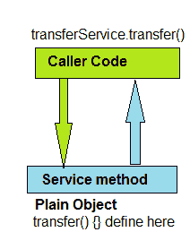

正如你所见，调用者可以直接调用服务并执行分配给它的任务。

但你将这个 `TransferService` 声明为方面的目标。由于这样做，事情略有变化。现在这个由代理包装的类，客户端代码实际上并不直接调用这个服务，而是通过这个代理进行路由。让我们看看下面的图解。

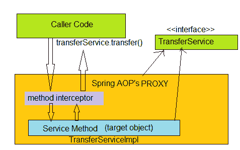

正如你在前面的图解中所见，Spring 按以下顺序将 AOP 代理应用于对象：

1.  Spring 创建了一个编织方面和目标的代理。

1.  代理也实现了目标接口，即 `TransferServive` 接口。

1.  所有对传输服务方法 `transfer()` 的调用都通过代理拦截器路由。

1.  匹配的通知被执行。

1.  然后 `target` 方法被执行。

如前所述列表，这是当你调用由 Spring 创建的代理的方法时的流程。

您在本章中已经看到了 Spring AOP 框架，它实际上使用基于代理的方面织入实现了 AspectJ 框架的一部分。我认为，这为 Spring AOP 提供了很好的知识。

# 摘要

在本章中，我们看到了 Spring AOP 框架并使用了该模块背后的设计模式。AOP 是一个非常强大的范式，它补充了面向对象编程。**面向切面编程**（**AOP**）模块化了跨切面关注点，如日志记录、安全和事务。方面是一个带有 `@Aspect` 注解的 Java 类。它定义了一个包含跨切面行为的模块。此模块与应用程序的业务逻辑分离。我们可以在应用程序中与其他业务模块一起重用它，而无需进行任何更改。

在 Spring AOP 中，行为被实现为一个建议方法。您在 Spring 中已经学到，有五种类型，分别是 Before、AfterThrowing、AfterReturning、After 和 Around。Around 建议是一个非常强大的建议，通过使用 Around 建议实现了有趣的功能。您已经学到了如何使用加载时织入来织入这些建议。

您已经看到了如何在 Spring 应用程序中声明切入点，切入点选择建议应用的位置。

现在，我们将转向关键部分，看看 Spring 如何在后台工作以连接数据库并读取应用程序的数据。从下一章开始，您将看到如何使用 Spring 中的 JDBC 模板构建应用程序。
