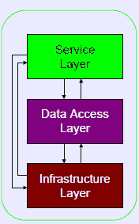
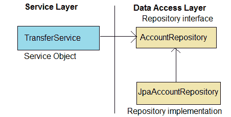
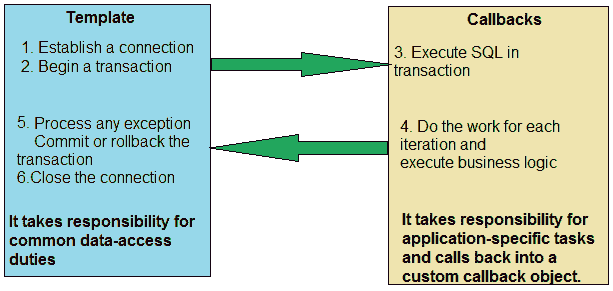
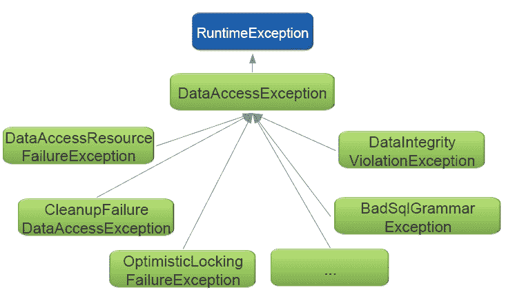

# 使用 Spring 和 JDBC 模板模式访问数据库

在前面的章节中，你学习了关于 Spring 核心模块的知识，如 Spring IoC 容器、DI 模式、容器生命周期以及使用的设计模式。你还看到了 Spring 如何使用 AOP 来施展魔法。现在是时候进入真实 Spring 应用程序的战场，使用持久化数据了。你还记得大学时期你第一次处理数据库访问的应用程序吗？那时，你可能不得不编写无聊的样板代码来加载数据库驱动程序、初始化你的数据访问框架、打开连接、处理各种异常，以及关闭连接。你还必须非常小心这段代码。如果出了任何问题，即使你在这无聊的代码上投入了大量时间，你也不会在你的应用程序中建立数据库连接。

因为我们总是试图使事情变得更好、更简单，所以我们必须关注解决数据访问中繁琐工作的解决方案。Spring 为数据访问中的繁琐和无聊工作提供了一个解决方案--它移除了数据访问的代码。Spring 提供了数据访问框架，以集成各种数据访问技术。它允许你直接使用 JDBC 或任何 **对象关系映射**（**ORM**）框架，如 Hibernate，以持久化你的数据。Spring 处理你应用程序中数据访问工作的所有底层代码；你只需编写你的 SQL、应用程序逻辑，并管理你应用程序的数据，而不是花费时间编写创建和关闭数据库连接的代码，等等。

现在，你可以选择任何技术，例如 JDBC、Hibernate、**Java 持久性 API**（**JPA**）或其他技术来持久化你应用程序的数据。无论你选择什么，Spring 都为你应用程序提供对这些技术的支持。在本章中，我们将探讨 Spring 对 JDBC 的支持。它将涵盖以下内容：

+   设计数据访问的最佳方法

+   实现模板设计模式

+   传统 JDBC 的问题

+   使用 Spring 的 `JdbcTemplate` 解决问题

+   配置数据源

+   使用对象池设计模式来维护数据库连接

+   通过 DAO 模式抽象数据库访问

+   与 `JdbcTemplate` 一起工作

+   Jdbc 回调接口

+   在应用程序中配置 `JdbcTemplate` 的最佳实践

在我们继续讨论 JDBC 和模板设计模式之前，让我们首先看看在分层架构中定义数据访问层最佳的方法。

# 设计数据访问的最佳方法

在前面的章节中，您已经看到 Spring 的一个目标是通过遵循 OOPs 编码到接口的原则之一来开发应用程序。任何企业应用程序都需要读取数据并将数据写入任何类型的数据库，为了满足这一需求，我们必须编写持久化逻辑。Spring 允许您避免在应用程序的所有模块中分散持久化逻辑。为此，我们可以为数据访问和持久化逻辑创建不同的组件，这个组件被称为**数据访问对象**（**DAO**）。让我们看看，在以下图中，创建分层应用程序模块的最佳方法：



如前图所示，为了更好的方法，许多企业应用程序由以下三个逻辑层组成：

+   **服务层**（或应用程序层）：应用程序的这一层公开高级应用程序功能，如用例和业务逻辑。所有应用程序服务都定义在这里。

+   **数据访问层**：应用程序的这一层定义了对应用程序数据存储（如关系型或 NoSQL 数据库）的接口。这一层包含具有数据访问逻辑并将数据持久化到应用程序中的类和接口。

+   **基础设施层**：应用程序的这一层向其他层公开低级服务，例如通过使用数据库 URL、用户凭据等来配置 DataSource。此类配置属于这一层。

在前图中，您可以看到**服务层**与**数据访问层**协作。为了避免应用程序逻辑和数据访问逻辑之间的耦合，我们应该通过接口公开它们的功能，因为接口促进了协作组件之间的解耦。如果我们通过实现接口使用数据访问逻辑，我们可以在不修改**服务层**中的应用程序逻辑的情况下，为应用程序配置任何特定的数据访问策略。以下图显示了设计我们的数据访问层的正确方法：



如前图所示，您的应用程序服务对象，即**TransferService**，不处理自己的数据访问。相反，它们将数据访问委托给存储库。存储库的接口，即您应用程序中的**AccountRepository**，使其与服务对象松散耦合。您可以配置任何实现变体——无论是**AccountRepository**的 Jpa 实现（**JpaAccountRepository**），还是**AccountRepository**的 Jdbc 实现（**JdbcAccountRepository**）。

Spring 不仅在分层架构中不同层工作的应用组件之间提供松耦合，还帮助企业分层架构应用管理资源。让我们看看 Spring 如何管理资源，以及 Spring 使用什么设计模式来解决资源管理问题。

# 资源管理问题

让我们通过一个真实例子来理解资源管理问题。你肯定在线上点过披萨。如果是这样，从下单到披萨送达的过程中涉及哪些步骤？这个过程有很多步骤——我们首先访问披萨公司的在线门户，选择披萨的大小和配料。然后，我们下订单并结账。订单由最近的披萨店接受；他们相应地准备我们的披萨，相应地加上配料，将披萨包在袋子里，送餐员来到你的地方并将披萨交给你，最后，你和你的朋友一起享用披萨。尽管这个过程有很多步骤，但你只积极参与其中的一两个步骤。披萨公司负责烹饪披萨并顺利交付。你只在你需要的时候参与，其他步骤由披萨公司负责。正如你在例子中看到的，管理这个过程涉及许多步骤，我们还需要相应地分配资源到每个步骤，以确保它被视为一个完整的任务，没有任何流程中断。这是一个强大的设计模式——模板方法模式的完美场景。Spring 框架通过实现这个模板设计模式来处理应用 DAO 层中的此类场景。让我们看看如果我们不使用 Spring，而是使用传统应用会面临什么问题。

在传统应用中，我们使用 JDBC API 从数据库访问数据。这是一个简单的应用，我们使用 JDBC API 访问和持久化数据，对于这个应用，以下步骤是必需的：

1.  定义连接参数。

1.  访问数据源，并建立连接。

1.  开始一个事务。

1.  指定 SQL 语句。

1.  声明参数，并提供参数值。

1.  准备并执行语句。

1.  设置循环以遍历结果。

1.  为每个迭代执行工作——执行业务逻辑。

1.  处理任何异常。

1.  提交或回滚事务。

1.  关闭连接、语句和结果集。

如果你使用 Spring 框架来处理相同的应用程序，那么你必须编写前面列表中某些步骤的代码，而 Spring 则负责所有涉及低级过程（如建立连接、开始事务、处理数据层中的任何异常和关闭连接）的步骤。Spring 通过使用模板方法设计模式来管理这些步骤，我们将在下一节中学习。

# 实现模板设计模式

在一个操作中定义算法的框架，将一些步骤推迟到子类中。模板方法允许子类重新定义算法的某些步骤，而不改变算法的结构。

-GOF 设计模式

我们在第三章“考虑结构和行为模式”中讨论了模板方法设计模式。它被广泛使用，属于 GOF 设计模式家族的结构设计模式。此模式定义了算法的轮廓或框架，并将细节留给后续的具体实现。此模式隐藏了大量样板代码。Spring 提供了许多模板类，如`JdbcTemplate`、`JmsTemplate`、`RestTemplate`和`WebServiceTemplate`。大多数情况下，此模式隐藏了之前在披萨示例中讨论的低级资源管理。

在示例中，过程是从在线门户订购外卖披萨。披萨公司为每位顾客遵循一些固定的步骤，例如接收订单、准备披萨、根据顾客的规格添加配料，并将其送到顾客的地址。我们可以添加这些步骤，或将这些步骤定义为特定的算法。然后，系统可以相应地实施此算法。

Spring 通过实现此模式来访问数据库中的数据。在数据库或任何其他技术中，有一些步骤始终是通用的，例如建立与数据库的连接、处理事务、处理异常，以及每个数据访问过程所需的某些清理操作。但也有一些步骤不是固定的，而是取决于应用程序的需求。定义这些步骤是开发者的责任。但是，Spring 允许我们将数据访问过程的固定部分和动态部分分别作为模板和回调分开。所有固定步骤都属于模板，而动态自定义步骤属于回调。以下图详细描述了这两个部分：



如前图所示，数据访问过程中的所有固定部分都封装到了 Spring 框架的模板类中，包括打开和关闭连接、打开和关闭语句、处理异常和管理资源。但像编写 SQL 语句、声明连接参数等步骤则是回调的一部分，而回调由开发者处理。

Spring 提供了多种模板方法设计模式的实现，例如`JdbcTemplate`、`JmsTemplate`、`RestTemplate`和`WebServiceTemplate`，但在这章中，我将仅解释其 JDBC API 的实现，即`JdbcTemplate`。还有一个`JdbcTemplate-NamedParameterJdbcTemplate`的变体，它包装了一个`JdbcTemplate`以提供命名参数而不是传统的 JDBC "`?`"占位符。

# 传统 JDBC 的问题

以下是我们每次使用传统 JDBC API 时必须面对的问题：

+   **由于代码易出错而导致冗余结果**：传统的 JDBC API 需要编写大量繁琐的代码来处理数据访问层。让我们看看以下代码来连接数据库并执行所需的查询：

```java
        public List<Account> findByAccountNumber(Long accountNumber) { 
          List<Account> accountList = new ArrayList<Account>(); 
          Connection conn = null; 
          String sql = "select account_name,
          account_balance from ACCOUNT where account_number=?"; 
          try { 
            DataSource dataSource = DataSourceUtils.getDataSource(); 
            conn = dataSource.getConnection(); 
            PreparedStatement ps = conn.prepareStatement(sql); 
            ps.setLong(1, accountNumber); 
            ResultSet rs = ps.executeQuery(); 
            while (rs.next()) { 
              accountList.add(new Account(rs.getString(
                "account_name"), ...)); 
            } 
          } catch (SQLException e) { /* what to be handle here? */ } 
          finally { 
            try { 
              conn.close(); 
            } catch (SQLException e) { /* what to be handle here ?*/ } 
          } 
          return accountList; 
        } 
```

如前代码所示，有一些行被突出显示；只有这些粗体代码才是重要的——其余的都是样板代码。此外，这段代码在应用程序中处理 SQLException 的方式效率低下，因为开发者不知道应该在哪里处理。现在让我们看看传统 JDBC 代码中的另一个问题。

+   **导致异常处理不佳**：在前面的代码中，应用程序中的异常处理非常糟糕。开发者不清楚应该处理哪些异常。SQLException 是一个检查型异常，这意味着它强制开发者处理错误，但如果无法处理，则必须声明它。这是一种非常糟糕的异常处理方式，中间方法必须从代码中的所有方法声明异常（s）。这是一种紧密耦合的形式。

# 解决 Spring 的 JdbcTemplate 问题

Spring 的`JdbcTemplate`解决了上一节中列出的两个问题。`JdbcTemplate`极大地简化了 JDBC API 的使用，并消除了重复的样板代码。它缓解了常见的错误原因，并正确处理 SQLExceptions，而不牺牲功能。它提供了对标准 JDBC 构造的完全访问。让我们看看使用 Spring 的`JdbcTemplate`类来解决这两个问题的相同代码：

+   **使用 JdbcTemplate 从应用程序中删除冗余代码**：假设您想获取银行账户的数量。如果您使用`JdbcTemplate`类，则需要以下代码：

```java
        int count = jdbcTemplate.queryForObject("SELECT COUNT(*)
         FROM ACCOUNT", Integer.class); 

```

如果您想访问特定用户 ID 的账户列表：

```java
        List<Account> results = jdbcTemplate.query(someSql,
         new RowMapper<Account>() { 
           public Account mapRow(ResultSet rs, int row) throws 
            SQLException { 
              // map the current row to an Account object 
            } 
        }); 
```

如前代码所示，您不需要编写打开和关闭数据库连接、准备执行查询的语句等代码。

+   **数据访问异常**：Spring 提供了一个一致的异常层次结构来处理技术特定的异常，如 SQLException，并将其封装到自己的异常类层次结构中，其中`DataAccessException`作为根异常。Spring 将这些原始异常包装成不同的未检查异常。现在 Spring 不会强迫开发者在开发时间处理这些异常。Spring 提供了`DataAccessException`层次结构来隐藏你是在使用 JPA、Hibernate、JDBC 还是类似的技术。实际上，它是一个子异常的层次结构，而不是一个针对所有情况的单一异常。它在所有支持的数据访问技术中都是一致的。以下图表描述了 Spring 数据访问异常的层次结构：



+   如前图所示，Spring 的`DataAccessException`扩展了`RuntimeException`，即它是一个未检查的异常。在企业应用中，未检查的异常可以被抛到调用层次结构中的最佳处理位置。好事是应用中的方法之间并不知道这一点。

首先，让我们讨论如何在 Spring 应用中配置数据源以连接数据库，然后再声明模板和仓库。

# 配置数据源和对象池模式

在 Spring 框架中，DataSource 是 JDBC API 的一部分，它提供了数据库的连接。它隐藏了连接池、异常处理和事务管理问题的大量样板代码，从而从应用代码中抽象出来。作为开发者，你只需让它专注于你的业务逻辑即可。无需担心连接池、异常处理和管理事务；在生产环境中如何设置容器管理的数据源是应用管理员的职责。你只需编写代码，并测试这些代码。

在企业应用中，我们可以通过几种方式检索 DataSource。我们可以使用 JDBC 驱动来检索 DataSource，但在生产环境中创建 DataSource 不是最佳方法。因为性能是应用开发期间的关键问题之一，Spring 通过实现对象池模式以非常高效的方式为应用提供 DataSource。对象池模式表明“对象的创建比重用更昂贵。”

Spring 允许我们在应用中实现对象池模式以重用 DataSource 对象。你可以使用应用服务器和容器管理的池（JNDI），或者你可以使用第三方库如 DBCP、c3p0 等来创建容器。这些池有助于更好地管理可用的数据源。

在你的 Spring 应用中，有几种配置数据源 bean 的选项，如下所示：

+   使用 JDBC 驱动配置数据源

+   实现对象池设计模式以提供数据源对象

    +   使用 JNDI 配置数据源

    +   使用池连接配置数据源

        +   通过实现 Builder 模式创建嵌入式数据源

+   让我们看看如何在 Spring 应用程序中配置数据源 bean。

# 使用 JDBC 驱动程序配置数据源

使用 JDBC 驱动程序配置数据源 bean 是 Spring 中最简单的数据源。Spring 提供以下三个数据源类：

+   `DriverManagerDataSource`：对于每个连接请求都创建一个新的连接

+   `SimpleDriverDataSource`：与`DriverManagerDataSource`类似，但它直接与 JDBC 驱动程序一起工作

+   `SingleConnectionDataSource`：对于每个连接请求都返回相同的连接，但它不是一个池化数据源

让我们看看以下代码，用于在您的应用程序中使用 Spring 的`DriverManagerDataSource`类配置数据源 bean：

在基于 Java 的配置中，代码如下：

```java
    DriverManagerDataSource dataSource = new DriverManagerDataSource(); 
    dataSource.setDriverClassName("org.h2.Driver"); 
    dataSource.setUrl("jdbc:h2:tcp://localhost/bankDB"); 
    dataSource.setUsername("root"); 
    dataSource.setPassword("root"); 
```

在基于 XML 的配置中，代码将如下所示：

```java
    <bean id="dataSource"
     class="org.springframework.jdbc.datasource
     .DriverManagerDataSource"> 
     <property name="driverClassName" value="org.h2.Driver"/> 
     <property name="url" value="jdbc:h2:tcp://localhost/bankDB"/> 
     <property name="username" value="root"/> 
     <property name="password" value="root"/> 
    </bean> 
```

在前面代码中定义的数据源是一个非常简单的数据源，我们可以在开发环境中使用它。它不是一个适合生产环境的数据源。我个人更喜欢使用 JNDI 来配置生产环境的数据源。让我们看看怎么做。

让我们实现对象池设计模式，通过配置使用 JNDI 的数据源来提供数据源对象。

在 Spring 应用程序中，您可以通过使用 JNDI 查找来配置数据源。Spring 提供了来自 Spring 的 JEE 命名空间的`<jee:jndi-lookup>`元素。让我们看看这个配置的代码。

在 XML 配置中，代码如下所示：

```java
    <jee:jndi-lookup id="dataSource"
     jndi-name="java:comp/env/jdbc/datasource" /> 
```

在 Java 配置中，代码如下：

```java
    @Bean 
    public JndiObjectFactoryBean dataSource() { 
      JndiObjectFactoryBean jndiObject = new JndiObjectFactoryBean(); 
      jndiObject.setJndiName("jdbc/datasource"); 
      jndiObject.setResourceRef(true); 
      jndiObject.setProxyInterface(javax.sql.DataSource.class); 
      return jndiObject; 
    } 
```

类似于 WebSphere 或 JBoss 这样的应用服务器允许您通过 JNDI 配置数据源以进行准备。甚至像 Tomcat 这样的 Web 容器也允许您通过 JNDI 配置数据源以进行准备。这些服务器管理您应用程序中的数据源。这很有益，因为数据源的性能会更高，因为应用服务器通常都是池化的。并且它们可以完全在应用程序外部进行管理。这是配置通过 JNDI 检索数据源的最佳方式之一。如果您在生产环境中无法通过 JNDI 查找来检索，您可以选择另一个更好的选项，我们将在下面讨论。

# 使用池连接配置数据源

以下开源技术提供了池化数据源：

+   Apache Commons DBCP

+   c3p0

+   BoneCP

以下代码配置了 DBCP 的`BasicDataSource`。

基于 XML 的 DBCP 配置如下：

```java
    <bean id="dataSource" 
      class="org.apache.commons.dbcp.BasicDataSource"
       destroy-method="close"> 
      <property name="driverClassName" value="org.h2.Driver"/> 
      <property name="url" value="jdbc:h2:tcp://localhost/bankDB"/> 
      <property name="username" value="root"/> 
      <property name="password" value="root"/> 
      <property name="initialSize" value="5"/> 
      <property name="maxActive" value="10"/> 
    </bean> 
```

基于 Java 的 DBCP 配置如下：

```java
    @Bean 
    public BasicDataSource dataSource() { 
      BasicDataSource dataSource = new BasicDataSource(); 
      dataSource.setDriverClassName("org.h2.Driver"); 
      dataSource.setUrl("jdbc:h2:tcp://localhost/bankDB"); 
      dataSource.setUsername("root"); 
      dataSource.setPassword("root"); 
      dataSource.setInitialSize(5); 
      dataSource.setMaxActive(10); 
      return dataSource; 
    } 
```

如前述代码所示，还有许多其他属性是为池化数据源提供者引入的。Spring 中`BasicDataSource`类的属性列表如下：

+   `initialSize`: 这是池初始化时创建的连接数量。

+   `maxActive`: 这是池初始化时可以从池中分配的最大连接数。如果您将此值设置为 0，则表示没有限制。

+   `maxIdle`: 这是池中可以空闲的最大连接数，而无需释放额外的连接。如果您将此值设置为 0，则表示没有限制。

+   `maxOpenPreparedStatements`: 这是在池初始化时可以从语句池中分配的最大准备语句数量。如果您将此值设置为 `0`，则表示没有限制。

+   `maxWait`: 这是抛出异常之前等待连接返回池中的最大时间。如果您将其设置为 1，则表示无限期等待。

+   `minEvictableIdleTimeMillis`: 这是连接在池中保持空闲状态的最长时间，在此之后它才有资格被回收。

+   `minIdle`: 这是池中可以保持空闲的最小连接数，而无需创建新的连接。

# 实现构建器模式以创建嵌入式数据源

在应用程序开发中，嵌入式数据库非常有用，因为它不需要一个单独的数据库服务器，您的应用程序可以连接到它。Spring 为嵌入式数据库提供另一个数据源。它对于生产环境来说并不足够强大。我们可以使用嵌入式数据源进行开发和测试环境。在 Spring 中，`jdbc` 命名空间如下配置嵌入式数据库 `H2`：

在 XML 配置中，`H2` 配置如下：

```java
    <jdbc:embedded-database id="dataSource" type="H2"> 
     <jdbc:script location="schema.sql"/> 
     <jdbc:script location="data.sql"/> 
    </jdbc:embedded-database> 
```

在 Java 配置中，`H2` 配置如下：

```java
    @Bean 
    public DataSource dataSource(){ 
      EmbeddedDatabaseBuilder builder =
        new EmbeddedDatabaseBuilder().setType(EmbeddedDatabaseType.H2); 
      builder.addScript("schema.sql"); 
      builder.addScript("data.sql"); 
      return builder.build(); 
    } 
```

如前述代码所示，Spring 提供了 `EmbeddedDatabaseBuilder` 类。它实际上实现了构建器设计模式来创建 `EmbeddedDatabaseBuilder` 类的对象。

让我们看看下一节中的另一个设计模式。

# 使用 DAO 模式抽象数据库访问

数据访问层在业务层和数据库之间作为一个方面工作。数据访问依赖于业务调用，并且根据数据源的不同而变化，例如数据库、平面文件、XML 等。因此，我们可以通过提供一个接口来抽象所有访问。这被称为数据访问对象模式。从应用程序的角度来看，它访问关系数据库或使用 DAO 解析 XML 文件时没有区别。

在早期版本中，EJB 提供了由容器管理的实体豆；它们是分布式、安全且事务性的组件。这些豆对客户端非常透明，也就是说，对于应用程序中的服务层，它们具有自动持久性，无需关心底层数据库。但通常，实体豆提供的功能对于你的应用程序来说不是必需的，因为你需要将数据持久化到数据库中。由于*这个*原因，实体豆的一些非必需功能，如网络流量，增加了，影响了应用程序的性能。当时，实体豆需要在 EJB 容器中运行，这就是为什么很难测试。

简而言之，如果你正在使用传统的 JDBC API 或更早的 EJB 版本，你将在应用程序中遇到以下问题：

+   在传统的 JDBC 应用程序中，你将业务层逻辑与持久化逻辑合并。

+   持久层或 DAO 层对于服务层或业务层来说并不一致。但在企业应用程序中，DAO 应该对服务层保持一致。

+   在传统的 JDBC 应用程序中，你必须处理大量的样板代码，如创建和关闭连接、准备语句、处理异常等。这降低了可重用性并增加了开发时间。

+   使用 EJB，实体豆被视为应用程序的额外开销，并且很难测试。

让我们看看 Spring 如何解决这些问题。

# 基于 Spring 框架的 DAO 模式

Spring 提供了一个全面的 JDBC 模块来设计和开发基于 JDBC 的 DAO。这些应用程序中的 DAO 负责处理 JDBC API 的所有样板代码，并帮助提供一致的数据访问 API。在 Spring JDBC 中，DAO 是一个通用的对象，用于访问业务层的数据库，并为业务层的服务提供一致的接口。DAO 类背后的主要目标是抽象出业务层服务底层数据访问逻辑。

在我们之前的例子中，我们看到了披萨公司如何帮助我们理解资源管理问题，现在，我们将继续使用我们的银行应用程序。让我们看看以下示例，了解如何在应用程序中实现 DAO。假设，在我们的银行应用程序中，我们想要获取城市中某个分支行的总账户数。为此，我们首先为 DAO 创建一个接口。正如之前讨论的那样，这促进了面向接口的编程。这是设计原则的最佳实践之一。这个 DAO 接口将被注入到业务层的服务中，我们可以根据应用程序中的底层数据库创建 DAO 接口的多个具体类。这意味着我们的 DAO 层将保持与业务层的一致性。让我们创建一个如下所示的 DAO 接口：

```java
    package com.packt.patterninspring.chapter7.bankapp.dao; 
    public interface AccountDao { 
      Integer totalAccountsByBranch(String branchName); 
    } 
```

让我们看看使用 Spring 的 `JdbcDaoSupport` 类实现 DAO 接口的具体实现：

```java
    package com.packt.patterninspring.chapter7.bankapp.dao; 

    import org.springframework.jdbc.core.support.JdbcDaoSupport; 
    public class AccountDaoImpl extends JdbcDaoSupport implements
     AccountDao { 
       @Override 
       public Integer totalAccountsByBranch(String branchName) { 
         String sql = "SELECT count(*) FROM Account WHERE branchName =
          "+branchName; 
         return this.getJdbcTemplate().queryForObject(sql,
          Integer.class); 
       } 
    } 
```

在前面的代码中，您可以看到 `AccountDaoImpl` 类实现了 `AccountDao` DAO 接口，并扩展了 Spring 的 `JdbcDaoSupport` 类以简化基于 JDBC 的开发。此类通过 `getJdbcTemplate()` 为其子类提供 `JdbcTemplate`。`JdbcDaoSupport` 类与数据源相关联，并为 DAO 提供用于使用的 `JdbcTemplate` 对象。

# 使用 JdbcTemplate

如您之前所学的，Spring 的 `JdbcTemplate` 解决了应用程序中的两个主要问题。它解决了冗余代码问题以及应用程序中数据访问代码的糟糕异常处理。如果没有 `JdbcTemplate`，查询一行数据所需的代码只有 20%，但 80% 是样板代码，用于处理异常和管理资源。如果您使用 `JdbcTemplate`，则无需担心 80% 的样板代码。简而言之，Spring 的 `JdbcTemplate` 负责以下：

+   连接的获取

+   参与事务

+   语句的执行

+   处理结果集

+   处理任何异常

+   连接的释放

让我们看看在应用程序中何时使用 `JdbcTemplate`，以及如何创建它。

# 何时使用 JdbcTemplate

`JdbcTemplate` 在独立应用程序中非常有用，在任何需要 JDBC 的情况下都适用。它适合在实用程序或测试代码中清理混乱的遗留代码。此外，在任何分层应用程序中，您都可以实现存储库或数据访问对象。让我们看看如何在应用程序中创建它。

# 在应用程序中创建 JdbcTemplate

如果您想在 Spring 应用程序中创建 `JdbcTemplate` 类的实例以访问数据，您需要记住它需要一个 `DataSource` 来创建数据库连接。让我们创建一个模板一次，并重用它。不要为每个线程创建一个，它构建后是线程安全的：

```java
    JdbcTemplate template = new JdbcTemplate(dataSource); 
```

让我们使用以下 `@Bean` 方法在 Spring 中配置一个 `JdbcTemplate` 对象：

```java
    @Bean 
    public JdbcTemplate jdbcTemplate(DataSource dataSource) { 
      return new JdbcTemplate(dataSource); 
    } 
```

在前面的代码中，我们使用构造函数注入在 Spring 应用程序中将 `DataSource` 注入到 `JdbcTemplate` 对象中。被引用的 `dataSource` 对象可以是 `javax.sql.DataSource` 的任何实现。让我们看看如何在基于 JDBC 的存储库中使用 `JdbcTemplate` 对象来访问应用程序中的数据库。

# 实现基于 JDBC 的存储库

我们可以使用 Spring 的 `JdbcTemplate` 类在 Spring 应用程序中实现存储库。让我们看看如何基于 JDBC 模板实现存储库类：

```java
    package com.packt.patterninspring.chapter7.bankapp.repository; 

    import java.sql.ResultSet; 
    import java.sql.SQLException; 

    import javax.sql.DataSource; 

    import org.springframework.jdbc.core.JdbcTemplate; 
    import org.springframework.jdbc.core.RowMapper; 
    import org.springframework.stereotype.Repository; 

    import com.packt.patterninspring.chapter7.bankapp.model.Account; 
    @Repository 
    public class JdbcAccountRepository implements AccountRepository{ 

      JdbcTemplate jdbcTemplate; 

      public JdbcAccountRepository(DataSource dataSource) { 
        super(); 
        this.jdbcTemplate = new JdbcTemplate(dataSource); 
      } 

      @Override 
      public Account findAccountById(Long id){ 
        String sql = "SELECT * FROM Account WHERE id = "+id; 
        return jdbcTemplate.queryForObject(sql,
         new RowMapper<Account>(){ 
           @Override 
           public Account mapRow(ResultSet rs, int arg1) throws
           SQLException { 
             Account account = new Account(id); 
             account.setName(rs.getString("name")); 
             account.setBalance(new Long(rs.getInt("balance"))); 
             return account; 
           } 
         }); 
      } 
    } 
```

在前面的代码中，使用构造函数注入将 `DataSource` 对象注入到 `JdbcAccountRepository` 类中。通过使用此数据源，我们创建了一个 `JdbcTemplate` 对象以访问数据。`JdbcTemplate` 提供以下方法来从数据库访问数据：

+   `queryForObject(..)`: 这是一个针对简单 Java 类型（`int`、`long`、`String`、`Date` ...）和自定义域对象的查询。

+   `queryForMap(..)`: 当期望单行时使用。`JdbcTemplate` 将 `ResultSet` 的每一行作为 Map 返回。

+   `queryForList(..)`: 当期望多行时使用。

注意，`queryForInt` 和 `queryForLong` 自 Spring 3.2 以来已被弃用；你可以直接使用 `queryForObject` 代替（API 在 Spring 3 中得到改进）。

通常，将关系数据映射到域对象中非常有用，例如，将 `ResultSet` 映射到最后一行代码中的 Account。Spring 的 `JdbcTemplate` 通过使用回调方法支持这一点。让我们在下一节讨论 Jdbc 回调接口。

# Jdbc 回调接口

Spring 提供了以下三个 JDBC 回调接口：

+   **实现 RowMapper**：Spring 提供了一个 `RowMapper` 接口，用于将 `ResultSet` 的单行映射到对象。它可以用于单行和多行查询。自 Spring 3.0 起它是参数化的：

```java
      public interface RowMapper<T> { 
        T mapRow(ResultSet rs, int rowNum) 
        throws SQLException; 
      } 
```

+   让我们通过一个示例来理解这一点。

# 创建 RowMapper 类

在以下示例中，一个类，`AccountRowMapper`，实现了 Spring Jdbc 模块的 `RowMapper` 接口：

```java
    package com.packt.patterninspring.chapter7.bankapp.rowmapper; 

    import java.sql.ResultSet; 
    import java.sql.SQLException; 
    import org.springframework.jdbc.core.RowMapper; 
    import com.packt.patterninspring.chapter7.bankapp.model.Account; 
    public class AccountRowMapper implements RowMapper<Account>{ 
      @Override 
      public Account mapRow(ResultSet rs, int id) throws SQLException { 
        Account account = new Account(); 
        account.setId(new Long(rs.getInt("id"))); 
        account.setName(rs.getString("name")); 
        account.setBalance(new Long(rs.getInt("balance"))); 
        return account; 
      } 
    } 
```

在前面的代码中，一个类，`AccountRowMapper`，将结果集的一行映射到域对象。这个行映射器类实现了 Spring Jdbc 模块的 `RowMapper` 回调接口。

**使用 JdbcTemplate 查询单行**

现在我们来看看行映射器如何在以下代码中将单行映射到应用程序中的域对象：

```java
    public Account findAccountById(Long id){ 
      String sql = "SELECT * FROM Account WHERE id = "+id; 
      return jdbcTemplate.queryForObject(sql, new AccountRowMapper()); 
    } 
```

在这里，不需要为 Account 对象添加类型转换。`AccountRowMapper` 类将行映射到 Account 对象。

**查询多行**

以下代码展示了行映射器如何将多行映射到域对象列表：

```java
    public List<Account> findAccountById(Long id){ 
      String sql = "SELECT * FROM Account "; 
      return jdbcTemplate.queryForList(sql, new AccountRowMapper()); 
    } 
```

当 `ResultSet` 的每一行都映射到域对象时，`RowMapper` 是最佳选择。

# 实现 RowCallbackHandler

当没有返回对象时，Spring 提供了一个更简单的 `RowCallbackHandler` 接口。它用于将行流式传输到文件中，将行转换为 XML，并在添加到集合之前进行过滤。但 SQL 中的过滤效率更高，对于大型查询来说比 JPA 等效更快。让我们看看以下示例：

```java
    public interface RowCallbackHandler { 
      void processRow(ResultSet rs) throws SQLException; 
    } 
```

**使用 RowCallbackHandler 的示例**

以下代码是应用程序中 `RowCallbackHandler` 的一个示例：

```java
    package com.packt.patterninspring.chapter7.bankapp.callbacks; 
    import java.sql.ResultSet; 
    import java.sql.SQLException; 
    import org.springframework.jdbc.core.RowCallbackHandler; 
    public class AccountReportWriter implements RowCallbackHandler { 
      public void processRow(ResultSet resultSet) throws SQLException { 
        // parse current row from ResultSet and stream to output 
        //write flat file, XML 
      } 
    } 
```

在前面的代码中，我们已经创建了一个 `RowCallbackHandler` 实现类；`AccountReportWriter` 类实现了这个接口来处理从数据库返回的结果集。让我们看看以下代码如何使用 AccountReportWriter 回调类：

```java
    @Override 
    public void generateReport(Writer out, String branchName) { 
      String sql = "SELECT * FROM Account WHERE branchName = "+
       branchName; 
      jdbcTemplate.query(sql, new AccountReportWriter()); 
    } 
```

当回调方法对于每一行都不应返回值时，`RowCallbackHandler` 是最佳选择，尤其是在大型查询中。

# 实现 ResultSetExtractor

Spring 提供了一个 `ResultSetExtractor` 接口，用于一次性处理整个 `ResultSet`。在这里，你负责迭代 `ResultSet`，例如，将整个 `ResultSet` 映射到单个对象。让我们看看以下示例：

```java
    public interface ResultSetExtractor<T> { 
      T extractData(ResultSet rs) throws SQLException,
      DataAccessException; 
    } 
```

**使用 ResultSetExtractor 的示例**

以下行代码在应用程序中实现了`ResultSetExtractor`接口：

```java
    package com.packt.patterninspring.chapter7.bankapp.callbacks; 

    import java.sql.ResultSet; 
    import java.sql.SQLException; 
    import java.util.ArrayList; 
    import java.util.List; 

    import org.springframework.dao.DataAccessException; 
    import org.springframework.jdbc.core.ResultSetExtractor; 

    import com.packt.patterninspring.chapter7.bankapp.model.Account; 

    public class AccountExtractor implements
     ResultSetExtractor<List<Account>> { 
       @Override 
       public List<Account> extractData(ResultSet resultSet) throws
        SQLException, DataAccessException { 
          List<Account> extractedAccounts = null; 
          Account account = null; 
          while (resultSet.next()) { 
            if (extractedAccounts == null) { 
              extractedAccounts = new ArrayList<>(); 
              account = new Account(resultSet.getLong("ID"),
               resultSet.getString("NAME"), ...); 
            } 
            extractedAccounts.add(account); 
          } 
          return extractedAccounts; 
       } 
    } 
```

前面的类`AccountExtractor`实现了`ResultSetExtractor`接口，并用于创建数据库返回的结果集的全部数据的对象。让我们看看如何在您的应用程序中使用这个类：

```java
    public List<Account> extractAccounts() { 
      String sql = "SELECT * FROM Account"; 
      return jdbcTemplate.query(sql, new AccountExtractor()); 
    } 
```

上一段代码负责访问银行的全部账户，并使用`AccountExtractor`类准备账户列表。这个类实现了 Spring Jdbc 模块的`ResultSetExtractor`回调接口。

当`ResultSet`的多行映射到单个对象时，`ResultSetExtractor`是最好的选择。

# Jdbc 和配置 JdbcTemplate 的最佳实践

一旦配置，`JdbcTemplate`类的实例就是线程安全的。作为在 Spring 应用程序中配置`JdbcTemplate`的最佳实践，它应该在 DAO 类的构造函数注入或 setter 注入中构建数据源 bean，通过将数据源 bean 作为`JdbcTemplate`类的构造函数参数传递。这会导致 DAO 看起来部分如下：

```java
    @Repository 
    public class JdbcAccountRepository implements AccountRepository{ 
      JdbcTemplate jdbcTemplate; 

      public JdbcAccountRepository(DataSource dataSource) { 
        super(); 
        this.jdbcTemplate = new JdbcTemplate(dataSource); 
      } 
      //... 
    } 
    Let's see some best practices to configure a database and write
    the code for the DAO layer: 
```

+   如果您想在应用程序开发时配置嵌入式数据库，作为最佳实践，嵌入式数据库将始终被分配一个唯一生成的名称。这是因为 Spring 容器通过配置一个类型为`javax.sql.DataSource`的 bean 来提供嵌入式数据库，并且该数据源 bean 被注入到数据访问对象中。

+   总是使用对象池；这可以通过两种方式实现：

    +   **连接池**：它允许池管理器在关闭后保持连接在*池*中。

    +   **语句池化**：它允许驱动程序重用已准备的语句对象。

        +   仔细选择提交模式

        +   考虑移除应用程序的自动提交模式，并使用手动提交来更好地控制提交逻辑，如下所示：

```java
                  Connection.setAutoCommit(false); 
```

# 摘要

没有数据的应用程序就像没有燃料的汽车。数据是应用程序的核心。有些应用程序可能在没有数据的情况下存在于世界上，但这些应用程序只是展示应用程序，如静态博客。数据是应用程序的重要组成部分，您需要为您的应用程序开发数据访问代码。此代码应该非常简单、健壮且可定制。

在传统的 Java 应用程序中，您可以使用 JDBC 来访问数据。这是一个非常基本的方法，但有时，定义规范、处理 JDBC 异常、建立数据库连接、加载驱动程序等操作非常混乱。Spring 通过删除样板代码并简化 JDBC 异常处理来简化这些事情。您只需在应用程序中编写要执行的 SQL，其余的由 Spring 框架管理。

在本章中，您已经了解了 Spring 如何为数据访问和数据持久化提供后端支持。JDBC 很有用，但直接使用 JDBC API 是一项繁琐且容易出错的任务。`JdbcTemplate`简化了数据访问，并强制执行一致性。使用 Spring 进行数据访问遵循分层架构原则——高层不应了解数据管理。它通过数据访问异常隔离`SQLException`，并创建一个层次结构以使它们更容易处理。

在下一章中，我们将继续讨论使用 ORM 框架（如 Hibernate 和 JPA）进行数据访问和持久化。
