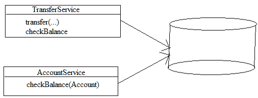
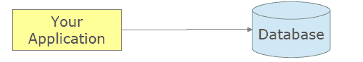

# 第八章：使用 Spring ORM 和事务实现模式访问数据库

在 第七章，“使用 Spring 和 JDBC 模板模式访问数据库”，我们学习了如何使用 JBDC 访问数据库以及 Spring 如何通过使用模板模式和回调从开发人员端到框架端移除样板代码。在本章中，我们将学习使用 **对象关系映射**（**ORM**）框架访问数据库并管理应用程序中事务的更高级步骤。

当我的儿子 Arnav 一岁半的时候，他经常玩一个模拟手机。但随着他长大，他的需求也超出了模拟手机，变成了智能手机。

类似地，当你的应用程序在业务层只有少量数据时，JDBC 工作得很好，但随着应用程序的增长和复杂化，将表映射到应用程序中的对象变得困难。JDBC 是数据访问世界中的小型模拟手机。但是，对于复杂的应用程序，我们需要能够将对象属性映射到数据库列的对象关系映射解决方案。我们还需要在数据访问层为我们的应用程序提供更复杂的平台，这些平台可以独立于数据库技术为我们创建查询和语句，并且我们可以声明式或程序化地定义它们。

许多 ORM 框架可用于为应用程序的数据访问层提供服务。此类服务的例子包括对象关系映射、数据的延迟加载、数据的预加载、级联等。这些 ORM 服务让您免于编写大量用于错误处理和应用程序资源管理的代码。ORM 框架减少了开发时间，并有助于编写无错误的代码，这样您就可以只关注业务需求。Spring 不实现自己的 ORM 解决方案，但它为 Hibernate、**Java 持久化 API**（**JPA**）、iBATIS 和 **Java 数据对象**（**JDO**）等许多持久化框架提供支持。Spring 还提供了与 ORM 框架的集成点，以便我们可以轻松地将 ORM 框架集成到我们的 Spring 应用程序中。

Spring 在您的应用程序中为所有这些技术提供支持。在本章中，我们将探讨 Spring 对 ORM 解决方案的支持，并涵盖以下主题：

+   ORM 框架和使用的模式

    +   数据访问对象模式

    +   在 Spring 中使用工厂设计模式创建 DAO

    +   数据映射模式

    +   领域模型模式

    +   懒加载模式的代理

    +   Hibernate 模板模式

+   将 Hibernate 与 Spring 集成

    +   在 Spring 容器中配置 Hibernate 的 `SessionFactory`

    +   基于纯 Hibernate API 实现 DAO

    +   Spring 中的事务管理策略

    +   声明式事务实现和划分

    +   程序化事务实现和划分

    +   应用程序中 Spring ORM 和事务模块的最佳实践

在我们继续讨论更多关于 ORM 框架的内容之前，让我们首先看看应用中**数据访问层（DAL**）所使用的一些设计模式。

# ORM 框架和使用的模式

Spring 支持多个 ORM 框架，例如 Hibernate、**Java 持久化 API（JPA**）、iBATIS 和**Java 数据对象（JDO**）。通过在应用中使用任何 ORM 解决方案，您可以轻松地将关系数据库中的数据持久化和以 POJO 对象的形式访问。Spring ORM 模块是之前讨论的 Spring JDBC DAO 模块的扩展。Spring 提供了 ORM 模板，如基于 JDBC 的模板，以在集成层或数据访问层中工作。以下是 Spring 框架支持的 ORM 框架和集成：

+   Hibernate

+   Java 持久化 API

+   Java 数据对象

+   iBATIS

+   数据访问对象实现

+   事务策略

您可以使用 Spring 的依赖注入功能来配置应用中的 ORM 解决方案。Spring 还为您数据访问应用中的 ORM 层添加了重要的增强功能。以下是在创建 ORM DAO 时使用 Spring 框架的好处：

+   **更易于开发和测试**：Spring 的 IoC 容器管理 ORM DAO 的 bean。您可以通过使用 Spring 的依赖注入功能轻松地交换 DAO 接口的实现。它还使得在隔离环境中测试持久化相关代码变得容易。

+   **常见数据访问异常**：Spring 提供了一致的数据异常层次结构，以处理持久化层的异常。它封装了 ORM 工具的所有已检查异常，并将这些异常转换为与任何特定 ORM 解决方案无关的未检查的一般异常，这些异常是数据库特定的。

+   **通用资源管理**：如`DataSource`、数据库连接、Hibernate 的`SessionFactory`、JPA 的`EntityManagerFactory`等资源由 Spring IoC 容器管理。Spring 还使用 JTA 管理本地或全局事务。

+   **集成事务管理**：Spring 在您的应用中提供了声明式和程序式事务管理。对于声明式事务管理，您可以使用`@Transactional`注解。

Spring 与 ORM 解决方案的集成主要采用应用层之间的松耦合方式；也就是说，业务层和数据访问层。这是一种清晰的应用分层，且独立于任何特定的数据库和事务技术。应用中的业务服务不再依赖于数据访问和特定的交易策略。因为 Spring 管理了集成层中使用的资源，所以您不需要为特定的数据访问技术查找资源。Spring 为 ORM 解决方案提供了模板，以移除样板代码，并且为所有 ORM 解决方案提供了一致的方法。

在第七章“使用 Spring 和 JDBC 模板模式访问数据库”中，你看到了 Spring 如何解决应用程序集成层中的两个主要问题。第一个问题是*管理应用程序资源时的冗余代码*，第二个问题是*在开发时处理检查异常*。同样，Spring ORM 模块也提供了这两个问题的解决方案，我们将在以下章节中讨论。

# 资源和事务管理

在 Spring JDBC 模块中，资源管理，如连接处理、语句处理和异常处理，由 Spring 的 JdbcTemplate 管理。它还翻译数据库特定的 SQL 错误代码为有意义的非检查异常类。对于 Spring ORM 模块也是如此--Spring 通过使用相应的 Spring 事务管理器在企业应用程序中管理本地和全局事务。Spring 为所有支持的 ORM 技术提供事务管理器。例如，Spring 为 Hibernate 提供 Hibernate 事务管理器，为 JPA 提供 JPA 事务管理器，并为全局或分布式事务提供 JTA 支持。

# 一致的异常处理和转换

在 Spring JDBC 模块中，Spring 提供了`DataAccessException`来处理所有类型的数据库特定的 SQL 错误代码，并生成有意义的异常类。在 Spring ORM 模块中，正如我们所知，Spring 支持多个 ORM 解决方案的集成，例如在 DAO 中使用 Hibernate、JPA 或 JDO，这些持久化技术根据技术提供自己的原生异常类，如`HibernateException`、`PersistenceException`或`JDOException`。这些 ORM 框架的原生异常是不受检查的异常，因此我们不需要在应用程序中处理它们。除非应用程序是强 ORM 基础，或者不需要任何特殊的异常处理，否则 DAO 服务的调用者无法进行特定的处理。Spring 在整个 ORM 框架中提供了一致的方法；在 Spring 应用程序中，你不需要为任何 ORM 实现特定的代码。它通过使用`@Repository`注解来实现异常转换。如果 Spring 应用程序中的任何类被`@Repository`注解标注，那么这个类就有资格进行 Spring `DataAccessException`的转换。以下是一个针对`AccountDaoImpl`类的示例代码：

```java
    @Repository 
    public class AccountDaoImpl implements AccountDao { 
      // class body here... 
    } 

    <beans> 
      <!-- Exception translation bean post processor --> 
      <bean class="org.springframework.dao.annotation.
      PersistenceExceptionTranslationPostProcessor"/> 
      <bean id="accountDao" class="com.packt.patterninspring.chapter8.
      bankapp.dao.AccountDaoImpl"/> 
    </beans> 
```

如前述代码所示，`PersistenceExceptionTranslationPostProcessor`类是一个 bean 后处理器，它自动搜索所有异常转换器，并在容器中建议所有标注了`@Repository`注解的已注册 bean。它将这些发现的异常转换器应用于这些标注的 bean，并且这些转换器可以拦截并适当地转换抛出的异常。

让我们看看 Spring ORM 模块中实现的一些更多设计模式，以提供企业应用集成层最佳的企业解决方案。

# 数据访问对象模式

**数据访问对象**（**DAO**）模式是 J2EE 应用持久层中一个非常流行的设计模式。它将业务逻辑层和持久层分离。DAO 模式基于封装和抽象的面向对象原则。使用 DAO 模式的环境是根据底层供应商实现和存储类型（如面向对象数据库、平面文件、关系数据库等）来访问和持久化数据。使用 DAO 模式，你可以创建一个 DAO 接口，并实现这个 DAO 接口来抽象和封装对数据源的所有访问。这个 DAO 实现管理数据库的资源，如与数据源的连接。

DAO 接口对所有底层数据源机制都非常通用，并且不需要为任何低级持久技术的变化而改变。这个模式允许你在不影响企业应用中的业务逻辑的情况下采用任何不同的数据访问技术。让我们看看以下图表来了解 DAO 模式：


正如前图所示，以下参与者参与了这个模式：

+   **BusinessObject**：这个对象在业务层工作，是数据访问层的客户端。它需要数据来进行业务建模，并为应用中的辅助器或控制器准备 Java 对象。

+   **DataAccessObject**：这是 DAO 模式的主要对象。这个对象隐藏了所有底层数据库实现（针对**BusinessObject**）的低级实现。

+   **DataSource**：这也是一个对象，用于包含关于底层数据库实现的所有低级信息，如 RDBMS、平面文件或 XML。

+   **TransferObject**：这是一个对象，用作数据载体。这个对象被**DataAccessObject**用来将数据返回给业务对象。

让我们看看以下 DAO 模式的示例，其中`AccountDao`是`DataAccessObject`接口，而`AccountDaoImpl`是`AccountDao`接口的实现类：

```java
    public interface AccountDao { 
      Integer totalAccountsByBranch(String branchName); 
    } 

    public class AccountDaoImpl extends JdbcDaoSupport implements
    AccountDao { 
      @Override 
      public Integer totalAccountsByBranch(String branchName) { 
        String sql = "SELECT count(*) FROM Account WHERE branchName = 
        "+branchName; 
        return this.getJdbcTemplate().queryForObject(sql,   
        Integer.class); 
       } 

    } 
```

# 在 Spring 中使用工厂设计模式创建 DAO

如我们所知，有很多设计模式在 Spring 框架中发挥作用。如第二章“GOF 设计模式概述”中讨论的，*核心设计模式*，工厂模式是一种创建型设计模式，它用于在不向客户端暴露底层逻辑的情况下创建对象，并使用公共接口或抽象类将新对象分配给调用者。你可以通过使用`Factory`方法和抽象工厂设计模式使 DAO 模式更加灵活。

让我们看看在我们的例子中，我们是在哪里实现这个策略，即一个工厂为单个数据库实现生成 DAO。请参考以下图表：


你可以在前面的图表中看到，**AccountDao**对象是由**AccountDaoFactory**生成的，而**AccountDaoFactory**是**AccountDao**的工厂。我们可以随时更改底层数据库，这样我们就不需要更改业务代码--工厂负责这些事情，Spring 提供了在 bean 工厂和 DAO 工厂中维护所有 DAO 的支持。

# 数据映射模式

*一层映射器，它在对象和数据库之间移动数据，同时保持它们彼此以及映射器本身的独立性*。

- 由**马丁·福勒**：《企业应用架构模式》

ORM 框架提供了对象和关系型数据库之间的映射，因为我们知道，对象和关系型数据库中的表在为应用程序存储数据时有不同的方式。此外，对象和表都有结构化数据的方法。在你的 Spring 应用程序中，如果你使用任何 ORM 解决方案，如 Hibernate、JPA 或 JDO，那么你就不需要担心对象和关系型数据库之间的映射机制。让我们通过以下图表来了解数据映射模式：


如前图所示，对象**Account**通过**AccountMapper**映射到关系型数据库。它就像 Java 对象和应用程序中底层数据库之间的中介层。让我们看看数据访问层中使用的另一个模式。

# 领域模型模式

领域对象模型，它结合了行为和数据。

- 由马丁·福勒：《企业应用架构模式》

领域模型是一个具有行为和数据的对象，因此，行为定义了企业应用的业务逻辑，而数据是关于业务输出的信息。领域模型结合了数据和过程。在企业应用中，数据模型位于业务层之下，以插入业务逻辑，并从业务行为返回数据。让我们通过以下图表来更清晰地了解这一点：



如前图所示，我们根据业务需求在我们的应用程序中定义了两个领域模型。将资金从一个账户转移到另一个账户的业务行为已在 `TransferService` 类中定义。`TransferService` 和 `AccountService` 类属于企业应用程序中的领域模型模式。

# 懒加载模式的代理

懒加载是一种设计模式，这种设计模式在企业应用程序中由一些 ORM 解决方案（如 Hibernate）使用，以延迟对象的初始化，直到它被另一个对象在需要时调用。这种设计模式的目的在于优化应用程序的内存。Hibernate 中的懒加载设计模式是通过使用虚拟代理对象实现的。在懒加载演示中，我们使用了一个代理，但这不是代理模式的一部分。

# Spring 的 Hibernate 模板模式

Spring 提供了一个辅助类来访问 DAO 层的数据--这个类基于 GoF 模板方法设计模式。Spring 提供了 `HibernateTemplate` 类，用于提供数据库操作，如 `save`、`create`、`delete` 和 `update`。`HibernateTemplate` 类确保每个事务只使用一个 Hibernate 会话。

让我们在下一节中看看 Spring 对 Hibernate 的支持。

# 将 Hibernate 与 Spring 集成

Hibernate 是一个持久化 ORM 框架，它是开源的，不仅提供了 Java 对象和数据库表之间的简单对象关系映射，而且还为您的应用程序提供了许多高级功能，以改进性能，并有助于更好地利用资源，如缓存、懒加载、预加载和分布式缓存。

Spring 框架提供了对 Hibernate 框架的全面支持，Spring 还内置了一些库以充分利用 Hibernate 框架。我们可以使用 Spring 的 DI 模式和 IoC 容器来配置应用程序中的 Hibernate。

让我们在下一节中看看如何在 Spring IoC 容器中配置 Hibernate。

# 在 Spring 容器中配置 Hibernate 的 SessionFactory

作为在任何企业应用程序中配置 Hibernate 和其他持久化技术的最佳方法，业务对象应与硬编码的资源查找（如 JDBC `DataSource` 或 Hibernate `SessionFactory`）分离。您可以在 Spring 容器中将这些资源定义为 bean。但是，业务对象需要这些资源的引用，如 `SessionFactory` 和 JDBC `DataSource`，以便访问它们。让我们看看以下具有 `SessionFactory` 以访问应用程序数据的 DAO 类：

```java
    public class AccountDaoImpl implements AccountDao { 
      private SessionFactory sessionFactory; 

      public void setSessionFactory(SessionFactory sessionFactory) { 
        this.sessionFactory = sessionFactory; 
      } 
       //..... 
    } 
```

如前所述的代码所示，DAO 类 `AccountDaoImpl` 遵循依赖注入模式。它通过注入 Hibernate 的 `SessionFactory` 对象来访问数据，并且很好地适应了 Spring IoC 容器。在这里，Hibernate 的 `SessionFactory` 是一个单例对象；它生成 Hibernate `org.hibernate.Session` 接口的主对象。`SessionFactory` 管理 Hibernate 的 `Session` 对象，并负责打开和关闭 `Session` 对象。`Session` 接口具有实际的数据访问功能，如 `save`、`update`、`delete` 和从数据库中加载 `load` 对象。在应用程序中，`AccountDaoImp` 或任何其他存储库使用这个 Hibernate `Session` 对象来执行其所有持久化需求。

Spring 提供了内置的 Hibernate 模块，你可以在应用程序中使用 Spring 的 Hibernate 会话工厂 bean。

`org.springframework.orm.hibernate5.LocalSessionFactoryBean` 这个 bean 是 Spring 中 `FactoryBean` 接口的实现。`LocalSessionFactoryBean` 基于抽象工厂模式，并在应用程序中生成 Hibernate 的 `SessionFactory`。你可以在应用程序的 Spring 上下文中将 Hibernate 的 `SessionFactory` 配置为一个 bean，如下所示：

```java
    @Bean 
    public LocalSessionFactoryBean sessionFactory(DataSource 
    dataSource) { 
      LocalSessionFactoryBean sfb = new LocalSessionFactoryBean(); 
      sfb.setDataSource(dataSource); 
      sfb.setPackagesToScan(new String[] {   
        "com.packt.patterninspring.chapter8.bankapp.model" }); 
        Properties props = new Properties(); 
        props.setProperty("dialect", 
        "org.hibernate.dialect.H2Dialect"); 
        sfb.setHibernateProperties(props); 
        return sfb; 
    } 
```

在前面的代码中，我们通过使用 Spring 的 `LocalSessionFactoryBean` 类将 `SessionFactory` 配置为一个 bean。这个 bean 方法接受 `DataSource` 作为参数；`DataSource` 指定了如何以及在哪里找到数据库连接。我们还为 `LocalSessionFactoryBean` 指定了一个名为 `"com.packt.patterninspring.chapter8.bankapp.model"` 的包，以进行扫描，并将 `SessionFactory` 的属性设置为 `hibernateProperties` 以确定我们将处理的应用程序中的数据库类型。

在配置 Spring 应用程序上下文中的 Hibernate `SessionFactory` bean 之后，让我们看看如何实现应用程序持久化层的 DAO。

# 基于纯 Hibernate API 实现 DAO

让我们创建以下 DAO 实现类：

```java
    package com.packt.patterninspring.chapter8.bankapp.dao; 

    import org.hibernate.SessionFactory; 
    import org.springframework.stereotype.Repository; 
    import org.springframework.beans.factory.annotation.Autowired; 
    @Repository 
    public class AccountDaoImpl implements AccountDao { 
      @Autowired 
      private SessionFactory sessionFactory; 

      public void setSessionFactory(SessionFactory sessionFactory) { 
        this.sessionFactory = sessionFactory; 
      } 

      @Override 
      public Integer totalAccountsByBranch(String branchName) { 
        String sql = "SELECT count(*) FROM Account WHERE branchName =
        "+branchName; 
        return this.sessionFactory.getCurrentSession().createQuery(sql,
        Integer.class).getSingleResult(); 
      } 
      @Override 
      public Account findOne(long accountId) { 
        return (Account)   
        this.sessionFactory.currentSession().
        get(Account.class, accountId); 
      } 
      @Override 
      public Account findByName(String name) { 
        return (Account) this.sessionFactory.currentSession().
        createCriteria(Account.class) 
        .add(Restrictions.eq("name", name)) 
        .list().get(0); 
      } 
      @Override 
      public List<Account> findAllAccountInBranch(String branchName) { 
       return (List<Account>) this.sessionFactory.currentSession() 

       .createCriteria(Account.class).add(Restrictions.eq("branchName",  
       branchName)).list(); 
      }  
    } 
```

如前所述的代码所示，`AccountDaoImpl` 是一个 DAO 实现类，它通过使用 `@Autowired` 注解注入 Hibernate 的 `SessionFactory` bean。前面描述的 DAO 实现将抛出未检查的 Hibernate `PersistenceExceptions`--不希望这些异常传播到服务层或其他 DAO 的使用者。但是，Spring AOP 模块允许将其转换为 Spring 的丰富、供应商中立的 `DataAccessException` 层次结构--它隐藏了使用的访问技术。Spring 通过在 DAO 实现类上使用 `@Repository` 注解提供此功能，你只需要定义一个 Spring 提供的 `BeanPostProcessor`，即 `PersistenceExceptionTranslationPostProcessor`。

让我们在我们的 Hibernate DAO 实现类中添加一个异常转换；我们可以通过只需将 `PersistenceExceptionTranslationPostProcessor` bean 添加到 Spring 应用程序上下文中来完成此操作，如下所示：

```java
    @Bean 
    public BeanPostProcessor persistenceTranslation() { 
      return new PersistenceExceptionTranslationPostProcessor(); 
    } 
```

前面注册的 bean `PersistenceExceptionTranslationPostProcessor` 负责为带有 `@Repository` 注解的 bean 添加一个顾问，并且它将任何在代码中捕获的平台特定异常重新抛出为 Spring 特定的未检查数据访问异常。

让我们看看在下一节中，Spring 是如何管理 Spring 应用程序的业务层和持久层的事务的。

# Spring 的事务管理策略

Spring 为 Spring 应用程序的事务管理提供了全面的支持。这是 Spring 框架最吸引人的特性之一。大多数情况下，这个特性迫使软件行业使用 Spring 框架来开发企业应用程序。Spring 框架提供了一种一致的方式来管理应用程序中的事务，无论使用哪种持久化技术，如 Java 事务 API、JDBC、Hibernate、Java 持久化 API 和 Java 数据对象。Spring 支持声明式事务管理和程序化事务管理。

Java 事务有两种类型，具体如下：

+   **本地事务 - 单个资源**：由底层资源管理的本地事务；这些是资源特定的。让我们借助以下图表来解释这一点：



如您在前面图表中看到的，应用程序和数据库平台之间存在一个事务，以确保每个任务单元都遵循数据库的 ACID 属性。

+   **全局（分布式）事务 - 多个**：由单独的、专门的交易管理器管理的全局事务，使您能够与多个事务性资源一起工作。请查看以下图表，以了解有关全局或分布式事务的更多信息：


如您在最后一张图表中看到的，**事务管理器**在应用程序中与多种数据库技术一起工作。全局事务独立于特定平台的数据持久化技术。

Spring 为 Java 应用程序中的两种事务类型提供相同的 API。Spring 框架通过声明式配置事务或程序化配置事务，在任何环境中都提供一致的编程模型。

让我们继续到下一节，看看如何在 Spring 应用程序中配置事务。

# 声明式事务划分和实现

Spring 支持声明式事务管理。Spring 将事务边界与事务实现分离。边界通过 Spring AOP 声明性表达。我们始终建议在您的 Spring 应用程序中使用 Spring 的声明性事务边界和实现，因为声明性编程模型允许您从代码中替换外部事务边界 API，并且您可以通过使用 Spring AOP 事务拦截器来配置它。事务基本上是横切关注点；这种声明性事务模型允许您将应用程序的业务逻辑与重复的事务边界代码分开。

如前所述，Spring 为 Spring 应用程序中的事务处理提供了一个一致的模型，并提供了一个`PlatformTransactionManager`接口来隐藏实现细节。Spring 框架中提供了这个接口的几个实现，其中一些将在下面列出：

+   `DataSourceTransactionManager`

+   `HibernateTransactionManager`

+   `JpaTransactionManager`

+   `JtaTransactionManager`

+   `WebLogicJtaTransactionManager`

+   `WebSphereUowTransactionManager`

以下是一个关键接口：

```java
    public interface PlatformTransactionManager { 
      TransactionStatus getTransaction( 
        TransactionDefinition definition) throws TransactionException; 
       void commit(TransactionStatus status) throws   
         TransactionException; 
       void rollback(TransactionStatus status) throws
         TransactionException; 
   } 
```

在前面的代码中，`getTransaction()`方法返回一个`TransactionStatus`对象。此对象包含事务的状态；要么它是新的，要么它返回当前调用堆栈中的现有状态。这取决于`TransactionDefinition`参数。正如在 JDBC 或 ORM 模块中一样，Spring 也提供了一种一致的方式来处理任何事务管理器抛出的异常。`getTransaction()`方法抛出一个`TransactionException`异常，这是一个未检查的异常。

Spring 在应用程序中使用相同的 API 处理全局和本地事务。从本地事务切换到应用程序中的全局事务只需要非常小的更改——那就是更改事务管理器。

# 部署事务管理器

在您的 Spring 应用程序中部署事务有两个步骤。第一步是您必须实现或配置一个预实现的 Spring 事务管理器类与您的应用程序。第二步是声明事务边界，即您想在何处放置 Spring 事务。

# 第一步 - 实现事务管理器

就像任何其他 Spring bean 一样，为所需的实现创建 bean。您可以根据需要配置事务管理器，以支持任何持久化技术，如 JDBC、JMS、JTA、Hibernate、JPA 等。但在下面的示例中，这里是一个使用 JDBC 的`DataSource`管理器的管理器：

在 Java 配置中，让我们看看如何在应用程序中定义`transactionManager` bean：

```java
    @Bean 
    public PlatformTransactionManager transactionManager(DataSource 
    dataSource) { 
      return new DataSourceTransactionManager(dataSource); 
    } 
```

在 XML 配置中，bean 可以创建如下：

```java
    <bean id="transactionManager" 
     class="org.springframework.jdbc.datasource.
     DataSourceTransactionManager"> 
     <property name="dataSource" ref="dataSource"/> 
    </bean> 
```

在前面的代码中，我们使用了`dataSource`豆；必须在其他地方定义一个`dataSource`豆。豆 ID，`"transactionManager"`，是默认名称。我们可以更改它，但之后必须在每个地方指定替代名称，这并不容易做到！

# 步骤 2 - 声明事务划分

作为最佳方法，应用的服务层是划分事务的最佳位置。让我们在以下代码中看看：

```java
    @Service 
    public class TransferServiceImpl implements TransferService{ 
      //... 
      @Transactional 
      public void transfer(Long amount, Long a, Long b){ 
        // atomic unit-of-work 
      } 
      //... 
    } 
```

正如你可以在前面的代码中看到，`TransferServiceImpl`是我们应用服务层的服务类。这个服务是划分工作单元事务的最佳位置。Spring 提供了`@Transactional`注解来划分事务；这个注解可以在应用中服务类的类级别或方法级别使用。让我们看看类级别的`@Transactional`：

```java
    @Service 
    @Transactional 
    public class TransferServiceImpl implements TransferService{ 
      //... 
      public void transfer(Long amount, Account a, Account b){ 
        // atomic unit-of-work 
      } 
      public Long withdraw(Long amount,  Account a){ 
        // atomic unit-of-work 
      } 
      //... 
    } 
```

如果你将`@Transactional`注解声明在类级别，这个服务中的所有业务方法都将变为事务方法。

注意--如果你正在使用`@Transactional`注解，方法可见性应该是公开的。如果你使用这个注解在非公开方法上，例如`protected`、`private`或`package-visible`，不会抛出错误或异常，但这个被注解的方法不会显示事务行为。

但仅使用这个注解在 Spring 应用中是不够的。我们必须通过在 Spring 的 Java 配置文件中使用`@EnableTransactionManagement`注解来启用 Spring 框架的事务管理功能，或者我们可以在 XML 配置文件中使用`<tx:annotation-driven/>`命名空间。让我们看看以下代码，例如：

```java
    @Configuration 
    @EnableTransactionManagement 
    public class InfrastructureConfig { 

      //other infrastracture beans definitions 

     @Bean 
     public PlatformTransactionManager transactionManager(){ 
         return new DataSourceTransactionManager(dataSource()); 
     } 
   } 
```

正如你可以在前面的代码中看到，`InfrastructureConfig`是 Spring 应用的 Java 配置文件--在这里，我们定义了基础设施相关的豆，以及一个`transactionManager`豆也在这里定义。这个带有另一个注解的配置类是`@EnableTransactionManagement`--这个注解在应用中定义了一个 Bean 后处理器，并代理`@Transactional`豆。现在，让我们看看以下图：


正如你在前面的图中看到的，`TransferServiceImpl`类被 Spring 代理包装。

但要了解应用中`@Transactional`豆的确切行为，让我们看看以下步骤：

1.  目标对象被包装在一个代理中；它使用我们已在第六章中讨论的环绕通知。Spring 面向切面编程与代理和装饰器模式。

1.  代理实现了以下行为：

1. 在进入业务方法之前开始事务。

2. 在业务方法结束时提交。

3. 如果业务方法抛出`RuntimeException`，则回滚--这是 Spring 事务的默认行为，但你也可以为检查和自定义异常覆盖它。

1.  事务上下文现在绑定到应用程序中的当前线程。

1.  所有步骤都由配置控制，无论是 XML、Java 还是注解。

现在看看以下带有相关事务管理器的本地 JDBC 配置图：


在前面的图中，我们使用 JDBC 和一个**数据源事务管理器**定义了一个本地数据源。

在下一节中，我们将讨论如何在应用程序中程序化地实现和划分事务。

# 程序化事务划分和实现

Spring 允许您通过使用`TransactionTemplate`和`PlatformTransactionManager`实现直接在应用程序中实现和划分事务。但是，声明式事务管理被高度推荐，因为它提供了干净的代码和非常灵活的配置。

让我们看看如何在应用程序中程序化地实现事务：

```java
    package com.packt.patterninspring.chapter8.bankapp.service; 

    import org.springframework.beans.factory.annotation.Autowired; 
    import org.springframework.stereotype.Service; 
    import org.springframework.transaction.PlatformTransactionManager; 
    import org.springframework.transaction.TransactionStatus; 
    import org.springframework.transaction.support.TransactionCallback; 
    import org.springframework.transaction.support.TransactionTemplate; 

    import com.packt.patterninspring.chapter8.bankapp.model.Account; 
    import com.packt.patterninspring.chapter8.bankapp.
      repository.AccountRepository; 

    @Service 
    public class AccountServiceImpl implements AccountService { 
      //single TransactionTemplate shared amongst all methods in this 
      instance 
      private final TransactionTemplate transactionTemplate; 
      @Autowired 
      AccountRepository accountRepository; 

      // use constructor-injection to supply the 
      PlatformTransactionManager 
      public AccountServiceImpl(PlatformTransactionManager 
      transactionManager) { 
        this.transactionTemplate = new 
        TransactionTemplate(transactionManager); 
      } 

      @Override 
      public Double cheeckAccountBalance(Account account) { 
        return transactionTemplate.execute(new 
        TransactionCallback<Double>() { 
          // the code in this method executes in a transactional 
          context 
          public Double doInTransaction(TransactionStatus status) { 
            return accountRepository.checkAccountBalance(account); 
          } 
        });  } 
    } 
```

在前面的应用程序代码中，我们明确使用了`TransactionTemplate`来在事务上下文中执行应用程序逻辑。`TransactionTemplate`也是基于模板方法设计模式的，并且与 Spring 框架中的其他模板（如 JdbcTemplate）有相同的方法。类似于 JdbcTemplate，`TransactionTemplate`也使用回调方法，并且它使应用程序代码免于管理事务资源的样板代码。我们在服务类构造函数中构建了`TransactionTemplate`类的对象，并将`PlatformTransactionManager`对象作为参数传递给`TransactionTemplate`类的构造函数。我们还编写了一个包含应用程序业务逻辑代码的`TransactionCallback`实现，这显示了应用程序逻辑和事务代码之间的紧密耦合。

在本章中，我们已经看到 Spring 如何高效地管理企业应用程序中的事务。现在，让我们研究一些最佳实践，我们在任何企业应用程序工作中都必须牢记。

# 应用程序中 Spring ORM 和事务模块的最佳实践

以下是我们设计和开发应用程序时必须遵循的实践：

避免在 DAO 实现中使用 Spring 的`HibernateTemplate`辅助类，并在您的应用程序中使用`SessionFactory`和`EntityManager`。由于 Hibernate 的上下文会话能力，直接在 DAO 中使用`SessionFactory`。此外，使用`getCurrentSession()`方法来访问事务当前会话，以便在应用程序中执行持久化操作。请参考以下代码：

```java
    @Repository 
    public class HibernateAccountRepository implements 
    AccountRepository { 
      SessionFactory sessionFactory; 
      public HibernateAccountRepository(SessionFactory 
      sessionFactory) { 
        super(); 
        this.sessionFactory = sessionFactory; 
      } 
     //... 
   } 
```

在您的应用程序中，始终使用`@Repository`注解来表示数据访问对象或存储库；它提供异常转换。请参考以下代码：

```java
    @Repository 
    public class HibernateAccountRepository{//...} 
```

即使服务中的业务方法只委托其责任到相应的 DAO 方法，服务层也必须保持独立。

总是在应用程序的服务层实现事务，而不是在 DAO 层--这是事务的最佳位置。请参考以下代码：

```java
    @Service 
    @Transactional 
    public class AccountServiceImpl implements AccountService {//...} 
```

声明式事务管理在应用程序中更强大、更方便配置，并且是 Spring 应用程序中高度推荐使用的方法。它将横切关注点与业务逻辑分离。

总是在服务层抛出运行时异常，而不是检查型异常。

注意`@Transactional`注解的 readOnly 标志。当服务方法只包含查询时，将事务标记为`readOnly=true`。

# 摘要

在第七章《使用 Spring 和 JDBC 模板模式访问数据库》中，我们了解到 Spring 提供了基于 GOF 模板方法设计模式的`JdbcTemplate`类。这个类处理了传统 JDBC API 下所有必要的样板代码。但是当我们使用 Spring JDBC 模块时，将表映射到对象变得非常繁琐。在本章中，我们看到了将对象映射到关系数据库中的解决方案--通过在复杂应用程序中使用 ORM，我们可以利用关系数据库做更多的事情。Spring 支持与多个 ORM 解决方案集成，如 Hibernate、JPA 等。这些 ORM 框架使得数据持久化的声明式编程模型成为可能，而不是使用 JDBC 编程模型。

我们还探讨了在数据访问层或集成层中实现的一些设计模式。这些模式作为 Spring 框架的一个特性实现，如代理模式用于懒加载，外观模式用于与业务层集成，DAO 模式用于数据访问，等等。

在下一章中，我们将看到如何通过使用 Spring 对缓存模式的支持来提高我们应用程序在生产环境中的性能。
