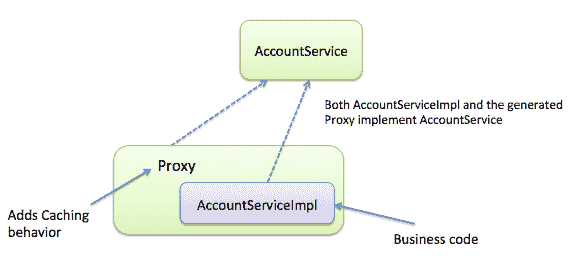

# 使用缓存模式提高应用程序性能

在前面的章节中，我们看到了 Spring 如何在后端工作以访问应用程序的数据。我们还看到了 Spring JDBC 模块如何提供`JdbcTemplate`辅助类以进行数据库访问。Spring 提供了与 ORM 解决方案（如 Hibernate、JPA、JDO 等）集成的支持，并管理应用程序的事务。现在，在本章中，我们将看到 Spring 如何提供缓存支持以提高应用程序性能。

当你深夜从办公室回家时，你是否经常面对你妻子连珠炮般的问题？是的，我知道当你疲惫不堪时回答这么多问题是件很烦人的事。当你被反复问相同的问题时，那就更加烦人了。

有些问题可以用*是*或*否*来回答，但对于某些问题，你必须详细解释。考虑一下，如果你在一段时间后再次被问到另一个长问题会发生什么！同样，在应用程序中也有一些无状态组件，这些组件被设计成反复提出相同的问题以完成每个任务。类似于你妻子提出的一些问题，系统中的一些问题需要一段时间才能获取适当的数据——它可能背后有一些复杂的逻辑，或者可能需要从数据库中获取数据，或者调用远程服务。

如果我们知道某个问题的答案不太可能频繁变化，我们可以在稍后当相同系统再次询问该问题时记住这个答案。再次通过相同的渠道获取答案是没有意义的，因为它会影响应用程序的性能，并且是对你资源的浪费。在企业应用程序中，缓存是一种存储那些频繁需要答案的方法，这样我们就可以从缓存中获取，而不是每次都通过适当的渠道获取相同问题的答案。在本章中，我们将讨论 Spring 的缓存抽象功能，以及 Spring 如何声明性地支持缓存实现。它将涵盖以下要点：

+   什么是缓存？

+   我们在哪里做这个缓存？

+   理解缓存抽象

+   通过代理模式启用缓存

+   基于声明性注解的缓存

+   基于声明性 XML 的缓存

+   配置缓存存储

+   实现自定义缓存注解

+   缓存最佳实践

让我们开始吧。

# 什么是缓存？

简单来说，**缓存**是我们存储预处理的程序信息的内存块。在这个上下文中，一个键值存储，例如一个映射，可能是应用程序中的缓存。在 Spring 中，缓存是一个接口，用于抽象和表示缓存。缓存接口提供了一些方法来将对象放入缓存存储，它可以基于给定的键从缓存存储中检索对象，它可以更新缓存存储中给定键的对象，也可以从缓存存储中删除给定键的对象。这个缓存接口提供了许多操作缓存的功能。

# 我们在哪里使用缓存？

我们在方法总是为相同的参数返回相同结果的情况下使用缓存。这种方法可以执行任何操作，例如即时计算数据、执行数据库查询、通过 RMI、JMS 和 Web 服务请求数据等。必须从参数生成一个唯一键。这就是缓存键。

# 理解缓存抽象

在 Java 应用程序中，基本上，缓存是应用于 Java 方法以减少缓存中相同信息的执行次数。这意味着，每当这些 Java 方法被调用时，缓存抽象会根据给定的参数将这些方法的行为应用于缓存。如果给定参数的信息已经在缓存中，则无需执行目标方法即可返回。如果所需信息不在缓存中，则执行目标方法，并将结果缓存并返回给调用者。缓存抽象还提供了其他与缓存相关的操作，如更新和/或删除缓存中的内容。当应用程序中的数据有时发生变化时，这些操作非常有用。

Spring 框架通过使用`org.springframework.cache.Cache`和`org.springframework.cache.CacheManager`接口为 Spring 应用程序提供缓存抽象。缓存需要使用实际的存储来存储缓存数据。但缓存抽象只提供缓存逻辑。它不提供任何物理存储来存储缓存数据。因此，开发人员需要在应用程序中实现实际的缓存存储。如果您有一个分布式应用程序，那么您需要相应地配置您的缓存提供程序。这取决于您应用程序的使用案例。您可以为分布式应用程序在节点之间复制相同的数据，或者您可以创建一个集中式缓存。

市场上有一些缓存提供程序，您可以根据应用程序需求使用它们。以下是一些例子：

+   Redis

+   `OrmLiteCacheClient`

+   `Memcached`

+   内存缓存

+   Aws DynamoDB Cache Client

+   Azure Cache Client

在您的应用程序中实现缓存抽象，您必须注意以下任务：

+   **缓存声明**：这意味着您必须识别应用程序中需要缓存的方法，并使用缓存注解标注这些方法，或者您可以使用 Spring AOP 通过 XML 配置来实现。

+   **缓存配置**：这意味着您必须配置缓存数据的实际存储位置——即数据存储和读取的地方

现在我们来看看如何在 Spring 应用程序中启用 Spring 的缓存抽象。

# 通过代理模式启用缓存

您可以通过以下两种方式启用 Spring 的缓存抽象：

+   使用注解

+   使用 XML 命名空间

Spring 通过使用 AOP（面向切面编程）透明地将缓存应用于 Spring bean 的方法。Spring 在您声明需要缓存的方法的 Spring bean 周围应用代理。此代理为 Spring bean 添加了动态的缓存行为。以下图示说明了缓存行为：



在前述图中，您可以看到 Spring 将**代理（Proxy**）应用于**AccountServiceImpl**类以添加缓存行为。Spring 使用 GoF 代理模式在应用程序中实现缓存。

让我们看看如何在 Spring 应用程序中启用此功能。

# 使用注解启用缓存代理

如您所知，Spring 提供了许多功能，但它们大多数都是默认禁用的。在使用之前，您必须启用这些功能。如果您想在应用程序中使用 Spring 的缓存抽象，您必须启用此功能。如果您使用 Java 配置，您可以通过将`@EnableCaching`注解添加到您的配置类之一来启用 Spring 的缓存抽象。以下配置类显示了`@EnableCaching`注解：

```java
    package com.packt.patterninspring.chapter9.bankapp.config; 

    import org.springframework.cache.CacheManager; 
    import org.springframework.cache.annotation.EnableCaching; 
    import org.springframework.cache.concurrent.
      ConcurrentMapCacheManager; 
    import org.springframework.context.annotation.Bean; 
    import org.springframework.context.annotation.ComponentScan; 
    import org.springframework.context.annotation.Configuration; 

    @Configuration 
    @ComponentScan(basePackages=   
    {"com.packt.patterninspring.chapter9.bankapp"}) 
    @EnableCaching //Enable caching 
    public class AppConfig { 

     @Bean 
     public AccountService accountService() { ... } 

     //Declare a cache manager 
     @Bean 
     public CacheManager cacheManager() { 
         CacheManager cacheManager = new ConcurrentMapCacheManager(); 
         return cacheManager; 
    } 
   } 
```

在前述 Java 配置文件中，我们向配置类`AppConfig.java`添加了`@EnableCaching`注解；此注解指示 Spring 框架为应用程序启用 Spring 缓存行为。

现在我们来看看如何通过使用 XML 配置来启用 Spring 的缓存抽象。

# 使用 XML 命名空间启用缓存代理

如果您使用 XML 配置应用程序，您可以使用 Spring 的缓存命名空间中的`<cache:annotation-driven>`元素启用注解驱动的缓存，如下所示：

```java
    <?xml version="1.0" encoding="UTF-8"?> 
    <beans  

     xsi:schemaLocation="http://www.springframework.org/schema/jdbc 
     http://www.springframework.org/schema/jdbc/spring-jdbc-4.3.xsd 
     http://www.springframework.org/schema/cache   
     http://www.springframework.org/schema/cache/spring-cache-4.3.xsd 
     http://www.springframework.org/schema/beans     
     http://www.springframework.org/schema/beans/spring-beans.xsd 
     http://www.springframework.org/schema/context    
     http://www.springframework.org/schema/context/spring-context.xsd 
     http://www.springframework.org/schema/aop 
     http://www.springframework.org/schema/aop/spring-aop-4.3.xsd 
     http://www.springframework.org/schema/tx 
     http://www.springframework.org/schema/tx/spring-tx-4.3.xsd"> 

     <!-- Enable caching --> 
     <cache:annotation-driven /> 

     <context:component-scan base-   
     package="com.packt.patterninspring.chapter9.bankapp"/> 

     <!-- Declare a cache manager --> 
     <bean id="cacheManager" 
     class="org.springframework.cache.concurrent.
     ConcurrentMapCacheManager" /> 
   </beans> 

```

如前述配置文件所示，无论您使用 Java 配置还是 XML 配置，注解`@EnableCaching`和命名空间`<cache:annotation-driven>`通过创建一个具有触发 Spring 缓存注解的切入点（pointcuts）的方面（aspect），从而启用 Spring 的缓存抽象。

让我们看看如何使用 Spring 的缓存注解来定义缓存边界。

# 基于声明性注解的缓存

在 Spring 应用程序中，Spring 的抽象提供了以下注解用于缓存声明：

+   `@Cacheable`：这表示在执行实际方法之前，查看该方法的返回值是否在缓存中。如果值可用，则返回此缓存值，如果值不可用，则调用实际方法，并将返回值放入缓存。

+   `@CachePut`：这更新缓存而不检查值是否可用。它总是调用实际方法。

+   `@CacheEvict`：这负责触发缓存驱逐。

+   `@Caching`：这用于将多个注解分组应用于方法。

+   `@CacheConfig`：这表示 Spring 在类级别上共享一些常见的缓存相关设置。

让我们现在更详细地查看每个注解。

# `@Cacheable`注解

`@Cacheable`标记一个方法进行缓存。其结果存储在缓存中。对于所有后续具有相同参数的方法调用，它将使用键从缓存中获取数据。方法将不会执行。以下是一些`@Cacheable`属性：

+   **值**：这是要使用的缓存名称

+   **键**：这是每个缓存数据项的键

+   **条件**：这是一个用于评估真或假的 SpEL 表达式；如果为假，则缓存的结果不会应用于方法调用

+   **除非**：这同样是一个 SpEL 表达式；如果为真，则防止返回值被放入缓存

您可以使用 SpEL 和方法参数。让我们看看以下代码，这是`@Cacheable`注解最简单的声明。它需要与该方法关联的缓存名称。请参考以下代码：

```java
    @Cacheable("accountCache ") 
    public Account findAccount(Long accountId) {...} 
```

在前面的代码中，`findAccount`方法被标记为`@Cacheable`注解。这意味着此方法与一个缓存相关联。缓存名称为**accountCache**。每当调用特定`accountId`的方法时，都会检查该方法的返回值是否在缓存中。您也可以像下面这样为缓存提供多个名称：

```java
    @Cacheable({"accountCache ", "saving-accounts"}) 
    public Account findAccount(Long accountId) {...} 
```

# `@CachePut`注解

如前所述，`@Cacheable`和`@CachePut`注解都有相同的目标，即填充缓存。但它们的工作方式略有不同。`@CachePut`标记一个方法进行缓存，并将结果存储在缓存中。对于具有相同参数的每个方法调用，它总是调用实际方法，而不检查该方法的返回值是否在缓存中。以下是一些`@CachePut`属性：

+   **值**：这是要使用的缓存名称

+   **键**：这是每个缓存数据项的键

+   **条件**：这是一个用于评估真或假的 SpEL 表达式；如果为假，则缓存的结果不会应用于方法调用

+   **除非**：这同样是一个 SpEL 表达式；如果为真，则防止返回值被放入缓存

您还可以使用 SpEL 和方法参数为`@CachePut`注解。以下代码是`@CachePut`注解的最简单声明：

```java
    @CachePut("accountCache ") 
    public Account save(Account account) {...} 
```

在前面的代码中，当调用`save()`时，它会保存`Account`。然后返回的 Account 被放置在`accountCache`缓存中。

如前所述，缓存是通过方法根据方法的参数来填充的。实际上这是一个默认的缓存键。在`@Cachable`注解的情况下，`findAccount(Long accountId)`方法有一个`accountId`参数，`accountId`被用作此方法的缓存键。但在`@CachePut`注解的情况下，`save()`的唯一参数是一个 Account。它被用作缓存键。使用`Account`作为缓存键似乎并不合适。在这种情况下，您需要缓存键是新建 Account 的 ID 而不是 Account 本身。因此，您需要自定义键生成行为。让我们看看您如何自定义缓存键。

# 自定义缓存键

您可以通过使用`@Cacheable`和`@CachePut`注解的 key 属性来自定义缓存键。缓存键是通过使用对象属性作为以下代码片段中突出显示的键属性来通过 SpEL 表达式派生的。让我们看看以下示例：

```java
    @Cacheable(cacheNames=" accountCache ", key="#accountId") 
    public Account findAccount(Long accountId) 

    @Cacheable(cacheNames=" accountCache ", key="#account.accountId") 
    public Account findAccount(Account account) 

    @CachePut(value=" accountCache ", key="#account.accountId") 
    Account save(Account account); 
```

您可以在前面的代码片段中看到，我们是如何使用`@Cacheable`注解的 key 属性来创建缓存键的。

让我们看看这些注解在 Spring 应用中的另一个属性。

# 条件缓存

Spring 的缓存注解允许您通过使用`@Cacheable`和`@CachePut`注解的条件属性来关闭某些情况下的缓存。这些注解提供了一个 SpEL 表达式来评估条件值。如果条件表达式的值为真，则方法将被缓存。如果条件表达式的值为假，则方法不会被缓存，每次都会执行，而不进行任何缓存操作，无论缓存中的值或使用的参数是什么。让我们看一个例子。以下方法只有在传入的参数值大于或等于`2000`时才会被缓存：

```java
    @Cacheable(cacheNames="accountCache", condition="#accountId >=   
    2000") 
    public Account findAccount(Long accountId); 
```

`@Cacheable`和`@CachePut`注解还有一个属性--`unless`。这同样提供了一个 SpEL 表达式。这个属性可能看起来与条件属性相同，但它们之间有一些区别。与条件不同，`unless`表达式是在方法调用之后评估的。它阻止值被放入缓存。让我们看看以下示例--我们只想在银行名称不包含 HDFC 时进行缓存：

```java
    @Cacheable(cacheNames="accountCache", condition="#accountId >= 
    2000", unless="#result.bankName.contains('HDFC')") 
    public Account findAccount(Long accountId); 
```

如您在前面的代码片段中所见，我们使用了两个属性--`condition`和`unless`。但`unless`属性有一个 SpEL 表达式，为`#result.bankName.contains('HDFC')`。在这个表达式中，结果是 SpEL 扩展或缓存 SpEL 元数据。以下是在 SpEL 中可用的缓存元数据列表：

| **表达式** | **描述** |
| --- | --- |
| `#root.methodName` | 缓存方法的名称 |
| `#root.method` | 被缓存的的方法，即被调用的方法 |
| `#root.target` | 它评估被调用的目标对象 |
| `#root.targetClass` | 它评估被调用的目标对象的类 |
| `#root.caches` | 当前方法执行的缓存数组 |
| `#root.args` | 传递给缓存方法的参数数组 |
| `#result` | 缓存方法的返回值；仅在`@CachePut`的`unless`表达式中可用 |

Spring 的`@CachePut`和`@Cacheable`注解不应在同一个方法上使用，因为它们有不同的行为。`@CachePut`注解强制执行缓存方法以更新缓存。但`@Cacheable`注解仅在方法的返回值不在缓存中时才执行缓存方法。

您已经看到了如何在 Spring 应用程序中使用 Spring 的`@CachePut`和`@Cacheable`注解向缓存中添加信息。但如何从缓存中移除这些信息呢？Spring 的缓存抽象提供了另一个用于从缓存中移除已缓存数据的注解——`@CacheEvict`注解。让我们看看如何使用`@CacheEvict`注解从缓存中移除缓存数据。

# `@CacheEvict`注解

Spring 的缓存抽象不仅允许填充缓存，还允许从缓存中移除已缓存的的数据。在应用程序中存在一个阶段，您必须从缓存中移除过时或未使用的数据。在这种情况下，您可以使用`@CacheEvict`注解，因为它与`@Cacheable`注解不同，不会向缓存中添加任何内容。`@CacheEvict`注解仅用于执行缓存清除。让我们看看这个注解是如何使`AccountRepository`的`remove()`方法成为缓存清除的：

```java
    @CacheEvict("accountCache ") 
    void remove(Long accountId); 
```

如您在前面的代码片段中所见，当调用`remove()`方法时，与参数`accountId`关联的值将从`accountCache`缓存中移除。以下是一些`@Cacheable`属性：

+   **value**: 这是一个要使用的缓存名称数组

+   **key**: 这是一个 SpEL 表达式，用于评估要使用的缓存键

+   **condition**: 这是一个 SpEL 表达式，用于评估真或假；如果为假，则缓存的结果不会被应用于方法调用

+   **allEntries**: 如果此属性的值为真，则从缓存中删除所有条目

+   **beforeInvocation**: 这意味着如果此属性的值为真，则在方法调用之前从缓存中删除条目；如果此属性的值为假（默认值），则在方法调用成功后删除条目

我们可以在任何方法上使用`@CacheEvict`注解，甚至是`void`方法，因为它只从缓存中删除值。但是，对于`@Cacheable`和`@CachePut`注解，我们必须使用非`void`返回值的方法，因为这些注解需要缓存结果。

# `@Caching`注解

Spring 的缓存抽象允许你通过在 Spring 应用程序中使用`@Caching`注解来使用同一类型的多个注解来缓存一个方法。`@Caching`注解将`@Cacheable`、`@CachePut`和`@CacheEvict`等注解组合为同一方法。例如：

```java
    @Caching(evict = {  
      @CacheEvict("accountCache "),  
      @CacheEvict(value="account-list", key="#account.accountId") }) 
      public List<Account> findAllAccount(){ 
      return (List<Account>) accountRepository.findAll(); 
   } 
```

# `@CacheConfig`注解

Spring 的缓存抽象允许你在类级别上使用`@CacheConfig`注解，以避免在每个方法中重复提及。在某些情况下，将缓存的定制应用于所有方法可能相当繁琐。在这里，你可以使用`@CacheConfig`注解来处理类的所有操作。例如：

```java
     @CacheConfig("accountCache ") 
     public class AccountServiceImpl implements AccountService { 

      @Cacheable 
      public Account findAccount(Long accountId) { 
        return (Account) accountRepository.findOne(accountId); 
      } 
    } 
```

你可以在前面的代码片段中看到，`@CacheConfig`注解在类级别上使用，并允许你将与所有`cacheable`方法共享的`accountCache`缓存。

由于 Spring 的缓存抽象模块使用代理，你应该只将缓存注解用于具有公共可见性的方法。在所有非公共方法中，这些注解不会引发任何错误，但带有这些注解的非公共方法不会显示任何缓存行为。

我们已经看到 Spring 还提供了 XML 命名空间来配置和实现 Spring 应用程序中的缓存。让我们在下一节中看看如何实现。

# 基于声明性 XML 的缓存

为了将缓存配置代码与业务代码分离，并保持 Spring 特定注解与源代码之间的松耦合，基于 XML 的缓存配置比基于注解的配置更为优雅。因此，要使用 XML 配置 Spring 缓存，请使用缓存命名空间和 AOP 命名空间，因为缓存是一种 AOP 活动，它背后使用的是代理模式来实现声明性缓存行为。

```java
    <?xml version="1.0" encoding="UTF-8"?> 
    <beans  

     xsi:schemaLocation="http://www.springframework.org/schema/cache  
     http://www.springframework.org/schema/cache/spring-cache-4.3.xsd 
     http://www.springframework.org/schema/beans
     http://www.springframework.org/schema/beans/spring-beans.xsd 
     http://www.springframework.org/schema/context
     http://www.springframework.org/schema/context/spring-context.xsd 
     http://www.springframework.org/schema/aop
     http://www.springframework.org/schema/aop/spring-aop-4.3.xsd"> 

     <!-- Enable caching --> 
     <cache:annotation-driven /> 

     <!-- Declare a cache manager --> 
     <bean id="cacheManager"class="org.springframework.cache.
     concurrent.ConcurrentMapCacheManager" /> 
    </beans> 
```

你可以在前面的 XML 文件中看到，我们已经包含了`cache`和`aop`命名空间。缓存命名空间通过以下元素定义缓存配置：

| **XML 元素** | **缓存描述** |
| --- | --- |
| `<cache:annotation-driven>` | 它等同于 Java 配置中的`@EnableCaching`，并用于启用 Spring 的缓存行为。 |
| `<cache:advice>` | 它定义了缓存建议 |
| `<cache:caching>` | 它等同于`@Caching`注解，并用于在缓存建议中组合一组缓存规则 |
| `<cache:cacheable>` | 它等同于`@Cacheable`注解；它使任何方法可缓存 |
| `<cache:cache-put>` | 它等同于`@CachePut`注解，并用于填充缓存 |
| `<cache:cache-evict>` | 它等同于`@CacheEvict`注解，并用于缓存清除。 |

让我们基于 XML 配置的以下示例：

创建一个配置文件，`spring.xml`如下**：**

```java
    <?xml version="1.0" encoding="UTF-8"?> 
    <beans  

    xsi:schemaLocation="http://www.springframework.org/schema/cache 
    http://www.springframework.org/schema/cache/spring-cache-4.3.xsd 
    http://www.springframework.org/schema/beans
    http://www.springframework.org/schema/beans/spring-beans.xsd 
    http://www.springframework.org/schema/context
    http://www.springframework.org/schema/context/spring-context.xsd 
    http://www.springframework.org/schema/aop
    http://www.springframework.org/schema/aop/spring-aop-4.3.xsd"> 

   <context:component-scan base- 
    package="com.packt.patterninspring.chapter9.bankapp.service, 
    com.packt.patterninspring.chapter9.bankapp.repository"/> 

    <aop:config> 
    <aop:advisor advice-ref="cacheAccount" pointcut="execution(*
    com.packt.patterninspring.chapter9.bankapp.service.*.*(..))"/> 
   </aop:config> 

   <cache:advice id="cacheAccount"> 
     <cache:caching> 
       <cache:cacheable cache="accountCache" method="findOne" /> 
         <cache:cache-put cache="accountCache" method="save" 
          key="#result.id" /> 
         <cache:cache-evict cache="accountCache" method="remove" /> 
         </cache:caching> 
      </cache:advice> 

   <!-- Declare a cache manager --> 
   <bean id="cacheManager" class="org.springframework.cache.concurrent.
    ConcurrentMapCacheManager" /> 
   </beans> 
```

在前面的 XML 配置文件中，高亮显示的代码是 Spring 缓存配置。在缓存配置中，您首先看到的是声明的`<aop:config>`然后`<aop:advisor>`，它们引用了 ID 为`cacheAccount`的建议，并且还有一个匹配建议的点切表达式。建议是用`<cache:advice>`元素声明的。此元素可以有多个`<cache:caching>`元素。但，在我们的例子中，我们只有一个`<cache:caching>`元素，它包含一个`<cache:cacheable>`元素、一个`<cache:cache-put>`和一个`<cache:cache-evict>`元素；每个都声明了从点切中的方法作为可缓存的。

让我们看看带有缓存注解的应用程序的`Service`类：

```java
    package com.packt.patterninspring.chapter9.bankapp.service; 

    import org.springframework.beans.factory.annotation.Autowired; 
    import org.springframework.cache.annotation.CacheEvict; 
    import org.springframework.cache.annotation.CachePut; 
    import org.springframework.cache.annotation.Cacheable; 
    import org.springframework.stereotype.Service; 

    import com.packt.patterninspring.chapter9.bankapp.model.Account; 
    import com.packt.patterninspring.chapter9.
    bankapp.repository.AccountRepository; 

    @Service 
    public class AccountServiceImpl implements AccountService{ 

    @Autowired 
    AccountRepository accountRepository; 

    @Override 
    @Cacheable("accountCache") 
    public Account findOne(Long id) { 
      System.out.println("findOne called"); 
      return accountRepository.findAccountById(id); 
    } 

    @Override 
    @CachePut("accountCache") 
    public Long save(Account account) { 
      return accountRepository.save(account); 
    } 

    @Override 
    @CacheEvict("accountCache") 
    public void remove(Long id) { 
      accountRepository.findAccountById(id); 
    } 

   } 
```

在前面的文件定义中，我们使用了 Spring 的缓存注解在应用程序中创建缓存。现在让我们看看如何在应用程序中配置缓存存储。

# 配置缓存存储

Spring 的缓存抽象提供了大量的存储集成。Spring 为每个内存存储提供`CacheManager`。您只需将`CacheManager`与应用程序配置即可。然后`CacheManager`负责控制和管理工作缓存。让我们探索如何在应用程序中设置`CacheManager`。

# 设置 CacheManager

您必须在应用程序中指定一个缓存管理器用于存储，以及提供给`CacheManager`的某些缓存提供者，或者您可以编写自己的`CacheManager`。Spring 在`org.springframework.cache`包中提供了几个缓存管理器，例如`ConcurrentMapCacheManager`，它为每个缓存存储单元创建一个`ConcurrentHashMap`。

```java
    @Bean 
    public CacheManager cacheManager() { 
      CacheManager cacheManager = new ConcurrentMapCacheManager(); 
      return cacheManager; 
    }
```

`SimpleCacheManager`、`ConcurrentMapCacheManager`和其他是 Spring 框架缓存抽象的缓存管理器。但 Spring 提供了与第三方缓存管理器集成的支持，我们将在下一节中看到。

# 第三方缓存实现

Spring 的`SimpleCacheManager`适用于测试，但没有缓存控制选项（溢出、驱逐）。因此，我们必须使用如下的第三方替代方案：

+   Terracotta 的 EhCache

+   Google 的 Guava 和 Caffeine

+   Pivotal 的 Gemfire

让我们看看第三方缓存管理器的一种配置。

# 基于 Ehcache 的缓存

**Ehcache**是最受欢迎的缓存提供者之一。Spring 允许您通过在应用程序中配置`EhCacheCacheManager`来与 Ehcache 集成。例如，以下 Java 配置：

```java
    @Bean 
    public CacheManager cacheManager(CacheManager ehCache) { 
      EhCacheCacheManager cmgr = new EhCacheCacheManager(); 
      cmgr.setCacheManager(ehCache); 
      return cmgr; 
    } 
    @Bean  
    public EhCacheManagerFactoryBean ehCacheManagerFactoryBean() { 
      EhCacheManagerFactoryBean eh = new EhCacheManagerFactoryBean(); 
      eh.setConfigLocation(new  
      ClassPathResource("resources/ehcache.xml")); 
      return eh; 
    } 
```

在前面的代码中，bean 方法`cacheManager()`创建了一个`EhCacheCacheManager`的对象，并将其与 Ehcache 的`CacheManager`相关联。第二个 bean 方法`ehCacheManagerFactoryBean()`创建并返回一个`EhCacheManagerFactoryBean`的实例。因为它是一个工厂 bean，所以它将返回一个`CacheManager`的实例。一个 XML 文件`ehcache.xml`包含了 Ehcache 配置。让我们参考以下代码中的`ehcache.xml`：

```java
    <ehcache> 
       <cache name="accountCache" maxBytesLocalHeap="50m"
        timeToLiveSeconds="100"> 
       </cache> 
    </ehcache> 
```

`ehcache.xml`文件的内容因应用程序而异，但您至少需要声明一个最小缓存。例如，以下 Ehcache 配置声明了一个名为**accountCache**的缓存，最大堆存储为 50 MB，存活时间为 100 秒：

# 基于 XML 的配置

让我们为 ECache 创建基于 XML 的配置，并且在这里配置的是`EhCacheCacheManager`。请参考以下代码：

```java
    <bean id="cacheManager"    
     class="org.springframework.cache.ehcache.EhCacheCacheManager" 
     p:cache-manager-ref="ehcache"/> 

    <!-- EhCache library setup --> 
    <bean id="ehcache" 
      class="org.springframework.cache.ehcache.
      EhCacheManagerFactoryBean" p:config-
      location="resources/ehcache.xml"/> 
```

类似地，在 XML 配置的情况下，您必须为 ehcache 配置缓存管理器，配置`EhCacheManagerFactoryBean`类，并将`config-location`值设置为`ehcache.xml`，其中包含上一节中定义的 Ehcache 配置。请参考以下代码：

有许多第三方缓存存储支持与 Spring 框架的集成。在本章中，我只讨论了 ECache 管理器。

在下一节中，我们将讨论 Spring 如何允许您创建自己的自定义缓存注解。

# 创建自定义缓存注解

Spring 的缓存抽象允许您为您的应用程序创建自定义缓存注解，以便识别缓存方法用于缓存填充或缓存删除。Spring 的`@Cacheable`和`@CacheEvict`注解用作元注解来创建自定义缓存注解。让我们看看以下代码中应用程序中的自定义注解：

```java
    @Retention(RetentionPolicy.RUNTIME) 
    @Target({ElementType.METHOD}) 
    @Cacheable(value="accountCache", key="#account.id") 
    public @interface SlowService { 
    } 
```

在前面的代码片段中，我们定义了一个名为`SlowService`的自定义注解，该注解被 Spring 的`@Cacheable`注解标注。如果我们想在应用程序中使用`@Cacheable`，那么我们必须按照以下代码进行配置：

```java
    @Cacheable(value="accountCache", key="#account.id") 
    public Account findAccount(Long accountId) 
```

让我们用以下代码替换前面的配置，使用我们定义的自定义注解：

```java
    @SlowService 
    public Account findAccount(Long accountId) 
```

如您所见，我们只使用`@SlowService`注解来使方法在应用程序中可缓存。

现在让我们继续到下一节，我们将看到在应用程序缓存实现时应考虑的最佳实践。

# 在 Web 应用程序中应使用的顶级缓存最佳实践

在您的企业 Web 应用程序中，适当使用缓存可以使网页渲染非常快，最小化数据库访问次数，并减少服务器资源（如内存、网络等）的消耗。缓存是将过时数据存储在缓存内存中，以提升应用程序性能的非常强大的技术。以下是在设计和开发 Web 应用程序时应考虑的最佳实践：

+   在您的 Spring Web 应用程序中，应将 Spring 的缓存注解（如`@Cacheable`、`@CachePut`和`@CacheEvict`）应用于具体类，而不是应用程序接口。然而，您也可以使用基于接口的代理来注解接口方法。请记住，Java 注解不是从接口继承的，这意味着如果您通过设置属性`proxy-target-class="true"`使用基于类的代理，那么 Spring 缓存注解不会被代理识别。

+   如果您已对任何方法使用`@Cacheable`、`@CachePut`或`@CacheEvict`注解，那么如果您想从应用程序中的缓存中受益，请不要通过同一类的另一个方法直接调用它。这是因为，在直接调用缓存方法时，Spring AOP 代理永远不会应用。

+   在企业应用程序中，Java Maps 或任何键/值集合永远不应该用作缓存。任何键/值集合都不能作为缓存。有时，开发人员将 Java Map 用作自定义缓存解决方案，但这不是缓存解决方案，因为缓存提供的不仅仅是键/值存储，如下所示：

    +   缓存提供驱逐策略

    +   您可以设置缓存的最高大小限制

    +   缓存提供持久存储

    +   缓存提供弱引用键

    +   缓存提供统计信息

        +   Spring 框架提供了在应用程序中实现和配置缓存解决方案的最佳声明式方法。因此，始终使用缓存抽象层——它为应用程序提供了灵活性。我们知道`@Cacheable`注解允许您将业务逻辑代码与缓存横切关注点分离。

        +   在应用程序中使用缓存时务必小心。始终在确实需要的地方使用缓存，例如在 Web 服务或昂贵的数据库调用中，因为每个缓存 API 都有开销。

        +   在应用程序中实现缓存时，您必须确保缓存中的数据与数据存储保持同步。您可以使用像 Memcached 这样的分布式缓存管理器来实施适当的缓存策略，以提供相当的性能。

        +   如果由于数据库查询缓慢，从数据库中获取数据非常困难，那么您应该只将缓存作为第二选择。这是因为，每当我们在应用程序中使用缓存行为时，首先会在缓存中检查值，如果没有找到，则执行实际方法，所以这将是多余的。

+   在本章中，我们看到了缓存如何帮助提高应用程序的性能。缓存主要在应用程序的服务层工作。在你的应用程序中，有一个由方法返回的数据；如果应用程序代码从相同的要求中反复调用它，我们可以缓存这些数据。缓存是一种避免为相同要求执行应用程序方法的好方法。当这个方法第一次被调用时，特定参数的方法返回值会存储在缓存中。对于相同参数的相同方法的后续调用，值将从该缓存中检索。通过避免执行一些资源消耗和时间消耗的操作，如执行数据库查询，缓存提高了应用程序的性能。

# 摘要

Spring 为 Spring 应用程序提供了缓存管理器来管理缓存。在本章中，你已经看到了如何为特定的缓存技术定义缓存管理器。Spring 提供了一些用于缓存的注解，例如`@Cacheable`、`@CachePut`*和`@CacheEvict`，我们可以在我们的 Spring 应用程序中使用它们。我们还可以通过使用 XML 配置来配置 Spring 应用程序中的缓存。Spring 框架提供了缓存命名空间来实现这一点。使用`<cache:cacheable>`、`<cache:cache-put>`和`<cache:cache-evict>`元素代替相应的注解。

Spring 通过使用面向切面编程使得在应用程序中管理缓存成为可能。缓存是 Spring 框架的一个横切关注点。这意味着，缓存作为 Spring 应用程序的一个方面。Spring 通过使用 Spring AOP 模块的环绕通知来实现缓存。

在下一章第十章*，使用 Spring 在 Web 应用程序中实现 MVC 模式*，我们将探讨 Spring 如何在 Web 层和 MVC 模式中使用。
