# 第十章：在 Spring 中使用 MVC 模式实现 Web 应用程序

在本书的最后一两个章节中，我们看到了所有示例都是基于使用 Spring 框架的独立应用程序。我们看到了 Spring 如何工作以提供重要功能，例如依赖注入模式、bean 生命周期管理、AOP、缓存管理，以及使用 JDBC 和 ORM 模块在后台的 Spring。在本章中，我们将看到 Spring 在网络环境中是如何工作的，以解决任何 Web 应用程序的一些常见问题，如工作流程、验证和状态管理。

与 Spring 框架中的其他模块一样，Spring 引入了它自己的网络框架，称为 Spring Web MVC。它基于 **模型-视图-控制器**（**MVC**）模式。Spring Web MVC 支持表示层，并帮助您构建灵活且松散耦合的基于 Web 的应用程序。Spring MVC 模块解决了企业应用程序中测试 Web 组件的问题。它允许您在不使用应用程序中的请求和响应对象的情况下编写测试用例。在这里，我们将进一步讨论它。

在本章中，我们不仅将讨论 Spring MVC 的内部结构，还将讨论 Web 应用程序的不同层。我们将在这里看到 MVC 模式的实现，包括它是什么，以及为什么我们应该使用它。在本章中，我们将探讨关于 Spring MVC 网络框架的以下主题：

+   在 Web 应用程序上实现 MVC 模式

+   实现 MVC 模式

+   将 `DispatcherServlet` 配置为前端控制器模式

+   启用 Spring MVC 和代理

+   接受请求参数

+   处理网页的表单

+   在 MVC 模式中实现视图

+   在 Web 应用程序中创建 JSP 视图

+   视图助手模式

+   使用 Apache Tiled ViewResolver 的组合视图模式

让我们详细看看上述所有主题。

# 在 Web 应用程序中实现 MVC 模式

**模型视图控制器模式**（**MVC 模式**）是一个 J2EE 设计模式。它最初由 Trygve Reenskaug 在他自己的项目中引入，以分离应用程序的不同组件。当时，他在基于桌面的应用程序上使用了这种模式。这种模式的主要方法是促进软件行业关注点分离的原则。MVC 模式将系统划分为三种类型的组件。系统中的每个组件都有特定的职责。让我们看看这个模式中的这三个组件：

+   **模型**：在 MVC 模式中，模型负责维护视图所需的数据，以便在任何视图模板中渲染。简而言之，我们可以这样说，模型是一个数据对象，例如银行系统中的 `SavingAccount`，或者任何银行分支的账户列表。

+   **视图**：在 MVC 模式中，视图负责在 Web 应用程序中将模型渲染到自身，以表示页面。它以可读的格式向用户展示模型数据。有几种技术可以提供视图，例如 JSP、JSF 页面、PDF、XML 等。

+   **控制器**：这是 MVC 模式中的一个实际可操作的组件。在软件中，控制器代码控制视图和模型之间的交互。例如，表单提交或点击链接等交互都是企业应用程序中控制器的一部分。控制器还负责创建和更新模型，并将此模型转发到视图进行渲染。

看看下面的图，以了解更多关于 MVC 模式的信息：

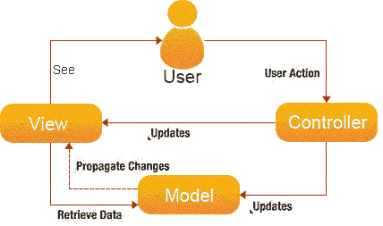

正如你可以在前面的图中看到的那样，应用程序中有三个组件，每个组件都有自己的职责。正如我们之前所说的，MVC 模式就是关注点的分离。在软件系统中，关注点的分离对于使组件灵活且易于通过干净的代码结构进行测试非常重要。在 MVC 模式中，**用户**通过**视图**组件与**控制器**组件交互，而**控制器**组件触发实际操作以准备**模型**组件。那个**模型**组件将更改传播到**视图**，最终，**视图**组件在**用户**面前渲染模型。这就是 MVC 模式实现背后的整个理念。这种 MVC 模式的方法非常适合大多数应用程序，尤其是桌面应用程序。这种 MVC 模式也被称为 Model 1 架构。

但如果你正在使用企业级 Web 应用程序，事情将略不同于桌面应用程序，因为由于 HTTP 协议的无状态特性，在请求生命周期中保持模型可能会相当困难。让我们在下一节中看看 MVC 模式的另一个修改版本，以及 Spring 框架如何采用它来创建企业级 Web 应用程序。

# 带有 Spring 的 Model 2 架构 MVC 模式

Model 1 架构对于 Web 应用程序来说并不非常直接。Model 1 也有分散的导航控制，因为在这个架构中，每个用户都有一个单独的控制器，以及不同的逻辑来确定下一页。那时对于 Web 应用程序，Model 1 架构使用 Servlet 和 JSP 作为开发 Web 应用程序的主要技术。

对于 Web 应用程序，MVC 模式作为模型 2 架构实现。这个模式提供了集中的导航控制逻辑，以便轻松测试和维护 Web 应用程序，并且它还比模型 1 架构的 Web 应用程序提供了更好的关注点分离。基于模型 1 架构的 MVC 模式和基于模型 2 架构修改的 MVC 模式之间的区别在于后者包含一个前端控制器，该控制器将所有传入的请求委派给其他控制器。这些控制器处理传入的请求，返回模型，并选择视图。查看以下图示以更好地理解模型 2 架构的 MVC 模式：

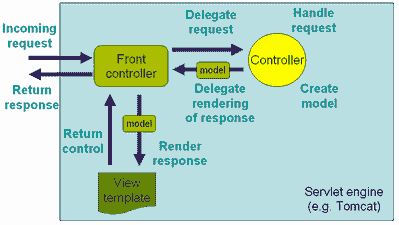

如前图所示，为 MVC 模式引入了一个新的组件，即前端控制器。它实现为一个`javax.servlet.Servlet`，例如 struts 中的`ActionServlet`，JSF 中的`FacesServlet`和 Spring MVC 中的`DispatcherServlet`。它处理传入的请求，并将请求委派给特定的应用程序控制器。该应用程序控制器创建和更新模型，并将其委派给前端控制器进行渲染。最后，**前端控制器**确定特定的视图，并渲染该模型数据。

# 前端控制器设计模式

前端控制器设计模式是一个 J2EE 模式；它为以下应用程序设计问题提供了解决方案：

+   在基于模型 1 架构的 Web 应用程序中，需要太多的控制器来处理太多的请求。维护和重用它们都很困难。

+   每个请求在 Web 应用程序中都有自己的入口点；每个请求应该有一个单一的入口点。

+   JSP 和 Servlet 是模型 1 MVC 模式的主要组件，因此，这些组件处理动作和视图，违反了*单一职责*原则。

前端控制器为 Web 应用程序上述的设计问题提供了解决方案。在 Web 应用程序中，它作为主组件，将所有请求路由到框架控制。这意味着太多的请求都落在单个控制器（前端控制器）上，然后，这些请求被委派给特定的控制器。前端控制器提供集中控制，提高了可重用性和可管理性，因为通常只有资源注册在 Web 容器中。这个控制器不仅处理太多的请求，还有以下职责：

+   它初始化框架以适应请求

+   它加载所有 URL 的映射以及处理请求的组件

+   它为视图准备映射

让我们看看以下关于**前端控制器**的图示：

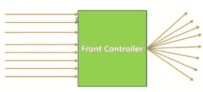

正如您在前面的图中可以看到的，所有应用请求都落在**前端控制器**上，并且它将这些请求委派给配置的应用控制器。

Spring 框架提供了一个基于 MVC 模式的模块，即 Model 2 架构实现。Spring MVC 模块通过引入`org.springframework.web.servlet.DispatcherServlet`类提供了开箱即用的前端控制器模式实现。这是一个简单的`servlet`类，是 Spring MVC 框架的骨干。而且这个 Servlet 与 Spring IoC 容器集成，以利用 Spring 的依赖注入模式。Spring 的 Web 框架使用 Spring 进行其自身的配置，所有控制器都是 Spring Bean；这些控制器是可测试的工件。

在本章中，让我们深入 Spring MVC 的内部，并更仔细地观察 Spring MVC 框架中的`org.springframework.web.servlet.DispatcherServlet`，以及它是如何处理 Web 应用的所有传入请求的。

# 处理请求的生命周期

您是否曾经玩过一款*木质迷宫棋盘游戏，一种带有钢球轴承的迷宫谜题*？您可能在童年时玩过。这是一款非常疯狂的游戏。这个游戏的目标是通过相互连接的弯曲路径将所有钢球轴承发送到木质迷宫棋盘的中心，这些弯曲路径在中心附近有切口，通向第二个弯曲路径。所有球都需要通过这些弯曲路径之间的切口导航到木质迷宫棋盘的中心。如果一个钢球到达中心，那么我们必须小心这个球，以确保在尝试将另一个球移动到中心时，它不会离开中心。您可以在以下图中看到这一点：

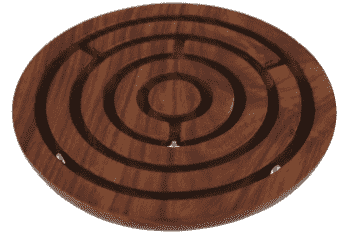

从直观上看，Spring MVC 框架与这款木质迷宫棋盘游戏相似。Spring MVC 框架不是通过移动钢球轴承通过各种弯曲路径和切口，而是通过各种组件如前端控制器（即分发 Servlet）、处理器映射、控制器和视图解析器来移动 Web 应用请求。

让我们看看 Spring MVC 框架中 Web 应用的请求处理流程。Spring Web MVC 的`DispatcherServlet`的请求处理工作流程在以下图中展示：

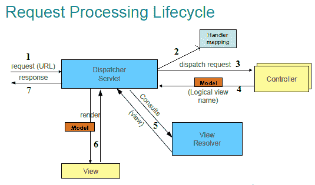

如您所知，前端控制器在 Model 2 MVC 模式中扮演着非常重要的角色，因为它负责处理所有传入的 Web 应用请求，并为浏览器准备响应。在 Spring MVC 框架中，`org.springframework.web.servlet.DispatcherServlet` 扮演着 Model 2 MVC 模式的前端控制器角色。正如您在最后一张图中可以看到的，这个`DispatcherServlet` 使用了许多其他组件来履行其自身角色。让我们看看 Spring MVC 框架中逐步的请求处理过程：

1.  用户点击浏览器或提交应用程序的 Web 表单。请求离开浏览器，可能带有一些附加信息或常见信息。这个请求到达 Spring 的`DispatcherServlet`，它是一个简单的`servlet`类，与其他基于 Java 的 Web 应用程序类似。它是 Spring MVC 框架的前端控制器，将所有传入的请求通过单一点进行集中处理。Spring MVC 框架通过使用这个前端控制器来集中控制请求流程。

1.  请求到达 Spring 的`DispatcherServlet`后，它将请求委托给 Spring MVC 控制器，即应用程序控制器。尽管在一个 Spring Web 应用程序中可能有多个控制器，但每个请求都必须委托给特定的控制器。为此，Spring 的`DispatcherServlet`借助在 Web 应用程序中配置的处理映射来提供帮助。处理映射通过使用 URL 和请求参数来确定特定的控制器。

1.  一旦 Spring 的`DispatcherServlet`借助处理映射配置确定了特定的应用程序控制器，`DispatcherServlet`将请求调度到所选控制器。这是负责根据用户的请求及其参数处理信息的实际控制器。

1.  Spring MVC 的控制器通过使用应用程序的业务服务来执行业务逻辑，并创建一个模型，该模型封装了要返回给用户并显示在浏览器中的信息。这个模型根据用户的请求携带信息。但是，这个模型尚未格式化，我们可以使用任何视图模板技术来在浏览器中渲染模型信息。这就是为什么 Spring MVC 的控制器还返回一个逻辑视图名称以及模型。为什么它返回一个逻辑视图名称？这是因为 Spring MVC 的控制器并未绑定到任何特定的视图技术，如 JSP、JSF、Thymeleaf 等。

1.  再次强调，Spring MVC 的`DispatcherServlet`借助视图解析器；该解析器在 Web 应用程序中配置，用于解析视图。根据配置的`ViewResolver`，它解析实际的视图名称，而不是逻辑视图名称。现在`DispatcherServlet`也有了视图，可以渲染模型信息。

1.  Spring MVC 的`DispatcherServlet`将模型渲染到视图中，并生成用户可读的模型信息格式。

1.  最后，这些信息生成一个响应，并通过`DispatcherServlet`返回给用户的浏览器。

如您所见，处理应用程序请求涉及多个步骤和组件。其中大部分组件与 Spring MVC 框架相关，并且每个组件都有其特定的职责来处理请求。

到目前为止，你已经了解到`DispatcherServlet`是使用 Spring MVC 处理请求的关键组件。它是 Spring Web MVC 的核心。它是一个前端控制器，类似于 Struts 的`ActionServlet` / JSF 的`FacesServlet`，协调所有请求处理活动。它委托给 Web 基础设施 bean，并调用用户 Web 组件。它也非常灵活、可配置和完全可定制。它非常灵活，因为该 servlet 使用的所有组件都是所有基础设施 bean 的接口。以下表格列出了 Spring MVC 框架提供的部分涉及接口：

| **Spring MVC 组件** | **在请求处理中的作用** |
| --- | --- |
| `org.springframework.web.multipart.MultipartResolver` | 它处理多部分请求，例如文件上传 |
| `org.springframework.web.servlet.LocaleResolver` | 它处理区域解析和修改 |
| `org.springframework.web.servlet.ThemeResolver` | 它处理主题解析和修改 |
| `org.springframework.web.servlet.HandlerMapping` | 它将所有传入请求映射到处理器对象。 |
| `org.springframework.web.servlet.HandlerAdapter` | 它基于适配器模式，用于执行处理器对象 |
| `org.springframework.web.servlet.HandlerExceptionResolver` | 它处理处理器执行过程中抛出的异常 |
| `org.springframework.web.servlet.ViewResolver` | 它将逻辑视图名称转换为实际的视图实现 |

上述表格中列出的组件在 Web 应用程序的请求处理生命周期中工作于 Spring MVC 框架。在下一节中，我们将看到如何配置 Spring MVC 的主要组件，即`DispatcherServlet`。我们还将更详细地了解基于 Java 或 XML 的不同实现和配置方式。

# 将 DispatcherServlet 配置为前端控制器

在基于 Java 的 Web 应用程序中，所有 servlet 都在`web.xml`文件中定义。它在启动时由 Web 容器加载，并将每个 servlet 映射到特定的 URL 模式。同样，`org.springframework.web.servlet.DispatcherServlet`是 Spring MVC 的核心；它需要在同一文件`web.xml`中进行配置，并在 Web 应用的启动时加载。在启动时，`DispatcherServlet`被调用以通过 Java、XML 或基于注解的方式加载 bean 的配置来创建 Spring 的`org.springframework.web.context.WebApplicationContext`。servlet 试图从这个 Web 应用程序上下文中获取所有必需的组件。它有责任通过所有其他组件路由请求。

`WebApplicationContext` 是 `ApplicationContext` 的 Web 版本，如本书前几章所述。它具有一些额外的能力，对于 Web 应用来说，除了 `ApplicationContext` 之外，如特定于 servlet 的作用域请求、会话等。`WebApplicationContext` 绑定在 `ServletContext` 中；你也可以通过使用 `RequestContextUtils` 类的静态方法来访问它。让我们看看以下代码片段：

`ApplicationContext webApplicationContext = RequestContextUtils.findWebApplicationContext(request);`

# 由 XML 配置定义

正如你所知，`web.xml` 是任何 Web 应用的根文件，位于 `WEB-INF` 目录中。它包含一个 servlet 规范，并包含所有需要启动的 servlet 配置。让我们看看 Web 应用中 `DispatcherServlet` 配置所需的代码，如下所示：

```java
    <web-app version="3.0" 

    xsi:schemaLocation=http://java.sun.com/xml/ns/javaee 
    http://java.sun.com/xml/ns/javaee/web-app_3_0.xsd      
    metadata-complete="true"> 
      <servlet> 
         <servlet-name>bankapp</servlet-name> 
         <servlet-class>org.springframework.web.servlet.DispatcherServlet</servlet-class> 
         <load-on-startup>1</load-on-startup> 
      </servlet> 
      <servlet-mapping> 
         <servlet-name>bankapp</servlet-name> 
         <url-pattern>/*</url-pattern> 
      </servlet-mapping> 
   </web-app> 
```

前述代码是使用基于 XML 的配置在 Spring Web 应用中配置 `DispatcherServlet` 所需的最小代码。

在 `web.xml` 文件中没有什么特别之处；通常，它只定义一个与传统的 Java Web 应用非常相似的 servlet 配置。但是，DispatcherServlet 会加载一个包含应用 spring beans 配置的文件。默认情况下，它会从 `WEB-INF` 目录加载一个名为 `[servletname]-servlet.xml` 的文件。在我们的例子中，文件名应该是 `bankapp-servlet.xml`，位于 `WEB-INF` 目录中。

# 由 Java 配置定义

在本章中，我们将使用 Java 而不是 XML 来配置我们的 Web 应用在 servlet 容器中的 `DispatcherServlet`。Servlet 3.0 及以后的版本支持基于 Java 的启动，因此，我们可以避免使用 `web.xml` 文件。相反，我们可以创建一个实现 `javax.servlet.ServletContainerInitializer` 接口的 Java 类。Spring MVC 提供了一个 `WebApplicationInitializer` 接口，以确保你的 Spring 配置在任何 Servlet 3 容器中都被加载和初始化。但是，Spring MVC 框架通过提供一个 `WebApplicationInitializer` 接口的抽象类实现，使这个过程变得更加简单。通过使用这个抽象类，你只需映射你的 servlet 映射，并提供根和 MVC 配置类。我个人更喜欢在我的 Web 应用中使用这种方式进行配置。以下是这个配置类的代码：

```java
    package com.packt.patterninspring.chapter10.bankapp.web; 

    import org.springframework.web.servlet.support.AbstractAnnotationConfigDispatcherServletInitializer; 

    import com.packt.patterninspring.chapter10.bankapp.config.AppConfig; 
    import com.packt.patterninspring.chapter10.bankapp.web.mvc.SpringMvcConfig; 

    public class SpringApplicationInitilizer extends AbstractAnnotationConfigDispatcherServletInitializer
    { 
     // Tell Spring what to use for the Root context: as ApplicationContext - "Root" configuration 
      @Override 
      protected Class<?>[] getRootConfigClasses() { 
         return new Class <?>[]{AppConfig.class}; 
      } 
     // Tell Spring what to use for the DispatcherServlet context: WebApplicationContext- MVC 
     configuration 
     @Override 
     protected Class<?>[] getServletConfigClasses() { 
         return new Class <?>[]{SpringMvcConfig.class}; 
     } 

     // DispatcherServlet mapping, this method responsible for URL pattern as like in web.xml file 
     <url-pattern>/</url-pattern> 
     @Override 
     protected String[] getServletMappings() { 
         return new String[]{"/"}; 
     } 
    } 
```

如前述代码所示，`SpringApplicationInitializer` 类扩展了 `AbstractAnnotationConfigDispatcherServletInitializer` 类。它只从开发者那里获取所需的信息，并且所有与 `DispatcherServlet` 相关的配置都由这个类使用 Servlet 容器接口来配置。请查看以下图表，以了解更多关于 `AbstractAnnotationConfigDispatcherServletInitializer` 类及其在应用程序中配置 `DispatcherServlet` 的实现：

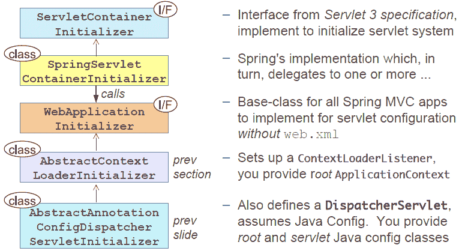

你已经看到 `SpringApplicationInitilizer` 类覆盖了 `AbstractAnnotationConfigDispatcherServletInitializer` 类的三个方法，即 `getServletMappings()`、`getServletConfigClasses()` 和 `getRootConfigClasses()`。`getServletMappings()` 方法定义了 servlet 映射--在我们的应用程序中，它映射到 "`/`"**。**`getServletConfigClasses()` 方法要求 `DispatcherServlet` 使用在 `SpringMvcConfig` 配置类中定义的 bean 加载其应用程序上下文。此配置文件包含与 Web 组件（如控制器、视图解析器和处理器映射）相关的 bean 定义。Spring Web 应用程序还有一个应用程序上下文，它是由 `ContextLoaderListener` 创建的。因此，另一个方法 `getRootConfigClasses()` 加载了其他 bean，如服务、存储库、数据源以及其他在 `AppConfig` 配置类中定义的应用程序中间层和数据层所需的 bean。

Spring 框架提供了一个监听器类--`ContextLoaderListener`。它负责启动后端应用程序上下文。

让我们查看以下图表，以了解在启动 servlet 容器后关于 Spring Web 应用程序设计的更多信息：

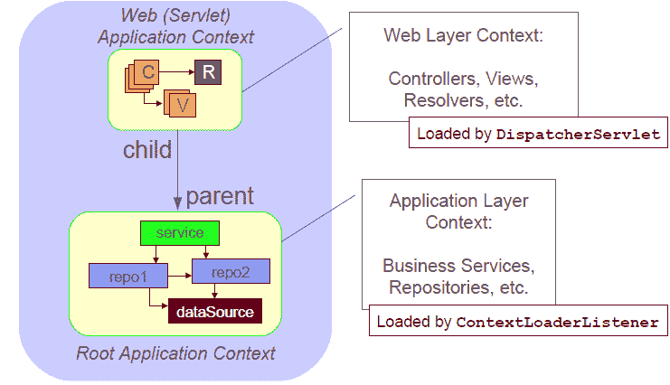

如你在最后一张图中看到的，`getServletConfigClasses()` 方法返回的 Web 组件 bean 定义配置类由 `DispatcherServlet` 加载，而 `getRootConfigClasses()` 方法返回的其他应用程序 bean 定义配置类由 `ContextLoaderListener` 加载。

基于 Java 的 Web 配置仅在部署到支持 **Servlet 3.0** 的服务器上时才有效，例如 **Apache Tomcat 7 或更高版本**。

让我们看看在下一节中如何启用 Spring MVC 框架的更多功能。

# 启用 Spring MVC

有许多方法可以配置 `DispatcherServlet` 以及其他 Web 组件。Spring MVC 框架有许多默认未启用的功能，例如 `HttpMessageConverter`，支持使用 `@Valid` 验证 `@Controller` 输入，等等。因此，我们可以通过使用基于 Java 的配置或 XML 配置来启用这些功能。

要启用 MVC Java 配置，将注解 `@EnableWebMvc` 添加到你的 `@Configuration` 类之一，如下所示：

```java
 import org.springframework.context.annotation.Configuration; 
    import org.springframework.web.servlet.config.annotation.EnableWebMvc; 
    @Configuration 
    @EnableWebMvc 
    public class SpringMvcConfig { 
    } 
```

在 XML 配置中，我们可以使用 MVC 命名空间，其中有一个 `<mvc:annotation-driven>` 元素，你可以使用它来启用基于注解的 Spring MVC。

```java
    <?xml version="1.0" encoding="UTF-8"?> 
    <beans  

    xsi:schemaLocation=" 
        http://www.springframework.org/schema/beans 
        http://www.springframework.org/schema/beans/spring-beans.xsd 
        http://www.springframework.org/schema/mvc 
        http://www.springframework.org/schema/mvc/spring-mvc.xsd"> 

    <mvc:annotation-driven/> 

    </beans> 
```

Spring MVC 的高级功能可以在 Spring Web 应用程序中通过使用 `@EnableWebMvc` 注解或使用 XML 命名空间 `<mvc:annotation-driven/>` 来启用。Spring MVC 框架还允许您通过扩展 `WebMvcConfigurerAdapter` 类或实现 `WebMvcConfigurer` 接口来在 Java 中自定义默认配置。让我们看看添加更多配置后的修改后的配置文件：

```java
    package com.packt.patterninspring.chapter10.bankapp.web.mvc; 

    import org.springframework.context.annotation.Bean; 
    import org.springframework.context.annotation.ComponentScan; 
    import org.springframework.context.annotation.Configuration; 
    import org.springframework.web.servlet.ViewResolver; 
    import org.springframework.web.servlet.config.annotation.DefaultServletHandlerConfigurer; 
    import org.springframework.web.servlet.config.annotation.EnableWebMvc; 
    import org.springframework.web.servlet.config.annotation.WebMvcConfigurerAdapter; 
    import org.springframework.web.servlet.view.InternalResourceViewResolver; 

    @Configuration 
    @ComponentScan(basePackages = {" com.packt.patterninspring.chapter10.bankapp.web.controller"})   
    @EnableWebMvc 
    public class SpringMvcConfig extends WebMvcConfigurerAdapter{ 

    @Bean 
    public ViewResolver viewResolver(){ 
         InternalResourceViewResolver viewResolver = new InternalResourceViewResolver(); 
         viewResolver.setPrefix("/WEB-INF/view/"); 
         viewResolver.setSuffix(".jsp"); 
         return viewResolver; 
    } 

    @Override 
    public void configureDefaultServletHandling(DefaultServletHandlerConfigurer configurer) { 
         configurer.enable(); 
    } 

   }
```

如前述代码所示，配置类 `SpringMvcConfig` 被注解为 `@Configuration`、`@ComponentScan` 和 `@EnableWebMvc`。在这里，`com.packt.patterninspring.chapter10.bankapp.web.controller` 包将被扫描以查找组件。这个类扩展了 `WebMvcConfigurerAdapter` 类，并重写了 `configureDefaultServletHandling()` 方法。我们还配置了一个 `ViewResolver` bean。

到目前为止，你已经学习了 MVC 模式和架构是什么，以及如何设置 `DispatcherServlet` 并启用 Spring Web 应用程序的基本 Spring MVC 组件。在下一节中，我们将讨论如何在 Spring 应用程序中实现控制器，以及这些控制器如何处理 Web 请求。

# 实现控制器

如我们在 MVC 模式中所见，控制器也是 MVC 模式中的关键组件之一。它们负责执行实际请求、准备模型，并将此模型连同逻辑视图名称发送到前端控制器。在 Web 应用程序中，控制器在 Web 层和核心应用程序层之间工作。在 Spring MVC 框架中，控制器更像是有方法的 POJO 类；这些方法被称为处理器，因为它们被 `@RequestMapping` 注解所标记。让我们看看如何在 Spring Web 应用程序中定义控制器类。

# 使用 @Controller 定义控制器

让我们为我们的银行应用程序创建一个控制器类。`HomeController` 是一个控制器类，它处理 `/` 的请求并渲染银行应用程序的首页：

```java
    package com.packt.patterninspring.chapter10.bankapp.web.controller; 

    import org.springframework.stereotype.Controller; 
    import org.springframework.web.bind.annotation.RequestMapping; 
    import org.springframework.web.bind.annotation.RequestMethod; 

    @Controller 
    public class HomeController { 

      @RequestMapping(value = "/", method = RequestMethod.GET) 
      public String home (){ 
         return "home"; 
     } 
   } 
```

如前述代码所示，`HomeController`类包含`home()`方法。它是一个处理器方法，因为它被`@RequestMapping`注解标记。它指定此方法处理所有映射到`/` URL 的请求。另一个需要注意的事情是我们的控制器类`HomeController`也被`@Controller`注解标记。正如我们所知，`@Controller`是一个 stereotypes 注解，它也被用来在 Spring IoC 容器中创建 bean，类似于`@Component`注解的其他元注解，如`@Service`和`@Repository`。是的，这个注解指定任何类作为控制器，并给这个类添加一些 Spring MVC 的更多功能。你也可以使用`@Component`注解代替`@Controller`来在 Web 应用程序中创建 Spring beans，但在这个情况下，那个 bean 没有像在 Web 层的异常处理、处理器映射等功能一样的 Spring MVC 框架的能力。

让我们更仔细地看看`@RequestMapping`注解，以及`@RequestMapping`注解的复合变体。

# 使用`@RequestMapping`映射请求

之前定义的`HomeController`类只有一个处理器方法，此方法被`@RequestMapping`注解标记。在这里，我使用了这个注解的两个属性——一个是 value 属性，用于将 HTTP 请求映射到`/`模式，另一个属性是一个支持 HTTP `GET`方法的方法。我们可以使用一个处理器方法定义多个 URL 映射。让我们在以下代码片段中看看这个例子：

```java
    @Controller 
    public class HomeController { 

     @RequestMapping(value = {"/", "/index"}, method = RequestMethod.GET) 
     public String home (){ 
         return "home"; 
    } 
   } 
```

在前面的代码中，`@RequestMapping`注解的 value 属性有一个字符串值数组。现在，这个处理器方法被映射到两个 URL 模式，例如`/`和`/index`。Spring MVC 的`@RequestMapping`注解支持多种 HTTP 方法，如`GET`、`POST`、`PUT`、`DELETE`等。截至版本 4.3，Spring 组合了`@RequestMapping`变体，现在提供了映射常见 HTTP 方法的简单方法，如下所示的表达式：

```java
    @RequestMapping + HTTP GET = @GetMapping 
    @RequestMapping + HTTP POST = @PostMapping 
    @RequestMapping + HTTP PUT = @PutMapping 
    @RequestMapping + HTTP DELETE = @DeleteMapping 
```

这是修改后的`HomeController`，带有复合注解映射：

```java
    @Controller 
    public class HomeController { 

      @GetMapping(value = {"/", "/index"}) 
      public String home (){ 
         return "home"; 
      } 
   } 
```

我们可以在两个位置使用`@RequestMapping`注解：在类级别，以及在方法级别。让我们看看这个例子：

# 方法级别的`@RequestMapping`

Spring MVC 允许你在方法级别使用`@RequestMapping`注解，将此方法作为 Spring 网络应用程序中的处理器方法。让我们看看如何在以下类中使用它：

```java
     package com.packt.patterninspring.
       chapter10.bankapp.web.controller; 
     import org.springframework.stereotype.Controller; 
     import org.springframework.ui.ModelMap; 
     import org.springframework.web.bind.annotation.RequestMapping; 
     import org.springframework.web.bind.annotation.RequestMethod; 

     import com.packt.patterninspring.chapter10.bankapp.model.User; 

     @Controller 
     public class HomeController { 

      @RequestMapping(value = "/", method = RequestMethod.GET) 
      public String home (){ 
         return "home"; 
      } 

      @RequestMapping(value = "/create", method = RequestMethod.GET) 
      public String create (){ 
         return "addUser"; 
      } 

      @RequestMapping(value = "/create", method = RequestMethod.POST) 
      public String saveUser (User user, ModelMap model){ 
         model.put("user", user); 
         return "addUser"; 
      } 
    } 
```

如您在前面的代码中所见，我使用了`@RequestMapping`注解，并带有三个方法`home()`、`create()`和`saveUser()`。在这里，我还使用了这个注解的“value”和“method”属性。其中，“value”属性包含请求映射和请求 URL，“method”属性用于定义 HTTP 请求方法，如 GET 或 POST。映射规则通常是基于 URL 的，并且可选地使用通配符，如下所示：

```java
    - /create 
    - /create/account 
    - /edit/account 
    - /listAccounts.htm - Suffix ignored by default. 
    - /accounts/* 
```

在前面的示例中，处理方法有一些参数，因此我们可以传递任何类型和数量的参数。Spring MVC 将这些参数作为请求参数处理。让我们首先看看如何在类级别上定义`@RequestMapping`，然后我们将讨论请求参数。

# 类级别的`@RequestMapping`

Spring MVC 允许您在类级别上使用`@RequestMapping`注解。这意味着我们可以使用`@RequestMapping`注解控制器类，如下面的代码片段所示：

```java
    package com.packt.patterninspring.chapter10.bankapp.web.controller; 

    import org.springframework.stereotype.Controller; 
    import org.springframework.ui.ModelMap; 
    import org.springframework.web.bind.annotation.RequestMapping; 
    import org.springframework.web.bind.annotation.RequestMethod; 

    @Controller 
    @RequestMapping("/") 
    public class HomeController { 

     @RequestMapping(method=GET) 
     public String home() { 
         return "home"; 
     } 
   } 
```

如您在前面的代码中所见，`HomeController`类被注解了`@RequestMapping`和`@Controller`注解。但是 HTTP 方法仍然定义在处理方法之上。类级别的映射应用于此控制器下定义的所有处理方法。

在 Spring MVC 配置之后，我们创建了一个控制器类，其中包含处理方法。在深入更多细节之前，让我们测试这个控制器。在这本书中，我没有使用任何 JUnit 测试用例，所以在这里，我将在 Tomcat 容器上运行这个 Web 应用程序。您可以在浏览器中看到以下输出：

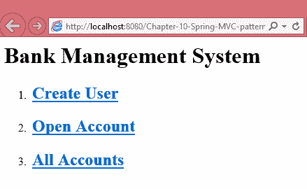

最后一张图片是我们**银行管理系统**Web 应用程序的首页。

在 Spring 3.1 之前，Spring MVC 使用两步将请求映射到处理方法。首先，通过`DefaultAnnotationHandlerMapping`选择控制器，然后通过`AnnotationMethodHandlerAdapter`将实际方法映射到传入的请求。但是从 Spring 3.1 开始，Spring MVC 通过使用`RequestMappingHandlerMapping`直接一步将请求映射到处理方法。

在下一节中，我们将看到如何定义处理方法，以及 Spring MVC 中处理方法的允许返回类型和参数。

# 定义`@RequestMapping`处理方法

在 Spring MVC 框架中，`@RequestMapping`处理方法在定义签名方面非常灵活。您可以在任何顺序中传递任意数量的参数。这些方法支持大多数类型的参数，并且在返回类型方面也非常灵活。它可以有多个返回类型，其中一些如下列出：

+   支持的方法参数类型

    +   请求或响应对象（Servlet API）

    +   会话对象（Servlet API）

    +   `java.util.Locale`

    +   `java.util.TimeZone`

    +   `java.io.InputStream` / `java.io.Reader`

    +   `java.io.OutputStream` / `java.io.Writer`

    +   `java.security.Principal`

    +   `@PathVariable`

    +   `@RequestParam`

    +   `@RequestBody`

    +   `@RequestPart`

    +   `java.util.Map` / `org.springframework.ui.Model` / `org.springframework.ui.ModelMap`

    +   `org.springframework.validation.Errors` / `org.springframework.validation.BindingResult`

+   支持的方法返回类型：

    +   `ModelAndView`

    +   `Model`

    +   `Map`

    +   `View`

    +   `String`

    +   `void`

    +   `HttpEntity<?>` 或 `ResponseEntity<?>`

    +   `HttpHeaders`

    +   `Callable<?>`

    +   `DeferredResult<?>`

我列出了一些支持的返回类型和方法参数类型。看起来 Spring MVC 在定义请求处理方法方面非常灵活和可定制，与其他 MVC 框架不同。

在 Spring MVC 框架中，处理方法甚至可以以任何顺序传递参数，但在 Errors 或 `BindingResult` 参数的情况下，我们必须将这些参数放在前面，然后是模型对象，以便立即绑定，因为处理方法可能有任意数量的模型对象，Spring MVC 为每个对象创建单独的 Errors 或 `BindingResult` 实例。例如：

**无效位置** `@PostMapping`

`public String saveUser(@ModelAttribute ("user") User user, ModelMap model, BindingResult result){...}`

**有效位置** `@PostMapping`

`public String saveUser(@ModelAttribute ("user") User user, BindingResult result, ModelMap model){...}`

让我们看看如何在下一节中如何将模型数据传递到视图层。

# 将模型数据传递到视图

到目前为止，我们已经实现了一个非常简单的 `HomeCotroller` 并对其进行了测试。但在网络应用程序中，我们也向视图层传递了模型数据。我们传递到模型中的模型数据（简单来说，它是一个 `Map`），控制器与逻辑视图名称一起返回该模型。正如你所知道的那样，Spring MVC 支持处理方法的多种返回类型。让我们看看以下示例：

```java
    package com.packt.patterninspring.chapter10.bankapp.web.controller; 

    import java.util.List; 

    import org.springframework.beans.factory.annotation.Autowired; 
    import org.springframework.stereotype.Controller; 
    import org.springframework.ui.ModelMap; 
    import org.springframework.web.bind.annotation.GetMapping; 
    import org.springframework.web.bind.annotation.PostMapping; 

    import com.packt.patterninspring.chapter10.bankapp.model.Account; 
    import com.packt.patterninspring.chapter10.bankapp.service.AccountService; 

    @Controller 
    public class AccountController { 

     @Autowired 
     AccountService accountService; 

     @GetMapping(value = "/open-account") 
     public String openAccountForm (){ 
         return "account"; 
     } 

     @PostMapping(value = "/open-account") 
     public String save (Account account, ModelMap model){ 
         account = accountService.open(account); 
         model.put("account", account); 
         return "accountDetails"; 
     } 

     @GetMapping(value = "/all-accounts") 
     public String all (ModelMap model){ 
         List<Account> accounts = accountService.findAllAccounts(); 
         model.put("accounts", accounts); 
         return "accounts"; 
     } 
   } 
```

如前例所示，`AccountController` 类有三个处理方法。两个处理方法返回模型数据和逻辑视图名称。但在这个例子中，我正在使用 Spring MVC 的 `ModelMap`，因此，我们不需要强制返回逻辑视图，它将自动与响应绑定。

接下来，你将学习如何接受请求参数。

# 接受请求参数

在 Spring 网络应用程序中，有时我们只是从服务器端读取数据，就像我们的例子一样。读取所有账户的数据是一个简单的读取调用，不需要请求参数。但如果你想要获取特定账户的数据，你必须将账户 ID 与请求参数一起传递。同样，为了在银行创建新的账户，你必须将账户对象作为参数传递。在 Spring MVC 中，我们可以以下方式接受请求参数：

+   获取查询参数

+   通过路径变量获取请求参数

+   获取表单参数

让我们逐一查看这些方法。

# 获取查询参数

在 Web 应用程序中，我们可以从请求中获取请求参数——在我们的例子中是账户 ID，如果你想要访问特定账户的详细信息。让我们使用以下代码从请求参数中获取账户 ID：

```java
    @Controller 
    public class AccountController { 
      @GetMapping(value = "/account") 
      public String getAccountDetails (ModelMap model, HttpServletRequest request){ 
         String accountId = request.getParameter("accountId"); 
         Account account = accountService.findOne(Long.valueOf(accountId)); 
         model.put("account", account); 
         return "accountDetails"; 
     } 
    }  
```

在前面的代码片段中，我使用了传统的访问请求参数的方式。Spring MVC 框架提供了一个注解`@RequestParam`来访问请求参数。让我们使用`@RequestParam`注解将请求参数绑定到控制器中的方法参数。以下代码片段展示了`@RequestParam`注解的使用。它从请求中提取参数，并执行类型转换：

```java
    @Controller 
    public class AccountController { 
     @GetMapping(value = "/account") 
     public String getAccountDetails (ModelMap model, @RequestParam("accountId") long accountId){ 
         Account account = accountService.findOne(accountId); 
         model.put("account", account); 
         return "accountDetails "; 
    } 
   }  
```

在前面的代码中，我们通过使用`@RequestParam`注解来访问请求参数，你也可以注意到我没有使用从`String`到`Long`的类型转换，这将由这个注解自动完成。这里还有一个需要注意的事项，即使用这个注解的参数默认是必需的，但 Spring 允许你通过使用`@RequestParam`注解的`required`属性来覆盖这个行为。

```java
    @Controller 
    public class AccountController { 
      @GetMapping(value = "/account") 
      public String getAccountDetails (ModelMap model,  
         @RequestParam(name = "accountId") long accountId 
         @RequestParam(name = "name", required=false) String name){ 
         Account account = accountService.findOne(accountId); 
         model.put("account", account); 
         return " accountDetails "; 
     } 
   } 
```

现在我们来看看如何使用路径变量来获取请求路径的一部分作为输入。

# 通过路径变量获取请求参数

Spring MVC 允许你通过 URI 传递参数，而不是通过请求参数传递。传递的值可以从请求 URL 中提取。它基于 URI 模板。这不是 Spring 特有的概念，许多框架通过使用`{...}`占位符和`@PathVariable`注解来实现这一点。它允许创建没有请求参数的干净 URL。以下是一个示例：

```java
    @Controller 
    public class AccountController { 
      @GetMapping("/accounts/{accountId}") 
      public String show(@PathVariable("accountId") long accountId, Model model) { 
         Account account = accountService.findOne(accountId); 
         model.put("account", account); 
         return "accountDetails"; 
     } 
     ... 
   } 
```

在上一个处理器中，方法可以像这样处理请求：

```java
http://localhost:8080/Chapter-10-Spring-MVC-pattern/account?accountId=1000 
```

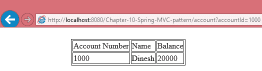

但在前面的示例中，处理器方法可以处理如下请求：

```java
http://localhost:8080/Chapter-10-Spring-MVC-pattern/accounts/2000 
```

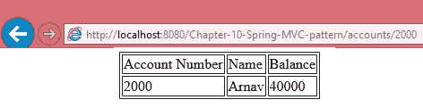

我们在前面的代码和图像中已经看到了如何通过使用请求参数或路径参数来传递一个值。如果你在请求中传递少量数据，这两种方式都是可行的。但在某些情况下，我们必须向服务器传递大量数据，例如表单提交。让我们看看如何编写处理表单提交的控制器方法。

# 处理网页的表单形式

正如你所知，在任何 Web 应用程序中，我们都可以从服务器发送和接收数据。在 Web 应用程序中，我们通过填写表单并提交这个表单到服务器来发送数据。Spring MVC 也通过显示表单、验证表单数据以及提交这些表单数据来为客户端提供表单处理的支持。

基本上，Spring MVC 首先处理表单显示和表单处理。在银行管理应用程序中，你需要创建一个新的用户，并在银行中开设一个新的账户，因此，让我们创建一个控制器类，AccountController，它包含一个用于显示开户表单的单个请求处理方法，如下所示：

```java
    package com.packt.patterninspring.chapter10.bankapp.web.controller; 

    import org.springframework.stereotype.Controller; 
    import org.springframework.web.bind.annotation.GetMapping; 

    @Controller 
    public class AccountController { 

     @GetMapping(value = "/open-account") 
     public String openAccountForm (){ 
         return "accountForm"; 
    } 
   } 
```

`openAccountForm()`方法的`@GetMapping`注解声明它将处理对`/open-account`的 HTTP GET 请求。这是一个简单的方法，没有输入，只返回一个名为`accountForm`的逻辑视图。我们已经配置了`InternalResourceViewResolver`，这意味着将调用`/WEB-INF/views/accountForm.jsp`中的 JSP 来渲染开户表单。

这是您现在将使用的 JSP 代码：

```java
    <%@ taglib prefix = "c" uri = "http://java.sun.com/jsp/jstl/core" %> 
    <html> 
     <head> 
         <title>Bank Management System</title> 
         <link rel="stylesheet" type="text/css" href="<c:url value="/resources/style.css" />" > 
     </head> 
     <body> 
         <h1>Open Account Form</h1> 
          <form method="post"> 
           Account Number:<br> 
           <input type="text" name="id"><br> 
           Account Name:<br> 
           <input type="text" name="name"><br> 
           Initial Balance:<br> 
           <input type="text" name="balance"><br> 
           <br> 
           <input type="submit" value="Open Account"> 
           </form>  
    </body> 
  </html>    
```

如您在前面的代码中可以看到，我们有一个开户表单。它包含一些字段，例如`AccountId`、`Account Name`和`Initial Balance`。这个 JSP 页面有一个用于表单的`<form>`标签，而这个`<form>`标签没有任何 action 参数。这意味着当我们提交这个表单时，它将使用`POST` HTTP 方法调用将表单数据发送到相同的 URI `/open-account`。以下截图显示了账户表单：

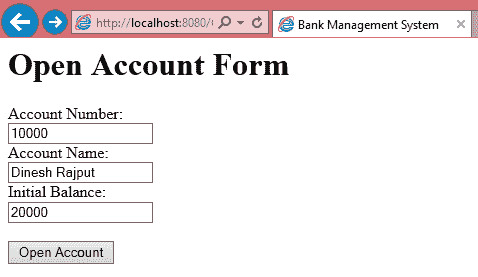

让我们添加另一个方法来处理对 HTTP `POST`方法具有相同 URI `/open-account`的调用。

# 实现表单处理控制器

让我们通过在 Web 应用程序中为 URI `/open-account`添加另一个处理方法来查看相同的`AccountController`类：

```java
    package com.packt.patterninspring.chapter10.bankapp.web.controller; 

    import java.util.List; 

    import org.springframework.beans.factory.annotation.Autowired; 
    import org.springframework.stereotype.Controller; 
    import org.springframework.ui.ModelMap; 
    import org.springframework.web.bind.annotation.GetMapping; 
    import org.springframework.web.bind.annotation.PathVariable; 
    import org.springframework.web.bind.annotation.PostMapping; 

    import com.packt.patterninspring.chapter10.bankapp.model.Account; 
    import com.packt.patterninspring.chapter10.bankapp.service.AccountService; 

    @Controller 
     public class AccountController { 

       @Autowired 
       AccountService accountService; 

       @GetMapping(value = "/open-account") 
       public String openAccountForm (){ 
         return "accountForm"; 
       } 

       @PostMapping(value = "/open-account") 
       public String save (Account account){ 
         accountService.open(account); 
         return "redirect:/accounts/"+account.getId(); 
       } 

       @GetMapping(value = "/accounts/{accountId}") 
       public String getAccountDetails (ModelMap model, @PathVariable Long accountId){ 
         Account account = accountService.findOne(accountId); 
         model.put("account", account); 
         return "accountDetails"; 
       } 
    } 
```

如您在前面的代码中可以看到，我们在`AccountController`方法中添加了两个额外的处理方法，并且将服务`AccountService`注入到这个控制器中，以便将账户详情保存到数据库中。每当处理来自开户表单的`POST`请求时，控制器接受账户表单数据，并通过注入的账户服务将其保存到数据库中。它将账户表单数据作为账户对象接受。您可能也会注意到，在通过 HTTP `POST`方法处理表单数据后，处理方法将重定向到账户详情页面。在`POST`提交后重定向也是一个更好的实践，以防止意外地两次提交表单。以下是在提交请求后显示的屏幕截图：

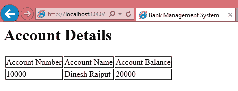

如您在浏览器的前面输出中可以看到，提交账户表单后，这个页面被渲染。因为我们添加了一个请求处理方法，这个处理方法处理了请求，并渲染了包含账户详情的另一个网页。以下 JSP 页面作为前面输出的视图被渲染：

```java
    <%@ taglib prefix = "c" uri = "http://java.sun.com/jsp/jstl/core" %> 
    <html> 
     <head> 
         <title>Bank Management System</title> 
         <link rel="stylesheet" type="text/css" href="<c:url value="/resources/style.css" />" > 
     </head> 
     <body> 
         <h1>${message} Account Details</h1> 
           <c:if test="${not empty account }"> 
               <table border="1"> 
                     <tr> 
                           <td>Account Number</td> 
                           <td>Account Name</td> 
                           <td>Account Balance</td> 
                     </tr> 
                     <tr> 
                           <td>${account.id }</td> 
                           <td>${account.name }</td> 
                           <td>${account.balance }</td> 
                     </tr> 
               </table> 
           </c:if> 
      </body> 
    </html> 
```

在这段最后的代码中，处理方法将`Account`对象发送到模型，并返回逻辑视图名称。这个 JSP 页面渲染从响应中获取的`Account`对象。

这里需要注意的一点是，账户对象有 ID、名称和余额属性，这些属性将从与账户表单中字段名称相同的请求参数中填充。如果任何对象属性名称与 HTML 表单的字段名称匹配，则此属性将使用 NULL 值初始化。

# 使用命令设计模式进行数据绑定

将请求封装为一个对象，从而让您可以使用不同的请求参数化客户端，排队或记录请求，并支持可撤销操作。

- GOF 设计模式

您在 第三章 中学习了命令设计模式，*考虑结构性和行为模式*。它是 GOF 模式行为模式家族的一部分。它是一个非常简单的数据驱动模式。它允许您将请求数据封装到对象中，并将该对象作为命令传递给调用者方法，该方法将命令作为另一个对象返回给调用者。

Spring MVC 实现了命令设计模式（Command Design pattern），将来自网页表单的请求数据作为一个对象绑定，并将该对象传递给控制器类中的请求处理器方法。在这里，我们将探讨如何使用此模式将请求数据绑定到对象，并探讨使用数据绑定的好处和可能性。在以下类中，`Account` Java Bean 是一个具有三个属性（`id`、`name` 和 `balance`）的简单对象：

```java
    package com.packt.patterninspring.chapter10.bankapp.model; 

    public class Account{ 

     Long id; 
     Long balance; 
     String name; 

     public Long getId() { 
         return id; 
     } 
     public void setId(Long id) { 
         this.id = id; 
     } 
     public Long getBalance() { 
         return balance; 
     } 
     public void setBalance(Long balance) { 
           this.balance = balance; 
     } 
     public String getName() { 
         return name; 
     } 
     public void setName(String name) { 
         this.name = name; 
     } 
     @Override 
     public String toString() { 
         return "Account [id=" + id + ", balance=" + balance + ", name=" + name + "]"; 
     } 

    } 
```

要么我们提交与对象属性名称相同的输入文本字段名称的网页表单，要么我们以 `http://localhost:8080/Chapter-10-Spring-MVC-pattern/account?id=10000` 的形式接收请求。在这两种情况下，在幕后，Spring 调用 `Account` 类的设置方法来绑定请求数据或网页表单数据到对象。Spring 还允许您绑定索引集合，如 List、Map 等。

我们还可以自定义数据绑定。Spring 提供了两种自定义数据绑定的方式：

+   **全局自定义**：它为特定的命令对象在整个 Web 应用程序中自定义数据绑定行为

+   **按控制器自定义**：它为特定命令对象针对每个控制器类自定义数据绑定行为

在这里，我将仅讨论针对特定控制器的自定义。让我们看看以下代码片段，用于自定义 `Account` 对象的数据绑定：

```java
    package com.packt.patterninspring.chapter10.bankapp.web.controller; 

    .... 
    .... 
    @Controller 
    public class AccountController { 

     @Autowired 
     AccountService accountService; 
     .... 
     .... 
     @InitBinder 
     public void initBinder(WebDataBinder binder) { 
         binder.initDirectFieldAccess(); 
         binder.setDisallowedFields("id"); 
         binder.setRequiredFields("name", "balance"); 
     } 
     .... 
     .... 
    } 
```

如前述代码所示，`AccountController` 有一个 `initBinder(WebDataBinder binder)` 方法，该方法被 `@InitBinder` 注解标记。此方法必须具有 void 返回类型，并且有一个 `org.springframework.web.bind.WebDataBinder` 作为方法参数。`WebDataBinder` 对象有多个方法；我们在前述代码中使用了其中一些。`WebDataBinder` 用于自定义数据绑定。

# 使用 `@ModelAttributes` 自定义数据绑定

Spring MVC 提供了一个额外的注解 `@ModelAttributes`，用于将数据绑定到 `Command` 对象。这是绑定数据并自定义数据绑定的一种方法。此注解允许您控制 `Command` 对象的创建。在 Spring MVC 应用程序中，此注解可以用于方法和方法参数。让我们看看以下示例：

+   在方法上使用 `@ModelAttribute`

我们可以在方法上使用`ModelAttribute`注解来创建一个用于我们表单的对象，如下所示：

```java
    package com.packt.patterninspring.chapter10.bankapp.web.controller; 
    .... 
    .... 
    @Controller 
    public class AccountController { 
      .... 
      @ModelAttribute 
      public Account account () { 
         return new Account(); 
     } 
      .... 
   } 
```

+   在方法参数上使用`@ModelAttribute`

我们还可以在方法参数上使用这个注解。在这种情况下，处理方法的方法参数是从模型对象中查找的。如果它们在模型中不可用，则将使用默认构造函数创建：

```java
    package com.packt.patterninspring.chapter10.bankapp.web.controller; 
    .... 
    .... 
    @Controller 
    public class AccountController { 
      ... 
      @PostMapping(value = "/open-account") 
      public String save (@ModelAttribute("account") Account account){ 
         accountService.open(account); 
         return "redirect:/accounts/"+account.getId(); 
    } 
    .... 
  } 
```

正如您在最后的代码片段中所看到的，`@ModelAttribute`注解被用于方法参数上。这意味着`Account`对象是从模型对象中获取的。如果它不存在，它将使用默认构造函数创建。

当`@ModelAttribute`注解放在一个方法上时，这个方法将在请求处理方法被调用之前被调用。

到目前为止，我们已经了解了 Spring MVC 如何以传统方式或通过使用`@RequestParam`、`@PathVariable`注解来处理请求和请求参数。我们还看到了如何处理表单网页，并在控制器层中将表单数据绑定到对象来处理`POST`请求。现在让我们来看看如何验证提交的表单数据对于业务是否有效或无效。

# 验证表单输入参数

在一个 Web 应用程序中，验证表单数据非常重要，因为最终用户可以提交任何内容。假设在一个应用程序中，用户通过填写账户名称提交账户表单，那么它可以在银行创建新的账户，账户持有人名称。因此，我们必须在数据库中创建新记录之前确保表单数据的有效性。您不需要在处理方法中处理验证逻辑。Spring 提供了对 JSR-303 API 的支持。从 Spring 3.0 开始，Spring MVC 支持这个 Java 验证 API。在您的 Spring Web 应用程序中配置 Java 验证 API 不需要太多配置——您只需将此 API 的实现添加到您的应用程序类路径中，例如 Hibernate Validator。

Java 验证 API 有几个注解来验证`Command`对象的属性。我们可以对`Command`对象属性的值施加约束。在本章中，我没有探索所有这些注解，但让我们看看以下使用一些这些注解的示例：

```java
    package com.packt.patterninspring.chapter10.bankapp.model; 

    import javax.validation.constraints.NotNull; 
    import javax.validation.constraints.Size; 

    public class Account{ 

     // Not null 
     @NotNull 
     Long id; 
     // Not null 
     @NotNull 
     Long balance; 
     // Not null, from 5 to 30 characters 
     @NotNull 
     @Size(min=2, max=30) 
     String name; 

     public Long getId() { 
         return id; 
     } 
     public void setId(Long id) { 
         this.id = id; 
     } 
     public Long getBalance() { 
         return balance; 
     } 
     public void setBalance(Long balance) { 
         this.balance = balance; 
     } 
     public String getName() { 
         return name; 
     } 
     public void setName(String name) { 
         this.name = name; 
     } 
     @Override 
     public String toString() { 
         return "Account [id=" + id + ", balance=" + balance + ", name=" + name + "]"; 
     } 

    } 
```

正如您在前面代码中所看到的，Account 类的属性现在被注解为`@NotNull`，以确保值不能为 null，并且一些属性也被注解为`@Size`，以确保字符数在最小和最大长度之间。

仅注解`Account`对象的属性是不够的。我们必须注解`AccountController`类的 save()方法参数，如下所示：

```java
    package com.packt.patterninspring.chapter10.bankapp.web.controller; 
    .... 
    .... 
    @Controller 
    public class AccountController { 

     .... 
     @PostMapping(value = "/open-account") 
     public String save (@Valid @ModelAttribute("account") Account account, Errors errors){ 
         if (errors.hasErrors()) { 
               return "accountForm"; 
         } 
         accountService.open(account); 
         return "redirect:/accounts/"+account.getId(); 
     } 
     .... 
    } 
```

如前述代码所示，`Account` 参数现在被注解为 `@Valid`，以指示 Spring 命令对象具有应强制执行的验证约束。让我们看看在提交带有无效数据的 Web 开户表单时的输出：

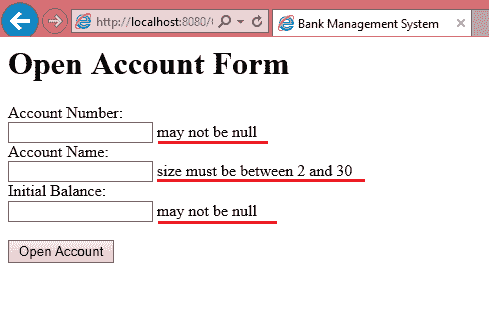

由于我在提交此表单时没有填写数据，它已被重定向到同一页面，并显示验证错误。Spring 还允许你通过将这些消息配置到属性文件中来自定义这些验证消息。

到目前为止，在本章中，你已经了解了 MVC 模式的控制器组件。你还学习了如何在 Web 应用程序中创建和配置它。让我们在下一节中探索 MVC 模式的另一个组件，视图。

# 在 MVC 模式中实现视图

视图是 MVC 模式中最重要的组件。控制器将模型和逻辑视图名称一起返回给前端控制器。前端控制器使用配置的视图解析器解析到实际视图。Spring MVC 提供了多个视图解析器来支持多种视图技术，如 JSP、Velocity、FreeMarker、JSF、Tiles、Thymeleaf 等。你必须根据你在 Web 应用程序中使用的视图技术来配置视图解析器。请查看以下图表，以了解 Spring MVC 中视图模式的相关信息：

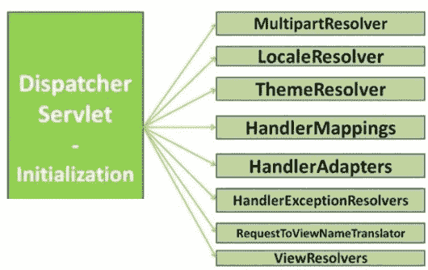

如上图所示，Spring MVC 的前端控制器根据不同的视图技术有多个视图解析器。但本章中，我们将只使用 JSP 作为视图技术，因此，我们将只探索与 JSP 相关的视图解析器，即 `InternalResourveViewResolver`。

视图渲染 Web 输出。对于 JSP、XSLT、模板方法（Velocity、FreeMarker）等，都有许多内置视图可用。Spring MVC 还提供了用于创建 PDF、Excel 工作表等的视图支持类。

控制器通常在 String MVC 中返回一个 *逻辑视图名称*，但 Spring 的 `ViewResolvers` 会根据视图名称选择视图。让我们看看如何在 Spring MVC 应用程序中配置 `ViewResolver`。

# 在 Spring MVC 中定义 ViewResolver

在 Spring MVC 中，`DispatcherServlet` 会委托给 `ViewResolver` 来根据视图名称获取视图实现。默认的 `ViewResolver` 将视图名称视为一个相对于 Web 应用的文件路径，即一个 JSP--`/WEB-INF/views/account.jsp`。我们可以通过向 `DispatcherServlet` 注册一个 `ViewResolver` 实例来覆盖这个默认设置。在我们的 Web 应用程序中，我们使用了 `InternalResourceViewResolver`，因为它与 JSP 视图相关，但在 Spring MVC 中还有其他几个选项，如前文所述。

# 实现视图

以下代码展示了 MVC 模式中的视图渲染：

`accountDetails.jsp`:

```java
    <%@ taglib prefix = "c" uri = "http://java.sun.com/jsp/jstl/core" %> 
    <html> 
     <head> 
         <title>Bank Management System</title> 
         <link rel="stylesheet" type="text/css" href="<c:url value="/resources/style.css" />" > 
     </head> 
    <body> 
         <h1>${message} Account Details</h1> 
           <c:if test="${not empty account }"> 
               <table border="1"> 
                     <tr> 
                           <td>Account Number</td> 
                           <td>Account Name</td> 
                           <td>Account Balance</td> 
                     </tr> 
                     <tr> 
                           <td>${account.id }</td> 
                           <td>${account.name }</td> 
                           <td>${account.balance }</td> 
                     </tr> 
               </table> 
           </c:if> 
      </body> 
    </html> 
```

如前代码所示，当控制器返回`accountDetails`作为逻辑视图名称时，Spring MVC 将渲染此视图。但是它是如何被 Spring MVC 解析的呢？让我们看看 Spring 配置文件中`ViewResolver`的配置。

# 在 Spring MVC 中注册视图解析器

让我们注册与 JSP 相关的`ViewResolver`，即在 Spring Web 应用程序中配置`InternalResourceViewResolver`，如下所示：

```java
     package com.packt.patterninspring.chapter10.bankapp.web.mvc; 

     import org.springframework.context.annotation.Bean; 
     import org.springframework.context.annotation.ComponentScan; 
     import org.springframework.context.annotation.Configuration; 
     import org.springframework.web.servlet.ViewResolver; 
     import org.springframework.web.servlet.config.annotation.EnableWebMvc; 
     import org.springframework.web.servlet.config.annotation.WebMvcConfigurerAdapter; 
     import org.springframework.web.servlet.view.InternalResourceViewResolver; 

     @Configuration 
     @ComponentScan(basePackages = {"com.packt.patterninspring.chapter10.bankapp.web.controller"})       
     @EnableWebMvc 
     public class SpringMvcConfig extends WebMvcConfigurerAdapter{ 
       .... 
        @Bean 
         public ViewResolver viewResolver(){ 
         InternalResourceViewResolver viewResolver = new InternalResourceViewResolver(); 
         viewResolver.setPrefix("/WEB-INF/views/"); 
         viewResolver.setSuffix(".jsp"); 
         return viewResolver; 
     } 
      .... 
   } 
```

如前代码所示，假设控制器返回逻辑视图名称，`accountDetails`。所有视图的 JSP 文件都放置在 Web 应用程序的`/WEB-INF/views/`目录中。`accountDetails.jsp`视图文件用于显示账户详情。根据前面的配置文件，实际视图名称是通过将前缀`/WEB-INF/views/`和后缀`.jsp`添加到应用程序控制器返回的逻辑视图名称中得到的。如果应用程序控制器返回`accountDetails`作为逻辑视图名称，那么`ViewResolver`通过添加前缀和后缀将其转换为物理视图名称；最后，在我们的应用程序中变为`/WEB-INF/views/accountDetails.jsp`。以下图示说明了 Spring MVC 的前端控制器如何在 Spring Web 应用程序中解析视图：

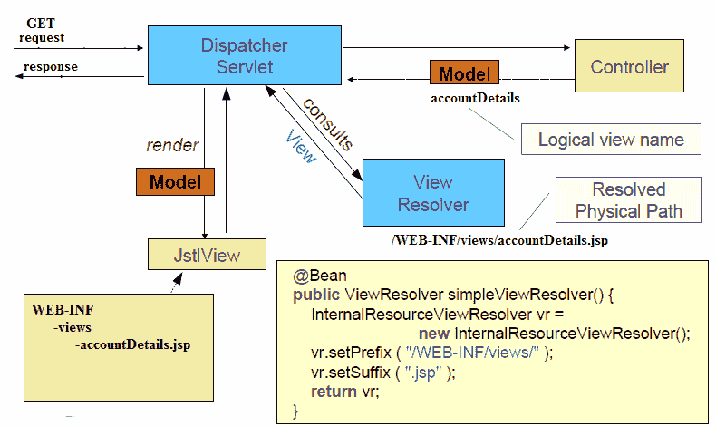

最后一个图示展示了 Spring MVC 请求流程的全貌，包括 MVC 模式的所有组件（**模型**、**视图**和**控制器**）以及前端控制器模式。任何请求，无论是 HTTP `GET`还是`POST`，首先到达前端控制器，实际上在 Spring MVC 中是`DispatcherServlet`。Spring Web 应用程序中的控制器负责生成和更新**模型**，而**模型**是 MVC 模式中的另一个组件。最后，控制器将模型以及逻辑视图名称返回给`DispatcherServlet`。它将与配置的视图解析器协商，解析视图的物理路径。**视图**是 MVC 模式中的另一个组件。

在下一节中，我们将详细阐述视图助手模式，以及 Spring 如何在 Spring Web 应用程序中支持该模式。

# 视图助手模式

视图助手模式将静态视图，如 JSP，与业务模型数据的处理分离。视图助手模式通过适配模型数据和视图组件在表示层中使用。视图助手可以根据业务需求格式化模型数据，但不能为业务生成模型数据。以下图示说明了视图助手模式：

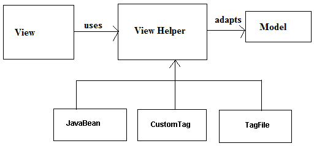

我们知道视图是 MVC 模式中的一个静态和格式化的组件，但有时我们需要在表示层进行一些业务处理。如果你使用 JSP，那么你可以在视图层使用脚本片段进行业务处理，但使用脚本片段并不是最佳实践，因为它促进了视图和业务逻辑之间的紧密耦合。但是，一些基于视图助手模式的视图助手类接管了在表示层进行业务处理的职责。基于视图助手模式的一些技术包括以下内容：

+   JavaBeans `View` 助手

+   `LibraryView` 助手标签

    +   使用 JSTL 标签

    +   使用 spring 标签

    +   使用第三方标签库

在本章中，我们使用的以下标签库：

```java
    <%@ taglib prefix = "c" uri = "http://java.sun.com/jsp/jstl/core" %> 
    <c:if test="${not empty account }"> 
     .... 
     ....         
    </c:if> 

    <%@ taglib prefix="form" uri="http://www.springframework.org/tags/form" %> 
    <form:form method="post" commandName="account"> 
    .... 
    ... 
   </form:form> 
```

如前代码所示，我使用了 JSTL 标签库来检查模型中的账户是否为空，并使用 Spring 标签库在 Web 应用程序中创建开户表单。

在下一节中，你将了解组合视图模式，以及 Spring MVC 如何支持它在 Web 应用程序中实现。

# 使用 Apache tile 视图解析器的组合视图模式

在 Web 应用程序中，视图是最重要的组件之一。开发这个组件并不像看起来那么简单。维护它非常复杂，是一项艰巨的任务。每次我们为 Web 应用程序创建视图时，我们总是关注视图组件的可重用性。我们可以定义一些静态模板，这些模板可以在同一 Web 应用程序的其他视图页面中重用。根据 GOF 模式的组合设计模式，我们为特定的视图组件组合子视图组件。组合视图模式促进了视图的可重用性，由于有多个子视图而不是创建一个庞大而复杂的视图，因此易于维护。以下图表说明了组合视图模式：

>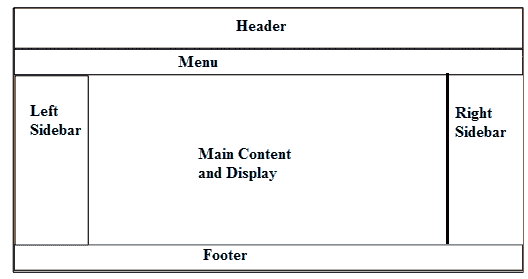

如前图所示，我们可以创建多个子视图来在 Web 应用程序中创建视图，并且这些子视图将在整个 Web 应用程序中重用。

Spring MVC 通过 SiteMesh 和 Apache Tiles 等框架提供对组合视图模式实现的支持。在这里，我们将使用 Spring MVC 应用程序来探索 Apache Tiles。让我们看看如何配置 Apache Tiles 的 `ViewResolver`。

# 配置 Tiles 视图解析器

让我们在 Spring MVC 应用程序中配置 Apache Tiles。为了配置它，我们必须在 Spring 配置文件中配置两个 Bean，如下所示：

```java
    package com.packt.patterninspring.chapter10.bankapp.web.mvc; 
    ..... 
    @Configuration 
    @ComponentScan(basePackages = {"com.packt.patterninspring.chapter10.bankapp.web.controller"})       
    @EnableWebMvc 
    public class SpringMvcConfig extends WebMvcConfigurerAdapter{ 
    ..... 
    @Bean 
    public TilesConfigurer tilesConfigurer() { 
         TilesConfigurer tiles = new TilesConfigurer(); 
         tiles.setDefinitions(new String[] { 
               "/WEB-INF/layout/tiles.xml" 
         }); 
         tiles.setCheckRefresh(true); 
         return tiles; 
    } 

    @Bean 
    public ViewResolver viewResolver() { 
         return new TilesViewResolver(); 
    } 
     ... 
   } 
```

在此先前的配置文件中，我们配置了两个 bean，`TilesConfigurer`和`TilesViewResolver` bean。第一个 bean，`TilesConfigurer`，负责定位和加载 tile 定义，并且通常协调 Tiles。第二个 bean，`TilesViewResolver`，负责将逻辑视图名称解析为 tile 定义。应用程序中的`tiles.xml` XML 文件包含了 tile 定义。让我们看看以下代码，用于 tiles 配置文件：

```java
    <tiles-definitions> 
      <definition name="base.definition" template="/WEB-INF/views/mainTemplate.jsp"> 
        <put-attribute name="title" value=""/> 
        <put-attribute name="header" value="/WEB-INF/views/header.jsp"/> 
        <put-attribute name="menu" value="/WEB-INF/views/menu.jsp"/> 
        <put-attribute name="body" value=""/> 
        <put-attribute name="footer" value="/WEB-INF/views/footer.jsp"/> 
      </definition> 

      <definition extends="base.definition" name="openAccountForm"> 
        <put-attribute name="title" value="Account Open Form"/> 
        <put-attribute name="body" value="/WEB-INF/views/accountForm.jsp"/> 
      </definition> 

      <definition extends="base.definition" name="accountsList"> 
        <put-attribute name="title" value="Employees List"/> 
        <put-attribute name="body" value="/WEB-INF/views/accounts.jsp"/> 
      </definition> 
      ... 
      ... 
    </tiles-definitions> 
```

在先前的代码中，`<tiles-definitions>`元素有多个`<definition>`元素。每个`<definition>`元素定义一个 tile，每个 tile 引用一个 JSP 模板。一些`<definition>`元素扩展了基本 tile 定义，因为基本 tile 定义具有网络应用程序中所有视图的通用布局。

让我们看看基本定义模板，即`mainTemplate.jsp`：

```java
    <%@ taglib uri="http://www.springframework.org/tags" prefix="s" %> 
    <%@ taglib uri="http://tiles.apache.org/tags-tiles" prefix="t" %> 
    <%@ page session="false" %> 
    <html>   
      <head>   
        <title> 
          <tiles:insertAttribute name="title" ignore="true"/> 
        </title> 
      </head> 
      <body> 
         <table border="1″ cellpadding="2″ cellspacing="2″ align="left"> 
               <tr> 
                     <td colspan="2″ align="center"> 
                           <tiles:insertAttribute name="header"/> 
                     </td> 
               </tr> 
               <tr> 
                     <td> 
                           <tiles:insertAttribute name="menu"/> 
                     </td> 
                     <td> 
                           <tiles:insertAttribute name="body"/> 
                     </td> 
               </tr> 
               <tr> 
                     <td colspan="2″  align="center"> 
                           <tiles:insertAttribute name="footer"/> 
                     </td> 
               </tr> 
         </table> 
       </body>   
    </html> 
```

在此先前的 JSP 文件中，我使用了`tiles`标签库中的`<tiles:insertAttribute>` JSP 标签来插入其他模板。

现在我们来看看一些用于设计和开发网络应用程序的最佳实践。

# 网络应用程序设计的最佳实践

在设计和开发网络应用程序时，以下是一些必须考虑的最佳实践：

+   由于 Spring DI 模式和 Spring 的非常灵活的 MVC 模式，Spring MVC 是设计和开发网络应用程序的最佳选择。Spring 的`DispatcherServlet`也非常灵活和可定制。

+   在任何使用 MVC 模式的网络应用程序中，前端控制器应该是通用的，并且尽可能轻量。

+   在网络应用程序的各个层级之间保持清晰的关注点分离非常重要。分离层级可以改善应用程序的整洁设计。

+   如果应用层与其他层有太多的依赖关系，作为一个最佳做法，引入另一个层以减少该层的依赖性。

+   永远不要将 DAO 对象注入到网络应用程序的控制器中；始终将服务对象注入到控制器中。DAO 对象必须通过服务层注入，以便服务层与数据访问层通信，而表示层与服务层通信。

+   应用层，如服务、DAO 和表示层，必须是可插拔的，并且不能与实现绑定，也就是说，使用接口可以减少与具体实现的实际耦合，因为我们知道松耦合的分层应用程序更容易测试和维护。

+   强烈建议将 JSP 文件放置在 WEB-INF 目录中，因为这个位置不会被任何客户端访问。

+   总是在 JSP 文件中指定命令对象的名字。

+   JSP 文件不得有任何业务逻辑和业务处理。对于此类需求，我们强烈建议使用视图辅助类，如标签、库、JSTL 等。

+   从基于模板的视图（如 JSP）中移除编程逻辑。

+   创建可重用的组件，这些组件可以用于在视图之间组合模型数据。

+   MVC 模式的每个组件都必须有一个一致的行为，这是 MVC 引入它的原因。这意味着控制器应该遵循单一职责原则。控制器只负责委托业务逻辑调用和视图选择。

+   最后，保持配置文件命名的统一性。例如，控制器、拦截器和视图解析器等 Web 组件必须在单独的配置文件中定义。其他应用程序组件，如服务、存储库等，必须定义在另一个单独的文件中。同样，对于安全考虑也是如此。

# 概述

在本章中，您已经了解到 Spring 框架如何让您开发一个灵活且松散耦合的基于 Web 的应用程序。Spring 在您的 Web 应用程序中使用了注解来实现接近 POJO 的开发模型。您了解到，使用 Spring MVC，您可以通过开发处理请求的控制器来创建基于 Web 的应用程序，而这些控制器非常容易测试。在本章中，我们介绍了 MVC 模式，包括其起源和解决的问题。Spring 框架实现了 MVC 模式，这意味着对于任何 Web 应用程序，都有三个组件——模型（Model）、视图（View）和控制器（Controller）。

Spring MVC 实现了应用程序控制器和前端控制器模式。Spring 的调度器 Servlet（`org.springframework.web.servlet.DispatcherServlet`）在基于 Web 的应用程序中充当前端控制器。这个调度器或前端控制器通过使用处理器映射将所有请求路由到应用程序控制器。在 Spring MVC 中，控制器类具有极其灵活的请求处理方法。这些处理方法处理 Web 应用程序的所有请求。正如我们在本章中解释的那样，有几种处理请求参数的方法。`@RequestParam`注解是处理请求参数的一种方法，而且在不使用测试用例中的 http 请求对象的情况下也非常容易测试。

在本章中，我们探讨了请求处理工作流程，并讨论了在这个工作流程中扮演角色的所有组件。`DispatcherServlet`可以被认为是 Spring MVC 中的主要组件；它在 Spring MVC 中扮演前端控制器的角色。另一个主要组件是视图解析器，它负责将模型数据渲染到任何视图模板，如 JSP、Thymeleaf、FreeMarker、velocity、pdf、xml 等，这取决于 Web 应用程序中配置的视图解析器。Spring MVC 为几种视图技术提供了支持，但在这个章节中，我们简要地介绍了如何使用 JSP 为您的控制器编写视图。我们还可以使用 Apache tiles 添加一致的布局到您的视图中。

最后，我们讨论了 Web 应用架构，并探讨了 Web 应用中的不同层次，如领域、用户界面、Web、服务和数据访问。我们创建了一个小型银行管理 Web 应用，并将其部署到 Tomcat 服务器上。
