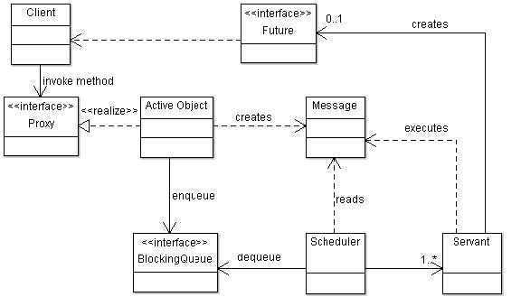
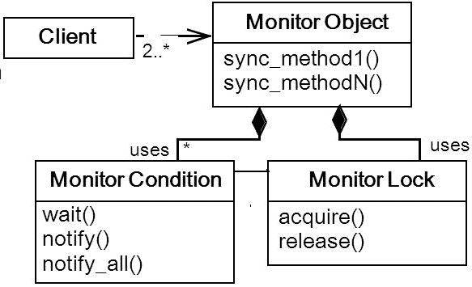
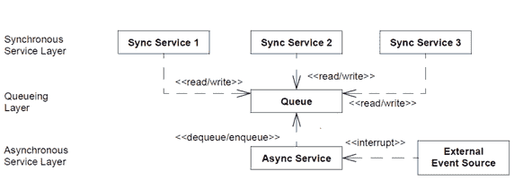
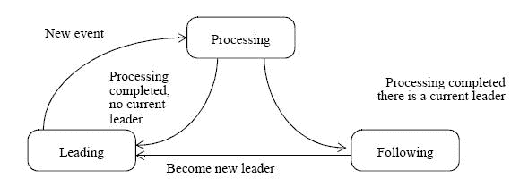
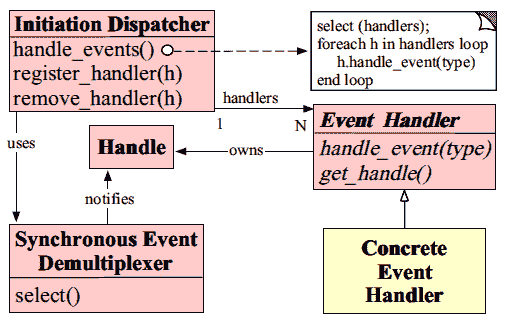

# 实现并发模式

在第十一章《实现反应式设计模式》中，我们讨论了反应式设计模式及其如何满足当今应用的需求。Spring 5 框架为 Web 应用引入了反应式 Web 应用模块。在本章中，我们将探讨一些并发设计模式以及这些模式如何解决多线程应用中的常见问题。Spring 5 框架的反应式模块也为多线程应用提供了解决方案。

如果你是一名软件工程师或者正在成为软件工程师的过程中，你必须知道“并发”这个术语。在几何属性中，共点圆或形状是指那些具有共同中心点的形状。这些形状在尺寸上可能不同，但有一个共同的中心或中点。

在软件编程方面，这个概念是相似的。在技术或编程中，“并发编程”一词意味着程序执行多个并行计算的能力，以及程序在单个时间间隔内处理多个外部活动的能力。

当我们谈论软件工程和编程时，并发模式是那些帮助处理多线程编程模型的设计模式。以下是一些并发模式：

+   使用并发模式处理并发

+   活跃对象模式

+   监视对象模式

+   半同步/半异步模式

+   领导/跟随模式

+   线程特定存储

+   反应器模式

+   并发模块的最佳实践

现在我们将深入探讨这五种并发设计模式。

# 活跃对象模式

并发设计模式的活跃对象类型区分了方法执行与方法调用。这个模式的工作是增强并发性，同时简化对位于不同且可区分的控制线程中的对象的同步访问。它用于处理同时到达的多个客户端请求，并且也有助于提高服务质量。让我们看看以下图表，这些图表展示了并发和多线程应用中的活跃对象设计模式：

正如你在前面的图中可以看到，以下是这个并发设计模式的组件：

+   **代理**：这是对客户端可见的活跃对象。代理宣传其接口。

+   **仆人**：在代理的接口中定义了一个方法。仆人是其实施的提供者。

+   **激活列表**：这是一个序列化的列表，包含代理插入的方法请求对象。这个列表允许仆人并发运行。

那么，这个设计模式是如何工作的呢？答案是，每个并发对象都属于或存在于一个单独的控制线程中。这也独立于客户端的控制线程。这意味着它会调用其方法，也就是说，方法执行和方法调用都在单独的控制线程中进行。然而，客户端将这个过程视为一个普通的方法。为了在运行时将客户端的请求传递给仆人，两者都必须在单独的线程中运行。

在这个设计模式中，代理在收到请求后所做的是设置一个方法请求对象并将其插入激活列表中。这个方法执行两个任务；保持方法请求对象并跟踪它可以在哪个方法请求上执行。请求参数和任何其他信息都包含在方法请求对象中，以便稍后执行所需的方法。这个激活列表反过来帮助代理和仆人并发运行。

让我们在下一节中看看另一个并发设计模式，即监控对象模式。

# 监控对象模式

监控对象模式是另一种并发设计模式，有助于多线程程序的执行。它是一种设计模式，旨在确保在单个时间间隔内，只有一个方法在一个对象中运行，为此，它同步并发方法执行。

与活动对象设计模式不同，监控对象模式没有单独的控制线程。每个接收到的请求都在客户端自己的控制线程中执行，并且直到方法返回，访问将被阻塞。在单个时间间隔内，一个同步方法可以在一个监控器中执行。

以下是由监控对象模式提供的解决方案：

+   同步边界由对象的接口定义，并确保在单个对象中只有一个活动方法。

+   必须确保所有对象都检查需要同步的每个方法，并透明地序列化它们，而不让客户端知道。另一方面，操作是互斥的，但它们像普通方法调用一样被调用。等待和信号原语用于实现条件同步。

+   为了防止死锁并使用可用的并发机制，当对象的方法在执行过程中阻塞时，必须允许其他客户端访问该对象。

+   当控制线程被方法自愿中断时，必须始终保持不变量。

让我们看看下面的图示，它展示了在并发应用程序中监控对象设计模式的更多内容：

在此前面的图中，客户端对象调用具有多个同步方法的监控对象，以及与监控条件和监控锁关联的监控对象。让我们如下探索此并发设计模式的每个组件：

+   **监控对象**: 此组件公开了同步到客户端的方法

+   **同步方法**: 这些方法实现了由对象接口导出的线程安全函数

+   **监控条件**: 此组件与监控锁一起决定同步方法是否应该继续其处理或挂起

活动对象和监控对象模式是并发设计模式的分支。

现在，我们将讨论的其他类型的并发模式是并发架构模式的分支。

# 半同步/半异步模式

半同步和半异步的任务是区分两种处理类型（异步和同步），以简化程序而不影响其性能。

为了在队列层之间进行处理，引入了两个相互通信的层，用于异步和同步服务。

每个并发系统都包含异步和同步服务。为了使这些服务能够相互通信，半同步/半异步模式将系统中的服务分解为层。使用队列层，这两个服务相互传递消息以进行交互通信。

让我们看看以下图，它说明了这些设计模式：

如您在前面的图中所见，有三个层--**同步服务层**、**队列层**和**异步服务层**。同步层包含与队列层同步工作的服务，并且此查询使用异步服务在**异步服务层**异步执行。此层的异步服务使用基于外部事件资源。

如您在前面的图中所见，这里包含三个层。让我们看看这些层：

+   **同步任务层**: 此层中的任务是活动对象。高级输入和输出操作由这些任务执行，它们将数据同步地传输到队列层。

+   **队列层**: 此层提供了同步和缓冲，这是在同步和异步任务层之间所需的。

+   **异步任务层**: 此层中的任务处理来自外部源的事件。这些任务不包含单独的控制线程。

我们已经讨论了并发模式的半同步和半异步设计模式。让我们转向另一种并发模式，即领导者/跟随者模式。

# 领导者/跟随者模式

在并发模型中，对事件源中的服务请求的检测、解复用、调度和处理都是高效进行的，其中许多多个线程逐个处理以使用事件源上的集合。Half-Sync/Half-Async 的另一种替代方案是领导者/跟随者模式。这种模式可以用作替代 Half-Sync/Half-Async 和主动对象模式以改进性能。使用此模式的条件是在处理多个线程的请求时，既没有排序也没有同步约束：

此模式的重点工作是并发或同时处理多个事件。由于与并发相关的开销，可能无法将每个单独的套接字句柄与单独的线程连接。此设计的高亮特点是，通过使用此模式，可以解复用线程和事件源之间的关联。当事件到达事件源时，此模式建立线程池。这是为了有效地共享一组事件源。这些事件源轮流解复用到达的事件。此外，事件被同步调度到应用程序服务进行处理。在由领导者/跟随者模式结构化的线程池中，只有一个线程等待事件的发生；其他线程排队等待。当一个线程检测到事件时，跟随者被提升为领导者。然后它处理该线程并将事件调度到应用程序处理器。

在这种模式中，处理线程可以并发运行，但只允许一个线程等待即将发生的新事件。

让我们看看下一节中另一个基于并发的设计模式。

# 反应器模式

反应器模式用于处理由单个或多个输入源并发接收到的服务请求。接收到的服务请求随后由服务处理器解复用，并调度到相关的请求处理器。所有反应器系统通常都发现于单线程中，但它们也被说存在于多线程环境中。

使用这种模式的关键好处是应用程序组件可以被划分为多个部分，例如模块化或可重用。此外，这允许系统在不增加多个线程的额外复杂性的情况下实现简单的粗粒度并发。

让我们看看以下关于反应器设计模式的图示：

如前图所示，调度器使用解复用器来通知处理器，处理器通过 I/O 事件执行实际的工作。反应器通过调度适当的处理器来响应 I/O 事件。处理器执行非阻塞操作。前图展示了此设计模式的以下组件：

+   **资源**：这些是通过它们提供输入或消耗输出的资源。

+   **同步事件解多路复用器**：通过事件循环阻塞所有资源。当有同步操作可能启动时，资源将通过解多路复用器发送到调度器，而不会阻塞。

+   **调度器**：此组件处理请求处理器的注册或注销。资源通过调度器分发到相应的请求处理器。

+   **请求处理器**：此处理由调度器分发的请求。

现在，我们继续到下一个也是最后一个并发模式，即线程特定存储模式。

# 线程特定存储模式

单个逻辑全局访问点可以用来检索线程本地的对象。这种并发设计模式允许多个线程执行此功能。这样做无需在每个访问对象时产生锁定开销。有时，这种特定的模式可以被视为所有并发设计模式中的对立面。这是因为线程特定的存储通过防止线程间共享可用资源来解决了几个复杂性。

该方法似乎由应用程序线程在普通对象上调用。实际上，它是在线程特定的对象上调用。多个应用程序线程可以使用单个线程特定的对象代理来访问与每个应用程序线程关联的唯一线程特定对象。代理使用应用程序线程标识符来区分它封装的线程特定对象。

# 并发模块的最佳实践

在执行并发时，程序员必须考虑以下列表中的考虑事项。让我们看看以下最佳实践，当有机会与并发应用程序模块一起工作时应该考虑。

+   **获取执行器**：用于获取执行器的 Executor 框架提供了 executors 工具类。各种类型的执行器提供特定的线程执行策略。以下有三个示例：

    +   **newCachedThreadPool()**: 如果可用，此方法使用先前构建的线程创建一个线程池。通过使用此类线程池，增强了使用短暂异步任务的应用程序的性能。

    +   **newSingleThreadExecutor()**: 这里使用一个在无界队列中运行的工人线程来创建一个执行器。在这种类型中，任务被添加到队列中，然后依次执行。如果此线程在执行过程中失败，将创建一个新的线程来替换失败的线程，以便任务可以无中断地执行。

    +   **ExecutorService newFixedThreadPool(int nThreads)**：在这种情况下，固定数量的线程在共享的无界队列中操作，用于创建线程池。在线程中，任务正在被积极处理。当池中的所有线程都处于活动状态并且提交了新任务时，任务将添加到队列中，直到有线程可用于处理新任务。如果在执行器关闭之前线程失败，将创建一个新的线程来执行任务的执行。请注意，这些线程池仅在执行器处于活动状态或开启时存在。

+   **尽可能使用协作同步构造**：建议尽可能使用协作同步构造。

+   **无必要冗长任务和过度订阅**：冗长任务众所周知会导致死锁、饥饿，甚至阻止其他任务正常工作。较大的任务可以被分解成较小的任务以实现良好的性能。过度订阅也是避免死锁和饥饿等方法之一。使用这种方法，可以创建比可用线程数更多的线程。当冗长任务包含大量延迟时，这非常高效。

+   **使用并发内存管理函数**：如果在某种情况下，可以使用后续的并发内存管理函数，强烈建议使用它。这些可以在使用具有短生命周期的对象时使用。`Allot`和`Free`等函数用于释放内存和分配，无需内存屏障或使用锁。

+   **使用 RAII 管理并发对象的生命周期**：RAII 是**资源获取即初始化**的缩写。这是管理并发对象生命周期的有效方法。

这就是关于并发及其设计模式的所有内容，这些设计模式可以用来处理和实现并发。这些是并发程序中最常见的五种设计模式。还讨论了一些执行并发模块的最佳实践。希望这能提供信息量，并帮助你理解并发模式是如何工作的！

# 摘要

在本章中，你学习了几个并发设计模式，并看到了这些模式的使用案例。在这本书中，我只涵盖了并发设计模式的基础。我们包括了活动对象、监控对象、半同步/半异步、领导者/跟随者、线程特定存储和反应器模式。这些都是应用多线程环境中的并发设计模式的一部分。我们还讨论了一些在应用中使用并发设计模式时的最佳实践考虑。
