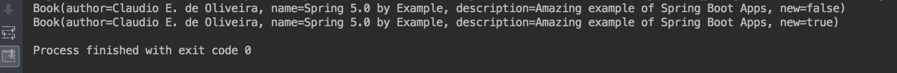
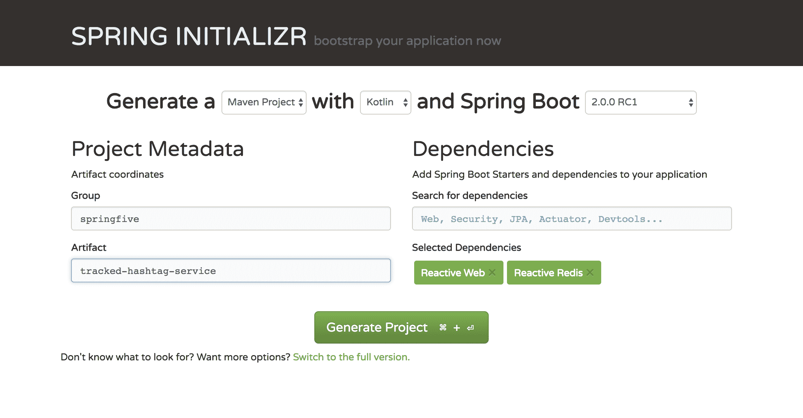
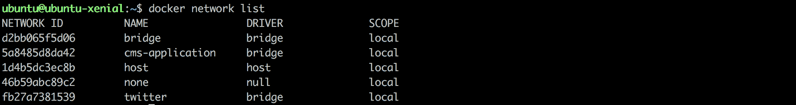
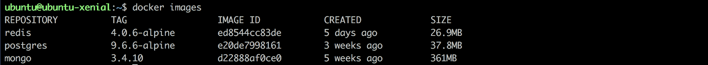
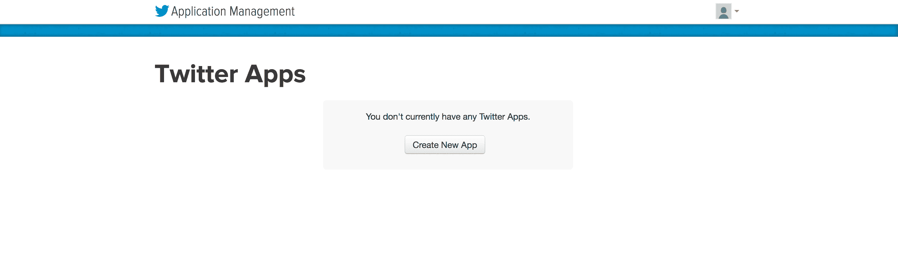
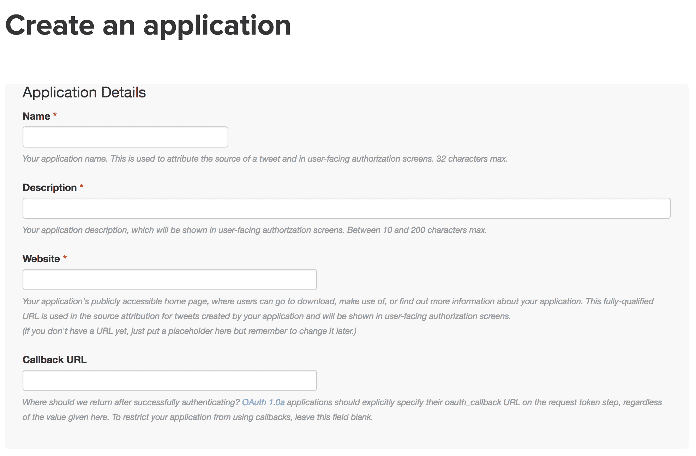
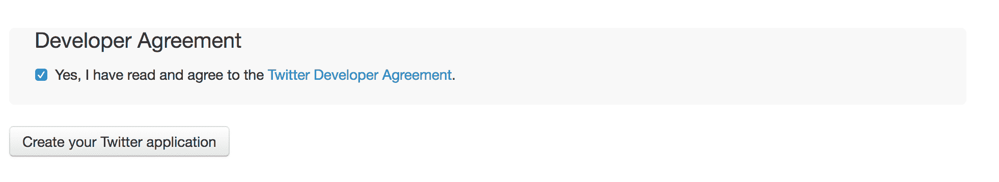
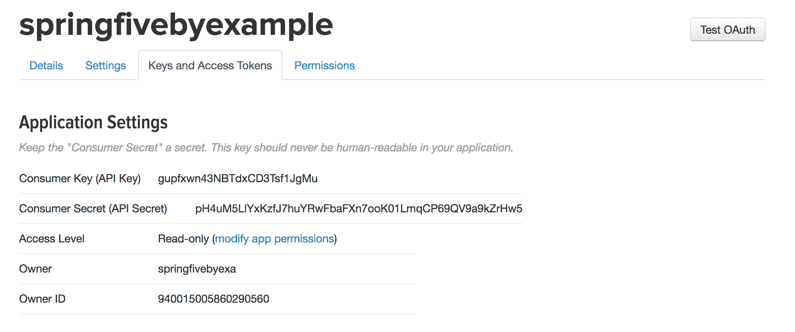
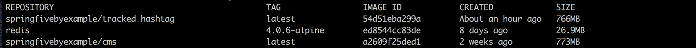
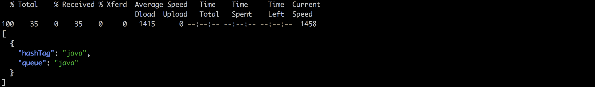

# 第四章：Kotlin 基础和 Spring Data Redis

Spring Boot 允许开发者创建不同风格的应用程序。在第二章“从 Spring 世界开始——CMS 应用程序”和第三章“使用 Spring Data 和响应式风格的持久化”中，我们已经创建了一个门户应用程序，现在我们将创建一个基于消息驱动架构的应用程序。它展示了 Spring 框架如何很好地适应各种应用程序架构。

在本章中，我们将开始创建一个应用程序，该应用程序将跟踪的标签存储在 Redis 数据库中。该应用程序将获取标签并将它们放入几个队列中，供我们的其他项目使用，并适当地消费和处理它们。

正如我们在以前的项目中所做的那样，我们将继续使用 Reactive Foundation 为应用程序提供可伸缩的特性。

在本章结束时，我们将：

+   学习 Kotlin 基础

+   创建了项目结构

+   创建了 Reactive Redis 存储库

+   使用 Reactive Redis 客户端应用了一些响应式编程技术

现在就让我们开始吧。

# 学习 Kotlin 基础

Kotlin 语言于 2016 年 2 月正式发布。JetBrains 创建了它，并从那时起一直在开发这门语言。该公司是 IntelliJ IDEA IDE 的所有者。

2012 年 2 月，JetBrains 在 Apache v2 许可证下将语言开源；该许可证允许开发者创建应用程序。

语言是 JVM（Java 虚拟机）语言之一，如 Clojure 和 Scala，这意味着该语言可以为 JVM 编译字节码。正如我们将看到的，Kotlin 与 Scala 有很多相似之处。Kotlin 以 Scala 语言为参考，但 JetBrains 团队认为 Scala 在编译时间上存在问题。

Kotlin 正在成为 Android 世界中广泛采用的语言，因此，在 2017 年的 Google I/O 上，谷歌团队宣布了对 Android 生态系统的官方支持。从那时起，这门语言每年都在增长，并且越来越受欢迎。

# Kotlin 的主要特性

Kotlin 语言被设计成与 Java 代码保持互操作性。这意味着我们可以在 Kotlin 文件中使用 Java 代码风格开始编码。

语言是静态类型的，这是一个非常好的属性，因为它可以帮助我们在编译时找到一些问题。此外，静态类型语言比动态语言要快得多。IDEs（集成开发环境）在帮助开发者方面也比动态语言做得更好。

# 语法

语法与 Java 语法不同。乍一看，这可能是个问题，但经过几个小时对 Kotlin 的实践，这根本不是问题。

有两个有趣的保留词可以帮助理解其用法和概念：

+   `var`：这是一个变量声明。它表示变量是可变的，可以根据开发者的需要重新分配。

+   `val`：这是一个变量声明，表示该变量是不可变的，不能再重新分配。这种定义类似于 Java 语言中的 final 声明。

变量声明有一个名称，在所需的数据类型之后，中间需要用冒号作为分隔符。如果变量被初始化，则不需要类型，因为编译器可以推断正确的数据类型。让我们试一试，以便更好地理解。

这里有一个指定了数据类型的变量：

```java
var bookName: String
```

在这种情况下，我们需要保留数据类型，因为变量没有被初始化，编译器无法推断类型。由于`var`修饰符，变量`bookName`可以被重新分配。

这里是一个没有指定数据类型的变量：

```java
val book = "Spring 5.0 by Example"
```

声明数据类型不是必需的，因为我们已经用值`Spring 5.0 by Example`初始化了变量。由于`val`修饰符，变量不能被重新分配。如果我们尝试重新分配指令，将会得到编译错误。

Kotlin 中分号是可选的，编译器可以检测语句终止符。这是 Kotlin 与 Java 编程语言不同的另一个点：

```java
val book = "Spring 5.0 by Example"
var bookName: String
println("Hello, world!")
```

没有提供分号，指令被编译。

在 Kotlin 语言中推荐使用不可变编程。它在多核环境中性能更优。同时，它使开发者更容易调试和排查问题场景。

# 语义

在 Kotlin 中，有类和函数。然而，不再有方法。应该使用`fun`关键字来声明函数。

Kotlin 借鉴了一些 Scala 语言的概念，并带来了一些特殊的类，如数据类和对象类（我们很快就会学习）。在那之前，我们将了解如何在 Kotlin 中声明函数。让我们来做这件事！

# Kotlin 中声明函数

函数声明有很多变体。我们将创建一些声明来理解与 Java 方法之间的细微差别。

# 带参数和返回类型的简单函数

这个简单的函数有两个参数，返回类型为 String。看看参数声明并观察其顺序、名称和数据类型。

```java
fun greetings(name:String,greeting:String):String{
  return greeting + name
}
```

如我们所见，变量名后面的参数类型与变量声明中的类型相同。返回类型在分号分隔的参数列表之后。以下方式可以在 Java 中声明相同的函数：

```java
public String greetings(String name,String greeting){
  return greeting + name;
}
```

这里有一些差异。首先，Java 代码中有分号，我们可以看到方法和函数声明的顺序。

# 无返回值的简单函数

让我们了解如何构造无返回值的函数，以下函数将不会返回任何值：

```java
fun printGreetings(name:String,greeting:String):Unit{
  println(greeting + name)
}
```

有一个区别，在这种情况下，引入了 `Unit`；这种类型的对象对应于 Java 语言中的 `void`。然后，在前面的代码中，我们有一个没有返回值的函数。如果你想编译器理解函数没有返回值，可以移除 `Unit` 对象。

# 单表达式函数

当函数只有一个表达式时，我们可以移除大括号，就像在 Scala 中一样，函数体应该在 `=` 符号之后指定。让我们重构我们的第一个函数，如下所示：

```java
fun greetings(name:String,greeting:String) = greeting + name
```

我们也可以移除 `return` 关键字。我们的函数现在非常简洁。我们移除了 `return` 和返回类型。正如我们所看到的，代码现在更易读。如果你想，也可以声明返回类型。 

# 重写函数

要在 Kotlin 中重写一个函数，需要在函数声明上放置一个 `override` 关键字，并且基函数也需要有 `open` 关键字。

让我们来看一个例子：

```java
open class Greetings {
  open fun greeting() {}
}

class SuperGreeting() : Greetings() {
 override fun greeting() {
  // my super greeting
  }
}
```

这种方式比 Java 更明确，它也增加了代码的可读性。

# 数据类

当我们想在系统层之间持有和传输数据时，数据类是正确的解决方案。就像在 Scala 中一样，这些类提供了一些内置功能，如 `getters/setters`、`equals` 和 `hashCode`、`toString` 方法以及 `copy` 函数。

让我们为这个例子创建一个示例：

```java
data class Book(val author:String,val name:String,val description:String,val new:Boolean = false)
```

我们在代码中有一些有趣的事情。我们首先注意到所有的属性都是不可变的。这意味着它们都没有设置器。第二是，在类声明中，我们可以看到一个属性列表。在这种情况下，Kotlin 将创建一个包含这个类中所有属性的构造函数，因为它们是 `val`，这意味着它们是最终属性。

在这种情况下，不再有默认构造函数。

Kotlin 另一个有趣的功能是它允许开发者为构造函数提供默认值，在我们的例子中，如果省略了 `new` 属性，它将假设 `false` 值。我们也可以在函数的参数列表中得到相同的行为。

最后，有一个复制对象的绝佳方法。`copy` 方法允许开发者使用命名参数来复制对象。这意味着我们可以根据需要只更改属性。让我们来看一个例子：

```java
fun main(args : Array<String>) {
  val springFiveOld = Book("Claudio E. de Oliveira","Spring 5.0 by Example","Amazing example of Spring Boot Apps",false)
  val springFiveNew = springFiveOld.copy(new = true)
  println(springFiveOld)
  println(springFiveNew)
}
```

在第一个对象中，我们使用 `false` 为 `new` 属性创建了一个书实例，然后我们使用 `true` 为 `new` 属性复制了一个新对象，其他属性没有改变。告别复杂的克隆逻辑，欢迎新的复制对象方式。

这段代码的输出应该如下所示：



如我们所见，只有 `new` 属性被更改，并且 `toString` 函数也被良好地生成。

数据类有一些限制。它们不能是抽象的、开放的、密封的或内部的。

# 对象

单例模式在应用程序中常用，Kotlin 提供了一种简单的方法来做这件事，而不需要太多的样板代码。

我们可以指示 Kotlin 使用 `object` 关键字创建一个单例对象。再次强调，Kotlin 使用 Scala 作为参考，因为在 Scala 语言中也有相同的功能。

让我们试试：

```java
object BookNameFormatter{
  fun format(book: Book):String = "The book name is" + book.name
}
```

我们已经创建了一个格式化器，用于返回带有书名的消息。然后，我们尝试使用这个函数：

```java
val springFiveOld = Book("Claudio E. de Oliveira","Spring 5.0 by Example","Amazing example of Spring Boot Apps",false)
BookNameFormatter.format(springFiveOld)
```

函数格式可以在静态上下文中调用。因为没有实例来调用函数，因为它是一个单例对象。

# 伴生对象

**companion object** 是一个对所有该类实例都通用的对象。这意味着有很多书籍的实例，但它们的伴生对象只有一个实例。通常，开发者使用伴生对象作为工厂方法。让我们创建我们的第一个 `companion object`：

```java
data class Book(val author:String,val name:String,val description:String,val new:Boolean = false{

  companion object {
    fun create(name:String,description: String,author: String):Book{
      return Book(author,name,description)
    }
  }

}
```

如果省略了 `companion object` 的名称，函数可以通过单例方式调用，无需实例，如下所示：

```java
val myBookWithFactory = Book.create("Claudio E. de Oliveira","Spring 5.0 by Example","Amazing example of Spring Boot Apps")
```

它就像 `object` 的行为。我们可以在静态上下文中调用它。

# Kotlin 习惯用法

Kotlin 习惯用法是 Java 程序员的一种语法糖。它是一组代码片段，帮助开发者以 Kotlin 语言创建简洁的代码。让我们看看常见的 Kotlin 习惯用法。

# 字符串插值

Kotlin 支持字符串插值，在 Java 语言中做这个稍微复杂一些，但对于 Kotlin 来说不是问题。我们不需要很多代码来完成这个任务，因为 Kotlin 本地支持它。这使得代码更容易阅读和理解。让我们创建一个示例：

```java
val bookName = "Spring 5.0"
val phrase = "The name of the book is $bookName"
```

如我们所见，在 Kotlin 中插值字符串是一件轻而易举的事情。再见 `String.format()` 和它的许多参数。我们可以使用 `$bookName` 来替换 `bookName` 变量的值。此外，我们还可以访问对象中存在的函数，但为此我们需要使用花括号。查看以下代码：

```java
val springFiveOld = Book("Claudio E. de Oliveira","Spring 5.0 by Example","Amazing example of Spring Boot Apps",false)
val phrase = "The name of the book is ${springFiveOld.name}"
```

感谢，Kotlin，我们感谢这个特性。

# 智能转换

Kotlin 支持一个名为智能转换的功能，它允许开发者自动使用类型转换操作符。在 Java 中，在检查变量类型后，类型转换操作符必须是显式的。让我们来看看：

```java
fun returnValue(instance: Any): String {
  if (instance is String) {
    return instance
  }
  throw IllegalArgumentException("Instance is not String")
} 
```

如我们所见，类型转换操作符已经不再存在。在检查类型后，Kotlin 可以推断出期望的类型。让我们检查一下相同代码的 Java 版本：

```java
public String returnValue(Object instance) {
  if (instance instanceof String) {
    String value = (String) instance;
      return value;
    }
    throw IllegalArgumentException("Instance is not String");
}
```

它使类型转换更安全，因为我们不需要检查和应用类型转换操作符。

# 范围表达式

范围表达式允许开发者在使用 `for` 循环和 `if` 比较时处理范围。在 Kotlin 中处理范围有很多方法。我们在这里将查看其中大部分的常见方法。

# 简单案例

让我们看看一个简单的案例：

```java
for ( i in 1..5){
  println(i)
}
```

它将迭代从 `1` 到 `5`（包括 `1` 和 `5`），因为我们使用了 `in` 关键字。

# until 情况

我们还可以在 `for` 循环中使用 `until` 关键字，在这种情况下，结束元素将被排除在交互之外。让我们看看一个示例：

```java
for (i in 1 until 5) {
  println(i)
}
```

在这种情况下，`5` 的值不会在控制台上打印出来，因为交互不包括最后一个元素。

# downTo 情况

`downTo` 关键字使开发者能够以相反的顺序与数字进行交互。指令也是不言自明的。让我们看看实际应用：

```java
for (i in 5 downTo 1) {
  println(i)
}
```

这也很容易。交互将以相反的顺序发生，在这种情况下，值 `1` 将被包含。正如我们所看到的，代码非常容易理解。

# 步骤情况

有时候我们需要以任意步骤而不是逐个与值交互，例如。然后我们可以使用 `step` 指令。让我们来练习一下：

```java
for (i in 1..6 step 2) {
  print(i)
}
```

在这里，我们将看到以下输出：`135`，因为交互将从 `1` 值开始，并增加两个点。

极佳。Kotlin 的范围可以增加我们源代码的可读性，并有助于提高代码质量。

# 空安全

Kotlin 有处理空引用的惊人功能。空引用对 Java 开发者来说是一个噩梦。Java 8 有一个 `Optional` 对象，它帮助开发者处理可空对象，但不像 Kotlin 那样简洁。

现在，我们将探讨 Kotlin 如何帮助开发者避免 `NullPointerException`。让我们来理解一下。

Kotlin 的类型系统在可以持有空引用和不能持有空引用的引用之间做出区分。因此，代码更加简洁和易读，因为它为开发者提供了一种建议。

当引用不允许为空时，声明应该是这样的：

```java
var myNonNullString:String = "my non null string"
```

前面的变量不能分配给空引用，如果我们这样做，我们会得到编译错误。看看代码是多么容易理解。

有时候，我们需要允许变量有空引用，在这些情况下，我们可以使用 `?` 作为操作符，例如以下所示：

```java
var allowNull:String? = "permits null references"
```

简单。注意 `?` 操作符上的变量声明，它使变量能够接受空引用。

有两种不同的方法可以避免 Kotlin 中的 `NullPointerReference`。第一种可以称为 **安全调用**，另一种可以称为 **Elvis 操作符**。让我们来看看这些。

# 安全调用

安全调用可以使用 `.?` 来编写。当引用持有非空值时可以调用，如果值持有空引用，则返回空值：

```java
val hash:TrackedHashTag? = TrackedHashTag(hashTag="java",queue="java")
val queueString = hash?.queue
```

当 `hash?` 持有空值时，空值将被分配给 `queueString` 属性。如果 `hash?` 有有效的引用，队列属性将被分配给 `queueString` 属性。

# Elvis 操作符

它可以在开发者期望在引用为空时返回默认值时使用：

```java
val hash:TrackedHashTag? = TrackedHashTag(hashTag="java",queue="java")
val queueString = hash?.queue ?: "unrecognized-queue"
```

当值持有空时，将返回默认值。

是时候在现实世界中使用 Kotlin 了。让我们开始吧。

# 总结

现在，我们可以使用 Kotlin 语言的基础知识。我们看到了一些示例并实践了一下。

我们研究了 Kotlin 的主要概念。我们学习了数据类如何帮助开发者在应用程序层之间传输数据。我们还了解了单例和伴随对象。现在我们可以尝试使用 Spring 框架的新支持创建一个真实的项目。

在接下来的章节中，我们将使用 Kotlin 语言创建一个项目，目前我们可以暂时忘记 Java 语言。

# 创建项目

现在，我们已经有了一个很好的想法，了解我们如何使用 Kotlin 语言进行编程。在本节中，我们将为我们的新项目创建基本结构，其中主要功能是消费 Twitter 流。让我们来做这件事。

# 项目用例

在我们开始编码之前，我们需要跟踪应用程序需求。该应用程序是消息驱动的，我们将使用代理来提供消息基础设施。我们选择 RabbitMQ 代理，因为它提供可靠性、高可用性和集群选项。此外，RabbitMQ 是现代消息驱动应用程序的流行选择。

该软件由 Pivotal 公司提供支持，该公司维护 Spring 框架。有一个庞大的社区支持该项目。

我们将拥有三个项目。这三个项目将收集 Twitter 流并将其发送给接收者，以便以格式化的方式向最终用户展示推文。

第一个，在本章中创建的，将负责在 Redis 缓存中保持跟踪的标签。

当新标签注册时，它将向第二个项目发送消息，该项目将开始消费 Twitter 流并将其重定向到所需的队列。这个队列将被其他项目消费，该项目将格式化推文，并最终将它们展示给最终用户。

我们将拥有三个微服务。让我们创建这些服务。

# 使用 Spring Initializr 创建项目

我们已经学习了如何使用 Spring Initializr 页面。我们将访问该页面，然后选择以下模块：

+   `响应式 Web`

+   `响应式 Redis`

页面内容应该看起来像这样：



我们可以选择组和工件。使用不同的名称没有问题。然后，我们可以点击生成项目并等待下载完成。

# 为 Kotlin 添加 Jackson

我们需要为 Maven 项目添加 Jackson for Kotlin 依赖项。实际上，我们需要在 `pom.xml` 中有一个 Kotlin 标准库。此外，我们需要添加 `jackson-module-kotlin`，它允许我们在 Kotlin 中处理 JSON，在这些部分与 Java 有一些不同。

这部分相当简单，我们将在 `pom.xml` 的依赖项部分添加以下依赖项。依赖项如下：

```java

<dependency>
 <groupId>com.fasterxml.jackson.module</groupId>
 <artifactId>jackson-module-kotlin</artifactId>
 <version>${jackson.version}</version>
</dependency>
```

现在，我们已经配置了依赖项，我们可以设置插件来编译 Kotlin 源代码。在下一节中，我们将这样做。

# 查找 Kotlin 的 Maven 插件

项目已成功配置 Kotlin。现在，我们将查看 `pom.xml` 中的 Maven 插件。配置是必要的，以指导 Maven 如何编译 Kotlin 源代码并添加到工件中。

我们将在插件部分添加以下插件：

```java
<plugin>
  <artifactId>kotlin-maven-plugin</artifactId>
  <groupId>org.jetbrains.kotlin</groupId>
  <version>${kotlin.version}</version>
  <configuration>
    <jvmTarget>1.8</jvmTarget>
  </configuration>
  <executions>
    <execution>
      <id>compile</id>
      <phase>process-sources</phase>
      <goals>
        <goal>compile</goal>
      </goals>
    </execution>
    <execution>
      <id>test-compile</id>
      <phase>process-test-sources</phase>
      <goals>
        <goal>test-compile</goal>
      </goals>
    </execution>
  </executions>
</plugin>
```

还有件事要做。看看 Maven 是如何配置我们的 Kotlin 代码路径的。这很简单。看看下面的：

```java
    <build>

    <sourceDirectory>${project.basedir}/src/main/kotlin<
    /sourceDirectory<testSourceDirectory>${project.basedir}/src/
    test/kotlin</testSourceDirectory>

    .....

    </build>
```

我们已经在源路径中添加了我们的 Kotlin 文件夹。

太棒了，项目结构已经准备好了，我们可以开始编码了！

# 为我们的应用程序创建 Docker 网络

要为我们的应用程序创建隔离，我们将创建一个自定义的 Docker 网络。这个网络是使用 bridge 驱动程序创建的。让我们使用以下命令来做这件事：

```java
docker network create twitter
```

好的，现在我们可以通过输入以下命令来检查网络列表：

```java
docker network list
```

Twitter 网络应该像下面这样在列表中：



最后一个是我们的 Twitter 网络。让我们从 Docker Hub 拉取 Redis 镜像。看看下一节。

# 从 Docker Hub 拉取 Redis 镜像

我们需要做的第一件事是从 Docker Hub 下载 Redis 镜像。为此，必须执行以下命令：

```java
docker pull redis:4.0.6-alpine
```

我们使用了 Redis 的 Alpine 版本，因为它比其他版本更小，并且安全性合理。当镜像下载时，我们可以看到下载状态进度。

我们可以使用以下命令来检查结果：

```java
docker images
```

结果应该看起来像下面这样：



查看下载的镜像。Redis 必须在列表中。

太棒了，现在我们将启动 Redis 实例。

# 运行 Redis 实例

镜像已下载，然后我们将为我们的应用程序启动 Redis 实例。命令可以是：

```java
docker run -d --name redis --net twitter -p 6379:6379 redis:4.0.6-alpine
```

我们在这里有一些有趣的属性。我们用 `redis` 命名了我们的 Redis 实例，它将在下一章中运行容器化应用程序时很有用。此外，我们将 Redis 容器的端口暴露给了主机机器，用于此的命令参数是 `-p`。最后，我们将容器连接到了我们的 Twitter 网络中。

好的，Redis 实例已经准备好使用了。让我们检查一下 Spring Data Reactive Redis 相关的内容。

# 配置 redis-cli 工具

有一个很好的工具可以连接到 Redis 实例，它被称为 `redis-cli`。为此有一些 Docker 镜像，但我们将在我们 Linux 机器上安装它。

要安装它，我们可以执行以下命令：

```java
sudo apt-get install redis-tools -y
```

太棒了，现在我们可以连接并交互我们的 Redis 容器。该工具可以执行读写指令，然后我们需要小心避免意外执行指令。

让我们连接。默认配置对我们来说足够了，因为我们已经在 `run` 指令中导出了端口 `6379`。在终端中输入以下命令：

```java
redis-cli
```

然后我们将连接到我们的运行实例。命令行应显示 Redis 的主机和端口，如下面的截图所示：


太棒了，客户端已配置并测试。

现在，我们将在我们的容器上执行一些 Redis 命令。

# 理解 Redis

Redis 是一个开源的内存数据结构。Redis 非常适合作为数据库缓存，虽然不常见，但可以使用发布/订阅功能作为消息代理，这对于解耦应用程序非常有用。

Redis 支持一些有趣的功能，如事务、原子操作和对生存时间键的支持。生存时间对于为键设置时间非常有用，驱逐策略总是很难实现，而 Redis 为我们提供了一个内置的解决方案。

# 数据类型

Redis 支持很多数据类型。最常见的是字符串、散列、列表和有序集合。我们将稍微了解每个数据类型，因为这对我们选择正确的数据类型来满足我们的用例非常重要。

# 字符串

字符串是 Redis 更基本的数据类型。字符串值最大长度为 512 MB。我们可以将其存储为键的值中的 JSON，或者也可以作为图像存储，因为 Redis 是二进制安全的。

# 主要命令

让我们看看我们需要的一些重要命令：

+   `SET`:它设置键并保持值。这是 Redis 的一个简单且基本的命令。以下是一个示例：

```java
 SET "user:id:10" "joe"
```

命令的返回值应该是`OK`。这表示指令已成功执行。

+   `GET`:此命令获取请求键的值。记住`GET`只能用于字符串数据类型：

```java
 GET "user:id:10"
```

如我们所见，该命令的返回值应该是`joe`。

+   `INCR`:`INCR`命令通过一个原子操作将键值增加一。在分布式系统中处理顺序数字时非常有用。数值增加将作为命令输出返回：

```java
 SET "users" "0"
 INCR "users"
 GET "users"
```

如我们所见，`INCR`命令返回了命令输出`1`，然后我们可以使用`GET`来检查这个值。

+   `DECR`:`DECR`命令是`INCR`的反操作，它将以原子方式减少值：

```java
 GET "users"
 DECR "users"
 GET "users"
```

`users`键的值减少了一个，然后转换为`0`。

+   `INCRBY`:它将根据参数增加键的值。新的增加值将作为命令输出返回：

```java
 GET "users"
 INCRBY "users" 2
 GET "users"
```

新值作为命令输出返回。

# 列表

**列表**是简单的字符串列表。它们按插入顺序排序。Redis 还提供了在列表头部或尾部添加新元素的指令。

列表可以用于存储事物组，例如按`categories`键分组的事物组。

# 主要命令

`LPUSH`:在键的头部插入新元素。该命令也支持多个参数，在这种情况下，值将按我们传递的参数的相反顺序存储。

这里有一些命令示例：

```java
 LPUSH "categories" "sports"
 LPUSH "categories" "movies"
 LRANGE "categories" 0 -1
```

看一下`LRANGE`输出，正如我们所见，`movie`的值是列表中的第一个，因为`LPUSH`在头部插入了新元素。

`RPUSH`: 在键的尾部插入新元素。该命令也支持多个参数，在这种情况下，值将按照相应的顺序排列。

这里有一些命令示例：

```java
 RPUSH "categories" "kitchen"
 RPUSH "categories" "room"
 LRANGE "categories" 0 -1
```

正如我们所见，在`LRANGE`输出中，新值被插入到值的尾部。这是`RPUSH`命令的行为。

`LSET`: 它设置在请求索引上的元素。

这里有一些命令示例：

```java
 LSET "categories" 0 "series""
 LRANGE "categories" 0 -1
```

零索引的新值是`series`。这是`LSET`命令为我们做的。

`LRANGE`: 它返回键的指定元素。命令参数是键、起始索引和最终停止元素。停止参数上的`-1`将返回整个列表：

```java
 LRANGE "categories" 0 2
 LRANGE "categories" 0 -1
```

正如我们所见，第一个命令将返回三个元素，因为零索引将被分组。

# 集合

**集合**是一组字符串。它们有一个不允许重复值的属性。这意味着如果我们向集合中添加预存在的值，它将导致相同的元素，在这种情况下，优势是不必要验证元素是否存在于集合中。另一个重要特征是集合是无序的。这种行为与 Redis 列表不同。它在不同的用例中可能很有用，例如统计唯一访客、跟踪唯一 IP 等。

# 主要命令

以下是列出其主要命令及其用法的以下内容：

+   `SADD`: 它在请求键中添加元素。此外，此命令的返回值是添加到集合中的元素数量：

```java
 SADD "unique-visitors" "joe"
 SADD "unique-visitors" "mary"
```

正如我们所见，命令返回一个，因为我们每次都添加了一个用户。

+   `SMEMBERS`: 它返回请求键的所有成员：

```java
 SMEMBERS "unique-visitors"
```

该命令将返回`joe`和`mary`，因为这些值存储在`unique-visitors`键中。

+   `SCARD`: 它返回请求键的元素数量：

```java
 SCARD "unique-visitors"
```

该命令将返回请求键中存储的元素数量，在这种情况下，输出将是`2`。

# Spring Data Reactive Redis

Spring Data Redis 为从 Spring Boot 应用与 Redis 服务器交互提供了一个简单的方法。该项目是 Spring Data 家族的一部分，并为开发人员提供了高级和低级抽象。

Jedis 和 Lettuce 连接器作为此项目的驱动程序得到支持。

该项目提供了许多功能和便利来与 Redis 交互。`Repository`接口也得到了支持。有一个类似于其他实现（例如 Spring Data JPA）的`CrudRepository`用于 Redis。

此项目的核心类是`RedisTemplate`，它提供了一个高级 API 来执行 Redis 操作和序列化支持。我们将使用此类与 Redis 上的集合数据结构交互。

该项目的支持是反应式实现，对我们来说，这些是重要的特性，因为我们正在寻找反应式实现。

# 配置 ReactiveRedisConnectionFactory

要配置 `ReactiveRedisConnectionFactory`，我们可以使用 `application.yaml` 文件，因为它更容易维护和集中我们的配置。

原则与其他 Spring Data 项目相同，我们应该在 `application.yaml` 文件中提供主机和端口配置，如下所示：

```java
spring:
  redis:
    host: localhost
    port: 6379

```

在前面的配置文件中，我们将 Redis 配置指向了 `localhost`，正如我们所看到的。配置相当简单且易于理解。

完成。连接工厂已配置。下一步是提供一个 `RedisTemplate` 来与我们的 Redis 实例交互。请看下一节。

# 提供一个 ReactiveRedisTemplate

Spring Data Redis 的主要类是 `ReactiveRedisTemplate`，然后我们需要为 Spring 容器配置并提供一个实例。

我们需要提供一个实例并配置正确的序列化器以用于所需的 `ReactiveRedisTemplate`。`Serializers` 是 Spring Data Redis 用于将对象从存储在 Redis 的原始字节序列化和反序列化的方式。

我们将只使用 `StringRedisSerializer`，因为我们的 `Key` 和 `Value` 都是简单的字符串，Spring Data Redis 已经为我们准备好了这个序列化器。

让我们生成我们的 `ReactiveRedisTemplate`。实现应该看起来像以下这样：

```java
package springfive.twittertracked.infra.redis

import org.springframework.context.annotation.Bean
import org.springframework.context.annotation.Configuration
import org.springframework.data.redis.connection.ReactiveRedisConnectionFactory
import org.springframework.data.redis.core.ReactiveRedisTemplate
import org.springframework.data.redis.serializer.RedisSerializationContext

@Configuration
open class RedisConfiguration {

  @Bean
  open fun reactiveRedisTemplate(connectionFactory:ReactiveRedisConnectionFactory):  
 ReactiveRedisTemplate<String, String> {
      return ReactiveRedisTemplate(connectionFactory, RedisSerializationContext.string())
  }

}
```

太棒了。这是我们使用 Kotlin 在 Spring 框架中的第一个代码。关键字 `open` 是 Java 的 `final` 关键字的相反。这意味着这个函数可以从这个类继承。默认情况下，Kotlin 中的所有类都是 final 的。Spring 框架要求在 `@Configuration` 类的 `@Bean` 上使用非 final 函数，然后我们需要插入 `open`。

我们作为参数接收了 `ReactiveRedisConnectionFactory`。Spring 知道我们在 `application.yaml` 文件中使用了哪些配置来生成 Redis。然后容器可以注入这个工厂。

最后，我们声明 `ReactiveRedisTemplate<String, String>` 作为我们函数的返回值。

有趣的工作，我们准备好使用我们的 Redis 模板了。现在，我们将实现我们的第一个 Redis 存储库。下一节再见。

# 创建跟踪标签存储库

我们已经创建了 `ReactiveRedisTemplate`，然后我们可以在我们的存储库实现中使用这个对象。我们将创建一个简单的存储库来与 Redis 交互，记住存储库应该是反应式的，这是我们应用程序的一个重要特性。然后我们需要返回 `Mono` 或 `Flux` 来使存储库反应式。让我们看看我们的存储库实现：

```java
package springfive.twittertracked.domain.repository

import org.springframework.data.redis.core.ReactiveRedisTemplate
import org.springframework.stereotype.Service
import reactor.core.publisher.Flux
import reactor.core.publisher.Mono
import springfive.twitterconsumer.domain.TrackedHashTag

@Service
class TrackedHashTagRepository(private val redisTemplate: ReactiveRedisTemplate<String, String>){

 fun save(trackedHashTag: TrackedHashTag): Mono<TrackedHashTag>? {
    return this.redisTemplate
             .opsForSet().add("hash-tags", "${trackedHashTag.hashTag}:${trackedHashTag.queue}")
             .flatMap { Mono.just(trackedHashTag) }
  }

  fun findAll(): Flux<TrackedHashTag> {
    return this.redisTemplate.opsForSet().members("hash-tags").flatMap { el ->
      val data = el.split(":")
      Flux.just(TrackedHashTag(hashTag = data[0],queue = data[1]))
    }
  }
}
```

我们在我们的类中作为注入接收了 `ReactiveRedisTemplate<String, String>`，Spring 框架可以检测构造函数并注入正确的实现。

目前，我们需要这两个函数。第一个函数负责将我们的实体，`TrackedHashTag`，插入到 Redis 的集合结构中。我们在 Redis 上添加`hash-tags`键的值。这个函数返回一个包含`TrackedHashTag`值的`Mono`。请注意`save`函数。我们已经为我们的值创建了一个模式，该模式遵循`hashtag`，`queue`，其中标签是收集推文的值，而队列是我们将在下一节中用于发送到 RabbitMQ 队列的队列。

第二个函数返回`hash-tags`键的所有值，这意味着我们系统跟踪的所有标签。此外，我们还需要进行一些逻辑操作来创建我们的模型，`TrackedHashTag`。

存储库已完成，现在我们可以创建我们的服务层来封装存储库。让我们在下一节中这样做。

# 创建服务层

我们的存储库已经准备好使用，现在我们可以创建我们的服务层。这一层负责编排我们的存储库调用。在我们的案例中，这相当简单，但在一些复杂场景中，它可以帮助我们封装存储库调用。

我们的服务将被命名为`TrackedHashTagService`，它将负责与我们之前创建的存储库交互。实现应该看起来像以下这样：

```java
package springfive.twittertracked.domain.service

import org.springframework.stereotype.Service
import springfive.twitterconsumer.domain.TrackedHashTag
import springfive.twitterconsumer.domain.repository.TrackedHashTagRepository

@Service
class TrackedHashTagService(private val repository: TrackedHashTagRepository) {

  fun save(hashTag:TrackedHashTag) = this.repository.save(hashTag)

  fun all() = this.repository.findAll()

}
```

干得好。在这里，有一些基本的东西。我们有一个注入我们的存储库以与 Redis 交互的构造函数。这里有趣的是函数声明。没有函数体和返回类型，因为 Kotlin 编译器可以推断返回类型，这有助于开发者避免编写样板代码。

# 公开 REST 资源

现在，我们已经创建了存储库和服务层，我们准备通过 HTTP 端点公开我们的服务：

```java
package springfive.twittertracked.domain.resource

import org.springframework.web.bind.annotation.*
import springfive.twitterconsumer.domain.TrackedHashTag
import springfive.twitterconsumer.domain.service.TrackedHashTagService

@RestController
@RequestMapping("/api/tracked-hash-tag")
class TrackedHashTagResource(private val service:TrackedHashTagService) {

  @GetMapping
  fun all() = this.service.all()

  @PostMapping
  fun save(@RequestBody hashTag:TrackedHashTag) = this.service.save(hashTag)

}
```

代码相当简洁简单。看看这段代码有多简洁。前面的代码是 Kotlin 如何帮助开发者创建可读代码的一个例子。谢谢，Kotlin。

# 创建 Twitter 应用程序

对于这个项目，我们需要在 Twitter 平台上配置一个应用程序。这是必要的，因为我们将会使用 Twitter 的 API 来搜索推文，例如，而 Twitter 账户是这一需求的前提。我们不会解释如何创建 Twitter 账户。互联网上有很多关于这个的文章。

在创建 Twitter 账户后，我们需要前往[`apps.twitter.com/`](https://apps.twitter.com/)并创建一个新的应用程序。页面与以下截图非常相似：



我们将点击创建新应用程序按钮以开始创建过程。当我们点击该按钮时，将显示以下页面。我们需要填写所需的字段并接受 Twitter 协议：



我们可以选择应用程序名称，填写描述和网站。这些细节由你决定。

然后，我们需要接受协议并点击创建你的 Twitter 应用程序：



干得好。我们的 Twitter 应用程序几乎准备就绪可以使用。

现在，我们只需要配置应用程序以供使用。

我们需要检查我们的密钥和访问令牌是否正确配置。让我们点击“密钥和访问令牌”标签并检查值，如下所示：



如我们所见，在前面的截图中有一些重要的配置。消费者密钥和消费者密钥是认证 Twitter API 所必需的。这里的一个重要点是访问级别；确保它配置为只读，如前一个截图所示，我们不会在 Twitter 上执行写操作。

让我们将其 Docker 化。

太棒了。我们有一个系统，它将跟踪的标签存储在 Redis 实例上。该应用程序是完全响应式的，没有阻塞线程。

现在，我们将配置 Maven 插件以生成 Docker 镜像。配置与我们在第三章中做的配置相当相似，*使用 Spring Data 和响应式模式进行持久化*。然而，现在我们将创建一个容器，我们将使用 Kotlin 语言运行它。让我们来做这件事。

# 配置 pom.xml

现在，我们将配置我们的`pom.xml`文件，以便能够生成我们的 Docker 镜像。首先我们需要更改的是我们的最终名称工件，因为 Docker 镜像不允许使用-字符，然后我们需要正确配置。

配置相当简单，将`<finalName>`标签放在`<build>`节点上。让我们来做这件事：

```java
<build>

  <finalName>tracked_hashtag</finalName>

  ....

</build>
```

好的。我们已经正确配置了最终名称以正确生成 Docker 镜像。现在，我们将配置 Maven Docker 插件，通过 Maven 目标生成 Docker 镜像。

在构建节点内的插件部分，我们应该放入以下插件配置：

```java
<plugin>
  <groupId>io.fabric8</groupId>
  <artifactId>docker-maven-plugin</artifactId>
  <version>0.21.0</version>
  <configuration>
    <images>
      <image>
        <name>springfivebyexample/${project.build.finalName}</name>
        <build>
          <from>openjdk:latest</from>
          <entryPoint>java -Dspring.profiles.active=container -jar 
       /application/${project.build.finalName}.jar</entryPoint>
          <assembly>
            <basedir>/application</basedir>
            <descriptorRef>artifact</descriptorRef>
            <inline>
              <id>assembly</id>
              <files>
                <file>
               <source>target/${project.build.finalName}.jar</source>
                </file>
              </files>
            </inline>
          </assembly>
          <tags>
            <tag>latest</tag>
          </tags>
          <ports>
            <port>9090</port>
          </ports>
        </build>
        <run>
          <namingStrategy>alias</namingStrategy>
        </run>
        <alias>${project.build.finalName}</alias>
      </image>
    </images>
  </configuration>
</plugin>
```

配置相当简单。我们之前已经这样做过了。在配置部分，我们配置了从镜像开始，在我们的例子中是`openjdk:latest`，Docker 入口点和暴露的端口。

让我们在下一节创建我们的 Docker 镜像。

# 创建镜像

我们的项目之前已经配置了 Maven Docker 插件。我们可以使用 Maven Docker 插件通过`docker:build`目标生成 Docker 镜像。然后，是时候生成我们的 Docker 镜像了。

要生成 Docker 镜像，请输入以下命令：

```java
mvn clean install docker:build
```

现在，我们必须等待 Maven 构建并检查 Docker 镜像是否成功生成。

检查 Docker 镜像，我们应该看到新生成的镜像。为此，我们可以使用`docker images`命令：

```java
docker images
```

对了，我们应该在镜像列表中看到`springfivebyexample/tracked_hashtag:latest`，如下面的截图所示：



太棒了，我们的 Docker 镜像已经准备好运行我们的第一个使用 Kotlin 语言的 Spring Boot 应用程序了。让我们现在运行它。

# 运行容器

让我们运行我们的容器。在此之前，我们需要记住一些事情。容器应该运行在 Twitter 网络上，以便能够连接到同样运行在 Twitter 网络上的我们的 Redis 实例。记住，当在容器基础设施中运行时，Redis 的`localhost`地址不再有效。

要运行我们的容器，我们可以执行以下命令：

```java
docker run -d --name hashtag-tracker --net twitter -p 9090:9090 springfivebyexample/tracked_hashtag
```

恭喜，我们的应用程序正在 Docker 容器中运行，并且连接到了我们的 Redis 实例。让我们创建并测试我们的 API 以检查期望的行为。

# 测试 API

我们的应用容器正在运行。现在，我们可以尝试调用 API 来检查行为。在这一部分，我们将使用`curl`命令行。`curl`允许我们在 Linux 上通过命令行调用 API。此外，我们还将使用`jq`使命令行上的 JSON 可读，如果您没有这些工具，请查看提示框以安装这些工具。

让我们调用我们的创建 API，记住创建时我们可以在 API 的基本路径中使用`POST`方法。然后输入以下命令：

```java
curl -H "Content-Type: application/json" -X POST -d '{"hashTag":"java","queue":"java"}' \
 http://localhost:9090/api/tracked-hash-tag
```

这里有一些有趣的事情。`-H`参数指示`curl`将其放入请求头中，`-d`表示请求体。此外，最后我们有服务器地址。

我们已经创建了新的`tracked-hash-tag`。让我们检查我们的`GET` API 以获取这些数据：

```java
curl 'http://localhost:9090/api/tracked-hash-tag' | jq '.'
```

太棒了，我们调用了`curl`工具，并使用`jq`工具打印了 JSON 值。命令输出应该看起来像以下截图：



要在 Ubuntu 上安装`curl`，我们可以使用`sudo apt-get install curl -y`。此外，要安装`jq`，我们可以使用`sudo apt-get install jq -y`。

# 摘要

在本章中，我们介绍了 Kotlin 语言，这是 JVM 上最突出的语言，因为它有一个超级快的编译器，如果我们以 Scala 为例，它也带来了代码的简洁性和可读性，帮助开发者创建更简洁和可读的代码。

我们还使用 Kotlin 作为语言的基本概念，在 Spring 框架中创建了我们的第一个应用程序，并看到了 Kotlin 如何以实际的方式帮助开发者。

我们介绍了 Redis 作为缓存和 Spring Data Reactive Redis，它支持以响应式范式使用 Redis。

在本章的最后部分，我们学习了如何创建 Twitter 应用程序，这要求我们创建下一个应用程序，并开始使用响应式编程和 Reactive Rest Client 来消费 Twitter API。

让我们跳到下一章，了解更多关于 Spring Reactive 的内容。
