# 反应式 Web 客户端

到目前为止，我们已经创建了整个项目基础设施以消费 Twitter 流。我们已经创建了一个存储跟踪标签的应用程序。

在本章中，我们将学习如何使用 Spring Reactive Web Client，并使用反应式范式进行 HTTP 调用，这是 Spring 5.0 最期待的功能之一。我们将异步调用 Twitter REST API，并使用 Project Reactor 提供优雅的流式处理方式。

我们将介绍 Spring Messaging for RabbitMQ。我们将使用 Spring Messaging API 与 RabbitMQ 代理进行交互，并了解 Spring 如何帮助开发者使用高级抽象。

在本章结束时，我们将封装应用程序并创建一个 Docker 镜像。

在本章中，我们将学习以下内容：

+   反应式 Web 客户端

+   Spring Messaging for RabbitMQ

+   RabbitMQ Docker 使用

+   Spring Actuator

# 创建 Twitter Gathering 项目

我们学习了如何使用惊人的 Spring Initializr 创建 Spring Boot 项目。在本章中，我们将以不同的方式创建项目，以向您展示创建 Spring Boot 项目的另一种方法。

在任何目录中创建`tweet-gathering`文件夹。我们可以使用以下命令：

```java
mkdir tweet-gathering
```

然后，我们可以访问之前创建的文件夹，并复制位于 GitHub 上的`pom.xml`文件：[`github.com/PacktPublishing/Spring-5.0-By-Example/blob/master/Chapter05/tweet-gathering/pom.xml`](https://github.com/PacktPublishing/Spring-5.0-By-Example/blob/master/Chapter05/tweet-gathering/pom.xml).

在 IDE 中打开`pom.xml`文件。

这里有一些有趣的依赖项。`jackson-module-kotlin`帮助我们在 Kotlin 语言中处理 JSON。另一个有趣的依赖项是`kotlin-stdlib`，它为我们提供了类路径中的 Kotlin 标准库。

在插件部分，最重要的插件是`kotlin-maven-plugin`，它允许并配置我们的 Kotlin 代码的构建。

在下一节中，我们将创建文件夹结构以开始编写代码。

让我们开始吧。

# 项目结构

项目结构遵循 maven 建议的模式。我们将使用 Kotlin 语言编写项目代码，然后我们将创建一个`kotlin`文件夹来存储我们的代码。

我们在之前创建的`pom.xml`文件上进行了配置，所以它将正常工作。让我们看看项目的正确文件夹结构：

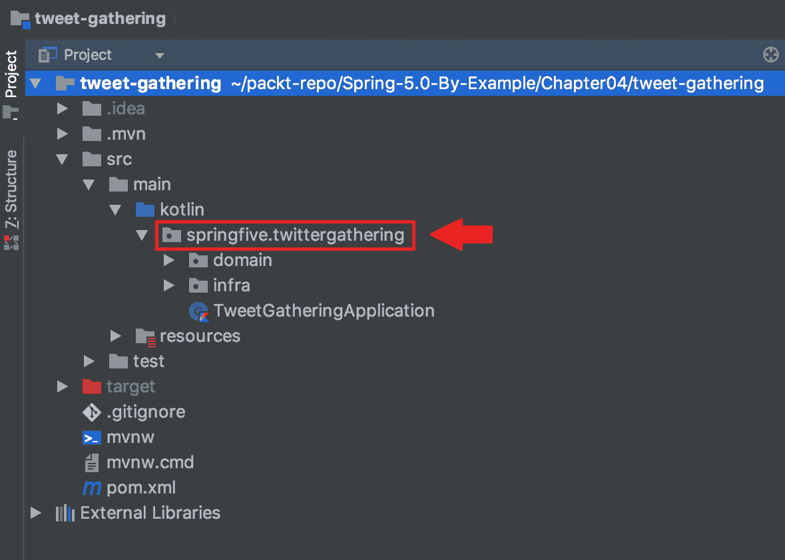

如我们所见，基本包是`springfive.twittergathering`包。然后，我们将尽快在这个包中创建子包。

让我们为微服务创建基础设施。

完整的源代码可以在 GitHub 上找到：[`github.com/PacktPublishing/Spring-5.0-By-Example/tree/master/Chapter05/tweet-gathering`](https://github.com/PacktPublishing/Spring-5.0-By-Example/tree/master/Chapter05/tweet-gathering)

# 使用 Docker 启动 RabbitMQ 服务器

我们可以使用 Docker 启动 RabbitMQ 服务器。我们不想在我们的开发机器上安装服务器，因为它可能会创建库冲突和大量的文件。让我们了解如何在 Docker 容器中启动 RabbitMQ。

让我们在下一节中这样做。

# 从 Docker Hub 拉取 RabbitMQ 镜像

我们需要从 Docker Hub 拉取 RabbitMQ 镜像。我们将使用官方存储库中的镜像，因为它更安全、更可靠。

要获取图像，我们需要使用以下命令：

```java
docker pull rabbitmq:3.7.0-management-alpine
```

等待下载完成，然后我们就可以继续到下一部分。在下一部分，我们将学习如何设置 RabbitMQ 服务器。

# 启动 RabbitMQ 服务器

要启动 RabbitMQ 服务器，我们将运行 Docker 命令。有一些考虑事项我们需要注意；我们将在这个之前创建的 Twitter Docker 网络上运行这个容器，但我们将在主机上暴露一些端口，因为这使与代理交互变得更容易。

此外，我们还将使用管理镜像，因为它提供了一个页面，使我们能够管理并查看类似控制面板上的 RabbitMQ 信息。

让我们运行：

```java
docker run -d --name rabbitmq --net twitter -p 5672:5672 -p 15672:15672 rabbitmq:3.7.0-management-alpine
```

等待几秒钟，以便 RabbitMQ 建立连接，然后我们可以连接到管理页面。为此，请访问 `http://localhost:15672` 并登录系统。默认用户是 guest，密码也是 `guest`。控制面板看起来像这样：

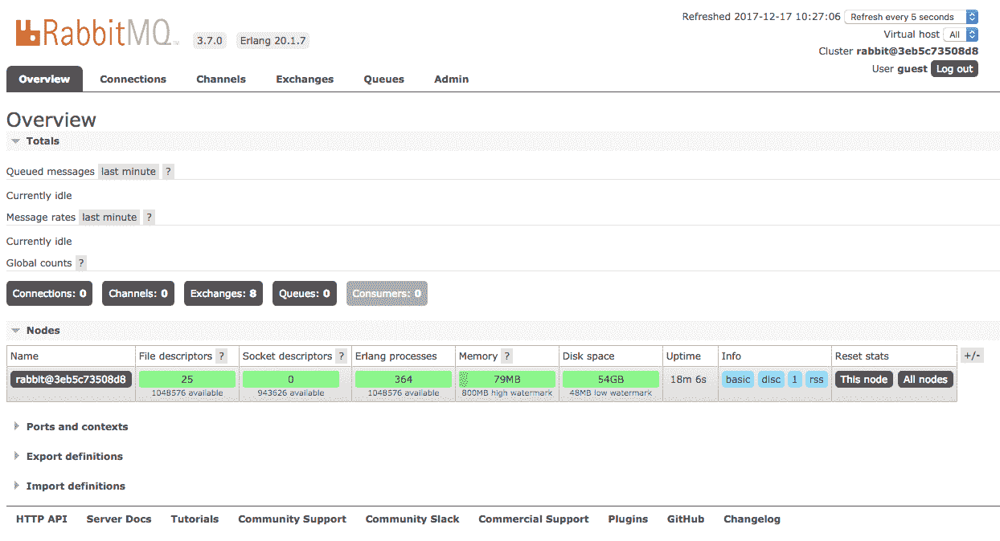

在面板上有很多有趣的信息，但到目前为止，我们将探索通道和一些有趣的部件。

太棒了。我们的 RabbitMQ 服务器已经启动并运行。我们很快就会使用这个基础设施。

# Spring Messaging AMQP

这个项目支持基于 AMQP 的消息解决方案。有一个高级 API 可以与所需的代理进行交互。这些交互可以从代理发送和接收消息。

就像在其他 Spring 项目中一样，这些功能是由 *模板* 类提供的，它们公开了由代理提供并由 Spring 模块实现的核心理念。

这个项目有两个部分：`spring-amqp` 是基础抽象，而 `spring-rabbit` 是 RabbitMQ 的实现。我们将使用 `spring-rabbit`，因为我们正在使用 RabbitMQ 代理。

# 在我们的 pom.xml 中添加 Spring AMQP

让我们把 `spring-amqp` jar 包添加到我们的项目中。`spring-amqp` 有一个启动依赖，它会为我们配置一些常见的东西，比如 `ConnectionFactory` 和 `RabbitTemplate`，所以我们会使用它。为了添加这个依赖，我们将按照以下方式配置我们的 `pom.xml`：

```java
<dependency>
  <groupId>org.springframework.boot</groupId>
  <artifactId>spring-boot-starter-amqp</artifactId>
</dependency>
```

下一步是配置连接；我们将使用 `application.yaml` 文件，因为我们正在使用启动器。在下一节中，我们将进行配置。

# 集成 Spring 应用程序和 RabbitMQ

我们已经在我们的项目中配置了`spring-amqp`依赖项。现在，是时候正确配置 RabbitMQ 连接了。我们将使用`RabbitMQTemplate`向代理发送消息；这有一些转换器，帮助我们将我们的领域模型转换为 JSON，反之亦然。

让我们配置我们的 RabbitMQ 连接。配置应该在`application.yaml`文件中，并且应该看起来像这样：

```java
spring:
  rabbitmq:
    host: localhost
    username: guest
    password: guest
    port: 5672
```

如我们所见，一些 Spring 配置与其他配置相当相似，相同的风格，`yaml`中的节点是技术的名称后面跟着几个属性。

我们正在使用 RabbitMQ 的默认凭据。主机和端口与 RabbitMQ 代理地址相关。配置很简单，但为我们做了很多事情，例如`ConnectionFactory`。

# 理解 RabbitMQ 交换、队列和绑定

我们正在使用 RabbitMQ 做一些有趣的事情。我们已经成功配置了连接。还有一些其他的事情我们还没有做，比如配置交换、队列和绑定，但在我们做这些之前，让我们更深入地了解一下这些术语。

# 交换

交换是 RabbitMQ 实体，消息被发送到那里。我们可以将其比作一条河流，水流就是消息的流程。在接下来的几节中，我们将了解四种不同类型的交换。

# 直接交换

直接交换允许基于路由键发送路由消息。这个名字本身就说明了问题，它允许将消息直接发送到指定的客户，即正在监听交换的客户。记住，它使用路由键作为参数来将消息路由到客户。

# 广播交换

广播交换将消息路由到所有独立绑定的队列，而不考虑路由键。所有绑定的队列都将接收到发送到广播交换的消息。它们可以用作具有主题行为或分布式列表。

# 主题交换

主题交换与直接交换类似，但主题交换使我们能够使用模式匹配，而直接交换只能允许精确的路由键。我们将在我们的项目中使用这种交换。

# 头部交换

头部交换是自解释的，其行为类似于主题交换，但不是使用路由键，而是使用头部属性来匹配正确的队列。

# 队列

队列是交换将消息写入的地方，它根据路由键来路由消息。队列是消费者获取已发布到交换的消息的地方。消息根据交换类型被路由到队列。

# 绑定

绑定可以被视为交换和队列之间的链接。我们可以将其视为一种交通警察，根据配置指导消息应该被重定向到何处，在这种情况下，链接。

# 在 Spring AMQP 上配置交换、队列和绑定

Spring AMQP 项目为之前列出的所有 RabbitMQ 实体提供了抽象，我们需要配置它以与代理交互。正如我们在其他项目中做的那样，我们需要一个 `@Configuration` 类，它将为 Spring 容器声明豆。

# 在 yaml 中声明交换、队列和绑定

我们需要配置实体名称以指导框架连接到代理实体。我们将使用 `application.yaml` 文件来存储这些名称，因为它更容易维护，并且是存储应用程序基础设施数据的正确方式。

实体名称的部分应如下所示：

```java
queue:
  twitter: twitter-stream
exchange:
  twitter: twitter-exchange
routing_key:
  track: track.*
```

属性是自解释的，`exchange` 节点具有交换机的名称，`queue` 节点具有队列名称，最后，`routing_key` 节点具有路由参数。

太棒了。属性已配置，现在我们将创建我们的 `@Configuration` 类。让我们在下一节中这样做。我们几乎准备好与 RabbitMQ 代理交互了。

# 声明 RabbitMQ 的 Spring 豆

现在，让我们创建我们的配置类。这个类相当简单，正如我们将通过 Spring 抽象看到的那样，它们也容易理解，特别是因为类名暗示了 RabbitMQ 实体。

让我们创建我们的类：

```java
package springfive.twittergathering.infra.rabbitmq

import com.fasterxml.jackson.databind.ObjectMapper
import com.fasterxml.jackson.module.kotlin.KotlinModule
import org.springframework.amqp.core.Binding
import org.springframework.amqp.core.BindingBuilder
import org.springframework.amqp.core.Queue
import org.springframework.amqp.core.TopicExchange
import org.springframework.amqp.support.converter.Jackson2JsonMessageConverter
import org.springframework.beans.factory.annotation.Value
import org.springframework.context.annotation.Bean
import org.springframework.context.annotation.Configuration

@Configuration
open class RabbitMQConfiguration(@Value("\${queue.twitter}") private val queue:String,
                                 @Value("\${exchange.twitter}") private val        
exchange:String,
                                 @Value("\${routing_key.track}") private val routingKey:String){

    @Bean
    open fun queue():Queue{
        return Queue(this.queue,false)
    }

    @Bean
    open fun exchange():TopicExchange{
        return TopicExchange(this.exchange)
    }

    @Bean
    open fun binding(queue: Queue, exchange: TopicExchange): Binding {
        return BindingBuilder.bind(queue).to(exchange).with(this.routingKey)
    }

    @Bean
    open fun converter(): Jackson2JsonMessageConverter {
        return Jackson2JsonMessageConverter(ObjectMapper().registerModule(KotlinModule()))
    }

}
```

这里有一些有趣的事情需要注意。在 `RabbitMQConfiguration` 构造函数中，我们注入了在 `application.yaml` 文件中配置的值来命名实体。之后，我们开始为容器配置 Spring 豆，以便它可以将其注入到 Spring 管理的类中。这里的关键点是，如果它们在 RabbitMQ 代理中不存在，Spring 将创建它们。谢谢，Spring，我们感激并喜欢它的帮助。

我们可以看到声明 `Binding` 的 DSL，它使开发者的生活变得更轻松，并防止代码中的错误。

在类的最后部分，我们声明了 `Jackson2JsonMessageConverter`。这些转换器用于将域模型转换为 JSON 以及相反。它使我们能够在监听器上接收域对象而不是字节数组或字符串。同样的行为也可以用在 `Producers` 中，我们能够发送域对象而不是 JSON。

我们需要向 `Jackson2JsonMessageConverter` 提供一个 `ObjectMapper`，我们使用了 Kotlin 模块，因为 Kotlin 处理数据类的方式，这些数据类没有无参构造函数。

干得好！我们的基础设施已完全配置。现在让我们编写生产者和消费者代码！

# 使用 Spring 消息传递消费消息

Spring AMQP 提供了 `@RabbitListener` 注解；它将为所需的队列配置订阅者，它移除了很多基础设施代码，例如连接到 `RabbitListenerConnectionFactory`，并程序化地创建消费者。这使得创建队列消费者变得非常简单。

`spring-boot-starter-amqp` 为我们提供了一些自动配置。当我们使用这个模块时，Spring 将自动为我们创建一个 `RabbitListenerConnectionFactory` 并配置 Spring 转换器以自动将 JSON 转换为领域类。

非常简单。Spring AMQP 真的为开发者提供了一个超级高级的抽象。

让我们看看即将在我们的应用程序中使用的示例：

```java
@RabbitListener(queues = ["twitter-track-hashtag"])
fun receive(hashTag:TrackedHashTag) {
...
}
```

完整的源代码可以在 GitHub 上找到：[`github.com/PacktPublishing/Spring-5.0-By-Example/blob/master/Chapter05/tweet-gathering/src/main/kotlin/springfive/twittergathering/domain/service/TwitterGatherRunner.kt`](https://github.com/PacktPublishing/Spring-5.0-By-Example/blob/master/Chapter05/tweet-gathering/src/main/kotlin/springfive/twittergathering/domain/service/TwitterGatherRunner.kt)

小菜一碟。代码非常容易理解，它使得我们只需关注业务规则。基础设施并不是一件好事，因为它并不为业务带来真正的价值，它只是一项技术。Spring 尝试抽象整个基础设施代码，以帮助开发者编写业务代码。这是 Spring 框架提供的一项真正有价值的资产。

感谢，Spring 团队。

# 使用 Spring 消息传递产生消息

`spring-amqp` 模块提供了一个 `RabbitTemplate` 类，它抽象了高级 RabbitMQ 驱动类。它提高了开发者的性能，并使应用程序无 bug，因为 Spring 模块是一组经过充分测试的代码。我们将使用 `convertAndSend()` 函数，该函数允许传递交换机、路由键和消息对象作为参数。请记住，这个函数使用 Spring 转换器将我们的模型类转换为 JSON 字符串。

`convertAndSend()` 方法有很多重载版本，根据具体的使用场景，其他版本可能更合适。我们将使用之前看到的那种简单版本。

让我们看看发送消息到代理的消息代码片段：

```java
this.rabbitTemplate.convertAndSend("twitter-exchange","track.${hashTag.queue}",it)
```

好的。第一个参数是 `Exchange` 名称，第二个是 `RoutingKey`。最后，我们有消息对象，它将被转换为 JSON 字符串。

我们很快就会看到代码的实际应用。

# 在我们的应用程序中启用 Twitter

在本节中，我们将启用 Twitter Gathering 应用程序上 Twitter API 的使用。这个应用程序应该根据用户指定的查询获取推文。这个查询是在上一章中我们创建的先前微服务上注册的。

当用户调用 API 注册 `TrackedHashTag` 时，微服务将 `TrackedHashTag` 存储在 Redis 数据库中，并通过 RabbitMQ 发送消息。然后，这个项目将开始根据这些信息收集推文。这是数据流。在下一章中，我们将进行反应式流，并通过我们的反应式 API 分发推文。这将非常令人兴奋。

然而，目前，我们需要配置 Twitter 凭证；我们将使用 Spring bean 来完成这项工作——让我们来实现它。

# 生成 Twitter 凭证

我们将使用`@Configuration`类来提供我们的 Twitter 配置对象。`@Configuration`类非常适合提供基础设施 bean，如果我们没有所需模块的启动项目。

此外，我们还将使用`application.yaml`文件来存储 Twitter 凭证。这种类型的配置不应该保存在源代码仓库中，因为它包含敏感数据，不应该与他人共享。然后，Spring 框架使我们能够在`yaml`文件中声明属性，并在运行时配置环境变量以填充这些属性。这是一种将敏感数据从源代码仓库中排除的绝佳方式。

# 在 application.yaml 中配置 Twitter 凭证

要开始在应用程序中配置 Twitter API，我们必须提供凭证。我们将使用`yaml`文件来完成这项工作。让我们在我们的`application.yaml`中添加凭证：

```java
twitter:
  consumer-key: ${consumer-key}
  consumer-secret: ${consumer-secret}
  access-token: ${access-token}
  access-token-secret: ${access-token-secret}
```

简单易懂。属性已经声明，然后我们使用`$`来指示 Spring 框架这个值将作为一个环境变量接收。记住，我们在上一章中已经配置了 Twitter 账户。

# 建模对象以表示 Twitter 设置

我们必须为我们的应用程序创建抽象和出色的数据模型。这将创建一些模型，使开发者的生活更容易理解和编码。让我们创建我们的 Twitter 设置模型。

# Twittertoken

这个类表示之前在 Twitter 中配置的应用程序令牌。该令牌只能用于应用程序认证。我们的模型应该如下所示：

```java
data class TwitterToken(val accessToken: String,val accessTokenSecret: String)
```

我喜欢 Kotlin 声明数据类的方式——完全不可变且没有样板代码。

# TwitterAppSettings

`TwitterAppSettings`表示消费者密钥和消费者密钥。从 Twitter 的角度来看，这是我们应用程序的一种身份标识。我们的模型相当简单，必须如下所示：

```java
data class TwitterAppSettings(val consumerKey: String,val consumerSecret: String)
```

干得好，我们的模型已经准备好了。现在是时候为 Spring 容器生成对象了。我们将在下一节中这样做。

# 为 Spring 容器声明 Twitter 凭证

让我们生成我们的 Twitter 配置对象。按照我们一直在使用的模式，我们将使用`@Configuration`类。该类应该如下所示：

```java
package springfive.twittergathering.infra.twitter

import org.springframework.beans.factory.annotation.Value
import org.springframework.context.annotation.Bean
import org.springframework.context.annotation.Configuration

@Configuration
open class TwitterConfiguration(@Value("\${twitter.consumer-key}") private val consumerKey: String,
                                @Value("\${twitter.consumer-secret}") private val consumerSecret: String,
                                @Value("\${twitter.access-token}") private val accessToken: String,
                                @Value("\${twitter.access-token-secret}") private val accessTokenSecret: String) {

    @Bean
    open fun twitterAppSettings(): TwitterAppSettings {
        return TwitterAppSettings(consumerKey, consumerSecret)
    }

    @Bean
    open fun twitterToken(): TwitterToken {
        return TwitterToken(accessToken, accessTokenSecret)
    }

}
```

非常简单，这是声明 Spring 中 bean 的一种 Spring 方式。我们正在逐步改进我们使用 Spring 的方式。做得好！

现在，我们已经完成了 Twitter 的配置。我们将使用 Spring WebFlux 的 WebClient 来消费 Twitter API，它支持响应式编程范式。在我们运行代码之前，让我们先了解一下。

# Spring 响应式 Web 客户端

这是一个相当新的功能，它是在 Spring Framework 5 中添加的。它使我们能够使用响应式范式与 HTTP 服务交互。

然而，它并不是 Spring 提供的`RestTemplate`的替代品，而是一个用于处理反应式应用程序的补充。不用担心，`RestTemplate`是传统应用程序中与 HTTP 服务交互的出色且经过测试的实现。

此外，`WebClient`实现支持`text/event-stream` MIME 类型，这可以让我们消费服务器事件。

# 以 Spring 方式生成 WebClient

在我们开始调用 Twitter API 之前，我们希望在 Spring 中以某种方式创建一个`WebClient`实例。这意味着我们正在寻找一种方法来注入实例，使用依赖注入模式。

为了实现这一点，我们可以使用`@Configuration`注解并创建一个`WebClient`实例，使用`@Bean`注解来声明 Spring 容器中的 bean。让我们这样做：

```java
package springfive.twittergathering.infra.web

import org.springframework.context.annotation.Bean
import org.springframework.context.annotation.Configuration
import org.springframework.web.reactive.function.client.WebClient

@Configuration
open class WebClientProducer {

    @Bean
    open fun webClient(): WebClient? {
        return WebClient.create()
    }

}
```

在这个类别中有一两个已知的注释；这是一种在 Spring 中以标准方式声明 bean 实例的相当常见方法。这使得在 Spring 管理的其他类中注入`WebClient`实例成为可能。

# 创建模型以收集推文

如果我们想要异步和反应式地消费 Twitter API，那么我们应该创建 API 客户端。在我们编写客户端代码之前，我们需要根据我们的要求创建我们的模型类。

我们不需要所有推文的属性。我们期望以下属性：

+   `id`

+   `text`

+   `createdAt`

+   `user`

然后，我们将根据列出的属性来构建我们的班级模型。

让我们从用户属性开始。这个属性是一个 JSON 属性，我们将为它创建一个单独的类。这个类应该看起来像这样：

```java
@JsonIgnoreProperties(ignoreUnknown = true)
data class TwitterUser(val id:String,val name:String)
```

我们使用了 Kotlin 的`data class`，它非常适合我们的用例，我们希望将其用作数据容器。此外，我们需要添加`@JsonIgnoreProperties(ignoreUnknown = true)`，因为这个注解指示 Spring 转换器在 JSON 响应中缺少属性时忽略该属性。这是这部分代码的重要部分。

我们已经创建了`TwitterUser`类，它代表了创建推文的用户。现在，我们将创建一个代表推文的`Tweet`类。让我们创建我们的类：

```java
@JsonIgnoreProperties(ignoreUnknown = true)
data class Tweet(val id:String, val text:String, @JsonProperty("created_at")val createdAt:String, val user:TwitterUser)
```

对于我们来说有一些常见的事情，还有一件新的事情。`@JsonProperty`允许开发者自定义类上的属性名，该类在 JSON 中有不同的属性名；这对于 Java 开发者来说很常见，因为他们通常使用*CamelCase*作为命名属性的命名方式，而在 JSON 表示法中，人们通常使用*SnakeCase*。这个注解可以帮助我们解决编程语言和 JSON 之间的这种不匹配。

我们可以在这里找到关于蛇形命名的更详细解释：[`en.wikipedia.org/wiki/Snake_case`](https://en.wikipedia.org/wiki/Snake_case)。同样，我们也可以在这里找到关于驼峰命名的完整解释：[`en.wikipedia.org/wiki/Camel_case`](https://en.wikipedia.org/wiki/Camel_case)。

很好。我们的 API 对象已经准备好了。有了这些对象，我们就可以与 API 交互。我们将创建一个服务来收集推文。我们将在下一节中这样做。

# 使用 Twitter API 进行认证

在我们的对象准备好后，我们需要创建一个类来帮助我们处理 Twitter 认证。我们将使用 Twitter 应用程序仅认证模型。这种认证应该用于后端应用程序。

使用这种认证方式的应用程序可以：

+   拉取用户时间线

+   访问任何账户的朋友和关注者

+   访问列表和资源

+   在推文中搜索

+   获取任何用户信息

如我们所见，该应用程序是一个只读的 Twitter API 消费者。

我们可以使用 Twitter 文档详细了解这种认证。文档可以在以下位置找到：[`developer.twitter.com/en/docs/basics/authentication/guides/authorizing-a-request.`](https://developer.twitter.com/en/docs/basics/authentication/guides/authorizing-a-request)

我们将遵循 Twitter 文档来授权我们的请求，它类似于烹饪食谱，因此我们必须遵循所有步骤。最终的类应该看起来像这样：

```java
package springfive.twittergathering.infra.twitter

import org.springframework.util.StringUtils
import springfive.twittergathering.infra.twitter.EncodeUtils.computeSignature
import springfive.twittergathering.infra.twitter.EncodeUtils.encode
import java.util.*

object Twitter {

    private val SIGNATURE_METHOD = "HMAC-SHA1"

    private val AUTHORIZATION_VERIFY_CREDENTIALS = "OAuth " +
            "oauth_consumer_key=\"{key}\", " +
            "oauth_signature_method=\"" + SIGNATURE_METHOD + "\", " +
            "oauth_timestamp=\"{ts}\", " +
            "oauth_nonce=\"{nonce}\", " +
            "oauth_version=\"1.0\", " +
            "oauth_signature=\"{signature}\", " +
            "oauth_token=\"{token}\""

    fun buildAuthHeader(appSettings: TwitterAppSettings, twitterToken: TwitterToken, method: String, url: String, query: String):String{
        val ts = "" + Date().time / 1000
        val nounce = UUID.randomUUID().toString().replace("-".toRegex(), "")
        val parameters = "oauth_consumer_key=${appSettings.consumerKey}&oauth_nonce=$nounce&oauth_signature_method=$SIGNATURE_METHOD&oauth_timestamp=$ts&oauth_token=${encode(twitterToken.accessToken)}&oauth_version=1.0&track=${encode(query)}"
        val signature = "$method&" + encode(url) + "&" + encode(parameters)
        var result = AUTHORIZATION_VERIFY_CREDENTIALS
        result = StringUtils.replace(result, "{nonce}", nounce)
        result = StringUtils.replace(result, "{ts}", "" + ts)
        result = StringUtils.replace(result, "{key}", appSettings.consumerKey)
        result = StringUtils.replace(result, "{signature}", encode(computeSignature(signature, "${appSettings.consumerSecret}&${encode(twitterToken.accessTokenSecret)}")))
        result = StringUtils.replace(result, "{token}", encode(twitterToken.accessToken))
        return result
    }

}

data class TwitterToken(val accessToken: String,val accessTokenSecret: String)

data class TwitterAppSettings(val consumerKey: String,val consumerSecret: String)
```

这是一个食谱。函数`buildAuthHeader`将使用授权请求的规则创建授权头。我们已对一些请求头进行了签名，并结合请求体。此外，用我们的 Twitter 凭证对象替换模板值。

# 有关服务器发送事件（SSE）的一些说明

服务器发送事件（SSE）是一种技术，其中服务器向客户端发送事件，而不是客户端轮询服务器以检查信息可用性。消息流不会中断，直到客户端或服务器关闭流。

在这里需要理解的最重要的事情是信息流的流向。服务器决定何时向客户端发送数据。

处理资源负载和带宽使用非常重要。客户端将接收数据块，而不是通过轮询技术将负载施加在服务器上。

Twitter 有一个流 API，Spring Framework WebClient 支持 SSE。现在是消费 Twitter 流的时候了。

# 创建收集服务

`TweetGatherService`将负责与 Twitter API 交互，并根据请求的标签收集请求推文。该服务将是一个带有一些注入属性的 Spring Bean。类应该看起来像这样：

```java
package springfive.twittergathering.domain.service

import com.fasterxml.jackson.annotation.JsonIgnoreProperties
import com.fasterxml.jackson.annotation.JsonProperty
import org.springframework.http.MediaType
import org.springframework.stereotype.Service
import org.springframework.web.reactive.function.BodyInserters
import org.springframework.web.reactive.function.client.WebClient
import reactor.core.publisher.Flux
import springfive.twittergathering.infra.twitter.Twitter
import springfive.twittergathering.infra.twitter.TwitterAppSettings
import springfive.twittergathering.infra.twitter.TwitterToken

@Service
class TweetGatherService(private val twitterAppSettings: TwitterAppSettings,
                         private val twitterToken: TwitterToken,
                         private val webClient: WebClient) {

    fun streamFrom(query: String): Flux<Tweet> {
        val url = "https://stream.twitter.com/1.1/statuses/filter.json"
        return this.webClient.mutate().baseUrl(url).build()
                .post()
                .body(BodyInserters.fromFormData("track", query))
                .header("Authorization", Twitter.buildAuthHeader(twitterAppSettings, twitterToken, "POST", url, query))
                .accept(MediaType.TEXT_EVENT_STREAM)
                .retrieve().bodyToFlux(Tweet::class.java)
    }

}

@JsonIgnoreProperties(ignoreUnknown = true)
data class Tweet(val id: String = "", val text: String = "", @JsonProperty("created_at") val createdAt: String = "", val user: TwitterUser = TwitterUser("", ""))

@JsonIgnoreProperties(ignoreUnknown = true)
data class TwitterUser(val id: String, val name: String)
```

这里有一些重要的要点。首先是函数声明；看看`Flux<Tweet>`，这意味着数据永远不会中断，因为它代表了 N 个值。在我们的情况下，我们将消费 Twitter 流，直到客户端或服务器中断数据流。

之后，我们配置了 HTTP 请求体，以获取我们想要的跟踪事件。之后，我们配置了 Accept HTTP 头；这是向 WebClient 指示它需要消费哪种 MIME 类型的关键。

最后，我们使用了 `Twitter.buildAuthHeader` 函数来配置 Twitter 认证。

太棒了，我们准备好开始消费 Twitter API，我们只需要编写触发器来使用该函数。我们将在下一节中这样做。

# 监听 RabbitMQ 队列并消费 Twitter API

我们将消费 Twitter API，但何时开始？

当跟踪标签的请求到达我们的应用程序时，我们需要开始获取推文。为了达到这个目标，当 `TrackedHashTag` 在我们的微服务上注册时，我们将实现 RabbitMQ 监听器。应用程序将向代理发送消息以开始消费 Twitter 流。

让我们看看代码，一步一步地理解其行为；最终的代码应该看起来像这样：

```java
package springfive.twittergathering.domain.service

import org.springframework.amqp.rabbit.annotation.RabbitListener
import org.springframework.amqp.rabbit.core.RabbitTemplate
import org.springframework.stereotype.Service
import reactor.core.publisher.Mono
import reactor.core.scheduler.Schedulers
import springfive.twittergathering.domain.TrackedHashTag
import java.util.concurrent.CompletableFuture
import java.util.concurrent.TimeUnit

@Service
class TwitterGatherRunner(private val twitterGatherService: TweetGatherService,private val rabbitTemplate: RabbitTemplate) {

    @RabbitListener(queues = ["twitter-track-hashtag"])
    fun receive(hashTag:TrackedHashTag) {
        val streamFrom = this.twitterGatherService.streamFrom(hashTag.hashTag).filter({
            return@filter it.id.isNotEmpty() && it.text.isNotEmpty() &&  
             it.createdAt.isNotEmpty()
        })
        val subscribe = streamFrom.subscribe({
            println(it.text)
            Mono.fromFuture(CompletableFuture.runAsync {
                this.rabbitTemplate.convertAndSend("twitter- 
                 exchange","track.${hashTag.queue}",it)
            })
        })
        Schedulers.elastic().schedule({ subscribe.dispose() },10L,TimeUnit.SECONDS)
    }

}
```

保持冷静。我们将涵盖整个代码。在 `@RabbitListener` 中，我们配置了我们想要消费的队列名称。Spring AMQP 模块将自动为我们配置监听器并开始消费所需的队列。正如我们所见，我们收到了 `TrackedHashTag` 对象；记住之前章节中的转换器。

第一条指令将开始消费 Twitter 流。该流返回一个 flux，其中可以有很多数据事件。在消费者之后，我们希望在流中过滤数据。我们想要 `Tweet`，其中 `id`、`text` 和 `createdAt` 都不为空。

然后，我们订阅这个流并开始接收流中的数据。此外，`subscribes` 函数返回一个可丢弃的对象，这将在下一步中很有帮助。我们创建了一个匿名函数，该函数将在控制台上打印 `Tweet` 并将 Tweet 发送到 RabbitMQ 队列，以便在另一个微服务中消费。

最后，我们使用调度器停止数据流并消费数据 10 秒。

在测试 Twitter 流之前，我们需要将跟踪标签服务更改为通过 RabbitMQ 发送消息。我们将在下一节中这样做。这些更改很小，我们会快速完成。

# 更改跟踪标签服务

为了运行整个解决方案，我们需要对跟踪标签服务项目做一些更改。这些更改很简单且基本；配置 RabbitMQ 连接并将服务更改为向代理发送消息。

让我们这样做。

# 添加 Spring Starter RabbitMQ 依赖

正如我们在 Twitter Gathering 项目中之前所做的那样，我们需要添加 `spring-boot-starter-amqp` 以提供一些自动配置。为此，我们需要将以下片段添加到我们的 `pom.xml` 文件中：

```java
<dependency>
  <groupId>org.springframework.boot</groupId>
  <artifactId>spring-boot-starter-amqp</artifactId>
</dependency>
```

对了。现在，是时候配置 RabbitMQ 连接了。我们将在下一节中这样做。

# 配置 RabbitMQ 连接

我们将使用 `application.yaml` 来配置 RabbitMQ 连接。然后，我们需要在其中创建一些属性，Spring AMQP 模块将使用提供的配置来启动连接工厂。

配置它很简单。跟踪标签的最终`yaml`文件应该看起来像这样：

```java
spring:
  rabbitmq:
    host: localhost
    username: guest
    password: guest
    port: 5672
  redis:
    host: 127.0.0.1
    port: 6379

server:
  port: 9090

queue:
  twitter: twitter-track-hashtag
exchange:
  twitter: twitter-track-exchange
routing_key:
  track: "*"
---
spring:
  profiles: docker
  rabbitmq:
    host: rabbitmq
    username: guest
    password: guest
    port: 5672
  redis:
    host: redis
    port: 6379

server:
  port: 9090

queue:
  twitter: twitter-track-hashtag
exchange:
  twitter: twitter-track-exchange
routing_key:
  track: "*"
```

在这个 yaml 文件中有两个配置文件。看看 RabbitMQ 的不同主机。在默认配置文件中，我们能够连接到 localhost，因为我们已经在主机上公开了 RabbitMQ 端口。但在 Docker 配置文件中，我们无法连接到 localhost，我们需要连接到`rabbitmq`主机，这是 Twitter 网络的主机。

我们的 RabbitMQ 连接已准备好使用。让我们在下一节尝试它。让我们开始吧。

# 为 Twitter 标签服务创建交换、队列和绑定

让我们声明我们的 RabbitMQ 实体以用于跟踪标签。我们将使用`@Configuration`类来完成这项工作。

RabbitMQ 连接应该看起来像这样：

```java
package springfive.twittertracked.infra.rabbitmq

import com.fasterxml.jackson.databind.ObjectMapper
import com.fasterxml.jackson.module.kotlin.KotlinModule
import org.springframework.amqp.core.Binding
import org.springframework.amqp.core.BindingBuilder
import org.springframework.amqp.core.Queue
import org.springframework.amqp.core.TopicExchange
import org.springframework.amqp.support.converter.Jackson2JsonMessageConverter
import org.springframework.beans.factory.annotation.Value
import org.springframework.context.annotation.Bean
import org.springframework.context.annotation.Configuration

@Configuration
open class RabbitMQConfiguration(@Value("\${queue.twitter}") private val queue:String,
                                 @Value("\${exchange.twitter}") private val exchange:String,
                                 @Value("\${routing_key.track}") private val routingKey:String){

    @Bean
    open fun queue():Queue{
        return Queue(this.queue,false)
    }

    @Bean
    open fun exchange():TopicExchange{
        return TopicExchange(this.exchange)
    }

    @Bean
    open fun binding(queue: Queue, exchange: TopicExchange): Binding {
        return BindingBuilder.bind(queue).to(exchange).with(this.routingKey)
    }

    @Bean
    open fun converter(): Jackson2JsonMessageConverter {
        return Jackson2JsonMessageConverter(ObjectMapper().registerModule(KotlinModule()))
    }

}
```

很简单。我们声明了一个交换、队列和绑定，就像我们之前做的那样。

# 向代理发送消息

这现在是最有趣的部分。当我们想要保存`TrackedHashTag`时，我们必须将这个全新的实体发送到 RabbitMQ。这个过程将发送消息，然后 Twitter 聚集微服务将在十秒后开始消费流。

我们需要稍微修改一下`TrackedHashTagService`；最终版本应该看起来像这样：

```java
package springfive.twittertracked.domain.service

import org.springframework.amqp.rabbit.core.RabbitTemplate
import org.springframework.beans.factory.annotation.Value
import org.springframework.stereotype.Service
import reactor.core.publisher.Mono
import springfive.twittertracked.domain.TrackedHashTag
import springfive.twittertracked.domain.repository.TrackedHashTagRepository
import java.util.concurrent.CompletableFuture

@Service
class TrackedHashTagService(private val repository: TrackedHashTagRepository,
                            private val rabbitTemplate: RabbitTemplate,
                            @Value("\${exchange.twitter}") private val exchange: String,
                            @Value("\${routing_key.track}") private val routingKey: String) {

    fun save(hashTag: TrackedHashTag) {
        this.repository.save(hashTag).subscribe { data ->
            Mono.fromFuture(CompletableFuture.runAsync {
 this.rabbitTemplate.convertAndSend(this.exchange, this.routingKey,  
                hashTag)
 })
        }
    }

    fun all() = this.repository.findAll()

}
```

干得好。当新的实体到来时，它将被发送到代理。我们已经完成了对跟踪标签服务的修改。

最后，我们能够测试整个流程。让我们开始玩耍并感知我们构建的应用程序的真正力量。

演示时间！！！

# 测试微服务的集成

现在，我们准备好测试整个解决方案。在你开始之前，我们需要检查以下基础设施项目：

+   Redis

+   RabbitMQ

如果项目正在运行，我们可以跳到下一节。

我们可以使用`docker ps`命令，该命令应该列出运行模式下的 Redis 和 RabbitMQ 容器。

# 运行跟踪标签服务

运行这个应用程序没有特别的事情要做。它包括在`application.yaml`的默认配置文件中配置的基础设施连接。

运行`TrackedHashTagApplication`上的主函数。我们可以使用 IDE 或命令行来完成这项工作。

检查控制台输出；输出将在 IDE 或命令行上显示。我们想要找到以下行：

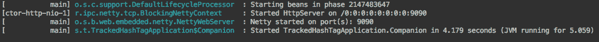

这意味着第一个应用程序完全运行，我们可以运行 Twitter 聚集。请保持应用程序运行，因为它需要这样做。

让我们运行 Twitter 聚集！！！

# 运行 Twitter 聚集

这个应用程序运行起来稍微复杂一些。我们需要为它配置一些环境变量。这是必需的，因为我们不希望在我们的存储库中包含 Twitter 应用程序凭证。

在 IDE 中做这件事很简单。为此，我们可以配置运行配置。让我们来做这件事：

1.  点击编辑配置...，如下图所示：

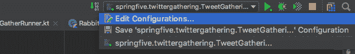

然后，我们能够看到像这样的环境变量：

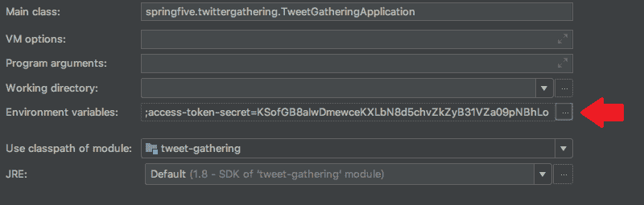

1.  我们需要点击 **...**，如图中所示。

1.  下一个屏幕将显示，我们可以配置环境变量：

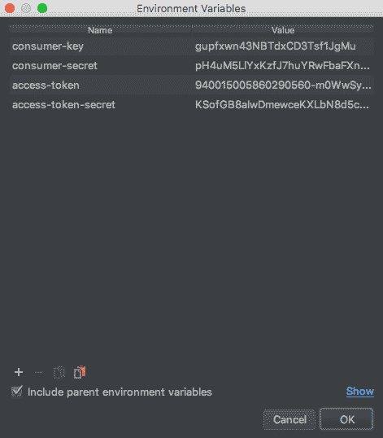

1.  我们需要配置以下环境变量：

    +   consumer-key

    +   consumer-secret

    +   access-token

    +   access-token-secret

这些值应该填写 Twitter 应用程序管理器的值。

然后，我们可以运行应用程序。运行它！！

现在，我们应该在控制台中看到以下行，这意味着应用程序正在运行：

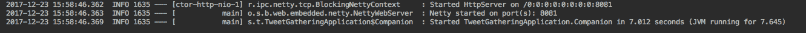

太棒了，我们的两个微服务正在运行。让我们触发 Twitter 流。我们将在下一节中这样做。

运行应用程序还有其他方法，例如使用 Maven Spring Boot 目标或 Java 命令行。如果你更喜欢在 Java 命令行中运行，请记住使用 `-D` 参数来传递环境变量。

# 测试内容

我们非常期待测试完整的集成。我们可以使用 `curl` 工具向 Tracked Hashtag 服务发送请求数据。我们想跟踪来自 Twitter 的 `"bitcoin"`。

我们可以执行以下命令行：

```java
curl -H "Content-Type: application/json" -X POST -d '{"hashTag":"bitcoin","queue":"bitcoin"}' \
http://localhost:9090/api/tracked-hash-tag
```

检查 HTTP 状态码；它应该是 HTTP 状态 200。之后，我们可以检查 Twitter Gathering 项目的控制台，并且应该有大量的推文被记录。

看看日志，日志中必须有像这样的推文：

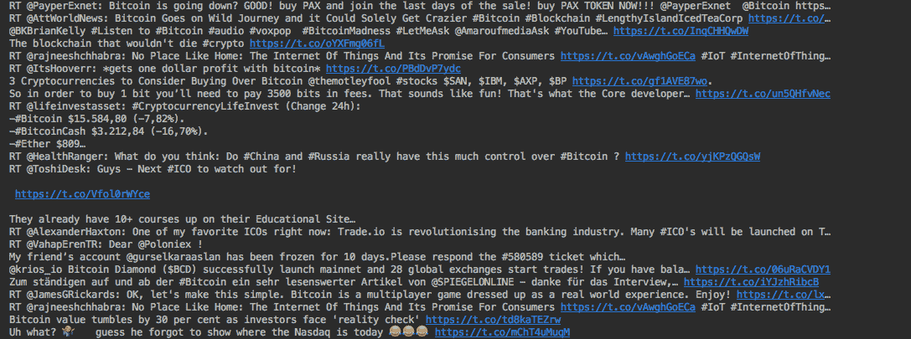

太棒了！

伟大的工作，伙计们，我们已经将完整的应用程序与 RabbitMQ 和 Twitter 流集成在一起。

# Spring Actuator

Spring Boot Actuator 是当应用程序在生产环境中运行时的一种辅助工具。该项目提供了已部署应用程序的内置信息。

在微服务世界中，监控应用程序的实例是获得成功的关键点。在这些环境中，通常有许多应用程序通过网络协议（如 HTTP）调用其他应用程序。网络是一个不稳定的 环境，有时它可能会失败；我们需要跟踪这些事件以确保应用程序处于运行状态并且完全可用。

Spring Boot Actuator 在这些情况下帮助开发者。该项目公开了一些包含应用程序信息的 HTTP API，例如内存使用情况、CPU 使用情况、应用程序健康检查以及应用程序的基础设施组件，例如与数据库和消息代理的连接等。

最重要的一点是，信息通过 HTTP 暴露。它有助于与外部监控应用程序（如 Nagios 和 Zabbix）的集成，例如。没有特定的协议用于暴露这些信息。

让我们将其添加到我们的项目中并尝试几个端点。

# 在我们的 pom.xml 中添加 Spring Boot Actuator

Spring Boot Actuator 在我们的 `pom.xml` 中配置起来非常简单。我们扩展了 Spring Boot 的父 pom，因此没有必要指定依赖项的版本。

让我们配置我们的新依赖项：

```java
<dependencies>
  <dependency>
    <groupId>org.springframework.boot</groupId>
    <artifactId>spring-boot-starter-actuator</artifactId>
  </dependency>
</dependencies>
```

太棒了，真的很容易。在我们测试之前，让我们更深入地了解一下。

# Actuator 端点

项目有很多内置的端点，并且当应用程序启动时它们会启动。记住，我们已经使用了启动项目，这是自动为我们配置它的项目。

有几个端点用于不同的需求，我们将查看在生产微服务中最常用的端点。

+   `/health`：最知名的 actuator 端点；它显示了应用程序的健康状况，通常有一个`status`属性

+   `/configprops`：显示折叠的 `@ConfigurationProperties`

+   `/env`：公开 Spring `ConfigurableEnvironment` 的属性

+   `/dump`：显示线程转储

+   `/info`：我们可以在该端点放置一些任意信息

+   `/metrics`：运行应用程序的指标

+   `/mappings`：当前应用程序的 `@RequestMappings` 端点

另一个重要的端点可以通过 HTTP 接口显示应用程序日志。`/logfile` 端点可以帮助我们可视化日志文件。

Spring Boot Actuator 创建的端点列表可以在以下位置找到：[`docs.spring.io/spring-boot/docs/current/reference/html/production-ready-endpoints.html`](https://docs.spring.io/spring-boot/docs/current/reference/html/production-ready-endpoints.html)。

# 应用程序自定义信息

我们可以使用一个特定的端点来从我们的应用程序中公开自定义信息。这些信息将通过`/info`端点公开。

为了配置这一点，我们可以使用 `application.yaml` 文件并将所需信息按照以下模式放置，如下所示：

```java
info:
  project: "twitter-gathering"
  kotlin: @kotlin.version@
```

所需的属性必须以 `info. *` 开头。然后，我们可以测试我们的第一个 actuator 端点并检查我们的 `/info` 资源。

让我们尝试访问`http://localhost:8081/info`。在`application.yaml`中填写的信息应该会显示出来，如下所示：

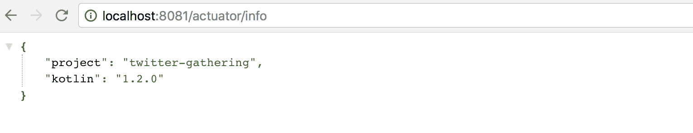

如我们所见，属性是从 HTTP 端点公开的。我们可以使用它来放置应用程序版本，例如。

# 测试端点

在 Spring Boot 的第 2 版中，Spring Actuator 管理端点默认是禁用的，因为这些端点可能包含运行中应用程序的敏感数据。然后，我们需要配置以正确启用这些端点。

有一个需要注意的特殊点。如果应用程序公开暴露，你应该保护这些端点。

让我们启用我们的管理端点：

```java
management:
  endpoints:
    web:
 expose: "*"
```

在前面的配置中，我们启用了所有管理端点，然后我们可以开始测试一些端点。

让我们测试一些端点。首先，我们将测试指标端点。此端点显示了运行应用程序可用的指标。访问 `http://localhost:8081/actuator/metrics` 并查看结果：

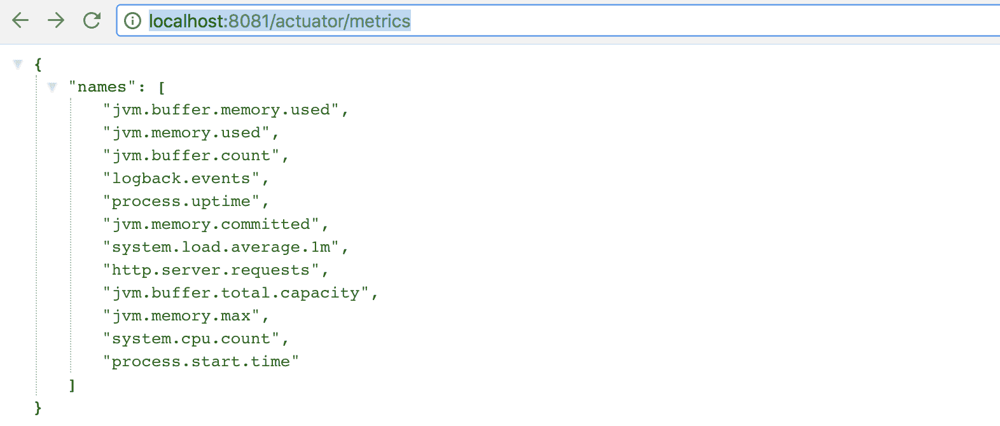

我们使用端口 `8081` 是因为我们已在 `application.yaml` 中配置了属性 `server.port`。端口可以根据你的需求进行更改。

已经为我们自动配置了许多指标。该端点仅公开可用的指标。要检查指标值，我们需要使用另一个端点。让我们检查 `http.server.request` 的值。

检查值的基端点是：`http://localhost:8081/actuator/metrics/{metricName}`。然后，我们需要访问：`http://localhost:8081/actuator/metrics/http.server.requests`。结果应该是：

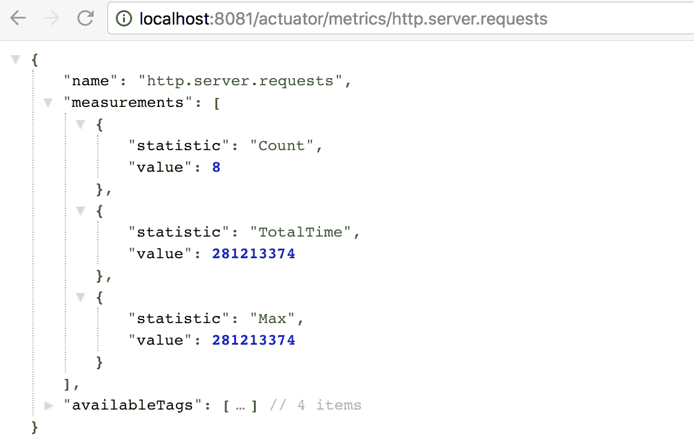

正如你所见，服务器接收了八次调用。尝试再点击几次以查看指标的变化。

干得好。我们的微服务已准备好投入生产。我们有 Docker 镜像和用于监控服务的端点。

# 摘要

在本章中，我们学习了并将许多 Spring 高级概念付诸实践，例如 RabbitMQ 集成。

我们创建了一个完全响应式的 WebClient 并利用了响应式范式；它实现了资源计算优化并提高了应用程序的性能。

此外，我们通过 RabbitMQ 代理集成了两个微服务。这是集成应用程序的一个优秀解决方案，因为它解耦了应用程序，并且允许你非常容易地水平扩展应用程序。消息驱动是构建响应式应用程序的必要特性之一；它可以在《响应式宣言》中找到（[`www.reactivemanifesto.org/en`](https://www.reactivemanifesto.org/en)）。

在下一章中，我们将改进我们的解决方案并创建一个新的微服务来向我们的客户流式传输过滤后的推文。我们还将再次使用 RabbitMQ。
