# 玩转服务器端事件（Server-Sent Events）

在第四章，Kotlin 基础和 Spring Data Redis 以及第五章，*反应式 Web 客户端*中，我们创建了两个微服务。第一个负责在 Redis 上跟踪数据并触发第二个微服务，该微服务将消费 Twitter 流。这个过程是异步发生的。

在本章中，我们将创建另一个微服务，该服务将消费 Twitter Gathering 产生的数据，并通过 REST API 公开。将能够通过文本内容过滤推文。

我们已经使用服务器端事件（Server-Sent Events）（SSE）消费了 Twitter 流；我们创建了一个反应式 REST 客户端来消费它。现在，是时候创建我们的 SSE 实现了。我们将消费 RabbitMQ 队列并将数据推送到我们的连接客户端。

我们将探讨 SSE 并了解为什么这种解决方案非常适合我们的一些微服务。

在本章结束时，我们将对在 Spring 生态系统中使用 SSE 有信心。

在本章中，我们将学习以下内容：

+   使用 Spring 框架实现 SSE 端点

+   使用 Reactor Rabbit 客户端消费 RabbitMQ

# 创建 Tweet 分发器项目

现在，我们将创建我们的最后一个微服务。它将推送 Twitter Gathering 过滤后的推文给我们的连接客户端，在这种情况下，消费者。

在本章中，我们将使用 Spring Initializr 页面来帮助我们创建我们漂亮的新项目。让我们创建。

# 再次使用 Spring Initializr

如您所见，Spring Initializr 页面是创建 Spring 项目的合作伙伴。让我们再次使用它并创建一个项目：

前往[`start.spring.io`](https://start.spring.io)并使用以下截图填写数据：

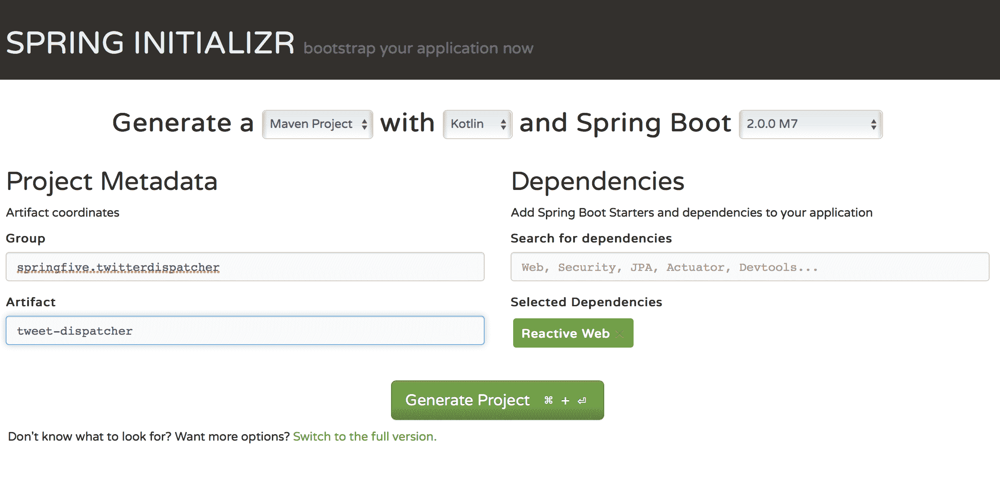

我们选择了反应式 Web 依赖项；我们还将继续使用 Kotlin 作为编程语言。最后，点击“生成项目”按钮。很好，对我们来说足够了。

有一些缺失的依赖项在 Spring Initializr 中没有显示。我们需要手动设置这些依赖项。我们将在下一节中完成这项任务。让我们去吧。

# 额外的依赖项

我们需要使用 Jackson Kotlin 模块作为依赖项来正确处理我们新微服务中的 JSON。此外，我们还将使用 Reactor RabbitMQ 依赖项，它允许我们在反应式范式与 RabbitMQ 代理交互。

要添加这些依赖项，我们需要将以下片段添加到 `pom.xml`：

```java
<dependency>
  <groupId>com.fasterxml.jackson.module</groupId>
  <artifactId>jackson-module-kotlin</artifactId>
  <version>${jackson.version}</version>
</dependency>

<dependency>
  <groupId>io.projectreactor</groupId>
  <artifactId>reactor-test</artifactId>
  <scope>test</scope>
</dependency>

<dependency>
  <groupId>io.projectreactor.rabbitmq</groupId>
  <artifactId>reactor-rabbitmq</artifactId>
  <version>1.0.0.M1</version>
</dependency>
```

太棒了。我们的依赖项已配置。我们的项目准备就绪。

在开始之前，我们需要深入理解 SSE 的概念。我们将在下一节中学习。

# 服务器端事件

服务器端事件（Server-Sent Events）是从服务器向客户端发送数据流的标准方式。在下一节中，我们将学习如何使用 Spring 框架实现它。

此外，我们还将了解 SSE 和 WebSockets 之间的主要区别。

# 关于 HTTP 协议的一些话

HTTP 是 OSI 模型中的应用层协议。应用层是 OSI 模型中最后表示的一层。这意味着这一层更接近用户界面。这一层的主要目的是发送和接收用户输入的数据。通常，这通过用户界面，也称为应用程序，如文件传输和发送电子邮件来实现。

应用层有几种协议，例如域名系统（DNS），它将域名转换为 IP 地址，或者 SMTP，其主要目的是将电子邮件发送到邮件管理应用程序。

应用层直接与电子邮件客户端等软件交互，例如；与硬件部分没有交互。它是 OSI 模型的最后一层，也是离最终用户最近的一层。

所有这些层都处理软件，这意味着没有关于 OSI 模型中代表的物理部分的担忧。

可以在以下链接找到 OSI 模型的更详细解释：[`support.microsoft.com/en-us/help/103884/the-osi-model-s-seven-layers-defined-and-functions-explained`](https://support.microsoft.com/en-us/help/103884/the-osi-model-s-seven-layers-defined-and-functions-explained)。

以下是一个 OSI 模型的表示：

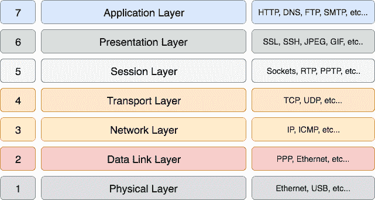

HTTP 协议使用 TCP 协议作为传输通道。然后，它将建立连接并开始在通道上传输数据。

TCP 协议是一种流协议和全双工通道。这意味着服务器和客户端可以通过连接发送数据。

# HTTP 和持久连接

HTTP 协议是一种请求-响应模型，其中客户端提交消息（HTTP 请求）并处理此消息，然后将响应（HTTP 响应）发送给客户端。在发送响应后，连接将被关闭。

看看以下图表：

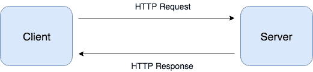

理解起来相当简单。客户端将发送请求，在这种情况下，连接将被打开。之后，服务器将接收请求以处理某些内容，并将答案发送给客户端。在整个过程完成后，连接将被关闭。如果客户端需要发送新的请求，则应再次打开连接，并且流程按照相同的顺序发生。

这里有一个明显的缺点，客户端需要为每个请求打开新的连接。从服务器的角度来看，服务器需要同时处理大量的新连接。这消耗了大量的 CPU 和内存。

在 HTTP 的 1.0 版本中，连接不是持久的。为了启用它，请求中应包含`keep-alive`头。头应如下所示：

```java
Connection: keep-alive
```

这是唯一一种在 1.0 版本上使 HTTP 连接持久化的方法，如前所述；当这种情况发生时，服务器不会断开连接，客户端可以重用已打开的连接。

在 HTTP 1.1 中，连接默认是持久的；在这种情况下，与第一个版本相反，连接保持打开，客户端可以正常使用它。

这里有一个感知到的改进，它可以带来一些优势。服务器需要管理的连接更少，这减少了大量的 CPU 时间。HTTP 请求和响应可以在同一个连接中流水线化。

正如我们所知，*天下没有免费的午餐*。这也存在一些缺点；服务器需要保持连接打开，服务器将为客户端保留所需的连接。这可能在某些场景中导致服务器不可用。

持久连接对于在服务器和客户端之间维护流非常有用。

# WebSocket

在 HTTP 协议中，通信支持全双工，这意味着客户端和服务器可以通过该通道发送数据。支持这种通信的标准方式是 WebSocket。在本规范中，客户端和服务器可以在持久连接中相互发送数据。看看下面的图示：

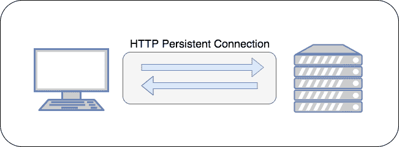

如我们所见，数据可以通过两个参与者，客户端和服务器发送和接收——这就是 WebSocket 的工作方式。

在我们的案例中，我们不需要在连接期间向服务器发送任何数据。因为这个特性，我们将选择 SSE。我们将在下一节中了解它们。

# 服务器发送事件

与 WebSocket 实现的全双工通信相反，SSE 使用半双工通信。

客户端向服务器发送请求，当需要时，服务器将数据推送到客户端。记住这里的主动参与者是服务器；数据只能由服务器发送。这是一个半双工行为。看看下面的图示：

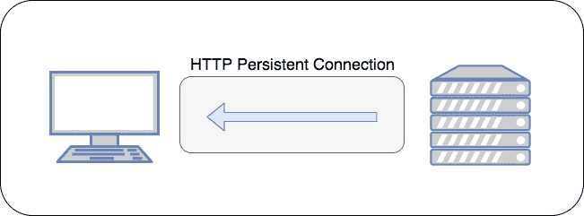

小菜一碟。这是 SSE 技术的基础。SSE 是自解释的。我们将与 Spring 框架一起使用它。然而，在我们这样做之前，让我们看看一个 Reactor RabbitMQ 项目。

# Reactor RabbitMQ

我们的解决方案是完全反应式的，因此我们需要使用 Reactor RabbitMQ，它允许我们使用反应式范式与 RabbitMQ 代理交互。

在这个新的微服务上，我们不需要通过消息代理发送消息。我们的解决方案将监听 RabbitMQ 队列，并将接收到的推文推送给已连接的客户端。

# 理解 Reactor RabbitMQ

Reactor RabbitMQ 尝试提供一个反应式库来与 RabbitMQ 代理交互。它使开发者能够创建基于反应式流的非阻塞应用程序，使用 RabbitMQ 作为消息代理解决方案。

正如我们之前所学的，这种解决方案通常不会占用很多内存。该项目基于 RabbitMQ Java 客户端，并且与阻塞解决方案具有相似的功能。

我们没有使用`spring-amqp-starter`，所以魔法不会发生。我们需要为 Spring 上下文编写 bean 声明，我们将在下一节中完成这项工作。

# 配置 RabbitMQ Reactor beans

在本节中，我们将配置 Spring 上下文中的 RabbitMQ 基础设施类。我们将使用一个`@Configuration`类来声明它。

配置类应该看起来像以下这样：

```java
package springfive.twitterdispatcher.infra.rabbitmq

import com.fasterxml.jackson.databind.ObjectMapper
import com.fasterxml.jackson.module.kotlin.KotlinModule
import com.rabbitmq.client.ConnectionFactory
import org.springframework.beans.factory.annotation.Value
import org.springframework.context.annotation.Bean
import org.springframework.context.annotation.Configuration
import reactor.rabbitmq.ReactorRabbitMq
import reactor.rabbitmq.Receiver
import reactor.rabbitmq.ReceiverOptions

@Configuration
class RabbitMQConfiguration(private @Value("\${spring.rabbitmq.host}")  val host:String,
                            private @Value("\${spring.rabbitmq.port}")  val port:Int,
                            private @Value("\${spring.rabbitmq.username}")  val username:String,
                            private @Value("\${spring.rabbitmq.password}")  val password:String){

  @Bean
  fun mapper(): ObjectMapper = ObjectMapper().registerModule(KotlinModule())

  @Bean
  fun connectionFactory():ConnectionFactory{
    val connectionFactory = ConnectionFactory()
    connectionFactory.username = this.username
    connectionFactory.password = this.password
    connectionFactory.host = this.host
    connectionFactory.port = this.port
    connectionFactory.useNio()
    return connectionFactory
  }

  @Bean
  fun receiver(connectionFactory: ConnectionFactory):Receiver{
      val options = ReceiverOptions()
      options.connectionFactory(connectionFactory)
      return ReactorRabbitMq.createReceiver(options)
  }

}
```

这里有两个重要的事情。第一个是我们为 Kotlin 配置了 Jackson 支持。它允许我们将`ObjectMapper`注入到我们的 Spring beans 中。下一个重要的事情与 RabbitMQ 连接的配置有关。

我们为 Spring 上下文声明了一个`ConnectionFactory` bean。我们使用`@Value`注解注入配置，并在构造函数中接收这些值。在 Kotlin 语言中，我们可以直接在属性中设置值；看看`ConnectionFactory`属性分配。

在配置`ConnectionFactory`之后，我们能够声明一个接收器，这是一个用于消费队列的`Reactive`抽象，使用响应式编程。我们接收之前创建的`ConnectionFactory`并将其设置为`ReceiverOptions`。

这就是 Reactor RabbitMQ 配置的全部内容。

# 响应式地消费 RabbitMQ 队列

现在，我们将消费 RabbitMQ 队列。实现与我们在阻塞实现中看到的方法非常相似，函数的名称也相似。

我们在之前的章节中消费了一些 RabbitMQ 消息，但这个解决方案相当不同。现在，我们将使用响应式 RabbitMQ 实现。主要思想是消费事件流；这些事件代表到达代理的消息。这些消息到达，Reactor RabbitMQ 将这些消息转换为`Flux`，以便我们能够在响应式范式下消费。

在响应式范式下，事件流（我们可以将队列中的消息视为事件）的表示是`Flux`。

然后，我们监听 RabbitMQ 的功能应该返回`Flux`，这是事件的无限表示。接收器实现返回消息的`Flux`，这对我们来说足够了，并且很好地符合我们的需求。

我们的实现应该看起来像以下这样：

```java
package springfive.twitterdispatcher.domain.service

import com.fasterxml.jackson.annotation.JsonIgnoreProperties
import com.fasterxml.jackson.annotation.JsonProperty
import com.fasterxml.jackson.databind.ObjectMapper
import com.fasterxml.jackson.module.kotlin.readValue
import org.springframework.beans.factory.annotation.Value
import org.springframework.stereotype.Service
import reactor.core.publisher.Flux
import reactor.core.publisher.Mono
import reactor.rabbitmq.Receiver

@Service
class TwitterDispatcher(private @Value("\${queue.twitter}") val queue: String,
       private val receiver: Receiver,
       private val mapper: ObjectMapper) {

    fun dispatch(): Flux<Tweet> {
        return this.receiver.consumeAutoAck(this.queue).flatMap { message ->
            Mono.just(mapper.readValue<Tweet>(String(message.body)))
        }
    }

}

@JsonIgnoreProperties(ignoreUnknown = true)
data class Tweet(val id: String = "", 
   val text: String = "", @JsonProperty("created_at") 
   val createdAt: String = "", val user: TwitterUser = TwitterUser("", ""))

@JsonIgnoreProperties(ignoreUnknown = true)
data class TwitterUser(val id: String, val name: String)
```

让我们更深入地了解一下。我们在构造函数中接收了`Receiver`作为注入。当有人调用`dispatch()`函数时，`Receiver`将开始消费队列，这个队列也作为构造函数中的注入。

`Receiver` 生成 `Flux<Delivery>`。现在，我们需要将代表消息抽象的 `Flux<Delivery>` 实例转换为我们的领域模型 Tweet。`flatMap()` 函数可以为我们完成这个任务，但首先，我们将 `message.body` 转换为字符串，然后我们使用了 Jackson 来读取 JSON 并将其转换为我们的 Tweet 领域模型。

看看代码的易读性；API 流畅且易于阅读。

消费者将在连接的客户端断开连接之前不会终止。我们很快就能看到这种行为。

# 过滤流

我们正在从 RabbitMQ 接收消息。现在，我们需要将消息返回给连接的客户。

为此，我们将使用 Spring WebFlux 的 SSE。这个解决方案非常适合我们，因为我们将生成 `Flux<Tweet>` 并开始向客户端推送推文。客户端将发送查询以过滤所需的推文。

应用程序将完全响应式。让我们看看我们的代码：

```java
package springfive.twitterdispatcher.domain.controller

import org.springframework.http.MediaType
import org.springframework.web.bind.annotation.GetMapping
import org.springframework.web.bind.annotation.RequestMapping
import org.springframework.web.bind.annotation.RequestParam
import org.springframework.web.bind.annotation.RestController
import reactor.core.publisher.Flux
import springfive.twitterdispatcher.domain.service.Tweet
import springfive.twitterdispatcher.domain.service.TwitterDispatcher

@RestController
@RequestMapping("/tweets")
class TweetResource(private val dispatcher: TwitterDispatcher) {

  @GetMapping(produces = [MediaType.TEXT_EVENT_STREAM_VALUE])
  fun tweets(@RequestParam("q")query:String):Flux<Tweet>{
    return dispatcher.dispatch()
       .filter({ tweet: Tweet? -> tweet!!.text.contains(query,ignoreCase = true) })
    }
}
```

非常容易理解。我们声明了 `tweets()` 函数；此函数映射到 GET HTTP 请求并生成 `MediaType.TEXT_EVENT_STREAM_VALUE`。当客户端连接到端点时，服务器将根据所需的参数开始发送推文。

当客户端断开连接时，Reactor RabbitMQ 将关闭请求的 RabbitMQ 连接。

# 整个解决方案的 Docker 化

现在，是时候封装整个解决方案并为所有项目创建 Docker 镜像了。在任意位置运行项目非常有用。

我们将逐步配置所有项目，然后在 Docker 容器中运行解决方案。作为一个挑战，我们可以使用 `docker-compose` 在单个 `yaml` 文件中编排整个解决方案。

对于跟踪标签服务，我们已经创建了 Docker 镜像。然后，我们将开始配置 Tweet 收集，最后一个是 Tweet 分发器。让我们立即进行配置。

你可以在以下位置找到更多 `docker-compose` 项目详情：[`docs.docker.com/compose/`](https://docs.docker.com/compose/)。此外，在新版本中，`docker-compose` 支持 Docker Swarm 在集群节点之间编排堆栈。在生产环境中部署 Docker 容器可能非常有用。

# Tweet 收集

让我们为 Tweet 收集项目配置 `pom.xml`。

构建节点应该如下所示：

```java
<plugin>
  <groupId>io.fabric8</groupId>
  <artifactId>docker-maven-plugin</artifactId>
  <version>0.21.0</version>
  <configuration>
    <images>
      <image>
        <name>springfivebyexample/${project.build.finalName}</name>
        <build>
          <from>openjdk:latest</from>
          <entryPoint>java -Dspring.profiles.active=container -jar 
             /application/${project.build.finalName}.jar</entryPoint>
          <assembly>
            <basedir>/application</basedir>
            <descriptorRef>artifact</descriptorRef>
            <inline>
              <id>assembly</id>
              <files>
                <file>
        <source>target/${project.build.finalName}.jar</source>
                </file>
              </files>
            </inline>
          </assembly>
          <tags>
            <tag>latest</tag>
          </tags>
          <ports>
 <port>8081</port>
          </ports>
        </build>
        <run>
          <namingStrategy>alias</namingStrategy>
        </run>
        <alias>${project.build.finalName}</alias>
      </image>
    </images>
  </configuration>
</plugin>
```

看看端口配置；它应该与我们配置的 `application.yaml` 中的相同。配置已完成，因此让我们创建我们的 Docker 镜像：

```java
mvn clean install docker:build
```

命令输出应该如下所示截图：

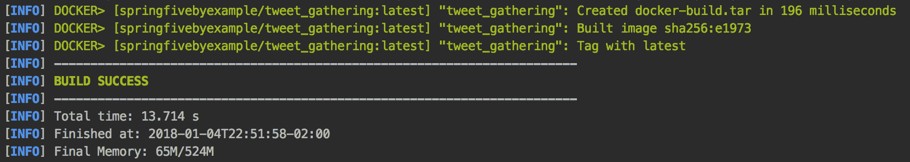

最近创建了一个标记为最新的镜像；镜像已准备好运行。让我们为我们的 Tweet 分发器项目做同样的事情。

# Tweet 分发器

我们的新插件条目应该如下所示：

```java
<plugin>
  <groupId>io.fabric8</groupId>
  <artifactId>docker-maven-plugin</artifactId>
  <version>0.21.0</version>
  <configuration>
    <images>
      <image>
        <name>springfivebyexample/${project.build.finalName}</name>
        <build>
          <from>openjdk:latest</from>
          <entryPoint>java -Dspring.profiles.active=container -jar 
          /application/${project.build.finalName}.jar</entryPoint>
          <assembly>
            <basedir>/application</basedir>
            <descriptorRef>artifact</descriptorRef>
            <inline>
              <id>assembly</id>
              <files>
                <file>
          <source>target/${project.build.finalName}.jar</source>
                </file>
              </files>
            </inline>
          </assembly>
          <tags>
            <tag>latest</tag>
          </tags>
 <ports>
            <port>9099</port> </ports>
        </build>
        <run>
          <namingStrategy>alias</namingStrategy>
        </run>
        <alias>${project.build.finalName}</alias>
      </image>
    </images>
  </configuration>
</plugin>
```

再次看看端口配置。它将被 Docker 用于暴露正确的端口。现在，我们可以运行镜像创建命令：

```java
mvn clean install docker:build
```

然后，我们可以看到命令的输出，如下面的截图所示：

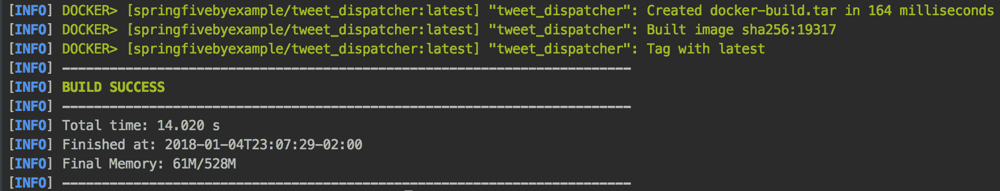

太棒了，所有镜像都已准备就绪。让我们运行它。

我们需要为所有项目创建 Docker 镜像。过程是相同的；配置 maven Docker 插件，然后在项目上使用`mvn clean install docker:build`。完整的源代码可以在 GitHub 上找到。跟踪哈希标签服务可以在[`github.com/PacktPublishing/Spring-5.0-By-Example/tree/master/Chapter04`](https://github.com/PacktPublishing/Spring-5.0-By-Example/tree/master/Chapter04)找到，Tweet Gathering 可以在[`github.com/PacktPublishing/Spring-5.0-By-Example/tree/master/Chapter05`](https://github.com/PacktPublishing/Spring-5.0-By-Example/tree/master/Chapter05)找到，最后，Tweet Dispatcher 可以在[`github.com/PacktPublishing/Spring-5.0-By-Example/tree/master/Chapter06`](https://github.com/PacktPublishing/Spring-5.0-By-Example/tree/master/Chapter06)找到。

# 运行容器化解决方案

我们已经准备好在 Docker 容器中运行解决方案。我们一直使用 IDE 或命令行运行解决方案，但现在我们将启动一些容器并测试解决方案以及 Spring 配置文件。

在此之前，让我们快速回顾一下解决方案：

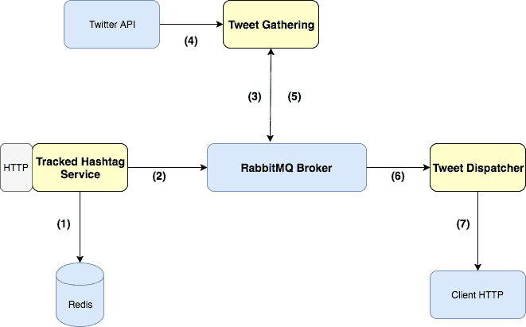

1.  第一次操作，**跟踪哈希标签服务**，将哈希标签持久化到**Redis**数据库中。

1.  之后，**跟踪哈希标签服务**将新跟踪的哈希标签发送到**RabbitMQ**代理的队列中。

1.  **Tweet Gathering** 监听队列以跟踪推文并触发事件，并首先监听**Twitter 流**。

1.  **Tweet Gathering** 开始从**Twitter 流**中获取推文。

1.  **Tweet Gathering** 将推文发布到**RabbitMQ 代理**的队列中。

1.  **Tweet Dispatcher** 消费消息。

1.  **Tweet Dispatcher** 使用 SSE 将消息发送到**客户端**。

现在我们已经理解了解决方案，让我们开始容器化。

# 运行跟踪哈希标签服务容器

上一节已创建镜像，因此现在我们可以启动容器。启动容器的命令应该如下所示：

```java
docker run -d --name tracked --net twitter -p 9090:9090 springfivebyexample/tracked_hashtag
```

让我们解释一下指令。`-d`告诉 Docker 引擎以后台模式或分离模式运行容器。另一个重要参数是`--net`，它将容器连接到所需的网络。

我们可以使用以下命令在运行时跟踪容器日志：

```java
docker logs tracked -f
```

这个命令类似于 Linux 上的`tail -f`命令，它查看日志流的最后部分。我们可以移除标志`-f`以查看日志的最后几行。

docker logs 的输出应该如下所示：

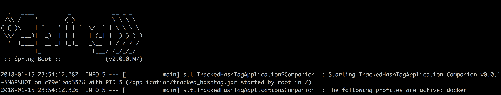

查看日志中选择的配置文件：

```java
INFO 7 --- [           main] s.t.TrackedHashTagApplication$Companion  : The following profiles are active: docker
```

记住，我们在`pom.xml`文件中从跟踪哈希标签服务进行了参数化。让我们看一下以下片段：

```java
<entryPoint>java -Dspring.profiles.active=docker -jar /application/${project.build.finalName}.jar</entryPoint>
```

干得漂亮。我们的第一个服务正在正常运行。让我们运行 Tweet Gathering；这里有一些有趣的配置。

我们在第四章创建了 Twitter 网络，*Kotlin 基础和 Spring Data Redis*，我们需要使用这个网络来使容器能够通过容器名称在我们的自定义网络中相互看到。

# 运行 Tweet Gathering 容器

要运行**Tweet Gathering**应用程序略有不同。这个容器需要环境变量，这些变量用于与 Twitter API 交互。我们可以在`docker run`命令中使用`-e`参数。让我们这么做：

```java
docker run -d --name gathering --net twitter -e CONSUMER_KEY=gupfxwn43NBTdxCD3Tsf1JgMu \
-e CONSUMER_SECRET=pH4uM5LlYxKzfJ7huYRwFbaFXn7ooK01LmqCP69QV9a9kZrHw5 \
-e ACCESS_TOKEN=940015005860290560-m0WwSyxGvp5ufff9KW2zm5LGXLaFLov \
-e ACCESS_TOKEN_SECRET=KSofGB8aIwDmewceKXLbN8d5chvZkZyB31VZa09pNBhLo \
-p 8081:8081 springfivebyexample/tweet_gathering
```

查看我们在`application.yaml`文件中配置的环境变量。Docker 运行命令会将这些变量注入到系统中，然后我们可以在 Java 应用程序中使用它们。

让我们检查我们的容器日志。我们可以使用以下命令：

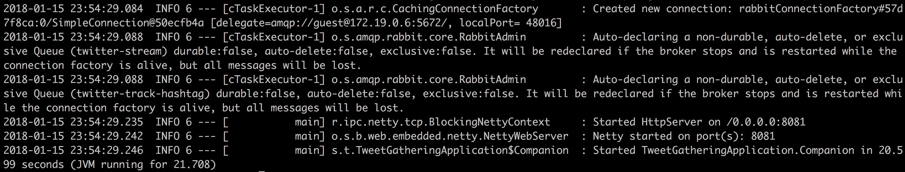

太棒了，我们的应用程序正在运行。如您所见，应用程序已连接到 RabbitMQ 代理。

**RabbitMQ**和**Redis**应该运行，以便您能够运行 Tweet Gathering。我们可以使用`docker ps`命令来检查它；它将列出正在运行的容器，RabbitMQ 和 Redis 需要在这个列表上。

现在，我们可以运行 Dispatcher 应用程序来完成整个解决方案。让我们这么做。

# 运行 Tweet Dispatcher 容器

运行 Tweet Dispatcher 容器没有秘密。我们可以使用以下命令来运行它：

```java
docker run -d --name dispatcher --net twitter -p 9099:9099 springfivebyexample/tweet_dispatcher
```

它将启动容器，在运行过程中命名容器是个好主意。这可以帮助我们使用命令行工具（如`docker container ls`或`docker ps`）管理容器，因为它会在最后一列显示容器名称。然后，让我们检查我们的容器是否正在运行，所以输入以下命令：

```java
docker container ls
```

或者，您也可以运行以下命令：

```java
docker ps
```

我们应该能够看到 Gathering 容器正在运行，如下所示：

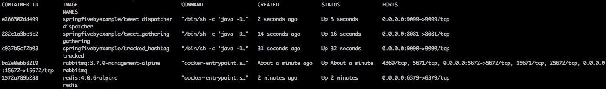

有五个容器，三个应用程序，以及两个基础设施服务，**RabbitMQ**和**Redis**。

在任何时候，我们都可以使用以下命令停止所需的容器：

```java
docker stop gathering
```

`docker stop`只会停止容器；信息将保留在容器卷中。我们也可以使用容器名称或容器 ID，我们之前已经命名了。这对我们来说很容易。如果我们使用`docker ps`命令，最近停止的镜像永远不会出现在列表中。要显示所有容器，我们可以使用`docker ps -a`或`docker container ls -a`。

现在，我们将再次启动容器；命令是自解释的：

```java
docker start gathering
```

容器再次运行。我们已经在 Docker 上练习得更多了。

伙计们，干得漂亮。整个应用程序已经容器化了。做得好。

我们可以使用 Linux 指令并执行一些批处理指令。例如，我们可以使用`docker stop $(docker ps -q)`——它将停止所有正在运行的容器。`docker ps -q`命令只会带来容器的 ID。

# docker-compose 工具

在微服务架构风格中，整个解决方案被解耦成小型且定义良好的服务。通常，当我们采用这些风格时，我们会有多个工件需要部署。

让我们分析我们的解决方案；我们有三个组件需要部署。我们使用了 Docker 容器，并且使用`docker run`命令运行了这些容器。一个接一个地，我们使用了三次`docker run`。这相当复杂，在开发常规中很难做到。

`docker-compose`可以帮助我们在这种场景下。这是一个工具，可以帮助我们在像我们这样的复杂场景中编排 Docker 容器。

让我们假设我们的应用程序正在快速发展，我们需要构建四个更多的微服务来实现预期的业务案例，这将涉及到四个更多的`docker run`命令，并且可能很难维护，尤其是在开发生命周期中。有时，我们需要将工件提升到测试环境，我们可能需要修改我们的命令行来实现这一点。

`docker-compose`使我们能够通过单个`yaml`文件部署多个容器。这个`yaml`文件有一个定义的结构，允许我们在同一个文件中定义和配置多个容器。此外，我们可以通过单个命令运行此`yaml`文件中配置的解决方案，这使得开发生活变得简单。

工具可以在本地机器上工作，或者我们可以将其与 Docker Swarm 工具集成，该工具可以管理 Docker 主机集群。

Docker Swarm 是管理 docker 集群的本地工具。它使得在 Docker 集群上部署容器变得容易。在新版本中，`docker-compose`完全集成了 Docker Swarm。我们可以在`docker-compose.yaml`的 Docker Swarm 属性中定义它。Docker Swarm 文档可以在以下位置找到：[`docs.docker.com/engine/swarm/`](https://docs.docker.com/engine/swarm/)。

`docker-compose`的`yaml`有一个定义的结构要遵循；文档可以在以下位置找到：[`docs.docker.com/compose/compose-file/#compose-and-docker-compatibility-matrix.`](https://docs.docker.com/compose/compose-file/#compose-and-docker-compatibility-matrix)我们将创建一个简单的文件来理解`docker-compose`的行为。让我们创建我们的简单`yaml`——这个`yaml`应该看起来像这样：

```java
version: '3'
services:
  rabbitmq:
    image: rabbitmq:3.7.0-management-alpine
    ports:
      - "5672:5672"
      - "15672:15672"
  redis:
    image: "redis:alpine"
    ports:
      - "6379:6379"
```

前面代码中的`yaml`将创建以下图中详细的结构：

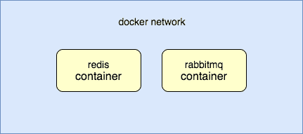

它简化了开发时间。现在，我们将学习如何安装`docker-compose`。

# 安装 docker-compose

`docker-compose`的安装相当简单且文档齐全。我们使用 Linux，所以我们将使用 Linux 说明。

打开终端并使用以下命令：

```java
sudo curl -L https://github.com/docker/compose/releases/download/1.18.0/docker-compose-`uname -s`-`uname -m` -o /usr/local/bin/docker-compose
```

等待下载完成后，我们就可以执行以下指令为程序赋予可执行权限。让我们通过执行以下命令来完成：

```java
sudo chmod +x /usr/local/bin/docker-compose
```

如您所知，您可能需要输入管理员密码。我们的 `docker-compose` 现在已经安装。让我们检查一下：

```java
docker-compose --version
```

提示将显示安装的版本，如下所示：


`docker-compose` 已经启动并运行，所以让我们跳到下一部分，开始创建我们的 `yaml` 文件，并使用一条命令部署整个栈。

对于不同的操作系统，指令可以在以下位置找到：[`docs.docker.com/compose/install/#install-compose`](https://docs.docker.com/compose/install/#install-compose)。然后，您可以浏览指令并点击所需的操作系统。

# 创建 docker-compose 文件

现在，我们已经安装了 `docker-compose`，我们可以尝试使用这个工具。我们希望用一条命令运行整个栈。我们将创建 `yaml` 文件来表示栈。我们的 `yaml` 文件应该包含 Redis 容器、RabbitMQ 容器、Tracked Hashtag 应用程序、Gathering 应用程序，最后是 Dispatcher 应用程序。

我们可以在任何想要的地方创建 `docker-compose.yaml` 文件，对此没有限制。

我们的 `docker-compose.yaml` 文件应该看起来像以下这样：

```java
version: '3'
services:
  rabbitmq:
    image: rabbitmq:3.7.0-management-alpine
    hostname: rabbitmq
    ports:
      - "5672:5672"
      - "15672:15672"
    networks:
      - solution 
  redis:
    image: "redis:4.0.6-alpine"
    hostname: redis
    ports:
      - "6379:6379"
    networks:
      - solution 
  tracked:
    image: springfivebyexample/tracked_hashtag
    ports:
      - "9090:9090"
    networks:
      - solution 
  gathering:
    image: springfivebyexample/tweet_gathering
    ports:
      - "8081:8081"
    networks:
      - solution
    environment:
      - CONSUMER_KEY=gupfxwn43NBTdxCD3Tsf1JgMu
      - CONSUMER_SECRET=pH4uM5LlYxKzfJ7huYRwFbaFXn7ooK01LmqCP69QV9a9kZrHw5
      - ACCESS_TOKEN=940015005860290560-m0WwSyxGvp5ufff9KW2zm5LGXLaFLov
      - ACCESS_TOKEN_SECRET=KSofGB8aIwDmewceKXLbN8d5chvZkZyB31VZa09pNBhLo
  dispatcher:
    image: springfivebyexample/tweet_dispatcher
    ports:
      - "9099:9099"
    networks:
      - solution
networks:
  solution:
    driver: bridge
```

如您所见，我们在 `yaml` 中定义了整个栈。需要注意的是，我们可以发现与 `docker run` 命令的一些相似之处，实际上，它将使用 Docker 引擎来运行。yaml 中的 `environment` 节点与 Docker run 命令中的 `-e` 参数具有相同的行为。

我们已经定义了应用程序端口、Docker 镜像，并且已经将容器连接到相同的网络。这非常重要，因为当我们使用网络上的 `docker-compose` 文件名时，它可以找到具有某种 DNS 行为的容器名称。

例如，在定义的网络 `solution` 中，容器可以通过名称 `redis` 找到 Redis 容器实例。

# 运行解决方案

`docker-compose` 简化了运行整个栈的过程。我们的 `yaml` 文件已正确配置和定义。

让我们开始解决方案。运行以下命令：

```java
docker-compose up -d
```

命令相当简单，`-d` 参数指示 Docker 在后台运行命令。正如我们在 Docker run 命令中所做的那样。

此命令的输出应该如下所示：

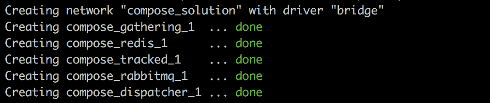

看一下，`docker-compose` 为我们的栈创建了一个网络。在我们的例子中，网络驱动器是桥接，网络创建后，容器启动。

# 测试网络

让我们测试一下，找到 Gathering 容器——`docker-compose` 中的容器名称以启动 `docker-compose` 的文件夹名称为前缀。

例如，我在 compose 文件夹中启动了我的`docker-compose`堆栈。由于文件夹名称，我的容器名称将是`compose_gathering_1`。

然后，我们将连接 Gathering 容器。可以使用以下命令实现：

```java
docker exec -it compose_gathering_1  /bin/bash
```

`docker exec`命令允许我们在容器内执行某些操作。在我们的情况下，我们将执行`/bin/bash`程序。

命令结构如下：

```java
docker exec -it <container name or container id> <program or instruction>
```

太棒了，请注意命令行。它应该更改，因为我们现在处于容器命令行：

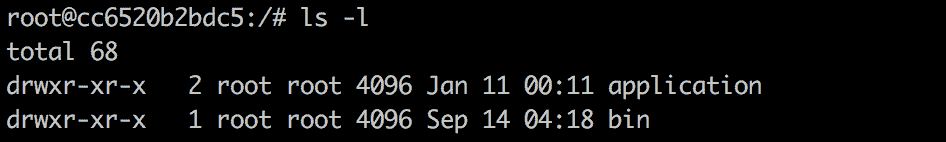

我们没有以 root 身份连接到我们的主机，但现在我们是在容器中的 root。这个容器与 Redis 容器实例位于同一网络中，称为`redis`。

让我们用`ping`命令测试一下；我们应该能够通过名称`redis`找到`redis`容器，让我们试试。输入以下内容：

```java
ping redis
```

命令输出应该是以下内容：

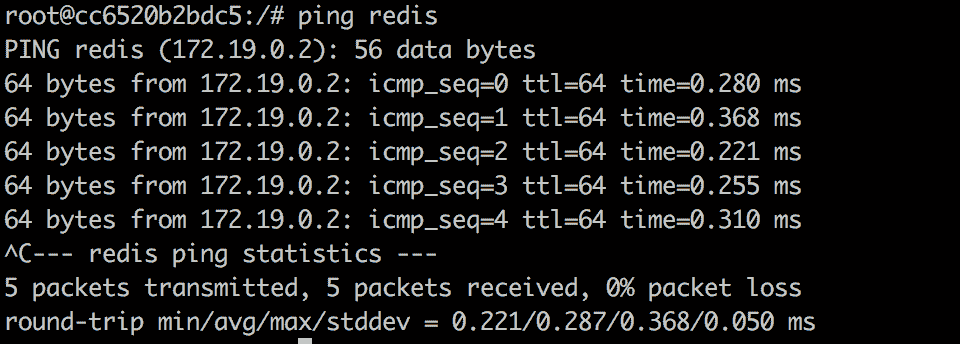

太棒了，我们的容器可以通过名称找到 Redis 容器。`yaml`文件完全正常工作。

# 摘要

在本章中，我们完成了第二个解决方案。我们介绍了 RabbitMQ Reactor 库，它使我们能够使用响应式范式连接到 RabbitMQ。

我们已经将整个解决方案打包在 Docker 容器中，并将其连接到相同的网络，以便应用程序之间能够相互通信。

我们还学习了从服务器通过 HTTP 持久连接向客户端推送数据的重要模式，并且我们还学习了 WebSockets 和服务器发送事件之间的区别。

最后，我们学习了`docker-compose`如何帮助我们通过几个命令创建堆栈并运行整个解决方案。

在接下来的章节中，我们将构建一个完全的微服务解决方案，使用一些重要的模式，如服务发现、API 网关、断路器等。
