# 第七章：航空票务系统

我们最后的几个项目——Twitter 消费者、Twitter 收集器和 Twitter 分发器——非常出色。我们学习了几个令人兴奋的功能，它们都是使用 Spring 5.0 中的新功能实现的。所有这些都是在响应式流中使用 Kotlin 作为编程语言实现的；它们是 Spring 5.0 中最热门的功能；这是一个令人印象深刻的进步。

然而，在这些项目中明显缺少一些部分；我们考虑到了微服务需求。没有像服务发现、分布式配置、API 网关、分布式跟踪和监控这样的基础设施服务。这些服务在微服务架构等分布式系统中是必需的。

有几个原因。首先，我们可以考虑配置管理。让我们想象以下场景——在开发周期中，我们有三个环境：开发（DEV）、测试（TST）和生产（PROD）。这是公司在标准中找到的相当简单的标准。此外，我们将应用程序解耦为 4 个微服务，然后使用最少的基础设施，我们有 12 个服务实例；记住，这是一个好场景，因为在实际情况中，我们可能会有几个微服务应用程序的实例。

在早期场景中，我们将为每个微服务维护至少三个配置文件，记住我们需要为三个环境保留配置。然后，我们将有 12 个*版本*的设置。维护配置是一项艰巨的任务，要保持文件同步和更新。这些文件可能包含敏感信息，如数据库密码和消息代理的配置，而且不建议将这些文件放在主机机器上。

在这种情况下，分布式配置可以轻松解决我们的问题。在本章中，我们将学习配置服务器以及其他基础设施服务。

让我们总结一下本章我们将学习的内容：

+   如何创建配置服务器

+   使用 Eureka 实现服务发现

+   使用 Spring Cloud Zipkin 监控应用程序

+   使用 Spring Cloud Gateway 暴露应用程序

# 航空票务系统

在这些最后几章中，我们将致力于航空票务系统。解决方案相当复杂，涉及大量的 HTTP 集成和基于消息的解决方案。我们将探索从本书旅程中学到的内容。

我们将使用 Spring Messaging、Spring WebFlux 和 Spring Data 组件来创建解决方案。应用程序将拆分为几个微服务，以确保系统的可伸缩性、弹性和容错性。

此外，我们还将有一些基础设施服务来帮助我们交付一个高效的系统。将引入一些新的模式，例如断路器和 OAuth。在基础设施层，我们将使用与 Spring 框架生态系统集成的 Netflix OSS 组件。

我们应用程序的主要目的是销售机票，但为了完成这个任务，我们需要构建一个完整的生态系统。我们将构建一个微服务来管理座位和飞机的特性。还将有一个微服务来管理可用的公司航班；基本想法是管理航班日期和路线。当然，我们还将有一个微服务来管理乘客、票价、预订和支付。最后，我们将有一个`电子商务`API，用户可以通过它购买机票。

# 航空公司功能

我们将创建一些微服务来构建解决方案，然后我们将解决方案分解成小块，即微服务。为此，我们将使用边界上下文模式，这是**领域驱动设计**（**DDD**）的一个基本组成部分。

让我们看一下下面的图表，以便了解我们将要构建的内容：

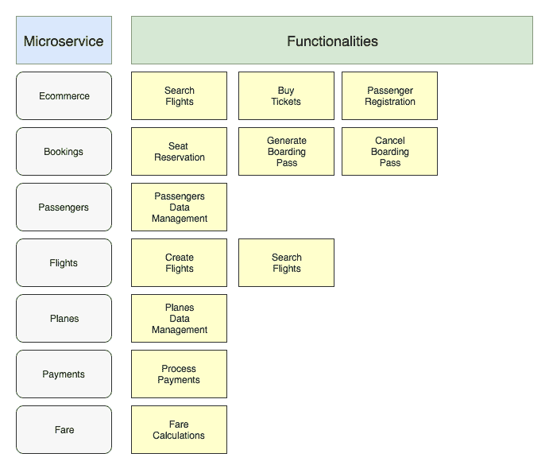

这是本章将要做什么的总结；我们已经为每个微服务定义了基本功能。

现在，我们将查看组件；让我们进入下一节。

# 解决方案图表

下面的图表展示了整个解决方案，我们将在接下来的章节中实现它：

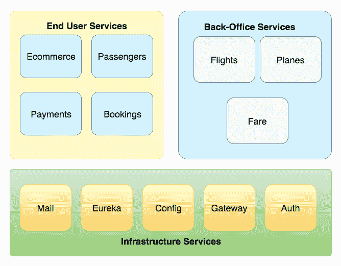

如我们所见，有不同的组件。一些组件将通过**网关**向最终用户（在我们的案例中，是我们的客户）公开。还有一个类别，公司用户将使用它来注册航班，例如，这些微服务也将通过**网关**公开。

基础设施类别不会通过互联网公开，除了**网关**服务。这些服务帮助解决方案的基础设施，不应该公开，因为其中包含敏感数据。

有很多事情要做；让我们开始吧。

DDD 使我们能够轻松地处理微服务。一些 DDD 模式非常适合微服务架构风格。Packt 目录中有很多有趣的书籍。

# Spring Cloud Config Server

当我们采用微服务架构风格时，有一些挑战需要解决。首先要解决的问题之一是如何在集群中管理微服务配置，以及如何使它们易于分布式？

Spring Cloud Config 提供了一个基于注解和 Spring bean 的 Spring 方式。这是一个在可生产模块中轻松解决这个问题的好方法。此模块有三个主要组件，即配置存储库，也就是版本控制系统，配置服务器，它将提供配置，最后是配置客户端，它将从配置服务器消费配置。

此模块通过 HTTP 接口提供配置文件。这是本项目提供的主要功能，它作为我们架构中配置的中心存储库。

我们希望从我们的类路径中移除`application.yaml`文件；我们不再需要在类路径中此文件，因此我们将使用配置服务器为我们应用程序提供此文件。

现在，我们的微服务将没有配置文件，即`application.yaml`。在应用程序引导过程中，应用程序将查看配置服务器以获取正确的配置，然后应用程序将完成引导以将它们启动并运行。

以下图表解释了**配置服务器**和配置客户端：

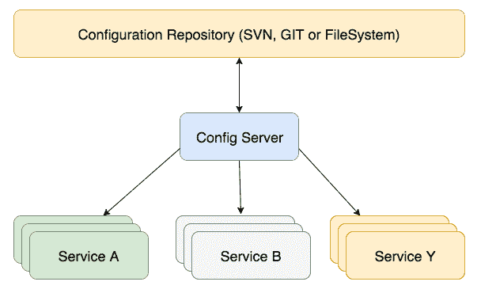

如我们所见，这里的基思想是尝试通过**配置服务器**分发配置。使用这种方法有一些优点。第一个优点是将配置保存在中央仓库中。这使得配置易于维护。第二个优点是配置通过标准协议（如 HTTP）提供服务。大多数开发者都知道这个协议，这使得交互易于理解。最后，也是最重要的，当属性更改时，它可以在其他微服务中立即反映。

是时候实现它了。让我们开始吧。

配置服务器通常在私有网络上维护，如果我们是在云环境中部署，尽管 Spring Cloud 配置支持基于对称密钥或非对称密钥的加密和解密。记住，微服务配置不应该发布在公共网络上。

# 创建配置服务器项目

让我们使用 Spring Initializr 创建我们的项目。转到 Spring Initializr ([`start.spring.io/`](https://start.spring.io/)) 并遵循图片说明：

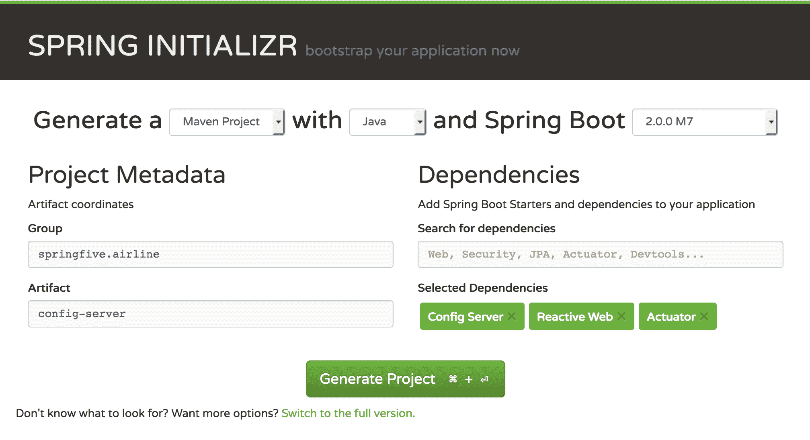

点击生成项目，然后我们可以在 IDE 中打开项目。

# 启用 Spring Cloud 配置服务器

我们将使用 Git 仓库作为属性源，然后我们需要创建一个仓库来保存这些文件。然而，在此之前，让我们导航到`pom.xml`文件，看看一些有趣的内容。我们可以找到以下依赖项：

```java
<dependency>
  <groupId>org.springframework.cloud</groupId>
  <artifactId>spring-cloud-config-server</artifactId>
</dependency>
```

它是一个配置服务器的依赖项。它使我们能够在我们的应用程序中使用配置服务器。记住，我们需要将此放入`pom.xml`文件中才能达到所需的配置服务器。

# 使用 GitHub 作为仓库

Spring Cloud 配置服务器使我们能够使用不同的数据存储技术作为属性存储库。社区提供了一些选项，例如 Git 仓库、文件系统或 SVN 等。

我们将选择 Git 仓库，并使用 GitHub 作为托管平台。

我们将使用包含书籍源代码的 Git 仓库。仓库位于：[`GitHub.com/PacktPublishing/Spring-5.0-By-Example/tree/master/config-files`](https://Github.com/PacktPublishing/Spring-5.0-By-Example/tree/master/config-files)。

Spring Cloud Config Server 也支持私有仓库。为此，我们需要提供私有/公开密钥。

# 配置 Spring Boot 应用程序

启用和运行配置服务器以及提供我们的配置 HTTP 协议是一件轻而易举的事情。为了实现它，我们需要在我们的 Spring Boot 启动类中放置以下注解。实现如下：

```java
package springfive.airline.configserver;

import org.springframework.boot.SpringApplication;
import org.springframework.boot.autoconfigure.SpringBootApplication;
import org.springframework.cloud.config.server.EnableConfigServer;

@EnableConfigServer
@SpringBootApplication
public class ConfigServerApplication {

  public static void main(String[] args) {
    SpringApplication.run(ConfigServerApplication.class, args);
  }

}
```

太棒了。`@EnableConfigServer`为我们做了魔法。它会启动配置服务器并使应用程序准备好连接。

# 将 Git 仓库配置为属性源

我们的配置服务器需要被配置。为此，我们将使用`application.yaml`文件。这个文件应该简单，并且配置最少。配置文件应该看起来像这样：

```java
server:
  port: 5000

spring:
  cloud:
    config:
      name: configserver
      server:
        git:
          uri: https://github.com/PacktPublishing/Spring-5.0-By-Example search-paths: config-files*
```

我们已经配置了应用程序端口，这是一个常见任务。我们命名了我们的配置服务器，最重要的是`server.git.uri`配置属性，它指示 Spring 框架获取配置文件。

另一个配置是`search-paths`；它允许我们在`git`仓库文件夹中搜索配置，而不是在仓库的根地址中。

# 运行配置服务器

干得好；我们的配置服务器已经准备好使用。然后让我们运行它。我们可以使用 JAR 文件，或者通过 IDE 也可以，这取决于你选择哪种方式。

我们可以使用 Java 命令行或 IDE 来运行它。我更喜欢使用 IDE，因为它使我们能够调试并进行一些代码更改。

运行它。

输出应该看起来像这样：

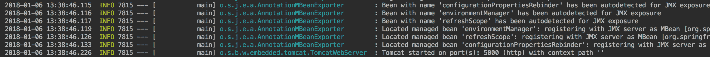

Tomcat 启动成功；我们的配置服务器已启动并运行。我们可以在配置服务器中找到一些不同的端点。这些端点被暴露出来以提供配置文件。

Spring Cloud Config Server 也支持配置文件，为不同的环境提供不同的配置是很重要的。

配置服务器支持的模式如下：

```java
<application-name>-<profile>.<properties|yaml>
```

这点非常重要，同时，这也使得在微服务中声明`application.name`属性成为强制性的，以识别应用程序。

我们可以在应用程序引导中找到 Spring Cloud Config Server 提供的端点。看看日志：

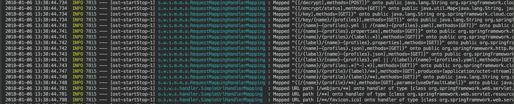

记住配置服务器支持环境；正因为如此，端点上有一种正则表达式。看看`"/{name}-{profiles}.yml"`端点。

# 测试我们的配置服务器

我们能够通过 REST API 测试我们的配置服务器。

让我们创建一个简单的`yaml`文件来创建测试；文件应该命名为`dummy.yaml`：

```java
info:
  message: "Testing my Config Server"
  status: "It worked"
```

推送到 GitHub – 如果你使用的是 GitHub 书籍，这一步是不必要的。然后，我们可以使用以下命令调用配置服务器 API：

```java
curl http://localhost:5000/dummy/default | jq
```

命令会在`default`配置文件中寻找名为`dummy`的配置；URL 是自解释的。以下输出应该被显示：


我们的配置服务器已完全运行。现在，我们将使用 Netflix Eureka 配置我们的服务发现。

# Spring Cloud 服务发现

服务发现是微服务架构的关键点之一。微服务架构的基础是将单体应用程序解耦成更小的软件块，这些块具有明确的边界。

这影响了我们的单体应用程序的系统设计。一般来说，应用程序逻辑在代码方面保持在一个地方。这意味着当应用程序运行时，过程或方法调用是在相同的上下文中调用的。

当我们采用微服务架构风格时，这些调用通常是外部的，换句话说，它们将通过 HTTP 调用调用服务，例如，在另一个应用程序上下文或 Web 服务器中。

然后，服务需要通过 HTTP 调用其他服务，例如，但如果这些服务的实例以相当高的频率变化，服务又是如何调用其他服务的呢？记住，我们正在创建分布式和可扩展的系统，其中服务的实例可以根据系统使用情况进行增加。

服务需要知道其他服务在哪里运行，才能调用它们。让我们想象一下，如果我们考虑将服务的 IP 地址放入配置中；这将很难管理，并且在那段时间内无法跟踪机器的变化。

服务发现模式解决了这个挑战。一般来说，解决方案涉及服务注册表，它知道所有运行服务的位置。然后，客户端需要有一种服务注册表客户端，以便能够查询这个服务注册表以获取所需服务的有效地址；然后服务注册表将返回一个健康的地址，最后，客户端可以调用所需的服务。

让我们看看以下图表：

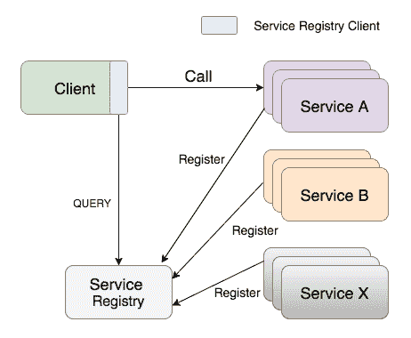

该模式的完整文档可以在[`microservices.io/patterns/client-side-discovery.html`](http://microservices.io/patterns/client-side-discovery.html)和[`www.nginx.com/blog/service-discovery-in-a-microservices-architecture/`](https://www.nginx.com/blog/service-discovery-in-a-microservices-architecture/)找到。针对该模式有如此多的实现。

Spring Cloud 服务发现支持一些服务发现实现，例如由 Spring Cloud Consul 提供的 Hashicorp Consul 和由 Spring Cloud Zookeeper 提供的 Apache Zookeeper。

我们正在使用 Netflix OSS 堆栈，我们将使用由 Spring Netflix OSS 提供的 Eureka 服务器。它使我们能够将 Eureka 服务器用作管理的 Spring Bean。

Spring Eureka 客户端提供了一个了解服务注册表的客户端，这可以通过几个注解和一些配置来实现——我们很快就会这么做。

在接下来的章节中，我们将开始创建和配置 Eureka 服务器。让我们这么做。

Spring Cloud Consul 的完整文档可以在[`cloud.spring.io/spring-cloud-consul`](https://cloud.spring.io/spring-cloud-consul)找到，Spring Cloud Zookeeper 的文档可以在[`cloud.spring.io/spring-cloud-zookeeper`](https://cloud.spring.io/spring-cloud-zookeeper)找到。

# 创建 Spring Cloud Eureka

为了在我们的基础设施中启用服务发现，我们需要创建一个实例，该实例将作为服务发现。Spring Cloud Eureka 服务器使我们能够完成这项任务。让我们创建我们的项目。前往 Spring Initializr 并填写信息，如下面的截图所示：

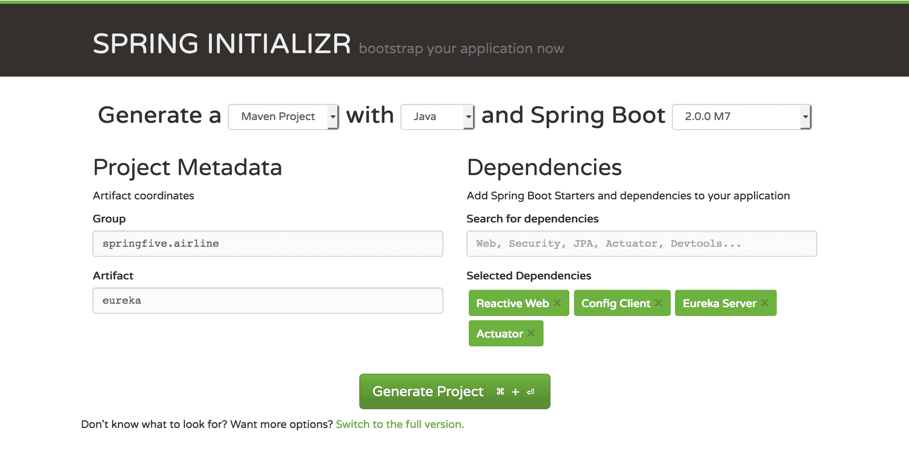

看一下所需的依赖项。Eureka 服务器是允许我们启动服务发现服务器的依赖项。

让我们在 IDE 中打开项目并开始配置它。我们将在下一节中这么做。

# 创建 Eureka 服务器主类

在我们开始配置之前，我们将创建`main`类。这个类将启动 Spring Boot 应用程序。Eureka 服务器嵌入在应用程序中。这是一个相当标准的带有单个注解的 Spring Boot 应用程序。

`main`应用程序类应该看起来像这样：

```java
package springfive.airline.eureka;

import org.springframework.boot.SpringApplication;
import org.springframework.boot.autoconfigure.SpringBootApplication;
import org.springframework.cloud.netflix.eureka.server.EnableEurekaServer;

@EnableEurekaServer
@SpringBootApplication
public class EurekaApplication {

  public static void main(String[] args) {
    SpringApplication.run(EurekaApplication.class, args);
  }

}
```

`@EnableEurekaServer`注解将在我们的应用程序中启动内嵌的 Eureka 服务器，并使其准备好使用。它还将启用我们应用程序中的服务注册。

# 配置 Spring Cloud Eureka 服务器

我们的 Eureka 服务器需要使用之前章节中配置的 Spring Cloud Server 进行配置。然后，我们需要在我们的项目中保留`application.yaml`，以正确使用配置服务器。而不是`application.yaml`，我们需要放置`bootstrap.yaml`并将配置服务器地址放在它上面。

然后，我们需要：

+   在 GitHub 上创建`discovery.yaml`

+   在 classpath 项目中创建`bootstrap.yaml`文件

让我们从`discovery.yaml`文件开始。文件应该看起来像这样：

```java
server:
  port: 8761

eureka:
  instance:
    hostname: localhost
    health-check-url-path: /actuator/health
    status-page-url-path: /actuator/info 
  client:
    registerWithEureka: false
    fetchRegistry: false
logging:
  level:
    com.netflix.discovery: 'ON'
    org.springframework.cloud: 'DEBUG'
```

有一些有趣的事情可以探索。我们使用 localhost 作为`hostname`，因为我们是在开发机器上运行。有一些关于 URL 健康检查和状态页面的配置——请注意与服务器相关的配置。它们位于`eureka.instance` YAML 节点下方。配置是`health-check-url-path`和`status-page-url-path`。我们也可以使用默认值，但新的 Spring Boot Actuator 改变了这两个功能的 URL，因此我们需要正确配置它们。

`eureka.client` YAML 节点是关于客户端配置的；在我们的情况下，我们将`registerWithEureka`设置为 false。我们不希望 Eureka 服务器同时作为客户端。对于`fetchRegistry`配置也是如此，它是一个客户端配置，它将缓存 Eureka 注册表的信息。

`logging` 节点涉及日志配置。

太棒了——我们的 `gateway.yaml` 已经准备好了。

让我们在 Eureka 服务器项目的类路径中创建我们的 `bootstrap.yaml` 文件。文件应该看起来像这样：

```java
spring:
  application:
    name: discovery
  cloud:
    config:
      uri: http://localhost:5000
      label: master
```

简单易行——我们已经配置了 `spring.cloud.config`。它指导 Spring 配置服务器的地址。此外，我们还配置了 `label`，这是我们使用 **版本控制系统**（**VCS**）作为仓库时的分支。

做得很好。配置已经准备好了。现在是时候运行它了。让我们在下一节中这样做。

# 运行 Spring Cloud Eureka 服务器

Eureka 服务器已经准备好使用。我们将启动 Spring Boot 应用程序并将我们的 Eureka 服务器上线。我们可以使用 Java 命令行或 IDE 来运行它。我更喜欢使用 IDE，因为它使我们能够调试并进行一些代码更改。

配置服务器需要运行，因为发现将找到配置文件以正确引导服务器。

运行它！

我们应该在应用程序启动日志中看到以下行：

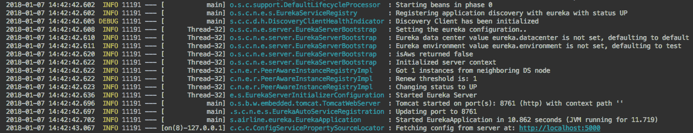

太棒了。看看日志的下一行：

```java
2018-01-07 14:42:42.636  INFO 11191 --- [      Thread-32] e.s.EurekaServerInitializerConfiguration : Started Eureka Server
```

这意味着我们的 Eureka 服务器已经准备好使用。为了检查解决方案，我们可以访问 Eureka 服务器的首页。访问 `http://localhost:8761/`，以下页面将会显示：

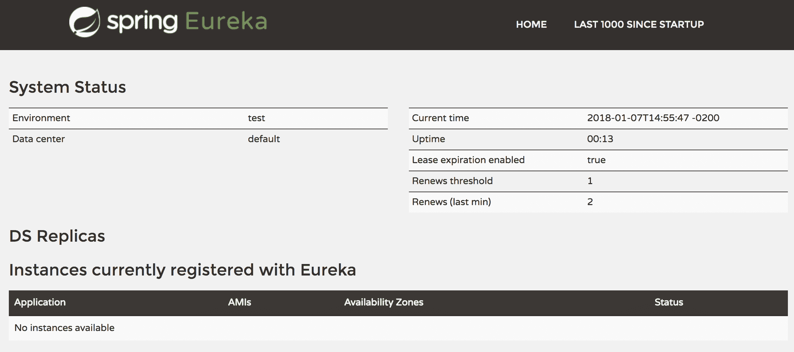

如我们所见，还没有任何服务实例可用。我们可以找到一些相关信息，例如服务器 Uptime、当前数据中心和当前时间。在“常规信息”部分有一些信息，关于运行 Eureka 服务器的服务器。

干得好。我们的服务发现服务正在运行。我们很快将使用这个基础设施。

# Spring Cloud Zipkin 服务器和 Sleuth

我们解决方案涉及一些微服务；这使得我们的解决方案易于部署和编写代码。每个解决方案都有一个特定的仓库和代码库。

在单体解决方案中，整个问题都在要部署的同一工件中解决。通常，在 Java 中，这些工件是 `.jar`、`.war` 或 `.ear`，如果应用程序是根据 Java EE 5/6 规范编写的。

这些类型应用程序的日志策略相当容易处理（因此问题可以轻松解决），因为所有事情都发生在同一个上下文中；请求来自同一个应用程序服务器或网络服务器，它们具有业务组件。现在，如果我们查看日志，我们可能会找到我们想要的日志条目。这使得跟踪应用程序更容易找到错误和调试。

在微服务解决方案中，应用程序行为在分布式系统中被分割；这大大增加了跟踪任务，因为请求可能到达 API 网关并进入微服务。它们在不同的源中记录信息。在这种情况下，我们需要一种日志聚合器和一种识别服务之间整个事务的方法。

为了这个目的，Spring Cloud Sleuth 和 Spring Cloud Zipkin 可以帮助我们，使跟踪功能对开发者来说更加舒适。

在本节中，我们将查看和理解它的工作原理。

# Zipkin 服务器的基础设施

在我们开始工作之前，我们需要配置一个 Zipkin 服务器需要的服务。默认情况下，Zipkin 服务器使用内存数据库，但生产环境中不建议使用；通常，开发者使用此功能来演示 Zipkin 功能。

我们将使用 MySQL 作为数据存储。Zipkin 服务器也支持不同的来源，例如 Cassandra 和 Elasticsearch。

Spring Cloud Sleuth 支持同步和异步操作。同步操作是通过 HTTP 协议进行的，异步可以通过 RabbitMQ 或 Apache Kafka 完成。

要使用 HTTP，即 REST API，我们应该使用 `@EnableZipkinServer`，它将通过 `SpanStore` 接口代理 REST 层的持久化。

我们将选择异步解决方案，因为它非常适合我们的项目，我们也不想跟踪收集器引起一些性能问题。异步解决方案使用 Spring Cloud Stream binder 来存储 `Spans`。我们选择 RabbitMQ 消息代理来完成这项工作。这可以通过使用 `@EnableZipkinStreamServer` 注解来实现，这些注解配置 Spring Sleuth 使用流来存储 `Spans`。

让我们创建我们的 `docker-compose-min.yaml` 文件来启动 RabbitMQ 和 MySQL 容器。该文件应如下所示：

```java
version: '3'
services:

  rabbitmq:
    hostname: rabbitmq
    image: rabbitmq:3.7.0-management-alpine
    ports:
      - "5672:5672"
      - "15672:15672"
    networks:
      - airline

  mysql:
    hostname: mysql
    image: mysql:5.7.21
    ports:
      - "3306:3306"
    environment:
      - MYSQL_ROOT_PASSWORD=root
      - MYSQL_DATABASE=zipkin
    networks:
      - airline

  mongo:
    hostname: mongo
    image: mongo
    ports:
      - "27017:27017"
    networks:
      - airline  

  redis:
    hostname: redis
    image: redis:3.2-alpine
    ports:
      - "6379:6379"
    networks:
      - airline

networks:
  airline:
    driver: bridge
```

`docker-compose-min.yaml` 文件可以在 [GitHub](https://github.com/PacktPublishing/Spring-5.0-By-Example/blob/master/Chapter07/docker/docker-compose-min.yaml) 找到，其中包含 MongoDB 和 Redis - 它们将在下一章中使用。

这里没有什么特别的。我们已经声明了两个容器 - RabbitMQ 和 MySQL - 并且在主机机器上公开了端口。此外，我们还创建了 `airline` 网络；我们将使用这个网络来附加我们的基础设施微服务。

现在，我们可以创建我们的 Zipkin 服务器，我们将在下一节中完成。

# 创建 Spring Cloud Zipkin 服务器

我们将在 Spring Initializr 中创建我们的 Zipkin 控制面板结构，然后我们需要遵循以下说明：

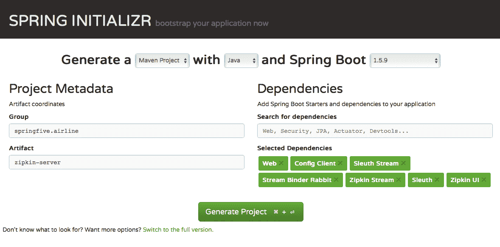

太棒了 - 查看所选依赖项部分，所有这些依赖项都是必需的。请注意 Spring Boot 版本。我们选择 `1.5.9`，因为在 Spring Boot 2 中没有对 Zipkin 服务器提供支持。这不是问题，因为我们不需要 Spring Boot 2 的特定功能。

点击“生成项目”按钮，等待下载完成。之后，在 IDE 中打开项目。

为了启用服务发现并在数据库中存储 `Spans`，我们需要在我们的 `pom.xml` 中添加以下依赖项：

```java
<dependency>
 <groupId>org.springframework.cloud</groupId>
 <artifactId>spring-cloud-starter-netflix-eureka-client</artifactId>
</dependency>

<dependency>
 <groupId>org.springframework.boot</groupId>
 <artifactId>spring-boot-starter-jdbc</artifactId>
</dependency>

<dependency>
 <groupId>mysql</groupId>
 <artifactId>mysql-connector-java</artifactId>
 <version>6.0.6</version>
</dependency>
```

第一个依赖项是为服务发现客户端，其余的是到 MySQL 的 JDBC 连接。这使得我们的项目依赖项完全配置。

让我们创建我们的 `main` 类来启动 Zipkin 服务器。这个类相当标准，但有一些新的注解：

```java
package springfive.airline;

import org.springframework.boot.SpringApplication;
import org.springframework.boot.autoconfigure.SpringBootApplication;
import org.springframework.cloud.netflix.eureka.EnableEurekaClient;
import org.springframework.cloud.sleuth.zipkin.stream.EnableZipkinStreamServer;

@SpringBootApplication
@EnableZipkinStreamServer
@EnableEurekaClient
public class ZipkinServerApplication {

 public static void main(String[] args) {
  SpringApplication.run(ZipkinServerApplication.class, args);
 }

}
```

`@EnableEurekaClient` 注解使应用程序能够连接到 Eureka 服务器。新的注解 `@EnableZipkinStreamServer` 指示框架连接到配置的代理以接收 `Spans`。记住，这可以通过 Spring Cloud Stream Binder 完成。

# 配置 boostrap.yaml 和 application.yaml

在该部分，我们创建了我们的 `main` 类。在我们运行它之前，我们应该创建我们的两个配置文件。位于 `src/main/resources` 目录中的 `bootstrap.yaml` 和位于我们的 GitHub 仓库上的 `application.yaml`。它们将通过 Config Server 下载并由 Zipkin 服务器项目提供。

让我们从 `bootstrap.yaml` 开始：

```java
spring:
  application:
    name: zipkin
  cloud:
    config:
      uri: http://localhost:5000
      label: master
```

没有什么特别的，我们已配置了我们的 Config Server 地址。

让我们跳转到我们的 `application.yaml`：

```java
server:
  port: 9999

spring:
  rabbitmq:
    port: 5672
    host: localhost
  datasource:
    schema: classpath:/mysql.sql
    url: jdbc:mysql://${MYSQL_HOST:localhost}/zipkin?autoReconnect=true
    driver-class-name: com.mysql.cj.jdbc.Driver
    username: root
    password: root
    initialize: true
    continue-on-error: true
  sleuth:
    enabled: false

zipkin:
  storage:
    type: mysql

logging:
  level:
    ROOT: INFO

eureka:
  client:
    serviceUrl:
      defaultZone: http://localhost:8761/eureka/
```

这里有一些有趣的事情。在 `spring.rabbitmq` 节点中，我们已配置了我们的 RabbitMQ 代理连接。它将被用来接收 `Spans`。在 `spring.datasource` 中，我们已配置了 MySQL 连接。Zipkin 服务器将使用它来存储数据。此外，我们还配置了如何执行 DDL 脚本来创建 `zipkin` 数据库。

`spring.sleuth` 节点被配置为不产生任何 `Span`，因为它是一个服务器，而不是客户端应用程序，并且我们不会在 Zipkin 服务器上执行跟踪。

`zipkin` 节点曾用来配置 Zipkin 服务器存储类型，在我们的例子中是 MySQL。

让我们运行它！！！

# 运行 Zipkin 服务器

我们已正确配置了 Zipkin 服务器，因此现在我们可以正常运行它。

我们可以运行主类 `ZipkinServerApplication`。我们可以使用 IDE 或 Java 命令行，运行以下输出后：

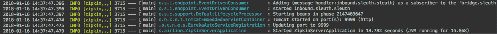

干得好——Zipkin 服务器现在正在运行。我们可以查看索引页面来查看它的样子。

前往 Zipkin 页面；页面应该看起来如下截图：

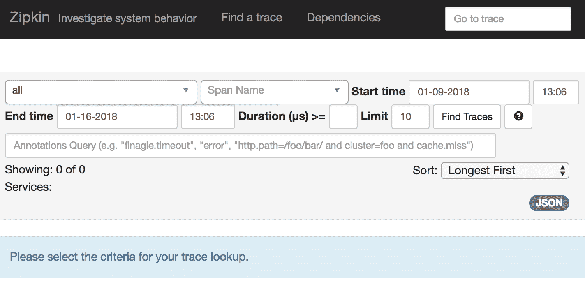

此外，我们还可以检查 RabbitMQ 面板以找到 Zipkin 服务器创建的队列。转到 RabbitMQ 队列（`http://localhost:15672/#/queues`）部分，页面应该看起来像这样：

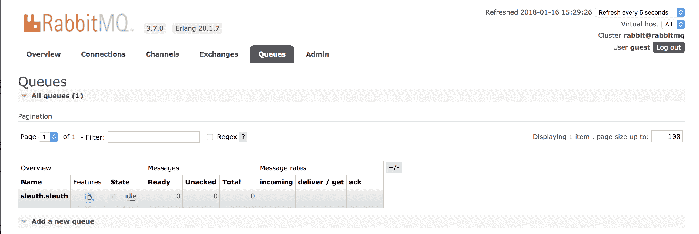

查看队列，项目已创建了 `sleuth.sleuth` 队列，做得好。

Zipkin 服务器已准备就绪。目前，我们不会有任何 `Span`，因为没有应用程序向 Zipkin 发送数据。我们将在下一章中这样做。

# Spring Cloud Gateway

API 网关模式帮助我们通过单个已知的入口点公开我们的微服务。通常，它充当外部访问的入口点并将调用重定向到内部微服务。

在我们的应用程序中采用 API 网关有许多好处。第一个好处很容易识别，它使 API 消费对客户端来说变得容易，这意味着客户端不需要知道不同的微服务端点。

其他好处是第一个好处的结果。当我们有一个唯一的入口点时，我们可以处理一些跨应用的问题，例如过滤、认证、节流和速率限制等。

这是我们采用微服务架构时的一个基本部分。

Spring Cloud Gateway 允许我们在 Spring 管理的 bean 中使用这些功能，以 Spring 的方式使用依赖注入和其他 Spring 框架提供的功能。

该项目基于 Spring Framework 5，它以 Project Reactor 为基础。提供了一些有趣的功能，例如 Hystrix 断路器集成以及与 Spring Cloud Discovery 客户端的集成。

看一下图表，了解 API 网关的好处：

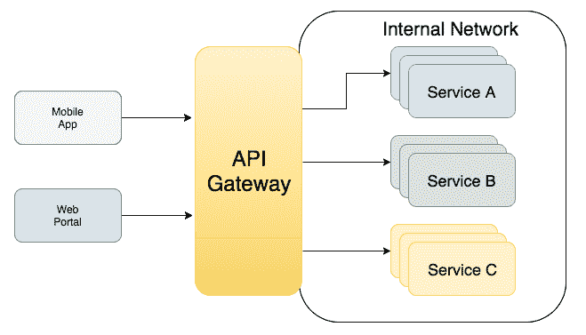

API 网关模式的完整文档可以在以下网址找到：[`microservices.io/patterns/apigateway.html`](http://microservices.io/patterns/apigateway.html)。

# 创建 Spring Cloud Gateway 项目

我们将使用 Spring Initializr 创建我们的 Spring Cloud Gateway 项目；我们需要手动添加一些依赖项。让我们转到 Spring Initializr 页面并创建我们的项目：

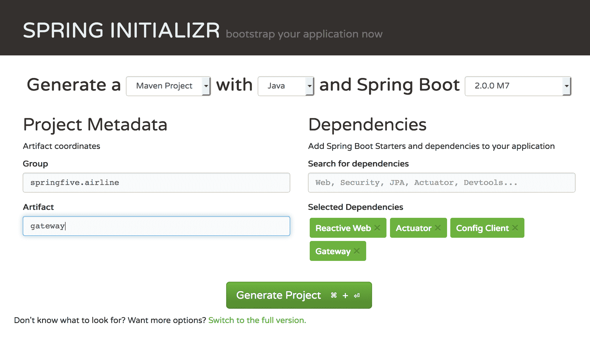

有一个新的依赖项 Gateway，它使我们能够与 Spring Cloud Gateway 一起工作。然后点击“生成项目”并等待下载完成。

之后，我们需要添加一个缺失的依赖项。这个缺失的依赖项是 Gateway 与 Eureka 服务器交互所必需的；依赖项的名称是 `spring-cloud-starter-netflix-eureka-client`。然后，让我们在我们的 `pom.xml` 中添加这个依赖项，我们需要添加以下片段：

```java
<dependency>
 <groupId>org.springframework.cloud</groupId>
 <artifactId>spring-cloud-starter-netflix-eureka-client</artifactId>
</dependency>
```

太好了，我们的项目已经正确配置，可以与 Eureka 服务器一起工作。在下一节中，我们将配置项目以与 Config Server 一起工作。

# 创建 Spring Cloud Gateway 的主类

这一部分没有秘密。Spring Cloud Gateway 与常见的 Spring Boot 应用程序以相同的方式工作。有一个 `main` 类，它将启动嵌入式服务器并启动整个应用程序。

我们的 `main` 类应该看起来像这样：

```java
package springfive.airline.gateway;

import org.springframework.boot.SpringApplication;
import org.springframework.boot.autoconfigure.SpringBootApplication;
import org.springframework.cloud.netflix.eureka.EnableEurekaClient;

@EnableEurekaClient @SpringBootApplication
public class GatewayApplication {

 public static void main(String[] args) {
  SpringApplication.run(GatewayApplication.class, args);
 }

}
```

如我们所见，这是一个相当标准的 Spring Boot 应用程序，配置了 `@EnableEurekaClient` 以作为服务发现实现与 Eureka 服务器一起工作。

# 配置 Spring Cloud Gateway 项目

主要项目结构已经准备好。在本节中，我们将创建项目配置。为了实现这一点，我们需要执行以下步骤：

+   将 `gateway.yaml` 文件添加到 GitHub

+   在 Gateway 项目中创建 `bootstrap.yaml`

我们使用 Spring Cloud Config Server，因此有必要在 GitHub 上创建新文件，因为配置服务器将尝试在存储库中查找文件。在我们的例子中，我们使用 GitHub 作为存储库。

第二个任务是必要的，因为`bootstrap.yaml`文件在应用程序完全准备好运行之前被处理。然后，在这个阶段，应用程序需要查找配置文件，为了实现这一点，应用程序需要知道`repository`，在我们的例子中，是配置服务器。记住配置服务器的地址始终需要放在`bootstrap.yaml`上。

让我们创建我们的`gateway.yaml`文件——文件应该看起来像这样：

```java
server:
  port: 8888
eureka:
  client:
    serviceUrl:
      defaultZone: http://localhost:8761/eureka/
logging:
  level: debug
```

YAML 文件中的`eureka.client`节点负责配置 Eureka 客户端配置。我们需要配置我们的 Eureka 服务器地址实例。它应该指向正确的地址。

Eureka 配置客户端属性有更多选项。完整的文档可以在[`github.com/Netflix/eureka/wiki/Configuring-Eureka`](https://github.com/Netflix/eureka/wiki/Configuring-Eureka)找到；Netflix 团队维护 Eureka。

然后，我们需要在网关项目中创建我们的`bootstrap.yaml`文件。此文件将指导 Spring 框架在配置服务器上查找配置文件，然后下载所需的文件以完成应用程序启动。我们的文件应该看起来像这样：

```java
spring:
  application:
      name: gateway
  cloud:
    config:
      uri: http://localhost:5000
      label: master
```

非常简单。`application.name`是必需的，用于指导框架查找正确的文件。通常，不同应用程序和环境都有许多配置文件。

在`cloud.config`节点上，我们需要输入我们之前配置的 Spring Cloud Config Server 地址。

项目的最终结构应该看起来像这样：

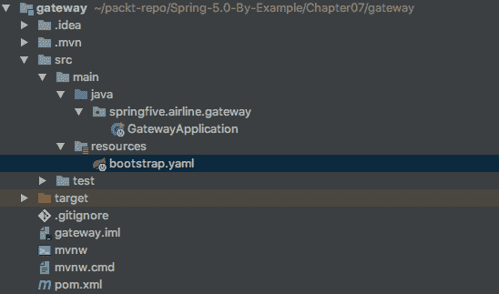

看一下截图。类路径中没有`application.yaml`。这给我们带来了几个优点；类路径项目中没有配置文件，这在管理微服务配置方面对我们帮助很大。

在下一节中，我们将运行它并解释整个应用程序启动过程。让我们开始吧。

# 运行 Spring Cloud Gateway

项目配置良好，现在是时候运行它了。我们可以使用 Java 命令行或 IDE。两种方式没有区别。

配置服务器和 Eureka 服务器需要保持运行状态；网关项目正确运行是强制性的。然后，我们可以运行项目。

运行项目并查看日志。我们可以看到一些有趣的内容，例如项目连接到配置服务器并下载配置，然后连接到 Eureka 服务器并自我注册。以下图表解释了应用程序启动流程：

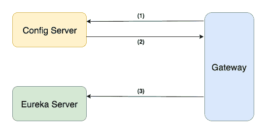

让我们看看不同的流程是什么，并理解它们：

1.  网关应用程序请求配置文件

1.  配置服务器提供配置文件

1.  网关应用注册到 Eureka 服务器

太棒了，我们的网关应用已连接到我们的基础设施服务。

# 检查 Eureka 服务器

我们的网关正在运行。现在，我们可以检查 Eureka 服务器页面以确认此信息。

前往`http://localhost:8761/`，并检查 Eureka 当前注册的实例部分。我们应该看到网关应用，如下面的截图所示：

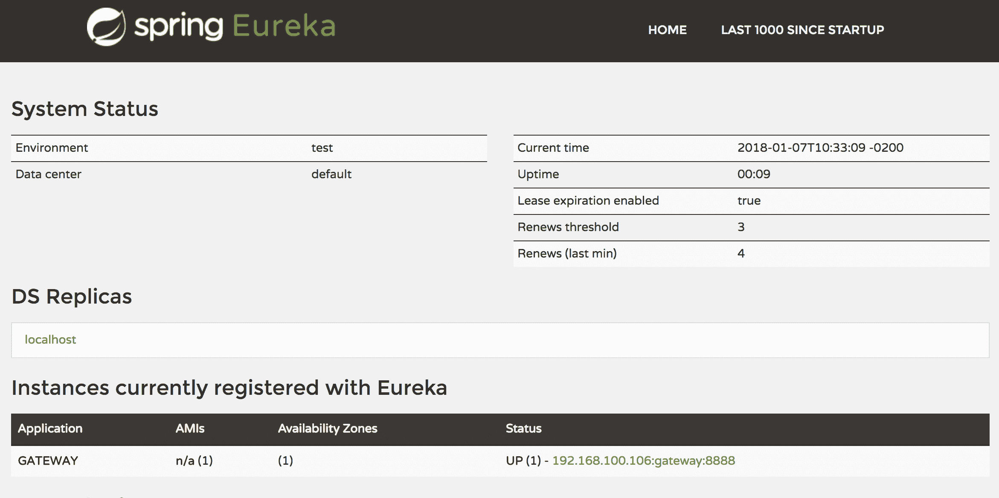

极好。它运行得很好。网关应用已成功注册，并且可以通过服务发现来查找。我们的网关将连接到 Eureka 服务器以获取可用的服务并将请求调用分发到正确的服务。

干得好。现在，我们可以在网关中创建我们的路由。我们将在下一章创建我们的航空公司微服务时进行此操作。

# 使用 Spring Cloud Gateway 创建我们的第一个路由

我们的网关正在运行。在我们开始为我们的航空公司应用程序设置真实路由之前，让我们尝试使用一些假路由来测试 Spring Cloud Gateway 的行为。我们将使用[`httpbin.org/`](https://httpbin.org/)网站，它帮助我们测试一些路由。

让我们创建一个带有`@Configuration`注解的类，为 Spring 容器提供路由。让我们创建一个名为`springfive.airline.gateway.infra.route`的包，然后创建以下类：

```java
package springfive.airline.gateway.infra.route;

import java.util.function.Function;
import org.springframework.cloud.gateway.route.RouteLocator;
import org.springframework.cloud.gateway.route.builder.PredicateSpec;
import org.springframework.cloud.gateway.route.builder.RouteLocatorBuilder;
import org.springframework.cloud.gateway.route.builder.RouteLocatorBuilder.Builder;
import org.springframework.context.annotation.Bean;
import org.springframework.context.annotation.Configuration;

@Configuration
public class SampleRoute {

  private Function<PredicateSpec, Builder> addCustomHeader = predicateSpec -> predicateSpec
      .path("/headers")
      .addRequestHeader("Book", "Spring 5.0 By Example")
      .uri("http://httpbin.org:80");

  @Bean
  public RouteLocator sample(RouteLocatorBuilder builder) {
    return builder.routes()
        .route("custom-request-header", addCustomHeader)
        .route("add-query-param", r -> r.path("/get").addRequestParameter("book", "spring5.0")
            .uri("http://httpbin.org:80"))
        .route("response-headers", (r) -> r.path("/response-headers")
            .addResponseHeader("book","spring5.0")
            .uri("http://httpbin.org:80"))
        .route("combine-and-change", (r) -> r.path("/anything").and().header("access-key","AAA")
            .addResponseHeader("access-key","BBB")
            .uri("http://httpbin.org:80"))
        .build();
  }

}
```

有一些不同类型的配置路由；我们提取的第一个是到名为`addCustomHeader`的私有属性的函数，该函数将用于`custom-request-header`路由。我们将使用**curl**测试之前创建的一些路由。

我们将测试的第一个是`custom-request-header`，路由已配置为路由到：[`httpbin.org:80`](http://httpbin.org:80)并且路径将是`/headers`。此服务将返回发送到服务器的请求头。看看`addCustomHeader`，我们已配置它向请求添加自定义头。它将以`Book`作为键，以`Spring 5.0 By Example`作为值。让我们使用 curl 调用网关 URL：

```java
curl http://localhost:8888/headers
```

输出应该看起来像这样：

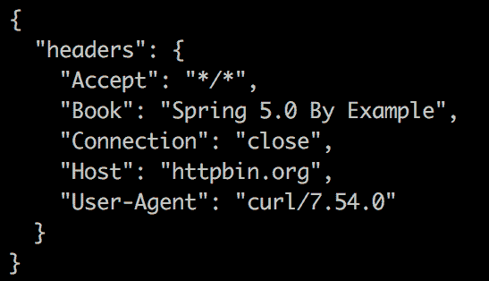

让我们分析输出。首先要注意的是我们调用了 localhost 地址。请求中的`Host`键显示为`httpbin.org`，这意味着 Spring Cloud Gateway 已更改了地址。太棒了，但我们预料到了。第二点是添加了`Book`键的地方，bingo，它就在请求头中。网关按预期工作，我们用几行代码做了些有趣的事情。

让我们再进行一次测试。我们将测试`combine-and-change`，此路由配置为用请求`Header access-key: AAA`回答`/anything`，所以命令行应该是：

```java
curl -v -H "access-key: AAA" http://localhost:8888/anything
```

如我们所见，`-v`参数使调用以详细模式进行，这对于调试目的很有用，而`-H`表示请求头。让我们看看输出：

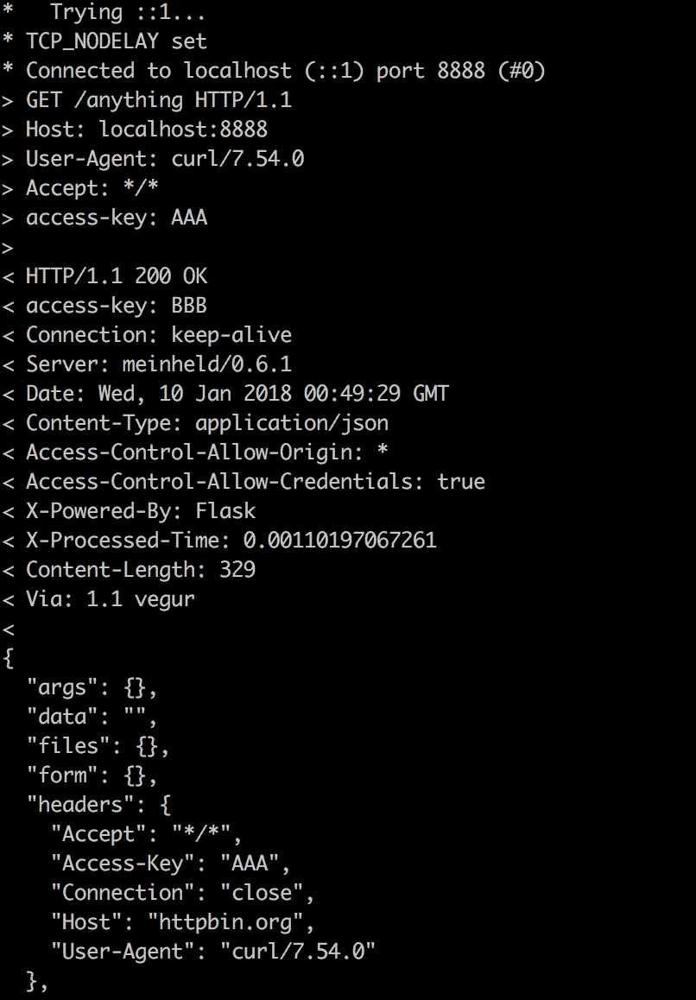

太棒了。如果你看`access-key`的值，网关已更改为请求的值`BBB`。干得好，大家。有一些端点要测试，请随意测试。

你可以在以下位置找到 httpbin 文档：[`httpbin.org/`](https://httpbin.org/)。还有一些有趣的 HTTP 测试方法。

# 将基础设施放在 Docker 上

我们的基础设施已经准备好，并使我们能够开发应用程序。我们可以创建一个 Docker compose 文件来启动基础设施服务；在开发生命周期中，Eureka、配置服务器、跟踪服务器和 API 网关等组件不会发生变化，因为它们作为基础设施进行交互。

然后，它使我们能够创建组件镜像并在`docker-compose.yaml`文件中使用它们。让我们列出我们的组件：

+   配置服务器

+   Eureka

+   Zipkin

+   RabbitMQ

+   Redis

我们知道如何使用 Fabric8 Maven 插件创建 Docker 镜像，我们在前面的章节中已经这样做了几次——让我们来做吧。

让我们以一个为例进行配置，记住我们需要对所有项目进行相同的配置，包括 Eureka、网关、配置服务器和网关。以下代码片段配置了`docker-maven-plugin`以生成 Docker 镜像：

```java
<plugin>
  <groupId>io.fabric8</groupId>
  <artifactId>docker-maven-plugin</artifactId>
  <version>0.21.0</version>
  <configuration>
    <images>
      <image>
        <name>springfivebyexample/${project.build.finalName}</name>
        <build>
          <from>openjdk:latest</from>
          <entryPoint>java -Dspring.profiles.active=docker -jar /application/${project.build.finalName}.jar</entryPoint>
          <assembly>
            <basedir>/application</basedir>
            <descriptorRef>artifact</descriptorRef>
            <inline>
              <id>assembly</id>
              <files>
                <file>
                  <source>target/${project.build.finalName}.jar</source>
                </file>
              </files>
            </inline>
          </assembly>
          <tags>
            <tag>latest</tag>
          </tags>
          <ports>
            <port>8761</port>
          </ports>
        </build>
        <run>
          <namingStrategy>alias</namingStrategy>
        </run>
        <alias>${project.build.finalName}</alias>
      </image>
    </images>
  </configuration>
</plugin>
```

这是一个相当简单的配置。一个简单的 Maven 插件，带有几个配置。然后，在插件配置之后，我们能够生成 Docker 镜像。生成 Docker 镜像的命令是：

```java
mvn clean install docker:build
```

它将为我们生成一个 Docker 镜像。

配置的项目可以在 GitHub 上找到；与前面的章节一样，这里有很多配置要做。我们需要配置`docker-maven-plugin`并生成 Docker 镜像。

完全配置的项目可以在第七章文件夹中找到。GitHub 仓库是：[`github.com/PacktPublishing/Spring-5.0-By-Example/tree/master/Chapter07.`](https://github.com/PacktPublishing/Spring-5.0-By-Example/tree/master/Chapter07)

在创建镜像之后，我们能够创建一个定义整个系统的 Docker compose 文件。`docker-compose-infra-full.yaml`文件应该看起来像这样：

```java
version: '3'
services:

  config:
    hostname: config
    image: springfivebyexample/config
    ports:
      - "5000:5000"
    networks:
      - airline

  rabbitmq:
    hostname: rabbitmq
    image: rabbitmq:3.7.0-management-alpine
    ports:
      - "5672:5672"
      - "15672:15672"
    networks:
      - airline

  mysql:
    hostname: mysql
    image: mysql:5.7.21
    ports:
      - "3306:3306"
    environment:
      - MYSQL_ROOT_PASSWORD=root
      - MYSQL_DATABASE=zipkin
    networks:
      - airline

  redis:
    hostname: redis
    image: redis:3.2-alpine
    ports:
      - "6379:6379"
    networks:
      - airline

  zipkin:
    hostname: zipkin
    image: springfivebyexample/zipkin
    ports:
      - "9999:9999"
    networks:
      - airline

networks:
  airline:
    driver: bridge
```

这里有一些需要注意的有趣事情。非常重要的一点是，所有容器实例都连接到同一个名为`airline`的 Docker 网络。注意容器暴露的端口，在 Docker 中启用服务发现功能很重要。

然后，我们可以执行指令来启动整个基础设施；可以使用以下命令完成：

```java
docker-compose -f docker-compose-infra-full.yaml up -d
```

以下输出应该出现：

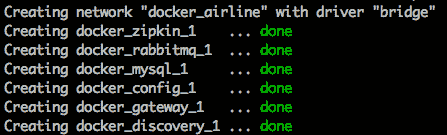

此外，我们可以执行以下指令来检查容器的执行：

```java
docker-compose -f docker-compose-infra-full.yaml ps
```

它将列出正在运行的容器，如下面的截图所示：

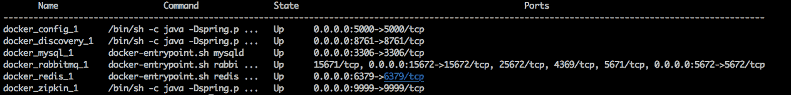

所有应用程序都已启动并运行。做得好。

要删除容器，我们可以使用：

```java
docker-compose -f docker-compose-infra-full.yaml down
```

它将从堆栈中移除容器。

干得好，我们的基础设施在 Docker 容器中完全运行。它是开始创建我们的微服务的基础。

# 摘要

在本章中，我们采用了微服务架构风格构建了基本的基础设施服务。

我们已经学习了 Spring 框架如何从我们的微服务中消除基础设施代码，并使我们能够使用几个注解来创建这些服务。

我们理解了其内部的工作原理；当应用程序在生产阶段出现错误时，进行调试和故障排除至关重要。

现在，我们已经准备好创建可扩展、容错和响应式的系统。我们已经为我们系统建立了基础。

在下一章中，我们将开始构建我们的航空公司票务系统，了解如何将新的微服务与整个基础设施连接起来，并启用服务发现和其他令人惊叹的功能。

那里见。
