# 断路器和安全

在前一章中，我们配置了将在我们的基础设施中运行的微服务，并创建了一个 Eureka 服务器作为我们解决方案的服务发现。此外，我们还创建了一个 Config Server 应用程序，它将为我们的微服务提供服务配置。

在本章中，我们将创建微服务来与我们的先前基础设施交互。我们将发现如何为我们的业务微服务应用服务发现功能，并了解断路器模式如何帮助我们为应用程序带来弹性。

在本章中，我们将了解微服务如何通过由 Spring WebFlux 客户端提供的 HTTP 异步调用来与其他服务进行通信。

到本章结束时，我们将学会如何：

+   使用服务发现连接微服务

+   从配置服务器拉取配置

+   了解 `Hystrix` 如何为微服务带来弹性

+   展示边缘 API 策略

+   展示 Spring Boot Admin

# 理解服务发现的力量

我们将根据业务需求创建我们的第一个微服务。我们将创建一个 `planes` 微服务，该微服务将维护有关公司飞机的数据，例如特性、型号和其他属性。

`planes` 微服务将被用来为我们第二个微服务，即 `flights` 微服务，提供飞机特性。它需要获取一些飞机信息以便能够创建航班，例如座位数。

`planes` 微服务是一个很好的起点，因为没有需要创建与业务相关的依赖项。

我们的 `planes` 微服务很快就会变得有用。是时候创建它了。让我们开始吧。

# 创建 `planes` 微服务

正如我们在前几章中所做的那样，我们将使用 Spring Initializr 来实现这个目的。以下是一些应该选择的依赖项，如以下截图所示：

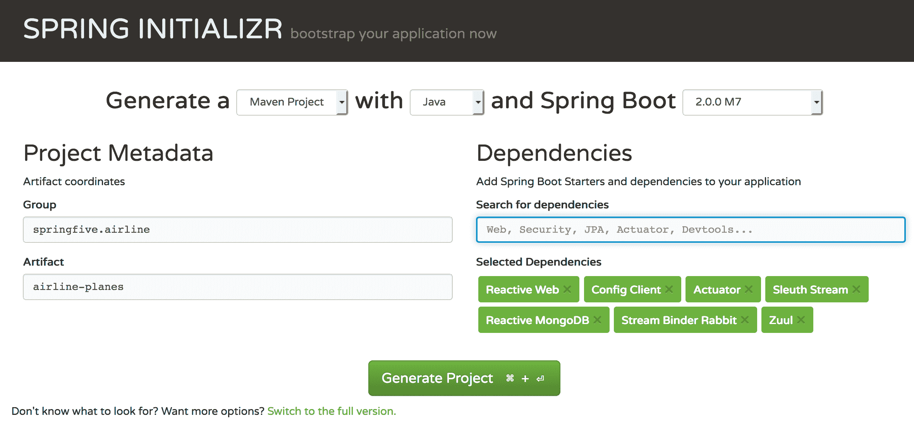

有一些必要的依赖项。Stream Binder Rabbit 和 Sleuth Stream 依赖项是必要的，使我们能够发送数据跨度，并启用应用程序跟踪，通过 RabbitMQ 消息代理。我们将使用 MongoDB 作为此特定应用程序的数据库，因此我们需要 Reactive MongoDB。Config Client 对于解决方案中存在的所有微服务都是强制性的。我们不会在类路径上有任何应用程序配置。Actuator 提供了生产就绪的指标和关于运行应用程序的信息；这是微服务架构风格的一个基本特征。此外，Zuul 将是连接应用程序与我们的边缘 API 的关键。我们将在本章的学习过程中了解更多关于它的信息。

我们现在可以按下“生成项目”按钮来下载项目。在 IDE 中打开项目。

将使用 Spring Boot 2 框架创建 `planes` 微服务，因为我们感兴趣的是为我们的飞机服务实现响应式基础。

此外，我们还需要包含一个额外的依赖项，这可以通过在 `pom.xml` 上的以下片段来完成：

```java
<dependency>
  <groupId>org.springframework.cloud</groupId>
  <artifactId>spring-cloud-starter-netflix-eureka-client</artifactId>
</dependency>
```

`spring-cloud-starter-netflix-eureka-client` 允许我们的应用程序通过 Eureka 服务器实现服务发现。

# 编写飞机微服务

我们将在应用程序中添加一些功能。对于这个特定的应用程序，我们将使用 Spring Reactive WebFlux 创建 CRUD 功能。

`Plane` 类代表我们的微服务中的飞机模型，该类应该像这样：

```java
package springfive.airline.airlineplanes.domain;

import com.fasterxml.jackson.annotation.JsonInclude;
import com.fasterxml.jackson.annotation.JsonInclude.Include;
import java.util.Set;
import lombok.Builder;
import lombok.Data;
import lombok.NonNull;
import org.springframework.data.annotation.Id;
import org.springframework.data.mongodb.core.mapping.Document;
import springfive.airline.airlineplanes.resource.data.PlaneRequest;

@Data
@Document(collection = "planes")
@JsonInclude(Include.NON_NULL)
public class Plane {

  @Id
  String id;

  String owner;

  PlaneModel model;

  Set<Seat> seats;

  String notes;

  @Builder
  public static Plane newPlane(String owner,PlaneModel planeModel,Set<Seat> seats,String notes){
    Plane plane = new Plane();
    plane.owner = owner;
    plane.model = planeModel;
    plane.seats = seats;
    plane.notes = notes;
    return plane;
  }

  public Plane fromPlaneRequest(@NonNull PlaneRequest planeRequest){
    this.owner = planeRequest.getOwner();
    this.model = planeRequest.getModel();
    this.seats = planeRequest.getSeats();
    this.notes = planeRequest.getNotes();
    return this;
  }

}
```

有趣的点在于 `@Document` 注解。它使我们能够配置领域 MongoDB 集合的名称。`@Builder` 注解使用注解的方法创建构建者模式的实现。`Project Lombok` 库提供了这个功能 ([`projectlombok.org`](https://projectlombok.org))。此外，该项目还有一些令人兴奋的功能，如 `@Data`，它为注解的类自动创建 `getters/setters`、`equals` 和 `hashCode` 实现。

正如我们所看到的，这个类中有一些领域模型。这些模型在这里不需要解释，完整的源代码可以在 GitHub 项目中找到：[`github.com/PacktPublishing/Spring-5.0-By-Example/tree/master/Chapter08/airline-planes`](https://github.com/PacktPublishing/Spring-5.0-By-Example/tree/master/Chapter08/airline-planes)。

# 响应式仓库

我们的 `Plane` 类需要一个仓库将数据持久化到数据库中。我们将使用 Spring Reactive MongoDB 实现提供的响应式仓库。我们将使用 `ReactiveCrudRepository`，因为它使我们的仓库变得响应式。我们的仓库应该像这样：

```java
package springfive.airline.airlineplanes.repository;

import org.springframework.data.repository.reactive.ReactiveCrudRepository;
import springfive.airline.airlineplanes.domain.Plane;

public interface PlaneRepository extends ReactiveCrudRepository<Plane,String>{
}
```

实现与之前的 Spring Data 版本相同，只是新增了响应式接口。现在，我们可以在下一节创建我们的服务层。

# 创建飞机服务

我们的 `PlaneService` 将负责在 `PlaneRepository` 和 `PlaneResource` 之间创建一种粘合剂；后者我们将在下一节中创建。实现应该像这样：

```java
package springfive.airline.airlineplanes.service;

import lombok.NonNull;
import org.springframework.stereotype.Service;
import reactor.core.publisher.Flux;
import reactor.core.publisher.Mono;
import springfive.airline.airlineplanes.domain.Plane;
import springfive.airline.airlineplanes.repository.PlaneRepository;
import springfive.airline.airlineplanes.resource.data.PlaneRequest;

@Service
public class PlaneService {

  private final PlaneRepository planeRepository;

  public PlaneService(PlaneRepository planeRepository) {
    this.planeRepository = planeRepository;
  }

  public Flux<Plane> planes(){
    return this.planeRepository.findAll();
  }

  public Mono<Plane> plane(@NonNull String id){
    return this.planeRepository.findById(id);
  }

  public Mono<Void> deletePlane(@NonNull Plane plane){
    return this.planeRepository.delete(plane);
  }

  public Mono<Plane> create(@NonNull PlaneRequest planeRequest){
    final Plane plane = Plane.builder().owner(planeRequest.getOwner())
 .planeModel(planeRequest.getModel()).seats(planeRequest.getSeats())
 .notes(planeRequest.getNotes()).build();
    return this.planeRepository.save(plane);
  }

  public Mono<Plane> update(@NonNull String id,@NonNull PlaneRequest planeRequest){
    return this.planeRepository.findById(id)
        .flatMap(plane -> Mono.just(plane.fromPlaneRequest(planeRequest)))
        .flatMap(this.planeRepository::save);
  }

}
```

这个类没有特别之处，`PlaneService` 将调用 `PlaneRepository` 将 `Plane` 持久化到数据库中。正如我们所看到的，我们广泛地使用了 lambda 表达式。Java 8 是运行 Spring Boot 2 应用程序的要求。

看看构建者模式如何使我们能够编写干净的代码。阅读这段代码要容易得多；我们使用了 Lombok 提供的 `chaining` 方法来编写它。

# REST 层

我们将使用 Spring WebFlux 来公开我们的 REST 端点，然后我们需要在我们的方法中返回 `Mono` 或 `Flux`。REST 实现应该像这样：

```java
package springfive.airline.airlineplanes.resource;

import java.net.URI;
import javax.validation.Valid;
import org.springframework.http.HttpStatus;
import org.springframework.http.ResponseEntity;
import org.springframework.web.bind.annotation.DeleteMapping;
import org.springframework.web.bind.annotation.GetMapping;
import org.springframework.web.bind.annotation.PathVariable;
import org.springframework.web.bind.annotation.PostMapping;
import org.springframework.web.bind.annotation.PutMapping;
import org.springframework.web.bind.annotation.RequestBody;
import org.springframework.web.bind.annotation.RequestMapping;
import org.springframework.web.bind.annotation.RestController;
import org.springframework.web.util.UriComponentsBuilder;
import reactor.core.publisher.Flux;
import reactor.core.publisher.Mono;
import springfive.airline.airlineplanes.domain.Plane;
import springfive.airline.airlineplanes.resource.data.PlaneRequest;
import springfive.airline.airlineplanes.service.PlaneService;

@RestController
@RequestMapping("/planes")
public class PlaneResource {

  private final PlaneService planeService;

  public PlaneResource(PlaneService planeService) {
    this.planeService = planeService;
  }

  @GetMapping
  public Flux<Plane> planes() {
    return this.planeService.planes();
  }

  @GetMapping("/{id}")
  public Mono<ResponseEntity<Plane>> plane(@PathVariable("id") String id) {
    return this.planeService.plane(id).map(ResponseEntity::ok)
 .defaultIfEmpty(ResponseEntity.notFound().build());
  }

  @PostMapping
  public Mono<ResponseEntity<Void>> newPlane(
      @Valid @RequestBody PlaneRequest planeRequest, UriComponentsBuilder uriBuilder) {
    return this.planeService.create(planeRequest).map(data -> {
      URI location = uriBuilder.path("/planes/{id}")
 .buildAndExpand(data.getId())
 .toUri();
      return ResponseEntity.created(location).build();
    });
  }

  @DeleteMapping("/{id}")
  public Mono<ResponseEntity<Object>> deletePlane(@PathVariable("id") String id) {
    return this.planeService.plane(id).flatMap(data -> this.planeService.deletePlane(data)
        .then(Mono.just(ResponseEntity.noContent().build())))
        .defaultIfEmpty(new ResponseEntity<>(HttpStatus.NOT_FOUND));
  }

  @PutMapping("/{id}")
  public Mono<ResponseEntity<Object>> updatePlane(@PathVariable("id") String id,@Valid @RequestBody PlaneRequest planeRequest) {
    return this.planeService.update(id,planeRequest)
        .then(Mono.just(ResponseEntity.ok().build()));
  }

}
```

看一下`plane`方法。当`planeService.plane(id)`返回空的 Mono 时，REST 端点将返回`notFound`，如下实现：`ResponseEntity.notFound().build()`。这使得代码极其易于理解。

在`newPlane`方法中，我们将返回带有新实体 ID 的`location` HTTP 头。

# 运行飞机微服务

在我们运行飞机微服务之前，我们将创建`plane`微服务的`main`类。它将负责启动应用程序。为此，我们需要包含几个 Spring 注解。类实现可以像这样：

```java
package springfive.airline.airlineplanes;

import org.springframework.boot.SpringApplication;
import org.springframework.boot.autoconfigure.SpringBootApplication;
import org.springframework.cloud.netflix.eureka.EnableEurekaClient;
import org.springframework.cloud.netflix.zuul.EnableZuulProxy;
 @EnableZuulProxy
@EnableEurekaClient @SpringBootApplication
public class AirlinePlanesApplication {

 public static void main(String[] args) {
  SpringApplication.run(AirlinePlanesApplication.class, args);
 }

}
```

Spring 注解将与 Zuul 代理连接。此外，我们需要将应用程序与 Eureka 服务器连接，并自动配置应用程序。这些行为可以使用`@EnableZuulProxy`、`@EnableEurekaClient`和`@SpringBootApplication`来完成。

现在，我们将创建一个`bootstrap.yaml`文件来指导 Spring 框架在上一章创建的配置服务器上搜索配置文件。文件应该像这样：

```java
spring:
  application:
    name: planes
  cloud:
    config:
      uri: http://localhost:5000
      label: master
```

我们已经配置了配置服务器的地址；这简直易如反掌。

现在，我们需要在 GitHub 仓库中添加`application.yaml`文件，因为配置服务器将尝试在仓库中找到该文件。

该文件可以在 GitHub 上找到，地址为[`github.com/PacktPublishing/Spring-5.0-By-Example/blob/master/config-files/flights.yaml`](https://github.com/PacktPublishing/Spring-5.0-By-Example/blob/master/config-files/flights.yaml)。

我们可以在 IDE 中运行应用程序或通过命令行运行；这取决于你。在尝试运行之前，请检查配置服务器、Eureka、MongoDB 和 RabbitMQ 是否正在运行。

我们可以使用位于 GitHub 上的 Docker Compose 文件([`github.com/PacktPublishing/Spring-5.0-By-Example/blob/master/Chapter07/docker/docker-compose-infra-full.yaml`](https://github.com/PacktPublishing/Spring-5.0-By-Example/blob/master/Chapter07/docker/docker-compose-infra-full.yaml))。它包含 RabbitMQ、配置服务器、Eureka、MongoDB、MySQL、Redis 和 Zipkin 容器，可供使用。如果您正在使用它，请使用以下命令运行它：`docker-compose -f docker-compose-infra-full.yaml up -d`。

让我们检查输出。我们可以以不同的方式检查它：在控制台上，以及在 Eureka 服务器上。让我们这么做。

检查控制台。让我们尝试找到关于`DiscoveryClient`的一行。`planes`微服务正在尝试连接到 Eureka 服务器：

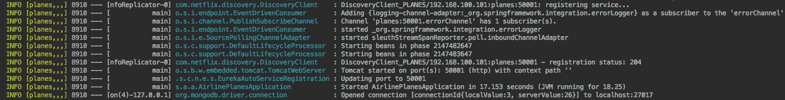

在日志文件中这里有一些重要信息。第一行指示哪个应用程序正在尝试注册到 Eureka 服务器。接下来的四行是关于 Sleuth 的。Sleuth 框架正在注册 RabbitMQ 队列和通道。

我们需要找到以下行：

```java
Started AirlinePlanesApplication in 17.153 seconds (JVM running for 18.25)
```

此外，我们还可以检查 Eureka 服务器，并可以看到那里的 PLANES 应用程序，如下所示：

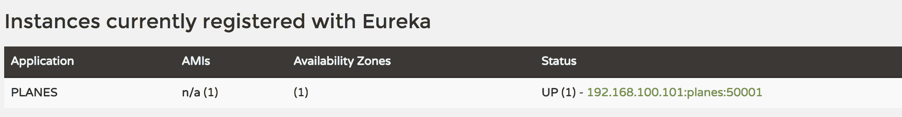

太棒了，我们的飞机微服务已经上线。

我们可以使用 Postman 尝试我们的微服务。这个应用程序使我们能够使用直观的 IDE 调用我们的 API，并与我们的微服务进行交互。该应用程序允许我们将一些 HTTP 调用分组到集合中。飞机集合可以在 GitHub 上找到，地址为 [`github.com/PacktPublishing/Spring-5.0-By-Example/blob/master/postman/planes.postman_collection`](https://github.com/PacktPublishing/Spring-5.0-By-Example/blob/master/postman/planes.postman_collection)。

我们已经完成了我们的第一个微服务。在下一节中，我们将创建我们的 `flights` 微服务，它将消费飞机的数据。

# 飞行微服务

我们的飞机微服务已经启动并运行。现在这很重要，因为飞行微服务需要获取飞机的数据来创建飞行实体。

我们将介绍 Netflix Ribbon，它将作为我们的应用程序的客户端负载均衡器，我们将使用服务发现来从服务注册表中查找服务的地址。

# 克隆飞行微服务项目

我们在前一章中多次执行了这个任务。我们可以在 GitHub 上下载项目源代码，地址为 [`github.com/PacktPublishing/Spring-5.0-By-Example/tree/master/Chapter08/airline-flights`](https://github.com/PacktPublishing/Spring-5.0-By-Example/tree/master/Chapter08/airline-flights)。在下一节中，我们将深入了解 Ribbon 以及它如何帮助我们解决分布式系统问题。

# Netflix Ribbon

Ribbon 是由 Netflix 公司创建和维护的开源项目。该项目采用 Apache 2.0 许可，可用于商业目的。

Ribbon 为 **IPC**（**进程间通信**）提供客户端软件负载均衡算法。该项目以异步方式支持大多数流行的协议，如 TCP、UDP 和 HTTP。

还有更多有趣的功能，例如服务发现集成，这使得在动态和弹性的环境中（如云）进行集成成为可能。为此，我们将查看我们的 Eureka 服务器。这两个项目都由 Netflix 团队维护。它非常适合我们的用例。

另一个有趣的功能是容错性。Ribbon 客户端可以在配置的列表中找到活动服务器并发送请求。此外，下线服务器将不会收到任何请求。

下面的图解说明了 Ribbon 的工作原理：

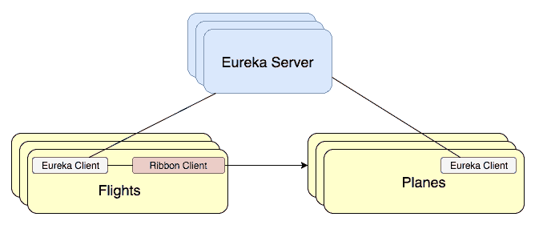

正如我们所见，**Ribbon 客户端**可以与 Eureka 通信，然后重定向对所需微服务的请求。在我们的案例中，`flights` 微服务将使用 Ribbon 客户端，从 Eureka 获取服务注册表，并将调用重定向到活动的 `planes` 微服务实例。这听起来像是一个令人惊叹的解决方案。

# 理解发现客户端

现在，我们将了解服务发现以及它在复杂和动态环境中的工作方式。服务发现的基本思想是维护服务存储库并为调用者提供服务地址。

实现这个目标需要一些复杂的工作。有两个主要的行为需要理解：

+   第一个是要注册。正如我们所知，服务发现需要存储服务信息，例如地址和名称，然后在服务引导期间，它需要将信息发送到服务注册表。

+   在第二个操作中，服务发现客户端需要查询服务注册表，请求所需的服务名称，例如。然后服务注册表将向客户端发送服务信息。

现在我们已经了解了基础知识，如下面的图所示：

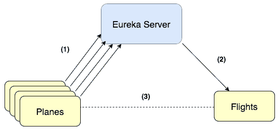

如前图所示：

1.  第一部分是服务注册。

1.  在第二阶段，服务客户端将从 Eureka 服务器获取服务地址。

1.  然后，客户端可以根据服务信息进行调用。

让我们在代码中实现它。

# 实际中的服务发现和负载均衡

现在我们将编写一些代码来与我们的服务发现和负载均衡基础设施进行交互。现在我们知道了它是如何工作的，这将帮助我们理解源代码。

我们将创建一个`DiscoveryService`类，该类将根据请求的服务名称发现地址。类代码应该如下所示：

```java
package springfive.airline.airlineflights.service;

import org.springframework.cloud.client.discovery.DiscoveryClient;
import org.springframework.cloud.client.loadbalancer.LoadBalancerClient;
import org.springframework.stereotype.Service;
import reactor.core.publisher.Flux;
import reactor.core.publisher.Mono;

@Service
public class DiscoveryService {

  private final LoadBalancerClient lbClient;

  private final DiscoveryClient dClient;

  public DiscoveryService(LoadBalancerClient lbClient, DiscoveryClient dClient) {
    this.lbClient = lbClient;
    this.dClient = dClient;
  }

  public Flux<String> serviceAddressFor(String service) {
    return Flux.defer(() ->  Flux.just(this.dClient.getInstances(service)).flatMap(srv ->
        Mono.just(this.lbClient.choose(service))
    ).flatMap(serviceInstance ->
        Mono.just(serviceInstance.getUri().toString())
    ));
  }

}
```

如我们所见，我们注入了两个对象：`LoadBalanceClient`，它充当客户端负载均衡器，即 Netflix Ribbon；以及`DiscoveryClient`，它将找到请求的服务实例。

我们使用 lambda `Flux.defer()`来组织流程，然后我们将从 Eureka 服务器中查找服务实例。我们使用`this.dClient.getInstances(service)`来做这件事。在从负载均衡中查找服务 URI 之后，它将返回一个服务名称列表。这将是使用`this.lbClient.choose(service).`完成的。然后我们将返回服务实例地址的`Flux`。

是时候看看客户端代码如何使用`DiscoveryService`对象了。客户端代码可能如下所示：

```java
public Mono<Plane> plane(String id) {
  return discoveryService.serviceAddressFor(this.planesService).next().flatMap(
      address -> this.webClient.mutate().baseUrl(address + "/" + this.planesServiceApiPath + "/" + id).build().get().exchange()
      .flatMap(clientResponse -> clientResponse.bodyToMono(Plane.class)));
}
```

这段代码可以在项目的`PlaneService`类中找到。记住`serviceAddressFor()`方法返回一个服务地址的`Flux`。我们将使用`next()`方法获取第一个，然后我们能够将服务地址转换为一个有效的地址，以到达飞机微服务。

现在，我们将测试服务连接。我们需要完成以下任务：

1.  运行配置服务器、Eureka、`planes`微服务和`flights`微服务

1.  在`planes`微服务上创建一个`plane`实体

1.  在`flights`微服务上创建一个`flight`实体

检查之前列出的所有服务是否都在运行。然后我们将使用以下 JSON 创建一个`plane`实体：

```java
{
  "owner" : "Spring Framework Company",
  "model" : {
    "factory" : "Pivotal",
    "model" : "5.0",
    "name" : "Spring 5.0",
    "reference_name" : "S5.0"
  },
  "seats" : [
    {
      "identity" : "1A",
      "row" : "1",
      "right_side" : { "seat_identity" : "2A"},
      "category" : {
        "id" : "A",
        "name": "First Class"
      }
    },
    {
      "identity" : "2A",
      "row" : "1",
      "left_side" : { "seat_identity" : "1A"},
      "category" : {
        "id" : "A",
        "name": "First Class"
      }
    },
    {
      "identity" : "3A",
      "row" : "1",
      "left_side" :{ "seat_identity" : "2A"},
      "category" : {
        "id" : "A",
        "name": "First Class"
      }
    }
    ],
  "notes": "The best company airplane"
}
```

我们需要使用 HTTP `POST` 方法在 `http://localhost:50001/planes` 上调用 `planes` 微服务。我们可以在 Postman 的 `Planes Collection` 中找到创建飞机的请求。当我们调用创建飞机 API 时，我们将获得一个新的飞机 ID。它可以在 HTTP 响应头中找到，如下面的图片所示，在 Postman 中：

Postman 是一个帮助开发者测试 API 的工具。Postman 提供了一个友好的 **GUI**（**图形用户界面**）来发送请求。此外，该工具支持环境，并且可以帮助测试不同的环境，如开发、测试和生产。

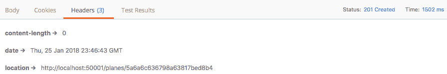

查看一下 `location` HTTP 响应头。HTTP 状态码同样重要。我们将使用刚刚创建的飞机 ID `5a6a6c636798a63817bed8b4` 来创建一个新的航班。

我们可以在 *W3 Org*（[`www.w3.org/Protocols/rfc2616/rfc2616-sec10.html`](https://www.w3.org/Protocols/rfc2616/rfc2616-sec10.html)）找到 HTTP 状态码列表。请记住这一点，因为它非常重要，遵循正确的状态码。当我们创建 REST API 时，这被认为是一种最佳实践。

Flight Collection 可以在 GitHub 上找到，地址为 [`github.com/PacktPublishing/Spring-5.0-By-Example/blob/master/postman/flights.postman_collection`](https://github.com/PacktPublishing/Spring-5.0-By-Example/blob/master/postman/flights.postman_collection)。我们想要执行一个创建航班的请求，但在那之前，我们需要更改之前创建的飞机 ID。查看以下截图：

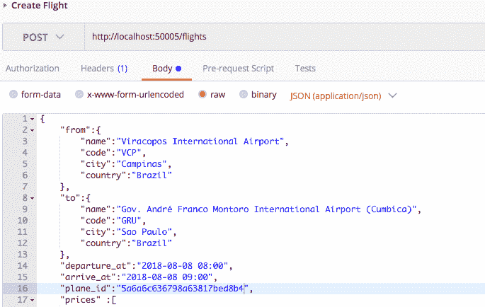

飞机 ID 已经变更为之前创建的飞机 ID。现在我们可以执行请求。`flights` 微服务与 `planes` 微服务具有相同的行为。它将返回带有新航班 ID 的位置响应。在我的情况下，生成的新 ID 如下所示：

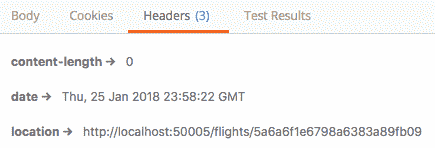

现在，我们可以通过 ID 查找航班。请求可以在 Flight Collection 中找到；名称为 Flight by Id。我们可以执行这个请求，结果应该如下所示：

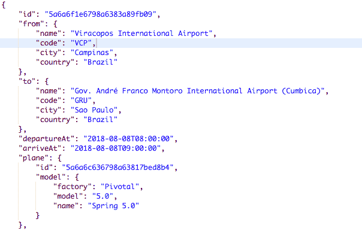

查看一下 `plane` JSON 节点。我们在 `flight` 微服务中没有关于飞机的数据。这些信息来自 `planes` 微服务。我们已经使用了服务发现和客户端负载均衡。做得好！

让我们看一下 IDE 提供的调试信息。我们想要查看飞机服务地址：

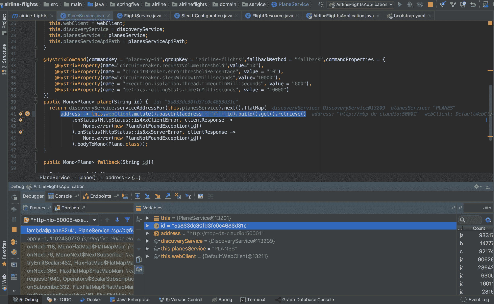

在变量面板上，我们可以看到地址变量。其值来自服务发现和客户端负载均衡。它是 **服务 IP** 或 **域名**。现在我们能够通过转换 URL 来调用所需的服务。

太棒了，我们的基础设施工作得非常好，现在我们能够使用基础设施查找服务，但有一些重要的事情需要注意。我们将在下一节中找到它。

# 当服务失败时，hello Hystrix

有时基础设施可能会失败，尤其是网络。它可能会在微服务架构中引起一些问题，因为通常服务之间存在许多连接。这意味着在运行时，微服务依赖于其他微服务。通常这些连接是通过 HTTP 协议通过 REST API 完成的。

它可能导致一种称为 **级联失败** 的行为；也就是说，当微服务系统的一部分失败时，它可能会触发其他微服务的失败，因为存在依赖关系。让我们举例说明：

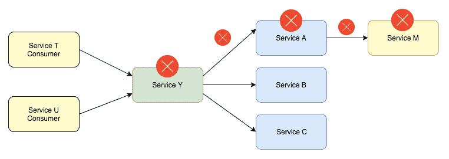

如果 **服务 Y** 失败，**服务 A** 和 **服务 M** 可能也会失败。

我们有一个模式可以帮助我们处理这种情况：电路断路器。

# Hystrix 简述

`Hystrix` 是一个帮助开发者管理服务之间交互的库。该项目是开源的，由社区维护，并位于 Netflix GitHub 上。

电路断路器模式是一种帮助控制系统集成模式的模式。这个想法相当简单：我们将远程调用封装在函数或对象中，并将监控这些调用以跟踪失败。如果调用达到限制，电路将打开。其行为类似于电路断路器，其想法相同——保护某物以避免破坏电气系统：

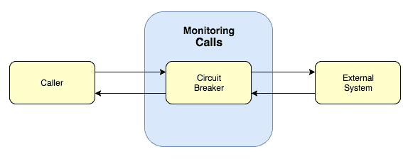

`Hystrix` 实现了电路断路器模式，并有一些有趣的行为，例如回退选项。`Hystrix` 为我们的应用程序提供弹性。我们能够提供回退，停止级联失败，并给出操作控制。

该库提供高级配置，如果我们使用 `Spring Cloud Hystrix`，则可以通过注解进行配置。

电路断路器模式由 Martin Fowler 描述。您可以在 Martin Fowler 的页面 [`martinfowler.com/bliki/CircuitBreaker.html`](https://martinfowler.com/bliki/CircuitBreaker.html) 上找到更多关于它的信息。

# Spring Cloud Hystrix

如我们所预期，Spring Boot 与 `Netflix Hystrix` 集成。集成可以通过几个注解完成，并通过配置注解与 Hystrix 属性进行配置。我们将保护在 `flight` 服务中编码的 `planes` 微服务交互。我们现在有一个尝试获取飞机数据的函数。

让我们看看那个方法：

```java
@HystrixCommand(commandKey = "plane-by-id",groupKey = "airline-flights",fallbackMethod = "fallback",commandProperties = {
 @HystrixProperty(name="circuitBreaker.requestVolumeThreshold",value="10"),
 @HystrixProperty(name = "circuitBreaker.errorThresholdPercentage", value = "10"),
 @HystrixProperty(name="circuitBreaker.sleepWindowInMilliseconds",value="10000"),
 @HystrixProperty(name = "execution.isolation.thread.timeoutInMilliseconds", value = "800"),
 @HystrixProperty(name = "metrics.rollingStats.timeInMilliseconds", value = "10000")
 })
public Mono<Plane> plane(String id) {
  return discoveryService.serviceAddressFor(this.planesService).next().flatMap(
      address -> this.webClient.mutate().baseUrl(address + "/" + this.planesServiceApiPath + "/" + id).build().get().exchange()
      .flatMap(clientResponse -> clientResponse.bodyToMono(Plane.class)));
}
```

对于这个命令有一些配置。第一个配置是`commandKey.`这里的想法是为命令创建一个名称。这对于面板控制将很有用。第二个是`groupKey`，这是用于分组命令的命令。它也有助于在仪表板上将命令数据分组在一起。有一个滚动窗口的概念。其想法是在时间间隔内分组请求；它用于启用指标和统计。

`circuitBreaker.requestVolumeThreshold`配置了在滚动窗口中触发的请求数量。例如，如果我们配置的滚动窗口为 10 秒开放，如果在 10 秒的间隔内有九个请求，则电路不会打开，因为我们已经在我们的命令中将其配置为 10。另一个配置是`circuitBreaker.sleepWindowInMilliseconds`，其基本思想是在触发电路后给予一定的时间，在此期间拒绝请求，然后再尝试允许尝试。

最后一个是`execution.isolation.thread.timeoutInMilliseconds.`这个属性配置了命令的超时时间。这意味着如果达到配置的时间，断路器系统将执行回退逻辑，并将命令标记为超时。

`Hystrix`库高度可定制，有很多属性可以使用。完整的文档可以在[`github.com/Netflix/Hystrix/wiki/configuration.`](https://github.com/Netflix/Hystrix/wiki/configuration)找到。我们可以根据不同的用例使用这些属性。

# Spring Boot Admin

Spring Boot Admin 项目是一个帮助生产环境中开发者的工具。该工具以有组织的仪表板显示 Spring Boot 应用程序指标，并且使查看应用程序指标和更多信息变得极其容易。

工具使用 Spring Boot Actuator 的数据作为信息源。该项目是开源的，有很多贡献者，并且在社区中也是一个活跃的项目。

# 运行 Spring Boot Admin

设置应用程序非常简单。我们需要一个新的 Spring Boot 应用程序，并将其与我们的服务发现实现连接。让我们现在就做吧。

我们可以在 GitHub 上找到代码[`github.com/PacktPublishing/Spring-5.0-By-Example/tree/master/Chapter08/admin`](https://github.com/PacktPublishing/Spring-5.0-By-Example/tree/master/Chapter08/admin)。如果你想创建一个新的应用程序，请继续；过程与我们在前面的章节中所做的是相似的。

该项目是一个 Spring Boot 常规应用，包含两个新的依赖项：

```java
<dependency>
  <groupId>de.codecentric</groupId>
  <artifactId>spring-boot-admin-server</artifactId>
  <version>1.5.6</version>v
</dependency>

<dependency>
  <groupId>de.codecentric</groupId>
  <artifactId>spring-boot-admin-server-ui</artifactId>
  <version>1.5.6</version>
</dependency>
```

这些依赖项是关于`admin-server`和`admin-server-ui`的。该项目目前不支持 Spring Boot 2，但这不是问题，因为我们不需要对此使用响应式功能；它是一个监控工具。

我们已经配置了我们的必需依赖项。由于我们在基础设施中有一个服务发现，我们需要它来提供服务发现功能，并最小化我们对 Spring Boot Admin 应用程序的配置。让我们添加 Eureka 客户端依赖项：

```java
<dependency>
  <groupId>org.springframework.cloud</groupId>
  <artifactId>spring-cloud-starter-netflix-eureka-client</artifactId>
</dependency>
```

太棒了，我们的依赖项配置正确。然后我们可以创建我们的主类。主类应该是这样的：

```java
package springfive.airline.admin;

import de.codecentric.boot.admin.config.EnableAdminServer;
import org.springframework.boot.SpringApplication;
import org.springframework.boot.autoconfigure.SpringBootApplication;
import org.springframework.cloud.netflix.eureka.EnableEurekaClient;

@EnableAdminServer
@EnableEurekaClient
@SpringBootApplication
public class AdminApplication {

  public static void main(String[] args) {
    SpringApplication.run(AdminApplication.class, args);
  }

}
```

这里的主要区别在于`@EnableAdminServer`将配置 Spring Boot Admin 应用程序并为我们设置服务器。正如我们所预期的那样，我们将使用配置服务器应用程序来存储我们的`application.yaml`。为了实现这一点，我们需要创建我们的`bootstrap.yaml`，它应该是这样的：

```java
spring:
  application:
    name: admin
  cloud:
    config:
      uri: http://localhost:5000
      label: master
```

没有任何区别，`bootstrap.yaml`被配置为从配置服务器查找配置文件。

是时候创建我们的`application.yaml`文件了，我们需要添加一些配置来设置新的健康检查 URL，因为 Spring Boot 2 中的 actuator 被移动，并以前缀*actuator*开头。我们新的健康检查 URL 应该是`/actuator/health`。

我们的配置文件应该是这样的：

```java
server:
  port: 50015

eureka:
  client:
    serviceUrl:
      defaultZone: http://localhost:8761/eureka/
spring:
  boot:
    admin:
      discovery:
        converter:
          health-endpoint-path: /actuator/health
```

我们已经配置了 Eureka 服务器地址并设置了健康检查 URL。

现在我们可以运行我们称为`AdminApplication`的主类。我们可以使用 Java 命令行或 IDE；两者之间没有任何区别。

运行它！

我们应该在日志文件中看到以下行：

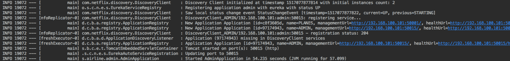

太棒了，我们的应用程序已经准备好使用。现在我们可以进入主页。访问`http://localhost:50015/#/`（主页），然后我们可以看到以下页面：

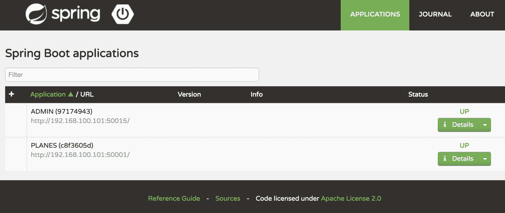

看看这如何更容易地看到我们的微服务中的任何故障或异常行为。记住，微服务架构中的关键点是监控。为了有一个良好的环境，这真的是必要的。

# Spring Cloud Zuul

当我们采用微服务架构时，Spring Cloud Gateway 是自然的选择，但如今 Spring Cloud Gateway 并没有启用对服务发现功能的支持，例如 Eureka 服务器。这意味着我们不得不逐个配置路由。这听起来并不好。

我们有 Zuul 代理作为我们的微服务环境的网关，但请记住，当项目支持服务发现时，Spring Cloud Gateway 是最好的选择。

让我们创建 Zuul 代理项目。

# 理解 EDGE 服务项目

EDGE 服务是一个提供动态路由、监控、弹性和安全性的服务。基本思想是为我们的微服务创建一个反向代理。

此服务将作为我们的微服务的代理，并作为中央访问点公开。Spring Cloud Zuul 与 Eureka 服务器集成。它将提高我们的弹性，因为我们将使用 Eureka 服务器提供的服务发现功能。

以下图片展示了我们如何在我们的架构中使用**Edge 服务**：

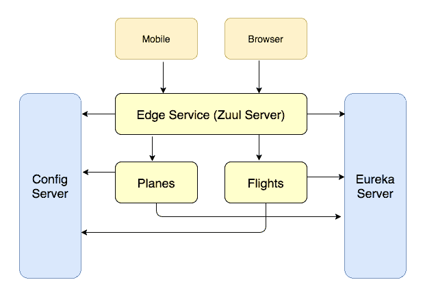

如我们所见，**Zuul 服务器**将连接到服务发现服务器，以获取可用服务的列表。之后，Zuul 服务将重定向到请求的服务。

看看这个图。它与客户端没有交互，也就是说，**移动**和**浏览器**以及我们的微服务。

Spring Cloud Zuul 还支持一些有趣的功能，例如：

+   **pre**：这可以用来在 `RequestContext` 中设置一些数据；它在请求被路由之前执行

+   **route**：这个处理请求路由

+   **post**：这个过滤器在请求被路由后执行

+   **error**：当发生某些错误时，我们可以使用错误功能来处理请求

我们将不会使用这些功能，但请记住，它们可能非常有用。记住，我们的 Zuul 服务器是通向互联网的网关。

# 创建 EDGE 服务器

我们将使用 Zuul 服务器作为我们应用程序的 API 网关。现在是我们创建项目的时候了。由于创建此项目没有涉及任何相关的差异，我们将查看特定的 Zuul 部分。

所需的依赖项是：

```java
<dependency>
  <groupId>org.springframework.cloud</groupId>
  <artifactId>spring-cloud-starter-netflix-zuul</artifactId>
</dependency>
```

它将为我们配置 Zuul 服务器依赖项。

现在，我们可以添加项目的主类。这个类应该是这样的：

```java
package springfive.airline.edge;

import org.springframework.boot.SpringApplication;
import org.springframework.boot.autoconfigure.SpringBootApplication;
import org.springframework.cloud.netflix.eureka.EnableEurekaClient;
import org.springframework.cloud.netflix.zuul.EnableZuulProxy;
import org.springframework.stereotype.Controller;

@Controller
@EnableZuulProxy
@EnableEurekaClient
@SpringBootApplication
public class EdgeServerApplication {

  public static void main(String[] args) {
    SpringApplication.run(EdgeServerApplication.class, args);
  }

}
```

这里的新功能是 `@EnableZuulProxy`。它将设置 Zuul 服务器端点并配置反向代理过滤器。然后，我们将能够将请求转发到微服务应用程序。Zuul 与 Eureka 服务器集成，因此我们不需要手动配置它。自动配置将在发现客户端实现时找到服务。

我们可以通过命令行或 IDE 运行应用程序，这取决于你。

然后，我们可以看到配置的路由。转到 `http://localhost:8888/routes`，我们将能够看到路由：

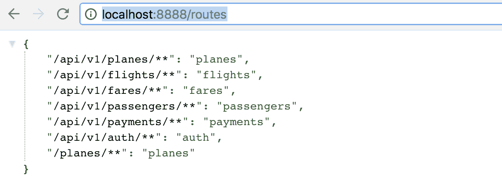

我们已经配置了一些路由。我们使用 `application.yaml` 文件来完成这项工作。文件应该是这样的：

```java
zuul:
  routes:
    planes:
      path: /api/v1/planes/**
      serviceId: planes
    flights:
      path: /api/v1/flights/**
      serviceId: flights
    fares:
      path: /api/v1/fares/**
      serviceId: fares
    passengers:
      path: /api/v1/passengers/**
      serviceId: passengers
```

让我们了解这个配置。我们创建了一个名为 `planes` 的节点。这个节点配置了一个 `path`（即 URI）并配置了通过 `serviceId` 在 Eureka 服务器上注册的服务名称。

让我们做一个简单的测试。我们将：

+   为飞机服务配置新的 URL 路径

+   使用 Zuul 服务器测试请求

打开位于 `planes` 微服务项目中的 `PlaneResource` 类。

`RequestMapping` 的配置如下：

```java
@RequestMapping("/planes")
```

改成这样：

```java
@RequestMapping("/")
```

记住我们可以使用 Zuul 服务器作为路由器，因此我们不再需要这些信息了。在源代码的 URI 路径上，我们能够使用配置文件。

再次运行 `planes` 微服务。以下服务需要运行：

+   配置服务器

+   Eureka 服务器

+   飞机微服务

+   API Edge

然后，我们可以使用 Zuul 代理调用 `planes` 微服务。让我们使用 cURL 来做这件事：

```java
curl http://localhost:8888/api/v1/planes
```

让我们稍微了解一下。端口 `8888` 指向 **Zuul 服务器**，我们在 `application.yaml` 中进行了配置。当路径是 `'/api/v1/planes/**'` 时，**Zuul 服务器** 将重定向到 `planes` 微服务。基本流程是：

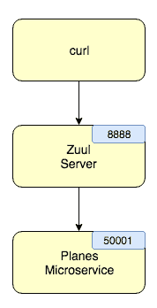

请求将到达 **Zuul 服务器**，然后 **Zuul 服务器** 将将其重定向到请求的微服务。结果应该像这样；在我的情况下，数据库中有些飞机：

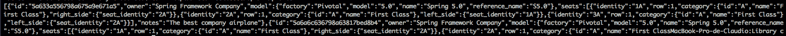

太棒了，我们的 API 网关完全运行正常。我们将使用它来处理同一端口的全部服务，只需更改 URI 以指向所需的 `serviceId`。

我们可以像在其他 Spring Boot 应用程序中一样配置端口。在这种情况下，我们选择了 `8888` 端口。

# 摘要

在本章中，我们了解了一些重要的微服务模式和它们如何帮助我们交付具有容错性、弹性和易于出错的程序。

我们练习了如何使用 Spring 框架提供的服务发现功能以及它在应用程序运行时的运作方式，我们还进行了一些调试任务，以帮助我们理解它在底层是如何工作的。

由 Netflix 托管的 Hystrix 项目可以提高我们应用程序的弹性和容错性。在本节中，当处理远程调用时，我们创建了一些 Hystrix 命令，并了解了 Hystrix 是断路器模式的有用实现。

在本章的结尾，我们能够理解微服务的缺点以及如何在分布式环境中解决常见问题。

现在我们知道了如何使用 Spring 框架解决微服务架构风格中的常见问题。

在下一章中，我们将完成我们的 *航空票务系统*，使用配置的工具监控微服务的健康状态，并查看它在微服务在生产阶段运行时的操作时间如何帮助开发者。

那里见。
