# 第一章：创建一个列出世界各国及其 GDP 的应用程序

Spring 是一个促进基于 JVM 的企业应用程序开发的生态系统。这是通过 Spring 提供的各种模块实现的。其中之一，称为 Spring-core，是 Spring 生态系统中的框架核心，它提供了依赖注入、Web 应用程序、数据访问、事务管理、测试等方面的支持。

在本章中，我们将从头开始，使用 Spring 框架开发一个简单的应用程序。不需要熟悉 Spring 框架，我们将在本章结束时确保您对 Spring 框架的使用有足够的信心。

本章将涵盖以下主题：

+   应用程序简介

+   理解数据库结构

+   理解世界银行 API

+   设计线框图

+   创建一个空的应用程序

+   定义模型类

+   定义数据访问层

+   定义 API 控制器

+   部署到 Tomcat

+   定义视图控制器

+   定义视图

# 技术要求

本章中使用的所有代码都可以从以下 GitHub 链接下载：[`github.com/PacktPublishing/Spring-5.0-Projects/tree/master/chapter01`](https://github.com/PacktPublishing/Spring-5.0-Projects/tree/master/chapter01)。代码可以在任何操作系统上执行，尽管它只在 Windows 上进行了测试。

# 应用程序简介

我们将开发一个应用程序来展示各个国家的 GDP 信息。我们将利用 MySQL 提供的示例 World DB（[`dev.mysql.com/doc/world-setup/en/world-setup-installation.html`](https://dev.mysql.com/doc/world-setup/en/world-setup-installation.html)）来列出国家，并获取详细视图以显示国家信息及其从世界银行 API（[`datahelpdesk.worldbank.org/knowledgebase/articles/898599-api-indicator-queries`](https://datahelpdesk.worldbank.org/knowledgebase/articles/898599-api-indicator-queries)）获取的 GDP 信息。

列表将使用 World DB 中可用的国家数据。在详细视图中，我们将使用 World DB 中可用的数据来列出城市和语言，并使用世界银行 API 获取额外的信息和该国的 GDP 信息。

我们还将支持编辑国家条目的基本详情，从国家条目中添加和删除城市，以及从国家条目中添加和删除语言。在这个应用程序中，我们将使用以下工具和技术：

+   使用 Spring MVC 框架实现 MVC 模式

+   与 MySQL DB 的交互将使用 Spring JDBC 模板完成

+   与世界银行 API 的交互将使用 RestTemplate 完成

+   视图将使用名为 Thymeleaf 的模板框架创建

+   前端将由 jQuery 和 Bootstrap 驱动

# 理解数据库结构

如果你没有安装 MySQL，请转到 MySQL 链接（[`dev.mysql.com/downloads/installer`](https://dev.mysql.com/downloads/installer)）来安装它，并在它不可用的情况下用世界数据库填充。附录还将指导你如何使用 MySQL Workbench 和 MySQL 命令行工具运行查询。

以下是世界数据库模式的示意图：

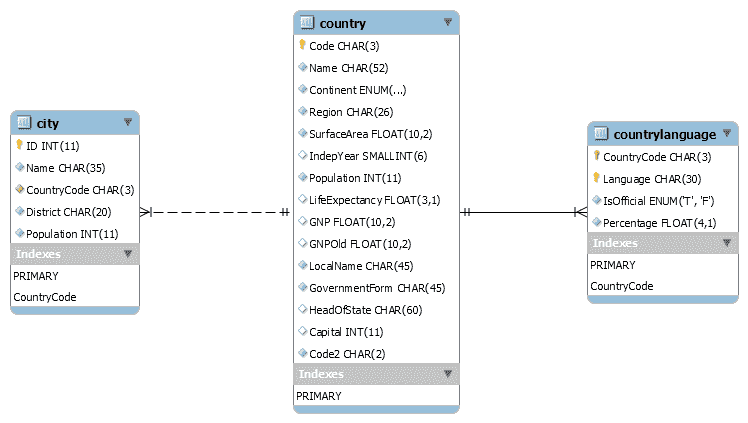

数据库模式很简单，包含以下三个表：

+   **城市**：与国家表中三个字符国家代码相对应的城市列表。

+   **国家**：国家列表，其中主键是三个字符的国家代码。有一个列包含 ISO 国家代码。

+   **国家语言**：与国家相对应的语言列表，其中国家的一种语言被标记为官方语言。

# 理解世界银行 API

世界银行公开了大量的 API（[`www.worldbank.org/`](http://www.worldbank.org/)），API 文档可以在以下位置找到（[`datahelpdesk.worldbank.org/knowledgebase/articles/889386-developer-information-overview`](https://datahelpdesk.worldbank.org/knowledgebase/articles/889386-developer-information-overview)）。在可用的 API 中，我们将使用指标 API（[`datahelpdesk.worldbank.org/knowledgebase/articles/898599-api-indicator-queries`](https://datahelpdesk.worldbank.org/knowledgebase/articles/898599-api-indicator-queries)），这些 API 代表诸如总人口、GDP、GNI、能源使用等方面的信息。

使用指标 API，我们将获取数据库中过去 10 年可用的国家的 GDP 信息。让我们看看 API 的 REST URL 和 API 返回的数据，如下所示：

```java
GET http://api.worldbank.org/countries/BR/indicators/NY.GDP.MKTP.CD?format=json&date=2007:2017
```

在此 URL 中，`BR`是国家代码（*巴西*）。`NY.GDP.MKTP.CD`是世界银行 API 内部用于调用指标 API 的标志。请求参数`date`表示所需 GDP 信息的持续时间。

以下是你将从前一个 API 获取的响应摘录：

```java
[
    {
        "page": 1,
        "pages": 1,
        "per_page": "50",
        "total": 11
    },
    [
       ....// Other country data 
        {
            "indicator": {
                "id": "NY.GDP.MKTP.CD",
                "value": "GDP (current US$)"
            },
            "country": {
                "id": "BR",
                "value": "Brazil"
            },
            "value": "1796186586414.45",
            "decimal": "0",
            "date": "2016"
        }
    ]
]
```

前面的响应显示了 2016 年巴西的 GDP 指标（以美元计）。

# 设计应用程序屏幕的线框

线框是应用程序或网站的基本骨架。它给出了最终应用程序的外观。它基本上有助于决定导航流程，理解功能，设计用户界面，并在应用程序存在之前设定期望。这个过程极大地帮助开发者、设计师、产品所有者和客户同步工作，避免任何差距。我们将遵循相同的模式，并将设计各种应用程序线框，如下所示。

# 国家列表页面

我们将使其简单。主页显示带有分页的国家列表，并允许通过国家名称进行搜索以及通过大陆/地区进行筛选。以下将是我们的应用程序的主页：

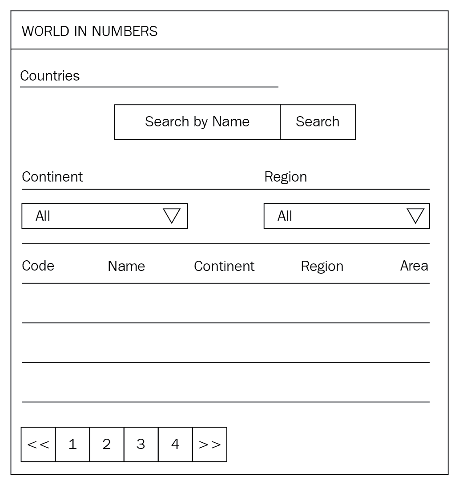

# 国家详情页

此屏幕将显示国家的详细信息，如城市、语言和从世界银行 API 获取的 GDP 信息。GDP 数据将以图形视图显示。页面看起来如下：

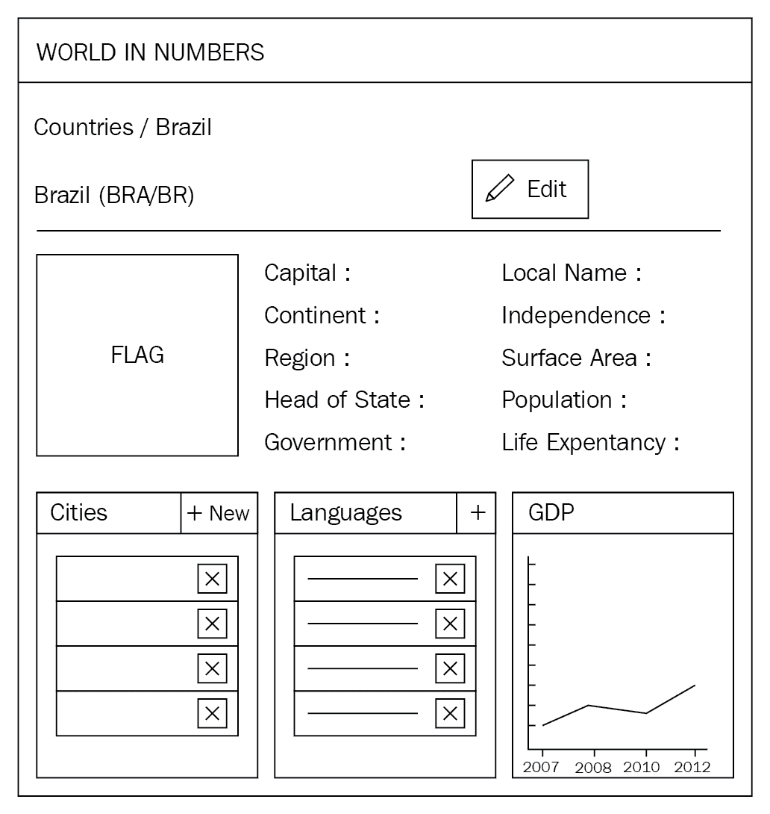

# 国家编辑页

在国家列表页，将有一个名为“编辑”的按钮。点击它后，系统将显示编辑模式的国家，允许更新国家的详细信息。以下是国家基本详细信息编辑视图的结构：

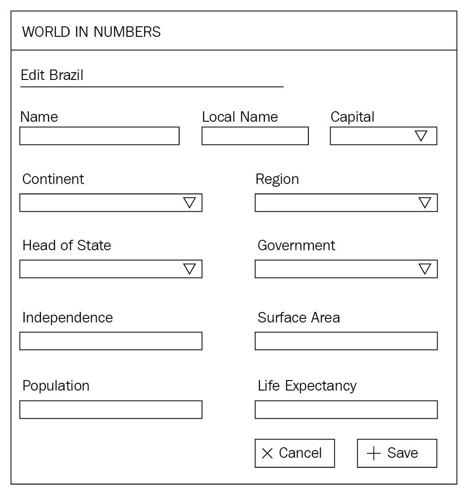

# 添加新的城市和语言

在国家详情页，通过点击“新建”按钮，可以访问两个模态视图，一个用于添加新的城市，另一个用于添加新的语言。以下是用以添加新国家和语言的两个模态对话框的视图。它们将单独打开：

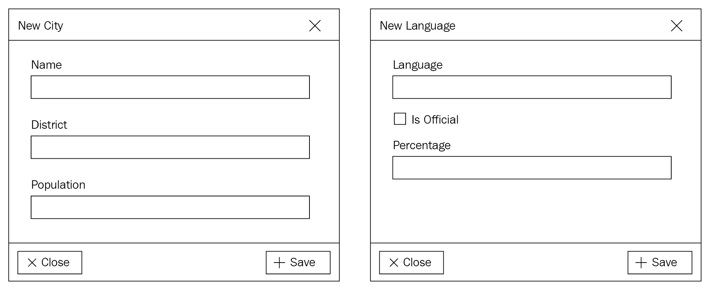

# 创建一个空的应用程序

我们将使用 Maven 生成一个具有 Java 基于 Web 应用程序所需结构的空应用程序。如果您尚未安装 Maven，请按照以下说明（[`maven.apache.org/install.html`](https://maven.apache.org/install.html)）安装 Maven。安装后，运行以下命令以创建一个空的应用程序：

```java
mvn archetype:generate -DgroupId=com.nilangpatel.worldgdp -DartifactId=worldgdp -Dversion=0.0.1-SNAPSHOT -DarchetypeArtifactId=maven-archetype-webapp
```

运行前面的命令将显示确认的命令行参数值，如下截图所示：

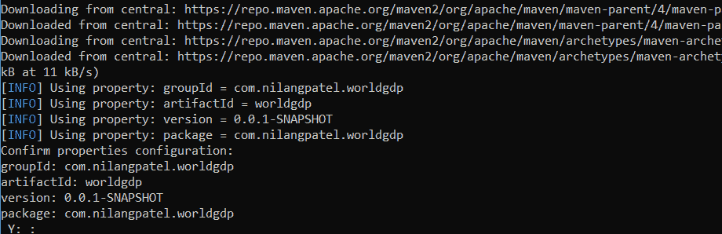

您必须在之前截图所示的命令提示符中键入`Y`以完成空项目的创建。现在，您可以将此项目导入您选择的 IDE 中，并继续开发活动。为了简化，我们将使用 Eclipse，因为它是当今 Java 社区中最受欢迎的 IDE 之一。

在成功创建应用程序后，您将看到以下截图所示的文件夹结构：

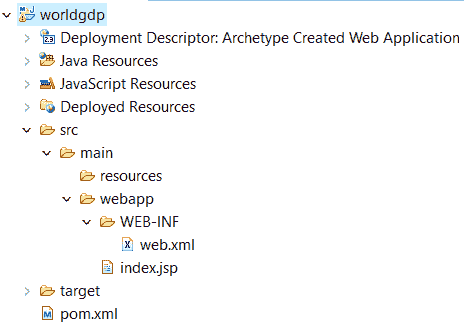

在创建默认项目结构时，您将默认看到添加的`index.jsp`。您必须将其删除，因为在我们的应用程序中，我们将使用 Thymeleaf——另一种模板引擎来开发着陆页。

# 定义模型类

现在，让我们创建 Java 类来模拟数据库中的数据以及来自世界银行 API 的数据。我们的方法很简单。我们将为数据库中的每个表创建一个 Java 类，数据库的列将成为 Java 类的属性。

在生成的应用程序中，`main` 目录下缺少 `java` 文件夹。我们将手动创建 `java` 文件夹，并将 `com.nilangpatel.worldgdp` 打包，这将作为应用程序的根包。让我们继续实施我们决定的方法。但在那之前，让我们看看一个有趣的项目，名为 **Project Lombok**。

Project Lombok 提供了用于生成您的获取器、设置器、默认和重载构造函数以及其他样板代码的注解。有关如何与您的 IDE 集成的更多详细信息，可以在他们的项目网站上找到（[`projectlombok.org/`](https://projectlombok.org/))。

我们需要更新我们的 `pom.xml` 以包含对 Project Lombok 的依赖项。以下是你需要复制并添加到 XML 中相关位置的 `pom.xml` 部分内容：

```java
<properties>
    <java.version>1.8</java.version>
    <lombok.version>1.16.18</lombok.version>
</properties>
<dependency>
    <groupId>org.projectlombok</groupId>
    <artifactId>lombok</artifactId>
    <optional>true</optional>
    <version>${lombok.version}</version>
</dependency>
```

我们接下来要创建的所有模型类都属于 `com.nilangpatel.worldgdp.model` 包。以下代码给出了表示 `Country` 数据的模型类：

```java
@Data
@Setter
@Getter
public class Country {
    private String code;
    private String name;
    private String continent;
    private String region;
    private Double surfaceArea;
    private Short indepYear;
    private Long population;
    private Double lifeExpectancy;
    private Double gnp;
    private String localName;
    private String governmentForm;
    private String headOfState;
    private City capital;
    private String code2;
}
```

`City` 类尚未创建，让我们继续创建它，如下所示：

```java
@Data
@Setter
@Getter
public class City {
    private Long id;
    private String name;
    private Country country;
    private String district;
    private Long population;
}
```

接下来是建模 `CountryLanguage` 类，这是国家使用的语言，如下所示：

```java
@Data
@Setter
@Getter
public class CountryLanguage {
    private Country country;
    private String language;
    private String isOfficial;
    private Double percentage;
}
```

我们还需要一个模型类来映射从世界银行 API 获得的 GDP 信息。让我们继续创建一个 `CountryGDP` 类，如下所示：

```java
@Data
@Setter
@Getter
public class CountryGDP { 
    private Short year;
    private Double value;
}
```

在此时刻，一切工作得非常完美。但当您开始在某个其他类中调用这些模型类的获取器和设置器时，您可能会遇到编译错误。这是因为我们需要再进行一步来配置 Lombok。在您定义了 Maven 依赖项后，您将在 IDE 中看到 JAR 引用。只需右键单击它，然后选择“运行 As* |* Java Application”选项。或者，您可以从终端执行以下命令，位置是在 Lombok JAR 文件所在的目录下，如下所示：

```java
java -jar lombok-1.16.18.jar 
```

在这里，`lombok-1.16.18.jar` 是 JAR 文件名。您将看到一个单独的窗口弹出，如下所示：

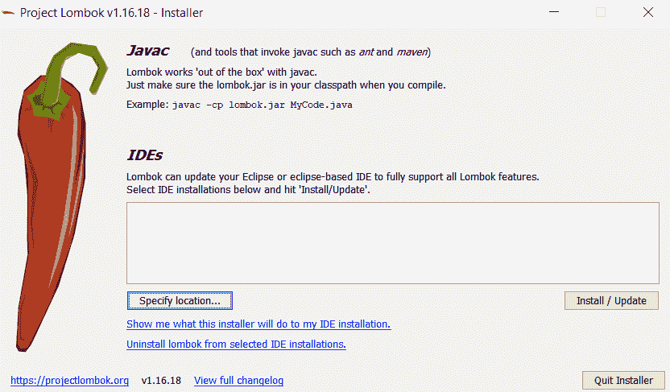

通过点击“指定位置...”按钮选择您的 IDE 位置。一旦选择，点击“安装 / 更新”按钮来安装它。您将收到一条成功消息。只需重新启动 IDE 并重新构建项目，您就会看到仅通过定义 `@Setter` 和 `@Getter`，实际的设置器和获取器就可供其他类使用。您不再需要显式添加它们。

# 使用 Hibernate Validator 添加验证

我们需要在模型类中添加一些检查，以确保从 UI 发送的数据不是无效的。为此，我们将使用 Hibernate Validator。您需要添加以下 Hibernate 依赖项：

```java
    <properties>
        <java.version>1.8</java.version>
        <lombok.version>1.16.18</lombok.version>
        <hibernate.validator.version>6.0.2.Final</hibernate.validator.version>
    </properties>    
    <dependency>
        <groupId>org.hibernate.validator</groupId>
        <artifactId>hibernate-validator</artifactId>
        <version>${hibernate.validator.version}</version>
    </dependency>
```

现在回到 `com.nilangpatel.worldgdp.model.Country` 并更新它，如下所示：

```java
@Data public class Country {

  @NotNull @Size(max = 3, min = 3) private String code;
  @NotNull @Size(max = 52) private String name;
  @NotNull private String continent;
  @NotNull @Size(max = 26) private String region;
  @NotNull private Double surfaceArea;
  private Short indepYear;
  @NotNull private Long population;
  private Double lifeExpectancy;
  private Double gnp;
  @NotNull private String localName;
  @NotNull private String governmentForm;
  private String headOfState;
  private City capital;
  @NotNull private String code2;
}
```

接下来是更新 `com.nilangpatel.worldgdp.model.City` 类，方式类似，如下所示：

```java
@Data public class City {
  @NotNull private Long id;
  @NotNull @Size(max = 35) private String name;
  @NotNull @Size(max = 3, min = 3) private String countryCode;
  private Country country;
  @NotNull @Size(max = 20) private String district;
  @NotNull private Long population;
}
```

最后，更新 `com.nilangpatel.worldgdp.model.CountryLanguage` 类，如下所示：

```java
@Data
public class CountryLanguage {
  private Country country;
  @NotNull private String countryCode;
  @NotNull @Size(max = 30) private String language;
  @NotNull @Size(max = 1, min = 1) private String isOfficial;
  @NotNull private Double percentage;
}
```

# 定义数据访问层 - Spring JDBC 模板

我们有模型类，它们反映了我们从世界银行 API 获得的数据库中数据的结构。现在我们需要开发一个数据访问层，与我们的 MySQL 交互，并将存储在数据库中的数据填充到模型类的实例中。我们将使用 Spring JDBC 模板来实现与数据库所需的交互。

首先，我们需要 JDBC 驱动程序来连接任何 Java 应用程序与 MySQL。这可以通过向我们的`pom.xml`添加以下依赖项和版本属性来实现：

```java
    <properties>
        <java.version>1.8</java.version>
        <lombok.version>1.16.18</lombok.version>
        <hibernate.validator.version>6.0.2.Final</hibernate.validator.version>    
        <mysql.jdbc.driver.version>5.1.44</mysql.jdbc.driver.version>
    </properties> 
    <dependency>
      <groupId>mysql</groupId>
      <artifactId>mysql-connector-java</artifactId>
      <version>${mysql.jdbc.driver.version}</version>
    </dependency>
```

无论您看到`<something.version>1.5.6</something.version>`，它都应放在`<properties></properties>`标签内。不会重复提及这一点。这是为了将使用的库版本集中在一个地方，便于维护和查找。

任何以`<dependency></dependency>`开始的依赖项都应放在`<dependencies></dependencies>`列表中。

现在我们需要将 Spring 核心 APIs 以及 Spring JDBC APIs（其中包含 JDBC 模板）添加到我们的`pom.xml`中。以下是这两个依赖项的简要介绍：

1.  **Spring 核心 APIs**：它为我们提供了核心的 Spring 功能，如依赖注入和配置模型

1.  **Spring JDBC APIs**：它为我们提供了创建`DataSource`实例和与数据库交互所需的 API

由于这是一个示例应用程序，我们没有使用 Hibernate 或其他 ORM 库，因为它们除了基本的 CRUD 操作之外还提供了许多功能。相反，我们将编写 SQL 查询，并使用 JDBC 模板与它们一起使用，以使事情更简单。

以下代码显示了两个库的`dependency`信息：

```java
<dependency>
   <groupId>org.springframework</groupId>
   <artifactId>spring-core</artifactId>
   <version>${spring.version}</version>
</dependency>
<dependency>
   <groupId>org.springframework</groupId>
   <artifactId>spring-jdbc</artifactId>
   <version>${spring.version}</version>
</dependency>
```

除了前两个依赖项之外，我们还需要添加一些 Spring 依赖项来帮助我们使用注解（如`@bean`、`@Service`、`@Configuration`、`@ComponentScan`等）设置基于 Java 的配置，并使用注解进行依赖注入（`@Autowired`）。为此，我们将添加以下依赖项：

```java
<dependency>
    <groupId>org.springframework</groupId>
    <artifactId>spring-beans</artifactId>
    <version>${spring.version}</version>
</dependency>
<dependency>
    <groupId>org.springframework</groupId>
    <artifactId>spring-context</artifactId>
    <version>${spring.version}</version>
</dependency>
```

# 定义 JDBC 连接属性

我们将在`application.properties`文件中定义 JDBC 连接属性，并将其放置在`src/main/resources`中。我们定义的属性如下：

```java
dataSourceClassName=com.mysql.jdbc.Driver
jdbcUrl=jdbc:mysql://localhost:3306/worldgdp
dataSource.user=root
dataSource.password=test
```

前述属性是基于以下假设：MySQL 运行在端口`3306`上，数据库用户名和密码分别为`root`和`test`。您可以根据本地配置更改这些属性。下一步是定义一个属性解析器，以便在代码中使用时能够解析属性。我们将使用`@PropertySource`注解，以及`PropertySourcesPlaceholderConfigurer`的一个实例，如下面的代码所示：

```java
@Configuration
@PropertySource("classpath:application.properties")
public class PropertiesWithJavaConfig {

   @Bean
   public static PropertySourcesPlaceholderConfigurer
     propertySourcesPlaceholderConfigurer() {
      return new PropertySourcesPlaceholderConfigurer();
   }
}
```

我们将遵循将所有配置类放在`com.nilangpatel.worldgdp.config`中，并将任何根配置放在`com.nilangpatel.worldgdp`包中的约定。

此类从类路径（`src/main/resources`）中存储的 `application.properties` 文件读取所有属性。接下来是配置一个 `javax.sql.DataSource` 对象，该对象将使用 `application.properties` 文件中定义的属性连接到数据库。我们将使用 HikariCP 连接池库来创建我们的 `DataSource` 实例。然后，我们将使用此 `DataSource` 实例来实例化 `NamedParameterJdbcTemplate`。我们将使用 `NamedParameterJdbcTemplate` 来执行所有我们的 SQL 查询。在这个阶段，我们需要添加一个必要的依赖项来使用 HikariCP 库，如下所示：

```java
    <dependency>
        <groupId>com.zaxxer</groupId>
        <artifactId>HikariCP</artifactId>
        <version>${hikari.version}</version>
    </dependency>
```

`DBConfiguration` 数据源配置类应如下所示：

```java
@Configuration
public class DBConfiguration {
  @Value("${jdbcUrl}") String jdbcUrl;
  @Value("${dataSource.user}") String username;
  @Value("${dataSource.password}") String password;
  @Value("${dataSourceClassName}") String className;

  @Bean
  public DataSource getDataSource() {
    HikariDataSource ds = new HikariDataSource();
    ds.setJdbcUrl(jdbcUrl);
    ds.setUsername(username);
    ds.setPassword(password);
    ds.setDriverClassName(className);
    return ds;
  }

  @Bean
  public NamedParameterJdbcTemplate namedParamJdbcTemplate() {
    NamedParameterJdbcTemplate namedParamJdbcTemplate = 
        new NamedParameterJdbcTemplate(getDataSource());
    return namedParamJdbcTemplate;
  }
}
```

让我们对代码中使用的几个新事物进行简要介绍：

+   **`@Configuration`:** 这是用来指示 Spring 框架该类创建包含一些配置的 Java 对象

+   **`@Bean`:** 这是一个方法级注解，用于指示 Spring 框架该方法返回由 Spring 框架管理的 Java 对象的生命周期，并将其注入声明其依赖项的地方

+   **`@Value`:** 这用于引用在 `application.properties` 中定义的属性，这些属性由 `PropertiesWithJavaConfig` 类中定义的 `PropertySourcesPlaceholderConfigurer` 实例解析

总是编写 JUnit 单元测试是一个好习惯。我们将为我们的应用程序编写测试用例。为此，我们需要创建运行我们的 JUnit 测试的相应配置类。在下一节中，我们将探讨设置测试环境。

# 设置测试环境

在这里，我们采用先测试的方法。因此，在编写查询和 DAO 类之前，让我们为我们的单元测试设置环境。如果你找不到 `src/test/java` 和 `src/test/resources` 文件夹，那么请继续创建它们，无论是从你的 IDE 还是从你的操作系统文件资源管理器中创建。

`src/test/java` 文件夹将包含所有 Java 代码，而 `src/test/resources` 将包含测试用例所需的属性文件和其他资源。在创建所需的文件夹后，项目结构看起来就像以下截图所示：

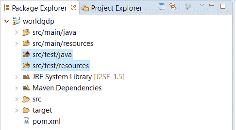

我们将使用 H2 数据库作为测试环境的源数据。为此，我们将更新我们的 Maven 依赖项以添加 H2 和 JUnit 依赖项。H2 是最受欢迎的嵌入式数据库之一。以下是你需要在你的 `pom.xml` 中添加的依赖项信息：

```java
<dependency>
    <groupId>org.springframework</groupId>
    <artifactId>spring-test</artifactId>
    <version>${spring.version}</version>
    <scope>test</scope>
</dependency>
<dependency>
    <groupId>junit</groupId>
    <artifactId>junit</artifactId>
    <version>${junit.version}</version>
    <scope>test</scope>
</dependency>
<dependency>
    <groupId>org.assertj</groupId>
    <artifactId>assertj-core</artifactId>
    <version>${assertj.version}</version>
    <scope>test</scope>
</dependency>
<dependency>
    <groupId>com.h2database</groupId>
    <artifactId>h2</artifactId>
    <version>${h2.version}</version>
</dependency>
```

我们已经有一个 `spring.version` 的属性，但我们需要为另外两个版本属性，如下面的代码所示：

```java
<junit.version>4.12</junit.version>
<assertj.version>3.12.0</assertj.version>
<h2.version>1.4.198</h2.version>
```

在 MySQL 中可用的 World DB 模式与 H2 不兼容，但请放心。与 H2 兼容的 World DB 模式可在本章的源代码中找到，您可以从 GitHub 下载（[`github.com/PacktPublishing/Spring-5.0-Projects/tree/master/chapter01`](https://github.com/PacktPublishing/Spring-5.0-Projects/tree/master/chapter01)）。它保存在项目的`src/test/resources`文件夹中。文件名为`h2_world.sql`。我们将使用此文件启动我们的 H2 数据库，其中包含所需的表和数据，然后这些数据将在我们的测试中可用。

接下来是配置 H2，我们配置的一项是包含模式和数据的 SQL 脚本文件的名称。此 SQL 脚本文件应在类路径上可用。以下是在`src/test/java`文件夹下的`com.nilangpatel.worldgdp.test.config`包中创建的配置类：

```java
@Configuration
public class TestDBConfiguration {

  @Bean
    public DataSource dataSource() {
        return new EmbeddedDatabaseBuilder()
            .generateUniqueName(true)
            .setType(EmbeddedDatabaseType.H2)
            .setScriptEncoding("UTF-8")
            .ignoreFailedDrops(true)
            .addScript("h2_world.sql")
            .build();
    }

  @Bean("testTemplate")
  public NamedParameterJdbcTemplate namedParamJdbcTemplate() {
    NamedParameterJdbcTemplate namedParamJdbcTemplate = 
        new NamedParameterJdbcTemplate(dataSource());
    return namedParamJdbcTemplate;
  }
}
```

除了 H2 配置外，我们还通过提供内置的其他方法中构建的 H2 数据源来初始化`NamedParameterJdbcTemplate`。

我们添加了一些特定于 JUnit 的其他依赖。您可以通过下载源代码来参考它们。

# 定义 RowMapper

由于我们使用 JDBC 模板，我们需要一种将数据库中的数据行映射到 Java 对象的方法。这可以通过实现`RowMapper`接口来实现。我们将为所有三个实体定义映射类。对于`Country`，原始映射类如下所示：

```java
public class CountryRowMapper implements RowMapper<Country>{

  public Country mapRow(ResultSet rs, int rowNum) 
                            throws SQLException {
    Country country = new Country();
    country.setCode(rs.getString("code"));
    country.setName(rs.getString("name"));
    country.setContinent(rs.getString("continent"));
    country.setRegion(rs.getString("region"));
    country.setSurfaceArea(rs.getDouble("surface_area"));
    country.setIndepYear(rs.getShort("indep_year"));
    country.setPopulation(rs.getLong("population"));
    country.setLifeExpectancy(rs.getDouble("life_expectancy"));
    country.setGnp(rs.getDouble("gnp"));
    country.setLocalName(rs.getString("local_name"));
    country.setGovernmentForm(rs.getString("government_form"));
    country.setHeadOfState(rs.getString("head_of_state"));
    country.setCode2(rs.getString("code2"));
    if ( Long.valueOf(rs.getLong("capital")) != null ) {
      City city = new City();
      city.setId(rs.getLong("capital"));
      city.setName(rs.getString("capital_name"));
      country.setCapital(city);
    }
    return country;
  }
}
```

然后我们定义`City`的映射类如下所示：

```java
public class CityRowMapper implements RowMapper<City>{
  public City mapRow(ResultSet rs, int rowNum) 
                    throws SQLException {
    City city = new City();
    city.setCountryCode(rs.getString("country_code"));
    city.setDistrict(rs.getString("district"));
    city.setId(rs.getLong("id"));
    city.setName(rs.getString("name"));
    city.setPopulation(rs.getLong("population"));
    return city;
  }
}
```

最后，我们定义`CountryLanguage`如下所示：

```java
public class CountryLanguageRowMapper implements 
                       RowMapper<CountryLanguage> {
  public CountryLanguage mapRow(ResultSet rs, int rowNum) 
                                 throws SQLException {
    CountryLanguage countryLng = new CountryLanguage();
    countryLng.setCountryCode(rs.getString("countrycode"));
    countryLng.setIsOfficial(rs.getString("isofficial"));
    countryLng.setLanguage(rs.getString("language"));
    countryLng.setPercentage(rs.getDouble("percentage"));
    return countryLng;
  }
}
```

# 设计 CountryDAO

让我们继续在`com.nilangpatel.worldgdp.dao`包中定义`CountryDAO`类，以及所需的方法，从`getCountries`方法开始。此方法将获取国家的详细信息以在列表页中显示。在过滤国家列表时也会调用此方法。基于列表、过滤和分页，我们将此方法中使用的查询拆分为以下部分：

1.  选择条件：

```java
private static final String SELECT_CLAUSE = "SELECT "
      + " c.Code, "
      + " c.Name, "
      + " c.Continent, "
      + " c.region, "
      + " c.SurfaceArea surface_area, "
      + " c.IndepYear indep_year, "
      + " c.Population, "
      + " c.LifeExpectancy life_expectancy, "
      + " c.GNP, "
      + " c.LocalName local_name, "
      + " c.GovernmentForm government_form, "
      + " c.HeadOfState head_of_state, "
      + " c.code2 ,"
      + " c.capital ,"
      + " cy.name capital_name "
      + " FROM country c"
      + " LEFT OUTER JOIN city cy ON cy.id = c.capital ";
```

1.  搜索条件：

```java
private static final String SEARCH_WHERE_CLAUSE = " AND ( LOWER(c.name) "
      + " LIKE CONCAT('%', LOWER(:search), '%') ) ";
```

1.  大洲过滤条件：

```java
private static final String CONTINENT_WHERE_CLAUSE = 
      " AND c.continent = :continent ";
```

1.  地区过滤条件：

```java
private static final String REGION_WHERE_CLAUSE = 
      " AND c.region = :region ";
```

1.  分页条件：

```java
private static final String PAGINATION_CLAUSE = " ORDER BY c.code "
      + " LIMIT :size OFFSET :offset ";
```

由`:<<variableName>>`定义的占位符将被`NamedParameterJdbcTemplate`中提供的`Map`中的值替换。这样我们可以避免将值连接到 SQL 查询中，从而避免 SQL 注入的风险。`getCountries()`的定义现在如下所示：

```java
public List<Country> getCountries(Map<String, Object> params){
    int pageNo = 1;
    if ( params.containsKey("pageNo") ) {
      pageNo = Integer.parseInt(params.get("pageNo").toString());
    }
    Integer offset = (pageNo - 1) * PAGE_SIZE;
    params.put("offset", offset);
    params.put("size", PAGE_SIZE);
    return namedParamJdbcTemplate.query(SELECT_CLAUSE
        + " WHERE 1 = 1 "
        + (!StringUtils.isEmpty((String)params.get("search")) 
            ? SEARCH_WHERE_CLAUSE : "")
        + (!StringUtils.isEmpty((String)params.get("continent")) 
            ? CONTINENT_WHERE_CLAUSE : "")
        + (!StringUtils.isEmpty((String)params.get("region")) 
            ? REGION_WHERE_CLAUSE : "")
        + PAGINATION_CLAUSE,
        params, new CountryRowMapper());
  }
```

接下来是实现`getCountriesCount`方法，它与`getCountries`类似，但返回匹配`WHERE`子句的条目数，而不应用分页。实现如下所示：

```java
public int getCountriesCount(Map<String, Object> params) {
  return namedParamJdbcTemplate.queryForObject(
          "SELECT COUNT(*) FROM country c" 
        + " WHERE 1 = 1 "
        + (!StringUtils.isEmpty((String)params.get("search")) 
            ? SEARCH_WHERE_CLAUSE : "")
        + (!StringUtils.isEmpty((String)params.get("continent")) 
            ? CONTINENT_WHERE_CLAUSE : "")
        + (!StringUtils.isEmpty((String)params.get("region")) 
            ? REGION_WHERE_CLAUSE : ""),
        params, Integer.class);
  }
```

然后我们实现`getCountryDetail`方法来获取给定代码的国家详细信息，如下所示：

```java
public Country getCountryDetail(String code) {
  Map<String, String> params = new HashMap<String, String>();
  params.put("code", code);

  return namedParamJdbcTemplate.queryForObject(SELECT_CLAUSE 
      +" WHERE c.code = :code", params, 
      new CountryRowMapper());
}
```

在所有之前的 DAO 方法实现中，我们使用了在*定义 RowMapper*部分中定义的`CountryRowMapper`。

最后，我们定义了一个允许编辑国家信息的方法，如下面的代码所示：

```java
public void editCountryDetail(String code, Country country) {
    namedParamJdbcTemplate.update(" UPDATE country SET "
        + " name = :name, "
        + " localname = :localName, "
        + " capital = :capital, "
        + " continent = :continent, "
        + " region = :region, "
        + " HeadOfState = :headOfState, "
        + " GovernmentForm = :governmentForm, "
        + " IndepYear = :indepYear, "
        + " SurfaceArea = :surfaceArea, "
        + " population = :population, "
        + " LifeExpectancy = :lifeExpectancy "
        + "WHERE Code = :code ", 
        getCountryAsMap(code, country));
  }
```

之前的方法使用一个辅助方法来构建一个`Map`对象，该方法通过使用`Country`对象中的数据。我们需要这个映射，因为我们将会将其用作`namedParamJdbcTemplate`的参数源。

辅助方法具有简单的实现方式，如下面的代码所示：

```java
private Map<String, Object> getCountryAsMap(String code, Country country){
    Map<String, Object> countryMap = new HashMap<String, Object>();
    countryMap.put("name", country.getName());
    countryMap.put("localName", country.getLocalName());
    countryMap.put("capital", country.getCapital().getId());
    countryMap.put("continent", country.getContinent());
    countryMap.put("region", country.getRegion());
    countryMap.put("headOfState", country.getHeadOfState());
    countryMap.put("governmentForm", country.getGovernmentForm());
    countryMap.put("indepYear", country.getIndepYear());
    countryMap.put("surfaceArea", country.getSurfaceArea());
    countryMap.put("population", country.getPopulation());
    countryMap.put("lifeExpectancy", country.getLifeExpectancy());
    countryMap.put("code", code);
    return countryMap;
}
```

让我们为`CountryDAO`类编写 JUnit 测试，我们还没有创建这个类。在`com.nilangpatel.worldgdp.test.dao`包中创建`CountryDAOTest`类，如下所示：

```java
@RunWith(SpringRunner.class)
@SpringJUnitConfig( classes = {
      TestDBConfiguration.class, CountryDAO.class})
public class CountryDAOTest {

  @Autowired CountryDAO countryDao;

  @Autowired @Qualifier("testTemplate")
  NamedParameterJdbcTemplate namedParamJdbcTemplate;

  @Before
  public void setup() {
    countryDao.setNamedParamJdbcTemplate(namedParamJdbcTemplate);
  }

  @Test
  public void testGetCountries() {
    List<Country> countries = countryDao.getCountries(new HashMap<>());
    //AssertJ assertions
    //Paginated List, so should have 20 entries
    assertThat(countries).hasSize(20);
  }

  @Test
  public void testGetCountries_searchByName() {
    Map<String, Object> params = new HashMap<>();
    params.put("search", "Aruba");
    List<Country> countries = countryDao.getCountries(params);
    assertThat(countries).hasSize(1);
  }

  @Test
  public void testGetCountries_searchByContinent() {
    Map<String, Object> params = new HashMap<>();
    params.put("continent", "Asia");
    List<Country> countries = countryDao.getCountries(params);

    assertThat(countries).hasSize(20);
  }

  @Test
  public void testGetCountryDetail() {
    Country c = countryDao.getCountryDetail("IND");
    assertThat(c).isNotNull();
    assertThat(c.toString()).isEqualTo("Country(code=IND, name=India, "
        + "continent=Asia, region=Southern and Central Asia, "
        + "surfaceArea=3287263.0, indepYear=1947, population=1013662000, "
        + "lifeExpectancy=62.5, gnp=447114.0, localName=Bharat/India, "
        + "governmentForm=Federal Republic, headOfState=Kocheril Raman Narayanan, "
        + "capital=City(id=1109, name=New Delhi, countryCode=null, "
        + "country=null, district=null, population=null), code2=IN)");
  }

  @Test public void testEditCountryDetail() {
    Country c = countryDao.getCountryDetail("IND");
    c.setHeadOfState("Ram Nath Kovind");
    c.setPopulation(1324171354l);
    countryDao.editCountryDetail("IND", c);

    c = countryDao.getCountryDetail("IND");
    assertThat(c.getHeadOfState()).isEqualTo("Ram Nath Kovind");
    assertThat(c.getPopulation()).isEqualTo(1324171354l);
  }

  @Test public void testGetCountriesCount() {
    Integer count = countryDao.getCountriesCount(Collections.EMPTY_MAP);
    assertThat(count).isEqualTo(239);
  }
}
```

在配置 JUnit 测试时，使用 Spring 测试框架需要注意以下几点，包括以下内容：

+   `@RunWith`用于用自定义测试运行器替换 JUnit 的测试运行器，在这种情况下，是 Spring 的`SpringRunner`。Spring 的测试运行器有助于将 JUnit 与 Spring 测试框架集成。

+   `@SpringJUnitConfig`用于提供包含所需配置的类列表，以满足运行测试的依赖项。

许多选择 ORM 框架的人可能会觉得编写像这样的复杂 SQL 查询很尴尬。然而，从下一章开始，我们将开始使用 Spring Data 框架与各种数据源进行交互；数据库是其中之一，我们将使用 Spring Data JPA 来访问。在这里，我们想展示 Spring JDBC 提供程序如何与数据库交互。

# 设计 CityDAO

以下是一些`com.nilangpatel.worldgdp.dao.CityDAO`类需要支持的重要操作：

+   获取一个国家的城市

+   根据给定的 ID 获取城市详细信息

+   向国家添加一个新城市

+   从国家中删除给定的城市

让我们继续实现这些功能，从`getCities`开始，如下所示：

```java
public List<City> getCities(String countryCode, Integer pageNo){
  Map<String, Object> params = new HashMap<String, Object>();
  params.put("code", countryCode);
  if ( pageNo != null ) {
    Integer offset = (pageNo - 1) * PAGE_SIZE;
    params.put("offset", offset);
    params.put("size", PAGE_SIZE);
  }

  return namedParamJdbcTemplate.query("SELECT "
      + " id, name, countrycode country_code, district, population "
      + " FROM city WHERE countrycode = :code"
      + " ORDER BY Population DESC"
      + ((pageNo != null) ? " LIMIT :offset , :size " : ""),
      params, new CityRowMapper());
}
```

我们正在使用分页查询来获取一个国家的城市列表。我们还需要这个方法的另一个重载版本，它将返回一个国家的所有城市，我们将使用这个查询来在编辑国家时选择其首都。重载版本如下：

```java
public List<City> getCities(String countryCode){
  return getCities(countryCode, null);
}
```

接下来是实现获取城市详细信息的方法，如下面的代码所示：

```java
public City getCityDetail(Long cityId) {
  Map<String, Object> params = new HashMap<String, Object>();
  params.put("id", cityId);
  return namedParamJdbcTemplate.queryForObject("SELECT id, "
      + " name, countrycode country_code, "
      + " district, population "
      + " FROM city WHERE id = :id", 
      params, new CityRowMapper());
}
```

然后我们按照以下方式实现添加城市的方法：

```java
public Long addCity(String countryCode, City city) {

  SqlParameterSource paramSource = new MapSqlParameterSource(
      getMapForCity(countryCode, city));
  KeyHolder keyHolder = new GeneratedKeyHolder();
  namedParamJdbcTemplate.update("INSERT INTO city("
      + " name, countrycode, "
      + " district, population) "
      + " VALUES (:name, :country_code, "
      + " :district, :population )", 
      paramSource, keyHolder);
  return keyHolder.getKey().longValue();
}
```

正如我们在添加国家时看到的，这也会使用一个辅助方法从`City`数据中返回一个`Map`，如下所示：

```java
private Map<String, Object> getMapForCity(String countryCode, City city){
  Map<String, Object> map = new HashMap<String, Object>();
  map.put("name", city.getName());
  map.put("country_code", countryCode);
  map.put("district", city.getDistrict());
  map.put("population", city.getPopulation());
  return map;
}
```

在`addCity`中需要注意的一个重要事项是使用`KeyHolder`和`GeneratedKeyHolder`来返回由自动递增生成的（作为`cityId`的）主键，如下所示：

```java
 KeyHolder keyHolder = new GeneratedKeyHolder();
 //other code
 return keyHolder.getKey().longValue();
```

最后，我们实现从国家中删除城市的方法，如下面的代码所示：

```java
public void deleteCity(Long cityId) {
  Map<String, Object> params = new HashMap<String, Object>();
  params.put("id", cityId);
  namedParamJdbcTemplate.update("DELETE FROM city WHERE id = :id", params);
}
```

现在让我们为`CityDAO`添加一个测试。在`src/test/java`文件夹下的`com.nilangpatel.worldgdp.test.dao`包中添加`CityDAOTest`类，如下所示：

```java
@RunWith(SpringRunner.class)
@SpringJUnitConfig( classes = {
  TestDBConfiguration.class, CityDAO.class})
public class CityDAOTest {

  @Autowired CityDAO cityDao;

  @Autowired @Qualifier("testTemplate")
  NamedParameterJdbcTemplate namedParamJdbcTemplate;

  @Before
  public void setup() {
    cityDao.setNamedParamJdbcTemplate(namedParamJdbcTemplate);
  }

  @Test public void testGetCities() {
    List<City> cities = cityDao.getCities("IND", 1);
    assertThat(cities).hasSize(10);
  }

  @Test public void testGetCityDetail() {
    Long cityId = 1024l;
    City city = cityDao.getCityDetail(cityId);
    assertThat(city.toString()).isEqualTo("City(id=1024, name=Mumbai (Bombay), "
      + "countryCode=IND, country=null, district=Maharashtra, population=10500000)");
  }

  @Test public void testAddCity() {
    String countryCode = "IND";
    City city = new City();
    city.setCountryCode(countryCode);
    city.setDistrict("District");
    city.setName("City Name");
    city.setPopulation(101010l);

    long cityId = cityDao.addCity(countryCode, city);
    assertThat(cityId).isNotNull();
    City cityFromDb = cityDao.getCityDetail(cityId);
    assertThat(cityFromDb).isNotNull();
    assertThat(cityFromDb.getName()).isEqualTo("City Name");
  }

  @Test (expected = EmptyResultDataAccessException.class)
  public void testDeleteCity() {
    Long cityId = addCity();
    cityDao.deleteCity(cityId);
    City cityFromDb = cityDao.getCityDetail(cityId);
    assertThat(cityFromDb).isNull();
  }

  private Long addCity() {
    String countryCode = "IND";
    City city = new City();
    city.setCountryCode(countryCode);
    city.setDistrict("District");
    city.setName("City Name");
    city.setPopulation(101010l);

    return cityDao.addCity(countryCode, city);
  }
}
```

# 设计 CountryLanguageDAO

我们需要公开以下 API 来与`countrylanguage`表交互：

+   获取给定国家代码的语言列表

+   通过检查该语言是否已存在来为某个国家添加一种新语言

+   删除某个国家的语言

为了保持简洁，我们将展示涵盖这三个场景的方法实现。完整的代码可以在本书下载的代码中的 `com.nilangpatel.worldgdp.dao.CountryLanguageDAO` 类中找到。以下是为这些方法实现编写的代码：

```java
public List<CountryLanguage> getLanguages(String countryCode, Integer pageNo){
  Map<String, Object> params = new HashMap<String, Object>();
  params.put("code", countryCode);

  Integer offset = (pageNo - 1) * PAGE_SIZE;
  params.put("offset", offset);
  params.put("size", PAGE_SIZE);

  return namedParamJdbcTemplate.query("SELECT * FROM countrylanguage"
      + " WHERE countrycode = :code"
      + " ORDER BY percentage DESC "
      + " LIMIT :size OFFSET :offset ", 
      params, new CountryLanguageRowMapper());
}

public void addLanguage(String countryCode, CountryLanguage cl) {
  namedParamJdbcTemplate.update("INSERT INTO countrylanguage ( "
      + " countrycode, language, isofficial, percentage ) "
      + " VALUES ( :country_code, :language, "
      + " :is_official, :percentage ) ", 
      getAsMap(countryCode, cl));
}

public boolean languageExists(String countryCode, String language) {
  Map<String, Object> params = new HashMap<String, Object>();
  params.put("code", countryCode);
  params.put("lang", language);

  Integer langCount = namedParamJdbcTemplate.queryForObject(
    "SELECT COUNT(*) FROM countrylanguage"
    + " WHERE countrycode = :code "
    + " AND language = :lang", params, Integer.class);
  return langCount > 0;
}

public void deleteLanguage (String countryCode, String language ) {
  Map<String, Object> params = new HashMap<String, Object>();
  params.put("code", countryCode);
  params.put("lang", language);
  namedParamJdbcTemplate.update("DELETE FROM countrylanguage "
      + " WHERE countrycode = :code AND "
      + " language = :lang ", params);
}

private Map<String, Object> getAsMap(String countryCode, CountryLanguage cl){
  Map<String, Object> map = new HashMap<String, Object>();
  map.put("country_code", countryCode);
  map.put("language", cl.getLanguage());
  map.put("is_official", cl.getIsOfficial());
  map.put("percentage", cl.getPercentage());
  return map;
}
```

# 设计世界银行 API 的客户端

我们需要从 WorldBank API 获取 GDP 数据。正如我们讨论的那样，这是一个 REST 端点，我们必须发送一些参数并获取响应。为此，我们将使用 RestTemplate 来进行 REST 调用。以下是对 `com.packt.external.WorldBankApiClient` 类的定义，该类用于调用世界银行 API 并处理其响应以返回 `List<CountryGDP>`：

```java
@Service
public class WorldBankApiClient {

  String GDP_URL = "http://api.worldbank.org/countries/%s/indicators/NY.GDP.MKTP.CD?"
      + "format=json&date=2008:2018";

  public List<CountryGDP> getGDP(String countryCode) throws ParseException {
    RestTemplate worldBankRestTmplt = new RestTemplate();
    ResponseEntity<String> response
      = worldBankRestTmplt.getForEntity(String.format(GDP_URL, countryCode), String.class);

    //the second element is the actual data and its an array of object
    JSONParser parser = new JSONParser();
    JSONArray responseData = (JSONArray) parser.parse(response.getBody()); 
    JSONArray countryDataArr = (JSONArray) responseData.get(1);

    List<CountryGDP> data = new ArrayList<CountryGDP>();
    JSONObject countryDataYearWise=null;
    for (int index=0; index < countryDataArr.size(); index++) {
      countryDataYearWise = (JSONObject) countryDataArr.get(index);

      String valueStr = "0";
      if(countryDataYearWise.get("value") !=null) {
        valueStr = countryDataYearWise.get("value").toString();
      }
      String yearStr = countryDataYearWise.get("date").toString();
      CountryGDP gdp = new CountryGDP();
      gdp.setValue(valueStr != null ? Double.valueOf(valueStr) : null);
      gdp.setYear(Short.valueOf(yearStr));
      data.add(gdp);
    }
    return data;
  }
}
```

# 定义 API 控制器

到目前为止，我们已经编写了与数据库交互的代码。接下来是编写控制器代码。我们将有两种类型的控制器——一种返回视图名称（在我们的案例中是 Thymeleaf 模板）并在模型对象中填充视图数据，另一种公开 RESTful API。我们需要在 `pom.xml` 中添加以下依赖项：

```java
<dependency>
    <groupId>org.springframework</groupId>
    <artifactId>spring-webmvc</artifactId>
    <version>${spring.version}</version>
</dependency>
```

将 `spring-webmvc` 添加到依赖项中会自动包含 `spring-core`、`spring-beans` 和 `spring-context` 依赖项。因此，我们可以从 `pom.xml` 中移除它们。

# 使用 @EnableWebMvc 启用 Web MVC

为了能够使用 Spring MVC 功能，我们需要一个被注解为 `@Configuration` 的类，并注解为 `@EnableWebMvc`。`@EnableWebMvc` 注解从 Spring MVC 框架中的 `WebMvcConfigurationSupport` 类导入 Spring MVC 相关配置。如果我们需要覆盖任何默认导入的配置，我们必须实现 Spring MVC 框架中存在的 `WebMvcConfigurer` 接口并覆盖所需的方法。

我们将创建一个 `AppConfiguration` 类，其定义如下：

```java
@EnableWebMvc
@Configuration
@ComponentScan(basePackages = "com.nilangpatel.worldgdp")
public class AppConfiguration implements WebMvcConfigurer{

  @Override
  public void addResourceHandlers(ResourceHandlerRegistry registry) {
    registry.addResourceHandler("/static/**").addResourceLocations("/static/");
  }
}
```

在之前的配置中，以下是一些需要注意的重要事项：

+   `@EnableWebMvc`：此注解导入与 Spring MVC 相关的配置。

+   `@ComponentScan`：此注解用于声明需要扫描以查找 Spring 组件（可以是 `@Configuration`、`@Service`、`@Controller`、`@Component` 等）的包。如果没有定义任何包，则从定义类的包开始扫描。

+   `WebMvcConfigurer`：我们将实现此接口以覆盖之前代码中看到的某些默认 Spring MVC 配置。

# 配置部署到 Tomcat 而不使用 web.xml

由于我们将部署应用程序到 Tomcat，我们需要向应用程序服务器提供 servlet 配置。我们将在单独的部分中查看如何部署到 Tomcat，但现在我们将查看 Java 配置，这对于部署到 Tomcat 或任何应用程序服务器都是足够的，无需额外的`web.xml`。以下给出了 Java 类定义：

```java
public class WorldApplicationInitializer extends
  AbstractAnnotationConfigDispatcherServletInitializer {

  @Override
  protected Class<?>[] getRootConfigClasses() {
    return null;
  }
  @Override
  protected Class<?>[] getServletConfigClasses() {
    return new Class[] {AppConfiguration.class};
  }
  @Override
  protected String[] getServletMappings() {
    return new String[] { "/" };
  }
}
```

`AbstractAnnotationConfigDispatcherServletInitializer`抽象类是实现`WebApplicationInitializer`接口的，用于注册 Spring 的`DispatcherServlet`实例，并使用其他`@Configuration`类来配置`DispatcherServlet`。

我们只需要重写`getRootConfigClasses()`, `getServletConfigClasses()`, 和 `getServletMappings()`方法。前两个方法指向需要加载到 servlet 上下文中的配置类，最后一个方法用于为`DispatcherServlet`提供 servlet 映射。

`DispatcherServlet`遵循前端控制器模式，其中有一个注册的 servlet 用于处理所有 web 请求。这个 servlet 使用`RequestHandlerMapping`并根据映射到实现的 URL 调用相应的实现。

我们需要对 Maven WAR 插件进行少量更新，以便在没有找到`web.xml`时不会失败。这可以通过更新`pom.xml`文件中的`<plugins>`标签来实现，如下所示：

```java
<build>
  <finalName>worldgdp</finalName>
  <plugins>
    <plugin>
      <groupId>org.apache.maven.plugins</groupId>
      <artifactId>maven-war-plugin</artifactId>
      <executions>
        <execution>
          <id>default-war</id>
          <phase>prepare-package</phase>
          <configuration>
            <failOnMissingWebXml>false</failOnMissingWebXml>
          </configuration>
        </execution>
      </executions>
    </plugin>
  </plugins>
</build>
```

现在我们已经准备好实现我们的控制器了。一旦我们实现了所有的 RESTful API 控制器，我们将向您展示如何部署到 Tomcat。

# 定义国家资源的 RESTful API 控制器

让我们定义针对国家资源的 RESTful API 控制器。以下是对应的控制器模板：

```java
@RestController
@RequestMapping("/api/countries")
@Slf4j
public class CountryAPIController {

  @Autowired CountryDAO countryDao;
  @Autowired WorldBankApiClient worldBankApiClient;

  @GetMapping
  public ResponseEntity<?> getCountries(
    @RequestParam(name="search", required = false) String searchTerm,
    @RequestParam(name="continent", required = false) String continent,
    @RequestParam(name="region", required = false) String region,
    @RequestParam(name="pageNo", required = false) Integer pageNo
  ){
    //logic to fetch contries from CountryDAO
    return ResponseEntity.ok();
  }

  @PostMapping(value = "/{countryCode}", 
      consumes = {MediaType.APPLICATION_JSON_VALUE})
  public ResponseEntity<?> editCountry(
    @PathVariable String countryCode, @Valid @RequestBody Country country ){
    //logic to edit existing country 
    return ResponseEntity.ok();
  }

  @GetMapping("/{countryCode}/gdp")
  public ResponseEntity<?> getGDP(@PathVariable String countryCode){
    //logic to get GDP by using external client
    return ResponseEntity.ok();
  }

}
```

以下是从之前的代码中需要注意的一些事项：

+   `@RestController`：这个注解用于将一个类标注为控制器，其中每个 RESTful 方法都返回响应体中的数据。

+   `@RequestMapping`：这个用于分配访问资源的根 URL。

+   `@GetMapping`和`@PostMapping`：这些用于分配将用于调用资源的 HTTP 动词。资源的 URL 在注解中传递，包括其他请求头，这些请求头用于消费和产生信息。

让我们按顺序实现每个方法，从`getCountries()`开始，如下所示：

```java
@GetMapping
public ResponseEntity<?> getCountries(
  @RequestParam(name="search", required = false) String searchTerm,
  @RequestParam(name="continent", required = false) String continent,
  @RequestParam(name="region", required = false) String region,
  @RequestParam(name="pageNo", required = false) Integer pageNo
){
  try {
    Map<String, Object> params = new HashMap<String, Object>();
    params.put("search", searchTerm);
    params.put("continent", continent);
    params.put("region", region);
    if ( pageNo != null ) {
      params.put("pageNo", pageNo.toString());
    }

    List<Country> countries = countryDao.getCountries(params);
    Map<String, Object> response = new HashMap<String, Object>();
    response.put("list", countries);
    response.put("count", countryDao.getCountriesCount(params));
    return ResponseEntity.ok(response);
  }catch(Exception ex) {
    log.error("Error while getting countries", ex);
    return ResponseEntity.status(HttpStatus.INTERNAL_SERVER_ERROR)
          .body("Error while getting countries");
  }
}
```

以下是从之前的代码中需要注意的一些事项：

+   `@RequestParam`：这个注解用于声明控制器端点接受的请求参数。参数可以提供默认值，也可以设置为必填。

+   `ResponseEntity`：这个类用于返回响应体，以及其他响应参数，如状态、头信息等。

接下来是编辑国家详情的 API，如下所示：

```java
@PostMapping("/{countryCode}")
public ResponseEntity<?> editCountry(
  @PathVariable String countryCode, @Valid @RequestBody Country country ){
  try {
    countryDao.editCountryDetail(countryCode, country);
    Country countryFromDb = countryDao.getCountryDetail(countryCode);
    return ResponseEntity.ok(countryFromDb);
  }catch(Exception ex) {
    log.error("Error while editing the country: {} with data: {}", 
       countryCode, country, ex);
    return ResponseEntity.status(HttpStatus.INTERNAL_SERVER_ERROR)
        .body("Error while editing the country");
  }
}
```

以下是从之前的代码实现中需要注意的一些事项：

+   `@PathVariable`：这用于声明任何需要成为控制器端点 URL 路径一部分的变量。在我们的情况下，我们希望国家代码成为 URL 的一部分。因此，URL 将采用`/api/countries/IND`的形式。

+   `@Valid`：这触发了 Bean Validation API 来检查每个类属性的约束。如果客户端的数据无效，它将返回 400。

+   `@RequestBody`：这用于捕获请求体中发送的数据，并使用`Jackson`库将请求体中的 JSON 数据转换为相应的 Java 对象。

API 的其他实现可以在`CountryAPIController`类中找到。API 控制器的测试可以在`CountryAPIControllerTest`类中找到，这些类都包含在此书的源代码中。

# 定义城市资源的 RESTful API 控制器

对于城市资源，我们需要以下 API：

+   获取给定国家的城市

+   向国家添加一个新城市

+   从国家中删除城市

此控制器的代码可以在`CityAPIController`类中找到，API 控制器的测试可以在`CityAPIControllerTest`类中找到，这些类都包含在此书的源代码中。

# 定义国家语言资源的 RESTful API 控制器

对于`CountryLanguage`资源，我们需要以下 API：

+   获取一个国家的语言

+   为一个国家添加一种语言

+   从国家中删除一种语言

此控制器的代码可以在`CountryLanguageAPIController`类中找到，API 控制器的测试可以在`CountryLanguageAPIControllerTest`类中找到，这些类都包含在此书的源代码中。

# 部署到 Tomcat

在我们开始处理视图的视图和控制器之前，我们将把到目前为止开发的程序部署到 Tomcat。您可以从这里下载 Tomcat 8.5（[`tomcat.apache.org/download-80.cgi`](https://tomcat.apache.org/download-80.cgi)）。安装就像将 ZIP/TAR 文件提取到您的文件系统中一样简单。

让我们在 Tomcat 中创建一个用户`admin`和`manager-gui`角色。为此，需要编辑`apache-tomcat-8.5.23/conf/tomcat-users.xml`并添加以下行：

```java
<role rolename="manager-gui" />
<user username="admin" password="admin" roles="manager-gui" />
```

启动 Tomcat 很简单，如下所示：

1.  导航到`apache-tomcat-8.5.23/bin`

1.  运行`startup.bat`

导航到`http://localhost:8080/manager/html`，输入`admin`作为用户名，`admin`作为密码，以便能够查看 Tomcat 的管理控制台。页面初始部分将列出当前实例中部署的应用程序，页面后部将找到上传 WAR 文件以部署应用程序的选项，如下面的截图所示：

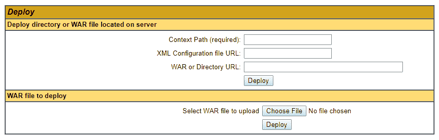

我们可以上传运行`mvn package`后生成的 WAR 文件，或者更新 Tomcat 实例的`server.xml`以引用项目的目标目录，以便能够自动部署。后一种方法可用于开发，而前一种 WAR 部署方法可用于生产。

在一个生产系统中，你可以让持续部署服务器生成一个 WAR 文件并部署到远程的 Tomcat 实例。在这种情况下，我们将使用更新 Tomcat 配置的后一种方法。你必须在位于`TOMCAT_HOME/conf/server.xml`的 Tomcat 的`server.xml`文件中添加以下代码行：

```java
<Context path="/world" docBase="<<Directory path where you keep WAR file>>" 
          reloadable="true" />
```

前面的行必须添加到`<Host></Host>`标签之间。或者，你也可以在你的 IDE（例如 Eclipse）中配置 Tomcat，这对于开发来说更方便。我们将使用 Maven 构建项目，但在那之前，请将以下配置添加到`pom.xml`的`<properties></properties>`部分：

```java
<maven.compiler.target>1.8</maven.compiler.target>
<maven.compiler.source>1.8</maven.compiler.source>
```

这将确保在通过命令行使用 Maven 构建（打包）应用程序时选择正确的 Java 编译器版本。接下来是使用`mvn package`构建项目，并使用`TOMCAT_HOME/bin/startup.bat`运行 Tomcat，一旦服务器启动，你可以在浏览器中访问 API `http://localhost:8080/worldgdp/api/countries`，以查看以下输入：

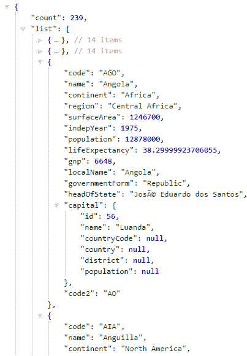

# 定义视图控制器

我们将有一个视图控制器，`ViewController.java`定义在`com.nilangpatel.worldgdp.controller.view`中。视图控制器将负责填充视图模板所需的数据，并将 URL 映射到相应的视图模板。

我们将使用 Thymeleaf ([www.thymeleaf.org](https://www.thymeleaf.org/)) 作为服务器端模板引擎，并使用 Mustache.js ([`github.com/janl/mustache.js`](https://github.com/janl/mustache.js)) 作为我们的客户端模板引擎。使用客户端模板引擎的优势在于，任何以 JSON 形式异步加载的数据都可以通过生成 HTML 轻松添加到 DOM 中。我们将在第三章中进一步探讨 Thymeleaf 和 Mustache.js，*Blogpress – 一个简单的博客管理系统*。

使用 Vue.js、React.js、Angular.js 等框架有更好的方法来做这件事。我们将在下一节查看视图模板。让我们继续讨论视图控制器。视图控制器应该映射以下场景的正确视图模板和数据：

+   国家列表

+   查看国家详情

+   编辑国家详情

让我们看看以下`ViewController`类的骨架结构定义：

```java
@Controller
@RequestMapping("/")
public class ViewController {

  @Autowired CountryDAO countryDao;
  @Autowired LookupDAO lookupDao;
  @Autowired CityDAO cityDao;

  @GetMapping({"/countries", "/"})
  public String countries(Model model, 
    @RequestParam Map<String, Object> params
  ) {
    //logic to fetch country list
    return "countries";
  }

  @GetMapping("/countries/{code}")
  public String countryDetail(@PathVariable String code, Model model) {
    //Logic to Populate the country detail in model
    return "country";
  }

  @GetMapping("/countries/{code}/form")
  public String editCountry(@PathVariable String code, 
    Model model) {
    //Logic to call CountryDAO to update the country
    return "country-form";
  }
}
```

以下是从上一段代码中的一些重要事项：

+   `@Controller`：此注解用于声明一个控制器，可以返回要渲染的视图模板名称，以及返回响应体中的 JSON/XML 数据。

+   `@ResponseBody`：当此注解存在于控制器的方法上时，表示该方法将返回响应体中的数据，因此 Spring 不会使用视图解析器来解析要渲染的视图。`@RestController` 注解默认将其添加到所有方法上。

+   `Model`：此实例用于传递构建视图所需的数据。

在列出国家时，服务器端使用 Thymeleaf 模板引擎渲染完整的 HTML，因此我们需要获取请求参数，如果 URL 中存在，并获取一个过滤和分页的国家列表。我们还需要填充查找数据，即 `<select>` 控件的数据，这些控件将用于过滤数据。让我们看看它的实现如下：

```java
@GetMapping({"/countries", "/"})
public String countries(Model model, 
  @RequestParam Map<String, Object> params
) {
  model.addAttribute("continents", lookupDao.getContinents());
  model.addAttribute("regions", lookupDao.getRegions());
  model.addAttribute("countries", countryDao.getCountries(params));
  model.addAttribute("count", countryDao.getCountriesCount(params));

  return "countries";
}
```

之前的代码相当简单。我们使用 DAO 类将所需数据填充到 `Model` 实例中，然后返回视图名称，在这种情况下是 `countries`。同样，其余的方法实现可以在 `ViewController` 控制器类中找到。

# 定义视图模板

我们将使用 Thymeleaf 模板引擎来处理服务器端模板。Thymeleaf 提供了各种方言和条件块来渲染静态 HTML 中的动态内容。让我们看看 Thymeleaf 的简单语法元素，如下所示：

```java
<!-- Dynamic content in HTML tag -->
<div class="alert alert-info">[[${country.name}]]</div>

<!-- Dynamic attributes -->
<span th:class="|alert ${error ? 'alert-danger': _}|">[[${errorMsg}]]</span>

<!-- Looping -->
<ol>
  <li th:each="c : ${countries}">
     [[${c.name}]]
  </li>
</ol>

<!-- Conditionals -->
<div class="alert alert-warning" th:if="${count == 0}">No results found</div>

<!-- Custom attributes -->
<div th:attr="data-count=${count}"></div>

<!-- Form element value -->
<input type="text" th:value="${country.name}" name="name" />
```

从之前的示例中，我们可以观察到 Thymeleaf 要评估的项目前面带有 `th:` 前缀，并且可以在标签之间渲染任何内容，可以使用 `th:text` 或 `[[${variable}]]`。后者语法是在 Thymeleaf 3 中引入的。这是一个非常简短的入门，因为深入探讨 Thymeleaf 超出了本书的范围。可以在 [`www.thymeleaf.org/doc/tutorials/3.0/usingthymeleaf.html`](http://www.thymeleaf.org/doc/tutorials/3.0/usingthymeleaf.html) 找到解释模板不同部分的美丽指南。

# 配置 Thymeleaf 模板引擎

为了使用 Thymeleaf 模板引擎与 Spring MVC，我们需要进行一些配置，其中我们设置 Thymeleaf 模板引擎并更新 Spring 的视图解析器以使用模板引擎解析任何视图。在继续之前，我们需要在 `pom.xml` 中定义所需的依赖项如下：

```java
    <dependency>
      <groupId>org.thymeleaf</groupId>
      <artifactId>thymeleaf-spring5</artifactId>
      <version>${thymeleaf.version}</version>
    </dependency>
    <dependency>
      <groupId>nz.net.ultraq.thymeleaf</groupId>
      <artifactId>thymeleaf-layout-dialect</artifactId>
      <version>${thymeleaf-layout-dialect.version}</version>
    </dependency>
```

让我们按顺序定义配置视图解析器，首先设置模板解析器如下：

```java
@Bean
public ClassLoaderTemplateResolver templateResolver() {
  ClassLoaderTemplateResolver templateResolver 
     = new ClassLoaderTemplateResolver();
  templateResolver.setPrefix("templates/");
  templateResolver.setSuffix(".html");
  templateResolver.setTemplateMode(TemplateMode.HTML);
  templateResolver.setCacheable(false);
  return templateResolver;
}
```

之前的配置设置了模板位置，模板引擎将使用它来解析模板文件。接下来是定义模板引擎，它将使用 `SpringTemplateEngine` 和之前定义的模板解析器，如下所示：

```java
@Bean
public SpringTemplateEngine templateEngine() {
  SpringTemplateEngine templateEngine = new SpringTemplateEngine();
  templateEngine.setTemplateResolver(templateResolver());
  templateEngine.addDialect(new LayoutDialect());
  return templateEngine;
}
```

在之前的配置中，我们使用了由*Emanuel Rabina*创建的 Thymeleaf 布局方言([`github.com/ultraq/thymeleaf-layout-dialect`](https://github.com/ultraq/thymeleaf-layout-dialect))。这个布局方言帮助我们创建一个视图装饰器框架，其中所有模板都将被基本模板装饰，而装饰后的模板只需提供完成页面的必要内容。因此，所有的页眉、页脚、CSS、脚本和其他常见 HTML 都可以放在基本模板中。这在很大程度上防止了冗余。在我们的示例应用中，位于`worldgdp/src/main/resources/templates`的`base.html`文件是其他模板使用的基本模板。

接下来是定义一个 Thymeleaf 视图解析器，该解析器将覆盖 Spring 的默认视图解析器，如下所示：

```java
@Bean
public ViewResolver viewResolver() {
  ThymeleafViewResolver viewResolver = new ThymeleafViewResolver();
  viewResolver.setTemplateEngine(templateEngine());
  viewResolver.setCharacterEncoding("UTF-8");
  return viewResolver;
}
```

之前的配置可以在`com.packt.config.ViewConfiguration`类中找到。

# 管理静态资源

如果你回顾一下`com.nilangpatel.worldgdp.AppConfiguration`类，你会看到我们已经覆盖了`WebMvcConfigurer`接口的`addResourceHandlers`方法。在下面的代码中显示的方法实现中，我们将静态资源前缀 URL `/static/**`映射到`webapp`目录中的静态资源位置`/static/`：

```java
@Override
public void addResourceHandlers(ResourceHandlerRegistry registry) {
  registry.addResourceHandler("/static/**")
    .addResourceLocations("/static/");
}
```

我们在项目的`/src/main/webapp/static`文件夹中添加了一些静态资源（CSS 和 JavaScript）。请下载本章的代码，并对照它们进行参考。

# 创建基本模板

我们之前提到，我们将使用 Thymeleaf 布局方言来创建一个基本模板，并使用基本模板来装饰所有其他模板。基本模板将包含所有的 CSS 链接、JavaScript 源文件链接、页眉和页脚，如下面的代码所示：

```java
<!DOCTYPE html>
<html 

  >
  <head>

    <title layout:title-pattern="$CONTENT_TITLE - $LAYOUT_TITLE">World In Numbers</title>
    <meta name="description" content=""/>
    <meta http-equiv="Content-Type" content="text/html; charset=UTF-8" />
    <!-- Include all the CSS links -->
  </head>

  <body>
    <nav class="navbar navbar-expand-lg navbar-dark bg-primary">
      <a class="navbar-brand" href="#">WORLD IN NUMBERS</a>
      <div class="collapse navbar-collapse" id="navbarColor01">
          <ul class="navbar-nav mr-auto">
          <li class="nav-item active">
            <a class="nav-link" th:href="@{/countries}">Countries</a>
          </li>
        </ul>
      </div>
    </nav>
    <div class="container">
      <div class="content">
        <div layout:fragment="page_content">
          <!-- Placeholder for content -->
        </div>

      </div>
    </div>

    <div class="modal" id="worldModal" >
    </div>
    <footer id="footer"></footer>
    <!-- /.container -->

    <!-- Include all the Javascript source files -->
    <th:block layout:fragment="scripts">
      <!-- Placeholder for page related javascript -->
    </th:block>
  </body>

</html>

```

以下模板的两个主要重要部分如下：

+   `<div layout:fragment="page_content"></div>`：使用基本模板作为装饰器的其他模板将在这一部分提供它们的 HTML。Thymeleaf 布局方言在运行时将基本模板的内容装饰到这个 HTML 上。

+   `<th:block layout:fragment="scripts"></th:block>`：类似于之前的 HTML 内容，任何特定页面的 JavaScript 或指向特定 JavaScript 源文件的链接都可以添加到这一部分。这有助于将特定页面的 JavaScript 隔离在其自己的页面上。

任何想要将基本模板用作装饰器的模板，需要在`<html>`标签中声明此属性，`layout:decorate="~{base}"`。我们不会深入到单个模板的内容，因为它们主要是 HTML。所有模板都可以在位置`worldgdp/src/main/resources/templates`找到。我们有三个模板：

+   `countries.html`：这是用于显示带有过滤和分页的国家列表

+   `country-form.html`：这是用于编辑一个国家的详细信息

+   `country.html`：这是用于显示一个国家的详细信息

# 记录配置

在我们深入到开发应用程序的其他步骤之前，定义一个日志级别和格式是一个好的实践。然而，打印日志以期望的格式，并带有各种日志级别，这是一个可选但良好的实践。为此，添加一个名为`logback.xml`的 XML 文件，其中包含以下内容：

```java
<?xml version="1.0" encoding="UTF-8"?>
<configuration>
  <appender name="STDOUT" class="ch.qos.logback.core.ConsoleAppender">
    <layout class="ch.qos.logback.classic.PatternLayout">
      <Pattern>
        %d{yyyy-MM-dd HH:mm:ss} [%thread] %-5level %logger{36} - %msg%n
      </Pattern>
    </layout>
  </appender>
  <logger name="com.nilangpatel.worldgdp" level="debug" additivity="false">
    <appender-ref ref="STDOUT" />
  </logger>
  <root level="debug">
    <appender-ref ref="STDOUT" />
  </root>
</configuration>
```

Logback 作为流行的 Log4j 项目的继任者被开发出来，并用作 Java 应用程序的日志框架。此配置定义了模式以及日志级别。要启用应用程序中的 logback，您需要在`pom.xml`中添加以下依赖项：

```java
  <dependency>
      <groupId>ch.qos.logback</groupId>
      <artifactId>logback-classic</artifactId>
      <version>${logback.version}</version>
  </dependency>
  <dependency>
      <groupId>ch.qos.logback</groupId>
      <artifactId>logback-core</artifactId>
      <version>${logback.version}</version>
  </dependency>
```

# 运行应用程序

由于我们已经配置了 Tomcat 的部署，你现在应该有应用程序正在运行。你始终可以下载本书的源代码；在`worldgdp`文件夹下找到源代码。下载后，你必须使用以下方式使用 Maven 构建它：

```java
$ mvn package 
```

上述命令将运行测试。位于`target`目录中的 WAR 文件`worldgdp.war`可以通过 Manager 应用程序上传到 Tomcat，或者复制到`TOMCAT_HOME/webapps`文件夹。然后 Tomcat 将展开存档并部署应用程序。

以下是一些应用程序运行时的截图，从列表页面开始：

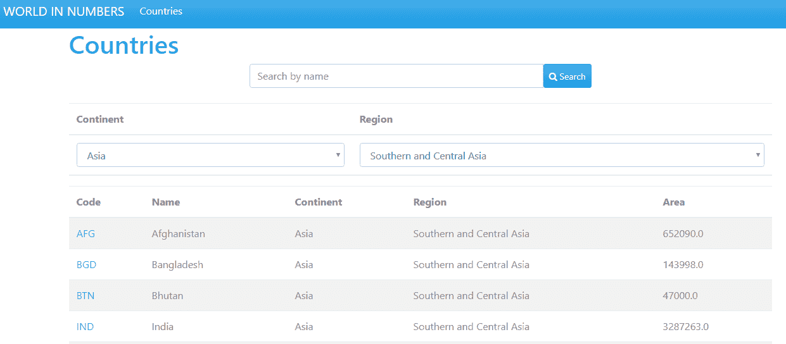

接下来是显示国家详细信息的页面：

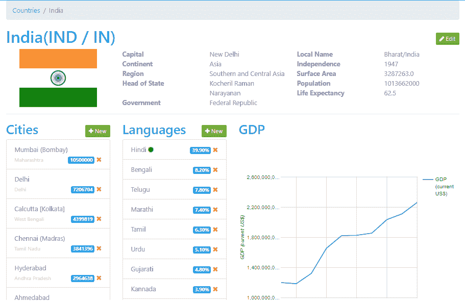

用于编辑国家详细信息的表单如下截图所示：

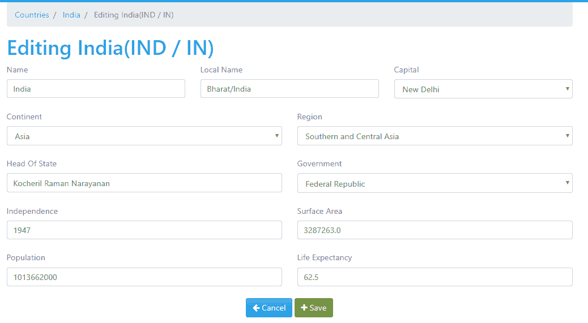

然后，我们有用于向国家添加新城市的弹出窗口，如下截图所示：

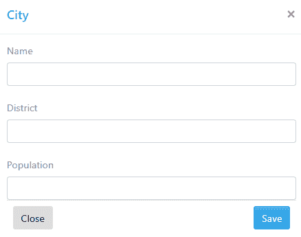

同样，我们还有一个用于添加新国家语言的弹出窗口，如下所示：

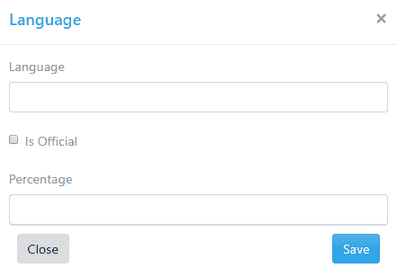

# 摘要

本章旨在启动您使用 Spring 框架的工作。我们从从头创建项目结构和设计视图模板开始，涵盖了构建基于 Spring 的 Web 应用程序的各种技术和工具。

详细了解概念进行更多动手练习始终是一个好的实践。接下来，你可以考虑通过采用一些其他世界银行 API 来进一步增强应用程序。在本章中，我们已经使用自己的方式配置了大部分内容。

然而，Spring 提供了一个名为**Spring Boot**的工具，它真的有助于以自动化的方式完成大部分配置，让你可以专注于开发应用程序。在随后的章节中，我们将更详细地探讨如何使用 Spring Boot 在 Spring 中开发 Web 应用程序。

在下一章中，我们将探讨 Spring 框架中名为响应式编程的另一个重要特性，使用 WebFlux 来实现。我们将学习响应式范式的基础知识，了解其优势，并探索各种响应式库。Spring 使用`Reactor`——一个提供响应式流实现以开发基于 Web 应用的库。因此，准备好在第二章中探索所有这些新颖且令人兴奋的主题吧。
