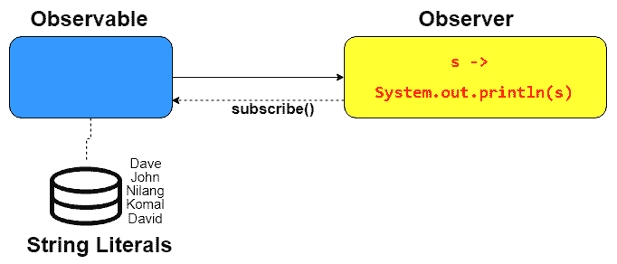

# 构建响应式 Web 应用程序

我们在第一章中通过探索 Spring 框架及其模块系统的一些基础知识开始了我们的旅程，第一章，“创建一个列出世界国家和其 GDP 的应用程序”。现在，让我们暂时放下 Spring 框架的所有新和高级主题，在本章中，我们将探讨最受欢迎的主题之一：通过采用响应式范式来创建高度可扩展和响应式的应用程序。

技术世界正在从阻塞、同步和线程驱动实现迁移到非阻塞、异步和基于事件的系统，这些系统具有弹性，能够以一致的反应时间管理非常大的数据量。这是响应式系统解决的核心问题。

从编程模型的角度来看，响应式编程影响了从命令式风格到异步逻辑声明式组合的范式转变。Spring 框架通过从版本 5 开始将响应式流的能力纳入其核心框架来实现这一点。

在本章中，我们将从以下令人兴奋的维度和角度讨论和探索响应式编程：

+   什么是响应式系统

+   响应式编程简介

+   响应式编程的基本知识、优势和特性

+   Java 中的响应式编程

+   WebFlux 简介

+   Spring 对响应式编程的支持

+   使用 WebFlux 在响应式编程中的函数式工作方式

+   响应式范式中的 WebSocket 支持

# 技术要求

本章中使用的所有代码都可以从以下 GitHub 链接下载：[`github.com/PacktPublishing/Spring-5.0-Projects/tree/master/chapter02`](https://github.com/PacktPublishing/Spring-5.0-Projects/tree/master/chapter02)。代码可以在任何操作系统上执行，尽管它只在 Windows 上进行了测试。

# 响应式系统

“响应式”这个词今天很流行，对不同的人有不同的含义，如轻量级、实时、异步、流式等。在更广泛的意义上，“响应式”指的是一系列设计技术或原则，是一种在分布式环境中考虑系统架构的方式。它包括工具、设计方法和实施程序。

可以用团队的类比来描述响应式系统：个人球员相互协作以实现一个期望的目标。组件之间的交互是区分响应式系统与其他系统的主要质量。组件可以单独操作，或者仍然与其他组件和谐工作，作为一个整体系统实现预期的结果。换句话说，这是系统设计允许单个子应用程序形成一个单一逻辑系统，执行特定任务，并相互保持意识。这使得决策成为可能，如负载均衡、扩展和缩减、故障转移缓解等。

当谈论反应式主题时，主要在软件设计和开发的背景下，人们通常将术语**反应式系统**和**反应式编程**互换使用，尽管它们并不完全相同。反应式系统是消息驱动的，与网络上的分布式进程通信相关联，而反应式编程通常是事件驱动的，并在本地处理。

许多软件工程师认为反应式系统与基于异步消息的系统相同。但根据反应式宣言，反应式系统是一种以响应式风格开发分布式系统的架构方式。它具有以下基本特性：

+   **响应性**：它表明系统应在合理的时间内处理和响应用户请求。

+   **弹性**：它表明即使在出现故障的情况下，系统也应保持响应。简而言之，任何类型的错误都不应使系统进入非响应状态。所有可能引起系统错误的所有因素都必须得到妥善处理，而不会导致系统停止。

+   **可伸缩性**：系统即使在可变负载下也应保持响应。它应根据负载灵活地扩展和缩减，并以合理的资源使用来处理它。为了实现这一点，应用程序必须设计成避免任何中央瓶颈。

+   **消息驱动**：反应式系统内的组件应通过异步消息传递相互交互。这带来了组件之间的松散耦合、责任隔离和位置透明性。

在这些特性中，响应性、弹性和可伸缩性是今天几乎所有现实世界应用的标准要求。它们看起来简单直接，但实现起来却很棘手。正是消息驱动的需求将响应式系统与其他系统区分开来。

反应式系统使用异步消息传递机制在组件之间进行交互。它还提供了一种非阻塞机制来控制数据流。在构建反应式系统时，在所有相关点上，数据处理操作都作为流流程组成。简而言之，反应式系统专注于流处理。

# 反应式编程

反应式编程可用于构建反应式系统。根据定义，**反应式编程**是一种围绕数据流和变化传播对齐的编程实践或模式。数据的变化通过底层执行模型自动通过数据流传播。

为了简单起见，反应式编程是一种更有效地处理异步数据流的方法。换句话说，它是一种处理异步数据流的编程方式，或者也可以称为异步编程的一个子集。反应式编程是一种执行方式，其中新信息将推动流程前进，而不是由执行线程控制流程。

数据流是一系列在系统执行过程中发生的业务事件，例如各种键盘或鼠标事件、HTML 字段更改、HTTP 请求、通知、REST API 数据获取、触发验证、更改 Web 组件状态、数据更新，或任何其他可能引起数据流变化或改变程序行为的事情。

简而言之，响应式编程涵盖了由异步数据流引起的流中的动态反应。当一个组件发生变化时，响应式库或框架会自动将这些变化传播到其他组件。定义一个静态的传播顺序是完全可能的。

以下图表显示了响应式编程与命令式编程的不同之处：


在**命令式编程**中，线程以同步方式相互通信，导致阻塞通信。一个线程必须等待依赖资源的线程空闲，这可能导致系统效率低下，并容易形成瓶颈。另一方面，响应式编程不需要等待；事实上，一旦资源可用，它就会得到通知，这样它就可以在同时做其他工作。这减少了系统挂起的可能性，并使其响应。这有效地保持了资源的平稳使用。

响应式编程建议将给定的需求分解成单独的步骤，这些步骤可以以异步、非阻塞的方式完成，并在之后组合成最终输出。在响应式编程的上下文中，异步意味着消息或事件的处理发生在某个任意时间，最可能是在未来。

响应式编程的异步和非阻塞特性在资源共享的应用环境中特别有用；在资源被其他地方占用时，无需停止执行线程。

# 响应式编程的基本概念

在过程式编程模型中，任务被描述为一系列按顺序执行的操作。另一方面，响应式编程模型促进了必要的安排来传播变化，这有助于决定做什么而不是如何做。

让我们用一个非常基础的例子来理解这个概念，如下所示：

```java
    int num1=3;
    int num2=5;
    int num3 = num1 + num2;

    System.out.println("Sum is -->"+num3);
    num1=6;
    num2=8;
    System.out.println("Sum is -->"+num3);
```

这就是我们通常在过程式编程风格中做的事情。在这段代码中，我们只是将两个分配给第三个数的数字相加，然后打印出来。在下一行，我们改变了初始两个数的值，但它并没有更新第三个数。这是因为 `num1 + num2` 在那一行被评估并赋值给 `num3`。现在考虑以下 Excel 表中的相同方程：


在这种情况下，E 列和 F 列的变化总是监听 G 列的变化。这就是响应式编程所做的事情。它将变化传播给对那些变化感兴趣的部分。

你可能在日常编码实践中无意中使用了响应式编程。例如，如果你创建了一个用户注册界面，其中验证用户输入的用户名是否已在系统中存在，进行 Ajax 调用并显示一条适当的消息说“此用户名已被使用”。

另一个例子是你在网页上通过鼠标点击或按键定义的监听器或回调函数。在这些情况下，鼠标点击和焦点消失事件（用于用户名验证）可以被视为你可以监听并执行适当动作或函数的事件流。

这只是事件流的一个用途。响应式编程允许你观察并对事件流引起的任何变化做出反应，如数据库中的变化、用户输入、属性更新、外部资源的数据等。让我们通过一个现实生活中的例子来理解它。

假设你想投资共同基金，并且有许多公司提供代为投资的设施。它们还会提供各种基金的表现统计数据，包括其历史、市场份额、资本投资比率等等。基于这些数据，它们会给出一些分类，如中等风险、低风险、中等高风险、高风险等等。它们还会根据每个基金的表现给出评级。

评级和分类将建议用户根据他们的需求（短期、长期等）和能够承担的风险类型选择特定的基金。评级和分类的变化可以被视为一个事件（或数据）流，这将导致系统更改对用户的建议。另一个数据流的实际例子是社交媒体动态，如 Facebook、Twitter 等。

**函数响应式**是一种以函数方式对数据流做出反应的范例，提供了额外的功能，如过滤器、组合、缓冲区、映射等。使用它们，你可以在数据流上执行某些操作，这有助于它更好地做出反应。以之前的共同基金例子，过滤器函数可以用来实时建议那些安全的投资基金。

响应式编程主要用于构建交互式用户界面和其他需要时间交互的系统，如图形应用程序、动画、模拟、聊天机器人等。

# 反压

在响应式编程中，你应该了解的一个重要概念是背压。它显著提高了响应式编程相对于传统代码的性能。它究竟是什么呢？它被认为是一种非阻塞的监管机制，用于发送异步消息或反馈到流源以进行负载调节。向流发送者的通信可能是停止请求或警报。然而，它也可能是关于接收者处理更多消息的意图。向发送者的通信必须是非阻塞的。这很重要。

考虑到可观察者（事件的来源）发送数据的速度高于订阅者实际处理的速度的情况。在这种情况下，订阅者会处于压力状态，无法正确处理流量，系统出现意外行为的高概率很高。为了避免这种情况，必须有一些安排来传达订阅者可以消耗数据的速度，并将其反馈给可观察者。

通知事件源机制，表示“嘿，我现在压力很大，所以不要发送更多消息，因为我可以在特定时间内消耗 X 条消息”，这种机制被称为**背压**。如果没有这种机制，系统可能会不断增大缓冲区大小，直到耗尽内存错误。当发射速度超过消费速度时，就需要背压。它将确保系统在负载下保持弹性，并提供用于做出决策的信息，即系统是否需要额外的资源。

# 响应式编程的好处

几年前，用户交互仅限于在网页上填写表单并将其提交给服务器。在当时，这对于自给自足的应用程序来说已经足够了。今天，在移动和响应式需求的时代，一个展示实时信息的丰富用户界面预计将提供广泛的交互可能性。

此外，像云环境、分布式应用程序、物联网和实时应用程序等不同类型的应用程序需要大量的用户交互。这可以通过响应式编程来实现。它用于构建松散耦合、响应式和可扩展的应用程序，这些应用程序对失败的容忍度更高。使用响应式编程有许多优点，如下所述：

+   **资源利用**：响应式编程的一个基本好处是优化硬件资源利用，如处理器、内存、网络等。它还通过减少序列化来提高性能。

+   **增强用户体验**：响应式编程通过使用异步机制来提供更好的用户体验，使应用程序更加流畅、响应迅速，并且易于交互。

+   **一致性：**你可以设计 API，使其在包括数据库调用、前端、网络、计算或任何其他你需要与响应式编程一起使用的东西在内的各个方面都具有更多的一致性。

+   **轻松处理：**响应式编程提供了对异步操作的一等支持和明显的机制，无需额外操作。此外，它还使处理 UI 交互和事件管理变得更加容易。

+   **简单的线程管理：**响应式编程使得它比常规的线程机制更简单。使用响应式编程来实现复杂的线程实现，使并行工作以同步方式进行，并在函数完成后执行回调，这些操作都更容易实现。

+   **提高开发者生产力：**在典型的命令式编程模型中，开发者必须做大量工作以保持一种简单直接的方法来实现异步和非阻塞计算。另一方面，响应式编程通过提供这些功能来应对这一挑战，因此开发者不需要在元素之间进行显式协调。

# 响应式编程技术

在大多数情况下，响应式编程是基于事件的。在响应式编程中，API 以以下两种风味公开：

+   **回调：**在这种类型中，匿名例程被注册为事件源作为回调函数。当数据流触发事件时，它们将被调用。

+   **声明式：**事件通过定义良好的函数组合被观察，如过滤器、映射以及其他基于流的操作，如计数、触发等。

响应式编程重视数据流而非控制流，因此将其视为数据流编程并不罕见。以下是一些用于实现响应式编程的技术：

+   **未来和承诺：**它被定义为定义变量并为其赋值的技术。尽管未来和承诺可以互换使用，但它们并不完全相同。未来用于描述变量的只读视图（或者说，定义变量），而承诺是一个可写、单次赋值的容器，用于在将来设置变量的值。

+   **响应式流：**它被定义为处理异步流的标准化，它使得从事件发起的源到观察它们的目标的非阻塞、背压转换变得可能。

+   **数据流变量：**它是一个其值依赖于给定输入、操作和其他单元格的变量，并在源实体发生变化时自动更新。你可以将数据流变量想象成一个电子表格单元格，其中一个单元格的值变化会导致基于分配公式的连锁反应影响其他单元格。

此外，还有各种前端库可用，如 React.js、AngularJS、Ractive.js、Node.js 等，它们用于开发响应式前端应用程序。其他提供对响应式应用程序原生支持的编程语言和框架包括 Scala、Clojure、GoLang，以及 Java 9 和 Spring 5。我们将在本章后面看到 Spring 5 的响应式特性。

# Java 中的响应式编程

异步处理方法在处理大量数据或大量用户时是一个完美的选择。这将使系统响应更快，并提高整体用户体验。在 Java 中使用自定义代码实现异步处理将会很繁琐，并且更难实现。在这种情况下，响应式编程将是有益的。

Java 不像 Scala 或 Clojure 等其他基于 JVM 的编程语言那样提供对响应式编程的原生支持。然而，从版本 9 开始，Java 已经开始原生支持响应式编程。除了 Java 9 中的原生支持之外，还有其他实现层可以帮助使用较旧版本的 Java（如 Java 8）实现响应式编程。我们将看到其中的一些，如下所述。

# 响应式流

响应式流被简单地描述为一个提供异步流处理标准，具有非阻塞背压的倡议。这是一个简单直接的说法。然而，重要的是要注意，这里的第一个重点是异步流处理，而不仅仅是异步编程。如前所述，异步系统已经存在很长时间了。

在处理流之前，首先是接收流数据。异步地，这意味着在流的领域中管理不确定性的风险。例如，可能会有多少更多的数据或消息？另一个挑战可能是如何知道流何时完成发送数据。可能会有很多问题，我们将在稍后看到所有这些问题*.*

在 Java 中，响应式编程是通过使用响应式流（Reactive Streams）来实现的。它是一个由 Pivotal、Netflix、Red Hat、Twitter、Lightbend（之前称为 Typesafe）、Kaazing、Oracle 等公司合作制定的 API 规范，或者说是一个由多个公司提供的低级合同。你可以将响应式流 API 视为类似于 JPA 或 JDBC。实际的实现由各个供应商提供。

例如，JPA 规范有 Hibernate、TopLink、Apache OpenJPA 等供应商提供实际实现。同样，有许多流行的基于 JVM 的库支持响应式编程，如 Reactor、Akka stream、Ratpack、Vert.x 等。它们都提供了响应式流规范的实现，这带来了互操作性。

# 响应式流规范

让我们更详细地了解反应式流的规范。它处理流的异步处理。让我们看看在[`github.com/reactive-streams/reactive-streams-jvm`](https://github.com/reactive-streams/reactive-streams-jvm)上可用的规范。它包括以下两个部分：

+   **API**：这描述了规范。

+   **技术兼容性套件**（**TCK**）：这是一个用于实现兼容性测试的标准测试套件或标准。简而言之，它将确保给定的实现符合声明的规范。

仔细查看 API，我们发现它相当简单，只包含以下四个接口：

+   **发布者**：此接口代表一个实体，它作为无界序列事件或元素的提供者。它将根据订阅者的需求发布元素。

+   **订阅者**：它代表了一个从发布者那里消费事件的消费者。为此，它将订阅发布者。

+   **订阅**：此接口说明了订阅者向发布者订阅或注册的过程。

+   **处理器**：它是发布者和订阅者的组合。它代表一个实现双方合同的加工阶段。

Java 9 开始为反应式流提供原生支持。这些接口的实现是 Java 9 中 Flow API 的一部分。查看包含反应式流的 JAR 文件的结构，我们发现以下结构：


这看起来相当直接，实现一组接口对于任何 Java 开发者来说都不应该是一个挑战。我们能否用这些接口的实现进入生产环境，并且它是否会给我们一个稳定的系统？我们是否准备好开始反应式开发？答案是，*还不太行*。

以异步方式传递消息是反应式流的关键关注领域。它确保不仅消费者不会因所有分布式系统而超负荷，发布者也会在有一个或多个订阅者处理消息较慢的情况下得到保护。它主要说明这是您应该以受保护的方式从线程*A*传递消息到线程*B*的方式，以确保发布者和订阅者都得到保护。

让我们进一步挖掘规范，(我们稍后会提到 TCK)并看看它们如何与反应式流宣言的原始声明相对应。从发布者开始，我们看到规范还定义了一套必须由规范的实现者遵守的规则。

规则为所有四个接口：发布者、订阅者、订阅和处理器定义。在这里不可能列出所有规则，也不需要这样做，因为规则可在以下位置找到：[`github.com/reactive-streams/reactive-streams-jvm/blob/v1.0.2/README.md`](https://github.com/reactive-streams/reactive-streams-jvm/blob/v1.0.2/README.md)。

然而，为了从响应式流宣言中提取一些相关性，让我们看看一些重要的规则。我们将从所有四个接口中各分析一两条规则，以帮助你了解它们的布局。在阅读这些规则和规范之前，请先查看术语表。

你应该看看其余的规则，因为通过阅读它们，你会对规则的详细程度有一个很好的了解。在你读完所有规则之后，你将对响应式流的实现预期有非常清晰的认识。

# 发布者规则

`Publisher`具有以下接口定义：

```java
  public static interface Publisher<T> { 
       public void subscribe(Subscriber<? super T> subscriber); 
  }
```

规则 1.1 指出，`Publisher`向`Subscriber`发出的`onNext`信号总数必须始终小于或等于该`Subscriber`订阅请求的总元素数*.* 这里有多重含义。让我们逐一分析它们：

+   首要的是，必须由`Subscriber`（总数→1 - N）向`Publisher`发起消息请求。因此，`Publisher`不能自行开始向未察觉的订阅者发送消息，因为这些订阅者可能还在决定何时开始接收消息。此外，有些人可能仍在执行一些初始任务以开始接收消息。

+   其次，只有当`Publisher`收到请求后，它才能开始向`Subscriber`传输消息。作为对`Publisher`消息请求的响应，`Subscriber`接收`Subscription`。现在`Subscriber`可以使用`Subscription`与`Publisher`交互，反之亦然。`Subscription`中说明了`Publisher`应该发送多少消息，因此`Subscribers`请求的消息数应该小于或等于该数字`[message count <= total number]`。

+   第三，`Publisher`不能向`Subscriber`发送比`Subscriber`请求的更多的消息。

这三点共同构成了我们在开始介绍响应式流时提到的背压的一部分。

并且是的，根据其他规则，`Subscriber`从`Publisher`请求的计数对`Publisher`不具有约束力，即与消息计数无关。`Publisher`允许发送少于`Subscriber`请求的消息数。这可以用以下方式描述。

# 订阅者规则

`Subscriber`具有以下接口定义：

```java
public interface Subscriber<T> {
    public void onSubscribe(Subscription s);
    public void onNext(T t);
    public void onError(Throwable t);
    public void onComplete();
}
```

规则 2.1 指出，`Subscriber`必须通过`Subscription.request(long n)`来表示需求，以接收`onNext`信号。这条规则与`Publisher`规则 1.1 相一致，因为它确立了`Subscriber`的责任，即告知何时以及愿意接收多少消息。

规则 2.4 指出，`.onComplete()`和`Subscriber.onError(Throwable t)`在接收到信号后必须考虑`Subscription`已被取消。在这里，再次突出了设计意图。发送消息的设计顺序确保了从`Publisher`到`Subscriber`的消息发送过程完全解耦。因此，`Publisher`不受`Subscriber`保持监听意图的约束，从而确保了非阻塞的安排。

一旦`Publisher`发送了一条消息，它就没有其他消息需要通过`Subscriber.onComplete()`发送，并且`Subscription`对象就不再有效/可用。这类似于当通过`Subscriber.onError(Throwable t)`抛出异常时。`Subscription`对象不能再被`Subscriber`用来请求更多消息。

值得一提的是，关于相同设计的一些其他规则。这些是规则 2.9 和 2.10，它们关注`Subscription.request(long n)`。规则指出，`Subscriber`可以在没有或有一个先前的`Subscription.request(long n)`调用的情况下，通过`onError`信号或`onComplete`信号获得。

# 订阅规则

以下接口描述了`Subscription`的表示法：

```java
public interface Subscription {
    public void request(long n);
    public void cancel();
}
```

规则 3.2 指出，`Subscription`必须允许`Subscriber`在`onNext`或`onSubscribe`内部同步调用`Subscription.request`。它讨论了通过限制只有在`Publisher`从`Subscriber`那里收到进一步请求信号时才发布消息来防止`Publisher`和`Subscriber`。这是以同步方式进行，以避免栈溢出。

在类似的情况下，另一条规则，编号 3.3，指出，`Subscription.request()`必须在`Publisher`和`Subscriber`之间可能的同步递归上设置一个上限。它在某种程度上补充了规则 3.2，通过在递归交互中确定`onNext()`和`request()`调用的上限来做出决定。设置上限将避免在调用线程栈时崩溃。从编号 3.5 到 3.15 的规则描述了请求的取消和完成的行为。

# 处理器规则

`处理器`的接口定义如下：

```java
public interface Processor<T, R> extends Subscriber<T>, Publisher<R> {
}
```

它只有两条规则。第一条规则讨论了`Subscriber`和`Publisher`都必须遵守的合同，而第二条规则旨在处理错误情况，要么恢复，要么传播给`Subscriber`。

# 反应式流 TCK

仅实现 Reactive Streams 规范中定义的接口并不足以构建 Reactive Streams。该规范包括一系列组件和规则。组件部分由我们讨论的四个接口负责，而规则则由 Reactive Streams 的**技术兼容性工具包**（**TCK**）定义。

Reactive Streams TCK 是响应式 Streams 实现者的指南，用于验证其实现是否符合规范中定义的规则。TCK 是用 Java 中名为**TestNG**的测试框架开发的，并且可以在其他基于 JVM 的编程语言中使用，如 Kotlin 和 Scala。

TCK 涵盖了规范中定义的大部分规则，但不是全部，因为对于某些规则，无法构建自动化的测试用例。因此，从理论上讲，它不能完全符合规范；然而，它对于验证大多数重要规则是有帮助的。

TCK 包含四个 TestNG 测试类，包含测试用例，实施者可以扩展它们并提供自己的`Publisher`、`Subscriber`、`Subscription`和`Processor`实现，以验证规范规则。您可以从以下链接获取更多详细信息：[`github.com/reactive-streams/reactive-streams-jvm/tree/master/tck`](https://github.com/reactive-streams/reactive-streams-jvm/tree/master/tck)。

# RxJava

从版本 8 开始，Java 开始支持作为内置功能的响应式特性，但它们并没有被广泛使用，也没有在开发者中流行起来。然而，一些第三方在 Java 中的响应式编程实现展示了其优势，并在 Java 社区中越来越受欢迎。

除了被称为**Reactive Extension**（或简称 ReactiveX）的工具集之外，没有其他任何东西可以用来实现用于组合异步和基于事件的程序的可观察序列的响应式编程。这是一个 Java VM（虚拟机）的 Reactive Extension 实现。最初在 Microsoft 平台上编写，Reactive Extension 为各种其他编程语言提供了响应式能力，其中最流行的是 Java 编程语言的 RxJava。

这是第一个针对 Java 平台的特定 Reactive Extension API**。**RxJava 与较旧的 Java 版本兼容，并提供了一个方便的设施来为 Java 和 Android 平台编写异步、基于事件的程序。ReactiveX 还涵盖了其他编程语言，如 RxJs、Rx.Net、UnixRx、RxScala、RxCloujure、RxCPP、Rx.rb 和 RxKotlin，以及其他平台和框架，如 RxCocoa、RxAndroid 和 RxNetty。

# RxJava 的解剖结构

RxJava 基本上扩展了观察者模式以支持对事件/数据序列的迭代，并允许在同时抽象出低级细节，如线程、同步、并发和线程安全的同时形成序列。

在撰写本文时，RxJava-2.6 的当前版本仅依赖于 Reactive Streams API，并为 Java 6 及其后续版本以及 Android 2.3+提供支持。在深入探讨 RxJava 之前，让我们看看 ReactiveX 的基本构建块如下：

+   `Observable`：它基本上是一个数据流，换句话说，是一个数据源。它可以根据配置一次性或连续地定期发出数据。`Observable`可以根据与`Observable`一起使用的操作符在特定事件上发送特定数据。简而言之，`Observable`是向其他组件提供数据的数据提供者。

+   `Observer`：`Observable`发出的数据流由观察者消费。为此，它们需要使用`subscribeOn()`方法订阅`Observable`。一个或多个观察者可以订阅`Observable`。当`Observable`发送数据时，所有注册的观察者都会通过`onNext()`回调方法接收数据。一旦接收到数据，就可以对它执行任何操作。如果在传输过程中发生任何错误，观察者将通过`onError()`回调接收错误数据。

+   `Scheduler`：它们用于线程管理，以在 ReactiveX 中实现异步编程。它们将指导`Observable`和`Observer`选择特定的线程来执行操作。为此，`Scheduler`为`Observer`和`Observable`分别提供了`observerOn()`和`scheduleOn()`方法。

让我们通过一个实际例子来理解这些概念。我们将在 Eclipse 中创建一个 Maven 项目，其设置如下：


我们需要提供 RxJava 特定的依赖。当前版本是 2.2.6。添加依赖后，`pom.xml`应如下所示：

```java
<project   xsi:schemaLocation="http://maven.apache.org/POM/4.0.0 http://maven.apache.org/xsd/maven-4.0.0.xsd">
  <modelVersion>4.0.0</modelVersion>
  <groupId>rx-java</groupId>
  <artifactId>simple-rx-java-demo</artifactId>
  <version>0.0.1-SNAPSHOT</version>
  <name>Simple RxJava demo</name>
  <dependencies>
    <dependency>
 <groupId>io.reactivex.rxjava2</groupId>
 <artifactId>rxjava</artifactId>
 <version>2.2.6</version>
 </dependency>
  </dependencies>
</project>
```

创建一个新的 Java 类，并添加以下代码到该类中：

```java
public class RxJavaBasics {
  public static void main(String[] args) {
    /* Observable */
    Observable<String> adminUsers = 
        Observable.just("Dave", 
                "John", 
                "Nilang", 
                "Komal",
                "David");

    /* Observer in form of lambda expression */
    adminUsers.subscribe(s -> System.out.println(s));
  }
}
```

`adminUsers`实例是类型为`Observable<String>`的实例，它推送五个字符串字面量（管理员用户的名称），这本质上是一个数据流或数据源。为了简单起见，我们使用了字符串字面量，但`Observable`可以从任何来源推送数据或事件，例如数据库查询结果、社交媒体动态、REST API 响应或任何类似的东西。

`Observable.just()`方法用于发出一组固定的字符串字面量。代码的最后一行描述了`Observer`如何使用`subscribe()`方法订阅`Observable`。它被定义为 lambda 表达式，指定了对从`Observable`接收到的字符串进行什么操作。这种关系可以用以下图示来描述：



在此代码中，`Observer`只是打印字符串字面量。RxJava 提供了几个可以在`Observable`和`Observer`之间使用的操作符。这些操作符用于转换或操作传递之间的每个推送数据。每个操作符处理来自先前`Observable`的数据，并返回新的`Observable`。让我们使用一个名为`map`的操作符，并按如下方式更新代码：

```java
adminUsers.map(s->s.startsWith("D") ? s:"*******")
                .subscribe(s -> System.out.println(s));
```

在此代码中，`adminUsers`可观察发射的数据在发送到`Observer`之前通过一个`map`操作符。这里的`map`操作符提供了一个 lambda 表达式，用于处理从`adminUsers`提交的数据。它基本上如果返回字符串以`D`开头则打印返回的字符串，否则简单地返回一个带星号标记（`*`）的字符串。`map`操作符返回一个新的`Observable`，该`Observable`返回由`map`操作符处理的数据，并将其最终发送到`Observer`。您将看到以下输出：


# 观察者事件调用

我们到目前为止讨论的是关于如何在 RxJava 中使用`Observable`的非常高级的信息。它基本上通过一系列操作符（如果定义）将给定类型的项（数据或事件）推送到`Observer`。让我们深入了解更多细节，以了解在交互过程中底层工作的机制以及 RxJava 如何遵守响应式流规范。

`Observable`通过以下事件调用与`Observers`交互：

+   `onNext`：这是数据/事件逐个发送到所有已注册`Observers`的调用。

+   `onComplete`：此事件用于向所有人发出通信完成的信号。

+   `Observers`：它简单地表示不再发生`onNext`调用。

+   `onError`：在`onComplete()`调用之前发生任何错误时，使用`onError()`事件从`Observable`向`Observers`发出错误信号。`Observable`将停止发射数据，而`Observers`将处理错误。

这些事件被定义为`Observer`类型的`抽象`方法，我们将在本章后面看到其实际实现类型。首先，让我们看看在以下代码与交互过程中这些事件调用是如何发生的：

```java
public class RxJavaCreateDemo {

  public static void main(String[] args) {
    Observable<String> daysOfWeek = Observable.create(
        sourceEmitter -> {
        try {
          sourceEmitter.onNext("Sunday");
          sourceEmitter.onNext("Monday");
          sourceEmitter.onNext("Tuesday");
          sourceEmitter.onNext("Wednesday");
          sourceEmitter.onNext("Thursday");
          sourceEmitter.onNext("Friday");
          sourceEmitter.onNext("Saturday");
          sourceEmitter.onComplete();
         }catch(Exception e) {
            sourceEmitter.onError(e);
         }
      });
    Observable<String> daysInUpperCase= daysOfWeek.map(day->day.toUpperCase())
                                             .filter(day->day.startsWith("S"));
    daysInUpperCase.subscribe(day->System.out.println("Day is -->"+day));
  }
}
```

`Observable.create()`是一个工厂方法，用于使用发射器创建`Observable`。发射器的`onNext()`方法用于向`Observable`链（最终到已注册的`Observers`）发射（发送）数据/事件（逐个）。`onComplete()`方法用于终止进一步的通信。

如果在`onComplete()`之后尝试进行`onNext()`调用，则数据将不会传输。如果发生任何错误，将调用`onError()`方法。它用于将错误推送到由`Observer`处理的`Observable`链。在此代码中，没有异常发生的可能性，但您可以使用`onError()`处理任何错误。

我们使用了`map`和`filter`算子来将数据转换为大写并分别以`D`开头。最后，它们通过`Observer`打印出来。数据流将从`onNext()` → `map` → `filter` → `Observer`发生。每个算子将返回链中的新`Observable`类。

你会注意到，在第一个例子中，我们使用了`Observable.just()`方法来发射数据。它内部为每个推送的值调用`onNext()`方法。在获取最后一个值后，它将调用`onComplete()`。因此，`Observable.just()`相当于`Observable.create()`在每一个数据上调用`onNext()`，在最后一个数据上调用`onComplete()`。`create()`方法通常用于非反应式源。

# 可观察的迭代器

`Observable`支持从任何可迭代源发射数据，例如列表、映射、集合等。它将为可迭代类型的每个项目调用`onNext()`，一旦迭代器结束，它将自动调用`onComplete()`。Java 中的可迭代通常用于集合框架，因此带有可迭代的`Observable`可以在从集合类获取数据时使用。

让我们看看如何使用它，如下所示：

```java
public class RxJavaIterableDemo {
  public static void main(String[] args) {
    List<EmployeeRating> employeeList = new ArrayList<EmployeeRating>();
    EmployeeRating employeeRating1 = new EmployeeRating();
    employeeRating1.setName("Lilly");
    employeeRating1.setRating(6);
    employeeList.add(employeeRating1);

    employeeRating1 = new EmployeeRating();
    employeeRating1.setName("Peter");
    employeeRating1.setRating(5);
    employeeList.add(employeeRating1);

    employeeRating1 = new EmployeeRating();
    employeeRating1.setName("Bhakti");
    employeeRating1.setRating(9);
    employeeList.add(employeeRating1);

    employeeRating1 = new EmployeeRating();
    employeeRating1.setName("Harmi");
    employeeRating1.setRating(9);
    employeeList.add(employeeRating1);

    Observable<EmployeeRating> employeeRatingSource = 
                                Observable.fromIterable(employeeList);

    employeeRatingSource.filter(employeeRating -> 
                employeeRating.getRating() >=7).subscribe(empRating -> 
                System.out.println("Star Employee: " + empRating.getName() 
                + " Rating : "+empRating.getRating()));
  }
}
```

我们正在使用`fromIterable()`方法通过传递这个列表来填充`EmployeeRating`列表并创建`Observable`。`EmployeeRating`类是一个简单的 POJO，包含以下`name`和`rating`属性：

```java
class EmployeeRating{
  private String name;
  private int rating;
  public String getName() {
    return name;
  }
  public void setName(String name) {
    this.name = name;
  }
  public int getRating() {
    return rating;
  }
  public void setRating(int rating) {
    this.rating = rating;
  }
}
```

RxJava 通过提供接口的实现来符合反应式流规范。让我们回忆一下，`onNext()`、`onError()`、`onSubscribe()`和`onComplete()`方法是观察者接口的一部分。RxJava 提供了这些接口的实现来处理相应的事件。

# 自定义观察者

我们已经看到数据是如何从`Observable`发射出来，通过算子流向下传递，最终到达`Observer`的。显然，我们可以这样说，数据是从一系列`Observable`传输的，因为每个算子返回新的`Observable`，形成一个`Observable`链。第一个发射源头的`Observable`被称为`Observable`源。因此，我们可以这样说，`Observable.create()`和`Observable.just()`返回`Observable`源。

我们可以提供我们的自定义实现来处理`Observer`事件，如下所示：

```java
public class RxJavaCustomObserverDemo {

  public static void main(String[] args) {

    Observable<String> months =
        Observable.just("January", "February", "March", "April", 
            "May","June","July","August");

    Observer<String> customObserver = new Observer<String>() {
      @Override
      public void onSubscribe(Disposable d) {
        System.out.println(" Subscription initiated ...");
      }
      @Override
      public void onNext(String value) {
        System.out.println("The value " + value +" is received from Observable");
      }
      @Override
      public void onError(Throwable e) {
        e.printStackTrace();
      }
      @Override
      public void onComplete() {
        System.out.println("Done!");
      }
    };

    months.filter(month -> month.endsWith("y"))
            .subscribe(customObserver);
  }
}
```

与之前的例子一样，我们使用月份列表定义了`Observable`。我们还定义了自定义`Observers`，并实现了将在特定事件上被调用的各种方法。当我们注册观察者（在我们的例子中是`customObserver`）时，`Observable`将在`Observer`上调用`onSubscribe()`方法。

每次当`Observable`发射数据时，它将调用注册观察者的`onNext()`，然后由观察者处理。在发送最后一个数据时，`Observable`将在`Observer`上调用`onComplete()`方法。如果在中间发生任何错误，`Observable`将在`Observer`上调用`onError()`方法。

当然，数据将通过`Observable`链传递。在前一个例子中，从`Observable`源（在这种情况下是`months`）发出的数据将被传递到下游的`filter`操作符，然后到达观察者或数据消费和处理的端点。通过处理，我们指的是数据可以被保存到数据库中，作为服务器响应发送，写入外部文档管理系统，组成用于 UI 渲染的结构，或者简单地打印到控制台。

你将得到以下输出：


在此示例中，我们使用匿名类来提供观察者方法的自定义实现。然而，你可以使用 lambda 表达式来完成这个目的。

# Observable 类型

在我们之前 RxJava 部分的子节中看到的示例中，数据是在 Observable 中创建的。然而，在实际场景中，这些数据来自数据库、REST API 等其它来源。任何一组数据/值的表示被称为生产者。根据程序引用的位置，Observables 大致分为以下两类。

# 冷 Observable

当`Observable`本身创建程序或，比如说，`Observable`产生数据流本身时，它被称为冷`Observable`。一般来说，`Observable`是惰性的，这意味着它只有在任何观察者订阅它时才会发出数据。冷`Observable`总是为每个订阅者启动新的执行。

换句话说，冷`Observable`为每个观察者发出单独的数据/事件流。我们迄今为止看到的所有示例都是冷`Observable`类型，其中我们使用`just()`或`create()`方法创建数据流。让我们看看以下示例，看看冷`Observable`在多个观察者订阅时的表现。

```java
public class RxJavaColdObservable {
  public static void main(String[] args) {
    Observable<String> source =
        Observable.just("One","Two","Three","Four","Five");
    //first observer
    source.filter(data->data.contains("o"))
       .subscribe(data -> System.out.println("Observer 1 Received:" + data));
    //second observer
    source.subscribe(data -> System.out.println("Observer 2 Received:" + data));
  }
}
```

在此代码中，数据是由`Observable`本身创建的，因此被称为**冷 Observable**。我们订阅了两个不同的观察者。当你运行此代码时，你将得到以下输出：


冷`Observable`为每个`Observer`提供单独的数据流，因此当我们为第一个`Observer`应用过滤器时，对第二个`Observer`没有影响。如果有多个`Observer`，那么`Observable`将依次向所有观察者发出数据序列。

# 热 Observable

另一方面，热`Observable`的生产者是在它外部创建或激活的。热`Observable`发出所有观察者共享的流。让我们看看以下示例：

```java
public class RxJavaHotObservable1 {
  public static void main(String args[]) {
    Observable<Long> observableInterval = Observable.interval(2, TimeUnit.SECONDS);
    PublishSubject<Long> publishSubject = PublishSubject.create();
    observableInterval.subscribe(publishSubject);
    publishSubject.subscribe(i -> System.out.println("Observable #1 : "+i));
    addDelay(4000);
    publishSubject.subscribe(i -> System.out.println("Observable #2 : "+i));
    addDelay(10000); 
  }
  private static void addDelay(int miliseconds) {
    try {
            Thread.sleep(miliseconds);
        } catch (InterruptedException e) {
            e.printStackTrace();
        }
  }
}
```

在这个例子中，`observableInterval` `Observable`发出的是事件而不是数据。`interval`方法用于在给定的时间间隔内发出连续的数字。我们使用了`PublishSubject`来使这个`Observable`成为热类型。它可以表现为`Observable`或`Observer`。在这种情况下，它是`Observable`链的一部分。然后我们简单地向`PublishSubject`添加两个订阅者，并在它们之间设置一些延迟。你将得到以下输出：


第二个`Observer`在延迟之后订阅了第一个`Observer`。`Observable`每两秒发出一个连续数字。第二个`Observer`从第四秒开始。热`Observable`只发出一个流，这个流被所有`Observer`共享。因此，对于第二个`Observer`来说，实际值从`2`开始，而不是`0`，因为它在一段时间后才开始订阅。

在这种意义上，热`Observable`可以与对广播电台的订阅相比较。开始收听的人将无法听到他订阅之前播放的内容，因为它对所有订阅者（或者说在响应式语言中的`Observer`）都是共同的。还有其他创建热`Observable`的方法。以下我们将看到其中一种：

```java
public class RxJavaHotObservable2 {
  public static void main(String args[]) {
    Observable<Long> observableInt = Observable.interval(2, TimeUnit.SECONDS);
    ConnectableObservable<Long> connectableIntObservable = observableInt.publish();
    connectableIntObservable.subscribe(i -> System.out.println("Observable #1 : "+i));
    connectableIntObservable.connect();
    addDelay(7000);
    connectableIntObservable.
       subscribe(i -> System.out.println("Observable #2 : "+i));
    addDelay(10000);
  }

  private static void addDelay(int miliseconds) {
    try {
            Thread.sleep(miliseconds);
        } catch (InterruptedException e) {
            e.printStackTrace();
        }
  }
}
```

在此代码中，使用`ConnectableObservable`创建了热`Observable`。它不会开始发出数据，直到对其调用`connect`方法，这使得它更加可控。在调用`connect`方法不久之后，它将开始一个单一的流，这个流被所有`Observer`共享。你将得到以下输出：


你可以看到第二个`Observer`是如何因为延迟订阅而错过了前几个项目的。你可以通过在它上面调用`publish`方法将任何冷`Observable`转换为`ConnectableObservable`。

# 获取`Observable`的其他方式

到目前为止，我们已经看到了如何使用`just()`、`create()`和`interval()`获取`Observable`。然而，还有其他获取`Observable`的来源。你可以从以下位置获取每个来源的详细信息：[`github.com/ReactiveX/RxJava/wiki/Creating-Observables`](https://github.com/ReactiveX/RxJava/wiki/Creating-Observables)

1.  `range`：如果你想发出一个连续的整数范围，你可以使用`Observable.range(int from, int to)`调用。正如其名所示，它将从起始值开始以增量增加，直到达到结束计数。

1.  `empty`：在罕见的情况下，你需要创建一个发出什么也不调用`onComplete()`的`Observable`。在这种情况下，你可以使用这个源类型通过`Observable.empty()`调用。

1.  `never`：它与`empty`等价，区别在于它永远不会调用`onComplete()`，并使`Observable`等待以发出状态。这也不常使用。

1.  `错误`：如果你希望创建一个立即调用`onError()`的`Observable`，你可以使用这个源通过`Observable.error()`调用。这主要用于测试目的。

1.  `future`：它是在很久以前引入的，用作尚未生成的结果的占位符。`可观察`对象比`future`更强大，但如果你在使用旧库，可以使用`Observable.future()`调用将`可观察`对象转换为`future`。

1.  `defer`：这基本上用于为每个`观察者`创建一个单独的状态。当流源是状态性的时很有用。如果你想让你的观察者反映`可观察`状态的变化，那么你可以使用这个源类型并通过`Observable.defer()`调用。

1.  `single`：这种类型的`可观察`对象只发射一个值，可以使用`Single.just()`方法调用。

1.  `maybe`：它与`single`类型相似，唯一的区别是它最多发射零或一个数据，并且可以使用`Maybe.just()`调用。

1.  `fromCallable`：如果你想在发射数据之前执行某些计算操作，可以使用这个源并通过`Observable.fromCallable()`调用。如果在执行过程中发生任何错误，并且你想通过`onError()`调用将错误传递给`Observable`链而不是抛出错误，可以使用此源类型。

# 运算符

在之前的示例中，我们已经看到了像 map 和 filter 这样的运算符。它们基本上用于对数据流执行特定操作，并返回新的`可观察`对象以形成`可观察`链。运算符本身是它们所调用的`可观察`对象的`观察者`。

RxJava 有一套丰富的运算符，用于执行以下类别的各种操作：

+   **创建可观察对象**：用于创建新`可观察`对象的一组运算符。

+   **转换可观察对象**：用于转换它们所调用的可观察对象发射的项目。

+   **过滤可观察对象**：用于发射选择性数据的运算符。

+   **组合可观察对象**：用于将多个源可观察对象组合成一个单一的`可观察`对象。

+   **错误处理**：用于从`可观察`对象通知的错误条件中恢复的运算符。

+   **实用运算符**：用于对`可观察`对象执行一些杂项操作。

+   **条件运算符和布尔运算符**：用于评估一个或多个`可观察`对象或甚至已发射的项目。

+   **数学和聚合**：用于对整个发射数据序列执行各种操作的运算符。

值得访问：[`reactivex.io/documentation/operators.html`](http://reactivex.io/documentation/operators.html)，[以获取每个运算符的完整详细信息，而不是在这里列出详细信息。](http://reactivex.io/documentation/operators.html)

# 项目 Reactor

Reactor 可以称为 JDK 之上的反应式库。Java 不支持原生的反应式编程，Reactor 是众多库之一。Reactor 来自开源组织 Pivotal，并符合反应式流标准。它是基于 Java 8 和 ReactiveX 词汇构建的。

值得注意的是，尽管异步似乎是对 Reactive Programming 重要的属性，但 Reactor 并不强迫您选择异步/同步，因为它支持两者。这取决于选择的调度器。选择权在您手中。为了更好地理解 Reactor，我们需要更详细地了解 Reactive Streams。

# Reactor 功能

Reactor 提供基于事件的架构，用于处理大量并发和异步请求，从而构建一个非阻塞和具备背压的系统。使用 Project Reactor，您无需自己实现 Reactive Streams，因为它提供了一套嵌入式且可互操作的模块。它提供了以下令人惊叹的功能：

# 处理高容量数据流

Project Reactor 能够提供特定数据基数（从生成无限流到发布单个数据条目）的 API 支持。

Project Reactor 允许订阅者在数据流元素到达时即时处理它们，而不是等待整个数据流处理完毕。这使得数据处理操作更加灵活和优化，通过提高资源利用率。分配给订阅者的内存需求有限，因为数据处理发生在特定时间到达的项的子集中，而不是一次性处理整个数据流。这也使得系统更加响应，因为结果将从接收到的第一组元素开始，而不是等待所有项目接收和处理完毕后交付最终输出。

# 推/拉机制

Project Reactor 对实现推/拉功能提供了良好的支持。存在一些实际场景，其中消费者以比生产者发射数据更慢的速度摄取数据。在这种情况下，生产者将引发事件并等待观察者拉取它。在某些情况下，消费者的工作速度比生产者快。为了处理这种情况，消费者等待从生产者端推来的事件。Project Reactor 允许在必要时使这种流程具有动态性。它将由生产和消费的速度来控制。

# 独立处理并发

Reactor 执行范式能够独立处理并发，这真正使其与并发无关。Reactor 库以更抽象的方式处理数据流，而不是讨论如何执行不同类型的流。在各种操作期间发生的交易是默认安全的。Reactor 提供了一套操作符，以不同的方式处理不同的同步流。

# 操作符

Reactor 提供了一套操作符，通过以不同的方式处理不同的同步流，在执行模型中发挥着至关重要的作用。这些操作符可用于过滤、映射、选择、转换和组合数据流。它们可以与其他操作符结合使用，构建高级、易于操作和高度定制的数据管道，以您希望的方式处理流。

# Reactor 子项目

Project Reactor 由以下子项目组成：

+   **反应堆核心：** 此项目提供了一个响应式流规范的实现。Spring Framework 5.0 通过以 Reactor Core 子项目为基础，提供了对响应式编程的支持。

+   **Reactor Test：** 它包含测试验证所需的必要工具。

+   **Reactor Extra：** 在 Reactor Core 之上，此项目提供了各种操作符，用于在数据流上执行所需操作。

+   **Reactor IPC：** 此项目在各种网络协议（如 HTTP、TCP、UDP 和 WebSocket）上提供带背压的非阻塞进程间通信支持。由于这种特性，此模块在构建异步微服务架构时也很有帮助。

+   **Reactor Netty：** 它用于向 Netty（一个用于开发网络应用程序的客户端服务器框架）提供响应式功能。

+   **Reactive Kafka：** 它是基于 Apache Kafka 的项目的响应式 API。它用于以非阻塞和函数式的方式与 Kafka 进行通信。

+   **Reactive RabbitMQ：** 此项目用于为 RabbitMQ（一个消息代理系统）提供响应式功能。

# Reactor 类型

Project Reactor 是基于它们处理的元素数量构建的两个核心类型。它们被认为是使用 Reactor 创建响应式系统的主构建块。它们是 `Flux` 和 `Mono`。它们都实现了 `Publisher<T>` 接口，并符合响应式流规范，并配备了反应式拉取和背压功能。它们还有其他一些有用的方法。以下将详细探讨：

+   `Flux`：它可以被认为是 RxJava 的 Observable 的等价物，可以发出零个或多个项目，以成功或错误信号结束。简而言之，它代表具有零个或多个元素的异步事件流。

+   `Mono`：它一次最多只能发出一个元素。它与 RxJava 侧的 `Single` 和 `Maybe` Observable 类型等价。`Mono` 类型可用于一对一请求-响应模型实现；例如，一个希望发送完成信号的作业可以使用 `Mono` 类型反应器。

反应堆类型可以处理元素数量的明显差异提供了有用的语义，并使得选择哪种反应堆类型变得容易。如果模型是某种 *fire and forget*，则选择 `Mono` 类型。如果执行涉及流中的多个数据项或元素，则 `Flux` 类型更为合适。

此外，各种操作符在决定反应器类型方面起着至关重要的作用。例如，在 `Flux<T>` 类型上调用 `single()` 方法将返回 `Mono<T>`，而使用 `concatWith()` 将多个 `Mono<T>` 类型的实体连接起来将得到 `Flux<T>` 类型。反应器类型可以影响我们可以与之一起使用的操作符。例如，一些操作符适用于 `Flux` 或 `Mono` 中的任何一个，而另一些则可以用于两者。

# Reactor 动作

让我们通过一个实际示例来了解更多关于反应器 API 的信息。创建一个新的 Maven 项目，类似于我们在 *RxJava 的解剖结构* 部分中创建的项目。截至写作时，Project Reactor 的当前版本是 3.2.6。我们需要为反应器提供一个 Maven 依赖项，如下所示：

```java
<project 

  xsi:schemaLocation="http://maven.apache.org/POM/4.0.0 
             http://maven.apache.org/xsd/maven-4.0.0.xsd">
  <modelVersion>4.0.0</modelVersion>
  <groupId>reactor-demo</groupId>
  <artifactId>simple-reactor-demo</artifactId>
  <version>0.0.1-SNAPSHOT</version>
  <name>Smiple Reactor Dmo</name>
  <dependencies>
    <dependency>
 <groupId>io.projectreactor</groupId>
 <artifactId>reactor-core</artifactId>
 <version>3.2.6.RELEASE</version>
 </dependency>
  </dependencies>
</project>
```

当我们定义一个 Reactor 依赖项时，Reactive Streams JAR 将作为传递依赖项添加。接下来，需要添加一个 Java 类，如下所示：

```java
public class ReactorBasic {
  private static List<String> carModels = Arrays.asList(
              "Era","Magna","Sportz","Astha","Astha(O)");
  public static void main(String args[]) {
       Flux<String> fewWords = Flux.just("Hello", "World");
       Flux<String> manyWords = Flux.fromIterable(carModels);
       Mono<String> singleWord = Mono.just("Single value");
       fewWords.subscribe(t->System.out.println(t));
       System.out.println("-----------------------------");
       manyWords.subscribe(System.out::println);
       System.out.println("-----------------------------");
       singleWord.subscribe(System.out::println);
  }
}
```

我们已经使用 `Flux` 和 `Mono` 创建了各种发布者。`just()` 方法用于填充流。我们还可以使用 `fromIterable()` 方法访问可迭代类型（如 `List`、`Set`、`n`），并通过该方法形成数据流。还有一些其他方法，如 `from()`、`fromArray()` 和 `fromStream()`，分别用于从其他生产者、数组以及现有的 Java 流构建数据流，并可以如下使用：

```java
public class ReactorFromOtherPublisher {
  public static void main(String[] args) {
    Flux<String> fewWords = Flux.just("One","Two");
    /* from array */
    Flux<Integer> intFlux = Flux.fromArray(new Integer[]{1,2,3,4,5,6,7});
    /* from Java 8 stream */
    Flux<String> strFlux = Flux.fromStream(Stream.of(
      "Ten", "Hundred", "Thousand", "Ten Thousands", "Lac","Ten Lac", "Crore"));
    /* from other Publisher */
    Flux<String> fromOtherPublisherFlux = Flux.from(fewWords);
    intFlux.subscribe(System.out::println);
    strFlux.subscribe(System.out::println);
    fromOtherPublisherFlux.subscribe(System.out::println);
  }
}
```

订阅者可以通过 `subscribe()` 方法连接。这与我们在 RxJava 中的 Observable 所做的是类似的。使用 `Flux`，我们可以创建一个有限或无限的流发布者。

我们还可以控制生成带有值的流或只是一个空流。所有这些都可以通过 `Flux` 类提供的几个实用方法来完成，如下所示：

+   `Flux.empty()`: 它用于生成一个没有值且只执行完成事件的空流。

+   `Flux.error()`: 它通过生成一个没有任何值但只有错误的错误流来表示错误条件。

+   `Flux.never()`: 如其名所示，它生成一个没有任何类型事件的流。

+   `Flux.defer()`: 当订阅者订阅 `Flux` 时，它用于构建发布者。简而言之，它是惰性的。

# 订阅者类型

`Flux` 和 `Mono` 类都允许使用 Java 8 lambda 表达式作为订阅者。它们还支持 `subscribe()` 方法的各种重载版本，如下面的代码所示。

```java
public class ReactorWithSubscriberWays {

  public static void main(String[] args) {
    List<String> monthList = Arrays.asList(
            "January","February","March","April","May");

    Flux<String> months = Flux.fromIterable(monthList);
/* 1) No events is consumed. */
    months.subscribe();
/* 2) Only value event is consumed */
    months.subscribe(month->System.out.println("->"+month));

/* 3) Value and Error (total 2) events are handled */
    months.subscribe(month->System.out.println("-->"+month),
              e->e.printStackTrace());

/* 4) Value, Error and Completion (total 3) events are subscribed */
    months.subscribe(month->System.out.println("--->"+month),
                    e->e.printStackTrace(),
            ()->System.out.println("Finished at THIRD PLACE.. !!"));

/* 5) Value, Error, Completion and Subscription (total 4) events are subscribed */
    months.subscribe(month->System.out.println("---->"+month),
                                       e->e.printStackTrace(),
      ()->System.out.println("Finished at FOURTH PLACE ..!!"),
             s -> {System.out.println("Subscribed :");
                   s.request(5L);});
  }
}
```

`Flux` 类使用字符串列表创建。`subscribe()` 方法有五种不同的使用方式，每种方式都提供了捕获各种事件的能力。具体如下：

+   第一种版本不消耗任何事件。

+   第二种变体消耗值事件，并且它使用 lambda 表达式定义。

+   第三个 `subscribe()` 方法作为第二个参数监听错误事件以及值事件。我们只是通过 lambda 表达式简单地打印堆栈跟踪。

+   第四个版本消耗值、错误和完成事件。在数据流完成时，将执行完成事件，我们通过 lambda 表达式来监听它。

+   第五个版本消耗值、错误、完成和订阅事件。`Subscription` 类型的最后一个参数使这个版本的 `subscribe()` 成为特例。`Subscription` 类型有一个名为 `request()` 的方法。发布者不会发送任何事件，除非和直到订阅者通过 `Subscription.request()` 调用发送一个需求信号。这仅适用于为订阅者定义了 `Subscription` 的情况。我们必须进行方法调用 `s.request(5L)`，这意味着发布者只能发送五个元素。这少于发布者中的总元素数，并触发完成事件。在我们的例子中，数据流中的总元素数是五个，因此它将调用完成事件。如果你传递少于五个，你将不会收到完成事件调用。

# 自定义订阅者

在某些场景下，在 `Publisher` 上调用 `Subscribe` 方法是不合适的，你可能想编写具有自己处理的自定义订阅者。Reactor 框架通过扩展 `reactor.core.publisher.BaseSubscriber<T>` 抽象类来提供定义自定义订阅者的支持。你不需要直接实现 Reactive Streams 规范的 `Subscribe` 接口。相反，你需要仅扩展这个类，如下所示来应用自定义实现：

```java
static class CustomSubscriber extends BaseSubscriber<String>{
  @Override
  protected void hookOnSubscribe(Subscription subscription) {
  System.out.println("Fetching the values ...!!");
  subscription.request(10);
 }
  @Override
  protected void hookOnNext(String value) {
  System.out.println("Fetchig next value in hookOnNext()-->"+value);
 }
  @Override
  protected void hookOnComplete() { 
  System.out.println("Congratulation, Everything is completed successfully ..!!");
 }
  @Override
  protected void hookOnError(Throwable throwable) {
  System.out.println("Opps, Something went wrong ..!! "+throwable.getMessage());
 }
  @Override
  protected void hookOnCancel() {
  System.out.println("Oh !!, Operation has been cancelled ..!! ");
 }
  @Override
  protected void hookFinally(SignalType type) {
  System.out.println("Shutting down the operation, Bye ..!! "+type.name());
 }
}
```

`BaseSubscriber` 类提供了各种钩子方法，这些方法代表相应的事件。它是一个占位符，用于提供自定义实现。实现这些方法类似于使用我们在“订阅者类型”部分看到的 `subscribe()` 方法的各种版本。例如，如果你只实现了 `hookOnNext`、`hookOnError` 和 `hookOnComplete` 方法，那么它就等同于 `subscribe()` 的第四个版本。

`hookOnSubscribe()` 方法促进了订阅事件。背压通过 `subscription.request()` 提供。你可以请求任意数量的元素。例如，按照以下方式更新 `hookOnSubscribe()` 方法的代码：

```java
 @Override
     protected void hookOnSubscribe(Subscription subscription) {
       System.out.println("Fetching the values ...!!");
       for(int index=0; index<6;index++) {
         try {
          Thread.sleep(1000);
        } catch (InterruptedException e) {
          e.printStackTrace();
        }
         subscription.request(1);
       }
     }
```

我们通过在循环中调用 `subscription.request(1)` 逐个请求记录。为了了解它是如何工作的，我们在请求之间加入了两秒的延迟，这样你将每两个请求得到一个记录。一旦所有数据完成，它将触发完成事件，并调用 `hookOnComplete()` 方法。输出将如下所示：


# Reactor 生命周期方法

Reactor 提供了生命周期方法来捕获发布者-订阅者通信中发生的各种事件。这些生命周期方法与 Reactive Streams 规范保持一致。Reactor 生命周期方法可用于为给定事件钩子自定义实现。让我们通过以下代码了解它是如何工作的：

```java
public class ReactorLifecycleMethods {

  public static void main(String[] args) {
    List<String> designationList = Arrays.asList(
        "Jr Consultant","Associate Consultant","Consultant",
        "Sr Consultant","Principal Consultant");
    Flux<String> designationFlux = Flux.fromIterable(designationList);

    designationFlux.doOnComplete(
        () -> System.out.println("Operation Completed ..!!"))
    .doOnNext(
        value -> System.out.println("value in onNext() ->"+value))
    .doOnSubscribe(subscription -> {
      System.out.println("Fetching the values ...!!");
      for(int index=0; index<6;index++) {
          try {
            Thread.sleep(1000);
          } catch (InterruptedException e) {
          e.printStackTrace();
          }
          subscription.request(1);
        }
      })
    .doOnError(
        throwable-> {
          System.out.println("Opps, Something went wrong ..!! "
              +throwable.getMessage());
        })
    .doFinally(
        (signalType->
          System.out.println("Shutting down the operation, Bye ..!! "
          +signalType.name())))
    .subscribe();
  }
```

我们使用列表中的数据创建`Flux`对象，然后以链式调用各种生命周期方法，如`doOnComplete()`、`doOnNext()`、`doOnSubscribe()`、`doOnError()`和`doOnTerminate()`。最后，我们调用`subscribe()`方法，它不会消费事件，但所有生命周期方法将在适当的事件触发时执行。

这与*自定义订阅者*部分中的自定义订阅者实现类似。你将看到类似的输出。这些生命周期方法的详细信息如下：

+   `doOnComplete()`: 一旦`Subscriber`接收到了所有数据，这个方法就会被调用。

+   `doOnNext()`: 这个方法将监听来自生产者的值事件。

+   `doOnSubscribe()`: 用于连接`Subscription`。它可以通过定义使用`subscription.request()`调用需要多少更多元素来控制背压。

+   `doOnError()`: 如果发生任何错误，这个方法将被执行。

+   `doOnTerminate()`: 一旦操作完成，无论是成功还是出错，这个方法将被调用。在手动取消事件中不会考虑它。

+   `doOnEach()`: 如其名所示，它将在流处理期间引发的所有`Publisher`事件上被调用。

+   `doFinally()`: 由于错误、取消或事件的成功完成，这个方法将在流关闭时被调用。

# Ratpack

Ratpack 是一组 Java 库，它们是事件驱动的、非阻塞的、高性能的，并且本质上是异步的，用于构建具有 HTTP 的扩展服务。它符合 Reactive Streams 规范，这意味着它自带互操作性。它是基于 Netty 构建的——一个用于在网络中构建客户端-服务器应用程序的框架，具有快速和简单开发的特点。

它是一个用于开发高效和轻量级基于 JVM 的应用程序的 Web 框架。它有自己的测试库，可以轻松设置测试用例。Spring 支持 Ratpack。你可以从其官方网站了解更多关于 Ratpack 的信息：[`ratpack.io`](https://ratpack.io)。

# Akka stream

Akka stream 在 Akka 工具包之上提供了一个 Reactive Streams 规范的实现，它使用 Actor 模式进行并发执行模型。它使用 Actor 异步和非阻塞地处理数据流，并提供了背压。除了 Java 之外，Akka 还与 Scala 语言很好地协同工作。更多关于 Akka stream 的信息，请访问链接[`akka.io/docs`](https://akka.io/docs)。

# Vert.x

Vert.x 是 Eclipse Foundation 项目提供的另一个工具包，用于构建基于 JVM 的响应式系统。它还提供了类似于 Ratpack 的 Reactive Streams 规范的实现。Vert.x 支持并允许使用 RxJava 构建响应式系统。不用说，Vert.x 本质上是基于事件的和非阻塞的。它支持各种编程语言，如 Java、JavaScript、Ruby、Groovy、Ceylon、Scala、Kotlin 等。更多关于它的信息，请访问[`vertx.io`](https://vertx.io)。

# Spring 框架中的响应式支持

Spring 是一个模块化框架，用于构建应用程序的各个方面，从 Web 层到持久化层。每个模块都被视为一个子框架，针对特定的开发领域。例如，为了支持使用 Servlet API 的 Web 层，Spring MVC 模块被包含在 Spring 框架中。

类似地，为了在 Web 层支持响应式堆栈，Spring 框架 5.0 引入了 Spring WebFlux。它是完全非阻塞的、支持背压、异步的，并且符合响应式流规范。它可以在 Servlet 3.1+、Netty 和 Undertow 容器上运行。

Spring 框架同时提供了两个堆栈，即 Spring Web MVC 和 Spring WebFlux，开发者可以自由选择使用其中的任何一个，或者在某些场景下混合使用它们来开发基于 Spring 的 Web 应用程序。一个典型的例子是使用 Spring MVC 控制器与响应式 WebClient；我们将在本章的后续部分更多地讨论这一点。

# Spring WebFlux

Spring 5 通过 Spring WebFlux 令人印象深刻地支持创建响应式系统。它是一个基于 Project Reactor API 开发的新响应式 Web 应用程序框架，也可以用来构建微服务。将任何应用程序变为响应式的最显著和直接的好处是为其带来异步特性。

非响应式和基于传统的 Java 应用程序使用线程机制进行异步和并行编程。然而，线程的使用在任何方式上都不够高效和可扩展。另一方面，Spring WebFlux 鼓励基于事件循环的编程，这种方式是异步和非阻塞的。本节在 Spring 框架和响应式编程的背景下介绍了 WebFlux。

# Spring MVC 与 Spring WebFlux 的比较

Spring MVC 自 2.0 版本以来一直是 Spring 框架的一部分，并且从那时起，在用 Spring 框架开发基于 Web 的应用程序时，已经成为事实上的标准。为了支持响应式编程，Spring 引入了 WebFlux 模块。因此，了解 Spring MVC 和 Spring WebFlux 之间的相似之处和不同之处非常重要。

Spring 团队采取了艰难的方式，使 WebFlux 的语法与 Spring MVC 相似，但在底层它采用了完全新的技术。这两个模块之间主要的区别在于它们处理请求的机制。Spring MVC 基于纯 Servlet API，并使用线程池。这意味着每个请求从控制器到持久化层都有一个线程，并且可能因为所需的资源而被阻塞。

然而，Spring WebFlux 基于响应式架构，并使用事件循环机制，提供开箱即用的非阻塞支持。在事件循环机制中，所有事情都是对事件的反应。它类似于回调函数；当任何事件发生时，回调函数就会被触发。事件循环的概念是由 Node.js 引入的。

在内部，WebFlux 需要 servlet API 支持，它作为一个适配层，使得 WebFlux 可以部署在 servlet 和非 servlet 容器上。Spring MVC 建立在 servlet API 之上，本质上是一种同步的（如 Filter、Servlet 等）API，并且执行阻塞 IO 流。

另一方面，WebFlux 是基于异步 API（WebHandler、WebFilter 等）和非阻塞 IO 机制（如`Flux`和`Mono`）开发的，分别用于处理最多一个值和多个元素的流。尽管 Spring WebFlux 基于 reactor 并且默认使用，但它也支持其他响应式实现，如 Java 9 Flow API、RxJava 和 Akka stream。

然而，这两个框架都支持一些共同特性，例如使用一些注解（如`@Controller`和`@RequestMapping`）以及对一些知名服务器的支持。

我们在谈论 Spring 中 WebFlux 对响应式编程的支持；这并不意味着 Spring MVC 没有用处。这两个框架都在解决应用的不同关注点。就像任何框架一样，WebFlux 可能不是所有应用类型的最佳选择。

因此，与其根据其特性选择框架，不如根据需求选择。如果你的现有 Spring MVC 应用运行良好，完全没有必要将其完全迁移到 WebFlux。WebFlux 的出色之处在于，它可以与 Spring MVC（如果需要明确指定）一起使用，而不会出现任何问题。

除了这个之外，如果你的现有 Spring MVC 应用依赖于其他本质上是同步和阻塞的部分，那么适应 WebFlux 特定的更改将阻碍充分利用响应式范式。然而，你可以决定，如果你的应用主要是处理数据流，那么可以选择 WebFlux。如果你在寻找可扩展性和性能，那么你可以在应用中使用 WebFlux 特定的更改。

# 响应式跨越 Spring 模块

通过引入响应式 Web 框架 WebFlux，Spring 也对其他模块进行了必要的修改，以提供对 WebFlux 的一级支持。Spring Boot、Spring Security、Thymeleaf 和 Spring Data 是少数几个具备 WebFlux 功能的模块。这可以用以下图表来描述：


Spring Data 采用了响应式范式，并开始支持使用`@Tailable`注解从数据库中获取无限流。Spring Data JPA 主要与 RDBMS 相关联，本质上是一种阻塞的，因此它不能支持响应式编程。

Spring MVC 本质上是一种阻塞的；然而，我们可以对某些部分使用响应式编程，这些部分可以被转换为响应式。例如，Spring MVC 控制器可以配备`Flux`和`Mono`类型来以响应式的方式处理数据流。

除了这些，WebFlux 还支持一些注解，如`@Controller`、`@RequestMapping`等，因此您可以以增量方式将 Spring MVC 应用程序转换为 WebFlux。我们将通过创建一个示例应用程序来了解 Spring 框架通过 WebFlux 提供的更多关于反应式支持细节。

# Spring WebFlux 应用程序

我们将使用 WebFlux 框架创建一个示例 Web 应用程序。该应用程序将简单地从数据存储中访问现有的学生信息。我们不会创建一个完整的应用程序，而是更多地关注如何使用 WebFlux 框架以反应式的方式访问数据。

我们将使用 Spring Boot 来启动开发。对于 Spring Boot 的新手来说，它是一个工具，也是 Spring Horizon 的一部分，旨在加快和简化基于 Spring 的新应用程序的启动和开发。

您可能在 Spring 项目中反复遇到庞大的 XML 和其他配置。Spring 团队对此非常清楚，并最终开发了一个名为 Spring Boot 的工具，旨在让开发者摆脱提供样板配置的负担，这不仅繁琐，而且耗时。

我们将创建一个使用 MongoDB 作为数据存储的示例 Web 应用程序。在处理反应式编程时，建议使用非阻塞和反应式数据存储，如 MongoDB、Couchbase、Cassandra 等。我们将使用一个名为**Spring Tool Suite**（**STS**）的工具，它是一个基于 Eclipse 的 IDE。它提供了创建基于 Spring Boot 的应用程序的支持。从[`spring.io/tools3/sts/all`](https://spring.io/tools3/sts/all)下载它并在您的本地计算机上安装。

这里提供的 STS 链接是 3.x 版本。在撰写本文时，STS 的当前版本是 4.x。本书中创建的所有代码都是基于 STS 3.x 的，因此提供的链接是 3.x 版本。然而，您可以下载 STS 的最新版本并使用代码而不会遇到任何问题。

下载后，打开它，选择“*文件 | 新建 | *Spring Starter Project”菜单，并按以下方式填写表单：


点击“下一步”按钮，您将需要定义依赖项。选择以下依赖项。您可以使用文本框“可用”来搜索特定的依赖项：

+   **Web:** 用于添加 Spring MVC 特定依赖项。

+   **Reactive Web:** 用于添加 WebFlux 特定依赖项。

+   **DevTools:** 在开发中非常有用，因为它会自动刷新嵌入式容器中的更改，以便快速查看更改。

+   **Reactive MongoDB:** 在反应式范式下工作的 Spring Data MongoDB 依赖项。确保您不要选择 MongoDB，它是用于在非反应式模型中与 MongoDB 一起工作的依赖项。

点击“完成”，您将在 STS 的“包资源管理器”（或“项目资源管理器”）部分看到一个创建的项目。一旦项目创建，我们将执行以下步骤。

# MongoDB 安装

首先，您需要在本地机器上安装 MongoDB。它既可以作为独立服务器，也可以作为云服务进行分发。从以下链接下载最新版本：[`www.mongodb.com/download-center/community`](https://www.mongodb.com/download-center/community)。从列表中选择适当的操作系统，并在您的机器上安装它。

MongoDB 没有任何 UI 来访问它。然而，它提供了一个名为 Compass 的其他工具，可以从以下链接下载：[`www.mongodb.com/download-center/compass`](https://www.mongodb.com/download-center/compass)。选择适当的版本和目标平台，并下载它们。在大多数情况下，它是直接可执行的。默认情况下，MongoDB 通过 `27017` 端口可访问。只需将 Compass 连接到 MongoDB 服务器，确保它在连接之前正在运行。

# MongoDB 数据结构

在使用 MongoDB 之前，了解其中使用的模式和数据结构非常重要。就像关系型数据库一样，我们首先需要在 MongoDB 中创建一个数据库。除了数据库，我们还需要创建一个集合。您可以将集合视为在 RDBMS 中的数据库表。

连接 Compass（默认：无凭据）并点击“创建数据库”按钮，您将看到如下所示的模型窗口：


您需要在模型窗口中给出数据库名称和集合名称，然后点击“创建数据库”按钮。现在，您可以将学生集合的数据插入到 MongoDB 中。

# 创建 Spring Data 存储库

Spring Data 提供了一致的基于 Spring 的编程模型来访问数据。它抽象了低级样板细节，可以用来访问包括 SQL（关系型和非关系型）数据库、map-reduce 框架、基于云的数据服务等多种数据存储。Spring Data 存储库基本上实现了数据访问层，并为与底层数据存储进行交互提供了抽象访问。

我们将配置 Spring Data 存储库以与 MongoDB 交互。第一步是创建一个实体对象（领域模型）。Spring Data 允许以面向对象的方式访问数据，因此我们首先需要定义实体类并提供与持久化模型的必要映射。实体类可以创建如下：

```java
@Document(collection="Student")
public class Student {
  @Id
  @JsonIgnore
  private String id;

  @NotNull(message="Roll no can not be empty")
  private Integer rollNo;

  @NotNull(message="Name can not be empty")
  private String name;

  @NotNull(message="Standard can not be empty")
  private Integer standard;

 //.. getter and setter
}
```

这个 POJO 类使用 `@Document` 注解表示 MongoDB 中的学生实体。您需要在这里给出与我们在 MongoDB 中创建的相同集合名称。属性 ID 将由 MongoDB 自动生成，可以视为 `Student` 实体的主键，因此它被标记为 `@Id` 注解。

接下来添加一个 Spring Data 存储库。Spring 为特定的数据存储提供了存储库支持。对于 MongoDB，Spring Data 存储库应如下所示：

```java
@Repository
public interface StudentMongoRepository extends ReactiveMongoRepository<Student, String>{
  public Mono<Student> findByRollNo(Integer rollNo);
  public Mono<Student> findByName(String name);
}
```

Spring Data 提供了`ReactiveMongoRepository`接口，可以扩展以定义自定义仓库。它为`Student`类型，当我们想要与 MongoDB 交互时是一个对象实体类型，以及`String`，它代表主键（在我们的例子中是 ID）。

Spring Data 仓库提供了一个名为**查询方法**的不错特性，它通过遵循一定的命名约定根据特定的列或属性值访问数据。例如，`findByName(String name)`将返回匹配名称的`StudentData`。Spring Data 提供了这些方法的底层实现。为了简单起见，我们只保留了两个方法。

要确保 Spring 应用程序连接到 MongoDB，我们需要在`application.properties`文件中添加以下属性：

```java
spring.data.mongodb.host=localhost
spring.data.mongodb.port=27017
spring.data.mongodb.database=StudentData
```

这与在数据库中定义连接属性等效。

# WebFlux 编程模型

Spring WebFlux 足够灵活，可以支持不同的开发模式。你可以在 WebFlux 中使用以下两种编程模型创建应用程序：

+   **注解控制器**：这与 Spring MVC 控制器非常相似。

+   **功能端点**：功能端点用于使用函数式编程特性处理和路由请求。

我们将在我们创建的带有 Spring Data 仓库和实体类的示例 WebFlux 应用程序中探索这两种选项。下一步是创建一个控制器，这可以通过以下两种方式完成。

# 注解控制器

WebFlux 提供了类似于 Spring MVC 框架的基于注解的配置支持。首先，我们将创建一个注解控制器类，该类从服务器端发布`Student`实体的响应式流，如下所示：

```java
@RestController
@RequestMapping("api")
public class StudentWebFluxController {

  @Autowired
  private StudentMongoRepository studentMongoRepository;

  @GetMapping("/getStudent/{rollNo}")
  public Mono<ResponseEntity<Student>> getStudent(@PathVariable("rollNo") Integer rollNo) {
    Mono<Student> studentMonoObj = studentMongoRepository.findByRollNo(rollNo);
    return studentMonoObj.map(student -> ResponseEntity.ok(student))
        .defaultIfEmpty(ResponseEntity.notFound().build());
  }
}
```

`StudentWebFluxController`是注解控制器。它与 Spring MVC 控制器相似。使用`@RestController`注解将此控制器定义为 REST 控制器。使用`@RequestMapping`注解定义此控制器的 URL 映射。

`studentMongoRepository` Spring Data 仓库支持非阻塞的响应式流。`getStudent()`方法将根据输入值`rollNo`返回单个`Student`对象。然而，返回类型不仅仅是响应`Student`；相反，它是`Mono`类型，因为它最多返回一个元素，所以`Mono`类型更合适。

该仓库基于`rollNo`提供了`Mono<Student>`，然后我们调用映射函数将`Mono<Student>`类型的对象映射到`Mono<ResponseEntity<Student>>`，随后将由 WebFlux 框架处理以返回学生数据。直接从 MongoDB 添加一些值，并尝试使用 REST 客户端（例如 Postman）通过 URL [`localhost:8080/api/getStudent/21`](http://localhost:8080/api/getStudent/21)（使用`8080`端口，学生`rollNo`为`21`）访问它，你将得到以下输出：


如果我们想访问多个学生，我们需要使用`Flux`返回类型，因为它可以发出 0 到 N 个元素。让我们向控制器添加一个方法来获取所有学生，如下所示：

```java
  @GetMapping("/getAllStudent")
  public Flux<Student> getAllStudent() {
    Flux<Student> allStudents = studentMongoRepository.findAll();
    return allStudents;
  }
```

从 MongoDB 添加一些更多的学生数据，并访问 URL [`localhost:8080/api/getAllStudent`](http://localhost:8080/api/getAllStudent)，您将看到以下结果：


WebFlux 控制器端点以`Flux`或`Mono`的形式返回一个发布者。在第二个方法中，我们返回所有学生时，它可以以**服务器端事件**（**SSE**）的形式发送到浏览器。为此，您需要将返回类型定义为`text/event-stream`。SSE 是允许浏览器通过 HTTP 连接从服务器接收自动更新的技术。

这意味着什么？如果我们有一个非常大的流，那么 WebFlux 控制器将像从反应式存储库（在我们的例子中是 MongoDB）接收数据一样发送数据，并将其发送到浏览器，而不是获取所有记录，这会导致阻塞条件。这就是在 Spring WebFlux 中使用反应式编程处理大量流的方式。

# 功能端点

Spring Framework 5 支持使用 WebFlux 的函数式编程模型来构建反应式 Web 应用程序。这是使用 Spring MVC 风格的注解控制器的一个替代方案。Spring WebFlux 中的函数式编程风格使用以下基本组件：

+   `HandlerFunction`：用于处理请求。它是 Spring MVC 控制器处理方法的一个替代方案，并且工作方式与之相似。

+   `RouterFunction`：用于路由传入的 HTTP 请求。`RouterFunction`是使用`@RequestMapping`注解进行请求映射的一个替代方案，并且工作方式与之相似。

# 函数式反应式编程所需的艺术品

让我们先了解这些组件。它们在 Spring WebFlux 中定义为接口。`HandlerFunction`接口如下所示：

```java
@FunctionalInterface
public interface HandlerFunction<T extends ServerResponse> {
  Mono<T> handle(ServerRequest request);
}
```

此接口类似于`Function<T,R>`类型，它接受一个值（`T`类型的值）并返回另一个值（`R`类型的值）。在这种情况下，它相当于`Function<ServerRequest,Mono<T>>`。它非常像 servlet。`T`类型是应该实现`ServerResponse`接口的函数的响应类型，该接口代表服务器端的 HTTP 响应。

`handle()`方法接受`ServerRequest`对象类型并返回一个`Mono`对象类型。`ServerRequest`代表 HTTP 请求，我们可以从这个请求中获取头和体。`ServerRequest`和`ServerResponse`都是 Spring WebFlux 反应式 API 的一部分。

你可能会注意到，我们不是在同一个方法调用中放置请求和响应，而是从`handle()`方法返回响应，这实际上使其无副作用且易于测试。让我们看看`RouterFunction`的样子。同样，它也是接口类型，如下所示：

```java
@FunctionalInterface
public interface RouterFunction<T extends ServerResponse> {
  Mono<HandlerFunction<T>> route(ServerRequest request);
  //.. other methods.
}
```

此接口有`route()`方法，该方法返回`HandlerFunction`，它与给定的请求相匹配。此方法用于通过应用`RequestPredicate`创建路由。当谓词匹配时，它将返回处理器函数，该函数基本上处理请求。"RequestPredicate"是 Java8 函数式接口，是 Spring WebFlux 反应式 API 的一部分。它用于测试给定的`ServerRequest`进行路由，如下所示：

```java
@FunctionalInterface
public interface RequestPredicate {
  boolean test(ServerRequest request);
//Other functions
}
```

让我们在函数式编程风格中创建控制器。我们将编写一个与注解控制器工作方式完全相同但以函数方式工作的控制器。

# Spring WebFlux 中功能方法的先决条件

为了以功能方式工作，我们首先需要做的是让我们的项目 WebFlux 具备意识。为此，我们需要将`@EnableWebFlux`注解添加到主引导类中，如下所示：

```java
@SpringBootApplication
@EnableWebFlux
public class SpringWebFluxDemoApplication {
 // other code ..
}
```

我们还需要在`application.properties`文件中添加以下属性来指示 Spring，应用程序是`reactive`类型的：

```java
spring.main.web-application-type=reactive
```

# 定义路由器和处理器

下一步是定义获取学生数据用的路由器和处理器。让我们回顾一下，路由器用于路由请求，它们在注解控制器中起到`@RequestMapping`的作用，而处理器实际上处理传入的请求，这与 Spring MVC 控制器处理器方法类似。路由器类如下所示：

```java
@Configuration
public class StudentRouter {
    @Autowired
    private StudentHandler studentHandler;
     @Bean
      RouterFunction<ServerResponse> returnStudent() {
          return RouterFunctions.route(RequestPredicates.GET("/api/f/getStudent/{rollNo}"),
              studentHandler::getStudent);
      }
     @Bean
      RouterFunction<ServerResponse> returnAllStudent() {
          return RouterFunctions.route(RequestPredicates.GET("/api/f/getAllStudent"),
              studentHandler::getAllStudent);
      }
}
```

需要使用`@Configuration`注解声明路由器类，以便 Spring 容器在上下文加载时选择此类并执行必要的配置。我们有两种方法来获取单个学生和所有学生数据列表。

路由器是通过`RouterFunctions.route()`调用创建的。`RouterFunctions`实用类有很多有用的功能。`route()`方法需要两个参数。第一个参数是`RequestPredicate`类型的。另一个辅助类`RequestPredicates`用于为每个路由方法定义带有 URL 模式的`RequestPredicate`。`RequestPredicate`类有各种对应 HTTP 方法的方法。

我们使用了`GET`方法，因为我们想用`GET`方法从 REST 客户端拉取数据。这里重要的是要定义任何路径变量以及将在处理器中接收的 URL 模式，以便执行必要的操作。

第二个参数是 `HandlerFunction<T>` 类型，它由 `StudentHandler` 类的相应方法提供。`studentHandler::getStudent` 和 `studentHandler::getAllStudent` 的双列注释将分别调用 `StudentHandler` 类的 `getStudent()` 和 `getAllStudent()` 方法。`StudentHandler` 类应如下所示：

```java
@Component
public class StudentHandler {
  @Autowired
  private StudentMongoRepository studentMongoRepository;

  public Mono<ServerResponse> getStudent(ServerRequest serverRequest) {
    int rollNo = getInt(serverRequest.pathVariable("rollNo"));
    Mono<Student> studentMonoObj = studentMongoRepository.findByRollNo(rollNo);
    return ServerResponse.ok().body(studentMonoObj, Student.class);
  }
  public Mono<ServerResponse> getAllStudent(ServerRequest serverRequest) {
    Flux<Student> allStudents = studentMongoRepository.findAll();
    return ServerResponse.ok().body(allStudents, Student.class);
  }
  private int getInt(String intStr) {
    int returnVal=0;
    if(intStr !=null !intStr.isEmpty()) {
      try {
        returnVal = Integer.parseInt(intStr);
      }catch(Exception e) {
        e.printStackTrace();
      }
    }
    return returnVal;
  }
}
```

每个处理程序方法都将有一个 `ServerRequest` 对象作为参数，当它们从路由器调用时，将由 Spring WebFlux 框架提供。`ServerRequest` 类代表 HTTP 请求，我们可以从中获取参数和体。

在 `getStudent()` 方法中，我们正在读取 `rollNo` 路径变量，并将其传递给存储库方法以获取学生数据。这里的路径变量名称必须与在路由器中声明的 URL 模式部分（`/api/f/getStudent/{**rollNo**}`）中的路径变量相同。最后，使用 `ServerResponse` 类构建响应并返回。为了区分功能端点，我们已更新了 URL 模式（在中间添加了 `/f/` 以表示其功能端点）。你将得到与注解控制器类似的输出。

处理程序方法不需要用 `@Bean` 注解定义，否则在启动应用时你会得到一个错误。

# 组合处理程序和路由器

我们为处理程序和路由器编写了两个不同的类；然而，我们可以在一个类中声明覆盖路由器和处理程序功能的配置。这可以通过将处理程序和路由器方法对组合在一个单独的方法中来实现，如下所示：

```java
@Configuration
public class StudentRouterHandlerCombined {

  @Autowired
  private StudentMongoRepository studentMongoRepository;

  @Bean
  RouterFunction<ServerResponse> returnStudentWithCombineFun(){

        HandlerFunction<ServerResponse> studentHandler = 
                serverRequest -> {
                 int rollNo = getInt(serverRequest.pathVariable("rollNo"));
                 return ServerResponse.ok().
                    body(studentMongoRepository.findByRollNo(rollNo)
                    , Student.class);
             };

    RouterFunction<ServerResponse> studentResponse =
        RouterFunctions.route(
             RequestPredicates.GET("/api/f/combine/getStudent/{rollNo}"),
             studentHandler);

    return studentResponse;
    }

  @Bean
  RouterFunction<ServerResponse> returnAllStudentWithCombineFun(){
        HandlerFunction<ServerResponse> studentHandler = 
                serverRequest -> 
                 ServerResponse.ok().
                 body(studentMongoRepository.findAll(), Student.class);

    RouterFunction<ServerResponse> studentResponse =
        RouterFunctions.route(
            RequestPredicates.GET("/api/f/combine/getAllStudent"),
            studentHandler);

    return studentResponse;
    }

  private int getInt(String intStr) {
    int returnVal=0;
    if(intStr !=null !intStr.isEmpty()) {
      try {
        returnVal = Integer.parseInt(intStr);
      }catch(Exception e) {
        e.printStackTrace();
      }
    }
    return returnVal;
  }
}
```

这个类有两个方法，分别用于获取单个学生和所有学生。在每个方法中，我们首先创建处理程序的一个实例，然后将其传递到创建路由器时的 `route()` 方法中。使用 lambda 表达式来定义处理程序。代码简单直接。再次为了使其独特，我们通过在中间添加 `/combine/` 来更改 URL 模式，这样可以通过 URL [`localhost:8080/api/f/combine/getStudent/21`](http://localhost:8080/api/f/combine/getStudent/21) 和 [`localhost:8080/api/f/combine/getAllStudent`](http://localhost:8080/api/f/combine/getAllStudent) 分别访问获取单个学生和所有学生的端点。你将得到与单独定义处理程序和路由器时类似的输出。

你可能想知道底层是如何工作的。`RouterFunctionMapping` 类型的“豆”在应用启动时扫描包并检索所有 `RouterFunctions`。这个“豆”是在 `WebFluxConfigurationSupport` 中创建的，它是 Spring WebFlux 配置的大本营。当我们把 `@EnableWebFlux` 注解和 `spring.main.web-application-type=reactive` 属性定义到主引导类中时，所有这些事情就开始发生了。

# 组合路由器

如果你的配置中有许多路由器，你可以基本上使用`and`运算符将它们组合成一个链。在前面的示例中，我们在两个不同的方法中定义了两个路由器。这可以在一个方法中合并如下：

```java
@Configuration
public class StudentCompositeRoutes {

  @Autowired
  private StudentMongoRepository studentMongoRepository;

  @Bean
  RouterFunction<ServerResponse> compositeRoutes(){

    RouterFunction<ServerResponse> studentResponse =
        RouterFunctions.route(RequestPredicates.
            GET("/api/f/composite/getStudent/{rollNo}"),
            serverRequest -> {
              int rollNo = getInt(serverRequest.pathVariable("rollNo"));
              return ServerResponse.ok().
                  body(studentMongoRepository.
                      findByRollNo(rollNo), Student.class);
            })
        .and(
            RouterFunctions.route(RequestPredicates.
                GET("/api/f/composite/getAllStudent"),
                serverRequest -> 
            ServerResponse.ok().
            body(studentMongoRepository.findAll(), Student.class))
            );

    return studentResponse;
  }
  private int getInt(String intStr) {
    int returnVal=0;
    if(intStr !=null  !intStr.isEmpty()) {
      try {
        returnVal = Integer.parseInt(intStr);
      }catch(Exception e) {
        e.printStackTrace();
      }
    }
    return returnVal;
  }
}
```

使用`and`运算符来组合两个路由器。此外，`rout()`函数的第二个参数是`HandlerFunction<T>`类型，使用 lambda 表达式定义。这就是如何使用`and`运算符在一个链调用中组合多个路由器。为了区分这个特性，我们再次更改端点 URL 模式，因为我们已经将`/combine/`替换为`/composite/`添加到 URL 模式中。不用说，在这种情况下你也会得到类似的结果。

# WebSocket 支持

WebSocket 是一种协议，允许服务器和客户端之间进行全双工、双向通信。在建立连接时，它使用 HTTP 进行初始握手。一旦完成，它将请求协议升级。Spring WebFlux 框架基于 Java WebSocket API 支持客户端和服务器之间的反应式 WebSocket 通信。定义 WebSocket 是一个两步过程，如下所示：

+   定义处理程序以管理 WebSocket 请求

+   定义映射以访问特定处理程序

在 WebFlux 中，WebSocket 通过实现`WebSocketHandler`接口来处理。它有一个名为`handle()`的方法。正如其名称所暗示的，`WebSocketSession`代表由单个客户端形成的连接。

通过`Flux`类型的`receive()`和`send()`方法可访问的两个单独的流与`WebSocketSession`相关联，分别用于处理传入请求和发送消息。我们首先定义处理程序映射如下：

```java
 @Autowired
 SampleWebSocketHandler studentWebSocketHandler;

 @Bean
 public HandlerMapping webSockertHandlerMapping() {
   Map<String, WebSocketHandler> map = new HashMap<>();
   map.put("/student", studentWebSocketHandler);

   SimpleUrlHandlerMapping mapping = new SimpleUrlHandlerMapping();
   mapping.setUrlMap(map);
   return mapping;
 }
 @Bean
 public WebSocketHandlerAdapter handlerAdapter() {
   return new WebSocketHandlerAdapter();
 }
```

使用`@Bean`注解的方法`webSockertHandlerMapping`用于将我们的自定义处理程序与特定的 URL 模式映射，通过该模式它可以被访问。`SampleWebSocketHandler`自定义处理程序通过`@Autowired`注解注入，其代码如下：

```java
@Component
public class SampleWebSocketHandler implements WebSocketHandler{

  private ObjectMapper objMapper = new ObjectMapper();

  @Autowired
  StudentMongoRepository studentMongoRepository;

  @Override
  public Mono<Void> handle(WebSocketSession webSocketSession) {
    Flux<Student> allStudentSource = studentMongoRepository.findAll();
    System.out.println(" ****** Incoming messages ****** ");
    webSocketSession.receive().subscribe(System.out::println);

    System.out.println(" ****** Sending Student data ****** ");
    return webSocketSession.send(allStudentSource.map(student->{
      return writeValueAsSTring(student);
     }).map(webSocketSession::textMessage)
     );
  }

  private String writeValueAsSTring(Object obj) {
    try {
      return objMapper.writeValueAsString(obj);
    } catch (JsonProcessingException e) {
      e.printStackTrace();
    }
    return "No data";
  }
}
```

`SampleWebSocketHandler`类提供了`WebSocketHandler`接口的实现，其中包含`handle()`方法。在该方法中，我们简单地从`StudentMongoRepository`获取所有学生数据，并在`WebSocketSession`上调用`send()`方法。在`send()`方法中，我们首先使用`ObjectMapper`将`Student`对象转换为 JSON 字符串，最后调用`WebSocketSession`的`textMessage()`方法将其转换为`WebSocketMessage`。

接下来，创建客户端。我们将用 JavaScript 编写客户端代码，并在浏览器中调用服务器以查看流数据是如何逐个接收的。你可以创建一个包含以下代码的 HTML 文件。

```java
<html>
  <body>
    Hello
  </body>
  <script>
      var socket = new WebSocket('ws://localhost:8080/student');
      socket.addEventListener('message', function (event) {
      window.alert('message from server: ' + event.data);
      });
  </script>
</html>
```

几乎所有现代浏览器都支持 WebSocket 通信。在浏览器中打开这个 HTML 文件，你会看到学生数据逐个通过浏览器弹窗显示。这就是 Spring WebFlux 反应式范式中的 WebSocket 通信方式。

# 摘要

反应式技术无疑是一种有潜力的新技术，它将有助于构建可扩展且高性能的应用程序。Spring 通过一个名为 WebFlux 的新框架，出色地支持了反应式系统。反应式技术是下一代应用程序的未来，它几乎在所有地方都需要：数据存储、中间层、前端，甚至是移动平台。

通过本章，我们学习了反应式系统和反应式编程的基础知识，以及实现它们的各种技术。然后，我们了解了反应式流（Reactive Streams），这是实现反应式系统最受欢迎的方法之一。从反应式流规范和基本原理开始，我们探索了各种基于 JVM 的库，它们为特定的规范提供了实现。我们使用 RxJava 和 Project Reactor 进行了一些实际操作，并学习了其背后的原理。

在同一方向上，我们看到了 Spring 框架如何在反应式范式下提供支持。然后，我们通过创建基于 Spring Boot 的 Web 应用程序来探索 Spring WebFlux 框架。除了基于注解的 WebFlux 支持，类似于 Spring MVC，Spring 还支持使用函数式编程范式创建反应式系统。我们通过一系列示例探索了函数式编程中的各种选项。

为了充分利用 Spring WebFlux 的反应式能力，数据存储也应支持反应式编程，这也是我们选择 MongoDB 作为数据存储的原因，并且我们学习了如何在 Spring Boot 工具中配置它。

迄今为止，这已经是一次非常激动人心的旅程，我们将在下一章继续我们的旅程，通过探索 Elasticsearch 与 Spring 框架的集成这一有趣的主题。我们将开发一个名为 **Blogpress** 的示例应用程序。我们还将更详细地了解 Spring Boot、Thymeleaf 等技术；敬请期待，准备在下一章中进一步探索。
