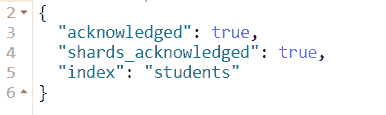
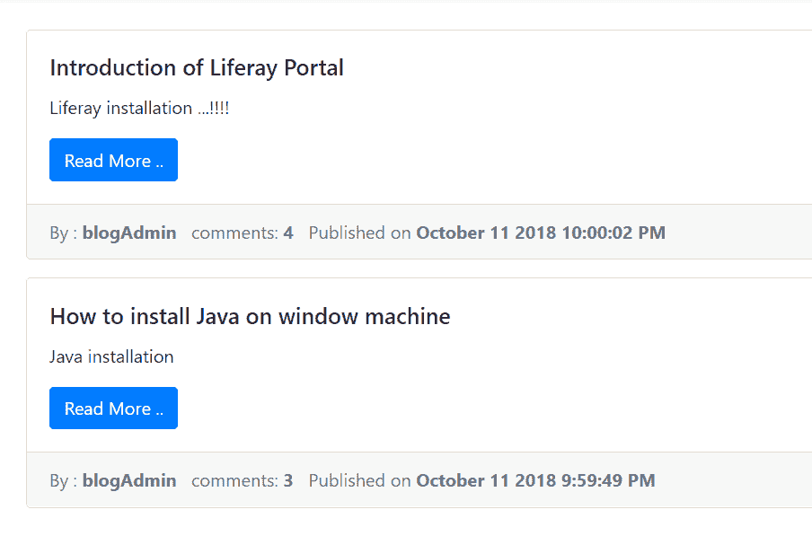
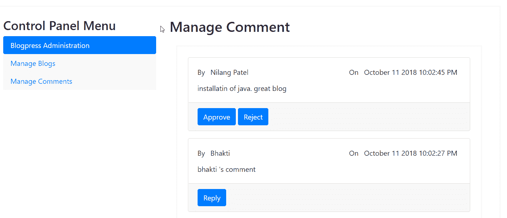

# Blogpress - 一个简单的博客管理系统

Spring 支持在 Java 平台上开发企业级应用程序。在其范围内有许多这样的应用程序，其中最流行的是 Spring **模型-视图-控制器**（**MVC**）、Spring Security、Spring Data、Spring Batch 和 Spring Cloud。

在前两章中，我们开始探索 Spring MVC 框架，以及其他构建块，如 Spring Data 和 RestTemplate，以及像 Angular、Bootstrap 和 jQuery 这样的 JavaScript 框架，以构建基于 Web 的应用程序。我们还看到了如何借助 WebFlux（一个用于创建反应式 Web 应用程序的框架）来构建反应式 Web 应用程序。

创建一个企业级基于 Spring 的应用程序需要大量的配置，这使得开发过程变得相当繁琐和复杂。除此之外，设置复杂的依赖关系也需要大量的努力。通常，在基于 Spring 的 Web 应用程序中使用的库需要一些常见的配置来将它们绑定在一起。

考虑到任何基于 Spring 的应用程序，你可能需要执行某些重复性任务，特别是配置相关的任务，例如，导入所需的模块和库以解决依赖项；进行与应用程序各层相关的配置，例如，在 DAO 层的数据源和事务管理，以及在 Web 层的视图解析和资源管理等等。

这是一个在创建任何基于 Spring 的 Web 应用程序时必须遵循的强制性程序。简而言之，开发人员通常会跨应用程序复制配置，并且在集成库时可能不会遵循最佳实践。

所有这些因素激发了 Spring 团队提出一个框架，该框架通过自动配置提供对所有 Spring 库的集成，这基本上消除了你的重复性工作。除此之外，它还提供了生产就绪功能，如应用程序指标和监控、日志记录和部署指南。这个框架被称为 Spring Boot。

在本章中，我们将继续我们的旅程，并探讨使用 Spring 库和其他第三方库构建博客管理 Web 应用程序的不同组件，所有这些库都通过 Spring Boot 提供的自动配置绑定在一起，以及我们对自动配置的一些覆盖。

本章将涵盖以下主题：

+   带有 Spring Boot 的项目骨架

+   Spring MVC 框架中应用程序的主要流程

+   使用**Thymeleaf**和`Mustache.js`的表示层

+   使用 Spring Security 使应用程序安全——涵盖身份验证和授权

+   在 Elasticsearch 中开发后端层，它存储应用程序数据并提供基于 REST 的 CRUD 操作

+   开发 Spring MVC REST 服务

# 技术要求

本章中使用的所有代码都可以从以下 GitHub 链接下载：[`github.com/PacktPublishing/Spring-5.0-Projects/tree/master/chapter03/blogpress`](https://github.com/PacktPublishing/Spring-5.0-Projects/tree/master/chapter03/blogpress)。代码可以在任何操作系统上执行，尽管它只在 Windows 上进行了测试。

# 应用程序概述

以现实生活中的例子为最佳方法来探索和理解给定框架上下文的概念。目的是不展示如何构建 Web 应用程序；相反，我们将展示应用程序的重要组成部分，以便任何人都可以选择一个组件并在另一个应用程序中使用它。您可以在为本书下载的代码中找到完整的完整解决方案。

让我们开始行动。首先，我们将简要介绍我们的应用程序——博客。我们将称之为**Blogpress**。请注意，它不会是一个完整的博客应用程序；相反，我们将开发以下功能：

+   登录页面——显示博客列表及其链接。

+   当用户点击任何博客时，系统将以查看模式打开它，以及所有（已批准）评论。

+   用户可以在同一屏幕上添加评论。

+   此外，用户可以使用给定的搜索文本搜索博客，目标是博客的标题或正文。

+   有登录功能。两个人可以登录到应用程序——博客用户和管理员：

    +   博客用户可以添加/更新/删除博客。他只能编辑自己创建的博客。

    +   管理员用户可以执行博客用户可以执行的所有可能操作，以及管理（批准或拒绝）匿名用户给出的评论。

+   当任何用户添加评论时，将向管理员用户发送电子邮件以进行审核。一旦评论被批准，将向用户发送电子邮件作为通知。

# 基于 Spring Boot 的项目骨架

Spring Boot 自动化创建配置的过程，从而加快了开发过程。简而言之，Spring Boot 使开发周期更短，对于构建生产就绪的应用程序或服务，配置最少或没有配置。它使用约定优于配置的方法来提供快速应用程序开发。

Spring Boot 的目的不是提供任何新功能；相反，因为它建立在 Spring 框架之上，它使用现有的 Spring 框架功能来提供开箱即用的预配置应用程序骨架，这是一种开发入门模式。

Spring Boot 相较于传统的基于 Spring 的应用程序创建方式具有各种优势，如下所述：

+   具有自动配置功能

+   轻松管理依赖关系

+   支持嵌入服务器以简化开发过程

+   提供了使用 Maven 或 Gradle 构建应用程序的支持

+   简化了与其他 Spring 模块的集成

+   加快开发过程

+   支持命令行和 IDEs 轻松开发和测试应用程序

# 配置 IDE Spring Tool Suite

让我们开始开发我们的博客应用程序——Blogpress。如描述，我们将首先使用 Spring Boot 创建应用程序。使用 IDE 开发应用程序是目前大多数开发者首选的最直接、简单、方便和有利的方法。我们使用 IDE 来开发我们的应用程序。

Spring 提供了一个基于 Eclipse 的 IDE，称为**Spring Tool Suite**（**STS**），可以轻松地开发任何基于 Spring 的应用程序。从以下链接下载 STS 的最新版本：[`spring.io/tools.`](https://spring.io/tools)

STS 与 Eclipse、Visual Studio 和基于 Atom 的代码编辑器一起提供。您可以根据需要使用其中任何一个。

我们将在本章中使用基于 Eclipse 的 IDE STS 来构建应用程序。下载 STS，将其解压缩到您的本地文件夹中，然后打开`.exe`文件以启动 STS。启动后，创建一个具有以下属性的 Spring Boot 启动项目：

+   名称：`blogpress`

+   类型：Maven（您也可以选择 Gradle）

+   打包：Jar

+   Java 版本：8（或更高）

+   语言：Java

+   组：这将是一个 Maven `groupId`，因此请给出适当的值

+   生成物：这将是一个 Maven `artifactId`，因此请给出适当的值

+   版本：`0.0.1-SNAPSHOT`—我们应用程序的构建版本

+   描述：`一个简单的博客管理系统`

您也可以从命令窗口创建 Spring Boot 应用程序。Spring 提供了一个名为 Spring **命令行界面**（**CLI**）的工具来支持这一点。创建 Spring Boot 启动项目的另一种方法是使用[`start.spring.io/`](https://start.spring.io/)。您需要定义依赖项，它将允许用户从网络上下载整个项目结构。

保持所有默认选项，点击完成以创建 Spring Boot 应用程序。您将在`pom.xml`中看到以下依赖项：

```java
<dependency>
  <groupId>org.springframework.boot</groupId>
  <artifactId>spring-boot-starter-web</artifactId>
</dependency>

<dependency>
  <groupId>org.springframework.boot</groupId>
  <artifactId>spring-boot-starter-test</artifactId>
  <scope>test</scope>
</dependency>
```

Spring Boot 提供了各种针对每个依赖项的启动器，以便它们的 JAR 文件可以在类路径中找到。由于我们想要开发一个 Web 应用程序（Spring MVC），我们在之前的代码中保留了`spring-boot-starter-web`启动器（实际上，它是在创建 STS 项目时添加的）。

Spring 提供了一系列用于特定功能的依赖项，以启动器的形式。这是在 Spring Boot 应用程序中管理依赖项的一种便捷方式。当您指定特定的启动器时，Spring Boot 将为您自动拉取应用程序中的所有（递归）依赖项。例如，如果您希望使用 JPA 将数据存储添加到应用程序中，只需将`spring-boot-starter-jpa`添加到 Spring Boot 应用程序的`pom.xml`中。所有依赖项都将由 Spring Boot 处理，这样您就可以专注于业务实现。

你会在`pom.xml`的父元素中看到`spring-boot-starter-parent`。这是 Spring Boot 的魔力所在。通过这个声明，你的应用程序扩展了所有 Spring Boot 的能力，如下面的代码片段所示：

```java
<parent>
  <groupId>org.springframework.boot</groupId>
  <artifactId>spring-boot-starter-parent</artifactId>
  <version>2.1.0.BUILD-SNAPSHOT</version>
  <relativePath/>
</parent>
```

# Spring Model-View-Controller（MVC）网络流程

下一步是添加 Spring MVC 功能。在上一步中，我们将所需的 Web 启动依赖项添加到`pom.xml`文件中。接下来，我们将在我们的应用程序中定义 Spring MVC 组件。

由于这是一个 Spring Boot 应用程序，我们不需要从头开始声明一切。定义控制器和视图层是至关重要的。首先，我们将声明一个 Spring MVC 控制器，如下面的代码片段所示：

```java
@Controller
public class BlogController {
  private Logger logger = LoggerFactory.getLogger(BlogController.class);
  @GetMapping("/")
  public String showLandingPage(Model model) {
    logger.info("This is show home page method ");
    return "home";
  }
}
```

`@Controller`注解描述了这个类作为 Spring MVC 控制器。它基本上指示 Spring Boot 应用程序，这个组件将服务于基于 Web 的请求。它匹配正确的 URL 模式以调用特定的控制器及其方法。

在之前的声明中，我们只为控制器方法提供了 URL 模式。然而，Spring 允许你为控制器声明 URL 模式。由于我们的应用程序只需要某些功能，一个控制器就足够了，因此，我们没有为控制器声明 URL 模式。所以，所有当前应用程序的 Web 请求（具有`http://host/context/controllerUrlPattern`模式的请求）都将路由到这个控制器。

`@RequestMapping("/controllerUrlPattern")`注解用于在控制器级别描述 URL 模式。在这种情况下，`http://host/context/controllerUrlPattern`模式将到达这个控制器。它所有方法的 URL 模式都将附加在`http://host/context/controllerUrlPattern`之后。

总是使用记录器是一个好习惯。Spring 提供了`LoggerFactory`类来获取当前类的记录器实例。你可以在适当的位置调用各种方法，如`info`、`debug`、`error`等。

Spring MVC 控制器方法可以通过一个独特的 URL 进行映射，以便它可以由匹配的请求 URL 模式触发。在之前的例子中，`showLandingPage()`方法是一个控制器方法。它被映射到 URL`/`，这意味着`http://localhost:8080/blogpress/` URL（假设你在本地使用`8080`端口运行应用程序，并且`blogpress`是你的应用程序的名称）将调用此方法。

此方法返回一个字符串`home`，它表示表示层中的组件。Spring MVC 足够灵活，可以选择所需的表示框架。因此，没有必要使用特定技术作为你的表示层。你可以使用**JavaServer Pages**（**JSP**s）、Thymeleaf 或如 Angular 这样的 UI 框架作为 Spring MVC Web 应用程序的前端。

在本章中，我们将使用 Thymeleaf 来构建表示层。

# 使用 Thymeleaf 的表示层

Thymeleaf 是一个模板引擎，用于在服务器端处理 XML、HTML、JavaScript、CSS 和纯文本模板。你可能会有这样的疑问：为什么是 Thymeleaf？我们已经有 JSP 了。使用 Thymeleaf 相对于 JSP 有什么好处？

答案是，Thymeleaf 是按照自然模板概念设计的，并提供设计原型支持，而不会影响模板的使用。换句话说，由于其本质，Thymeleaf 可以被开发者和设计团队使用，而不会受到限制或两者之间有依赖关系。

Thymeleaf 的另一个优点是它符合网络标准，主要是 HTML5。这将使你在需要时能够完全验证模板。

# Thymeleaf 的工作原理

对于我们的博客应用，我们将使用 Thymeleaf HTML 模板。使用 Thymeleaf 的第一步是指导 Spring Boot，使其能够为我们应用提供所有必要的特定于 Thymeleaf 的配置。在`pom.xml`中添加以下条目：

```java
<dependency>
  <groupId>org.springframework.boot</groupId>
  <artifactId>spring-boot-starter-Thymeleaf </artifactId>
</dependency>
```

Thymeleaf 提供某些标签（一种 JSP 标签）来将动态值嵌入到模板中。我们将首先介绍我们在 Blogpress 应用中打算使用的最基本标签。将动态值插入 Thymeleaf 模板的机制与你在 JSP 标签中看到的不同，因此在开始使用之前熟悉它是相当重要的。

你可以看到 Thymeleaf 的另一个启动器。这就是 Spring Boot 如何让开发者的生活变得简单。

# 方言、处理器和表达式对象

方言是一组你在模板中使用的功能，包括预处理和后处理逻辑以及表达式对象。处理逻辑（在模板中嵌入动态 HTML 和值）由称为处理器的对象执行，而表达式对象用于描述执行特定操作的标准表达式。简而言之，处理器对象处理 DOM 节点或元素，而表达式对象用于评估表达式。

方言可以与处理器或表达式对象一起使用，也可以两者都使用。让我们看看如何在模板中声明和使用方言：

```java
<!DOCTYPE html>
<html >

<span th:text="${name}">
```

在之前的代码片段中，`th`被称为方言前缀。这意味着该方言提供的所有属性和标签都以`th:`开头。这是一个标准且开箱即用的方言，对于大多数场景来说已经足够了。你可以将方言视为 JSP 中的*Taglibs*。

你可以在模板中定义多个方言。此外，你还可以创建自己的自定义方言，并在自定义处理器中添加自定义处理逻辑。

`text`属性代表一个处理器，它只是将值放入 span 中，而`${...}`描述的是值表达式对象，它简单地从模型中拉取属性值。以下是在 Thymeleaf 中可用的表达式对象类型：

+   **变量表达式对象**：它们用于显示模型属性的值。它们的形式是 Spring **表达式语言**（**EL**）。它们可以用`${...}`语法来描述。

+   **选择表达式对象**：这些与表达式对象类似，但只能应用于之前选定的对象。它们可以与`*{...}`语法一起使用。

+   **消息（国际化）表达式**：这些用于国际化目的和提供特定语言的短信。您可以使用`#{...}`语法。

+   **链接（URL）表达式**：这些用于动态应用链接。例如，表单操作、HREF、链接 JS/CSS 或其他静态资源等。使用`@{...}`语法。

+   **片段表达式**：这代表模板的一部分，可以在类似或其他模板中重复使用。它们可以使用`~{...}`语法。

接下来，我们将看到我们将在后续应用程序中使用的一些处理器。它们可以与以下列出的各种表达式对象一起使用：

+   `th:text`—这用于与值表达式对象一起使用，为 HTML 元素如`span`、`li`、`div`等放置动态文本。

+   `th:value`—可以使用此处理器提供输入元素的值。

+   `th:action`—这可以用来向 HTML 表单提供操作值。

+   `th:href`—正如其名所示，这用于在链接中提供 URL（导入 CSS）和 HTML 中的标签。

+   `th:src`—这用于在 HTML 中动态提供脚本（和其他类似）元素的源 URL。

+   `th:each`—这用于循环中的`th:text`，以构建重复的 HTML 代码，即 HTML 表格的行。

+   `**th:if**`和`th:unless`—这些用于条件性地放置动态值。

Thymeleaf 支持在 HTML5 风格中定义属性和元素名称。例如，您可以用`data-th-text`作为 HTML 元素的属性来代替`th:text`，在 HTML5 中被视为自定义元素。

# 为什么 Thymeleaf 是一个自然的模板

我们已经看到标准方言的处理器被放置为 HTML 元素的属性。由于这种安排，即使在模板引擎处理之前，浏览器也可以正确渲染 Thymeleaf 模板。

这很可能是因为浏览器简单地忽略了它们，将它们视为自定义属性，因此在显示时没有问题。在 JSP 的情况下则不可能。例如，以下标签的 JSP 在浏览器中不会被渲染：

```java
<form:input name="name" path=”name”/>
```

如果您使用 Thymeleaf 编写，它将如下所示：

```java
<input type="text" name="name" value="Nilang" th:value="${name}" />
```

浏览器将完美地显示前面的代码。此外，Thymeleaf 允许您提供（可选的）值属性（在我们的例子中是`Nilang`），当在浏览器上运行时将静态显示。当相同的代码由 Thymeleaf 模板引擎处理时，值将通过实时评估`${name}`表达式来替换。

这就是为什么 Thymeleaf 被称为自然模板引擎的原因。它允许设计师与开发者合作，而不会产生对任何一方的依赖。

现在，让我们讨论一下我们将在我们的博客应用程序中使用的 Thymeleaf 模板。当你创建一个 Spring Boot 应用程序时，你将在`src/main/resources`文件夹中看到一个`templates`文件。我们所有的 Thymeleaf 模板都驻留在那里。

我们将在我们的应用程序中使用以下模板：

+   `header.html`: 这个模板包含一个常见的 JS/CSS 包含头部，以及一个导航栏。它包含在所有其他模板中。

+   `home.html`: 显示主页内容。

+   `login.html`: 允许用户登录到系统中。

+   `user-page.html`: 一旦博客用户登录，他将会进入这个页面。

+   `view-blog.html`: 以只读模式打开特定的博客。

+   `search.html`: 显示搜索结果。

+   `new-blog.html`: 博客用户或管理员可以通过这个模板创建一个新的博客。

+   `manage-comments.html`: 管理员用户可以批准/拒绝评论。

+   `edit-blog.html`: 允许博客用户/管理员编辑现有的博客。

+   `admin-page.html`: 一旦管理员用户登录，他们将会进入这个页面。

我们将首先添加两个模板——`home`和`header`。在进一步操作之前，让我们看看 Thymeleaf 的一个酷炫特性，我们将在我们的应用程序中使用。就像 JSP 一样，你可以将一个模板包含到另一个模板中。此外，Thymeleaf 还允许你只包含模板的一部分（片段），而不是整个模板，这是 JSP 所做不到的。

这是一个很棒的功能，因为你可以在一个模板中定义常见的片段，并在其他模板中包含它们。在我们的例子中，我们在`header.html`模板中定义了常见的头部元素，如下面的代码片段所示：

```java
<!DOCTYPE html>
<html >
<head th:fragment="jscssinclude">
    <!-- Required meta tags -->
    <meta charset="utf-8">
    <meta name="viewport" content="width=device-width, initial-scale=1, shrink-to-fit=yes">
    <!-- Bootstrap CSS -->
    <link rel="stylesheet" th:href="@{/css/bootstrap.min.css}">
    <link rel="stylesheet" th:href="@{/css/blogpress.css}">

    <script th:src="img/jquery.min.js}" type="text/javascript"></script>
    <script th:src="img/popper.js}" type="text/javascript"></script>
    <script th:src="img/bootstrap.min.js}" type="text/javascript"></script>

    <title th:text="${pageTitle}">Title</title>
</head>
<body>
  <div th:fragment="header_navigation">
    <div class="jumbotron text-center jumbotron-fluid" 
        style="margin-bottom:0; padding:2rem 1 rem" >
         <h1>Blog Press</h1>
         <p>Let's do Blogging ..!</p>
     </div>
     <nav class="navbar navbar-expand-sm bg-dark navbar-dark">
          <button class="navbar-toggler" type="button" 
              data-toggle="collapse" data-target="#collapsibleNavbar">
              <span class="navbar-toggler-icon"></span>
          </button>
          <div class="collapse navbar-collapse" id="collapsibleNavbar">
              <ul class="navbar-nav">
                  <li class="nav-item">
                      <a class="nav-link" th:href="@{/}">Home</a>
                  </li>
               </ul>
          </div>
      </nav>
    </div>
</body>
</html>
```

该片段由`th:fragment`标签定义。你可以看到 Thymeleaf 标签（带有方言前缀、处理器和表达式对象）是如何用来导入各种静态资源（JS/CSS），并且向 HTML 元素添加动态值（在我们的例子中是`${pageTitle}`）。

我们可以将这个头部（定义为片段）包含在其他模板中。例如，在我们的`home.html`模板中，我们使用了它如下：

```java
<!DOCTYPE html>
<html >
  <head th:replace="header :: jscssinclude"></head>
  <body>
    <div th:replace="header :: header_navigation"></div>
    This is Home page
  </body>
</html>
```

`th:replace`标签用于从其他模板引用片段代码。你只需要将模板的名称（你从中引用片段的模板）用两个冒号（`::`）和片段的名称（你用`th:fragment`标签定义的）放在一起。这就是 Thymeleaf 允许你将一组模板代码作为片段引用到其他模板中的方式。

我们已经定义了另一个片段，称为`header_navigation`，在前面代码片段中的主页模板中引用。它用于显示我们应用程序的导航菜单。

在此刻，我们还需要将静态资源（JS/CSS）放入我们的应用程序中。你将在项目结构中看到一个静态文件夹，所有静态资源都应该放在那里。Spring Boot 会将静态文件夹中的所有内容视为静态资源。在静态文件夹下创建`css`、`img`和`js`文件夹，并将以下资源放入其中：

+   在`css`文件夹中，添加以下内容：

    +   `bootstrap.min.css`

+   在`js`文件夹中，添加以下内容：

    +   `Bootstrap.min.js`

    +   `Jquery.min.js`

    +   `popper.js`

现在是时候运行我们的应用程序以查看主页了。你可以在服务器上构建和部署它，并通过`http://localhost:8080/blogpress` URL 访问它，你将看到一个带有页眉和导航栏的主页。接下来，我们必须使用 Spring 安全使我们的应用程序安全。安全性是任何应用程序今天的一个重要方面和核心关注点。

# 使用 Spring Security 使应用程序安全

我们的 Blogpress 应用程序具有登录功能，用于访问普通（匿名）用户无法访问的某些页面和功能。如果我们从头开始自己构建认证和授权，则需要付出大量的努力。Spring 提供了一个名为 Spring Security 的功能，它正好满足我们的需求。

Spring Security 是一个开源的、高度综合的、强大且可定制的框架，用于在基于 J2EE 的 Web 应用程序中实现认证和授权。它是 Spring 框架的一个子项目（模块）。

在进一步讨论之前，了解认证和授权之间的区别非常重要。

认证是验证或确定某人或某物所声称身份的过程。执行认证有多种机制。执行认证最直接的方式是提供用户名和密码。其他方式包括通过 LDAP、单点登录、OpenId 和 OAuth。

另一方面，授权更多地与你可以执行的动作的**权限**相关。简而言之，认证意味着**你是谁**，而授权意味着你在系统中**可以做什么**。

Spring Security 提供了许多开箱即用的功能，包括认证、授权、防止 CSRF 攻击、servlet API 集成支持、Spring MVC 集成、记住我功能、SSO 实现支持、LDAP 认证支持、OpenID 集成、Web 服务安全支持、WebSocket 安全支持、Spring Data 集成，等等。

尽管撰写本文时 Spring Security 的最新版本（5.1.0）支持 XML 和注解支持，但如果你自己设置它，仍然需要进行大量的配置。但不必担心，因为 Spring Boot 与你同在。

Spring Boot 也支持 Spring Security 的集成。就像与其他模块的集成一样，你需要添加一个必需的启动器（starter）来使 Spring Security 与 Spring Boot 一起工作。在 `pom.xml` 文件中添加以下依赖项：

```java
<dependency>
  <groupId>org.springframework.boot</groupId>
  <artifactId>spring-boot-starter-security</artifactId>
</dependency>
```

一旦你设置了之前提到的配置，Spring Security 就会激活并阻止在没有有效凭证的情况下访问应用中的任何页面，即使是公开页面。当你访问 `http://localhost:8080/blogpress` 时，你会看到一个登录界面。

Spring Security 及其默认（自动）配置允许你使用特定的凭证登录。用户名将是 `user`，密码将由 Spring Security 随机生成并在服务器日志中像这样打印出来：

使用生成的安全密码：89ca7b55-6a5d-4dd9-9d02-ae462e21df81。

你可以在 `property` 文件中覆盖用户名和密码。在项目结构中，你将在 `src/main/resources` 文件夹中看到 `application.properties` 文件。只需向其中添加以下两个属性：

```java
spring.security.user.name=nilang
spring.security.user.password=password
```

现在，你可以使用之前提到的凭证访问应用，但你仍然需要认证才能访问公开页面。默认情况下，Spring Security 使用默认（或自动）配置激活，这保护了所有端点。这不是我们想要的。因此，我们需要指导 Spring Security 我们想要使哪些端点（URL）安全，哪些不安全。

为了做到这一点，首先我们需要禁用默认的安全（自动）配置。这里有两种可能的选择。

# 排除自动配置

在主 `bootstrap` 类的 `@SpringBootApplication` 注解中添加一个 `exclude` 属性，如下面的代码片段所示：

```java
@SpringBootApplication(exclude = { SecurityAutoConfiguration.class })
public class BlogpressApplication {

  public static void main(String[] args) {
    SpringApplication.run(BlogpressApplication.class, args);
  }
}
```

或者，你可以在 `application.properties` 文件中添加以下属性：

```java
spring.autoconfigure.exclude=org.springframework.boot.autoconfigure.security.servlet.SecurityAutoConfiguration
```

你可以选择之前描述的任何一种方法来禁用或排除安全（自动）配置。排除自动配置仅在需要集成由自定义提供者提供的安全性的特定场景中适用。

# 替换自动配置

另一种禁用自动安全配置的方法是用我们自己的自定义配置覆盖它。Spring Security 是一个高度可定制的框架，并提供了基于 URL 和角色的细粒度访问机制。

要用自定义配置替换自动配置，我们需要指定配置类，如下面的代码片段所示：

```java
@Configuration
@EnableWebSecurity
@ComponentScan("com.nilangpatel.blogpress")
public class WebSecurityConfig extends WebSecurityConfigurerAdapter {
  …..
}
```

`WebSecurityConfig` 自定义配置类扩展了 `WebSecurityConfigurerAdapter` 抽象类。这个抽象类有某些扩展点（以抽象方法的形式提供，你可以提供自己的自定义实现）和常见任务的默认实现。

由于我们的类 (`WebSecurityConfig`) 提供了自定义配置，我们必须使用 `@Configuration` 和 `@ComponentScan("com.nilangpatel.blogpress")` 注解来定义它。你需要将自定义配置类所在的包名（`@ComponentScan` 注解中）提供进去。

`@EnableWebSecurity` 注解也很重要，因为我们正在禁用默认的安全配置。没有它，我们的应用程序将无法启动。我们现在将覆盖 `WebSecurityConfigurerAdapter` 类的一个方法，该方法将用于定义网络配置，并添加一个额外的方法，用于定义用户详情：

```java
@Override
public void configure(WebSecurity web) throws Exception {
  web.ignoring().antMatchers("/js/**");
  web.ignoring().antMatchers("/css/**");
}
```

Spring Security 默认适用于所有请求——包括静态资源。此方法用于定义静态资源的转义序列。如果在这里没有配置为忽略，Spring Security 将默认阻止它们。在没有之前讨论的配置的情况下，静态资源将不会被加载到浏览器中，因此你将看不到任何 `javascript`、`css` 或 `images` 文件。接下来，我们将按照以下方式将用户详情添加到同一个类中：

```java
// create users and admin
@Autowired
public void configureGlobal(AuthenticationManagerBuilder auth) throws Exception {

  BCryptPasswordEncoder encoder = passwordEncoder();
  auth.inMemoryAuthentication() .passwordEncoder(encoder)
    .withUser("blogUser1").password(encoder.encode("password")).authorities("USER")
    .and()
    .withUser("blogUser2").password(encoder.encode("password")).authorities("USER")
    .and()
    .withUser("blogAdmin").password(encoder.encode("password")).authorities("ADMIN");
}

@Bean
public BCryptPasswordEncoder passwordEncoder() {
  return new BCryptPasswordEncoder();
}
```

`configureGlobal` 方法在这里被用来动态创建一个带有密码和角色的用户名。它通过 `@Autowired` 注解声明，以便 Spring 将 `AuthenticationManagerBuilder` 类的对象注入其中。`AuthenticationManagerBuilder` 类用于提供 `AuthenticationManager` 的实现。正如我们所见，Spring Security 允许各种认证机制，并为这些机制中的每一个提供了 `AuthenticationManager` 的实现，例如内存认证、LDAP 认证、JDBC 认证、OAuth 认证等等。

为了使事情简单，我们使用了内存认证，它只是简单地将用户详情存储在内存中。然而，这并不适合生产环境。你应该在数据库中创建用户详情，Spring Security 足够灵活，也支持这种场景。

使密码安全是任何安全框架最重要的核心部分，因此 Spring Security 提供了相应的编码机制。它提供了 `BCryptPasswordEncoder`，这是一个用于编码密码的编码类。它使用 **bcrpt** 算法进行编码，这是一种在 Spring Security 中广泛使用的非常强大的密码散列程序。

Spring Security 还提供了一个名为 `NoOpPasswordEncoder` 的类，以防你希望以明文形式存储密码。然而，从版本 5 开始，Spring 决定弃用它，并且它可能在未来的版本中被移除。这是因为将密码以明文形式存储是不被鼓励的，可能会导致安全漏洞。因此，你永远不应该使用 `NoOpPasswordEncoder` 类（甚至对于任何原型验证都不应该使用）。

我们使用了名为 `configureGlobal` 的方法，但你绝对可以自由选择你认为合适的方法。

接下来，我们将覆盖另一个方法，这是一个扩展点，为我们应用程序中的每个端点提供自定义安全设置，如下所示：

```java
@Override
protected void configure(HttpSecurity http) throws Exception {
  http.authorizeRequests()
    .antMatchers("/").permitAll()
    .antMatchers("/controlPage/")
    .hasAnyAuthority("ROLE_USER","ROLE_ADMIN")
    .and()
  .formLogin().loginPage("/login").permitAll()
    .defaultSuccessUrl("/controlPage")
    .failureUrl("/login?error=true")
    .and()
  .logout()
    .permitAll().logoutSuccessUrl("/login?logout=true");
}
```

我们覆盖了具有`HttpSecurity`作为方法参数的 configure 方法，以提供自定义安全配置。如果您打开父类（`WebSecurityConfigurerAdapter`）的原始 configure 方法，它看起来如下所示。将原始方法的引用并排放置将有助于您理解我们为我们的 Blogpress 应用程序提供的自定义配置。

```java
protected void configure(HttpSecurity http) throws Exception {
  http.authorizeRequests()
    .anyRequest().authenticated()
    .and()
    .formLogin().and()
    .httpBasic();
}
```

默认的`configure`方法简单地认证所有请求。它允许用户通过基于表单的登录进行认证，并支持 HTTP 基本认证。这就是为什么我们在 Spring Boot 中激活 Spring Security 而没有自定义安全配置时，会立即得到默认登录页面。

在 Spring Security 范式中，`principal`指的是用户名，而`authorities`指的是用户拥有的角色。在处理 Spring Security 时牢记这些术语将有助于您更好地理解概念。

现在，让我们看看我们在覆盖的 configure 方法中做了哪些自定义，如下所示：

+   `antMatchers("/", "/home").permitAll()`这一行将允许列出的 URL 无需任何认证。这意味着`/`（默认 URL — `http://localhost:8080/blogpress`）URL 是公开可访问的。您可以在逗号分隔的列表中提供任何其他 URL。

+   下一个`antMatchers("/controlPage").hasAnyAuthority("ROLE_USER","ROLE_ADMIN")`行使得`/controlPage` URL 对具有`ROLE_USER`或`ROLE_ADMIN`角色的任何用户可访问。

+   下一个`formLogin().loginPage("/login").permitAll()`行允许我们设置登录页面 URL。我们保留了`/login` URL，但您可以提供任何自定义登录 URL。由于登录页面应该是公开可访问的，`permitAll()`方法将使登录 URL 对所有用户可访问。

+   一旦 Spring Security 认证了用户，它将发送到成功页面。您可以使用`defaultSuccessUrl("/controlPage")`配置自定义成功页面。在这种情况下，成功 URL 是`/controlPage`。

+   类似地，如果认证失败，它应该发送到错误页面。`failureUrl("/login?error=true")`这一行将在认证失败时将流程发送到`/login` URL（包括参数）。

+   最后，`permitAll().logoutSuccessUrl("/login?logout=true")`这一行配置了注销页面。一旦用户注销，系统将触发`/login` URL（包括参数）。

我们已经添加了我们的自定义安全配置；现在，是时候在 Spring MVC 中添加与之前在 Spring 配置中提到的每个 URL 相对应的方法。在 Spring MVC 中添加以下方法：

```java
@GetMapping("/")
  public String showHomePage(Model model) {
    logger.info("This is show home page method ");
    setProcessingData(model, BlogpressConstants.TITLE_HOME_PAGE);
    return "home";
  }
@GetMapping("/controlPage")
  public String showControlPage(Model model) {
    logger.info("This is control page ");
      setProcessingData(model, BlogpressConstants.TITLE_LANDING_CONTROL_PAGE);
      return "control-page";
  }
@GetMapping("/login")
  public String showLoginPage(@RequestParam(value = "error",required = false) String error,
      @RequestParam(value = "logout", required = false) String logout,Model model) {
    logger.info("This is login page URL ");
    if (error != null) {
      model.addAttribute("error", "Invalid Credentials provided.");
    }
    if (logout != null) {
      model.addAttribute("message", "Logged out");
    }
    setProcessingData(model, BlogpressConstants.TITLE_LOGIN_PAGE);
    return "login";
  }
```

`showHomePage` 方法负责在用户点击导航中的“主页”链接时显示主页。它与 `/` URL 关联，并将显示 `home.html`（Thymeleaf）模板。此外，当你访问 `http://localhost:8080/blogpress` URL 时，此方法也会被调用。

`showControlPage` 方法与 `/controlPage` URL 关联，并在成功认证后被调用。此方法将用户引导到 `control-page.html`（Thymeleaf）模板，该模板根据角色显示管理链接。例如，具有 `ROLE_ADMIN` 角色的用户可以看到“管理博客”和“管理评论”的链接，而具有 `ROLE_USER` 角色的用户将只能看到“管理博客”链接。

`showLoginPage` 方法代表登录功能。它与 `/login` URL 关联。它根据参数值存储消息以及页面标题属性，该属性用于显示页面标题（在 `header.html` 模板中）。最后，它打开 `login.html` 模板。

除了这些方法之外，还添加了以下方法，这些方法直接使用 `${}` 表达式在 Thymeleaf 模板中存储可用的模型属性：

```java
@ModelAttribute("validUserLogin")
public boolean isUserLoggedIn() {
  return SecurityContextHolder.getContext().getAuthentication() != null && SecurityContextHolder.getContext().getAuthentication().isAuthenticated() &&
       //when Anonymous Authentication is enabled
       !(SecurityContextHolder.getContext().getAuthentication() instanceof AnonymousAuthenticationToken); 
}

@ModelAttribute("currentUserName")
public String getCurrentUserName() {
    return SecurityContextHolder.getContext().getAuthentication().getName();
}
@ModelAttribute("hasAdminRole")
  public boolean checkIfUserHasAdminRole(){
    return checkIfUserHasRole(BlogpressConstants.ROLE_ADMIN);
  }
@ModelAttribute("hasUserRole")
  public boolean checkIfUserHasUserRole(){
    return checkIfUserHasRole(BlogpressConstants.ROLE_USER);
  }
private boolean checkIfUserHasRole(String roleName) {
     boolean hasUserRole =      SecurityContextHolder.getContext().getAuthentication().getAuthorities().stream()
                .anyMatch(r -> r.getAuthority().equals(roleName));
     return hasUserRole;
  }
```

`isUserLoggedIn` 方法检查是否有用户当前登录。它将由 Thymeleaf 模板中的 `${validUserLogin}` 表达式调用。`getCurrentUserName` 方法简单地提供当前登录的用户名。`checkIfUserHasUserRole` 和 `checkIfUserHasAdminRole` 方法简单地检查相应的角色。你可以看到 `SecurityContextHolder` 类是如何用来获取用户登录详情的。这个类负责存储当前认证用户的详情，也称为主体。

我们逐渐完善了 Blogpress 应用程序，现在它已经配备了 Spring MVC、Thymeleaf 和 Spring Security。所有这些快速开发都是借助 Spring Boot 实现的。接下来我们要开发的部分是一个数据层，这是我们应用中最重要和关键的部分。正如我们提到的，我们将使用 **Elasticsearch** 构建数据层。

# 使用 Elasticsearch 存储数据

Elasticsearch 是一个高度可扩展的全文搜索开源 RESTful 搜索、索引和分析引擎，它是在 **Lucene** 的基础上开发的。它是目前构建企业应用中最受欢迎的搜索引擎之一。它可以非常快速地保存、搜索和分析大量数据。主要，它用于需要复杂搜索的应用。

它是用 Java 开发的，提供近乎实时的结果。它设计用于在分布式环境中工作，以提供高可用性和可伸缩性。它是面向文档的，以 JSON 格式存储复杂的实体结构，并提供一个网络界面进行交互。

Elasticsearch 主要用于在应用程序中搜索大量匹配产品（例如，电子商务）、使用自动完成功能进行部分输入或分析以分布式方式存储的大量原始数据。

# 艺术品

理解一些与 Elasticsearch 频繁使用的术语非常重要，这将帮助你了解 Elasticsearch 的构建方式和它的工作原理。它们是 Elasticsearch 的核心。我们将详细查看每个术语。

# 文档

在 Elasticsearch 中存储的基本信息单元被称为 **文档**。你可以将文档视为关系型数据库管理系统（**RDBMS**）中的一个实体。例如，可以为员工创建一个文档，另一个文档用于薪资，等等。文档将由 Elasticsearch 引擎进行索引，并以 JSON 格式呈现。每个文档都与文档类型相关联。你可以将文档类型与 **Plain Old Java Object**（**POJO**）类相关联，而文档作为 POJO 类的对象。

# 索引

索引是一组具有相似结构的文档。你可以为员工数据定义一个 **索引**，另一个用于薪资数据，等等。索引可以通过与其关联的名称进行识别。索引名称用于索引、搜索以及包含文档的 CRUD 操作。你可以定义尽可能多的索引。索引始终独立于其他索引。在 Elasticsearch 中，一组索引被称为 indices。 

在版本 6.0.0 之前，Elasticsearch 允许为给定索引创建多个文档类型。例如，你可以为用户和员工（或更多）创建文档类型以进行索引组织。从版本 6 开始，Elasticsearch 对给定索引只允许一个文档类型的创建。因此，你需要为每个文档类型创建一个单独的索引。

# 集群和节点

Elasticsearch 是一个分布式系统，这意味着它可以水平扩展，并在多个服务器上运行以以最佳速度处理大量数据。这种服务器的网络被称为 **集群**，而单个服务器则被称为 **节点**。

节点和集群都通过名称进行标识。对于节点，Elasticsearch 在启动时生成一个默认的随机 **全局唯一标识符**（**UUID**）。如果你愿意，你可以更改默认名称。节点名称很重要，因为它将有助于管理与节点名称关联的服务器。

节点使用集群名称来加入集群。默认情况下，所有节点都与名为 `elasticsearch` 的集群相关联。你可以为给定的集群创建尽可能多的节点。

# 分片和副本

Elasticsearch 以文档的形式存储数据，这些文档被分组到一个索引中。在大量数据的情况下，单个索引中的文档数量可能会超过底层硬件容量的限制。例如，存储在单个索引中的超过万亿的文档可能需要高达**100 GB**的空间，这可能无法在一个节点中存储。

作为解决这个问题的一种方法，Elasticsearch 提供了一个机制将索引分割成多个部分；每个部分都可以被视为一个单独的索引，并且可以存储在多个节点上。索引的部分被称为**分片**。这也会提高搜索性能，因为搜索可以在多个分片上同时进行。

副本，正如其名所暗示的，是分片的副本。它们是为了故障转移而创建的；如果某个分片出现故障或离线，副本将被用来提供服务并使系统高度可用。

简而言之，一个索引可以被分割成多个分片；每个分片可以有零个或多个副本。因此，每个索引都有一个主分片，以及零个或多个副本分片。默认情况下，Elasticsearch 为每个索引关联五个主分片和一个副本（截至最新稳定版本 6.4.1）。

对于我们的 Blogpress 应用程序，我们将保持默认值，一个节点拥有默认分片和副本设置的索引。索引的名称将是`blog`。

# 与 Elasticsearch 交互

Elasticsearch 提供了一种用于搜索、索引和执行其他 CRUD 操作与之交互的方式。它提供了一个 RESTful API 用于交互，因此你可以使用各种 HTTP 方法（`GET`、`POST`、`PUT`、`DELETE`等）来处理对 Elasticsearch 的任何操作。

Elasticsearch 不维护请求的状态，因此每个请求都是独立的，信息以 JSON 格式交换。各种 HTTP 方法用于在 Elasticsearch 上执行 CRUD 操作。例如，使用`GET`方法检索数据，而`PUT`、`POST`和`DELETE`用于更新或删除记录。

由于 Elasticsearch 公开了 REST API，你可以使用任何 REST 客户端（例如，**Postman**）与之交互。此外，为了分析和可视化数据，Elasticsearch 提供了一个名为**Kibana**的另一个免费开源工具。它提供了一个基于浏览器的简单界面来执行搜索、查看和其他 CRUD 操作，以及丰富的数据分析，以各种表格、图表和类似地图的内存形式呈现，以及磁盘利用率、索引和文档信息。它还帮助管理索引和文档类型，对文档数据进行 CRUD 操作等。

# 安装

让我们先安装 Elasticsearch。从 [`www.elastic.co/downloads`](https://www.elastic.co/downloads) 下载 Elasticsearch ZIP 套件。将其解压缩到您的本地驱动器中，并运行 `bin/elasticsearch`。默认情况下，它将在 `9200` 端口上可用。一旦启动并运行，您就可以通过 `http://localhost:9200` 访问它。

您可以从相同的 [`www.elastic.co/downloads`](https://www.elastic.co/downloads) URL 下载并安装 Kibana。解压缩套件并运行 `bin/kibana`。您可以在 `5601` 端口上访问 Kibana，即 `http://localhost:5601`。

Elasticsearch 还为 Windows 提供了 MSI 安装程序，这是在 Windows 机器上安装 Elasticsearch 的简单方法。

# Elasticsearch RESTful API

接下来，我们快速查看一些用于在 Elasticsearch 上执行各种活动的 API。由于 Elasticsearch 提供了用于交互的 REST 接口，因此您可以使用任何 REST 客户端，例如 Postman。或者，您可以使用 **Kibana** Dev Tools 执行 REST 调用。它们之间有一些小的区别。

我们将通过一个 `student` 实体的例子来了解各种 RESTful API。目的是解释如何创建 `students` 索引；创建 `student` 文档类型；添加、更新和删除 `student` 数据；以及删除文档类型和索引。

# 创建索引 – students

使用您的 REST 客户端（Postman），输入以下内容：

+   **URL**：`http://localhost:9200/students`

+   **方法**：PUT

+   **类型**：JSON（application/json）

+   主体：

```java
{
}
```

使用 Kibana，转到 Kibana 中的 Dev Tools 选项并输入以下脚本：

```java
PUT students
{

}
```

您将看到以下输出：



我们已经创建了一个没有明确设置的 `student` 索引，因此 Elasticsearch 使用默认设置创建了索引——五个分片和一个副本。您可以在 Kibana 的管理选项中看到这些详细信息。如果您希望给出精确的分片和副本数量（而不是默认的五个和一个），您可以在创建 `student` 索引时在主体中添加 JSON 设置，如下所示：

使用 REST 客户端（Postman），输入以下内容：

+   **URL**：`http://localhost:9200/students`

+   **方法**：PUT

+   **类型**：JSON（application/json）

+   主体：

```java
 {
    "settings" : {
        "index" : {
            "number_of_shards" : 3, 
            "number_of_replicas" : 2 
        }
    }
 }
```

使用 Kibana，转到 Dev Tools 并输入以下脚本：

```java
PUT student
{
    "settings" : {
        "index" : {
            "number_of_shards" : 3, 
            "number_of_replicas" : 2 
        }
    }
}
```

在上一个例子中，索引是通过三个分片和两个副本创建的。这就是在 Elasticsearch 中创建索引时指定特定设置的方法。

# 创建文档类型 – 学生

在创建索引之后，序列中的下一个操作是创建文档类型。我们将在 `students` 索引内创建一个名为 `student` 的文档类型。同样，这可以通过 REST 客户端或 Kibana 完成。我们将详细查看这两种选项。

使用 REST 客户端（Postman），输入以下内容**：**

+   **URL**：`http://localhost:9200/students/_mapping/student`

+   **方法**：POST

+   **类型**：JSON（application/json）

+   主体：

```java
{
    "properties":{
      "id":{"type":"long"},
      "name":{"type":"text"},
      "standard":{"type":"integer"},
      "division":{"type":"text"},
      "gender":{"type":"text"}
    }
 }
```

使用 Kibana，转到 Dev Tools 选项并添加以下脚本：

```java
PUT students/_mapping/student
{
  "properties": {
    "id":{"type":"long"},
    "name":{"type":"text"},
    "standard":{"type":"integer"},
    "division":{"type":"text"},
    "Gender":{"type":"text"}
   }
}
```

您可以使用这两种选项中的任何一种来创建文档类型。我们在 `students` 索引中创建了具有 ID、姓名、标准、班级和性别属性的 `student` 文档类型*.* 我们的结构已准备好将数据添加到 Elasticsearch。接下来，我们将看到如何插入我们定义的 `student` 类型的数据。

在版本 6 之前，Elasticsearch 允许在同一个索引中创建多个文档类型。从 6 版本开始，它们对创建文档类型做了限制，即在该索引中只能创建一个文档类型。

# 添加文档（学生数据）

使用 REST 客户端（Postman），输入以下内容：

+   **URL**：`http://localhost:9200/students/student/1`

+   **方法**：PUT

+   **类型**：JSON (application/json)

+   主体：

```java
{
    "name":"Nilang",
    "standard":3,
    "division":"B",
    "gender":"M"
}
```

使用 Kibana，进入 Dev Tools 选项并输入以下脚本：

```java
PUT students/student/1
{
    "name":"Nilang",
    "standard":3,
    "division":"B",
    "gender":"M"
}
```

您可以使用以下 REST API 验证插入的数据。

# 读取文档（学生数据）

使用 REST 客户端，输入以下内容**：

+   **URL**：`http://localhost:9200/students/student/1`

+   **方法**：GET

使用 Kibana，输入以下内容：

```java
GET students/student/1
```

您将得到以下 JSON 作为输出：

```java
{
    "_index": "students",
    "_type": "student",
    "_id": "1",
    "_version": 1,
    "found": true,
    "_source": {
        "name": "Nilang",
        "standard": 1,
        "division": "B",
        "gender": "M"
    }
}
```

首先，它显示了索引和文档类型。`_id` 属性代表我们在创建数据时在 `http:/localhost:9200/students/student/1` URL 中提供的 ID。如果您使用任何现有的 `_id`，Elasticsearch 将简单地使用当前值更新该记录。`_version` 属性代表记录被更新的次数。`_source` 属性代表我们提供的数据。

# 更新文档（学生数据）

要更新数据，使用的语法与添加文档相同。在添加时，如果系统中不存在 ID，则 Elasticsearch 将为您自动生成一个。例如，以下命令将更新具有 `_id` 等于五的现有学生记录。

使用 REST 客户端（Postman），使用以下内容**：

+   **URL**：`http://localhost:9200/students/student/5`

+   **方法**：POST

+   **类型**：JSON (application/json)

+   主体：

```java
{
    "name":"Robert",
    "standard":6,
    "division":"C",
    "gender":"M"
}
```

使用 Kibana，进入 Dev Tools 并执行以下查询：

```java
PUT students/student/5
{
    "name":"Robert",
    "standard":6,
    "division":"C",
    "gender":"M"
}
```

插入和更新操作使用类似的语法，如果您尝试添加具有已存在 ID 的记录，那么该记录可能会错误地被更新。为了避免这种情况，您可以使用 `localhost:9200/students/student/1/_create` URL。如果存在具有 `1` ID 的记录，这将引发错误。同样，如果您希望更新记录，可以使用 `localhost:9200/students/student/1/_update`。在更新记录时，如果记录不存在，它将引发错误。

在添加文档记录时，如果您不提供 `_id`，Elasticsearch 将为您自动生成一个。

# 删除文档（学生数据）

删除文档很简单。您需要使用 HTTP `DELETE` 方法。只需指定要删除的文档的 `_id`，如下所示。

使用 REST 客户端（Postman），执行以下操作：

+   **URL**：`http://localhost:9200/students/student/1`

+   **方法**：DELETE

使用 Kibana，使用以下内容：

```java
DELETE students/student/1
```

# 搜索查询

Elasticsearch 通过在 URL 末尾传递 `/_search` 提供搜索功能。它可以在服务器 URL、索引或类型之后应用。例如，在我们的案例中，如果我们想搜索名为 `nilang` 的学生文档，我们必须使用以下查询。

使用 REST 客户端（Postman），使用以下方法：

+   **URL**: `http://localhost:9200/students/student/_search?q=name:nilang`

+   **方法**: GET

使用 Kibana，使用**:**

```java
GET students/student/_search?q=name:nilang
```

或者，您可以使用以下语法进行搜索。这对于具有多个搜索标准的多字段复杂搜索非常有用：

```java
GET students/student/_search
{
  "query": {
      "match": {
        "name": "nilang"
      }
  }
}
```

# 为 Blogpress 创建索引和文档类型

在掌握如何创建索引和文档类型，以及如何在 Elasticsearch 中插入文档数据的基本知识后，我们将为 Blogpress 应用程序创建这些工件。在这个应用程序中，我们需要存储博客和评论的数据。博客和评论之间存在一对一的关系（一个博客有多个评论），我们将创建一个索引结构，以便多个评论与单个博客相关联。

Elasticsearch 提供嵌套数据类型来索引对象数组，并将它们作为独立文档维护。我们将为单个博客维护一个评论数组。我们将给索引命名为 `blog` 并设置文档类型为 `blog`。以下是一个可以运行的脚本，用于创建 `blog` 索引：

```java
PUT blog
{
  "mappings":{
    "blog":{
      "properties":{
        "title":{"type":"text"},
        "body":{"type":"text"},
        "status":{"type":"text"},
        "createdBy":{"type":"text"},
        "createdDate":{"type":"date",
                "format": "MM-dd-yyyy'T'HH:mm:ss"},
        "publishDate":{"type":"date",
                           "format": "MM-dd-yyyy'T'HH:mm:ss"},
       "comments":{
        "type":"nested",
        "properties":{
          "id":{"type":"text"},
          "parentId":{"type":"keyword"},
          "childSequence":{"type":"integer"},
          "position":{"type":"text"},
          "status":{"type":"keyword"},
          "level":{"type":"integer"},
          "user":{"type":"text"},
          "emailAddress":{"type":"text"},
          "commentText":{"type":"text"},
          "createdDate":{"type":"date",
                 "format": "MM-dd-yyyy'T'HH:mm:ss"}
          }
        }
      }
  }
  }
}
```

在前面的脚本中，我们同时创建了索引和文档类型。`mappings` 旁边的元素表示文档类型的名称，而索引名称与 `PUT` HTTP 方法（在我们的案例中为 `blog`）一起使用。所有属性都是自解释的，除了定义为一个 `nested` 类型及其属性的评论。日期的格式可以通过 `format` 属性设置。

# Elasticsearch 与 Spring Data 集成

我们将配置 Elasticsearch 作为数据库，为 Blogpress 应用程序提供各种 CRUD 操作。我们将使用 Spring Data 进行此集成。Spring Data 为从各种提供者（如关系数据库、非关系数据库、Map-Reduce 框架和云服务）进行数据访问提供了一个抽象层。

对于这些数据提供者中的每一个，Spring 都提供了一套库来与之交互，同时保持以对称方式与之交互的抽象。Spring Data 涵盖了多个模块，包括 Spring Data Common、Spring Data JPA、Spring Data REST、Spring Data LDAP、Spring Data MongoDB、Spring Data JDBC 以及更多。Spring Data Elasticsearch 是其中之一，提供与 Elasticsearch 搜索引擎的数据访问。

我们将为 Blogpress 应用程序使用 Spring Data Elasticsearch 模块。首先要做的是使此模块在我们的应用程序中可用。不出所料，这可以通过在 `pom.xml` 中定义一个启动器来完成，如下所示：

```java
<dependency>
    <groupId>org.springframework.boot</groupId>
    <artifactId>spring-boot-starter-data-elasticsearch</artifactId>
</dependency>
```

Elasticsearch 提供了一个 Java API，可以以编程方式与之交互。在激活上述启动器后不久，所需的 JAR 文件将被添加到类路径中，以便访问 Elasticsearch Java API。此时，我们需要指导 Spring Data Elasticsearch 模块关于 Elasticsearch 服务器正在运行的集群名称、端口和主机名。您可以在`application.properties`文件中（位于`src/main/resource`文件夹中）定义以下配置：

```java
elasticsearch.clustername=elasticsearch
elasticsearch.host=localhost
elasticsearch.port=9300
```

这与定义数据库 URL、驱动类名称和数据库交互凭据的 Spring Data 相当。下一步是定义一个配置类，它基本上使用之前的信息并准备与 Elasticsearch 交互所需的工件，如下所示：

```java
@Configuration
@EnableElasticsearchRepositories(basePackages = "com.nilangpatel.blogpress.repository")
@ComponentScan(basePackages = { "com.nilangpatel.blogpress.config" })
public class ElasticDataConfig {

     @Value("${elasticsearch.host}")
      private String esHost;

      @Value("${elasticsearch.port}")
      private int esPort;

      @Value("${elasticsearch.clustername}")
      private String esClusterName;

      @Bean
      public Client client() throws Exception {

          TransportClientFactoryBean transportClientFactory = new TransportClientFactoryBean();
          transportClientFactory.setClusterName(esClusterName);
          transportClientFactory.afterPropertiesSet();

          return transportClientFactory.getObject()
                    .addTransportAddress(
            new TransportAddress(InetAddress.getByName(esHost), esPort));
      }

      @Bean
      public ElasticsearchTemplate elasticsearchTemplate() throws Exception {
          return new ElasticsearchTemplate(client());
      }

}
```

这个类使用`@Value`注解读取在`application.properties`文件中定义的集群名称、端口和主机值。`client()`方法使用`TransactionClientFactory`对象读取配置数据，并返回一个`TransportClient`类的对象，该对象代表与 Elasticsearch 交互的客户端接口。

下一个`elasticsearchTemplate()`方法使用此客户端对象并创建`ElasticsearchTemplate`对象。Spring 为每个数据提供者提供了数据访问模板类。`ElasticsearchTemplate`类的对象使用`TransportClient`类的对象初始化。此方法使用`@Bean`注解定义，以便可以通过`@Autowired`注解在其他类中访问`ElasticsearchTemplate`对象。

此初始化发生在启动应用程序时。`ElasticsearchTemplate`类是 Elasticsearch 引擎与 Spring Data 交互的单一点。此类中的`@EnableElasticsearchRepositories`注解用于指向我们接下来要定义的 Spring JPA 仓库包。在此之前，我们首先定义一个表示 Elasticsearch 中文档的模型类。

# Spring Data Elasticsearch 模型类

Spring Data 简化了各种数据提供者的**数据访问对象（DAO**）层实现。DAO 机制通过提供数据访问抽象，使系统松散耦合，允许在不影响业务实现的情况下更改底层数据提供者。

它允许以面向对象的方式与数据层进行交互。这意味着您可以使用实体类对象创建、读取、更新和删除数据。这种抽象也适用于 Spring Data Elasticsearch 模块。您可以用对象的形式访问数据。为此，我们需要定义一个模型（实体）类，它代表我们在 Elasticsearch 中定义的数据结构，如下所示：

```java
@Document(indexName = "blog", type = "blog")
public class Blog {

  @Id
  private String _id;
  private String title;
  private String body;
  private String status;
  private String createdBy;

  @JsonFormat
    (shape = JsonFormat.Shape.STRING, pattern = "MM-dd-yyyy'T'HH:mm:ss")
  private Date createdDate;

  @JsonFormat
    (shape = JsonFormat.Shape.STRING, pattern = "MM-dd-yyyy'T'HH:mm:ss")
  private Date publishDate;

  @Field(includeInParent=true, type = FieldType.Nested)
  private List<Comment> comments;

// Getter and setters for above properties
```

模型类是一个带有`@Document`注解的 POJO，它定义了该类关联的索引和文档类型名称。`Blog`类的对象之前代表 Elasticsearch 中`blog`索引和`blog`文档的文档数据。`@Id`注解用于为博客文档定义一个唯一的 ID。你可以将其与关系型数据库中的主键相关联。日期字段使用`@JsonFormat`注解定义，该注解用于定义所需的日期格式。

`@Field`注解用于定义字段的额外元数据。例如，在评论的情况下，它被定义为`nested`类型，因为在 Java 中没有直接映射 Elasticsearch `nested`类型的可用。对于其他属性，Java 类型直接映射到 Elasticsearch 类型。接下来，我们将使用 Spring Data 定义一个 DAO 层。

在映射脚本中提到的日期格式应该与 POJO 类中用`@JsonFormat`注解定义的日期格式完全匹配。如果不匹配，系统在插入记录时会显示错误。

# 将 Elasticsearch 与 Spring Data 连接

Spring Data 有一个称为**仓库**的概念，它是数据存储的抽象。设计用来添加一个额外的层，通过提供仓库抽象和为每个数据提供者提供具体的仓库实现（包含所有样板代码），它带来了巨大的力量和灵活性。

对于 Elasticsearch，Spring Data 提供了一个名为`ElasticsearchRepository`的仓库接口。此接口（及其父接口）具有与 Elasticsearch 交互所需的所有必需方法。为了获得 Spring Data 的好处，我们需要扩展此接口，以便 Spring Data 可以自动提供具体的实现。显然，所有必需的 CRUD 方法都包含在标准的 DAO 中。

让我们利用 Spring Data 为 Blogpress 应用程序提供 Elasticsearch 的能力。首先，让我们定义一个自定义的仓库接口，该接口扩展了`ElasticsearchRepository<T, ID extends Serializable>`，其中`T`代表实体类，`ID`代表实体类中的唯一 ID，如下所示：

```java
public interface BlogRepository extends ElasticsearchRepository<Blog, String>
```

`Blog`实体类有一个`_Id`（一个字符串）作为唯一标识符（使用`@Id`注解声明）。我们的 DAO 层已经准备好了所有基本的 CRUD 操作。始终定义服务类，展示服务层是一个好主意。因此，我们将声明`BlogService`服务类如下：

```java
@Component
public class BlogService {
  @Autowired
  private BlogRepository blogRepository;
....
}
```

使用`@Autowired`注解，Spring 会将`BlogRepository`对象注入到我们的服务类中，该对象可以用来执行各种 CRUD 操作。接下来，我们可以开始对 Elasticsearch 中的博客数据进行 CRUD 操作。

# 使用 Spring Data 在 Elasticsearch 中执行 CRUD 操作

DAO 和服务层的基本结构已准备就绪。我们现在可以开始执行 CRUD 操作。正如我们所见，只需声明一个自定义仓库接口，Spring 就在 DAO 层提供了所有基本的 CRUD 操作。

# 添加博客数据

首先，我们将创建一个新的博客记录。为此，在`BlogService`类中添加以下方法：

```java
public void addUpdateBlog(Blog blog) {
    blogRepository.save(blog);
  }
```

`BlogRepository`对象由 Spring 注入，可用于执行添加操作。这个服务方法应该从 Spring 控制器中调用。在控制器类中添加以下方法来管理添加（或更新）新博客的功能：

```java
@GetMapping("/showAddNew")
  public String showAddNew(Model model) {
    logger.info("This is addNew page URL ");
    setProcessingData(model, BlogpressConstants.TITLE_NEW_BLOG_PAGE);
    return "add-new";
  }

  @PostMapping("/addNewBlog")
  public String addNewBlog(@RequestParam(value = "title",required = true) String title,
       @RequestParam(value = "body",required = true) String body,Model model) {

    logger.info("Adding new blog with title :"+title );
    Blog blog = new Blog();
    blog.setTitle(title);
    blog.setBody(body);
    blog.setCreatedBy(getCurrentUserName());
    blog.setCreatedDate(new Date());
    blog.setPublishDate(new Date());
    blog.setStatus(BlogStatus.PUBLISHED.getStatus());

    blogService.addNewBlog(blog);

    return "home";
  }
```

`showAddNew()`方法简单地打开`add-new.html` Thymeleaf 模板。当用户点击导航中的“添加新内容”链接时，此方法将被调用，并显示此模板，用户可以在其中添加带有标题和正文的新的博客。

第二个方法——`addNew`，使用`@PostMapping`注解声明，它接受`title`和`body`作为请求参数，创建一个`Blog`类型的对象，设置这些值并调用服务类的`addNewBlog()`方法。你可以在 Kibana 中执行以下查询来查看插入到 Elasticsearch 中的数据：

```java
GET blog/blog/_search
```

# 读取博客数据

接下来是在主页上以表格格式显示博客条目。当用户点击它时，系统将打开博客的详细视图（显示标题、全文和所有评论）。为了在主页上列出博客，我们将以编程方式从 Elasticsearch 获取博客数据。在`BlogService`类中添加以下方法：

```java
public List<Blog> getAllBlogs() {
    List<Blog> blogList = new ArrayList<Blog>();
    Iterable<Blog> blogIterable = blogRepository.findAll();
    Iterator<Blog> blogIterator = blogIterable.iterator();
    while(blogIterator.hasNext()) {
      blogList.add(blogIterator.next());
    }
    return blogList;
  }
```

`getAllBlogs()`方法简单地调用`blogRepository`上的`findAll()`方法来获取所有博客条目。这个服务方法可以从控制器中调用，以在主页上显示这些数据。我们将使用 REST 控制器来展示如何利用 Spring REST 控制器来展示数据。我们将在稍后介绍，所以请继续阅读。

总是建议使用带有分页的仓库方法。由于本章的目的是展示各种组件及其工作方式，我没有使用分页来简化内容。

# 搜索博客数据

由于这是一个博客应用程序，搜索是一个明显的功能。我们将允许用户通过匹配搜索文本与博客标题和正文来搜索博客。我们可以通过在 URL 末尾传递`/_search`来搜索文档。Elasticsearch 提供布尔查询，可以根据各种条件搜索数据。

在我们的案例中，搜索文本应该与标题或正文或两者匹配。这可以通过以下布尔搜索查询实现：

```java
GET blog/blog/_search
{
  "query": {
    "bool": {
      "should": [
        { "match": { "title": "java" }},
        { "match": { "body": "java" }}
      ]
    }
  }
}
```

`should`条件等同于*OR*条件。Elasticsearch 提供了`must`条件，如果你想要使用*AND*条件进行搜索。你可以指定任意多的属性。字符串`java`是搜索文本。这个查询可以用以下方式在 Java 中编程实现：

```java
QueryBuilder booleanQry = QueryBuilders.boolQuery()
                     .should(QueryBuilders.termQuery("title", searchTxt))
                     .should(QueryBuilders.termQuery("body", searchTxt));

    SearchResponse response = elasticsearchTemplate.getClient().prepareSearch("blog")
          .setTypes("blog")
          .setQuery(booleanQry)
          .execute().actionGet();
```

我们正在创建一个布尔查询，并配置搜索文本为标题和正文属性。搜索结果将以 JSON 格式返回，包含 `response` 对象。您可以解析 JSON 以获取所需输出。

# 使用 Elasticsearch 聚合添加评论数据

博客已被添加到系统中。现在用户可以添加评论。接下来，我们将看到如何添加评论。正如讨论的那样，`Comment` 文档类型被定义为博客文档中的一个 `nested` 类型。这意味着博客文档包含一个评论对象的数组，形成一个一对多的关系。我们还需要创建一个如下所示的评论模型类：

```java
public class Comment {
  private String id;
  private String blogId;
  private String parentId;
  private int childSequence;
  private String position;
  private String status;
  private int level;
  private String user;
  private String emailAddress;
  private String commentText;

  @JsonFormat
    (shape = JsonFormat.Shape.STRING, pattern = "MM-dd-yyyy'T'HH:mm:ss")
  private Date createdDate;

//Getter and Setter methods
.....
}
```

由于这个操作是在博客内部嵌套的，因此不需要定义 `@Document` 注解，因为它并不直接与任何文档类型相关联。在添加评论时，需要关注以下某些元数据：

+   我们提供了具有回复功能的评论。一旦用户对任何评论进行回复，它将被添加到下一级，将其视为子评论。为了维护这一点，我们使用 `level` 属性，它简单地显示了评论放置的级别。

+   `blogId` 属性简单地持有与该评论关联的博客的 ID。由于这是一个嵌套对象，在大多数情况下，不需要父文档 ID。但我们将向管理员用户展示评论列表以进行审核和回复。为了使评论管理简单，我们只是在评论中添加了 `blogId`。

+   `parentId` 属性持有父评论的 ID，如果它被放置为回复，否则它将为零。

+   `childSequence` 属性简单地显示了特定级别的序列号。例如，如果有总共两个回复（在第二级），并且用户尝试添加第三个回复（在第二级），那么 `childSequence` 属性将为三。此属性用于构建 `position` 属性的值。

+   `position` 属性将是 `level` 和 `childSequence` 的组合。这用于对评论进行排序，以便它们以正确的顺序显示在给定的博客中。

由于评论是博客的 `nested` 类型，没有这样的方法可以单独保存评论。相反，我们需要获取所有评论，将新的评论添加到相关的博客中，然后保存整个博客。一切都很直接，除了获取 `childSequence` 的值。我们将通过以下聚合查询看到如何获取给定级别的最大 `childSequence`：

```java
GET blog/blog/_search
{
  "query": {
    "match": {
      "_id": "1huEWWYB1CjEZ-A9sjir"
    }
  },
  "aggs": {
    "aggChild": {
      "nested": {
        "path": "comments"
      },
      "aggs": {
        "filterParentId": {
          "filter": {
            "nested": {
              "path": "comments",
              "query": {
                "match": {
                  "comments.parentId": "0"
                }
              }
            }
          },
          "aggs": {
            "maxChildSeq": {
              "max": {
                "field": "comments.childSequence"
              }
            }
          }
        }
      }
    }
  }
}
```

在我们理解查询之前，我们需要看看什么是聚合。在 Elasticsearch 中，聚合是一种用于在搜索查询上提供聚合数据的机制。它们用于构建复杂查询。它们分为以下四个类别：

+   分桶

+   指标

+   矩阵

+   管道

这些聚合类型都可以以嵌套的方式使用，这意味着它可以作为另一个聚合的子聚合来使用，以解决非常复杂的查询。现在，让我们回到查找 `childSequence` 的查询，并理解它。

首个 `query` 标准与 `blogId` (`_id`) 的值匹配。在 `query` 标准开始时给出的任何属性都将与 `blog` 属性的值匹配。接下来是应用于 `nested` 文档的聚合查询——`comments`。每个聚合查询都有一个名称。第一个聚合查询的名称是 `aggChild`。

进一步来说，名为 `filterParentId` 的下一个聚合查询简单地匹配 `parentId`，这实际上就是父评论的 ID。这是为了在给定的评论作为父评论的情况下找到 `childSequence`。对于顶级评论，这个值必须是零。最后一个名为 `maxChildSeq` 的聚合查询简单地找到 `childSequence` 的最大值。它使用最大标准。每个 `nested` 聚合查询简单地应用前一个聚合查询给出的搜索标准。你将得到类似于以下查询的结果：

```java
  "aggregations": {
    "aggChild": {
      "doc_count": 4,
      "filterParentId": {
        "doc_count": 2,
        "maxChildSeq": {
          "value": 3
        }
      }
    }
  }
```

查询结果包含其他信息，但我们只关注 `aggregation`。结果显示了每个聚合查询的文档计数。`maxChildSeq` 的值为三意味着在一级（顶级评论）有三个评论，所以当用户添加一个新的（顶级）评论时，`childSequence` 将是四。

这就是基于 REST 的查询。对于 Blogpress 应用程序，我们需要在 Java 类中执行类似的查询。Elasticsearch 提供了 Java API 来执行通过 REST 查询可以执行的所有操作。当我们定义 Spring Boot 中的 Elasticsearch 启动器时，所需的 Elasticsearch JAR 文件都位于类路径中。为了使用 Java API 编写前面的查询，我们需要在我们的 Elasticsearch 存储库中编写一个自定义的获取方法。

Spring Data 是一个可扩展的框架，允许我们在它提供的开箱即用的存储库之上提供自定义实现。因此，我们首先将以下步骤扩展到 Elasticsearch 存储库。

1.  定义一个名为 `BlogRepositoryCustom` 的自定义存储库接口。

1.  我们最初创建的 `BlogRepository` 接口应该扩展此接口，以及 `ElasticsearchRepository<Blog, String>`，如下所示：

```java
public interface BlogRepository extends ElasticsearchRepository<Blog, String>,BlogRepositoryCustom
```

1.  定义一个实现 `BlogRepositoryCustom` 接口的自定义存储库实现类，如下所示：

```java
@Repository
public class BlogRepositoryCustomImpl implements BlogRepositoryCustom {

  private static Logger logger = LoggerFactory.getLogger(BlogRepositoryCustomImpl.class);

  @Autowired
  private ElasticsearchTemplate elasticsearchTemplate;

  ....

}
```

此类必须使用 `@Repository` 注解声明。我们可以在此类中定义任何自定义方法。我们想要编写一个使用 Elasticsearch Java API 来查找给定级别上最大子序列的方法，因此我们将它写在这个类中，如下所示：

```java
public int getCurrentChildSequence(String blogId,String parentCommentId) {
    int currentChildSeq=0;
    TermQueryBuilder termQueryBuilder = new TermQueryBuilder("comments.parentId", parentCommentId);

    NestedAggregationBuilder aggregationBuilder = AggregationBuilders.nested("aggChild",  "comments").subAggregation(AggregationBuilders.filter("filterParentId", termQueryBuilder).subAggregation(AggregationBuilders.max("maxChildSeq").field("comments.childSequence")));
    TermQueryBuilder rootTermQueryBuilder = new TermQueryBuilder("_id", blogId);
    SearchResponse response = elasticsearchTemplate.getClient().prepareSearch("blog")
      .setTypes("blog")
      .setQuery(rootTermQueryBuilder)
      .addAggregation(aggregationBuilder)
      .execute().actionGet();

    if(response !=null) {
      if(response.getAggregations() !=null) {
        List<Aggregation> aggLst = response.getAggregations().asList();
        if(aggLst !=null) {
          Aggregation resultAgg = aggLst.get(0);
          if(resultAgg !=null) {
            //getMaxChildSequenceFromJson method parse the json to get max child sequence
            currentChildSeq = getMaxChildSequenceFromJson(resultAgg.toString());
          }
        }
      }
    }
    //Adding one to set next sequence
    currentChildSeq=currentChildSeq+1;
    return currentChildSeq;
  }
```

`AggregationBuilders` 类用于构建聚合查询。Elasticsearch Java API 是自我解释的，简单易懂。您可以轻松地将此 Java API 查询与 REST 查询相关联。我们首先创建一个嵌套聚合查询，然后添加一个作为子聚合的过滤聚合查询，之后是一个 `max` 聚合。

`blogId` 的值是通过 `TermQueryBuilder` 类添加的。最后，我们从 `elasticsearchTemplate` 获取 Elasticsearch 客户端，通过提供索引名称（`blog`）、文档类型（`blog`）、根级查询（针对 `blogId`）以及最后设置聚合来启动搜索。这个 Java API 返回我们为 REST 查询获取的聚合 JSON，您可以使用 JSON API 处理以获取所需的结果。

# 使用 Elasticsearch 聚合读取评论数据

一旦添加了评论，当用户打开博客时它们必须可见。这种情况很简单。由于评论是博客的嵌套对象，当我们使用以下 API 读取博客时，所有评论也将作为博客对象的一部分提供：

```java
 Optional<Blog> blogObj = blogRepository.findById(blogId);
    if(blogObj.isPresent()) {
      return blogObj.get();
    }else {
      return null;
    }
```

`findById` 方法是由默认的仓库实现提供的，在运行时可用。我们传递 `blogId`，它将获取博客的所有详细信息以及评论（作为嵌套对象）。

读取评论的第二个场景是管理员用户打开管理评论页面，在此页面上显示所有评论以供审核。在这种情况下，系统将显示添加到任何博客的所有评论，因此有必要从所有博客中获取所有评论。

实现这一目标的第一种方法是获取所有博客，提取评论，并将它们附加起来构建评论列表。但这种方法并不是理想的解决方案，因为它需要手动完成许多工作。我们可以使用 Elasticsearch 聚合查询来完成这项任务。默认情况下，`nested` 对象不能直接作为父对象获取，因此需要聚合：

```java
GET blog/blog/_search
{
  "aggs": {
    "aggChild": {
      "nested": {
        "path": "comments"
      },
      "aggs": {
        "aggSortComment": {
          "top_hits": {
            "sort": [
              {
                "comments.createdDate": {
                  "order": "desc"
                }
              }
            ],"from": 0, 
            "size": 10
          }
        }
      }
    }
  }
}
```

此查询具有 `top_hits` 聚合，它简单地列出所有 `nested` 对象。我们需要按 `createdDate` 的降序（最近添加的应放在顶部）排序数据，因此添加了排序标准。`from` 和 `size` 标准用于分页。`from` 标准表示从第一条记录的偏移量，而 `size` 显示每页的记录总数。

默认情况下，如果没有提供 `size` 值，`top_hits` 将返回三条记录。此外，允许的最大大小为 100，因此在使用 `top_hits` 时，您必须使用分页。

此查询返回结果。以下片段显示了完整结果的聚合数据：

```java
"aggregations": {
    "aggChild": {
      "doc_count": 7,
      "aggSortComment": {
        "hits": {
          "total": 7,
          "max_score": null,
          "hits": [
            {
              "_index": "blog",
              "_type": "blog",
              "_id": "Bsz2Y2YBksR0CLn0e37E",
              "_nested": {
                "field": "comments",
                "offset": 2
              },
              "_score": null,
              "_source": {
                "id": "e7EqiPJHsj1539275565438",
                "blogId": "Bsz2Y2YBksR0CLn0e37E",
                "parentId": "0",
                "childSequence": 2,
                "position": "1.2",
                "status": "M",
                "level": 1,
                "user": "Nilang Patel",
                "emailAddress": "nilprofessional@gmail.com",
                "commentText": "installatin of java. great blog",
                "createdDate": "10-11-2018T16:32:45"
              },
              "sort": [
                1539275565000
              ]
            },
            { 
              .... Other JSON Objects, each represents comment data.
            }...
         ]
      }
    }
  } 
}
```

您可以使用以下方式使用 Elasticsearch Java API 编写之前的查询：

```java
public List<Comment> getAllComments(int from, int size){

    NestedAggregationBuilder aggregation = AggregationBuilders.nested("aggChild", "comments").
        subAggregation(AggregationBuilders.topHits("aggSortComment").sort("comments.createdDate", SortOrder.DESC).from(from).size(size));

    SearchResponse response = elasticsearchTemplate.getClient().prepareSearch("blog")
        .setTypes("blog")
        .addAggregation(aggregation)
        .execute().actionGet();

    List<Aggregation> responseAgg = response.getAggregations().asList();
    //getAllCommentsFromJson method process the json and return desire data.
    return getAllCommentsFromJson(responseAgg.get(0).toString());
  }
```

再次强调，这一点是显而易见的。首先，我们使用`AggregationBuilders`创建一个嵌套聚合查询，并添加`top_hits`类型的子聚合，同时使用`from`和`size`设置添加排序条件。获取响应的过程与我们用于获取最大子序列的方法相同。

如果我们需要显示具有特定状态值的评论，我们可以使用以下查询：

```java
GET blog/blog/_search
{
  "_source": false,
  "aggs": {
    "aggChild": {
      "nested": {
        "path": "comments"
      },
      "aggs": {
        "aggStatsComment": {
          "terms": {
            "field": "comments.status",
            "include": "K"
          },
          "aggs": {
            "aggSortComment": {
              "top_hits": {
                "sort": [
                  {
                    "comments.createdDate": {
                      "order": "desc"
                    }
                  }
                ],
                "from": 0,
                "size": 10
              }
            }
          }
        }
      }
    }
  }
}
```

已添加了检查状态字段值的聚合查询术语。您可以使用通配符（`*`）作为匹配条件，例如，`A*`将匹配所有以`A`开头的状态。等效的 Java API 如下所示：

```java
public List<Comment> getCommentsForStatus(String status,int from, int size) {

     IncludeExclude includeExclude = new IncludeExclude(status, null);

     NestedAggregationBuilder aggregation = AggregationBuilders.nested("aggChild", "comments").
                    subAggregation(AggregationBuilders.terms("aggStatsComment").
                    field("comments.status").includeExclude(includeExclude).
                    subAggregation(AggregationBuilders.topHits("aggSortComment").size(10).sort("com ments.createdDate", SortOrder.DESC))
    );

    SearchResponse response = elasticsearchTemplate.getClient().prepareSearch("blog")
      .setTypes("blog")
      .addAggregation(aggregation)
      .execute().actionGet();

    List<Aggregation> responseAgg = response.getAggregations().asList();

    return getAllCommentsWithStatusFromJson(responseAgg.get(0).toString());

  }
```

# 使用 Elasticsearch 更新和删除评论数据

更新`nested`对象的过程很简单。Elasticsearch 不提供直接更新特定`nested`对象的方法。相反，您需要从根文档中获取所有`nested`对象，找到特定的`nested`对象（可能通过某些唯一标识符），更新它，将`nested`对象列表分配回根文档，并保存根文档。例如，我们可以使用以下方法更新博客的特定评论（`nested`）对象的状态。该方法定义在服务类中：

```java
public void updateCommentStatus(String blogId,String commentId, List<Comment> commentList, String updatedStatus) {
    if(commentList !=null) {
      for(Comment comment: commentList) {
        if(comment.getId().equals(commentId)) {
          comment.setStatus(updatedStatus);
          break;
        }
      }
        Blog blog = this.getBlog(blogId);
        blog.setComments(commentList);
        blogRepository.save(blog);
    }
  }
```

删除评论的过程类似。只需从列表中移除所需的评论对象，并保存博客对象以删除评论。

在 Elasticsearch 中实现一对一关系的另一种方式是通过父子结构。然而，它比`nested`对象慢。`nested`对象的唯一缺点是，每当任何`nested`对象被更新时，根文档都需要重新索引。但由于数据的检索，这相对较快，因此`nested`对象比父子结构更受欢迎。

我们已经了解了如何与 Elasticsearch 交互并获取数据。接下来，我们将看到如何在前端显示这些数据。

# 在 Spring 中使用 RESTful Web 服务显示数据

Spring 通过其 web MVC 模块提供 RESTful Web 服务的实现。每个注解的创建 RESTful Web 服务与 Web MVC 架构或多或少相似。RESTful Web 服务可以通过 REST 控制器构建。Web MVC 和 REST 控制器之间明显的区别是它们创建 HTTP 响应的方式。

传统的 Web MVC 使用各种视图技术（如 JSP、Thymeleaf 等）来构建响应，而 REST 控制器返回的对象被转换为 JSON（或根据配置转换为 XML），最终作为 HTTP 响应发送。对于我们的 Blogpress 应用程序，我们将在以下两个用例中使用 RESTful 服务：

+   在主页上显示博客列表

+   当特定博客打开供查看时显示博客评论

要实现这一点，我们将编写如下所示的新控制器类：

```java
@RestController
@RequestMapping("api")
public class BlogRESTController {

private Logger logger = LoggerFactory.getLogger(BlogRESTController.class);
@Autowired
private BlogService blogService;

@RequestMapping(value = "/listBlogs", method = RequestMethod.GET, produces = MediaType.APPLICATION_JSON_VALUE)
public ResponseEntity<List<Blog>> getAllBlogJSON() {
    logger.info("getting all blog data in json format ");
    List<Blog> allBlogs = blogService.getAllBlogs();
    return new ResponseEntity<List<Blog>>(allBlogs, HttpStatus.OK);
  } 

@RequestMapping(value = "/listAllComments", method = RequestMethod.GET, produces = MediaType.APPLICATION_JSON_VALUE)
public ResponseEntity<List<Comment>> getAllCommentJSON() {
    logger.info("getting all blog data in json format ");
    List<Comment> allComments = blogService.getAllComments(0, 100);
    return new ResponseEntity<List<Comment>>(allComments, HttpStatus.OK);
  }
}
```

REST 控制器必须使用`@RestController`注解进行定义。由于我们现在有两个控制器（一个是普通的 Web MVC，另一个是 REST 控制器），我们使用`@RequestMapping`来定义请求映射以区分 URL 模式。

`@RequestMapping`注解定义了方法 URL、HTTP 方法名称以及该方法生成的输出 MIME 类型。`getAllBlogJSON()`方法获取`Blog`对象的列表，并通过`ResponseEntity`发送它，同时附带 HTTP 响应代码。`ResponseEntity`类表示响应体、头部和状态码，并用于准备 HTTP 响应。要使用它，只需将其定义为方法的返回类型（端点）即可。

或者，可以在方法级别使用`@ResponseBody`注解来生成 HTTP 响应。`ResponseEntity`与`@ResponseBody`功能完全相同，但提供了额外的功能，包括设置 HTTP 响应代码，因此更好。

`ResponseEntity`类型是泛型的，因此你可以用它发送任何类型的对象。两个方法分别返回`Blog`和`Comment`的对象。Spring 会自动将对象列表转换为 JSON 字符串，并将其作为 HTTP 体返回。`MediaType`类提供了各种 MIME 类型。第一个方法可以通过`http://localhost:8080/api/listBlogs` URL 访问，第二个方法可以通过`http://localhost:8080/api/listAllComments`访问。

接下来我们将看到如何通过表示层来展示这些数据。对于我们的 Blogpress 应用，我们使用了 Thymeleaf 模板来构建视图层。Thymeleaf 模板在服务器端进行处理。我们将使用另一个名为**Mustache**的模板引擎来进行客户端处理。

# 使用 Mustache 模板构建 UI

Mustache 是一个适用于多种语言的 Web 模板，如 JavaScript、Ruby、PHP、Python、Perl、Android、C++、Java 等，具有语言特定的实现。在我们的 Blogpress 应用中，我们将使用 Mustache 来处理 JavaScript，因此我们需要在 Blogpress 应用中包含`Mustache.js`。让我们首先了解`Mustache.js`适用的用例。

很常见，为了在 HTML 中显示动态值，我们会将数据与 HTML 片段混合，然后更新 DOM 标记以显示最终输出。以下是这个方法的示例：

```java
$("#addAddress").live('click', function(){;
       var oldAddress = "";//Assume that oldAddress value supplied from server side.
       var newContent = "<div id='group2' class='accordion-group'>" +
                        "<input type='text' id='address' class='textbox-input'"+ oldAddress +"/>"                            + "</div>";
       $("#accordion1").html(newContent);
 });
```

这种代码不仅会制造出维护噩梦，而且会将 UI 和动态数据逻辑混合在一起，从而导致它们之间紧密耦合。这阻止了代码的重用，并破坏了关注点分离原则。

解决这类问题的最佳方案是使用某种 HTML 模板。目前有许多客户端 HTML 模板引擎可用，`Mustache.js`就是其中之一，我们选择了它来构建我们的 Blogpress 应用的一些页面。让我们通过以下一个非常简单的示例来看看它是如何工作的：

```java
    <div id="studentSection"></div>

    <script id="greeting_template" type="text/template">
        <div>
          Hello, <b><span>{{firstName}}</span></b>   <span>{{lastName}}</span>
        <div>
    </script> 
    <script type="text/javascript">
          var template = $("#greeting_template").html();
          var student = {"firstName":"Nilang","lastName":"Patel"};
          var text = Mustache.render(template, student);
          $("#studentSection").html(text);
    </script>
```

这个例子是自我解释的。模板已经使用`<script>`的`text/template`类型定义。使用`Mustache.js`，我们正在读取模板并传递`student`对象。在模板中，使用**`{{...}}`**注释插入动态值。这不仅使代码清晰，而且可以轻松适应未来的任何变化。

`Mustache.js`是一个无逻辑模板，这意味着它不包含如 if-else、for 等过程性语句，但我们可以使用标签来实现某种循环和条件。对于我们的 Blogpress 应用程序，我们在以下两个页面中使用`Mustache.js`：

+   主页以列表格式显示所有博客，信息尽可能少

+   管理评论页面，其中列出所有评论供管理员用户审核和回复

首先，我们将处理主页，其中所有博客都以列表形式显示。以下是在主页上的 Mustache 模板的代码：

```java
<!-- Define the template -->
      <script id="blog_template" type="text/template">
        {{#blogs}}
         <div class="card bg-white mb-3">
           <div class="card-body">
          <h5 class="card-title">{{title}}</h5>
          <p class="card-text">{{body}}</p>
           <form th:action="@{/viewBlog}" method="post">
            <input type="hidden" name="blogId" value="{{id}}">
            <button type="submit" class="btn btn-primary">Read More ..</button>
           </form>
           </div>
           <div class="card-footer text-muted">
          By : <b>{{createdBy}}</b>   comments: <b>{{comments.length}}</b>   Published on <b>{{publishDateForDisplay}}</b>
           </div>
         </div>
        {{/blogs}} 
      </script>

       <div class="container">
          <div class="blogpress-section" id="blogList">
          </div>
       </div>

     <script th:inline="javascript" type="text/javascript">
       jQuery(document).ready(function(){
        var blogData = {};
        var template = $("#blog_template").html();
        jQuery.get(/*[[@{/api/listBlogs}]]*/, function(data, status){
          blogData["blogs"] = data;
              var text = Mustache.render(template, blogData);
              $("#blogList").html(text); 
          });
      });
    </script>
```

第一个脚本标签使用`text/template`类型定义模板。`{{#blogs}}`和`{{/blogs}}`表达式以两种方式评估。如果博客键存在并且具有 false 值或空列表（如果是数组类型），则之间的 HTML 代码将不会显示。如果是 true 或非空列表（数组），则将渲染之间的 HTML。

在我们的案例中，我们希望使用`Mustache.js`模板显示博客列表。数据通过 Ajax 从 REST Web 服务（最终调用 REST 控制器）填充。如果成功，数据将存储在`blogData`对象中，以`blogs`作为键。这个键在`Mustache.js`模板（`{{#blogs}} ....{{/blogs}}`）中用于迭代博客数组。单个属性使用`{{...}}`表达式放置。例如，`{{body}}`将显示博客对象中 body 属性的价值。`Mustache.render`接受模板和数据，并生成最终输出，该输出附加到具有`blogList` ID 的`div`中。

我们在第二个脚本标签中使用了`th:inline`。这是一个 Thymeleaf 标签。如果你需要在脚本标签中替换值，你需要使用`th:inline`来定义它。Thymeleaf 的值可以使用`/*[[,,,]]*/`注释来插入。在这种情况下，我们传递了一个动态 URL，因此在`/*[ .. ]*/`内部使用了`@{/api/listBlogs}`（这样最终的 URL 将是`http://localhost:8080/api/listBlogs`）。这看起来就像下面的截图：



另一个页面是管理评论页面，其中评论使用`Mustache.js`模板显示，如下所示：

```java
<script id="comment_template" type="text/template">
        {{#comments}}
         <div class="card bg-white mb-3">
           <div class="card-body">
          <div class="card-title">
            <div class="clearfix">
              <p class="mb-0">
                By <span class="float-left">{{user}}</span>
                On <span class="float-right">{{createdDateForDisplay}}</span>
              </p>
            </div>
          </div>
          <p class="card-text">{{commentText}}</p>
           <div class="card-footer text-muted">
            {{#showApproveReject}}
             <div>
              <form th:action="@{/updateCommentStatus}" method="post" id="updateCommentStatusFrm-{{id}}">
              <input type="hidden" name="blogId" value="{{blogId}}">
              <input type="hidden" name="commentId" value="{{id}}">
              <input type="hidden" name="commentStatus" id="commentStatus-{{id}}" value="">
              <button type="button" class="btn btn-primary" id="approveComment-{{id}}">Approve</button>
              <button type="button" class="btn btn-primary" id="rejectComment-{{id}}">Reject</button>
              </form>
             </div>
            {{/showApproveReject}}
            {{#showReply}}
             <div>
                 <form th:action="@{/replyComment}" method="post">
                 <input type="hidden" name="blogId" value="{{blogId}}">
                 <input type="hidden" name="commentId" value="{{commentId}}">
                 <button type="button" class="btn btn-primary">Reply</button>
                 </form>
               </div>
            {{/showReply}}
            </div>
           </div>
         </div>
        {{/comments}} 
      </script>

        <div class="container">
          <div class="blogpress-section" id="commentList"></div>
        </div>

    <script th:inline="javascript" type="text/javascript">
       jQuery(document).ready(function(){
        var commentData = {};
        var template = $("#comment_template").html();
        jQuery.get(/*[[@{/api/listAllComments}]]*/, function(data, status){
          for (var i = 0; i < data.length; i++) {
              var comment = data[i];
              if(comment.status === 'M'){
                comment["showApproveReject"]="true";
              }
              if(comment.status === 'A'){
                comment["showReply"]="true";
              }
          }
          commentData["comments"] = data;
              var text = Mustache.render(template, commentData);
              $("#commentList").html(text); 
          });
      });
    </script>
```

此模板与我们在家页面上看到的博客列表模板类似。这里额外的一点是，`showApproveReject` 和 `showReply` 属性被设置为 `true` 值。由于 Mustache 是一个无逻辑模板，没有直接的条件语句提供，例如 if-else。添加条件的唯一方法是使用 `{{#attribute}} ... {{/attribute}}` 表达式，它会检查属性键是否存在并设置为 `true`。

在管理评论页面中，每个评论都会列出供管理员审核。如果评论状态为 M（审核中），系统会显示按钮——批准和拒绝。如果被批准（状态为 A），则系统会显示回复评论的选项。使用 `Mustache.js` 模板，我们无法直接检查状态值。因此，在评论对象中添加了两个额外的键（`showApproveReject` 和 `showReply`），并将其设置为 `true`，基于状态值。

这将看起来像以下截图：



# 摘要

我们已经走了一段漫长的旅程。没有比通过真实场景学习底层概念、工具和技术更好的构建应用程序的方法了。在本章中，我们以博客应用程序为基础，使用一系列框架构建了各种层。

以 Spring 框架为基础，我们开始了我们的旅程——Spring Boot——一个快速开发工具，所有底层配置都可以通过一种自动模式完成。我们使用 Spring MVC 网络框架和 Thymeleaf 构建了第一层，Thymeleaf 是一种构建视图层的自然模板引擎。我们还使用 Spring Security 构建了认证和授权，这是应用程序的重要组成部分。

我们使用 Elasticsearch——一个开源的、高度可扩展的搜索引擎，主要用于索引和分析目的——实现了 Blogpress 应用程序的数据源。在探索基本概念之后，我们学习了如何创建索引、文档类型，并添加文档数据，然后通过一个 `student` 实体的示例学习了如何在 Elasticsearch 中搜索它们。

进一步来说，我们学习了如何为 Blogpress 应用程序创建具有嵌套对象的数据结构。在嵌套对象中插入数据以及使用各种搜索和聚合机制检索数据是我们实现的数据层的主要核心。

为了进一步将 Elasticsearch 中开发的持久化层与 Spring MVC 的前端层连接起来，我们使用了 Spring Data 模块。然后，我们利用 Spring Data 框架的扩展能力，使用 Elasticsearch Java API 实现了自定义查询。最后，我们看到了客户端模板引擎 `Mustache.js` 如何有助于解决动态数据逻辑与 HTML 片段混合的问题。

在下一章中，我们将专注于使用 Spring Security 来确保应用程序的安全性。我们将更详细地讨论 Spring Security 与 OAuth 2 的集成——这是一个广泛使用的授权协议。我们还将探讨 **轻量级目录访问协议**（**LDAP**）与 Spring Security 的集成，以构建一个支持身份验证和授权的中心应用程序。
