# 第四章：构建中央认证服务器

实现安全约束是任何应用程序的核心要求。Spring 为应用程序的各个方面提供支持，包括安全。Spring 框架的一个模块，称为 Spring Security，专门设计来满足安全需求。它是一个强大且高度自适应的框架，提供开箱即用的认证和授权。

Spring Security 是任何基于 Spring 的应用程序的标准安全解决方案。当我们将其与其他系统集成时，我们可以看到 Spring Security 的真实实力。其功能可以轻松扩展，以满足定制需求。本章将专门介绍 Spring Security。

在上一章中，我们探讨了 Spring 框架的力量，其中各种模块和第三方库在 Spring Boot 中绑定在一起：一个建立在 Spring 框架之上的模块，主要设计用于引导和开发具有自动配置的基于 Spring 的应用程序。我们将在本章继续使用它，以构建中央认证和授权系统。

Spring Security 是一个高度可定制的框架，我们可以将其与其他提供访问控制数据的系统集成。在本章中，我们将仔细研究**轻量级目录访问协议**（**LDAP**）和**OAuth**与 Spring Security 的集成。

本章将涵盖以下有趣的主题：

+   对 LDAP 和数据结构的基本理解

+   LDAP 服务器（Apache DS）的配置

+   使用 LDAP 在 Spring Security 中进行认证

+   使用 Spring Security 进行 LDAP 授权

+   OAuth 基础和不同的授权类型

+   Spring Security 与 OAuth 的集成

+   在 Spring Security 中使用 LDAP 和 OAuth 进行双重认证

+   在 Spring Security 中使用自定义授权服务器实现 OAuth

# 技术要求

本章中使用的所有代码都可以从以下 GitHub 链接下载：[`github.com/PacktPublishing/Spring-5.0-Projects/tree/master/chapter04`](https://github.com/PacktPublishing/Spring-5.0-Projects/tree/master/chapter04)。代码可以在任何操作系统上执行，尽管它只在 Windows 上进行了测试。

# LDAP

当电子邮件被引入并在企业中开始使用时，一个挑战是查找从未与你交流过的人的电子邮件地址。这需要某种类型的中央存储库来搜索组织内部其他人的电子邮件地址。

需要是发明之母。对中央数据仓库的需求将微软、莲花、网景和 IBM 等公司聚集在一起，他们定义了一个称为**LDAP**的标准。它是一种通过网络目录结构访问存储数据的协议。

LDAP 服务器以分层方式存储和索引数据，可以被 LDAP 感知客户端访问。数据可以被过滤以选择存储在不同实体中的特定个人或组。例如，想象一下搜索所有位于芝加哥的来自行政部门且工作超过三年的员工，并接收他们的全名、职位和电子邮件地址。使用 LDAP 完全可以做到这一点。

除了联系信息外，LDAP 还可以用来存储访问控制数据，然后可以使用这些数据来进行身份验证和授权。我们将从介绍 LDAP 的基础知识以及如何使用它构建数据结构开始。

# 什么是 LDAP？

LDAP 是访问和管理存储在网络目录结构中的分层信息的行业标准。LDAP 已经使用了很长时间。如今，它主要用于构建身份验证系统；然而，这绝对不是它的唯一目的。LDAP 还可以用来存储需要集中访问的任何类型的信息（例如，组织中的电子邮件或联系信息）。

将用户（或任何其他）信息，如用户名、电子邮件、密码等存储在一个地方的主要动机是为了方便提供管理和维护支持。例如，而不是在组织中单独处理每个子组的用户列表，LDAP 可以用来将它们作为一个中央存储库来管理，可以从网络中的任何位置访问。以下是一些 LDAP 是完美匹配的用例：

+   允许用户使用相同的凭据在多个应用程序中登录，例如在内部网和本地机器上登录。

+   为一组用户提供基于角色的访问权限；例如，访问内部网站上的特定页面，或访问文档管理系统中的文档。

+   收集用户联系信息并使其在全球范围内可用，以便组织中的任何用户都可以访问它们。

LDAP 是一种访问存储在目录中的结构化信息的方式。为此，它遵循客户端-服务器模型，其中数据存储在 LDAP 服务器上，客户端可以提出请求以访问所需信息（通过 LDAP API）。

存储在 LDAP 服务中的信息不打算在每次访问时都进行更改，这使得 LDAP 成为一种写入一次、读取多次的服务形式。例如，考虑到这些记录随着每次操作而改变，LDAP 不适合维护在线购物应用的交易记录。然而，LDAP 可以用来维护变化频率较低的数据，如用户账户、用户地址等。

存储在 LDAP 服务器上的数据不是以关系形式存在的；而是分层的。然而，LDAP 使用数据库来内部存储信息，但以分层的方式呈现。

除了定义如何访问目录服务中的数据外，LDAP 还定义了数据的呈现方式。要理解此数据信息模型，了解 LDAP 中使用的某些术语至关重要。这不仅将帮助您更好地了解其工作原理，还将说明如何在 LDAP 中创建和搜索数据：

+   **目录信息树**（**DIT**）：正如我们讨论的那样，LDAP 服务器以分层（或树状）形式存储信息。这个树称为目录信息树。

+   **条目**：由于树有节点，DIT 中的节点称为条目。存储在条目中的信息以键值对的形式存在。每个条目有一个父条目（除了根条目）和零个或多个子条目。子条目是其父条目的其他子条目的兄弟条目。

+   **根/基本/后缀**：DIT 的顶级条目称为根、基本或后缀。

+   **区分名称**（**DN**）：DIT 中的每个条目都应该由一个唯一的标识符识别。这个唯一的标识符称为区分名称。通常，它是由一个或多个逗号分隔的键值对组成的字符串，这些键值对共同唯一地识别树中的节点（条目）。例如，字符串`dc=nilangpatel`*，* `cd=com` 可以是根实体的 DN。

+   **相对区分名称**（**RDN**）：相对于其父实体的唯一标识字符串称为相对区分名称。DN 在全球范围内唯一标识实体，而 RDN 在兄弟姐妹中唯一标识实体。

+   **对象类**：每个实体由一个或多个`objectClasses`组成。每个对象类都有一个名称和零个或多个属性。`objectclass`被视为属性的容器，它将控制可以添加到实体中的属性类型。

+   **属性**：属性是`objectclass`的一部分。它有一个名称和值。它还有一个缩写或别名。

以下是我们将在本章中使用的一些属性（及其对象类）的列表：

| 属性名称 | 别名名称 | 描述 | 对象类 |
| --- | --- | --- | --- |
| `dc` | `domainComponent` | 域名的一部分；例如，`domain.com`、domain 或 com | `dcObject` |
| `o` | `organizationName` | 组织名称 | `organization` |
| `ou` | `organisationalUnitName`  | 部门或任何子组 | `organizationUnit` |
| `cn` | `common name` | 实体的名称 | `person`, `organizationalPerson`, `organizationalRole`, `groupOfNames`, `applicationProcess`, `applicationEntity`, `posixAccount`, `device` |
| `sn` | `surname` | 姓氏或家族名称 | `person` |
| `uid` | `userid` | 用户名或其他唯一值 | `account`, `inetOrgPerson`, `posixAccount` |
| `userPassword`  |  `-` | 用于某种形式的访问控制的用户密码 | `organization`, `organizationalUnit`, `person`, `dmd`, `simpleSecurityObject`, `domain`, `posixAccount` |

+   **LDAP 数据交换格式** (**LDIF**)：这是一个 ASCII 文件格式，用于以文本文件的形式描述 LDAP 数据的层次树结构。LDAP 数据可以以 LDIF 文件格式导入或导出。

# 配置 Apache DS 作为 LDAP 服务器

我们将使用 **Apache 目录服务器** (**Apache DS**)，一个可扩展的、现代的、可嵌入的 LDAP 服务器，来展示 LDAP 认证。它完全用 Java 编写。Apache DS 是一个独立的 LDAP 服务器。在使用它时，你需要某种 LDAP 浏览器来可视化并操作数据。

然而，Apache 提供了另一个工具，称为 **Apache 目录工作室**，这是一个基于 Eclipse 的应用程序。它捆绑了 Apache DS 和 LDAP 浏览器，作为一个单一包提供。它特别为 Apache DS 设计；然而，你可以用它与任何 LDAP 服务器（如 **OpenLDAP**）一起使用。

当你使用 Apache 目录工作室时，你不再需要获取另一个 LDAP 服务器，因为它自带 Apache DS（一个 LDAP 服务器）。

下载 Apache 目录工作室 ([`directory.apache.org/studio/`](https://directory.apache.org/studio/))，在本地机器上解压，然后双击 `ApacheDirectoryStudio` 可执行文件以打开它。

首先，我们需要添加 Apache DS 服务器。为此，转到 LDAP 服务器选项卡（通常位于窗口底部），右键点击那里，选择新建 | 新服务器，并选择 Apache DS 服务器的最新版本。一旦服务器被添加，右键点击它并选择 *运行* 以启动服务器。

服务器启动并运行后，我们需要创建一个连接。右键点击 *连接* 选项卡，选择新建连接，并输入以下信息：

+   连接名称**：** 任何合适的名称。

+   主机名：localhost。

+   端口**：** 任何 LDAP 服务器的默认端口是 `389`。然而，Apache DS 的默认端口是 `10389`。不言而喻，该端口可以更改。

保持其余选项不变，点击 *下一步* 按钮填写以下详细信息：

+   **认证方法：** 简单认证

+   **绑定 DN 或用户：** `uid=admin`, `ou=system`

+   **绑定密码：** `Secret`

这是默认的管理员凭证，可以通过点击 *检查认证* 按钮进行验证。点击完成，你将在 LDAP 浏览器窗口中看到详细信息，如下所示截图：

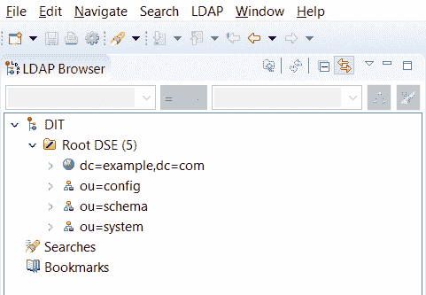

接下来，我们将开始创建一个数据结构来存储用户详细信息。正如你所见，LDAP 可以用来存储任何类型的信息，但我们将使用 LDAP 进行认证。LDAP 以树（DIT）的形式存储数据，因此我们将创建一个 DIT 结构。

# 示例 DIT 结构

接下来，让我们先看看在 LDAP 中常用的一些数据结构，然后从中选择一个：

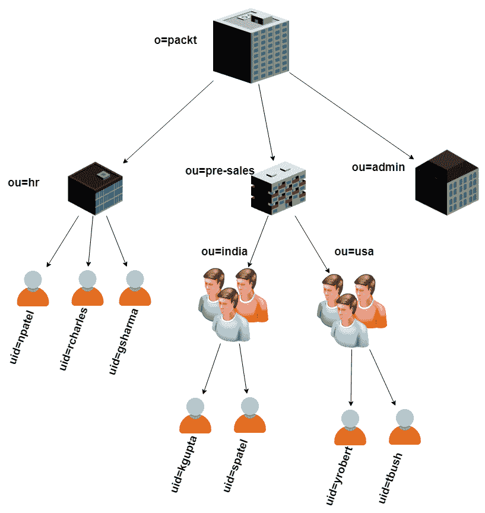

此结构以一个名为 packt（**o=packt**）的组织开始，然后是每个部门的组织单元（子组），最后是用户。在某些地方，子组织有一个用户组，然后是用户。

树也可以根据互联网域名进行排列，如下所示：

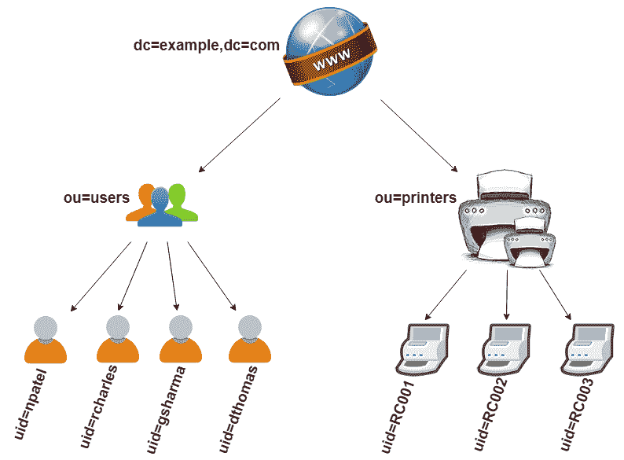

此结构以 `example.com` 作为域名。你可以使用不同的名称多次提供相同的属性，如之前所示。**dc** 代表 **domain component**。它后面跟着 **users** 和 **printers**（设备）的子组，最后列出 **users** 和设备（**printers**）。

另一个选项可能如下所示：

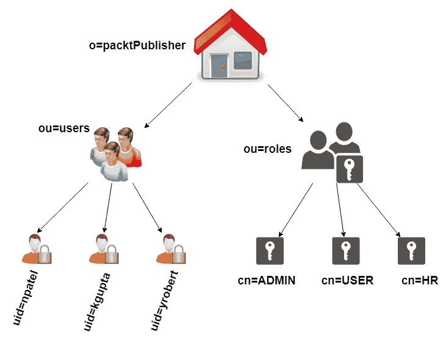

此选项以组织（**o=packtPublisher**）为根，有两个子节点 **users** 和 **roles** 作为 **ou**（组织单元或子组）。**users** 条目将包含用户条目，而 **roles** 条目将包含角色条目。在本章中，我们将选择此选项在 LDAP 中构建 DIT。LDAP 允许通过属性成员将用户与角色关联。你将在本书后面的 **在 LDAP 服务器中创建角色** 部分看到更多关于此的信息。

# Apache DS 分区

Apache DS 有一个称为 **分区** 的概念。每个分区包含一个实体树（DIT），它与其他分区的实体树完全断开连接。这意味着一个分区中实体树发生的更改永远不会影响其他分区的实体树。每个分区都有一个唯一的 ID。它还有一个称为 **分区后缀** 的命名上下文，可以将其视为该分区中 DIT 的根（或基础）；所有条目都存储在其下。

要在 Apache DS 中创建分区，请双击 LDAP 服务器选项卡中的服务器实例，它将打开服务器配置。打开服务器配置的分区选项卡，单击 **添加** 按钮，并为 **分区常规详情** 部分提供以下值：

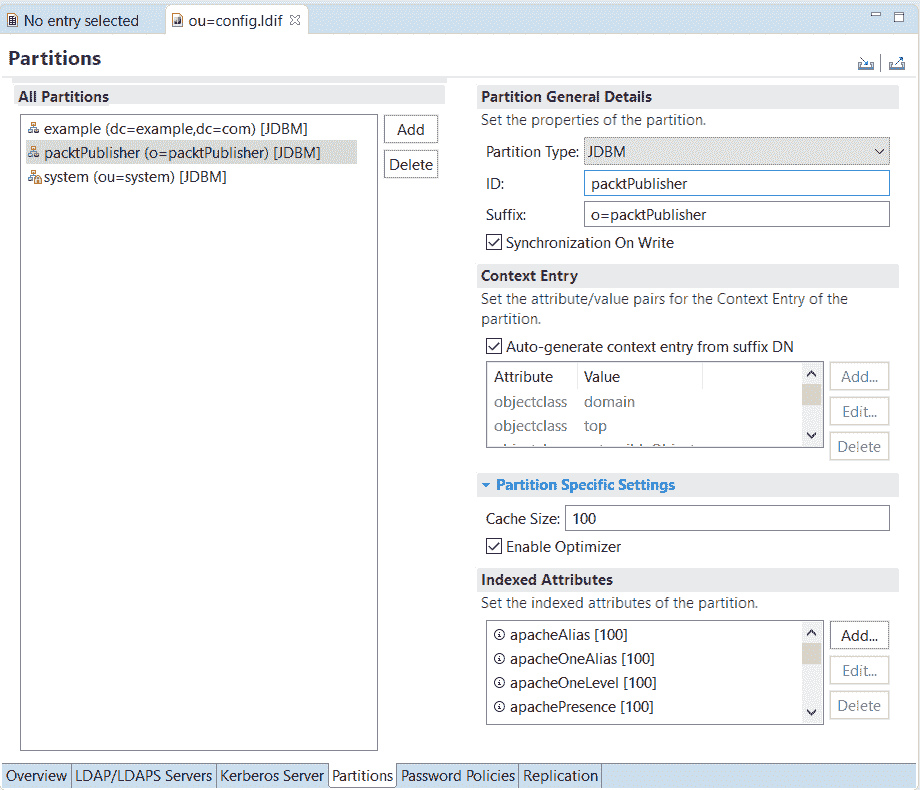

+   ID：`packtPublisher`

+   后缀：`o=packtPublisher`

将所有其他值保留为默认值，并保存配置。重启服务器以使分区生效。新的分区将在 LDAP 浏览器中可用，如下截图所示：

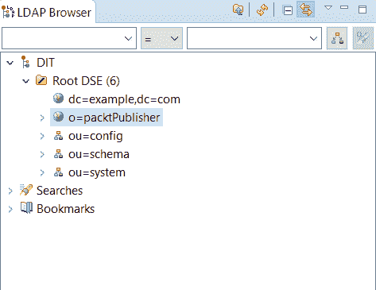

我们将在该分区下创建一个实体树（DIT）。分区后缀（`o=packtPublisher`）将被视为 DIT 的基础（或根）。接下来，我们将在其下创建条目。

# LDAP 结构

进一步操作，我们将查看 DIT 中的 DN 和 RDN 概念。我们针对您在“示例 DIT 结构”部分看到的第三个选项来定位我们的 DIT。让我们回忆一下，RDN 在兄弟姐妹中唯一地区分条目。这意味着它是使条目在父条目下独特的关键。我们可以使用任何属性来声明 RDN。此外，在每个级别，用作 RDN 的属性可以不同。

在我们的例子中，基的 RDN 是`o=packtPublisher`（这是分区后缀）。我们使用了属性`o`，它是组织名称。在其下方，有两个子项，其中使用了`ou`属性作为 RDN。属性`ou`代表组织单元。这两个子项分别代表用户和角色。

我们将在`users`实体下存储用户信息（用户名和密码，以及其他信息）。因此，`users`实体的子项是实际的用户实体，其中使用`uid`属性作为 RDN。属性`uid`代表**用户 ID**。通常，在任何组织中，要么使用用户名，要么使用电子邮件 ID 进行登录；因此，我们可以将它们中的任何一个作为`uid`属性的值。在这种情况下，我们将用户名作为`uid`。

我们已经介绍了 RDN 的工作原理。现在，让我们看看 DN 是如何工作的。正如我们描述的那样，DN 唯一地标识了给定 DIT 中的任何条目。换句话说，DN 在整个树（DIT）中使条目独特。DN 是由给定实体的 RDN 组成的逗号分隔字符串，包括所有其父实体，直到根实体。因此，DN 是根据每个级别的给定 RDN 自动计算的。

在上一个例子中，每个实体（带有`uid=npatel`）的 DN 将是`uid=npatel`*，* `ou=users`*，*和`o=packtPublisher`。同样，`users`实体的 DN 是`ou=users`和`o=packtPublisher`。这就是通过在每个级别附加 RDN 来计算 DN 的方式。

让我们在 Apace DS 中创建这个结构。按照以下步骤在 Apache Directory Studio 中展开 DIT 结构：

1.  右键单击分区`o=packtPublisher`，然后选择“新建”|“新建条目”。

1.  选择一个选项，“从头创建条目”，然后点击“下一步”。

1.  我们将添加一个实体类型组织单元，因此请选择`organizationalUnit`对象类，然后点击“下一步”。

1.  我们将使用`ou`（组织单元）作为 RDN，并使用`users`作为其值。当您给出 RDN 的值时，DN 会自动计算。您可以为 RDN 使用多个属性（或多次使用相同的属性，具有不同的值）。然后，DN 将通过在每个名称后附加逗号来计算。

1.  点击“下一步”，然后点击“完成”按钮，条目`ou=users`将被添加到`o=packtPublisher`下。更新后的结构将在 LDAP 浏览器窗口中可见。

一旦添加了`users`条目，我们可以在其下方插入单个用户条目。步骤如下：

1.  右键单击`users`实体（`ou=users`），然后选择“新建 | 新条目”。

1.  选择“从头创建条目”选项，然后点击下一步。

1.  我们将添加一个用户，因此请选择代表组织内人员的`inetOrgPerson`对象类。点击下一步按钮。

1.  我们将添加一个用户，因此我们将使用属性`uid`（用户 ID）作为 RDN。只需将值设置为`npatel`。您可以提供任何唯一标识用户的值。此时，DN 计算为`uid=npatel`,`ou=users`, `o=packtPublisher`。

1.  点击下一步，您将看到一些必需的属性，如`cn`和`sn`。`cn`代表**通用名称**，而`sn`表示**姓氏**。可以为`cn`和`sn`分别提供名字和姓氏。

1.  我们想要认证一个用户，因此用户实体必须有一个密码字段（属性）。只需在此屏幕上右键单击并选择“新建属性”。

1.  将属性类型指定为`userPassword`，然后点击“下一步 | 完成”；将弹出一个新窗口，在其中可以输入密码。

1.  为密码输入适当的值，确认密码，并将哈希方法设置为 SHA；点击“确定”按钮。从父窗口中点击“完成”按钮。

使用前面的步骤添加两到三个这样的用户。我们将在“*使用 Spring Security 的 LDAP 授权*”部分查看如何添加角色并创建实际角色。

Apache DS 的默认配置包含一个后缀为`dc=example`, `dc=com`的数据分区。此分区也可以使用，但为了详细了解概念，我们已创建了一个单独的分区。

恭喜！配置 LDAP 的基本步骤已完成。LDAP 服务器已准备好使用。接下来，我们将探讨如何使用 Spring Security 对 LDAP 服务器进行用户认证。

# Spring Security 与 LDAP 集成

在第三章，“*Blogpress - 一个简单的博客管理系统*”中，我们提供了关于 Spring Boot 的信息，并探讨了如何使用它创建应用程序。在本章中，我们将使用 Spring Boot 构建一个应用程序，以展示 Spring Security 中的认证和授权。在*LDAP*部分，我们介绍了 LDAP 服务器的安装和设置，以及其数据结构。在本节中，您将了解 Spring Security 如何与 LDAP 协同工作。

Spring Security 是一个高度综合和可扩展的框架；它为基于 J2EE 的 Web 和 REST 应用程序提供认证和授权支持。我们将探讨如何将 Spring Security 与 LDAP 集成以执行认证。根据定义，**认证**是验证或决定个人或实体是否为其声称的身份的机制。

为了演示认证，我们首先将使用 Spring Boot 构建一个 Web 应用程序，然后将其与 LDAP 集成。

# 使用 Spring Boot 创建 Web 应用程序

我们已经创建了数据结构，并在 LDAP 服务器中添加了用户及其凭据。接下来，我们将构建一个 Web 应用程序并集成 Spring Security，该应用程序将与 LDAP 服务器进行身份验证。在前一章中，我们使用 Spring MVC 和 Thymeleaf 构建了一个应用程序。我们将重用相同的架构并创建以下工件的应用程序：

+   Spring Boot，用于创建 Web 应用程序并对其他模块进行自动配置

+   Thymeleaf，用于表示层

+   Spring Security，用于与 LDAP 执行身份验证。

如前一章所述，在本章中，我们将使用基于 Eclipse 的 IDE，称为**Spring Tool Suite (STS**)。创建一个名为`SpringAuth`的 Spring Boot 应用程序，并添加其他合适的参数，如组、工件、版本、描述和 Java 包。确保将以下启动器添加到`pom.xml`中：

```java
<depedency>
  <groupId>org.springframework.boot</groupId>
  <artifactId>spring-boot-starter-security</artifactId>
</dependency>
<dependency>
  <groupId>org.springframework.boot</groupId>
  <artifactId>spring-boot-starter-thymeleaf</artifactId>
</dependency>
<dependency>
  <groupId>org.springframework.security</groupId>
  <artifactId>spring-security-ldap</artifactId>
</dependency>
```

在前面的条目中，`spring-security-ldap`不是一个启动器，而是一个普通依赖项。它提供了在 Spring Security 与 LDAP 集成中所需的相应依赖项。

我们将配置 LDAP 服务器作为数据源以获取用户详情并在 Spring Security 中执行身份验证。此时，Spring Security 应该知道如何连接到 LDAP 服务器。这些细节包括 URL、基础 RDN 和管理员凭据。我们将在`application.properties`文件中定义这些细节，如下所示。

```java
spring.ldap.urls=ldap://localhost:10389
spring.ldap.base=o=packtPublisher
spring.ldap.password=secret
spring.ldap.username=uid=admin,ou=system
```

这些细节很简单。用户名和密码代表 LDAP 管理员凭据。由于我们处理的是 LDAP，管理员用户名采用 DN 形式（如`uid=admin`*`ou=system`*），而不是直接值（如 admin）。我们可以将这些细节与我们用于与数据库交互的信息（如 URL、端口、用户名和密码）联系起来。我们将读取这些细节并将它们提供给 Spring Security 以与 LDAP 建立连接。为此，我们将编写一个配置类，如下所示：

```java
@Configuration
@ComponentScan(basePackages = { "com.nilangpatel.springldap.config" })
public class LdapDataConfig {

  @Value("${spring.ldap.urls}")
  private String ldapUrls;

  @Value("${spring.ldap.base}")
  private String ldapBase;

  @Value("${spring.ldap.password}")
  private String ldapManagerPwd;

  @Value("${spring.ldap.username}")
  private String ldapManagerUserName;

  @Bean("ldapAuthStructure")
  public LdapAuthStructure getLDAPAuthStructure() {
    LdapAuthStructure authStructure = new LdapAuthStructure();

    authStructure.setLdapUrl(ldapUrls);
    authStructure.setLdapBase(ldapBase);
    authStructure.setLdapManagerDn(ldapManagerUserName);
    authStructure.setLdapManagerPwd(ldapManagerPwd);
    authStructure.setUserDnPattern("uid={0},ou=users");
    authStructure.setUserSearchBase("ou=roles");

    return authStructure;
  }
}
```

此类简单地使用`@Value`注解读取 LDAP 连接属性，存储在`LdapAuthStructure`类的实例中，并将其定义为 Spring Bean，以便它可供其他类使用。`LdapAuthStructure`是一个自定义类，用于存储 LDAP 配置属性。我们将使用以下两个附加属性进行 Spring 与 LDAP 的集成：

+   `userDnPattern`：其值是`uid={0},ou=users`。这实际上是一个 DN 模式（相对于`ou=users`实体）。`{0}`将在 Spring 运行时被实际值（如`uid`、用户 ID）替换。

+   `userSearchBase`：它表示用户基础（`ou=users`）。基本上，它表示一个用户可以搜索的实体。

+   `groupSearchBase`：它表示组基础（`ou=roles`）。我们将使用此属性在后续部分执行授权。

接下来，我们将使用这些属性并使用安全配置类初始化 Spring Security，如下所示：

```java
@Configuration
@EnableWebSecurity
@ComponentScan("com.nilangpatel.springldap.security")
public class WebSecurityConfig extends WebSecurityConfigurerAdapter {

  @Autowired
  private LdapAuthStructure ldapAuthStructure;

  private Logger logger = LoggerFactory.getLogger(WebSecurityConfig.class);

  @Override
  public void configure(WebSecurity web) throws Exception {
    web.ignoring().antMatchers("/js/**");
    web.ignoring().antMatchers("/css/**");
  }

  @Override
  protected void configure(HttpSecurity http) throws Exception {
     http.authorizeRequests()
      .antMatchers("/").permitAll()
      .anyRequest().fullyAuthenticated().and()
    .formLogin().loginPage("/login").permitAll()
      .defaultSuccessUrl("/privatePage",true)
      .failureUrl("/login?error=true")
      .and()
    .logout()
      .permitAll().logoutSuccessUrl("/login?logout=true");
    logger.info("configure method is called to make the resources secure ...");
  }

  @Override
  protected void configure(AuthenticationManagerBuilder authManagerBuilder) throws Exception {
    authManagerBuilder.ldapAuthentication()
    .userDnPatterns(ldapAuthStructure.getUserDnPattern())
    .userSearchBase(ldapAuthStructure.getUserSearchBase())
    .contextSource()
      .url(ldapAuthStructure.getLdapUrl()+"/"+ldapAuthStructure.getLdapBase())
      .managerDn(ldapAuthStructure.getLdapManagerDn())
      .managerPassword(ldapAuthStructure.getLdapManagerPwd())
      .and()
    .passwordCompare()
      .passwordEncoder(new LdapShaPasswordEncoder())
      .passwordAttribute("userPassword");

    logger.info("configure method is called to build Authentication manager ...");
  }  

}
```

`WebSecurityConfig` 是一个扩展 `WebSecurityConfigurerAdapter` 类的自定义类。这个类是声明安全相关细节的单一点。`configure(WebSecurity web)` 方法用于忽略来自安全上下文的静态资源（JS 和 CSS）请求。如果没有这个方法，浏览器中不会加载任何静态资源，因为它们将被 Spring Security 过滤。

对于我们的应用程序，我们没有使用任何图像；如果我们使用了，图像路径（通常为 `/img/**`）也需要被忽略。

下一个方法 `configure(HttpSecurity http)` 用于设置各种页面（URL）的规则。我们的目的是展示使用 LDAP 的认证；因此，为了简化，有三个页面和相应的 URL，如下所示：

+   主页面（URL 为 `/`）。这是一个着陆页面，意味着当用户输入 `http://localhost:8080/springauth`（假设 `8080` 为服务器端口，`springauth` 为上下文）时，此页面将被打开。

+   登录页面（URL 为 `/login`）。它将显示一个登录表单，用户可以通过该表单进行认证。

+   一个私有页面（URL 为 `/privatePage`）。这是一个受保护的页面，并且仅对登录用户可用。用户登录成功后将被重定向到该页面。

主页面和登录页面对所有用户开放，而私有页面在登录成功后设置为成功 URL。这是一个简单的表单登录。下一个方法 `configure(AuthenticationManagerBuilder authManagerBuilder)` 实际上执行了魔法。这是配置 LDAP 作为认证机制的地方。

在这个类中，`LdapAuthStructure` 对象正在自动装配，它由 `LdapDataConfig` 类提供，我们在其中使用 `@Bean` 注解声明了它。让我们回顾一下，`LdapAuthStructure` 类持有 LDAP 连接数据，我们在 `configure(AuthenticationManagerBuilder authManagerBuilder)` 方法中使用这些数据。在 `AuthenticationManagerBuilder` 类上的 `ldapAuthentication()` 调用将设置认证类型为 LDAP。

此外，它还会设置其他连接数据，如 `userDnPattern` 和 `userSearchBase`。`url` 的值是 LDAP URL 和 LDAP 基础（例如，`localhost:10389/o=packtPublisher`）的组合。最后，管理员凭据通过 `managerDn()` 和 `managerPassword()` 调用提供。我们还需要提供一个密码编码器。它必须与我们在 LDAP 服务器上使用的相同的密码编码器，因此我们使用了 `LdapShaPasswordEncoder`。最后，我们只是提到了我们在 LDAP 服务器上设置的密码字段。

LDAP 认证配置已完成。当我们使用在 Apache DS 服务器中创建的（相同）凭据登录时，登录将会成功。我们已将`uid`设置为`userDnPatterns`，因此在登录时请使用`uid`作为用户名。

恭喜！Spring Security 与 LDAP 的集成已成功执行。用户将通过 Spring Security 对 LDAP 进行身份验证。如果您只需要使用 LDAP 进行身份验证，我们迄今为止所做的配置就足够了。接下来，我们将探讨如何通过 Spring Data 仓库与 LDAP 服务器交互，这是我们将在本章后面与 LDAP 和 OAuth 一起工作时使用的。

# 使用 Spring Data 管理 LDAP 用户

我们集成的一部分已经完成。LDAP 管理员可以从 LDAP 服务器配置用户；然后，他们可以通过使用 Spring Security 创建的 Web 应用程序进行身份验证。然而，我们仍然需要处理单独的系统（Apache DS）来维护用户信息。

如果管理员可以直接从 Spring Web 应用程序中维护用户，那会多么酷啊？这是一个很好的想法，因为它不仅会使管理员的工作变得简单，而且用户可以直接在基于 Spring 的 Web 应用程序中更新他们的个人资料信息（如密码、名字、姓氏等）。这完全可以通过 Spring Boot 实现。我们正在讨论从 Web 应用程序中执行对 LDAP 服务器的 CRUD 操作。

在我们的应用程序中，LDAP 被用作数据存储，我们在其中维护用户数据。每次我们需要在基于 Spring 的应用程序中处理任何类型的数据提供者时，我们都需要使用**Spring Data**，这是 Spring 家族的一个模块，专门设计用来与数据存储交互。Spring Data 提供了一个抽象层来与底层数据提供者交互，同时为每个数据提供者提供了实现，如 JPA、REST、Elasticsearch（我们在上一章中使用过）、Mongo DB 等。Spring Data LDAP 与 LDAP 服务器交互，我们将在应用程序中使用它。

Spring 为每个这些数据提供者提供了一套库，可以通过在 Spring Boot 应用程序中指定相应的启动器来使用。Spring Data LDAP 模块可以通过以下`pom.xml`中的启动器条目进行集成：

```java
<dependency>
  <groupId>org.springframework.boot</groupId>
  <artifactId>spring-boot-starter-data-ldap</artifactId>
</dependency>
```

在我们定义了这个启动器之后，所有必需的 JAR 文件都将出现在类路径中。接下来，我们将创建模型（实体）类。

# Spring Data 模型

Spring Data 模块提供了一个 DAO 的实现，目的是使对各种数据提供者的数据访问保持一致。这带来了在无需太多努力的情况下切换底层持久化技术的巨大灵活性。最终，这将使系统松散耦合。

Spring Data 允许以面向对象的方式与持久化层交换数据，这意味着我们可以使用实体类对象执行 CRUD 操作。不用说，Spring Data LDAP 模块还简化了以模型类对象的形式处理 LDAP 服务器的功能。因此，首先需要定义一个模型（实体）类，该类代表我们在 LDAP 服务器中定义的用户数据，如下所示：

```java
@Entry(
  base = "ou=users", 
  objectClasses = {"top", "person", "organizationalPerson","inetOrgPerson"})
public final class LdapAuthUser implements Persistable<Name> {

  @Id
  private Name id;

  @Attribute(name = "uid")
  @DnAttribute(value="uid")
  private String userName;

  @Attribute(name = "sn")
  private String surName;

  @Attribute(name = "cn") 
  private String firstName;

  @Attribute(name = "userPassword") 
  private String password;

  @Transient
  private boolean isNew;

  //.. setter and getter methods
}
```

`LdapAuthUser` 类代表我们在 Apache DS 中创建的 LDAP 用户。使用 `@Entity` 注解将 Java 类映射到 LDAP 服务器中的实体。`base` 代表 `users` 实体的基础（`ou=users`），而 `objectClasses` 用于定义用于创建用户实体的对象类层次结构。

使用 `@Attribute` 注解将实例变量映射到 LDAP 实体的属性。使用 `@DnAttribute` 注解自动填充从找到的条目的区分名称中的值。特别关注 `id` 实例变量。它将是 `javax.naming.Name` 类型。

在 LDAP 实体中没有直接属性，例如 `id`，但 Spring Data 需要为模型类的每个实例分配某种唯一标识符（例如，在关系型数据库中的 `PK`）。因此，在内部，它为模型类定义的 `base`（在 `@Entity` 注解中）分配一个相对的 DN。例如，如果用户的 `uid` 是 `npatel`，则 `id` 将是 `uid=npatel`，`ou=users`。

另一个独特之处在于，此模型类实现了 `Persistable<Name>` 接口。特别是对于 LDAP，在添加新实体时，Spring Data 没有任何方法知道实体是新的还是现有的。因此，每次 Spring Data 尝试搜索现有实体时，如果实体不存在，它将抛出一个错误。为了避免这种情况，在添加新记录时，我们将显式设置 `isNew` 属性为 `true`，这样 Spring Data 就可以通过重写方法 `isNew()` 获取其值。

模型类现在已准备好使用。接下来，我们将使用 Spring Data 对 LDAP 用户执行 CRUD 操作。

# Spring Data LDAP 存储库

正如你所见，Spring Data 在与持久化层一起工作时提供了一个抽象（接口）层，以支持各种数据存储，包括关系型数据库、非关系型数据库、MapReduce 框架、云服务等。抽象从 `CrudRepository` 接口开始，该接口提供了基本的 CRUD 操作，无论底层数据存储如何。此接口涵盖了所有基本的 CRUD 操作。

Spring Data 定义了各种接口，这些接口在`CrudRepository`之上针对每个数据提供者都是特定的。对于 LDAP 支持，Spring Data 提供了`LdapRepository`接口，该接口基本上扩展了`CrudRepository`接口，这是我们将在自定义仓库中扩展的接口。该接口具有执行 CRUD 操作所需的所有方法。通过扩展特定的仓库接口，所有标准数据访问的基本 CRUD 操作都将 readily 可用。

让我们在应用程序中添加 Spring Data 对 LDAP 的支持。自定义仓库接口将如下所示：

```java
@Repository
public interface LdapAuthRepository extends LdapRepository<LdapAuthUser>{

}
```

使用`@Repository`注解来描述这是一个仓库接口。自定义接口`LdapAuthRepository`扩展了`LdapRepository`，其中包含我们在上一节中创建的模型实体`LdapAuthUser`。在声明此接口后，Spring Data 提供了我们可以在服务类中使用的 CRUD 实现，如下所示：

```java
@Component
public class LdapAuthService {

  private Logger logger = LoggerFactory.getLogger(LdapAuthService.class);

  @Autowired
  private LdapAuthRepository ldapAuthRepository;

//Create
  public void addUser(LdapAuthUser ldapAuthUser) {
    Name dn = LdapNameBuilder
            .newInstance()
            .add("uid", ldapAuthUser.getUserName())
            .add("ou", "users")
            .build();

    boolean isExist = ldapAuthRepository.existsById(dn);
    if(isExist ==false) {
      ldapAuthRepository.save(ldapAuthUser);
    }else {
      logger.info("User with username "+ldapAuthUser.getUserName()+" is already exist ");
    }
  }
  //Read  
  public LdapAuthUser getUser(String userName) {
    Optional<LdapAuthUser> ldapAuthUserOptional = ldapAuthRepository.
            findOne(LdapQueryBuilder.query().where("uid").is(userName));
    if(ldapAuthUserOptional.isPresent()) {
      return ldapAuthUserOptional.get();
    }else {
      return null;
    }
  }
  //Update
  public void updateLdapUser(LdapAuthUser ldapUser) {
    ldapAuthRepository.save(ldapUser);

  }
//Delete
public void deleteUser(String userName) {
    Optional<LdapAuthUser> ldapAuthUserOptional = ldapAuthRepository.
            findOne(LdapQueryBuilder.query().where("uid").is(userName));
    if(ldapAuthUserOptional.isPresent()) {
      ldapAuthRepository.delete(ldapAuthUserOptional.get());
    }else {
      logger.info("User with username "+userName+" does not exist ");
    }
  }
}
```

在此服务类中，使用`@Autowired`注解注入了`LdapAuthRepository`类的对象。它用于调用 CRUD 方法，如下所示：

+   **创建**：使用`existsById()`命令来检查是否已存在具有相同 ID 的用户。ID 的类型为`javax.naming.Name`。`LdapNameBuilder`类用于构建 ID。如果用户不存在，则会在`ldapAuthRepository`对象上调用`save`方法，以创建一个新的对象。我们可以通过 Spring MVC 控制器调用此服务方法来添加记录。我们需要创建`LdapAuthUser`对象，设置数据，并从控制器方法中调用服务方法，如下所示：

```java
        LdapAuthUser ldapUser = new LdapAuthUser();
        ldapUser.setUserName("kpatel");
        ldapUser.setPassword("test1234");
        ldapUser.setFirstName("Komal");
        ldapUser.setSurName("Patel");
        ldapUser.setIsNew(true);

        Name dn = LdapNameBuilder.newInstance()
              .add("ou=users")
              .add("uid=kpatel")
              .build();
        ldapUser.setId(dn);

        ldapAuthService.addUser(ldapUser);
```

+   +   要创建新用户，首先需要创建模型类（`LdapAuthUser`）的对象及其属性。

    +   由于我们正在创建新用户，需要将`isNew`设置为`true`，以确保 Spring Data 模块将其视为新记录。如果不这样做，系统将抛出错误。

    +   我们还需要设置`id`的值。`LdapNameBuilder`用于创建`javax.naming.Name`类型的对象（`id`）。在`id`中还需要添加类似`uid=kpatel`（用户名）和`ou=users`的值。

+   **读取**：要读取具有`username`的 LDAP 用户，使用`findOne()`方法。我们需要将 LDAP 查询传递到这个方法中。`LdapQueryBuilder`类用于创建 LDAP 查询，该查询将`username`与`uid`匹配。

+   **更新**：更新操作很简单。`ldapAuthRepository`的`save`方法实际上会更新 LDAP 用户。

+   **删除**：在删除用户时，首先需要检查用户是否存在。再次，可以使用`findOne`来检索现有用户。只有当用户存在时，才能执行`delete`操作。

此外，我们可以使用以下方法在服务类中以编程方式执行身份验证，如下所示：

```java
 public boolean authenticateLdapUserWithContext(String userName, String password) {
    return ldapAuthRepository.authenticateLdapUserWithContext(userName, password);
  }

  public boolean authenticateLdapUserWithLdapQuery(String userName, String password) {
    return ldapAuthRepository.authenticateLdapUserWithLdapQuery(userName, password);
  }
```

`authenticateLdapUserWithLdapQuery` 和 `authenticateLdapUserWithContext` 是在 `LdapAuthRepositoryCustomImpl` 类中定义的自定义方法，其中我们可以定义自定义方法以与 LDAP 交互。我们将在下一节进一步讨论此主题。

在认证成功后，这些方法将返回 `true`；否则，它们将返回 `false`。我们需要以纯文本格式为这两个方法传递密码。这就是 Spring Data 仓库如何用于在 LDAP 用户上执行 CRUD 操作。或者，我们也可以使用 `LdapTemplate` 来执行 CRUD 操作，以及其他复杂的业务功能。

# 使用 LdapTemplate 执行 CRUD 操作

Spring Data 仓库是与底层数据提供者交互的便捷方式，因为它易于使用且代码量少，因为实现是由 Spring Data 模块提供的。然而，这种简单性伴随着某些限制。例如，使用仓库编程模型，我们只有基本的 CRUD 操作可用。对于更复杂的业务需求，我们需要扩展它并提供自己的仓库实现。这就是模板模型出现的地方。

Spring Data 模块中的模板模型在方便性上不如仓库抽象，但在提供更细粒度控制复杂操作方面更强大。我们将使用 Spring Data 模板模型查看相同的 CRUD 操作。当然，目的是学习如何准备 Spring Data 模板，以便它可以用于复杂的业务功能。

# 初始化 LdapTemplate

Spring Data 为每个底层数据提供者提供模板，如 `JdbcTemplate`、`JpaTemplate`、`MongoTemplate`、`ElasticSearchTemplate`、`CassandraTemplate` 等。`LdapTemplate` 是用于与 LDAP 服务器通信的模板。我们首先初始化 `LdapTemplate`。将以下方法添加到 `LdapDataConfig` 类中：

```java
@Bean("ldapTemplate")
  public LdapTemplate getLdapTemplate() {
    return new LdapTemplate(getLdapContextSrc());
  }

  @Bean
  public ContextSource getLdapContextSrc() {
    LdapContextSource ldapContextSrc = new LdapContextSource();
    ldapContextSrc.setUrl(ldapUrls);
    ldapContextSrc.setUserDn(ldapManagerUserName);
    ldapContextSrc.setPassword(ldapManagerPwd);
    ldapContextSrc.setBase(ldapBase);
    ldapContextSrc.afterPropertiesSet();
    return ldapContextSrc;
  }
```

`getLdapContextSrc()` 方法首先创建一个 `LdapContextSource` 对象，并使用从 `application.properties` 中读取的 LDAP 连接参数对其进行初始化。`@Bean` 注解将此对象导出为一个 Spring bean。第二个方法 `getLdapTemplate()` 使用 `LdapContextSoruce` 对象，并初始化 `LdapTemplate` 类的对象；然后，它通过 `@Bean` 注解以 `id=ldapTemplate` 的形式暴露为一个 Spring bean。

# 使用 LdapTemplate 执行 CRUD 操作

现在，我们已经初始化了 `LdapTemplate` 对象。接下来，我们将使用它来执行各种 CRUD 操作。我们将在 Spring Data 仓库结构中使用 `LdapTemplate`。为此，我们需要扩展 Spring Data 仓库模型并提供自定义实现。

创建一个接口：`LdapAuthRepositoryCustom`。这是一个可以定义自定义方法的地方，这些方法在仓库抽象中不可直接使用。更新`LdapAuthRepository`接口的定义，如下所示：

```java
@Repository
public interface LdapAuthRepository extends LdapRepository<LdapAuthUser>,LdapAuthRepositoryCustom
{

}
```

这是自定义实现与 Spring Data 仓库框架的粘合点。最后，定义`LdapAuthRepositoryCustomImpl`类，该类实现了`LdapAuthRepositoryCustom`接口。这是定义自定义方法的地方，如下所示：

```java
@Repository
public class LdapAuthRepositoryCustomImpl implements LdapAuthRepositoryCustom {

  private Logger logger = LoggerFactory.getLogger(LdapAuthRepositoryCustomImpl.class);

  @Autowired
  private LdapTemplate ldapTemplate;

  ...// Custom implementation method.
```

`LdapAuthRepositoryCustomImpl`实现了`LdapAuthRepositoryCustom`接口，用于声明自定义仓库方法。这个类有一个类型为`LdapTemplate`的实例变量，它通过`@Autowired`注解（在`LdapDataConfig`类中创建）进行注入。接下来，我们将查看这个类中定义的一些方法，如下所示。

+   **创建操作：**以下代码块描述了如何使用`ldapTemplate`通过创建操作添加新的 LDAP 用户：

```java
@Override
  public void create(LdapAuthUser ldapAuthUser) {
    ldapAuthUser.setIsNew(true);
    ldapTemplate.create(ldapAuthUser);
  }
  @Override
  public void createByBindOperation(LdapAuthUser ldapAuthUser) {

    DirContextOperations ctx = new DirContextAdapter();
    ctx.setAttributeValues("objectclass", new String[] {"top", "person",     "organizationalPerson","inetOrgPerson"});
    ctx.setAttributeValue("cn", ldapAuthUser.getFirstName());
    ctx.setAttributeValue("sn", ldapAuthUser.getSurName());
    ctx.setAttributeValue("uid", ldapAuthUser.getUserName());
    ctx.setAttributeValue("password", ldapAuthUser.getPassword());

    Name dn = LdapNameBuilder.newInstance()
            .add("ou=users")
            .add("uid=bpatel")
            .build();

    ctx.setDn(dn);
    ldapTemplate.bind(ctx);

  }
```

第一种方法很简单。它使用`ldapTemplate`通过模型对象创建 LDAP 用户。我们已将`isNew`设置为`true`，以确保在创建 LDAP 用户时不会出现任何问题。第二种方法`createByBindOperation`使用低级 API 创建 LDAP 用户。首先初始化`DirContextAdapter`对象，包含各种模型属性，如`objectClass`、`cn`、`sn`、`uid`、`userPassword`和`dn`。使用`LdapNameBuilder`类创建 LDAP 用户的 DN。最后，使用`ldapTemplate`的`bind`方法创建用户。我们可以使用这两种方法中的任何一种来创建用户。

+   **读取操作：**以下代码块展示了如何使用`ldapTemplate`通过读取操作获取 LDAP 用户：

```java
@Override
public LdapAuthUser findByUserName(String userName) {
    return ldapTemplate.findOne(
        LdapQueryBuilder.query().where("uid").is(userName), LdapAuthUser.class);
}

@Override
public List<LdapAuthUser> findByMatchingUserName(String userName) {
   return ldapTemplate.find(
       LdapQueryBuilder.query().where("uid").like(userName), LdapAuthUser.class);
}

@Override
public LdapAuthUser findByUid(String uid) {
    return ldapTemplate.findOne(LdapQueryBuilder.query().where("uid").is(uid), LdapAuthUser.class);
}

@Override
public List<LdapAuthUser> findAllWithTemplate() {
   return ldapTemplate.findAll(LdapAuthUser.class);
}

@Override
public List<LdapAuthUser> findBySurname(String surName) {
    return ldapTemplate.find(LdapQueryBuilder.query().where("sn").is(surName), LdapAuthUser.class);
}
```

这些是一些从 LDAP 服务器读取用户的方法。`LdapQueryBuilder`用于构建一个查询，可以用于执行对各种属性（如`uid`和`surname`）的搜索。它也可以用于使用`like`查询查找具有匹配属性的用户。

+   **更新操作：**以下代码块展示了如何使用`ldapTemplate`通过更新操作更新 LDAP 用户：

```java
@Override
  public void updateWithTemplate(LdapAuthUser ldapAuthUser) {
    ldapTemplate.update(ldapAuthUser);
  }
```

`update`方法很简单。`update()`方法用于使用模型对象更新 LDAP 用户。

+   **删除操作：**以下代码块描述了如何使用`ldapTemplate`通过 DELETE 操作删除 LDAP 用户：

```java
  @Override
  public void deleteFromTemplate(LdapAuthUser ldapAuthUser) {
    ldapTemplate.delete(ldapAuthUser);
  }

  @Override
  public void deleteFromTemplateWithUnbind(String userName) {
    Name dn = LdapNameBuilder.newInstance()
            .add("ou=users")
            .add("uid="+userName)
            .build();
    ldapTemplate.unbind(dn);
  }
```

第一种方法很简单。它只是调用`ldapTemplate`对象上的`delete`方法来删除 LDAP 用户。第二种方法首先创建用户 DN，然后调用`ldapTemplate`上的`unbind`方法来删除用户。

在`ldapTemplate`上的`delete`方法简单地调用`unbind`方法，并对给定的实体进行空检查。因此，`delete()`和`unbind()`这两个方法最终都在做同样的事情。

除了基本的 CRUD 操作外，我们还可以使用`ldapTemplate`执行一些其他操作，如下所示：

```java
@Override
public boolean authenticateLdapUserWithLdapQuery(String userName, String password) {
    try {
     ldapTemplate.authenticate(LdapQueryBuilder.query().where("uid").is(userName), password);
     return true;
    }catch(Exception e) {
      logger.error("Exception occuired while authenticating user with user name "+userName,e.getMessage(),e);
    }
    return false;
  }

@Override
public boolean authenticateLdapUserWithContext(String userName, String password) {
    DirContext ctx = null;
    try {
      String userDn = getDnForUser(userName);
      ctx = ldapTemplate.getContextSource().getContext(userDn, password);
      return true;
    } catch (Exception e) {
      // If exception occurred while creating Context, means - authentication did not succeed
      logger.error("Authentication failed ", e.getMessage(),e);
      return false;
    } finally {
      // DirContext must be closed here.
      LdapUtils.closeContext(ctx);
    }
}
```

第一个方法通过传递`LdapQuery`和密码在`ldapTemplate`上调用`authenticate`方法。使用`LdapQueryBuilder`为给定用户名创建 LDAP 查询。第二个方法通过传递用户 DN 和密码在`ldapTemplate`对象上调用`getContextSource().getContet()`。上下文在结束时需要关闭。使用`getDnForUser()`方法根据给定的`userName`获取用户 DN，如下所示：

```java
  private String getDnForUser(String uid) {
      List<String> result = ldapTemplate.search(
          LdapQueryBuilder.query().where("uid").is(uid),
          new AbstractContextMapper<String>() {
             protected String doMapFromContext(DirContextOperations ctx) {
                return ctx.getNameInNamespace();
             }
          });
      if(result.size() != 1) {
        throw new RuntimeException("User not found or not unique");
      }
      return result.get(0);
   }
```

`ldapTemplate`的`search`方法通过传递`LdapQuery`和`ContextMapper`的实现来调用，并最终返回给定用户名的用户 DN（例如，`uid=npatel`，`ou=users`，`o=packtPublisher`）。

# 使用 Spring Security 的 LDAP 授权

您在上一节中看到了使用 Spring Security 的 LDAP 身份验证。接下来，我们将探讨如何执行授权。让我们回顾一下，**授权**是一个验证过程，以确定实体是否应该有权访问某些内容。简而言之，授权涉及将确定谁被允许做什么的规则。在身份验证成功后，用户可以根据他们拥有的权限执行各种操作。

让我们回顾一下，身份验证处理登录凭证以验证有效用户。授权更多的是检查用户是否有权执行各种操作，如添加、更新、查看或删除资源。授权发生在用户成功认证之后。在本节中，我们将探讨如何授权 LDAP 用户。

到目前为止，您已经看到用户详情是在 LDAP 服务器中维护的，Spring Security 使用它来进行身份验证。同样，我们将在 LDAP 服务器中设置授权详情，并在 Spring Security 中获取它们以实现授权。

# 在 LDAP 服务器中创建角色

如您在上一节中看到的，我们在根实体`o=packtPublisher`下创建了`users`实体（`ou=users`），并将所有用户都保存在该实体下，在 LDAP 服务器中。同样，为了存储授权信息，我们将在 Apache DS 中直接在根实体下创建一个新的实体，步骤如下：

1.  在 LDAP 浏览器窗口中，右键单击分区`o=packtPublisher`并选择 New | New Entry。

1.  选择从零开始创建条目并点击 Next 按钮。

1.  我们将添加一个实体类型组织单元，因此选择 organizationalUnit 对象类并点击 Next 按钮。

1.  我们将使用`ou`（组织单元）作为 RDN，并将角色作为其值。当我们给出 RDN 的值时，DN 会自动计算。您可以为 RDN 使用多个属性（或相同的属性多次，具有不同的值）。然后，DN 将通过在每个属性后附加逗号来计算。

1.  点击“下一步”按钮，然后点击“完成”按钮，`ou=roles` 将被添加到 `o=packtPublisher` 之下。更新后的结构将在 LDAP 浏览器窗口中可见。

接下来，我们将在 `ou=roles` 条目下添加实际的角色条目。步骤如下：

1.  在角色实体（`ou=roles`）上右键单击，并选择*“新建 | 新条目”*。

1.  选择“从头创建条目”选项，然后点击“下一步”*.*。

1.  要添加一个角色，选择表示角色的对象类 `groupOfNames`。点击“下一步”按钮。

1.  我们将添加一个角色，因此我们将使用属性 `cn`（通用名称）作为 RDN。只需将值设置为 `ADMIN`。此时，DN 被计算为 `cn=ADMIN`, `ou=roles`, `o=packtPublisher`。点击“下一步”按钮。

1.  由于此实体具有 `groupOfNames` 作为对象类，系统将在下一个窗口中要求进行成员分配。

1.  点击“浏览”按钮，并在 `o=packtPublisher` 条目下选择您想要分配此角色的用户。点击“确定”按钮。

1.  以下是在给定角色中分配多个成员的步骤：

    1.  从 LDAP 浏览器窗口中选择任何角色条目。在中间部分（所选角色的详细信息以表格格式可见）右键单击，并选择“新建属性”。

    1.  将属性类型值设为 `member`，点击“下一步”*.*，然后点击“完成”按钮；您将看到用于选择分配此角色的用户的相同窗口。

执行这些步骤，并在角色条目下创建以下两个角色：

+   `ADMIN`

+   `USER`

角色结构已在 Apache DS 中创建。现在我们将导入这些详细信息以执行授权。

# 将角色信息导入以执行授权

在本章的“*示例 DIT 结构*”部分，我们在根实体（`o=packtPublisher`）下创建了一个角色实体（`ou=roles`）。该角色实体包含各种子实体作为其角色。我们将探讨如何使用这些角色通过 Spring Security 进行授权。我们已配置 Spring Security 使用 LDAP 进行认证。现在我们将添加两个示例页面，并配置它们，使得一个页面只能由具有 `ADMIN` 角色的用户访问，而另一个页面则由具有 `USER` 或 `ADMIN` 角色的用户访问。

要实现这一点，需要在为 Spring Security 配置创建的 `WebSecurityConfig` 类的 `configure` 方法中进行更改。更新后的方法应如下所示：

```java
  @Override
  protected void configure(HttpSecurity http) throws Exception {
    http.authorizeRequests()
      .antMatchers("/").permitAll()
      .antMatchers("/adminPage/").hasAnyAuthority("ADMIN")
      .antMatchers("/userPage/").hasAnyAuthority("USER")
      .anyRequest().fullyAuthenticated()
      .and()
   .formLogin().loginPage("/login").permitAll()
      .defaultSuccessUrl("/privatePage",true)
      .failureUrl("/login?error=true")
      .and()
      .logout()
      .permitAll().logoutSuccessUrl("/login?logout=true");
    logger.info("configure method is called to make the resources secure ...");
  }
```

我们已添加了一个管理员页面（URL 为 `/adminPage/`）和一个用户页面（URL 为 `/usePage/`），并已配置它们，以便分别由具有 `ADMIN` 和 `USER` 角色的用户访问。

此外，我们还需要在`src/main/resources/templates`文件夹下创建相应的 Thymeleaf 模板，并在 Spring MVC 控制器类中为这两个页面创建条目，并更新菜单结构（在页眉模板中定义），以容纳这些页面。详细内容在源代码中有所说明，源代码可在 GitHub 上找到（[`github.com/PacktPublishing/Spring-5.0-Projects`](https://github.com/PacktPublishing/Spring-5.0-Projects)）。

接下来，我们将更新代表 LDAP 配置的`configure`方法，使用 Spring Security。此方法接受一个类型为`AuthenticationManagerBuilder`的对象。在做出必要的更改后，此方法将如下所示：

```java
  @Override
  protected void configure(AuthenticationManagerBuilder authManagerBuilder) throws Exception {
    authManagerBuilder.ldapAuthentication()
      .userDnPatterns(ldapAuthStructure.getUserDnPattern())
      .userSearchBase(ldapAuthStructure.getUserSearchBase())
      .groupSearchBase(ldapAuthStructure.getGroupSearchBase())
      .groupSearchFilter("member={0}").rolePrefix("")
    .contextSource()
      .url(ldapAuthStructure.getLdapUrl()+"/"+ldapAuthStructure.getLdapBase())
      .managerDn(ldapAuthStructure.getLdapManagerDn())
      .managerPassword(ldapAuthStructure.getLdapManagerPwd())
      .and()
    .passwordCompare()
      .passwordEncoder(new LdapShaPasswordEncoder())
      .passwordAttribute("userPassword");

    logger.info("configure method is called to build Authentication manager ...");
  }
```

以下是我们在授权方面所做的更改：

+   添加了`groupSearchBase`方法调用，并将值传递为`ou=roles`，这代表组搜索的基础。组搜索基础值（`ou=roles`）存储在我们创建的用于保存 LDAP 连接属性的`ldapAuthStructure`对象中。

+   添加了一个`groupSearchFilter`方法调用，并将值传递为`member={0}`。它用于定义搜索成员的模式。`{0}`将在运行时被实际的用户 DN 所替换。

+   将额外的`rolePrefix("")`方法放置以设置角色前缀。如果没有这个方法调用，Spring Security 将使用`ROLE_`前缀来添加角色名称。例如，对于在 LDAP 服务器中定义的`ADMIN`角色，Spring Security 实际返回的角色将是`ROLE_ADMIN`。为了避免这种情况，我们调用此方法并简单地传递一个空字符串，这样我们就可以得到在 LDAP 服务器中定义的确切角色名称。

授权配置部分已经完成。你可以在 Apache DS 中创建一些示例用户，分配给他们角色，并检查他们是否能够访问我们创建的页面。没有任何角色的用户无法访问任何页面（无论是管理员页面还是用户页面）。

这就是使用 Spring Security 集成 LDAP 的全部内容。在下一节中，我们将探讨 OAuth 集成。

# OAuth

一个典型的 Web 应用程序需要凭证，以用户名/密码的形式进行身份验证。HTML 表单用于在浏览器中请求凭证，然后将它们发送到服务器。服务器随后验证信息，在服务器端创建并维护一个会话，并将会话 ID 发送回浏览器。

会话 ID 将在每个请求中发送，服务器将根据会话 ID 将会话与信息进行映射，并从数据库中提取某些信息以执行授权。浏览器通常将会话 ID 存储在 cookies 中。只要会话处于活动状态，用户就可以根据分配的权限访问受限制的资源。

这是一个相当简单且易于客户端-服务器交互的机制，因此，它至今仍被许多 Web 应用程序和服务所使用。然而，这种模型存在某些局限性，如下所述：

+   通常，cookie 是有状态的，因此服务器需要跟踪会话并在每次请求时与数据库（或在内存中）进行核对。这可能导致服务器上的开销。此外，授权过程与应用服务器紧密相关，导致系统紧密耦合。

+   对于 REST 客户端，如原生移动应用，cookie 可能无法正常工作。

+   如果应用功能分布在多个域中，可能需要额外的配置来维护 cookie 值。

+   基于 cookie 的模型存在授予第三方客户端访问权限的限制。

**OAuth**克服了这些限制。根据定义，它是一个授权框架（或更精确地说，是一个协议），允许应用访问同一或不同应用内的资源。换句话说，OAuth 2.0 允许第三方应用代表资源所有者有限地访问受保护资源。它支持移动、Web 和桌面应用的授权流程。当前该协议的版本是 OAuth 2.0。我们将 OAuth 2.0 与 Spring Security 集成。

尽管 OAuth 具有某些与带有会话的正常客户端-服务器机制不同的特性，但前者不能取代后者。例如，银行应用必须使用客户端-服务器机制来实现。这里给出的比较是为了展示 OAuth 如何被用来提供对第三方应用的访问。

# OAuth 角色

在继续之前，了解 OAuth 中使用的某些术语非常重要。这将提供对其底层概念的深刻理解。它们被称为 OAuth 角色，如下所示：

+   **资源所有者**：可以授予受保护资源访问权限的个人或实体。OAuth 协议不仅限于个人。应用与应用之间的交互可以通过 OAuth 进行。如果资源所有者是个人（或用户），则称为最终用户。

+   **授权服务器**：正如其名所示，它是一个提供授权的实体，形式为令牌。在资源所有者成功认证后，授权服务器将向客户端颁发访问令牌。

+   **资源服务器**：这是持有受保护资源的服务器。当请求受保护资源的请求到达资源服务器时，它将使用授权服务器验证访问令牌并相应地做出响应。

+   **客户端**：发起请求以支持资源所有者访问受保护资源的实体称为**客户端**。它可以以任何形式存在，如请求凭证的移动应用或提供社交媒体（如 Facebook 或 Google）替代登录功能的基于 Web 的应用。

这些角色之间的关系在以下图中展示：

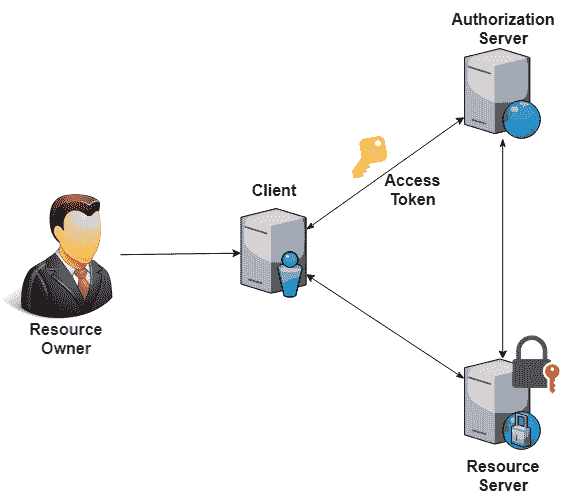

最终用户，即资源所有者，与一个充当客户端的应用程序进行交互。在这里，客户端将与授权服务器通信。资源所有者提供凭证，并在授权服务器首先进行认证。成功识别后，授权服务器会发放一个访问令牌，该令牌由客户端用于访问资源服务器上的受保护资源，以支持资源所有者。授权服务器也被称为**身份提供者**。

让我们通过一个现实生活中的场景来了解 OAuth 中的授权过程。假设约翰有一辆带有智能钥匙的汽车。如今，带有智能钥匙的汽车很常见，没有智能钥匙在口袋里，车辆无法操作（甚至无法解锁或启动）。约翰已经让他的朋友查尔斯去机场接他。他已经给了他一个智能钥匙。查尔斯使用智能钥匙启动了汽车。

在这个类比中，智能钥匙赋予查尔斯操作约翰汽车的授权，因为授权涉及用户可以访问的资源以及他们可以对这些资源做什么。在这种情况下，约翰是最终用户（资源所有者），而查尔斯是客户端。智能钥匙是访问令牌，而汽车的安保系统可以被视为授权服务器（或身份提供者），它通过智能钥匙（访问令牌）授权查尔斯（客户端）。整个汽车是资源服务器（查尔斯可以使用汽车的其它功能，如空调、音响系统等，因为他有权使用带有访问令牌（智能钥匙）的汽车）。

# 授权类型

OAuth 协议的核心是提供访问令牌进行授权。获取访问令牌的方式被称为**授权类型**。有各种方式（授权类型）来访问和使用访问令牌。OAuth 2.0 为不同的场景提供不同的授权类型，如应用程序的信任级别、应用程序类型等。

OAuth 2.0 支持以下类型的授权。选择最适合应用程序的类型取决于该应用程序的类型：

+   授权码

+   隐式

+   资源所有者密码凭证

+   客户端凭证

让我们详细看看每种授权类型：它们是如何工作的，以及它们最适合哪些情况。

# 授权码

作为最常用和最广泛使用的授权类型，授权码授权最适合服务器端应用程序。客户端将是一个 Web 应用程序。为了确保客户端与授权服务器正确交互，需要配置某些连接参数，如*客户端 ID*和*客户端密钥*，与客户端一起。由于客户端是 Web 应用程序，这些参数可以保密地维护。

在这种授权类型中，**客户端**必须能够与**用户代理（浏览器**）协作，因为授权码是通过浏览器路由的。授权码授权获取访问令牌的过程可以用以下图表描述。由于**资源所有者**在**授权服务器**上进行了身份验证，其凭证将不会与**客户端**共享：

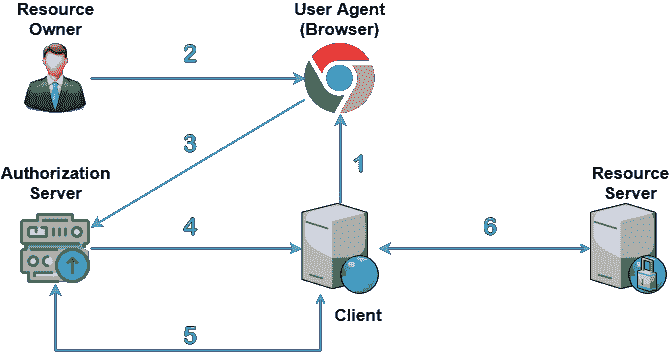

在此授权类型中，访问令牌是通过以下步骤获得的：

1.  **客户端**被配置为与授权服务器建立连接。它将在**用户代理（浏览器**）中打开链接。此链接包含其他信息，这些信息将被授权服务器用于识别并回应**客户端**。通常，链接将在新窗口中打开，并包含一个登录表单，作为授权的第一步来验证用户。

1.  然后，用户（**资源所有者**）以用户名和密码的形式输入凭证。

1.  浏览器（**用户代理**）然后将这些凭证发送到**授权服务器**。

1.  **授权服务器**验证凭证，并将带有授权码的响应发送回**客户端**。

1.  在收到授权码后，**客户端**将与之交换以从**授权服务器**获取访问令牌，以及可选的刷新令牌。

1.  获取访问令牌后，**客户端**可以与**资源服务器**通信以获取受保护资源。

授权码流可以与 Web 和移动应用客户端一起使用。通常，Web 应用客户端使用*客户端 ID*和*客户端密钥*，而移动应用客户端使用**证明密钥用于代码交换（PKCE**）机制，并利用代码挑战和代码验证器。

# 隐式

隐式授权类型是专门为在浏览器中运行的单一页面 JavaScript 应用程序设计的。它与授权码流最相似。唯一的区别在于授权码交换的过程。在隐式授权类型中，客户端不会从**授权服务器**接收授权码，与授权码授权类型不同，这是出于安全原因。

或者，一旦**用户代理**成功发送凭证，**授权服务器**将直接向**客户端**颁发访问令牌。由于隐式流针对的是单一页面 JavaScript 应用程序，因此也不允许刷新令牌。整个过程在以下图表中描述。

由于**授权服务器**直接颁发访问令牌，因此与**客户端**和**授权服务器**之间的请求-响应往返次数减少，与授权码流相比：

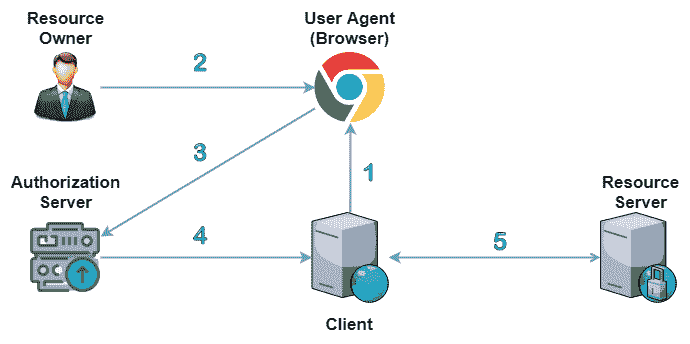

此过程按照以下顺序发生：

1.  **客户端**将在用户代理（浏览器）中打开一个新窗口，其中包含一个登录表单，以验证用户身份作为授权的第一步。

1.  然后，用户（资源所有者）以用户名和密码的形式输入凭证。

1.  浏览器（用户代理）然后将这些凭证发送到授权服务器。

1.  **授权服务器**验证凭证，并将访问令牌直接发送给**客户端**。

1.  在获得访问令牌后，**客户端**可以与资源服务器交谈以获取受保护的资源。

# 资源所有者密码凭证

资源所有者密码凭证授权类型应用于高度受信任的客户端，因为它直接处理用户凭证。换句话说，此授权类型仅在**资源所有者**和**客户端**之间有大量确定性时才应使用。通常，客户端将是一个第一方应用程序。凭证将由**客户端**直接使用，以与**授权服务器**交互并获得访问令牌。流程可以用以下图示描述：

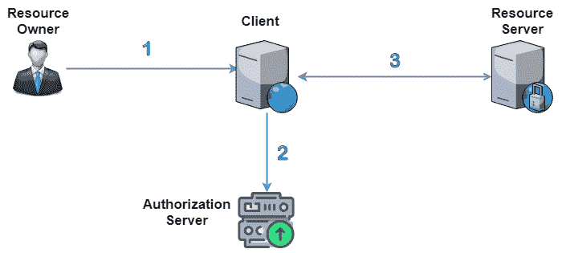

此流程可以描述如下：

1.  **客户端**高度受信任，因此它将直接要求**资源所有者**提供凭证。**客户端**可能是一个高度宠爱的应用程序。

1.  凭证将由**客户端**发送到**授权服务器**。**客户端**还将向**授权服务器**发送其自己的身份。作为回应，**授权服务器**将发送访问令牌，以及可选的刷新令牌。

1.  客户端使用访问令牌来访问**资源服务器**受保护的资源。

# 客户端凭证

客户端凭证授权类型与资源所有者密码凭证流程类似。在客户端凭证授权中，**客户端**与**授权服务器**交互，通过发送客户端 ID 和客户端密钥来提供识别，并获得访问令牌。一旦收到访问令牌，**客户端**将与**资源服务器**交互。在这种情况下，不应使用刷新令牌。流程图如下所示：

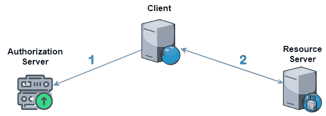

1.  **客户端 ID**和**客户端密钥**与**客户端**配置。**客户端**将与**授权服务器**交互以获取访问令牌。

1.  在获得访问令牌后，**客户端**可以与**资源服务器**交互以访问受保护的资源。

# 应使用哪种授权类型？

在了解了每种授权类型的详细信息后，了解给定应用程序的正确授权类型非常重要。在授权类型选择中起着关键作用的因素有很多，例如最终用户识别、客户端类型（服务器端、基于 Web、本地、客户端）以及客户端和资源所有者之间的保证水平。

如果我们计划构建一个应用程序并允许其他第三方应用程序访问资源，那么授权码流是正确的选择。它是公开托管应用程序高度推荐的一种授权类型。另一方面，如果客户端是基于 JavaScript 并在浏览器中运行，我们应该为第三方客户端选择隐式授权类型，而对于第一方客户端，则应使用资源所有者密码凭证授权。

如果客户端是本地（移动）应用程序，我们可以选择资源所有者密码凭证授权类型。如果资源所有者不需要最终用户的身份，并且客户端本身表现得像资源所有者，我们应该使用客户端凭证授权类型。通常，客户端凭证授权用于机器（而不是用户）需要授权访问受保护资源，且不需要用户权限。

# Spring Security 与 OAuth 集成

在了解了 OAuth 2.0 的基本原理及其工作方式之后，我们现在将探讨 OAuth 在 Spring Security 中的集成。我们将继续使用为 LDAP 创建的相同应用程序，并对其进行必要的更改以实现 OAuth 集成。

对于 OAuth 演示，我们将使用现成的授权提供程序。Spring Security 默认支持 Google、Facebook、Okta 和 GitHub 提供程序。选择其中之一只需要进行某些配置，然后一切就会开始工作。我们将选择 Google 作为授权服务器（提供程序）来为我们构建 OAuth。在这个集成中，我们将使用授权码作为授权类型。

每个授权提供程序都支持某种机制，允许客户端与服务建立连接。这个过程被称为**应用注册**。

# 应用注册

让我们在 Google 上注册（或创建）一个应用程序，该应用程序提供连接访问以使用授权服务。这是开始实现 OAuth 之前的一个基本步骤。Google 提供了一个**API 控制台**用于注册应用程序。访问 API 控制台需要一个有效的 Google 账户。请访问[`console.developers.google.com/apis/credentials`](https://console.developers.google.com/apis/credentials)并按照以下步骤操作：

1.  在“凭证”选项卡中单击“创建凭证”按钮，然后单击“OAuth 客户端 ID”选项。选择应用程序类型为 Web 应用程序。

1.  给出适当的名称（例如 `SpringOAuthDemo`）。

1.  我们需要在 Google 控制台中设置授权重定向 URI，它代表用户在通过 Google 成功授权后将被重定向的路径。Spring Security 为 Google 提供的默认实现已将重定向 URI 配置为`/login/oauth2/code/google`。显然，在我们的情况下，有效的重定向 URI 将是[`localhost:8080/springuath/login/oauth2/code/google`](http://localhost:8080/springuath/login/oauth2/code/google)（考虑到`8080`为端口号，`springauth`为上下文名称）。在 Google 控制台的“授权重定向 URI”中提供此 URI，然后点击“创建”按钮。

应用程序成功注册后，Google 将创建客户端凭据，以客户端 ID 和客户端密钥的形式，如下面的截图所示：

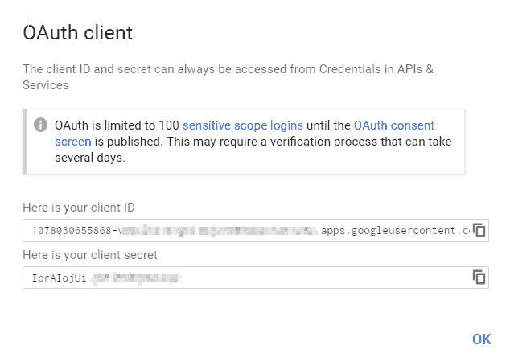

客户端 ID 是一种公钥，由 Google 服务 API 用于识别我们已注册的应用程序。它还用于构建 Google 登录表单的授权 URL。客户端密钥，正如其名称所示，是一种私钥。当（我们注册的应用程序）请求用户账户的详细信息时，在用户凭证发送的那一刻，客户端密钥将用于验证应用程序的身份。因此，客户端密钥必须在应用程序和客户端之间保持私密。

# Spring Boot 应用程序中的更改

完成前面的要求后，我们将开始对我们为 LDAP 认证创建的 Spring Boot 应用程序进行必要的更改。目标是构建一个中央认证和授权服务器，该服务器将同时与两种技术（LDAP 和 OAuth）协同工作。

当用户输入普通用户名和密码时，认证和授权将通过 LDAP 完成。我们将使用 Google 和 OAuth 配置我们的应用程序。OAuth 集成的第一步是声明相关的启动器。Spring Boot 以启动器的形式提供对 OAuth 的支持。在`pom.xml`文件中添加以下启动器条目：

```java
<dependency>
  <groupId>org.springframework.boot</groupId>
  <artifactId>spring-boot-starter-oauth2-client</artifactId>
</dependency>
```

定义此启动器后，Spring Boot 将自动添加以下依赖项，这些依赖项对于 OAuth 集成是必需的：

```java
<dependency>
  <groupId>org.springframework.security</groupId>
  <artifactId>spring-security-oauth2-client</artifactId>
</dependency>
<dependency>
   <groupId>org.springframework.security</groupId>
   <artifactId>spring-security-oauth2-jose</artifactId>
</dependency>
<dependency>
   <groupId>org.springframework.security</groupId>
   <artifactId>spring-security-oauth2-core</artifactId>
</dependency>
```

接下来，我们将在`application.properties`文件中添加客户端 ID 和客户端密钥的属性，以及提供者和客户端名称。这些属性以`spring.security.oauth.client.registration`为前缀，包括提供者名称和属性名称。按照以下方式设置这些属性，使用我们在上一节中在 Google 开发者控制台中创建的`Client ID`和`Client Secret`：

```java
spring.security.oauth2.client.registration.google.provider=google
spring.security.oauth2.client.registration.google.client-name=Google
spring.security.oauth2.client.registration.google.client-id=<GOOGLE_CLIENT_ID>
spring.security.oauth2.client.registration.google.client-secret=<GOOGLE_SECRET>
```

# 默认 OAuth 配置

Spring Security 允许配置多个 OAuth 客户端。除了 Google 之外，Spring Security 还支持 Facebook、GitHub 和 Okta 的默认配置，开箱即用。这意味着所有必需的类和配置都 readily 可用，我们只需要定义客户端凭证（`Client ID`和`Client Secret`）。接下来，我们将更新`WebSecurityConfig`类的`configure(HttpSecurity http)`方法，如下所示：

```java
@Override
  protected void configure(HttpSecurity http) throws Exception {
     http.authorizeRequests()
      .anyRequest().authenticated()
      .and()
        .oauth2Login();
     super.configure(http);
  }
```

`oauth2Login()`方法将启动 OAuth 调用。在此时刻，当执行应用程序时，前面的方法将向 Google 发起 OAuth 调用。用户将被要求提供有效的 Google 登录凭证。认证成功后，它将显示主页。

如果我们为至少一个客户端设置了属性，Spring Security 将自动启用`Oauth2ClientAutoConfiguration`类，这将使所有必要的安排以启用 OAuth 登录，甚至不需要定义前面的`WebSecurityConfig`类。

如果在`application.properties`文件中配置了多个客户端，系统将显示这些客户端的列表，并带有默认的登录表单（用户名和密码）。这将是一个自动生成的登录页面。我们可以使用任何配置的客户端进行登录。

在顶部显示用户名以指示当前登录的用户是非常明显的。我们可以使用以下代码片段获取在 Google 上认证的用户名：

```java
@ModelAttribute("currentUserName")
public String getCurrentUserName() {
  String name = "";
  if(SecurityContextHolder.getContext().getAuthentication() !=null) {
    if(SecurityContextHolder.getContext().getAuthentication() 
        instanceof OAuth2AuthenticationToken) {
      OAuth2AuthenticationToken oauth2Authentication = 
          (OAuth2AuthenticationToken)SecurityContextHolder.getContext().getAuthentication();
      name = (String)oauth2Authentication.getPrincipal().getAttributes().get("name");
    }else {
      String userName = SecurityContextHolder.getContext().getAuthentication().getName();
      LdapAuthUser ldapUser = ldapAuthService.getUser(userName);
      if(ldapUser !=null) {
        name = ldapUser.getFirstName()+" "+ldapUser.getSurName();
      }
    }
  }
  return name;
}
```

此方法使用`ModelAttribute`定义，这意味着它可以直接在表示层中使用`${currentUserName}`表达式。我们正在获取`Authentication`的一个实例，并检查它是否为`OAuth2AuthenticationToken`类型。`getPrincipal()`方法将返回用户详情以及属性。`name`属性将返回使用 Google 登录的用户名。

另一部分将在我们使用 LDAP 进行认证时执行，它从`Authentication`对象中获取`userName`，然后调用自定义服务方法（`ldapAuthService.getUser()`）来获取 LDAP 用户对象。然后使用它来获取用户名（名和姓）。

# 使用自定义登录页面的 OAuth

这就是 OAuth 如何与 Spring Security 集成的。在前面的配置中，Spring Boot 提供了一个自动生成的登录页面，这可能适用于测试目的。在实际场景中，我们可能需要一个定制的登录页面。要构建自定义登录页面，我们需要在`configure(HttpSecurity http)`方法中进行某些配置更改，如下所示：

```java
 http.authorizeRequests()
  .antMatchers("/","/login").permitAll()
  .antMatchers("/adminPage/").hasAnyAuthority("ADMIN")
  .antMatchers("/userPage/").hasAnyAuthority("USER")
  .anyRequest().fullyAuthenticated()
    .and()
  .oauth2Login().loginPage("/login")
    .defaultSuccessUrl("/privatePage",true)
    .failureUrl("/login?error=true")
    .and()
  .logout()
    .permitAll().logoutSuccessUrl("/login?logout=true");
```

这看起来与我们为 LDAP 配置的类似。唯一的区别是我们使用`oauth2Login()`而不是`formLogin()`。在末尾已经移除了对`super.configure(http)`的调用，因为它不再需要。如果我们将其放置在那里，Spring Boot 将显示一个自动生成的登录页面，所以请确保在末尾将其移除。

此更改将显示自定义登录页面，但 OAuth 提供者的列表不会自动可见。我们需要手动准备此列表，并在登录页面中显示它们。为了实现这一点，我们需要更新控制器方法`showLoginPage()`，如下所示。此方法基本上显示登录页面：

```java
@Autowired
private ClientRegistrationRepository clientRegistrationRepository;

@GetMapping("/login")
public String showLoginPage(@RequestParam(value = "error",required = false) String error,
    @RequestParam(value = "logout", required = false) String logout,Model model) {
  logger.info("This is login page URL ");

  if (error != null) {
    model.addAttribute("error", "Invalid Credentials provided.");
  }

  if (logout != null) {
    model.addAttribute("message", "Logged out");
  }

  String authorizationRequestBaseUri = "oauth2/authorization";
  Map<String, String> oauth2AuthenticationUrls = new HashMap<String, String>();

  Iterable<ClientRegistration> clientRegistrations = (Iterable<ClientRegistration>)  clientRegistrationRepository;

  clientRegistrations.forEach(registration -> 
  oauth2AuthenticationUrls.put(registration.getClientName(), 
      authorizationRequestBaseUri + "/" + registration.getRegistrationId()));
  model.addAttribute("urls", oauth2AuthenticationUrls);

  setProcessingData(model, LdapAuthConstant.TITLE_LOGIN_PAGE);

  return "login";
}
```

这是我们在本章开头创建的登录方法，用于显示登录表单。更改专门针对 OAuth 进行。首先，注入了`ClientRegistrationRepository`的实例，它表示存储 OAuth 客户端主要详情的仓库。它是一个接口类型，Spring Boot 提供了`InMemoryClientRegistrationRepository`类的实例作为默认实现。`InMemoryClientRegistrationRepository`维护一个`ClientRegistration`映射，该映射表示 OAuth 提供者。

在前面的代码中，我们从`clientRegistrationRepository`获取`ClientRegistration`映射，迭代它，并使用以`oauth2/authorization`为前缀的名称和授权 URL 准备 OAuth 提供者列表。我们将它设置为模型属性，以便它对表示层可用。应用这些更改后，登录页面将如下所示：

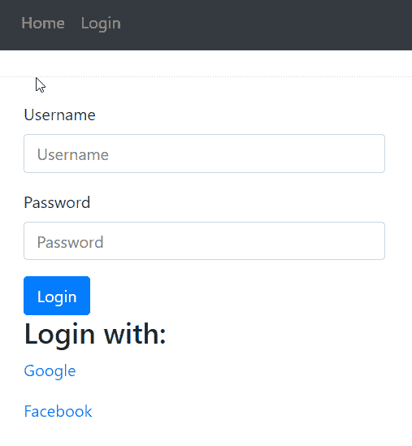

# OAuth 和 LDAP 的双因素认证

应用程序现在将显示自定义登录页面，以及我们配置的 OAuth 客户端列表。尽管如此，当我们手动在登录表单中输入凭据时，什么也不会发生，因为 Spring Security 已配置为 OAuth。当用户在登录表单中输入凭据时，应使用 LDAP 进行认证。为了实现这一点，我们需要在 LDAP 中进行特定的配置。

在这里，目标是使用 LDAP 进行手动认证。Spring Security 提供了一种通过实现`AuthenticationProvider`接口来定义自定义认证提供者的方式。首先，我们将编写一个实现此接口并执行 LDAP 认证的类，如下所示：

```java
@Component
public class CustomLdapAuthProvider implements AuthenticationProvider{

  @Autowired
  LdapAuthService ldapAuthService;

  @Override
  public Authentication authenticate(Authentication authentication) throws AuthenticationException {
    String userName = authentication.getPrincipal().toString();
    String password = authentication.getCredentials().toString();

    boolean isAuthenticate = ldapAuthService.authenticateLdapUserWithContext(userName, password);

    if(isAuthenticate == true) {
      List<LdapGranntedAuthority> userRoles = ldapAuthService.getUserAuthorities(userName);
      return new UsernamePasswordAuthenticationToken(
          userName, password, userRoles);
    }else {
      return null;
    }
  }

  @Override
  public boolean supports(Class<?> authentication) {
    return authentication.equals(
        UsernamePasswordAuthenticationToken.class);
  }
}
```

类`CustomLdapAuthProvider`使用`@Component`注解定义，这意味着 Spring 会将其配置为一个 bean，以便其他带有`@Autowired`注解的组件可以使用它。`AuthenticationProvider`接口声明了以下两个方法：

+   `Authentication authenticate(Authentication authentication)`：这是我们可以提供自定义认证的地方。

+   `boolean supports(Class<?> authentication)`：此方法指示此自定义认证提供者是否支持指示的认证对象。

在`authenticate`方法中，我们首先从`Authentication`实例中获取`username`和`password`。然后，通过调用我们已为 LDAP 认证创建的自定义服务方法`authenticateLdapUserWithContext`进行手动认证。如果此方法返回`true`，则表示凭证有效。

除了验证凭证外，我们还需要获取用户拥有的权限（角色）。为此，我们在自定义仓库`impl`类（`LdapAuthRepositoryCustomImpl`）中定义了一个方法，如下所示：

```java
@Override
public List<LdapGranntedAuthority> getUserAuthorities(String userName) {
  AndFilter groupFilter = new AndFilter();
  groupFilter.and(new EqualsFilter("objectclass","groupOfNames"));
  groupFilter.and(new EqualsFilter("member","uid="+userName+",ou=users,o=packtPublisher"));
  List<LdapGranntedAuthority> userRoleLst =  ldapTemplate.search(LdapQueryBuilder.query().
                      filter(groupFilter),new LdapRoleMapper());
  return userRoleLst;
}
```

`getUserAuthorities`方法接受`userName`并返回权限列表。让我们回顾一下，对于角色，我们在 Apache DS 中创建了一个单独的实体（`ou=roles`）。它的所有子实体代表实际的角色（属性`cn`作为角色名称）。任何是特定权限（角色）成员的 LDAP 用户都会通过`member`属性添加。目标是获取当前用户是成员的所有权限。

`ldapTemplate`上的搜索方法接受`LdapQuery`和`ContextMapper`对象，并返回权限列表。`LdapQuery`使用`objectclass`的组过滤器以及成员属性的值构建。`objectclass`的值与我们在 LDAP 中给实体（`ou=roles`）指定的`objectclass`名称相同。成员属性的值将是一个有效的用户 DN；例如，`uid=npatel`，`ou=users`，`o=packtPublisher`。`ContextMapper`是一种从`search`方法中检索所需值的机制。更具体地说，`ContextMapper`可以用来检索自定义结果（将选定的值包装在自定义 POJO 中）。

这可以通过提供`ContextMapper`接口的实现来完成。为此，我们创建了一个类，如下所示：

```java
public class LdapRoleMapper implements ContextMapper<LdapGranntedAuthority>{

  @Override
  public LdapGranntedAuthority mapFromContext(Object ctx) throws NamingException {
    DirContextAdapter adapter = (DirContextAdapter) ctx;
    String role = adapter.getStringAttribute("cn");
    LdapGranntedAuthority ldapGranntedAuthority = new LdapGranntedAuthority();
    ldapGranntedAuthority.setAuthority(role);
    return ldapGranntedAuthority;
  }
}
```

`ContextMapper`接口是一个原始类型，因此我们将类型定义为`LdapGranntedAuthority`，这实际上是一个自定义 POJO。在`mapFromContext`方法中，使用`DirContextAdapter`对象通过属性`cn`获取角色的名称。然后，将此角色名称设置在`LdapGranntedAuthority`实例中，并最终返回它。`LdapGranntedAuthority`类如下所示：

```java
public class LdapGranntedAuthority implements GrantedAuthority {

  String authority;
  public void setAuthority(String authority) {
    this.authority = authority;
  }
  @Override
  public String getAuthority() {
    return authority;
  }
}
```

此 POJO 实现了`GrantedAuthority`接口以设置权限（角色）的名称。现在，让我们回到`CustomLdapAuthProvider`类的`authenticate`方法。在获取权限后，我们使用用户名、密码和权限列表创建`UsernamePasswordAuthenticationToken`类的对象。`UsernamePasswordAuthenticationToken`类基本上提供了`Authentication`接口的实现。

接下来，借助这个自定义认证提供者，我们将进行手动认证。在此之前，我们必须更改登录表单的操作，因为默认的（`/login`）将无法自动工作。将登录表单的路径从 `/login` 更改为 `/ldapLogin`。我们还需要创建一个相应的控制器方法来手动处理登录流程，如下所示：

```java
@Autowired
CustomLdapAuthProvider customLdapAuthProvider;

@PostMapping("/ldapLogin")
public String ldapAuthenticate(HttpServletRequest req,@RequestParam(value = "username",required = true) String username,
    @RequestParam(value = "password", required = true) String password,RedirectAttributes redirectAttributes) {

  UsernamePasswordAuthenticationToken authReq
  = new UsernamePasswordAuthenticationToken(username, password);
  Authentication auth = customLdapAuthProvider.authenticate(authReq);
  if(auth !=null) {
    logger.info(" If user is authenticated .... "+auth.isAuthenticated());
    SecurityContext sc = SecurityContextHolder.getContext();
    sc.setAuthentication(auth);
    HttpSession session = req.getSession(true);
    session.setAttribute(HttpSessionSecurityContextRepository.SPRING_SECURITY_CONTEXT_KEY, sc);

    if(auth.isAuthenticated() == true) {
      return "redirect:/privatePage"; 
    }else {
      redirectAttributes.addAttribute("error", "true");
      return "redirect:/login";
    }
  }else { // failed authentication - either username or password fails.
    redirectAttributes.addAttribute("error", "true");
    return "redirect:/login";
  }
}
```

`CustomLdapAuthProvider` 实例通过 `@Autowired` 注解进行注入。此方法使用 `@PostMapping` 注解定义，用于处理使用 POST 方法的登录表单。我们使用登录表单提交的用户名和密码创建 `UsernamePasswordAuthenticationToken` 实例，并将其传递给 `CustomLdapAuthProvider` 的 `authenticate` 方法，该方法基本上使用 LDAP 进行身份验证并获取用户权限。一旦完成身份验证，我们将认证对象存储在 Spring Security 上下文中。

最后，我们已经将安全上下文保存在 HTTP 会话中，以便 Spring Security 将在会话中创建并维护用户认证信息。在执行所有这些过程之后，我们通过在认证对象上调用 `isAuthenticated` 方法来检查认证是否成功。根据认证状态（成功或失败），我们将流程重定向到私有页面（在成功认证的情况下）或登录页面（在认证失败的情况下）。这全部都是关于使用 LDAP 和 OAuth 进行双重认证。接下来，我们将展示在自定义授权服务器上的 OAuth 实现。

# 使用自定义授权服务器的 OAuth 授权

现在，您已经看到了使用第三方提供者（Google）通过 Spring 集成 OAuth。在本节中，我们将构建一个自定义授权服务器（提供者）并执行 OAuth 授权。我们还将构建自己的资源服务器，并在授权完成后访问资源。

在上一节中，我们使用 Google 的授权代码授予类型。在本节中，我们将实现隐式授予类型。让我们回顾一下，隐式授予类型是专门为 JavaScript 应用程序设计的。由于它在浏览器中运行，授权服务器直接发送访问令牌。出于安全考虑，不支持刷新令牌。

我们将首先开发一个自定义授权服务器（提供者），它将提供访问令牌。我们可以将其视为上一节中我们开发授权客户端的地方，即 Google。对于我们的自定义授权，我们将设置一个带有凭证（ID 和密钥）的客户端，这些凭证将用于提供授权（以提供访问令牌的形式）。

我们将为授权服务器和资源服务器创建单独的 Spring Boot 应用程序，并且需要同时运行它们，以便测试功能。为了避免端口冲突（两个应用程序的默认端口都是 8080），在运行时需要明确设置端口。为此，您需要在 `application.properties` 文件中提供一个不同的端口属性 `server.port`。

# 授权服务器配置

我们将开发一个单独的 Spring Boot 应用程序，并应用必要的配置以将其用作授权服务器。这是我们自定义的授权服务器。创建一个名为 `SpringCustomAuthorization` 的 Spring Boot 应用程序，并添加以下组件，它基本上是构建自定义授权服务器的基本入口点：

```java
@Configuration
@EnableAuthorizationServer
public class CustomAuthorizationConfig extends AuthorizationServerConfigurerAdapter{

  @Autowired
    @Qualifier("authenticationManager")
    private AuthenticationManager authenticationManager;

  @Autowired
  PasswordEncoder encoder;

    @Override
    public void configure(ClientDetailsServiceConfigurer clients) 
      throws Exception {
        clients.inMemory()
          .withClient("c1")
          .authorizedGrantTypes("implicit")
          .scopes("read", "write", "trust")
          .secret(encoder.encode("123"))
          .redirectUris("http://localhost:8082/privatePage")
          .resourceIds("oauth2-server");
    }

    @Bean
    public JwtAccessTokenConverter accessTokenConverter() {
        JwtAccessTokenConverter converter = new JwtAccessTokenConverter();
        converter.setSigningKey("123");
        return converter;
    }

    @Bean
    public TokenStore tokenStore() {
        return new JwtTokenStore(accessTokenConverter());
    }

    @Override
    public void configure(
      AuthorizationServerEndpointsConfigurer endpoints) 
      throws Exception {
        endpoints
          .authenticationManager(authenticationManager)
          .tokenServices(tokenServices())
          .tokenStore(tokenStore())
          .accessTokenConverter(accessTokenConverter());
    }

    @Bean("resourceServerTokenServices")
    @Primary
    public DefaultTokenServices tokenServices() {
        DefaultTokenServices defaultTokenServices = new DefaultTokenServices();
        defaultTokenServices.setTokenStore(tokenStore());
        defaultTokenServices.setSupportRefreshToken(false);
        defaultTokenServices.setAccessTokenValiditySeconds(120);
        defaultTokenServices.setTokenEnhancer(accessTokenConverter());
        return defaultTokenServices;
    }
}
```

使用 `@EnableAuthorizationServer` 注解，这个类声明提供了一个授权服务器的配置。为了更详细地理解这个概念，我们将把配置自定义授权服务器的每个步骤与我们已经在 Google OAuth 集成中完成的工作联系起来。在这个配置中的第一步是定义一个客户端，它基本上是与授权服务器通信以获取访问令牌。

`configure(ClientDetailsServiceConfigurer clients)` 方法用于定义一个具有各种元数据的客户端，如客户端 ID、授权类型、作用域、密钥和重定向 URI。`resourceId` 用于与资源服务器配对。我们将在本章后面创建资源服务器时配置相同的 `resourceId`。我们在这里使用的客户端类型是内存中的，这对于开发目的来说是合适的。

另一种类型是 JDBC，其中客户端详细信息可以存储在数据库中。我们可以使用这种方法配置多个客户端，并且每个客户端都可以通过调用 `.and()` 方法进行分隔。客户端是在授权服务器中创建的。我们可以将此与我们在 Google 开发者控制台中创建的客户端联系起来。

`tokenStore()` 方法用于构建访问令牌。Spring 提供了各种机制，如 `InMemoryTokenStore`、`JdbcTokenStore`、`JwkTokenStore` 和 `JwtTokenStore`，用于创建令牌。在这些机制中，我们使用了 `JwtTokenStore`。`accessTokenConverter()` 方法用于使用签名密钥对令牌进行编码/解码。

在配置资源服务器中的令牌存储时，我们需要使用相同的签名密钥。`tokenServices()` 方法用于使用令牌存储和几个设置来配置令牌服务。由于授权类型是隐式的，因此不允许刷新令牌，所以我们设置 `setSupportRefreshToken()` 为 `false`。我们还可以通过 `setAccessTokenValiditySeconds()` 方法设置令牌的有效时长。由于这是一个隐式流程，并且将被 JavaScript 应用程序使用，因此出于安全原因，令牌应该是短暂的。

最后，`configure(AuthorizationServerEndpointsConfigurer endpoints)`方法是一个粘合点，用于将我们迄今为止配置的所有内容组合在一起。通常，用户认证在授权之前进行，`AuthenticationManager`对象用于执行认证。在定义授权配置后，让我们通过应用安全配置来使其安全，如下所示：

```java
@Configuration
@EnableWebSecurity
public class WebSecurityConfig extends WebSecurityConfigurerAdapter {

    @Override
    @Bean("authenticationManager")
    public AuthenticationManager authenticationManagerBean() throws Exception {
      AuthenticationManager authenticationManager = super.authenticationManagerBean(); 
      return authenticationManager;
    }

    @Override
  public void configure(WebSecurity web) throws Exception {
    web.ignoring().antMatchers("/js/**");
    web.ignoring().antMatchers("/css/**");
  }

    @Override
    protected void configure(AuthenticationManagerBuilder auth) 
      throws Exception {
        auth.inMemoryAuthentication()
          .withUser("john").password(new BCryptPasswordEncoder().encode("123")).authorities("USER");
    }

    @Override
    protected void configure(HttpSecurity http) throws Exception {
       http
         .authorizeRequests()
         .antMatchers("/oauth/authorize","/").permitAll()
         .and()
         .formLogin().loginPage("/login").permitAll();
    }

    @Bean("encoder")
    public BCryptPasswordEncoder encoder(){
        return new BCryptPasswordEncoder();
    }

}
```

通过`@EnableWebSecurity`注解，Spring Security 将被应用于授权服务器。这是一个你已经在前面章节中见过的正常 Spring Security 配置。`/oauth/authorize`是一个默认的授权端点。资源服务器将在这个路径上发起授权调用，因此我们在`configure`方法中进行了配置。

我们已创建了一个具有凭证和权限的内存用户。我们可以将其与在 Google 中持有的用户账户关联，这是当我们使用 Google 进行授权时被询问的。在我们的情况下，当在自定义授权服务器中启动授权过程时，我们将提供此凭证。

我们的资源服务器现在已准备就绪。它不能直接访问；相反，资源服务器会以某些参数的形式发起请求。接下来，我们将构建资源服务器。

# 资源服务器配置

如其名所示，一个**资源服务器**持有资源（以数据、服务、文件等形式），资源所有者可以通过提供有效的授权来访问这些资源。授权提供的过程以**令牌共享机制**的形式发生。

授权服务器在认证后创建一个令牌，该令牌由资源服务器用于提供受限制的资源。对于所有受保护资源的传入请求，资源服务器将使用授权服务器检查访问令牌的有效性。简要来说，这就是系统的流程。现在，我们将使用单独的 Spring Boot 应用程序创建一个资源服务器。

Spring 允许通过声明某些基本配置来创建资源服务器，如下所示：

```java
@Configuration
@EnableResourceServer
public class ResourceServerConfig extends ResourceServerConfigurerAdapter {

private static final String RESOURCE_ID = "oauth2-server";

  @Override
  public void configure(ResourceServerSecurityConfigurer resources) {
    resources
      .tokenStore(tokenStore())
      .resourceId(RESOURCE_ID);
  }

  @Override
  public void configure(HttpSecurity http) throws Exception {
        http
            .authorizeRequests()
            .antMatchers("/api/**").authenticated()
            .and().exceptionHandling().accessDeniedHandler(new OAuth2AccessDeniedHandler());
  }

  @Bean
    public TokenStore tokenStore() {
        return new JwtTokenStore(accessTokenConverter());
    }

  @Bean
    public JwtAccessTokenConverter accessTokenConverter() {
        JwtAccessTokenConverter converter = new JwtAccessTokenConverter();
        converter.setSigningKey("123");
        return converter;
    }

}
```

`@EnableResourceServer`注解将指示 Spring Security 将组件视为资源服务器，并使用访问令牌对传入请求进行认证。在这个配置中，我们使用与授权服务器相同的`resourceId`。此外，创建和转换令牌以及签名密钥的过程与我们在授权服务器中实现的过程相同。

对于类型为`Jwt`的令牌，我们也可以使用公私钥作为签名密钥来生成访问令牌。在正常情况下，授权和资源服务器中声明的签名密钥必须相同。

这个类的`configure(HttpSecurity http)`方法是我们配置受保护资源路径的地方。在我们的例子中，我们正在配置`/api/**`，这意味着任何以`/api/`开头的路径都被视为安全的。没有有效的令牌，用户无法访问该路径。我们还定义了适当的拒绝处理器，以在无效令牌或权限不足的情况下显示适当的消息。接下来，我们将按照以下方式配置资源服务器的 Spring Security：

```java
@Configuration
@EnableWebSecurity
public class WebSecurityConfig extends WebSecurityConfigurerAdapter{
      @Override
      protected void configure(HttpSecurity http) throws Exception {
         http
           .authorizeRequests()
           .antMatchers("/","/customAuth").permitAll()
        .anyRequest().authenticated();
      }
  }
```

这是一个简单的安全配置，我们已声明某些路径对所有用户可访问。接下来，我们将创建一个 Spring MVC 控制器，该控制器将显示我们可以从中启动授权的页面，如下所示：

```java
@Controller
public class WebController {

  private Logger logger = LoggerFactory.getLogger(WebController.class);

  @GetMapping("/")
  public String showHomePage(Model model) {
    logger.info("This is show home page method ");
    setProcessingData(model, "Home Page");
    return "home";
  }

  @GetMapping("/privatePage")
  public String showControlPage(Model model) {
    logger.info("This is privaet page ");
      setProcessingData(model, "Private Page");
      return "private-page";
  }

  @GetMapping("/customAuth")
  public String authorizeUser(Model model,@Value("${custom.auth.authorization-uri}") String authorizationUri,
      @Value("${custom.auth.client-id}") String clientId,
      @Value("${custom.auth.client-secret}") String clientSecret,
      @Value("${custom.auth.grant-type}") String grantType,
      @Value("${custom.auth.response-type}") String responseType) {

      UriComponentsBuilder uriBuilder = UriComponentsBuilder.fromHttpUrl(authorizationUri)
                .queryParam("username", clientId)
                .queryParam("password", clientSecret)
                .queryParam("grant_type", grantType)
                .queryParam("response_type", responseType)
                .queryParam("client_id", clientId);

      return "redirect:"+uriBuilder.toUriString();
  }
}
```

前两个方法分别显示了主页和私有页面。我们将在主页上显示一个链接，该链接将启动授权过程。此链接将调用`authorizeUser()`方法（带有链接`/customAuth`）。此方法从`application.properties`文件中检索定义的客户端元数据，如下所示：

```java
custom.auth.authorization-uri=http://localhost:8081/oauth/authorizee
custom.auth.client-id=c1
custom.auth.client-secret=123
custom.auth.grant-type=implicit
custom.auth.response-type=token
```

在`authorizeUser()`方法中，我们将流程重定向到授权 URI，并带有`client-id`、`client-secret`、`grant-type`和`response-type`参数。`oauth/authorize`是默认的授权端点。

让我们回顾一下，在授权服务器中进行客户端设置时，我们将`redirectUri`配置为[`localhost:8082/privatePage`](http://localhost:8082/privatePage)，这意味着在授权后，流程将返回此 URL，最终显示一个私有页面，以及访问令牌。

一旦我们获得令牌，我们就可以开始消费受保护资源了。我们在资源服务器配置中已将路径`/api/**`定义为受保护资源。因此，让我们创建一个 REST 控制器，如下所示，它将提供资源。为了演示目的，我们将返回一些示例数据：

```java
@RestController
@RequestMapping("/api")
public class ServiceAPIController {

  private Logger logger = LoggerFactory.getLogger(ServiceAPIController.class);

  @RequestMapping("/currentUser")
  public Principal getUser(Principal user) {
    return user;
  }

  @RequestMapping("/adminresource")
  public String adminResource(Principal user) {
    return "{\"id\":\"" + user.getName() + "\",\"content\":\"Hello World\"}";
  }

  @RequestMapping(value="/usergreeting", method = RequestMethod.GET, produces = {MediaType.APPLICATION_JSON_VALUE})
  public String userResource(Principal user) {
    return "{\"id\":\"" + user.getName() + "\",\"content\":\"Hello World\"}";
  }

  @RequestMapping(value = "/userlist", method = RequestMethod.GET)
  public ResponseEntity<List<SampleUser>> listAllSampleUsers() {
      logger.info("Listing all users...");
      SampleUser s1 = new SampleUser();
      SampleUser s2 = new SampleUser();

      s1.setFirstName("Nilang");
      s1.setLastName("Patel");

      s2.setFirstName("Komal");
      s2.setLastName("Patel");

      List<SampleUser> users = new ArrayList<SampleUser>();

      users.add(s1);
      users.add(s2);
      return new ResponseEntity<List<SampleUser>>(users, HttpStatus.OK);
    }

}
```

REST 控制器配置了路径`/api`，这意味着所有方法都可以通过有效的授权令牌访问。现在，是时候运行应用程序并测试流程了。我们将首先运行资源服务器应用程序（[`localhost:8082`](http://localhost:8082)，假设它在端口`8082`上运行）。它将显示一个链接，该链接将流程重定向到授权服务器。

在流程到达授权服务器后不久，它将提示登录页面。这是因为授权服务器在开始授权之前需要有效的身份验证。这是有道理的，因为授权服务器将授权给定的用户账户，为此，用户必须登录。我们将使用为授权服务器创建的内存凭据。

登录后不久，授权服务器显示一个中间页面，并要求用户允许或拒绝。根据这一点，用户可以访问资源服务器上的受限制资源，如下所示：

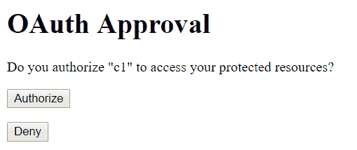

这类似于我们在 Google 开发者控制台中创建客户端并使用它进行授权的情况。当时，首先我们向 Google 提供了凭证，在认证之后，它要求我们批准客户端的访问权限。当我们授权客户端时，它将重定向到资源服务器的私有页面，并带有访问令牌。

在此时刻，响应中返回的访问令牌包含`#`字符。为了访问任何受保护的资源，我们需要将访问令牌与`?`连接，这样它就会作为请求参数提供。如果没有这样做，资源服务器将不允许访问任何受保护的资源。

现在，我们可以使用访问令牌访问受保护的资源。带有路径`/api`的 REST 控制器将提供资源。例如，URL [`localhost:8082/api/usergreeting?access_token=<token_string>`](http://localhost:8082/api/usergreeting?access_token=%3Ctoken_string%3E) 将给出以下输出：

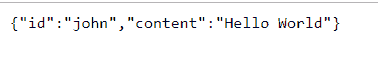

如果在令牌有效期过后进行请求，将显示`token expired`错误。如果原始令牌被修改，它也会抛出`invalid token`错误。如果没有提供令牌，它将显示类似`Full authentication is required to access this resource`的错误。

# 方法级别资源权限

现在，授权用户可以访问我们已配置的所有资源。如果资源可以根据用户角色进行访问，那会多么好？这将提供对资源的更细粒度控制。通过在 Spring Security 中应用方法级别的配置，这是可能的。为此，首先，我们需要定义一个代表方法级别 Spring Security 配置的类，如下所示：

```java
@Configuration
@EnableGlobalMethodSecurity(prePostEnabled = true,securedEnabled = true)
public class MethodSecurityConfig extends GlobalMethodSecurityConfiguration {

  @Override
  protected MethodSecurityExpressionHandler createExpressionHandler() {
    return new OAuth2MethodSecurityExpressionHandler();
  }
}
```

`@EnableGlobalMethodSecurity`注解是必需的，用于在方法级别定义授权约束。基类`GlobalMethodSecurityConfiguration`提供了方法级别安全配置的默认实现。

我们已重写`createExpressionHandle`方法，用`OAuth2MethodSecurityExpressionHandler`代替默认提供的`DefaultMethodSecurityExpressionHandler`。Spring Security 使用 AOP 代理机制来应用方法级别的安全配置。

`prePostEnabled`和`securedEnabled`选项在方法级别启用相应的注解，以定义授权规则。例如，`prePostEnabled`将允许定义 Spring Security 的预/后注解`@PreAuthorize`和`@PostAuthorize`。这些注解允许基于表达式的访问控制，这意味着我们可以使用 Spring **EL (表达式语言)**来描述规则。

`@PreAuthorize`将在方法执行前评估表达式，而`@PostAuthorize`将在方法执行完成后验证表达式，并可能更改结果。`@EnableGlobalMethodSecurity`的`securedEnabled`选项用于定义`@Secured`注解。使用`@Secured`注解，我们可以在方法上指定一系列角色。让我们看看这个注解的一些示例，如下：

```java
@Secured("ROLE_USER")
public String getUserAccnt() {
....
}
@Secured({ "ROLE_USER", "ROLE_ADMIN" })
public String getCompanyPolicy() {
....
}
```

`getUserAccnt`方法将由具有`ROLE_USER`角色的用户访问。`getCompanyPolicy`方法将由至少具有`ROLE_USER`和`ROLE_ADMIN`中一个角色的用户调用。`@Secured`注解不允许使用 Spring EL 定义表达式。另一方面，`@PreAuthorize`和`@PostAuthorize`注解允许使用 Spring EL 定义表达式，这意味着我们可以定义更复杂的条件。让我们看看`@PreAuthorize`的一些示例，如下：

```java
@PreAuthorize("hasAuthority('ADMIN') and #oauth2.hasScope('read')")
public String adminResource(Principal user) {
  ...
}
@PreAuthorize("hasAuthority('USER') and #oauth2.hasScope('read') or (!#oauth2.isOAuth() and hasAuthority('USER'))")
public String userResource(Principal user) {
  ...
}
@PreAuthorize("hasAuthority('ADMIN') or #oauth2.hasScope('trust') or (!#oauth2.isOAuth() and hasAuthority('ADMIN'))")
public ResponseEntity<List<SampleUser>> listAllSampleUsers() {
  ...
}
```

第一个方法（`adminResource`）对具有`USER`角色的用户是可访问的，客户端应具有`read`作用域。让我们回忆一下，对于我们在授权服务器中配置的客户端，我们设置了三个作用域：读取、写入和信任。`#oauth2`变量是默认提供的，用于检查客户端具有的各种作用域。我们可以利用`#oauth2`变量的其他方法，如`clientHasRole()`、`clientHasAnyRole()`、`hasAnyScope()`、`isOAuth()`、`isUser()`、`isClient()`等。它们在`OAuth2SecurityExpressionMethods`类中定义。简而言之，变量`#oauth2`代表这个类的对象。

第二个方法（`userResource`）稍微复杂一些，可以在以下条件下访问：

+   用户具有`USER`角色且客户端具有`read`作用域

+   请求不是 OAuth 类型（可能由机器客户端发起）且用户具有`USER`角色

第三个方法（`listAllSampleUsers`）与第二个方法类似，可以在以下情况下访问：

+   用户具有`ADMIN`角色

+   客户端具有`trust`作用域

+   请求不是 OAuth 类型（可能由机器客户端发起）且用户具有`ADMIN`角色

这就是如何使用自定义授权服务器实现隐式授权类型。在使用隐式授权类型时，需要注意某些事项。由于它是为 JavaScript 应用程序设计的，因此授权服务器和资源服务器都应该是安全可访问的（使用 HTTPS）。第二件事是，在隐式授权类型中，访问令牌直接由授权服务器返回给浏览器，而不是在受信任的后端；强烈建议配置短期访问令牌，以减轻访问令牌泄露的风险。

在隐式流中，另一个挑战是它不允许刷新令牌。这意味着在短期令牌过期后，用户应该被提示再次启动流程；或者，可能更好的方法是设置一个机制，如`iframe`，以无中断地获取新令牌。

作为练习，你可以在授权服务器中创建一些具有不同角色的更多用户，并配置资源方法，检查它们的可访问性。

# 摘要

安全性是任何系统的一个基本组成部分。其有效性取决于各种方面，如简单性、功能丰富性、与其他系统的集成容易度、灵活性、健壮性等。整个章节都是基于 Spring Security 的。它是一个功能齐全的框架，用于保护基于 J2EE 的应用程序。

在本章中，我们更深入地探讨了 Spring Security，特别是它如何与 LDAP 和 OAuth 集成。我们从 LDAP 的基础知识开始，包括其数据结构和配置；我们在 Apache DS 中创建了结构，它是一个 LDAP 服务器。然后，我们探讨了与 Spring Security 集成的所需配置。

除了与 LDAP 进行身份验证外，我们还探讨了如何从 Spring 应用程序中管理 LDAP 中的用户。我们使用了 Spring Data 框架来实现这一点。接下来，我们在 LDAP 中创建了一个角色（权限）的结构。按照相同的顺序，我们获取了角色详情，并在 Spring Security 中实现了基于 LDAP 的授权。

在本章的后面部分，我们开始介绍另一种机制，称为 OAuth。它是一个基于令牌的授权的开放标准。我们从 OAuth 角色的基础知识开始，然后探讨了各种授权类型的细节；你还学习了在何时使用哪种授权。进一步地，我们开始介绍 Spring Security 与 OAuth 的集成。我们使用 Google 实现了 Spring Security 的授权代码流。

使用默认的 OAuth 实现，Spring Security 会显示自动生成的登录页面。我们展示了如何在 OAuth 中实现自定义登录页面。到那时，你只看到了两种不同的机制，LDAP 和 OAuth，独立使用。我们将它们集成在一起，创建了双重认证。

然后，我们实现了基于授权代码流的 OAuth。接下来，我们展示了如何使用自定义授权和资源服务器实现隐式流。我们对授权和资源服务器进行了一系列配置，并成功实现了隐式流。在最后，我们在 Spring Security 中应用了方法级授权。

在下一章中，我们将探索另一个工具，称为 JHipster。它是一个开源的应用程序生成框架，主要用于使用响应式 Web 前端（Angular 或 React）和 Spring 框架作为后端来开发 Web 应用程序和微服务。
