# 第五章：使用 JHipster 查看国家和它们的 GDP 的应用程序

随着时间的推移，不断变化的企业功能要求交付团队以快速的速度交付高质量的软件产品。为了满足这一期望，IT 行业已经专注于使软件开发流程更加流畅和自动化。因此，许多新的平台正在涌现，旨在在极短的时间内生成准备就绪的应用程序代码。

我们从开发的一个简单应用程序开始，该应用程序使用 Spring 框架和世界银行 API 展示了各国**国内生产总值**（**GDP**）信息，如第一章中所述，*创建一个列出世界各国及其 GDP 的应用程序*。Spring 框架提供了一种简单的方法来轻松开发企业级应用程序。

随着 Spring Boot 框架的诞生，使用 Spring 框架的开发变得比以往任何时候都要快和智能。在随后的章节中，我们转向了 Spring Boot 并探讨了其功能，特别是与其他 Spring 和第三方库和模块的集成。

在本章中，我们将探讨另一个名为 JHipster 的框架，它只需点击几下就能在 Spring 基础上创建应用程序，使 Spring 开发变得愉快。我们将利用 JHipster 从第一章，*创建一个列出世界各国及其 GDP 的应用程序*开始开发，展示如何展示各国 GDP 信息以及开发流程是如何被简化和自动化的。在本章中，我们将涵盖以下有趣的主题：

+   介绍 JHipster

+   安装

+   应用程序创建

+   实体的建模和创建

+   创建 GDP 应用程序

+   学习如何在 JHipster 应用程序中添加自定义功能

+   JHipster 的其他功能

# 技术要求

本章中使用的所有代码都可以从以下 GitHub 链接下载：[`github.com/PacktPublishing/Spring-5.0-Projects/tree/master/chapter05`](https://github.com/PacktPublishing/Spring-5.0-Projects/tree/master/chapter05)。代码可以在任何操作系统上执行，尽管它只在 Windows 上进行了测试。

# 介绍 JHipster

简而言之，**JHipster** 是一个代码生成工具，它建立在大量的开发、构建、测试和部署框架和平台之上。它是一个现代的 Web 应用程序开发平台，用于构建基于 Java 的全面 Web 应用程序的所有层，从前端到数据库。JHipster 在底层支持各种框架，为用户提供了在开始应用程序开发时进行选择的机会。

JHipster 是一个免费的开源平台，旨在极大地简化在 Spring Framework 和 Angular 或 React 技术上生成、开发和部署单体和微服务应用程序的过程。在 JHipster 中构建应用程序之前，用户将被询问各种问题，以便根据用户选择的选项生成一个生产就绪的应用程序。JHipster 为应用程序提供以下工具和框架的支持，无需额外安装：

+   **构建工具:** Maven, Gradle

+   **开发平台:** Spring Framework

+   **安全框架:** Spring Security

+   **模板化:** Thymeleaf

+   **微服务:** Netflix OSS

+   **关系型数据库管理系统（RDBMS）:** H2, MySQL, Oracle, PostgreSQL, MS SQL, MariaDB

+   **数据流处理:** Kafka

+   **数据库跟踪器:** Liquibase

+   **NoSQL:** MonboDB, Cassandra, Couchbase, Hazelcast

+   **缓存实现:** Infinispan, Ehcache

+   **搜索引擎:** Elasticsearch 和 **Elasticsearch, Logstash, and Kibana** 堆栈（**ELK**）

+   **监控:** Prometheus

+   **对象关系映射（ORM）:** Hibernate

+   **测试框架:** Cucumber, Browsersync, Jest, Protractor 测试

+   **负载测试:** Gatling

+   **用户界面:** Bootstrap, HTML5, CSS3, SaaS, Redux

+   **JavaScript 框架:** Angular, TypeScript, React, Webpack

+   **部署:** Docker, Kubernetes, Boxfuse, Rancher

+   **云支持:** Heroku, Cloud Foundry, AWS, OpenShift

+   **CI/CD:** Jenkins, Travis CI, GitLab CI, CircleCI

JHipster 生成的代码符合行业标准、最佳实践和质量规范。除了自动生成应用程序代码外，JHipster 还支持更流畅的应用程序自动化测试和持续集成与交付。这对组织来说可以带来巨大的好处，如下所示：

+   以统一和受控的方式在各种平台和框架上创建应用程序。

+   大部分样板代码都是自动生成的，因此开发者可以专注于业务需求的实现。这将提高开发者的生产效率，并大大缩短整体项目交付时间表。

+   从前端到数据库表的整个应用程序中轻松集成更改。

+   应用程序的整体代码质量得到提升。

+   组织中的不同项目可以轻松共享通用工件。因此，项目团队的整体生产率将得到提高。

# 安装 JHipster

JHipster 推荐普通用户使用 `npm` 进行安装。`npm` 是来自 `Node.js` 的包管理器，用于安装各种软件。它是世界上最大的软件仓库，在这里你可以找到成千上万的开源软件包。如果未安装 `npm`，只需访问 Node 网站的下载部分（[`nodejs.org/en/download`](https://nodejs.org/en/download)）并安装最新的 64 位 **长期支持（LTS**）版本，因为 JHipster 不支持非 LTS 版本。

一旦安装了`npm`，运行以下命令从命令行安装 JHipster 包：

```java
npm install -g generator-jhipster
```

JHipster 使用另一个名为**Yeoman** ([`yeoman.io/`](http://yeoman.io/))的工具来生成应用程序代码，该工具与 JHipster Node 包一起安装。创建应用程序后，JHipster 提供了一个选项，可以使用 Maven 或 Gradle 构建它。为此，JHipster 将安装 Maven 和 Gradle 所需的包装器，因此不需要明确安装，特别是对于构建应用程序。

JHipster 也可以使用 Yarn 进行本地安装，Yarn 是另一种用于安装软件的包管理器。使用 Yarn 安装 JHipster 的过程几乎与`npm`相同。

# 创建应用程序

在安装 JHipster 之后，下一步是创建一个应用程序。在您的本地机器中创建一个具有适当名称的项目目录，从命令提示符中选择此目录，并执行以下命令。项目目录的名称为`gdp`，但可以是任何有效的名称：

```java
jhipster
```

在运行此命令后不久，JHipster 将开始提出一系列问题，并根据用户给出的答案决定需要生成的内容，如下所示：

1.  **您想创建哪种类型的应用程序？** 有四种可能的选择，如下所示：

    +   **单体应用程序**：此选项用于创建一个自包含的应用程序。这是创建简单应用程序的推荐选项，因此我们将选择此选项。

    +   **微服务应用程序**：如果您想基于微服务架构设计应用程序，您可以选择此选项。

    +   **微服务网关**：微服务网关用于构建具有 UI 的基于微服务应用程序。默认情况下，微服务应用程序没有 UI。

    +   **JHipster UAA 服务器**：JHipster 支持创建带有**用户身份验证和授权** (*UAA*) 的应用程序。

1.  **您的应用程序的基本名称是什么？** 您需要给您的应用程序起一个名字。默认情况下，它采用与项目目录相同的名称。如果您愿意，可以给它另一个名称。

1.  **您的默认 Java 包名是什么？** 接下来，您需要提供一个 Java 包名。您可以提供一个合适的名称（它将被视为基本包，并且所有其他 Java 源文件都将相对于此包生成）。

1.  **您想使用 JHipster Registry 来配置、监控和扩展您的应用程序吗？** 这个问题涉及到在我们的应用程序中使用 JHipster Registry。该注册器在基于微服务应用程序中广泛使用，用于注册各种服务。对于单体应用程序，我们仍然可以使用它，因为尽管它是一种注册器，但它关注应用程序的健康状况，这有助于我们监控应用程序。它以`Docker`镜像的形式提供。为了简单起见，我们不会使用它，所以选择“否”并继续。

1.  **您想使用哪种身份验证类型？** 接下来是身份验证机制。它提供了三个选项供您选择，如下所示。我们将选择第三个选项（HTTP 会话身份验证）：

    1.  **JWT 身份验证：** **JSON Web Token**（JWT），是一种用于在两个实体之间以 JSON 形式传输信息的开放标准。身份验证是 JWT 最常见的使用场景。

    1.  **OAuth2/OIDC 身份验证：** JHipster 为 Keycloak 和**OpenID Connect**（OIDC）提供了完整的 OAuth2 支持，当我们选择此选项时，它将默认生成。Keycloak 是一个开源的身份代理和访问管理解决方案。**OpenID Connect**（OIDC）是 OAuth2 协议之上的简单身份层。

    1.  **HTTP 会话身份验证：** 这通过会话来验证用户。这是最常用的选项。

1.  **您想使用哪种数据库？** 接下来，它会询问我们希望在应用程序中使用哪种类型的数据库。JHipster 支持各种 SQL 数据库。它还支持三种 NoSQL 数据库——MongoDB、Couchbase 和 Cassandra，后者具有 Spring 数据后端。我们将选择 SQL。

1.  **您想使用哪种生产/开发数据库？** 您将被询问分别选择特定数据库用于生产和开发。JHipster 为各种环境（如开发、生产等）维护了各种配置文件。它将根据您的选择配置数据库。在我们的案例中，我们将选择 MySQL 用于生产和开发。

1.  **您想使用 Spring 缓存抽象吗？** 进一步操作时，它会询问您想使用的缓存机制类型，例如 Ehcache、Hazelcast、Memcached 或者完全不使用缓存；Spring 缓存抽象将用于连接任何一种。我们可以根据特定的业务需求和底层硬件架构（单节点、多节点、分布式等）选择任何一种。我们将选择 Ehcache（默认选择）。

1.  **您想使用 Hibernate 二级缓存吗？** 在这里，我们有使用 Hibernate 二级缓存的选项。选择是此选项。

1.  **您想使用 Maven 还是 Gradle 来构建后端？** 您将被要求选择 Maven 或 Gradle 作为构建工具。我们将选择 Maven。

1.  **您想使用哪些其他技术？** 在最后，JHipster 将询问添加一些额外的技术，例如 Elasticsearch、WebSocket、使用 Kafka 的异步消息传递以及使用 OpenAPI 生成器的 API-first 开发。API-first 是一种首先设计 API 的应用程序设计方法，然后在这些 API 之上开发 Web 或移动应用程序。如今，许多公司都在采用这种方法，而 JHipster 默认支持它。为了使事情简单直接，我们不会选择它们中的任何一个。由于这是一个多选选择器，您只需按*Enter*键继续，而不选择任何选项。

1.  **您想为客户端使用哪个框架？** 下一个问题将询问您选择一个前端框架，即 Angular 或 React。选择 Angular 并按*Enter*键。

1.  **您想启用 Sass 样式表预处理程序吗？** 接下来，它将询问您是否要使用**语法上令人惊叹的样式表**（***Sass**）样式表预处理程序。选择“是”。

1.  **您想启用国际化支持吗？** 如果您想添加国际化支持，请选择一种本地语言。选择英语作为答案。

1.  **请选择要安装的附加语言：** 除了您的母语外，您还可以添加对其他语言的支持。JHipster 支持大约 30 种语言。为了简化流程，我们不会添加任何附加语言。

1.  **除了 JUnit 和 Jest，您还想使用哪些测试框架？** 在此屏幕上，您将被要求选择单元测试框架。JHipster 支持 Gatling、Cucumber 和 Protractor 框架，以及默认的 JUnit 进行单元测试。选择它们中的任何一个，然后继续下一步。

1.  **您想从 JHipster 市场安装其他生成器吗？** 最后一个问题将询问您是否要从 JHipster 市场添加额外的模块。这是一个第三方生成器的集合，它们在 JHipster 核心之上工作，可以访问其变量和函数，并充当子生成器。您可以通过从 JHipster 市场下载它们来在您的应用程序中使用它们（[`www.jhipster.tech/modules/marketplace`](https://www.jhipster.tech/modules/marketplace)）。我们将为这个选项选择“否”。

# 项目结构

现在，请放松并休息，JHipster 将开始根据我们选择的选项创建应用程序。在这个时候，JHipster 将生成我们应用程序的代码和项目结构。简而言之，JHipster 生成以下内容以使应用程序准备好运行：

+   Spring Boot 应用程序

+   Angular JS 应用程序（在前端）

+   Liquibase 变更日志文件（用于数据库表**数据定义语言**（**DDL**）操作）

+   其他配置文件

一旦应用程序创建完成，我们可以配置一个**集成开发环境**（**IDE**）以进行进一步的开发。JHipster 支持广泛的 IDE，包括 Eclipse、IntelliJ IDEA 和 Visual Studio Code。您可以在[`www.jhipster.tech/configuring-ide`](https://www.jhipster.tech/configuring-ide)了解更多关于这个主题的信息。应用程序的结构如下所示：

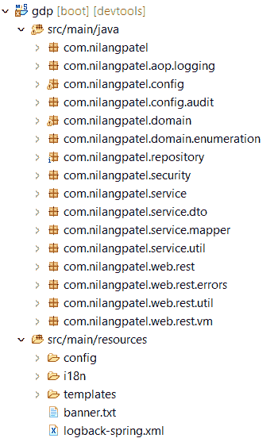

让我们依次查看每个 Java 包，如下所示：

+   `com.nilangpatel.aop.logging`: 这包含了**面向切面编程**（**AOP**）的日志建议。

+   `com.nilangpatel.config`: 这个包包含了属性、缓存、数据库、配置文件、Liquibase、日志、Spring Security、度量、Web、区域设置等各种配置，以及跨应用程序使用的常量。

+   `com.nilangpatel.config.audit`: JHipster 提供了开箱即用的审计功能。这个包包含了专门用于审计的配置。

+   `com.nilangpatel.domain`: 这包含了我们所创建的自定义实体的所有模型对象，以及其他核心模型对象。

+   `com.nilangpatel.domain.enumeration`: 这包含了我们在**JHipster 域语言**（**JDL**）中声明的枚举。我们将在下一节中进一步讨论 JDL。

+   `com.nilangpatel.repository`: 每个自定义和开箱即用的实体的 Spring Data **Java 持久性 API**（**JPA**）存储库都存储在这里。

+   `com.nilangpatel.security`: 所有与安全相关的类，例如`Roles`常量、`UserDetail`服务等，都存储在这个包中。

+   `com.nilangpatel.service`: 这包含了服务层的接口，用于开箱即用和自定义实体。

+   `com.nilangpatel.service.dto`: 用于在控制器和服务之间传输的**数据传输对象**（**DTOs**）保存在这里。

+   `com.nilangpatel.service.mapper`: 用于将模型对象映射到 DTOs 的映射器类将存储在这个包中。

+   `com.nilangpatel.service.util`: 这个包包含了一些实用类。

+   `com.nilangpatel.web.rest`: 每个实体的所有**表示状态转移**（**REST**）控制器都生成在这个包下。

+   `com.nilangpatel.web.rest.error`: 这里提供了针对 REST 调用的特定异常。

+   `com.nilangpatel.web.rest.util`: 这个包包含了一些在 REST 调用中使用的实用类。

+   `com.nilangpatel.web.rest.vm`: 这包含了视图模型，主要用于 UI 中的管理标签页。

除了 Java 类和包之外，JHipster 还在`src/main/resource`文件夹中生成某些资源。具体如下：

+   `config`: 这包含了各种配置文件，例如用于 Spring Boot 的`application.properties`文件，包含各种配置文件，一些 Liquibase 配置文件，以及用于导入和配置 HTTPS 配置证书的`changelog`文件和 keystore 文件。

+   `i18`: 这包含我们在应用程序创建期间选择的多种语言的属性文件。

+   `templates`: 这个文件夹包含各种邮件模板，如激活、账户创建和密码重置，以及错误模板。

是时候运行应用程序了。JHipster 提供了以下命令来使用 Maven 构建应用程序。确保你在命令提示符中的项目目录：

```java
mvnw
```

除了构建应用程序，此命令还会将其部署到嵌入式网络服务器（默认情况下与 Spring Boot 一起提供）。它可以通过`http://localhost:8080`访问，如下所示：

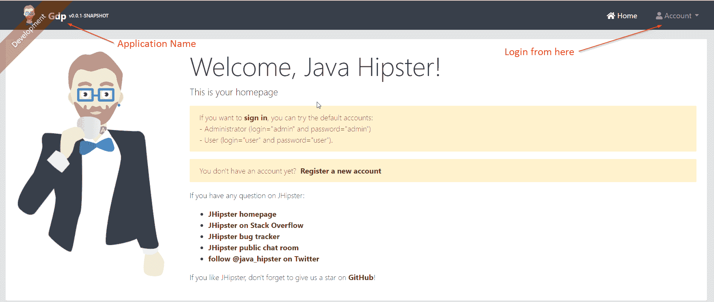

如果一个应用程序需要在任何应用服务器上部署，JHipster 提供了一种生成可执行 WAR 文件的方法，对于 Maven 使用命令`mvnw -Pprod package`，对于 Gradle 使用`gradlew -Pprod bootWar`。

JHipster 生成一组页面和一些用户账户以开始。点击“账户”|“登录”以登录到应用程序。默认情况下，“管理员”用户可以使用凭证`admin/admin`登录，普通用户可以使用`user/user`登录。`管理员`用户可以访问“管理”菜单，从那里可以执行各种管理功能。

# 实体创建

一个网络应用程序有一些数据库交互，至少包括基本的**创建、读取、更新和删除**（**CRUD**）操作。如果手动完成，则需要大量的努力。在这种情况下，需要完成以下任务：

+   创建数据库表，以及它们的关联和约束

+   构建模型实体和构建**数据访问**对象（**DAO**）层以提供与数据库的数据接口

+   生成一个服务层来封装业务逻辑

+   准备网络控制器和前端层，包括所有验证，以将数据存储在相应的实体表中

除了这个之外，可能还需要额外的努力来适应任何层的未来变化。JHipster 为此问题提供了一个巧妙的解决方案。在创建应用程序后，我们需要构建一个数据访问层，JHipster 使整个过程自动化。

JHipster 中一个称为**实体生成**的概念使这一切成为可能。实体是 JHipster 应用程序的构建元素。实体生成过程包括以下各种任务：

+   创建数据库表并维护其更改（通过配置）

+   构建一个 JPA 模型类，以及一个 Spring Data JPA 仓库

+   创建一个可选的服务层以适应业务规则

+   创建支持基本 CRUD 操作和前端 Angular 路由的 REST 控制器

+   组件和服务以及 HTML 视图，包括集成和性能测试

这不酷吗？让我们见证创建实体和自动生成代码的过程。

# 使用 CLI 添加实体

为了演示在 JHipster 中创建实体的过程，我们首先创建一个简单的实体，称为**Owner**，它有一个属性，称为**name**。JHipster 允许创建实体以及数据访问、服务层、控制器和该实体的前端层的方式与我们在上一节中看到的生成应用程序代码的过程相同。两者都可以使用 CLI 完成。

对于实体生成，JHipster 内部使用 Yeoman 工具生成代码。让我们创建我们的第一个实体。执行以下命令以创建实体：

```java
jhipster entity Owner
```

`Owner` 是一个实体的名称。此命令将为 `Owner` 创建一个实体，并将启动一个向用户提出几个问题的向导，如下所示：

1.  **你想要在你的实体中添加一个字段吗？** 如果你希望为你的实体添加一个字段，请选择 *y*。

1.  **你的字段名称是什么？** 你可以在这里给出属性名称。

1.  **你的字段类型是什么？** 你需要提供属性的类型。JHipster 支持各种属性类型，包括 `string`、`integer`、`long`、`float`、`double`、`BigDecimal` 和 `LocalDate`。

1.  **你想要在你的字段中添加验证规则吗？** 这关系到你是否希望在实体的属性上添加任何约束。选择 *y*。

1.  **你想要添加哪些验证规则？** JHipster 还允许你添加各种约束，包括 `required`、`unique`、`min` 值、`max` 值和正则表达式模式，以验证输入。你可以选择多个约束。

在添加属性的前一个过程中，可以重复此过程以添加更多属性到其类型和约束。我们将创建具有 `name` 属性的 `Owner` 实体，该属性为 `String` 类型，并带有 `required` 约束。

JHipster 还允许你定义与另一个实体的关系。一旦我们完成添加属性，它将要求我们添加一个关系。由于我们只创建了 `Owner` 实体，我们将在添加另一个实体后添加关系。我们将在稍后看到如何添加关系。

目前，只是说“不”（*n*）添加关系，JHipster 将显示与服务和控制器层相关的下一组问题，如下所示：

1.  **你想要为你的业务逻辑使用一个单独的服务类吗？** 在这个问题中，我们被问及是否希望添加服务层，可能的选项如下。我们将选择第三个选项：

    1.  不，REST 控制器应该直接使用存储库；REST 控制器将直接调用存储库。不需要添加服务层。

    1.  是的，生成一个单独的服务类；服务层仅通过服务类添加。REST 控制器将调用此类进行任何数据库交互。我们可以在服务类中编写额外的业务逻辑。

    1.  是，生成单独的服务接口和实现；在这种情况下，服务层添加了接口和实现。这种设计的明显优势是我们可以在不更改其他代码的情况下提供服务接口的另一个实现。

1.  **您想使用 DTO 吗？** 下一个问题与 DTO 相关。JHipster 提供了一个为每个实体创建 DTO 的选项。它使用 MapStruct，另一个代码生成工具，用于将 Java 实体映射到生成 DTO。基本上，它用于将 DTO 的值映射到模型实体，反之亦然。此问题的选项如下。我们将选择第二个选项：

    1.  不，直接使用实体；实体对象用于在所有层之间传递数据。

    1.  是，使用 MapStruct 生成 DTO；这将为每个实体生成相应的 DTO。控制器将创建 DTO 的实例并将其传递到服务层。服务类将 DTO 映射到实体并调用存储库与数据库交互。

1.  **您想添加过滤功能吗？** 这将提供动态过滤选项以搜索特定实体。它使用 JPA 静态元模型进行过滤选项。如果我们选择是，JHipster 将为从表示层到 DAO 的完整代码创建代码。尽管过滤选项非常有用，但为了简单起见，我们将选择否。

1.  **您想在实体上使用分页吗？** 下一个问题涉及到分页模式。JHipster 支持以下分页模式。我们将选择第二个选项：

    1.  不；这意味着没有分页。所有记录将显示在单个页面上。这将为大数据集创建性能问题。

    1.  是，使用分页链接；这显示了带有跳转页面的分页链接。这是最常见的分页样式。

    1.  是，使用无限滚动；这使用无限滚动来显示数据。滚动将起到分页的作用。

现在，JHipster 将开始创建实体，并在发现冲突时要求覆盖某些文件。这是因为 JHipster 将开始再次生成代码。对于所有提示，请继续说“是”（y）并按*Enter*键，最后，您将看到一个消息说实体已创建。接下来，让我们创建另一个实体，称为`Car`，具有`name`、`model`和`manufacture year`属性。按照之前的步骤创建`Car`实体。

JHipster 提供了一个在创建实体时建立关系的选项。因此，如果您刚刚添加了一个实体并尝试与另一个实体建立关系，您将收到一个错误，例如说另一个实体未找到。所以，在与其他实体建立关系时，请确保它已经创建。

在第 5 步之后，它将询问添加关系。我们已添加了一个`Owner`实体，并想建立多对一的关系（多个`Car`可以与一个`Owner`相关联）。以下是在第 5 步之后将具体询问关系的几个问题：

1.  **您想添加另一个实体的关系吗？** 在这里选择 Y。

1.  **其他实体的名称是什么？** 这指的是我们想要建立关系的实体的名称。在这里，请将实体的名称作为`Owner`给出。

1.  **关系的名称是什么？** 默认为`owner`（这是您想要给出的关系名称。默认情况下，系统将给出另一侧实体名称的小写形式。如果您愿意，您可以更改它）。

1.  **关系的类型是什么？** 可能的选项有一对多、多对一、多对多和一对一。它们相当直接。我们将选择多对一，因为我们正在与`Car`实体建立关系。

1.  **当您在客户端显示此关系时，您想使用`Owner`中的哪个字段？** 这个问题询问在显示或添加`Car`数据时，是否应该显示`Owner`实体的列名。内部上，JHipster 始终使用 ID 列来设置表之间的关系。将`name`作为此问题的答案，因为`Owner`只有一个列（`name`）。

1.  **您想为此关系添加任何验证规则吗？** 这基本上是对外键列添加验证。

1.  **您想添加哪些验证规则？** 必须进行可能的验证。

在此之后，它将开始从第 6 步提问。完成第 9 步以添加`Car`实体。此时，我们有两个实体——`Owner`和`Car`——它们之间存在关系，以及前端、控制器、服务层和 DAO 层的源代码。

现在，是时候构建我们的应用程序了。`**mvnw**` Maven 命令不仅会构建应用程序，还会在嵌入式服务器上部署和运行它。在生成实体后，当我们使用此命令构建和部署应用程序时，JHipster 将为每个实体创建/更新相应的数据库表。

在构建应用程序之前，请确保您已在`application-prod.yml`文件中设置数据库凭据，位于`src/main/resources/config`文件夹中，按照您本地的 MySQL 配置。属性名称为`spring:datasource:username`和`spring:datasource:password`*.* 如果没有这些设置，运行应用程序时将会出现错误。

让我们为我们的实体添加一些数据。使用管理员凭据（`admin`/`admin`）登录，然后转到实体 | 拥有者，首先添加拥有者数据。将使用创建新拥有者按钮来插入拥有者记录。同样，我们也可以为 `Car` 实体添加数据。由于我们已经从 `Car` 到 `Owner` 创建了一个多对一的关系（即许多 `Car` 实例与一个 `Owner` 相关联），你将看到一个字段，可以在添加 `Car` 实体时选择 `Owner` 值。

`Car` 实体的记录，以及指向 `Owner` 实体的引用，将如下所示：

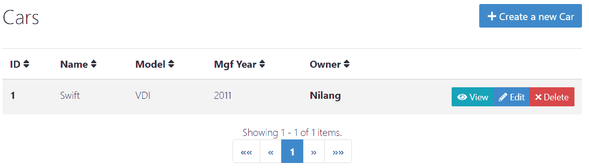

`Owner` 实体的 `name` 属性值在此处作为引用可见，这是我们创建关系时选择的。此页面还显示了链接类型的分页，这是我们创建 `Car` 实体时默认选择的。除此之外，你可以为每个单独的实体执行 CRUD 操作，而无需自己编写任何代码。这绝对是一个节省大量开发时间和精力的酷特性。

默认情况下，JHipster 为每个实体表创建一个 ID 列作为主键。对于代码自动生成，不支持将自定义列定义为主键。然而，如果特定的列需要作为主键，你需要在运行 `mvnw` 命令之前修改生成的源代码。

# 实体建模

你已经看到了 JHipster 如何通过自动化许多事情来加速开发。在应用程序中建模一个实体以前需要许多活动，包括表生成；创建 DAO、服务和表示层；以及每个实体的验证和用户界面。

虽然 Spring Boot 在编写样板代码方面提供了很大的帮助，但开发者仍然需要编写大量代码才能看到一些效果。这是一项相当繁琐且逻辑上重复的工作。你已经看到了 JHipster 如何在这个场景中提供帮助，通过自动生成代码来构建一个完全功能的 Spring Boot 应用程序，而无需你自己编写任何代码。

使用完整工作代码设计实体只是向 JHipster 提供某些信息的问题。乍一看，这似乎很棒，但硬币的另一面也有问题。考虑一下这样一个场景，你需要使用 JHipster CLI 集成超过五六十个实体，这在编写企业应用程序时是完全可能的。有时，实体的总数会超过一百个。

在这种情况下，使用 CLI 编写每个实体并提供所有元数据，以及与其他实体的关系，是痛苦的。作为解决方案，JHipster 提供了一个图形工具，我们可以一次性设计所有实体。目的是通过可视化工具简化定义关系的流程，而不是通过经典的方式，即问答。有两种选项可以用于可视化建模实体，如下所示：

+   使用 **统一建模语言**（**UML**）进行建模

+   使用 JDL 进行建模

# 使用 UML 进行建模

在此选项中，我们需要将所有实体设计为类图，然后将其导入 JHipster 以一次性生成所有实体的代码。因此，整个过程分为两个独立工作的部分，如下所示：

+   使用可视化工具设计实体的类图

+   导出类图并将其导入 JHipster

在应用程序开发的早期阶段，类图主要用于设计领域模型。通过展示类的属性和操作，以及与其他类的关系，类图描述了应用程序的静态视图。类图中所用的类直接映射到面向对象的语言，并用于建模数据库表。

JHipster 在生成应用程序代码的过程中提供了这一过程的便利。已经设计了一个名为 JHipster UML 的独立工具；它读取类图以生成实体结构。可以从 Git 仓库安装，或作为单独的 `npm` 包，以下命令：

```java
//For Global installation
npm install -g jhipster-uml

//For local installation
npm install jhipster-uml --dev
```

大多数今天可用的工具都允许将类图导出为 XMI 格式。JHipster UML 读取 XMI 文件并生成实体。由于此工具从类图中生成 JHipster 的实体，因此属性类型的选择仅限于 JHipster 支持的类型列表。以下列出了 JHipster 支持的属性类型，以及每个属性类型的可能验证规则：

| **No.** | **Attribute type** | **Possible validations** |
| --- | --- | --- |
| 1 | `string` | `required`, `minlength`, `maxlength`, `pattern` |
| 2 | `integer` | `required`, `min`, `max` |
| 3 | `long` | `required`, `min`, `max` |
| 4 | `BigDecimal` | `required`, `min`, `max` |
| 5 | `float` | `required`, `min`, `max` |
| 6 | `double` | `required`, `min`, `max` |
| 7 | `enum` | `required` |
| 8 | `Boolean` | `required` |
| 9 | `LocalDate` | `required` |
| 10 | `ZonedDateTime` | `required` |
| 11 | `blob` | `required`, `minbytes`, `maxbytes` |
| 12 | `AnyBlob` | `required`, `minbytes`, `maxbytes` |
| 13 | `ImageBlob` | `required`, `minbytes`, `maxbytes` |
| 14 | `TextBlob` | `required`, `minbytes`, `maxbytes` |

首先，我们需要为每个领域模型设计类图，以及它们之间的关系。JHipster 推荐使用以下工具生成类图：

+   Modelio

+   UML Designer

+   GenMyModel

在这些工具中，前两个是完全开源的基于 Eclipse 的图形工具，可以从各自的网站下载，而第三个是基于浏览器的免费工具，可以直接在网络上使用（存在某些限制）。一旦类图准备就绪，将其导出为 XMI 文件，然后在命令提示符中执行以下命令以生成实体结构。确保在执行此命令时位于项目目录中：

```java
jhipster-uml <class-diagram.xmi>
```

这将生成实体结构。JHipster UML 还提供了各种选项来指定分页模式，例如是否要使用 DTO 或为每个实体添加服务类。这些选项可以与之前的命令一起使用，如下所示：

```java
// If you wish to use DTO. The possible values would be MapStruct
jhipster-uml <class-diagram.xmi> --dto <value>

//Type of pagination pattern.The possible values are [pager,pagination,infinite-scroll]
jhipster-uml <class-diagram.xmi> --paginate <value>

//If you need to add service layer with class and implementation. The values would be [serviceClass,serviceImpl]
jhipster-uml <class-diagram.xmi> --service <value>
```

根据你提供的选项，JHipster UML 生成实体和其他源代码。最后，你需要执行`mvnw`命令，这样它就会在数据库中创建/修改所需的实体表，以及 Liquibase 变更日志文件，并将应用程序部署到服务器。在定义类图中的类之间的关系时，你需要确保它们在 JHipster 中是被允许的。支持的关系如下：

+   双向一对多关系

+   单向多对一关系

+   多对多关系

+   双向一对一关系

+   单向一对一关系

默认情况下，JHipster 代码生成器不支持单向一对多关系。JHipster 建议使用双向一对多关系。

# 使用 JHipster 领域语言（JDL）建模

将领域模型设计为类图，然后基于该图生成源代码是 JHipster 中创建实体的一种快速方法。因此，与逐个使用 CLI 创建它们相比，它可以节省时间。然而，你仍然需要依赖第三方应用程序来使用 JHipster。有可能 JHipster 对特定版本的支持非常有限，或者，在最坏的情况下，完全不兼容。

作为解决方案，JHipster 提供了一个名为**JDL studio**的独立工具。它是一个在线工具，用于创建实体并在它们之间建立关系。使用 JDL studio 的明显优势是它由 JHipster 团队设计和维护，因此几乎不存在版本不兼容和其他问题。你可以使用稳定版本时充满信心。如果出现任何问题，你可以轻松地从官方 JHipster 问题跟踪器获取更新或支持。

使用 JDL studio 创建实体比使用 UML 建模实体更加简单。**JHipster 领域语言**（**JDL**）是一种用于在单个文件（有时是多个文件）中构建实体的领域语言，语法简单且易于使用。

与 JDL 一起工作有两种方式。你可以使用 JHipster IDE 或在线 JDL-Studio（[`start.jhipster.tech/jdl-studio`](https://start.jhipster.tech/jdl-studio)）。JHipster IDE 是针对知名 IDE 的插件或扩展，包括 Eclipse、Visual Studio 和 Atom。在线 JDL-Studio 是一个基于浏览器的 IDE，你可以用它以脚本形式构建实体及其关系，这些脚本是用 JDL 编写的。你可以将其与编写创建数据库表及其关系的 SQL 脚本联系起来。

为了简化，我们将通过在线 JDL-Studio 创建实体的简单示例。在为每个实体编写定义时，JDL-Studio 会同时绘制实体图及其关系。当打开在线 JDL-Studio 时，你将默认看到一些示例实体，包括它们的关系和其他参数，以给你一些如何开始使用它的想法。

让我们在在线 JDL-Studio 中创建`School`和`Teacher`实体，以及它们之间的关系（一对一）。打开 URL 并添加这些实体的定义，如下所示：

```java
entity School {
  name String required
    eduType EducationType required
    noOfRooms Integer required min(5) max(99)
}
enum EducationType {
  PRIMARY, SECONDARY, HIGHER_SECONDARY 
}
entity Teacher {
  name String required
    age Integer min(21) max(58)
}
// defining multiple one-to-many relationships with comments
relationship OneToMany {
  School{teacher} to Teacher{school(name) required}
}
// Set pagination options
paginate School with infinite-scroll
paginate Teacher with pagination

// Use data transfer objects (DTO)
dto * with mapstruct

// In case if DTO is not required for specific (comma separated)entities.
// dto * with mapstruct except School

// Set service options to all except few
service all with serviceImpl

// In case if service layer is not required for certain 
// (comma separated) entities. Just uncomment below line
// service all with serviceImpl except School
```

每个实体都可以用`entity`关键字定义，包括其属性和数据类型。我们还可以为每个属性定义某些验证。这些验证不仅对数据库表级别施加相应的约束，而且在前端侧也施加约束。`maxlength`验证表示给定属性的列最大长度。`min`和`max`验证描述了要输入的最小和最大值。实体之间的关系可以用以下语法定义：

```java
relationship (OneToMany | ManyToOne | OneToOne | ManyToMany) {
  <OWNER entity>[{<Relationship name>[(<Display field>)]}] to <DESTINATION entity>[{<Relationship name>[(<Display field>)]}]
}
```

`relationship`可以使用以下选项进行使用：

+   `(一对一 | 多对一 | 一对一 | 多对多)`: 关系的可能类型。

+   `OWNER 实体`: 关系的拥有者实体。也可以将其描述为关系的来源。拥有方实体必须在左侧。

+   `DESTINATION 实体`: 这是关系结束的另一端实体，即目标实体。

+   `关系名称`: 这是表示另一端类型的字段名称。

+   `显示字段`: 在为实体添加记录时，JHipster 会在屏幕上显示另一端实体下拉菜单。此属性显示将在下拉菜单中显示的另一端实体的字段名。默认情况下，它是另一端实体的 ID（主键）。

+   `required`: 这确定是否必须在下拉菜单中选择另一端实体。

`paginate`、`dto`和`service`关键字分别用于定义分页模式的配置选项、是否需要生成 DTO 以及是否需要生成带有实现的服务层。它们相当直观，你可以在使用 CLI 创建实体时将其与相应的选项联系起来。JHipster 还支持使用`*`进行大量操作和排除选项（使用`except`关键字），这些功能非常强大且方便。简而言之，JDL-Studio 根据我们实体的定义生成以下图表：

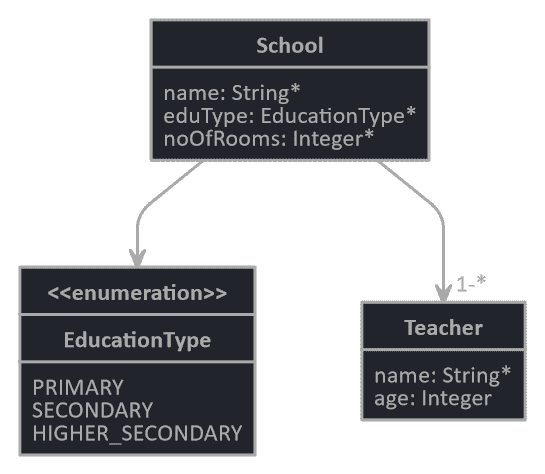

在这个例子中，我们定义了一个双向关系。如果需要单向关系，你只需在两边删除名称或关系即可。例如，`School`和`Teacher`实体之间的单向关系可以定义如下：

```java
relationship OneToMany {
  School to Teacher
}
```

JHipster 不支持单向的一对多关系，但它的样子是这样的。在定义关系时，你需要意识到 JHipster 支持的关系，我们已经在上一节中讨论过。

除了生成实体代码，JDL 还用于从头创建应用程序，包括部署选项。因此，你不必使用基于 CLI 的问答方法，而可以在单个 JDL 文件中定义所有配置选项，并一次性创建一个应用程序。

# 使用模型生成实体

我们已经在 JDL studio 中定义了实体。现在，我们将指导 JHipster 生成实体，包括数据库表和源代码。这个过程涉及以下两个任务：

+   导出实体定义

+   导入 JDL 文件以生成所需的工件

从 JDL-Studio，你可以将定义导出为 JDL（`.jh`）文件。JHipster 提供了一个子生成器，用于导入 JDL 文件，以下命令：

```java
jhipster import-jdl <your_jdl_file.jh>
```

不言而喻，你需要在这个命令下执行此命令。在成功构建和部署后，你将在“实体”菜单中看到`School`和`Teacher`实体。你也可以验证相应的表是否已生成。如果一个应用程序有大量实体，将它们全部放入单个 JDL 文件中是非常困难的。如果某个实体出现错误，整个生成实体的过程将无法正常工作。在最坏的情况下，如果多个团队正在工作，那么它将创建维护问题。

JHipster 通过允许使用多个 JDL 文件来解决此问题，以便相关实体可以分组到单独的 JDL 文件中。`import-jdl`子生成器允许导入由空格分隔的多个文件。在首次执行此命令时，它将生成实体和所有源代码。您需要使用`mvnw`命令构建和部署应用程序，以便必要的数据库更改得到反映。

第二次及以后，`import-jdl`将仅重新生成已更改的实体。如果您希望从头开始重新生成所有实体，则需要添加`- force`选项。请注意，此选项将删除应用于实体的所有自定义。在构建和部署应用程序时，某些验证会在使用`mvnw`命令时捕获，如下所示：

+   在列类型为`integer`、`long`、`BigDecimal`、`LocalDate`、`Boolean`、`enum`、`double`等情况下，不允许使用`maxlength`和`minlength`验证。

+   如果对于某个实体，服务层被跳过，那么如果为该实体选择了带有`mapstruct`的 DTO 选项，JHipster 会显示警告。在这种情况下，应用程序可能无法正常工作。

+   在添加单行注释时，需要在`//`之后留一个空格，否则 JHipster 会显示错误，并且实体将无法正确生成。

# 展示国家国内生产总值

现在您已经了解了如何创建应用程序和建模实体，我们将开始使用 JHipster 创建一个显示各国 GDP 的应用程序。我们将这样做以展示 JHipster 在自动生成的代码中应用自定义的能力。

# 应用程序和实体创建

请参考*创建应用程序*部分来创建一个新的应用程序，命名为`gdp`。我们将构建一个与我们在第一章中创建的应用程序具有相似功能的应用程序，即*使用 Spring 框架创建一个列出世界各国及其 GDP 的应用程序*。为了展示如何显示各个国家的 GDP 数据，我们参考了 MySQL 数据库中的一个示例国家、城市和国家语言数据([`dev.mysql.com/doc/index-other.html`](https://dev.mysql.com/doc/index-other.html))，并使用 REST 服务通过世界银行 API([`datahelpdesk.worldbank.org/knowledgebase/articles/898614-aggregate-api-queries`](https://datahelpdesk.worldbank.org/knowledgebase/articles/898614-aggregate-api-queries))获取特定国家的 GDP 数据。我们将使用相同的参考来构建一个使用 JHipster 的应用程序。

为了简化，我们将使用必要的列来完成应用程序的目的。首先理解表结构非常重要。数据库表及其关系细节如下：

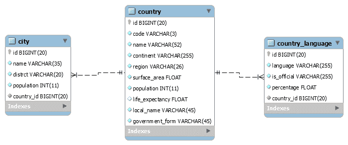

让我们先定义实体。JHipster 推荐使用 JDL 进行实体和代码生成，因此我们将使用它来创建我们的实体结构并生成我们的服务层、REST 控制器和 DTO，以及前端层的一组组件。JDL 脚本如下所示：

```java
entity Country{
  code String required maxlength(3)
    name String required maxlength(52)
    continent Continent required
    region String required maxlength(26)
    surfaceArea Float required
    population Integer required
    lifeExpectancy Float
    localName String required maxlength(45)
    governmentForm String required maxlength(45)
}
entity City{
  name String required maxlength(35)
    district String required maxlength(20)
    population Integer required
}

entity CountryLanguage{
    language String required
    isOfficial TrueFalse required
    percentage Float required
}

enum Continent {
  ASIA, EUROPE, NORTH_AMERICA, AFRICA, OCEANIA, ANTARCTICA, SOUTH_AMERICA
}

enum TrueFalse{
  T, F
}

// Set pagination options
paginate Country, City, CountryLanguage with pagination

// Use data transfer objects (DTO)
dto * with mapstruct

// Set service options. Alternatively 'Service all with sericeImpl can be used
service all with serviceImpl

relationship OneToMany{
  Country{city} to City {country(name) required}
  Country{countryLanguage} to CountryLanguage{country(name) required}
}
filter Country
```

此脚本包含相应表的实体定义，以及用于`Continent`和`TrueFalse`的`enum`。我们还定义了分页模式、DTO 结构、服务层（使用`Service`类和接口`serviceImpl`），以及一种关系类型。`Country`将与`City`和`CountryLanguage`都有一对多关系。

在关系中的`country(name)`，在另一边它将显示国家名称作为参考，而不是国家默认的`ID`。请特别注意最后一个选项——`filter`。这为`Country`实体声明了`filter`选项，用于在检索实体的记录时应用各种过滤条件。我们将在*开发自定义屏幕*部分更详细地探讨这一点。JDL 图应如下所示：

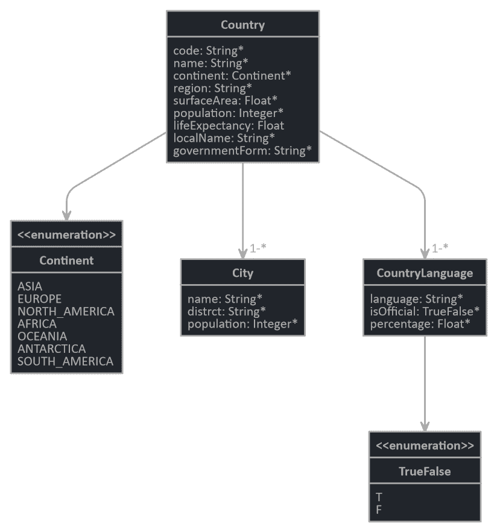

由于我们在 MySQL 提供的每个表中省略了一些列，因此还需要在相应表的插入脚本中进行必要的更改。你将在项目结构的`download`文件夹中找到修改后的插入脚本。在此时刻，你必须应用插入脚本才能继续前进。

# 在 JHipster 中使用数据库处理枚举数据

接下来，我们将运行应用程序并验证 JHipster 是否已创建三个实体，并且它们在实体菜单中可用以执行各种 CRUD 操作。第一次运行应用程序时，我们将得到一个错误，如下所示：

```java
org.springframework.dao.InvalidDataAccessApiUsageException: Unknown name value [Asia] for enum class [com.nilangpatel.domain.enumeration.Continent]; nested exception is java.lang.IllegalArgumentException: Unknown name value [Asia] for enum class [com.nilangpatel.domain.enumeration.Continent] at org.springframework.orm.jpa.EntityManagerFactoryUtils.convertJpaAccessExceptionIfPossible(EntityManagerFactoryUtils.java:367) ....
```

此错误发生在检索大陆数据并尝试将其与`Continent`枚举数据类型映射时。根本原因是我们在`Country`实体的`continent`列中定义了类型为`Continent`枚举。通过插入脚本（从 MySQL 网站）添加的该列的实际值与`Continent`枚举值并不完全相同。例如，数据库中的实际值是`Asia`，而相应的枚举是`ASIA`。

`continent`列的另一个值是`North America`，而相应的枚举是`NORTH_AMERICA`。由于 Java 中枚举的限制，我们无法在值中间放置空格，这就是我们保持值为`NORTH_AMERICA`、`SOUTH_AMERICA`等等的原因。由于这种限制，加上大小写差异，你将在运行应用程序时得到之前的异常。

作为一种解决方案，我们需要提供数据库列中实际值到 Java 枚举值的某种映射。为此，我们将使用 JPA 属性转换器机制。它基本上用于定义一个方法来将数据库值转换为属性在 Java 中的表示，反之亦然。打开位于`com.nilangpatel.domain`包下的`Country.java`类，并更新`continent`属性的注解声明如下：

```java
@NotNull
//@Enumerated(EnumType.STRING) // commented original
@Convert(converter=ContinentEnumConvertor.class) // added newly
@Column(name = "continent", nullable = false)
private Continent continent;       
```

最初，它被定义为`@Enumerated(EnumType.STRING)`，并添加了注释的`@Convert`注解。这个注解需要实现`javax.persistence.AttributeConverter`接口。实现由`ContinentEnumConvertor`自定义类提供，如下所示：

```java
public class ContinentEnumConvertor implements AttributeConverter<Continent, String>{
  @Override
  public String convertToDatabaseColumn(Continent continent) {
    return continent.getName();
  }
  @Override
  public Continent convertToEntityAttribute(String continentValue) {
    return Continent.getContinent(continentValue);
  }
}
```

这两种方法将在数据库和 Java 中相应的枚举值之间转换值。我们还需要在`Continent`枚举类中进行必要的更改，如下所示：

```java
public enum Continent {
  ASIA("Asia"), EUROPE("Europe"), NORTH_AMERICA("North America"), AFRICA("Africa"), OCEANIA("Oceania"), ANTARCTICA("Antarctica"), SOUTH_AMERICA("South America");
    private String name;
  Continent(String name){
    this.name=name;
  }
  public String getName() {
    return this.name;
  }
  public static Continent getContinent(String name) {
    Continent returnContinent = null;
    switch(name){
      case "Asia": returnContinent = Continent.ASIA;break;
      case "Europe": returnContinent = Continent.EUROPE;break;
      case "North America": returnContinent = Continent.NORTH_AMERICA;break;
      case "Africa": returnContinent = Continent.AFRICA;break;
      case "Oceania": returnContinent = Continent.OCEANIA;break;
      case "Antarctica": returnContinent = Continent.ANTARCTICA;break;
      case "South America": returnContinent = Continent.SOUTH_AMERICA;break;
      default: returnContinent = null;
    }
    return returnContinent;
  }
}
```

运行应用程序，你会看到实体，JHipster 允许对仅登录用户执行 CRUD 操作。然而，你仍然会看到大陆值被渲染为枚举值，例如`ASIA`、`NORTH_AMERICA`等等，而不是实际的数据库列值。

原因是，在创建应用程序时启用国际化支持，JHipster 会为各种标签、错误消息和各种枚举生成显示值。它很好地为每个工件创建了一个单独的键值对文件。这些文件为每个特定语言的文件夹生成，位于`src/main/webapp/i18n`文件夹下。例如，`Country`实体的语言键及其值在`src/main/webapp/i18n/en/country.json`文件中创建。

由于我们的应用程序只有一种语言，即`English`，因此语言键仅在`en`文件夹下为`English`语言生成，如下所示：

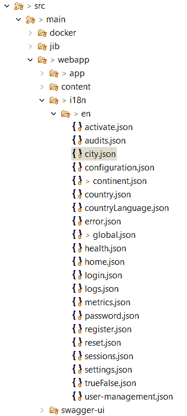

键和值以 JSON 格式创建。要了解其结构，请打开`country.json`文件，其外观如下：

```java
{
    "gdpApp": {
        "country": {
            "home": {
                "title": "Countries",
                "createLabel": "Create a new Country",
            },
            "created": "A new Country is created with identifier {{ param }}",
            "delete": {
                "question": "Are you sure you want to delete Country {{ id }}?"
            },
            "detail": {
                "title": "Country"
            },
            "code": "Code",
            "name": "Name",
            "continent": "Continent",
          ....
        }
    }
}
```

标题可以通过`gdpApp.country.home.title`键访问。这将在 HTML 模板中使用。打开位于`/src/main/webapp/app/entities/country`文件夹下的`country.component.html`文件，你会看到以下代码来使用这个键：

```java
<div>
    <h2 id="page-heading">
        <span jhiTranslate="gdpApp.country.home.title">Countries</span>
    ....
```

JHipster 已创建各种模块以支持验证、枚举、读取和解析 JSON 等。其中之一是`translation`，它支持国际化。这些模块在 JHipster 安装期间作为`jhipster-core`包安装，位于项目目录下创建的`node_modules`文件夹中。如果你需要添加更多标签，可以将键放在相应的 JSON 文件中，并使用`jhiTranslate`来渲染值。

现在，回到我们显示`Country`实体屏幕上的枚举值而不是实际数据库值的问题。这是因为`continent.json`中的翻译默认使用枚举值生成。您可以通过以下方式更改它，以便在屏幕上显示正确的洲际值：

```java
 "ASIA": "Asia",
 "EUROPE": "Europe",
 "NORTH_AMERICA": "North America",
 "AFRICA": "Africa",
 "OCEANIA": "Oceania",
 "ANTARCTICA": "Antarctica",
 "SOUTH_AMERICA": "South America",
```

现在，一切应该按预期工作。管理员能够看到所有三个实体，并且可以正确地执行 CRUD 操作。我们现在将开发自定义屏幕，以按国家显示 GDP 数据。

# 在服务、持久化和 REST 控制器层中的过滤器提供

让我们回顾一下，在用 JDL 创建实体时，我们在 JDL 脚本的最后设置了`Country`实体的过滤器选项。让我们看看这如何影响服务、持久化和 REST 控制器层。

# 持久化层

当我们为任何实体添加过滤器选项时，JHipster 会对相应实体的存储库接口进行必要的更改。在我们的例子中，`CountryRepository`现在扩展了`JpaSpecificationExecutor`接口，该接口用于向存储库添加`Specification`功能，如下所示：

```java
public interface CountryRepository extends JpaRepository<Country, Long>, JpaSpecificationExecutor<Country>
```

Spring Data JPA 提供了一个`Specification`接口来执行条件查询，该查询用于根据数据库列上的各种条件从数据库中检索值。

# 服务层

在服务层，JHipster 在服务包下生成一个名为`xxxQueryService`的单独类。对于`Country`实体，创建了一个新的服务类`CountryQueryService`。这个类的作用是检索具有过滤标准的数据，因此它只包含获取方法，如下所示：

```java
 public Page<CountryDTO> findByCriteria(CountryCriteria criteria, Pageable page) {
     log.debug("find by criteria : {}, page: {}", criteria, page);
     final Specification<Country> specification = createSpecification(criteria);
     return countryRepository.findAll(specification, page)
            .map(countryMapper::toDto);
 }
```

JHipster 为每个使用过滤器选项声明的实体生成一个**普通 Java 对象**（**POJO**）类。这用于将前端传递的过滤器值从服务层传递。在我们的例子中，JHipster 生成了一个`CountryCriteria`类，为`Country`实体服务此目的。这个类包含域对象中每个相应字段的过滤器。如果没有应用过滤器，这将检索所有实体。

JHipster 创建了各种过滤器类型，对应于每个包装类类型。对于任何自定义类型，它创建一个内部类，该类扩展了`io.github.jhipster.service.filter.Filter`类。`CountryCriteria`类如下所示：

```java
public class CountryCriteria implements Serializable {
    /**
     * Class for filtering Continent
     */
    public static class ContinentFilter extends Filter<Continent> {
    }
    private static final long serialVersionUID = 1L;
    private LongFilter id;
    private StringFilter code;
    private StringFilter name;
    private ContinentFilter continent;
    private StringFilter region;
    private FloatFilter surfaceArea;
    private IntegerFilter population;
    private FloatFilter lifeExpectancy;
    private StringFilter localName;
    private StringFilter governmentForm;
    private LongFilter cityId;
    private LongFilter countryLanguageId;
 //setters and getters
}
```

`Country`域类中的`continent`属性是枚举类型，因此 JHipster 创建了一个内部过滤器类`ContinentFilter`，对于其他类型的包装类属性，它使用相应的过滤器。从前端，您需要根据属性类型以特定方式传递搜索文本作为请求参数，如下所示。考虑属性名为`abc`：

+   如果属性`abc`是字符串类型：

    +   `abc.contains=<search_text>`：列出所有`abc`的值包含`search_text`的实体。

+   如果属性`abc`是任何数字类型（float、long、double、integer）或日期：

    +   `abc.greaterThan=<search_text>`：列出所有`abc`的值大于`search_text`的实体。

    +   `abc.lessThan=<search_text>`：列出所有`abc`的值小于`search_text`的实体。

    +   `abc.greaterOrEqualThan=<search_text>`：列出所有`abc`的值大于或等于`search_text`的实体。

    +   `abc.lessOrEqualThan=<search_text>`：列出所有`abc`的值小于或等于`search_text`的实体。

+   如果属性`abc`是自定义类型：

    +   `abc.equals=<search_text>`：列出所有`abc`的值与`search_text`完全相同的实体。

    +   `abc.in=<comma separated search_text values>`：列出所有`abc`的值在`search_text`列表中的实体。

    +   `abc.specified=true`：列出所有`abc`的值不为 null 的实体，这意味着已指定。

    +   `abc.specified=false`：列出所有`abc`的值为 null 的实体，这意味着未指定。

这些规则可以组合多个属性以形成复杂查询。

# REST 控制器层

当应用过滤器选项时，JHipster 也会对 REST 控制器进行必要的更改。例如，对于实体`Country`的 REST 控制器`CountryResouce`的所有`get`方法现在都接受`CountryCriteria`作为参数以支持过滤操作，如下所示：

```java
 @GetMapping("/countries")
 @Timed
 public ResponseEntity<List<CountryDTO>> getAllCountries(
     CountryCriteria criteria, Pageable pageable) {

     log.debug("REST request to get Countries by criteria: {}", criteria);
     Page<CountryDTO> page = countryQueryService.findByCriteria(criteria, pageable);
     HttpHeaders headers = PaginationUtil.
                 generatePaginationHttpHeaders(page, "/api/countries");
     return ResponseEntity.ok().headers(headers).body(page.getContent());
 }
```

这就是过滤器选项如何影响持久层、服务层和 REST 控制器层代码生成。在单过滤器配置下，JHipster 会进行所有必要的更改。然而，默认情况下，为每个实体生成的 REST 控制器都受到 Spring Security 的保护。您可以在`com.nilangpatel.config.SecurityConfiguration`类的`config()`方法中验证这一点，如下所示：

```java
    public void configure(HttpSecurity http) throws Exception {
        ....
        .and()
            .authorizeRequests()
            .antMatchers("/api/register").permitAll()
            .antMatchers("/api/activate").permitAll()
            .antMatchers("/api/authenticate").permitAll()
            .antMatchers("/api/account/reset-password/init").permitAll()
            .antMatchers("/api/account/reset-password/finish").permitAll()
            .antMatchers("/api/**").authenticated()
            ....
    }
```

除了注册、激活、认证和重置密码操作外，所有其他 URL（`/api/**`）都限制为登录用户。但是，在我们的情况下，我们希望向普通用户展示国家 GDP 数据，而不需要登录。为此，我们需要创建一个具有不同 URL 模式的自定义 REST 控制器，如下所示：

```java
@RestController
@RequestMapping("/api/open")
public class GenericRestResource {
  private final Logger log = LoggerFactory.getLogger(GenericRestResource.class);
  private final CountryQueryService countryQueryService;

    public GenericRestResource(CountryQueryService countryQueryService) {
        this.countryQueryService = countryQueryService;
    }

    @GetMapping("/search-countries")
    @Timed
    public ResponseEntity<List<CountryDTO>> getAllCountriesForGdp(
                CountryCriteria criteria, Pageable pageable) {
        log.debug("REST request to get a page of Countries");
        Page<CountryDTO> page = countryQueryService.findByCriteria
             (criteria, pageable);
        HttpHeaders headers = PaginationUtil.generatePaginationHttpHeaders(
             page, "/api/open/search-countries");
        return ResponseEntity.ok().headers(headers).body(page.getContent());
    }
    @GetMapping("/show-gdp/{id}")
    @Timed
    public ResponseEntity<CountryDTO> getCountryDetails(@PathVariable Long id) {
        log.debug("Get Country Details to show GDP information");
        CountryDTO countryDto = new CountryDTO();
        Optional<CountryDTO> countryData = countryService.findOne(id);
        return ResponseEntity.ok().body(countryData.orElse(countryDto));
    }
}
```

第一种方法与在`CountryResource`中自动生成的方法类似。第二种方法将用于显示 GDP 数据，我们将在创建该屏幕时使用它。此控制器的 URL 模式映射为`/api/open`。创建单独的 REST 控制器的目的是通过在`SecurityConfiguration`的`configure`方法中配置其 URL 模式，使其无需登录即可访问，如下所示：

```java
public void configure(HttpSecurity http) throws Exception {
   ....
    .antMatchers("/api/activate").permitAll()
    .antMatchers("/api/open/**").permitAll()
    .antMatchers("/api/authenticate").permitAll()
    ....
}
```

此控制器现在公开可访问。我们将在“*开发自定义屏幕*”部分使用控制器方法构建前端层。

# 向现有实体添加过滤器选项

如果实体已经生成而没有过滤选项，并且你想稍后添加它，你需要执行某些步骤。以下有两种可能的方法：

1.  使用命令提示符，执行以下操作：

    1.  在项目目录下的 `.jhipster` 文件夹中打开实体的 JSON 文件。例如，对于一个 `Country` 实体，你将在 `.jhipster` 文件夹中看到一个名为 `Country.json` 的文件。

    1.  如果 `service` 键的值是 `no`，则将其更改为 `serviceClass` 或 `serviceImpl`*.* 服务层选项必须启用才能使用过滤选项。

    1.  将 `jpaMetamodelFiltering` 键的值更改为 `true`。

    1.  使用 `jhipster entity <entity_name>` 命令重新生成实体。

1.  使用 JDL，执行以下操作：

    1.  在 JDL 脚本文件中添加一行，包含 `filter <entity_name>`。

    1.  使用 `jhipster jhipster-jdl <jdl_file>` 命令重新导入定义。

在这两种情况下，在重新生成实体时，自定义将重置，因此在执行此任务之前请进行适当的备份。

# 开发自定义屏幕

默认情况下，JHipster 只向登录用户显示实体。我们应用程序的目标是向最终用户显示给定国家的 GDP 数据。为了实现这一点，国家数据必须公开可见。换句话说，它必须无需登录即可访问。为了使其更用户友好，我们将设计两个不同的屏幕流程。

第一个屏幕将列出系统中所有可用的国家。选择任何一个国家将在第二个屏幕上显示该国的实际 GDP，并带有图形展示。这些是我们需要从头开始开发并插入到 JHipster 项目结构中的自定义屏幕，我们将在本节中这样做。

# 搜索国家屏幕

在此屏幕中，我们将列出系统中所有可用的国家，并使用分页。它与 `Country` 实体屏幕相同，但对所有用户（无需登录）都可用。为了提供更好的用户体验，我们将在该屏幕上添加过滤器以查找特定的国家。它看起来如下：

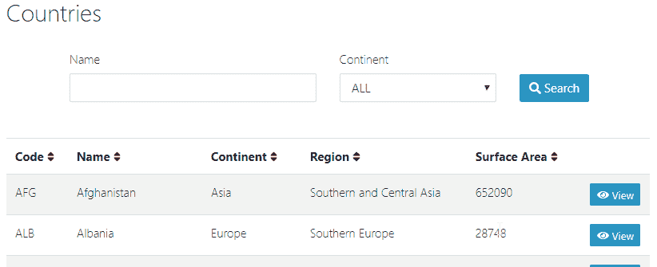

此屏幕有两个过滤器。第一个过滤器将匹配国家名称中的搜索文本（`contains` 条件），而第二个将比较选定的洲（`equals` 条件）。这些过滤器帮助用户立即找到他们想要的国。为了使其更简单，我们只添加了关于每个国家的一些信息列，这似乎适合这个屏幕。在每条国家记录的末尾，视图按钮将导航到第二个屏幕，显示该国的 GDP 信息。

JHipster 提供了 **Angular** 或 **React** 作为开发前端的选择。我们选择了 Angular 来创建这个应用程序。因此，我们所有的开箱即用的屏幕都是使用 Angular 框架生成的。由于这是一个自定义屏幕，我们需要使用各种 Angular 组件来开发它。在 `/src/webapp/app` 文件夹内创建一个 `gdp` 文件夹，在下一个子节中，我们将在其中创建 Angular 组件，以构建自定义屏幕。

# 创建 Angular 服务

Angular 是一个模块化框架，在其中我们编写许多组件，每个组件都针对特定的目的。很多时候，我们需要一些在多个组件之间共享的通用功能。此外，我们可能还需要通过 REST 调用来从数据库中获取记录。这就是创建 Angular 服务完美合理的地方。对于我们的 GDP 应用程序，我们需要在 Angular 服务中按如下方式获取国家数据：

```java
@Injectable({ providedIn: 'root'})
export class CountryGDPService {
    public searchCountryUrl = SERVER_API_URL + 'api/open/search-countries';
    public showGDPUrl = SERVER_API_URL + 'api/open/show-gdp';
    constructor(private http: HttpClient) { }
    query(req?: any): Observable<EntityArrayResponseType> {
        const options = createRequestOption(req);
        return this.http.get<ICountry[]>(this.searchCountryUrl, 
            { params: options, observe: 'response' });
    }
    find(id: number): Observable<EntityResponseType> {
        return this.http.get<ICountry>(`${this.showGDPUrl}/${id}`, 
               { observe: 'response' });
    }
}
```

`query` 方法用于获取所有国家，这些请求参数是由 `search-country` 组件发送的。第二个方法 `find` 用于根据给定的 `id` 值获取特定的国家。这个服务类使用 Angular 框架提供的 `HttpClient` 模块，以对新建的 REST 控制器进行 REST 调用。

使用 `api/open/search-countries` 和 `api/open/show-gdp` URL 来调用 REST 控制器的 `getAllCountriesForGdp()` 和 `getCountryDetails()` 方法。然而，服务组件的 `find()` 方法正动态地将 `id` 值传递到 URL 中，使用 `${this.showGDPUrl}/${id}` 表达式。这个服务类对两个屏幕都是通用的。

# 创建 Angular 路由器

下一个组件是 Angular 路由器。Angular 路由器用于管理应用程序导航和不同组件之间的路由。Angular 路由器使用浏览器 URL 来将其映射到特定的组件。它对浏览器 URL 进行各种类型的处理，例如解析以验证 URL 是否有效；如果提供了该选项，则进行重定向；将组件与 URL 段进行匹配；验证给定的 URL 是否可以通过设置的安全卫士访问；运行关联的解析器以动态添加数据；最后，激活组件并执行导航。我们将如下编写 Angular 路由器：

```java
@Injectable({ providedIn: 'root' })
export class CountryGDPResolve implements Resolve<ICountry> {
    constructor(private service: CountryGDPService) {}

    resolve(route: ActivatedRouteSnapshot, state: RouterStateSnapshot): Observable<Country> {
        const id = route.params['id'] ? route.params['id'] : null;
        if (id) {
            return this.service.find(id).pipe(
                filter((response: HttpResponse<Country>) => response.ok),
                map((country: HttpResponse<Country>) => country.body)
            );
        }
        return of(new Country());
    }
}

export const countryGDPRoute: Routes = [
    {
        path: 'countries',
        component: SearchCountryComponent,
        resolve: {
            pagingParams: JhiResolvePagingParams
        },
        data: {
            defaultSort: 'name,asc',
            pageTitle: 'gdpApp.country.home.title'
        },
    },
    {
        path: 'showGDP/:id',
        component: CountryGDPComponent,
        resolve: {
            country: CountryGDPResolve
        }
    },
];
```

它包括一个 `resolve` 类（`CountryGDPResolve`）和路由数组。当用户点击“查看”按钮以启动到第二个屏幕的转换时，`resolve` 类根据国家 ID 获取完整的国家模型数据。它使用服务组件进行 REST 调用来获取国家信息。路由数组持有组件和它们将通过哪些 URL 触发的配置映射。这个 Angular 路由器对两个屏幕都是通用的。

# Angular 模块

如我们所知，Angular 是一个模块化框架。Angular 中的模块用于将相关的组件、管道、指令和服务分组，形成一个独立的单元，可以与其他模块结合形成一个完整的应用程序。**模块**可以控制哪些组件、服务和其他工件对其他模块是隐藏的还是可见的，这与 Java 类有公共和私有方法的方式非常相似。我们将使用一个名为 `CountryGDPModule` 的单个模块，如下所示：

```java
const ENTITY_STATES = [...countryGDPRoute];

@NgModule({
    imports: [GdpSharedModule, RouterModule.forChild(ENTITY_STATES)],
    declarations: [
        SearchCountryComponent,
        CountryGDPComponent,
    ],
    entryComponents: [SearchCountryComponent , CountryGDPComponent],
    schemas: [CUSTOM_ELEMENTS_SCHEMA]
})
export class CountryGDPModule {}
```

它定义了构成此模块所需的所有组件和路由器。这对两个屏幕都是常见的。

# 创建一个 Angular 组件以显示国家列表

接下来，我们将编写一个组件，在第一个屏幕上显示国家列表。组件是我们创建 Angular 应用程序的基本构建块。每个 Angular 应用程序至少有一个组件。组件包含应用程序数据和逻辑，用于在关联的 HTML 模板中显示数据。我们将为应用程序中的每个屏幕编写一个单独的组件。对于第一个屏幕，我们将编写一个 `search-country` 组件，如下所示：

```java
@Component({
  selector: 'jhi-search-country',
  templateUrl: './search-country.component.html',
})
export class SearchCountryComponent implements OnInit {
    countries: ICountry[];
    routeData: any;
    totalItems: any;
    queryCount: any;
    itemsPerPage: any;
    page: any;
    predicate: any;
    previousPage: any;
    reverse: any;

    // variables for country name and continent filters.
    nameFilter: String;
    continentFilter: String;

   constructor(
        private countryGDPService: CountryGDPService,
        private activatedRoute: ActivatedRoute,
        private router: Router,
    ) {
        this.itemsPerPage = ITEMS_PER_PAGE;
        this.routeData = this.activatedRoute.data.subscribe(data => {
            this.page = data.pagingParams.page;
            this.previousPage = data.pagingParams.page;
            this.reverse = data.pagingParams.ascending;
            this.predicate = data.pagingParams.predicate;
        });
    }

   loadAll() {
        this.countryGDPService
            .query({
                page: this.page - 1,
                size: this.itemsPerPage,
                sort: this.sort(),
                'name.contains': this.nameFilter,
                'continent.equals' : this.continentFilter
            })
            .subscribe(
                (res: HttpResponse<ICountry[]>) => this.paginateCountries(res.body, res.headers),
            );
    }
 .....

}
```

可以使用 `@component()` 装饰器创建一个 Angular 组件。`SearchCountryComponent` 类代表 `search-country` 组件。它通过某些变量定义，这些变量用于分页和过滤目的。`CountryGDPService` 对象通过构造函数注入到组件类中，将在其他方法中用于获取国家数据。构造函数使用分页变量初始化，这些变量用于处理第一个屏幕上的分页。

在组件类通过构造函数初始化后不久，Angular 将调用 `ngOnInit()` 方法。在这个方法中，我们初始化了一些参数，并通过 `loadAll()` 调用其他方法。此方法调用 `countryGDPService` 对象的 `query()` 方法以获取国家信息。

`query()` 方法接受各种分页和过滤参数。`page`、`size` 和 `sort` 是分页参数，而 `name.contains` 和 `continent.equals` 是过滤参数。它们最终通过 `CountryGDPService` 提交给 REST 控制器。

`name.contains` 过滤参数用于根据 `name` 属性过滤国家数据。由于它是 `String` 类型，我们使用了 `contains` 条件。同样，另一个过滤参数 `continent.equals` 用于过滤 `continent` 属性的数据。由于它是 `enum` 类型，我们使用了 `equals` 条件。这就是我们在 *Service 层* 部分下，在 *服务、持久化和 REST 控制器层中的过滤提供* 子部分中看到的内容。

其他函数，如`searchCountries()`、`trackId()`、`loadPage()`等，直接从与`search-country`组件关联的 HTML 模板中调用。您可以在 GitHub 章节的源代码中看到它，网址为[`github.com/PacktPublishing/Spring-5.0-Blueprints/tree/master/chapter04`](https://github.com/PacktPublishing/Spring-5.0-Blueprints/tree/master/chapter04)。

# Angular 模板用于显示国家列表

最后，我们需要一个 HTML 模板来在屏幕上渲染国家数据。每个 Angular 组件都与一个`@Component`装饰器关联一个 HTML 模板。对于我们的第一个屏幕，以显示国家列表，HTML 模板如下所示：

```java
<form name="searchCountriesForm" novalidate (ngSubmit)="searchCountries()">
    <div class="container mb-5">
        <div class="row">
            <div class="col-6">
                <label class="form-control-label" 
                jhiTranslate="gdpApp.country.name" for="nameFilter">Name</label> 
                <input type="text" class="form-control" 
                name="nameFilter" id="nameFilter" [(ngModel)]="nameFilter" maxlength="52"/>
            </div>
            <div class="col-4">
                <label class="form-control-label" jhiTranslate="gdpApp.country.continent"
                for="continentFilter">Continent</label>
                <select class="form-control" name="continentFilter" 
                    [(ngModel)]="continentFilter" id="continentFilter">
                    <option value="">
                        {{'gdpApp.Continent.ALL' | translate}}</option>
                    <option value="ASIA">
                        {{'gdpApp.Continent.ASIA' | translate}}</option>
                    <option value="EUROPE">
                        {{'gdpApp.Continent.EUROPE' | translate}}</option>
                    <option value="NORTH_AMERICA">
                        {{'gdpApp.Continent.NORTH_AMERICA' | translate}}</option>
                    <option value="AFRICA">
                        {{'gdpApp.Continent.AFRICA' | translate}}</option>
                    <option value="OCEANIA">
                        {{'gdpApp.Continent.OCEANIA' | translate}}</option>
                    <option value="ANTARCTICA">
                        {{'gdpApp.Continent.ANTARCTICA' | translate}}</option>
                    <option value="SOUTH_AMERICA">
                        {{'gdpApp.Continent.SOUTH_AMERICA' | translate}}</option>
                </select>
            </div>
            <div class="col-2 align-self-end">
                <label class="form-control-label" for="search-countries"></label>
                <button type="submit" id="search-countries" class="btn btn-primary">
                        <fa-icon [icon]="'search'"></fa-icon><span>Search</span>
                </button>
            </div> 
        </div>
    </div>
</form> 
<div class="table-responsive" *ngIf="countries">
    <table class="table table-striped">
        <thead>
        <tr jhiSort [(predicate)]="predicate" 
                [(ascending)]="reverse" [callback]="transition.bind(this)">
        <th jhiSortBy="code"><span jhiTranslate="gdpApp.country.code">
                Code</span> <fa-icon [icon]="'sort'"></fa-icon></th>
        <th jhiSortBy="name"><span jhiTranslate="gdpApp.country.name">
                Name</span> <fa-icon [icon]="'sort'"></fa-icon></th>
        <th jhiSortBy="continent"><span jhiTranslate="gdpApp.country.continent">
                Continent</span> <fa-icon [icon]="'sort'"></fa-icon></th>
        <th jhiSortBy="region"><span jhiTranslate="gdpApp.country.region">
                Region</span> <fa-icon [icon]="'sort'"></fa-icon></th>
        <th jhiSortBy="surfaceArea"><span jhiTranslate="gdpApp.country.surfaceArea">
                Area</span> <fa-icon [icon]="'sort'"></fa-icon></th>
        <th></th>
        </tr>
        </thead>
        <tbody>
        <tr *ngFor="let country of countries ;trackBy: trackId">
            <td>{{country.code}}</td>
            <td>{{country.name}}</td>
            <td jhiTranslate="{{'gdpApp.Continent.' + country.continent}}">
                {{country.continent}}</td>
            <td>{{country.region}}</td>
            <td>{{country.surfaceArea}}</td>
            <td class="text-right">
                <div class="btn-group flex-btn-group-container">
                    <button type="submit"
                            [routerLink]="['/showGDP', country.id ]"
                            class="btn btn-info btn-sm">
                        <fa-icon [icon]="'eye'"></fa-icon>
                        <span class="d-none d-md-inline" 
                         jhiTranslate="entity.action.view">View GDP</span>
                    </button>
                </div>
            </td>
        </tr>
        </tbody>
    </table>
</div>
<div *ngIf="countries && countries.length">
    <div class="row justify-content-center">
        <jhi-item-count [page]="page" [total]="queryCount" 
            [itemsPerPage]="itemsPerPage"></jhi-item-count>
    </div>
    <div class="row justify-content-center">
        <ngb-pagination [collectionSize]="totalItems" 
            [(page)]="page" [pageSize]="itemsPerPage" [maxSize]="5" [rotate]="true" 
            [boundaryLinks]="true" (pageChange)="loadPage(page)"></ngb-pagination>
    </div>
</div>
```

HTML `form`用于渲染过滤选项，国家名称作为文本字段，大陆作为下拉菜单。在过滤表单之后，它以表格格式显示国家，底部有分页。每行的最后一列有一个“查看”按钮，该按钮使用`/showGDP` URL 打开下一个屏幕，并传递当前国家的`id`。

# 显示 GDP 屏幕

此屏幕以图形表示方式显示所选国家的基本数据和 GDP 数据。我们将使用世界银行 API 以 JSON 格式获取信息，并将其提供给图表模块以渲染 GDP 数据的图表。此屏幕如下所示：

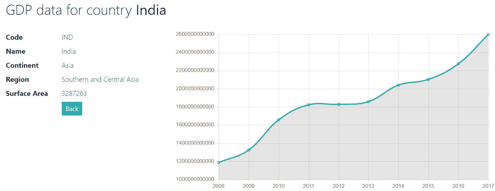

此屏幕使用与第一个屏幕相同的 service、router 和 module artifacts，但将使用一个单独的组件和 HTML 模板，您将在下一节中看到。

# 用于显示国家 GDP 的 Angular 组件

`show-gdp`组件从第一个屏幕获取国家数据，调用世界银行 API，并以 JSON 格式获取数据，最后将其发送到图表模块进行渲染。此组件如下所示：

```java
@Component({
  selector: 'jhi-show-gdp',
  templateUrl: './show-gdp.component.html',
  })
export class CountryGDPComponent implements OnInit {
    currentCountry: ICountry;
    data: IGdpData[];
    preGDPUrl = 'http://api.worldbank.org/v2/countries/';
    postGDPUrl = '/indicators/NY.GDP.MKTP.CD?format=json&per_page=' + 10;
    year = [];
    gdp = [];
    chart = [];
    noDataAvailale: any;
    constructor(
        private activatedRoute: ActivatedRoute,
        private httpClient: HttpClient
    ) {
        this.activatedRoute.data.subscribe(data => {
            this.currentCountry = data.country;
        });
    }
    ngOnInit() {
        const gdpUrl = this.preGDPUrl + this.currentCountry.code 
                       + this.postGDPUrl;
        this.httpClient.get(gdpUrl).subscribe(res => {
            this.noDataAvailale = true;
            const gdpDataArr = res[1];
            if ( gdpDataArr ) {
                this.noDataAvailale = false;
                gdpDataArr.forEach(y => {
                    this.year.push(y.date);
                    this.gdp.push(y.value);
                });
                this.year = this.year.reverse();
                this.gdp = this.gdp.reverse();

                this.chart = new Chart('canvas', {
                    type: 'line',
                    data: {
                        labels: this.year,
                        datasets: [
                            {
                            data: this.gdp,
                            borderColor: '#3cba9f',
                            fill: true
                            }
                        ]
                    },
                    options: {
                    legend: {
                        display: false
                    },
                    scales: {
                        xAxes: [{
                            display: true
                        }],
                        yAxes: [{
                            display: true
                        }],
                      }
                    }
                });
            }
        });
    }
}
```

在此组件的构造函数中，我们从 Angular router 获取所选国家。在`CountryGDPResolve`类的`resolve()`方法中，我们从 URL 中的`ID`参数获取国家对象，然后此对象通过 router 可用，因为我们已在`countryGDPRoute`中为此组件提供了 resolve 配置，如下所示：

```java
    {
        path: 'showGDP/:id',
        component: CountryGDPComponent,
        resolve: {
            country: CountryGDPResolve
        }
    }
```

一旦我们获取到国家信息，我们将调用世界银行 API。此 URL 如下所示：

[`api.worldbank.org/v2/countries/**IND**/indicators/NY.GDP.MKTP.CD?format=json&per_page=10`](http://api.worldbank.org/v2/countries/IND/indicators/NY.GDP.MKTP.CD?format=json&per_page=10)。

在这个 URL 中，国家代码是动态插入的，来自路由器提供的国家数据。`per_page`属性返回这么多年的 GDP 数据。前面的例子显示了印度国家过去十年的 GDP 数据。在获取 JSON 数据后，我们正在迭代并准备两个数组，`year`和`gdp`，并将它们传递给图表模块以在屏幕上生成图表。图表模块可以作为 node 模块安装，使用`npm install chart.js`命令。

# Angular 模板显示国家 GDP

最后，`show-gdp`组件的模板将渲染图表并显示国家 GDP 数据。模板如下所示：

```java
<div class="container">
    <h2 id="page-heading">
        <span> GDP data for country <b>{{currentCountry.name}}</b></span>
    </h2>
    <br/>
    <div class="row">
        <div class="col-4">
            <dl class="row">
                <dt class="col-sm-4">Code</dt>
                <dd class="col-sm-8">{{currentCountry.code}}</dd>
                <dt class="col-sm-4">Name</dt>
                <dd class="col-sm-8">{{currentCountry.name}}</dd>
                <dt class="col-sm-4">Continent</dt>
                <dd class="col-sm-8">{{'gdpApp.Continent.' + 
                    currentCountry.continent | translate }}</dd>
                <dt class="col-sm-4">Region</dt>
                <dd class="col-sm-8">{{currentCountry.region}}</dd>
                <dt class="col-sm-4">Surface Area</dt>
                <dd class="col-sm-8">{{currentCountry.surfaceArea}}</dd>
                <dt class="col-sm-4"></dt>
                <dd class="col-sm-8">
                    <div class="btn-group">
                        <button type="submit"
                                [routerLink]="['/countries']"
                                class="btn btn-info btn-sm">
                            <span class="d-none d-md-inline">Back</span>
                        </button>
                    </div>
                </dd>
            </dl>
        </div>
        <div class="col-8">
            <div *ngIf="noDataAvailale">
                GDP data for <b>{{currentCountry.name}}</b> is not available
            </div> 
            <div *ngIf="chart">
                <canvas id="canvas">{{ chart }}</canvas>
            </div>
        </div>
    </div>
</div>
```

它显示了所选国家的一些详细信息，然后是一个图表的占位符。`noDataAvailale`变量用于显示消息，在所选国家没有 GDP 数据的情况下。它在`show-gdp`组件中设置，当调用世界银行 API 时。

# 将 GDP 模块连接到 AppModule

现在一切都已完成。我们的 GDP 模块已准备好执行。最后一步是将它连接到 JHipster 项目结构。您已经看到，一个模块由多个工件组成，例如组件、管道、服务和路由器。多个模块组合在一起形成一个应用程序。

每个 Angular 应用程序至少有一个模块，称为根模块，它用于启动应用程序。通常，这个模块被称为`AppModule`，这是惯例。由于我们的应用程序前端是基于 Angular 构建的，因此存在一个`AppModule`。位于`/src/main/webapp/app`文件夹下的`app.module.ts`文件代表了一个`AppModule`。

我们需要在`AppModule`中配置我们的自定义模块以使其生效。这可以通过在`app.module.ts`文件中的`@NgModule`下的`imports`声明中添加我们的模块来实现，如下所示：

```java
@NgModule({
    imports: [
        ....
        GdpHomeModule,
        GdpAccountModule,
        // jhipster-needle-angular-add-module JHipster will add new module here
        GdpEntityModule,
        CountryGDPModule
```

在将实体添加到应用程序后，JHipster 生成一个名为`XXXEntityModule`的通用模块，它包含与所有实体相关的所有工件的引用。在实体生成后不久，JHipster 将此模块条目添加到`@NgModule`内部的导入数组中。我们已经为 GDP 模块（`CountryGDPModule`）添加了另一个条目。这就是任何自定义模块如何连接到`AppModule`的方式。

# 更新导航

我们的自定义模块已经准备好，并且已经连接到`AppModule`，以使其生效。然而，还有一个小细节需要处理，那就是定位导航以启动 GDP 模块。最佳选择是将导航链接放在页面顶部的导航栏中。JHipster 提供了一个作为单独模块的导航栏，它显示了各种链接。其中一些是公开可见的，而其他一些则仅供登录和`Admin`用户使用。

要添加链接，我们需要修改位于`/src/main/webapp/app/layouts/navbar`文件夹下的导航模板文件`navbar.component.html`，如下所示：

```java
<div class="navbar-collapse collapse" id="navbarResponsive" 
            [ngbCollapse]="isNavbarCollapsed" [ngSwitch]="isAuthenticated()">
        <ul class="navbar-nav ml-auto">
            <li class="nav-item" routerLinkActive="active" 
                [routerLinkActiveOptions]="{exact: true}">
                <a class="nav-link" routerLink="/" (click)="collapseNavbar()">
                    <span>
                        <fa-icon icon="home"></fa-icon>
                        <span jhiTranslate="global.menu.home">Home</span>
                    </span>
                </a>
            </li>
            <li class="nav-item" routerLinkActive="active" 
 [routerLinkActiveOptions]="{exact: true}">
 <a class="nav-link" routerLink="/countries" 
                        (click)="collapseNavbar()">
 <span>
 <fa-icon icon="list"></fa-icon>
 <span>Countries</span>
 </span>
 </a>
 </li>
          ....
```

我们在导航栏中突出显示的 HTML 代码中添加了粗体，以显示“国家”菜单项。它看起来如下：


`routerLink`的路径定义为“国家”，这最终会触发`t=the search-country`组件在第一个屏幕上显示带有筛选选项的国家列表。这就是你如何在 JHipster 项目中添加自定义屏幕的方式。

# 其他 JHipster 功能

到目前为止，你已经看到了如何使用 JHipster 创建完整和可生产的应用程序。你已经看到了如何创建实体并定义它们之间的关系。我们还添加了自定义屏幕并开发了各种工件，这样你就可以学习如何向由 JHipster 生态系统生成的应用程序添加自定义代码。

这些是一些非常棒的功能，不仅使开发者的生活更轻松，而且通过自动化许多流程，使开发者更加高效。我们现在将探讨这些功能。

# IDE 支持

在本章的开头，你看到了如何通过回答各种问题来使用 JHipster CLI 创建应用程序。这已经足够开始使用 JHipster 了。然而，为了提高生产效率，建议使用 IDE 进行开发。JHipster 支持广泛的 IDE，包括 Eclipse、Visual Studio Code、IntelliJ IDEA 等等。在使用 IDE（或简单的文本编辑器）时，你需要确保排除某些文件夹进行索引，如`node_modules`、`build`和`target`，以减少应用程序的初始加载时间。

# 开箱即用的设置屏幕

JHipster 提供了一些开箱即用的屏幕。大致上，它们可以分为三个不同的组，如下所示：

+   首页和登录屏幕

+   管理

+   账户管理

# 首页和登录屏幕

启动时，JHipster 显示带有欢迎信息的首页。这是默认的首页，你可以根据应用程序需求进行更改。在本地开发中，默认选择`dev`配置文件，因此你将在左上角看到一个“开发”标签。在页面的顶部部分，你会看到一个导航菜单。在没有登录的情况下，它将显示以下菜单项：

+   首页：显示主页的链接。

+   语言：这是有条件的。只有当你选择了多个语言时，此菜单才会可见。

+   账户：此部分显示子菜单项，例如“登录”和“注册”。

点击“登录”选项后，你会看到一个登录页面，如下所示：

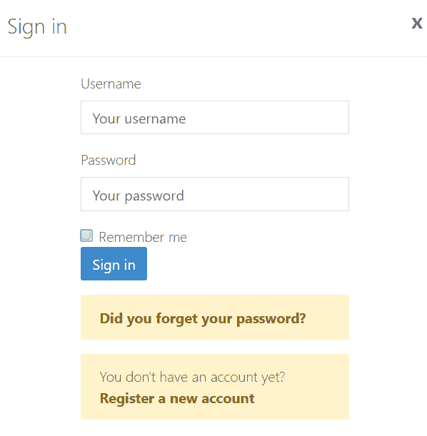

此屏幕涵盖了“记住我”、“忘记密码了吗？”以及“注册新账户”等功能。忘记密码功能需要电子邮件验证。为此，你需要在应用程序属性文件中配置 SMTP。默认情况下，JHipster 创建了以下两个用户：

+   **管理员**：用户名—`admin`，密码—`admin`，角色—`admin`。

+   **用户**：用户名—`user`，密码—`user`，角色—`user`。

# 账户管理

JHipster 自带登录功能。它还结合了账户管理。JHipster 提供的账户屏幕支持以下形式的子菜单中的各种操作：

+   **设置**：此屏幕允许更新用户账户详情，例如姓名、电子邮件地址和语言。语言下拉菜单显示了系统中的所有可用语言，这些语言是在应用程序创建期间配置的。

+   **密码**：此屏幕用于更新当前登录用户的密码。

+   **注册**：此屏幕用于将新用户注册到系统中。仅在用户未登录时才可用。用户创建后不久，将启动一个激活流程，包括激活邮件和验证。发送电子邮件需要在应用程序属性中完成 SMTP 配置。请注意，如果在应用程序创建期间选择 OAuth 作为认证机制，JHipster 将不会显示此屏幕。

# 管理

使用管理员凭据登录后，您将看到一个包含“管理”选项的导航菜单。它涵盖了用于管理整个应用程序的各种模块。这对于开发和监控应用程序都很有用。

它包含以下各节中描述的各种子菜单。

# 用户管理

这是一个一站式屏幕，用于管理应用程序的注册用户。您可以从此屏幕添加新用户，修改、删除或激活/停用现有用户。它还显示了具有各种属性的用户列表，例如`ID`、`用户名`、`电子邮件`、`激活/停用`、`语言`、`角色`、`创建日期`、`修改者`和`修改日期`，并支持分页。

# 指标

JHipster 提供各种屏幕来分析应用程序性能和其他指标，如下所示：

+   **JVM 度量**：此部分显示了 JVM 特定的统计信息，如内存利用率、线程计数、线程转储和垃圾回收详细信息。

+   **HTTP 请求**：此指标显示了 HTTP 请求的聚合详情，包括其状态码。

+   **服务统计信息**：此处显示了各种内置和自定义服务的执行时间详情。查看各种服务的使用情况很有用。

+   **缓存统计信息**：此指标涵盖了实体缓存的详细信息。

+   **数据源统计信息**：此处将显示数据源详情。

提供了刷新按钮以更新指标的最新值。

# 健康状况

此屏幕显示了与应用程序健康相关的各种信息，例如底层数据库和磁盘空间。它用于提前做出关于数据存储的决定。

# 配置

此屏幕显示了应用于应用程序的当前配置。在出现任何问题或检查进一步性能改进的可能性时，特别有用。它涵盖了 Spring 框架特定配置、服务器配置、系统环境配置和应用程序属性。由于这涉及敏感数据，默认情况下只有管理员才能看到。

# 审计

JHipster 为用户认证提供审计日志。由于在 JHipster 中认证是通过 Spring Security 完成的，它专门捕获与认证相关的安全事件，并将它们存储在独立的 Spring 数据仓库的数据库中。从安全角度来看，这些信息非常有用。此屏幕以表格格式显示所有这些数据，并具有分页功能。

# 日志

此屏幕显示了运行时各种应用程序日志级别，例如`TRACE`、`DEBUG`、`INFO`、`WARN`、`ERROR`和`OFF`，以及类和包。它还允许更新单个类和包的日志级别。这在解决应用程序问题时非常有用。

# API

JHipster 使用 Swagger，这是一个用于描述 API 结构的框架。正如您所看到的，JHipster 支持实体创建，并公开 REST API。它使用 Swagger 来记录实体 REST API。JHipster 还提供了一个用户界面，使用示例数据与 API 交互，并返回输出。

# 维护代码质量

JHipster 在创建应用程序和实体时生成大量的样板代码。它在生成代码时遵循最佳实践，以保持代码质量。然而，JHipster 第一次只是创建应用程序代码，用户必须在之后根据业务需求添加自定义代码。

为了即使在添加自定义代码后也能保持代码质量，JHipster 允许使用 Sonar 分析整个应用程序代码——Sonar 是一款专门用于监控代码质量的工具。代码分析使用**SonarCloud**——Sonar 的云版本。为此，您必须在 Git 中提交代码。

您还可以在本地 Sonar 服务器上分析代码。为此，您必须在本地设置和运行 Sonar 服务器。Sonar 服务器运行的默认端口是`9000`，因此您需要确保在`pom.xml`中配置的 Sonar 端口（如果构建类型是 Maven）相同。执行`mvnw test sonar:sonar`命令，您将在 Sonar 中看到代码分析，如下所示：

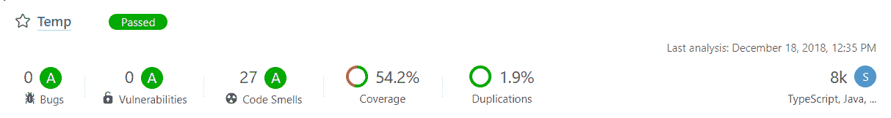

这有助于在添加自定义代码到应用程序后仍保持代码质量。

# 微服务支持

在本章中，我们使用 JHipster 创建了一个单体应用程序。然而，它也允许用户创建基于微服务应用程序。基于微服务的架构将整个单体应用程序（包括前端和后端）拆分为小型且独立的模块化服务。这是软件开发的一种独特方式，在过去几年中迅速发展。

每个模块化服务都可以通过一个独特且简单的 API 与其他服务交互。与单体设计相比，微服务架构具有许多优势，例如独立开发和部署、轻松管理故障转移、开发人员可以在独立团队中工作、实现持续交付等。

通常，微服务架构没有前端层，但 JHipster 支持带有前端微服务网关以处理网络流量。它作为代理微服务为最终用户提供服务。简而言之，用户可以通过网关与微服务交互。JHipster 微服务模型由一个网关服务、一个注册表以及至少一个或多个我们可以使用 JHipster 创建的微服务应用程序组成，这些应用程序可以通过后端代码访问，并使用 API 进行访问。

# Docker 支持

Docker 是一个支持容器化的开源软件平台，它使得应用程序的部署变得便携和自包含。它可以将整个应用程序（包括 SQL 和 NoSQL 数据库、Sonar 配置等）及其依赖项打包成一个单一的容器镜像，以便在任何环境中进行部署和测试。

JHipster 为单体和基于微服务的应用程序提供了开箱即用的 Docker 支持。Docker 是为 Linux 开发的，但为 macOS 和 Windows 提供了单独的版本。JHipster 在应用程序生成时创建 Dockerfile。Dockerfile 包含 Docker 容器用于构建 Docker 镜像的指令集。

JHipster 还支持从 Docker Hub 拉取 Docker 镜像。这是一个在线注册表，用于发布公共和私有 Docker 镜像。这极大地帮助了在不进行本地安装的情况下使用第三方工具，因为 Docker 镜像可以被拉取并在本地容器上运行。

# 配置文件管理

配置文件是一组针对特定环境的配置，如开发、测试、生产等。JHipster 支持配置文件管理，并自带两个配置文件——`dev`和`prod`。默认情况下，它使用`dev`配置文件。JHipster 为每个配置文件提供单独的应用程序属性文件。

在生产环境中，您需要使用`./mvnw -Pprod`命令为 Maven 和`./gradlew -Pprod`命令为 Gradle 启用生产配置文件。如果您需要在生产中导出可执行的 WAR 文件，可以使用 Maven 的`./mvnw -Pprod package`命令和 Gradle 的`./gradlew -Pprod package`命令。

# 实时重载

在软件开发过程中，从时间管理角度来看，最具挑战性的因素之一是重新编译代码、部署并重新启动服务器以查看所做的更改。通常，用 JavaScript 编写的客户端代码不需要编译，可以在浏览器刷新后立即反映更改。尽管如此，最新的前端框架在修改脚本文件后需要某种形式的转译。

在这种情况下，对于任何单个代码更改，通常需要构建、部署和重新启动服务器。这将严重影响开发者的生产力。为了避免这种情况，JHipster 支持一种称为**实时重新加载**的机制。JHipster 生成一个基于 Spring Boot 的应用程序，并包含`DevTools`模块，以在服务器上刷新更改而不进行冷启动。默认情况下，这是启用的，所以每当发生任何 Java 代码更改时，它将自动在服务器上刷新它们。任何前端代码的实时重新加载都可以通过**BrowserSync**实现，可以使用`npm start`命令启动，并且可以通过`http://localhost:9000`访问*.*。

# 测试支持

测试是任何软件开发过程中的一个重要组成部分。它为应用程序或产品提供质量保证。在创建应用程序和实体时，JHipster 会为前端和后端（或服务器端）创建各种自动化的单元测试用例。

服务器端单元测试用例生成在`/src/test/java`文件夹中。它们涵盖了应用程序的各个层次，如存储库、服务、安全、REST API 和分页。它们被分组在相应的包中。您可以从 IDE 中运行单个测试用例，或者使用`mvnw test`命令从命令提示符中运行所有测试用例。确保在执行此命令时您位于应用程序目录中。在 Gradle 的情况下，您需要执行`gradle test`命令。

前端（或客户端）单元测试可以使用`npm test`命令执行。这将执行位于`/src/test/javascript/spec`文件夹中的 typescript 的各种 JavaScript 测试用例。JHipster 默认还支持使用 Jest 框架进行端到端客户端测试用例。可选地，还可以使用其他框架，如**Gatling**、**Cucumber**和**Protractor**，进行客户端端到端测试。

# 升级 JHipster

与其他框架不同，升级 JHipster 是一个痛苦的过程。一个名为**JHipster 升级**的子生成器用于升级现有应用程序到新版本，而不会删除自应用程序首次创建以来添加的任何自定义更改。这非常有用，尤其是在 JHipster 的新版本发布时，其中包含已知的错误修复和安全补丁。可以使用以下命令执行 JHipster 升级：

```java
jhipster upgrade
```

为了使整个升级过程自动化，JHipster 借助以下步骤使用 Git：

+   上述命令检查是否有新的 JHipster 版本可用，除非明确给出 `--force` 标志。如果提供了此选项，无论已安装的版本是否为最新版本，都会触发升级子生成器。

+   整个升级过程依赖于 Git，因此如果应用程序未使用 Git 初始化（如果未安装 Git），JHipster 将初始化 Git 并将当前代码提交到 master 分支。

+   JHipster 将检查是否有未提交的本地代码。如果代码未提交，则升级过程将失败。

+   接下来，它将检查 Git 中是否存在 `jhipster_upgrade` 分支。如果不存在，这将创建。这个分支专门用于 JHipster 升级过程，因此它永远不应该手动更新。

+   JHipster 将检出 `jhipster_upgrade` 分支。

+   在这个阶段，JHipster 已经升级到最新版本。

+   当前项目目录被清理，并且从零开始生成应用程序，包括实体。

+   生成的代码将被提交到 `jhipster_upgrade` 分支。

+   最后，`jhipster_upgrade` 分支将与启动 `jhipster_upgrade` 命令的原始分支合并。

+   如果出现任何冲突，您需要手动解决并提交它们。

# 持续集成支持

自动化测试极大地有助于使系统无错误，即使在添加新功能之后。JHipster 为生成的代码创建单元和集成测试用例，这在一定程度上是有帮助的。在实际场景中，我们需要添加针对自定义业务实现的进一步单元测试用例；例如，您可能添加了一些自定义屏幕、控制器和服务层，您需要为这些层编写额外的单元测试用例。

此外，我们还需要为新引入的 API 添加集成测试用例。除此之外，我们还需要添加针对前端定制的客户端测试用例。

目前，测试和持续集成已成为软件开发过程中的一个重要组成部分。测试有助于生产出高质量的产品，而持续集成不过是不断合并和测试新引入的代码更改，这有助于识别潜在的错误。这是通过执行针对代码的自动化单元、集成和端到端测试用例来实现的。一个典型的例子是在 Git 上的每次提交时触发自动化测试套件；或者更高效地，按照预定义的计划运行它。

通过实施持续集成流程，可以实现自动化测试模型的好处，以确保新代码更改不会引入对稳定版本的回归。这保证了新更改的合并和部署到生产环境时的信心。

持续测试、集成和持续部署导致了一个称为 **持续集成/持续部署**（**CI/CD**）的概念，它执行持续集成、测试和部署代码。可以通过各种 CI/CD 工具实现持续交付。JHipster 为市场上现有的知名 CI/CD 工具提供了优雅的支持，例如 Jenkins、Travis CI、GitLab CI 和 Circle CI。

# 社区支持和文档

无论软件框架或产品有多好，其流行程度取决于用户从文档和社区获得帮助的容易程度。JHipster 在其官方网站上提供了非常棒的文档，这足以开始使用它。

除了官方的 GitHub 论坛，还有很多其他资源和论坛可供选择，在这些论坛中，你可以在使用 JHipster 的过程中轻松获得任何问题或问题的帮助。此外，开发者们提供专业的帮助，包括及时回答问题和优先提供错误修复。这确实有助于吸引开发者和组织开始使用 JHipster。

# JHipster Marketplace

谁不喜欢使用符合业务需求的可重用组件或模块呢？这将大大节省开发时间。作为一个开源软件，JHipster 团队不仅创造了一个以框架形式出现的大作，而且还维护了一个可重用模块的仓库，称为 **Marketplace**。

你可以根据需要下载各种模块，并将其直接插入到你的应用程序中。你可以将你的模块贡献回 Marketplace，这样其他社区用户就可以从该模块中受益。这是 JHipster 提供的一个伟大平台，用于与社区分享可重用代码。

# 摘要

这确实是一次伟大的旅程，探索了一个用于构建强大 Web 应用程序的新框架。JHipster 是一个真正出色的工具，可以快速构建现代和可生产的应用程序。由于许多事情都是自动完成的，JHipster 不仅使开发者的工作变得更简单，而且提高了整体项目交付进度。

在本章的开头，我们探讨了 JHipster 作为框架的基础知识，以及安装指南。继续前进，你学习了 JHipster 如何通过问答方式生成应用程序代码。它使用另一个名为 **Yeoman** 的工具来生成应用程序代码。

将领域对象作为实体实现并支持完整的 CRUD 操作是任何应用程序最重要的部分。在下一步中，我们学习了 JHipster 如何通过实体生成来支持领域对象的建模。实体生成可以通过三种选项来完成：基于 Yeoman 的经典选项、UML 方法以及使用 JDL-Studio。我们已经详细地研究了它们。

在介绍完这些特性后，我们开始创建一个应用，用于展示按国家划分的 GDP 信息。这要求我们构建自定义界面，并发现了如何在 JHipster 生成的应用中添加自定义功能。我们还收集了在不同层次（包括持久层、服务层、REST 控制器和前端层）生成的代码的一些细节，这将帮助我们适应任何未来的自定义需求。

在接近尾声时，我们查看了一些未见过的特性，展示了 JHipster 是一个多么稳健的平台，以及它如何使我们能够轻松地构建基于 Spring 的企业级应用。在下一章中，你将学习如何创建一个基于 Spring 的微服务架构应用，以及这与单体应用相比有何不同，以及它可能带来的好处。
