# 创建一个在线书店

以分层方式开发任何 Web 应用程序总是有益的。一个突出的 n 层（或有时 3 层）解决方案是分层架构，它已被广泛采用作为设计大多数应用程序的标准模式。这并不是一个新概念，我们已经使用了很长时间。

分层架构将整个应用程序划分为各种关注层，这些层在逻辑上是相互不同的：

+   **表示层**：这一层包含负责构建用户界面或向最终用户显示输出的工件

+   **应用层**：这一层包含业务逻辑，并与表示层和持久层交互，以构成应用程序的流程

+   **持久层**：这一层将数据存储在数据库、文件系统和外源等数据存储中，并检索它

分层架构有许多优势，如可重用性、灵活性和一致性增加，因为层在逻辑上是分离的。使用分层架构构建的应用程序本质上是自包含的，并且可以独立于其他应用程序执行。它们被称为**单体应用程序**。

自本书开始以来，我们一直在创建一个单体应用程序来展示和探索各种概念。尽管在逻辑上被分离为 n 层架构，但随着时间的推移，单体应用程序在规模和复杂性达到一定程度后，将面临维护噩梦。这样的应用程序将所有功能和功能都包含在一个单一包中，该包被封装为单个可部署单元。

另一方面，**微服务**是一种不同的架构方法，由谷歌、亚马逊、Netflix 和其他许多组织采用，旨在满足现代商业需求并开发本质上复杂的应用程序。微服务架构有助于解决单体应用程序出现的各种问题。

微服务的概念并不新鲜；它已经崭露头角，以克服先前架构的限制。在本章中，我们将通过开发一个在线书店应用程序并探讨以下主题来密切观察微服务架构的演变：

+   微服务架构简介

+   微服务架构的原则和特性

+   设计微服务前端的各种方法

+   定义数据库结构

+   探索各种 Spring Cloud 和 Netflix OSS 组件以设计微服务

+   制作一个安全的微服务应用程序

# 技术要求

本章中使用的所有代码都可以从以下 GitHub 链接下载：[`github.com/PacktPublishing/Spring-5.0-Projects/tree/master/chapter06`](https://github.com/PacktPublishing/Spring-5.0-Projects/tree/master/chapter06)。代码可以在任何操作系统上执行，尽管它只在 Windows 上进行了测试。

# 微服务介绍

微服务已成为一种有希望的架构模式，被广泛接受作为解决现代商业趋势的方案。企业使用各种渠道，如移动平台、大数据分析和社交媒体互动，作为增长业务和快速寻找新客户的元素。有了所有这些元素，组织正在尝试设计创新，以帮助他们获得强大的市场份额，这是一个使用传统交付方法相当难以实现的目标。

在过去，企业为满足其业务需求开发了单一的单体和累积应用程序。如今，这种状况已经改变，因为目标已经转向开发一个具有短周转时间、专注于特定业务需求的智能解决方案。

一个很好的例子是，一家旅游公司使用单一的单体应用程序来执行其业务。如果他们想通过根据用户搜索或更具体地说，根据他们的旧旅行、任何特殊场合或节日季节、用户偏好或兴趣来建议新的旅行想法来改善客户体验，会怎样呢？

在许多场景中，组织希望为这些用例中的每一个实施独立解决方案，并将它们集成到核心业务逻辑中，而不是将所有内容作为一个单一应用程序来维护，这意味着他们必须不断更新和测试整个应用程序以应对未来的业务变化，如下面的图示所示：

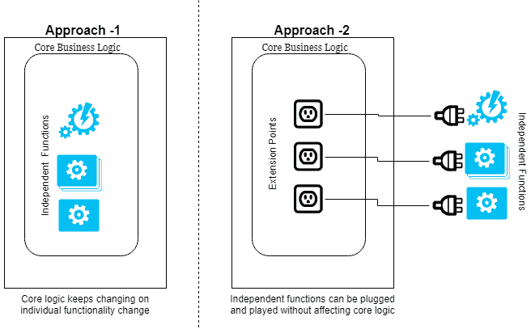

而不是将这些独立的功能与核心业务逻辑一起集成，它们可以独立插入。这种方法在允许以较低采用成本进行新更改方面更加灵活。此外，它们可以独立且更有效地进行测试。任何进一步的更改都可以轻松适应。

这样的业务场景需要一个能够以最小的影响和成本适应变化的架构，这使得它更加敏捷。这就是为什么开发微服务方法的原因。

微服务架构专注于以小部分设计应用程序，每个部分都关注特定的功能，而不是将整个应用程序作为一个单体架构中的黑盒。

在过去几年中，技术范式的革命彻底改变了我们开发应用程序的方式。这包括前端层，有各种流行的框架，如 Angular、React、Backbone 和 Bootstrap，它们完全改变了用户界面。

随着云意识和容器机制的出现，设计和实现中间层的方法受到了影响。这还包括了从使用关系型数据库到 NoSQL 的设计方式的改变，从而解决了特定的架构问题。

# 微服务架构

随着时间的推移，架构风格已经显著改进。各种架构模式，如主机、客户端-服务器、多层和**面向服务的架构**（**SOA**），在历史上的不同时期都曾流行。然而，这些架构都涉及开发某种类型的单体应用程序，无论是直接还是间接。

随着技术栈的革命发生，微服务架构由于所有先前架构的改进而变得突出。目标是提供敏捷性，减少采用新更改的周转时间，实现可扩展的性能，并充分利用现代工具和框架。

微服务架构将应用程序分解成小的、独立的子系统。它们也可以被称为系统中的系统，如下面的图所示：

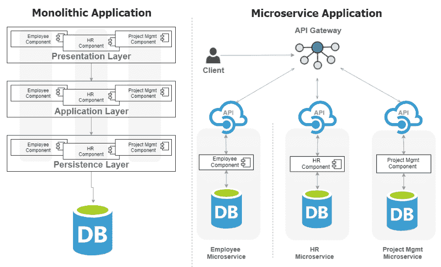

尽管在单体架构中，组件存储在不同的逻辑层中，但它们被封装在单个应用程序结构中。另一方面，微服务系统是一组独立的子系统，每个子系统都封装在自己的项目结构中，并以独立单元的形式部署。你可以将微服务架构视为一个拼图，其中每个微服务都是整个应用程序的构建块。

简而言之，在单体系统中，组件在逻辑上是不同的，但属于单个物理应用程序的一部分，而在微服务架构中，子系统是实际的物理应用程序，它们形成一个巨大的逻辑应用程序。

微服务架构现在广泛用作一组标准，用于重构单体应用程序。它起源于六边形模式，微服务架构促进了将业务功能封装到单个独立的单元中，该单元与其他功能隔离。

**六边形架构**将输入和输出放在六边形的边缘，并将**业务逻辑**保持在中心。这种安排将应用程序与外部关注点隔离开来，如下所示：

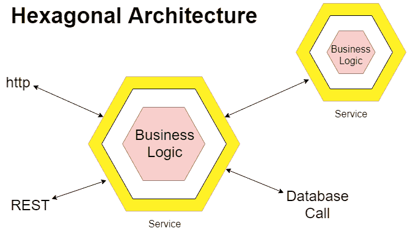

内部部分由**业务逻辑**组成，而外部部分包括 UI、消息传递、**REST**、数据库和其他内容。外部部分可以互换，而不会影响核心应用程序功能。每个业务功能都可以使用六边形模型进行设计，然后通过标准通信机制与其他部分交互。

让我们通过一个例子来观察六边形模式。假设你正在开发一个 EMI 计算器应用程序，该应用程序根据总贷款金额、利率和期限计算本金和利息金额。该应用程序保留扫描用户输入以计算贷款数据的功能。获取用户输入的逻辑与 EMI 计算器应用程序紧密相关。经过一段时间后，另一个应用程序需要使用 EMI 计算器应用程序。在这种情况下，输入机制需要更新。

为了克服这个问题，六边形模式建议通过定义某种标准接口来隔离 EMI 计算逻辑和输入接收机制。这样，EMI 计算器完全不知道输入来自哪里。在这种情况下，接收输入的接口被称为**端口**，而其实施被称为**适配器**，如下所示：

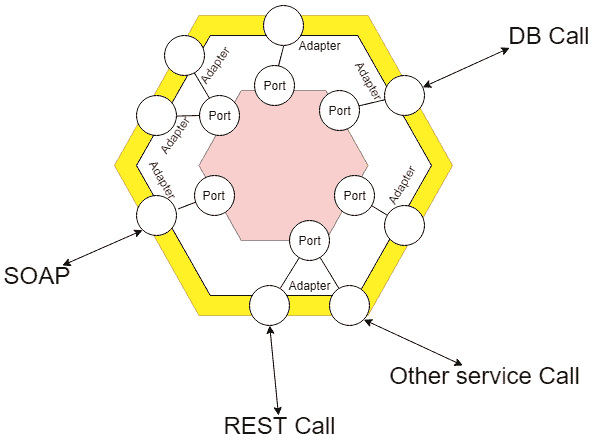

六边形模式也被称为**端口**和**适配器**模式。微服务架构的概念源于六边形模式，其中每个六边形结构代表一个自包含且松散耦合的服务（子系统）。添加更多的六边形模型相当于添加更多的独立服务。

正因如此，微服务概念在逻辑上被比作蜂巢，其中多个六边形结构形成一个庞大而坚固的结构。同样，单个服务（相当于单个六边形结构）组成一个更大的应用程序。

# 微服务原则

虽然没有直接的定义或标准来定义微服务，但在设计微服务应用程序时，必须考虑某些质量、标准和原则。让我们在本节中查看其中的一些。

# 单一责任的高内聚

**高内聚**意味着一个模块或单元应该执行单一的业务功能。在微服务架构中，单个服务应该为特定的应用程序上下文承担单一责任。不允许多个服务之间共享单一责任。此外，单个服务也不应处理多个责任，以便使整个系统真正模块化。

这是单体架构和微服务架构之间显著的不同之一。组件在逻辑上是分离的，但仍然是单个应用程序的一部分，并且在前者中共享一些共同的责任，但在后者中设计为独立的小型应用程序。

在设计微服务时，目标应该是微服务执行的业务功能的范围，而不是使其更小。术语**微**有时具有误导性，暗示你应该使服务尽可能小。应该优先考虑范围，而不是服务的大小。

# 服务自治

在构建微服务应用程序时，主要目标是使每个成员（服务）成为一个独立且独立的构建块。为了确保每个服务以最佳性能运行并提供可靠的输出，它们必须完全控制它们使用的底层资源。

这可以通过服务自治原则来实现。它建议每个服务都应该以自治为设计目标。通过这样做，服务对其执行环境的控制和所有权将更加有效，这在单体架构中共享资源时是难以实现的。这将极大地帮助处理应用程序的可伸缩性。

# 松耦合

应该以微服务架构的方式设计应用程序，使得每个单元（服务）应该对其他组件或服务的影响（理想情况下）为零或最小。如果服务之间需要任何形式的交互或通信，它们也应该在本质上松耦合。这就是为什么同步调用 RESTful API 或异步调用消息框架更可取的原因。

# 通过封装隐藏实现

微服务必须将底层实现细节与外部世界隔离，并定义一个标准接口来与之交互。这不仅会降低复杂性，还会增强轻松适应新变化的能力，使整个系统更加灵活和健壮。

# 领域驱动设计

**领域驱动设计**（**DDD**）是一种根据应用程序中使用的实际领域模型来设计系统的方式。DDD 的架构风格用于以独立单元开发应用程序，每个单元代表一个特定的领域模型。它还建议了领域模型之间行为和通信的方式。理想的 DDD 具有开发模块化应用程序所需的所有品质。因此，它是实施微服务架构的理想候选方案。

# 微服务特点

下面是微服务架构的一些特点：

+   这是一种将应用程序设计为一组小服务的方式，每个服务在自己的流程中执行。

+   微服务可以通过 HTTP API 或某些时间消息机制（如 AMQP 或 JMS）等内部交互。

+   每个微服务都是构建来执行特定的业务需求的。换句话说，它们与特定的业务需求或能力对齐。

+   微服务可以独立部署，并使用自动化机制。

+   需要某种形式的通用或中心化流程来管理微服务，这些微服务可能或可能不使用与单个微服务相同的技术栈。

+   微服务独立管理它们的生命周期。

+   对一个微服务的更改不会影响其他微服务，因为它们是独立运行的。

# 基于 Spring Cloud 的微服务

通常，微服务被设计为部署在分布式系统中。在分布式环境中存在一些常见的模式。Spring Cloud 提供了一系列预定义的模式实现，我们可以使用它们快速构建微服务应用程序。它们被认为是 Spring Cloud 的子项目。我们将简要地看看其中的一些，同时也会看到如何在开发我们的在线书店应用程序时使用它们。

# 配置管理

配置是任何应用程序的一部分，在 Spring 世界中，它们通常以属性文件的形式存在，通常与应用程序代码捆绑在一起。每次配置更改时部署整个服务是一项繁琐的工作。如果配置可以在应用程序外部进行管理会怎样？这是一个好主意，因为外部管理配置允许我们在不部署甚至重启服务的情况下反映更改。这正是配置管理所做的。配置可以即时进行。

# 服务发现

正如我们所见，微服务应用程序是一组自包含且独立部署的服务，它们运行在相同的或不同的物理机器上，或在云上。每个服务都可以被视为一个执行特定职责的独立进程。

虽然它们在执行不同的业务功能方面是分离的，但作为整个应用程序的一部分，它们是相互关联的，因此需要某种通信机制，并且要有明确的标准。

对于进程间通信以及访问特定服务，我们需要知道服务的端口和 IP 地址。传统的单体应用程序通常使用静态端口和 IP 地址进行部署和访问。此外，它们通常在一个单独的包中部署，这样所有组件/服务都可以使用相同的端口和 IP 地址进行访问。端口和 IP 地址更改的可能性也非常低。

相比之下，微服务应用程序在本质上具有分布式特性，可能部署在不同的机器或云中。此外，可以通过添加更多服务实例来提高系统的可伸缩性。在未来，可能会动态地添加新服务。因此，微服务的位置是动态的。

Spring Cloud 提供了一个**服务发现**功能，实际上用于在分布式环境中定位服务。Spring Cloud 默认提供基于 Netflix Eureka 的发现服务。或者，我们也可以使用 Consul、Cloud Foundry 或 Apache ZooKeeper 与 Spring Cloud 结合作为服务发现支持。

# 熔断器

尽管微服务被设计来处理单一职责，但它们有时需要依赖其他服务来执行属于他人的操作集。在这个依赖通道中，如果某个服务宕机，错误将会传播到同一通道上的其他服务。为了避免这种情况，Spring Cloud 提供了一个基于 Netflix Hystrix 的容错解决方案，这是电路断路器模式的一种实现。

# 路由

由于微服务的位置可以动态更改，因此需要一个路由机制来将请求发送到特定的服务端点。Spring Cloud 通过 Zuul——来自 Netflix 的另一个工具，它是一个用于路由目的的服务器端负载均衡器——提供了一个简单而有效的方法来路由具有高级横切能力（如安全、监控、过滤和身份验证）的 API。Zuul 还可以用作微代理，它使用配置的代理 URL 来路由应用程序。

另一个用于路由的组件是 Spring Cloud Gateway，它是 Spring 本地开发的。它基于 Spring Framework 5 构建，并且由于其与 Spring 的紧密集成，可能为开发者提供更好的体验。

# Spring Cloud 安全

尽管微服务通过标准接口访问，但在某些用例中它们需要身份验证和授权。保护微服务系统比保护单体系统更复杂。Spring 通过 Spring Cloud Security 和 Auth2 协议支持微服务的身份验证，以在分布式环境中传播安全上下文。

# 分布式跟踪服务

在微服务架构中，应用程序流程可能需要通过多个服务调用的链来执行单个业务用例。手动使用多个微服务的日志跟踪活动并不是一个有效的解决方案。我们可能无法从中得到我们想要的结果。理解一系列服务调用之间发生的事情非常重要。如果出现问题时，这非常有帮助。Spring Cloud 通过 **Spring Cloud Sleuth** 提供了一种有效的方法来跟踪分布式系统中的应用程序流程。它收集调用跟踪数据，这些数据可以导出到 **Zipkin**——另一个用于可视化调用跟踪的工具。

# Spring Cloud Stream

为了处理大量数据流，我们可能需要与消息代理实现（如 RabbitMQ 或 Apache Kafka）合作。Spring Cloud 通过 Spring Cloud Stream 提供了与消息代理的高层抽象的简单集成。因此，我们不必实际实现消息代理，Spring Cloud Stream 将在运行时根据其配置处理消息并将它们传递给实际的代理客户端。这使得代码可移植，并且与任何消息代理实现松散耦合。

# 开发在线书店应用程序

现在我们已经了解了微服务架构，让我们现在进行一个实际练习，以更详细地了解这个概念。我们将遵循微服务模式来开发一个简单的在线书店应用程序。

# 应用程序架构

我们需要首先设计应用程序的架构。在设计基于微服务的应用程序时，我们首先需要考虑一个单体应用程序，然后推导出各种相互独立的部分或组件，这些部分或组件可以被视为可能的独立微服务候选。

我们将根据前几节中提到的标准，如单一职责、服务自治、松耦合、封装和 DDD，将应用程序分解成小部分，具体如下：

+   用户管理

+   订单管理

+   目录管理

+   库存管理

它们被认为是独立的领域或业务功能。我们将为每个领域创建独立的微服务，并采用以下高级架构：

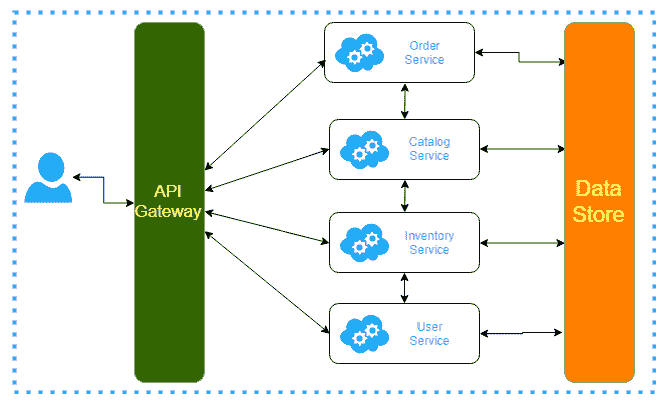

# 数据库设计

在将应用程序分解以采用微服务架构时，我们还需要重新思考数据库设计。在分布式环境中，数据库设计有多种选择。

# 所有微服务的单一单体数据库

在这种方法中，尽管微服务被独立设计为单独的子系统，但它们仍然共享一个单一的单体数据库，如下所示：

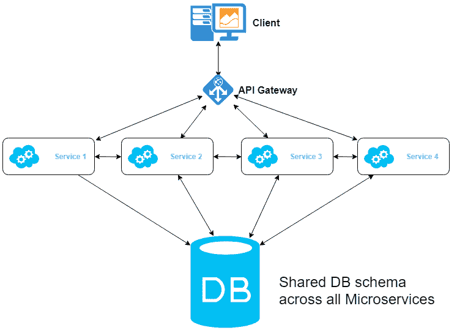

每个微服务都有自己的表集，但它们都是单一数据库模式的一部分。这种选择的明显优势在于简单性，因为单个数据库可以轻松操作。此外，事务可以以更一致的方式进行。

然而，根据最佳实践，微服务应该是独立可部署的，以获得更好的扩展优化。独立可部署的另一个好处是快速采用变化。一旦多个服务依赖于单个单体数据存储，这种灵活性就会降低，无法充分利用分布式环境，如高内聚和松耦合。

此外，多个团队通常在应用程序方面工作。在处理数据库变更时，他们还需要面对与其他团队的耦合。这将减缓开发速度，并最终导致交付延迟。因此，这不是一个理想的场景。

# 分离的服务来处理数据库交互

在这个场景中，我们不会与所有服务共享一个公共数据库，而是一个单独的服务将仅与数据库交互。所有其他服务都将通过这个服务进行任何数据库操作，而不是直接连接到数据库，如下所示：

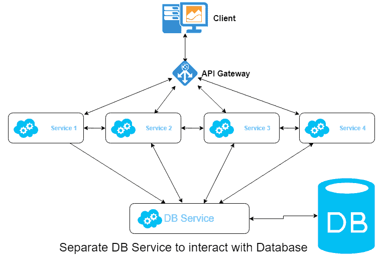

虽然管理数据库相关操作的依赖关系已转移到单独的服务中，但这仍然是一种类似单体式的方法，并且具有第一个选项的所有局限性。因此，这也不是为微服务架构设计数据库的优化方式。

# 每个微服务都有自己的数据库

此选项为每个独立服务提供单独的数据库，如下所示：

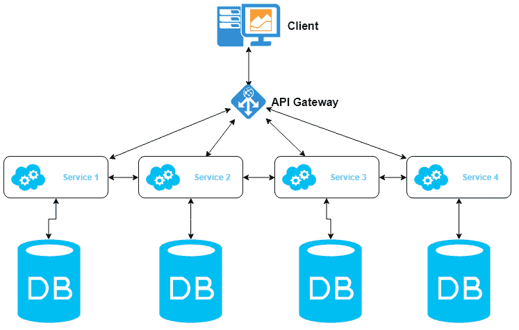

与服务之间共享单个数据库不同，每个服务的数据库是该服务的一个组成部分，并且不能被其他服务直接访问。这种选择的一个灵活性在于，每个服务都可以选择最适合其能力的数据存储类型。例如，如果你有一个搜索服务，要在系统中执行搜索，你可以使用**Elasticsearch**作为数据存储。

此模型有两个进一步的选择：

+   **每个服务独立的数据库架构**：仍然使用单个数据库服务器，但为每个微服务有一个独立的架构。此选项使所有权更清晰，并且对于大多数情况来说是一个理想的选项。

+   **每个服务独立的数据库服务器**：为每个微服务设计独立的数据库服务器。对于需要高吞吐量的服务，可以考虑此选项。

为了简化，我们将使用 MySQL 来存储数据。根据系统架构，每个微服务将有一个独立的数据库架构。

# 用户架构

此架构包含存储用户相关数据的表。**用户**表包含特定于用户的数据，这些数据将用于身份验证，而**配送地址**表包含配送地址信息：

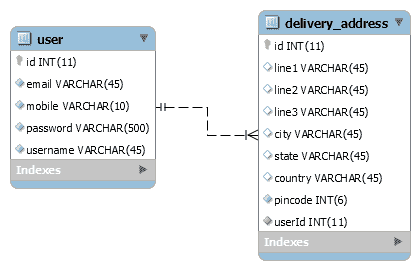

**用户**表和**配送地址**表之间存在**一对一**的关系。

# 订单架构

此架构包含两个表，**订单**和**订单项**。它们之间的关系如下：

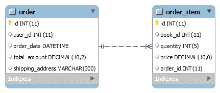

**订单**表包含每个订单的通用详细信息，如 orderId、userId、订单日期、总金额和配送地址。**订单项**表保存单个项目的详细信息。

# 目录架构

此架构包含产品详情。由于这是一个在线书店应用程序，**书籍**表包含书籍的详细信息。**类别**和**出版社**表分别包含关于类别和出版社的详细信息。这些表之间的关系如下：

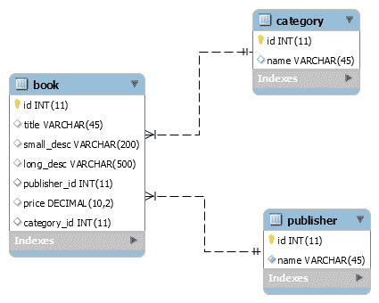

**书籍**表与**类别**和**出版社**表之间存在**多对一**的关系。

# 库存架构

每个商店都有一个库存。此架构存储包含关于书籍信息的库存。有两个表存储此信息。**库存**表包含产品的当前库存（在我们的例子中是书籍），而**库存历史**表显示了将新书添加到系统中的历史记录：

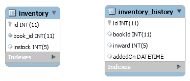

这些表之间没有关系。

# 使用 Spring Boot 创建微服务

我们将开发一个在线书店应用程序，该应用程序具有小型且可独立部署的微服务架构，这些微服务可以由各个团队开发。预计它们将以快速的开发周期完成。这正是 Spring Boot 的设计目的。它是一个用于在短时间内创建生产级 Spring 企业应用程序的工具，配置简单。

我们将首先使用 Spring Boot 开发单个服务以快速开发它们。Spring Cloud 也与 Spring Boot 具有坚实的集成能力。在开发微服务时，Spring Boot 负责所有底层事情，使我们能够专注于业务逻辑。

首先，我们将为特定功能创建 Spring Boot 应用程序。一旦创建，我们将在每个应用程序中添加微服务特定的功能：

+   `user-service`: 此服务旨在执行与用户相关的各种操作，例如注册、登录和用户交互

+   `inventory-service`: 此服务仅由管理员执行各种库存操作

+   `catalog-service`: 此服务负责管理目录信息，例如添加书籍、类别和出版社详情

+   `order-service`: 此服务处理用户下订单

当使用 spring-io 初始化器或**Spring Tool Suite**（**STS**，由 Spring 提供的基于 Eclipse 的 IDE）创建应用程序时，最初我们将添加以下依赖项：

+   **DevTools**: 通过添加自动部署/重启功能作为 Maven 依赖项来提高开发时间体验。

+   **JPA**: 这将添加一个特定于 JPA 的启动依赖项，用于添加 JPA 功能。我们将使用 JPA（Hibernate 实现）与数据库交互。

+   **MySQL**: 这将添加一个 MySQL 连接器 JAR 以连接到数据库。

+   **Web**: 这用于向应用程序添加 Spring MVC 功能。我们将使用 REST 控制器来访问单个微服务应用程序。

# 添加微服务特定功能

我们为每个单独的功能创建了各种 Spring Boot 应用程序。它们默认情况下都可以逐个访问（在端口`8080`上）。然而，它们还没有准备好作为微服务执行。现在，我们将通过在每个 Spring Boot 应用程序的`pom.xml`文件中添加依赖项条目来添加微服务特定的功能。

在`pom.xml`的`dependencies`部分添加以下条目：

```java
 <dependency>
    <groupId>org.springframework.cloud</groupId>
    <artifactId>spring-cloud-starter-netflix-eureka-client</artifactId>
 </dependency>
```

您还需要在`<java-version>`条目旁边添加当前版本的 Spring Cloud 条目，如下所示：

```java
<spring-cloud.version>Greenwich.RC2</spring-cloud.version>
```

在`pom.xml`的`dependencies`部分完成后添加以下条目：

```java
<dependencyManagement>
    <dependencies>
      <dependency>
        <groupId>org.springframework.cloud</groupId>
        <artifactId>spring-cloud-dependencies</artifactId>
        <version>${spring-cloud.version}</version>
        <type>pom</type>
        <scope>import</scope>
      </dependency>
    </dependencies>
  </dependencyManagement>

<repositories>
   <repository>
     <id>spring-milestones</id>
     <name>Spring Milestones</name>
     <url>https://repo.spring.io/milestone</url>
   </repository>
</repositories>
```

在我们开发的四个 Spring Boot 应用程序中都要进行这些更改。应用这些更改后，它们将不再作为独立的 Spring Boot 应用程序运行，因为我们现在正朝着微服务架构迈进。

# 开发服务发现服务器

在微服务架构中，真正的挑战是访问特定的服务，因为它们是动态创建和销毁的，所以它们的位置不断变化。此外，我们还需要某种类型的服务间通信，以满足跨越微服务的某些业务用例。此外，每个微服务的多个实例可以创建以扩展应用程序的性能。

在这种情况下，必须有一种机制来定位微服务。Spring Cloud 提供了一个基于 Netflix Eureka 的服务发现组件来实现这一目的。微服务可以自行注册到发现服务器，以便其他服务可以访问和与之交互。Eureka 服务器基本上用于发现、自我注册和负载均衡。

接下来需要创建一个基于 Eureka 的服务，该服务充当**服务发现服务器**。创建基于 Eureka 的发现服务类似于仅通过少量配置更改创建 Spring Boot 应用程序。使用以下数据创建一个新的 Spring Starter 项目：

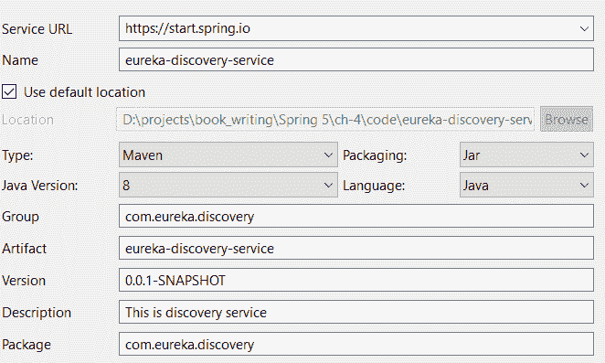

在下一屏幕上，选择“云发现”选项下的 Eureka 服务器作为依赖项，然后点击完成。一旦项目创建完成，打开 `bootstrap` 类，并按照以下方式添加突出显示的代码：

```java
@SpringBootApplication
@EnableEurekaServer
public class EurekaDiscoveryServiceApplication {

  public static void main(String[] args) {
    SpringApplication.run(EurekaDiscoveryServiceApplication.class, args);
  }
}
```

默认情况下，Eureka 服务器选项未启用。使用 `@EnableEurekaServer` 注解使其对应用程序生效。这意味着该应用程序将作为一个 Eureka 发现服务器运行。接下来，我们将在 `application.properties` 文件中添加某些属性，如下所示：

```java
#Configure this Discovery Server
eureka.client.registerWithEureka = false
eureka.client.fetch-registry=false

#In case if Eureka port need to be changed from default 8080
server.port = 8761
```

默认情况下，当前的 Eureka 服务器也是一个 Eureka 客户端，并会尝试将自己注册为 Eureka 服务器上的 Eureka 客户端。由于我们希望这个应用程序仅作为服务器运行，我们需要显式设置 `eureka.client.registerWithEureka` 属性为 `false`。默认情况下，Eureka 服务器通过端口 `8080` 可访问，并且可以使用 `server.port` 属性进行更改。

每个 Eureka 客户端将从 Eureka 服务器获取注册详情。在我们的案例中，我们不想获取注册详情，因此，我们显式设置 `eureka.client.fetch-registry` 属性为 `false`。现在运行应用程序，Eureka 服务器可通过 `http://localhost:8761` 访问。它将显示服务器详情和所有注册的服务详情，如下所示：

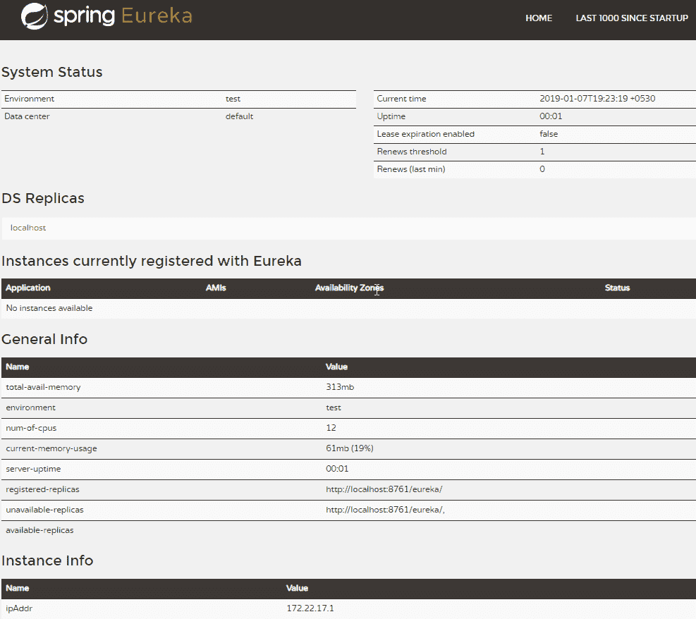

目前，我们的 Eureka 发现服务器上尚未注册任何服务，因此在“当前注册到 Eureka 的实例”部分中显示无内容。

Eureka 服务器可以以独立模式或集群模式启动。为了简单起见，我们选择了独立模式。

接下来，我们需要将我们开发的四个微服务注册到 Eureka 发现服务器。我们已经为它们添加了微服务特定的依赖项。现在，我们需要添加 Eureka 客户端配置。由于我们配置了 Eureka 服务器的方式，我们需要在每个服务的 `bootstrap` 类中配置 Eureka 客户端。例如，用户服务 `bootstrap` 类的 Eureka 客户端配置如下以粗体突出显示：

```java
@SpringBootApplication
@EnableDiscoveryClient
public class UserServiceApplication {
  public static void main(String[] args) {
    SpringApplication.run(UserServiceApplication.class, args);
  }
}
```

`@EnableDiscoveryClient` 注解将启用客户端配置。此外，我们还需要在 `application.properties` 文件中添加以下属性：

```java
spring.application.name=user-service
server.port=8791
```

`spring.application.name` 属性将用于将应用程序注册为具有特定名称。添加客户端配置并启动其他服务，你将看到它们如下注册到 Eureka 服务器：

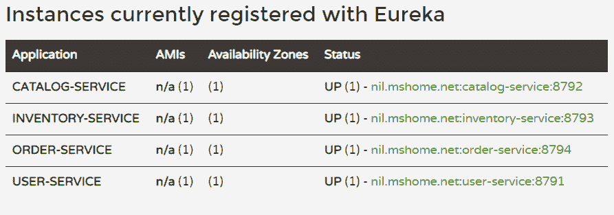

另一个注解 `@EnableEurekaClient` 也可以用于 Eureka 客户端配置。`@EnableDiscoveryClient` 和 `@EnableEurekaClient` 之间的区别在于前者更具有 Spring 意识，并且与 Eureka 之外的发现实现（如 Consul 和 ZooKeeper）一起工作；后者仅针对 Eureka。因此，如果类路径中有 Eureka，它们之间没有区别。

Spring Cloud Eureka 由客户端和服务器组件组成。所有微服务都注册在服务器注册表中，而每个单独的服务都表现为客户端。任何想要发现其他服务的服务也应该对 Eureka 客户端有意识。注册在服务器上发生时，使用客户端标识（及其名称）和 URL（及其端口）。

客户端与服务器之间的通信流程如下：

1.  在启动微服务时，它将联系服务器组件并提供注册所需的元数据。

1.  Eureka 服务器验证元数据并进行注册。

1.  注册后，微服务端点每 30 秒（默认值）向服务器注册表发送 ping 请求以标记其存在。

1.  服务器将不断验证 ping 请求，如果在一定时间内没有请求，它将自动从注册表中删除该服务。

1.  服务器将注册信息与所有 Eureka 意识的客户端共享，并将它们存储在本地缓存中。然后，微服务客户端使用这些信息在分布式环境中定位其他客户端。

1.  服务器每 30 秒（默认值）将注册信息的更新推送到所有客户端。

1.  在服务器上注册的微服务可以被分组到一个区域中。在这种情况下，区域信息可以在注册时提供。

1.  当任何微服务向另一个微服务发送请求时，Eureka 服务器将尝试在同一区域内搜索运行的服务实例以减少延迟。

1.  Eureka 客户端与服务器之间的交互通过 REST 和 JSON 进行。

# 设计 API 网关

在典型的微服务应用中，可能存在超过一百个微服务相互交互的情况。对于所有这些微服务，需要实现一些共同的特性：

+   **安全性**：我们可能需要检查认证和授权，或任何其他用于调用微服务的安全策略

+   **限制调用频率**：在给定时间内，只允许特定微服务进行一定数量的调用

+   **容错**：如果任何服务无法响应，则发送适当的错误信号

+   **监控**：用于监控微服务间传递的特定事件或值

+   **服务聚合**：在单个响应中提供多个微服务的聚合响应，特别是在带宽受限的环境中

+   **路由**：基于某些标准（例如，如果需要调用转发），将特定用户的所有调用路由到特定区域的服务

+   **负载均衡**：维护调用流以平衡服务实例的负载

除了这些，我们可能还想限制一些服务对最终用户的访问并保持其私有。为了实现这些目标，我们需要某种形式的 API 网关，它将拦截来自最终用户的所有调用以及所有服务间通信。因此，微服务现在将通过 API 网关直接通过 REST 调用相互交互，该网关将提供之前列出的所有功能。由于所有调用都通过 API 网关路由，它也可以用于调试和分析目的。

Spring Cloud 通过另一个名为**Zuul**的 Netflix 实现提供 API 网关支持。接下来，我们将看看如何设置 Zuul。

# 设置 Zuul 作为 API 网关

我们将创建一个 Zuul 代理服务器作为一个独立的 Spring Boot 服务，并将其注册到 Eureka 发现服务器。在 Spring STS 中创建一个新的 Spring 启动项目，并添加 Zuul、Eureka 发现和 DevTool 作为依赖项。

一旦创建，打开`bootstrap`类并按照以下方式更新：

```java
@EnableZuulProxy
@EnableDiscoveryClient
@SpringBootApplication
public class ZuulApiGatewayApplication {
  public static void main(String[] args) {
    SpringApplication.run(ZuulApiGatewayApplication.class, args);
  }
}
```

`@EnableZuulProxy`注解将使此服务成为 Zuul 服务器。我们还需要使用`@EnableDiscoveryClient`注解将其注册到 Eureka 发现服务器。每个注册到 Eureka 名称服务器的服务都需要一个名称（以及一个端口）。在`application.properties`文件中添加以下详细信息以设置 Zuul 服务器：

```java
spring.application.name=zuul-api-gateway
server.port=8781
```

现在 API 网关服务器已经准备好并配置好了，但我们没有指定在拦截请求时应该做什么。Zuul 通过各种过滤器提供请求处理支持。它们被分类为预、后、路由和错误过滤器，每个都针对特定的服务调用生命周期。由于 Zuul 是基于 Spring Boot 的服务，我们可以通过编程方式自定义 API 网关。此外，对于任何特殊需求，Zuul 支持开发自定义过滤器。我们将很快看到如何添加自定义过滤器，并检查如何使用它拦截请求。

Zuul API 网关服务器也被称为边缘服务器。

# 设计 UI

正如我们所见，微服务架构最适合现代大型且本质上分布式的应用。这种架构有助于将单一单体应用的团队拆分为一组小型且独立的团队，专注于单个模块或功能。

微服务模式有其自身的优势，例如管理可伸缩性和复杂性，以及在短时间内轻松采用新变化。我们已经探讨了 Spring Cloud 组件如何帮助在 Spring 框架中构建分布式应用。到目前为止，我们只讨论了中间和后端层。本节专门讨论一个有趣的话题：如何设计微服务前端。

与单体架构不同，微服务应用的前端可以采用不同的方法，如下所示：

+   单体前端

+   微前端

+   组合或模块化前端

# 单体前端

虽然微服务模式将单体后端划分为多个独立的服务，但对于前端来说这可能并不简单。在单体前端方法中，我们将整个用户界面保持在单个大型前端应用程序中，该应用程序将通过 REST 调用与对应的服务通信以执行任务或向最终用户展示数据，如下所示：

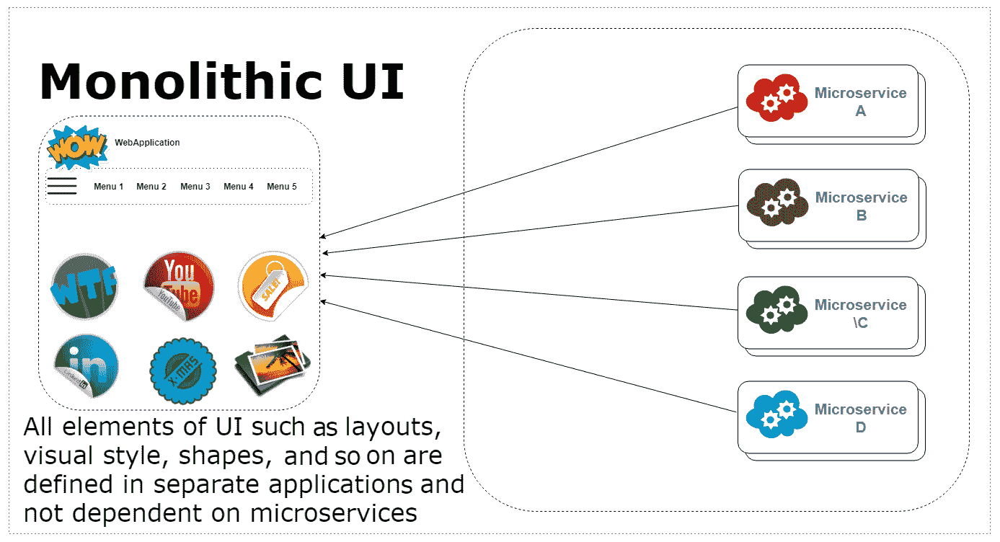

这种方法的明显优势是实现简单和整个应用中的 UI 一致性，因为所有内容都在一个地方。缺点是，由于多个团队正在单个 UI 应用上工作，可能会出现大量关于库版本、样式等问题上的冲突。

由于所有内容都在一个屋檐下，随着应用的扩展，采用变化变得更加困难。在一段时间内，当业务需求增加时，维护应用的 UI 变得更加困难，因为多个团队大部分时间都在解决问题。

只有当你确信应用仅被划分为几个具有有限未来增长范围的微服务时，才选择这种方法。

# 微前端

在这种方法中，每个微服务都有自己的 UI，限于其执行的功能。因此，除了后端之外，前端也根据单个微服务的范围进行分解，如下所示：

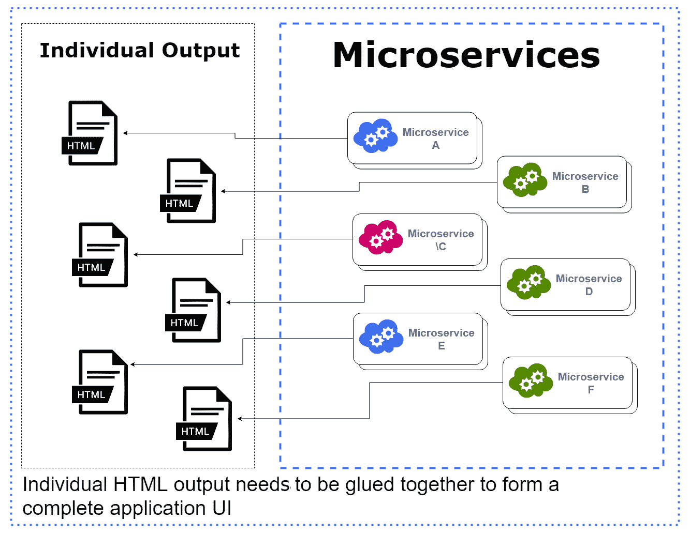

这种方法消除了单体前端的所有限制，但同时也引入了一些新的挑战。尽管微服务被分割成自包含和独立的可执行单元，并且最终的前端应该以单个接口呈现。在微前端方法中，挑战在于将单个微服务的 UI 组合成单一格式。有几种实现方式。尽管它们克服了第一种方法的限制，但同时也引入了一些其他问题：

+   **在微服务之间同步 UI：**通过这种方式，只需将所有服务的 UI 复制粘贴到对方，并使用 API 网关。尽管这似乎很简单，但它会产生巨大的维护问题。

+   **IFrame：**使用一个单独的布局，其中可以结合单个微服务的输出和 IFrame。然而，这种方法也不完美，因为 IFrame 有其自身的限制。

+   **HTML 片段：**你可以编写自己的 JavaScript 代码，并通过 HTML 片段粘合微服务的内 容。然而，存在一些限制，并且你还需要自己编写大量的自定义脚本。此外，还可能存在服务脚本和样式的冲突。

# 复合前端

这种方法是一种微前端方法，具有正确聚合微服务输出的解决方案。布局将通过单个 UI 应用程序创建，而各个微服务的业务 UI 将通过 Web 组件插入，如下所示：

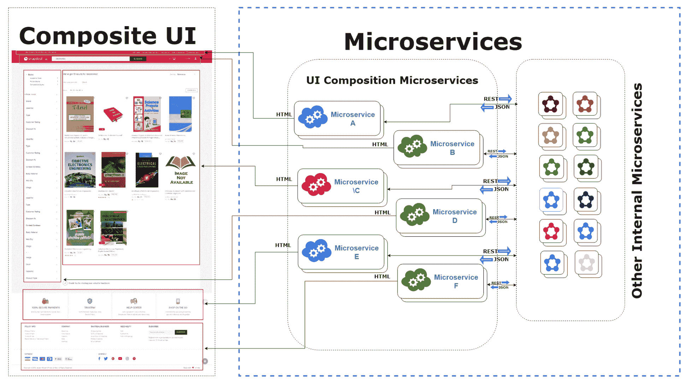

每个微服务负责在页面上生成一个小 UI 区域。可以通过在流行的前端框架（如 Angular 和 React）中创建组件来轻松设计复合 UI。在此基础上，*single-spa*（[`single-spa.js.org`](https://single-spa.js.org)）框架被设计用来展示聚合输出。它基本上是一个 JavaScript 库，将微服务的复合输出作为一个在浏览器中运行的单一页面应用程序显示。Single-spa 允许不同框架开发的微服务共存。

这意味着你可以用 Angular 开发一个微服务，用 React 开发第二个，用 Vue 开发第三个，以此类推。这带来了极大的灵活性，并实现了微服务架构完全独立于后端到 UI 的开发目标。作为第二种方法的增强版本，复合前端方法不仅克服了单体前端方法的限制，而且还提出了在微服务架构中开发前端层的正确方式。

# 其他 Spring Cloud 和 Netflix OSS 组件

Spring Cloud 在微服务应用中广泛使用的各种 Netflix 组件之上提供了一个包装器。我们已经探讨了 Eureka 发现服务器和 Zuul。在本节中，我们将探讨更多 Netflix OSS 组件，以及 Spring Cloud 的其他功能。

# Spring Cloud 中的动态配置

如我们所知，微服务架构由许多小型且可独立部署的微服务组成，它们处理最终用户调用并相互交互。根据项目需求，它们可能运行在各种环境中，如开发、测试、预发布、生产等。为了提高应用程序的扩展能力，可能配置了多个微服务实例与负载均衡器一起工作。

每个微服务都有一组配置，包括数据库配置、与其他服务的交互、消息代理配置和自定义配置。在各个环境之间处理微服务配置是微服务架构中最具挑战性的部分之一。

手动维护每个微服务的配置对于运维团队来说太复杂且困难。最佳解决方案是将配置从每个微服务中分离出来，并将它们全部维护在一个中央位置。这样，可以更有效地处理环境对配置的依赖。

Spring Cloud 提供了一个名为**Spring Cloud Config**的组件，用于外部化微服务配置。它使用 Git 仓库将所有配置存储在一个地方，如下面的图所示：

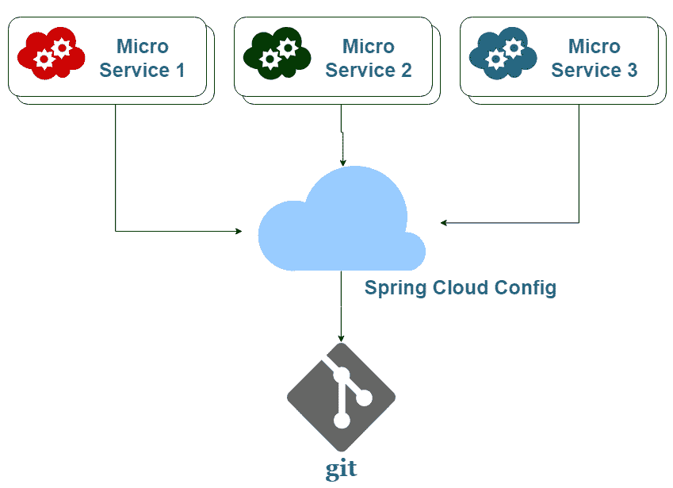

我们将使用 Spring Cloud Config 功能创建一个用于集中配置的独立服务。接下来的几节将解释如何做到这一点。

# 第 1 步 – 创建配置服务器的 Spring Boot 服务

这是将组件作为 Spring Boot 应用程序创建的最直接方法。使用 STS 创建一个应用程序，并选择 DevTool 和 Config server 依赖项。一旦项目创建完成，你可以在`pom.xml`中看到负责将 Spring Cloud Config 功能添加到 Spring Boot 应用程序的依赖项，如下所示：

```java
    <dependency>
      <groupId>org.springframework.cloud</groupId>
      <artifactId>spring-cloud-config-server</artifactId>
    </dependency>
```

接下来，让我们启用 Spring Cloud Config 功能。打开主`bootstrap`类，并添加`@EnableConfigServer`注解，用于启用外部配置：

```java
@EnableConfigServer
@SpringBootApplication
public class SpringCloudConfigServerApplication {
  public static void main(String[] args) {
    SpringApplication.run(SpringCloudConfigServerApplication.class, args);
  }
}
```

由于配置服务器也将注册到命名服务器（Eureka 服务器），我们需要在`application.properties`文件中定义某些属性，如下所示：

```java
spring.application.name=spring-cloud-config-server
server.port=8901
```

接下来，让我们安装和配置 Git。

# 第 2 步 – 使用 Git 仓库配置 Spring Cloud Config

Spring Cloud Config 服务器已准备就绪。现在，我们需要为 Git 仓库集成进行必要的配置。首先，在你的本地机器上安装 Git 的最新版本([`git-scm.com/downloads`](https://git-scm.com/downloads))，并确保它在某个路径上可用。在你的本地机器上创建一个目录，并使用以下命令初始化 Git 仓库：

```java
git init
```

这将在本地机器上创建一个空的 Git 仓库。接下来，添加一个包含配置细节的属性文件。由于配置服务器可以在 Git 中为多个微服务存储配置细节，因此我们需要遵循一定的命名约定来命名属性文件，如下所示：

```java
{microserivce-name}.properties
{microservice-name}-{active-profile}.properties
```

正如我们所见，微服务的 ID（或名称）是在 `application.properties` 文件中通过 `spring.application.name` 属性定义的。因此，我们需要在 Git 仓库中创建一个具有该名称的属性文件。例如，如果微服务名称是 `catalog-service`，那么你需要创建一个 `catalog-service.properties` 文件，并存储该微服务的所有配置。

对于不同的环境，你可以在微服务名称后附加一个活动配置文件来创建一个属性文件。例如，开发环境的属性文件名称将是 `catalog-service-dev.properties`。一旦创建了文件，添加配置细节并将它们通过以下命令提交到 Git 仓库：

```java
git add -A
git commit -m "Comment for commit"
```

Git 仓库现在已准备就绪，因此我们需要将配置服务器指向它。按照以下方式打开配置服务器的 `application.properties` 文件：

```java
 spring.cloud.config.server.git.uri=file://D:/projects/book_writing/git_central_config
```

由于这是一个本地 Git 仓库，因此使用 `file://` 来指定仓库文件夹的位置，以便指向本地文件系统。配置服务器还允许使用远程 Git 仓库进行配置。在这种情况下，你需要为 `spring.cloud.config.server.git.uri` 属性提供一个类似 `https://github.com/<<accoun-tname>>/<<repo-name>>.git` 的 Git 克隆 URL。

我们将添加一些示例配置，并查看它们如何反映在相应的微服务中。创建一个 `service.properties` 文件，并添加以下属性：

```java
catalog.sample.data=Hello world !!
```

# 第 3 步 - 使用 Spring Cloud Config Client 组件使每个微服务 Spring Cloud Config 兼容

最后一步是对微服务（配置客户端）进行必要的更改，以便在 Git 仓库中更新配置后，配置服务器将传播配置。此时的重要点是创建一个名为 `bootstrap.properties` 的新属性文件，并将所有属性从 `application.properties` 文件复制过来，或者你可以直接将 `application.properties` 重命名为 `bootstrap.properties`。

原因是 Spring 会首先处理 `bootstrap.properties` 文件，甚至在与它链接的引导应用程序和配置服务器进行配置更新之前。你需要在 `bootstrap.application` 文件中添加一个特定的属性，该属性将用于将微服务与配置服务器连接，如下所示：

```java
spring.cloud.config.uri=http://localhost:8901
```

配置服务器可通过 `http://localhost:8901` 访问。微服务将使用此 URL 获取配置细节。接下来，我们将通过 REST 控制器在微服务中访问我们在 Git 仓库中声明的配置，如下所示：

```java
@RestController
@RequestMapping("/api/test")
@RefreshScope
public class TestRESTController {
  Logger logger = LoggerFactory.getLogger(this.getClass());

  @Value("${catalog.sample.data}")
  private String data;

  @GetMapping("/getSampleData")
  public String getSampleData() {
    logger.info(" sample data value is -->"+this.data);
    return this.data;
  }
}
```

在这个控制器中，我们使用 `@Value` 注解通过 `catalog.sample.data` 访问配置。这个注解用于读取在本地 `application.properties` 文件中定义的属性。神奇的是，我们没有为分类服务定义任何这样的属性，但它将连接到配置服务器并从 Git 仓库内部获取这个属性值。

`@RefreshScope` 注解将在 Git 仓库中任何变更发生时用于获取最新的配置值。您需要为读取配置值的组件声明 `@RefreshScope`。当您启动 `catalog-service` 微服务时，它将尝试从配置服务器读取配置，您可以从以下日志中验证它：

```java
[restartedMain] c.c.c.ConfigServicePropertySourceLocator : Fetching config from server at : http://localhost:8901
```

在启动时，`catalog-service` 微服务将通过配置服务器从 Git 获取配置。这可以通过 `http://localhost:8792/api/test/getSampleData` REST URL 进行验证。当我们对配置进行更改并将其提交到 Git 时，它们必须传播到微服务。这不会自动完成，您需要使用 Spring Boot 提供的监控和管理应用程序的工具 Actuator 手动刷新。我们将使用 Actuator 的 `/refresh` 端点来刷新微服务，以获取最新的配置更改。

从 Spring Boot 2.0 开始，Actuator 的某些端点（包括 `/refresh`）默认未启用。要启用它们，您需要将以下属性添加到 `catalog-service` 微服务的 `bootstrap.properties` 文件中：

```java
management.endpoints.web.exposure.include=*
```

现在，所有端点都可用，可以通过向 `http://localhost:8792/actuator/refresh` 发送 POST 请求来完成配置传播。由于这是一个 POST 调用，您需要使用 Postman 等 REST 客户端。刷新完成后，您将看到以下输出：

```java
[
    "config.client.version",
    "catalog.sample.data"
]
```

这就是如何在无需重新启动微服务的情况下即时应用配置的方法。整个过程可以按以下顺序执行一系列操作：

1.  更新 Git 仓库中的文件

1.  执行 Git 提交

1.  执行刷新操作，您将看到相应的微服务中反映了更改

这是管理配置的一个很好的特性，它可以轻松地应用于特定的微服务。然而，并非所有属性都可以这样应用。例如，应用程序名称和特定于数据库的属性不能通过 Spring Cloud Config 在运行时应用。但是，可以动态地应用自定义配置。

# 使用 Feign 在微服务之间进行 RESTful 调用

在微服务架构中，通常微服务通过 HTTP REST Web 服务调用来相互交互。通常，`RestTemplate`在基于 Spring 的应用程序中用作客户端，以编程方式执行 REST API 调用。然而，它需要大量的代码来执行简单的 REST 调用。为了简化这一点，Spring Cloud 提供了 Feign，这是另一个 REST 客户端，它使 REST 通信比`RestTemplate`简单得多。让我们看看 Feign 如何使调用其他服务变得容易。

例如，`inventory-service`需要与`catalog-service`微服务通信以获取书籍详情。在这种情况下，`inventory-service`将发出 REST 调用以获取给定`bookId`的`Book`对象。这通常使用以下`RestTemplate`客户端发生：

```java
 @GetMapping("/get-inventory/{bookId}")
  public ResponseEntity<BookDTO> getInventory(@PathVariable("bookId") Integer bookId) {
    String url = "http://localhost:8792/api/catalog/get-book/"+bookId;
    RestTemplate restTemplate = new RestTemplate();
    ResponseEntity<BookDTO> returnValue = restTemplate.getForEntity(url, BookDTO.class);
    return returnValue;
  }
```

我们正在使用`RestTemplate`调用`catalog-service`微服务以获取给定`bookId`的书籍详情。Spring Cloud 从 Netflix 继承了另一个组件，称为**Feign**，它可以作为一个声明式的 REST 客户端，极大地简化了操作。它很容易与 Ribbon 集成，Ribbon 可以用作客户端负载均衡器；我们将在下一节中讨论这一点。要使用 Feign，您需要添加以下启动器依赖项：

```java
<dependency>
   <groupId>org.springframework.cloud</groupId>
   <artifactId>spring-cloud-starter-openfeign</artifactId>
</dependency>
```

接下来，让我们启用 Feign。打开`bootstrap`类，并添加一个`@EnableDiscoveryClient`注解来扫描 Feign 客户端，如下所示：

```java
@SpringBootApplication
@EnableDiscoveryClient
@EnableFeignClients(basePackages="com.bookstore.inventory")
public class InventoryServiceApplication {
  public static void main(String[] args) {
    SpringApplication.run(InventoryServiceApplication.class, args);
  }
}
```

现在，我们将使用 Feign 来调用服务。我们需要创建一个 Feign 代理来与其他服务通信，就像我们使用 JPA 仓库与数据库交互一样。以下是如何使用 Java 创建 Feign 代理：

```java
@FeignClient(name="catalog-service",url="http://localhost:8792", path="/api/catalog")
public interface CatalogServiceProxy {
  @GetMapping("/get-book/{bookId}")
  public ResponseEntity<BookDTO> getInventory(@PathVariable("bookId") Integer bookId);
}
```

`@FeignClient`注解用于定义 Feign 代理。`name`属性指向 Eureka 命名服务器中声明的目标微服务的名称（在`application.properties`或`bootstrap.properties`文件中使用`spring.application.name`属性指定）。`url`是目标微服务可访问的地址。`path`属性用于添加所有方法级映射使用的路径前缀。

我们已经创建了与在 REST 控制器中创建的方法签名相同的接口方法。我们将在 REST 控制器中使用此代理如下：

```java
@RestController
@RequestMapping("/api/inventory")
public class InventoryRESTController {

  @Autowired
  CatalogServiceProxy catalogServiceProxy;

  @GetMapping("/get-inventory/{bookId}")
  public ResponseEntity<BookDTO> getInventory(@PathVariable("bookId") Integer bookId) {
    return catalogServiceProxy.getInventory(bookId);
  }
}
```

`CatalogServiceProxy`的实例通过`@Autowired`注解由 Spring 注入。您可以看到制作 RESTful Web 服务是多么简单。所有细节都从控制器转移到 Feign 代理。您将获得与`RestTemplate`相同的输出，但代码是解耦和简化的。

假设您正在对`catalog-service`微服务进行超过一打的 REST 调用。在这种情况下，Feign 代理帮助我们在一个地方管理所有代码。其他组件类不需要了解底层细节。

# 使用 Ribbon 进行负载均衡

在上一节中，我们看到了`inventory-service`如何通过 Feign 调用`catalog-service`来获取书籍详情。然而，在分布式环境中，创建多个微服务实例来处理巨大的应用负载是完全可能的。

在多实例环境中，需要一个机制来无缝地平衡和分配输入请求的负载，将它们发送到可用的实例。系统变得容错。它还通过避免单个实例过载来提高吞吐量、减少响应时间并优化资源利用率，从而使系统更加可靠和高度可用。

Netflix 提供了一个名为 Ribbon 的组件，它在执行 HTTP 和 TCP 调用时充当客户端负载均衡器，提供了许多灵活性和控制。术语**客户端**指的是单个微服务，因为 Ribbon 可以用来平衡微服务对其他服务的调用流量。

Eureka 可以轻松地与 Ribbon 集成；然而，我们可以配置 Ribbon 而不使用 Eureka。我们将看到如何配置带有和没有 Eureka 的 Ribbon。

# 配置 Ribbon 而不使用 Eureka

我们将在从`inventory-service`到`catalog-service`的调用中配置 Ribbon，所以如果你已经配置了 Eureka 服务器，那么在了解 Ribbon 如何在没有 Eureka 的情况下工作之前，暂时将其移除。首要的事情是添加 Ribbon 启动器依赖项。由于我们想要处理从`inventory-service`发起的调用，因此需要在`inventory-service`中添加以下依赖项：

```java
<dependency>
   <groupId>org.springframework.cloud</groupId>
   <artifactId>spring-cloud-starter-netflix-ribbon</artifactId>
</dependency>
```

在上一节中，我们配置了 Feign 客户端来处理 REST 调用。我们将使用 Ribbon 与 Feign 客户端一起使用。打开我们在上一节中创建的代理类，并添加以下 Ribbon 配置：

```java
@FeignClient(name="catalog-service", path="/api/catalog" )
@RibbonClient(name="catalog-service")
public interface CatalogServiceProxy {
  @GetMapping("/get-book/{bookId}")
  public ResponseEntity<BookDTO> getInventory(@PathVariable("bookId") Integer bookId);
}
```

`@RibbonClient`注解用于声明 Ribbon 配置，其中`name`属性指向我们想要实现负载均衡的应用程序。我们使用`FeignClient`配置的 URL 现在被移除，并可以在`application.properties`文件中如下定义：

```java
catalog-service.ribbon.listOfServers=http://localhost:8792,http://localhost:8799
```

属性名将以我们使用`@RibbonClient`注解的应用程序名称开头。我们需要定义以逗号分隔的 URL，每个 URL 都指向`catalog-service`微服务的单个实例。根据此配置，Ribbon 客户端将处理来自`invoice-service`到`catalog-service`的调用，该服务在端口`8792`和`8799`上运行两个实例。

我们将对`inventory-service`上的 Feign 客户端进行调用，这最终会触发对`catalog-service`的调用。我们将观察到请求被分配到`catalog-service`微服务的两个实例。为了验证请求来自哪个实例，我们将在`BookDTO`中添加当前服务器端口，这将在响应中显示。当前服务器端口可以按以下方式获取：

```java
@Autowired
private Environment env;

@GetMapping("/get-book/{bookId}")
  public ResponseEntity<BookDTO> getBook(@PathVariable("bookId") Integer bookId) {
   ......
      bookDto.setSmallDesc(bookObject.getSmallDesc());
      bookDto.setTitle(bookObject.getTitle());
      bookDto.setPort(env.getProperty("local.server.port"));
   ......
}
```

Spring 注入了`Environment`类的实例，可以用来获取当前环境详情。当前端口号可以通过`local.server.port`属性访问。接下来，我们将在这两个端口上运行两个`catalog-service`微服务实例。

要在特定端口上启动 Spring Boot 应用程序，您需要右键单击微服务项目，选择 Run As | Run Configurations，并在 Arguments 选项卡中添加带有`-Dserver.port`参数的端口号。您还可以在 Name 中追加端口号，以便它可以很容易地被识别，如下所示：

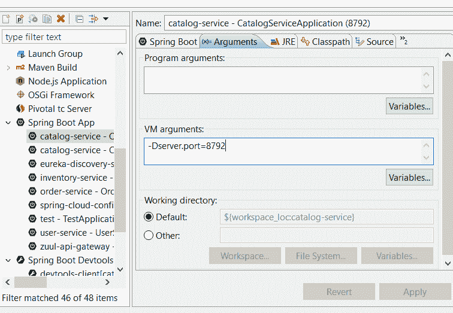

要添加另一个实例，您需要在之前窗口中创建的`catalog-service`实例上右键单击，选择 Duplicate，并遵循相同的步骤。第二次，使用端口`8799`，如下所示：

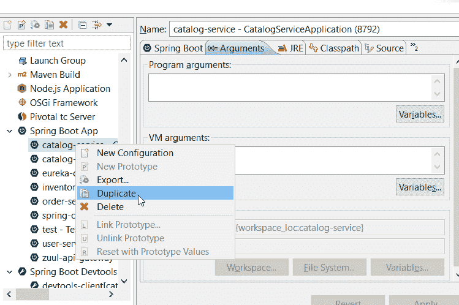

与`inventory-service`一起运行这两个实例。当您访问`http://localhost:8793/api/inventory/get-inventory/3`时，您将看到第一次请求的端口号是`8792`，第二次请求的端口号是`8799`。这就是请求逐个路由到特定实例的方式。

# 使用 Eureka 配置 Ribbon

第一种方法的问题在于我们仍然需要手动定义实例 URL。使用 Eureka，我们可以利用其动态解析微服务名称的能力，不再需要硬编码的 URL。使用 Eureka 后，事情变得更加简单直接。Ribbon 和 Feign 的配置将按以下方式更改：

```java
@FeignClient(name="catalog-service", path="/api/catalog" )
@RibbonClient(name="catalog-service")
public interface CatalogServiceProxy {
  @GetMapping("/get-book/{bookId}")
  public ResponseEntity<BookDTO> getInventory(@PathVariable("bookId") Integer bookId);
}
```

对于`@FeignClient`注解不再需要`url`属性。您还可以从`inventory-service`微服务的`application.properties`文件中删除`catalog-service.ribbon.listOfServers`属性。启动两个`catalog-service`实例以及`inventory-service`实例，并在进行之前确保 Eureka 正在运行。您将在 Eureka 控制台中看到两个`catalog-service`实例正在运行，如下所示：

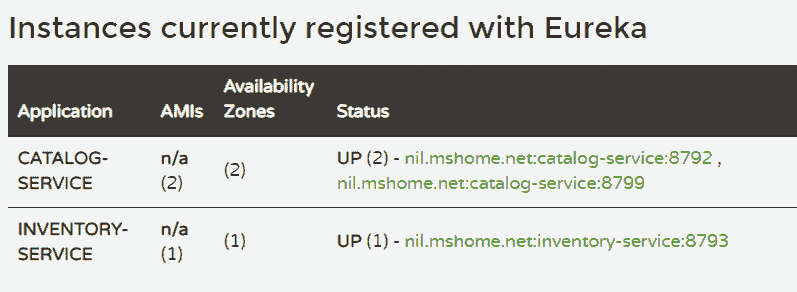

当您访问`http://localhost:8793/api/inventory/get-inventory/3`时，您将得到相同的行为。一旦请求到达端口为`8792`的实例，第二个实例在`8799`，第三个实例也在`8792`。这就是 Ribbon 与 Feign 配合配置以实现负载均衡的方式。您可以尝试创建更多实例并检查其行为。此外，如果任何实例出现故障，Ribbon 将停止向它们发送请求，这使得系统具有容错性。

# 使用 RestTemplate 进行负载均衡

Spring Cloud 也支持使用`RestTemplate`实现负载均衡的实现。在这种情况下，您需要暴露具有负载均衡能力的`RestTemplate`实例，而不是直接使用它，如下所示：

```java
@LoadBalanced
@Bean
RestTemplate restTemplate() {
    return new RestTemplate();
}

@Autowired
RestTemplate restTemplate;

```

在上一个例子中，`@LoadBalanced`注解将执行在 REST 调用中我们调用的其他服务实例之间平衡负载的魔法。您需要在控制器中注入此对象并使用它进行调用。

# 配置 API 网关

在前面的章节中，我们看到了如何定义 Zuul 作为 API 网关。在随后的章节中，我们探讨了其他 Netflix 组件，如 Feign 和 Ribbon，以进行 RESTful 调用以实现服务间通信。然而，我们创建的交互是直接在服务之间发生的。尽管我们已经配置了 Zuul 作为 API 网关，但我们还没有将其用作请求流的中心点。在本节中，我们将进行必要的配置更改，以便每个请求都通过我们的 API 网关。

我们将首先学习如何实现一个自定义过滤器，并将其配置到 API 网关中，以跟踪请求并在日志中打印它。为了简单起见，我们将捕获当前请求的一些细节。打开我们为 Zuul 创建的 Spring Boot 应用程序，并添加一个过滤器类，如下所示：

```java
@Component
public class CustomPreFilter extends ZuulFilter {
  private static Logger _logger = LoggerFactory.getLogger(ZuulFilter.class);

  @Override
  public boolean shouldFilter() {
    return true;
  }
  @Override
  public Object run() throws ZuulException {
    HttpServletRequest request = RequestContext.
                getCurrentContext().getRequest();
    _logger.info("********** REQUEST STARTED ******************");
    _logger.info("Port :"+ request.getLocalPort());
    _logger.info("HTTP Method :"+ request.getMethod());
    return null;
  }
  @Override
  public String filterType() {
    return "pre";
  }
  @Override
  public int filterOrder() {
    return 0;
  }
}
```

对于任何自定义过滤器，您需要扩展 Netflix 提供的抽象类`ZuulFilter`。我们需要提供某些抽象方法的实现，如下所示：

+   `shouldFilter()`: 我们根据此方法的返回值来决定是否应用此过滤器。

+   `filterType()`: 如我们所见，Zuul 支持各种过滤器类型，如`pre`、`post`、`error`*等。`pre`过滤器将在请求到达 Zuul 之后和路由到其他微服务之前执行。同样，`post`过滤器将在响应从其他微服务返回后执行，而`error`过滤器类型将在请求过程中发生错误时触发。

+   `filterOrder()`: 我们可以定义任意数量的过滤器。此方法定义了它们的优先级顺序。

+   `run()`: 此方法是一个占位符，您可以在其中编写您的过滤器逻辑。

我们将使用另一个过滤器，该过滤器在响应返回时触发，过滤器类型为`post`，如下所示：

```java
@Component
public class CustomPostFilter extends ZuulFilter {
  private static Logger _logger = LoggerFactory.getLogger(ZuulFilter.class);

  @Override
  public boolean shouldFilter() {
    return true;
  }
  @Override
  public Object run() throws ZuulException {
    _logger.info("********* REQUEST ENDED *************");
    return null;
  }
  @Override
  public String filterType() {
    return "post";
  }
  @Override
  public int filterOrder() {
    return 0;
  }
}
```

接下来，让我们看看如何通过我们的 API 网关访问微服务。我们已经为`inventory-service`公开了一个 REST API，地址为`http://localhost:8793/api/inventory/get-inventory/3`，现在我们将更新此 URL 以通过 API 网关路由请求。API 网关 URL 的模式如下：

```java
http://<API_Gateway_Host>:<API_Gateway_Port>/{service-name}/{uri}
```

Zuul API 网关将使用 Eureka 命名服务器连接到所需的微服务。在之前的模式中，服务名称是注册在 Eureka 命名服务器中的服务的名称（在`application.properties`或`bootstrap.properties`文件中的`spring.application.name`属性）。API 网关可通过`http://localhost:8781`访问，因此要使用 API 网关访问`inventory-service` URL，新的 URL 将是`http://localhost:8781/inventory-service/api/inventory/get-inventory/3`。您将在 Zuul 日志中获取以下请求详情：

```java
o.s.web.servlet.DispatcherServlet : Completed initialization in 9 ms 
com.netflix.zuul.ZuulFilter : ******************* REQUEST STARTED ***********
com.netflix.zuul.ZuulFilter : Port :8781 
com.netflix.zuul.ZuulFilter : HTTP Method :GET 
......... 
com.netflix.zuul.ZuulFilter : ******************* REQUEST ENDED *************
```

这就是我们如何通过 Zuul API 网关使用各种过滤器跟踪请求。然而，调用是通过 Feign 从`inventory-service`转发到`catalog-service`的，这仍然绕过了 API 网关，直接调用微服务。现在，让我们看看如何配置 Feign，以便调用通过 Zuul API 网关路由。原始的 Feign 代理如下：

```java
@FeignClient(name="catalog-service", path="/api/catalog")
@RibbonClient(name="catalog-service")
public interface CatalogServiceProxy {
...
}
```

更新的 Feign 代理接口如下：

```java
@FeignClient(name="zuul-api-gateway", path="y/api/catalog")
@RibbonClient(name="catalog-service")
public interface CatalogServiceProxy {
....
}
```

变化发生在`@FeignClient`注解的服务名称中。之前，它直接指向`catalog-service`，但现在它指向了 Zuul API 网关服务。`zuul-api-gateway`是使用`application.properties`文件中的`spring.application.name`属性定义的 Zuul API 网关服务的名称。

再次运行 URL，你会看到日志打印了两次。日志首先在请求到达`inventory-service`时打印，然后在请求通过 Feign 从`inventory-service`路由到`catalog-service`时再次打印。这就是 Zuul 是如何配置来跟踪微服务之间发出的每个请求的。

# 保护应用程序

在典型的单体应用程序中，当用户登录时，将创建一个 HTTP 会话来保存用户特定的信息，然后直到会话过期都会使用这些信息。会话将由服务器端的一个通用安全组件维护，并且所有请求都通过它传递。因此，在单体应用程序中处理用户身份验证和授权是直接的。

如果我们想要遵循相同的模式来构建微服务架构，我们需要在每个微服务级别以及中央位置（网关 API）实现安全组件，所有请求都从这里路由。这是因为微服务通过网络进行交互，所以应用安全约束的方法是不同的。

使用 Spring Security 是满足基于 Spring 的 Java 应用程序安全需求的标准做法。对于微服务，Spring Cloud Security（Spring Cloud 的另一个组件）提供了一个一站式解决方案，将 Spring Security 功能与微服务架构的各种组件（如网关代理、配置服务器、负载均衡器等）集成。

在微服务环境中，可以通过广泛使用的标准安全协议，如 OAuth2 和 OpenID Connect 来解决安全担忧。在第四章，*构建中央认证服务器*中，我们详细讨论了 OAuth2。现在，我们将看看它如何被用来满足微服务架构中的安全需求。

让我们看看 OAuth 安全系统在微服务架构中是如何工作的。授权的高级流程如下：

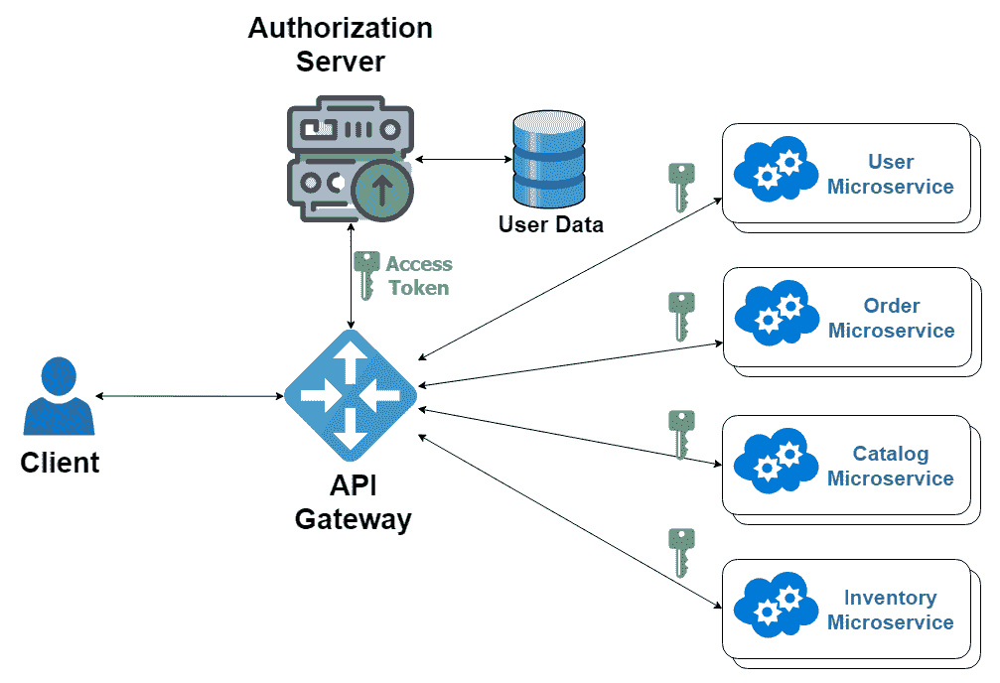

为了理解这一系列操作，让我们以在线书店用户下单的情况为例。整个过程如下几个步骤：

1.  用户尝试通过 Zuul 代理服务器（API 网关）访问订单页面，但没有会话或访问令牌。

1.  Zuul 代理随后将用户重定向到一个预配置了参数的授权服务器，例如授权类型、客户端 ID、令牌 URL 和授权 URL。

1.  如果用户未登录，授权服务器将重定向到登录页面。

1.  一旦用户使用有效的凭据登录，授权服务器将生成一个令牌并将其发送回 API 网关。

1.  在收到令牌后，API 网关（Zuul 代理服务器）将令牌向下传播到它所代理的微服务。

1.  对于受限制的资源，系统将检查是否存在有效的令牌。如果没有，用户将被重定向到登录页面（或者根据系统配置的授权类型刷新令牌）。

授权服务器将被实现为一个独立的微服务并在 Eureka 发现服务器中注册。它可以作为一个带有安全特定`starter`依赖的 Spring Boot 应用程序创建，如下所示：

```java
<dependency>
  <groupId>org.springframework.cloud</groupId>
  <artifactId>spring-cloud-starter-oauth2</artifactId>
</dependency>
<dependency>
  <groupId>org.springframework.cloud</groupId>
  <artifactId>spring-cloud-starter-security</artifactId>
</dependency>
```

Spring Cloud Security 为 OAuth 和标准 Spring Security 提供了不同的启动器，用于微服务架构。接下来，我们将添加必要的配置，使该应用程序成为一个授权服务器，如下所示：

```java
@Configuration
@EnableAuthorizationServer
public class CustomAuthorizationConfig extends AuthorizationServerConfigurerAdapter {

  @Autowired
  @Qualifier("authenticationManager")
  private AuthenticationManager authenticationManager;

  @Override
  public void configure(ClientDetailsServiceConfigurer clients) throws Exception {
    clients.inMemory()
    .withClient("testClientId")
    .secret(new BCryptPasswordEncoder().encode("test123"))
    .authorizedGrantTypes("authorization_code", "refresh_token", "implicit", "password", "client_credentials")
    .scopes("registeredUser","admin")
    .redirectUris("http://localhost:8781/inventory-test/api/inventory/home")
    .resourceIds("oauth2-server");
  }
  @Bean
  public JwtAccessTokenConverter accessTokenConverter() {
    JwtAccessTokenConverter converter = new JwtAccessTokenConverter();
    converter.setSigningKey("123");
    return converter;
  }
  @Bean
  public TokenStore tokenStore() {
    return new JwtTokenStore(accessTokenConverter());
  }
  @Override
  public void configure(
      AuthorizationServerEndpointsConfigurer endpoints)
          throws Exception {
     endpoints
    .authenticationManager(authenticationManager)
    .tokenServices(tokenServices())
    .tokenStore(tokenStore())
    .accessTokenConverter(accessTokenConverter());
  }
  @Bean("resourceServerTokenServices")
  @Primary
  public DefaultTokenServices tokenServices() {
    DefaultTokenServices defaultTokenServices = new
        DefaultTokenServices();
    defaultTokenServices.setTokenStore(tokenStore());
    defaultTokenServices.setSupportRefreshToken(false);
    defaultTokenServices.setAccessTokenValiditySeconds(120);
    defaultTokenServices.setTokenEnhancer(accessTokenConverter());
    return defaultTokenServices;
  }

}
```

使用`@EnableAuthorizationServer`注解来声明该组件为授权服务器。OAuth 可以通过各种第三方客户端完成，Spring Security 提供了对 Google、Facebook、Okta 和 GitHub 的原生支持。在我们的案例中，我们将定义一个自定义授权服务器。

该类的`configure(ClientDetailsServiceConfigurer clients)`方法用于定义自定义授权客户端的配置。它使用各种配置初始化客户端，例如`ClientId`、秘密（一种客户端密码）、客户端想要支持的可能的授权授予类型、可以用于微调访问控制的各个范围，以及用户权限和`resourceId`。

Spring OAuth 足够灵活，允许使用各种机制生成访问令牌，JWT 就是其中之一。`tokenStore()`和`tokenService()`方法用于应用 JWT 所需的配置。`configure(AuthorizationServerEndpointsConfigurer endpoints)`方法用于配置令牌，以及认证管理器。`AuthenticationManager`对象如下从`WebSecurityConfig`类注入：

```java
@Configuration
@EnableWebSecurity
public class WebSecurityConfig extends WebSecurityConfigurerAdapter{

  @Override
  @Bean("authenticationManager")
  public AuthenticationManager authenticationManagerBean() throws
  Exception {
    AuthenticationManager authenticationManager = 
        super.authenticationManagerBean();
    return authenticationManager;
  }
  @Override
  public void configure(WebSecurity web) throws Exception {
    web.ignoring().antMatchers("/js/**");
    web.ignoring().antMatchers("/css/**");
  }
  @Override
  protected void configure(AuthenticationManagerBuilder auth)
      throws Exception {
    auth.inMemoryAuthentication()
    .withUser("john").password(
        encoder().encode("999")).authorities("USER");
  }
  @Override
  protected void configure(HttpSecurity http) throws Exception {
    http
    .authorizeRequests()
    .antMatchers("/oauth/authorize","/oauth/token","/").permitAll()
    .and()
    .formLogin().loginPage("/login").permitAll();
  }
  @Bean("encoder")
  public BCryptPasswordEncoder encoder(){
    return new BCryptPasswordEncoder();
  }
}
```

这个类负责配置各种端点、静态资源以及登录页面，还包括认证机制。这全部关于授权服务器配置。正如我们所知，所有请求都是通过 Zuul 代理服务器（一个 API 网关）路由的，因此我们必须配置它将受限资源的请求路由到授权服务器。

授权服务器提供了一个访问令牌，该令牌将与请求一起路由（在头部）。当其他微服务读取它时，它们将使用授权服务器验证访问令牌，以允许用户访问受限资源。简而言之，访问令牌将被路由到各种微服务。这需要某种形式的单点登录（SSO）实现，而使用 Spring Cloud Security，我们可以做到这一点。

此外，由用户发起的特定功能（例如，下订单）最终将涉及与其他微服务和 Zuul 代理服务器的交互，因此在 OAuth 术语中，它们被视为资源服务器。首先，将 `@EnableOAuth2Sso` 注解添加到 Zuul 代理应用程序的 `bootstrap` 类中，如下所示：

```java
@EnableZuulProxy
@EnableOAuth2Sso
@EnableDiscoveryClient
@SpringBootApplication
public class ZuulApiGatewayApplication {
...
}
```

这个注解允许 Zuul 代理服务器将授权服务器生成的访问令牌向下传递给其他参与请求处理的微服务。Zuul 代理服务器以及其他微服务的资源服务器配置应如下所示：

```java
@EnableResourceServer
public class ResourceServerConfig extends ResourceServerConfigurerAdapter{

  private static final String RESOURCE_ID = "oauth2-server";
  @Override
  public void configure(ResourceServerSecurityConfigurer resources) {
    resources
    .tokenStore(tokenStore())
    .resourceId(RESOURCE_ID);
  }
  @Override
  public void configure(HttpSecurity http) throws Exception {
    http
    .requestMatcher(new RequestHeaderRequestMatcher("Authorization"))
    .authorizeRequests()
    // Microservice specific end point configuration will go here.
    .antMatchers("/**").authenticated()
    .and().exceptionHandling().accessDeniedHandler(new
        OAuth2AccessDeniedHandler());
  }
  @Bean
  public TokenStore tokenStore() {
    return new JwtTokenStore(accessTokenConverter());
  }
  @Bean
  public JwtAccessTokenConverter accessTokenConverter() {
    JwtAccessTokenConverter converter = new JwtAccessTokenConverter();
    converter.setSigningKey("123");
    return converter;
  }
}
```

`@EnableResourceServer` 注解将使组件作为一个资源服务器。`resourceId` 应该与我们配置在授权服务器中的一致。我们还在授权服务器中使用了相同的 JWT 令牌配置。`configure` 方法用于设置单个微服务端点的配置。

我们还需要在 `application.properties` 文件中设置某些属性，这些属性将由资源服务器用于与授权服务器交互，如下所示：

```java
#security.oauth2.sso.login-path=/login
security.oauth2.client.access-token-uri=http://localhost:9999/oauth/token
security.oauth2.client.user-authorization-uri=http://localhost:9999/oauth/authorize
security.oauth2.client.client-id=testClientId
security.oauth2.client.client-secret=test123
security.oauth2.client.scope=registeredUser,admin,openid
security.oauth2.client.grant-type=implicit
security.oauth2.resource.id=oauth2-server
security.oauth2.resource.jwt.key-value=123
```

授权服务器配置为访问 `localhost:9999`。资源服务器配置，连同之前的属性，需要放置在我们想要通过 OAuth 安全访问的每个微服务中。

# 摘要

与本书中迄今为止看到的其他章节和应用不同，这一章介绍了在分布式环境中的一种新的应用程序开发类型。**微服务**这个术语自 2011 年以来就已经存在。它作为之前架构的增强而出现。

随着 Spring Cloud 的引入，开发者可以在分布式环境中提供各种常见模式的实现。从 Spring Boot 开始，创建一个微服务应用程序只需进行少量配置。

在本章的开头，我们探讨了什么是微服务以及它与单体架构的区别，随后介绍了在开发微服务系统时需要遵守的各种原则和标准。然后，我们简要探讨了各种 Spring Cloud 组件和其他 Netflix OSS 组件。

我们还通过构建一个真实世界的示例——在线书店应用程序，学习了如何创建微服务应用程序。我们从应用程序的架构和数据库设计开始。我们研究了如何以 Spring Boot 应用程序的形式创建微服务，并配置了所需的配置。

我们随后看到了构建各种 Netflix OSS 和 Spring Cloud 组件的实际示例，例如 Eureka 发现服务器、Zuul 代理服务器、Feign 客户端、Ribbon 和 Spring Cloud Config。这些组件是开发分布式应用程序的构建块。我们还看到了构建微服务前端的各种选项和方法。最后，我们使用 Spring Cloud Security 确保了应用程序的安全性。

Java 长期以来一直是构建基于 Spring 的应用程序的唯一事实上的编程语言。然而，Spring 背后的公司 Pivotal 的团队已经开始支持其他函数式编程语言，例如 Scala。从版本 5 开始，Spring 宣布支持 Kotlin，这是一种主要用于 Android 应用程序的基于 JVM 的语言。在下一章中，我们将深入探讨使用 Kotlin 构建 Spring 应用程序的全新方式。
