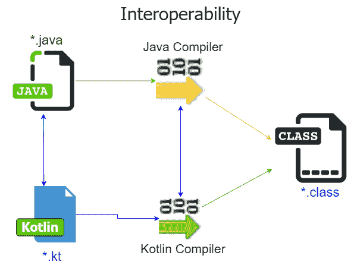
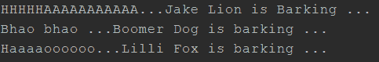
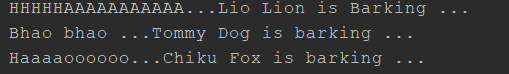
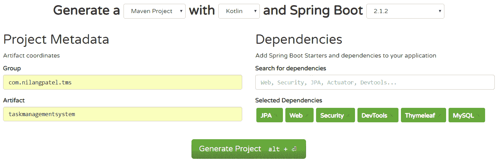
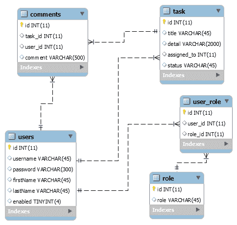
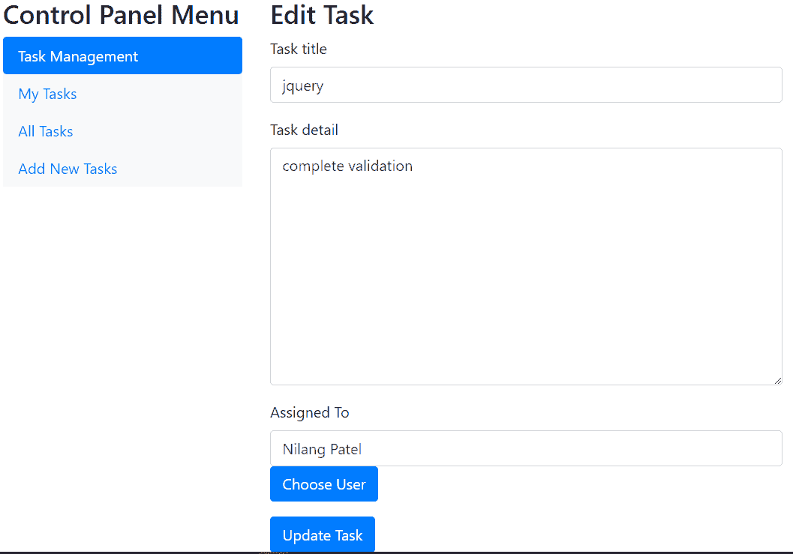
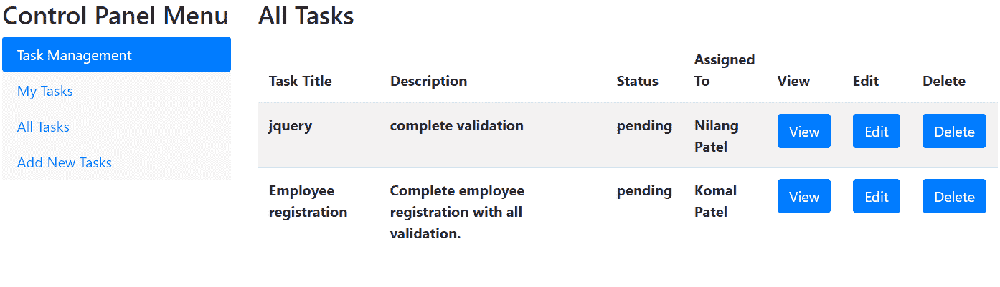
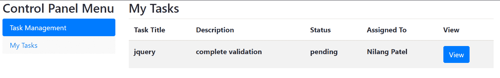

# 使用 Spring 和 Kotlin 的任务管理系统

在前面的章节中，我们深入探讨了各种主题和概念。从纯 Spring 框架开始，到 Spring Boot，我们学习了如何快速、轻松地使用 Spring Boot 创建企业级应用程序。

我们还学习了 Spring 框架与其他工具和技术的集成，例如 Elasticsearch、LDAP 和 OAuth，这些都属于 Spring Boot 的范畴。然后，我们学习了使用 Spring 作为后端和 Angular 作为前端创建应用程序的新方法，这个工具叫做**JHipster**。

然后，我们发现了如何在**微服务**这种分布式环境的维度中创建应用程序。在本章中，我们将进一步探索 Spring 框架的另一个完全不同的维度，看看它如何被一种名为**Kotlin**的新编程语言所支持。

作为一种编程语言，Kotlin 在开发者和公司中迅速流行起来。Kotlin 的第一个稳定版本于 2016 年正式发布。就在第二年，谷歌正式宣布 Kotlin 是 Android 平台移动开发的官方支持语言。这极大地提高了 Kotlin 的知名度和采用率。

从版本 5 开始，Spring 宣布支持使用 Kotlin 在 Spring 框架上开发企业应用程序。在本章中，我们将探讨如何使用 Kotlin 开发基于 Spring 的应用程序。我们将构建一个名为 Task Management 的应用程序，使用 Spring Boot 和 Kotlin，并涵盖以下内容：

+   Kotlin 简介

+   Kotlin 作为编程语言的基本功能

+   Kotlin 与 Java 的比较

+   Spring 对 Kotlin 的支持

+   使用 Kotlin 在 Spring 中开发任务管理应用程序

# 技术要求

本章中使用的所有代码都可以从以下 GitHub 链接下载：[`github.com/PacktPublishing/Spring-5.0-Projects/tree/master/chapter07`](https://github.com/PacktPublishing/Spring-5.0-Projects/tree/master/chapter07)。代码可以在任何操作系统上执行，尽管它只在 Windows 上进行了测试。

# 介绍 Kotlin

Kotlin 是一种针对**Java 虚拟机**（**JVM**）的语言，因此可以替代 Java 使用。无论是服务器端、移动端还是 Web 端，你都可以在 Java 目前使用的任何地方使用 Kotlin。它由一家名为**JetBrains**的公司赞助；它是开源的，你可以从 GitHub（[`github.com/jetbrains/kotlin`](https://github.com/jetbrains/kotlin)）下载源代码。他们计划在不久的将来推出 Kotlin 用于嵌入式和 iOS 平台。

Kotlin 作为一种函数式编程语言提供了良好的支持。函数式编程这个术语用来描述一种声明性范式，其中程序是通过表达式或声明创建的，而不是通过命令的执行。函数式编程模型本质上为应用程序带来某些品质，如更紧凑和可预测的代码、易于测试的能力、可重用性等等。Kotlin 通过内置特性引入了函数式范式。

Java 和 Kotlin 之间有许多相似之处，因此产生了这样的问题：当 Java 已经被广泛使用并且超过二十年来非常受欢迎时，为什么我们还需要另一种编程语言。答案在于 Kotlin 拥有一些酷炫的特性，这使得它成为开发基于 JVM 的应用程序的更好选择。

# 互操作性

Kotlin 最有希望的特性之一是其互操作性。Kotlin 与 Java 完全兼容。应用程序可以结合这两种语言。可以从 Kotlin 中调用 Java 库，而无需任何转换或麻烦。同样，用 Kotlin 编写的代码也可以轻松地从 Java 中调用。这极大地帮助 Java 开发者轻松地从 Java 迁移到 Kotlin。

将代码从一个编程语言迁移到另一个编程语言是一项相当繁琐且耗时的工作，尤其是当这些编程语言在规则、语法、特性等方面不兼容时。尽管 Kotlin 中有一些在 Java 中直接或间接不存在的功能，但正是 Kotlin 的互操作性允许同时运行这两种编程语言的代码。您不必将所有 Java 代码迁移到 Kotlin。以下图表展示了 Kotlin 的**互操作性**：



此外，Kotlin 的标准库依赖于 Java 类库，这使得可以重用依赖项，并且在任何地方都不需要代码重构。例如：Kotlin 的集合框架建立在 Java 的集合 API 之上。

# 简洁而强大

在使用 Kotlin 的过程中，你会发现另一个很好的品质就是它的简洁性。Kotlin 的语法易于阅读和理解，即使没有任何编程语言的前置知识。Kotlin 拥有一些特性，使其成为一个真正简洁的语言，例如类型接口、数据类、属性、智能转换等等。我们将在本章后面更详细地介绍它们。

基于这些特性，用 Kotlin 编写的代码紧凑而不失其功能。在许多方面，Kotlin 比 Java 更简洁，因此我们可以用更少的代码实现相同的功能。这极大地提高了可读性和易用性。开发者可以轻松地阅读、编写和更新程序，即使它是别人编写的。

此外，Kotlin 通过各种功能如默认参数、扩展函数和对象声明等，能够加速日常开发任务的执行。您的代码更加紧凑且稳健，同时不会引发任何可维护性问题。这将降低系统出现错误的可能性。

Kotlin 是作为 Java 的增强而非完全新的语言而演化的。因此，您在 Java 中拥有的技能和知识可以应用于 Kotlin，使其成为一门易于学习的语言。

# 安全特性

您会喜欢 Kotlin 的另一个原因是它的安全特性。用 Kotlin 编写的代码比用 Java 编写的代码要安全得多。Kotlin 的设计旨在防止常见的编程错误，从而使得系统更加稳定，减少崩溃和故障。

对于任何允许空引用的编程语言，在应用程序执行过程中都可能会创建运行时异常，例如 `NullPointerException`。不恰当地处理此类场景可能会导致系统突然崩溃。如果您有 Java 的经验，您可能已经遇到过这样的场景。

Kotlin 就是基于这个理念设计的，并定义了两种引用类型：可空类型和不可空类型。默认情况下，Kotlin 不允许使用空值引用，并强制开发者以特定方式处理它们。这大大减少了由 `NullPointerException` 引起的问题的可能性。

# IDE 支持

**JetBrains**，Kotlin 背后的公司，因其名为 **IntelliJ IDEA** 的 **集成开发环境（IDE**）而闻名，并且显然为 Kotlin 提供了一级支持。就 IDE 而言，Eclipse 也是 Java 开发者中最受欢迎的之一，因此 JetBrains 也为 Eclipse 提供了一个 Kotlin 插件。

在 Java 刚刚发展的早期，初始阶段并没有 IDE，开发者必须使用文本编辑器进行编码。没有 IDE 的安全和便利性进行工作是非常困难的。当 Eclipse 进入市场时，开发者迅速采用了它，从那时起，它已经成为 Java 开发者中流行且广泛接受的工具。

另一方面，Kotlin 从一开始就幸运地获得了 IDE 支持。这迅速提升了 Kotlin 的知名度。它非常方便且易于学习。开发者能够快速生成高质量的代码，从而提高软件开发周期。

不言而喻，Kotlin 允许使用文本编辑器进行编码。此外，您还可以使用命令提示符构建 Kotlin 应用程序。另外，如果您是 Android 开发者，它还有自己的 IDE，名为 **Android Studio**，这是基于 IntelliJ IDEA IDE 开发的。

# Kotlin 特性

Kotlin 的设计初衷不是与 Java 竞争，而是要成为一个具有 Java 所不具备的额外功能的良好 JVM 语言。与 Java 相比，Kotlin 作为一种语言，拥有许多新颖且令人兴奋的特性，这些特性提高了代码的可读性和可维护性。

理解 Kotlin 的基本特性至关重要。在本节中，我们将探讨一些对于在 Kotlin 中构建应用程序至关重要的特性。

# 函数的概念

根据定义，函数是一组执行特定任务的语句集合或组。它是任何程序的基本构建块。你可以在 Kotlin 中将函数等同于 Java 中的方法；然而，它们之间有一些区别。Kotlin 中的函数可以在顶级定义，这意味着它不需要被包含在类中。函数可以是类的一部分，也可以在另一个函数中定义。

在 Kotlin 中，函数获得了一级支持，这意味着它支持所有操作，可以存储到变量和数据结构中，可以作为参数传递给其他函数，也可以从其他（顶级）函数返回，可以定义为表达式，还有更多。所有这些特性都带来了极大的灵活性，使 Kotlin 非常简洁。我们将看到 Kotlin 中函数的以下用法。

# 函数作为表达式

在编写函数时，你需要将代码放在函数体中。然而，在 Kotlin 中，你可以将函数定义为表达式。例如：你想找出两个数字中的最小值，你编写了一个名为`min()`的函数，如下所示：

```java
fun main(args: Array<String>) {
    print(min(4,7))
}
fun min(numberA: Int, numberB:Int) : Int {
    if(numberA < numberB){
        return numberA
    }else{
        return numberB
    }
}
```

这将返回两个给定数字中的最小值。这个函数可以按照以下表达式风格编写：

```java
fun min(numberA: Int, numberB:Int) : Int = if(numberA < numberB){ numberA }else{ numberB }
```

这就是代码看起来既简洁又具有表现力的方式。此外，请注意，我们已经删除了`return`关键字，因为 Kotlin 足够智能，可以在不显式指定`return`关键字的情况下返回最后一个值。这被称为**单行**或**一行**函数。然而，对于复杂的函数，你可以像以下这样编写多行：

```java
fun min(numberA: Int, numberB:Int) : Int
   =  if(numberA < numberB){
            numberA
        }else{
            numberB
        }
```

这看起来更紧凑且更具表现力。

# 默认函数参数

通常，我们提供给函数或构造函数的数据量在不同用例中会有所不同。系统应该足够灵活，即使我们没有提供所有参数的值，也能产生所需的结果。

如果你想在 Java 中实现这个功能，你需要根据需要编写几个重载的函数或构造函数。你将不得不多次编写相同的方法，但输入参数不同，并使用默认值调用其他构造函数或方法。这很快会导致代码冗长——为同一件事反复编写代码。

Kotlin 通过一个名为默认函数参数的功能提供了对这种场景直观的解决方案。这听起来很简单。你需要为那些你认为在执行函数时可能没有提供值的函数参数定义默认值。

例如：假设我们编写了一个函数来计算立方体的体积，如下所示：

```java
fun getVolume(length:Int, width:Int,height:Int):Int{
    return length * width * height;
}
```

在调用此函数时，您需要传递所有三个参数，否则编译器将发出错误信号。现在，假设我们希望系统在没有明确提供的情况下使用默认高度`10`。它可以写成以下形式：

```java
fun getVolume(length:Int, width:Int,height:Int =10):Int{
    return length * width * height;
}
```

此函数可以调用为`getVolume(2,4)`，并将`10`作为默认值替换为`height`。

# 扩展函数

如果您需要通过一组新功能扩展一个类，您需要更新 Java 源代码。然而，如果您正在使用第三方库，您可能没有源代码。一个类需要被扩展以容纳其他函数。您还可以使用各种设计模式，如装饰者和策略，来实现这一目的。

然而，Kotlin 允许通过一个称为**扩展函数**的功能直接向现有类添加额外的函数。正如其名所示，扩展函数扩展了类的功能，而不接触其源代码。换句话说，您不再需要继承要扩展的类。这听起来非常有趣。它表现得就像其他成员函数一样，但声明在类的外部。

假设您需要将给定的字符串转换为驼峰式。Kotlin 的`String`类不提供直接将字符串转换为驼峰式的功能。我们将使用扩展函数来定义一个单独的函数，该函数实际上会执行这项工作，如下所示：

```java
fun String.camelCase():String{
    var camelCaseStr = StringBuffer()
    var wordLst : List<String> = this.trim().split(" ")
    for(word in wordLst){
        camelCaseStr.append(word.replaceFirst(word[0], word[0].toUpperCase())).append(" ")
    }
    return camelCaseStr.trim().toString()
}
```

`camelCase()`函数是`String`类上的扩展函数，它返回字符串。自定义逻辑位于此函数的主体中。您可以在任何字符串字面量上调用`camelCase()`函数，如下所示：

```java
fun main(args: Array<String>) {
    print("this is just for sample".camelCase())
 // This will print as—This Is Just For Sample
}
```

`camelCase()`函数是我们自定义的函数，因此您可以使用任何您认为合适的其他名称。让我们再看一个扩展函数的例子。假设您想找到一个整数的平方。同样，Kotlin 不提供直接的功能，但我们可以编写扩展函数如下：

```java
fun Int.square():Int{
    return this * this
}
```

`square()`扩展函数可以在整数字面量中调用，如下所示：

```java
fun main(args: Array<String>) {
    print(3.square())
}
```

这是一个非常出色的功能，我们可以使用它来扩展功能，而无需更新代码或继承基类。

# Lambda 表达式或函数字面量

每种编程语言都提供了定义字面量的规定，例如字符串、整数、双精度浮点数等。它们可以以特定方式定义，例如字符串字面量`Hello`，双精度浮点数字面量`34.23`等。Kotlin 允许我们通过将代码括在花括号中来定义一个函数字面量，如下所示：

```java
//This is functional literal
{ println(" This is function literal ")}
```

这个函数可以按照以下方式正常声明：

```java
fun printMsg(message:String){
    println(message)
}
```

它本质上与函数字面量相同。但函数字面量看起来既紧凑又富有表现力。函数字面量可以被分配给变量，并在代码的稍后位置调用，如下所示：

```java
//Functional literal assigned to variable
var greetingMsg = { println("Hello World ...!!!")}

//Calling the function through literal
greetingMsg()
```

函数字面量可以像第一行那样分配给变量。就像其他函数一样，函数字面量可以用变量（带括号）调用，如第二行所示。函数字面量有以下某些特性：

+   它代表函数的块或主体，该块没有名称。

+   它与任何实体（如类、接口或对象）无关联或绑定，因此不允许使用访问修饰符。

+   由于它没有名称，因此被称为**匿名**。

+   它可以作为参数传递给其他函数（主要是高阶函数）。

+   它通常被大括号包围，且没有 `fun` 关键字。

+   它也被称为 lambda 表达式。

Kotlin 还允许将参数传递给函数字面量或 lambda 表达式，如下所示：

```java
//Lambda with parameter
var showWarning = {message : String -> println(message)}

//Calling Lambda expression with parameter
showWarning(" Warning 1 occurred ..!!!")
showWarning(" Warning 2 occurred ..!!!")
```

lambda 表达式由一个箭头（`->`）分为两部分。左边是参数部分，而右边是 lambda 或函数主体。允许使用逗号分隔的列表来指定多个参数，且不需要用括号括起来，如下所示：

```java
//Multiple parameters
var addition = { num1: Int, num2: Int ->
        println("sum of $num1 and $num2 is ..${num1+num2}")
     }
addition(3, 5)
```

我们可以以稍微不同的方式编写此代码，如下所示：

```java
var addition2 : (Int,Int)-> Unit = { num1, num2 ->
    println("sum of $num1 and $num2 is ..${num1+num2}")
}
addition2(3, 5) 
```

在此代码中，参数的声明被从 lambda 表达式中移出。Kotlin 中的 `Unit` 函数相当于 Java 中的 `void`。这个特性使得 Kotlin 成为一个真正的函数式语言。函数字面量也可以作为另一个函数的参数。

# 将 lambda 传递给另一个函数

Kotlin 允许我们将函数传递给其他（高阶）函数作为参数，使用 lambda 表达式。这样的函数可以接受 lambda 表达式或匿名函数作为参数。在进一步讨论这个主题之前，让我们首先了解什么是**函数类型**。

Kotlin 是一种静态类型语言，函数也需要有类型。这被称为**函数类型**。以下是一些定义它们的示例：

+   `()->Int`：返回整数类型且不接受任何参数的函数类型。

+   `(Int)->Unit`：接受一个整数参数且不返回任何内容的函数类型。

+   `()->(Int)->String`：返回另一个函数的函数类型，该函数最终返回一个字符串。后一个函数接受一个整数作为参数。

现在，让我们看看如何将函数类型定义为外部函数的输入参数。考虑这样一个场景，你正在为银行贷款应用程序设计。你需要检查资格标准并决定是否可以申请贷款。执行此任务的函数应如下所示：

```java
data class Applicant(
                    var applicantId: Int,
                    var name: String,
                    var age: Int,
                    var gender: String)

fun isEligibleForLoan (mobileNo:String, eligibilityScore:(applicantId:Int)->Double) : Boolean{
    //Business logic to fetch applicant details from given mobileNo
    var applicant = Applicant(12,"Nilang",38,"M");
    var score = eligibilityScore(applicant.applicantId);
    return score >80
}
```

`isEligibleForLoan()` 函数是一个高阶函数，它接受两个参数。第一个参数是申请人的手机号码，它将从中获取申请人的详细信息。第二个参数是函数类型，我们可以将其视为一种接口类型。它简单地根据给定的申请人 ID 计算资格分数。该函数类型的实际实现将在调用 `isEligibleForLoan()` 函数时提供，如下所示：

```java
var isEligible = isEligibleForLoan("9998789671",{
     applicantId -> //Write logic to calculate the 
                   //eligibility of candidate and return the score
     85.23 // This is sample value
 })
 println(" isEligibile: $isEligible ")
```

我们需要在第二个参数中传递一个 lambda 表达式。这实际上是一个匿名函数，它接受应用程序 ID 作为输入参数并计算资格分数。分数将被返回到 `isEligibleForLoan()` 函数，然后根据分数，我们返回是否可以申请贷款。

如果函数类型是最后一个参数，那么 Kotlin 允许以稍微不同的方式调用它。前面的函数可以如下替代调用：

```java
var isEligible2 = isEligibleForLoan("9998789671"){
        applicantId -> //Write logic to calculate the eligibility 
                       //of candidate and return the score
    75.23 // This is sample value
}
```

这样，lambda 表达式被放置在括号之外，这更加具有表达性。但这只有在最后一个参数声明了函数类型时才可行。将 lambda 表达式作为函数类型传递是有用的，尤其是在 Ajax 调用中，我们希望在从响应中获取数据后更新页面元素，而不冻结用户界面。通过 lambda 表达式注入的函数将作为回调函数工作。

# 从另一个函数中返回一个函数

我们已经看到了如何在调用另一个函数时将函数类型定义为参数。借助 lambda 表达式，这变得更加简单。更进一步，Kotlin 允许从另一个函数中返回一个函数。让我们了解它是如何工作的。

假设我们有一个名为 `WildAnimal` 的接口，该接口由以下三个类实现：

```java
interface WildAnimal{
    fun setName(name:String)
    fun bark():String
}

class Dog : WildAnimal{
    private var dogName: String = ""
    override fun bark(): String {
        print(" Bhao bhao ...")
        return "${dogName} Dog is barking ..."
    }
    override fun setName(name: String) {
        this.dogName = name
    }
}
class Fox : WildAnimal{
    private var foxName: String = ""
    override fun bark(): String {
        print(" Haaaaoooooo...")
        return "${foxName} Fox is barking ..."
    }
    override fun setName(name: String) {
        this.foxName = name
    }
}
class Lion : WildAnimal{
    private var lionName: String = ""
    override fun bark(): String {
        print(" HHHHHAAAAAAAAAAA...")
        return "${lionName} Lion is Barking ..."
    }
    override fun setName(name: String) {
        this.lionName = name
    }
}
```

每个类实现了两个方法——`setName()` 和 `bark()`，分别用于设置动物和显示叫声。我们将为每个类创建一个实例，设置其名称，并调用 `bark()` 函数以打印叫声和动物名称。为此，我们将编写如下函数：

```java
fun getAnimalVoiceFun(animal: WildAnimal):(String) -> String{
    return {
        animal.setName(it)
        animal.bark()
    }
}
```

`getAnimalVoiceFun` 函数接受 `WildAnimal` 的实现作为参数，并返回一个接受 `String` 作为参数并返回 `String` 作为输出的函数。`getAnimalVoiceFun` 函数体内部的 `{ }` 大括号中的代码表示从该函数返回的函数。`it` 参数指向封装函数的 `String` 参数。

实际返回字符串的 `animal.bark()` 函数最终将从内部函数返回。这个函数可以稍微以不同的方式编写，如下所示：

```java
fun getAnimalVoiceFun(animal: WildAnimal):(name:String) -> String{
    return {
             animal.setName(name=it)
             animal.bark()
        }
}
```

差别在于我们正在声明参数的名称——类型字符串的 `name`，并在封装函数中使用它作为 `name=it` 表达式。在这两种之前的方法中，括号代表函数，所以 `fun` 关键字是静默的。然而，你可以这样声明：

```java
fun getAnimalVoiceFun(animal: WildAnimal):(String) -> String{
  return fun(name:String):String {
     animal.setName(name)
 return animal.bark()
}
```

以这种方式，我们明确地使用了 `fun` 关键字来封装函数。此外，你必须在封装函数中明确提及 `return` 关键字。你可以使用这两种方式之一来声明 `getAnimalVoiceFun` 函数。你可以这样调用这个函数：

```java
println(getAnimalVoiceFun(Lion())("Jake"))
println(getAnimalVoiceFun(Dog())("Boomer"))
println(getAnimalVoiceFun(Fox())("Lilli"))
```

我们正在调用 `getAnimalVoiceFun` 函数，使用相应类的实例。你可以看到如何将包含在单独括号中的第二个字符串参数提供给函数内部的函数——`getAnimalVoiceFun`。你将得到以下输出：



在 Kotlin 中，函数可以被定义为类型。我们可以使用函数类型来声明前面的函数，如下所示：

```java
val getAnimalVoice: (WildAnimal) ->(String)-> String = {
        animal:WildAnimal -> {
               animal.setName(it)
               animal.bark()
         }
}
```

`getAnimalVoice` 变量被定义为函数类型，它接受一个 `WildAnimal` 对象并返回另一个函数，该函数接受 `String` 作为输入参数（使用 `it` 关键字）并返回一个 `String` 输出（通过调用 `animal.bark()`）。这个 lambda 表达式被用来定义这个函数。可以这样调用它：

```java
println(getAnimalVoice(Lion())("Lio"))
println(getAnimalVoice(Dog())("Tommy"))
println(getAnimalVoice(Fox())("Chiku"))
```

输出将如下所示：



可能还有其他简单的方法来设置动物名称并打印叫声。然而，我们刚刚看到了通过从另一个函数返回函数来实现这一点的可能性。你可以编写一些适用于多个函数的通用逻辑，将通用代码作为单独的函数返回将是使用函数作为另一个函数返回类型的一个理想场景。这正是 Kotlin 的灵活性和简洁性所在。

# 空安全

当与 Java 一起工作时，当程序执行并尝试访问设置为 null 且未用适当值初始化的变量时，它将使系统崩溃并产生称为 `NullPointerException` 的经典异常。

如我们所知，Kotlin 是一种静态类型语言，所以所有内容都被定义为类型，包括空值。在 Kotlin 中，空可性是一个类型。默认情况下，Kotlin 编译器不允许任何类型有空值。通常，当我们定义变量时，我们会在声明时设置它们的值。

但是，在某些异常情况下，你不想在声明时初始化变量。在这种情况下，使用这些变量时，Kotlin 编译器将提出质疑。例如：以下代码在 Kotlin 中将产生错误信号：

```java
var msg:String = "Sample Message !!"
msg = null
var anotherMsg :String = null
```

初始化了某个值的变量不允许被重新赋值为 null。此外，任何定义为特定类型（在我们的例子中是`String`）的变量也不允许用 null 初始化。Kotlin 编译器有这个限制，以避免`NullPointerException`，因此它会在编译时捕获这个错误，而不是在运行时导致系统崩溃的错误。

Kotlin 希望我们在声明时初始化类型化变量。正如我们所说，有些情况下我们必须用 null 初始化变量，而 Kotlin 以不同的方式允许这样做，如下所示：

```java
var nullableMsg : String? = " I have some value ..!! "
println(nullableMsg)
nullableMsg=null
```

可空变量可以用带有类型（称为**安全调用运算符**）的问号来定义。你现在可以分配 null 值。然而，当我们定义一个可空变量并尝试调用其方法时，编译器会显示如下错误：

```java
var nullableMsg2 : String? = " I have some value ..!! "
println(nullableMsg2.length) // Compiler will show an error here.
```

原因是 Kotlin 不允许在没有显式检查 null 或以安全方式调用方法的情况下对可空类型调用方法。前面的代码可以按照以下方式重写，以避免编译错误：

```java
//Correct ways to call nullable variable
if(nullableMsg2 !=null){
    println(nullableMsg2.length) // Option 1
}
println(nullableMsg2?.length) // Option 2
```

`nullableMsg2?`方法是以安全方式调用可空变量的方式。如果变量为 null，Kotlin 会静默地跳过该调用并返回 null 值。这是在 Kotlin 中进行安全 null 检查的更简洁方式。但如果你想要确保返回值，即使它是 null，那么你可以使用另一种方法，如下所示：

```java
println(nullableMsg2?.length ?: -1)
```

额外的问号和冒号（`?:`）被称为**Elvis 运算符**。它基本上类似于 if-else 块，如果非 null 则返回长度。如果是 null，则返回`-1`。这基本上是三元运算符的简写形式，例如`if(a) ? b : c`，但更简洁、更紧凑。这将防止在运行时意外抛出`NullPointerException`。

# 数据类

你可能创建了一个没有特定业务逻辑或功能的数据容器类。这种情况通常在遵循值对象或数据传输对象模式时发生。这类类通常如下所示：

```java
// Java code
public class StudentVOJava {
    private String name;
    private int age;
    private int standard;
    private String gender;
    public StudentVO(String name, int age, int standard, String gender) {
        this.name = name;
        this.age = age;
        this.standard = standard;
        this.gender = gender;
    }
    public String getName() {
        return name;
    }
    public void setName(String name) {
        this.name = name;
    }
    public int getAge() {
        return age;
    }
    public void setAge(int age) {
        this.age = age;
    }
    public int getStandard() {
        return standard;
    }
    public void setStandard(int standard) {
        this.standard = standard;
    }
    public String getGender() {
        return gender;
    }
    public void setGender(String gender) {
        this.gender = gender;
    }
    @Override
    public boolean equals(Object o) {
        if (this == o) return true;
        if (o == null || getClass() != o.getClass()) return false;
        StudentVO studentVO = (StudentVO) o;
        return age == studentVO.age &&
                standard == studentVO.standard &&
                Objects.equals(name, studentVO.name) &&
                Objects.equals(gender, studentVO.gender);
    }
    @Override
    public int hashCode() {
        return Objects.hash(name, age, standard, gender);
    }
    @Override
    public String toString() {
        return "StudentVO{" +
                "name='" + name + '\'' + ", age=" + age +
                ", standard=" + standard +
                ", gender='" + gender + '\'' +
                '}';
    }
}
```

这个类没有特别之处，只有几个属性、getter、setter、构造函数以及`hashCode()`、`equals()`和`toString()`的实现。大量的样板代码会真正分散任何业务功能。正因为如此，代码的可读性、可搜索性和简洁性都降低了。

在现代 IDE 的帮助下，生成这段代码只需要几秒钟，但仍然存在可读性问题。用 Kotlin 编写的相同代码不仅一开始看起来更干净，而且有助于关注那些无聊的样板代码之外的重要部分，如下所示：

```java
data class StudentVOKotlin(var name: String, var age: Int,
                           var standard: Int, var gender: String)
```

所有内容都只在一行代码中完成，而且也更易读。这样的声明将创建设置器、获取器、构造函数以及 `toString()`、`hashCode()` 和 `equals()` 方法的实现，以及其他幕后的有用功能，这些都是 Kotlin 自动完成的。如果你想使你的类不可变，只需用 `val` 而不是 `var` 声明属性，如下所示：

```java
data class StudentVOKotlin(val name: String, val age: Int,
                           val standard: Int, val gender: String)
```

在 Kotlin 中，可以使用 `val` 定义不可变变量。现在你只能对 `StudentVOKotlin` 类的对象调用获取器。我们可以如下使用这个类：

```java
fun main(args: Array<String>) {
    var student = StudentVOKotlin("Nilang",10,5,"M")
    println("Student is  $student") // This will call toString()
    //This will call getter of respective properties
    println("age of ${student.name} is ${student.age}") 
}
```

这确实使代码更加紧凑和易读。

# 互操作性

正如我们所见，Kotlin 与 Java 完全兼容，因此你可以在同一个项目中同时编写 Java 和 Kotlin 函数，并相互调用。让我们了解这种魔法是如何发生的。在此之前，让我们看看幕后发生了什么。

例如，你已经在`CheckOperability.kt`文件中编写了一个 Kotlin 函数，如下所示：

```java
fun greeting(name: String){
    print(" Hello $name !!!")
}
```

这段代码将由 Kotlin 编译器编译并转换为字节码。生成的 Java 类文件如下所示：

```java
public final class CheckInterOperabilityKt
{
  public static final void greeting(@NotNull String name)
  {
    //Some code for null type check added by Kotlin at this place.
    String str = " Hello " + name + " !!!";System.out.print(str);
  }
}
```

如你所见，Kotlin 将 `.kt` 文件（`CheckInterOperabilityKt.class`）转换为相应的 Java 类。在 Kotlin 中定义的 `greeting()` 函数也被转换为 Java 函数。默认情况下，Kotlin 中的所有函数都是静态的。此外，Kotlin 不会强迫你在没有返回值的情况下定义 `void`（实际上 Kotlin 有 `Unit` 来代替 `void`）。在转换过程中，它将添加 `void` 和 `static` 关键字到函数中。

我们现在将看到如何从 Kotlin 调用 Java 代码，反之亦然。

# 从 Java 调用 Kotlin 代码

让我们在 `KotlinFile.kt` 文件中创建一个 Kotlin 函数，该函数简单地执行两个给定数字的乘法，如下所示：

```java
fun multiply(a:Int, b:Int):Int{
    print("Calling multiply function From Kotlin....")
    return a * b
}
```

我们希望将 Kotlin 的 `multiply()` 函数调用到 Java 类中。正如我们所知，Kotlin 编译器将此文件处理成一个 Java 类，其中它将 `multiply()` 方法定义为生成类文件 `KotlinFileKt.class` 的静态方法，以便可以通过 `KotlinFileKt.multiply()` 表达式访问。

如果你希望从 Kotlin 源文件更改 Java 类文件名，你需要在 Kotlin 文件中将其定义为 `@file:JvmName("CustomKotlinFile")`。在这种情况下，Kotlin 编译器将生成 `CustomKotlinFile.class` 文件，函数可以通过 `CustomKotlinFile.multiply()` 调用访问。

让我们先添加 Java 类，并按如下方式调用 Kotlin 函数：

```java
public class JavaFile {
    public  static void  main(String args[]){
        System.out.print(KotlinFileKt.multiply(3,4));
    }
}
```

这就是 Kotlin 函数如何从 Java 类中调用的方式。现在让我们看看如何从 Kotlin 调用 Java 函数。

# 从 Kotlin 调用 Java 代码

让我们在 Java 文件中定义一个简单的函数，该函数执行两个数字的加法，如下所示：

```java
public static int add(int num1, int num2){
    return num1+num2;
}
```

这可以在 Kotlin 文件中以类似我们调用 Kotlin 代码到 Java 的方式调用。由于这是一个静态函数，我们可以用 Kotlin 中的 Java 类来调用它，如下所示：

```java
fun main(args: Array<String>) {
    var total = JavaFile.add(5,6)
    print("Value from Java is $total")
}
```

Kotlin 中的 `main` 函数表示执行点，类似于 Java 中的 `public static void main()`。

# 智能转换

当使用 Java 时，您可能会遇到需要在对对象进行进一步处理之前对其进行转换的场景。然而，即使对传递的对象类型有确定性，您仍然需要在 Java 中显式地转换对象，如下所示：

```java
//Java code
public static void  main(String[] args){
    Object name = "Nilang";
    if(name instanceof String){
        greetingMsg((String) name);
    }
}
private static void greetingMsg(String name){
    System.out.print(" Welcome "+name+" ..!!");
}
```

如果尝试在不进行显式转换的情况下调用 `greetingMsg()`，Java 编译器将显示错误，因为 `name` 变量是 `Object` 类型。在这种情况下，尽管编译器知道 `name` 只能是 `String` 类型（通过条件 `if(name instanceOf String)`），Java 编译器仍然需要显式转换。换句话说，即使实际上是不必要的，我们仍然需要进行转换。

然而，在 Kotlin 的情况下，如果参数被证明是所需类型，则不需要显式转换。以下是这样在 Kotlin 中编写的代码：

```java
//Kotlin code
fun main(args: Array<String>) {
    val name: Any = "Nilang"
    if(name is String) {
        greetingMsg(name)
    }
}
private fun greetingMsg(name: String) {
    print(" Welcome $name ..!!")
}
```

Kotlin 中的 `Any` 类型与 Java 中的 `Object` 相当。在这个代码中，编译器知道传递给 `greetingMsg` 函数的输入只能是 `String` 类型（通过 `if` 条件），因此不需要显式转换。这被称为 Kotlin 中的 **智能** **转换**。

# 运算符重载

运算符重载是 Kotlin 的另一个便捷特性，这使得它更具表达性和可读性。它允许您使用标准符号，如 `+`、`-`、`*`、`/`、`%`、`<`、`>` 等，对任何对象执行各种操作。在底层，运算符重载会启动一个函数调用，以执行各种数学运算、比较、数组索引操作等等。

类如 int、byte、short、long、double、float 等为每个这些运算符定义了相应的函数。例如：如果我们对一个整数执行 `a+b`，Kotlin 将在内部调用 `a.plus(b)`，如下所示：

```java
var num1 = 10
var num2 = 5
println(num1+num2)
println(num1.plus(num2))
```

两个打印语句显示相同的结果。我们可以通过重载相应的函数来定义自定义类中运算符的工作方式。例如，我们有一个名为 `CoordinatePoint` 的类，它表示图中给定点的 x 和 y 坐标。如果我们想覆盖这个类上的运算符，那么应该这样编写代码：

```java
data class CoordinatePoint(var xPoint: Int, var yPoint: Int){
    // overloading + operator with plus function
    operator fun plus(anotherPoint: CoordinatePoint) : CoordinatePoint {
        return CoordinatePoint(xPoint + anotherPoint.xPoint, yPoint + anotherPoint.yPoint)
    }
    // overloading - operator with minus function
    operator fun minus(anotherPoint: CoordinatePoint) : CoordinatePoint {
        return CoordinatePoint(xPoint - anotherPoint.xPoint, yPoint - anotherPoint.yPoint)
    }
}
fun main(args: Array<String>) {
    var point1 = CoordinatePoint(2,5)
    var point2 = CoordinatePoint(4,3)

    //This will call overloaded function plus()
    var point3 = point1 + point2 

   //This will call overloaded function minus()
    var point4 = point1 - point2

    println(point3)
    println(point4)
}
```

`CoordinatePoint` 类是我们自定义的类，当使用这个类的对象以及相应的运算符时，实际上会调用 `plus()` 和 `minus()` 函数。`operator` 关键字用于将相应的函数与运算符关联。

除了算术运算之外，Kotlin 还支持其他运算符，例如 **索引访问** 运算符、**in** 运算符、**调用** 运算符、**参数** **赋值** 运算符、**等于** 运算符、**函数** 运算符等等。通过运算符重载，这段代码更加紧凑、简洁，当然也更清晰。

# Kotlin 与 Java 的比较

在了解了 Kotlin 的功能丰富性之后，将其与 Java 进行比较将非常有帮助。这并不是为了证明某种语言比另一种语言更合适，而是为了列出差异，以便在不同场景下更容易做出选择：

+   **空安全**：Kotlin 提供了一种优雅的方式来定义和处理可空类型，而 Java 没有类似的功能。

+   **扩展函数**：Java 需要继承类来扩展，而 Kotlin 允许你定义扩展函数而不需要继承任何类。你还可以为自定义类定义扩展函数。

+   **类型引用**：在 Java 中，我们需要显式指定变量的类型，而 Kotlin 会根据赋值来处理它，因此你不必在所有情况下定义类型。

+   **函数式编程**：Kotlin 是一种函数式语言，并为函数提供了许多有用的特性。另一方面，Java 已经开始支持 lambda 表达式。

+   **协程支持**：协程是轻量级线程，用于处理异步、非阻塞代码。Kotlin 内置支持协程。协程由用户管理。另一方面，Java 通过底层操作系统管理的多线程支持类似的功能。

+   **数据类**：在 Java 中，我们需要手动声明构造函数、getter、setter、`toString()`、`hashCode()`和`equals()`，而 Kotlin 会在幕后完成所有这些。

+   **智能转换**：Java 需要显式检查转换，而 Kotlin 会智能地完成这项工作。

+   **已检查异常**：Java 支持已检查异常，而 Kotlin 不支持。

# Spring 对 Kotlin 的支持

由于其惊人的特性，Kotlin 的受欢迎程度迅速增长，许多框架也开始支持它。Spring 框架自 5.0 版本起就允许使用 Kotlin 开发 Spring 应用程序。尽管 Kotlin 与 Java 完全兼容，但你仍然可以编写纯且完全符合 Kotlin 语法的应用程序。Kotlin 丰富的特性提高了生产力，并且与 Spring 结合得很好，适用于应用程序开发。

正如我们所见，Kotlin 中的扩展函数是一种非侵入式的方式，提供了一种更好的替代方案，用于实用类或创建类层次结构以添加新功能。Spring 利用这个特性将新的 Kotlin 特定功能应用于现有的 Spring API。它主要用于依赖管理。同样，Spring 也将框架 API 转换为空安全，以充分利用 Kotlin。

即使 Spring Boot 也从 2.x 版本开始提供了一级 Kotlin 支持。这意味着你可以用 Kotlin 编写基于 Spring 的应用程序，就像 Spring 是 Kotlin 的本地框架一样。2018 年 10 月发布的 Kotlin 当前版本是 1.3，Spring 支持 1.1 及更高版本的 Kotlin。

# 开发应用程序 – 任务管理系统

本章旨在使用 Spring Boot 和 Kotlin 创建一个名为**任务管理系统**（**TMS**）的应用程序。在之前的章节中，我们使用 Java 创建了各种应用程序。在本节中，我们将学习如何使用 Spring Boot 在 Kotlin 中开发基于 Spring 的应用程序。

使用 TMS，我们将实现以下功能；而不是制作功能齐全且功能丰富的应用程序，我们的重点将是如何在开发基于 Spring 的应用程序时利用 Kotlin 的能力：

+   创建任务并将其分配给用户。

+   管理员用户查看、更新和删除任务。

+   管理员和被分配任务的普通用户可以为给定任务添加注释。

+   使用 Spring Security 实现身份验证和授权。

+   为了简单起见，我们将公开 REST 服务以添加用户。将有一个管理员用户和一个或多个普通用户。

# 使用 Kotlin 创建 Spring Boot 项目

首先是通过 Spring Boot 初始化器创建项目结构。在所有前面的章节中，我们都在**Spring Tool Suite**（**STS**——一个基于 Eclipse 的 IDE）中创建了项目结构。还有另一种从网络创建它的方法。访问  [`start.spring.io/`](https://start.spring.io/) URL，并按照以下方式填写数据：



确保您选择编程语言选项为 Kotlin，并选择最新的稳定版 Spring Boot 版本（目前为 2.1.2）。同时选择以下依赖项：

+   JPA：用于通过**Java 持久化 API**（**JPA**）与数据库交互

+   Web: 添加 Spring **模型-视图-控制器**（**MVC**）特定功能

+   安全性：需要添加 Spring Security 功能

+   DevTools：用于在代码更改时进行实时重新加载

+   Thymeleaf：使用 Thymeleaf 模板设计视图

+   MySQL: 用于与 MySQL 数据库交互的 Java 连接器

点击“生成项目”按钮，您将看到应用程序结构作为 ZIP 包下载。只需在您的本地机器上解压缩即可。到目前为止，我们在前面的章节中使用了 STS——一个 Eclipse IDE——作为 IDE 来开发各种应用程序。然而，为了获得更全面的体验，在本章中我们将使用 IntelliJ IDEA（一个知名 IDE，原生支持 Kotlin）。

IntelliJ IDEA 有两种版本：社区版和终极版。前者免费提供给 JVM 和 Android 开发，而后者用于 Web 和企业开发，具有更多功能支持。它适用于流行的操作系统——Windows、macOS 和 Linux。我们将使用社区版。从 [`www.jetbrains.com/idea/download`](https://www.jetbrains.com/idea/download) URL 下载它，并在您的本地机器上安装它。

要导入项目，请打开 IntelliJ IDEA IDE，选择 File | Open 菜单，然后选择从 Spring 初始化器下载的已提取的项目结构文件夹。您将在基于 Kotlin 的 Spring 应用程序中看到的第一个区别是文件夹结构。Kotlin 源代码将位于 `src/main/kotlin`，而不是标准基于 Java 的应用程序的 `src/main/java`。

为了支持 Kotlin，Spring 需要某些依赖项，这些依赖项在从 Spring 初始化器生成 `pom.xml` 时会自动添加。您将看到以下 Kotlin 特定依赖项：

```java
<dependency>
   <groupId>org.jetbrains.kotlin</groupId>
   <artifactId>kotlin-reflect</artifactId>
</dependency>
<dependency>
   <groupId>org.jetbrains.kotlin</groupId>
   <artifactId>kotlin-stdlib-jdk8</artifactId>
</dependency>
<dependency>
   <groupId>com.fasterxml.jackson.module</groupId>
   <artifactId>jackson-module-kotlin</artifactId>
</dependency> 
```

对于 Kotlin 1.2 及更高版本，需要 `kotlin-stdlib-jdk8` 依赖项。对于 Kotlin 1.1，您需要使用 `kotlin-stdlib-jre8`。Kotlin-reflect 是 Kotlin 中使用的反射功能。

# 数据库设计

要存储与任务相关的数据，我们将使用 MySQL 数据库。我们还将用户和角色信息存储在数据库表中。表及其关系细节如下所示：



表的详细信息如下：

+   **task**：此表存储系统添加的任务的详细信息。它与 **comments** 表具有一对多关系。

+   **评论**：当用户输入 **task** 评论时，它将被添加到这个表中。

+   **用户**：这是一个存储用户详情的主表。它与表 **role** 具有多对多关系。它还与 **task** 和 **comments** 表具有一对多关系。

+   **角色**：这是一个角色主表。主要包含两个角色——`ROLE_USER` 和 `ROLE_ADMIN`。它与表 **users** 具有多对多关系。

+   **user_role**：这是一个链接表，将存储 **role** 和 **users** 的关联数据。

# 实体类

我们将使用 Spring Data JPA 与数据库交互，因此首先我们需要编写实体类。一个实体类将被映射到一个数据库表，其属性将被映射到表列。JPA 实体类是一个用户定义的 POJO 类，它不过是一个具有特定 JPA 特定注解的普通 Java 类，并且能够表示数据库中的对象。

我们将为除了链接表 **user_role** 之外的所有表创建一个单独的实体类，该链接表通过 `@ManyToMany` 注解处理。具体细节如下。

# 用户

`users` 表的实体类应如下所示：

```java
@Entity
@Table(name="users",catalog="task_mgmt_system")
class User {
    @Id
    @GeneratedValue(strategy= GenerationType.IDENTITY)
    @Column(name = "id")
    private var id:Int? = null

    @Column(name="username")
    private var username : String? = null

    @Column(name="password")
    private var password : String? = null

    @Column(name="firstname")
    private var firstname : String? = null

    @Column(name="lastname")
    private var lastname : String? = null

    @Column(name="enabled")
    private var enabled : Boolean = false

    @ManyToMany(cascade = [CascadeType.PERSIST],fetch = FetchType.EAGER)
    @JoinTable(
            name = "user_role",
            joinColumns = [JoinColumn(name = "user_id",referencedColumnName = "id") ],
            inverseJoinColumns = [JoinColumn(name = "role_id",referencedColumnName = "id")]
    )
    private var roles: Set<Role>? = null

    @OneToMany
    @JoinColumn(name ="user_id")
    private var comments : MutableSet<Comments>? = null

  //.... Getters and Setters
}
```

`@Entity` 注解用于声明该类是 JPA 实体。`@Table` 注解用于将类映射到特定的数据库表。该类的属性通过 `@Column` 注解映射到相应的列。属性被定义为可空的，因为它们将在运行时填充。

`@JoinTable` 注解用于声明链接表，`JoinColumn` 用于定义与链接表关联的表之间的列引用。在 Kotlin 中，多对多关系的声明与 Java 中略有不同。相同的配置在 Java 中如下声明：

```java
@ManyToMany(cascade = CascadeType.PERSIST,fetch = FetchType.EAGER )
@JoinTable(
   name = "user_role",
   joinColumns = @JoinColumn(name = "user_id",referencedColumnName = "id"),
   inverseJoinColumns = @JoinColumn(name = "role_id",referencedColumnName = "id")
)
```

这里的明显区别是 `@JoinTable` 注解的 `joinColumns` 属性的声明。在 Java 中，它使用注解声明，而在 Kotlin 中，它被定义为一个数组。另一个区别是在 `@ManyToMany` 注解中定义 `cascade` 属性。

# 角色

对应于 `role` 表的实体类如下所示：

```java
@Entity
@Table(name="role",catalog="task_mgmt_system")
class Role {
    @Id
    @GeneratedValue(strategy= GenerationType.IDENTITY)
    @Column(name = "id")
    private var id:Int? = null

    @Column(name="role")
    private var role : String? = null

    @ManyToMany(mappedBy = "roles",cascade = [CascadeType.PERSIST])
    private var users:Set<User>? = null
 // ... Getters and Setters
}
```

在 `User` 和 `Role` 实体之间的多对多关系中，所有者属于 `User` 实体，因此 `Role` 实体中的 `@ManyToMany` 注解使用 `mappedBy` 属性定义。

# 任务

与 `task` 表关联的实体类应如下所示：

```java
@Entity
@Table(name="task",catalog="task_mgmt_system")
class Task {
   @Id
   @GeneratedValue(strategy=GenerationType.IDENTITY)
   @Column(name = "id")
   private var id :Int?=null

   @Column(name="title")
   private var title : String? = null

   @Column(name="detail")
   private var detail : String? = null

   @Column(name="assigned_to")
   private var assignedTo : Int? = null

   @Column(name="status")
   private var status : String? = null

   @OneToMany
   @JoinColumn(name ="task_id")
   private var comments : MutableSet<Comments>? = null

  // .. Getters and Setters
}
```

`@OneToMany` 注解用于声明与 `comments` 表的一对多关系。`@JoinColumn` 注解用于声明 `comments` 表中的列引用。

# 评论

`comments` 表的实体类应如下所示：

```java
@Entity
@Table(name="comments",catalog="task_mgmt_system")
class Comments {
   @Id
   @GeneratedValue(strategy=GenerationType.IDENTITY)
   private var id :Int?=null

   @ManyToOne
   @JoinColumn(name = "user_id",nullable = false)
   private var user : User? = null

   @ManyToOne
   @JoinColumn(name = "task_id", nullable = false)
   private var task : Task? = null;

   private var comment:String? = null

  // .. Getters and Setters
}
```

`@ManyToOne` 注解用于声明与 **任务** 表的多对一关系。`@JoinColumn` 注解用于定义参考列（主键）。

# Spring Security

Spring Security 是在基于 Spring 的应用程序中实现安全约束的事实标准。在前面的章节中，我们使用 Spring Security 与内存模型一起实现用户认证和授权。内存模型仅应用于测试目的。在实际场景中，认证和授权细节是从其他系统获取的，以使其与应用程序代码松散耦合，例如 LDAP、OAuth 等。

在 第三章，*Blogpress – 一个简单的博客管理系统* 中，我们详细学习了如何配置 Spring Security 使用 LDAP 和 OAuth。在本章中，我们将使用数据库表来存储认证和授权细节。首先，让我们创建一个类并定义如下安全配置：

```java
@Configuration
@EnableWebSecurity
@ComponentScan("com.nilangpatel.tms.security")
class WebSecurityConfig : WebSecurityConfigurerAdapter() {

    @Throws(Exception::class)
    override fun configure(web: WebSecurity){
        web.ignoring().antMatchers("/js/**")
        web.ignoring().antMatchers("/css/**")
    }

   @Throws(Exception::class)
   override fun configure(http: HttpSecurity) {
    // .... HttpSecurity specific configuration
   }
}
```

这是一个典型的安全配置。我们为 Kotlin 声明注解的方式与 Java 中所做的方式相似。然而，存在以下差异：

+   在 Kotlin 中，我们可以使用冒号 (`:`) 来声明继承。`WebSecurityConfigurerAdapter` 类是一个父类，但令人惊讶的是它是一个 Java 类。你可以从另一个 Java 类扩展你的 Kotlin 类，这是完全可以接受的。这就是 Kotlin 如何与 Java 深度互操作。另一个区别是父类使用构造函数表示法（带有括号）。

+   要覆盖父类的方法，Kotlin 使用 `override` 关键字。

+   由于 Kotlin 不直接支持检查异常，因此使用 `@Throws` 注解来定义异常详细信息。

接下来，需要配置访问机制以访问系统中的各个页面。这可以通过重写配置方法来完成，它基本上提供了特定的 HTTP 安全配置。它看起来如下所示：

```java
@Throws(Exception::class)
override fun configure(http: HttpSecurity) {
    http.authorizeRequests()
        .antMatchers("/","/login","/api/register").permitAll()
        .antMatchers("/controlPage/**","/getAllUsers/**",
            "/allTaskList/**","/addTaskComment/**","/viewTask/**")
            .hasAnyAuthority(TaskMgmntConstant.ROLE_USER,TaskMgmntConstant.ROLE_ADMIN)
        .antMatchers("/showAddTask/**","/showEditTask/**",
                    "/addTask/**","/updateTask/**","/deleteTask/**")
            .hasAnyAuthority(TaskMgmntConstant.ROLE_ADMIN)
        .and()
     .formLogin().loginPage("/login").permitAll()
        .defaultSuccessUrl("/controlPage",true)
        .failureUrl("/login?error=true")
     .and().csrf().disable()
        .logout()
        .permitAll().logoutSuccessUrl("/login?logout=true")
}
```

这里值得注意的是，我们已经为所有用户配置了可访问的各个 URL，甚至无需登录，只有管理员需要登录。我们还配置了登录、成功、失败和注销 URL。我们将在 *定义 Spring MVC 控制器* 部分中更多地讨论它们。

现在，我们将配置一个认证机制。Spring 支持多种选项，例如内存、LDAP、OAuth 等。对于这个应用程序，我们将从数据库中获取用户详细信息。要使用数据库实现 Spring Security，有两种方法。

# 查询方法

Spring Security 需要用户及其角色详细信息来执行安全检查。在这个方法中，我们将使用 SQL 查询获取用户和角色详细信息。我们将在 `application.properties` 文件中定义一个查询，如下所示：

```java
spring.queries.users-query= select username, password, enabled from users where username=?
spring.queries.roles-query= select u.username, r.role from users u inner join user_role ur on(u.id=ur.user_id) inner join role r on(ur.role_id=r.id) where u.username=?
```

第一个查询获取用户详细信息，第二个查询检索给定用户名的角色列表。这些属性可以在 `WebSecurityConfig` 类中读取，如下所示：

```java
@Value("\${spring.queries.users-query}")
private val usersQuery: String? = null

@Value("\${spring.queries.roles-query}")
private val rolesQuery: String? = null
```

在 Kotlin 中，符号 `$` 用于在 `String` 中打印变量，而不需要显式使用 `+` 运算符。由于我们想从 `application.properties` 文件中读取属性，我们必须使用转义字符（`\`）以及 `$` 运算符。除此之外，变量被声明为可空（使用 `String?`），因为它们将在运行时由 Spring 填充。

接下来，我们将重写 `configure()` 方法来定义认证配置，如下所示：

```java
@Throws(Exception::class)
override fun configure(auth: AuthenticationManagerBuilder?) {
    auth!!.jdbcAuthentication()
            .usersByUsernameQuery(usersQuery)
            .authoritiesByUsernameQuery(rolesQuery)
            .dataSource(dataSource)
            .passwordEncoder(passwordEncoder())
}
```

IntelliJ IDEA 的好处是，无论何时你传递任何 Java 代码，它都会提示将其转换为 Java。选择“是”后，它将自动将 Java 代码转换为 Kotlin 代码。`!!` 符号是一个非空断言运算符，它基本上将任何值转换为非空类型，如果变量为空，则抛出 `NullPointerException`。它是 Kotlin 的空安全特性的一部分。`dataSource` 和 `passwordEncoder` 方法可以定义如下：

```java
@Autowired
private var dataSource: DataSource? = null

@Bean
fun passwordEncoder(): BCryptPasswordEncoder {
    return BCryptPasswordEncoder()
}
```

`dataSource` 将在运行时由 Spring 注入，因此必须声明为可空（使用 `?`）。我们将使用 `BCryptPasswordEncoder` 以 `bcrpt` 算法对密码进行编码，这被认为是一个非常强大的编码算法。

`userQuery` 和 `roleQuery` 对象不是必需的。如果你不提供它们，你需要设计具有预定义名称和列的表。用户表必须以名称 `users` 创建，包含列 `username`、`password` 和 `enabled`，而 **角色** 表必须以名称 `authorities` 创建。

此方法有一定的限制。例如：`userQuery`必须以相同的顺序返回`username`、`password`和`enabled`列值，而`roleQuery`必须以相同的顺序返回`username`和`role name`。如果此顺序发生任何变化，它可能无法正常工作。

# UserDetailsService 方法

获取用户和角色信息的另一种方法是使用`UserDetailsService`接口。它是一种抽象的方式来获取认证和授权详情。它有一个方法——`loadUserByUsername()`，该方法将根据`username`返回用户详情。你可以覆盖它并编写自己的逻辑来检索用户详情。

Spring 提供了一个名为`DaoAuthenticationProvider`的类，它基本上在认证过程中使用`UserDetailsService`实现来获取用户详情。此方法的灵活性意味着我们可以定义一个自定义方法来获取用户详情。我们将在 JPA 仓库的`User`实体中定义一个方法。JPA 是与关系数据库交互的 Java 对象的标准方式。仓库看起来如下：

```java
@Repository
interface UserRepository : JpaRepository<User, Int> {
   fun findByUsername(username: String): User?
}
```

`UserRepository`是一个扩展 Java `JpaRepository`接口的 Kotlin 接口。`@Repository`注解用于声明此接口为 JPA 仓库。`findByUsername`方法是一个查询方法，它将获取用户。Spring Data JPA 有一个基于仓库方法名的内置查询构建机制。

对于`findByUsername`方法，它将首先移除`findBy`前缀，并从方法名的其余部分构建查询。在这种情况下，它将内部创建一个查询，例如`select * from users where username=?`。此方法返回`User`实体类的对象。接下来，我们需要提供一个自定义用户服务，为此我们将实现`UserDetailsService`如下：

```java
@Service
class CustomUserDetailsService : UserDetailsService {

    @Autowired
    private val userRepository: UserRepository? = null

    @Throws(UsernameNotFoundException::class)
    override fun loadUserByUsername(username: String): UserDetails {
      val user = userRepository?.findByUsername(username) ?: 
                     throw UsernameNotFoundException(username)
      return CustomUserPrinciple(user)
    }
}
```

`CustomUserDetailsService`类使用`@Service`注解声明为服务组件。它覆盖了`loadUserByUsername()`方法，其中我们可以编写自定义逻辑来获取用户详情。我们创建的`findByUsername()`仓库方法在这里用于获取用户详情。

返回类型是`UserDetails`，它实际上是一个存储用户信息的接口，然后封装成用于后续认证的对象。我们已创建一个`CustomUserPrinciple`类来提供`UserDetails`的实现如下：

```java
class CustomUserPrinciple : UserDetails {
    constructor(user: User?) {
        this.user = user
    }
    private var user:User? = null

    override fun isEnabled(): Boolean {
        return true
    }
    override fun getUsername(): String {
        return this.user?.getUsername() ?: ""
    }
    override fun isCredentialsNonExpired(): Boolean {
        return true
    }
    override fun getPassword(): String {
       return this.user?.getPassword() ?: ""
    }
    override fun isAccountNonExpired(): Boolean {
        return true
    }
    override fun isAccountNonLocked(): Boolean {
        return true
    }
    override fun getAuthorities(): MutableCollection<out GrantedAuthority> {
         var userRoles:Set<Role>? = user?.getRoles() ?: null
         var authorities:MutableSet<GrantedAuthority> = HashSet<GrantedAuthority>()
         for(role in userRoles.orEmpty()){
             authorities.add(CustomGrantedAuthority(role))
         }
         return authorities
    }

}
```

`UserDetails`接口需要实现以下某些方法：

+   `isEnable()`: 此方法基本上返回用户是否已激活。在实际场景中，必须有一个单独的数据库列来检查用户是否已启用。为了简单起见，我们简单地返回`true`，假设所有用户都已启用。如果用户返回`false`，Spring Security 将不允许登录。

+   `getUsername()`: 这只是返回用户名。

+   `isCredentialsNonExpired()`: 当你想在特定时间限制后对用户施加更新密码的约束时，这是一个非常有用的方法。在这个方法中，你需要根据你的要求检查密码是否已过期，并相应地返回值。为了简单起见，如果我们返回`true`，这意味着密码尚未过期。

+   `getPassword()`: 它应该返回密码。

+   `isAccountNonExpired()`: 这表示用户账户是否已过期。为了简单起见，我们只返回`true`。

+   `isAccountNonLocked()`: 这个方法用于检查用户账户是否被锁定。同样，为了简单起见，我们只返回`true`。

+   `getAuthorities()`: 这个方法返回授予用户的权限。我们从用户对象中检索角色并将它们包装在`GrantedAuthority`类型中。`GrantedAuthority`是一个接口。我们通过`CustomGrantedAuthority`类提供了一个实现，如下所示：

```java
class CustomGrantedAuthority : GrantedAuthority{
    private var role:Role?=null
    constructor( role:Role ){
        this.role = role
    }
    override fun getAuthority(): String {
        return role?.getRole() ?: ""
    }
}
```

+   我们通过构造函数注入一个用户对象，这些方法可以用来在每种方法中检索更多详细信息。

最后的部分是定义 Spring Security 配置。向`WebSecurityConfig`类添加以下方法：

```java
@Throws(Exception::class)
override fun configure(auth: AuthenticationManagerBuilder?) {
    auth!!.authenticationProvider(authenticationProvider())
}

@Bean
fun authenticationProvider(): DaoAuthenticationProvider {
    val authProvider = DaoAuthenticationProvider()
    authProvider.setUserDetailsService(userDetailService)
    authProvider.setPasswordEncoder(passwordEncoder())
    return authProvider
}
```

`authenticationProvider()`方法简单地创建一个`DaoAuthenticationProvider`类型的对象，配置用户详情服务对象和密码编码器，然后返回。它随后在`configure()`方法中被用作认证提供者。`UserDetailService`对象可以通过以下方式注入到同一个类中：

```java
@Autowired
private var userDetailService: CustomUserDetailsService? = null
```

这种方法在允许以自定义方式获取用户详情方面更为灵活，这些详情随后被 Spring 用于执行各种安全约束。它简单地将认证和授权的逻辑与获取用户详情的机制解耦。这使得系统更加灵活。

# 定义 Spring MVC 控制器

我们的后端层已经准备好了，现在我们将设计控制器和视图层。我们决定使用 Spring MVC 作为前端，因为它是最适合基于 Web 的 Spring 应用的。在 Kotlin 中声明 Spring MVC 控制器的方式与我们在 Java 中做的是相似的，如下所示：

```java
@Controller
class TaskMgmtSystemController {

// Controller methods...
}
```

Kotlin 的`TaskMgmtSystemController`类使用`@Controller`注解声明，这用于将类定义为 Spring MVC 控制器。在 Kotlin 中定义控制器方法的方式也与 Java 相似。例如：可以通过以下控制器方法显示主页：

```java
@GetMapping("/")
fun showHomePage(model: Model): String  {
   logger.info("This will show home page ")
   setProcessingData(model, TaskMgmntConstant.TITLE_HOME_PAGE)
   return "home"
}
```

此方法与`/` URL（可在[`localhost:8080`](http://localhost:8080)访问）映射，并返回一个主页。如前所述，我们打算使用 Thymeleaf 模板来构建视图层。

如果你不太熟悉 Thymeleaf，它是一个用于生成视图的自然模板引擎，这些视图在服务器端进行处理。本书的 第三章*，博客压力 - 一个简单的博客管理系统* 中给出了详细说明。你可以参考它来了解更多关于 Thymeleaf 如何与 Spring 一起工作的信息。

我们还定义了常量来访问预定义值。与 Java 不同，我们无法在 Kotlin 接口中定义常量。要定义常量，我们将使用单例类。在 Kotlin 中，我们可以通过对象声明功能创建单例类。这可以通过 `object` 关键字实现。`TaskMgmntConstant` 单例类看起来如下：

```java
object TaskMgmntConstant {
   const val ROLE_USER :String = "ROLE_USER"
   const val ROLE_ADMIN :String = "ROLE_ADMIN"
   const val TITLE_HOME_PAGE: String = "Home"
   const val TITLE_LOGIN_PAGE: String = "Login"
   const val TITLE_LANDING_CONTROL_PAGE:String = "Control Page"
   const val TITLE_ADD_TASK_PAGE:String = "Add Task"
   const val TITLE_UPDATE_TASK_PAGE:String = "Update Task"
   const val PAGE_TITLE: String = "pageTitle"
}
```

虽然这里没有使用 `class` 关键字，但此代码将 `class` 和单例声明结合在一起。内部，Kotlin 将创建 `TaskMgmntConstant` 类的单个静态实例。`object` 声明也可以包含函数，可以直接使用 `object` 声明名称来访问。这类似于在 Java 中访问类类型的静态变量和方法。

使用 `const` 关键字来定义常量。使用 `const` 关键字声明的变量是编译时常量，这意味着它们必须在编译时填充。正因为如此，它们不能分配给函数或类构造函数，只能分配给字符串或原始数据类型。

接下来，我们将看到如何定义其他操作的控制器方法如下。

# 显示控制页面

当用户登录时，系统将跳转到称为控制页面的页面。从该页面，用户可以查看任务并根据其角色执行各种操作。例如：普通用户可以看到分配给它的任务列表，并且可以为特定任务添加评论。管理员用户可以添加新任务、编辑和删除现有任务。此控制器方法简单地重定向用户到登录（或控制）页面。代码如下：

```java
@GetMapping("/controlPage")
fun showControlPage(model:Model):String {
   logger.info("Showing control page ")
    setProcessingData(model, TaskMgmntConstant.TITLE_LANDING_CONTROL_PAGE)
    return "control-page"
}
```

在 *Spring Security* 部分，我们配置了 `/controlPage`，使其对普通用户和管理员用户可访问。未经登录无法访问。

# 显示登录页面

此控制器方法将重定向用户到登录页面。它看起来如下：

```java
@GetMapping("/login")
fun showLoginPage(@RequestParam(name = "error",required = false) error:String? ,
      @RequestParam(name = "logout", required = false) logout:String?, model:Model):String  {
   logger.info("This is login page URL   ")
   if (error != null) {
      model.addAttribute("error", "Invalid Credentials provided.")
   }
   if (logout != null) {
      model.addAttribute("message", "Logged out")
   }
   setProcessingData(model, TaskMgmntConstant.TITLE_LOGIN_PAGE);
   return "login"
}
```

它可以从导航菜单中访问。此方法还处理无效凭据的情况，并向用户显示适当的消息。

# 显示添加新任务页面

添加新任务功能配置为仅允许管理员用户。它将重定向用户到添加新任务页面。代码如下：

```java
@GetMapping("/showAddTask")
fun showAddTask(model:Model):String {
   logger.info("Going to show Add task page")
   setProcessingData(model, TaskMgmntConstant.TITLE_ADD_TASK_PAGE)
   return "task-add"
}
```

`/showAddTask` URL 在控制页面中配置为导航菜单。

# 显示编辑任务页面

只有管理员用户可以编辑现有任务。管理员用户可以在任务列表屏幕上的每个任务记录旁看到一个编辑按钮。点击它后，将触发此方法。它看起来如下。

```java
@GetMapping("/showEditTask")
fun showEditTask(@RequestParam(name = "taskId",required = true) taskId: Int,
      model:Model):String {
   val task:Task? = taskRepository?.findById(taskId)?.get()
   if(task !=null){
      val userId: Int = task.getAssignedTo() ?: 0
      val user:User? = userRepository?.findById(userId)?.get()
      val taskDto = TaskDTO(task.getId(),task.getTitle(),
            task.getDetail(),userId,(user?.getFirstname() + " "+user?.getLastname()),task.getStatus(),null)
      model.addAttribute("task",taskDto)
   }
   logger.info("Going to show Edit task page")
   setProcessingData(model, TaskMgmntConstant.TITLE_UPDATE_TASK_PAGE)
   model.addAttribute("screenTitle","Edit Task")
   return "task-edit"
}
```

`taskId` 参数将从任务列表屏幕作为请求参数发送。首先，我们使用 `taskRepository` 从给定的 `taskId` 获取任务对象，然后将其复制到 `TaskDTO` 对象中。你可以看到我们已使用 `val` 关键字声明了变量，它用于声明常量。Kotlin 建议在变量赋值后不再改变的情况下使用 `val`。`TaskDTO` 类是在 Kotlin 中定义的数据类，如下所示：

```java
class TaskDTO( var id :Int?, var title : String?,
               var detail : String?, var assignedTo : Int?, var assignedPerson:String?,
               var status : String?, var comments : Set<Comments>?)
```

编辑任务屏幕如下所示：



# 添加新任务

只有管理员用户可以添加新任务。此控制器方法将在数据库中插入任务记录。如下所示：

```java
@PostMapping("/addTask")
fun addTask(@RequestParam(name = "title",required = true) title:String,
         @RequestParam(name = "detail",required = true) detail:String,
         @RequestParam(name = "selectedUserId", required = true) selectedUserId:Int,
      model:Model):String {
   val task = Task()
   task.setTitle(title)
   task.setDetail(detail)
   task.setAssignedTo(selectedUserId)
   task.setStatus(TaskStatus.PENDING.getStatus())
   taskRepository?.save(task)

   logger.info("Goint to show Add task page")
   setProcessingData(model, TaskMgmntConstant.TITLE_ADD_TASK_PAGE)
   model.addAttribute("screenTitle","Add new Task")
   return "redirect:allTaskList"
}
```

`title`、`detail` 和 `userId` 参数（任务分配给谁）来自添加任务屏幕。此方法简单地创建 `Task` 类的实例，填充其值，并在 `taskRepsitory` 中保存。与 Java 不同，在 Kotlin 中可以不使用 `new` 关键字创建实例。此外，Kotlin 在可能的情况下将变量的类型推迟。例如，我们没有定义 `task` 变量的类型，因为它被分配给 `Task` 类型类的对象，所以 Kotlin 理解它只能是 `Task` 类型。

我们不是重定向到特定的页面，而是重定向到另一个控制器方法，该方法的 URL 模式为 `/allTaskList`，它基本上显示任务列表。

# 更新任务

更新任务与添加新任务方法类似。只有管理员用户可以更新现有任务。此方法如下所示：

```java
@PostMapping("/updateTask")
fun updateTask(@RequestParam(name = "taskId",required = true) taskId:Int,
         @RequestParam(name = "title",required = true) title:String,
         @RequestParam(name = "detail",required = true) detail:String,
         @RequestParam(name = "selectedUserId", required = true) selectedUserId:Int,
         model:Model):String {
   val task:Task? = taskRepository?.findById(taskId)?.get()
   if(task !=null) {
      task.setTitle(title)
      task.setDetail(detail)
      task.setAssignedTo(selectedUserId)
      taskRepository?.save(task)
   }

   logger.info("Going to show Add task page")
   model.addAttribute("screenTitle","Edit Task")
   setProcessingData(model, TaskMgmntConstant.TITLE_ADD_TASK_PAGE)
   return "redirect:allTaskList"
}
```

代码看起来与 `addTask()` 方法类似。唯一的区别是我们获取现有任务的 `taskId` 作为额外的参数。首先，我们检索它，更新其值，并最终使用 `taskRepository` 保存它。此方法还重定向到另一个控制器方法，以 `/allTaskList` URL 模式显示任务列表。

# 添加任务评论

普通用户和管理员用户可以向现有任务添加评论。在以查看模式打开任务时，屏幕提供了一个添加评论的便利设施。添加任务评论的控制器方法的代码如下所示：

```java
@PostMapping("/addTaskComment")
fun addTask(@RequestParam(name = "taskId",required = true) taskId:Int,
         @RequestParam(name = "taskComment",required = true) taskComment:String,
         model:Model):String {
   val currentTask:Task? = taskRepository?.findById(taskId)?.get()
   if(currentTask !=null) {
      val principal = SecurityContextHolder.getContext().authentication.principal
      if (principal is CustomUserPrinciple) {
         val user = principal.getUser()
         var existingComments: MutableSet<Comments>? = currentTask.getComments()
         var comment:Comments?
         if(existingComments == null || existingComments.isEmpty()) {
            existingComments = mutableSetOf() // Inmitialize empty hash set
         }
            comment = Comments()
            comment.setTask(currentTask)
            if(user !=null) comment.setUser(user)
            comment.setComment(taskComment)
            comment = commentRepository?.save(comment)
            if(comment !=null) {
               existingComments.add(comment)
            }
            currentTask.setComments(existingComments)
            taskRepository?.save(currentTask)
      }
   }
   return "redirect:viewTask?taskId=$taskId"
}
```

在此方法中，`taskId` 和 `taskComment` 参数由用户可以添加评论的查看任务屏幕提供。我们从 `taskId` 获取 `Task` 对象，并获取其评论作为可变集合。

Kotlin 提供了一个 API 集合（列表、集合、映射等），其中可变类型和不可变类型之间有明确的区分。这非常方便，可以确保你避免错误并设计清晰的 API。当你声明任何集合时，比如 `List<out T>`，它默认是不可变的，Kotlin 允许只读操作，例如 `size()`、`get()` 等。你不能向其中添加任何元素。

如果您想修改集合，则需要显式使用可变类型，例如 `MutableList<String>`、`MutableMap<String, String>` 等。在我们的情况下，我们需要在现有集合中添加评论，因此我们使用了 `MutableSet` 类型。在添加第一个评论时，评论集合是空的，所以我们使用 `mutableSetOf()` 方法创建一个空集合。此方法用于动态创建 `Set` 类型的集合。

我们还需要将当前登录用户的 `userId` 添加到评论中。为此，我们调用 `SecurityContextHolder.getContext().authentication.principal`。`SecurityContextHolder` 类由 Spring Security 提供，用于获取各种安全相关信息。

# 获取所有用户

此方法将返回系统中所有可用的用户。它用于创建任务屏幕以获取用户列表以选择任务分配。方法如下：

```java
@GetMapping("/getAllUsers")
fun getUsers(model:Model):String{
   var users: List<User>? = userRepository?.findAll() ?: null;
   model.addAttribute("users",users)
   return "users"
}
```

我们从添加任务屏幕中的模型弹出窗口调用它。UI 将由 Thymeleaf 模板 `users.html` 渲染。

# 显示任务列表

此方法向普通用户和管理员用户显示任务列表。区别在于普通用户只能查看和添加评论，而管理员用户可以对任务记录进行查看、编辑和删除操作。另一个区别是普通用户可以看到分配给他的任务列表，而管理员用户可以看到系统中所有可用的任务。此方法应如下所示：

```java
@GetMapping("/allTaskList")
fun showAllTaskList(@RequestParam(name = "myTask",required = false) myTask:String?,
               model:Model):String{
   var taskLst:  List<Array<Any>>? = null
   if("true" == myTask){
      //get current user ID from Spring context
      val principal = SecurityContextHolder.getContext().authentication.principal
      if (principal is CustomUserPrinciple) {
         val user = principal.getUser()
         if(user !=null){
            taskLst = taskRepository?.findMyTasks(user.getId() ?: 0)
         }
         model.addAttribute("screenTitle","My Tasks")
      }
   }else {
      taskLst = taskRepository?.findAllTasks()
      model.addAttribute("screenTitle","All Tasks")
   }
   val taskDtoLst:MutableList<TaskDTO> = ArrayList()
   var taskDto:TaskDTO?
   for(row in taskLst.orEmpty()){
      taskDto = TaskDTO(row[0] as Int,row[1] as String,row[2] as String,
       null, row[3] as String,row[4] as String,null)
      taskDtoLst.add(taskDto)
   }
   model.addAttribute("tasks",taskDtoLst)
   return "task-list"
}
```

此方法基于 `myTask` 请求参数执行两种操作。如果它可用，则仅拉取分配给当前用户的任务，否则获取所有任务。获取所有任务的功能对具有管理员角色的用户可用。从数据库中获取任务后，我们将它们映射到 `TaskDTO` 类的对象上。**数据传输对象**（**DTO**）是 Kotlin 数据类，如下所示：

```java
class TaskDTO( var id :Int?, var title : String?,
               var detail : String?, var assignedTo : Int?, 
               var assignedPerson:String?, var status : String?, 
               var comments : Set<Comments>?)
```

在任务列表中，我们显示分配给任务的用户名称。在 `task` 表中，我们存储 `userId`，因此我们需要通过组合任务和用户表来获取用户名。Spring Data JPA 提供了一种使用 `@Query` 注解方便地获取复杂查询结果的方法。

此注释用于使用 JAP 查询语言（甚至原生 SQL 查询）定义查询并将其绑定到 JPA 存储库的方法。当我们调用该存储库方法时，JPA 将执行带有 `@Query` 注解的方法附加的查询。以下是在存储库接口上定义两个方法的示例，这些方法使用连接查询：

```java
@Repository
interface TaskRepository : JpaRepository<Task,Int>{

    @Query("SELECT t.id, t.title, t.detail, concat(u.firstname,
            ' ',u.lastname) as assignedTo ,t.status FROM task t 
            inner join users u on t.assigned_to = u.id",
            nativeQuery = true)
    fun findAllTasks(): List<Array<Any>>

    @Query("SELECT t.id, t.title, t.detail, concat(u.firstname,
            ' ',u.lastname) as assignedTo ,t.status FROM task t 
            inner join users u on t.assigned_to = u.id and 
            u.id =:userId",nativeQuery = true)
    fun findMyTasks(userId : Int): List<Array<Any>>
}
```

第一种方法将获取系统中所有可用的任务，而第二种方法将仅获取分配给特定用户的任务。`nativeQuery`属性表示这是一个 SQL 查询。由于此查询返回多个表（在我们的例子中是**task**和**users**）的列，它返回一个`Any`类型的数组列表，而不是特定的实体类对象。`List`对象代表记录行，`Array`的元素是列，而`Any`表示 Kotlin 中任何可用的类型。`Any`在 Java 中相当于`Object`。

然后，它可以在控制器方法`showAllTaskList`中用于填充`TaskDTO`对象。关键字`as`用于将`Any`类型转换为相应的类型。Kotlin 编译器使用智能转换，因此您不需要显式检查给定的`Any`类型是否兼容。对于管理员用户，任务列表屏幕如下所示：



对于普通用户，情况如下所示：



# 查看任务

视图任务屏幕将以查看模式打开任务，这意味着它将显示任务的详细信息。它还允许您添加注释并显示添加到所选任务的注释列表。查看任务的控制器方法将填充任务和注释数据，并将用户重定向到查看任务屏幕。该方法如下所示：

```java
@GetMapping("/viewTask")
fun viewTask(@RequestParam(name = "taskId",required = true) 
                                        taskId:Int,model:Model):String{
   val selectedTask:Task? = taskRepository?.findById(taskId)?.get()
   val user:User? = userRepository?.
                    findById(selectedTask?.getAssignedTo() ?: 0)?.get()

   val taskDto= TaskDTO(selectedTask?.getId(),selectedTask?.getTitle(),
         selectedTask?.getDetail(),selectedTask?.getAssignedTo(),
         (user?.getFirstname() + " "+ user?.getLastname()),
         selectedTask?.getStatus(),selectedTask?.getComments())
   val commentLst:  List<Array<Any>>? = commentRepository?.findByTaskId(taskId)
   val commentDtoLst:MutableList<CommentDTO> = ArrayList()
   var commentDto:CommentDTO?
   for(row in commentLst.orEmpty()){
      commentDto = CommentDTO(row[0] as Int,row[1] as String,row[2] as String)
      commentDtoLst.add(commentDto)
   }
   model.addAttribute("task",taskDto)
   model.addAttribute("taskComments",commentDtoLst)
   model.addAttribute("screenTitle","Add Task Comment")
   return "task-view"
}
```

`taskId`参数将从任务列表屏幕发送。首先，我们从给定的`taskId`获取任务详情。我们还从与`Task`对象关联的用户 ID 获取用户数据。对于注释，我们做同样的事情：从`commentRepository`获取具有给定`taskId`的注释。

我们从`commentRepository`获取注释，但我们也可以从`Task`对象获取它，因为它们有一对多关系。我们不那样获取的原因是，我们想显示分配给任务的用户名。如果我们从`Task`获取注释，它将返回`Comments`类型的对象集合，该对象具有用户 ID 但没有首字母和姓氏。因此，我们可能需要再次进行数据库调用以获取每个注释记录的首字母和姓氏。这可能会导致性能不佳。

作为一种替代方案，我们使用 JPA 查询语言机制，通过将`join` SQL 查询与存储库方法关联如下所示：

```java
interface CommentRepository: JpaRepository<Comments, Int> {

    @Query("SELECT c.id, c.comment, concat(u.firstname,' ',u.lastname) 
           FROM comments c inner join users u on c.user_id=u.id inner join task t 
           on t. id = c.task_id and t.id =:taskId",nativeQuery = true)
    fun findByTaskId(taskId: Int):List<Array<Any>>
}
```

由于数据是从多个表（**task**和**comments**）中获取的，它以`List<Array<Any>>`类型返回。我们正在迭代它并填充`CommentDTO`列表，该列表被定义为以下数据类：

```java
data class CommentDTO(var id:Int,var comment:String,var userName:String)
```

`TaskDTO`对象用于显示任务详情，而`CommentDTO`列表用于在查看任务屏幕中以表格格式显示评论。

# 删除任务

只有管理员用户可以删除现有任务。删除选项在任务列表屏幕中可见。删除任务的控制器方法如下所示：

```java
@PostMapping("/deleteTask")
fun deleteTask(@RequestParam(name = "taskId",required = true) taskId:Int,model:Model):String{
   var selectedTask:Task? = taskRepository?.findById(taskId)?.get()
   if(selectedTask !=null) {
      taskRepository?.delete(selectedTask)
   }
   return "redirect:allTaskList"
}
```

`taskId`参数在任务列表屏幕中提供。首先，我们从`taskRepository`获取带有`taskId`的`Task`对象，如果它不为空，则删除它。最后，我们重定向到另一个控制器方法，使用`/allTaskList` URL 以显示任务列表屏幕。

# Kotlin 中的 REST 调用

让我们了解如何使用 Kotlin 进行 REST 调用。我们公开 REST API 以向系统中添加用户。需要提供基本用户详情以及角色信息。在 Kotlin 中定义 REST 控制器与 Java 类似，如下所示：

```java
@RestController
@RequestMapping("/api")
class TaskMgmntRESTController {
...
}
```

`TaskMgmntRESTController` Kotlin 类被定义为 REST 控制器，使用`@RestController`并使用`@RequestMapping`注解配置了`/api` URL 模式。我们将编写一个处理用户注册的函数，如下所示：

```java
@PostMapping(value = "/register", consumes = [MediaType.APPLICATION_JSON_VALUE])
fun registerNewUser(@Valid @RequestBody userRegistrationDto: UserRegistrationDTO, 
                                    errors: Errors): ResponseEntity<List<String>> {
          // registration code...
}
```

此函数使用`@PostMapping`注解定义，因此必须使用 HTTP POST 方法发送数据。此外，URL 映射是`/register`，因此有效路径将是`/api/register`以访问此函数（方法）。它以 JSON 格式消耗数据。Spring 将从 JSON 输入中填充`UserRegistrationDTO`对象。Kotlin 数据类如下所示：

```java
data class UserRegistrationDTO(var username:String, var password:String,
                               var firstname:String, var lastname:String,
                               var roleList:List<String>)
```

`username`、`password`、`firstname`和`lastname`属性用于在用户表中插入记录，而`roleList`属性用于关联此用户拥有的角色。输入数据必须以 JSON 格式通过 REST 客户端使用 HTTP POST 方法提供，如下所示：

```java
{
  "username":"dav",
  "password":"test",
  "firstname":"Dav",
  "lastname":"Patel",
  "roleList":["ROLE_USER","ROLE_ADMIN"]
}
```

在`registerNewUser`方法中编写的代码将被分为以下两个部分。

# 验证

用户以 JSON 格式发送数据，在进入系统之前必须进行验证以避免任何后端错误。我们不会强加完整的验证列表，而是将实现一些基本验证。例如，验证现有用户名，角色列表具有除`ROLR_USER`和`ROLE_ADMIN`之外的其他无效值。代码如下所示：

```java
if (userRegistrationDto.username != null) {
    var existingUser : User? = userRepository?.findByUsername(
                                            userRegistrationDto.username) 
    if (existingUser != null) {
        errors.reject("Existing username","User is already exist with username 
                                        '${userRegistrationDto.username}'. ")
    }
}
if( userRegistrationDto.roleList.isEmpty()){
    errors.reject("No Roles provided","Please provide roles")
}else{
    var validRole = true
    var invalidRole:String?=null
    for(roleName in userRegistrationDto.roleList){
        if(!TaskMgmntConstant.getRolesLst().contains(roleName)){
            validRole=false
            invalidRole = roleName
            break
        }
    }
    if(!validRole){
        errors.reject("Invalid Roles"," $invalidRole is not a valid role")
    }
}
if (errors.hasErrors()) {
    val errorMsg = ArrayList<String>()
    errors.allErrors.forEach { a -> errorMsg.add(a.defaultMessage ?: "")
    }
    return ResponseEntity(errorMsg, HttpStatus.BAD_REQUEST)
} else {
 // .. User Registration code goes here
}
```

首先，我们检查 JSON 数据中发送的用户名是否已在系统中存在。如果存在，则返回适当的消息。第二个检查是关于角色列表的。我们在`TaskMgmntConstant`类中创建了一个预定义的角色列表，其函数声明如下：

```java
object TaskMgmntConstant {
   const val ROLE_USER :String = "ROLE_USER"
   const val ROLE_ADMIN :String = "ROLE_ADMIN"

   //... Other constant declaration

   fun getRolesLst():List<String>{
      return listOf(ROLE_ADMIN, ROLE_USER)
   }
}
```

让我们回顾一下`TaskMgmntConstant`是一个单例类，我们可以在常量之外定义函数。如果作为 JSON 字符串发送的`roleList`数据与这两个角色不同，则显示适当的消息。您可以通过`forEach`方法和 lambda 表达式看到如何使用 for 循环。如果发生任何错误，我们将使用 HTTP 状态 401（`HttpStatus.BAD_REQUEST`）发送验证消息。

# 用户注册

如果所有验证都满足，则我们将执行用户注册以及角色映射，如下所示：

```java
val userEntity = User()
userEntity.setUsername(userRegistrationDto.username)
userEntity.setEnabled(true)
val encodedPassword = passwordEncoder?.encode(userRegistrationDto.password)
userEntity.setPassword(encodedPassword ?: "")
userEntity.setFirstname(userRegistrationDto.firstname)
userEntity.setLastname(userRegistrationDto.lastname)

var role:Role?=null
var roles: MutableSet<Role> = mutableSetOf()
for(roleName in userRegistrationDto.roleList){
    role = roleRepository?.findByRole(roleName)
    if(role !=null) {
        roles.add(role)
    }
}
userEntity.setRoles(roles)
userRepository?.save(userEntity)

val msgLst = Arrays.asList("User registered successfully")
return ResponseEntity(msgLst, HttpStatus.OK)
```

在这段代码中，我们创建了`User`对象，并从`UserRegistrationDTO`对象中填充其值。我们还创建了一个可变的角色列表，并通过从`roleRepository`获取基于在`UserRegistrationDTO`中填充的角色名称的角色来填充它。最后，我们将可变集合与`User`对象关联，并将其保存到`userRepository`中。

# 摘要

在这一章中，我们学习了 Kotlin 的基础知识和其各种特性，然后使用 Spring Boot 和 Kotlin 创建了一个应用。在很短的时间内，Kotlin 因其互操作性、简洁性、安全特性以及对知名 IDE 的支持而获得了巨大的动力和人气。

Spring 框架拥有众多特性，并且在开发现代企业应用中被广泛使用。凭借其对 Java、Scala、Groovy 和 Kotlin 等编程语言的顶级支持，Spring 框架已经成为企业应用开发框架中的主导者。

Spring 框架具有模块化设计，并在系统的各个方面提供无缝集成，例如前端、控制器层、安全、持久化、云支持、消息支持、Web 流程等等。随着 Spring Boot 的发明，基于 Spring 的应用开发比以往任何时候都要简单。

在这本书的整个过程中，我们探讨了 Spring 框架，通过在每一章中开发一个示例应用来展示其功能。这绝对可以增强你的信心，并鼓励你进一步探索这个框架。然而，我们建议你创建更多的示例应用，这样你可以获得更多的实践经验，并真正充分利用这个框架。

这是一个完美的方式结束我们的旅程。为了进一步阅读，你可以参考官方的 Spring 文档和论坛。Spring 有一个庞大的活跃社区，你可以找到许多个人博客，这些博客将帮助你学习和探索这些概念。
