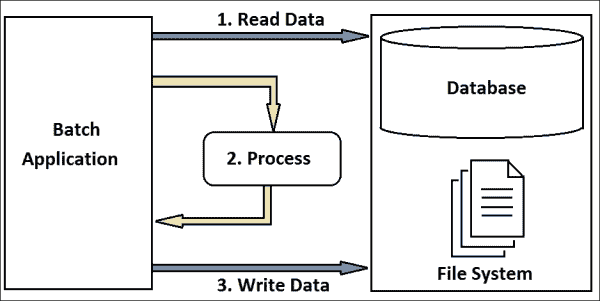
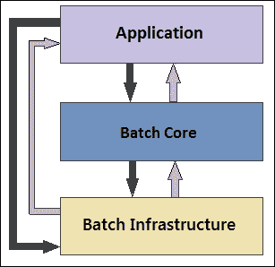
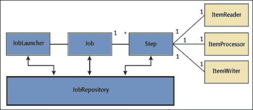
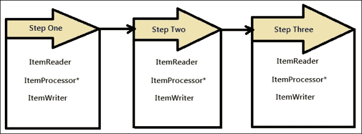
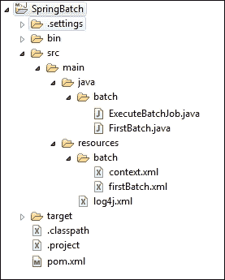
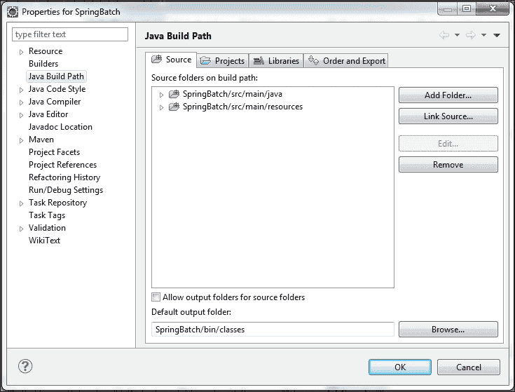

# 第一章。Spring Batch 基础知识

组织需要在日常运营中通过一系列交易处理大量数据。这些业务操作应该自动化，以便在没有人为干预的情况下高效处理信息。批处理可以通过程序执行此类一系列操作，以预定义的数据组作为输入，处理数据，并生成一组输出数据组或更新数据库。

在本章中，我们将涵盖以下主题：

+   批处理应用程序简介

+   Spring Batch 及其提供的产品

+   Spring Batch 基础设施

+   作业设计和执行

# 批处理应用程序简介

组织需要完成各种业务操作，包括大量数据处理。以下是一些此类操作的示例：

+   在大型企业中生成工资单和税务计算

+   银行生成的信用卡账单

+   零售商在其目录中更新的新鲜库存

所有这些操作都是通过预定义的配置和计划集来执行的，以便在特定的卸载系统时间运行。批处理应用程序应该能够在没有人为干预的情况下处理大量数据。以下图表示了一个典型的批处理应用程序：



标准批处理应用程序应具备以下功能：

+   **可扩展性**：它应该能够处理数十亿条记录，并且在不会崩溃应用程序的情况下保持可靠性

+   **健壮性**：它应该足够智能，能够识别无效数据并跟踪此类错误，以便使用修正后的数据重新运行

+   **动态性**：它应该能够与不同的系统交互，使用提供的凭据访问数据并处理操作

+   **并发性**：它必须能够与共享资源并行处理多个作业

+   **系统性**：它应该按照依赖步骤的顺序处理由工作流程驱动的批处理

+   **高性能**：它必须在指定的批处理窗口内完成处理

# Spring Batch 及其提供的产品

Spring Batch 是一个轻量级、全面的批处理框架，旨在使开发健壮的批处理应用程序成为可能，这对于 SpringSource 和埃森哲合作开发的企业系统日常运营至关重要。

Spring Batch 采用基于 POJO 的开发模式，以便开发人员能够轻松实现批处理并在需要时与其他企业系统集成。

**纯旧 Java 对象**（**POJO**）代表一个普通的 Java 对象，可以用来存储数据项并轻松地在服务之间交换信息。

虽然 Spring Batch 提供了许多从 Spring 框架中采用的可重用函数，并针对批处理应用程序进行了定制，以执行常见的批处理操作（如大量数据的分割处理、日志记录、事务管理、作业过程跳过-重启和有效的资源管理），但它不是一个调度框架。Spring Batch 可以与调度程序（如 Quartz/Control-M）一起工作，但不能替代调度程序。

在上一节中，我们讨论了从标准批处理应用程序中期望的功能。Spring Batch 被设计用来实现这些期望的功能，同时具备高能力，以与其他框架中开发的不同的应用程序集成。让我们观察 Spring Batch 提供的一些重要功能：

+   支持多种文件格式，包括固定长度、分隔符文件、XML 以及使用 JDBC 的常见数据库访问，以及其他突出框架。

+   失败后的自动重试

+   作业控制语言以监控和执行常见操作，如作业启动、停止、暂停和取消

+   在批处理执行期间以及批处理处理完成后跟踪状态和统计信息

+   支持多种启动批处理作业的方式，包括脚本、HTTP 和消息

+   支持运行并发作业

+   支持日志记录、资源管理、跳过和重新启动处理等服务

# Spring Batch 基础设施

Spring Batch 采用分层架构设计，包括三个主要组件，即应用程序、核心和基础设施，如下图所示：



应用程序层包含开发者编写的代码，用于使用 Spring Batch 运行批处理作业。

批处理核心层包含 `JobLauncher`、`Job` 和 `Step` 等核心运行时类，这些类对于启动和控制批处理作业是必要的。此层与应用程序层和批处理基础设施层交互以运行批处理作业。

批处理基础设施层包含常见的读取器、写入器和服务。应用程序和批处理核心都是建立在基础设施之上的。它们引用基础设施以获取运行批处理作业所需的信息。

Spring Batch 作业执行涉及多个组件。下一节将讨论这些组件及其关系。

## Spring Batch 组件

下图表示 Spring Batch 作业组件及其之间的关系：



`JobLauncher` 是负责启动作业的接口。当作业首次启动时，`JobLauncher` 会验证在 `JobRepository` 中该作业是否已经执行以及执行作业前 `Job` 参数的有效性。

作业是实际要执行的批处理过程。可以在 XML 或 Java 程序中配置 `Job` 参数。

`JobInstance`是每个周期作业的逻辑实例。如果一个`JobInstance`执行失败，相同的`JobInstance`可以再次执行。因此，每个`JobInstance`可以有多个作业执行。

`JobExecution`是单个作业运行的表示。`JobExecution`包含正在执行的作业的运行信息，例如`status`、`startTime`、`endTime`、`failureExceptions`等等。

`JobParameters`是用于批处理作业的参数集。

`Step`是批处理作业的顺序阶段。`Step`包含批处理作业的定义和控制信息。以下图表示批处理作业中的多个步骤。每个`Step`由三个活动组成，即数据读取、处理和写入，分别由`ItemReader`、`ItemProcessor`和`ItemWriter`处理。每条记录被读取、处理（可选）并写入系统。

`StepExecution`是单个`Step`运行的表示。`StepExecution`包含步骤的运行信息，例如`status`、`startTime`、`endTime`、`readCount`、`writeCount`、`commitCount`等等。



`JobRepository`为`JobLauncher`、`Job`和`Step`实现提供**创建、检索、更新和删除**（**CRUD**）操作。

`ItemReader`是`Step`检索操作的抽象表示。`ItemReader`一次读取一个项目。

`ItemProcessor`是`ItemReader`读取的项目业务处理的抽象表示。`ItemProcessor`仅处理有效的项目，如果项目无效则返回`null`。

`ItemWriter`是`Step`输出操作的抽象表示。`ItemWriter`一次写入一个批次或一批项目。

在下一节中，我们将使用对这些组件的理解，并使用基本的 Spring Batch 作业组件开发一个简单的批处理应用程序。还包括该应用程序的代码片段。

# 作业设计和执行

Spring Batch 可以通过多种方式配置到项目中，包括包含下载的 ZIP 发行版和从 Git 检出，或者使用 Maven 进行配置。在我们的例子中，我们将使用 Maven 配置。您应该在系统上直接安装 Maven 或使用基于 IDE 的插件（我们在这个例子中使用 Eclipse）。请参阅[`www.eclipse.org/m2e/`](https://www.eclipse.org/m2e/)以在 Eclipse IDE 中集成 Maven。Eclipse 的最新版本都预装了此插件；在安装之前请验证这一点。

Spring Batch 作业可以通过多种方式启动，包括以下几种：

+   从命令行启动作业

+   使用作业调度器启动作业

+   从 Java 程序启动作业

+   从 Web 应用程序启动作业

对于这个示例程序，我们是从一个简单的 Java 程序中启动批处理作业。

以下是通过 Spring Batch 运行第一个批处理作业的步骤，包括代码片段：

1.  创建一个 Maven 启用的 Java 项目（让我们称它为`SpringBatch`）。Maven 是用于有效管理项目的软件。`pom.xml`文件是 Maven 的配置文件，用于包含任何 API 依赖项。有专门的 Maven 原型可以创建示例项目。Maven 的位置是[`mvnrepository.com/artifact/org.springframework.batch/spring-batch-archetypes`](http://mvnrepository.com/artifact/org.springframework.batch/spring-batch-archetypes)。

1.  在项目的`root`目录下配置`pom.xml`，使其包含所需的 Maven 依赖项，如下所示：

    +   带批处理的 Spring 框架

    +   `log4j`用于日志记录

    +   使用 JUnit 测试应用程序

    +   Commons Lang 辅助工具用于`java.lang` API

    +   **HyperSQL** **数据库**（**HSQLDB**）能够使用 HSQLDB 运行，HSQLDB 是一个用 Java 编写的数据库管理系统

        ```java
        <project 

        xsi:schemaLocation="http://maven.apache.org/POM/4.0.0 
        http://maven.apache.org/xsd/maven-4.0.0.xsd">
            <modelVersion>4.0.0</modelVersion>
            <groupId>batch</groupId>
            <artifactId>SpringBatch</artifactId>
            <version>0.0.1-SNAPSHOT</version>
          <properties>
            <spring.framework.version>3.2.1.RELEASE
            </spring.framework.version>
            <spring.batch.version>3.0.2.RELEASE
            </spring.batch.version>
          </properties>

        <dependencies>
            <dependency>
              <groupId>commons-lang</groupId>
              <artifactId>commons-lang</artifactId>
              <version>2.6</version>
            </dependency>
            <dependency>
              <groupId>org.springframework.batch</groupId>
              <artifactId>spring-batch-core</artifactId>
              <version>${spring.batch.version}</version>
            </dependency>
            <dependency>
              <groupId>org.springframework.batch</groupId>
              <artifactId>spring-batch-infrastructure</artifactId>
              <version>${spring.batch.version}</version>
            </dependency>
            <dependency>
              <groupId>log4j</groupId>
              <artifactId>log4j</artifactId>
              <version>1.2.17</version>
            </dependency>
            <dependency>
              <groupId>junit</groupId>
              <artifactId>junit</artifactId>
              <version>4.8.2</version>
              <scope>test</scope>
            </dependency>
            <dependency>
              <groupId>org.springframework</groupId>
              <artifactId>spring-tx</artifactId>
              <version>${spring.framework.version}</version>
            </dependency>
            <dependency>
              <groupId>org.springframework</groupId>
              <artifactId>spring-jdbc</artifactId>
              <version>${spring.framework.version}</version>
            </dependency>
            <dependency>
              <groupId>hsqldb</groupId>
              <artifactId>hsqldb</artifactId>
              <version>1.8.0.7</version>
            </dependency>
        </dependencies>
        </project>
        ```

1.  在`src\main\resources`目录下创建`log4j.xml`文件，以以下内容进行日志记录，这将生成格式化的控制台输出：

    ```java
    <?xml version="1.0" encoding="UTF-8" ?>
    <!DOCTYPE log4j:configuration SYSTEM "log4j.dtd">
    <log4j:configuration >

      <appender name="CONSOLE"
       class="org.apache.log4j.ConsoleAppender">
        <param name="Target" value="System.out"/>
        <param name="Threshold" value="INFO" />
        <layout class="org.apache.log4j.PatternLayout">
          <param name="ConversionPattern" value="%d %-5p %c - 
          %m%n"/>
        </layout>
      </appender>
      <logger name="org.springframework" additivity="false">
        <level value="INFO"/>
        <appender-ref ref="CONSOLE"/>
      </logger>
      <root>
        <level value="DEBUG"/>
        <appender-ref ref="CONSOLE"/>
      </root>
    </log4j:configuration>
    ```

1.  在`src\main\resources\batch`目录下包含配置文件（`context.xml`），内容如下。上下文配置包括`jobRepository`、`jobLauncher`和`transactionManager`配置。在此配置中，我们将批处理配置为默认模式。

    ```java
    <?xml version="1.0" encoding="UTF-8"?>
    <beans:beans 

    xsi:schemaLocation="http://www.springframework.org/schema/beans 
    http://www.springframework.org/schema/beans/spring-beans-3.0.xsd 
    http://www.springframework.org/schema/batch 
    http://www.springframework.org/schema/batch/spring-batch-3.0.xsd">
        <beans:bean id="jobRepository" 
        class="org.springframework.batch.core.repository.
        support.MapJobRepositoryFactoryBean">
        <beans:property name="transactionManager"
         ref="transactionManager"/>
        </beans:bean>
        <beans:bean id="jobLauncher"
          class="org.springframework.batch.core.launch.support.
          SimpleJobLauncher">
          <beans:property name="jobRepository"
          ref="jobRepository" />
        </beans:bean>

        <beans:bean id="transactionManager" 
          class="org.springframework.batch.support.transaction.
          ResourcelessTransactionManager"/>
        </beans:beans>
    ```

1.  在`src\main\resources\batch`目录下包含作业配置（`firstBatch.xml`），内容如下。批处理作业配置包括使用 Java 程序配置批处理作业的步骤和任务。

    ```java
    <?xml version="1.0" encoding="UTF-8"?>
    <beans:beans xmlns ="http://www.springframework.org/schema/batch" 

    xsi:schemaLocation="http://www.springframework.org/schema/beans 
    http://www.springframework.org/schema/beans/spring-beans-3.0.xsd 
    http://www.springframework.org/schema/batch 
    http://www.springframework.org/schema/batch/spring-batch-3.0.xsd">
      <beans:import resource="context.xml" />
      <beans:bean id="firstBatch" class=" batch.FirstBatch"/>
        <step id="firstBatchStepOne">
          <tasklet ref="firstBatch"/>
        </step>
        <job id="firstBatchJob">
        <step id="stepOne" parent="firstBatchStepOne"/>
      </job>
    </beans:beans>
    ```

1.  在`src\main\java\batch`目录下编写第一个作业的任务（步骤中的处理策略）`FirstBatch.java`，内容如下。此任务程序在`firstBatch.xml`配置文件中作为`Job`下任务引用的参考。

    ```java
    package batch;

    import org.apache.log4j.Logger;
    import org.springframework.batch.core.StepContribution;
    import org.springframework.batch.core.scope.context.ChunkContext;
    import org.springframework.batch.core.step.tasklet.Tasklet;
    import org.springframework.batch.repeat.RepeatStatus;

    public class FirstBatch implements Tasklet {
      static Logger logger = Logger.getLogger("FirstBatch");

      public RepeatStatus execute(StepContribution arg0, 
      ChunkContext arg1)
          throws Exception {
        logger.info("** First Batch Job is Executing! **");
        return RepeatStatus.FINISHED;
      }
    }
    ```

1.  在`src\main\java\batch`目录下编写执行批处理作业的 Java 程序（`ExecuteBatchJob.java`），内容如下。通过此程序，我们访问作业配置文件，并从配置文件中识别`JobLauncher`和`Job`豆。通过传递作业和`jobParameters`，从`JobLauncher`的`run`方法中调用`JobExecution`。

    如前所述，我们可以从以下任一选项运行批处理作业，包括命令行、作业调度器、Web 应用程序或简单的 Java 程序。在这里，我们使用一个简单的 Java 程序来运行我们的第一个作业。

    ```java
    package batch;

    import org.apache.log4j.Logger;
    import org.springframework.batch.core.Job;
    import org.springframework.batch.core.JobExecution;
    import org.springframework.batch.core.JobParameters;
    import org.springframework.batch.core.launch.JobLauncher;
    import org.springframework.context.ApplicationContext;
    import org.springframework.context.support.ClassPathXmlApplicationContext;

    public class ExecuteBatchJob {

      static Logger logger = 
      Logger.getLogger("ExecuteBatchJob");
      public static void main(String[] args) {

        String[] springConfig  = {"batch/firstBatch.xml"};
        ApplicationContext context = new
        ClassPathXmlApplicationContext(springConfig);

        JobLauncher jobLauncher = (JobLauncher) 
        context.getBean("jobLauncher");
        Job job = (Job) context.getBean("firstBatchJob");
        try {
          JobExecution execution = jobLauncher.run(job, new
          JobParameters());
          logger.info("Exit Status : " + 
          execution.getStatus());
          } catch (Exception e) {
              e.printStackTrace();
          } finally {
            if (context != null) {
              context = null;
            }
          }
        logger.info("Done");
      }
    }
    ```

1.  以下是`SpringBatch`项目包含上述资源后生成的文件夹结构

    通过构建路径属性将`src/main/java`和`src/main/resources`添加到项目源中，如下截图所示：

    

1.  使用 Maven 安装构建项目并运行`ExecuteBatchJob`Java 程序，以在控制台上打印批处理作业执行状态：

    ```java
    2014-06-01 17:02:29,548 INFO  org.springframework.batch.core.launch.support.SimpleJobLauncher - Job: [FlowJob: [name=firstBatchJob]] launched with the following parameters: [{}]
    2014-06-01 17:02:29,594 INFO  org.springframework.batch.core.job.SimpleStepHandler - Executing step: [stepOne]
    2014-06-01 17:02:29,599 INFO ** First Batch Job is Executing! **
    2014-06-01 17:02:29,633 INFO  org.springframework.batch.core.launch.support.SimpleJobLauncher - Job: [FlowJob: [name=firstBatchJob]] completed with the following parameters: [{}] and the following status: [COMPLETED]
    2014-06-01 17:02:29,637 INFO Exit Status :COMPLETED
    2014-06-01 17:02:29,639 INFO Done
    ```

按照之前提到的步骤，我们使用 Spring Batch 配置了我们的第一个批处理作业，并成功从 Java 程序中执行了它。

# 摘要

在本章中，我们学习了批处理应用、实时批处理应用以及标准批处理应用应具备的功能。我们还学习了 Spring Batch 应用以及 Spring Batch 技术提供的特点、高级 Spring Batch 架构以及 Spring Batch 作业执行中涉及到的组件，以及这些组件之间的关系。我们通过开发一个简单的批处理应用并成功运行程序来完成本章内容。

在下一章中，我们将学习如何使用 XML 和 EL 配置批处理作业，以及从命令行和应用程序执行批处理作业。我们还将讨论批处理作业的调度。
