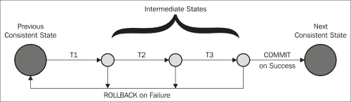
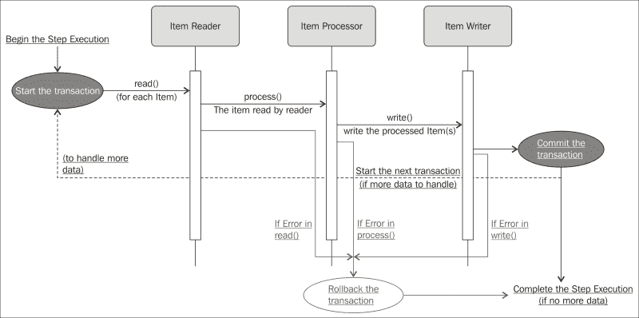
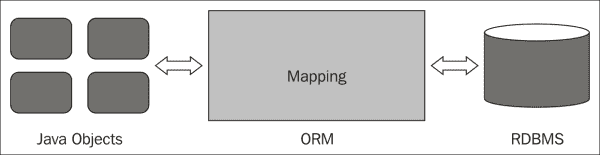
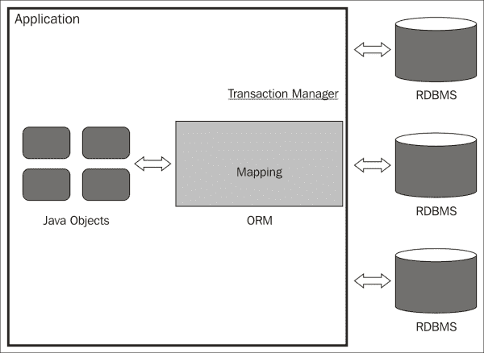

# 第四章 处理作业事务

在上一章中，我们学习了基本的数据处理机制，包括从/到不同来源（如平面文件、XML 和数据库）读取、处理和写入数据。从前几章中，我们了解到 Spring Batch 作业处理大量数据的读取、操作和写入活动。通过这些活动，在与文件/数据库交互时，确保活动的一致性非常重要。Spring Batch 通过作业处理提供强大的事务支持。

在本章中，我们将涵盖以下主题：

+   事务

+   Spring Batch 事务管理

+   自定义事务

+   事务模式

# 事务

作为作业处理的一部分，活动包括从不同来源读取数据、处理数据并将其写入不同来源，包括文件和数据库。数据，作为一个完整的记录集或分块，必须要么完全处理并写入最终系统，要么在发生任何错误的情况下跟踪为失败的记录。事务管理应负责此操作，以确保其一致性，通过提交正确的信息并在发生任何错误时回滚。以下是在数据库事务中涉及的活动：

+   开始事务

+   处理一组记录

+   如果在处理过程中没有发生错误，则提交事务

+   如果在处理过程中发生任何错误，则回滚事务

因此，事务被定义为一系列遵守以下**原子性、一致性、隔离性和持久性**（**ACID**）特性的操作：

+   **原子性**：这确保事务中的所有操作要么全部成功，要么全部失败

+   **一致性**：这确保事务将资源从一个有效状态带到另一个有效状态

+   **隔离性**：在并发执行期间，一个事务的状态和影响对其他所有事务都是隐藏的

+   **持久性**：事务的结果应该是持久的，并且在事务完成后能够经受住系统崩溃

如果一个事务遵循这些 ACID 特性，它可以通过中止事务中发生的错误，优雅地恢复系统的稳定状态来处理任何意外错误。

# Spring Batch 事务管理

Spring Batch 通过步骤执行提供事务管理，其中每个事务在成功处理数据后提交，如果在处理过程中发现任何错误，则回滚。 

Spring Batch 在以下两种情况下管理事务：

+   Tasklet 步骤

+   块导向步骤

+   监听器

## Tasklet 步骤

在 Spring Batch 中，任务令用于处理特定业务活动，如存档、远程交互和服务调用。默认情况下，任务令的`execute`方法是事务性的。因此，对`execute`方法的每次调用都会调用一个新的事务。以下是一个示例任务令配置：

```java
<step id="stepOne">
<tasklet ref="myTasklet"/>
</step>
<bean id="myTasklet" class="batch.MyTasklet">
<property name="targetObject">
<bean class="batch.EmployeeData"/>
</property>
<property name="targetMethod" value="updateEmployeeDetails"/>
</bean>
```

任务令的实现可以如下所示：

```java
public class MyTasklet implements Tasklet {
@Override
publicRepeatStatus execute(StepContribution contribution,
ChunkContext chunkContext) throwsException {
...
returnRepeatStatus.FINISHED;
}
}
```

## 面向块的步骤

面向块的步骤处理采用读取-处理-写入机制来处理记录块，如下所示图所示。每个步骤，一旦事务开始，处理要读取、处理和写入的数据，并在这些阶段成功完成后，步骤提交事务。然后，它跟随下一个事务来处理下一组记录。如果在这些步骤中的任何一步发生错误，它将回滚事务并完成步骤执行。



因此，对于大量数据处理，更倾向于使用面向块的操作步骤，这样整个数据被分成块并在单个事务中处理。如果在任何阶段发生异常，它将回滚该事务，因此数据处理将更加高效和完整。失败的步骤，可以通过记录并使用更正后的信息重新运行，可以优雅地回滚。以下是一个面向块的步骤配置示例：

```java
<step id="stepOne">
<tasklet allow-start-if-complete="true">
<chunk reader="itemReader" writer="itemWriter" commit-interval="10"/>
</tasklet>
</step>

<step id="stepTwo" parent="stepOne">
<tasklet start-limit="5">
<chunk processor="itemProcessor" commit-interval="5"/>
</tasklet>
</step>
```

在前面的配置中，我们有一个包含任务令和块的第一个步骤（`stepOne`）。为了确保执行顺序，`stepOne`是`stepTwo`的父步骤。当`stepOne`配置`itemReader`和`itemWriter`时，`stepTwo`配置`itemProcessor`。

## 监听器

Spring Batch 支持在事件发生前后执行某些操作的监听器。Spring Batch 处理这些事件中的每一个，每个监听器中事务的处理方式是特定的，以及它们如何处理数据。因此，观察监听器方法是否作为步骤事务的一部分处理是很重要的。如果不是，那么应用程序应该以编程方式处理此类事务。以下是一个示例监听器配置：

```java
<bean id="myStepExecutionListener" 
      class="org.java.MyStepExecutionListener" />
  <job id="readEmployeeDetails">
    <step id="step1">
      <tasklet>
        <chunk reader="itemReader" writer="itemWriter"
            commit-interval="1" />
          <listeners>
            <listener ref="myStepExecutionListener" />
          </listeners>
      </tasklet>
    </step>
  </job>
```

监听器的实现可以如下所示：

```java
public class MyStepExecutionListener implements StepExecutionListener {

  @Override
  public void beforeStep(StepExecution stepExecution) {
    System.out.println("StepExecutionListener : beforeStep");
  }

  @Override
  public ExitStatus afterStep(StepExecution stepExecution) {
    System.out.println("StepExecutionListener : afterStep");
    return null;
  }

}
```

# 定制事务

Spring Batch 允许配置自定义处理事务的方式。如果不同事务之间的数据交换被优雅地处理和读取，则事务是清洁的。然而，我们有不同的方式来配置事务完整性对其他交互的可见性，称为隔离级别。以下是可以自定义 Spring Batch 事务的隔离级别：

+   **可序列化**：这是最高的隔离级别。基于基于锁或非锁的并发控制，它确保了清洁的数据读取。

+   **可重复读**：这种基于锁的实现维护读和写锁，因此保证了数据清洁；然而，由于没有对范围锁的支持，可能会发生幻读。

+   **读取提交**：这种基于锁的实现维护写锁，因此它承诺任何读取的数据在读取时都是已提交的，并限制任何中间、未提交和脏读。

+   **读取未提交**：这是最低的隔离级别。一个事务可以看到其他事务的未提交更改。因此，在这个级别允许脏读。

每个隔离级别都有预定义的常量。默认情况下，Spring Batch 的隔离级别配置为`READ_COMMITTED`。根据要读取的事务中数据的紧迫性和重要性，必须为该事务设置隔离级别。例如，银行账户事务可能只想从其他事务中读取干净、已提交的数据，并使用持久数据执行事务。在这种情况下，必须在隔离级别和应用程序性能之间做出选择。以下是一个隔离级别配置示例：

```java
<job-repository id="jobRepository" isolation-level-for-create="SERIALIZABLE"/>
```

如果批处理作业与使用类似命名约定的其他框架集成的应用程序集成，那么应该小心配置。一种技术的控制意图可能控制其他技术；在这种情况下，根据需要最好禁用其中一个配置。

如第二章中所述，每个批处理组件上的属性，即“Spring Batch 作业入门”，可以帮助我们更好地定制批处理作业的事务配置。例如，可以通过配置`no-rollback-exception-classes`来控制特定异常场景下的回滚事务。

# 事务模式

Spring Batch 作业处理涉及跨多个源处理数据。这些通常反复出现的情况可以识别为事务模式。

以下已识别的模式：

+   **简单事务**：这是一个涉及单个应用程序和数据源（源和目标）的事务

+   **全局事务**：这是一个涉及多个数据源并通过同一事务处理的事务

## 简单事务

使用与 Spring Batch 集成的多种数据库交互技术（如 JDBC、JPA 或 Hibernate 支持）的支持，可以轻松实现具有单个批处理应用程序和数据源的单个事务。交互方式如下所示：



## 全球事务

如果需要通过单个事务持久化多个数据源，则此类事务被称为全局事务，可以由事务管理器管理。确保事务通过其多个数据源遵守 ACID 特性，并且数据保持一致性的责任在于事务管理器。

然而，如果一个应用程序部署在一个支持事务管理器的集成企业服务器上，那么它也可以被认为是基于**Java 事务 API**（**JTA**）的事务管理器。以下是一个受管理事务的表示。



这些事务也可以配置为保持一个数据库模式作为另一个数据库模式中的同义词的引用，以便在虚拟上作为本地事务来引用。然而，必须考虑创建此类同义词的努力。

# 摘要

通过本章，我们学习了事务及其关键特性。我们还了解了 Spring Batch 在不同场景下如何执行事务管理，包括 tasklet 步骤、面向块步骤和监听器。我们还学习了如何通过隔离级别和属性配置来自定义事务。我们以对批处理应用程序中单源和多源常用事务模式的理解结束了本章。

在下一章中，我们将详细了解作业的流程以及执行作业步骤之间的数据共享。
