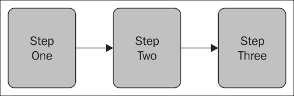
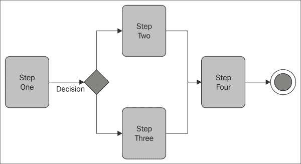

# 第五章 步骤执行

在上一章中，我们学习了事务以及在不同场景下管理事务，包括使用隔离级别和模式配置单数据源和多数据源的事务属性。到目前为止，我们已经讨论了简单的作业，其中流程是线性的，包含一个步骤接着另一个步骤执行的作业。在现实世界应用中，我们需要配置带有步骤组合的作业，它们之间共享数据，并在运行时决定执行哪个步骤。

在本章中，我们将涵盖以下主题：

+   控制作业流

+   数据共享

+   外部化和终止

# 控制作业流

到目前为止，我们已经看到了配置了步骤以线性方式连续执行的批处理作业。在批处理作业执行过程中，可能会出现根据前一步的执行结果来决定执行哪个步骤的情况，这是一种非线性执行。

下图显示了批处理作业中线性步骤执行的情况：



下图显示了批处理作业中非线性步骤执行的情况：



让我们了解如何处理这样的作业流。主要有两种处理方式：

+   使用退出码

+   使用决策逻辑

## 使用退出码

可以根据步骤的退出状态以及带有`on`和`to`属性的`next`标签的配置来处理作业流。以下是一个使用退出码的示例配置：

```java
<?xml version="1.0" encoding="UTF-8"?> 
<beans:beans xmlns ="http://www.springframework.org/schema/batch" 

xsi:schemaLocation="http://www.springframework.org/schema/beans 
http://www.springframework.org/schema/beans/spring-beans-3.0.xsd 
http://www.springframework.org/schema/batch 
http://www.springframework.org/schema/batch/spring-batch-3.0.xsd">

<beans:import resource="context.xml" />

<beans:bean id="testTasklet" class=" batch.TestTasklet"> 
<beans:property name="success" value="true"/> 
</beans:bean> 
<beans:bean id="successTasklet" class=" batch.StatusTasklet"> 
<beans:property name="status" value="Success"/> 
</beans:bean> 
<beans:bean id="failTasklet" class=" batch.StatusTasklet"> 
<beans:property name="status" value="Failure"/> 
</beans:bean>

<job id="nonLinearJob"> 
<step id="stepOne"> 
  <tasklet ref="testTasklet"/> 
  <next on="*" to="stepTwo"/> 
  <next on="FAILED" to="stepThree"/> 
</step> 
<step id="stepTwo"> 
  <tasklet ref="successTasklet"/> 
</step> 
<step id="stepThree"> 
  <tasklet ref="failTasklet"/> 
</step> 
</job> 
</beans:beans>
```

在前面的配置中，`stepOne`是批处理作业中要执行的第一步。根据此步骤的输出（`ExitStatus`），包括`testTasklet`，下一个标签决定执行哪个步骤。如果`testTasklet`返回`FAILED`状态，则执行`stepThree`，否则执行`stepTwo`。状态可以由作业执行或步骤执行的属性返回。以下是一些不同的状态：

+   字符串：退出状态应与字符串匹配，例如`COMPLETED`/`FAILED`，这可以从`FlowExecutionStatus`中验证。

+   `*`: 可以匹配零个或多个字符。它可以匹配任何值。

+   `?`: 仅匹配一个字符。

## 使用决策逻辑

非线性作业执行也可以通过使用`JobExecutionDecider`实现和决策标签配置的决策逻辑来处理。

以下是对应于检查退出状态并相应返回`FlowExecutionStatus`的`JobExecutionDecider`实现：

```java
package batch;
import org.springframework.batch.core.ExitStatus;
import org.springframework.batch.core.JobExecution;
import org.springframework.batch.core.StepExecution;
import org.springframework.batch.core.job.flow.FlowExecutionStatus;
import org.springframework.batch.core.job.flow.JobExecutionDecider;

public class JobFlowDecider implements JobExecutionDecider {
@Override
public FlowExecutionStatus decide(JobExecution jobExecution,
StepExecution stepExecution) {
  if(!ExitStatus.FAILED.equals(stepExecution.getExitStatus())) {
    return new FlowExecutionStatus(FlowExecutionStatus.FAILED.getName()); 
  } else {
    return new FlowExecutionStatus(FlowExecutionStatus.COMPLETED.getName()); 
  }
  }
}
```

以下包含`JobExecutionDecider`实现和决策标签配置的作业配置：

```java
<?xml version="1.0" encoding="UTF-8"?> 
<beans:beans xmlns ="http://www.springframework.org/schema/batch" 

xsi:schemaLocation="http://www.springframework.org/schema/beans 
http://www.springframework.org/schema/beans/spring-beans-3.0.xsd 
http://www.springframework.org/schema/batch 
http://www.springframework.org/schema/batch/spring-batch-3.0.xsd">

<beans:bean id="decider" class="batch.JobFlowDecider"/>
<beans:bean id="successTasklet" class=" batch.StatusTasklet"> 
<beans:property name="status" value="Success"/> 
</beans:bean> 
<beans:bean id="failTasklet" class=" batch.StatusTasklet"> 
<beans:property name="status" value="Failure"/> 
</beans:bean>
<job id="nonLinearJob"> 
  <step id="stepOne" next="decision"> 
  <tasklet> 
    <chunk reader="itemReader" writer="itemWriter" 
    commit-interval="20"/>
  </tasklet> 
  </step> 
  <decision id="decision"> decider="decider" 
    <next on="*" to="stepTwo"/> 
    <next on="FAILED" to="stepThree"/> 
  </decision> 
  <step id="stepTwo"> 
    <tasklet ref="successTasklet"/> 
  </step> 
  <step id="stepThree"> 
    <tasklet ref="failTasklet"/> 
  </step> 
</job>
```

可以根据监控状态需求在这两种选项（退出码和决策逻辑）之间进行选择；作业执行决策者使配置更易于阅读。

# 数据共享

在理想情况下，每个步骤都应该配置为独立执行，但在现实场景中，步骤需要共享数据。数据可以通过不同的方式在步骤之间共享。以下是一些选项：

+   使用执行上下文

+   使用 Spring 持有者 beans

## 使用执行上下文

从前面的章节中我们了解到，Spring Batch 作业在称为批作业元数据的上下文中维护作业执行信息。我们可以使用这个上下文在步骤之间共享数据。基于键值的数据由 `org.springframework.batch.item.ExecutionContext` 在其使用中维护。以下是从中获取/设置数据的方式：

```java
String importId = jobExecutionContext.getString("importId");
executionContext.putString("importId", importId);
```

作业和步骤都有它们自己的执行上下文，形式为 `JobExecutionContext` 和 `StepExecutionContext`。虽然作业有一个唯一的执行上下文，但作业中的每个步骤都维护其自己的步骤执行上下文。步骤上下文可以通过块上下文（`org.springframework.batch.core.scope.context.ChunkContext`）访问，而作业上下文可以通过步骤上下文访问。

## 使用 Spring 持有者 beans

步骤之间的数据也可以通过使用 Spring 持有者 beans 的概念进行共享。元数据配置由 `ImportMetadata` 表示，通过它可以设置和获取数据。我们可以编写一个可以持有 `ImportMetadata` 引用的 bean，并在作业配置中将它与 `ImportMetadataHolder` 配置相同。以下是对 `ImportMetadataHolder` 的示例配置：

```java
package batch;
public class ImportMetadataHolder {
  private ImportMetadata importMetadata;
  public ImportMetadata get() {
    return importMetadata;
  }
  public void set(ImportMetadata importMetadata) {
    this.importMetadata = importMetadata;
  }
}
```

可以使用以下语法从持有者设置和获取数据：

```java
importMetadataHolder.set(
batchService.extractMetadata(outputDirectory));
importMetadataHolder.get().getImportId();
```

`ImportMetadataHolder` 可以像任何其他 bean 一样进行配置，并通过属性规范注入到 tasklets 中。

# 外部化和终止

外部化和终止是帮助使 Spring Batch 的组件可重用并优雅地处理作业终止的概念。

## 外部化

Spring Batch 允许使用外部化进行代码重用，即分离可重用操作步骤并将其包含在所需作业中。除了将单个步骤作为 beans 进行配置并包含在每个作业中之外，外部化还可以通过以下方式实现：

+   外部流程定义及其包含在所需作业中

+   继承作业机制

## 外部流程定义及其包含在所需作业中

以下是对外部流程定义及其包含在所需作业中的示例配置：

```java
<flow id="externalFlow"> 
  <step id="stepOne" next="stepTwo"> 
    <tasklet ref="taskletOne"/> 
  </step> 
  <step id="stepTwo"> 
    <tasklet ref="taskletTwo"/> 
  </step> 
</flow> 
<job id="mainJob"> 
  <flow parent="externalFlow" id="mainStep" next="stepThree"/> 
  <step id="stepThree"> 
    <tasklet ref="taskletThree"/> 
  </step> 
</job>
```

## 继承作业机制

将流程外部化的另一种方式是通过继承一个作业到另一个作业，这意味着定义一个独立的作业，并在另一个作业中将其作为其一部分进行引用。以下是对其的示例配置：

```java
<job id="mainJob"> 
  <step id="stepOne" next="stepTwo"> 
    <tasklet ref="taskletOne"/> 
  </step> 
  <step id="stepTwo"> 
    <tasklet ref="taskletTwo"/> 
  </step> 
</job>
<job id="subJob"> 
  <step id="stepThree" next="stepFour"> 
<job ref="mainJob" job-parameters-extractor="jobParametersExtractor" /> 
</step> 
  <step id="stepFour" parent="runBatch"/> 
</job>
```

主要作业有几个步骤，子作业被定义为在它的第一步中引用主要作业。

## 终止

以编程方式结束执行是批处理作业执行的一个重要方面。为了能够有效地编程，应该了解作业可以终止的不同状态。不同的状态如下：

+   `COMPLETED`：此结束状态可以用来告诉 Spring Batch 处理已成功结束。当一个作业实例以这种结束状态终止时，不允许使用相同的参数集重新运行。

+   `FAILED`：此结束状态可以用来告诉 Spring Batch 处理已失败。Spring Batch 允许失败的作业使用相同的参数集重新运行。

+   `STOPPED`：此结束状态类似于暂停正在执行的作业。如果以这种状态结束，Spring Batch 不仅允许我们重新启动作业，而且允许我们从上次停止的地方重新启动，即使执行过程中没有错误。

### 以`COMPLETED`状态终止

以下是基于带有 end 标签配置的`ExitStatus`终止作业在`COMPLETED`状态的配置：

```java
<job id="nonLinearJob"> 
  <step id="stepOne"> 
    <tasklet ref="successTasklet"/> 
    <end on="*"/> 
    <next on="FAILED" to="stepTwo"/> 
  </step> 
  <step id="stepTwo"> 
    <tasklet ref="failureTasklet"/> 
  </step> 
</job>
```

此配置在成功执行后结束作业，并且我们不能使用相同的参数集重新运行作业。第一步配置为在第二步失败时调用第二步。

### 以`FAILED`状态终止

以下是基于带有 fail 标签配置的`ExitStatus`终止作业在`FAILED`状态的配置：

```java
<job id="nonLinearJob"> 
  <step id="stepOne"> 
    <tasklet ref="successTasklet"/> 
    <next on="*" to="stepTwo"/> 
    <fail on="FAILED" exit-code="STEP-ONE-FAILED"/>
  </step> 
  <step id="stepTwo"> 
    <tasklet ref="failureTasklet"/> 
  </step> 
</job>
```

如果退出状态是`FAILED`，则此配置将以`FAILED`状态结束作业，并且我们可以使用相同的参数集重新运行作业。

### 以`STOPPED`状态终止

以下是基于带有 stop 标签配置的`ExitStatus`终止作业在`STOPPED`状态的配置：

```java
<job id="nonLinearJob"> 
  <step id="stepOne"> 
    <tasklet ref="successTasklet"/> 
    <next on="*" to="stepTwo"/> 
    <stop on="FAILED" restart="stepTwo"/>
  </step> 
  <step id="stepTwo"> 
    <tasklet ref="failureTasklet"/> 
  </step> 
</job>
```

如果退出状态是`FAILED`，则此配置将以`STOPPED`状态结束作业，并且我们可以使用相同的参数集重新运行作业。

# 摘要

通过本章，我们学习了如何使用退出代码和决策逻辑控制批处理作业的流程。我们还学习了如何在执行步骤之间通过执行上下文和 holder beans 共享数据。我们还学习了通过外部化和继承作业机制来重用流程。我们通过理解在不同状态下终止批处理作业及其重要性来结束本章。在下一章中，我们将详细了解使用 Spring 集成和 RESTful 作业处理的企业集成。
