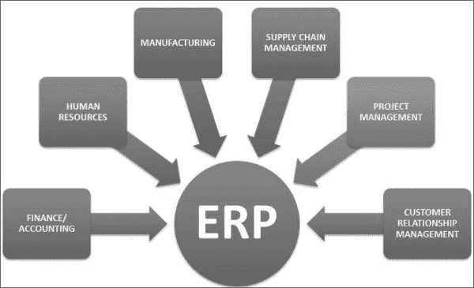
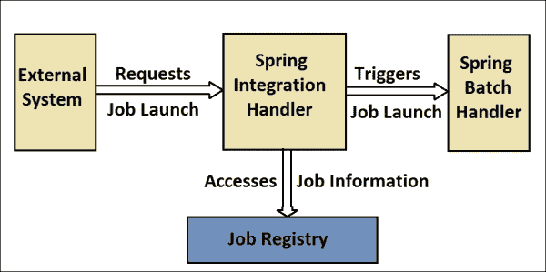

# 第六章。集成 Spring Batch

在上一章中，我们学习了如何使用退出代码和决策逻辑控制批处理作业的流程，在执行步骤之间共享数据，并通过外部化和继承作业机制来重用流程。我们还学习了如何在不同状态下终止批处理作业及其重要性。一个组织借助多种工具进行其操作，并在不同地点维护其数据和应用程序。使用一种合理的机制来集成这些应用程序中的数据，以同步系统是很重要的。

在本章中，我们将介绍以下主题：

+   企业集成

+   Spring 集成

+   RESTful 作业处理

# 企业集成

到目前为止，我们已经看到了配置了不同步骤的批处理作业；从不同的来源读取数据，执行操作，并将数据写入不同的目的地。在实时操作中，组织使用不同的应用程序来执行其操作。用于维护员工信息和处理工资单的应用程序可能与负责物流和销售的应用程序不同。在这种情况下，无缝集成这些应用程序以在任何特定点一起处理整个数据并执行系统操作是很重要的。

下图显示了企业资源规划（ERP）系统如何集成不同的模块，从其系统中访问信息，并将其作为实体维护。



以下是企业应用程序集成的方式：

+   **基于文件的数据传输**：应用程序基于平面文件交换数据；源系统将数据写入平面文件并将文件导出到目标系统。目标系统从平面文件中读取数据并将其导入其目标数据库。

+   **资源共享**：应用程序共享通用资源，例如文件系统或数据库，以执行其操作。实际上，它们作为独立系统运行；然而，它们在通用系统上填充/写入数据。

+   **服务调用**：应用程序将其操作公开为服务（近年来是 Web 服务）以允许其他应用程序调用它们。可以根据它们的设计方式从这些服务中传输/接收数据。

+   **消息服务**：应用程序使用一个公共消息服务器；一个应用程序可以发送消息，另一个接收它。

# Spring 集成

Spring 项目将 Spring 集成定义为 Spring 编程模型的企业集成扩展。Spring 集成是为了在基于 Spring 的应用程序中支持轻量级消息而开发的，并通过声明式适配器支持与外部系统的系统集成。这些适配器提供了 Spring 对远程、消息和调度的支持抽象。


当 Spring Batch 在基于文件或数据库的集成系统上操作时，Spring Integration 提供了基于消息的应用程序集成。将此消息功能添加到 Spring Batch 应用程序中可以自动化其操作，并分离关键操作关注点。让我们了解如何使 Spring Integration 配置成为集成企业应用程序的一部分。以下是一些可以通过消息集成执行的关键操作：

+   触发批处理作业执行

+   触发带有作业完成/失败状态的消息

+   异步处理器的操作

+   外部化

以下是在 Spring XML 应用程序上下文中启用 Spring Batch 集成的文件：

```java
<beans 

xmlns:batch-integrate="http://www.springframework.org/schema/batch-integration"
xsi:schemaLocation="http://www.springframework.org/schema/batch-integration
http://www.springframework.org/schema/batch-integration/spring-batch-integration.xsd
http://www.springframework.org/schema/batch
http://www.springframework.org/schema/batch/spring-batch.xsd
http://www.springframework.org/schema/beans
http://www.springframework.org/schema/beans/spring-beans.xsd
http://www.springframework.org/schema/integration
http://www.springframework.org/schema/integration/spring-integration.xsd">
...
</beans>
```

## 触发批处理作业执行

到目前为止，我们一直通过命令行、从应用程序中以编程方式触发作业。然而，某些应用程序必须使用远程文件传输（FTP/SFTP）传输数据，并启动将数据导入应用程序的作业。Spring Integration 提供了不同的适配器，以便轻松进行启动配置。Spring Integration 的`JobLaunchingMessageHandler`是一个易于实现的、基于事件的`JobLauncher`执行。Spring Integration 提供`JobLaunchRequest`作为`JobLaunchingMessageHandler`的输入。



以下是将`JobLaunchRequest`从文件转换的列表：

```java
package com.java.batchJob;
import org.springframework.batch.core.Job;
import org.springframework.batch.core.JobParametersBuilder;
import org.springframework.batch.integration.launch.JobLaunchRequest;
import org.springframework.integration.annotation.Transformer;
import org.springframework.messaging.Message;
import java.io.File;

public class FileMessageToJobRequest {
private Job job;
private String fileParameterName;
public void setFileParameterName(String fileParameterName) {
this.fileParameterName = fileParameterName;
}
public void setJob(Job job) {
this.job = job;
}
@Transformer
Public JobLaunchRequest toRequest(Message<File> message) {
JobParametersBuilder jobParametersBuilder = 
new JobParametersBuilder();
jobParametersBuilder.addString(fileParameterName, message.getPayload().getAbsolutePath());
return new JobLaunchRequest(job, jobParametersBuilder.toJobParameters());
}
}
```

作业执行状态通过`JobExecution`实例返回。`JobExecution` ID 帮助用户通过`JobRepository`跟踪作业执行状态。

以下配置是通过适配器获取文件输入（CSV 文件），通过转换器`FileMessageToJobRequest`将其转换为`JobRequest`，通过`JobLaunchingGateway`启动作业，并记录`JobExecution`的输出。

```java
<integrate:channel id="inputFileRepository"/>
<integrate:channel id="jobRequestChannel"/>
<integrate:channel id="jobTriggeringStatusChannel"/>
<integrate-file:inbound-channel-adapter id="inputFile"
channel="inputFileRepository"
directory="file:/tmp/batchfiles/"
filename-pattern="*.csv">
<integrate:poller fixed-rate="1000"/>
</integrate-file:inbound-channel-adapter>
<integrate:transformer input-channel="inputFileRepository"
output-channel="jobRequestChannel">
<bean class="batchJob.FileMessageToJobRequest">
<property name="job" ref="employeeJob"/>
<property name="fileParameterName" value="input.file.name"/>
</bean>
</integrate:transformer>
<batch-integrate:job-launching-gateway request-channel="jobRequestChannel"
reply-channel="jobTriggeringStatusChannel"/>
<integrate:logging-channel-adapter channel="jobTriggeringStatusChannel"/>
```

项目读取器可以被配置为从以下配置中选取输入文件名作为作业参数：

```java
<bean id="itemReader" class="org.springframework.batch.item.file.FlatFileItemReader"
scope="step">
<property name="resource" value="file://#{jobParameters['input.file.name']}"/>
...
</bean>
```

Spring Integration 从 Spring 应用程序上下文中获取消息访问。因此，批处理作业也可以通过从应用程序上下文中访问的请求来触发，如下面的代码所示：

```java
ApplicationContext ctx = new ClassPathXmlApplicationContext("spring-integration-job.xml");
EmployeeJobLaunchRequest employeeJobLaunchRequest = new EmployeeJobLaunchRequest("employeeJob", Collections.singletonMap("key", "value"));
Message<EmployeeJobLaunchRequest> msg = MessageBuilder.withPayload( employeeJobLaunchRequest).build();
MessageChannel jobRequestsChannel = ctx.getBean("inputFileRepository", MessageChannel.class);
jobRequestsChannel.send(msg);
```

在前面的代码中，`EmployeeJobLaunchRequest`是用户定义的`JobLaunchRequest`，它被 Spring Integration 消息包装。生成消息的 Spring Integration 类是`MessageBuilder`。使用此请求，我们可以传递输入请求详情，例如文件存储库，并启动作业。Spring Integration 的详细信息可以在*Spring Integration Essentials*，*Chandan Pandey*，*Packt Publishing*中学习。

# RESTful 作业处理

网络服务是在网络上两个电子设备之间通信的方法。它是在 Web 上通过网络地址提供的软件功能，服务始终处于开启状态，就像在计算效用概念中一样。

REST 是一种架构风格，它由一组协调的架构约束组成，应用于分布式超媒体系统中的组件、连接器和数据元素。REST 架构风格也应用于 Web 服务的开发。与 REST 兼容的 Web 服务的主要目的是使用一组无状态操作来操作 Web 资源的 XML 表示。

Spring Batch 支持使用 REST Web 服务通过`Put`/`Post`方法启动和批处理作业。以下是一个使用 Spring CXF（一个开源服务框架）的示例列表：

```java
@Autowired
private JobLauncher jobLauncher;

@Autowired
private Job job;

public boolean startJob() throws Exception {
try {
final JobParameters jobParameters = new JobParametersBuilder(). addLong("time", System.nanoTime()).toJobParameters();
final JobExecution execution = jobLauncher.run(job, jobParameters);
final ExitStatus status = execution.getExitStatus();
if (ExitStatus.COMPLETED.getExitCode().equals(status.getExitCode())) 
  {
    result = true;
  }
}
} catch (JobExecutionAlreadyRunningException ex) {
  System.out.println("Exception" + ex);
} catch (JobRestartException ex) {
  System.out.println("Exception" + ex);
} catch (JobInstanceAlreadyCompleteException ex) {
  System.out.println("Exception" + ex);
} catch (JobParametersInvalidException ex) {
  System.out.println("Exception" + ex);
} catch (IOException ex) {
  System.out.println("Exception" + ex);
}
 return false;
}
```

自动装配的`JobLauncher`和`Job`对象被注入到应用程序中。`startJob()`方法使用`JobParametersBuilder`创建`JobParameters`，并通过`jobLauncher.run()`触发作业。从 Web 服务调用批处理作业的此调用在同步线程中触发批处理作业。可以从`JobExecution`对象访问`ExitStatus`。任何在作业启动期间的异常都可以通过前面提到的适当异常处理来捕获。

# 摘要

通过本章，我们学习了企业集成以及可用于企业应用程序集成的不同方法。我们还了解了 Spring Integration 项目如何通过其消息驱动方法与企业批处理应用程序集成。我们还学习了如何通过访问应用程序上下文中的 Spring Integration 组件来启动批处理作业。我们以对 RESTful 作业处理技术的理解结束了本章。

在下一章中，我们将学习如何检查 Spring Batch 作业，包括访问执行数据、监听器和 Web 监控。
