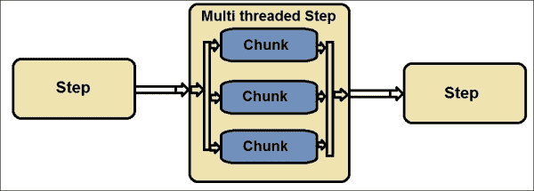
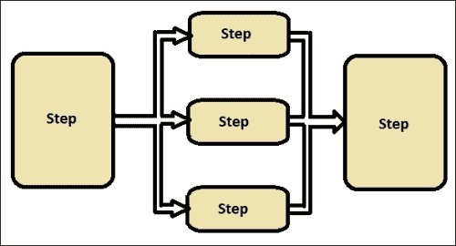
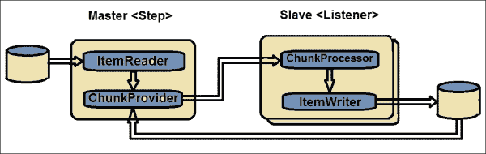
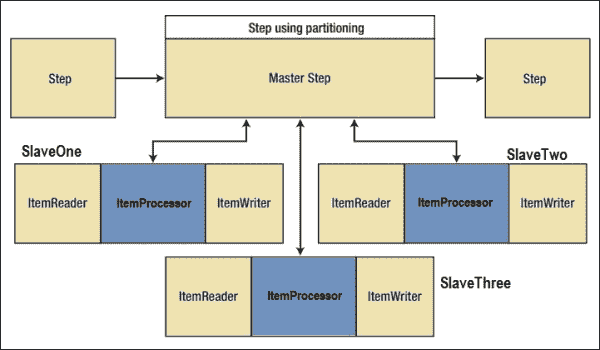

# 第八章。使用 Spring Batch 进行扩展

在上一章中，我们学习了如何使用监听器、访问执行信息和管理配置来监控、获取执行信息和理解 Spring Batch 管理功能。Spring Batch 作业执行处理的是随时间变化的大量数据。这种详细处理消耗了巨大的基础设施。显然，可以预期这些作业在组织数据规模增长时能够高效执行并满足扩展需求。

在本章中，我们将涵盖以下主题：

+   批量扩展模型

+   线程模型

+   并行处理

+   远程分块

+   分区

# 批量扩展模型

到目前为止，我们已经看到了如何处理不同类型的批量作业、配置和执行。随着组织规模的日益增长，每个批量作业需要处理的数据量也相应增加。设计并配置我们的批量作业以满足这些性能和扩展预期是很重要的。

我们编写的具有特定业务逻辑的批量作业，保持不同资源之间的交互，不能每次看到数据负载或性能问题时都进行更改。Spring Batch 提供了丰富的配置基础设施，可以通过调整配置信息来扩展作业，而无需更改它们。

基础设施的扩展可以通过以下两种方式之一进行：

+   **通过增加系统硬件的容量**：在这种扩展方式中，我们可以用更强大的基础设施替换现有的缓慢基础设施。

+   **添加更多服务器**：在这种扩展方式中，我们可以在现有基础设施中并行添加更多相同容量的处理系统。这些额外的节点分担工作并增加了整个系统的扩展性。

Spring Batch 提供了以下方式来扩展批量应用程序：

+   **线程模型**：这是一个单进程的多线程步骤

+   **并行处理**：这是一个单进程的并行步骤执行

+   **远程分块**：这是多进程步骤的远程分块

+   **分区**：这是步骤的分区；它可以是一个或多个进程

# 线程模型

默认情况下，步骤执行是单线程模型。Spring Batch 允许我们配置步骤以多块执行，从而使单个步骤能够在`org.springframework.core.task.TaskExecutor`的帮助下以多线程模型执行。

下面的图展示了步骤执行的线程模型：



下面的示例配置是带有`TaskExecutor`的多线程步骤：

```java
<step id="employeePayProcessing">
<tasklet task-executor="taskExecutor">
<chunk reader="employeeWorkingDaysReader" processor="employeePayProcessor"
writer="employeeSalariesWriter"/>
</tasklet>
</step>
<beans:bean id="taskExecutor"
class="org.springframework.core.task.SimpleAsyncTaskExecutor">
<beans:property name="concurrencyLimit" value="20"/>
</beans:bean>
```

通过前面的配置，`employeePayProcessing` 步骤考虑了为任务和任务执行配置的读取器、处理器和写入器，通过 `org.springframework.core.task.SimpleAsyncTaskExecutor` 拥有 20 个线程的线程池，每个线程并行处理每个线程中的数据块。

就像任何其他多线程模型一样，Spring Batch 的多线程模型也考虑了多个线程使用的资源，以及它们是否是线程安全的。"ItemReader" 是这样一个过程，它不是线程安全的。

要配置线程安全的操作，建议通过同步读取方法来同步 `ItemReader` 过程。

# 并行处理

虽然多线程允许单个步骤在多个线程中处理数据块，但 Spring Batch 允许我们通过并行处理同时处理多个步骤和流程。这个特性使得独立的步骤可以并行执行，并确保更快的处理速度。

下图显示了正在并行执行的多个步骤：



使用并行处理，独立的步骤不需要等待其他步骤完成后再执行。

下面的示例配置了处理中的并行步骤：

```java
<job id="employeePayProcessing">
<split id="splitProcess" task-executor="taskExecutor" next="payCalculations">
<flow>
<step id="readEmployeeData" parent="stepOne" next="processEmployeeData"/>
<step id="processEmployeeData" parent="stepTwo"/>
</flow>
<flow>
<step id="organizationDataSetup" parent="stepThree"/>
</flow>
</split>
<step id="payCalculations" parent="stepFour"/>
</job>
<beans:bean id="taskExecutor" class=" org.springframework.core.task.SimpleAsyncTaskExecutor"/>
```

在前面的配置中，`readEmployeeData` 和 `processEmployeeData` 步骤与 `organizationDataSetup` 并行执行。默认情况下，`taskExecutor` 是 `SyncTaskExecutor`；通过前面的配置，我们将其更改为 `SimpleAsyncTaskExecutor` 以支持并行步骤处理。

# 远程分块

远程分块是原始步骤读取数据调用远程过程进行处理，并将处理后的数据写回或接收回系统上的过程。由于远程分块涉及将数据传输到远程系统，我们还应该考虑建立此基础设施的成本与我们在远程处理中获得的优势之间的成本。实际步骤（主步骤）执行读取过程，远程从属步骤（监听器）可以是执行处理和写入步骤的 JMS 监听器，或者将处理后的信息返回给主步骤。

下图展示了远程分块步骤：



`ChunkProvider` 接口从 `ItemReader` 返回数据块：

```java
public interface ChunkProvider<T> {
void postProcess(StepContribution contribution, Chunk<T> chunk);
Chunk<T> provide(StepContribution contribution) throws Exception;
}
```

`ChunkProcessor` 接口处理数据块：

```java
public interface ChunkProcessor<I> {
void process(StepContribution contribution, Chunk<I> chunk) throws Exception;
}
```

为了能够有效地执行远程交互，远程分块过程可以包含 Spring Integration 项目以处理资源的集成。

# 分区

虽然远程分块在主节点读取数据并处理到另一个远程系统（从属节点），但分区通过具有完整处理能力的多个系统并行执行整个流程（读取、处理和写入）。在此，主步骤负责理解作业并将任务交给多个从属节点，而从属节点必须负责剩余的任务（读取、处理和写入）。本质上，从属节点构成了在其自己的世界中负责读取、处理和写入的步骤。

与远程分块相比，分区的好处包括不需要数据传输，因为从属系统也负责读取步骤。



尽管在此模式中，主节点发送给从属节点的通信未能成功传递，但 `JobRepository` 中的批处理元数据确保每个从属节点在每个作业执行中只执行一次。

Spring Batch 分区 **服务** **提供者接口**（**SPI**）具有以下基础设施以实现有效的分区：

+   `PartitionHandler`: 这向远程步骤发送 `StepExecution` 请求。它不必知道如何拆分或整合数据，而 `TaskExecutorPartitionHandler` 是 `PartitionHandler` 的默认实现。

+   `Partitioner`: 这为分区步骤生成步骤执行（仅适用于新的步骤执行）。`SimplePartitioner` 是 `Partitioner` 的默认实现。

+   `StepExecutionSplitter`: 这为分区步骤执行生成输入执行上下文，而 `SimpleStepExecutionSplitter` 是默认实现。

以下是一个示例分区步骤执行配置：

```java
<step id="initialStep">
<partition step="stepPartition" handler="handler"/>
</step>
<beans:bean class="org.springframework.batch.core.partition.support.TaskExecutorPartitionHandler">
<beans:property name="taskExecutor" ref="taskExecutor"/>
<beans:property name="step" ref="stepPartition"/>
<beans:property name="gridSize" value="10"/>
</beans:bean>
```

上述配置以 `initialStep` 开始执行，并将执行权交给分区步骤。网格大小表示要创建的不同步骤的数量。

虽然多线程模型适合于块处理的基本调整，但并行处理使我们能够配置独立步骤以并行执行。远程分块需要相对较大的基础设施和配置，但适合于分布式节点处理。分区有助于快速复制批处理基础设施，并将整个流程配置为在并行节点上执行，其中存储库的单一点作为主节点。

根据系统需求和现有基础设施的可行性，可以选择之前提到的任何一种扩展策略来执行批处理作业。

# 摘要

通过本章，我们学习了批处理性能和扩展的重要性。我们还了解了 Spring Batch 提供的扩展批处理应用的方法。此外，我们还学习了线程模型、并行处理、远程分块和分区技术的详细信息和配置。我们通过理解如何利用现有基础设施选择合适的策略来扩展批处理应用，结束了本章的学习。

在下一章中，我们将详细了解在 Spring Batch 应用上执行不同类型的测试。
