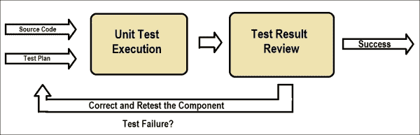
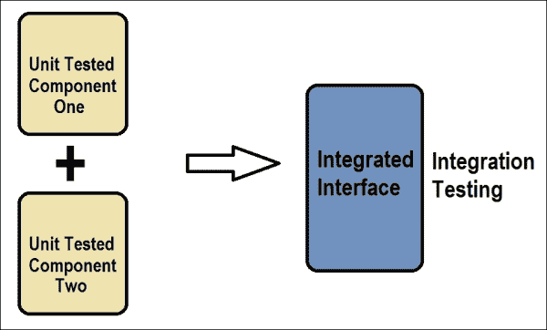
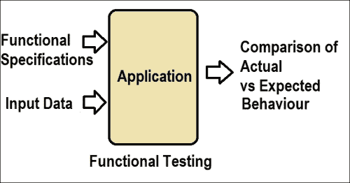

# 第九章 测试 Spring Batch

在上一章中，我们学习了通过不同的配置（即线程模型、并行处理、远程分块和分区技术）来提高批处理应用程序的性能和可扩展性的重要性，以及如何选择合适的策略来利用现有基础设施扩展批处理应用程序。Spring Batch 应用程序是通过单个组件和不同的集成进行开发和配置的，因此测试单个功能以及集成项目以验证其预期行为是很重要的。

在本章中，我们将涵盖以下主题：

+   Spring Batch 的测试类型

+   单元测试

+   集成测试

+   功能测试

# Spring Batch 的测试类型

任何软件测试的主要目的是检测软件故障并纠正它们。软件测试的范围可以从验证软件组件到验证软件功能，以及软件在各种环境和条件下的运行。

以下是我们可能希望在 Spring Batch 应用程序上执行的一些软件测试类型：

+   **单元测试**：也称为组件测试，这指的是验证特定代码片段的功能。单元测试通常由开发者编写。

+   **集成测试**：这识别了接口和集成组件之间的缺陷。由于软件组件是迭代增量地集成的，因此集成测试是大型项目中重要的测试方面。

+   **功能测试**：这验证了特定代码组件或代码组件组的功能，如特定应用程序的功能规范中定义的那样。

+   **性能测试**：这验证了整个系统是否满足从指定的环境或运行条件中期望的性能标准。

功能测试和性能测试通常在系统测试中一起进行。

# 单元测试

单元测试是由开发者执行的对组件级别的测试，开发者准备源代码和测试计划。如果单元测试失败，开发者可以修复组件的问题并再次执行单元测试。以下图展示了单元测试场景。



## JUnit

JUnit 是执行单元测试的标准 Java 框架。大多数 IDE 都内置了对 JUnit 的支持。TestNG 也可以用作 JUnit 的类似物。

JUnit 测试用例可以编写为简单的 Java 类，通过在执行测试操作的方法上使用`@Test`注解来执行。

以下是一个 JUnit 在 Java 字符串连接操作上的示例：

```java
public class MyClass {
    public String concatenate(String former, String later){
        return former + latter;
    }
}
```

测试此 Java 类的 JUnit 类可以如下所示：

```java
import org.junit.Test;
import static org.junit.Assert.*;

public class MyClassTest {

    @Test
    public void testConcatenate() {
        MyClass myclass = new MyClass();

        String output = myClass.concatenate("Spring", "Batch");

        assertEquals("SpringBatch", output);

    }
}
```

在前面的类中，带有 `@Test` 注解的 `testConcatenate` 方法验证了 `MyClass java 组件`。`assertEquals()` 方法通过比较 `MyClass.concatenate()` 方法的输出与预期输出来进行实际测试。如果比较失败，`assertEquals()` 方法将抛出异常。我们还可以编写方法，使用 `@Before` 注解在单元测试方法执行之前设置操作，并使用 `@After` 注解在单元测试操作之后清理任务。可以参考 JUnit API（[`junit.sourceforge.net/javadoc/`](http://junit.sourceforge.net/javadoc/)）获取 JUnit 类的详细列表及其用法。

## Mockito

由于我们需要执行批处理应用程序测试，每个组件都可以通过某些依赖关系访问其他组件。需要复制所有这些类来创建此类对象的实例并将其提供给正在测试的组件。Mockito 是一个开源的 Java 框架，它使我们能够轻松地创建用于测试的测试双对象（模拟对象）。

可以通过简单的 Maven 依赖关系将 Mockito 添加到应用程序中，例如以下内容：

```java
<dependency>
<groupId>org.mockito</groupId>
<artifactId>mockito-all</artifactId>
<version>1.10.8</version>
<scope>test</scope>
</dependency>
```

在批处理应用程序中，我们有一个 `EmployeeReader` 类，在测试执行期间需要创建一个对象。这可以通过在 `JUnit` 测试类中使用 `Mockito` 来完成，如下所示：

```java
import static org.mockito.Matchers.any;
import static org.mockito.Matchers.eq;
import static org.mockito.Mockito.mock;
import static org.mockito.Mockito.times;
import static org.mockito.Mockito.verify;
import static org.mockito.Mockito.when;

import org.junit.Before;
import org.junit.Test;

public class EmployeeReaderUnitTest {
  EmployeeReader empReaderMock;

  @Before
  public void setUp() {
  empReaderMock = mock(EmployeeReader.class);
  }

  @Test
  public void testEmpReader()throws Exception {
  ...
  }
}
```

在前面的代码片段中，我们使用 JUnit 的 `@Before`（设置）方法中的 `Mockito` 的 `mock()` 方法创建了 `EmployeeReader` 对象。我们将在 `@Test` 方法中使用此对象来验证组件的功能。

同样，任何 Spring Batch 组件，如监听器和验证器，都必须进行单元测试以验证其功能。

# 集成测试

集成测试以迭代增量方式将软件组件集成时识别缺陷。集成测试是大型项目中的重要测试方面。

单元测试的模块被分组到更大的聚合中，根据集成测试计划进行测试，然后测试的应用程序作为功能测试的系统准备进行下一级测试。



以下是在 Spring Batch 中执行组件测试的两种方法。

## 基于监听器的方法

以下类级别的注解有助于测试 Spring Batch 组件：

+   `@RunWith`(`SpringJUnit4ClassRunner.class`): 这个注解表示该类应使用 Spring 对 JUnit 服务的支持。

+   `@ContextConfiguration`: 这让程序了解包含应用程序上下文的配置属性。

+   `@TestExecutionListeners`: 这有助于配置监听器以帮助测试执行设置依赖注入和步骤范围测试执行等能力。

以下是一个使用这些注解的示例配置：

```java
@ContextConfiguration(locations = { "/app-context.xml" })
@TestExecutionListeners({ DependencyInjectionTestExecutionListener.class,
StepScopeTestExecutionListener.class })
@RunWith(SpringJUnit4ClassRunner.class)
public class CarFileReaderIntegrationTest {
...
}
```

## 步骤范围测试工具方法

`StepScopeTestUtils` 实用工具类用于在单元测试中创建和操作 `StepScope`。这有助于使用 Spring 测试支持并将依赖项注入到应用程序上下文中作为步骤范围的测试用例。

```java
@Test
public void testEmployeeReader() throws Exception {
  StepExecution execution = getStepExecution();
  int empReads = 
  StepScopeTestUtils.doInStepScope(stepExecution, new 
  Callable<Integer>() {
  @Override
  public int call() throws Exception {
  ((ItemStream) employeeReader).open(new ExecutionContext());
  int count = 0;
  while(employeeReader.read() != null) {
    count++;
    }
  return count;
  }
  });
  assertEquals(empReads, 10);
}
```

`StepScopeTestUtils` 的 `doInStepScope()` 方法接受 `stepExecution` 和可调用实现；它自动进行运行时依赖注入并返回结果。其余的测试是使用 JUnit 的 `assertEquals()` 方法验证 `empReads` 的数量与预期数量。

# 功能测试

功能测试验证特定代码组件或一组代码组件的功能，正如特定应用程序的功能规范中定义的那样，为组件提供输入数据，并将输出行为与预期行为进行比较。功能测试是“黑盒”测试，因为我们只处理特定输入的预期输出，只涉及外部系统行为。



在 Spring Batch 应用程序中，整个作业被视为执行单元，并且可以使用 `JobLauncherTestUtils`（一个用于测试 Spring Batch 作业的实用工具类）来测试其功能。`JobLauncherTestUtils` 提供了启动整个 `AbstractJob` 的方法，允许对单个步骤进行端到端测试，而无需运行作业中的每个步骤。`JobLauncherTestUtils` 还提供了从 `FlowJob` 或 `SimpleJob` 运行步骤的能力。通过在作业中单独启动步骤，可以执行单个步骤的端到端测试，而无需运行作业中的每个步骤。

以下代码片段是使用 `JobLauncherTestUtils` 来执行作业和步骤启动的示例：

```java
@Before
public void setup() {
jobLaunchParameters = new JobParametersBuilder().addString("employeeData", EMPFILE_LOCATION)
.addString("resultsData", "file:/" + RESULTFILE_LOCATION)
.toJobParameters();
}

@Test
public void testEmployeeJob() throws Exception {
JobExecution execution = jobLauncherTestUtils.launchJob(jobLaunchParameters);
assertEquals(ExitStatus.COMPLETED, execution.getExitStatus());
StepExecution stepExecution =
execution.getStepExecutions().iterator().next();
assertEquals(ExitStatus.COMPLETED, stepExecution.getExitStatus());  
}
```

在前面的代码中，借助 `JobLauncherTestUtils`，我们能够通过 JUnit `@Test` 方法的一部分简单 API 启动批处理作业，以及特定的步骤。`@Before`（设置）方法使用要处理的输入 `employeeData` 文件详情和要存储的输出结果文件位置来准备 `JobLaunchParameters`。

# 摘要

通过本章，我们学习了软件测试的重要性以及我们可能希望在 Spring Batch 应用程序上执行的各种软件测试类型。我们还了解了不同的开源框架，例如 JUnit 和 Mockito，用于对 Spring Batch 组件进行单元测试。我们以对 Spring 支持的理解结束本章，包括执行 Spring Batch 应用程序的单元测试、集成测试和功能测试的 API。

在附录部分，我们详细讨论了设置开发环境、项目配置和 Spring Batch 管理员。
