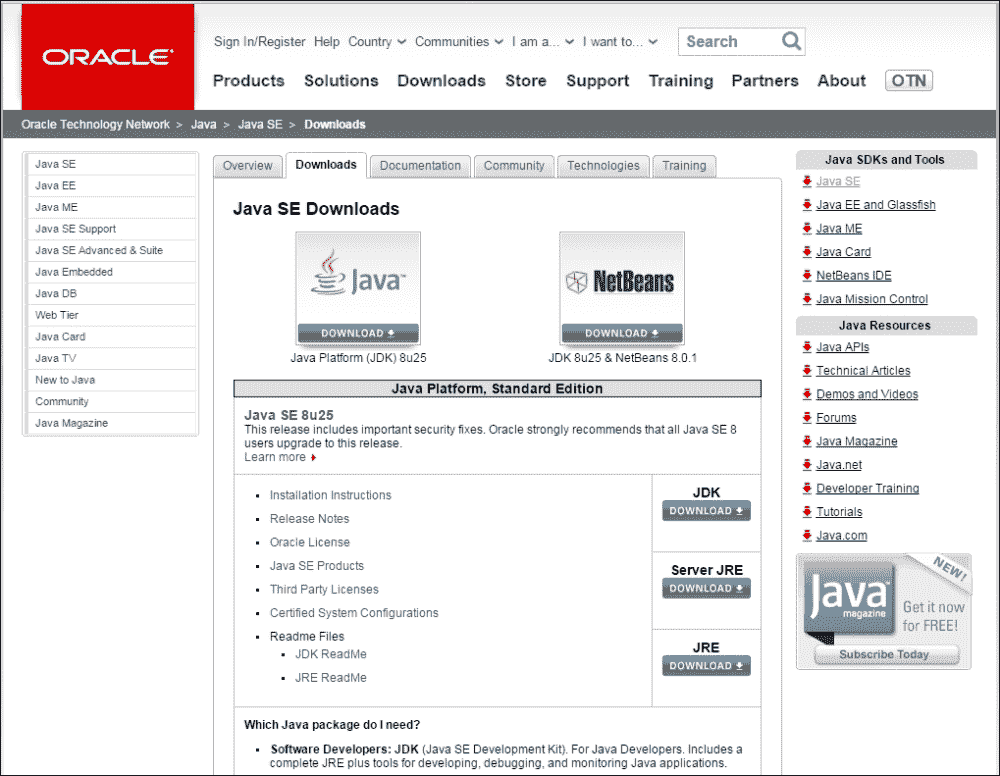
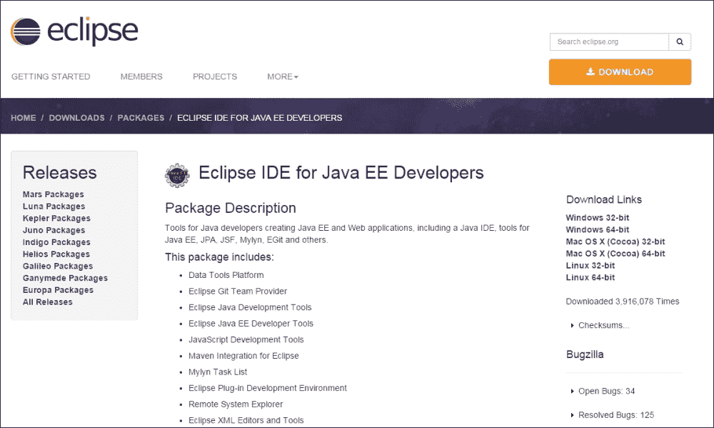
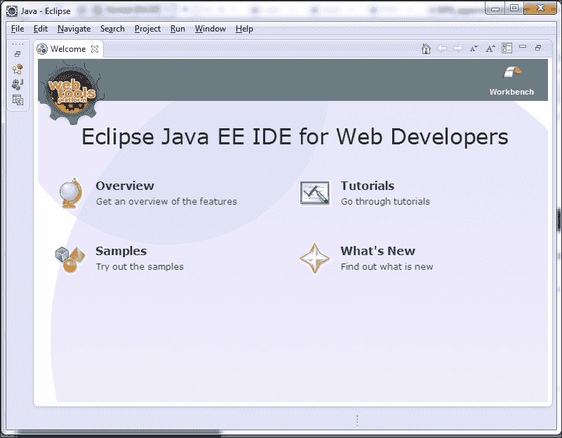
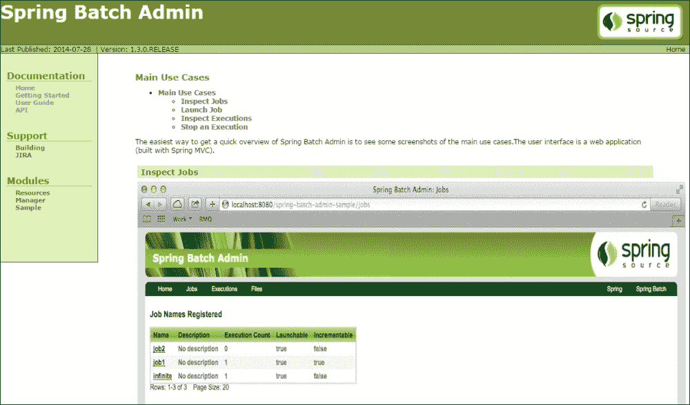

# 附录 A. 附录

在上一章中，我们学习了软件测试的重要性，以及使用 JUnit、Mockito 等框架在 Spring 批量应用程序上执行软件测试的类型。Spring 批量项目开发设置需要一个包含 Java 和 IDE（Eclipse）的系统，并且需要设置一个带有依赖项配置的项目。此外，Spring 批量管理也是理解的一个重要方面。

在本节中，我们将涵盖以下主题：

+   设置 Java

+   设置 Eclipse IDE

+   设置项目和其依赖项

+   Spring 批量管理

# 设置 Java

**Java** **软件开发工具包**（**JDK**）是由 Oracle 发布的应用平台，旨在为使用 Solaris、Linux、Mac OS X 或 Windows 的 Java 开发者提供支持。JDK 可从 Oracle 网络下载（[`www.oracle.com/technetwork/java/javase/downloads/index.html`](http://www.oracle.com/technetwork/java/javase/downloads/index.html)）。

它可以使用同一页面上提供的安装说明进行安装。

# 设置 Eclipse IDE

Eclipse 是最突出的 **集成** **开发环境**（**IDE**）之一，具有基础工作区以用于项目开发，以及可扩展的插件以进行自定义。IntelliJ IDEA 和 NetBeans 是其他一些突出的 IDE。我们选择 Eclipse IDE 作为 Java EE 开发者的首选，通过 [`www.eclipse.org/downloads/packages/eclipse-ide-java-ee-developers/keplersr2`](https://www.eclipse.org/downloads/packages/eclipse-ide-java-ee-developers/keplersr2)。

通常，Eclipse IDE 会下载压缩版本，并可以解压以获取 `eclipse` 文件夹。在 `eclipse` 目录下，我们可以观察到可执行的 eclipse 程序（`eclipse.exe`），如图所示，确保 Java 开发工具包已安装在机器上，并且可在系统路径上使用。

# 设置项目和其依赖项

如 [`www.eclipse.org/m2e/`](https://www.eclipse.org/m2e/) 指令中所述，需要将 Maven 软件集成到 Eclipse IDE 中，并且如 第一章 中 *作业设计和执行* 部分所述，带有 Maven 依赖项的 Java 项目可以管理 Spring 批量作业所需的依赖项。

# Spring 批量管理

管理任务包括启动和停止流程作业，以及监控作业执行的性能统计信息。Spring 提供了带有管理项目的 Spring Batch，以拥有一个基于 Web 的控制工具，即 Spring Batch Admin 项目。Spring Batch Admin 是一个易于部署的项目，拥有非常好的文档。Spring Batch Admin 项目的文档可在[`docs.spring.io/spring-batch-admin/getting-started.html`](http://docs.spring.io/spring-batch-admin/getting-started.html)找到。

通过本附录，我们介绍了如何设置 Java，如何设置 Eclipse IDE，如何设置带有依赖项的项目，以及如何在 Spring Batch Administration 的帮助下管理批处理应用程序。

这总结了为 Spring Batch 作业应用开发需要学习的核心概念。
