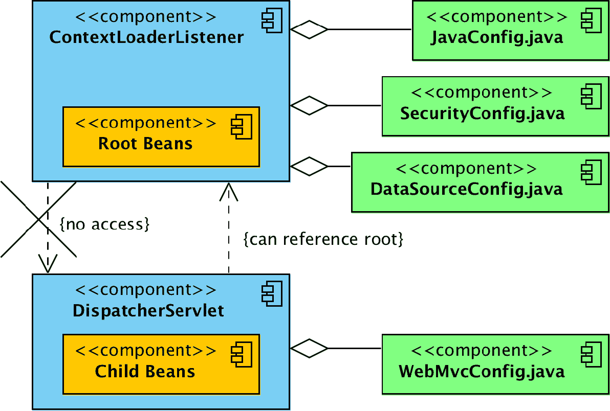
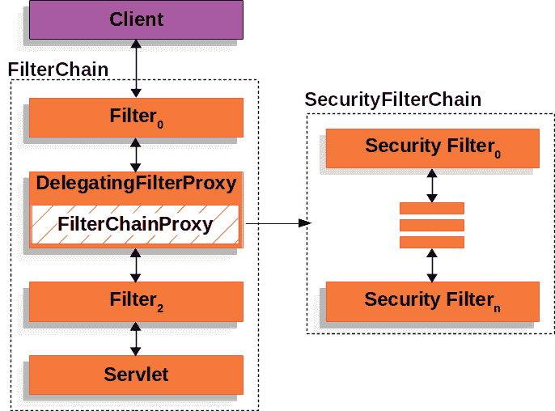
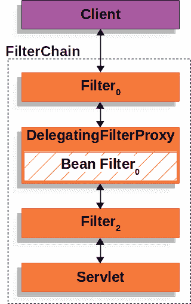
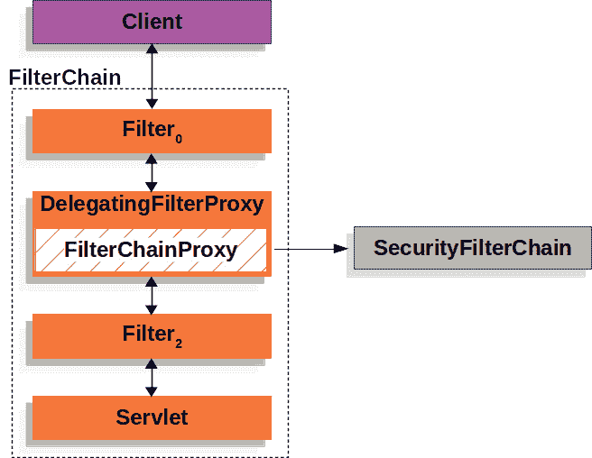
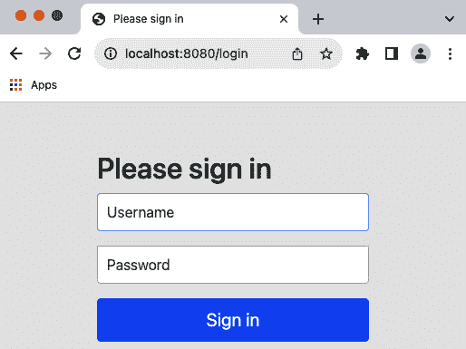
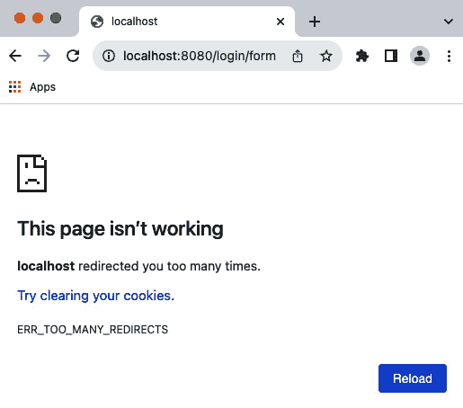
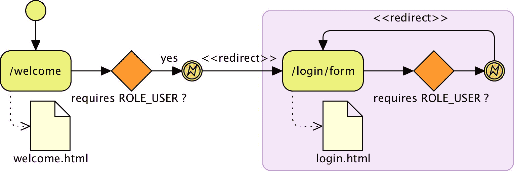

# Spring Security 入门

在本章中，我们将应用最小的 Spring Security 配置来开始解决我们的第一个发现——由于缺乏 URL 保护和一般认证，导致意外权限提升，这是在*第一章*，“不安全应用程序的解剖”中讨论的安全审计。然后，我们将在此基础上构建基本配置，为我们的用户提供定制体验。本章旨在让您开始使用 Spring Security，并为任何其他您需要执行的安全相关任务提供基础。

在本章的讨论过程中，我们将涵盖以下主题：

+   在**JBCP 日历**应用程序上实现基本的安全级别，使用 Spring Security 中的自动配置选项

+   学习如何自定义登录和注销体验

+   配置 Spring Security 以根据 URL 限制不同的访问

+   利用基于表达式的 Spring Security 访问控制

+   使用**JavaServer Pages**（**JSP**）库在 Spring Security 中条件性地显示有关登录用户的基本信息

+   根据用户的角色确定登录后的默认位置

在本书的每一章中，您都会被指导从一个指定的项目`chapterX.00-calendar`开始探索，其中`X`表示章节编号。在本章中，重点是使用 Spring 框架中基于 Spring Security 的应用程序，不包括使用 Spring Boot。

主要目标是帮助读者熟悉 Spring Framework 环境下 Spring Security 的集成。

从*第三章*，“自定义认证”开始，本书将重点深入探讨 Spring Security，特别是与 Spring Boot 框架结合使用。

本章的代码操作链接在此：[`packt.link/fZ96T`](https://packt.link/fZ96T)。

# Spring Security 你好

虽然 Spring Security 的配置可能非常困难，但产品的创造者已经深思熟虑，并为我们提供了一个非常简单的机制，通过这个机制，我们可以使用强大的基线启用软件的大部分功能。从这个基线开始，额外的配置将允许对应用程序的安全行为进行精细的控制。

我们将从*第一章*，“不安全应用程序的解剖”，我们的未加密日历应用程序开始，将其转变为一个使用基本的用户名和密码认证的受保护网站。这种认证仅仅是为了说明启用 Spring Security 为我们网络应用程序所涉及的步骤；你会发现这种方法存在一些明显的缺陷，这将引导我们进行进一步的配置优化。

## 导入示例应用程序

我们鼓励您将`chapter02.00-calendar`项目导入到您的**集成开发环境**（**IDEs**）中，并按照本章节中描述的从本章获取源代码，正如在*附录*的*使用 JBCP 日历示例代码入门*部分所述，*附加参考材料*。

对于每一章，您将找到多个代码修订版本，这些修订版本代表了书中的检查点。这使得您在前进过程中轻松地将您的工作与正确答案进行比较。在每一章的开始，我们将导入该章节的第一个修订版本作为起点。例如，在本章中，我们从`chapter02.00-calendar`开始，第一个检查点将是`chapter02.01-calendar`。在*第三章*的*自定义身份验证*中，我们将从`chapter03.00-calendar`开始，第一个检查点将是`chapter03.01-calendar`。在*附录*的*附加参考材料*部分的*使用 JBCP 日历示例代码入门*部分有更多详细信息，请务必查阅。

## 更新依赖项

第一步是更新项目的依赖项，包括必要的 Spring Security JAR 文件。更新之前导入的示例应用程序中的`build.gradle` Gradle 文件，以包含我们在接下来的几节中将要使用的 Spring Security JAR 文件。

重要提示

在整本书中，我们将演示如何使用 Gradle 提供所需的依赖项。`build.gradle`文件位于项目的根目录中，代表构建项目所需的所有内容（包括项目的依赖项）。请记住，Gradle 将为每个列出的依赖项下载传递依赖项。因此，如果您使用其他机制来管理依赖项，请确保您也包括传递依赖项。在手动管理依赖项时，了解 Spring Security 参考中包含其传递依赖项的列表是有用的。Spring Security 参考的链接可以在*附录*的*附加参考材料*部分的*补充材料*部分找到。

让我们看一下以下代码片段：

```java
// build.gradle
dependencies {
    implementation 'org.springframework.security:spring-security-config'
    implementation 'org.springframework.security:spring-security-web'
    ...
}
```

此代码为 Spring Framework 项目中的基本 Spring Security 功能提供了必要的依赖项。然而，根据您的具体需求，您可能需要添加额外的配置，我们将在接下来的章节中探讨。

### 使用 Spring 6 和 Spring Security 6

Spring 6 被一致使用。我们的示例应用程序提供了一个前一个选项的例子，这意味着您不需要做额外的工作。

在以下代码中，我们展示了添加到 `build.gradle` Gradle 文件中的示例片段，以利用 Gradle 的依赖项管理功能；这确保了在整个应用程序中使用正确的 Spring 版本。我们将利用 Spring **物料清单**（**BOM**）依赖项，这将确保所有由 BOM 导入的依赖项版本都能正确地一起工作：

```java
// build.gradle
dependencyManagement {
    imports {
       mavenBom 'org.springframework:spring-framework-bom:6.1.4'
       mavenBom 'org.springframework.security:spring-security-bom:6.2.2'
    }
}
dependencies {
    ...
}
```

重要提示

如果你正在使用 IntelliJ IDEA，每次更新 `build.gradle` 文件时，请确保你右键单击项目，导航到 **Gradle** | **重新加载 Gradle 项目…**，然后选择 **确定** 以更新所有依赖项。

有关 Gradle 如何处理传递依赖项以及 BOM 的更多信息，请参阅 *补充材料* 部分的 Gradle 文档，该文档列在 *附录* 的 *附加* *参考资料* 中。

## 实现 Spring Security 配置

配置过程的下一步是创建一个 Java 配置文件，代表所有需要覆盖标准 Web 请求的 Spring Security 组件。

在 `src/main/java/com/packtpub/springsecurity/configuration/` 目录下创建一个新的 Java 文件，文件名为 `SecurityConfig.java`，并包含以下内容。该文件展示了我们应用程序中每个页面的用户登录要求，提供了一个登录页面，验证了用户，并要求登录用户与名为 `USER` 的角色相关联，以覆盖每个 URL 元素：

```java
//src/main/java/com/packtpub/springsecurity/configuration/ SecurityConfig.java
@Configuration
@EnableWebSecurity
public class SecurityConfig {
    @Bean
    public InMemoryUserDetailsManager userDetailsService() {
        UserDetails user = User.withDefaultPasswordEncoder()
                .username("user1@example.com")
                .password("user1")
                .roles("USER")
                .build();
        return new InMemoryUserDetailsManager(user);
    }
    @Bean
    public SecurityFilterChain filterChain(HttpSecurity http) throws Exception {
        http
                .authorizeHttpRequests( authz -> authz
                    .requestMatchers("/**").hasRole("USER")
                    .anyRequest().authenticated()
                )
                .formLogin(withDefaults())
                .csrf(AbstractHttpConfigurer::disable);
        // For H2 Console
        http.headers(headers -> headers.frameOptions(FrameOptionsConfig::disable));
        return http.build();
    }
}
```

重要提示

如果你正在使用 IntelliJ IDEA，你可以通过按 *F3* 键轻松地审查 `SecurityFilterChain`。请记住，下一个检查点（`chapter02.01-calendar`）有一个工作解决方案，因此文件也可以从那里复制。

这是获取我们的 Web 应用程序以最小标准配置安全所需的唯一 Spring Security 配置。这种使用特定于 Spring-security 的 Java 配置的配置风格被称为 **Java 配置**。

让我们花一分钟时间分解这个配置，以便我们可以获得一个高级的概念了解正在发生的事情。在 `filterChain (HttpSecurity)` 方法中，`HttpSecurity` 对象创建了一个 `Servlet Filter`，这确保了当前登录的用户与适当的角色相关联。在这个例子中，过滤器将确保用户与 `ROLE_USER` 相关联。重要的是要理解角色的名称是任意的。稍后，我们将创建一个具有 `ROLE_ADMIN` 的用户，并允许这个用户访问当前用户无法访问的额外 URL。

在 `userDetailsService ()` 方法中，`InMemoryUserDetailsManager` 对象是 Spring Security 验证用户的方式。在这个例子中，我们使用内存数据存储来比较用户名和密码。

我们的示例和解释所描述的情况有些牵强。在生产环境中，内存中的身份验证存储不会工作。然而，它使我们能够快速启动和运行。随着我们更新应用程序以使用整个书籍中的生产质量安全，我们将逐步提高我们对 Spring Security 的理解。

重要提示

在 Spring 3.1 中，Spring 框架增加了对 **Java 配置** 的一般支持。自 Spring Security 3.2 版本发布以来，已经提供了 Spring Security Java 配置支持，使用户能够轻松配置 Spring Security 而不使用任何 XML。如果您熟悉 *第六章* *LDAP 目录服务* 和 Spring Security 文档，那么您应该会发现它与 Security **Java** **配置** 支持之间有许多相似之处。

## 更新您的 Web 配置

下一步涉及对 `WebAppInitializer.java` 文件的一系列更新。由于应用程序已经使用 **Spring MVC**，因此其中一些步骤已经执行。然而，我们将回顾这些要求，以确保更基本的 Spring 要求得到理解，如果您在未启用 Spring 的应用程序中使用 Spring Security。

### ContextLoaderListener 类

更新 `WebAppInitializer.java` 文件的第一个步骤是使用 `jakarta.servlet.ServletContainerInitializer`，这是 Servlet 4.0+ 初始化的首选方法。Spring MVC 提供了 `o.s.w.WebApplicationInitializer` 接口，该接口利用了这一机制。在 Spring MVC 中，首选的方法是扩展 `o.s.w.servlet.support.AbstractAnnotationConfigDispatcherServletInitializer`。`WebApplicationInitializer` 类是多态的 `o.s.w.context.AbstractContext` **LoaderInitializer**，它使用抽象的 `createRootApplicationContext()` 方法创建一个根 `ApplicationContext`，然后将其委托给注册在 `ServletContext` 实例中的 `ContextLoaderListener`，如下面的代码片段所示：

```java
//src/main/java/com/packtpub/springsecurity/configuration/JavaConfig.java
@Configuration
@Import({ SecurityConfig.class, DataSourceConfig.class })
@ComponentScan(basePackages =
        {
                «com.packtpub.springsecurity.configuration»,
                «com.packtpub.springsecurity.dataaccess»,
                «com.packtpub.springsecurity.domain»,
                «com.packtpub.springsecurity.service»
        }
)
public class JavaConfig {}
```

更新的配置现在将从 `WAR` 文件的 `classpath` 中加载 `the SecurityConfig.class`。

### ContextLoaderListener 与 DispatcherServlet 的比较

`o.s.web.servlet.DispatcherServlet` 接口指定了使用 `getServletConfigClasses()` 方法独立加载的配置类：

```java
//src/main/java/com/packtpub/springsecurity/web/configuration/WebAppInitializer
public class WebAppInitializer extends AbstractAnnotationConfigDispatcherServletInitializer {
    @Override
    protected Class<?>[] getRootConfigClasses() {
        return null;
    }
    @Override
    protected Class<?>[] getServletConfigClasses() {
        return new Class[] { JavaConfig.class, WebMvcConfig.class };
    }
...
```

`DispatcherServlet` 类在 Spring 框架内生成一个 `o.s.context.ApplicationContext`，作为根 `ApplicationContext` 接口的一个子接口。

通常，特定于 Spring MVC 的组件在 `DispatcherServlet` 的 `ApplicationContext` 接口中初始化。

另一方面，其余组件通过 `ContextLoaderListener` 加载。

理解这一点至关重要，即子`ApplicationContext`中的 Bean，如由`DispatcherServlet`生成的 Bean，可以引用由`ContextLoaderListener`建立的父`ApplicationContext`中的 Bean。

然而，父`ApplicationContext`接口不能引用子`ApplicationContext`中的 Bean。

这在下图中得到了说明，其中**子 Bean**可以引用**根 Bean**，但**根 Bean**不能引用**子 Bean**：



图 2.1 – ContextLoaderListener 和 DispatcherServlet 的关系

与大多数 Spring Security 的使用案例一样，我们不需要 Spring Security 引用任何由 MVC 声明的 Bean。因此，我们决定让`ContextLoaderListener`初始化所有 Spring Security 的配置。

### springSecurityFilterChain 过滤器

下一步是配置`springSecurityFilterChain`以通过创建`AbstractSecurityWebApplicationInitializer`的实现来拦截所有请求。确保在调用任何其他逻辑之前请求被安全处理是至关重要的。

下图显示了`SecurityFilterChain`的作用：



图 2.2 – SecurityFilterChain 的角色

为了确保`springSecurityFilterChain`首先加载，我们可以使用`@Order(1)`，如下面的配置所示：

```java
//src/main/java/com/packtpub/springsecurity/web/configuration/SecurityWebAppInitializer
@Order(1)
public class SecurityWebAppInitializer
        extends AbstractSecurityWebApplicationInitializer {
    public SecurityWebAppInitializer() {
        super();
    }
}
```

`SecurityWebAppInitializer`类将自动为应用程序中的每个 URL 注册`springSecurityFilterChain`过滤器，并将添加`ContextLoaderListener`，该监听器加载`SecurityConfig`。

### DelegatingFilterProxy 类

`o.s.web.filter.DelegatingFilterProxy`类是由 Spring Web 提供的`Servlet Filter`，它将所有工作委托给`ApplicationContext`根中的一个 Spring Bean，该 Bean 必须实现`jakarta.servlet.Filter`接口。由于默认情况下，Bean 是通过名称查找的，使用`<filter-name>`值，我们必须确保我们使用`springSecurityFilterChain`作为`<filter-name>`的值。

下面是`DelegatingFilterProxy`如何适应`Filter`实例和`FilterChain`的示意图。



图 2.3 – DelegatingFilterProxy 的角色

`o.s.web.filter.DelegatingFilterProxy`如何为我们的`web.xml`文件工作，其伪代码可以在以下代码片段中找到：

```java
// DelegatingFilterProxy Pseudo Code
public void doFilter(ServletRequest request, ServletResponse response, FilterChain chain) {
    Filter delegate = getFilterBean(someBeanName);
    delegate.doFilter(request, response);
}
```

这段代码展示了 Spring Security `DelegatingFilterProxy`在基于**Servlet**的应用程序中的交互。

### FilterChainProxy 类

当与 Spring Security 一起工作时，`o.s.web.filter.DelegatingFilterProxy`将委托给 Spring Security 的`o.s.s.web.FilterChainProxy`接口。`FilterChainProxy`类允许 Spring Security 有条件地将任意数量的`Servlet Filters`应用到`Servlet 请求`上。我们将在本书的其余部分学习每个 Spring Security 过滤器及其在确保我们的应用程序得到适当保护中的作用。

下面的图示显示了`FilterChainProxy`的作用：



图 2.4 – DelegatingFilterProxy 的作用

`FilterChainProxy`的工作伪代码如下：

```java
public class FilterChainProxy implements Filter { void doFilter(request, response, filterChain) {
// lookup all the Filters for this request
    List<Filter> delegates =   lookupDelegates(request,response)
// invoke each filter unless the delegate decided to stop
    for delegate in delegates { if continue processing
        delegate.doFilter(request,response,filterChain)
    }
// if all the filters decide it is ok allow the
// rest of the application to run if continue processing
    filterChain.doFilter(request,response) }
}
```

重要提示

由于`DelegatingFilterProxy`和`FilterChainProxy`在 Web 应用程序中使用时都是 Spring Security 的前门，所以在尝试找出发生了什么时，你会添加一个调试点。

## 运行受保护的应用程序

如果你还没有这样做，请重新启动应用程序并访问`http://localhost:8080/`。你将看到以下屏幕：



图 2.5 – 登录页面

干得好！我们已经在应用程序中使用了 Spring Security 实现了基本的安全层。到现在为止，你应该能够使用`user1@example.com`作为`user1`的**密码**登录。你会看到日历欢迎页面，它从高层次上描述了从应用程序中可以期待的安全功能。

重要提示

你的代码现在应该看起来像`chapter02.01-calendar`。

## 常见问题

许多用户在应用程序中 Spring Security 的初始实现上遇到了麻烦。以下是一些常见问题和建议。我们希望确保你可以运行示例应用程序并跟随操作：

+   在将 Spring Security 应用到应用程序之前，请确保你可以构建和部署应用程序。

+   如果需要，请查看你的 servlet 容器的入门示例和文档。

+   通常，使用 IDE，如 IntelliJ IDEA，来运行你的 servlet 容器是最容易的。不仅部署通常是无缝的，而且控制台日志也便于查看错误。你还可以在关键位置设置断点，以便在异常触发时更好地诊断错误。

+   确保你使用的 Spring 和 Spring Security 版本匹配，并且应用程序中没有遗留任何意外的 Spring JAR 文件。如前所述，当使用 Gradle 时，在依赖管理部分声明 Spring 依赖项是一个好主意。

在本节中，我们建立了一个 Hello Spring Security 应用程序。我们通过导入示例应用程序、更新依赖项、配置 Spring Security、管理 Web 配置以及最终解决可能出现的常见问题来启动这个过程。

在接下来的部分中，我们将深入探讨登录后的用户体验定制。

# 一点点的润色

在这个点上停下来，思考我们刚刚构建的内容。你可能已经注意到了一些明显的问题，这些问题需要我们在应用程序准备好投入生产之前做一些额外的工作，并了解 Spring Security 产品。尝试列出你认为在安全实现准备在公共网站推出之前所需的更改列表。

应用 Hello World Spring Security 实现非常快，并为我们提供了一个登录页面、基于用户名和密码的认证，以及自动拦截我们的日历应用程序中的 URL。然而，自动配置设置提供的内容和我们的最终目标之间存在差距，如下列所示：

+   虽然登录页面很有帮助，但它完全是一般性的，看起来不像我们的 JBCP 日历应用程序的其他部分。我们应该添加一个与我们的应用程序外观和感觉集成的登录表单。

+   用户没有明显的注销方式。我们锁定了应用程序中的所有页面，包括`Welcome`页面，潜在的浏览者可能希望匿名浏览。我们需要重新定义角色以适应匿名用户、认证用户和管理员用户。

+   我们没有显示任何上下文信息来告知用户他们已经认证。显示一个类似于“欢迎`user1@example.com`”的问候语会很好。

+   我们不得不在`SecurityConfig`配置文件中硬编码用户的用户名、密码和角色信息。回想一下我们添加的`userDetailsService()`方法的这一部分：

```java
User.withDefaultPasswordEncoder()
        .username("user1@example.com")
        .password("user1")
        .roles("USER")
        .build();
```

+   你可以看到用户名和密码就在文件中。我们不太可能希望为系统中的每个用户都在文件中添加一个新的声明！为了解决这个问题，我们需要使用另一种类型的身份验证来更新配置。

我们将在本书的前半部分探索不同的认证选项。

## 自定义登录

我们已经看到了 Spring Security 如何使开始变得非常容易。现在，让我们看看我们如何可以自定义登录体验。在下面的代码片段中，我们展示了自定义登录的一些更常见方式的用法，但我们鼓励你参考 Spring Security 的参考文档，其中包括*附录*，*附加参考资料*，其中包含了所有支持的属性。

让我们看看以下步骤来自定义登录：

1.  首先，按照以下方式更新你的`SecurityConfig.java`文件：

    ```java
    //src/main/java/com/packtpub/springsecurity/configuration/SecurityConfig.java
    ...
    http
            .authorizeHttpRequests( authz -> authz
                    .requestMatchers("/**")
                    .hasRole("USER")
            )
            .formLogin(form -> form
                    .loginPage("/login/form")
                    .loginProcessingUrl("/login")
                    .failureUrl("/login/form?error")
                    .usernameParameter("username")
                    .passwordParameter("password")
    ....
    ```

    让我们看看以下代码片段中描述的以下方法：

    +   `loginPage()`方法指定了当访问受保护的页面且用户未认证时，Spring Security 将重定向浏览器到的位置。如果没有指定登录页面，Spring Security 将重定向用户到`/spring_security_login`。然后，`o.s.s.web.filter.FilterChainProxy`将选择`o.s.s.web.authentication.ui.DefaultLoginPageGeneratingFilter`，作为代表之一渲染默认登录页面，因为`DefaultLoginPageGeneratingFilter`默认配置为处理`/spring_security_login`。由于我们选择覆盖默认 URL，当请求`/login/form` URL 时，我们将负责渲染登录页面。

    +   `loginProcessingUrl()`方法默认为`/j_spring_security_check`，并指定登录表单（应包括用户名和密码）应通过 HTTP post 提交到的 URL。当 Spring Security 处理此请求时，它将尝试验证用户。

    +   `failureUrl()`方法指定了 Spring Security 在将无效的用户名和密码提交到`loginProcessingUrl()`时将重定向到的页面。

    +   `usernameParameter()`和`passwordParameter()`方法默认为`j_username`和`j_password`，并指定 Spring Security 在处理`loginProcessingUrl()`方法时将使用的 HTTP 参数。

重要提示

虽然可能很明显，但如果我们只想添加自定义登录页面，我们只需要指定`loginPage()`方法。然后，我们将使用剩余属性的默认值创建我们的登录表单。然而，通常一个好的做法是覆盖任何用户可见的值，以防止暴露我们正在使用 Spring Security。透露我们使用的框架是一种信息泄露，这使得攻击者更容易确定我们安全中的潜在漏洞。

1.  下一步是创建登录页面。我们可以使用任何我们想要的技術来渲染登录页面，只要登录表单在提交时产生我们使用 Spring Security 配置指定的 HTTP 请求。通过确保 HTTP 请求符合我们的配置，Spring Security 可以为我们验证请求。创建`login.xhtml`文件，如下面的代码片段所示：

    ```java
    //src/main/webapp/WEB-INF/tempates/login.xhtml
    <div class="alert alert-danger" th:if="${param.error != null}">
        <strong>Failed to login.</strong>
        <span th:if="${session[SPRING_SECURITY_LAST_EXCEPTION] != null}">
            <span th:text="${session[SPRING_SECURITY_LAST_EXCEPTION].message}">Invalid credentials</span>
        </span>
    </div>
    <div class="alert alert-success" th:if="${param.logout != null}">
        You have been logged out.
    </div>
    <fieldset>
        <legend>Login Form</legend>
        <div class="mb-3">
            <label class="form-label" for="username">Username</label>
            <input autofocus="autofocus" class="form-control" id="username"
                   name="username"
                   type="text"/>
        </div>
        <div class="mb-3">
            <label class="form-label" for="password">Password</label>
            <input class="form-control" id="password" name="password"
                   type="password"/>
        </div>
        <div class="mb-3">
            <input class="btn btn-primary" id="submit" name="submit" type="submit"
                   value="Login"/>
        </div>
    ```

重要提示

记住，如果你在书中输入任何内容时遇到问题，你可以参考下一个检查点（`chapter02.02- calendar`）中的解决方案。

在前面的`login.xhtml`文件中，以下数量的事项值得突出：

+   表单操作应该设置为`/login`，以匹配我们指定的`loginProcessingUrl()`方法的值。出于安全考虑，Spring Security 默认只尝试在`POST`请求时进行身份验证。

+   我们可以使用`param.error`来查看登录过程中是否出现了问题，因为我们的`failureUrl()`方法返回的值`/login/form?error`包含了`HTTP`参数错误。

+   会话属性 `SPRING_SECURITY_LAST_EXCEPTION` 包含最后一个 `o.s.s.core.AuthenticationException` 异常，该异常可以用来显示登录失败的原因。可以通过利用 Spring 的国际化支持来自定义错误消息。

+   `username` 和 `password` 输入的输入名称被选择与我们为 `usernameParameter()` 和 `passwordParameter()` 方法在 `SecurityConfig.java` 配置中指定的值相对应。

3. 最后一步是让 Spring MVC 知道我们新的 URL。这可以通过向 `WebMvcConfig` 添加以下方法来完成：

```java
//src/main/java/com/packtpub/springsecurity/web/configuration/WebMvcConfig.java
@Configuration
@EnableWebMvc
public class WebMvcConfig implements WebMvcConfigurer {
...
    @Override
    public void addViewControllers(final ViewControllerRegistry registry) {
        registry.addViewController("/login/form")
              .setViewName("login");
    }
...
}
```

此代码添加了自定义的 `login.xhtml` 登录页面和相关控制器请求映射 URL：`/login/form`。

### 配置注销

Spring Security 的 `HttpSecurity` 配置自动添加了对用户注销的支持。所需做的只是创建一个指向 `/j_spring_security_logout` 的链接。然而，我们将通过以下步骤演示如何通过以下步骤自定义用于注销用户的 URL：

1.  按照以下方式更新 Spring Security 配置：

    ```java
    //src/main/java/com/packtpub/springsecurity/configuration/ SecurityConfig.java
    http
            .authorizeHttpRequests( authz -> authz
                  .requestMatchers("/**")
                  .hasRole("USER")
            )
    ...
            ).logout(form -> form
                  .logoutUrl("/logout")
                  .logoutSuccessUrl("/login?logout")
            )
    ....
    ```

1.  您必须提供一个链接，用户点击后可以注销。我们将更新 `header.xhtml` 文件，以便 `注销` 链接出现在每个页面上：

    ```java
    //src/main/webapp/WEB-INF/templates/fragments/header.xhtml
    <div id="navbar" ...>
           ...
        <ul class="nav navbar-nav pull-right">
            <li><a id="navLogoutLink" th:href="@{/logout}"> Logout</a></li>
        </ul>
           ...
    </div>
    ```

1.  最后一步是更新 `login.xhtml` 文件，以便在存在 `logout` 参数时显示注销成功的消息：

    ```java
    //src/main/webapp/WEB-INF/templates/login.xhtml
    <div th:if="${param.logout != null}" class="alert alert-success"> You have been logged out.</div>
    <label for="username">Username</label>
           ...
    ```

重要提示

您的代码现在应该看起来像 `chapter02.02-calendar`。

### 页面没有正确重定向

如果您还没有这样做，请重新启动应用程序并访问 `http://localhost:8080`；您将看到一个错误，如下面的截图所示：



图 2.6 – 页面未正确重定向

发生了什么问题？问题是，由于 Spring Security 不再渲染登录页面，我们必须允许每个人（而不仅仅是 `USER` 角色访问 **登录** 页面）。如果不授予对 **登录** 页面的访问权限，就会发生以下情况：

1.  我们在浏览器中请求 **欢迎** 页面。

1.  Spring Security 检测到 `USER` 角色并且我们没有认证，因此它将浏览器重定向到 **登录** 页面。

1.  浏览器请求 **登录** 页面。

1.  Spring Security 检测到 `USER` 角色并且我们尚未认证，因此它再次将浏览器重定向到 **登录** 页面。

1.  浏览器再次请求 **登录** 页面。

1.  Spring Security 检测到 `USER` 角色如下所示：



图 2.7 – 使用 Spring Security 的登录过程

该过程可能会无限期地重复。幸运的是，对于 Firefox 来说，它意识到发生了太多的重定向，停止执行重定向，并显示一个非常有用的错误信息。在下一节中，我们将学习如何通过根据它们所需访问权限的不同来配置 URL 来修复此错误。

### 基于角色的基本授权

我们可以在 Hello Spring Security 的 Spring Security 配置基础上进行扩展，通过 URL 变更访问控制。在本节中，您将找到一个配置，它允许对资源如何被访问有更细粒度的控制。在配置中，Spring Security 执行以下任务：

完全忽略了以 `/resources/` 开头的任何请求。这很有益处，因为我们的图片、CSS 和 JavaScript 不需要使用 Spring Security。

它允许匿名用户访问 **欢迎**、**登录** 和 **注销** 页面。它只允许管理员访问 **所有事件** 页面。

它添加了一个可以访问 **所有事件** 页面的管理员。

看一下下面的代码片段：

```java
//src/main/java/com/packtpub/springsecurity/configuration/ SecurityConfig.java
...
http
        .authorizeHttpRequests( authz -> authz
              .requestMatchers("/resources/**").permitAll()
              .requestMatchers("/webjars/**").permitAll()
              .requestMatchers("/").hasAnyRole("ANONYMOUS", "USER")
              .requestMatchers("/login/*").hasAnyRole("ANONYMOUS", "USER")
              .requestMatchers("/logout/*").hasAnyRole("ANONYMOUS", "USER")
              .requestMatchers("/admin/*").hasRole("ADMIN")
              .requestMatchers("/events/").hasRole("ADMIN")
              .requestMatchers("/**").hasRole("USER")
...
@Bean
public InMemoryUserDetailsManager userDetailsService() {
    UserDetails user = User.withDefaultPasswordEncoder()
          .username("user")
          .password("user")
          .roles("USER")
          .build();
    UserDetails admin = User.withDefaultPasswordEncoder()
          .username("admin")
          .password("admin")
          .roles("ADMIN")
          .build();
    UserDetails user1 = User.withDefaultPasswordEncoder()
          .username("user1@example.com")
          .password("user1")
          .roles("USER")
          .build();
    UserDetails admin1 = User.withDefaultPasswordEncoder()
          .username("admin1@example.com")
          .password("admin1")
          .roles("USER", "ADMIN")
          .build();
    return new InMemoryUserDetailsManager(user,admin, user1, admin1);
}
```

重要提示

注意，我们在 Spring Security 配置中不包括应用程序的上下文根，因为 Spring Security 会为我们透明地处理上下文根。这样，如果我们决定将其部署到不同的上下文根，我们不需要更新我们的配置。

在 Spring Security 6 中，您可以使用构建器模式指定多个 `requestMatchers` 条目，这允许您对如何将安全性应用于应用程序的不同部分有更大的控制权。第一个 `RequestMatcher` 对象声明 Spring Security 应忽略任何以 `/resources/` 开头的 URL，第二个 `RequestMatcher` 对象声明任何其他请求将由它处理。关于使用多个 `requestMatchers` 方法，有以下几点需要注意：

+   如果未指定路径属性，则相当于使用 `/**` 路径，它匹配所有请求。

+   每个 `requestMatchers()` 方法按顺序考虑，并且只应用第一个匹配项。因此，它们在配置文件中出现的顺序很重要。这意味着只有最后一个 `requestMatchers()` 方法可以使用匹配每个请求的路径。如果不遵循此规则，Spring Security 将产生错误。以下是不合法的，因为第一个匹配器匹配所有请求，永远不会到达第二个映射：

    ```java
    http.authorizeHttpRequests((authz) -> authz
            .requestMatchers("/**").hasRole("USER")
            .requestMatchers(("/admin/*").hasRole("ADMIN"))
    ```

+   默认模式由 `o.s.s.web.util.AntPathRequestMatcher` 支持，它将比较指定的模式与 `HttpServletRequest` 的 `servletPath` 和 `pathInfo` 方法。

+   `RequestMatcher` 接口用于确定请求是否匹配给定的规则。我们使用 `securityMatchers` 来确定是否应该将 `给定 HttpSecurity` 应用到给定的请求。同样，我们可以使用 `requestMatchers` 来确定我们应该应用到给定请求的授权规则。

+   在`requestMatchers()`方法的路径属性上进一步细化了请求的过滤，并允许应用访问控制。你可以看到更新后的配置允许根据 URL 模式应用不同类型的访问。`ANONYMOUS`角色特别引人关注，因为我们没有在`SecurityConfig.java`中定义它。这是分配给未登录用户的默认权限。以下是从我们的`SecurityConfig.java`文件更新中允许匿名（未认证）用户和具有`USER`角色权限的用户访问**登录**页面的那一行。我们将在本书的第二部分更详细地介绍访问控制选项：

    ```java
    .requestMatchers("/login/*").hasAnyRole("ANONYMOUS", "USER")
    ```

    在定义`requestMatchers()`方法时，有几个需要注意的事项，包括以下内容：

    +   就像每个`requestMatchers()`方法一样。这意味着首先指定最具体的元素非常重要。以下示例说明了没有首先指定更具体模式的配置，这将导致 Spring Security 在启动时发出警告：

        ```java
        http.authorizeHttpRequests()
        …
                // matches every request, so it will not continue
                .requestMatchers("/**").hasRole("USER")
                // below will never match
                .requestMatchers("/login/form").hasAnyRole("ANONYMOUS", "USER")
        ```

    +   需要注意的是，如果`http.authorizeHttpRequests()`可以使用`anyRequest()`，则不应定义任何子`requestMatchers()`方法。这是因为`anyRequest()`将匹配所有与这个`http.authorizeHttpRequests()`标签匹配的请求。定义一个带有`anyRequest()`的`requestMatchers()`子方法与`requestMatchers()`声明相矛盾。以下是一个示例：

        ```java
        http.authorizeHttpRequests((authz) -> authz.anyRequest().permitAll())
        // This matcher will never be executed
        // and not produce an error.
               .requestMatchers("/admin/*").hasRole("ADMIN"))
        ```

    +   `requestMatchers()`元素的路径属性是独立的，并且不知道`anyRequest()`方法。

如果你还没有这样做，请重新启动应用程序并访问`http://localhost:8080`。通过以下方式实验应用程序，以查看你已做的所有更新：

1.  选择一个需要认证的链接，并观察新的登录页面。

1.  尝试输入无效的`用户名`/`密码`并查看错误消息。

1.  尝试以管理员身份（`admin1@example.com/admin1`）登录，并查看所有事件。请注意，我们能够查看所有事件。

1.  尝试注销并查看注销成功消息。

1.  尝试以普通用户身份（`user1@example.com/user1`）登录，并查看所有事件。请注意，我们得到一个**访问** **被拒绝**页面。

重要提示

你的代码现在应该看起来像`chapter02.03-calendar`。

### 基于表达式的授权

你可能已经注意到，授予所有人访问权限并不像我们可能希望的那样简洁。幸运的是，Spring Security 可以利用**Spring 表达式语言**（**SpEL**）来确定用户是否有权限。在以下代码片段中，你可以看到使用**SpEL**与 Spring Security 一起使用时的更新。

对于 Java 配置，`WebExpressionAuthorizationManager`可用于帮助使用传统的 SpEL：

```java
//src/main/java/com/packtpub/springsecurity/configuration/ SecurityConfig.java
http
        .authorizeHttpRequests( authz -> authz
              .requestMatchers("/").access(new WebExpressionAuthorizationManager("hasAnyRole('ANONYMOUS', 'USER')"))
              .requestMatchers("/resources/**").permitAll()
              .requestMatchers("/webjars/**").permitAll()
              .requestMatchers("/login/*").access(new WebExpressionAuthorizationManager("hasAnyRole('ANONYMOUS', 'USER')"))
              .requestMatchers("/logout/*").access(new WebExpressionAuthorizationManager("hasAnyRole('ANONYMOUS', 'USER')"))
              .requestMatchers("/errors/**").permitAll()
              .requestMatchers("/admin/*").access(new WebExpressionAuthorizationManager("hasRole('ADMIN')"))
              .requestMatchers("/events/").access(new WebExpressionAuthorizationManager("hasRole('ADMIN')"))
              .requestMatchers("/**").access(new WebExpressionAuthorizationManager("hasRole('USER')"))
        )
```

重要提示

您可能会注意到`/events/`安全约束是脆弱的。例如，`/events` URL 没有被 Spring Security 保护以限制`ADMIN`角色。这证明了我们需要确保提供多层安全。我们将在*第十一章*，*细粒度访问控制*中利用这种类型的弱点。

将`access`属性从`hasAnyRole('ANONYMOUS', 'USER')`更改为`permitAll()`可能看起来并不起眼，但这只是 Spring Security 表达式强大功能的一小部分。我们将在本书的后半部分更详细地介绍访问控制和 Spring 表达式。请运行应用程序以验证更新是否生效。

重要提示

建议您使用类型安全的授权管理器而不是 SpEL。您的代码现在应该看起来像`chapter02.04-calendar`。

### 条件显示认证信息

目前，我们的应用程序没有指示我们是否已登录。看起来我们总是登录，因为**注销**链接总是显示。在本节中，我们将演示如何使用**Thymeleaf**的 Spring Security 标签库显示已认证用户的用户名，并条件性地显示页面的一部分。我们通过以下步骤来完成：

1.  更新您的依赖项以包含`thymeleaf-extras-springsecurity6` JAR 文件。由于我们使用 Gradle，我们将在`build.gradle`文件中添加一个新的依赖项声明，如下所示：

    ```java
    //build.gradle
    dependencies{
    ...
        implementation 'org.thymeleaf.extras:thymeleaf-extras-springsecurity6:3.1.2.RELEASE'
    }
    ```

1.  接下来，我们需要将`SpringSecurityDialect`添加到 Thymeleaf 引擎中，如下所示：

    ```java
    //src/com/packtpub/springsecurity/web/configuration/ ThymeleafConfig.java
    @Bean
    public SpringTemplateEngine templateEngine(final ITemplateResolver templateResolver) {
        SpringTemplateEngine engine = new SpringTemplateEngine();
        engine.setTemplateResolver(templateResolver);
        engine.setAdditionalDialects(new HashSet<>() {{
            add(new LayoutDialect());
            add(new SpringSecurityDialect());
        }});
        return engine;
    }
    ```

1.  `sec:authorize`属性确定用户是否通过`isAuthenticated()`值进行认证，如果用户已认证，则显示 HTML 节点，如果用户未认证，则隐藏该节点。`access`属性应该与`requestMatchers().access()`元素中的`access`属性相当熟悉。实际上，这两个组件都利用了相同的 SpEL 支持。

    在`sec:authentication`属性中存在一些属性，它们将查找当前的`o.s.s.core.Authentication`对象。`property`属性将找到`o.s.s.core.Authentication`对象的主属性，在这个例子中是`o.s.s.core.userdetails.UserDetails`。然后它获取`UserDetails`的 username 属性并将其渲染到页面上。如果这个细节让你感到困惑，请不要担心。我们将在*第三章*，*自定义认证*中更详细地讲解这一点。

    更新`header.xhtml`文件以利用 Spring Security 标签库。您可以通过以下方式找到更新：

    ```java
    //src/main/webapp/WEB-INF/templates/fragments/header.xhtml
    <html  >
    <body>
    …
                    <div id="navbar" class="collapse navbar-collapse">
    …
                        <ul class="nav navbar-nav pull-right" **sec:authorize="isAuthenticated()"**>
                            <li>
                                <p class="navbar-text">Welcome <div class="navbar-text" th:text="**${#authentication.name}"**>User</div></p>
                            </li>
                            <li>
                                **<a id="navLogoutLink" class="btn btn-default" role="button"  th:href="@{/logout}">Logout</a>**
                            </li>
                            <li>&nbsp;|&nbsp;</li>
                        </ul>
                        <ul class="nav navbar-nav pull-right" **sec:authorize=" ! isAuthenticated()"**>
                            <li><a id="navLoginLink" class="btn btn-default" role="button" th:href="@{/login/form}">Login</a></li>
                            <li>&nbsp;|&nbsp;</li>
                        </ul>
                    </div>
                </div>
            </nav>
       </div>
    ...
    ```

**如果您还没有这样做，请重新启动应用程序以查看我们所做的更新。在此阶段，您可能会意识到我们仍在显示我们没有访问权限的链接。例如，`user1@example.com` 不应该看到“所有事件”页面的链接。请放心，当我们在第十一章*细粒度访问控制*中更详细地介绍标签时，我们会解决这个问题**。

重要提示

您的代码现在应该看起来像这样：`chapter02.05-calendar`。

### 登录后的行为定制

我们已经讨论了如何在登录期间定制用户体验，但有时有必要在登录后定制行为。在本节中，我们将讨论 Spring Security 在登录后的行为，并提供一个简单的机制来自定义此行为。

在默认配置下，Spring Security 在成功认证后有两个不同的流程。第一种情况是如果用户从未访问过需要认证的资源。在这种情况下，在成功登录尝试后，用户将被发送到与 `formLogin()` 方法链接的 `defaultSuccessUrl()` 方法。如果未定义，`defaultSuccessUrl()` 将是应用程序的上下文根。

如果用户在认证之前请求受保护的页面，Spring Security 将使用 o.s.s.web.savedrequest.RequestCache 记住认证之前访问的最后受保护的页面。在成功认证后，Spring Security 将将用户发送到认证之前访问的最后受保护的页面。例如，如果一个未认证的用户请求“我的事件”页面，他们将被发送到登录页面。

在成功认证后，他们将被发送到之前请求的 **我的** **事件** 页面。

一个常见的需求是根据用户的角色自定义 Spring Security，以便将用户发送到不同的 `defaultSuccessUrl()` 方法。让我们看看如何通过执行以下步骤来实现这一点：

1.  第一步是配置在 `formLogin()` 方法之后链接的 `defaultSuccessUrl()` 方法。请更新 `SecurityConfig.java` 文件：

    ```java
    //src/main/java/com/packtpub/springsecurity/configuration/ SecurityConfig.java
    .formLogin(form -> form
           .loginPage("/login/form")
           .loginProcessingUrl("/login")
           .failureUrl("/login/form?error")
           .usernameParameter("username")
           .passwordParameter("password")
           .defaultSuccessUrl("/default")
           .permitAll()
    ```

1.  下一步是创建一个处理 `/default` 的控制器。在以下代码中，您将找到一个示例 Spring MVC 控制器 `DefaultController`，它演示了如何将管理员重定向到 **所有事件** 页面，以及其他用户重定向到 **欢迎** 页面。在以下位置创建一个新文件：

    ```java
    //src/main/java/com/packtpub/springsecurity/web/controllers/DefaultController.java
    @Controller
    public class DefaultController {
        @RequestMapping("/default")
        public String defaultAfterLogin(HttpServletRequest request) {
           if (request.isUserInRole("ADMIN")) {
              return "redirect:/events/";
           }
           return "redirect:/";
        }
    }
    ```

重要提示

在 IntelliJ IDEA 中，您可以按 *Alt* + *Enter* 自动添加缺失的导入。

关于 `DefaultController` 和其工作方式，有一些事情需要指出。首先，Spring Security 使得 `HttpServletRequest` 参数对当前登录用户知情。在这种情况下，我们可以检查用户属于哪个角色，而无需依赖 Spring Security 的任何 API。

这很好，因为如果 Spring Security 的 API 发生变化，或者我们决定想要切换我们的安全实现，我们需要更新的代码会更少。还应注意的是，虽然我们使用 Spring MVC 控制器来实现这个控制器，但如果我们愿意，我们的`defaultSuccessUrl()`方法可以被任何控制器实现（例如，Struts、标准 servlet 等）处理。

1.  如果你希望始终跳转到`defaultSuccessUrl()`方法，你可以利用`defaultSuccessUrl()`方法的第二个参数，该参数是一个用于始终使用的`Boolean`类型。在我们的配置中我们不会这样做，但你可以在以下示例中看到它：

    ```java
    .defaultSuccessUrl("/default", true)
    ```

1.  你现在可以尝试一下。重新启动应用程序，直接转到**我的事件**页面，然后登录；你会看到你已经在**我的****事件**页面上了。

1.  接下来，注销并尝试以`user1@example.com`登录。

1.  你应该使用`admin1@example.com`，你将被发送到**所有****事件**页面。

重要提示

你的代码现在应该看起来像`chapter02.06-calendar`。

# 摘要

在本章中，我们应用了一个非常基本的 Spring Security 配置。主要目标是概述在 Spring 6 应用程序中实现 Spring Security 所需的步骤和关键概念。为了实现这一目标，我们首先导入示例应用程序，然后更新依赖项，配置 Spring Security，管理 Web 配置，最后解决常见问题。

此外，我们解释了如何自定义用户的登录和注销体验，并演示了如何根据角色和 SpEL 显示基本信息。我们通过在登录后自定义行为来结束这一章。

在下一章中，我们将讨论 Spring Security 中的认证工作原理以及我们如何根据需要对其进行自定义。**
